# [AIDE - créer une clé bootable (Rufus)](https://www.youtube.com/watch?v=-wffj0kEqQg)
@https://github.com/jasonchampagne/FormationVideo/tree/master/Ressources/Aide

Séance pour montrer comment créer une clé bootable afin d'installer notre système d'exploitation à savoir Windows ou une distribution GNU/Linux.

Séance pour être capable d'installer un système en dur sur notre disque dur.

On va voir quel genre de soucis, nous pourrions rencontrer.
Mais cela reste relativement simple.

## CE QU'IL NOUS FAUT

### Un USB de 8GB

Pour commencer il faut une clé USB de minimum 8GB parce que Windows peut être assez conséquent et selon la distribution Linux, ça dépasser les 4GB aussi.

Une clé de seulement 4 GB, ça ne passera pas et avec du 8GB minimum on est tranquille sans problème.

### Une Image ISO

Il faut télécharger une image ISO de notre système.

### Un logiciel spécifique

Il faut ensuite un logiciel très simple pour créer une clé bootable.

## LE LOGICIEL

### Pour les gens sur Windows

Le logiciel Rufus est très facile à télécharger et à utiliser.

    https://rufus.ie/

Il y a une version normale qui s'installe et une version portable si on ne veut pas l'installer sur notre système.

### Pour les gens sur Linux

Pour les utilisateurs de Linux ou MacOS, il y a le logiciel UNetbootin.

    https://unetbootin.github.io/

C'est un logiciel multiplateforme. Il ne s'installe pas, c'est un logiciel qui s'execute directement.

On peut le télécharger et récupérer l'exécutable sans problème. Il est vraiment disponible partout.

## CREER LA CLE

Donc avec notre clé, notre ISO et le logiciel. Il ne reste plus qu'à créer la clé et terminer.

Au niveau du fonctionnement des logiciels.

### Rufus

Lancer, démarrer Rufus.

* Sélectionner le périphérique

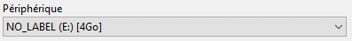
 
On pourra déjà sélectionner le périphérique. Le périphérique c'est l'endroit où l'on va installer. C'est ce qui correspond à notre clé. Attention à ne pas nous tromper, de ne pas installer cela sur un disque externe qui serait brancher en USB.

Vérifier que la lettre afficher dans la périphérie correspond bien à notre clé USB.

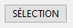

Ensuite un petit bouton de sélection pour sélectionner le fichier ISO.

* Système de Partition

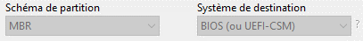
 
Pour le schéma de partition, on a le choix entre MBR et GPT.

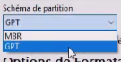

Pour le système de destination, on peut choisir UEFI.

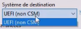

Il faut savoir qu'on a un système, un type de partition pour nos disques. Via un logiciel de partitionnement, on peut néanmoins voir plusieurs parties. Par exemple, une partie réservée pour Windows, une partie pour des données, etc.

Le système ancien (venant de IBM) c'est le MBR, c'est un système très ancien qui fonctionnait avec les ordinateurs et les besoins d'époque. C’est-à-dire, un certain nombre de partition bien précise avec un maximum. Une capacité de disque dur maximum supporté. Le MBR ce n'est pas plus plus de 2TO pour un disque et ne permet pas de récupérer des données corrompues, etc.

Par la suite est arrive le système de partition GPT qui va prendre en charge des disques de plus de 2TO pour ceux qui ont des disques de plus de deux TO sur nos pc fixe. C'est beaucoup plus courant à notre époque.

Pour les systèmes plus modernes pour tout ce qui BIOS et UEFI qui sont des noms parfois peu connus.

Quand on démarre son pc, on nous propose un menu avec la touche F2, échappe ou la touche sup. pour démarrer le BIOS et d'accéder à un menu, c’est-à-dire avant même le démarrage du système. 

Voici le genre d'interface qui nous apparaît :

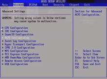
 
Cette interface est propre à un BIOS, c'est une version historique du programme d'initialisation. C’est-à-dire qu'il va se lancer avant même que se lance nos système Windows, Linux, etc. C'est propre à la carte mère de notre ordinateur. 

Pour les gens qui ont un système un peu plus moderne, on peut retrouver ce genre d'interface.

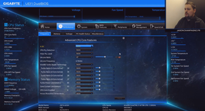

Malgré cela, il y a encore des interfaces textuelles avec déplacement uniquement au clavier.

Néanmoins les constructeurs indiquent quand c'est UEFI ou BIOS. SI c'est un UEFI textuel, il sera indiqué. Et pour le BIOS, il sera indiqué BIOS tout court.

Pour faire simple, si on est sur un vieux système, ce sera un BIOS. On aura pas mal de choix à l'installation. Au niveau du système de partition MBR ou GPT conviendront. 

Par contre le vieux système de partition MBR ne fonctionnera pas sur les disques de plus de 2TO et il ne fonctionnera pas non plus avec les vieux matériels qui fonctionnent en UEFI. Si on a un pc assez moderne qui est soit en UEFI, soit avec un système 64 bits, soit avec un disque sur lequel on va installer notre Windows ou notre Linux fait plus de 2TO, il faudra être en partitionnement GPT obligatoirement.

A l'achat, il y a beaucoup de chance que le disque soit déjà formaté avec ce format-là. Si par exemple, on est en MBR sur un UEFI, il risque d'y avoir quelques petits soucis.

    Quel type de partitions sur mon disque ?
    - Système 32-bits + disque dur <= 2To : MBR
    - Systeme 64-bits + disque dur <= 2To : GPT (recommandé), ou MBR

    - Système 32-bits + disque dur > 2To : GPT
    - Système 64-bits + disque dur > 2To : GPT

    (!) MBR ne prendra pas en charge un disque de + de 2To
    (!) Sur UEFI, remplaçant du BIOS, Installation sur disque GPT.

En gros, il faut savoir que lorsqu'on dit qu'un disque MBR ne prend pas en charge un disque dur de plus de 2 To. Si on a un disque de plus de 2To et qu'on veut installer notre système Windows ou Linux, la question ne se pose pas, il faut partir sur du GPT. Pareil sur UEFI, le MBR sera compatible mais le GPT est recommandé.

Il permet par exemple de récupérer des données corrompues sur un disque. GPT a quelques sécurités supplémentaires et en termes de nombre de partitions, il permet d'en avoir beaucoup, ne nous diront pas illimité mais nous n'arriverons jamais au nombre de partition possible sur un format GPT alors que le MBR est quand même limité, on ne peut pas en faire autant que l'on veut.

On sait comment choisir maintenir même si l'idéal est de choisir GPT partout. Si par exemple, on a acheté un vieux PC à l'époque et que tout est déjà en MBR, ce n'est pas grave. Il n'y a pas l'obligation de formater le disque pour changer le type de partition en GPT parce qu'il va falloir sauvegarder nos données, etc. Voilà ce n'est pas forcément très pratique.

* Vérifier le type de partition

Pour vérifier le type de partition. Il y a DiskPart et Gparted sur Linux.

Pour Windows, il suffit d'aller dans un menu qui permet de voir nos disques.

Ouvrez "Créer et formatez des partitions de disque dur" sur Windows et cliquez dessus pour faire apparaitre une fenêtre "Gestion des disques". 

On commence par s'assurer de ce qu'il y a comme type de partition sur le disque dur.

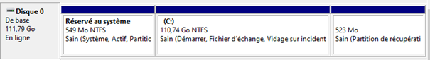
 
On sélectionne notre disque et par un clic droit on accède aux propriétés du disque.

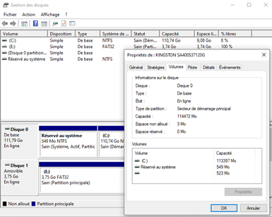

A coté du type de partition, on devrait pouvoir vérifier le type de partition. Par exemple Jason a une carte mère en UEFI et un disque dur d'un peu moins de 2To. Il faut l'associer avec le bon système pour qu'il n'y ai pas de problème.

L'idéal pour résumer, c'est le GPT parce que le MBR n'est pas compatible partout. Du moins ça présente pas mal d'inconvénient par rapport au GPT. 

* Nom du volume

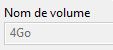
 
Le nom du volume peut être changé. On peut mettre ce que l'on veut.

* Type de fichier

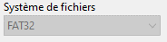
 
Le système de fichier qui est mis par défaut c'est le FAT32 qui passe partout.

Le NTFS, ce n'est que pour du Windows. Normalement si on propose un ISO Linux, il ne doit pas nous proposer du NTFS pour le formatage. On parle ici du type de fichier qui serra par défaut pour la clé USB qui serra formater.

Il est recommandé de virer les données que l'on a sur la clé USB avant de s'en servir. 

* Démarrer

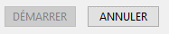
 
On fait démarrer une fois que l'on a toutes les bonnes options.
Une fois l'installation terminée, une indication apparaitra, il n'y aura plus qu'à faire les logiciels.

Retirer enfin la clé USB en toute sécurité. La démonter proprement que ce soit sur Windows ou sur Linux.

C'est tout ce qu'il y a faire pour que notre clé bootable soit prête.

## UNetbootin
Pour UNetbootin, c'est pareil.

 
On cache d'abord "DisqueImage" et on clique sur les 3 petits points à droite et on va sélectionner notre fichier ISO.

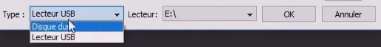
 
Ensuite on vérifie que le lecteur est bien le bon. On peut différencier Disque dur et lecteur USB. Il faut bien vérifier la bonne lettre et on fait OK.

## INSTALLATION

Avant l'installation sur un disque, il faut toujours sauvegarder ces données. C'est la base. On peut faire une mauvaise manipulation en effaçant le mauvais disque, la mauvaise partition. Si on n'a pas sauvegardé ces données personnelles, tout risque d'être perdu.

Au démarrage du pc, le souci peut être de savoir comment faire pour que le disque dur démarre sur notre clé USB. Ce qui est embêtant, c'est lorsqu'il démarre un système déjà installé.

On veut démarrer sur notre clé bootable, là où l'on a mis notre ISO. 

La première chose à faire est de démarrer sur notre BIOS ou notre UEFI selon la marque de notre carte mère. Il faut appuyer sur F2, F8, certains c'est F9, Certains c'est échappe, del ou encore sup. Il n'y a pas de touche universelle pour tous.

Une fois sur le BIOS, il y a deux choses à désactivé qui pourrait éventuellement pourrait rentrer en conflit lorsqu'on installe un Linux par exemple. 

Il faut commencer par virer le "Secure boot", il faut chercher dans les menus (sur internet par rapport à notre carte mère).  ET passer si possible en mode "UEFI CSM" qui permettra de rendre plus compatible le démarrage sur des périphériques externes et notamment la clé USB qui peut ne pas être reconnue et notre système ne peut pas alors booter dessus. Il ne peut pas lancer notre clé USB et du coup démarrer une installation. 

Une fois que ces deux choses sont bien désactivées, bien configurer dans notre UEFI. On enregistre, souvent avec la touche F10, c'est la même chose pour BIOS, UEFI.

On redémarre notre ordinateur à nouveau, et avec la touche F5 (suivant les cas), on a accès à un "boot order", c’est-à-dire un ordre de démarrage. Quand on choisit ce boot order, ça nous affiche une liste avec tous les périphériques que l'on a pour choisir la périphérie avec lequel on va démarrer. 

On ne pourra pas se tromper car si on est en installation normal (notamment BIOS, MBR), on sélectionne ce qui correspond à notre clé dans cette fameuse liste.  On aura un nom qui permettra de l'identifier dans la liste.

Si on a par contre choisi de créer une clé pour faire un boot en UEFI, on verra le nom de notre clé avec un petit USEFI quelque part. 

Si on est en MBR partionnement pour un BIOS, ce sera un démarrage normal sur notre clé.

Si on est en UEFI, en GPT, il faudra bien cocher, démarrer sur notre clé en mode UEFI.

Si on essaye d'installer un mode BIOS sur un UEFI ou l'inverse, le système ne bootera pas. Le système ne pourrait pas être reconnu au redémarrage, etc.

Lorsqu'on crée une clé de boot, ça reste un minimum technique. Avant 2010, on n'a pas forcément de UEFI, ni de "Secure boot". Ça peut poser un problème plus sur Windows que sur Linux. On a vu ça avec Windows 8. C'est assez ancien et ça dépend du matériel, on a des carte mère différentes, de disques durs différents qui partionner ou formater différemment selon les cas. Il faut ainsi voir ce que l'on a comme matériel pour faire l'installation 