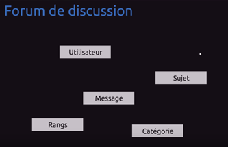
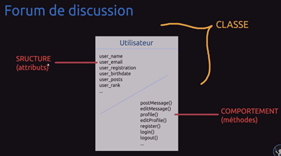
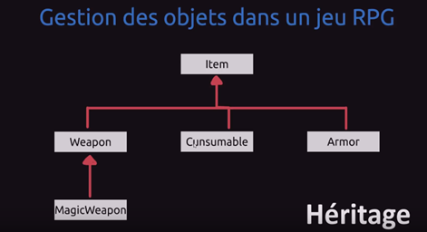
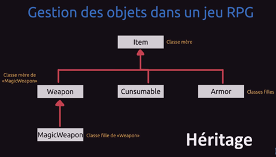
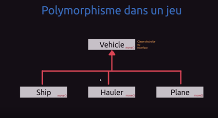
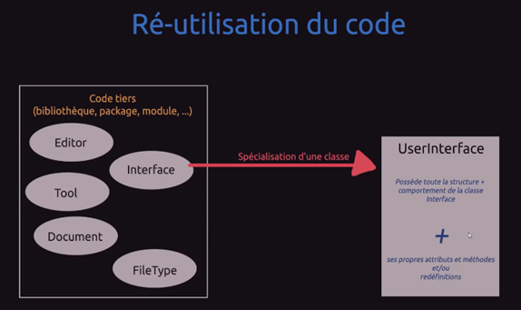

# [AIDE - programmation orientée-objet](https://youtu.be/5j5z9BJCAW8)
@https://github.com/jasonchampagne/FormationVideo/tree/master/Ressources/Aide

## Paradigme = façon de coder. 

Par exemple :
* Programmation impérative = décomposition en instructions.
* Programmation procédurale = décomposition du problème par rapport à des fonctions (factorisation de code).
* Programmation oriente objet (POO) - programmation objet.

Dans un paradigme  -> Problème de base : (paramètres) -> suite d'instructions => Résultat.c

## Programmation oriente objet.

On se base surtout sur les paramètres.

Contient de la programmation impérative et de la programmation procédurale parce que on utilise des fonctions et des procédures. En effet, au lieu de répéter du code et un ensemble d'instruction, on fait de la factorisation de code dans des fonctions.

A noter, qu'on peut faire de la programmation procédurale sans jamais faire de POO.

### divisé un problème en entités, classes (avantage de ce paradigme).

Factorisation de codes -> fonctions/procédures (On les différencie du fait que l'une ou l'autre, retourne un résultat ou pas).

Le problème de base est divisé en sous-partie. Exemple : Lorsqu'on développe un Forum pour un site web, on risque vite de s'emmêler les pinceaux malgré plusieurs fichiers et des fonctions pour éviter les répétitions. C'est pour ça qu'on a inventer la POO.

La première question à se poser : De quoi est compose un forum ? C'est composé d'entités et de concepts : Utilisateur, Sujet, Message, Rangs, Catégories.

<!-- 
	+---------------------------+
	|Forum de discussion		|
	|							|
	|	Utilisateur				|
	|					Sujet	|
	|		Message				|
	|Rangs						|
	|			Catégories		|
	+---------------------------+
-->
	
En effet, le forum de discussion va gérer des utilisateurs, c'est une entité propre à notre forum.

Toutes ces idées s'appellent des classes. Les objets de programmation seront la génération de ces classes. 

### Relation entre ces différentes entités.

Dans un forum, il y aura des catégories dans lequel il y aura des sujets que les utilisateurs pourront créer. Dans chacun des sujets, les utilisateurs pourront poster des messages. Enfin, la relation entre les utilisateurs et les messages, les sujets et les messages, cet. Ces utilisateurs fonctionneront avec un système de droit via des rangs (administrateurs, modérateur, utilisateurs standard). 

### Liste d'entités non exhaustive.
Par exemple, on pourrait avoir une classe qui va gérer la messagerie du Forum, une autre classe qui gérerais les paramètres du Forum ou encore une autre classe totalement isoler qui ne me soit pas une entité propre. Ou encore une classe qui afficherait le nombre de messages par page. Ainsi "Utilisateur, Sujet, Message, Rangs, Catégories" ne sont pas forcément des entités propres mais peut être simplement des concepts, des idées.

### Créer un modèle, une classe User.

<!-- 
	Forum de discussion
	+---------------------------------------------------+  +
	| 				CLASSE Utilisateur  				|  |
	+-----------------------+---------------------------+  |
	| STRUCTURE (attributs)	| COMPORTEMENTS (méthodes)	|  |
	+-----------------------+---------------------------+  |
	| user_name				| postMessage()				|  |
	| user_email			| editMessage()				|  |-- > CLASSE
	| user_registration		| profile()					|  |
	| user_birthdate		| editProfile()				|  |
	| user_posts			| register()				|  |
	| user_rank				| login()					|  |
	| ...					| logout()					|  |
	| 						| ...						|  |
	+-----------------------+---------------------------+  +
  -->
On prend l'exemple d'une de ces classes et on crée un modèle.
Classe = modèle de conception (calque, moule). Un humain est forme sur un modèle génétique. 

Ainsi on commence par définir des variables et des fonctions.

#### On définit une CLASSE : utilisateur.

* Les variables d'une classe, en programmation objet, sont composées d'ATTRIBUT, de propriétés.
* L'ensemble des variables (et attribut) forment la STRUCTURE de cette classe. Exemple d'attributs : user_name; user_email; user_registration; user_birthdate; user_posts; user_rank; ...

#### On définit un COMPORTEMENT pour cette utilisateur (= service que peut faire un utilisateur).

Les services que peut rendre un utilisateur s'appelle les METHODES. Ce sont les termes utilisés pour définir une fonction de classe. Les termes ici font la différence avec les fonctions utilisées en procédurale.

Exemple de méthodes : postMessage(); editMessage(); profile(); editProfile(); register(); login(); logout(); ...

#### On créer une INSTANCE de classe (= OBJET, classe a qui donne vie grâce à son comportement). 

C'est pourquoi on parle de programmation oriente (=qui va vers un) objet. A partir d'une classe, on va générer un objet. Avec une nouvelle instance, on crée un nouvel utilisateur qui suivront le même modèle mais avec des objets identiques sauf si on fait des objets clones. Ils seront capables de se comporter différemment selon une liste de fonctions qu'ils sont capables de faire.

A partir d'un objet, on peut accéder à sa structure, ses attributs et permettre à cet objet de faire des choses. En programmation procédurale, il faudrait créer des structures avec d'autres variables pour schématiser ce fonctionnement. C'est moins pratique de créer un forum de discussion avec de la programmation procédurale.

En effet, on ne pourra pas forcement réunir tout ce qui concerne une CLASSE utilisateur au sein d'une même boite. Ce sera plus contraignant à faire évoluer par la suite. La programmation objet à son avantage de pouvoir t'assembler tout dans cette boite utilisateur qui possède sa structure et son comportement.

### Principe de la logique.

Une INSTANCE de classe, un OBJET, classe a qui donne vie grâce à son comportement. Chaque fonction serra reliée, à l'intérieur de classe spécifique et logique. Quel est la logique d'avoir une section forum qui pourrait se connecter au forum.

Ce principe d'objet permet de définir, de diviser sous forme de partie, d'entités, de concepts et de relier les méthodes et les attributs de manière logique et cense à chacune des classes qui correspond.

Pour un utilisateur, c'est logique de se connecter au forum.

### Variable.

Un objet est créé dans une variable et on crée une instruction d'affectation dans la liste d'instruction concernant le paradigme impératif. Ensuite on affecte un nouvel objet avec tous les paramètres définis dans la classe (nom, âge,).

	variable = nouvel Utilisateur(nom, âge) # affectation d'un nouvel objet. La variable contiendra ainsi l'instance.

	tom = nouvel Utilisateur(tom, 17) # Par exemple, tom est un nouvel utilisateur avec ses différents paramètres.

On peut ensuite accéder à ses différents attributs.

* Pour lui dire quoi faire.

	tom -> faire_ceci()
	tom -> faire_cela()

* Pour afficher les paramètres.

	afficher : nom de tom()

### Principe de la PO.

Créer un modèle de conception. Lui donner quelque chose de concret, lui donner vie. En lui donnant une instance et donc en produisant un objet. On peut produire plusieurs objets bases sur le même modèle.

On définit une seule fois cette classe dans un code. Ensuite à partir de cette classe, dans autant de variables que l'on veut, on peut créer autant d'instance de classe. C'est à dire, plusieurs objets. Chacun de ces objets seront différents.

Par exemple, un donjon (mode, utilisateur, etc.) peut être schématisé sous forme d'objet dans un jeu RPG. On peut avoir une classe de donjon et instancier un donjon.

### Principe de l'héritage (avantage de ce paradigme)

Ecrire un langage est loin d'être compliqué. Ce sont les notions, les concepts qui sont important à maitriser.

L'héritage est un concept de la programmation objet, écrit avec une syntaxe différente suivant le langage de programmation. 

<!-- 
	+-------------------------------------------+
	| Gestion des objets dans un jeu RPG		|
	| 											|
	| 				  Item						|
	| 				  ^							|
	| 				  |							|
	| +---------------+---------------+			|
	| |				  |				  |			|
	| Weapon		  Cunsumable	  Armor		|
	| ^											|
	| |											|
	| MagicWeapon								|
	| 											|			
	+------------------------------ HERITAGE ---+
  -->
La Gestion des Objets dans un jeu RPG (jeu de rôle) est une manière de schématiser un personnage avec plusieurs classes. Il peut évoluer avec des niveaux, utiliser des objets, ramasser des objets, tuer des monstres, faire des donjons, etc.

En PO, il n'y a pas forcément une seule classe pour les objets. On peut optimiser, décomposer ce qu'est un objet. L'objet est une classe qui se composé de sa propre structure, son propre comportement.

Grace à l'héritage, on peut créer des objets spéciaux. C’est-à-dire des objets qui possède tous cette classe item dans sa structure et son comportement, avec des choses éventuellement en plus. On crée donc des classes en plus (Weapon, Cunsumable, Armor). Ces classes auront tous les attributs/variables que possède la classe item mais peut être avec d'autres choses. Par exemple, on peut mettre une puissance d'attaque sur Weapon mais pas sur Cunsumable ou Armor ou le simple Item de base. C'est comme ça qu'on peut encore créer d'autres classes, une classe d'arme magique MagicWeapon, c’est-à-dire une sorte d'arme mais avec des attributs en plus et un comportement supplémentaire (des méthodes en plus).

<!-- 
	+-------------------------------------------+
	| Gestion des objets dans un jeu RPG		|
	| 											|
	| 				  Item (Classe mère)		|
	| 				  ^							|
	| 				  |							|
	| +---------------+---------------+			|
	| |				  |				  |			|
	| |			  Cunsumable	  Armor	(Classes filles)
	| Weapon									|
	| ^	(Classes mère de "MagicWeapon")			|
	| |											|
	| MagicWeapon								|
	| 	(Classe fille de "Weapon")				|			
	+------------------------------ HERITAGE ---+ 
-->
L'arme n'est pas une armure, l'arme n'est pas un consommable mais ils sont tous déjà basé sur un même modèle.

Weapon est une classe fille de base pour la classe Item mais une classe mère de MagicWeapon.

Voilà qui définit un autre avantage de la programmation objet qui ne serait pas possible de faire en procédurale.

	Avantages de la programmation objet.
		La possibilité de divisé le problème en entités, en classes.
		La possibilité de spécialiser les classes avec le principe d'héritage.
	
### Principe de Polymorphisme (= généricité du code).

<!-- 
	+-------------------------------------------------------+
	| 			Polymorphisme dans un jeu					|
	|														|
	| 				Vehicle (Classe abstraite ou Interface)	|
	|					move()								|
	|					^									|
	|					|									|
	| +-----------------+-------------------+				|
	| |					|					|				|
	| Ship				Hauter				Plane			|
	|	move()				move()				move()		|
	+-------------------------------------------------------+
  -->
#### Classe abstraite ou Interface.

Ce qui est intéressant, c'est que nous allons avoir un véhicule mais nous n'allons jamais en créer dans notre exemple de jeu. On ne créera jamais d'objet, d'instance de cette classe véhicule. C'est ce que l'on appelle une classe abstraite ou interface.

Certains langages de programmation ne proposent pas les interfaces, ils peuvent avoir les classes abstraites ou les deux.

Pour un véhicule de base, on a une méthode move() pour se déplacer mais on ne dira pas comment ce véhicule se déplace puisqu'on ne va jamais créer de véhicule de base. Tout ce que l'on peut savoir en regardant le comportement de ce véhicule de base, c'est qu'il peut se déplacer.

#### Classe concrète.

On peut créer des classes plus spécifiques, concrètes (Ship, Hauler, Plane).

Ce sont des véhicules de base qui ont aussi une méthode pour se déplacer, c'est de l'héritage. Ils ont forcément accès à cette méthode.

Le principe, c'est de redéfinir cette méthode en disant comment le véhicule se déplace. On va implémenter cette méthode move() en disant que un navire, une charrette ou un avion se déplace de telle manière. Chacune des classes filles se déplace à leur manière.

Donc, on a une seule méthode de base "abstraite" que l'on définit concrètement dans chacune des classes filles. Au moment où dans le jeu vidéo, on va vouloir faire déplacer notre véhicule. Notre programme sera exactement quelle méthode utiliser. En effet, on génère un code abstrait avec des parties concrètes qui ensuite à l'exécution de notre programme de jeux, adoptera le bon comportement. Un navire ne se déplacera pas en volant sauf si on lui attribue une classe fille pour qu'il vole.

### Principe de la réutilisation du code

<!-- 
	+---------------------------------------------------------------------------------------+
	|									Ré-utilisation du code								|
	|																						|
	| +-------------------------------------+												|
	| | 		Code tiers					|	Spécialisation d'une classe					|
	| | (bibliothèque, package, module, ...)|	|											|
	| | 									|	|		+-------------------------------+	|
	| | 	Editor							|	|		| 		UserInterface			|	|
	| |					Interface ----------|---+---- > |								|	|
	| |		Tool							|			| Possède toute la strucure +	|	|
	| |										|			| comportement de la classe		|	|
	| |		Document						|			| 		Interface				|	|
	| |					FileType			|			|								|	|
	| |										|			|			+					|	|
	| |										|			| ses propres attributs et 		|	|
	| |										|			| méthodes et/ou redéfintions	|	|
	| +-------------------------------------+			+-------------------------------+	|
	+---------------------------------------------------------------------------------------+
-->
Par exemple sur Python, on utilise parfois du code que nous n'avons pas développez, c’est-à-dire les modules natifs de Python ou des classes de Python (Quand on utilise un entier, on crée une instance de Integer).

On peut prendre un code tiers (bibliothèque, package, module, …) qui contient différentes classes (Editor, Tool, etc.) créé par des développeurs. 

Par exemple, la classe native PDO en PHP permet de gérer les bases de données en PHP pour lequel on a juste besoin de connaître les méthodes, comment je me connecte à une base de données, faire des requêtes, etc. C'est le cas pour n'importe quel module, bibliothèques, etc.

Par exemple, la bibliothèque SDL en langage C. On ne regarde jamais le contenu de la bibliothèque. Même si ce n'est pas un objet, la bibliothèque peut être tout à fait modulé. Elle est ensuite utilisée en procédural mais il existe des bibliothèques pour gérer l'interface en 2D qui fonctionne sur la base objet, avec plusieurs objets.

On peut utiliser soit une bibliothèque, un paquet déjà créé dans son code soit utiliser le principe de l'héritage sur des classes que l'on n'a pas inventé à la base. Par exemple, dans le code tiers, on peut se contenter de la classe Interface ou lui ajouté personnellement des attributs et des méthodes en plus. On crée ainsi une nouvelle classe UserInterface qui va hériter de la classe Interface de base auquel on ajoute ce que l'on veut. 

Cette classe UserInterface possède toute la structure + comportement de la classe Interface parce que c'est une classe fille. 

Mais on va pouvoir aussi créer ses propres attributs et ses propres méthodes et plus ou moins redéfinir des méthodes qui existent déjà. Si dans Interface, il existe déjà une méthode pour afficher, on peut redéfinir une nouvelle méthode pour afficher. C'est la redéfinition d'une méthode.

La redéfinition de classe, c'est de spécialiser un comportement. On va toujours prioritiser ce qui a été redéfinis au plus bas dans les classes filles. Si dans la classe fille, rien n'a été définis, on remonte vers la classe mère, classe de base.

### Principe d'encapsulation.

On part du principe que chaque classe est indépendante. Un utilisateur a ses propres attributs, ses propres comportements. Il n'est pas souhaité qu'un message OU un autre programme puisse accéder à la date de naissance d'un utilisateur.

Le principe d'encapsulation est de créer une méthode qui permettra de récupérer une date de naissance. Pour récupérer la date de naissance, il faut créer une méthode capable de la récupérer. Cela permet de respecter le principe du respect des attributs.

Ces attributs sont privés et ne peuvent être accéder que par l'intermédiaire de méthode.

De simples méthodes permettent d'interdire certaines classes ou certaines parties du code d'accéder à certains attributs. Par exemple,

* La lecture d'un rang n'est pas visible parce que l'utilisateur l'as passé en privé. On pourra autoriser l'accès à certains attributs par le biais de fonctions. Enfin, on en revient aux principes de bases en programmation impérative (conditions, boucles, affectations, lecture de variables, etc.).
* Accéder à l'interface administrateur d'autres forums en vérifiant le rang pour permettre l'accès au panneau d'administration.

## Conclusion.

Il faut éviter de commettre l'erreur d'abandonner la programmation procédurale et impérative pour ne plus faire que de la programmation orienté objet.

En réalité, on a toujours besoin d'utiliser des fonctions, des conditions. A titre d'exemple, si on a besoin de l'adresse IP des utilisateurs, il suffit d'utiliser une fonction pour la récupérer. Il est totalement contre-productif pour les programmeurs de créer une classe qui possède une seule méthode pour récupérer une adresse IP. Créer une classe avec une seule méthode dedans ne sert à rien. Pas besoin d'instancier un objet qui prendra un peu plus en mémoire et en ressource.

Pour les nouveaux programmeurs, il faut éviter le piège d'abandonner certains paradigmes pour en privilégier d'autres. En effet, le bon programmeur est celui qui sait manipuler tout qui connaît un maximum de paradigmes et d'outils, etc. Et qui sait les utiliser le bon moment, à bon escient.

C'est la différence entre le bon programmeur et le mauvais. Le mauvais programmeur ferra tout en procédural ou en objet sauf s'il n'as pas le choix du paradigme.

Un bon programmeur utilisera le bon programme dans un langage multiparadigmes. Par exemple, les entités d'un forum sont assez lourdes à gérer, on les fait donc en objet. Ensuite, les configurations et les paramètres peuvent être gérées avec des fonctions dans un fichier à part que l'on puisse ensuite charger dans une classe. Il n'y a pas besoin de créer une classe pour la configuration d'une classe.

Pour tel partie de ce projet, on travaille en objet et pour tel autre partie assez rapide avec peu de choses, on peut le faire en procédurale.

La programmation objet n'est pas toujours la meilleure façon de faire. C'est juste une autre manière de concevoir, de penser la programmation avec tout des avantages que l'on ne retrouve pas en programmation procédurales mais dans de nombreuses circonstances, programmer en procédurales fera gagner plus en performance, sera plus rapide, sera plus pratique, sera plus lisible.

Il faut réfléchir lorsqu'on travaille sur un projet à manier l'ensemble de manière astucieuse, de manière intelligente. On aura toujours besoin de procédurale car déjà la méthode d'un objet est déjà une fonction.