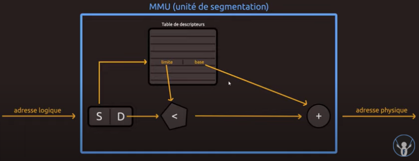
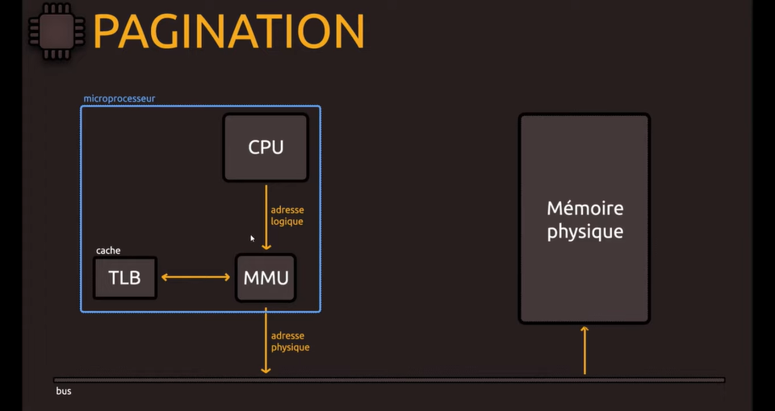
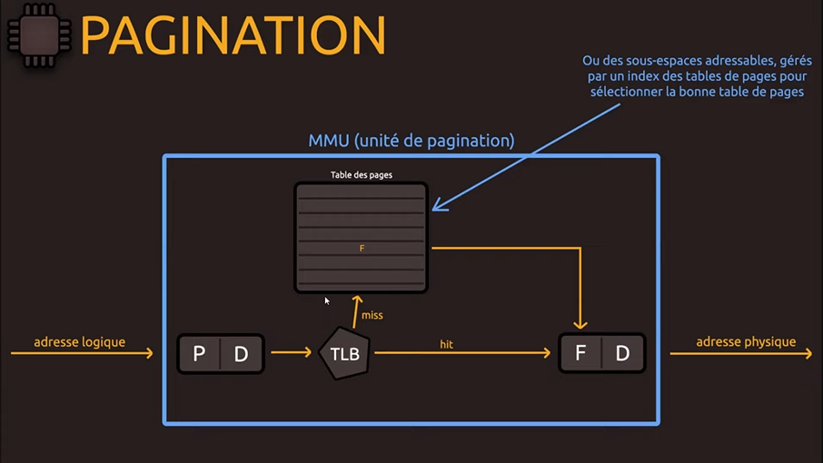
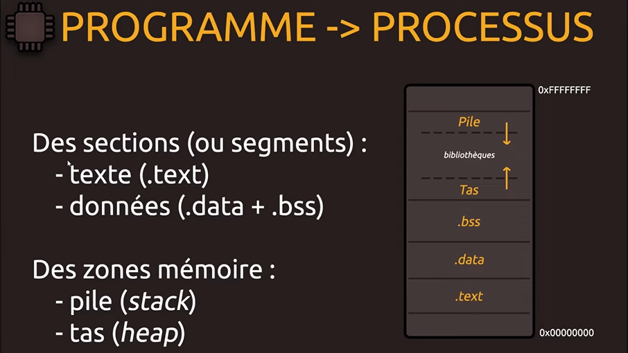
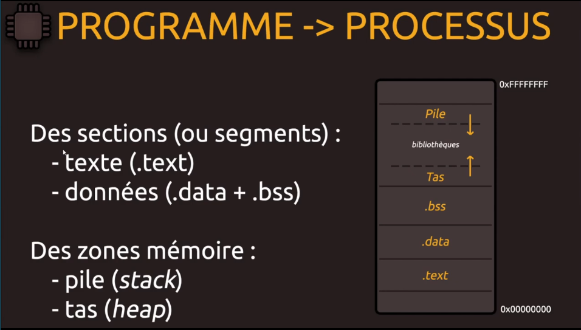
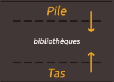
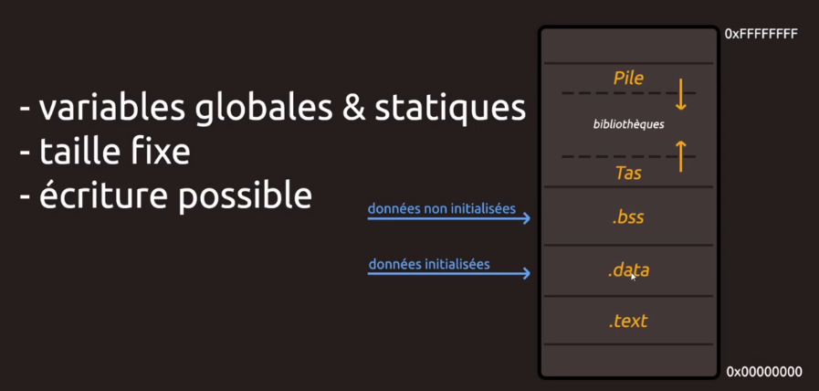

# [Mémoire virtuelle](https://www.youtube.com/watch?v=B1wJJNITvkY)

> Pour palier au manque de mémoire physique, et avec les besoins en ressources toujours croissants de nos applications, un procédé de mémoire virtuelle (géré par la MMU) existe pour proposer un espace d'adressage logique pour les processus.

## Mémoire virtuelle

Dispositif d'adressage fictif, qui offre aux programmes un espace mémoire isolé et permet un contrôle des accès à la mémoire physique

## Ce que l'on vous dit...

C       : int data = 145;  
Python  : data = 145  
PHP     : int $data = 145;  

> stocke un entier (145) dans la mémoire de l'ordinateur (RAM) ?

## En réalité !
(on a jamais accès à la mémoire physique même en asm !)
```
int data = 145;     --> Mémoire virtuelle (dite logique)
                    \           | ???
                     \          V
                      X Mémoire physique
```
## Mémoire virtuelle

```
Processus P1    -> Mémoire virtuelle    -+
                                         |-> Mémoire physique
Processus P2    -> Mémoire virtuelle    -+
```
## Mémoire virtuelle

Quelle taille pour chaque espace ?
32 bits: 4 Gio (adresse 0x0000000 à 0xFFFFFFFF)
64 bits: 256 Tio (0x000000000000 à 0xFFFFFFFFFFFF)

> 1 Go = 1000 Mo
> 1 Gio = 1024 Mio

```
2^32 = 4 294 967 296 - 1 = 4 294 967 295 octets
4 294 967 295 / 1024 = 4 194 304 kibioctets
4 194 304 / 1024 = 4 096 mébioctets
4 096 / 1024 = 4 gibioctets pour notre espace en 32 bits

2^64 = 18 446 744 073 709 551 616 - 1 = 18 446 744 073 709 551 615 octets
18 446 744 073 709 551 615 / 1024 = 18 014 398 509 481 983,9 kibioctets
18 014 398 509 481 983,9 / 1024 = 17.592.186.044.415,9 mébioctet 
17.592.186.044.415,9 / 1024 = 17 179 869 183,9 gibioctet
17 179 869 183,9 / 1024 = 16 777 215,9 tébioctet 
16 777 215,9 / 1024 = 16 383,9 pébioctet
16 383,9 / 1024 = 16 exbioctet => aucun programme ne nécéssite autant de mémoire. Pourtant les fournisseurs propose des unités d'adressages de 64 bits, c'est du gachis donc tout ces systèmes-là propose un espace d'adressage de 48 bits au lieu de 64.

2^48 = 281 474 976 710 656 - 1 = 281 474 976 710 655 octets
281 474 976 710 655 / 1024 = 274 877 906 943,9 kibioctets
274 877 906 943,9 / 1024 = 268 435 455,9 mébioctet
268 435 455,9 / 1024 = 262 143,9 gibioctet
262 143,9 / 1024 = 255,9 tébioctet
```

Quels avantages ?
* chaque processus avec sa zone mémoire
* peut être supérieur à la mémoire physique (RAM)

## Mémoire virtuelle

    Mémoire virtuelle (exemple: 32 bits)
```
+-------------------+ 0xFFFFFFFF
|                   |
+-------------------+
|                   |
+-------------------+
|                   |
+-------------------+
|                   |
+-------------------+
|                   |
+-------------------+
|                   |
+-------------------+
|                   |
+-------------------+
|                   |
+-------------------+
|                   |
+-------------------+
|                   |
+-------------------+
|                   |
+-------------------+
|                   |
+-------------------+
|                   |
+-------------------+ 0x00000000
```

+ Au niveau de notre Processus, 145 (décimal), sur 4 octets "petit-boutisme".
```
Processus P1 ---------------> Mémoire virtuelle --------+
             int data=145;    +----------+---------+    |
                              |    -     |    -    |    |
                              |0x0000FE18|    -    |    |
                              |0x0000FE17|0000 0000|    |
                              |0x0000FE16|0000 0000|    |-> Mémoire physique
                              |0x0000FE15|0000 0000|    |
                              |0x0000FE14|1001 0001|    |
                              |    -     |    -    |    |
                              +----------+---------+    |
                                                        |
Processus P2 ---------------> Mémoire virtuelle --------+
```
## Mais alors...

Qu'est-ce qui pemet la liaison avec la mémoire physique ?

> L'Unité de gestion mémoire ! (MMU)

## Unité de gestion mémoire

* Intégrée au microprocesseur
* Protège la mémoire
* S'occupe de la "traduction" des adresses (virtuelles en physiques)

Deux mécanismes de traduction:
* segmentation
* pagination

## Segmentation
(n'est plus utilisé par nos systèmes actuels !)

Découpage logique en segments:
* numéro (sélecteur)
* déplacement (offset)

> Dans une architecture x86, la mémoire virtuelle est scindée en 2^16 segments de 2^32 bits (adresses de 48 bits)


S:sélecteur/segment  
D:décallage
Table des descripteurs/segments
<:test si on est bien dans les limite du segment sinon declenchement erreur/interruption matériel
+:si on est bien dans le segment, on effectue une addition qui permet de traduire en adresse physique qui est mis sur le bus puis stocker en mémoire centrale (la mémoire vive, la RAM, la mémoire physique de l'ordinateur).

Un segment, c'est aussi:
* un bloc de taille variable
* des droits d'accès
* un partage éventuel avec d'autres...

Mais:
* fragmentation externe

```
+---------------+
|   Segment A   |
|               |
+---------------+
|               | => Espace perdus !
+---------------+
|   Segment H   |
+---------------+
|   Segment B   |
+---------------+
|               |
|   Segment D   |
|               |
+---------------+
|               | => Espace perdus !
+---------------+
|   Segment K   |
+---------------+
+---------------+
```

## Pagination

Découpage en pages mémoire de **taille fixe** (au lieu de la segmentation variable):
* Cadre (frames) & pages
* taille de page définie par l'OS/processeur => Généralement, de 4 Kio (plus avec des modes étendus)
* correspondance des pages et cadres
* numéro + décalage

(cadre pour la mem. physique et page pour la mem. virtuelle => il peut y avoir plus de pages que de frames => un système de swaping et on mettra les choses qu'on utilise le moins dans une mémoire de masse comme le disque dur et chargera éventuellement ça en mémoire physique dés qu'on en a besoin pour fonctionner.)

(même système de couple avec non pas un numéro de segment mais un numéro de page + décalage.)



(Ici dans ce schéma miniaturisé le CPU envoi l'adresse logique et c'est lui qui communique après avec le processus, il fournit l'adresse logique à la MMU càd l'unité de gestion de mémoire. On parlera de système de cache après, et va permettre de fournir cette interface physique.)



(SI on zoome sur notre unité de pagination comme on a fait tout l'heure avec la segmentation, cette fois-çi on a une adresse logique avec notre numéro de page *P* et son décallage *D* et on va passer par un système de cache mais bien que pour la mémoire virtuelle, il n'aura pas été utile de détailler le système de cache, la segmentation et la pagination parce que c'est le système qui s'en charge.

Le système de cache enregistre des informations qui ont été utilisées récemment ou plus couramment et ça nous évite de refaire de la recherche de données si on avait déjà enregistrées ces données quelques part.

Si on retrouve notre information *hit*, on a ici la correspondance avec notre page physique *F*, le décalage *D* et on peut automatique retrouver ça en mémoire physique.

Sinon *miss* si on voit qu'on ne la pas dans le cache *TLB*, on va passer par une table des pages et on va retrouver la correspondances à cette page *P* et ce décalage *D* auquel correspond ce cadre, on garde le décallage parce qu'il va nous servir et la MMU va pouvoir traduire tout ça pour obtenir l'adresse physique.)


(J’ai également en remarque qu’on peut avoir d'autres systèmes parce qu'on travaille plus qu'avec une seule table de page, on peut aussi avoir une table d'étage avec un processus, et on peut avoir maintenant des sous-espaces adressables c'est à dire plusieurs sous espaces et on va avoir ensuite une grande table des pages et un grand index comme par exemple les sitemaps quand on fait un mapping des différents liens sur un site web, on peut avoir plusieurs fichiers sitemaps et on peut avoir un index et chaque fichier sitemap contient plusieurs url et on peut organiser ça comme ça.

Là c'est pareil on se retrouve avec un index de tables de page qui permet de trouver la bonne table de page où nous voulons aller et ensuite nous faisons la conversion c'est à dire la fameuse recherche pour obtenir la valeur du cadre F|D.

Voilà on détaillera pas tout ça mais il y a plein de algorithmes pour le système de cache et cetera qu'on ne détaillera pas dans cette vidéo.

Dans tous les cas que l'on prenne le système de segmentation, de pagination c'est pour *partir d'une adresse logique et traduire tout ça en adresse physique*.)

Une page, c'est aussi:
* des clés de protection
* pas de fragmentation externe
Mais... de la fragmentation interne !

(...avant risque de fragmentation externe et d'accéder à ce qu'il ne faut pas mais maintenant toutes les pages font la même taille et le risque est la pagination interne et c'est un programme, moins pire, mais parce que nous travaillons avec des pages fixes.)



Maintenant qu'on a un peu plus d'informations que vous comprenez un peu comment ça fonctionne pas, je peux compléter ce qui fait la traduction dans la mémoire virtuelle ? c'est la MMU.

C'est ce qui manquait et vous ne saviez pas trop ce qui faisait la liaison.

Et je voulais revenir sur le processus c'est à dire qu'on parle de processus donc notre programme est chargé en mémoire, on crée un processus mais au niveau du développeur cette fois ci on a quand même gardé certaines choses notamment au niveau de la segmentation d'accord au niveau des termes.



On va parler notamment de segment c'est à dire qu'ici au niveau d'un programme le chargeur charge et vous allez obtenir un certain nombre de sections, ça va permettre pour le développeur notamment si vous faites de la programmation en langage assembleur de pouvoir mieux répartir certaines choses et notamment quand vous allez faire de l'édition de lien, votre lieur va pouvoir par exemple rassembler les segments ou les sections au fait qui sont du même type.

Par exemple dire que toutes les sections qui sont du code ont les mets ensemble, toutes les sections qui sont des données ensemble et cetera et traiter ça or ce n'est pas forcément quelque chose d'obligatoire.

Vous pourriez par exemple écrire un programme en langage assembleur sans indiquer de section par exemple .text, .data, .bss mais bien sûr par habitude on le fait c'est aussi encore une fois pour le côté historique de la segmentation et parce que ça peut faciliter, ça peut apporter des fonctionnalités supplémentaires au niveau de nos éditeur de liens, de nos compilateur qui eux utilise ça càd qu'ils vont pouvoir ensuite utiliser des formats d'exécutables qui en fait contiennent des sections, différentes sections.

On va retrouver principalement 3 qui ne sont pas toutes-là.

Alors j'emploie le terme section principalement pour éviter de confondre segment parce que souvent quand on parle de segment, on pense à la segmentation sur le système de mémoire d'accord la gestion de la mémoire et on n'est pas du tout dans le même cas d'accord c'est pas du tout la même chose donc ici je parlera et surtout de section même si on va malheureusement devoir trouver ce termes aussi.

On retrouve le texte (.text), on retrouve les données (.data + .bss) et deux parties mémoire notamment la pile et le tas mais je vais le détailler.

Alors voici donc un processus avec son espace qui est segmenté.


Un processus avec son espace qui est segmenté dans lequel on trouvent les différentes adresses, pas de problème.

Vous allez avoir évidemment d'autres zones ici (en haut et en bas) mais je ne les ai pas étayé ça peut être de l'espace réservé, une partie aussi pour les données du noyau parce qu'on peut réutiliser certaines données du noyau en fonction mais ça nous intéresse pas ici.

On va retrouver .text là donc ça c'est au niveau de l'ordre des adresses, on a .data, .bss, le tas, la pile et éventuellement entre les deux dans cette espace-là qui est finalement aloué, c'est un espace libre on va retrouver les bibliothèques dynamiques.



On va en parler rapidement un petit peu de ses différents espaces.

## Section .text

* code (instructions)
* taille fixe
* lecture seule


La session text c'est tout simplement l'espace pour votre code càd que quand vous écrivez et on va parler du langage assembleur parce que c'est celui qui parle le plus, c'est pour ça aussi que je fais que j'ai fait cette vidéo d'architecture parce qu'elle va vous servir dans le cours langage assembleur pour comprendre un petit peu ces différentes sections.

Quand vous écrivez vos instructions d'accord ces instructions en langage assembleur, vous écrivez en fait du code.

Ces instructions vont être mises en fait dans cette section *.text* ce sera cette section-là concernée.

Ce sera donc en taille fixe et en lecture seule càd qu'une fois que vous avez votre code si vous le compiler d'accord et que vous produisez en fait votre programme, quand il va être chargé ce code ne change pas d'accord le code il ne va pas d'un seul coup rajouter des choses au code car c'est vous qui l'avez écrit.

Le code est tel quel, c'est quelque chose de fixe et on veut simplement le lire.

On va vouloir l'analyser pour pouvoir traiter ensuite exécuter l'ensemble en fait des instructions et on n'a pas besoin d'écrire dedans donc c'est cette partie là, c'est cette section.

## Sections .data ET .bss

* variables & statiques
* taille fixe
* écriture possible

On va retrouver ensuite les sections de données, on en a deux *.data* et *.bss* d'accord alors on va avoir ici les variables globales et les variables statiques.

D'accord c'est également un taille fixe même si on peut avoir la possibilité d'écrire alors c'est c'est par rapport au mode tel qu'il faut l'utiliser ici mais généralement on va faire que lire càd qu'une fois que les données sont écrites d'accord on ne va évidemment pas pouvoir d'un seul coup changer les variables d'accord on écrit les choses telles qu'elles sont.



Les données qui seront initialisées seront enregistrées dans la section *.data* et les données qui ne le sont pas d'accord seront enregistrées dans la section *.bss* donc ça notamment ça va être par exemple notamment tout ce qui est pointeur et cetera (.bss).

*.bss* d'ailleurs si vous avez suivi mes vidéos sur le langage d'assembleur on en a déjà fait un peu, on a retrouvé ces différentes sections mais je vous avais dit que l'on reviendrait un peu dans le détail dessus pour expliquer ce qu'elles sont réellement parce que je vous avais donné les noms mais pas forcément dit ce qu'on retrouvait dedans.

Maintenant vous savez en quoi ça consiste.

## PILE

* variables locales
* contextes de fonctions
* taille variable (limitée)
* remplissage vers le haut du tas

Et enfin on retrouve les deux autres cas, la pile et le tas.

La pile va permettre d'accueillir les variables locales d'accord et les contextes de fonction càd que quand vous faites un appel à une fonction, pas besoin d'arguments d'accord pour justement être appelée. Elle va avoir des variables aussi donc ces variables locales à elle donc ces variables locales à elles, ces informations-là seront enregistrées dans la pile.

Comprenez donc que la pile a une taille variable, c'est pour ça que d'ailleurs j'ai indiqué une flêche ici qui au fur et à mesure de ce qu'on va enregistrer dans la pile ça va s'agrandir.


ça va donc s'agrandir vers les adresses basse et on va donc se rapprocher du tas par contre c'est limité.

Ne voyez pas la pile comme un emplacement qui est extrêmement grand d'accord où on peut y mettre autant d'informations qu'on veut.

On fait donc attention à la pile c'est assez limité quand même, on ne peut pas non plus avoir 15 milliards de choses dedans.

## TAS

* allocations dynamiques
* taille variable (pas de limite)
* remplissage vers la pile

A l'inverse le TAS, à part une limite on va dire matériel d'accord vous n'avez pas vraiment de limites au niveau du TAS d'accord la taille est assez variable à ce niveau là.

La limite c'est simplement une limite matériel donc on considère généralement qu'il n'y a pas de limites puisque vu les tailles qu'on a maintenant au niveau de nos configurations, l'ordinateur n'est pas trop embêter avec ça.

Alors ça va conserner toutes nos allocations dynamiques voilà quand vous faites par exemple un malloc(), un free() en c, tout ce qui est pointeur et cetera même lorsque vous libérez les mémoires parce que c'est ça qui est important, le tas va changer. Il peut s'agrandir, il peut se rétrécir.


là vous voyez la pile bon évidemment quand on va avoir certaines exécutions on va retirer des éléments de la pile, il va y avoir en fait des éléments qui vont être lus depuis le haut de la pile mais le tas on comprend surtout davantage qu'on va avoir comme ça le tas qui va vraiment changer.

Plus le tas est rempli et plus il se rapproche bien sûr de la pile aussi.

Voilà un peu comment ça se passe.

## Maintenant...

...vous savez \o/

Et je pense que c'est tout voilà.


Voilà l'architecture c'est vaste, la segmentation en détails ne sert pas parce que c'est surtout la pagination qui est utilisée par nos système actuels.

Maintenant on sait comment fonctionne cette mémoire virtuelle et on sait que le fait de déclarer une variable dans un programme, on n'est pas en train d'enregistrer cette information dans la mémoire vive directement (mais enregistré de manière indirecte plutard).

Avec les pages ou les segments et bien si l'information n'est pas sollicité tout de suite, elle serra mis en swap donc mise par exemple sur le disque donc voilà.

Attention que les système continue d'évoluer...

Alors encore une fois le 64 bits, au niveau de leur architecture, sont prévues pour avoir un espace adressable de 48 bits maximum théorique, c'est ce qu'on a actuellement.

Le jour où ça ne suffira plus, et qu'il faudra un adressage complet en 64 bits, hé bien les constructeurs vont pouvoir ajouter d'autres transistors, des semi-conducteurs, bref rajouter tous les éléments nécessaires en plus pour pouvoir étendre l'adressage et finir avec un adressage de 64 bits càd qu'il ne suffira pas de réinveter qlq chose et ainsi nos systèmes sont déjà compatible.

Les processeurs que nous avons ont déjà été construit de tel façon.

A l'heure actuel, sortir un disque dur de 1 million de terraoctets serrait un gaspillage de coût et d'après les rumeurs, toutes les données internet prendrait un zetaoctet. Ne pas dépenser de l'argent pour ce qui ne serait pas utiliser... on a largement de quoi faire avec ces espaces.

D'ici là, on aura peut être d'autres système pour éviter le système de swaping avec nos capacité qui changerons parce que le but des mémoires c'est quand même d'avoir les accès les plus rapides possibles.

Les disques ça dépannent bien pour avoir les systèmes de Swap comme sur Windows, Linux et cetera mais si on pouvait tout avoir en **mémoire physique**, en mémoire beaucoup plus rapide voir même les registres mais on en parlera dans une autre vidéo, forcément ce serais beaucoup plus pratique.