# [Processeur](https://www.youtube.com/watch?v=2jFBKfXxeZw)

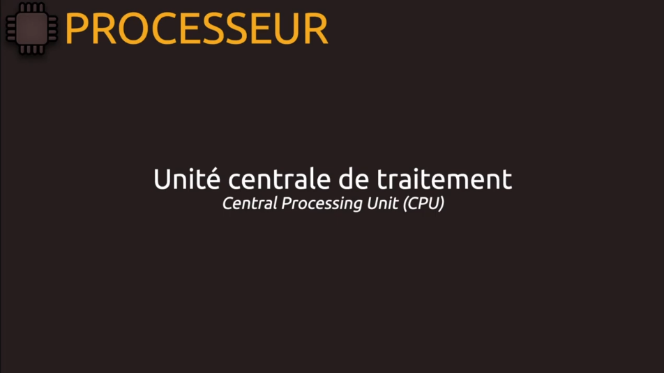  

Simple définition.
Pas seulement des calculs mais des traitements, des contrôles notamment.

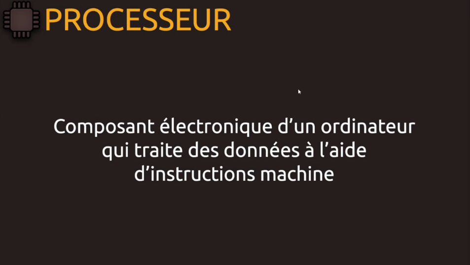  
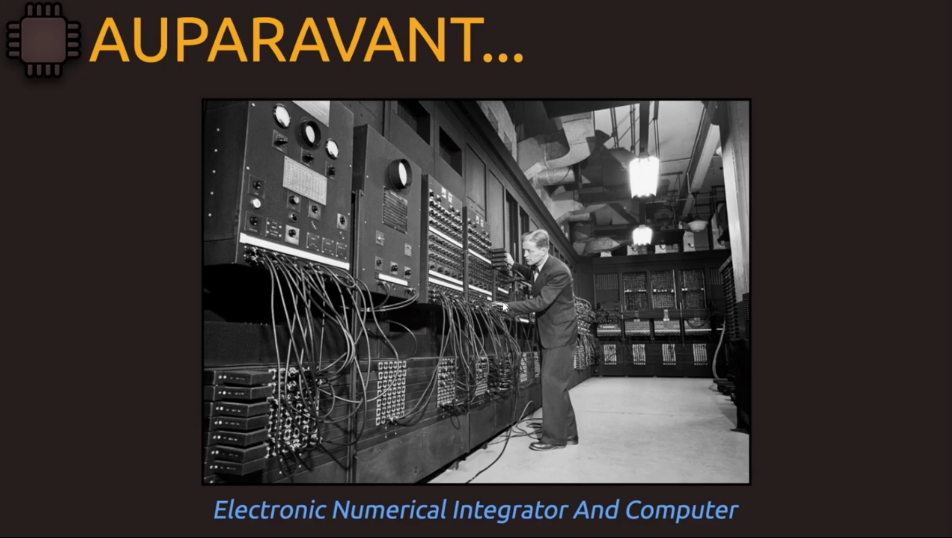 

Image de la fin de la 2e Guerre mondiale, 30 tonnes, dans 60 m².

Appareil qui comptait en nombre décimal.

Premier ordinateur électronique.

ENIAC est appelé un calculateur.

Il était programmé par 6 femmes.

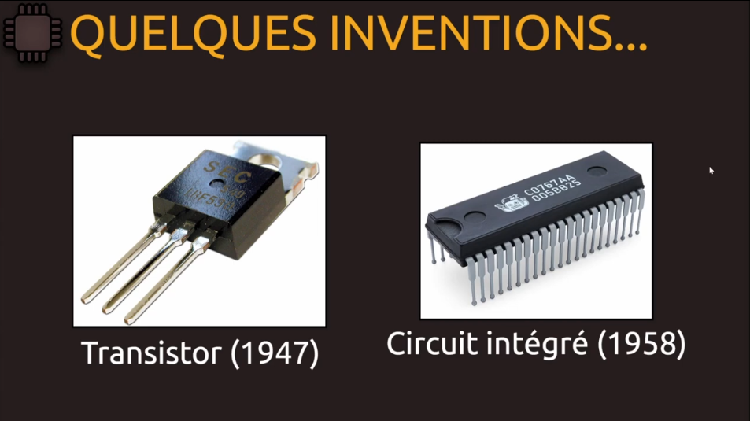 

Le transistor régule le flux de courant électronique.

Un circuit intégré regroupe sur une plaque de silicium plusieurs transisteurs.

Le tout est miniaturisé pour produire ceci :

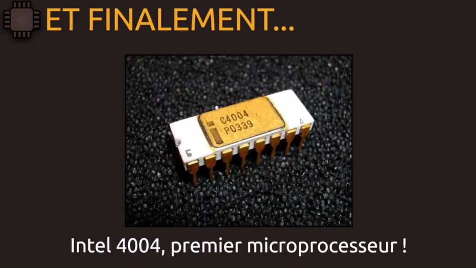 

En 1971, premier microprocesseur créé.

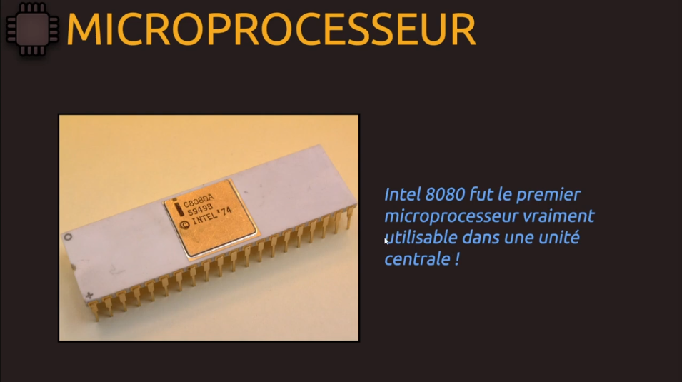 

En 1074, premier microprocesseur utilisable dans une unité complète.

Plus petit, plus rapide, plus fiable (moins de taux de pannes) d'où un usage plus étendues (usage de particulier).

Note : ENIVAC est un autre projet tel que ENIAC dont le programme était stocké dans sa mémoire càd pas un système de cablage comme ENIAC mais le stockage du programme dans la mémoire.

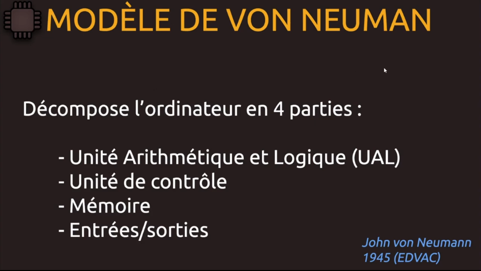 

Modèle présenté pendant le projet EDVAC. Ici la mémoire du programme est dans l'ordinateur et pas externe.

On a également la structure de Harvard qui séparait la mémoire pour les données de l'ordinateur était séparée de la mémoire des programmes.

On a une unité de calcul, une unité de contrôle pour séquencer les opérations d'un programme, la mémoire pour les données du programme càd les calculs à faire et ensuite les périphériques entrée/sorties.

Les données vont circuler via des chemin, des bus d'adresses, des bus de données et les bus de contrôle pour les types d'opération (écriture et lecture).

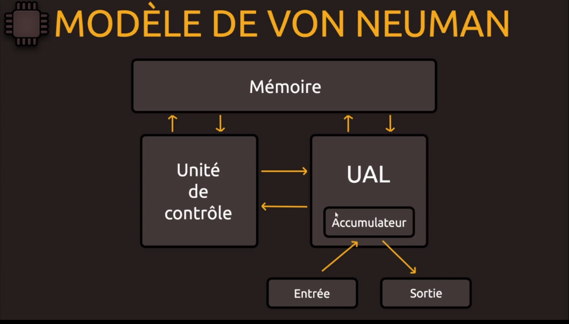 

Voilà un schéma de Von Neuman.

 

Ici des éléments qui vont nous aider à comprendre le fonctionnement d'un processeur.

 

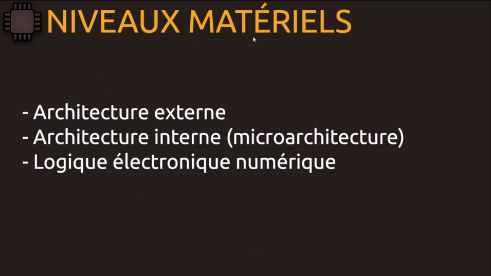 

Architecture externe concerne les programmeur et programmer en langage assembleur.

Architecture interne est ce qui est fait physiquement.

Et la logique électronique numérique est ce qui concerne les composant (circuits, etc.). Ce qui nous concerne moins ...

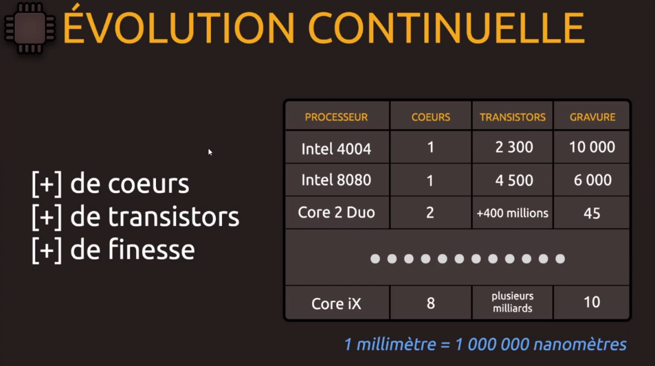 

** La gravure est en nanomètre, 45 c'est très petit ! Intel posséderais le record de finesse de gravure.

Le nombre de transistors rend le processeur plus complexe et donc plus d'opérations complexes.

Plus c'est fin, on tombe sur des problèmes quantiques.

 

Revenons au niveau du matériels.

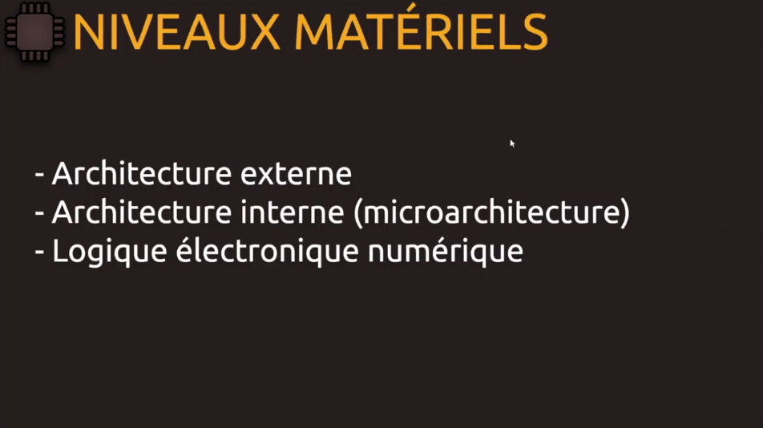 

On commence par la partie d'électronique numérique.

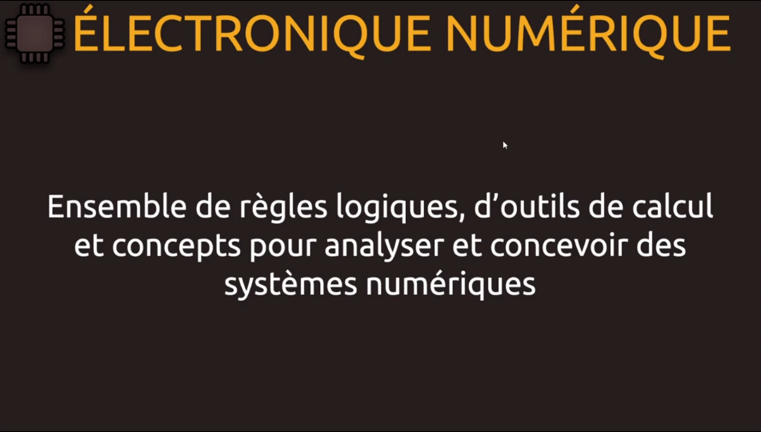 

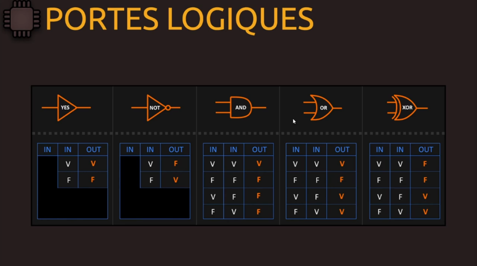 

Les portes logiques sont des circuits et ce font avec plusieurs éléments au niveau électronique.

Vrai, le courantt circule.

C'est important, nous n'avons pas fait pas d'algèbre de bool jusqu'à présent.

Avec toutes ces portes, on peut produire un additionneur ...

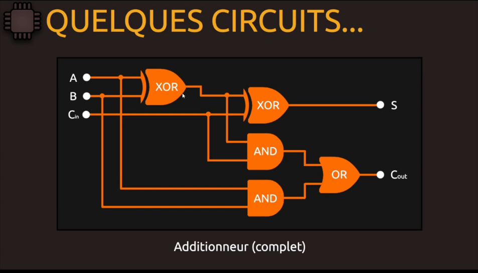 

Un additionneur avec un résultat avec S.

Cin et Cout si éventuellement, on a une retenue, si on a un débordement d'entier, si on a des calculs.

Graçe à cet assemblage, on peut créer des circuits complexes.

 

*Codeur/décodeur* : pour la conversion Bin->Décim ou Décim->Bin.

*Multiplexeur* : transport d'informations issues de plusieurs sources vers la bonne unité, le bon circuit. 

*Démultiplexeur* : une information a raccorder, l'envoyer au bon circuit.

*Bascule* : plusieurs bascules pour de la mémoire asynchrone, à de la données synchrones, à des données d'horloge (bascule T...).

Actuellement, on a beaucoup de bacules D dans les circuits.

*Compteur* : à chaque cycle, on ajoute 1 dans un circuit séquentiel.

*Registre* : mémoires de faibles capacités.

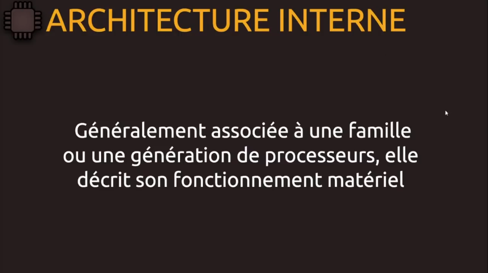 

Ce qu'on appelle CORE fait référence à une architecture interne.

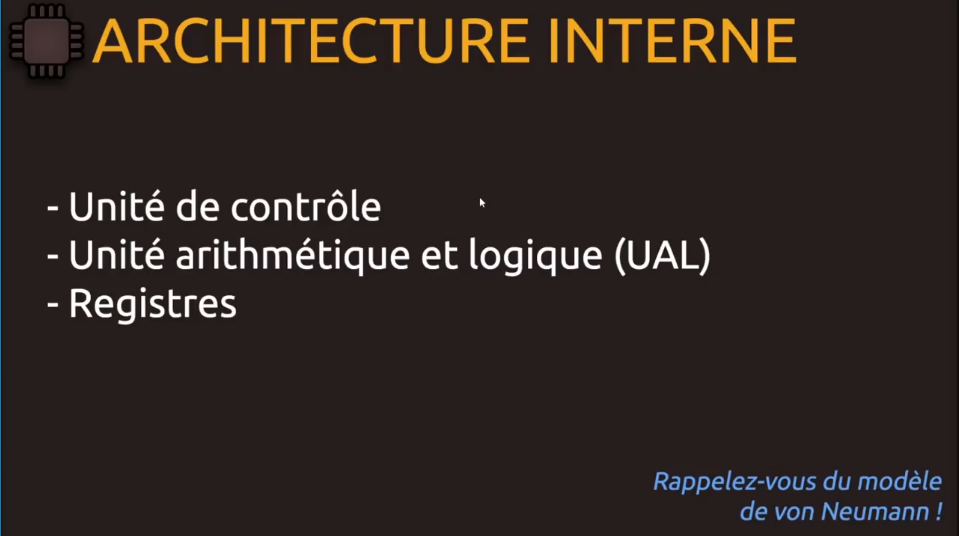 

Rappelez-vous que le processeur n'est pas seulement une unité de calcul.

Les ordis actuels n'ont pas qu'une UAL ...

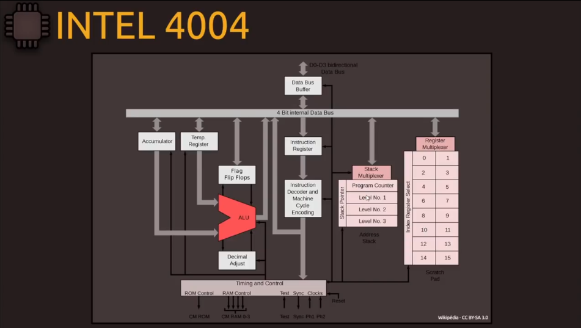 

Premier microprocesseur vu.

ALU, l'unité arithmétique et logique.

Buffer, mémoire tampon.

Multiplexeur sur pile, sur des registres.

Un Bus interne, différent du bus de données, les 3 types de bus donné tout à l'heure.

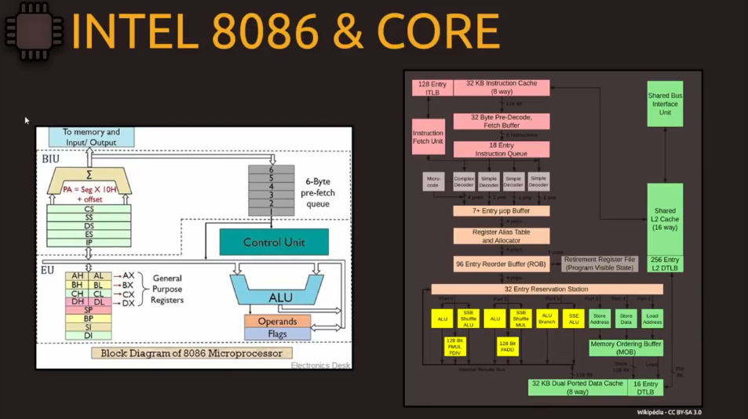 

Des ALU.

SSE, en ce qui concerne les unités à virgules flottantes.

Bus interne également.

Plusieurs autres composants, secrets de fabrication, etc.

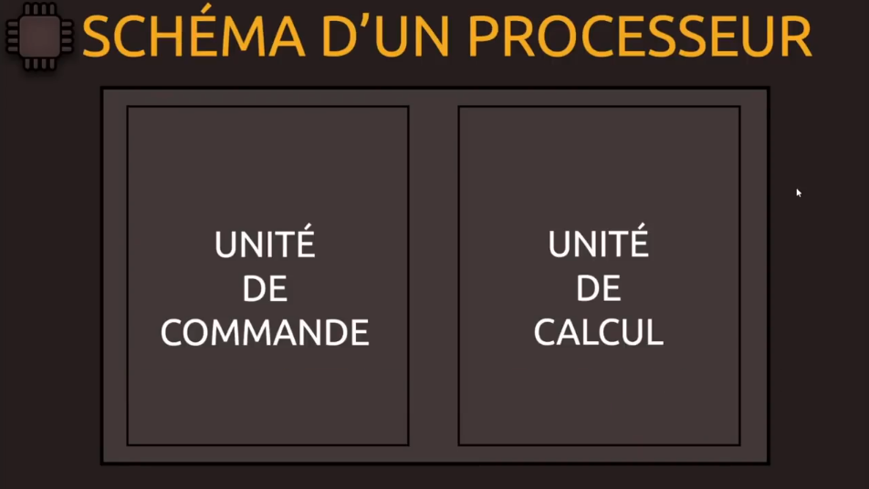 

Schéma simplifié.

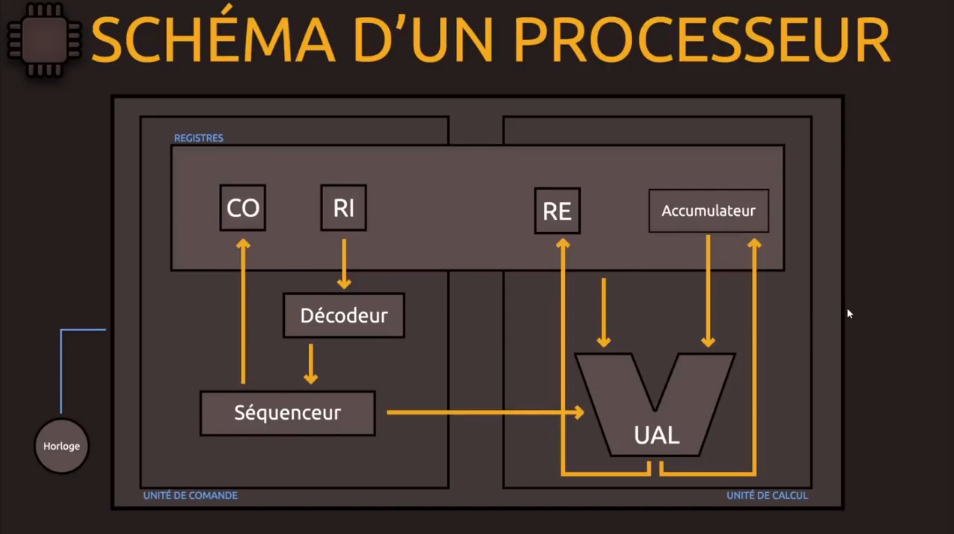 

Le minimum à connaître pour un processeur.

Les registres sont essentiels pour les deux unités.

CO, Compteur Ordinal. On peut voir également PC, Program Counter, IP ou PI pour Pointeur d'Instruction. Plusieurs noms. Registre qui contient l'adresse de l'instruction qui va être exécuté et qu'il faudra allé chercher en mémoire vive. 

Ce compteur est incrémenté à chaque instruction pour passer à l'instruction suivante.

RI, Registre d'Instruction, indique au décodeur comment identifier l'instruction à faire.

Le décodeur est un circuit (voir partie sur l'électronique numérique) qui va décoder toutes instructions càd l'opération à éffectuer et les opérandes càd les données pour éffectuer les instructions.

Le séquenceur, autre circuit, qui travaille avec le décodeur et génère des signaux et envoyer ce qu'il faut à l'unité.

Note : si c'est cablé, c'est rapide, mais micro-programmé est quelque chose de flexible.

UAL, Unité Arithmétique et Logique, fais les instructions et travail de calcul.

Accumulateur, contient les opérandes avant l'exécution et qui peut recevoir des résultats de l'UAL, et ce qui permet de ne pas travailler avec la mémoire vive, la mémoire central (barettes de RAM) et ainsi enchaîner les calculs. C'est plus pratique de stocker au sein du processeur pour enchaîner les calculs.

RE, Registre d'Etat, récupérer donnée particulière en cas de changement de l'état du processeur ou avoir un système d'avertissement. Il renseigne une interruption, il peut contenir des drapeaux, une retenue sur un calcul par exemple le CARY FLAG à 1 pour dire qu'il y a eu une retenue lors de la dernière opération. Eventuellement le mode de fonctionnement du système ou du noyau, protégé ...

 
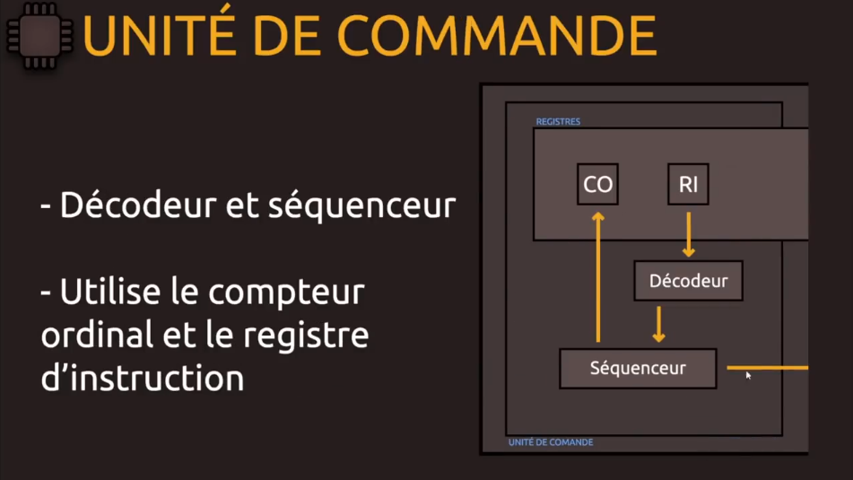 
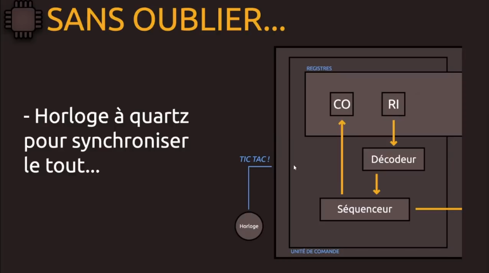   

L'horloge emet des impulsions pour synchroniser tout les éléments. C'est un oscilateur pour obtenir le cycle, coup d'horloge.

On essaye d'avoir des modèles d'ordinateurs sans horloge, càd asynchrones. Intéressant.

Au lieu d'avoir des impulsions qui synchronisent, les données communiquent entre elles comme on a des protocoles réseaux.

Le cycle CPU indique le temps d'exécution minimal pour le cycle, et le but est de réaliser le max d'instructions par cycle, coup d'horloge.

3 à 5 GHZ chez Intel (à voir) et avec les systèmes actuels, plusieurs milliard d'instructions par impulsion.

L'avantage de l'asynchrone est de faire des économies en termes d'horloge.

  

Ne pas travailler seulement sur des entier mais les virgules flottantes (SSE), pas toujours présent.

Pas de processeur sans UAL (voir le minimum essentiel).

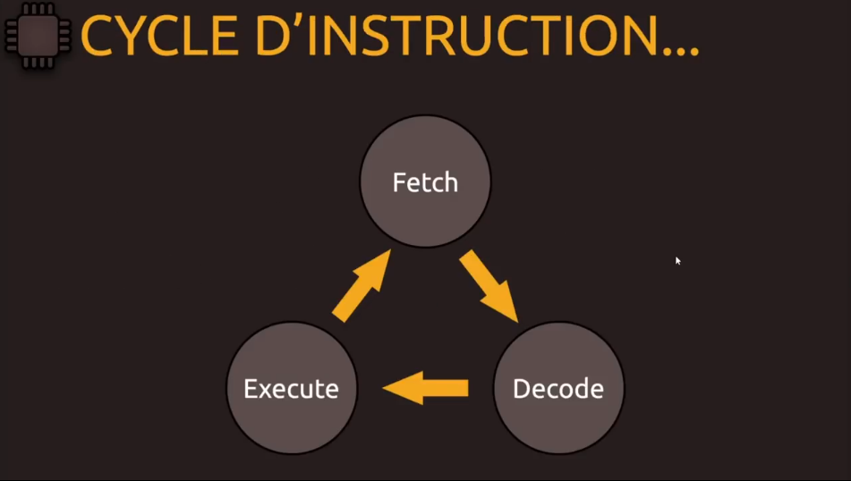  

Dérouelement d'une instruction.

Pdt un cycle CPU, 3 étapes.

Fetch, recherche puis le décodage et l'exécution.

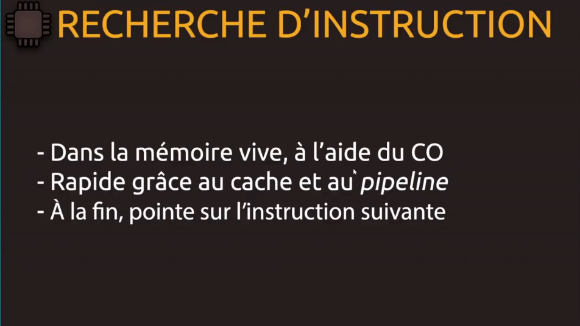  

Fetch, dans la mémoire vive à l'aide du compteur CO (pê besoin d'incrémenter le compteur ordinal).

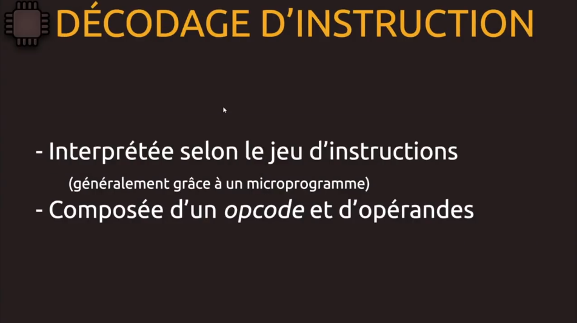 

Jeu d'instructions (important lorsqu'on fait du langage assembleur).

Décodage composé de opcode (=code opération) et opérandes (=informations sur lesquelles ont fait l'opération) ... découpage des éléments pour éfectuer l'instruction et envoyé le tout au bon composant. Voilà on a un calcul à faire donc on demande ça à l'UAL.

L'instruction sera interprêter selon le langage d'instruction.

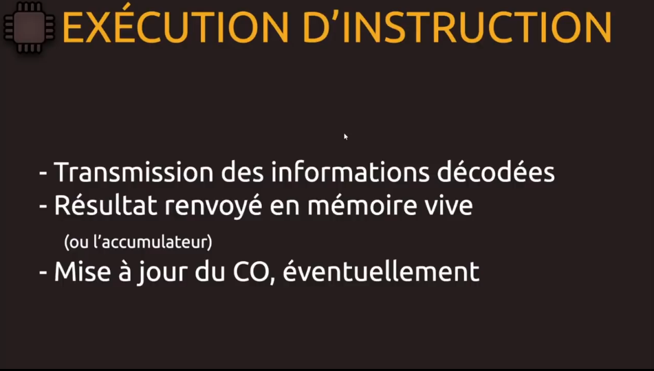 

Exécution, unité de traitement. UAL qui gère cette partie.

Pour éviter la mémoire vive (write back), utiliser l'accumulateur pour gagner du temps.

Màj CO pour passer à l'instruction suivante.

Voilà un sommaire pour améliorer nos 3 étapes d'instructions.

 

Sans traitement anticipé, 3 cycles pour réaliser une seule instruction.
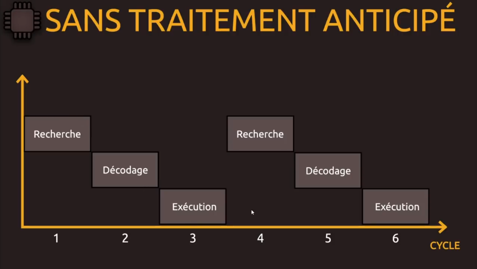 

On a un cycle CPU pour la recherche, etc.

Seulement attaquer une instruction au bout du 4e cycle.

Le Traitement Anticipé permet de d'anticiper et d'enchaîner la 2e instruction.

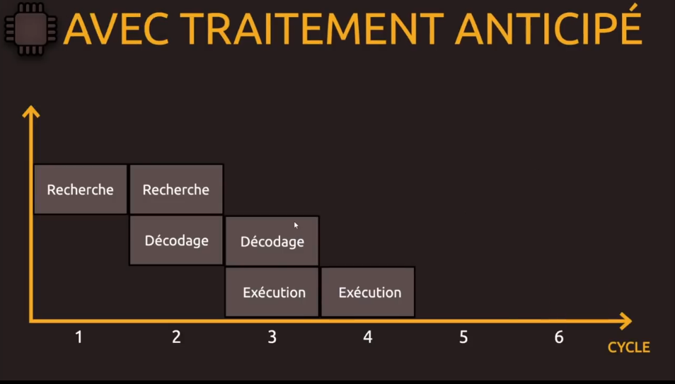  
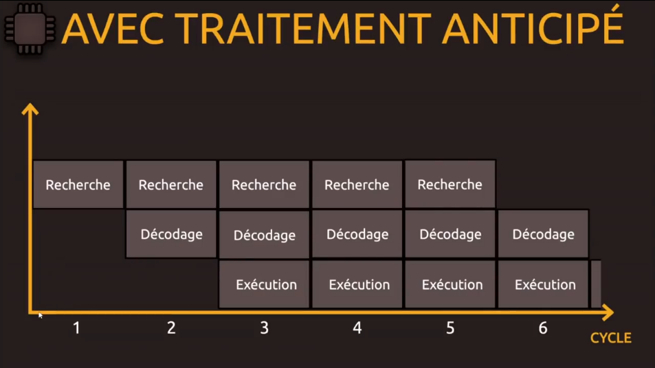  

Plus d'instructions avec le même nombre de cycles avec la technique du pipeline.

Mais il y a un problème ...

  

... on résout tout cela grâçe au Prédiction de branchement.

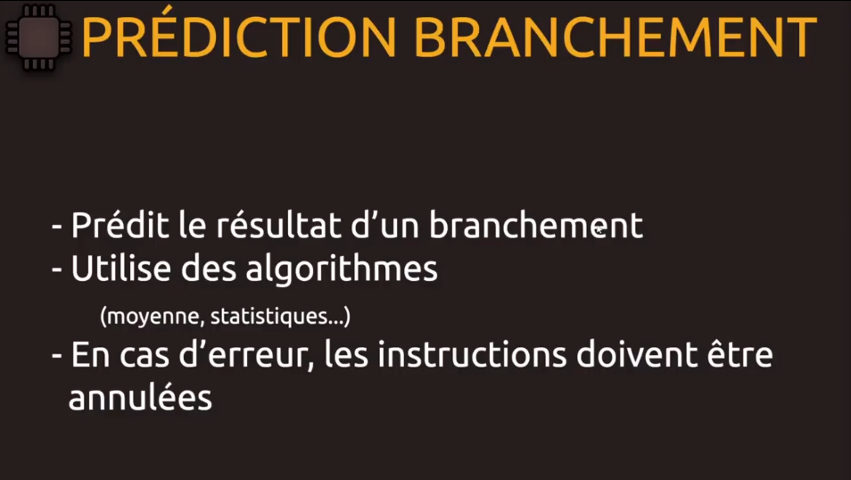  

On préduit statistiquement pour le bon suivi de la réalisaton de l'exécution, anticiper le résultat pour avoir le max d'instructions par nombre de cycle de CPU.

Ensuite nous avons ...

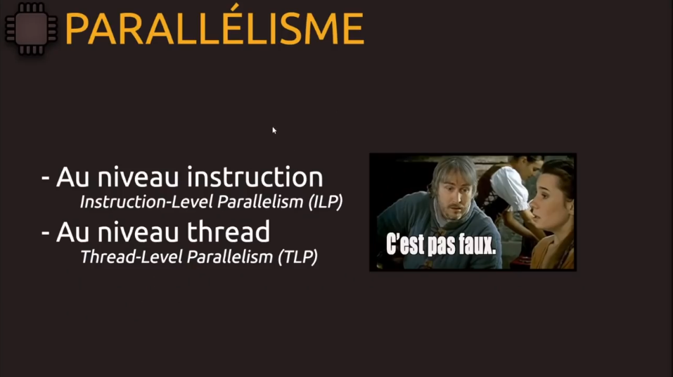  

Complexe mais 2 cas : ILP & TLP.

  

ILP est Pipeline amélioré.

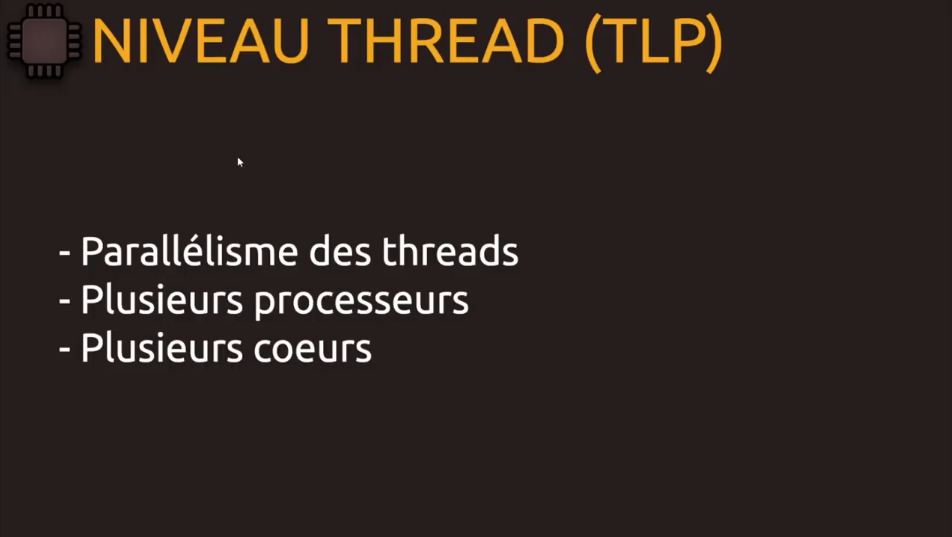  

Un threads est un processus léger, un fil d'exécution lorsqu'on a un programme pour réaliser plusieurs tâches en parallèles.

Au lieu d'un processeur ou d'un coeur, on en a plusieurs.

On a jusqu'à un processeur octo-coeur qui contient l'unité de traitement et de contrôle.

Voilà pour les différents éléments qui ont servi à optimiser tout ça.

Jusqu'à présent, on a parlé des ordinateurs, on a regarder comment miniaturiser tout ça pour obtenir un microprocesseur ainsi que le modèle utilisé pour un usage particulier.

On a détaillé les fonctionnements logiques, les circuits électroniques qui ont été mis en oeuvre pour produire la micro architecture et après comment on a obtimiser toutes cette micro architecture pour pouvoir enchainer cette exécution par cycle d'horloge des différentes instructions.

Maintenant la dernière partie concerne surtout les programmeurs.

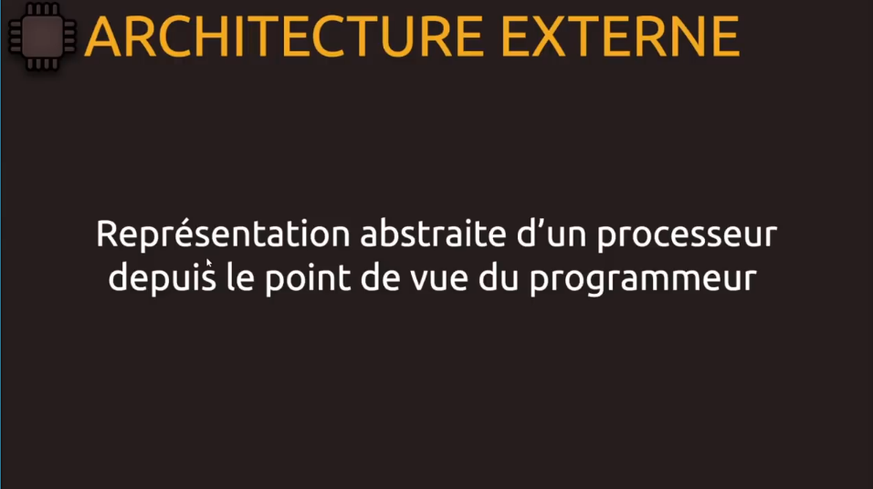  
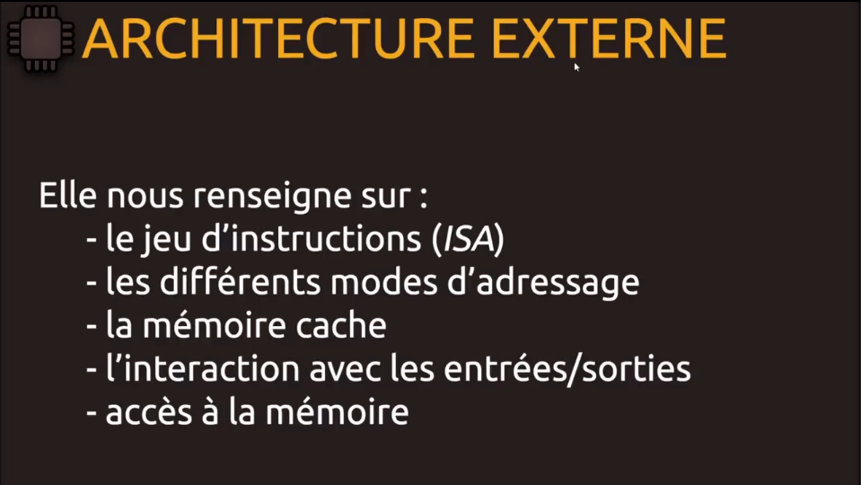  

ISA : Instructions Set Architecture

Accès à la mémoire vive, à la mémoire centrale pour récupérer les instructions ou à la mémoire des programmes.

Les E/S concernent surtout les gens qui font de l'embarqué pour l'architecture externe.
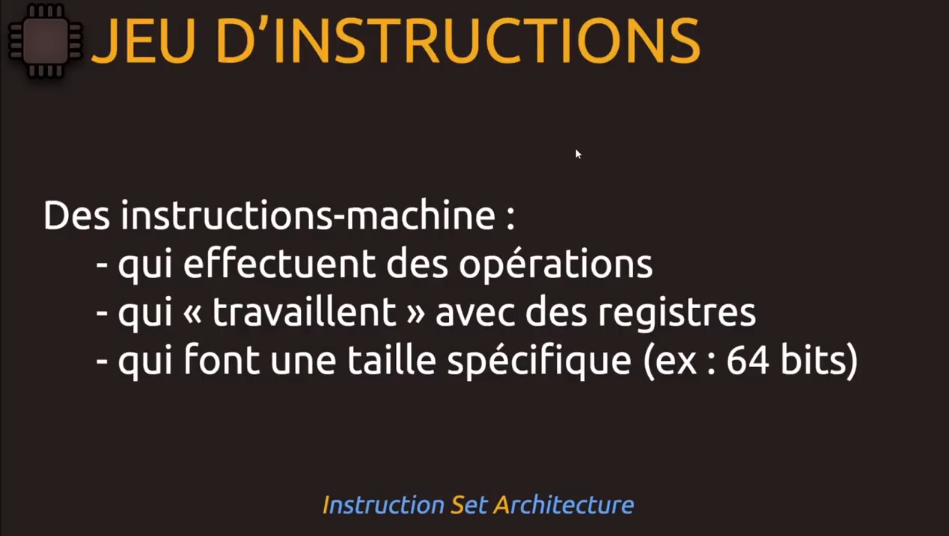 

Le jeu d'instructions c'est toutes les instructions-machine et se rappeler la définition du processeur "le traitement à l'aide d'instructions-machine".

On entend parler de langage machine, code machine pour le code en binaire et qu'on aborde en langage assembleur.

On fera une vidéo sur les registres.

Par exemple les instructions peuvent faire 64 bits.

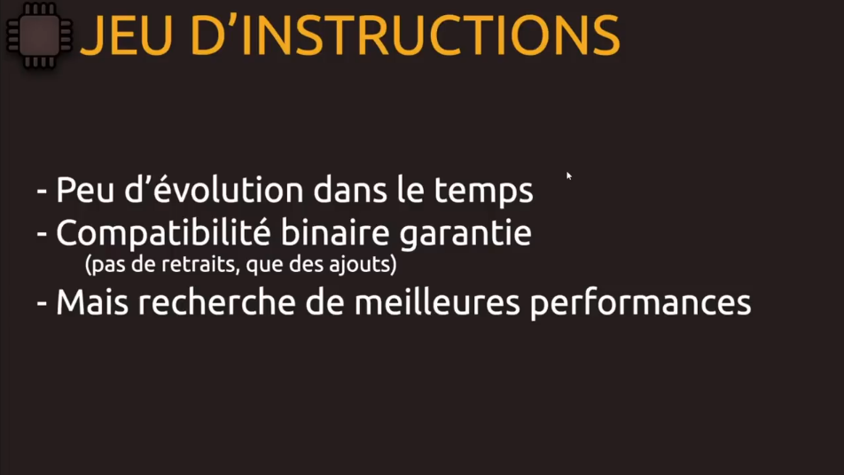 

Si on fait de l'assembleur X86, il a peu évolué mais qui est toujours compatible mais on recherche de meilleurs performances.

On étendra le code avec d'autres lignes par contre.

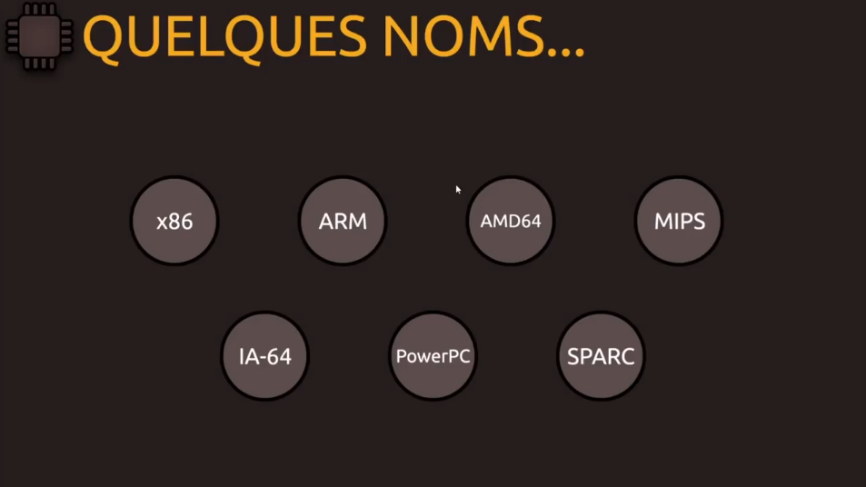 

MIPS, l'entreprise. X86 de chez Intel...

Pour assurer la compatibilité, on va avoir des architectures qui vont être étendues, par exemple l'architecture 64 bits est une extension du 32.

On ne poura pas installer un application 64 sur une architecture 32 car il nous manque un niveau d'adressage qui n'est pas sur notre architecture.

Comprenez la différence entre micro-architecture et l'architecture externe. Par exemple pour x86, on peut avoir pleins de micro-architecture qui évoluent très vite chez Intel, pareil pour AMD.

Pour x86, on peut retrouver plusieurs micro-architecture tel que le Pentium, le Intel, la microarchitecture Core, etc.

Le programmeur va utiliser les architectures externes pour programmer.

On classe cela par des familles.

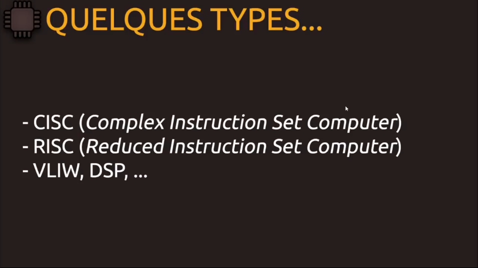  
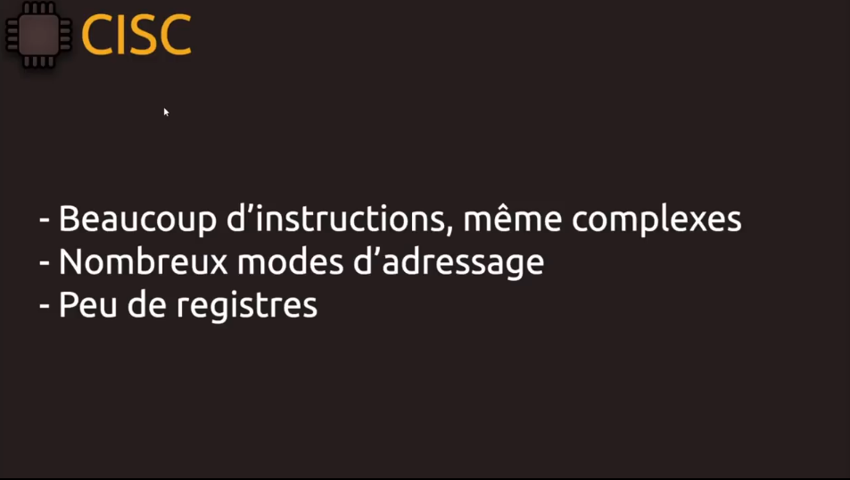  

CISC : Maximiser le nombres d'instructions sans pour autant avoir énormémént de registres donc plus de codes mais moins de mémoires. L'avantage on va pouvoir corriger nos instructions (avantage de pouvoir programmer dessus) par contre ce sera plus lent.

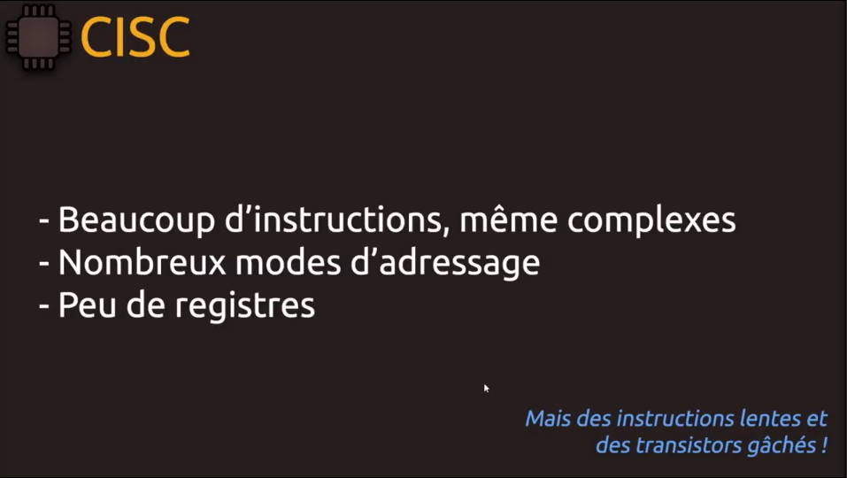  

On construit un temple pour ceuillir des fleurs, on gâche des transistors.

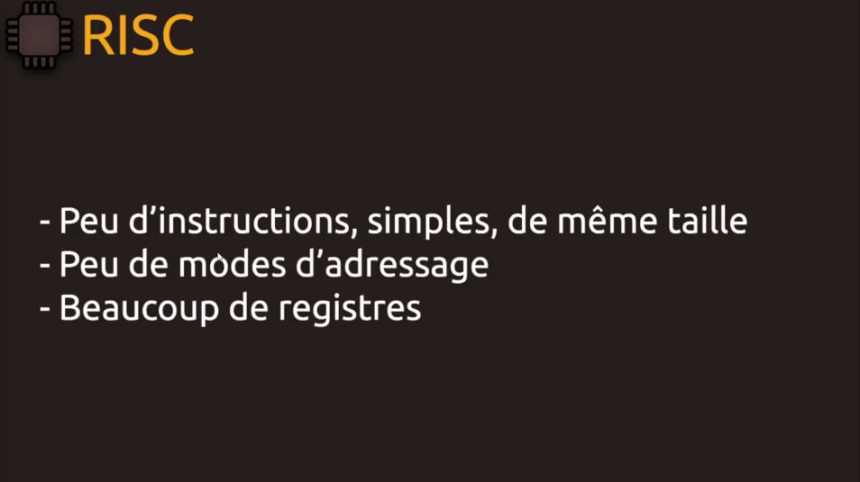  

Optimiser le nombre de registre.

Décodage et exécution plus rapide car cycle moins important par instruction.

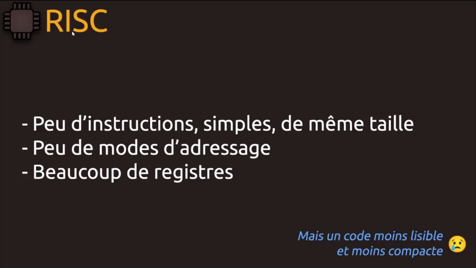  

Moins lisible car plus d'instructions à écrire. Moins d'instructions avec CISC mais on va écrire plus d'instructions avec RISC donc forcément la densité est moins importante, on va occuper plus de mémoire donc plus d'instructions à écrire.

On est sur un système load/store, on lit en mémoire (load) et ensuite on va écrire en mémoire (store) càd un système beaucoup plus simplifié par rapport à CISC.

Sur nos systèmes actuel, on prend le meilleur de chaque famille donc pas de processeur juste RISC ou CISC.

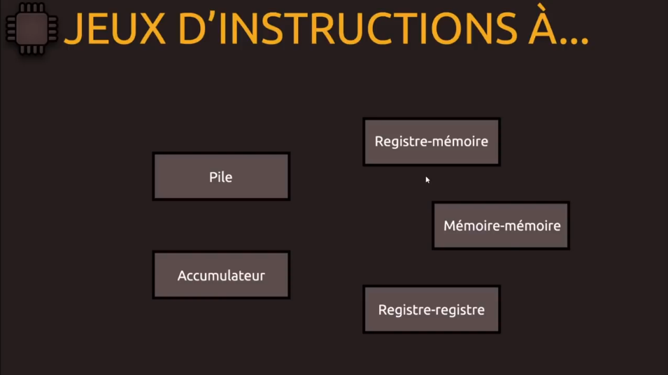  

Accumulateur pour enchainer plutot que d'utiliser la mémoire centrale.

Pour enchainer, on utilise également une pile.

Le système qui utilise la Pile ou l'Accumulateur qui rendent le code plus dense et donc l'information ne va pas pouvoir être utilisée la même information à plusieurs endroits différents.

C'est mieux de travailler avec ces autres jeux d'instructions :
- Registre-mémoire
- Mémoire-mémoire
- Registre-registre

Dans Registre-mémoire, notre instruction va avoir comme opérande, comme information pour traiter l'instruction un ou des registres donc on peut déléguer en travaillant avec un registre et la mémoire au lieu d'un accumulateur et une pile.

L'avantage des registres est qu'il va pouvoir être réutilisé alors que la Pile, la donnée se met par dessus et l'accumulateur viens écraser ce qui était avant donc tant qu'on éfface pas le registre, on peut relire l'information plusieurs fois.

L'accès au registre est plus rapide que l'accès à la mémoire centrale, dans ce cas, moins de densité de code mais une implémentation plus aisée car instructions plus simplifiées.

Plus d'instructions à écrire pour réaliser la même opération mais on travaille avec les registres donc intéressant.

On a moins de place dans les registres qu'en mémoire.

Plus la mémoire est petite, plus la mémoire est rapide.

Cas Mémoire-mémoire (plus lent) ne nous concerne pas car nos ordinateurs ont des registres et des processeurs.

On fait un mélange de tout ces jeux pour obtenir le meilleur.

On a ensuite ...

 
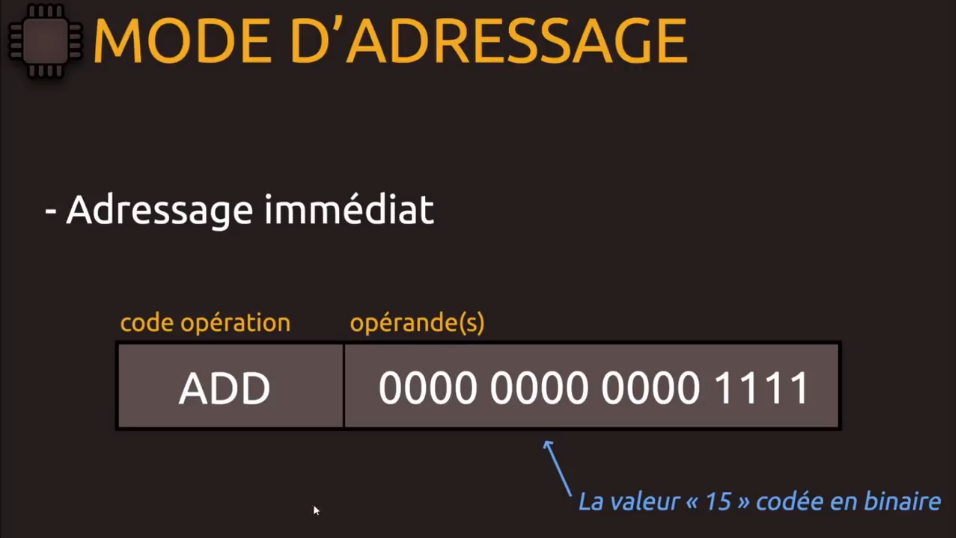 

Un mémonique permet d'écrire ADD au lieu de son équivalent en binaire.

L'adresse imédiat est plus rapide, la donnée est directement présente dans l'instruction.

ADD et 000 0000 0000 1111 représente toutes l'instruction et la donnée 000 0000 0000 1111 (opérandes)

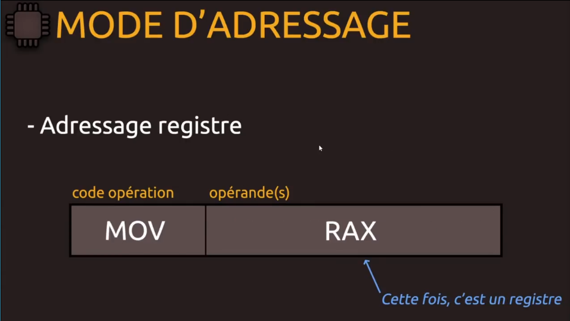 

L'opérande "RAX" n'est plus une information mais on a dans l'instruction une donnée qui fais référence au registre sur lequel on va travailler.

Par exemple, en language assembleur, RAX fait référence à l'accumulateur.

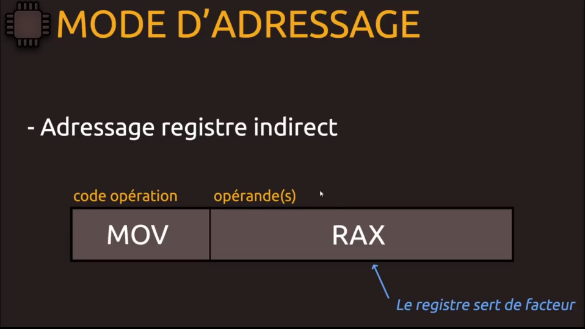 

Le registre sert de facteur càd qu'il va fonctionner comme un pointeur, il contient une adresse mémoire à la place d'une valeur.

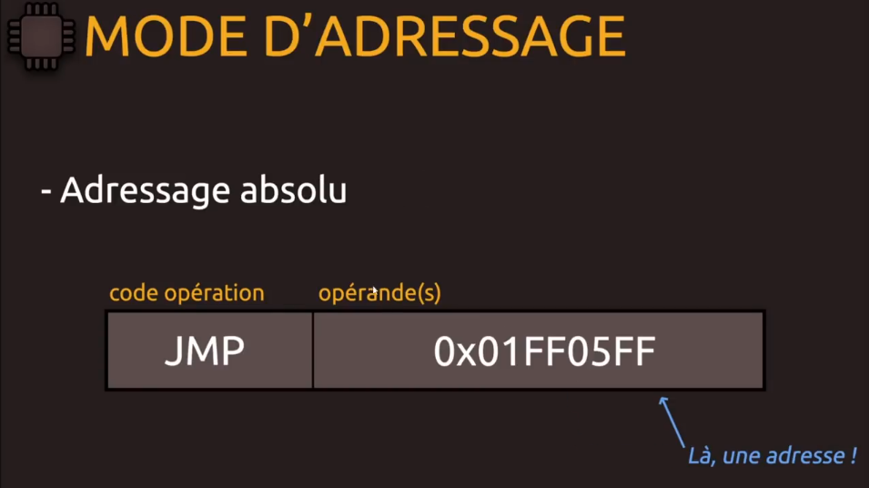 

Une instruction JUMP, où on affecte une adresse de destination pour un saut.

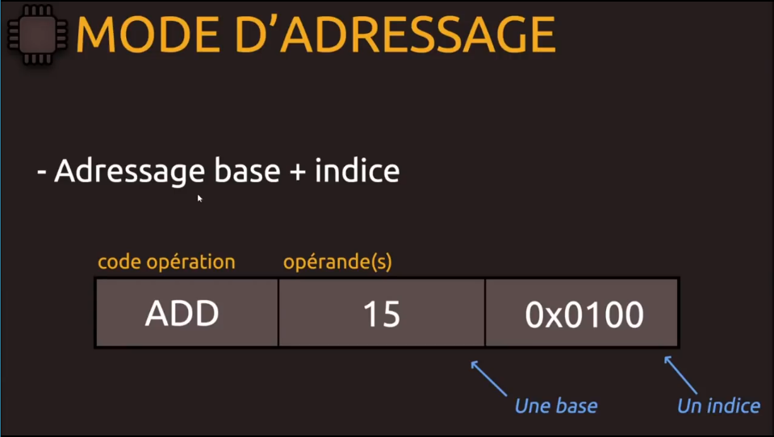 

Un autre exemple d'adressage pour les tableaux.

Besoin de faire une opération ADD, une base et un indice càd un décallage dans un tableau pour récupérer une valeur.

Ainsi un registre qui va contenir la base (on aurait dû mettre un nom de registre au lieu de 15) càd l'adresse de départ du tableau et puis l'indice du tableau où il faut accéder.

D'autres modes qu'on a pas détaillé ...

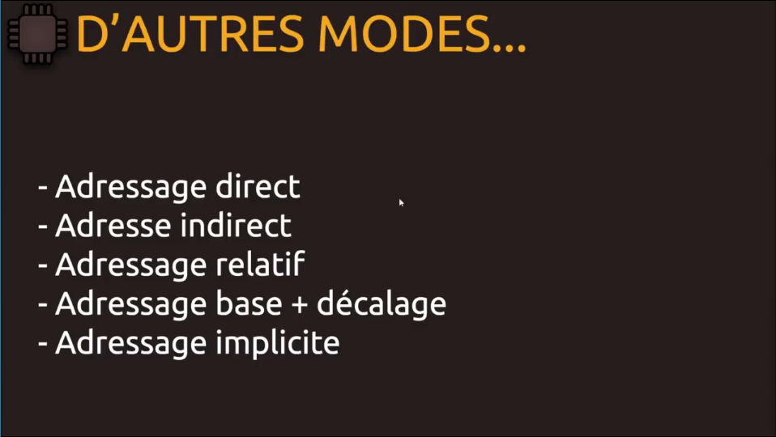 

Alors noté que l'Adressage implicite, c'est travailler avec l'accumulateur et la pile.

L'adresse relatif, c'est lorsqu'on travail avec un décallage par rapport à une adresse.

L'adressage direct, c'est de la RAM tout simplement.

 

Voilà en résumé, notre ordinateur n'est pas qu'une unité de calcul, il y a du traitement, du control.

Répartir le processeur en 3 catégories pour bien faire la différence l'architecture externe (X86) et la micro-architecture. Le core, la micro-architecture core d'Intel, ce n'est pas l'architecture externe car core c'est du X86; Pentium, c'est du X86; Z2N2 c'est du X86 voir même du X64 voilà on est sur une architecture externe qui a un peu évolué mais qui reste la même.

Là pour la micro-architecture, quand il y a des nouvelles familles de processeurs qui sortent, ça change et en plus avec les entreprises (p-ê Intel) se mettent en concurrence.

La prochaine vidéo, comment fonctionnent les registres (obligatoire) ? avec le fait de savoir comment fonctionne le processeur.

À bientôt tout le monde.