# [Registres](https://www.youtube.com/watch?v=met394KmyZ4)

Mémoire interne généralement statique (la mémoire SROM) et intégrée au processeur.

Rapide, moins de quantité et plus cher.

Les Registres sont les mémoires le moins présentes en quantité.

La cache, déjà abordé sur la vidéo sur le Processeur et sur la vidéo sur le fonctionnement de la mémoire.

La mémoire Centrale, les barettes de RAM.

La mémoire de Masse tel que le disque dur et avec la plus grande capacité, plus conteux et plus lente que les registres.

On parle de quel registres ?

L'utilisateur est le programmeur.

Registres spécifiques à un type de données ou générique.

En 2e point, la taille selon processeur quand on dit qu'un bus de données peut acceuillir des données de 32 bits, on aura des registres de 32 bits du quel on définit l'architecture.

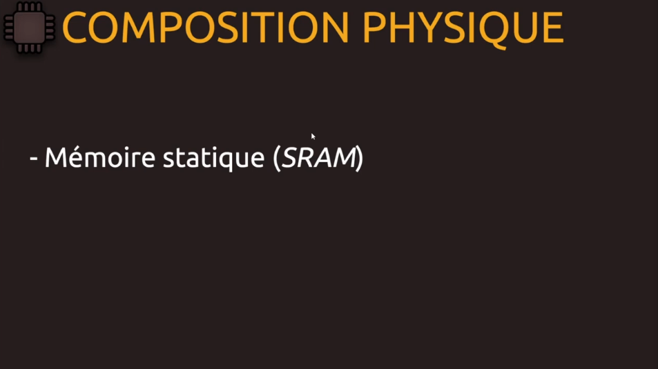

Cellule mémoire qui sera la plus rapide possible, l'avantage de nos registres.

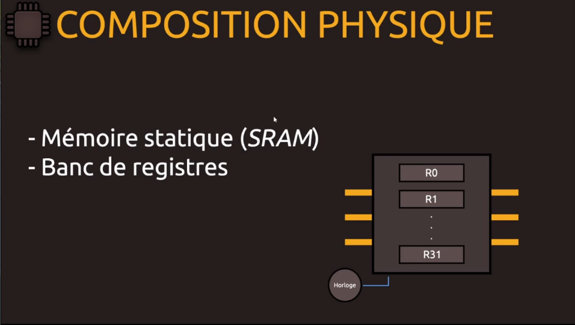

Au début ce rassemblement de registres n'existent pas.

Au lieu d'avoir des registres éparpillées, on rassemble des registres autour d'un même circuit pour la lecture ou l'écriture.

On procède à des acheminnements de données pour de la lecture ou de l'écriture, le mode et si on fait du parallélisme, parralléliser des traitements au niveau du processeur qui gére l'exécution des instructions suivant le principe du décodage, l'exécution, ... avec cette fameuse horloge qui cadence tout.

On a parler de RAM statique et aussi un système composé de bascules càd que SRAM possède ce principe de bascules (RS, D et JK, ...), bascules abordées dans la vidéo sur les proceseurs.

Alors on va utiliser ce système de bascules, qui sont des circuits électroniques, et c'est ça qui va nous permette de produire cette mémoire statique qui est le type de mémoire utilisé pour nos registres.

On a pas une représentation précise physiquement parlant des registres avec ce qui est disponible au niveau logiciel càd qu'avec les machines modernes on a des renomages de registres. Un registre dit physique n'est pas forcement celui que l'on va manipuler en tant qu'utilisateur, ce qui est un avantage au niveau des nombres de registres disponibles sans pour autant affecter les registres disponibles pour l'utilisateur.

Avec ce système, on évite le problème de dépendance donc si on veux avoir accès aux registres pour de la lecture donc forcément si un autre traitement a besoin de ce registre en particulier, il ne sera pas dans l'attente.

On a vu avec le processeur qu'on devait attendre la fin d'une instruction pour exécuter la suivante. Avec le système de Pipeline, on peut parallèliser pour le décodage, l'éxécution... donc plus de dépendance au niveau des registres physiques.

Voilà comment résoudre ce problème de dépendance avec le renomage de registre.

Les numéros de registres servent évidemment à l'utilisateur mais ils ne répresentent pas physiquement les registres au niveau du circuit. C'est plus complexe au niveau du circuit car ils sont en plus grand nombre que ce que l'on a de manière logique.

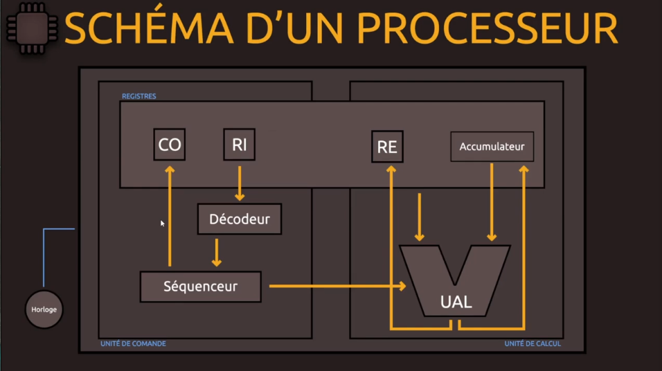

Rappel du schéma d'un processeur.

On a abordé l'accumulateur, le Registre d'Etat (RE), le Registre d'Instruction (RI) et le Compteur Ordinal (CO).

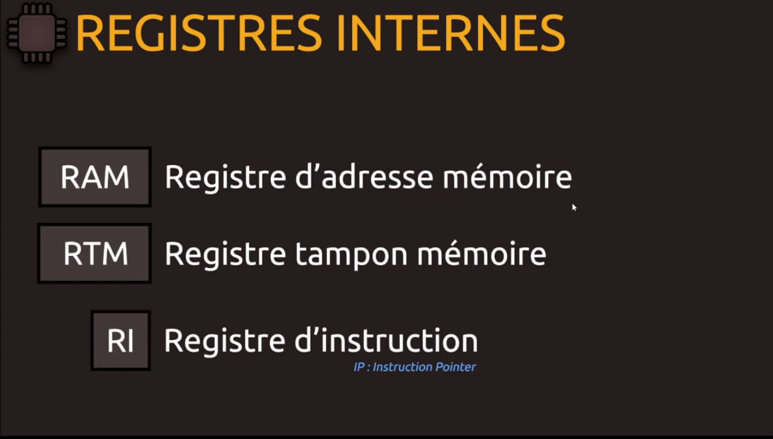

Les registres internes ne nous concernent pas en tant que programmeurs.

RAM et RTM vont fonctionner ensembles pour gérer la lecture et l'écriture. 

Quand on a de la lecture, les données qui sont enregistrées dans le registre RAM en tant qu'adresse puisqu'on travaille avec la mémoire centrale. 

Ainsi les données dans la RAM sont stockées dans le registre RTM (=un buffer, une mémoire tampon) qui va sauvegarder le temps de l'avoir pour de la lecture.

Et quand on veut faire de l'écriture, le CPU (=le processeur) va mettre en mémoire donc à l'adresse indiquée dans le registre RAM, le contenu de RTM.

Donc ces deux registres fonctionent ensemble.

RI est notre registre d'instruction avec notre instruction en cours.

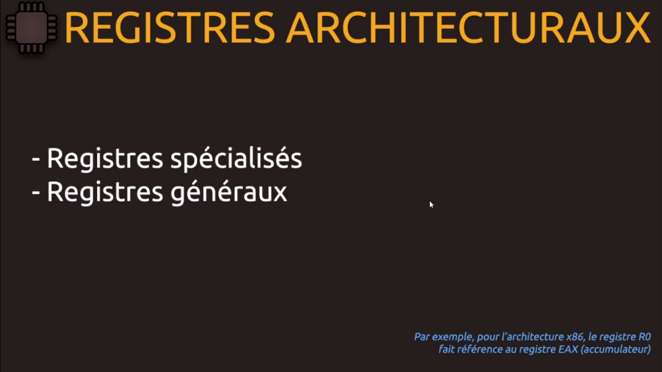

Le programmeur est interessé par les registres architecturaux, indiqués dans l'architecture externe, qui concernent le programmeur.

P/r à ce que les concepteurs avaient prévu, certains registres spécialisés sont utilisés de façon générique.

Quand on parle du registre EAX, on fais référence à l'accumulateur.

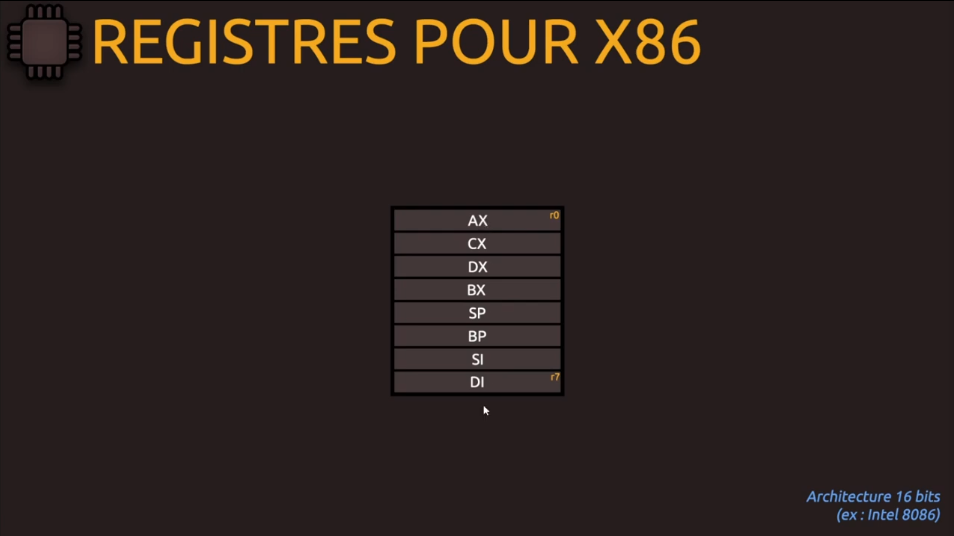

Exemple en 16 bits.

Ici la manière dont est encodé les différents registres.

Il y a 8 registres (R0 à R8)

Ici des registres spécifiques et des registres généraux.

L'Accumulateur a déjà été abordé dans la vidéo sur les processeurs.

Le compteurs pour les itérations par convention mais comme il s'agit de registres généraux, on peut s'en servir pour autre chose.

Le nommage par convention permet d'identifier les registres (AX, CX pour compteur ...).

Le DX pour les Data qu'on se sert pour l'extension de l'accumulateur lorsqu'on a besoin de faire des opérations arithmétiques lorsqu'on a besoin d'une extension du registre pour sauver les données.

Le BX permet d'accéder à un tableau lorsqu'on a besoin de faire des décallages.

**On manipulera ces différents registres en language assembleur**

On considère les registres de gauche comme généraux tandis que ceux de droite sont considérés comme des registres de décallages ou d'adresses alors qu'on peut stocker des adresses aussi dans BASE... mais pour que ce schéma soit sensé, il faudrait le schéma normalisé.

Les pointeurs de Pile, les pointeurs de Base qui fait référence à la base puis les indices source et indices destination qui sont les fameux index lorsqu'on veut procéder à des décallages lorsqu'on va travailler sur des adresses.

Par exemple si on a tendance à utiliser DI comme un accumalateur, on risque de nous dire que ça ne va pas et qu'il faut plutôt utiliser AX alors que rien n'empêche de le faire.

Noté également que pour faire appel à des fonctions, des retours de fonctions, on se servira de l'accumulateur (AX).

Voilà pas mal de registres lorsqu'on veut manipuler des données temporaire. 

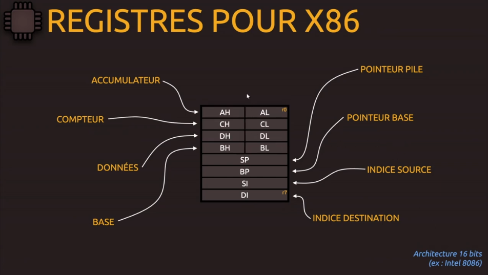

On se rend compte qu'un ensemnle de registres sont composés d'autres registres pour des raisons de compatibilités avec d'autres architectures. Rappelez-vous qu'avec les processeurs, on a pas de pairs de compatibilités càd qu'avec les outils d'aujourd'hui, on peut faire tourner des codes d'anciennes architectures parce que tout s'est fait par évolution/extension.

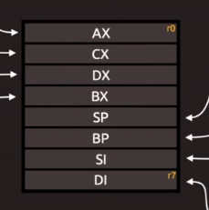
* architecture 16 bits avec AX fait 16 bits, CX faits 16 bits et cetera.

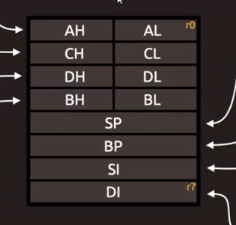
* si on veut travailler sur une architecture 8 bits, on retrouve ces données AL, CL et cetera puis une version 16 bits (SP, BP et cetera.).

On a la partie basse (AL, CL, DL, BL) qui sont les bits de poids faibles puis on a les bits de poids forts (AH, CH, DH et BH). Si on veut coder de manière plus petite, sur 8 bits,on ne pourra pas affecter aux bits de poids forts et on travaillera toujours sur les bits de poids faibles.

On vera pourquoi.

Quand on a eu du 8 bits, pour passer à 16 bits et éviter de perdre la compatibilité avec d'autres registres, on a finallement fait une extension avec les bits de poids forts et du coup l'assemblage, la somme (pas l'extension) fait qu'on a **AH + AL = AX**, une pair de registres qui forme notre registre sur 16 bits.

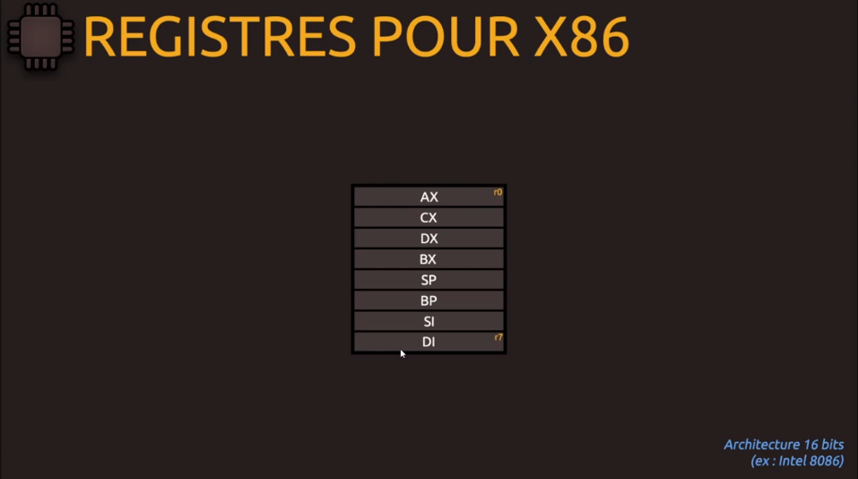

Voilà pour la partie 16 bits.

Les architectures ont évalué et qu'on ait un Pentium4 ou un CoreDual our le nouveau Core i7, vous êtes toujours sur une architecture externe x86 donc l'architecture externe n'as pas changée mais elle s'est étendue car on a ajouté plein de chose.

Quand on a voulu passé à du 32 bits, on a étendu les registres donc on a doublé cette capacité et on obtient les fameux registres.

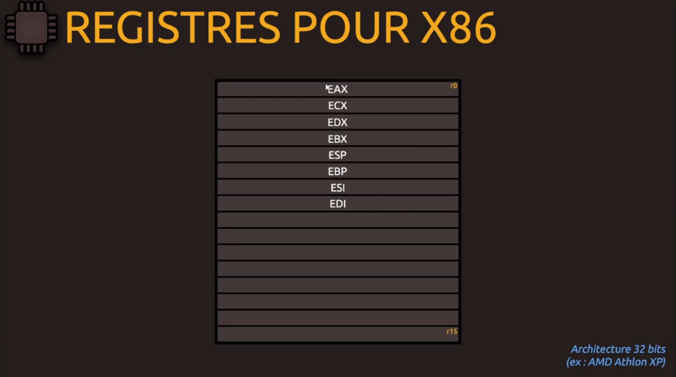

On retrouve le fameux E pour extended et c'est pareil comme SP, BP ... étaient en 16 bits, il a fallu les doubler.

On a doublé la taille du tableau donc on est plus à 8 mais à 16.

Les derniers registres ne sont pas nommés donc si on veux le dernier, on met R15 tout simplement si on veut le 16 registres. On utilisera les alias plus volontier.

Le E est remplacé par R. Registre pareil jusqu'à RDI (registre de destination, *Destination Index*).

Le nom R15 n'as pas changé suivant l'architecture pour la raison de compatibilité. Pour la compatibilité avec des arch. plus petites, utilisation d'autres nommages.

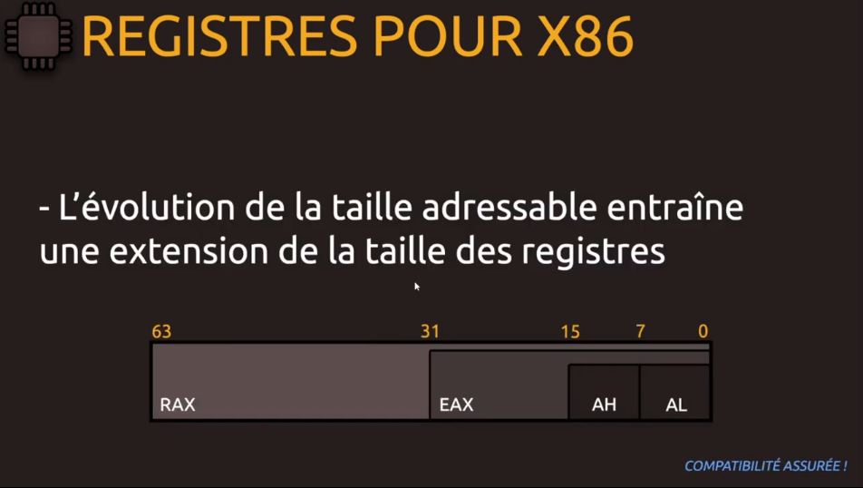

Ici on étend la taille des registres *AH et AL donne AX* puis on étend à *EAX* et jusqu'à 64 bits *RAX*. On a l'ensemble de nos registres.

Compatibilité car dans RAX on retrouve le registre 32 bits, on peux coder sur 32, 16 et 8 bits.

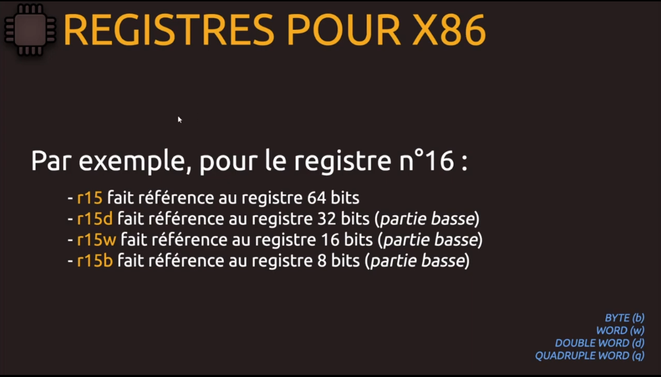

suffixe pour représenter les architecture plus petite.

b pour byte, botre octet en français donc 8 bits.
w pour word, un mot c'est 16 bits.
d pour duble-word, un double mot pour 32 bits de données.

q pour quadruple mot pour 64 bits qui peut revenir parfois.

Si on note juste r15, on saurais qu'on veut une donnée codée jusqu'à 64 bits.

On parle de partie basse *AL* pour *EAX* et ainsi de suite.

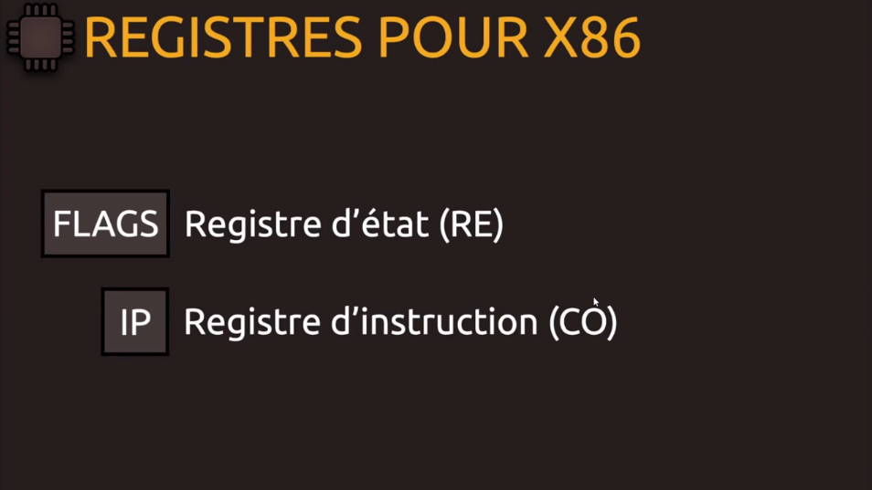

Deux registres particuliers, *FLAGS* registre d'état et *IP* le compteur ordinale, nos version 16 bits donc si on rajoute un *E* ça devient la version 32 et si on met un *R*, c'est la version 64 (*RFLAGS*, registre d'état 64 bits et *RIP* registre d'instruction 64 bits).

Ici le registre complet d'Etat sur 64 bits.

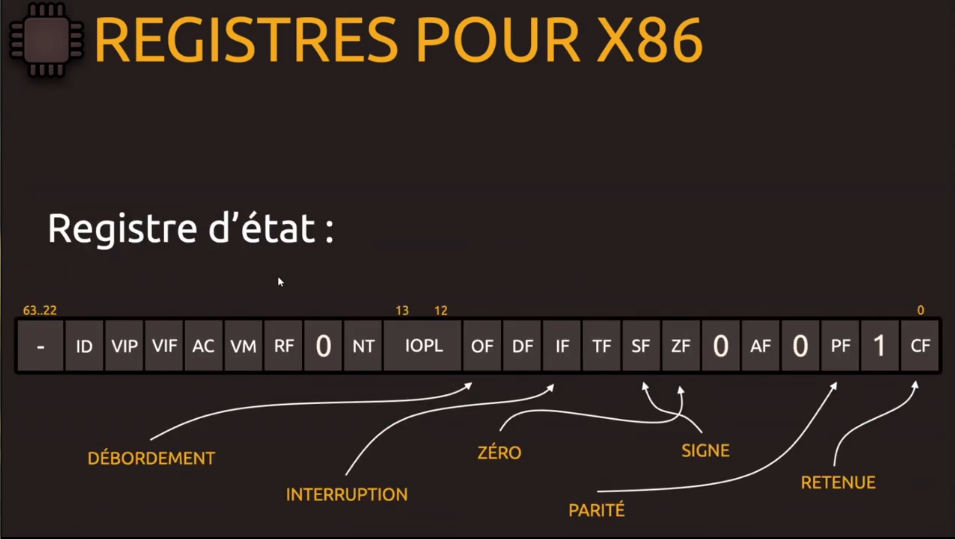

Ici du 8 bits.
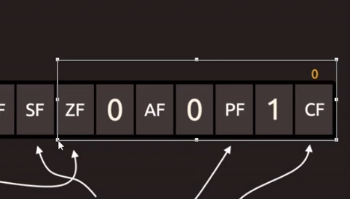

Ici c'est FLAGS, en 16 bits.
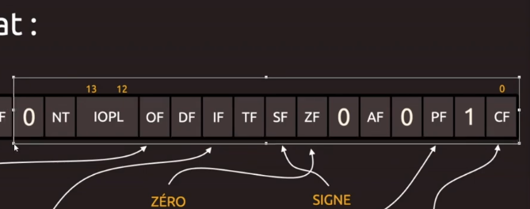

Puis ça va jusqu'à *IFLAGS* puis *RFLAGS*.

Ici on indique rien parce que certains registres sont réservés. On ne peut même pas manipuler ces registres.

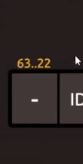

D'autres bits ont une valeur par défaut et sont réservés.

Parmis ceux qu'on retrouvele plus en programmation ce sont les *CF, PF, ZF, SF, IF, OF* et donc le nommage est assez simple avec le *F* pour Flags comme le *Carry Flags*

C'est très simple quand on a un calcul arithmétique qui génère une retenue, ce drapeau arithmétique *CF* sera armé à 1.

On est sur des bits donc du binaire.

Par exemple on utilise le registre d'accumulateur dont une opération génère une retenue donc CF passe à 1.

Pour ça qu'on parle de **registre d'état**. Cela peut servir pour les état, pour les contrôles et tout ce qui est système.

* CF : Carry Flag.
* PF : Parity Flag, pair ou impair.
* SF : Sign Flag, si le bits de poids le plus fort est à 1 **donc qui indique que le nombre est négatif**.
* ZF : Zero Flag, si le résultat donne zéro.
* IF : Interruption Flag, on peut avoir des interruption qui peuvent être masquée. Si on peut permettre au processeur de traiter toutes les interruptions même les masquables, on aura IF à 1.
* TF : Trap Flag pour le déboggage pas à pas, par instruction si ce bits est passé à 1.
* OF : Overflow Flag : bit pour le débordement d'entier si on a un calcul dans le résultat qui fait que ça déborde en terme d'espace addressables. Le drapeau de débordement qui sera armé à 1.

Autres cas pas très intéressant.

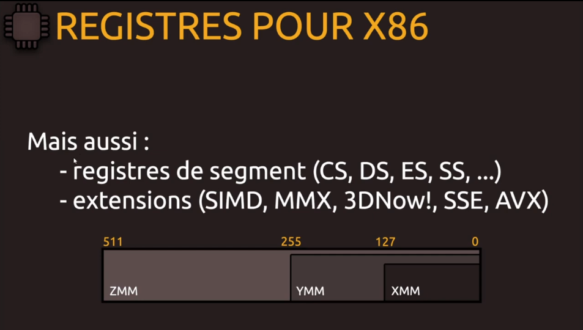

2 formats de registres (segment et extensions).

On a le segment de code *CS*, le segment de données *DS*, le segment pour les extensions *ES*, et cetera. Savoir qu'il existe pour programmer.

Avec les extensions, on ajoute sans rien retirer. Au début on travaillait avec de petites données, des entiers puis par la suite on a besoin de travailler sur des flottants et aujourd'hui on traite des images et on fait de la 3D. C'est pour que les constructeurs, on ajouté des extensions qui s'accompagne d'ajout de registres.

SIMD : Simple Instruction Multiple Date donc en gros une seule instruction pour gérer des données multiples pour optimiser la parallélisation, rapidité d'excution, instructions des registres pour des données plus grandes et traiter des calculs plus complexes, les matrices, les vectors pour le streaming et cetera.

On a du Intel (SIMD), du AMD (MMX, 3DNow) ... fabriqué par leur constructeur mais chaque constructeur partage un peu les technologies. Par exemple, on a eu SSE puis SSE2 puis remplacé par AVX puis AVX512, technologie qui évolue tout le temps.

Quand on travaillait avec du SSE, on avait droit à du 128 bits donc là on est plus grand que du 16/32 bits avec des registres qui portaient ce nom XMM notament XM0 puisqu'on avait 8 registres (XM7). Puis des versions supplémentaires de SSE qui ont permis d'agrandir tout ça (YMM, 255) donc des données mémorisable sur 256 bits donc un nommage par extension (YMM viens après XMM dans l'alphabet).

Sur la technologie AVX, on est carrément sur des registres ZMM et donc là on a 32 registres de 512 bits.

Au départ on avait les registres X87, registres de 80 bits pour les calculs de floattant notamment... puis évolution pour gérer des données plus importantes.

Noté que AVX pouvait aussi bien géré du 128 bits ou du 256 bits pour éviter que d'ancien code ne soit plus compatible donc un état de transistion.

En 2022, on parle de AVX 512.

En langage assembleur, on va faire des instructions mais ici on parle d'ajout d'extensions aux jeux d'instructions.

Les instructions sont programmées càd qu'on fait appel à des fonctionnalités de nos processeurs et après on a des ajouts de registres si on veux manipuler certaines données et faire appel à des types des instructions, on a besoin de place pour mémoriser ces informations d'où les extensions de registres.

Sur les processeurs SISC, on a peu de registres avec un code plus compliqué et au contraire pour du **RISC, on a plus de registres** mais ça n'a plus beaucoup de pertinence de nos jours de dire cela (avoir beaucoup de registres avec SISC).

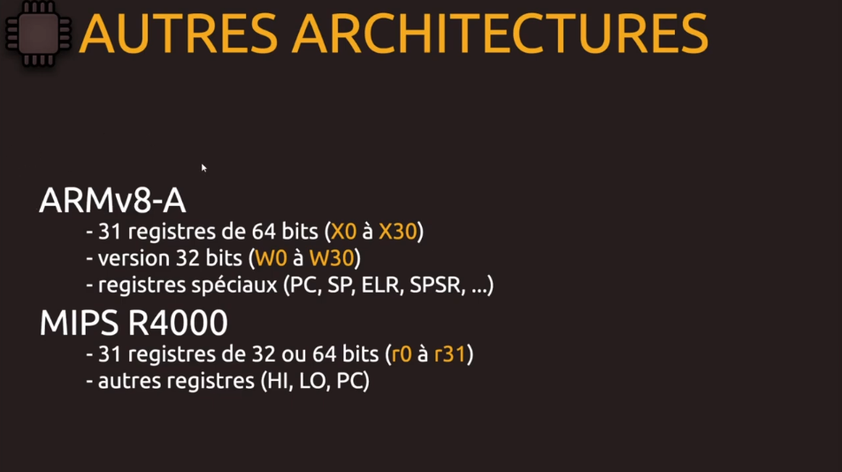

ARMv8-A sur nos appareils mobiles, nommés X0 à X30 et chacun fait 64 bits avec compatibilité à 32 bits. On a le Program Counter *PC* puis le registre de pile, le Stack Pointer, *SP* et puis des registres de liaisons dynamiques...

MIPS R4000 présent sur les Playstation portable de Sony, une architecture RISC puis des registres pour multiplication et division, partie haute *HI* et partie basse *LO* et cetera.

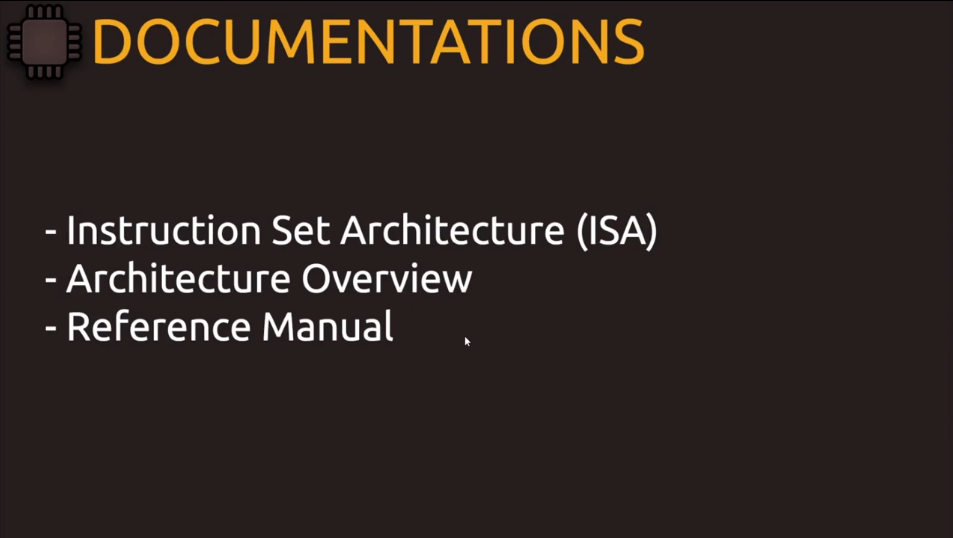

Mots clés dans nos moteur de recherches :
* Architecture Overview Mips, Arm, X86, Intel et cetera.
* Retrouver les registres et jeux d'instructions et cetera, pdf's et manuel en ligne.

Vidéo de prérequis pour programmer en assembleur.

Ciao ciao tout le monde.