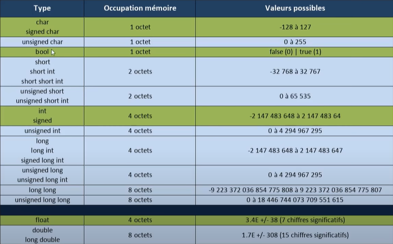

# [[ARCHIVE] C++ #4 - variables et constantes](https://www.youtube.com/watch?v=1cfrnPkXIOI&list=PLrSOXFDHBtfG0Fb0g--43a0b47e9hrwlB&index=18)

+ déclarer les variables au moment où on en a besoin.
+ tableau sur les types de variables

    - Ce qui est en vert est ce qui est utilisé le plus souvent.
    - Le type bool est intégré directement sans *stdbool*

## Affichage

Variable affiché avec un simple nom sans joker `%d`, `%s` et cetera.

```cpp
#include <iostream>

int main()
{
    int someData = 14;
    std::cout << someData << std::endl;
    return 0;
}
```
```powershell
g++ -std=c++14 main.cpp -o prog   
.\prog.exe
14
```

## Déclaration et initialisation

3 syntaxes de déclaration et d'initialisation.
```cpp
int someData = 14;
int someData(14);
int someData{14}; // la plus optimale, la plus moderne.
float otherData{16.47};
```

## Constante

### const

On ne peut pas modifier une constante.

```cpp
#include <iostream>

int main()
{
    const int DATA = 17;
    DATA = 1;

    std::cout << DATA << std::endl;

    return 0;
}
```
```powershell
g++ -std=c++14 main.cpp -o prog   
main.cpp: In function 'int main()':
main.cpp:6:10: error: assignment of read-only variable 'DATA'
    6 |     DATA = 1;
      |     ~~~~~^~~
```

### constexpr

Expression constante.

```cpp
#include <iostream>

int main()
{
    constexpr int MY_DATA = 10;

    std::cout << MY_DATA << std::endl;

    return 0;
}
```
```powershell
g++ -std=c++14 main.cpp -o prog   
.\prog.exe
10
```

Voilà pour les constantes.

## Déduction de type

## auto

Le compilateur déduit le type de la variable.

```cpp
#include <iostream>

int main()
{
    auto someData = 14;

    std::cout << someData << std::endl;

    return 0;
}
```
```powershell
g++ -std=c++14 main.cpp -o prog   
.\prog.exe
14
```

## decltype

La fonction decltype() déduit le type entre parenthèse pour l'appliquer à une variable.

```cpp
#include <iostream>

int main()
{
    decltype(auto) someData = 14;

    std::cout << someData << std::endl;

    return 0;
}
```
```powershell
g++ -std=c++14 main.cpp -o prog   
.\prog.exe
14
```

Déclarer une autre variable avec le type de notre variable.

```cpp
#include <iostream>

int main()
{
    int someData = 14;

    std::cout << someData << std::endl;

    decltype(someData) otherData{0};

    return 0;
}
```
```powershell
```

Par ailleurs notre variable peut également être inatialisée un entier à 0 de deux façons possibles `otherData{}` ou otherData{0}.

Si je décide de changer le type de someData, ça aura une répercusion sur otherData.

C'est le rôle des compilateur de déduire les types.

On peut également passer une valeur en dur à decltype() dont le compilateur déduira le type à passer à notre variable someData en fonction de mon tableau des types.

```cpp
decltype(10) someData;
decltype(100000000000) someData;
```

## sizeof

Retourne l'occupation en mémoire en octet d'une variable, d'un pointeur ou carrément le nom d'un type de variable `sizeof(int)`.

```cpp
#include <iostream>

int main()
{
    int someData = 14;

    std::cout << sizeof(someData) << std::endl;

    return 0;
}
```
```powershell
```

## Sufixes

Forcer l'usage d'un type non signé, on utilise le sufixe `u` ou `U` par exemple.

```cpp
#include <iostream>

/*
    u, U (non signé)
    l, L (long int ou long double)
    ll, LL (long long int)
    f, F (flottant)
*/

int main()
{
    unsigned float someData = 14u; //..u
    long someData = 14646464316l; //..l
    double someData = 14646464316L; //..L
    float someData = 14.0f;

    std::cout << someData << std::endl;

    return 0;
}
```
```powershell
```

Si on écrit `float someData = 14f;` sans les décimales, le compilateur retournera une erreur.

## Conversion

### Convertion de type

2 façon de retirer la partie décimale et conserver la partie entière.

```cpp
#include <iostream>

int main()
{
    float nb = 14.6;

    nb = (int)nb;
    nb = int(nb);

    return 0;
}
```
```powershell
```

:warning: le cast est assez risqué donc c'est à éviter.

### Convertion statique

Conversion statique activé au moment de la compilation de notre donnée nb.

```cpp
#include <iostream>

int main()
{
    const auto nb = static_cast<int>(10);

    return 0;
}
```
```powershell
```

*Note : on peut également faire du cast sur une donnée constante pour qu'elle ne soit plus constante l'espace d'un moment. On peut également faire du cast dynamique sur des pointeurs.*

## Limits functions

Syntaxe complexe avec un opérateur de flux `<<`, un opérateur de portée `::`

```cpp
#include <iostream>
#include <limits>

int main()
{
    std::cout << std::numeric_limits<int>::min() << std::endl;
    std::cout << std::numeric_limits<int>::max() << std::endl;
    //std::cout << std::numeric_limits<int>::is_signed() << std::endl;
    //std::cout << std::numeric_limits<int>::is_integral() << std::endl;
    //std::cout << std::numeric_limits<int>::is_const() << std::endl;

    return 0;
}
```
```powershell
g++ -std=c++14 main.cpp -o prog   
.\prog.exe                        
-2147483648
2147483647
```