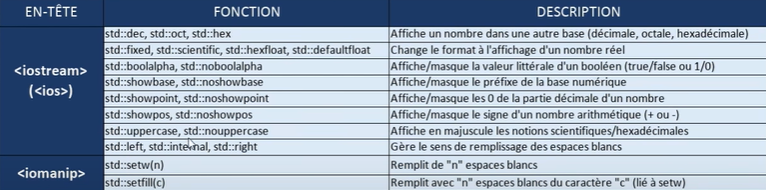

:label: [FormationVidéo Git](https://github.com/jasonchampagne/FormationVideo) - [Ressource C++](https://github.com/jasonchampagne/FormationVideo/tree/master/Ressources/C%2B%2B)

# Le langage C++
> [Doc](https://en.cppreference.com/w/cpp)  

## [Playlist C++ cours](https://github.com/jasonchampagne/FormationVideo/blob/master/Playlists/cpp-cours.md)

||notes de cours
-|:-
|:heavy_check_mark:|[1. introduction](cours/001_introduction/note.md)
|:heavy_check_mark:|[2. premier code](cours/002_premier_code/note.md)
|:heavy_check_mark:|[3. affichage console](cours/003_affichage_console/note.md)
|:heavy_check_mark:|[4. variables](cours/004_variables/note.md)
|:heavy_check_mark:|[5. Saisie utilisateur](cours/005_saisie_utilisateur/note.md)
||[6. Opérations](cours/006_operations/note.md)
||[7. Conditions](cours/007_conditions/note.md)

## [Playlist C++ cours ARCHIVE](https://youtube.com/playlist?list=PLrSOXFDHBtfG0Fb0g--43a0b47e9hrwlB)

||notes de cours|pense-bêtes
-|:-|:-:
|:heavy_check_mark:|[[ARCHIVE] C++ #1 - introduction](ARCHIVE/cours/001_introduction/note.md)|[:memo:](#Introduction)
|:heavy_check_mark:|[[ARCHIVE] C++ #2 - premier code](ARCHIVE/cours/002_premier_code/note.md)|[:memo:](#Premier-code)
|:heavy_check_mark:|[[ARCHIVE] C++ #3 - affichage en console](ARCHIVE/cours/003_affichage_en_console/note.md)|[:memo:](#Affichage-en-console)
|:heavy_check_mark:|[[ARCHIVE] C++ #4 - variables et constantes](ARCHIVE/cours/004_variables_et_constantes/note.md)|[:memo:](#Variables-et-constantes)
|:heavy_check_mark:|[[ARCHIVE] C++ #5 - saisie utilisateur](ARCHIVE/cours/005_saisie_utilisateur/note.md)|[:memo:](#Saisie-utilisateur)
|:heavy_check_mark:|[[ARCHIVE] C++ #6 - fonctions](ARCHIVE/cours/006_fonctions/note.md)|[:memo:](#Fonctions)
|:heavy_check_mark:|[[ARCHIVE] C++ #7 - tableaux](ARCHIVE/cours/007_tableaux/note.md)|[:memo:](#Tableaux)
|:heavy_check_mark:|[[ARCHIVE] C++ #8 - pointeurs et allocation mémoire](ARCHIVE/cours/008_pointeurs_et_allocation_mémoire/note.md)|[:memo:](#Pointeurs-et-allocation-mémoire)
|:heavy_check_mark:|[[ARCHIVE] C++ #9 - structures et énumérations](ARCHIVE/cours/009_structures_et_énumérations/note.md)|[:memo:](#Structures-et-énumérations)
|:heavy_check_mark:|[[ARCHIVE] C++ #10 - programmation objet](ARCHIVE/cours/010_programmation_objet/note.md)|[:memo:](#Programmation-objet)
|:heavy_check_mark:|[[ARCHIVE] C++ #11 - constructeurs et attributs](ARCHIVE/cours/011_constructeurs_et_attributs/note.md)|[:memo:](#Constructeurs-et-attributs)
|:heavy_check_mark:|[[ARCHIVE] C++ #12 - méthodes et accesseurs](ARCHIVE/cours/012_méthodes_et_accesseurs/note.md)|[:memo:](#Méthodes-et-accesseurs)

## [Playlist C++ tutoriel ARCHIVE](https://www.youtube.com/watch?v=Ht3AuVr82zQ&list=PLrSOXFDHBtfG0Fb0g--43a0b47e9hrwlB&index=28)

||notes de cours|pense-bêtes
-|:-|:-:
|:heavy_check_mark:|[[ARCHIVE] Tutoriel C++ - énumérations fortement typées](ARCHIVE/tutoriels/énumérations_fortement_typées.md)|[:memo:](#énumérations-fortement-typées)

## Introduction
+ [Introduction](ARCHIVE/cours/001_introduction/note.md#Introduction)
+ [Programme de la formation](ARCHIVE/cours/001_introduction/note.md#Programme-de-la-formation)
+ [Références](ARCHIVE/cours/001_introduction/note.md#Références)
+ [FAQ](ARCHIVE/cours/001_introduction/note.md#FAQ)
    + [Prerequi](ARCHIVE/cours/001_introduction/note.md#Prerequi)
    + [Avantages](ARCHIVE/cours/001_introduction/note.md#Avantages)
+ [Compatibilité](ARCHIVE/cours/001_introduction/note.md#Compatibilité)
+ [A qui s'adresse cette formation ?](ARCHIVE/cours/001_introduction/note.md#A-qui-s-adresse-cette-formation)
+ [Installation des outils](ARCHIVE/cours/001_introduction/note.md#Installation-des-outils)
    + [Editeur](ARCHIVE/cours/001_introduction/note.md#Editeur)
    + [Compilateur](ARCHIVE/cours/001_introduction/note.md#Compilateur)
    + [Pour les gens sur Linux](ARCHIVE/cours/001_introduction/note.md#Pour-les-gens-sur-Linux)
    + [Pour ceux qui sont sur MacOS](ARCHIVE/cours/001_introduction/note.md#Pour-ceux-qui-sont-sur-MacOS)
+ [En résumé](ARCHIVE/cours/001_introduction/note.md#En-résumé)
## Premier code
+ [Code minimal](ARCHIVE/cours/002_premier_code/note.md#Code-minimal)
## Affichage en console
+ [cout est une instance de ios_base](ARCHIVE/cours/003_affichage_en_console/note.md#cout-est-une-instance-de-ios_base)
+ [Changer le format affichage et le principe du flux](ARCHIVE/cours/003_affichage_en_console/note.md#Changer-le-format-affichage-et-le-principe-du-flux)
    + [En héxadécimal](ARCHIVE/cours/003_affichage_en_console/note.md#En-héxadécimal)
    + [En octale](ARCHIVE/cours/003_affichage_en_console/note.md#En-octale)
+ [Les fonctions incluses dans iostream et iomanip](ARCHIVE/cours/003_affichage_en_console/note.md#Les-fonctions-incluses-dans-iostream-et-iomanip)

## Variables et constantes
+ [Affichage](ARCHIVE/cours/004_variables_et_constantes/note.md#Affichage)
+ [Déclaration et initialisation](ARCHIVE/cours/004_variables_et_constantes/note.md#Déclaration-et-initialisation)
+ [Constante](ARCHIVE/cours/004_variables_et_constantes/note.md#Constante)
    + [const](ARCHIVE/cours/004_variables_et_constantes/note.md#const)
    + [constexpr](ARCHIVE/cours/004_variables_et_constantes/note.md#constexpr)
+ [Déduction de type](ARCHIVE/cours/004_variables_et_constantes/note.md#Déduction-de-type)
    + [auto](ARCHIVE/cours/004_variables_et_constantes/note.md#auto)
    + [decltype](ARCHIVE/cours/004_variables_et_constantes/note.md#decltype)
+ [sizeof](ARCHIVE/cours/004_variables_et_constantes/note.md#sizeof)
+ [Sufixes](ARCHIVE/cours/004_variables_et_constantes/note.md#Sufixes)
+ [Conversion](ARCHIVE/cours/004_variables_et_constantes/note.md#Conversion)
    + [Convertion de type](ARCHIVE/cours/004_variables_et_constantes/note.md#Convertion-de-type)
    + [Convertion statique](ARCHIVE/cours/004_variables_et_constantes/note.md#Convertion-statique)
+ [Limits functions](ARCHIVE/cours/004_variables_et_constantes/note.md#Limits-functions)
## Saisie utilisateur
+ [cin](ARCHIVE/cours/005_saisie_utilisateur/note.md#cin)
+ [Le problème de la mémoire tampon](ARCHIVE/cours/005_saisie_utilisateur/note.md#Le-problème-de-la-mémoire-tampon)
+ [La chaîne de caractères](ARCHIVE/cours/005_saisie_utilisateur/note.md#La-chaîne-de-caractères)
+ [Le problème de la mémoire tampon avec les chaînes de caractères](ARCHIVE/cours/005_saisie_utilisateur/note.md#Le-problème-de-la-mémoire-tampon-avec-les-chaînes-de-caractères)
+ [Les méthodes de l'objet cin](ARCHIVE/cours/005_saisie_utilisateur/note.md#Les-méthodes-de-l-objet-cin)
    + [La méthode clear](ARCHIVE/cours/005_saisie_utilisateur/note.md#La-méthode-clear)
    + [La méthode ignore](ARCHIVE/cours/005_saisie_utilisateur/note.md#La-méthode-ignore)
    + [La méthode get ou getline](ARCHIVE/cours/005_saisie_utilisateur/note.md#La-méthode-get-ou-getline)
    + [Les méthodes d êtat de cin](ARCHIVE/cours/005_saisie_utilisateur/note.md#Les-méthodes-d-êtat-de-cin)
    + [La méthode EOF](ARCHIVE/cours/005_saisie_utilisateur/note.md#La-méthode-EOF)
+ [Vider un buffer](ARCHIVE/cours/005_saisie_utilisateur/note.md#Vider-un-buffer)
## Fonctions
+ [Passage par valeur](ARCHIVE/cours/006_fonctions/note.md#Passage-par-valeur)
+ [Passage par adresse](ARCHIVE/cours/006_fonctions/note.md#Passage-par-adresse)
+ [Surcharge de fonction](ARCHIVE/cours/006_fonctions/note.md#Surcharge-de-fonction)
+ [Les templates](ARCHIVE/cours/006_fonctions/note.md#Les-templates)
+ [Les fonctions Lambda](ARCHIVE/cours/006_fonctions/note.md#Les-fonctions-Lambda)
## Tableaux
+ [Déclaration](ARCHIVE/cours/007_tableaux/note.md#Déclaration)
+ [Initialiser et afficher](ARCHIVE/cours/007_tableaux/note.md#Initialiser-et-afficher)
+ [Parcours et lecture](ARCHIVE/cours/007_tableaux/note.md#Parcours-et-lecture)
+ [La méthode size](ARCHIVE/cours/007_tableaux/note.md#La-méthode-size)
## Pointeurs et allocation mémoire
+ [Pointeurs](ARCHIVE/cours/008_pointeurs_et_allocation_mémoire/note.md#Pointeurs)
+ [Allocation dynamique](ARCHIVE/cours/008_pointeurs_et_allocation_mémoire/note.md#Allocation-dynamique)
+ [Les pointeurs intelligents](ARCHIVE/cours/008_pointeurs_et_allocation_mémoire/note.md#Les-pointeurs-intelligents)
    + [Pour un simple pointeur](ARCHIVE/cours/008_pointeurs_et_allocation_mémoire/note.md#Pour-un-simple-pointeur)
    + [Pour un tableau de 100 valeurs](ARCHIVE/cours/008_pointeurs_et_allocation_mémoire/note.md#Pour-un-tableau-de-100-valeurs)
+ [Libérer un pointeur proprement](ARCHIVE/cours/008_pointeurs_et_allocation_mémoire/note.md#Libérer-un-pointeur-proprement)
+ [Pointeur partagé](ARCHIVE/cours/008_pointeurs_et_allocation_mémoire/note.md#Pointeur-partagé)
+ [Conversion de type de pointeur](ARCHIVE/cours/008_pointeurs_et_allocation_mémoire/note.md#Conversion-de-type-de-pointeur)
## Structures et énumérations
+ [struct est optionnel](ARCHIVE/cours/009_structures_et_énumérations/note.md#struct-est-optionnel)
+ [Créer une copie](ARCHIVE/cours/009_structures_et_énumérations/note.md#Créer-une-copie)
+ [Créer un alias](ARCHIVE/cours/009_structures_et_énumérations/note.md#Créer-un-alias)
+ [Enumération](ARCHIVE/cours/009_structures_et_énumérations/note.md#Enumération)
## Programmation objet
+ [Créer une classe](ARCHIVE/cours/010_programmation_objet/note.md#Créer-une-classe)
+ [Définir un constructeur](ARCHIVE/cours/010_programmation_objet/note.md#Définir-un-constructeur)
+ [this](ARCHIVE/cours/010_programmation_objet/note.md#this)
+ [Destructeur](ARCHIVE/cours/010_programmation_objet/note.md#Destructeur)
## Constructeurs et attributs
+ [Déclarer des attributs](ARCHIVE/cours/011_constructeurs_et_attributs/note.md#Déclarer-des-attributs)
+ [Implémenter des attributs dans le constructeur](ARCHIVE/cours/011_constructeurs_et_attributs/note.md#Implémenter-des-attributs-dans-le-constructeur)
+ [1e - définir un constructeur avec paramètres optionnels](ARCHIVE/cours/011_constructeurs_et_attributs/note.md#1e---définir-un-constructeur-avec-paramètres-optionnels)
+ [2e - définir un constructeur particulier](ARCHIVE/cours/011_constructeurs_et_attributs/note.md#2e---définir-un-constructeur-particulier)
    + [Définir un constructeur complet](ARCHIVE/cours/011_constructeurs_et_attributs/note.md#Définir-un-constructeur-complet)
    + [Un constructeur par défaut et plusieurs constructeurs particuliers](ARCHIVE/cours/011_constructeurs_et_attributs/note.md#Un-constructeur-par-défaut-et-plusieurs-constructeurs-particuliers)
+ [Raccourcir une implémentation avec deux points](ARCHIVE/cours/011_constructeurs_et_attributs/note.md#Raccourcir-une-implémentation-avec-deux-points)
+ [3e - définir un constructeur par copie](ARCHIVE/cours/011_constructeurs_et_attributs/note.md#3e---définir-un-constructeur-par-copie)
## Méthodes et accesseurs
+ [Créer une méthode](ARCHIVE/cours/012_méthodes_et_accesseurs/note.md#Créer-une-méthode)
+ [Les accesseurs getter & setter](ARCHIVE/cours/012_méthodes_et_accesseurs/note.md#Les-accesseurs-getter-&-setter)
    + [getName](ARCHIVE/cours/012_méthodes_et_accesseurs/note.md#getName)
    + [setName](ARCHIVE/cours/012_méthodes_et_accesseurs/note.md#)