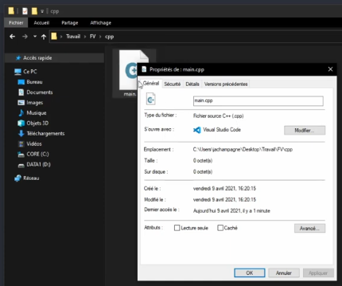

# [2. Premier programme](https://www.youtube.com/watch?v=FjG4HYo-Jm0)

Bonjour à tous et bienvenue pour cette deuxième séance en c++, nous allons faire ensemble et voir comment créer notre premier programme que vous allez écrire avec le langage c++.

On va passer directement ici et on va créer notre premier fichier.

Alors on va reprendre comme d'habitude en partant du principe que vous n'avez jamais encore programmé, que c'est le premier langage que vous découvrez et on va faire comme ça chaque choses étape
par étape très simplement.

Petite parenthèse si vous êtes sur windows, il va falloir afficher l'extension des fichiers ce qui n'est pas forcément le cas par défaut si vous ne savez pas comment faire vous pouvez aller voir sur la playlist windows ce tutoriel, il y a une petite vidéo pour montrer comment afficher les extensions.

Une fois que c'est fait vous allez pouvoir créer un fichier texte, clic droit à nouveau ça c'est généralement pareil sur tous les systèmes d'exploitation.

Vous créer un fichier texte, ça reste un fichier texte mais on va lui mettre une extension particulière pour qu'il soit directement on va dire reconnus plus facilement en tout cas par certaines applications que vous allez utiliser.

On va l'appeler comme c'est le premier fichier *main* pour dire principal et vous avez lui mettre l'extension donc on met un point cpp, hop on l'active.

```
    c.
    |_ main.cpp
```

Il faut bien évidemment avoir installé un éditeur mais ça vous l'avez vu en vidéo d'introduction donc logiquement vous avez tout ce qu'il faut, vous avez votre éditeur de code.

Vous avez donc d'ailleurs une vidéo si vous voulez par exemple utiliser visual studio code, vous avez une vidéo dans la playlist aide si jamais où il y a un petit guide pour l'installer et le configurer et le compilateur nous avons fait tout ça dans la vidéo précédente.

A partir de là on va pouvoir ouvrir ce dernier avec un éditeur alors s'il n'est pas configuré par défaut je vais le rappeler parce que c'était pas forcément clair pour tout le monde, vous êtes sur un fichier donc là c'est pas propre au langage c++ mais c'est propre à votre système mais généralement via la manipulation graphique, vous faites un clic droit sur un type de fichier en question vous allez dans propriété et ici vous pouvez modifier l'application qui va ouvrir ce type de fichiers donc le type de fichier se base notamment sur l'extension.



L'extension sert à ça pour pouvoir en fait être reconnue par défaut par une application en particulier ce qui fait qu'avec un simple clic vous pouvez ouvrir avec cette application.

Voilà c'est simplement pour gagner du temps ce qui n'empêche pas pour autant d'ouvrir votre éditeur et ensuite carrément déplacer votre fichier dedans ou de faire ficher->ouvrir et de le retrouver aussi de cette manière là même s'il n'est pas forcément ouvert par défaut avec ce genre d'application.

Voilà maintenant que nous en somme ici, petite vérification d'usage première chose *vérifier l'encodage* et assurez vous que vous êtes bien en utf-8 donc en fonction de l'éditeur que vous utilisez il faudra peut-être le configurer différemment.


Là c'est pareil sur mon github, j'ai fait un petit Git pour configurer le bon encodage selon l'éditeur de code que vous utilisez ou l'environnement développement d'ailleurs, et on est parti.

On va créer un ensemble de lignes sur le code minimale à avoir d'accord pour créer un premier programme, je vais vous les expliquer rapidement et bien évidemment chaque chose que vous allez voir ici introduit certains concepts, certaines notions qu'on va détailler que l'on verra plus en détails bien sûr ou tout au long de la formation c++.

La première ligne va être important c'est ce qu'on peut appeler une directive de près processeur qui va nous permettre d'inclure un ficher d'en-tête.

```cpp
#include <iostream>

```

Ce fichier d'en-tête s'appelle en particulier *iostream* pour input output stream.

Il va permettre tout simplement de disposer d'un ensemble de fonctionnalités que vous n'allez pas avoir besoin de développer c'est à dire quand vous allez créer un programme, on ne va pas vous demander par exemple d'écrire ou de réécrire le code qui permet de faire des choses qui peuvent sembler simple mais bon évidemment derrière c'est un peu plus compliqué que ça mais des choses standard comme l'affichage par exemple d'un message sur une console tels que nous allons faire pour commencer.

Ainsi cette en-tête ici `#include <iostream>` propose tout un tas de fonctionnalités dont des fonctionnalités d'entrée et de sortie notamment sur de la lecture et de l'affichage donc c'est pour ça qu'on l'inclus tel quel ensuite nous allons définir le point d'entrée de notre programme.

Il faut savoir qu'en c++ un programme démarre toujours avec un point d'entrée qui est une fonction qui possède un nom particulier, cette fonction s'appelle *main* d'accord elle est donc obligatoire.

Si vous n'avez pas de fonction *main* dans un programme en c++, ça ne fonctionnera pas d'accord il va automatiquement recherché en fait ce point d'entrée pour démarrer le programme.

Celle ci a une écriture qu'il faut respecter, c'est très important on parle de normes, on parle de standards qui sont liées au langage c'est à dire un ensemble de règles en fait qui ont été définies par des organismes de normalisation pour dire décrire les choses de telle manière et pas autrement.

La norme pour l'écriture de cette fonction main est très simple `int main()` alors entre parenthèses, on ne va rien mettre ici parce qu'on appelle des paramètres ou des arguments mais on n'en parlera plus tard mais comme on ne veut pas en utiliser on ne met rien, très important, pas de void ou autre.

Je le dis ça pour ceux par exemple qui viennent du langage c ou qui programme aussi en langage c donc on **pas de void en c++** là où on le mettrait en langage c.

Et ensuite le contexte de la fonction donc ce qui délimite en fait la portée de la fonction ce sont ces accolades ici.

```cpp
#include <iostream>

int main()
{

}
```

Maintenant nous sommes dans cette fonction très simplement donc ça c'est le nom de la fonction *main*, ça c'est le type de retour mais pareil c'est des choses qu'on développera de toute façon au cours de la formation donc je ne vous l'explique pas ici.

Contentez-vous pour le moment en tout cas de respecter cette syntaxe dans tous les cas.

Autre chose aussi que je n'ai pas indiqué, il est très important de prendre l'habitude dès maintenant en informatique de **respecter la casse du texte** c'est à dire quand on parle de la casse on  parle notamment des caractères.

Noter par exemple que ce mot-là `mot`, `MOT`, `MoT`, `MOt` on dit ainsi que le texte est sensible à la casse c'est à dire qu'on considère les majuscules comme étant différentes des minuscules.

```
mot MOT MoT MOt = sensible à la casse
insensible à la casse
```

Si c'est insensible à la casse alors évidemment tous ces mots représentent la même chose, on va considérer que *mot* est égal à *MOT* est égal à ceci *MoT* et est égal à ceci *MOt* aussi.

Quand c'est sensible ils sont tous différents et cetera.

Voilà très important, prenez l'habitude si voulez écrire du code avec des minuscules ou des majuscules de respecter cela aussi, il y a quelques exceptions d'accords notamment beaucoup sur certains outils sur windows par exemple qui ne font pas forcément de différence donc qui sont insensibles à la casse, ce n'est pas toujours le cas d'ailleurs mais prenez l'habitude d'utiliser des outils informatiques et de bien différencier les deux pour vous éviter un maximum de problèmes et de bugs et voilà de code qui ne fonctionneraient pas parce que vous avez par exemple écrit quelque chose en majuscules qui doit s'écrire tout en minuscule tout simplement.

```cpp
#include <iostream>

int main()
{

}
```

Donc là voyez tout en minuscule donc ne vous prenez pas la tête et ne changez pas d'écriture sinon vous aurez peut-être certains problèmes à un moment donné.

Ok nous sommes dans la fonction et ici on va se contenter d'une chose dans ça pareil et je vous l'expliquerai plus tard.

Ici comme c'est une fonction qui va devoir retourner une valeur c'est-à-dire quand le programme se termine notamment, il faut donc une instruction pour dire de retourner une valeur en particulier.

En informatique quand on dit qu'un programme a bien fonctionné on retourne 0 et on retourne n'importe quel autre valeur pour dire par exemple qu'il y a une erreur, qu'il y a eu un problème de ressources peu importe et voilà tout ce qui est différent de zéro c'est généralement utilisé par convention pour signaler un problème.

Alors ça c'est vraiment le code strictement ministère c'est-à-dire que je peux compiler mon
programme, il va fonctionner mais c'est programme qui ne fait absolument rien donc nous on va se contenter comme de faire un fameux `hello_word()` c'est-à-dire que c'est un programme en fait qui affiche un petit texte pourquoi pas qu'on on a bien quelque chose en fait qui a fonctionné qu'on va pouvoir exécuter.

On va pour cela utilisé et pareil je l'expliquerai plus tard donc on va avoir une classe et on va avoir notamment certaines fonctions de ces classes, certaines méthodes et ici on va utiliser `cout` donc ici attendez vous à voir des caractères un peu bizarre et on va mettre notre texte comme ceci et au final on a ça comme ça.

```cpp
#include <iostream>

int main()
{
    std::cout << "Hello World !" << std::endl;
    return 0;
}
```

Ensuite on met ça comme ça et donc là encore une fois on va éplucher un peu plus tard mais voyez qu'on a en fait une instruction en plusieurs étapes, on va avoir une étape crevron, des caractères chevrons d'accord des chevrons entre des parties sachant qu'on fini par un point virgule ici.

Voilà donc ça c'est le code minimale que l'on va pouvoir exécuter et on va le décomposer un peu rapidement donc ça `#include <iostream>` encore une fois c'est une directive dite de pré processeur on reviendra un petit peu dessus qu'on identifie et qu'on remarque très facilement puisqu'elle commence, elle est précédée d'un caractère croisillons d'accord.

Ici nous avons une fonction qui est déclarée, qui est définie.

Cette fonction est délimitée par des accolades qu'on voit ici et en outre ici à l'intérieur de la fonction on est dans sa portée à elle d'accord on parle de portée locale.

Dans ces différentes fonctions, nous retrouvons un ensemble d'instructions, chacune de ces instructions se termine par un point virgule, ça permet notamment à l'outil qu'on va utiliser derrière qui est le compilateur que je vous ai fait dans la séance précédente de pouvoir  séparer ces différentes instructions.

D'ailleurs on pourrait tout à fait mettre tout sur une ligne ça ne poserait aucun problème.

```cpp
#include <iostream>

int main(){std::cout << "Hello World !" << std::endl;return 0;}
```

Si vous regardez bien à ce niveau là.

On peut remarquer que avec l'ensemble des caractères que nous avons, il n'y aurait aucun problème pour un programme informatique de pouvoir décomposer en fait tout ceci d'accord parce qu'on remarque qu'il y a des caractères qui permettent de délimiter chacune des choses et là automatiquement on peut très facilement décomposer tout.

Bien sûr vous en tant que programmeur, vous allez essayer de rendre le code le plus lisible possible c'est tout le but donc ne vous amusez pas à écrire des programmes sur une seule ligne cela n'aurait absolument aucun intérêt.

Voilà donc on a deux instructions ici dans notre fonction main d'accord on a notamment une instruction qui va fonctionner, qui verra donc respecter ce type de retour *int* ce qui est obligatoire ici.

La fonction main qui est le point d'entrée, c'est par là que va démarrer notre programme et ici un petit fichier d'en-tête que nous incluons `#include <iostream>` qui est nécessaire notamment pour pouvoir faire ici de l'affichage donc cette fonction va afficher ce texte *Hello World !* sur la sortie standard et la sortie standard par défaut c'est notre console d'accord nous n'aurons pas pour commencer de programme avec une interface graphique on commencera avec des programmes en console parce qu'on commence toujours par là et on verra tout ce qui est graphique pour la suite.

Ok on y va, on va pouvoir maintenant compiler ce programme donc la compilation pour ceux qui veulent un détail bien précis de tout ce qu'est la compilation et de tout ce qu'il y a en réalité comme étape, vous avez une vidéo pareil sur la playlist aide avec tout ce qui est compilation alors vous pouvez retrouver comme ça tout un tas de choses.

Alors j'ai fait une vidéo en compilation en c ou en c++ puisqu'on utilise le même outil que le compilateur ici et c'est le même compilateur d'ailleurs vous pouvez donc avoir tout le détail là dessus.

Pour résumé pour le cours c++, pour ceux qui ne s'intéressent pas forcément aux détails comprenez que l'on part tout simplement à partir du code source c'est-à-dire tous les fichiers que vous allez avoir, pour le moment nous en en avons qu'un seul et vous en aurez peut-être plusieurs par la suite, qui s'appelle le code source d'accord ce sont des fichiers sources avec éventuellement des fichiers d'en-tête.

On va utiliser un programme qui est le compilateur, qui va compiler tout ça et nous produire un programme final et un programme qui va être exécutable qu'on va pouvoir tout simplement  exécuter pour pouvoir réaliser un ensemble de choses.

Alors ici on veut ouvrir un terminal, moi je vais ouvrir powershell sur Windows, vous avez l'invite de commande si vous êtes sur un autre système d'exploitation.

Vous avez tous un terminal même sur mac os, vous avez un terminal par défaut donc c'est votre système je rappelle ce n'est pas un terminal c++ mais c'est le terminal lié à votre système d'exploitation donc vous en avez forcément un.

On commence par récupérer le chemin pour que ce soit plus pratique sur windows ou même une autre vous cliquez généralement dans l'explorateur, vous récupérez le chemin complet ça c'est pareil c'est propre au système, ce n'est pas du c ou du c++ ou du python mais c'est le langage en fait de la console donc on fait ceci `CD` pour Change Directory je rappelle pour se placer dans le répertoire où se trouve le fichier et à partir de là, le compilateur va pouvoir le trouver et on va pouvoir compléter notre programme.

La compilation va être très simple et on va plus ou moins toujours écrire la même chose à partir de maintenant, nous allons écrire `g++` qui est le compilateur appelé. On va ensuite compiler avec le bon standard, la bonne norme et je reviendrai un petit peu dessus, on en avait parlé un petit peu aussi en vidéo d'introduction donc on va marquer `g++ -std=c++17` et ainsi on va compiler minimum maintenant parce qu'on a quand même les versions de compilateurs assez à jour avec ce que je vous ai fait installé en c++17.

D'accord c++17 minimum, alors éventuellement quand tu seras à certaines fonctionnalités plus avancées, des fois on compilera avec avec une option encore plus récentes, avec un standard plus récents mais là on va partir en c++17.

Ensuite on va utiliser des options de compilation simplement pour avoir le code on va dire avec le plus de vérification possible ou en tout cas on va dire ce que moi j'appelle le strict minimum, pareil si vous voulez en savoir plus regardez la vidéo sur la compilation où je détail chacune de cette option là, `-Wall -Wextra -Werror` avec Werror pour transformer tout les avertissements en erreur et à partir de là le ou les fichiers sources qu'on va vouloir donc assembler pour créer notre programme final.

```powershell
g++ -std=c++17 -Wall -Wextra -Werror main.cpp -o prog
```

On a qu'un seul fichier source donc on indique `main.cpp` tiret o pour indiquer un nom au fichier de sortie on va l'appeler prog tout simplement et voilà.

On exécute si vous n'avez pas de problème à la compilation elle se réalise sans problème. Elle vous produits l'exécutable ici donc il n'y aura d'extension si vous êtes sur un autre système que windows bien sûr et à partir de là on exécute tab `.\prog.exe` et voilà.

```cpp
#include <iostream>

int main()
{
    std::cout << "Hello World !" << std::endl;
    return 0;
}
```
```powershell
g++ -std=c++17 -Wall -Wextra -Werror main.cpp -o prog
.\prog.exe
Hello World !
```

Voilà programme exécuté et fonctionnel donc on a comme ça une partie ici donc ça vous pouvez garder ce genre de ligne d'accord `g++ -std=c++17 -Wall -Wextra -Werror main.cpp -o prog` c'est-à-dire que toutes cette partie-là ne changera pas d'accord c'est le minimum.

`-std=c++17` ça pourra changer éventuellement par un autre standard si besoin mais sinon contentez-vous de c++17 au minimum et pas en dessous, et ensuite ici on indiquera un fichier source `main.cpp` mais s'il y en a plusieurs on mettra une petite astérisque `*.cpp` donc un astérisque qui permet d'indiquer tous les fichiers donc c'est pareil puisque c'est propre à la console ce que je vous note ici mais pas propre au langage donc tous les fichiers par exemple avec l'extension cpp et ensuite on notera pareil suivi du nom de l'exécutable mais ça vous mettez ce que vous voulez ... vous pouvez l'appeler game, et cetera.

Voilà ça c'est vous qui choississez le nom que vous voulez en sortie tout simplement et voilà pour ce petit programme minimum.

Alors je résume très rapidement le fichier d'en-tête `#include <iostream>` pour pouvoir utiliser certaines fonctionnalités et ne pas à avoir à tout réécrire. La fonction `main` qui est obligatoire qui est le point d'entrée de votre programme, une simple instruction `std::cout << "Hello World !" << std::endl;` pour afficher un texte à l'écran histoire d'avoir quelque chose et ici `int` pour respecter justement la norme c'est à dire d'avoir la fonction main qui retourne bien quelque chose puisque c'est obligatoire d'avoir un `int` comme type de retour et pas autre chose donc on a forcément un return à un moment donné dans la fonction.

Voilà donc on sait tout, on ne va pas aller plus loin pour le moment, on va se contenter de ça.

Si vous avez des questions par rapport à tout ce que je vous ai montré ici n'hésitez pas.

On  va bien sûr avancer très très vite pour les prochaines séances.

Ici le but c'était que vous ayez votre éditeur de code installé, votre compilateur et que l'éditeur soit configuré avec UTF8 pour avoir le bon encodage et ne pas avoir de problème de compilation par la suite parce que ça sinon ça va arriver très régulièrement.

L'affichage des extensions pour ceux qui sont sur Windows.

Premier programme minimal.

Premier programme compilé et première exécution de vote premier programme écrit en c++.

Je vous dis à bientôt pour la suite de cette formation et encore une fois passez par les commentaires si vous avez des questions, des problèmes avec les petites choses qui ont été vues ici.

A bientôt