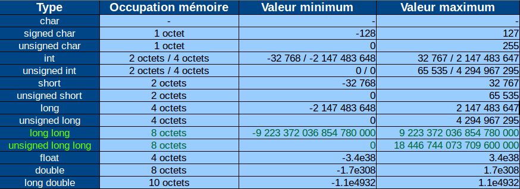
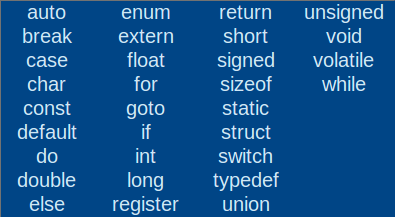

# [3. Variables](https://www.youtube.com/watch?v=kKeGTDyvi1o)

Bonjour à tous vous êtes sur votre 3e séance sur le langage c.

Aujourd'hui nous allons voir le concept le plus important de cette formation à savoir les variables.

Les variables c'est tout simplement un terme pour définir tout ce qui va concerner les données que vous allez manipuler au cours du programme, qui vont être stockés en mémoire, et qui bien évidemment seront libérés ou doivent être libérées à la fin de l'exécution de votre programme donc ça va permettre de travailler sur beaucoup d'informations, de demander des informations également, d'en afficher, de les modifier, de les exploiter et de faire des tests dessus et cetera et cetera.

On va regarder comment faire un petit peu tout ça, en tout cas introduire et par la suite avec la vidéo qui viendront sur l'information, vous pourrez mettre en pratique tout ce que vous aurez vu dans cette vidéo donc c'est vraiment l'une des plus importantes que vous allez avoir au cours de cette formation.

En tout cas si vous avez besoin de prendre des notes je vous recommande de les noter, donc je donnerais de petites choses en commentaire donc n'hésitez pas à revoir la vidéo si nécessaire.

N'hésitez pas à revoir la vidéo s'il y a des choses pas bien comprises, et à bien vous imprégner de cette notion de variable avant de passer aux autres vidéos parce que c'est vraiment ce qui fera tout le reste de votre apprentissage.

Une variable comme je vous l'ai dit, c'est tout simplement une manière de stocker des informations, c'est à dire des informations qui sont éphémères c'est à dire qu'elles vont exister le temps de l'exécution du programme et elles vont disparaître ensuite.

Des fois, elles vont même disparaître au cours de l'exécution du programme, on aura l'occasion d'en parler lorsqu'on va aborder les fonctions mais grosso modo voilà ce qu'il faut retenir ce sont des informations variables qui peuvent varier et qui seront relative parce que un moment donné elles peuvent être libérées donc elles seront supprimées de la mémoire de l'ordinateur.

Voilà ce qu'il faut savoir en petite parenthèse c'est que au niveau de l'informatique notamment même si cet écart à tendance à changer avec le temps, c'est que plus de mémoire va avoir de l'espace de stockage plus elle va être lente.

Par exemple la mémoire avec lequel nous allons travailler avec nos variables sera la mémoire vive donc la mémoire RAM c'est à dire les barrettes de mémoire sur notre ordinateur, cette mémoire est assez rapide, c'est une des plus rapides que vous pouvez avoir sur votre ordinateur, il y a aussi la mémoire du processeur qui a été encore plus rapide c'est à dire celle qui fait appel aux registres de votre CPU, et on a des mémoire lente comme votre disque dur mais l'avantage du disque dur c'est qu'il sert à stocker énormément de données et c'est pour ça qu'il est lent parce qu'il manipule énormément de données aussi bien en lecture qu'en écriture.

Voilà grosso modo pour la petite parenthèse à ce niveau-là mais de toute façon on aura l'occasion d'en reparler au cours des prochaines vidéos et au fur à mesure de ce qu'on le fera.

Avant d'aborder les variables je vais vous montrer, je vais vous montrer ce qui me semble être un petit point important parce qu'on aura l'occasion d'en utiliser de plus en plus, ce sont les commentaires.

## Commentaires

Un commentaire en langage c'est une manière de vous donner des indications sur votre code seulement utile pour le développeur c'est à dire qu'au niveau de la compilation comme on va le faire après ça ne sera pas pris en compte.

Ainsi ça va tout simplement être ignoré par le compilateur.

Par contre pour celui qui va lire le code, pour celui qui travaille dessus, surtout si c'est des projets de groupe ce sera super utile.

Alors un commentaire on peut en faire de toute manière, on peut faire un commentaire d'une seule ligne avec le symbole double slash comme ceci `//`.

```c
#include <stdio.h>

int main(void)
{

	return 0;//Ceci est un commentaire
}
```

Alors c'est un commentaire qui ne doit tenir que sur une seule ligne, vous pouvez mettre un espace après les 2 slash peu importe même plusieurs ça n'empêche pas.

L'important avec ce type de commentaire c'est que tout doit tenir sur une seule ligne mais si vous passez à la ligne suivante ce n'est plus un commentaire donc il doit tenir obligatoirement sur une seule ligne avec ce type de commentaire.

Ensuite on a le commentaire à la *c++*, commentaire qui a été introduit avec ce langage là mais que l'on retrouve également dans le langage c qui permet de se mettre sur plusieurs lignes.

Ainsi on va faire un slash étoile `/*` pour le début du commentaire, et on va terminer avec une étoile slash `*/` il a du coup vous voyez je peux mettre autant de ligne que je veux et ça va être mis entre commentaires.


```c
#include <stdio.h>

/*
	iininzg
	zzegzge
	z
	zgzgzg

	zegzge
*/

int main(void)
{

	return 0;//Ceci est un commentaire
}
```

Alors à quoi ça sert ? Ça sert à documenter son code, ça permet également d'indiquer une partie du code qui serait un petit peu plus compliqué parce que même si elle est détaillée elle devient un petit peu complexe donc on a envie de donner un petit point de rappel sur à quoi ça sert.

Donc ça peut vous servir à documenter votre code surtout que le projet est un travail de groupe, qui a lu et relu et sur lequel plusieurs personnes travaillent par exemple on peut retrouver ce genre de choses c'est à dire qu'il y a des manières de documenter par exemple en donnant une définition de la fonction, des paramètres `@param` et le type de retour `@return`.


```c
#include <stdio.h>

/*
* Fonction principale du programme
* @param Aucun
* @return 0
*/

int main(void)
{

	return 0;
}
```

Alors voilà je ne vais pas m'attarder là-dessus mais ça permet comme ça d'avoir une espèce de petit mode d'emploi au niveau des fonctions que l'on a.

Quoi qu'il en soit retenez ces 2 méthodes là c'est à dire le simple commentaire avec le double slash `//Ceci est un commentaire simple` et le commentaire sur plusieurs lignes `/* Ceci … */` mais il peut tenir sur une seule ligne bien sûr.


```c
#include <stdio.h>

int main(void)
{
	//Ceci est un commentaire simple

	/* Ceci est un commentaire
	sur plusieurs lignes */

	/* Ceci est un commentaire sur plusieurs lignes */
	return 0;
}
```

Voilà donc on peut lire ce commentaire sur une seule ligne ou plusieurs lignes `/* */`.

Ça c'était la petite parenthèse au niveau des commentaires à retenir tout au long lorsqu'on va arriver sur des projets assez conséquents.

Maintenant place aux variables qui est quand même le thème de la vidéo.

## Les types de variable

Nous allons voir qu'en langage c, il ne s'agit pas d'un typage dynamique c'est à dire que c'est un typage explicite c'est-à-dire qu'il est visible au niveau du code et il va falloir le choisir donc ça va être à vous, c'est pour ça que je vous avais parlé de langage bas niveau dans les vidéos précédentes donc c'est à vous à gérer la mémoire.

Pour cela Comment allez-vous stocker vos informations, on retrouve quelques types de variables qui sont ces différents types là.




Voilà pour les différents types, nous pourrions bien sûr en avoir différents par la suite peu importe.

Je vous rassure vous n'avez pas besoin de retenir toutes les valeurs par cœur, je ne le connais pas moi-même par coeur mais grosso modo on va travailler un peu près souvent avec les mêmes types de variables.

Vous voyez qu'avec le type char je n'ai rien mis au niveau de l'occupation mémoire même si ce serait un octet au niveau des valeurs tout simplement parce que le type char (on le verra par la suite) quand on l'utilise sur notre ordinateur, sur notre compilateur, nos configurations, le type char peut être considéré combien de temps un type signé *signed char* ou un type non signé *unsigned char* d'ailleurs on va le détailler un petit peu par la suite.

Grosso modo nous avons signed et unsigned, qu'est-ce que ça veut dire ? Si vous Regardez au niveau des valeurs, vous voyez qu'un nombre, une valeur signée, peut être soit négative (-128), soit positive (1 octet).

À partir du moment ou on parle de type non signé, vous voyez tout de suite qu'il est obligatoirement positif, c'est la seule différence en fait si on parlait en langage mathématique et qu'on demande qu'est-ce qu'un nombre Algébrique ? un nombre algébrique signifie qu'il peut être à la fois positif et négatif, Eh bien c'est un peu ce même système là voyez qu'un nombre signé comme quelque chose qui peut être à la fois positif et négatif.

Par contre c'est ce nombre et non signé, il est obligatoirement positif.

Voilà ça ce sont 2 choses à retenir indispensables au niveau des variables et qui est à savoir en langage c.

Voyez que au niveau du nom, on les repère assez facilement signed, unsigned ainsi on a le type *char* qu'on va éviter d'utiliser ainsi je vous recommande vraiment de ne pas l'utiliser dans vos programmes mais si vous avez besoin d'utiliser ce type il a préféré le type **signed char** suivant ce que vous voulez stocker ou bien le type **unsigned char**.

Ensuite on a le type *int* que l'on retrouve pareil précédé de unsigned mais attention on ne précise pas signed pour *int* parce que c'est une petite exception.

Alors bien sûr on a le type *short*, *long*, *long long*, *float*, *double*, *long double* donc on peut manipuler des valeurs très très grandes.

Ensuite on retrouve les place qu'occupe en mémoire les différents types.

```txt
Type                    Occupation mémoire
char                    -
signed char             1 octet
unsigned char           1 octet
int                     2 octets / 4 octets
unsigned int            2 octets / 4 octets
short                   2 octets
unsigned short          2 octets
long                    4 octets
unsigned long           4 octets
long long               8 octets
unsigned long long      8 octets
float                   4 float
double                  8 octets
long double             10 octets
```

Voilà ça c'est la place que ça occupe en mémoire, donc c'est par exemple vous avez oui giga de mémoire, vous avez 8000 mégaoctet de mémoire donc vous avez 8 millions de kilo-octets donc vous avez encore plus grand en octets donc on a énormément énormément d'octets donc il faut déjà énormément de variables pour remplir votre mémoire bien évidemment.

Voilà ça vous donne un aperçu de la taille que ça prend mémoire pour une seule des variables que nous allons créer.

Ensuite on a la valeur minimum que l'on peut stocker dedans.

```txt
Type                               Valeur minimum
char                                            -
signed char                                  -128
unsigned char                                   0
int                      -32 768 / -2 147 483 648
unsigned int                                0 / 0
short                                     -32 768
unsigned short                                  0
long                               -2 147 483 648
unsigned long                                   0
long long              -9 223 372 036 854 780 000
unsigned long long                              0
float                                     -3.4e38
double                                   -1.7e308
long double                             -1.1e4932
```

Alors vous verrez comment ça fonctionne pour stocker un petit peu toutes les différentes données que l'on aura.

Par exemple si vous voulez manipuler des données bancaires, on ne va certainement pas commencer à stocker des valeurs bancaires dans un type *char*, voilà un *signed char* ne permet d'aller que jusqu à 127 ce qui ne fait pas beaucoup 127€ ça veut dire que tout ce qui est au-dessus ne marcherait pas donc ça ça va être important de savoir quel type utiliser pour créer vos variables.

Grosso modo retenez dans ceux que nous allons voir, nous allons clairement utiliser le type *int* ou *unsigned int*  dans certains cas mais bon quand je vous parle d'un type, prenez bien sûr le type non signé équivalent.

Alors le type *int* vous servir à stocker des entiers d'accord simplement un nombre entier 14, 25, 1000, -500, ce genre de chose par exemple.

Alors si on veut stocker qu'un seul caractère, j'entends une lettre, on va utiliser le type *signed char* ou le type *unsigned char*.

Alors si on veut stocker un nombre à virgule par exemple 3.14, 15.4 et cetera, on va plutôt utiliser le type *float* et grosso modo nous en resterons là.

On verra après quand utilisera un type spécifique pour le *char* avec les chaînes de caractères c'est à dire du texte mais ça nous en parlerons dans une vidéo ultérieure.

Voilà maintenant nous utilisons très peu certains autres types tel que le *short* qui est assez rare et qui était utilisé à l'époque quand les mémoires étaient très très petite ou alors quand on faisait de l'embarqué parce qu'il ne faut pas oublier comme je vous l'ai dit dans la présentation du langage qu'on peut embarquer le langage sur des drones, ce genre de chose parce que là on n'a pas beaucoup de mémoire donc ça peut être utile de réduire vraiment au minimum la place que l'on prend en mémoire pour en économiser et gagner de la place.

Sinon au niveau d'un PC vous pouvez vous contenter tout simplement de *char*, *int*, *float* et ce sera très bien, vous pourrez comme ça manipuler les valeurs comme vous voulez.

Alors voilà ce tableau là je vais le mettre en description de la vidéo donc vous pouvez le récupérer le télécharger si vous voulez, ça ferait un petit mémento mais vous n'êtes pas obligé d'apprendre ça par coeur parce que ce n'est pas utile mais ça vous permet de savoir les valeurs que l'on peut atteindre par exemple le *long long* peut être très très grand ce qui peut être très utile sur des satellites par exemple ce genre de chose, je suis sûr que c'est le genre de type qui peut être utilisé dans ce genre de domaine mais ça dépend des projets sur lequel vous travaillez parce que ça prend quand même un peu plus d'espace.

voilà pour la type de variable.

## Les mots réservés

Nous allons voir maintenant pour les mots réservés mais ça j'en parlerai par la suite c'est à dire que quand on va créer une variable on va la nommer, je vous montrerai comment faire en passant au code.

Mais il faut que vous sachiez que tout ceci ce sont les mots réservés dans le langage c.



Tous ces mots là en langage c sont réservés c'est à dire que vous ne pouvez pas appeler une variable ou une fonction avec un de ces mots-là.

Voilà ce sont des mots qui vont être utilisés dans le langage et qui sont réservés donc on ne peut pas les utiliser, on aura l'occasion d'en revoir.

Voilà ça c'était la petite parenthèse au niveau de la réservation des mots.

On va pouvoir passer maintenant au code et pouvoir mettre ça en place.

Alors je vous ai globalement défini ce qui était une variable mais je vous ai pas encore montré en code comment ça se passait, on a fait beaucoup de bla-bla sur les types de variables mais ne vous en faites pas on va revenir dessus parce que vous vous êtes probablement perdu un peu dessus mais ne vous en faites pas on va voir tout ça.

Alors en langage c pour pouvoir créer une variable, il va falloir penser à 2 choses c'est-à-dire lui trouver un nom et lui choisir un type. On va commencer par le nom comme ça on sera clair à ce niveau-là, au niveau du nom moi je veux quelque chose d'explicite, il y a quelques règles.

Il y a quelques règles à respecter au niveau du nommage c'est à dire qu'on ne doit pas faire commencer son nom par un chiffre. Elle ne doit pas comporter de caractères spéciaux (é, %), elle ne doit pas avoir de caractères accentués, elle ne doit pas avoir d'espace et grosso modo c'est à peu près tout.

La variable peut commencer par contre par avoir des underscores *_* après au niveau des règles de noms ce sont des lettres et des chiffres au milieu, à la fin et cetera.

On va faire une petite variable test avec un exemple de nom de variable qui fonctionne `aireDuCarre` mais maintenant si je fais ça `aireducarre` j'ai une autre variable.

```txt
#include <stdio.h>

int main(void)
{
    aireDuCarre
    aireducarre

    return 0;
}
```

Voilà donc j'ai une autre variable pourquoi parce que la case est super importante au niveau des variables ainsi cette variable `aireDuCarre` n'est pas la même que celle-ci `aireducarre`.

Alors attention le langage est bien sensible à la case, ce sont donc 2 variables différentes, faites attention à ce niveau-là.

## Déclarer une variable

### Nommage

Au niveau des règles de nommage, il y a des règles particulières à savoir.

Alors on peut adopter une syntaxe en **camelCase** c'est à dire qu'on va écrire tous les mots en minuscules notamment le premier et à chaque fois qu'on arrive sur un nouveau mot pour le différencier on va commencer par une majuscule comme ça vous voyez que ça se lit très naturellement très facilement.

Après certains vont préférer faire `aire_du_carre` en utilisant de underscores et cetera, on peut également mettre des underscores avant `_aireDuCarre` même si ça ne sert pas à grand-chose mais ça peut être intéressant notamment quand on parlera de objet dans une autre formation où on va utiliser ce genre de syntaxe.

```txt
#include <stdio.h>

int main(void)
{
    aireDuCarre
    aire_du_carre
    _aireDuCarre

    return 0;
}
```

Alors ça exige absolument rien bien évidemment, vous faites comme vous voulez mais essayer en tout cas d'adopter toujours un petit peu le même fonctionnement c'est à dire que si vous décidez de nommer vos variables de cette manière `aireDuCarre` faites le partout dans votre programme, ne faites pas à un moment ça `aireDuCarre` puis un autre moment des variables comme ça `aire_du_carre` car vous risquez de mélanger les syntaxes.

Voilà prévoyez des conventions, des conventions de code, des conventions de nommage au niveau des variables et tenez vous à la même convention tout au long de votre projet c'est à dire que dans un même projet écrivez les variables de la même manière sinon se mélange les pinceaux.

```txt
#include <stdio.h>

int main(void)
{
    aireDuCarre

    return 0;
}
```

## Typage

Alors ça c'était au niveau du nom, on va rester en camelCase et on va lui donner un type, un type ça va dépendre de ce que vous voulez stocker moi par exemple ici pour l'aire du carré je vais dire que je vais manipuler des valeurs qui vont être assez grandes du coup je vais regarder les types de mes variables et si je veux stocker un entier parce que je ne veux pas faire des aires avec des arrondis ou des nombres à virgule.

Je veux des valeurs entières donc je vais choisir le **int** alors vous allez me dire qu'on ne peut pas avoir d'aires qui soit négatif mais si vous regardez bien on peut stocker jusqu'à la valeur maximum de 2 147 483 647 donc je pense que c'est suffisant pour pouvoir stocker ce genre de nombre.

```txt
Type    Occupation mémoire    Valeur minimum              Valeur Maximum

int     2 octets / 4 octets  -32 768 / -2 147 483 648    32 768 / 2 147 483 648
```

Alors là il y a une distinction *2 octets / 4 octets* ça dépend de l'architecture de votre processeur donc selon votre ordinateur un entier va prendre 2 octets en mémoire ou 4 donc sur les PC plus récents ça va plutôt être 4 mais j'ai quand même mis les 2 parce qu'il y a quand même une sacrée sacrée différence entre les 2.

Voilà donc faire attention par rapport à la taille que fait un entier sinon il faudra utiliser un *long* pour certains donc si vos *int* font 32 000 ne mettez pas ça mais utiliser un *long* sinon vous ne pourriez pas avoir des valeurs de plus de 32 767 et donc ça ne marchera pas au niveau de la place que peut accueillir un *int* donc il faudra utiliser un long.

Vous voyez que les *short* c'est la même chose, 32 miles aussi mais c'est automatiquement sur 2 octets.

Voilà il n'y a pas de *short* avec 4 octets donc voyez que le *short* c'est un peu le *int* normal sur 2 octets et maintenant on retrouve plus souvent le *int* sur 4 octets.

Si vous voulez travailler sur 4 octets vous pouvez utiliser *int* sans problème à ce niveau-là lors de votre compilation.

Voilà donc nous on va utiliser le *int* et on va le mettre ici au début.

```txt
#include <stdio.h>

int main(void)
{
    int aireDuCarre

    return 0;
}
```

Là `int aireDuCarre` je viens de dire que j'ai créé une variable qui s'appelle aireDuCarre et qui est de type int donc un type entier.

D'ailleurs vous verrez que la fonction main() a une valeur de retour, un type de retour par rapport au `return 0;` qu'on a ici. On en reparlera plus tard parce que ce n'est pas le sujet de la vidéo.

### Déclarer une variable de type entier

Enfin je termine par mettre un point-virgule `int aireDuCarre;` et on aura fini avec la déclaration de variable.

```c
#include <stdio.h>

int main(void)
{
    //Déclaration d'une variable de type entier (int)
    int aireDuCarre;

    return 0;
}
```

Je viens de ce qu'on appelle déclarer une variable.

C'est une déclaration seulement.

Voilà nous avons déclaré un entier et il n'y a rien dedans pour le moment, alors par défaut selon les compilateurs et les PC également soit on va mettre une valeur par défaut dans la variable et pour les compilateurs qui font les choses proprement ils mettent un 0 dans une variable de type int.

Attention quand vous déclarez quelque chose comme ça et que vous ne mettez pas de valeur par défaut, ne l'affichez pas s'il n'y a pas quelque chose dedans c'est pour ça qu'on règle générale on recommande pas mal de petites règles au niveau du langage c.

Déjà toutes vos variables doivent être déclarées en début de fonction c'est à dire qu'une fois que vous aurez votre accolade ouvrante d'une fonction `{` vous mettez à la suite toutes vos variables d'accord vous ne mettez pas comme ça des variables en plein milieu du code mais sachez que sur certains compilateurs ça peut fonctionner par exemple ici avec GCC ça fonctionne mais c'est beaucoup moins clair.

Par habitude en langage c, on le fait au début.

En c++, c'est différent car on va créer les variables au moment ou on en a besoin et pas avant même si c'est sûr que c'est plus pratique c'est l'avantage mais du coup ça a des inconvénients parce que on s'y perd un petit peu dans toutes ces variables alors que si tout est en début de fonction, on a une idée de tous les paramètres qu'on a au niveau du programme ce qui est beaucoup plus pratique.

Voilà au niveau des avantages et des inconvénients dans les 2 cas.

Maintenant vous savez comment créer une variable et en tout cas l'a déclarer et on va voir maintenant comment la manipuler.

## Manipuler une variable

### Affecter une variable

Il est recommandé également en plus de les mettre comme ça en début de fonction, de leur affecter donc de faire une affectation avec une valeur par défaut automatiquement sauf si évidemment vous prévoyez de l'utiliser comme on le verra dans des boucles comme compteur mais je vous conseille même dans ce cas-là de toujours mettre une valeur par défaut quand vous créez une variable.

Moi ici comme c'est un entier je vais mettre 0.

```c
#include <stdio.h>

int main(void)
{
    int aireDuCarre = 0;

    return 0;
}
```

Voilà on met un égal (=) pour dire qu'on affecte une valeur et 0, ça veut tout simplement dire que tu stock 0 dans aireDuCarre qui est le type *int*.

À ce niveau-là lorsqu'on va compiler, on va faire `gcc main.c -o prog` et puis ensuite on va lancer `prog`.

```powershell
gcc main.c -o prog
prog.exe

```

Voilà nous n'avons rien vu s'afficher bien évidemment.

En revanche que vous ne savez pas, le programme au niveau de la compilation a demandé au système donc Windows, de réserver un espace en mémoire de 4 octets donc Windows lui a trouvé un espace disponible et du coup il a stocké une valeur 0 à une adresse par exemple aireDuCarre va être stocké à une adresse en hexadécimal donc en 0x, admettons par exemple *0xF500DA* voilà ce qui est une adresse complètement au hasard ce n'est pas du tout ça mais c'est pour vous donner un exemple.

```c
#include <stdio.h>

int main(void)
{
    //Déclaration et affectation d'une variable de type entier (int)
    int aireDuCarre = 0;//aireDuCarre = 0xF500DA

    return 0;
}
```

Voilà c'est pour donner un exemple donc à l'adresse *0xF500DA*, et nous à stocker la valeur 0 et en ce qui concerne le langage et il associé directement cette adresse à aireDuCarre.

aireDuCarre est un peu un alias, c'est la carte d'identité, l'identité de cette adresse *0xF500DA*, c'est quand même plus compliqué à manipuler pour un être humain et lorsqu'on va l'écrire en français ce sera tout de suite beaucoup plus clair pour nous.

Voilà comment déclarer une variable donc là c'est une déclaration et affectation par défaut en tout cas voilà d'une variable de type entier.

Voilà ça ce sont les possibilités que l'on a.

Si je vais faire un nombre à virgule je vais plutôt utiliser le float mais les nombres à virgule en informatique sont représentés par des points donc par exemple `float prixReservation = 125.99;`

```c
#include <stdio.h>

int main(void)
{
    //Déclaration et affectation d'une variable de type entier (int)
    int aireDuCarre = 0;

    float prixReservation = 125.99;

    return 0;
}
```

Donc là un flottant et on a fait une déclaration et une affectation par défaut de ce type float.

On peut faire ensuite un `signed char = 12à;` dans lequel on stock un tout petit nombre, et vu que signed char prends de -128 à 127, et de 0 à 255 ans c'est un nom signé, je peux aussi c'est la petite différence faire ceci `signed char = 'A';`

```c
#include <stdio.h>

int main(void)
{
    //Déclaration et affectation d'une variable de type entier (int)
    int aireDuCarre = 0;
    float prixReservation = 125.99;
    signed char = 120;
    signed char = 'A';

    return 0;
}
```

Alors vous connaissez peut être la table ascii, qui est tout simplement un tableau qui référence certains caractères suivant un numéro par exemple numéro *65* ça va correspondre à la lettre *A* dans la table ascii, 66 c'est B, 67 c'est C, et cetera et cetera.

Du coup, on peut afficher des caractères c'est pour ça que le type s'appelle *char* pour character donc on peut comme ça afficher l'aide par lettre si on veut avec ce type de variable ou alors on peut afficher un très petit nombre si jamais vous savez que vous avez un nombre qui ne dépassera jamais 255, ça ne prendra qu'1 octet en mémoire au lieu de prendre un entier qui en prendrait 4, vous gagnez ainsi 4 fois plus de place.

```txt
Type            Occupation mémoire      Valeur minimum          Valeur maximum
char            -                       -                       -
signed char     1 octet                 -128                    127
unsigned char   1 octet                 0                       256
int             2 octets / 4 octets     -32768/-2 147 483 648   32767/2 147 483 647
```

Vous voyez que vous faites 4 fois moins donc divisé par 4, C'est ainsi beaucoup plus économe en espace mémoire.

Ainsi c'est certain nombre qui ne dépassera pas 127 ou -128, vous prenez un *signed char* et pareil vous ne prendrez qu'un seul octet en mémoire.

Penser même si ce n'est pas primordial avec les mémoires que l'on a mais si vous prévoyez plus tard de faire de la programmation sur systèmes embarqués ou autre, ou sur téléphone parce que là y a quand même beaucoup moins de mémoire même si c'est en train de changer parce que les téléphones d'aujourd'hui vont jusqu'à 4 gigas de mémoire vive sur des tablettes et des smartphones donc on est déjà sur du 4000 mégaoctet donc c'est énorme maintenant.

Ainsi attention parce que sur certains systèmes embarqués on peut avoir que quelques kilos octets de mémoire vive, c'est tout à fait possible, donc là le moindre octet est important donc c'est bien si possible de toujours essayer de prendre le type le plus petit possible au niveau de ce que vous voulez réserver dedans donc là effectivement par rapport à ce que j'ai ici ça va très bien.

```c
#include <stdio.h>

int main(void)
{
    //Déclaration et affectation d'une variable de type entier (int)
    int aireDuCarre = 0;
    float prixReservation = 125.99;
    signed char = 120;
    signed char = 'A';

    return 0;
}
```

Là effectivement ça va très bien pour ce que j'ai mais ainsi stocker un 65 dans un entier (int) ça va peut être réserver un grand espace, une grande grande place pour stocker un tout petit truc dedans alors qu'un *signed char* était suffisant.

Voilà ça c'était pour les types de variables.

Alors cette vidéo va être un peu longue, il y a beaucoup de choses à faire mais c'est vraiment un passage obligé.

Dans tous les cas et ça vaut pour toutes les vidéos de la formation, n'hésitez pas à mettre sur pause entre temps.

Voilà ça ne sert à rien de se presser si on veut apprendre les choses correctement.

Alors jusqu'ici je vous ai montré les définitions, les types, parce que j'essaie de me rappeler un peu tout ce que j'ai vu pour ne rien oublier parce qu'il y a plein plein de choses sur ça et c'est vraiment très important, le plus important du langage c et de ne rien oublier pour que vous ne soyez pas perdu par la suite.

Alors nous avons vu comment créer des variables, on peut également modifier des variables tout simplement en refaisant la même chose donc par exemple aireDuCarre est égal à 0 mais si je veux modifier sa valeur, à un moment donné, je vais noter la variable et lui dire que maintenant je lui stocke 12.

```c
#include <stdio.h>

int main(void)
{
    //Déclaration et affectation d'une variable de type entier (int)
    int aireDuCarre = 0;

    aireDuCarre = 12;

    return 0;
}
```

Voilà là j'ai fait une modification de la valeur donc on ne remet plus le type (int) parce qu'il ne s'agit pas d'une déclaration de variable puisqu'elle existe mais on dit simplement que maintenant elle est égal à 12 mais en fait ça ne veut pas dire que c'est égal ça veut dire qu'on stock 12 maintenant dans aireDuCarre.

Attention au symbole égal `=` qui ne signifie pas un égal mais ça signifie une affectation, imaginez un petit peu qu'on aurait ça en fait `aireDuCarre <= 12;` pour dire que maintenant 12 tu le stock là dedans dans ce sens là.

Alors ça c'est bon au niveau de la modification.

### Conversion de type

Maintenant une dernière petite chose au niveau de tout ce que la manipulation de variables de base en tout cas avant que l'on passe à l'affichage, il s'agit de la petite conversion ce qui peut être utile.

Dans certains cas il peut être utile de faire des petites conversions de type, vous voyez par exemple qu'un nombre entier (int) c'est un nombre qui n'a pas de décimales alors qu'un nombre flottant (float) peut avoir des décimales donc des fois ça peut être utile de vouloir récupérer que la partie entière du nombre.

On peut très bien avoir ce genre de chose.

```c
#include <stdio.h>

int main(void)
{
    //Déclaration et affectation d'une variable de type entier (int)
    float = 124.23;
    int nombre_entier = (int)nombre;

    return 0;
}
```

Voilà on peut faire ceci `int nombre_entier = (int) nombre;`, on peut très bien le coller aussi `int nombre_entier = (int)nombre;`.

Voilà donc là on fait entre parenthèse on met un nouveau type `(int)`, c'est un cast, une conversion, on dit que nombre tu vas le caster en entier et tu vas stocker ça dans une variable entière.

En faisant ça on va garder que la partie entière de 124.23 c'est à dire 124 et on va dire que la partie décimale *0.23* sera perdue donc c'est un peu comme si on avait fait ça directement.

```c
#include <stdio.h>

int main(void)
{
    int nombre_entier = 124;

    return 0;
}
```

Alors ici dans notre exemple de données ça n'aurait absolument servi à rien mais ça peut servir des fois à l'affichage quand on veut afficher qu'une partie entière de quelque chose par exemple quand on parle d'argent lorsqu'on n'a pas besoin d'afficher les centimes qui nous intéresse pas ainsi on peut décider à l'affichage de faire un cast.

Voilà on ne fait pas forcément un cast pour la modification mais à l'affichage ça peut être très utile et c'est bien de le savoir parce que si un jour vous voyez ça dans un code source que vous relisez de quelqu'un, et que vous voyez un type comme ça entre parenthèses à côté d'une autre variable ou d'une valeur voyez on pourrait très bien faire ça ça marcherait également.

```c
#include <stdio.h>

int main(void)
{
    int nombre_entier = (int)124.45;

    return 0;
}
```

Voilà ce genre de calcul est un peu inutile mais ça marcherait.

Voilà ne soyez pas étonné c'est ce qu'on appelle un cast.

C'était pour que vous sachiez et de savoir à quoi ça correspond si vous tombez dessus parce que ça peut arriver.

Voilà pour cette partie là.

Maintenant on va pouvoir passer à quelques petites choses, on va terminer avec 2 choses c'est à dire l'affichage maintenant je vais vous montrer comment on affiche nos variables et après on verra aussi comment créer d'autres types, des types spéciaux de variables en petit bonus ce qui vous servira également pour la suite.

## Afficher une variable

Pour afficher nos variables, un nombre entier, on va utiliser la fonction qu'on a vu précédemment c'est à dire printf() et on va l'afficher avec un drapeau qui est un caractère qui va nous permettre de déterminer quel type de variable nous voulons afficher ainsi on a le %d qui va concerner les nombres entiers (int). On a le %f qui va concerner le nombre flottant (float) même si ça peut être le double également, on va dire que ça correspond au float parce que c'est celui qu'on va utiliser le plus. On a le %c qui sera un caractère (char) mais rappelez vous qu'on doit éviter d'utiliser le char tout court donc on utilisera *signed char* ou *unsigned char* pour les problèmes dont je vous ai parlé parce que selon les PC on ne sait pas si char va être considéré comme un signé ou un non signé donc vous aurez des fois des résultats différents d'un PC à l'autre donc c'est bien de le préciser là si c'est un signer ou pas. Alors on le verra également plus tard mais on peut avoir %s qui permettra d'afficher les chaînes de caractères mais sachez qu'une chaîne de caractères en informatique c'est un texte (texte).

```c
#include <stdio.h>

int main(void)
{
    int nombre_entier = 45;

    /*
        %d  : nombre entier (int)
        %f  : nombre flottant (float)
        %c  : caractère (char)
        %s  : chaîne de caractères (texte)
    */

    printf("");

    return 0;
}
```

Voilà on peut comprendre comme ça, sachez que on verra les chaînes de caractères beaucoup plus tard %s mais grosso modo on va retenir les 3 : %d, %f et %c

Comme ici, il s'agissait d'un nombre entier donc je vais utiliser %d qu'on va accompagner d'un petit retour à la ligne \n donc ici avec notre `printf("%d\n", );` on s'attend à remplacer notre joker %d par une variable donc je mets le nom de la variable ici après la virgule.

```c
#include <stdio.h>

int main(void)
{
    int nombre_entier = 45;

    /*
        %d  : nombre entier (int)
        %f  : nombre flottant (float)
        %c  : caractère (char)
        %s  : chaîne de caractères (texte)
    */

    printf("%d\n", nombre_entier);

    return 0;
}
```
```powershell
gcc main.c -o prog
prog.exe
45
```

Voilà là si je fais une compilation, il m'affiche bien la valeur.

On peut également l'afficher dans un texte et retenez que à chaque endroit vous allez vouloir afficher le contenu d'une variable, vous devrez mettre un joker %d, %s selon les cas et vous pourrez afficher le nombre à sa source sans problème.

```c
#include <stdio.h>

int main(void)
{
    int nombre_entier = 45;

    /*
        %d  : nombre entier (int)
        %f  : nombre flottant (float)
        %c  : caractère (char)
        %s  : chaîne de caractères (texte)
    */

    printf("Le nombre est %d\n", nombre_entier);

    return 0;
}
```
```powershell
gcc main.c -o prog
prog.exe
Le nombre est 45
```

Maintenant si on veut afficher plusieurs variables ça marche aussi. Il suffit de séparer les variables par des virgules et ça fonctionne dans l'ordre.

```c
#include <stdio.h>

int main(void)
{
    int nombre_entier = 45;
    int autre_nombre = 16;

    /*
        %d  : nombre entier (int)
        %f  : nombre flottant (float)
        %c  : caractère (char)
        %s  : chaîne de caractères (texte)
    */

    printf("Le nombre est %d ou %d.\n", nombre_entier, autre_nombre);

    return 0;
}
```
```powershell
gcc main.c -o prog
prog.exe
Le nombre est 45 ou 16.
```

Voilà il faut que sa suite un ordre logique, et la même chose on peut afficher les variables comme ça dans le printf() ça fonctionne.

Voilà vous savez comment afficher le contenu de variable dans un printf() sans problème.

Alors petite astuce au niveau du float et que je fais ici par défaut donc remplaçant un %f par un nombre flottant, vous allez voir que le nombre de décimales est très important.

```c
#include <stdio.h>

int main(void)
{
    float prix = 178.25;

    /*
        %d  : nombre entier (int)
        %f  : nombre flottant (float)
        %c  : caractère (char)
        %s  : chaîne de caractères (texte)
    */

    printf("Le prix est de %f euros.\n", prix);

    return 0;
}
```
```powershell
gcc main.c -o prog
prog.exe
Le prix est de 178.250000 euros.
```

Et là vous voyez qu'il me met que le prix est de 178.250000 donc là ce n'est pas un souci parce qu'il gère ce type avec un certain nombre de décimales, un certain nombre de nombres significatifs alors pour le changer il suffit tout simplement de préciser dans le joker le nombre de caractères que vous voulez après si par exemple je n'en veux que 2 dans les virgules je vais mettre `%.2f`

```c
#include <stdio.h>

int main(void)
{
    float prix = 178.25;

    /*
        %d  : nombre entier (int)
        %f  : nombre flottant (float)
        %c  : caractère (char)
        %s  : chaîne de caractères (texte)
    */

    printf("Le prix est de %.2f euros.\n", prix);

    return 0;
}
```
```powershell
gcc main.c -o prog
prog.exe
Le prix est de 178.25 euros.
```

Voilà donc .2 signifie que après le point je ne veux que 2 caractères suivi par un joker pour les floatant et il a fait du bien 178.25

Ainsi ça ce sera la petite astuce qui vous sera très utile, admettons maintenant que j'en mette 3, on aura 178.250

```c
#include <stdio.h>

int main(void)
{
    float prix = 178.25;

    /*
        %d  : nombre entier (int)
        %f  : nombre flottant (float)
        %c  : caractère (char)
        %s  : chaîne de caractères (texte)
    */

    printf("Le prix est de %.3f euros.\n", prix);

    return 0;
}
```
```powershell
gcc main.c -o prog
prog.exe
Le prix est de 178.250 euros.
```

Voilà petite astuce très utile, si je mets .3, on aura donc du coup 3 décimales dont 250.

Petit rappel à retenir pour le float.

Pour le %s ça nous servira aussi si on veut savoir le nombre de caractères qu'on récupère d'un mot ou d'un texte mais nous n'allons pas avoir les chaînes de caractères tout de suite, on en est encore loin et on verra ça dans plusieurs vidéos au niveau de la formation.

Alors je n'en parle pas pour le moment mais je vous fais un petit rappel pour que vous ayez de quoi avoir quelques petites notes mais c'est tout.

## Quelques mots-clés réservés

Maintenant on va terminer avec quelques petits mots-clés très intéressant au niveau de la création des variables.

Au niveau des variables vous avez plusieurs possibilités par exemple je vais noter une variable en majuscule `float PI = 3.14;` sachant que la valeur de pi en mathématique c'est égal à 3,14 et ensuite je vais l'afficher.

```c
#include <stdio.h>

int main(void)
{
    float PI = 3.14;

    printf("PI = %.2f\n", PI);

    return 0;
}
```
```powershell
gcc main.c -o prog
prog.exe
PI = 3.14
```

Voilà j'exécute tout ça et il me met que PI est égal à 3.14 mais admettons maintenant que j'ai envie de dire que PI est égal à 5.13 admettons, que ce soit une erreur humaine que j'ai modifié cette constante alors qu'on ne doit pas le faire en mathématiques.

```c
#include <stdio.h>

int main(void)
{
    float PI = 3.14;

    printf("PI = %.2f\n", PI);

    PI = 5.13;

    printf("PI = %.2f\n", PI);

    return 0;
}
```
```powershell
gcc main.c -o prog
prog.exe
PI = 3.14
PI = 5.13
```

Voilà admettons qu'on est modifié PI parce qu'on n'a pas compris que c'était la constante mathématique, et là je viens de changer la valeur de PI d'accord ce qui n'est juste pas possible, si on change la valeur de PI vous imaginez bien le bazar que ça ferait donc on a besoin d'avoir une constante.

On savait dans le programme que PI ne pourra jamais être modifiée même par l'erreur d'un développeur.

Pour cela on va utiliser un mot-clé qui se trouve dans les mots réservés.


### const

Voilà il s'agit du mot *const* pour dire que la variable est constante donc on le met comme ceci `const float PI = 3.14;` donc PI est un flottant constant et là vous allez voir la différence.

```c
#include <stdio.h>

int main(void)
{
    const float PI = 3.14;

    printf("PI = %.2f\n", PI);

    PI = 5.13;

    printf("PI = %.2f\n", PI);

    return 0;
}
```
```powershell
gcc main.c -o prog
main.c: In function 'main':
main.c:9:8: error: assignment of read-only variable 'PI'
    9 |     PI = 5.13;
      |        ^
```

Ainsi la différence c'est que à la compilation, il me dit que j'essaye d'assigner une nouvelle valeur à PI alors qu'il n'est accessible qu'en lecture donc lecture seule ça veut dire qu'on ne peut pas le modifier en écriture donc on ne peut pas faire cette ligne là `PI = 5.13;` ce qui n'est pas possible.

Du coup vous vous assurer que votre constante gardera la même valeur, et là tout de suite voilà on ne pourra pas changer la valeur de pi.

```c
#include <stdio.h>

int main(void)
{
    const float PI = 3.14;

    printf("PI = %.2f\n", PI);

    printf("PI = %.2f\n", PI);

    return 0;
}
```
```powershell
gcc main.c -o prog
prog.exe
PI = 3.14
PI = 3.14
```

Voilà on ne peut pas changer la valeur de pi donc ça c'est le premier mot clé qui est à retenir et qui sera forcément très utile ainsi si vous avez une variable comme ça où vous êtes sûr qu'il y a un paramètre qui du coup ne changera pas, ça pourrait être aussi par exemple le pourcentage de TVA `const int TVA = 20;` ou alors si on veut être plus précis parce qu'avant La TVA était de 19.6 `const float TVA = 19.6;`.

```c
#include <stdio.h>

int main(void)
{
    const float PI = 3.14;
    const float TVA = 20.0;

    printf("PI = %.2f\n", PI);

    printf("PI = %.2f\n", PI);

    return 0;
}
```

Ainsi si un jour vous avez besoin de faire un programme et que la TVA risque de changer, admettons qu'elle passe à 22% vous aurez juste à changer une seule ligne et c'est bon `const float TVA = 22.0;` et c'est bon tous vos calculs seront mis à jour grâce à cette petite modification puisqu'il s'agira d'une constante.

Une fois que cette constante est déclarée et affectée, elle ne peut plus changer, elle est immuable cette valeur c'est à dire qu'on ne pourra plus jamais là modifier grâce au mot clé *const*.

## volatile et register

Alors il y a 2 autres mots-clés donc vous n'allez pas forcément utiliser mais c'est pour la culture générale parce qu'il y en a plein qui n'en parle jamais parce que quand certains tombent dessus par hasard ils se disent qu'ils ne connaissaient pas mais moi je vais vous en parler parce que c'est super important de le savoir, c'est le mot clé *register* et *volatile*.

On y va.

```c
#include <stdio.h>

int main(void)
{
    register int nombre = 5;
    volatile int autreNombre = 10;

    return 0;
}
```

Voilà en quoi ça consiste ? Alors si vous vous rappelez nous avions parlé des registres, nous parlons des registres au niveau des processeurs qui est la mémoire la plus rapide que vous avez sur votre ordinateur avec la mémoire cache qui est associée.

Alors c'est très très rapide, c'est une mémoire qui est très petite parce que la mémoire cache c'est une mémoire qui ne fait que quelques petits octets si vous regardez sur votre processeur, si vous Regardez sur la fiche, on peut avoir des mémoires cache notées L1, L2, L3 de 3 mégas, 8 mégas, voir 12 mégas pour ceux qui ont vraiment un gros processeur mais ça ne fait pas beaucoup si on compare aux gros processeurs de plusieurs milliers de gigas donc là oui forcément on se retrouve avec une sacrée différence.

Ainsi cette mémoire des registres du processeur comme elle est très petite, elle est très très très rapide au niveau des calculs.

Au niveau du langage c, à l'époque surtout, on avait tout intérêt à préciser ce mot réservé *register* qui se retrouve d'ailleurs dans notre liste.


Voilà on retrouve bien *register* et d'ailleurs *volatile* s'y retrouve aussi ce qui est logique parce que ce sont des mots réservés au niveau du langage.

Alors on utilise *register* pour dire que notre variable ne va pas être stockée dans la mémoire vive de l'ordinateur donc là RAM du PC mais directement dans les registres comme ça on s'assurait tout simplement que cette variable était manipulée plus rapidement.

Avec *register*, elle était prioritaire.

On pouvait gérer comme ça la priorité des variables ce qui rendait le programme plus performant, plus rapide.

À l'inverse *volatile* signifie simplement que cette variable ne devait jamais passer dans les registres, elle devait toujours toujours être dans la mémoire RAM donc être volatile, absolument volatile comme ça on était sûr mais pourquoi ? Alors pour 2 raisons tout simplement parce qu à l'époque la mémoire n'était pas aussi performante, on avait des fois besoin d'accélérer certaines parties programme donc on utilisait le mot *register* et dans d'autres cas *volatile* était super important tout simplement parce que au niveau des périphériques tel que la souris, le clavier, et cetera, on disait que ce qui était en registre n'était pas accessible.

Ce qui était enregistrer n'était pas accessible parce qu'il y a comme ça des couches de protection par le système où le périphérique va communiquer avec la RAM mais il ne va pas commencer à les communiquer avec les registres parce que ça c'est le système qui va choisir donc du coup il y a certaines informations certaines données si vous vouliez les manipuler avec la souris, on n'avait plutôt pas intérêt à ce que la variable se retrouve dans les registres sinon votre souris n'aurait tout simplement pas pu travailler avec ou même n'importe quel autre périphérique tel que le clavier, vous ne pourrez pas interagir avec ce type de données.

Ne pas interroger avec des données qui sont enregistrés en registre c'est plutôt embêtant.

Alors maintenant honnêtement c'est 2 mots-là ne sont pas utiles : *register* et *volatile*

Alors honnêtement je vous déconseille de les utiliser, ça ne sert à rien surtout parce que vos compilateur actuel dans leur version récente, même si votre compilateur date d'il y a 3 ou 4 ans ce sera la même chose parce que les compilateurs vont gérer ça eux-mêmes et le système d'exploitation c'est pareil.

C'est à dire qu'en mettant simplement comme ça.

```c
#include <stdio.h>

int main(void)
{
    int nombre = 5;

    return 0;
}
```

Alors quand on écrit ça comme ça `int nombre = 5;` c'est le compilateur qui va décider si cette variable est nécessaire de la passer dans les registres pour accélérer l'exécution des programmes ou alors s'il a tout intérêt à la laisser dans la mémoire RAM par exemple si c'est pour stocker une entrée sur un clavier dans un jeu vidéo, pour entrer une commande et cetera donc ça aurait tout son intérêt de rester accessible par les périphériques.

Alors tout ceci s'est fait par l'os, c'est fait par le compilateur.

Les mots clés *register* et *volatile* c'est bien de le savoir parce qu'il est possible qu'un jour vous tombiez sur un vieux programme qui date de plusieurs années et vous pourriez retrouver ces mots là comme ça vous saurez à quoi il sert vous nous retrouverez pas avec des mots inconnus dans un langage que pourtant vous maîtrisez.

Voilà maintenant vous savez à quoi ça sert et donc quelqu'un ça peut être utile mais je vous déconseille de les utiliser parce que la plupart du temps il serait peut être m'améliorer ces mots là mais pourtant si je compris ça va fonctionner, voyez.

```c
#include <stdio.h>

int main(void)
{
    register int nombre = 5;

    return 0;
}
```
```powershell
gcc main.c -o prog
prog.exe

```

Voilà si je compile mon compilateur ne va rien dire par contre il va carrément ignorer, il y a de fortes chances qu'il ait complètement ignoré le mot-clé *register* donc de fortes chances qu'il n'ait même pas mis le mot enregistre parce qu'il aurait estimé que ça ne servait à rien.

Surtout que c'était un petit entier donc il n'y a aucun intérêt à ce que le compilateur ai le mettre dans les registres, comme en plus c'est le compilateur qui était un petit peu le chef du système donc c'est lui qui décide.

Voilà donc ça c'était pour ce que vous ayez connaissance de ces 2 mots clés mais ne les utilisaient pas.

Contentez vous juste d'utiliser si vous avez besoin une valeur constante, avec le mot-clé *const*.

Alors une petite indication lorsqu'on met une valeur en constante, en langage c'est une norme, une règle, on écrit le nom de la variable en majuscule comme ci-dessous.

```c
#include <stdio.h>

int main(void)
{
    const int NOMBRE = 5;

    return 0;
}
```

Voilà on met le les variables constantes en majuscules pour pouvoir les différencier comme on l'avait fait également pour la valeur de pi `const float PI = 3.14;`.

Ainsi en mettant en majuscule on arrive bien à distinguer ce qui est une constante et ce qui ne l'est pas parce que quand on veut l'afficher, le fait de tout de suite marquer une majuscule on va savoir que c'est une constante ce qui est de suite plus clair et plus pratique.

Dernier petit conseil pour terminer, au niveau des variables, on voit souvent une idée reçue en ce qui concerne les développeurs qui pourtant ont énormément d'expérience dans leur domaine même si ça peut faire peur en entendant ça et ce qui était problématique sur les très vieux langages donc des langages il y a plus de 25 ou 30 ans même peut être encore avant ou on manipulait la mémoire de manière assez archaïque … c'est qu'à l'époque pour de très vieux langages, le nom des variables que vous utilisez par exemple vous pouvez avoir des variables qui s'appelaient `int a, aa, j;`

Pourquoi des variables qui s'appelaient comme ça ? Alors ce n'était pas pour compliquer la tâche des développeurs, c'est simplement que le nommage des variables et ça ne concerne pas forcément que le langage c prenait de la place.

Tout simplement parce que si vous aviez des noms à rallonge vous n'aviez plus assez de mémoire pour le programme en lui-même donc on était obligé de procéder comme ça.

Alors maintenant sur les langages actuels aussi bien le c++ que le c, le python, surtout le langage de la formation, vous n'avez aucun intérêt à noter des variables comme ça `int a, aa, j;` parce que si un jour vous faites `int tab;` pour un tableau comme on le verra plus tard OK c'est bien mais c'est un tableau de quoi ?

Pareil si vous mettez un âge `int âge;`, très bien mais du coup c'est l'âge de quoi ? L'âge de qui ? On ne sait pas et du coup ce n'est pas assez clair.

Moi je vous recommande vraiment et ça ne devrait pas poser de soucis, parce que l'idée reçue c'était que de mettre des noms de variables trop long ça pouvait poser problème alors que c'est tout l'inverse, là-dessus je suis catégorique parce que écrire `int age;` ce n'est pas clair du tout, ce n'est pas lisible et ça va même des fois obliger le développeur à mettre des commentaires supplémentaires comme ceci.

```c
#include <stdio.h>

int main(void)
{
    //Age de l'utilisateur
    int age;

    return 0;
}
```

D'accord alors qu'on pourrait résoudre le problème en faisant comme ceci.

```c
#include <stdio.h>

int main(void)
{
    //Age de l'utilisateur
    int age;

    int ageUtilisateur;

    return 0;
}
```

Voilà déjà comme ça vous enlever du commentaire, ça enlève de la documentation inutile parce que clairement dans ce cas-là c'est inutile au niveau du code et surtout c'est beaucoup plus clair.

```c
#include <stdio.h>

int main(void)
{
    int ageUtilisateur;

    return 0;
}
```

Quelqu'un qui risquerait de relire votre programme même vous plus tard dans plusieurs années, lorsque vous allez vouloir travailler dessus, c'est quand même beaucoup plus facile avec un nom explicite voilà c'est plus facile à manipuler.

On peut comprendre si on a 3 ou 4 variables mais quand on a 50 ou 100 ça devient un peu plus compliqué donc voilà vous pouvez mettre des noms à rallonge tels que ceci par exemple.

```c
#include <stdio.h>

int main(void)
{
    int ageUtilisateurPremierLancementFenetreInscription;
    int age;

    return 0;
}
```

Voilà ici on a un petit peu abusé on a fait vraiment un nom à rallonge, mais ça à la rigueur c'est 100 fois mieux d'appeler notre variable comme ceci *ageUtilisateurPremierLancementFenetreInscription* au lieu de l'appeler comme ça *age*.

Des fois on peut même retrouver ce genre de nom *uage* pour l'âge de l'user et dans ces cas-là on ne comprend pas à quoi sert le U on pourrait même penser que c'est une faute de frappe et cetera.

```c
#include <stdio.h>

int main(void)
{
    int ageUtilisateurPremierLancementFenetreInscription;
    int age;
    int uage;

    return 0;
}
```

Ainsi préférez les noms à rallonge parce que en langage c surtout sur les langages modernes, un nom à rallonge ne va pas prendre plus de place en mémoire ce qui ne va absolument pas rendre votre programme moins performant que d'utiliser une variable avec seulement 3 lettres. C'est complètement faux et ça ne va absolument rien changer.

Voilà préféré des noms à rallonge explicite ça va vous économiser, il est 100 fois mieux d'avoir une variable explicite pour savoir ce qu'elle contient plutôt que de mettre *age* comme on l'a vu tout à l'heure et puis d'écrire en commentaire que ça correspond à l'âge de l'utilisateur quand il s'inscrit sur le site ou je ne sais quoi..

```c
#include <stdio.h>

int main(void)
{
    //Age de l'utilisateur quand il s'inscrit
    int age;

    return 0;
}
```

Voilà ce genre de code est complètement inutile et ça rajoute de la documentation.

Alors c'est une petite confidence mais sachez que les développeurs en général n'aiment pas la documentation, il n'aime pas lire les commentaires et donc la documentation des programmes même si moi personnellement ça ne me dérange pas mais il y en a beaucoup qui ça dérange donc il faut préférer un nom de variable qui est explicite plutôt que de se taper 15 pages de documentation ou des commentaires sur 10 15 ou 20 lignes pour dire que telle variable sert à faire telle chose.

Honnêtement préféré des noms explicites, claires, où on sait sur quoi on travaille plutôt que de commenter tout ce que vous avez fait parce que au final on ne comprend rien.

Voilà ça c'est le petit conseil qu'on peut dire pour terminer cette vidéo a su tout au long de cette formation et dans d'autres langages de programmation bien sûr.

Après si vous faites du cobolt, ou des vieux langages comme ça de genre, vous verrez de toute façon si vous travaillez sur ce genre de langage vous savez déjà ce qu'il en est, vous savez que dans ce genre de langage c'est différent mais pour les langages dits modernes même si le langage c est vieux il est considéré comme un langage moderne, utiliser ce genre d'astuces c'est à dire des noms explicites dans vos variables.

Voilà nous terminons ici c'était une vidéo assez longue où il y avait vraiment beaucoup beaucoup de choses.

Si vous avez des questions ou besoin d'éclaircissements, que vous voudriez savoir autre chose parce qu'on est loin d'avoir tout abordé au niveau des variables, n'hésitez pas on en parlera dans les commentaires de la vidéo sans problème.

Pour la prochaine vidéo, on fera une vidéo vraiment plus courte sur les entrées sorties donc on verra comment afficher d'autres types de données avec printf() donc on apprendra et tout utiliser printf() de manière un petit peu plus avancé et on verra comment saisir des données au clavier c'est-à-dire par exemple demander à l'utilisateur quel âge as-tu ? ou entrez le nombre de joueurs : 

Bref ce genre de chose, on verra comment faire parce que de toute façon il fallait connaître les variables pour faire ce genre de choses et vous apprendrez une nouvelle fonction.

On travaillera donc avec printf() et scanf() dans la vidéo suivante on en restera là pour les variables.

J'espère en tout cas que vous aurez appris pas mal de petites choses.

N'hésitez pas à bien voir la vidéo et à prendre des notes, ou à vous servir de note que j'ai mis comme ça ici en commentaire au fur et à mesure de la vidéo et nous on se retrouve à très bientôt.

Bon apprentissage à tous