# [11. Pointeurs](https://www.youtube.com/watch?v=Qra-0U_jEKs)

Bonjour à tous, bienvenue sur votre formation en langage c.

Aujourd'hui nous allons parler des pointeurs, c'est la onzième séance et s'il y a une notion que vous devez absolument assimilés obtenir voir et revoir au niveau de la vidéo si nécessaire c'est celle ci.

Les pointeurs c'est vraiment la notion la plus importante du langage c c'est ce qui fait toute la puissance de ce langage d'ailleurs et vous allez vous rendre compte par la suite, déjà dans cette vidéo et surtout avec les notions avancées que nous allons voir que nous pouvons et nous ne pourrons plus nous en passer d'accord donc c'est vraiment quelque chose qui est bien assimilé, bien à comprendre.

C'est en général très difficile à assimiler pour ceux qui apprennent apparemment.

Personnellement en tout cas, je ne vois pas où est la complication dans
cette notion mais je pense que si je vous l'explique avec les bons exemples que je vous montre les bons schémas vous devriez normalement comprendre parfaitement.

L'objectif c'est donc qu'à la fin de cette vidéo, c'est que vous sachiez ce qu'est un pointer, à quoi il sert donc quelle est son utilité dans un programme en langage c et comment on s'en sert tout simplement.

Si vous savez tout ça, ce sera parfait pour vous et ce sera très bien aussi pour moi.

Voilà alors on va déjà venir commencer en tout cas par des choses que vous connaissez d'accord c'est-à-dire qu'avant de commencer à voir des nouveautés, on va voir déjà ce que vous savez faire.

Alors je prend mon petit programme dans mon éditeur et la ligne de commande pour pouvoir compiler par la suite comme d'habitude et on va regarder une chose que vous faites depuis pas mal de temps déjà, depuis les toutes premières vidéos mais on va entrer un peu plus dans les détails.

```c
#include <stdio.h>

int main(void)
{
    int nombre= 100;

    return 0;
}
```

Je crée une variable de type int `int nombre= 100;` donc un entier c'est-à-dire que ce n'est pas un nombre à virgule et je lui affecte donc je fais une affectation donc je le déclare et je l'initiale à 100.

Qu'est ce qu'il se passe dans la mémoire ? parce qu'on n'était pas rentrer dans les détails à ce niveau-là, qu'est ce qu'il se passe au niveau du système ? eh bien on demande l'autorisation au système d'exploitation que ce soit Windows, GNU linux, Mac os, peu importe le système, un emplacement mémoire pour pouvoir y stocker ce nombre.

Alors vous savez par rapport à la vidéo sur les variables qu'un entier ça prend 4 ou 8 octets selon l' architecture donc le système va voir s'il y a une place de 4 ou 8 octets de libre dans la mémoire.

Quand je parle donc de la mémoire, je parle de la mémoire vive, la RAM, les barettes RAM que vous avez dans votre ordinateur donc c'est cette mémoire là dont il s'agit et s'il trouve la place de libre, donc en général vous en avez largement, il va donc vous allouez cet espace et vous allez pouvoir y stocker quelque chose.

Alors comment ça se passe concrètement ? eh bien on va schématiser de cette
manière-là.

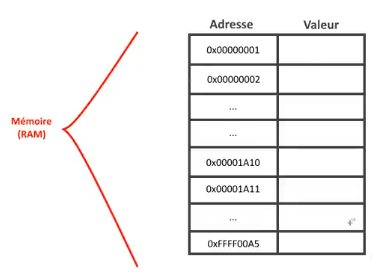

J'ai schématisé très simplement comment se passe la mémoire d'accord la mémoire vive donc la mémoire RAM.

J'ai mis des adresses alors vous ne faites pas attention aux valeurs ici elles ne sont pas du tout vrai d'accord c'est simplement pour indiquer qu'en général les adresses sont en général indiquées en hexadécimal, c'est pour ça que ça commence par zéro x et ensuite toute une série de chiffres voir de lettre puisqu'on est en hexadécimal `0x...`.

Ainsi ne faites pas attention parce que j'ai mit des valeurs aux hasards vraiment pour schématiser plutôt de mettre juste 1, 2, 3, 4, 5 j'ai  vraiment mis des adresses pour comprendre qu'il s'agit vraiment d'adresses.

L'adresse c'est comme l'adresse postale que vous avez vous, c'est quelque chose qui va permettre d'avoir l'identité en fait d'une donnée enregistrée en mémoire et on va avoir du coup une valeur.

Alors par rapport à ce qu'on a fait ici, le système à chercher une place de
libre tiens on va prendre la première de mon tableau pour ne pas compliquer les choses.

On veut par exemple ici une place de 4 ou 8 octets, alors on va tout simplement mettre nombre comme ici `int nombre= 100;` et du coup y stocker la valeur de 100.

Voilà comment ça va se passer.

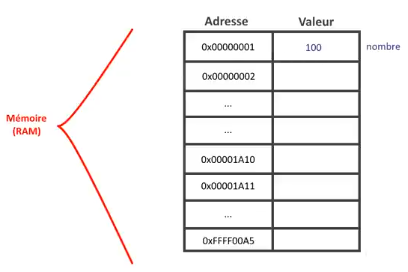


Ok donc ça c'est très simple, il n'y a rien de compliqué à ce niveau-là, vous avez bien compris je pense comment ça se passe dans la mémoire.

Du coup, on a dans la mémoire de l'ordinateur une adresse donc celle-là `0x00000001` par exemple qui du coup permet de retrouver une valeur qui est associée.

*nombre* en fait rappelez-vous c'est simplement une petite étiquette au niveau de votre code.

Au niveau de la mémoire vive, il n'y a pas de nombre ou de point_de_vies ou je ne sais quel nom de variables ça c'est pour vous, pour votre code.

Au niveau de la mémoire pour le système, il n'y a que des adresses et il travail avec ce que appel un adressage tout simplement un adressage mémoire donc on a cette valeur-là donc ça vous savez faire maintenant vous comprenez un petit peu comment ça se passe.

Je ne rentre pas dans les détails mais surtout dans les choses plus technique.

Si vous voulez en savoir un peu plus sur tout ce qui est mémoire, tout ce qui est fonctionnement donc voilà des différentes mémoires, fonctionnement du système plus en avant, il y a la formation hacking sur la chaîne qui est disponible pour ça.

Là on va vraiment se contenter de ce qui est nécessaire pour notre formation en langage c et ceux qui veulent un peu plus, qui veulent en savoir un peu plus iront sur l'autre formation que je propose sur la chaîne.

Voilà alors on va continuer maintenant un petit peu plus loin, on va voir un peu comment se passent les choses puisque le but c'est quand même d'introduire les pointeurs.

On va poser un problème très simple qui est souvent repris d'ailleurs c'est un exemple qui est souvent repris puisqu'il est très clair je pense donc je ne vais pas forcément faire exception donc je vais reprendre cet exemple-là aussi mais je vous donnerai d'autres choses par la suite comme exemple, c'est la possibilité d'inverser des nombres d'accord alors je vais faire ceci.

```c
#include <stdio.h>

int main(void)
{
    int nombreA = 15;
    int nombreB = 28;

    printf("AVANT : A = %d et B = %d\n", nombreA, nombreB);

    return 0;
}
```

Alors je vais un peu vite puisque rien n'est très compliqué ici, je vais faire un petit printf() et on va dire qu'avant il y a A qui est égal à quelque chose et B est égal à quelque chose aussi `printf("AVANT : A = %d et B = %d\n", nombreA, nombreB);`.

## Passage par valeurs

Ensuite on va faire une petite fonction pour pouvoir intervertir les deux nombres et ensuite on affichera le résultat après.

La fonction va être très simples de nom, inverser_nombres() et elle prend en paramètres le nombre A et le nombre B.

```c
#include <stdio.h>

int main(void)
{
    int nombreA = 15;
    int nombreB = 28;

    printf("AVANT : A = %d et B = %d\n", nombreA, nombreB);
    inverser_nombres(nombreA, nombreB);
    printf("APRES : A = %d et B = %d\n", nombreA, nombreB);

    return 0;
}
```

Voilà ça c'est l'appel que j'aimerais faire avec cette fonction, je vais du coup reprendre ça `inverser_nombres(nombreA, nombreB);` et comme elle ne retourne rien dans mon cas je met void et voilà.

```txt
void inverser_nombres(nombreA, nombreB)
{

}
```

Alors ici j'ai mis les mêmes noms `nombreA` et `nombreB` mais j'aurais pu mettre autre chose `nb1`, `nb2` je peux mettre n'importe quoi mais je garde exceptionnellement les mêmes noms, vous allez comprendre pourquoi, surtout pour vous rendre compte vraiment voilà de tout ce qui est porté de variable dont on a parlé un petit peu avant mais là vous allez voir effectivement une mise en pratique de tout ça.

Alors comment ça va se passer au niveau de l'inversion des nombres, comment on inverse deux nombres ? en général, au plus simple, en tout cas parce qu'il y a des langages comme le Python qui permet d'inverser deux nombres comme ça juste entre eux directement ainsi c'est géré directement par le langage.

En c, on va être obligé d'utiliser une variable temporaire donc on va faire une variable par exemple `int temporaire = 0;` que j'initiale à 0 pour rester propre.

```txt
void inverser_nombres(nombreA, nombreB)
{
    int temporaire = 0;
}
```

Voilà pour initialiser une variable de base.

Ensuite là, on va sauvegarder dans temporaire le nombreB d'accord pour ne pas le perdre.

```txt
void inverser_nombres(nombreA, nombreB)
{
    int temporaire = 0;

    temporaire = nombreB;
}
```

Du coup, maintenant qu'on la sauvegardée, on peut écraser nombreB avec le nombreA et je pense que là vous suivez normalement.

```txt
void inverser_nombres(nombreA, nombreB)
{
    int temporaire = 0;

    temporaire = nombreB;
    nombreB = nombreA;
}
```

Et ensuite, rappelez-vous, on a perdu nombreA donc nombreA, on va y mettre temporaire voilà.

```txt
void inverser_nombres(nombreA, nombreB)
{
    int temporaire = 0;

    temporaire = nombreB;
    nombreB = nombreA;
    nombreA = temporaire;
}
```

Voilà c'est très simple d'accord je ne vais pas m'attarder dessus ainsi le nombreB que je sauvegarde dans la variable temporaire `temporaire = nombreB;` donc temporaire devient nombreB. Ensuite nombreA dans nombreB donc on enlève ce qu'il y a dans le B qui devient A `nombreB = nombreA;`. Et enfin comme on avait B dans temporaire, ça devient nombreB `nombreA = temporaire;`.

Voilà on a donc effectivement bien inverser les deux nombres à la fin.

D'ailleurs, j'ajoute des printf() pour vous montrer que ça fonctionne.

```c
#include <stdio.h>

void inverser_nombres(int nombreA, int nombreB)
{
    int temporaire = 0;//B

    printf("FONCTION AVANT : A = %d et B = %d\n", nombreA, nombreB);

    temporaire = nombreB;
    nombreB = nombreA;
    nombreA = temporaire;

    printf("FONCTION APRES : A = %d et B = %d\n", nombreA, nombreB);
}

int main(void)
{
    int nombreA = 15;
    int nombreB = 28;

    //printf("AVANT : A = %d et B = %d\n", nombreA, nombreB);
    inverser_nombres(nombreA, nombreB);
    //printf("APRES : A = %d et B = %d\n", nombreA, nombreB);

    return 0;
}
```
```powershell
gcc main.c -o prog
prog.exe
FONCTION AVANT : A = 15 et B = 28
FONCTION APRES : A = 28 et B = 15
```

Voyez qu'avant on a 15 et 28, et qu'après avec les fameuses 3 instructions qu'on a ici, le remplacement ainsi on a bien les nombres qui sont inversés.

```txt
temporaire = nombreB;
nombreB = nombreA;
nombreA = temporaire;
```

En voyant ça, on pourrais se dire que la fonction fonctionne, il n'y a pas de bug, tout est bon et du coup je peux l'utiliser dans mon programme donc on va virer les petites vérifications car on en a plus besoin.

```c
#include <stdio.h>

void inverser_nombres(int nombreA, int nombreB)
{
    int temporaire = 0;//B

    temporaire = nombreB;
    nombreB = nombreA;
    nombreA = temporaire;
}

int main(void)
{
    int nombreA = 15;
    int nombreB = 28;

    printf("AVANT : A = %d et B = %d\n", nombreA, nombreB);
    inverser_nombres(nombreA, nombreB);
    printf("APRES : A = %d et B = %d\n", nombreA, nombreB);

    return 0;
}
```
```powershell
gcc main.c -o prog
prog.exe
AVANT : A = 15 et B = 28
APRES : A = 15 et B = 28
```
On va afficher les fameux printf() dans main() c'est ceux-là qui nous intéresse.

Je recompile puis exécute, un petit prog.exe et là on voit que le changement ne s'est pas fait.

On voit que A est toujours égal à 15 et B est égal à 28.

Pourquoi on n'a pas eu de changement cette fois ci alors que nous en avions eu un dans la fonction ? eh bien ça rejoint ce qu'on avait vu précédemment quand je vous avais parlé de porté des variables je vous avais dit, ça c'est à retenir, c'est vraiment une règle importante, très très importante aussi, qu'**une variable locale donc qui est créer ou en tout cas qui existe dans une fonction est détruite à la fin de cette fonction**.

C'est à dire que là, la variable nombreA qui est dans la fonction main() c'est une autre variable que la variable nombreA qui de la fonction inverser_nombres() d'accord.

En réalité là, ce qu'on a fait, c'est ceci.

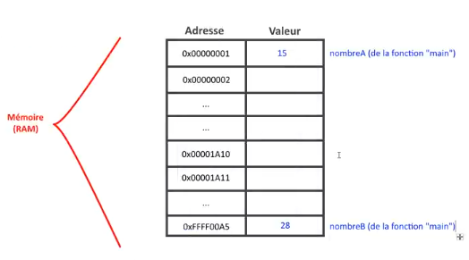

Alors il ne sont pas forcément stocké à la suite, pour des variables isolées ça peut être mis un peu n'importe où. Alors quand on appelle la fonction inverser_nombres(), elle prend des paramètres, ça va recréer des variables nombreA et nombreB et voilà ici.


Alors normalemnt ici je ne vous apprend rien, tout ça on avait déjà vu avant. Voilà cette vidéo va être un petit peu longue mais je pense que c'est vraiment utile d'allonger un petit peu la vidéo parce qu'il y a beaucoup de choses à vous expliquer et je veux vraiment que vous ayez bien compris cette notion, c'est la plus important.

Même si la vidéo prend une heure c'est pas bien grave, au moins vous aurez toutes les applications.

Le but c'est qu'à la fin vous ayez vraiment tout compris et que vous puissiez attaquer la suite sans problème, sans être bloqués quoi que ce soit donc ça va rallonger un peu la vidéo mais je pense que c'est vraiment nécessaire surtout avec les schémas.

Voilà donc grosso modo ce qu'on vient de faire.


Vous voyez donc on a créé d'autres variables en fait c'est un peu des copies c'est-à-dire que nombreA ici `0x00001A10` c'est une copie au niveau de la valeur de celle qu'on a dans la fonction main() et pareil pour nombreB tout simplement.

Ce qu'on a fait là en fait ça fonctionne effectivement.

```txt
temporaire = nombreB;
nombreB = nombreA;
nombreA = temporaire;
```

Ceci fonctionne éffectivement puisque on a inversé le nombreA et le nombreB de notre fonction donc au final après ces quelques instructions ce qu'on a fait, c'est que là on avait 15 et 28 on a tout simplement inversé les valeurs donc le nombreA de la fonction inverser_nombres() est bien égal à 28 et le nombreB est bien égal à 15.

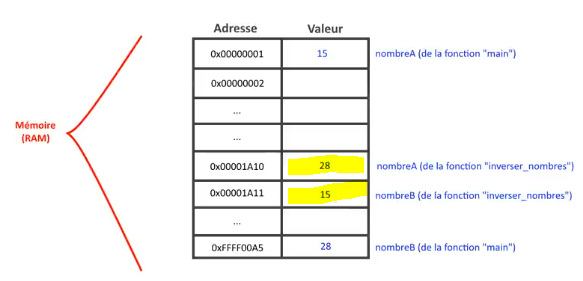

Le problème donc ça c'est bien parce qu'on a fait ce qu'on voulait à la base c'est qu'arrivé là à l'accolade fermante ici donc à la fin de la fonction inverser_nombres(), les fameuses variable nombreA et nombreB de la fonction inverser_nombres() sont détruites d'accord donc c'est variable-là ici sont détruites.

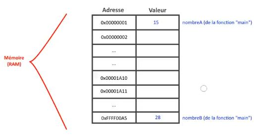

Alors vous remarquez bien par rapport à mon schéma que les variables originales n'ont pas bougées, elles n'ont jamais été inversés puisque on a travaillés sur des copies et ça c'est le **passage par valeurs**, j'en avais parlé déjà avant au niveau des fonctions, je vous avais dit qu'il y aurait d'autres choses par la suite sur la formation et bah voilà maintenant vous avez vraiment l'explication complète.

C'est juste à cause de ça, c'est qu'au niveau de l'appel ici on fait un passage par valeur c'est-à-dire que on lui envoie donc les valeurs 15 et 28 et qu'il va tout simplement copier ces valeurs puisqu'il crée pour la fonction elle-même ses propres variables et toutes les variables locales n'existent que dans la fonction où elles sont déclarées ou elles existent tout simplement en paramètres. 

Elles sont détruites à la fin donc le problème n'est pas résolu.

### Retourner une valeur

Alors il y a peut-être des gens parmi vous qui ont vu un moyen peut-être de contourner ça en disant qu'on n'a qu'à retourner par exemple un des nombres comme ça on pourra récupérer le nombreA par exemple donc allons-y.

On peut s'amuser à faire ça.

```c
#include <stdio.h>

int inverser_nombres(int nombreA, int nombreB)
{
    int temporaire = 0;//B

    temporaire = nombreB;
    nombreB = nombreA;
    nombreA = temporaire;

    return nombreA;
}

int main(void)
{
    int nombreA = 15;
    int nombreB = 28;

    printf("AVANT : A = %d et B = %d\n", nombreA, nombreB);
    nombreA = inverser_nombres(nombreA, nombreB);
    printf("APRES : A = %d et B = %d\n", nombreA, nombreB);

    return 0;
}
```
```powershell
gcc main.c -o prog
prog.exe
AVANT : A = 15 et B = 28
APRES : A = 28 et B = 28
```

Alors là vous ne résolver pas du tout le soucis puisque vous n'allez retourner que le A.

Vous voyez qu'avant A=15 et B=28 et à la fin on a A=28 donc très bien, vous avez réussi à inverser le A mais par contre B est toujours égal à 28.

Alors on pourrait se taper le délire de faire ceci.

```txt
int inverser_nombres(int nombreA, int nombreB)
{
    //...
    return nombreA;
    return nombreB;
}
```

Mais vous savez par rapport à la vidéo sur les fonctions qu'à partir d'un return on va sortir de la fonction donc cette ligne-là `return nombreB;` ne sera jamais exécutée.

D'ailleurs on arrive à compiler ceci sans erreur.

```c
#include <stdio.h>

int inverser_nombres(int nombreA, int nombreB)
{
    int temporaire = 0;//B

    temporaire = nombreB;
    nombreB = nombreA;
    nombreA = temporaire;

    return nombreA;
    return nombreB;
}

int main(void)
{
    int nombreA = 15;
    int nombreB = 28;

    printf("AVANT : A = %d et B = %d\n", nombreA, nombreB);
    nombreA = inverser_nombres(nombreA, nombreB);
    printf("APRES : A = %d et B = %d\n", nombreA, nombreB);

    return 0;
}
```
```powershell
gcc main.c -o prog
prog.exe
AVANT : A = 15 et B = 28
APRES : A = 28 et B = 28
```

Voilà, il n'y a pas d'erreur, ça marche puisqu'on ne va même pas passer au deuxième return. On pourrais même en mettre quinze mille à la suite, ce sera que le premier d'exécuté, tous les autres seront ignorés donc il est impossible de récupérer les deux valeurs donc on ne peut pas récupérer le changement sur les noms.

## Passage par adresse

Alors comment on fait ? hé bien c'est là que les pointeurs vont intervenir et qu'ils ont leur première utilité.

La première utilité des pointeurs, ça va être justement de permettre à une fonction de modifier des données tout simplement.

Alors on pourrait quelque part se passer un petit peu des pointeurs, pas pour tous, mais on va dire en partie, on pourrait s'en passer si on n'avait qu'une seule et même fonction. Si on faisait tout un programme dans la fonction main(), il n'y a pas de soucis on pourrait se passer de pas mal de pointeur.

Le problème c'est que je vous avais expliqué que dans les vrais programmes, quand on fait des vrais projets on développe déjà dans plusieurs fichiers, on organise le code sur plusieurs fichiers et donc plusieurs fonctions.

Si on le faisait que dans la fonction main(), on aurait quelque chose de carrément illisible fin et puis tout le monde aurait accès aux mêmes codes.

Dans une entreprise, des fois les gens travaillent sur certaines parties de code et il y en a d'autres qui n'y ont pas accès entre guillemets parce que c'est des partie plus critique donc on ne peut pas filer tout le code d'un programme à un employé par exemple si on veut qu'il travaille que sur une petite partie pour des raisons de sécurité, des raisons de confidentialité ou que sais-je donc voilà.

### Définition pointeur

Du coup on est obligé de procéder comme ça et ainsi qu'est-ce qu'un pointeur ? maintenant il est important que vous ayez une définition pour comprendre alors qu'est ce que va être un pointeur ? **un pointeur va permettre de pointer une autre variable** d'accord donc le pointeur c'est une variable, on va voir comment on le crée, comment on l'utilise... ainsi **c'est une variable qui contient l'adresse d'une autre variable** d'accord.

Je vais vous le noter.

```c
/*
    Pointeur : variable contenant l'adresse d'une autre variable
*/
```

C'est simplement ça, il n'y a vraiment pas besoin de chercher plus compliqué c'est juste ça d'accord donc c'est tout ce qu'il y a à savoir.

Maintenant vous avez donc vu alors je vais reprendre mon code et je vais afficher la valeur de mon nombreB.

```c
#include <stdio.h>

int main(void)
{
    int nombreA = 15;
    int nombreB = 28;

    printf("NombreB = %d\n", nombreB);

    return 0;
}
```
```powershell
gcc main.c -o prog
prog.exe
NombreB = 28
```

Alors ça pareil, vous l'avez fait plein de fois, vous savez comment on affiche la valeur d'une variable.

Maintenant, il faut que sachiez qu'on peut faire autre chose.

Je vous avais dit qu'une variable a une adresse. Vous l'avez vu d'ailleurs dans le schéma.

Par exemple nombreB, son adresse si on suit mon schéma, ce serait celle-là `0xFFFF00A5`.

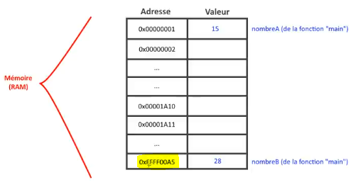

Cette adresse un peu bizarre eh bien on peut l'afficher, cette adresse on peut la récupérer puisque forcément c'est l'adresse qui permet au système de trouver des données avec lesquels vous travaillez donc pour cela on va utiliser non pas le `%d` mais le `%p` ceci permet d'afficher une adresse et au lieu de mettre simplement `nombreB`, on va mettre le petit et commercial `&nombreB`.

```txt
printf("NombreB = %d\n", nombreB);//afficher sa valeur
printf("NombreB = %p\n", &nombreB); //afficher son adresse
```

C'est comme on l'avais vu dans la fonction scanf() qui permettait directement de stocker dans une variable une saisie d'utilisateur. Je vous avait dit que la saisie se faisait directement où il fallait retrouver la variable dans laquelle on avait stocké ça et le seul moyen de retrouver une variable ce n'est pas sa valeur pour la retrouver mais c'est son adresse. Comme pour une adresse postale c'est la même chose.

Voilà pour cette petite distinction et là donc je vais afficher adresse de nombreB et vous allez voir qu'on aura deux choses différentes.

```c
#include <stdio.h>

int main(void)
{
    int nombreA = 15;
    int nombreB = 28;

    printf("NombreB = %p\n", &nombreB);

    return 0;
}
```
```powershell
gcc main.c -o prog
prog.exe
NombreB = 000000cb7c5ffbd8
```

Voilà donc son adresse est `000000cb7c5ffbd8` voilà donc c'est une adresse hexadécimalle bien évidemment pour cette représentation-là et on peut directement y accéder alors ça c'est deux petites choses différentes à voir.

Je vais vous le notez aussi comme ça vous aurez plein de notes là dessus comme ça vous pourrez vous en servir.

```c
/*
    Pointeur : variable contenant l'adresse d'une autre variable

    [VARIABLES]
        maVariable : valeur de la variable
*/
```

Si je mets juste un nom comme ça `maVariable`, c'est très très original, c'est tout simplement la valeur de la variable c'est-à-dire que si vous tapez ça quelque part, vous aurez accès à sa valeur.

Rappelez-vous on faisait un printf(), on mettait que le nom et ça affichait sa valeur.

Si vous mettez que le petit et commercial `&maVariable` là c'est différent donc ça c'est la nouveauté de cette vidéo, c'est l'adresse de la variable voilà.

```c
/*
    Pointeur : variable contenant l'adresse d'une autre variable

    [VARIABLES]
        maVariable : valeur de la variable
        &maVariable : adresse de la variable

*/
```

D'accord c'est deux petites choses à bien connaître sur les variables, vous avez deux manières différentes : le nom tout seul, vous avez la valeur et
le petit et commercial devant, vous avez son adresse voilà ça c'est la petite nouveauté.

On va avoir bien évidemment des choses toute nouvelle au niveau des pointeurs mais on va revenir dessus après donc je reviens sur mon exemple maintenant que j'ai expliqué ça par rapport à inverser_nombres(). Rappelez-vous le problème qu'on voulait résoudre d'inverser les nombres, comment on va faire ça ? On va le faire justement avec les fameux pointeurs.

Alors je vais faire l'exemple sans créer de pointeurs c'est-à-dire qu'on va utiliser des pointeurs directement, de manière implicite et après on va en créer nous mêmes pour les utiliser.

Alors commencons,

```txt
int inverser_nombres(int nombreA, int nombreB)
{
    //...
}
```

Là je vous avait expliqué que là `int nombreA, int nombreB` **en faisait un passage par valeurs, on ne fait que des copies** c'est-à-dire qu'on a inversé des copies de nombreA et de nombreB, de leur valeur attention pas des variables forcément mais de la valeur surtout et du coup à la fin de la fonction tout était perdu et voilà bah il y avait plus rien.

D'ailleurs on peut laisser en void, ça va très bien marché par la suite.

```txt
void inverser_nombres(int nombreA, int nombreB)
{
    int temporaire = 0;//B

    temporaire = nombreB;
    nombreB = nombreA;
    nombreA = temporaire;
}

int main(void)
{
    int nombreA = 15;
    int nombreB = 28;

    printf("AVANT : A = %d et B = %d\n", nombreA, nombreB);
    inverser_nombres(nombreA, nombreB);
    printf("APRES : A = %d et B = %d\n", nombreA, nombreB);

    return 0;
}
```

Voilà j'ai remis le code comme avant d'accord ne vous embrouiller pas c'est vraiment comme c'est avant avec le void, avec pas de retour.

Voilà donc on revient au code de tout à l'heure.

Ainsi donc là avec un passage par valeurs, ça ne marche, parce qu'effectivement si vous dites par exemple tient 15 et 28, tu doit inverser ces deux variables qui ont ces valeurs-là. Il va vous dire oui mais quel variable, je ne les trouve pas, je ne sais pas où les retrouver parce que je n'ai pas leur adresse donc on va les passer par adresses.

On va les passer par adresses et ça tombe bien, je vais vous expliquer comment il fallait faire, il faut ajouter le petit symbole et commerciale comme ça devant `&maVariable` donc à l'appel de la fonction, on ne va pas faire un passage par valeur comme on vient de le faire ici `inverser_nombres(nombreA, nombreB);` mais on va faire un passage par adresse donc avec les deux et commercial `inverser_nombres(&nombreA, &nombreB);`.

Alors là si on compile ...

```c
#include <stdio.h>

void inverser_nombres(int nombreA, int nombreB)
{
    int temporaire = 0;//B

    temporaire = nombreB;
    nombreB = nombreA;
    nombreA = temporaire;
}

int main(void)
{
    int nombreA = 15;
    int nombreB = 28;

    printf("AVANT : A = %d et B = %d\n", nombreA, nombreB);
    inverser_nombres(&nombreA, &nombreB);
    printf("APRES : A = %d et B = %d\n", nombreA, nombreB);

    return 0;
}
```
```powershell
gcc main.c -o prog
main.c: In function 'main':
main.c:18:22: warning: passing argument 1 of 'inverser_nombres' makes integer from pointer without a cast [-Wint-conversion]
   18 |     inverser_nombres(&nombreA, &nombreB);
      |                      ^~~~~~~~
      |                      |
      |                      int *
main.c:3:27: note: expected 'int' but argument is of type 'int *'
    3 | void inverser_nombres(int nombreA, int nombreB)
      |                       ~~~~^~~~~~~
main.c:18:32: warning: passing argument 2 of 'inverser_nombres' makes integer from pointer without a cast [-Wint-conversion]
   18 |     inverser_nombres(&nombreA, &nombreB);
      |                                ^~~~~~~~
      |                                |
      |                                int *
main.c:3:40: note: expected 'int' but argument is of type 'int *'
    3 | void inverser_nombres(int nombreA, int nombreB)
      |                                    ~~~~^~~~~~~

```

Alors là si on compile, évidemment on ne va rien voir de différent parce qu'on lui passe des adresses et que nombreA et nombreB ça ne va pas ici au niveau du prototype `void inverser_nombres(int nombreA, int nombreB)` parce qu'ici ça reste des valeurs.

Donc il faut utiliser des points pointeurs c'est-à-dire qu'il la récupération de pointeurs et un pointeur en langage c c'est la petite nouveauté maintenant ça se symbolise avec une étoile devant `*` donc c'est le symbole qui permet de faire des multiplications en informatique voilà.

```txt
int inverser_nombres(int *nombreA, int *nombreB)
{
    //...
}
```

Et là nombreA et nombreB nous en avons fait des pointeurs, on a juste ajouté une petite étoile devant c'est tout, c'est la seule différence.

Du coup vous savez maintenant qu'un pointeur se représente comme ceux-ci `*nombreB` d'accord.

Alors je vais vous notez les choses de différentes manières ainsi si je met le nom tout seul `monPointeur` d'accord qu'est-ce que c'est ? ça va être l'adresse de la variable pointée et je vais l'expliquer après sur le schéma ne vous en faites pas.

```c
/*
    Pointeur : variable contenant l'adresse d'une autre variable

    [VARIABLES]
        maVariable  : valeur de la variable
        &maVariable : adresse de la variable

    [POINTEURS]
        monPointeur : adresse de la variable pointée

*/
```

Si je mets ça `*nomPointeur`, ce qu'on prévoit de faire dans la fonction, c'est la valeur de la variable pointée et ça pareil je vais l'expliquer.

```c
/*
    Pointeur : variable contenant l'adresse d'une autre variable

    [VARIABLES]
        maVariable  : valeur de la variable
        &maVariable : adresse de la variable

    [POINTEURS]
        monPointeur : adresse de la variable pointée
        *monPointeur : valeur de la variable pointée
*/
```

Et on aura bien sûr la même chose que pour une variable, si on met le petit et commercial `&monPointeur` c'est l'adresse du pointeur.

```c
/*
    Pointeur : variable contenant l'adresse d'une autre variable

    [VARIABLES]
        maVariable  : valeur de la variable
        &maVariable : adresse de la variable

    [POINTEURS]
        monPointeur : adresse de la variable pointée
        *monPointeur : valeur de la variable pointée
        &monPointeur : adresse du pointeur
*/
```

D'accord donc ça, je vais vous montrer aussi.

Toutes ces différentes syntaxes seront expliquées donc c'est ça la grosse difficulté au niveau des pointeurs souvent quand on commence c'est la syntaxe.

Si on oublie une étoile ou on en met une de trop, hé bien le et commercial on n'en met pas et des fois on se trompe là dessus.

C'est beaucoup d'erreurs en fait de syntaxe.

C'est pas tellement une erreur forcément de compréhension, c'est beaucoup une erreur de syntaxe parce qu'on ne sait pas trop à quoi servent les pointeurs, pourquoi on les utilise et si on ne sait pas à quoi il servent on ne sais pas les utiliser correctement donc c'est là le gros problème.

Donc ici si vous suivez un peu ce que j'ai mis dans ce que pense bête que vous pouvez récupérer d'accord servez-vous en.

D'ailleurs je vais mettre ceci également `%d -> affiche une adresse de variable ou pointeur`.

```c
/*
    Pointeur : variable contenant l'adresse d'une autre variable
    %d -> affiche une adresse de variable ou pointeur

    [VARIABLES]
        maVariable  : valeur de la variable
        &maVariable : adresse de la variable

    [POINTEURS]
        monPointeur : adresse de la variable pointée
        *monPointeur : valeur de la variable pointée
        &monPointeur : adresse du pointeur
*/
```

Voilà du coup vous avez ces notes-là.

Regardez quand j'ai l'étoile et le nom du pointeur `*monPointeur` j'accède du coup à la valeur de la variable.

Qu'est ce qui s'est passé ici d'accord dans cette fonction parce ce que vous voyez  que là on a créé des pointeurs.

```txt
int inverser_nombres(int *nombreA, int *nombreB)
{
    //...
}
```

Là on a créé des pointeurs et vous allez me dire, ça va refaire comme pour les variables, on va créer plus ou moins des copies alors regardez au niveau du schéma ce qui s'est passé en réalité.

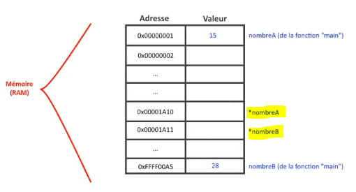

On a mis *nombreA et *nombreB alors là si on avait créé de simple variables comme tout à l'heure, qu'est-ce qu'on aurais eu ? hé bien ici on aurait dû mettre 15 dans la variable *nombreA et 28 dans la variable nombreB.

Là il s'agit de pointeurs et je vous ai dit qu'un pointer par sa définition même la plus simple, un pointeur c'est une variable qui contient l'adresse d'une autre variable qui permet de référencer une variable mais référencer, pour certains, ça ne peut ne pas être forcément compréhensible donc vous dites qu'un pointeur c'est une variable qui contient l'adresse d'une autre variable.

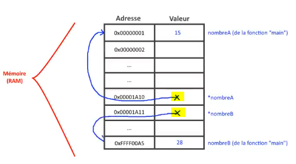

Donc la valeur d'un pointeur d'accord ça c'est important ici ce que j'ai là en valeur pour `*nombreA` ça va être tout simplement l'adresse d'une autre variable donc là voyez ces deux petites cases mémoires, ça va être l'adresse donc je vais faire pointer de nombreA d'accord et l'autre cellule va être l'adresse de nombreB.

Donc on crée une sorte de lien, on dit qu'ici le pointeur pointe sur nombreA ou sur nombreB, c'est le terme qu'on emploie dans le jargon de l'informatique par rapport au langage voilà tout simplement.

Du coup il n'y a plus copies, on a fait une référence c'est pour ça qu'on peux dire aussi qu'on fait une référence à un pointeur, qu'un pointeur permet de faire référence sur une variable puisqu'il vous donne en fait le lien qui permet d'y arriver.

### Différencier passage par valeur et passage par adresse

Alors il y a un exemple aussi qui est reprit souvent pour expliquer ça, pour différencier le **passage par valeur** et le **passage par adresse**.

Un passage par valeur c'est par exemple si vous voulez accéder à un site web de n'importe quoi hé bien plutôt que télécharger par exemple tout le contenu du site web c'est-à-dire que je télécharge le site, etc, je récupère toutes les images, le contenu et je vous balance tout ça par email ainsi je vous l'envoie en fait... vous avez tout un tas de données, tout un tas de trucs voilà complètement n'importe quoi... voilà ça c'est du passage par valeur d'accord.

Et d'ailleurs si vous modifiez la copie du site parce que c'est une copie en fait que j'aurais fait, ça ne va pas se répercuter sur le vrai site, sur l'original puisque je vous ai fait une copie.

Comme pour l'histoire des valeurs voyez inverser_nombres() qu'on a vu l'heure où les nombres ne changeait pas.

En revanche si je vous donne directement l'adresse du site d'accord l'adresse en .com, .fr ou je ne sais quoi là vous allez avoir tout d'un coup. Vous allez avoir une référence en fait, l'url et là référence vers un site web et si vous modifiez bien évidemment quelque chose sur le site web original ça va bien évidemment se répercuter dessus puisque c'est l'original au qu'elle vous avez accès et non pas une copie.

Voilà un petit peu un autre exemple qui peut vous aider à illustrer un petit peu ça.

Du coup là vous voyez que si je fais une modification de pointeur nombreA, et de pointeur nombreB ainsi je ne vais pas modifier la valeur des pointeurs puisque leurs valeurs ce sont des adresses mais je vais modifier les valeurs qui sont pointées et ça par rapport à ma notation, on l'a vu c'est ça `*monPointeur : valeur de la variable pointée` ça va travailler sur la valeur.

Donc partout où j'ai mon pointeur, il suffit que j'ajoute mon étoile  simplement, voilà.

```c
#include <stdio.h>

void inverser_nombres(int *nombreA, int *nombreB)
{
    int temporaire = 0;//B

    temporaire = *nombreB;
    *nombreB = *nombreA;
    *nombreA = temporaire;
}

int main(void)
{
    int nombreA = 15;
    int nombreB = 28;

    printf("AVANT : A = %d et B = %d\n", nombreA, nombreB);
    inverser_nombres(&nombreA, &nombreB);
    printf("APRES : A = %d et B = %d\n", nombreA, nombreB);

    return 0;
}
```
Alors pour temporaire, c'est une variable que j'ai créé simplement donc pas la peine d'en faire un pointeur. On s'en fiche, c'est une variable temporaire.

Voilà j'ai juste ajouté par rapport à tout à l'heure des étoiles, c'est tout, d'accord et là bien évidemment quand je vais tester...

:warning: alors oui ne pas oublier les types des pointeurs `void inverser_nombres(int *nombreA, int *nombreB)`, comme pour des fonctions, ils ont des types les fonctions mais ça on va l'expliquer après la création.

```powershell
gcc main.c -o prog
prog.exe
AVANT : A = 15 et B = 28
APRES : A = 28 et B = 15
```

Voilà vous remarqué que là les valeurs ont bien été modifiées puisqu'on a modifié l'adresse c'est-à-dire ici quand je lui ai dit bah tiens ça par  exemple nombreA égal nombreB `*nombreB = *nombreA;` je lui ai dit je modifie vraiment la variable qui se trouve à l'adresse de nombreA et celle qui se trouvent à l'adresse de nombreB donc il a été à l'adresse `0x00000001` donc il a pu du couo accéder à la valeur 15 et la changer. Ensuite il a été à l'adresse de nombreB `0xFFFF00A5` et il a pu bien évidemment changer l'original.

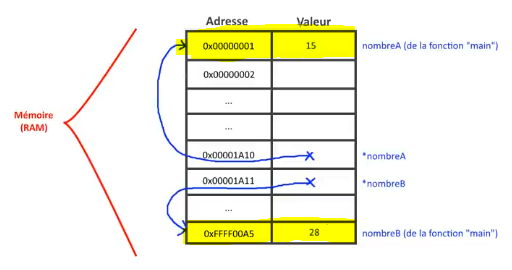

Et en inversant les originaux, on a pu faire ce changement.

Vous voyez que j'ai aucun return, je n'ai pas de retour à la fonction, pas besoin puisque je travaille directement sur les adresses des données donc je sais les récupérer, je peux avoir leurs valeurs puisque j'ai leur adresse.

Si on a l'adresse de chez vous, on peut venir chez vous mais là c'est pareil.

Si on a l'adresse d'une variable, on peut changer sa valeur, on peut changer quelque chose dessus, on peut faire des modifications.

Voilà donc ça c'est la première chose intéressante avec les pointeurs car si vous demandez à quoi servent les pointeurs ? **les pointeurs permettent de modifier les données dans une fonction** tout simplement et plusieurs, on n'est pas limité à une seule donnée.

Rappelez-vous si vous ne faites pas de pointeur, vous pourrez éventuellement modifier qu'une seule donnée mais il faudra qu'elle soit retournée dans tous les cas, il faudra à la fin faire un return de la
fameuse donnée.

Si vous ne faites pas ça, vous ne pourrez pas par exemple avoir une fonction qui ne retourne rien et qui modifie une donnée dans le programme principal puisque la copie sera détruite à la fin de la fonction ça ne marchera pas.

Donc c'est ça l'avantage des pointeurs, on peut modifier de 10, 20 données si on veut, ça fonctionnera puisqu'on a les adresses de ces deux fameuses données mais bien évidemment il faut les passer dans la fonction. Il faut avoir les adresses, si on n'a pas les adresses, on ne pourra rien modifier ça paraît logique mais c'est à savoir.

Donc là je vais légèrement modifier cet exemple pour créer moi-même mes pointeurs parce que vous avez vu que là, j'ai jamais créé une seule fois des pointeurs.

```c
#include <stdio.h>

/*
    Pointeur : variable contenant l'adresse d'une autre variable
    %d -> affiche une adresse de variable ou pointeur

    [VARIABLES]
        maVariable  : valeur de la variable
        &maVariable : adresse de la variable

    [POINTEURS]
        monPointeur : adresse de la variable pointée
        *monPointeur : valeur de la variable pointée
        &monPointeur : adresse du pointeur
*/

void inverser_nombres(int *nombreA, int *nombreB)
{
    int temporaire = 0;//B

    temporaire = *nombreB;
    *nombreB = *nombreA;
    *nombreA = temporaire;
}

int main(void)
{
    int nombreA = 15;
    int nombreB = 28;

    printf("AVANT : A = %d et B = %d\n", nombreA, nombreB);
    inverser_nombres(&nombreA, &nombreB);
    printf("APRES : A = %d et B = %d\n", nombreA, nombreB);

    return 0;
}
```

## Créer des pointeurs

Jusqu'ici j'ai jamais créé une seule fois des pointeurs, j'ai directement passé l'adresse et les pointeurs étaient ici en paramètres d'une fonction `void inverser_nombres(int *nombreA, int *nombreB)`.

Vous attendez de vois comment on crée un pointeur, c'est ça qui est utile donc on va les passer ici `inverser_nombres(&nombreA, &nombreB);`.


Alors on va changer les noms des paramètres de la fonction `void inverser_nombres(int *pt_nb1, int *pt_nb2)` d'ailleurs quand on a des pointeurs, on hésite pas à mettre un petit nom *pt_...* pour les identifier en soit c'est vous qui voyez.

```txt
void inverser_nombres(int *pt_nb1, int *pt_nb2)
{
    int temporaire = 0;//B

    temporaire = *pt_nb2;
    *pt_nb2 = *pt_nb1;
    *pt_nb1 = temporaire;
}
```

Voilà comme ça c'est clair donc là on a nos deux variables :

```txt
int nombreA = 15;
int nombreB = 28;
```

Comment allons-nous faire des pointeurs nous mêmes ? un pointeur et bien la déclaration et c'était la petite exception, la petite difficulté à ce niveau, au niveau de cette notion, c'est que la notation que j'ai mise là ne va pas être forcément applicable pour la déclaration.

```c
/*
    [POINTEURS]
        monPointeur : adresse de la variable pointée
        *monPointeur : valeur de la variable pointée
        &monPointeur : adresse du pointeur
*/
```

Attention que pour la déclaration et l'initialisation du pointeur, après ça fonctionnera exactement pareil.

On va donc faire un pointeur sur quoi ? On veut par exemple un pointeur sur `int nombreA = 15;` et vu que nombreA est un entier donc on fait un `int *`, on met une étoile parce qu'il faut bien indiquer que c'est pointeur sinon sans l'étoile c'est tout simplement une variable normal et je vais l'appeler *pointeurSurNombreA*, `int *pointeurSurNombreA;`.

Voilà ça fait très long mais c'est histoire de savoir et qu'est ce qu'on va y stocker dedans, je fait directement une initialisation et j'y stocke directement l'adresse de nombreA. On fait la même chose pour *pointeurSurNombreB* et je vais lui mettre l'adresse de nombreB.

```c
int *pointeurSurNombreA = &nombreA;
int *pointeurSurNombreB = &nombreB;
```

Voilà donc ça c'est la petite différence en fait par rapport aux variables vous voyez que je ne me suis pas amusé-là à créer une variable simple, j'ai mit la petite étoile. Il ne faut pas me mélanger avec les notations que j'ai mis ici.

```c
/*
    [POINTEURS]
        monPointeur : adresse de la variable pointée
        *monPointeur : valeur de la variable pointée
        &monPointeur : adresse du pointeur
*/
```

D'accord ça c'est la notation qu'on faisait déjà dans le code.

**Si vous faites une déclaration et/ou une initialisation de pointeur, cette syntaxe ne s'applique pas**.

D'ailleurs, je vais l'ajouter dans les notes.

```c
/*
    Pointeur : variable contenant l'adresse d'une autre variable
    %d -> affiche une adresse de variable ou pointeur

    [VARIABLES]
        maVariable  : valeur de la variable
        &maVariable : adresse de la variable

    [POINTEURS]
        *monPointeur = NULL ou *monPointeur = &maVariable
        (déclaration et initialisation d'un pointeur)

        monPointeur : adresse de la variable pointée
        *monPointeur : valeur de la variable pointée
        &monPointeur : adresse du pointeur
*/
```

Si on fait *\*monPointeur = NULL* ou *\*monPointeur = &maVariable* c'est une déclaration et une initialisation d'un pointeur donc sa création en fait tout simplement d'accord donc c'est la seule exception ou là ne vous embêtez pas quand vous créez un pointeur, vous mettez l'étoile.

Vous ne cherchez pas à comprendre c'est l'étoile sinon ce sera une variable, on ne pourra pas le reconnaître donc on met une étoile, on le met a nulle `*monPointeur = NULL`, c'est en général la valeur qu'on met par défaut à un pointeur comme on mettrait par exemple zéro comme je l'ai fais ici pour temporaire, à un entier, `int temporaire = 0;//B` pour éviter qu'il y ait n'importe quoi dedans.

Là pour éviter que le pointeur contienne n'importe quoi dedans, n'importe quelle adresse, on lui met nulle pour dire qu'il a rien voilà.

Certains pointeurs ne pointent sur rien d'accord il aurait zéro, rien du tout.

En plus un pointeur, l'avantage c'est que c'est très léger d'accord au niveau de l'emplacement de la mémoire comme on fait que des références, on ne fait que des copies mais ça j'en parlerais après c'est un autre avantage de cette notion.

Donc voilà et bien évidemment vous pouvez dès le début y affecter l'adresse une variable, il suffit de faire ça `*monPointeur = &maVariable` ainsi l'adresse d'une variable c'est avec le et commercial et c'est tout.

Après la seule notation c'est celle-là, qui s'applique tout le temps.

```c
/*
    [POINTEURS]
        monPointeur : adresse de la variable pointée
        *monPointeur : valeur de la variable pointée
        &monPointeur : adresse du pointeur
*/
```

Ainsi en mettant le nom `monPointeur`, vous accédez à l'adresse de la variable pointée. 

En mettant avec l'étoile devant `*monPointeur`, c'est la valeur de variable pointée.

Avec le et commerciale du nom du pointeur `&monPointeur` c'est son adresse à lui, pas l'adresse de la variable mais l'adresse du pointeur lui-même.

Alors tout ça vous pouvez le noter car je ne rajouterais rien normalement, vous pouvez prendre note faire une capture d'écran, noter sur un petit post-it n'importe quoi pour avoir ça à côté de vous comme ça quand vous travaillez avec des pointeurs au début si vous galérez avec la syntaxe, vous pourrez vous en remettre en fait à ce petit pense-bête et comme ça après vous arriverez facilement et naturellement à comprendre ça et vous n'aurez plus besoin de vos notes.

```c
/*
    Pointeur : variable contenant l'adresse d'une autre variable
    %d -> affiche une adresse de variable ou pointeur

    [VARIABLES]
        maVariable  : valeur de la variable
        &maVariable : adresse de la variable

    [POINTEURS]
        *monPointeur = NULL ou *monPointeur = &maVariable
        (déclaration et initialisation d'un pointeur)

        monPointeur : adresse de la variable pointée
        *monPointeur : valeur de la variable pointée
        &monPointeur : adresse du pointeur
*/
```

Vous arriverez comme ça à travailler avec des pointeurs simplement donc je pense que ce n'est pas compliqué, je pense que c'est assez clair comme comme notion et on va maintenant travailler nos pointeurs créer ici.

```txt
#include <stdio.h>

/*
    Pointeur : variable contenant l'adresse d'une autre variable
    %d -> affiche une adresse de variable ou pointeur

    [VARIABLES]
        maVariable  : valeur de la variable
        &maVariable : adresse de la variable

    [POINTEURS]
        *monPointeur = NULL ou *monPointeur = &maVariable
        (déclaration et initialisation d'un pointeur)

        monPointeur : adresse de la variable pointée
        *monPointeur : valeur de la variable pointée
        &monPointeur : adresse du pointeur
*/

void inverser_nombres(int *pt_nb1, int *pt_nb2)
{
    int temporaire = 0;//B

    temporaire = *pt_nb2;
    *pt_nb2 = *pt_nb1;
    *pt_nb1 = temporaire;
}

int main(void)
{
    int nombreA = 15;
    int nombreB = 28;

    int *pointeurSurNombreA = &nombreA;
    int *pointeurSurNombreB = &nombreB;

    printf("AVANT : A = %d et B = %d\n", nombreA, nombreB);
    inverser_nombres();
    printf("APRES : A = %d et B = %d\n", nombreA, nombreB);

    return 0;
}
```

D'accord je reviens là dessus, voyez que j'ai créé mes deux pointeurs donc là `inverser_nombres();` je veux passer rappelez-vous des adresses.

Quels sont les adresses ? regardez tout à l'heure on passais ça `&nombreA` et `&nombreB` ainsi c'est ce qu'on passait dans l'appel de la fonction là.

```txt
inverser_nombres(&nombreA, &nombreB);
```

Attention, il ne faut pas passer ça `*pointeurSurNombreA` en voyant que c'est égal à `int *pointeurSurNombreA = &nombreA;` d'accord parce que rappelez-vous que `*pointeurSurNombreA` c'est que pour la déclaration ou l'affectation ici donc l'initialisation qu'on a effectivement une syntaxe un peu particulière.

En revanche et là vous regardez le pense-bête `monPointeur : adresse de la variable pointée`, vous voyez que l'adresse de la variable pointée c'est le nom tout court donc vous prenez le nom tout court.

Voilà voyez c'est purement logique, il n'y a pas besoin de se compliquer les choses, c'est vraiment très logique au niveau de la notation.

Une fois qu'on a pigé le truc, ça va tout seul voilà et là on passe bien les adresses ça va être récupéré, on fait la modification, on va obtenir  exactement la même chose que tout à l'heure.

```txt
inverser_nombres(pointeurSurNombreA, pointeurSurNombreB);
```

```c
#include <stdio.h>

/*
    Pointeur : variable contenant l'adresse d'une autre variable
    %d -> affiche une adresse de variable ou pointeur

    [VARIABLES]
        maVariable  : valeur de la variable
        &maVariable : adresse de la variable

    [POINTEURS]
        *monPointeur = NULL ou *monPointeur = &maVariable
        (déclaration et initialisation d'un pointeur)

        monPointeur : adresse de la variable pointée
        *monPointeur : valeur de la variable pointée
        &monPointeur : adresse du pointeur
*/

void inverser_nombres(int *pt_nb1, int *pt_nb2)
{
    int temporaire = 0;//B

    temporaire = *pt_nb2;
    *pt_nb2 = *pt_nb1;
    *pt_nb1 = temporaire;
}

int main(void)
{
    int nombreA = 15;
    int nombreB = 28;

    int *pointeurSurNombreA = &nombreA;
    int *pointeurSurNombreB = &nombreB;

    printf("AVANT : A = %d et B = %d\n", nombreA, nombreB);
    inverser_nombres(pointeurSurNombreA, pointeurSurNombreB);
    printf("APRES : A = %d et B = %d\n", nombreA, nombreB);

    return 0;
}
```
```powershell
gcc main.c -o prog
prog.exe
AVANT : A = 15 et B = 28
APRES : A = 28 et B = 15
```

L'inversion se fait, simplement que là on est passé par des pointeurs qu'on a créé nous-mêmes voilà c'est tout donc on peut s'en passer.

Dans ce cas là, effectivement les pointeurs que j'ai fait ne servent à rien.

```txt
int *pointeurSurNombreA = &nombreA;
int *pointeurSurNombreB = &nombreB;
```

En effet, on peut directement passer par adresse les variables `inverser_nombres(&nombreA, &nombreB);` ce sera très bien sauf si plus tard on veut travailler avec ces pointeurs par la suite, ça peut être utile mais si on n'a pas prévu de travailler avec... normalement en prenant l'exemple de ce programme-çi, si le programme là était complet hé bien les variables `int *pointeurSurNombreA` et `int *pointeurSurNombreB` c'est un surplus inutile honnêtement parce que je peux travailler directement avec ces pointeurs-ici `int *pt_nb1, int *pt_nb2` car ils sont suffisants.

Mais voilà c'était histoire de vous illustrer un petit peu par un exemple l'utilité de ces fameux pointeurs.

Donc je reviens dessus histoire de faire un petit résumé au fur et à mesure, je vous avez dit que la vidéo serait un petit peu longue mais je pense que c'est vraiment très nécessaire et vraiment indispensable.

Un pointeur encore une fois c'est une variable qui stocke donc qui contient l'adresse d'une autre variable.

D'accord c'est juste ça, vous avez la définition ici de toute façon.

```c
/*
    Pointeur : variable contenant l'adresse d'une autre variable
    %d -> affiche une adresse de variable ou pointeur
*/
```

Et il y a plusieurs utilités, s'il vous demande encore une fois à quoi sert un pointeur la première utilité c'est qu'il permet de modifier des données dans une fonction de manière illimitée, on peut en modifier autant qu'on veut à partir du moment où on a les adresses.

Il a aussi un avantage, c'est qu'il évite de faire des copies d'accord parce que voyez qu'on ne fait plus de copies de grosses données parce que là ça va on n'a qu'un petit nombre mais on peut se dire qu'on copie un petit entier donc c'est pas beaucoup.

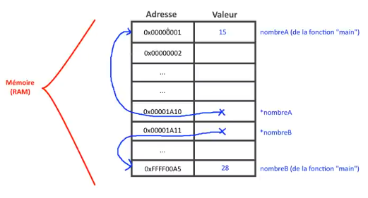

Un petit entier ce n'est pas beaucoup mais attention le jour où on va travailler avec des listes, des listes chaînées, avec des graphes, des arbres, des choses comme ça qui sont des structures de plusieurs plusieurs données et si vous deviez à chaque fois copier toute la structure de données.

Imaginez une liste par exemple de 1000 joueurs sur un jeu en ligne par exemple et si vous deviez à chaque fois copier la liste des 1000 joueurs ce serait très très très très lourd et vraiment pas performant donc en ayant un pointeur, on va dire que le pointeur va pointer sur le début de la liste comme ça on peut directement se retrouver au début de la liste, faire des parcours, etc.

Vous verrez tout ça dans les vidéos suivantes, on aura l'occasion de faire des listes justement de données. Vous verrez l'utilité des pointeurs à ce moment-là vraiment.

Voilà donc ça évite la copie ça c'est le deuxième avantage.

### Avantages des pointeurs

**Un premier on modifie des données dans une fonction autant qu'on veut.**

**Le deuxième avantage, c'est que ça évite la copie.**

**Le troisième avantage est naturellement induit du deuxième, c'est que du coup c'est plus rapide tout simplement**. C'est plus rapide qu'une variable parce que s'il faut s'amuser à copier toute une liste de 1000 éléments, ça va être beaucoup plus long à l'exécution que d'avoir simplement un pointeur donc on gagne en rapidité, on gagne en performance.

C'est ça qui fait encore une fois la puissance du langage c et maintenant vous connaissez en tout cas la notion la plus importante qui fait tout ce langage.

Voilà alors j'espère que j'ai été suffisamment clair pour cette vidéo normalement j'ai fait un peu le tour de tout ce que je voulais vous dire.

Je ne pense pas avoir oublié quelque chose, c'est tout ce qui est à retenir que je vous ai mis ici.

```c
/*
    Pointeur : variable contenant l'adresse d'une autre variable
    %d -> affiche une adresse de variable ou pointeur

    [VARIABLES]
        maVariable  : valeur de la variable
        &maVariable : adresse de la variable

    [POINTEURS]
        *monPointeur = NULL ou *monPointeur = &maVariable
        (déclaration et initialisation d'un pointeur)

        monPointeur : adresse de la variable pointée
        *monPointeur : valeur de la variable pointée
        &monPointeur : adresse du pointeur
*/
```

Tout ce qu'il y a retenir, c'est ça en fait grosso modo.

Après c'est de la pratique, c'est du code, c'est de voir au niveau du code comment ça fonctionne.

Alors n'hésitez parce que je vous dis malgré mes explications, malgré le temps que j'ai passé à tout vous expliquer et à répéter, il y a certainement des choses qui ne seront pas encore clair.

N'hésitez pas à poser des questions dans les commentaires, s'il y a des choses que vous n'avez pas compris, vous avez besoin d'éclaircissements et surtout à faire des programmes.

Ne cherchez pas à faire des programmes qui ont forcément du sens parce que pour moi, excusez-moi, bon ce programme ne sert à rien.

```txt
void inverser_nombres(int *pt_nb1, int *pt_nb2)
{
    int temporaire = 0;//B

    temporaire = *pt_nb2;
    *pt_nb2 = *pt_nb1;
    *pt_nb1 = temporaire;
}
```

Voilà l'inversé des nombres, je ne vois pas trop l'utilité là présentement mais peu importe à partir du moment où ça vous permet de comprendre la notion vous allez tout gagner derrière, vous aurez tout à y gagner parce qu'après vous pourrez l'appliquer dans des cas concrets.

Je vous dit quand on fera des listes, des tableaux, ce genre de chose et quand on travaillera avec des chaînes de caractères, vous verrez l'utilité des pointeurs que vraiment même pour lire des fichiers ou écrire dedans sans pointeurs, on ne pourrait pas tout simplement parce qu'on serait obligé sinon à la rigueur de copier des fichiers complets enfin ce serait super long donc heureusement qu'il y a les pointeurs ça rend les choses beaucoup plus rapide.

Voilà voilà j'ai vraiment dit tout ce que je voulais vous dire sur cette vidéo alors j'aurai un peu traîné en longueur, je me serai un peu répété sur beaucoup de choses, on aura donné beaucoup d'exemples je pense que c'était vraiment nécessaire donc n'hésitez pas à faire des programmes de tests, par exemple on peut faire un programme très simple.

## change_nombre - autre exemple de fonction

On peut s'amuser, je vais vous montrer un programme très très simple pour finir.

Vous aurez par exemple `int nombre = 0;` où nombre serait 0, on aurait par exemple la fonction change_nombre() en 15 ok.

```c
#include <stdio.h>

void change_nombre(int nb)
{
    nb = 15;
}

int main(void)
{
    int nombre = 0;

    printf("nombre = %d\n", nombre);
    change_nombre(nombre);
    printf("nombre = %d\n", nombre);

    return 0;
}
```
```powershell
gcc main.c -o prog
prog.exe
nombre = 0
nombre = 0
```

Alors ça, si on avait tout en pointeurs ça marcherait.

Là par contre si je teste encore une fois, on voit que le nombre n'a pas changé parce qu'on a pas passé par adresse.

Alors la solution quand on a encore une fois qu'une valeur à modifier, on peut éffectivement la retourner `int change_nombre(int nb){//... return nb;}`

Alors si on a qu'une valeur, on peut éffectivement se passer des pointeurs donc on fait ceci.

```txt
#include <stdio.h>

int change_nombre(int nb)
{
    nb = 15;

    return nb;
}

int main(void)
{
    int nombre = 0;

    printf("nombre = %d\n", nombre);
    nombre = change_nombre(nombre);
    printf("nombre = %d\n", nombre);

    return 0;
}
```

Alors on pourrais même du coup faire directement ça.

```txt
int change_nombre(int nb)
{
    return 15;
}
```

Voilà on n'a plus abandonne carrément la copie qui ne sert à rien en fait à ce moment là mais on peut imaginer qu'on demande à l'utilisateur un valeur et cetera donc à la rigueur je vais garder ceci pour que ce soit plus clair.

```txt
int change_nombre(int nb)
{
    nb = 15;

    return nb;
}
```

On fait la modification donc on injecte la valeur `nombre = change_nombre(nombre);` pour l'affecter.

```c
#include <stdio.h>

int change_nombre(int nb)
{
    nb = 15;

    return nb;
}

int main(void)
{
    int nombre = 0;

    printf("nombre = %d\n", nombre);
    nombre = change_nombre(nombre);
    printf("nombre = %d\n", nombre);

    return 0;
}
```
```powershell
gcc main.c -o prog
prog.exe
nombre = 0
nombre = 15
```

Là effectivement en faisant comme ça on arrive à s'en sortir, on peut modifier la valeur mais encore une fois s'il y avait deux nombres comme on a fait tout à l'heure, vous voyez que là ça bloquer donc voilà n'hésitez pas à utiliser des pointeurs puisque même pour cet exemple très simple, très basique, on peut faire des pointeurs.

Pour ça, on a juste à ajouter l'étoile dans toute la fonction et on ne retourne plus rien puisque c'est void, et bien sûr le nombre est passé par adresse.

```c
#include <stdio.h>

void change_nombre(int *nb)
{
    *nb = 15;
}

int main(void)
{
    int nombre = 0;

    printf("nombre = %d\n", nombre);
    change_nombre(&nombre);
    printf("nombre = %d\n", nombre);

    return 0;
}
```
```powershell
gcc main.c -o prog
prog.exe
nombre = 0
nombre = 15
```

Là la modification s'est bien faites avec des pointeurs voilà.

Vous êtes passé en fait du niveau *bas je fais des variables et je passe par valeurs* à des pointeurs.

Le code que je viens de faire ici sera beaucoup plus rapide à l'exécution même si là la différence ne se voit pas puisqu'il n'y a pas grand chose, il n'y a qu'un nombre mais sur un très gros programme par exemple un parcours de liste ou de grosses structures données, croyez moi avec des pointeurs vous verrez largement la différence à l'exécution que si vous travaillez avec des valeurs et du passage par valeurs qui ferait des copies sur des copies sur des copies.

Ainsi ça veut dire quand même qu'à chaque fois par exemple que vous allez ajouter un élément dans votre structure, vous allez renvoyer une nouvelle copie à chaque fois ce serait vraiment trop trop lourd à chaque qu'on voudrait ajouter un élément.

Voilà donc là j'ai fait le tour normalement j'ai terminé sur tout ce que je voulais vous dire par rapport aux pointeurs.

Encore une fois, il y avait beaucoup de choses à dire, il y a beaucoup de choses à assimiler.

Tout ce que vous avez à retenir au niveau théorique c'est ça.

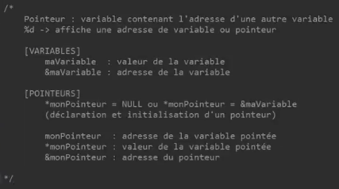


N'hésitez pas à l'imprimer, faites une capture d'écran, notez-le sur un bout de papier, une feuille ce que vous voulez, gardez-le de côté.

Quand vous programmez, vous gardez ça à côté de vous au début parce qu'au début vous allez forcément vous planter mais moi ça m'arrive sur certains programmes des fois quand ça devient très complexe d'oublier une étoile ou d'oublier par exemple de se dire que là j'ai oublié de passer par adresse, etc.

Ainsi ça m'arrive aussi, ça arrive à tout le monde même aux gens qui ont 15, 20 ans d'expérience même aux gens qui sont très très performant, très compétant dans ce langage.

Peu importe ça arrive à tout le monde, les pointeurs c'est sujet à un nombre d'erreurs chez tout le monde donc vous en ferez aussi.

Vous en ferai encore même plus tard, moi j'en fais encore aussi voilà mais par contre ça on va dire je n'en ai plus besoin d'accord parce que toute cette partie-là je le sais naturellement parce qu'à force...

Posez des questions s'il y a des choses qui ne sont pas clairs, faire des programmes pour vous entraîner, histoire que vous attaquez la suite sans problème.

Il faut vraiment que pour la prochaine vidéo, les pointeur ce soit compris de compris de chez compris.

Si vous avez vraiment le moindre doute sur quelque chose, il ne faut pas hésiter à demander, à vous entraîner parce que sinon vous n'allez pas comprendre la suite parce qu'après les pointeurs on va ajouter d'autres notions qui vont utiliser les pointeurs donc si déjà vous n'avez pas compris l'intérêt d'utiliser des pointeurs et comment ils fonctionnent, vous comprendrez pas alors leurs champs d'application en fait dans des fichiers, dans des structures, des énumérations, ce genre de choses.

Vous ne pigerez rien du tout et ça va vous décourager du coup ce ne sera pas intéressant pour vous derrière.

Voilà je vous laisse pour cette vidéo d'accord on se retrouve du coup pour la vidéo numéro 12, on va commencer maintenant à rentrer dans le vif du sujet.

On va voir des choses intéressantes, on va parler de tableau, de chaînes de caractères, de fichiers justement donc pas mal de petites choses qui vont faire appel encore une fois aux pointeurs donc révisez bien tout ça.

Revoyez bien les pointeurs comme il faut, prenez le temps même s'il faut revoir la vidéo 2/3 fois, c'est pas grave du tout, elle ne va pas disparaître de toute façon du jour au lendemain donc n'hésitez pas voilà bien à revoir tout ça et encore une fois je suis disponible dans les commentaires s'il y des choses qui ne sont pas trop clair pour vous.

A très bientôt pour la prochaine vidéo