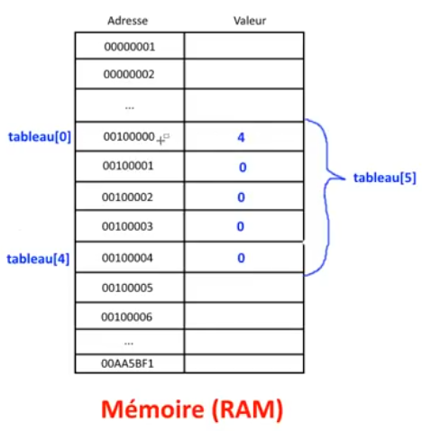

## [12. Tableaux](https://www.youtube.com/watch?v=6nkUWnCoRp4)

Bonjour à tous, bienvenue pour cette douzième séance sur le langage c, nous allons parler des tableaux aujourd'hui, c'est la suite logique des pointeurs que vous avez vus dans la séance précédente ce sera un peu plus simple, je pense au niveau accessibilité pour vous puisque vous avez fait le plus compliqué la dernière fois.

J'espère par contre que vous avez bien pigé la notion de pointeur, que vous avez bien compris un petit peu sinon n'hésitez pas à revoir la vidéo, à poser des questions si ce n'est pas encore assez clair pour vous puisque ça va vous servir pour la suite, pour cette vidéo-là, pour la prochaine et toutes celles qui vont suivre.

On va travailler avec des pointeurs tout le temps, tout le temps, tout le temps donc faut vraiment que ce soit clair pour vous sinon vous n'allez absolument rien comprendre.

On va démarrer tout de suite pour vous expliquer ce qu'est un tableau d'accord à ce niveau-là, comment ça fonctionne et comment on les utilise, comment on va créer des tableaux, les utiliser dans nos programmes tout simplement au niveau de notre code ?

Je vais directement passer sur notre document et on va regarder ça ensemble.

```c
#include <stdio.h>

int main(void)
{

    return 0;
}
```

## Déclaration tableau

Alors un tableau, écoutez je vais vous montrer comment créer un tableau avant tout et après je vais vous expliquer ce qui s'est passé dans la mémoire contrairement par exemple à une variable concrete.

Alors un tabeau, comme pour une variable, on va lui choisir un type de données.

Il faut qu'il enregistre absolument le même type c'est-à-dire qu'il va pouvoir contenir plusieurs cases comme pour un tableau que vous feriez sur une feuille de papier.

Un tableau il peut contenir plusieurs entiers ou alors plusieurs float ou alors plusieurs, que vous verrez plus tard, chaînes de caractères, plusieurs structures mais c'est **toujours le même type de données**.

On ne peut pas mélanger par exemple des nombres entiers, de nombres floatant dans un tableau, ce n'est pas possible, en tout cas au niveau du langage c ce n'est pas possible donc moi je vais faire un tableau d'entiers pour rester simple je vais choisir le type `int`, je lui donne un nom comme pour les fonctions, les variables c'est les mêmes règles je ne reviens pas dessus c'est-à-dire qu'on ne commence pas par un chiffe, pas de caractères spéciaux, pas d' espaces je vais l'appeler `tableau` pour rester sur un nom très simple et ensuite on va pouvoir lui donner, indiquer le nombre de cases que l'on veut c'est-à-dire le nombre de données qu'il aura donc moi je vais choisir 5, `int tableau[5];`.

```c
#include <stdio.h>

int main(void)
{
    int tableau[5];

    return 0;
}
```

Voilà comment on déclare un tableau d'accord c'est la déclaration.

Je vais vous mettre des notes pour que vous puissiez suivre au fur et à mesure pour que ce soit clair, ce sera une vidéo un peu longue aussi d'accord mais c'est important.

```c
/*
    [Déclaration tableau]
        <type> <nom_tableau>[X]; //Déclare avec valeurs aléatoires
*/
```

Vous choississez le type <type>, vous mettez le nom du tableau <nom_tableau> avec une taille X [X] voilà.

Ainsi dans ce tableau `int tableau[5];` on va avoir 5 valeurs dans ce tableau qui seront complètement aléatoire, on ne sait pas ce qu'il y a parce qu'on a rien initialisé, on a simplement déclaré le tableau donc au niveau de la mémoire comment ça se passe ? je vous ai fait un petit schéma.

```txt
    Adresse     Valeur

    00000001
    00000002
      ...
    00100000
    00100001
    00100002
    00100003
    00100004
    00100005
    00100006
      ...
    00AA5BF1

        Mémoire (RAM)
```

En temps normal quand on crée des variables, je vous avais expliqué admettons que vous créez une variable A quelque part, vous allez demander l'autorisation au système et il va vous trouver un espace ainsi il va dire tiens où est-ce que j'ai la place ici, admettons ta variable *a* je la met-là et puis tu a demandé à ce qu'il y ait 14 dedans voilà.

```txt
    Adresse     Valeur

    00000001
    00000002      14        a
      ...
    00100000
    00100001
    00100002
    00100003
    00100004
    00100005
    00100006
      ...
    00AA5BF1

        Mémoire (RAM)
```

Plus tard vous créer une variable *b* et vous cherchez une plage, je ne sais pas où ainsi il prend au pid là où il y a de la place donc *b* et vous allez stocker 8 dedans, et cetera, et cetera.

```txt
    Adresse     Valeur

    00000001
    00000002      14        a
      ...
    00100000
    00100001
    00100002
    00100003
    00100004      8         b      
    00100005
    00100006
      ...
    00AA5BF1

        Mémoire (RAM)
```

Voyez il prend les valeurs un peu là où il veut d'accord là où il y a de la place surtout, il faut qu'il y ait de la place de toute façon et il vous stoque ça en mémoire avec des adresses et on peut travailler comme vous avez l'habitude de le faire jusqu'à présent.

Au niveau d'un tableau, c'est différent, je vais lui demander que je veux 5 emplacements d'entiers ainsi il va devoir trouver un bloc complet de 5 emplacements.

```c
#include <stdio.h>

/*
    [Déclaration tableau]
        <type> <nom_tableau>[X]; //Déclare avec valeurs aléatoires
*/

int main(void)
{
    int tableau[5];

    return 0;
}
```

Donc si vous avez compris, par exemple, il ne pourrait pas admettons par exemple si vous voyez le schéma où j'ai mis 3 petits points, on peut dire que les valeurs occupées par les 3 petits points sont déjà occupées par le système ou par d'autres programmes de votre Windows, de votre Linux, de votre Mac qui les utilisent donc comme je veux 3 valeurs, je ne pourrais pas par exemple prendre ce bloc là d'accord.

```txt
    Adresse     Valeur

    00000001
    00000002
      ...
    00100000
    00100001
    00100002
    00100003
    00100004
    +-------------------+ 
    |00100005           |
    |00100006           |
    |  ...              |
    +-------------------+
    00AA5BF1

        Mémoire (RAM)
```

En effet, on ne pourra pas prendre de valeurs qui sont dans les 3 petits points (...) parce que c'est déjà pris, j'ai que deux cases en fait mémoire qui sont libres mais après c'est plein. 

Je ne peux pas les réutiliser donc ça ne va pas, il nous faut automatiquement cinq emplacements ensemble donc là j'en ai 5 ici regardez.

```txt
    Adresse     Valeur

    00000001
    00000002
      ...
    +-------------------+
    |00100000           |
    |00100001           |
    |00100002           | tableau[5]
    |00100003           |
    |00100004           |
    +-------------------+
    00100005
    00100006
      ...
    00AA5BF1

        Mémoire (RAM)
```

1, 2, 3, 4 et 5 voilà il va prendre ceci, ce block-là. On peut imaginer que chaque case permettre de stocker un entier donc je vais pouvoir prendre cet ensemble-là voilà donc ça c'est mon tableau de 5.

Là-dedans, il y a des valeurs aléatoire, je ne les met pas, ça ne sertà rien. Je vais vous expliquer pourquoi donc il a mis des valeurs aléatoire puisqu'on a simplement déclaré le tableau c'est-à-dire qu'on n'a rien initialisé du tout d'accord donc nous on va lui mettre des valeurs quand même à nous.

La manière la plus simple de le faire, c'est d'accéder directement aux cases du tableau que l'on veut alors un tableau c'est ça à savoir d'accord au niveau de l'accès c'est que la première case du tableau donc celle-ci `00100000` commence par l'indice 0 d'accord c'est tab[0].

```txt
              Adresse     Valeur

              00000001
              00000002
                ...
              +-------------------+
  tableau[0]  |00100000           |
              |00100001           |
              |00100002           | tableau[5]
              |00100003           |
              |00100004           |
              +-------------------+
              00100005
              00100006
                ...
              00AA5BF1

                  Mémoire (RAM)
```

Ainsi vous avez vu la différence d'une variable, un tableau en fait il a des valeurs qui se suivent d'accord chaque case ce suit, on dit que c'est un espace contigu c'est-à-dire que chaque case du tableau est à la suite des autres au niveau des adresses d'accord si par exemple la première case est à l'adresse 1000, la deuxième case sera l'adresse 1001 et  l'autre à 1002 et cetera donc tableau[0] va permettre d'accéder à la première case donc c'est un peu bizarre car c'est décalé du coup, l'indice 0 c'est la première case, l'indice 1 c'est la deuxième.

Voyez on décale toujours de +1 par rapport à l'indice et on va avoir tableau[4] qui est la 5ème valeur du tableau et non pas la quatrième.

```txt
              Adresse     Valeur

              00000001
              00000002
                ...
              +-------------------+
  tableau[0]  |00100000           |
              |00100001           |
              |00100002           | tableau[5]
              |00100003           |
  tableau[5]  |00100004           |
              +-------------------+
              00100005
              00100006
                ...
              00AA5BF1

                  Mémoire (RAM)
```

Donc ça attention parce que c'est une erreur que vous ferez au début donc qui m'arrive aussi de faire de temps en temps, ça arrive des fois une petite erreur d'inattention ça arrive à tout le monde mais voilà les tableaux commence bien à zéro, il faut faire attention à ça.

Donc `tableau[0]`, `tableau[1]`, `tableau[2]`, `tableau[3]`, `tableau[4]` ok avec tableau de 4 qui est notre 5e valeur du tableau.

Voilà donc on a un espace contigu en fait au niveau du tableau.

## Accès au tableau

Voilà donc toutes les valeurs sont à la suite, c'est comme ça c'est la différence d'une variable car on absolument toutes les valeurs à la suite donc comment on va pouvoir accéder à ces éléments mais je vous l'ai déjà montré en fait c'est-à-dire qu'on met entre crochets l'indice du tableau ok.

Donc pour l'accès, on verra un petit peu après, on va demander par exemple `tableau[0] = 14;` et je vais mettre la valeur 14. Je fais juste ça c'est-à-dire que je mets le nom du tableau, entre crochets l'indice, et je mets 14 donc là `00100000`, il y avait une valeur  aléatoire je ne sais pas laquelle mais maintenant je sais qu'elle a été remplacée par 14 d'accord.

```c
#include <stdio.h>

int main(void)
{
    int tableau[5];

    tableau[0] = 14;

    return 0;
}
```
```txt
              Adresse     Valeur

              00000001
              00000002
                ...
              +-------------------+
  tableau[0]  |00100000     14    |
              |00100001           |
              |00100002           | tableau[5]
              |00100003           |
  tableau[5]  |00100004           |
              +-------------------+
              00100005
              00100006
                ...
              00AA5BF1

                  Mémoire (RAM)
```

Je peux mettre après autre choses, je peux faire `tableau[1] = 6;` qui contient par exemple 6.

```c
#include <stdio.h>

int main(void)
{
    int tableau[5];

    tableau[0] = 14;
    tableau[1] = 6;

    return 0;
}
```
```txt
              Adresse     Valeur

              00000001
              00000002
                ...
              +-------------------+
  tableau[0]  |00100000     14    |
              |00100001     6     |
              |00100002           | tableau[5]
              |00100003           |
  tableau[5]  |00100004           |
              +-------------------+
              00100005
              00100006
                ...
              00AA5BF1

                  Mémoire (RAM)
```

Et cetera, et cetera, je ne vais pas le faire pour les trois autres, vous avez compris le système je peux faire `tableau[2]`, `tableau[3]` et `tableau[4]` et c'est tout car on s'arrête à 4 quand c'est un tableau de 5 casses donc c'est un petit peu long mais c'est une possibilité, on peut faire ça.

Voilà alors ça je peux noter.

```c
/*
    [Déclaration tableau]
        <type> <nom_tableau>[X]; //Déclare avec valeurs aléatoires
      
    [Accès au tableau]
        tableau[X] : élément d'indice X (X+1ème élément du tableau)
*/
```

Ainsi si l'indice c'est 0, hé bien c'est X+1 donc 0+1 donc c'est 1, c'est le 1e élément.

Si X=2, c'est 2+1 donc c'est le 3e élément donc ça je vous l'ai mis c'est pour vos notes à vous au niveau de l'accès au tableau donc ça c'est un moyen d'accéder d'accord aux valeurs du tableau.

Voyez on peut accéder par un indice, c'est pour ça que c'est pratique un tableau. Pour une variable, on ne peut pas faire ça, on peut pas accéder comme ça c'est pas possible mais le tableau, on peut choisir la case à laquelle on accède et la modifier.

Vous verez qu'on peut aussi les afficher, on va pouvoir faire pas mal de choses à la suite.

## Initialisation

Moi par contre j'aimerais qu'on voit au niveau de l'initialisation parce que déclarer un tableau comme ça c'est pas propre, je vous avais dit pour une variable c'est bien de lui mettre une valeur par défaut, pour un pointeur c'est bien de le mettre à NULL par défaut et cetera, et cetera.

```c
/*
    [Déclaration tableau]
        <type> <nom_tableau>[X]; //Déclare avec valeurs aléatoires

    [Initialisation]
      
    [Accès au tableau]
        tableau[X] : élément d'indice X (X+1ème élément du tableau)
*/
```

### tableau[5] = {valeur1, valeur2, valeur3, valeur4, valeur5};

On va donc voir plusieurs méthodes pour initialiser un tableau, je peux directement lui mettre ses valeurs d'accord c'est-à-dire que je peux faire ça par exemple `int tableau[5] = {16, 4, -5, 22, 188};` admettons dans la première case tu met 16, dans la deuxième tu met 4, puis -5, puis 22 et enfin 188.

```c
#include <stdio.h>

int main(void)
{
    int tableau[5] = {16, 4, -5, 22, 188};

    return 0;
}
```

Voilà donc les 5 valeurs ok comme ceci `int tableau[5] = {16, 4, -5, 22, 188};` ainsi 5 valeurs ça va vite, 5 valeurs c'est rapide à écrire. Ce n'est pas comme si c'était un tableau de 1000 cases donc là je peux faire ça.

```txt
              Adresse     Valeur

              00000001
              00000002
                ...
              +-------------------+
  tableau[0]  |00100000     16    |
              |00100001     4     |
              |00100002     -5    | tableau[5]
              |00100003     22    |
  tableau[5]  |00100004     188   |
              +-------------------+
              00100005
              00100006
                ...
              00AA5BF1

                  Mémoire (RAM)
```

Voilà donc là, il a stocké tout à la suite donc là on est sûr qu'on a des bonnes valeurs, on va pouvoir commencer à travailler avec ces valeurs ainsi ça c'est une possibilité ok on peut faire comme ça.

```c
/*
    [Déclaration tableau]
        <type> <nom_tableau>[X]; //Déclare avec valeurs aléatoires

    [Initialisation]
        tableau[5] = {valeur1, valeur2, valeur3, valeur4, valeur5};
      
    [Accès au tableau]
        tableau[X] : élément d'indice X (X+1ème élément du tableau)
*/
```

*tableau[5] = {valeur1, valeur2, valeur3, valeur4, valeur5};* et on n'oublie pas le point  virgule à la fin bien sûr sinon ça ne marcherait pas donc ça c'est une possibilité.

### tableau[5] = {0}; //Toutes les cases valent 0

On peut aussi dire que moi je veux par exemple tout mettre à zéro alors c'est à dire qu'au lieu de faire ça `{16, 4, -5, 22, 188}` hop bien là moi je met tout à 0 comme pour je vous l'ai dit pour un entier de base  mettez à 0 pour être tranquille mais là c'est pareil. Moi je vais tout mettre à zéro comme ceci en fait histoire d'être sûr de ne pas avoir n'importe quoi dedans.

```txt
              Adresse     Valeur

              00000001
              00000002
                ...
              +-------------------+
  tableau[0]  |00100000     0     |
              |00100001     0     |
              |00100002     0     | tableau[5]
              |00100003     0     |
  tableau[5]  |00100004     0     |
              +-------------------+
              00100005
              00100006
                ...
              00AA5BF1

                  Mémoire (RAM)
```

Vous pouvez le faire, il suffit de faire ça.

```c
#include <stdio.h>

int main(void)
{
    int tableau[5] = {0};

    return 0;
}
```

A la rigueur on pourrait même ne pas mettre le zéro mais moi je vous recommande de le mettre, simplement qu'à la lecture du code c'est un indicatif visuel.

Voilà le fait de voir le chiffre zéro, vous pouvez vous dire ah bah tiens dans mon tableau il y a des zéros.

```c
/*
    [Déclaration tableau]
        <type> <nom_tableau>[X]; //Déclare avec valeurs aléatoires

    [Initialisation]
        tableau[5] = {valeur1, valeur2, valeur3, valeur4, valeur5};
        tableau[5] = {0}; //Toutes les cases valent 0
      
    [Accès au tableau]
        tableau[X] : élément d'indice X (X+1ème élément du tableau)
*/
```

Voilà comme ça `{0}` ça aide mais si on laisse comme ça `{}` voilà on a rien, pas de chiffre dedans donc du coup ça risque de vous induire en erreur.

En mettant le 0 de manière explicite, on est sûr voilà que ce sont des zéros.

### tableau[5] = {4}; //Première case à 4, le reste à 0

Si vous faites ceci `int tableau[5] = {4};` alors là c'est une petite exception ne pensez pas qu'il va tout remplacer par 4 d'accord en réalité il va vous faire ceci.

```txt
              Adresse     Valeur

              00000001
              00000002
                ...
              +-------------------+
  tableau[0]  |00100000     4     |
              |00100001     0     |
              |00100002     0     | tableau[5]
              |00100003     0     |
  tableau[5]  |00100004     0     |
              +-------------------+
              00100005
              00100006
                ...
              00AA5BF1

                  Mémoire (RAM)
```

Il va mettre 4 à la première case donc au `tableau[0]` et tous les autres vont être compléter avec des 0 c'est comme ça on ne peut pas demander au tableau, de cette manière, de mettre que des 4, de remplir avec que des 10 et cetera.

On verra un autre manière de le faire, on sera obligé de procéder à un petit artifice mais on ne peut pas le faire dès le début, en fait avec la déclaration du tableau, on ne peut pas tout initialiser les cases à 4 ou à 10 ou je ne sais combien.

Ainsi donc si vous mettez `{4}` il va faire ceci donc ça attention parce que ça c'est le genre d'erreur que certains font en se demandant bah tiens si je mets 4, il va tout mettre à 4 c'est faux.

Ainsi `tableau[5] = {4};` met la première case à 4 et le RESTE A 0 !

```c
/*
    [Déclaration tableau]
        <type> <nom_tableau>[X]; //Déclare avec valeurs aléatoires

    [Initialisation]
        tableau[5] = {valeur1, valeur2, valeur3, valeur4, valeur5};
        tableau[5] = {0}; //Toutes les cases valent 0
        tableau[5] = {4}; //Première case à 4, le reste à 0
      
    [Accès au tableau]
        tableau[X] : élément d'indice X (X+1ème élément du tableau)
*/
```

Voilà c'est important ici `tableau[5] = {4};`, les reste est à 0 ça c'est important. Voilà ça c'est important, le reste est vraiment à 0.

### tableau[5] = {4, 3};

Après si j'en note 2 `tableau[5] = {4, 3};` c'est comme ce qu'on a fait au-dessus c'est-à-dire que la première case aura 4 et la deuxième aura 3, et le reste à 0.

Ainsi vous pouvez noter celles que vous voulez et puis le reste si vous ne les compléter pas, le compilateur va le compléter lui-même avec des 0. Il va le faire pour vous donc pas besoin de vous embêter avant de le faire donc voilà pour cette possibilité.

Nous allons donc rester sur quelque chose comme ça `tableau[5] = {0};` où on dira de ne rester que, par exemple, sur des 0.

Maintenant que vous savez créer un tableau, vous savez comment donc le déclarer, en tout cas, vous savez comment l'initialiser, vous savez également comment accéder au xième éléments en tout cas au X+1ème pour être exacte mais voilà vous savez accéder à chaque case du tableau et maintenant, on va voir comment l'afficher.

## Afficher

Pour afficher un tableau, vous avez compris l'avantage qu'il a parce que c'est une structure plus qu'un avantage c'est que toutes les cases se suivent donc en ayant accès à la première, on va pouvoir faire une boucle pour lui dire d'accéder à chacune des cases une à une donc je vais utiliser une petite variable de compteurs qu'on appelle en général *i* et je vais faire une boucle for() parce que c'est mieux.

Ainsi vous pouvez faire une boucle while() mais de toute façon la jour la bouche for() est faites pour faire des parcours.

On l'utilisera tout le temps si possible parce qu'elle est vraiment faites pour ça.

```c
#include <stdio.h>

int main(void)
{
    int tableau[5] = {0};
    int i;


    return 0;
}
```

On commence à 0 pour `i = 0` parce que rappelez vous que la première case du tableau du tableaux c'est zéro d'accord c'est toujours l'indice 0 comme ça ça tombe bien. Ensuite, je dis que tant que i est plus petit que la taille du tableau **la taille du tableau, il faut le savoir, c'est le nombre des case qu'il a donc moi la taille de ce tableau c'est 5. Et ensuite c'est le pas en avant donc on fait i plus plus donc on va incrémenter à chaque fois i de 1 puisque i nous permettra d'avoir l'indice comme vous allez le voir juste à la suite.

```c
for(i = 0 ; i < 5 ; i++)
  printf(")
```

Je fait printf() et j'affiche tableau[] d'indice i donc au lieu de mettre directement une valeur en dur je me sers d'une variable ainsi on a le droit de faire comme ça.

Voilà donc on aura ce petit cette petite possibilité et là on va tester au niveau du code et voilà.

```c
#include <stdio.h>

int main(void)
{
    int tableau[5] = {0};
    int i;

    for(i = 0 ; i < 5 ; i++)
      printf("[%d] ", tableau[i]);

    return 0;
}
```
```powershell
gcc *.c -o prog
.\prog.exe     
[0] [0] [0] [0] [0] 
```

Voyez qu'il m'affiche le tableau avec toutes les valeurs de zéro, il a bien initialisé toutes les valeurs, il affiche correctement les cinq valeurs à la suite.

Voilà notre tableau d'accord ça se suit, toutes les valeurs se suivent donc pas de souci à ce niveau-là.

Alors petite précision, vous avez vu que là `int tableau[5];` j'ai fait ça `5`, ainsi on va utiliser une petite chose qui est très utile notamment voilà ce qu'on avait vu dans les directives de préprocesseur c'est là
que ça peut être utile.

Normalement alors ça c'est au niveau des standards **depuis la norme c99 d'accord on peut choisir une taille variable à un tableau**.

Par exemple, on peut dire ceci `int taille_tableau = 10;` et puis je peut très bien dire je crée le tableau de ça.

```c
#include <stdio.h>

int main(void)
{
    int taille_tableau = 10;
    int tableau[taille_tableau] = {0};
    int i;

    for(i = 0 ; i < 5 ; i++)
      printf("[%d] ", tableau[i]);

    return 0;
}
```

Le problème c'est que ça c'est qu'avec à partir de la norme c99 donc si votre compilateur n'utilise pas cette norme, il y a plus de chances qu'il utilise la c89, ça ne marchera pas d'accord donc comme ce n'est pas compatible partout, faites attention si ça marche chez vous faites-le d'accord pourquoi pas.

Après si vous voulez avoir un code qui fonctionnera pour tout le monde, tout le temps d'accord je parle pas du programme, je parle du code source, éviter ça `int tableau[taille_tableau]`. Partez du principe que ça, ça ne fonctionne pas qu'on ne peut pas en fait avoir une taille de tableau ici qui est une variable.

Par contre, ce qu'on peut faire c'est définir une constante parce que rappelez vous une constante ce n'est pas une variable.

Si vous souvenez au niveau des directives, c'est simplement un remplacement en fait de la directive c'est-à-dire que je fais ça `#define TAILLE_TAB 5` avec le nom en majuscule puisqu'on ne peut pas la changer et je met 5 et là je fais ça.

```c
#include <stdio.h>

#define TAILLE_TAB 5

int main(void)
{
    int tableau[TAILLE_TAB] = {0};
    int i;

    for(i = 0 ; i < 5 ; i++)
      printf("[%d] ", tableau[i]);

    return 0;
}
```

L'avantagé c'est que le jour où je veux changer la taille de mon tableau, ça rappelez-vous je l'avais expliqué dans la vidéo sur les directives donc j'ai plus qu'à changer la valeur là `#define TAILLE_TAB 5` et je peux du coup faire ça `for(i = 0 ; i < TAILLE_TAB ; i++)`.

```c
#include <stdio.h>

#define TAILLE_TAB 5

int main(void)
{
    int tableau[TAILLE_TAB] = {0};
    int i;

    for(i = 0 ; i < TAILLE_TAB ; i++)
      printf("[%d] ", tableau[i]);

    return 0;
}
```
```powershell
gcc *.c -o prog
.\prog.exe     
[0] [0] [0] [0] [0] 
```

Voilà du coup c'est plus explicite à la lecture, tant que i est plus petit que la taille du tableau, voyez on arrive plus facilement à lire et c'est plus compréhensif donc ça fonctionne aucune différence.

Aucune différence, c'est pas obligatoire mais ça peut servir de faire ça. On prend la taille de tableau comme ça et on l'on met comme ça le jour où je veux changer la taille du tableau je met ici 15 et l'on met comme ça `#define TAILLE_TAB 15` et il va me créer 15 cases regardez.

```c
#include <stdio.h>

#define TAILLE_TAB 15

int main(void)
{
    int tableau[TAILLE_TAB] = {0};
    int i;

    for(i = 0 ; i < TAILLE_TAB ; i++)
      printf("[%d] ", tableau[i]);

    return 0;
}
```
```powershell
gcc *.c -o prog
.\prog.exe     
[0] [0] [0] [0] [0] [0] [0] [0] [0] [0] [0] [0] [0] [0] [0]
```

Boom on a un changement sur le code, il modifie absolument tout le programme donc c'est une possibilité d'accord intéressante on peut créer comme ça un tableau de 100 cases d'accord on peut faire les fous fous si on veut.

```c
#include <stdio.h>

#define TAILLE_TAB 100

int main(void)
{
    int tableau[TAILLE_TAB] = {0};
    int i;

    for(i = 0 ; i < TAILLE_TAB ; i++)
      printf("[%d] ", tableau[i]);

    return 0;
}
```
```powershell
gcc *.c -o prog
.\prog.exe     
[0] [0] [0] [0] [0] [0] [0] [0] [0] [0] [0] [0] [0] [0] [0] [0] [0] [0] [0] [0] [0] [0] [0] [0] [0] [0] [0] [0] [0] [0] [0] [0] [0] [0] [0] [0] [0] [0] [0] [0] [0] [0] [0] [0] [0] [0] [0] 
[0] [0] [0] [0] [0] [0] [0] [0] [0] [0] [0] [0] [0] [0] [0] [0] [0] [0] [0] [0] [0] [0] [0] [0] [0] [0] [0] [0] [0] [0] [0] [0] [0] [0] [0] [0] [0] [0] [0] [0] [0] [0] [0] [0] [0] [0] [0] 
[0] [0] [0] [0] [0] [0]
```

Voilà il m'a créé 100 cases d'accord.

C'est très très rapide comme vous voyez l'exécution même si un tableau est du coup plus lent qu'une variable, on fait des choses assez rapide.

Voilà pour cet affichage, est-ce que je peux modifier les valeurs comme ça en affichage ? bien sûr, je peut très bien faire ça voyez jemodifier une valeurs entre deux et donc ici je vais remplacer la valeur `-2` en `-5`.

```c
#include <stdio.h>

/*
    [Déclaration tableau]
        <type> <nom_tableau>[X]; //Déclare avec valeurs aléatoires

    [Initialisation]
        tableau[5] = {valeur1, valeur2, valeur3, valeur4, valeur5};
        tableau[5] = {0}; //Toutes les cases valent 0
        tableau[5] = {4}; //Première case à 4, le reste à 0
      
    [Accès au tableau]
        tableau[X] : élément d'indice X (X+1ème élément du tableau)
*/

#define TAILLE_TAB 5

int main(void)
{
    int tableau[TAILLE_TAB] = {16, 84, -2, 188, 3};
    int i;

    for(i = 0 ; i < TAILLE_TAB ; i++)
      printf("[%d] ", tableau[i]);

    printf("\n\n");
    tableau[2] = -5;

    for(i = 0 ; i < TAILLE_TAB ; i++)
      printf("[%d] ", tableau[i]);

    return 0;
}
```
```powershell
gcc *.c -o prog
.\prog.exe     
[16] [84] [-2] [188] [3] 

[16] [84] [-5] [188] [3]
```

## Accès au tableau - les pointeurs

Ok donc on peut faire ça, rappelez-vous que l'accès au tableau c'est ceci.

```c
/*
    [Accès au tableau]
        tableau[X] : élément d'indice X (X+1ème élément du tableau)
*/
```

On accède à l'élément d'indice X etvoilà voyez que le `-2` est devenu `-5` donc on peux faire des modifications comme ça, ça fonctionne tout simplement.

Alors à quoi ça correspond cette syntaxe `tableau[2] = -5;` j'en ai pas dit plus parce que j'avais dit que les tableaux utilisait des pointeurs comment ça fonctionne ? et bien ici alors ça je vais noter au niveau des accès.

### tableau : adresse du tableau

```c
/*
    [Déclaration tableau]
        <type> <nom_tableau>[X]; //Déclare avec valeurs aléatoires

    [Initialisation]
        tableau[5] = {valeur1, valeur2, valeur3, valeur4, valeur5};
        tableau[5] = {0}; //Toutes les cases valent 0
        tableau[5] = {4}; //Première case à 4, le reste à 0
      
    [Accès au tableau]
        tableau[X]  : élément d'indice X (X+1ème élément du tableau)

        tableau     : adresse du tableau
*/
```

Quand je note juste ça `tableau`, j'ai l'adresse du tableau tout simplement, vous verrez que ça servira par exemple à le passer dans une fonction etc, on va le faire juste après donc c'est pour ça que j'avais dit que cette vidéo-là est un peu longue parce qu'on arrive sur la fin des bases du langage c d'accord après on passera sur des choses plus avancés notamment les structures, on fera du réseau, on ferra pas mal de choses.

Par contre, là on en est là-dessus, on en est encore sur les bases, les  dernières notions de base donc du coup ça devient un peu complexe et du coup un peu plus lent donc ça c'est l'adresse `tableau : adresse du tableau`.

### *tableau : premier élément du tableau

```c
/*
    [Déclaration tableau]
        <type> <nom_tableau>[X]; //Déclare avec valeurs aléatoires

    [Initialisation]
        tableau[5] = {valeur1, valeur2, valeur3, valeur4, valeur5};
        tableau[5] = {0}; //Toutes les cases valent 0
        tableau[5] = {4}; //Première case à 4, le reste à 0
      
    [Accès au tableau]
        tableau[X]      : élément d'indice X (X+1ème élément du tableau)

        tableau         : adresse du tableau
        *tableau        : premier élément du tableau
*/
```

`*tableau` représente le premier élément du tableau.

### *(tableau + X) : élément d'indice X

Et si je fait `*(tableau + X)` je vais accéder à l'élément d'indice X. Voilà vous allez me dire que l'élément d'indice X ressemble à quelque chose, en fait c'est exactement la même chose que `tableau[X]` d'accord c'est juste 2 notations donc ça je vous le note.

```c
/*
    [Déclaration tableau]
        <type> <nom_tableau>[X]; //Déclare avec valeurs aléatoires

    [Initialisation]
        tableau[5] = {valeur1, valeur2, valeur3, valeur4, valeur5};
        tableau[5] = {0}; //Toutes les cases valent 0
        tableau[5] = {4}; //Première case à 4, le reste à 0
      
    [Accès au tableau]
        tableau[X]      : élément d'indice X (X+1ème élément du tableau)

        tableau         : adresse du tableau
        *tableau        : premier élément du tableau
        *(tableau + X)  : élément d'indice X

    (NOTE)
        tableau[5] même chose que -> *(tableau + 5)
*/
```

Par exemple dire qu'on a un tableau de 5 `tableau[5]` est la même chose que de faire `*(tableau + 5)`.

C'est la même chose, simplement que cette notation `*(tableau + 5)` était utilisée tout le temps c'est-à-dire que l'on montre explicitement le pointeur du tableau, voyez qu'il y a des pointeurs au tableau comme ça:

```txt
        tableau[X]

        tableau         : adresse du tableau
->      *tableau        : premier élément du tableau
->      *(tableau + X)  : élément d'indice X
```

Voilà il y a des pointeurs mais le problème, c'est que les programmeurs faisait beaucoup d'erreurs voilà parce qu'il y a l'étoile donc il faut bien mettre le tableau + l'indice entre parenthèses et du coup il n'arrêtait pas du coup de faire des oublis de parenthèse pourtant c'est des gens qui manipulent les langages tous les jours mais eux-mêmes faisait des erreurs tout le temps d'inattention et comme ça devenait ben voilà trop complexe alors on faisait des erreurs facilement parce que l'erreur est humaine, eh bien on a simplifié on a fait cette syntaxe-là `tableau[5]`

Voilà on a dit maintenant qu'on mettra le nom du tableau et l'indice entre crochets comme ça il n'y a plus d'étoile mais ce n'est pas parce qu'il n'y a plus d'étoile que le pointeur n'est plus là d'accord.

`tableau[5]` ici on a juste caché l'étoile, le pointeur est implicite.

C'est pour ça que je vous dis qu'un tableau est un pointeur d'accord c'est un pointeur vers son premier élément donc en l'occurrence ici ça d'accord (4).



Ici (4) qui serait la première adresse, c'est pour ça qu'à partir du i `int i = 0` comme vous l'avez vu en effet dans la boucle on peut parcourir tout.

A partir du moment où on a le premier élément, on peut parcourir tout un par un ça va aller, il n'y aura pas de souci à ce niveau-là.

Voilà pour les petites notes d'accord au niveau des synthèses du tableau donc ça reste assez simple, voyez qu'au niveau de l'accès, je ne pense pas que ce soit compliqué.

```c
/*
    [Déclaration tableau]
        <type> <nom_tableau>[X]; //Déclare avec valeurs aléatoires

    [Initialisation]
        tableau[5] = {valeur1, valeur2, valeur3, valeur4, valeur5};
        tableau[5] = {0}; //Toutes les cases valent 0
        tableau[5] = {4}; //Première case à 4, le reste à 0
      
    [Accès au tableau]
        tableau[X]      : élément d'indice X (X+1ème élément du tableau)

        tableau         : adresse du tableau
        *tableau        : premier élément du tableau
        *(tableau + X)  : élément d'indice X

    (NOTE)
        tableau[5] même chose que -> *(tableau + 5)
*/
```

Grosso modo on utilise rarement cette syntaxe `*(tableau + X)`, je vous le dit, il y a quelques personnes qu'il le font encore mais moi ça m'arrive mais j'utilise quand même beaucoup plus souvent `tableau[i]` la preuve où je viens de le faire ici.

```c
#include <stdio.h>

#define TAILLE_TAB 5

int main(void)
{
    int tableau[TAILLE_TAB] = {16, 84, -2, 188, 3};
    int i;

    for(i = 0 ; i < TAILLE_TAB ; i++)
      printf("[%d] ", tableau[i]);

    printf("\n\n");
    tableau[2] = -5;

    for(i = 0 ; i < TAILLE_TAB ; i++)
      printf("[%d] ", tableau[i]);

    return 0;
}
```

Voyez je l'ai fait là `printf("[%d] ", tableau[i]);` donc je ne me suis pas amusé à faire ça `printf("[%d] ", *(tableau + i));` d'accord j'aurais pu mais je ne me suis pas amusé à ça mais voyez que ça ne change strictement rien d'accord à l'affichage.

```c
#include <stdio.h>

#define TAILLE_TAB 5

int main(void)
{
    int tableau[TAILLE_TAB] = {16, 84, -2, 188, 3};
    int i;

    for(i = 0 ; i < TAILLE_TAB ; i++)
      printf("[%d] ", *(tableau + i));

    printf("\n\n");
    tableau[2] = -5;

    for(i = 0 ; i < TAILLE_TAB ; i++)
      printf("[%d] ", tableau[i]);

    return 0;
}
```
```powershell
gcc *.c -o prog
.\prog.exe     
[16] [84] [-2] [188] [3] 

[16] [84] [-5] [188] [3]
```

Voilà `*(tableau + i)` c'est vraiment la même chose que ça `tableau[i]` vraiment vraiment vraiment sauf qu'ici j'ai je modifié une valeur entre deux pour montrer qu'on peut modifier des valeurs de tableau.

Voilà donc ça c'est déjà pas mal de choses que vous savez faire : vous savez ce qu'est un tableau parce que je vous l'ai défini ainsi je vous expliquer un peu la différence par rapport à une variable dans la mesure où c'est un espace contigu avec des valeurs qui se suivent automatiquement ça c'est obligatoire. Vous savez comment l'initialiser, comment les déclarer, vous savez comment accéder aux valeurs d'un tableau, vous savez les afficher et on va voir maintenant comment on peut les utiliser dans une fonction.

Ainsi on sait modifier les valeurs dedans donc ça ça fonctionne mais comment on peut les utiliser dans fonctions puisque vous avez vu qu'avec la programmation ça fonctionne avec des fonctions quand on fait les choses bien mais comment on peut les utiliser dans des fonctions puisque là voyez que j'ai tout dans le main() or c'est cool mais bon dans des vrais programmes, on ne va pas s'amuser à faire tout comme ça donc moi je vais vous montrer comment faire une fonction qui demande un tableau en paramètres et je vous montrerai aussi le petit bonus, ça se sera la petit bonus rien que pour vous c'est-à-dire comment retourner un tableau d'accord renvoyer en fait un tableau.

## Fonctions

Alors je vous avais expliqué qu'on ne pouvait retourner que des variables, des valeurs dans une fonction, eh bien vous verrez qu'on peut retourner un tableau puisqu'**un tableau en réalité ce n'est que l'adresse vers sa première valeur** puisqu'elle se suivent toutes donc il n'y a pas besoin d'avoir l'adresse de toutes les valeurs à la suite, elles se suivent ensemble donc vous retournez l'adresse du premier élément et vous aurez forcément tous les autres mais ça je vais vous montrer comment on le fait, ce sera très simple ce sera le petit bonus pour la fin de la vidéo.

### afficher_tableau

Alors au niveau des fonctions, ecoutez on va faire une fonction très simple, toute bête, on va faire notre fonction d'affichage parce qu'à chaque fois on répète le code, c'est pas propre.

```c
for(i = 0 ; i < TAILLE_TAB ; i++)
  printf("[%d] ", tableau[i]);
```

Voilà faire de la répétition de code, c'est pas bien quand on voit qu'il y a du code qui se répète c'est qu'il faut en faire une fonction donc on va faire une fonction, je vais l'appeler `void afficher_tableau()` donc je vais afficher le tableau ainsi il faut deux choses obligatoires quand vous affichez un tableau si vous n'avez pas ces deux éléments ça ne fonctionnera pas et vous ne pouvez pas y arriver.


Alors, il nous faut le tableau je pense que c'est logique `int *tab` et il faut la taille alors on pourrais passer par une constante mais c'est mieux d'éviter ça. Ainsi il faut la taille c'est vraiment important pour la fonction qu'elle puisse l'avoir donc un entier de la taille du tableau `int taille`. Ok ça c'est la base, je l'ai mit en prototype d'accord puis la fonction.

```c
#include <stdio.h>

#define TAILLE_TAB 5

void afficher_tableau(int *tab, int taille);

int main(void)
{
    int tableau[TAILLE_TAB] = {16, 84, -2, 188, 3};
    int i;

    for(i = 0 ; i < TAILLE_TAB ; i++)
      printf("[%d] ", *(tableau + i));

    printf("\n\n");
    tableau[2] = -5;

    for(i = 0 ; i < TAILLE_TAB ; i++)
      printf("[%d] ", tableau[i]);

    return 0;
}

void afficher_tableau(int *tab, int taille)
{

}
```

Voilà il prend tout ça en paramètres et qu'est-ce qu'il va faire, écoutez je vais faire un petit `int i;` tout simplement et ce que j'ai fait-là.

```c
#include <stdio.h>

#define TAILLE_TAB 5

void afficher_tableau(int *tab, int taille);

int main(void)
{
    int tableau[TAILLE_TAB] = {16, 84, -2, 188, 3};

    afficher_tableau(tableau, TAILLE_TAB);

    printf("\n\n");
    tableau[2] = -5;

    afficher_tableau(tableau, TAILLE_TAB);

    return 0;
}

void afficher_tableau(int *tab, int taille)
{
    int i;

    for(i = 0 ; i < taille ; i++)
      printf("[%d] ", tab[i]);
}
```
```powershell
gcc *.c -o prog
.\prog.exe     
[16] [84] [-2] [188] [3] 

[16] [84] [-5] [188] [3]
```

Bien sûr on change les noms `taille` et `tab[]`.

Voilà du coup au lieu d'avoir à chaque fois tout ces trucs-là qui se répètent, j'utilise la fonction afficher_tableau() et je lui passe mon tableau `afficher_tableau(tableau, ...)` ainsi rappelez-vous, je n'ai pas besoin de mettre de esperluette comme ça *afficher_tableau(&tableau, ...)*, pas besoin de esperluette comme on le faisait avec les variables puisque en mettant juste **le nom c'est une adresse parce que c'est déjà un pointeur**.

```c
/*
    [Déclaration tableau]
        <type> <nom_tableau>[X]; //Déclare avec valeurs aléatoires

    [Initialisation]
        tableau[5] = {valeur1, valeur2, valeur3, valeur4, valeur5};
        tableau[5] = {0}; //Toutes les cases valent 0
        tableau[5] = {4}; //Première case à 4, le reste à 0
      
    [Accès au tableau]
        tableau[X]      : élément d'indice X (X+1ème élément du tableau)

        tableau         : adresse du tableau
        *tableau        : premier élément du tableau
        *(tableau + X)  : élément d'indice X

    (NOTE)
        tableau[5] même chose que -> *(tableau + 5)
*/
```

N'oubliez que `tableau` est déjà l'adresse donc en fait c'est déjà un pointer vers la première case du tableau.


Donc il n'y a pas besoin de rajouter une esperluette, ça ne sert strictement à rien.

Un tableau voilà c'est déjà lui-même un pointeur donc vous mettez juste son nom et c'est tout et la taille c'est `TAILLE_TAB` en l'occurrence et on appel la fonction `void afficher_tableau(int *tab, int taille);`.

Bien sûr quand on exécute, on voit exactement la même chose que tout à l'heure c'est-à-dire qu'au niveau de l'exécution, on a aucune différence par contre vous, vous avez modulez et donc vous avez mieux programmer parce que vous avez fait une petite fonction pour éviter de répéter le code.

Là on ne fait que l'appel, on évite de répéter tout le temps le for() etc.

Voilà ça c'est pratique comme ça si un jour je veux changer ma méthode d'affichage, je n'ai pas besoin de la modifier à deux reprises comme je vous l'avait expliqué dans la vidéo sur les fonctions, j'aurais juste à modifier ma fonction d'affichage et ça va tout modifier à la fois, ça va se répercuter sur tout.

Voilà ça c'est une possibilité, maintenant qu'on a fait ça, on va passer par le petit bonus comme maintenant vous avez vu comment utiliser un tableau, vous voyez que c'est très simple on demande un pointeur d'accord parce que c'est un tableau.

Alors des fois vous pouvez trouver cette syntaxe `int tab[]` :

```c
void afficher_tableau(int tab[], int taille);
```

Voilà encore une fois, c'est la même chose, rappelez vous je vous ai dit qu'un tableau c'est en fait un pointeur vers son premier élément ok après je vous conseille même si j'avais mis l'étoile `int *tab` je vous conseille de mettre cette syntaxe `int tab[]` alors pourquoi mettre cette syntaxe-là parce que c'est tout bête vous savez que les crochets sont utilisé qu'avec les tableaux donc en voyant ça *tab[]* parce que là bon je l'ai appelé tab donc c'est facile mais j'aurais pu faire ça `int entiers[]` d'accord.

```txt
void afficher_tableau(int entiers[], int taille);
```

Voilà le problème c'est qu'avec cette syntaxe `int *entiers` vous dites que c'est un pointeur vers des entiers mais j'aurais pu à la rigueur faire une faute de frappe comme ça `int *entier` sans *s* et dire que c'est un pointer vers un nombre ? non, non en fait c'est un tableau mais là on ne voit pas que c'est un tableau au niveau de l'écriture, on n'arrive pas à le deviner, il faudrait qu'on voit le code pour dire ah oui il y a tableau donc je vous conseille, moi je trouve que c'est mieux de mettre des crochets `int entiers[]` même si c'est la même chose parce qu'au moins on  sait de quoi on parle.

Quand on a des crochets, on est sûr qu'on parle d'un tableau et on est sûr puis si en plus le nom de ce que vous mettez en paramètre est explicite c'est encore mieux.

Imaginez que je devrais mettre tableau de quelque chose mais pour être beaucoup plus clair hélas pour l'exemple de la vidéo j'ai mis des noms très rapide pour pas que ça fasse des lignes à rallonge sur mes commentaires en note.

### creer_tableau

Voilà donc ça c'est au niveau du tableau, écoutez on va faire un nom de fonction maintenant qui va initialiser le tableau comme on a initialiser le tableau `int tableau[TAILLE_TAB] = {16, 84, -2, 188, 3};`. On va faire une fonction qu'il le fait, qui du coup le renvoi d'accord.

Voyez que pour afficher_tableau(), on n'a pas eu besoin de faire `return;`, on n'a pas eu besoin de faire quoi que ce soit. Je reviens rapidement dessus pourquoi parce que je vous l'ai expliqué sur la vidéo sur les pointeurs parce que comme un tableau est un pointeur vers le premier élément en passant ceci `int tab[]` comme ça dans la fonction eh bien il a bien effectivement modifié le vrai tableau d'accord.

`afficher_tableau(int tab[])` est une fonction qui a bien modifié le vrai tableau d'accord parce que vous vous souvenez qu'on a pas créé en fait une copie du tableau mais on a directement pris l'adresse.

Ainsi on a donné l'adresse du tableau donc il a vraiment accédé au tableau en lui même, il n'a pas fait une copie d'accord comme je l'avais montré avec le passage par valeur avec des variables. Je vous avais dit qu'on avait essayé d'inverser a et b, et on avait vu que sans utiliser de pointeur ça ne marchait pas puisqu'on avait créé des copies de ces variables et qu'à la fin de la fonction, elles étaient détruites.

Là de toute façon, vous n'avez pas le choix. Un tableau c'est une véritable copie de tableaux, vous aurez forcément des pointeurs donc vous travaillerez directement sur lui donc les modification se feront bien sur le tableau original donc il n'y aura pas de problème à vous poser.

C'est l'avantage des tableaux car on gagne beaucoup de temps à ce niveau là donc on va terminer pour finir cette vidéo enfin donc avec le petit bonus pour vous notamment comment renvoyer un tableau, d'accord retourner un tableau dans une fonction.

Moi je vais donc faire simplement ceci `int *creer_tableau(void);` d'accord le nom n'est pas génial voilà on compie/colle le prototype et on va le mettre en dessous de main().

```c
#include <stdio.h>

#define TAILLE_TAB 5

int *creer_tableau(void);
void afficher_tableau(int *tab, int taille);

/*--------------------------------------------------*/

int main(void)
{
    int tableau[TAILLE_TAB] = {16, 84, -2, 188, 3};

    afficher_tableau(tableau, TAILLE_TAB);

    printf("\n\n");
    tableau[2] = -5;

    afficher_tableau(tableau, TAILLE_TAB);

    return 0;
}

/*--------------------------------------------------*/

int *creer_tableau(void)
{
    
}

/*--------------------------------------------------*/

void afficher_tableau(int *tab, int taille)
{
    int i;

    for(i = 0 ; i < taille ; i++)
      printf("[%d] ", tab[i]);
}
```

Ok creer_tableau() donc on n'a plus besoin de `int tableau[TAILLE_TAB] = {16, 84, -2, 188, 3};` et on va pouvoir créer un tableau directement donc au lieu de le créer dans le main() je vais utiliser ma fameuse fonction comme ceci.

```
int *tableau
```

Alors `int *tableau` et je mets une étoile cette fois-ci d'accord je mets une étoile, vous allez pourquoi, parce que je ne sais pas combien d'éléments j'ai automatiquement donc je dit simplement `int *tableau`, c'est pour ça que là j'ai fait `int *creer_tableau(void)` avec *int \** (`int*` c'est pareil) voilà int étoiles qui va rendre en fait je pourrais mettre l'étoile ici d'accord pour dire qu'il me rends en fait un pointeur vers un entier donc ici un tableau en l'occurrence puisque c'est la même chose.

Moi j'ai plus l'habitude de mettre l'étoile à côté du nom de la fonction mais ça n'importe peu, on peut même s'amuser à faire ça si vous voulez *int \* c...*, ça c'est purement selon vos préférences tant que partout dans votre programme, vous écrivez toujours la même manière. Si à un moment donné vous faites ça *int \* c...* puis qu'à un autre moment vous faites *int \*c...* c'est pas très pro voyez ça ne fait pas très sérieux.

C'est bien décrire toujours de la même manière votre code, choisir une syntaxe à vous mais après vous la respectez tout le temps, ne pas commencer à faire n'importe quoi.

Comme ici je peux très bien faire ça `int *tableau;`, `int* tableau` ou `int * tableau;`.

A partir du moment où j'ai choisi une syntaxe, j'essaie de la garder partout pareil c'est pour ça que moi je la colle au nom en fait, ou de la fonction du pointeur plutôt que de le mettre en fait sur le nom du type et ça c'est un choix, il n'y a pas de mieux chacun fait comme il veut franchement chacun fait comme il veut.

Et donc là je vais mettre.

```c
int main()
{
    int *tableau = creer_tableau();
    //...
}
```

Et on y va, on complète notre fonction afficher_tableau(), on commence par créer deux entiers `int tableau_entiers[5];` et un `int i;`. On peut faire une création sympa et utiliser notre variable i pour mettre quelque chose dans le tableau parce qu'il a déjà été créé rappelez-vous, je vous ai dit qu'**on ne pouvais pas mettre de variable avec l'ancienne norme pour le déclarer par contre pour changer ces valeurs `tableau_entiers[i] = i * 3;` vous pouvez c'est tout à faire autorisé**. Et ensuite on lui dit de retourner le tableau d'entiers.

```txt
int *creer_tableau(void)
{
    int tableau_entiers[5];
    int i;

    for(i = 0 ; i < 5 ; i++)
        tableau_entiers[i];

    return tableau_entiers;
}
```

Voilà en temps normal, vous auriez fait comme ça au niveau du code donc on crée le tableau, on fait une boucle pour remplir les valeurs plutôt que de mettre des valeurs en dur. Je peux même faire une autre fonction qui aurait rempli par des valeurs à l'aléatoire si j'avais voulu mais vous n'avez pas encore vu comment on gère des nombres aléatoires donc ça on le verra dans un tutoriel.

Il y aura un tutoriel selon le moment où vous regardez cette vidéo pour pour voir ça, pour voir tout ce qui est nombre aléatoire et ensuite on fait le return, **et comme c'est l'adresse**, voilà on retourne juste le nom.

On va tester vous allez voir qu'il va y avoir un petit souci.

```c
#include <stdio.h>

#define TAILLE_TAB 5

int *creer_tableau(void);
void afficher_tableau(int *tab, int taille);

/*--------------------------------------------------*/

int main(void)
{
    int *tableau = creer_tableau();

    afficher_tableau(tableau, TAILLE_TAB);

    printf("\n\n");
    tableau[2] = -5;

    afficher_tableau(tableau, TAILLE_TAB);

    return 0;
}

/*--------------------------------------------------*/

int *creer_tableau(void)
{
    int tableau_entiers[5];
    int i;

    for(i = 0 ; i < 5 ; i++)
        tableau_entiers[i];

    return tableau_entiers;
}

/*--------------------------------------------------*/

void afficher_tableau(int *tab, int taille)
{
    int i;

    for(i = 0 ; i < taille ; i++)
      printf("[%d] ", tab[i]);
}
```
```powershell
gcc *.c -o prog
main.c: In function 'creer_tableau':
main.c:34:12: warning: function returns address of local variable [-Wreturn-local-addr]       
   34 |     return tableau_entiers;
      |            ^~~~~~~~~~~~~~~
```

Voilà ce qu'il me dit, la fonction retourne l'adresse d'une variable locale donc il ne peut pas accéder, il ne va pas pouvoir récupérer ça donc la petite astuce et je vous la donne alors c'est simplement pour corriger ce problème d'adresse local, c'est d'en faire une variable statique donc vous faites ça `static int tableau_entiers[5];` et le problème est résolu, vous n'avez plus une variable local mais vous avez une variable statique et à ce moment là on peut la retourner effectivement voilà.

```c
#include <stdio.h>

#define TAILLE_TAB 5

int *creer_tableau(void);
void afficher_tableau(int *tab, int taille);

/*--------------------------------------------------*/

int main(void)
{
    int *tableau = creer_tableau();

    afficher_tableau(tableau, TAILLE_TAB);

    printf("\n\n");
    tableau[2] = -5;

    afficher_tableau(tableau, TAILLE_TAB);

    return 0;
}

/*--------------------------------------------------*/

int *creer_tableau(void)
{
    static int tableau_entiers[5];
    int i;

    for(i = 0 ; i < 5 ; i++)
        tableau_entiers[i];

    return tableau_entiers;
}

/*--------------------------------------------------*/

void afficher_tableau(int *tab, int taille)
{
    int i;

    for(i = 0 ; i < taille ; i++)
      printf("[%d] ", tab[i]);
}
```
```powershell
gcc *.c -o prog
.\prog.exe     
[16] [84] [-2] [188] [3] 

[16] [84] [-5] [188] [3]
```

On retourne le tableau en static.

Lorsque je fais mon tableau voilà ça a fonctionné, ainsi on a pu récupérer, on a créé un tableau à partir d'une fonction grâce à cette ligne tout simplement : `int *tableau = creer_tableau();`.

Voilà donc ça c'est vraiment une chose à savoir parce qu'il y a plein de gens qui ne savent pas la plupart du temps qu'**on peut retourner un tableau dans une fonction**.

C'est tout à fait possible, il y a plein de gens qui ont pourtant un très bon niveau en langage c qui ne le savent pas alors que c'est tout simple il suffit simplement de créer le tableau de manière statique et de le retourner.

C'est tout.

Mais comme il ne teste pas ça `static int tableau_entiers[5];`
du coup ça ne marche pas effectivement, vous avez vu que sans faire un tableau statique ça ne fonctionne pas donc c'est une possibilité.

Voilà pour cette création de tableaux maintenant vous savez à peu près tout ce qu'il y a à savoir sur les tableaux.

Je vais terminer sur une dernière petite chose, normalement je viens d'y penser maintenant, j'y pense tout de suite maintenant au niveau d'un petit bonus pareil un petit plus, c'est tout simplement comment créer un tableau à deux dimensions.

## Tableau à deux dimensions

Vous vous direz mais ça ne va pas m'être utile mais pour certaines personnes ça peut être utile notamment si on vous dit de créer par exemple un damier, ça peut être sur un jeu.

Sur un jeu vidéo ou n'importe quoi, si vous aviez besoin un jour de créer une interface en damier par exemple quelque chose comme ça.

```txt
    +-------+-------+
    |       |       |
    |       |       |
    +-------+-------+
    |       |       |
    |       |       |
    +-------+-------+
    |       |       |
    |       |       |
    +-------+-------+
```

Voilà donc là, on aurait 3 lignes et 2 colonnes.

Comment ça fonctionnerait un tableau comme ça en fait ? eh bien comment représenter ça en programmation, je vais vous montrer tout simplement. Je vais enlever tout mon code cette fois-ci comme on arrive maintenant à la fin de cette vidéo.

```c
#include <stdio.h>

int main(void)
{

    return 0;
}
```

Pour créer un tableau à deux dimensions, hé bien c'est double crochets c'est-à-dire qu'on va faire par exemple `int damier[][];` tout simplement.

Vous mettez donc au début le nombre de ligne et ensuite le nombre de colonnes donc là si je veux représenter mon schéma, j'ai 3 lignes et j'ai 2 colonnes ok.

Comment initialiser ces valeurs parce qu'on va dire du coup comment les représenter parce que c'est un peu bizarre, parce que c'est compliqué pour accéder à chacune de ses valeurs.

Si on veut accéder par défaut, je vais le faire de manière comme ceci.

```c
#include <stdio.h>

int main(void)
{
    int damier[2][3] = 
    {
        {1, 2},
        {3, 4},
        {5, 6}
    };

    return 0;
}
```

Comme ceci, et pour représenter une première ligne, j'ouvre des accolades dans les accolades ok je fais `{1, 2},` et comme pour changer de ligne, je met une `,` c'est-à-dire que je peux tout mettre à la suite mais moi j'ai mis à la ligne comme on a que 2 colonnes à chaque fois je met `{3, 4},`, et ensuite `{5, 6}` donc ça c'était pour notre représentation.

Si on voulait tout représenter sur une ligne, ce serait moins lisible mais grosso modo ça ferait ça.

```c
#include <stdio.h>

int main(void)
{
    int damier[2][3] = { {1, 2}, {3, 4}, {5, 6} };

    return 0;
}
```

Ainsi on encercle le tout par des accolades ok hockey voyez on aura créé cette représentation.

```txt
    +-------+-------+
    |   1   |   2   |
    |       |       |
    +-------+-------+
    |   3   |   4   |
    |       |       |
    +-------+-------+
    |   5   |   6   |
    |       |       |
    +-------+-------+
```

Voilà, on aura créé ça tout simplement.

Voilà ça peut servir pour créer un damier, pour créer un jeu d'échecs, pour créer un système qui fonctionnerait comme ça, un inventaire ou je ne sais quoi.

Peu importe, ça peut servir à plein de choses les tableaux à deux dimensions, c'est pour ça que je le mets dans la vidéo.

Je ne vais pas en faire un tuto parce que juste faire un tuto pour ça, ça aura ça aurait fait quelque chose de vachement vachement court mais là c'est quand même intéressant d'en parler pendant que vous êtes sur la vidéo sur les tableaux comme ça ce sera fait.

On crée donc ça mais maintenant votre question, c'est comment j'affiche parce que jusque là du coup je n'ai pas juste un indice mais j'en ai deux ?eh bien c'est la même chose allez voir que c'est purement logique.

Ainsi vous faites un indice `int i;` et un deuxième on l'appelle en général j `int j;`, on met des noms simple, on ne met pas de noms explicites parce qu'il servent juste à compter, c'est des compteurs. 

```txt
#include <stdio.h>

int main(void)
{
    int damier[2][3] = { {1, 2}, {3, 4}, {5, 6} };
    int i, j;

    return 0;
}
```

Ensuite, on fait deux  boucles c'est-à-dire qu'on fait la première comme tout à l'heure `for(i = 0 ; i < 3 ; i++)` et on dit tant que i plus petit que 3 parce que ça ferra 0, 1, 2 puisqu'il y a 3 cases et on termine par *i++*.

```txt
#include <stdio.h>

int main(void)
{
    int damier[2][3] = { {1, 2}, {3, 4}, {5, 6} };
    int i, j;

    for(i = 0 ; i < 3 ; i++)

    return 0;
}
```

D'ailleurs je vais utiliser des *define* pour ne pas se tromper d'accord parce qu'encore une fois quand on utilise des constantes, c'est plus lisible que simplement des noms donc *NOMBRE_LIGNES* et *NOMBRE_COLONNES*.

```txt
#include <stdio.h>

#define NOMBRE_LIGNES 3
#define NOMBRE_COLONNES 2

int main(void)
{
    int damier[NOMBRE_LIGNES][NOMBRE_COLONNES] = { {1, 2}, {3, 4}, {5, 6} };
    int i, j;

    for(i = 0 ; i < NOMBRE_LIGNES ; i++)

    return 0;
}
```

Voilà avec des constantes de préprocesseurs : *NOMBRE_LIGNES* et *NOMBRE_COLONNES*.

C'est pareil, là je lui dit que tant que *i* est plus petit que le *NOMBRE_LIGNES*.

Ensuite dans le for(), je recrée un autre for() alors je ne met pas d'accolades puisque rappelez vous les accolades faut les mettre que quand vous avez plus de deux instructions donc je fais directement ça `for(j = 0 ; j < NOMBRE_COLONNES ; j++)` et c'est tout.

```txt
#include <stdio.h>

#define NOMBRE_LIGNES 3
#define NOMBRE_COLONNES 2

int main(void)
{
    int damier[NOMBRE_LIGNES][NOMBRE_COLONNES] = { {1, 2}, {3, 4}, {5, 6} };
    int i, j;

    for(i = 0 ; i < NOMBRE_LIGNES ; i++)
        for(j = 0 ; j < NOMBRE_COLONNES ; j++)

    return 0;
}
```

Voilà et maintenant, vous avez une double boucle donc vous allez pouvoir faire votre affichage donc afficher par exemple `printf("Element indice [%d][%d] = %d\n", i, j, damier[i][j]);`.

```txt
#include <stdio.h>

#define NOMBRE_LIGNES 3
#define NOMBRE_COLONNES 2

int main(void)
{
    int damier[NOMBRE_LIGNES][NOMBRE_COLONNES] = { {1, 2}, {3, 4}, {5, 6} };
    int i, j;

    for(i = 0 ; i < NOMBRE_LIGNES ; i++)
        for(j = 0 ; j < NOMBRE_COLONNES ; j++)
            printf("Element indice [%d][%d] = %d\n", i, j, damier[i][j]);

    return 0;
}
```

Voilà voyez, j'ai simplement doublé les crochets par rapport à tout à
l'heure, c'est vraiment très simple.

Si c'était à trois dimensions parce qu'on pourrait se taper un tableau en trois dimensions mais je ne vois pas l'intérêt personnellement parce que j'en ai jamais eu besoin d'en faire mais ce serait la même chose mais avec trois boucles, trois crochets, trois boîtes comme ça `[][][]` avec des  crochets et on aurais `int i, j, k;` bref on peut en faire autant qu'on veut. Moi je n'en verais pas personnellement l'intérêts mais pourquoi pas d'accord mais on peut imaginer ça.

On va afficher comme ça et là regardez.

```c
#include <stdio.h>

#define NOMBRE_LIGNES 3
#define NOMBRE_COLONNES 2

int main(void)
{
    int damier[NOMBRE_LIGNES][NOMBRE_COLONNES] = { {1, 2}, {3, 4}, {5, 6} };
    int i, j;

    for(i = 0 ; i < NOMBRE_LIGNES ; i++)
        for(j = 0 ; j < NOMBRE_COLONNES ; j++)
            printf("Element indice [%d][%d] = %d\n", i, j, damier[i][j]);

    return 0;
}
```
```powershell
gcc *.c -o prog
.\prog.exe
Element indice [0][0] = 1
Element indice [0][1] = 2
Element indice [1][0] = 3
Element indice [1][1] = 4
Element indice [2][0] = 5
Element indice [2][1] = 6
```

Voilà ça nous affiche toutes les valeurs comme il faut.

Voilà donc le premier élément c'est `[0][0]` donc c'est celui là. Et ainsi de suite...

```txt
    +-------+-------+
    |   1   |   2   |
    | [0][0]| [0][1]|
    +-------+-------+
    |   3   |   4   |
    | [1][0]| [1][1]|
    +-------+-------+
    |   5   |   6   |
    | [2][0]| [2][1]|
    +-------+-------+
```

Voilà c'est l'indice i et l'indice j à chaque fois et on affiche bien tout.

Du coup, on peut représenter un damier on pourrait par exemple ici au lieu d'avoir des valeurs, avoir le fou, la tour, le roi, la reine sur un jeu d'échecs par exemple ou pour un damier les pièces jaunes, les pièces rouges ou les pièces blanches et noires selon les jeux.

Bref vous voyez ça vous donne des petites idées en fait de comment on peut implémenter certaines parties de certains jeux de plateau par exemple.

On peut retrouver comme je vous le dis le fameux jeu d'échecs d'accord on pourrait en faire un damier ou un jeu de stratégie, un jeu de tactique en fait de cases où l'on déplacerait des personnages ou encore de batailles navales mais si vous voulez un jour faire ce genre de petits jeux pour vous entraîner et bien libre à vous d'utiliser un tableau à deux dimensions comme ça pour gérer les lignes et les colonnes avec des lettres et des chiffres.

Vous pourriez faire un jeu de bataille navale par exemple ça fonctionnerait, si la personne tombre sur la bonne case hé bien se serait touché et s'il a touché toutes les parties du bateau, c'est coulé. Enfin bref je ne vais vous décrire le jeu vous savez comment le jeu fonctionne, la bataille navale s'est suffisamment connue mais voilà.

Si un jour, vous voulez vous tapez le délire de faire ce genre de jeu pour vous exercer au langage c, pour mettre en pratique ce que vous appris, hé bien écoutez ce sera un très bon exercice.

Faites ce genre de choses, partez d'un tableau à deux dimensions comme ça `int damier[NOMBRE_LIGNES][NOMBRE_COLONNES]` en faisant une espèce de damier en fait qui représenterait du coup votre plateau de jeu tout simplement et ça fonctionnera très très bien ce sera rapide.

Et bien voilà, je pense qu'on a tout dit, je vous ai dit voilà tout ce qu'il avait à faire.

Si vous avez des questions n'hésitez pas à laisser des commentaires bien évidemment j'y répondrai.

On va utiliser de toute façon les tableaux dans pas mal de choses que l'on fera par la suite, c'est très utile, ça permet d'ordonner les informations de manière bien pratique nous je vous recommande vraiment de bien savoir manipuler tout ça et encore une fois si les pointeurs ce n'est pas encore sûr pour vous et qu'il y a des choses pas clair, vraiment poser des questions, revoyez les vidéos nécessaires même quitte à revenir sur la vidéo sur les variables, la portée au niveau des fonctions histoire de bien revoir tout ça pour être sûrs et de prendre des notes.

Vous avez besoin de notes, d'un petit cahier, je ne sais quoi.

N'hésitez pas vraiment, il n'y a aucune honte d'avoir des notes à côté de soi, un petit mémento quand on programme tout le monde fait ça même les grands donc il n'y a pas de soucis.

C'est tout à fait normal d'avoir des notes, on ne peux pas tout retenir comme ça c'est pas possible.

N'hésitez pas si besoin, je vous aiderai dans tous les cas, vous avez tout le nécessaire-là au niveau des tableaux voilà vous savez ce qu'est un tableau et vous savez comment les utiliser ok.

Je vous retrouverai la prochaine fois pour une prochaine vidéo on parlera des chaînes de caractères la prochaine fois donc c'est encore autre chose.

Les chaînes de caractères c'est à la fois travailler sur des pointeurs et sur les tableaux voilà donc c'est pour ça qu'il fallait voir c'est deux vidéos avant puisque c'est ce qui permet du coup, qui va vous permettre en tout cas de comprendre les chaînes de caractères c'est-à-dire des mots, comment on va pouvoir faire du texte puis simplement travailler avec des chiffres, etc mais vraiment travailler avec du texte donc on verra ça pour la prochaine vidéo.

A très bientôt tout le monde, entraînez vous bien et on se retrouve donc pour les fameuses chaînes de caractères dans la séance 13.

Ciao