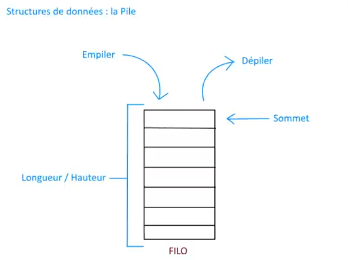
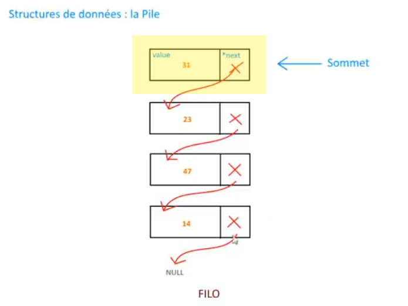
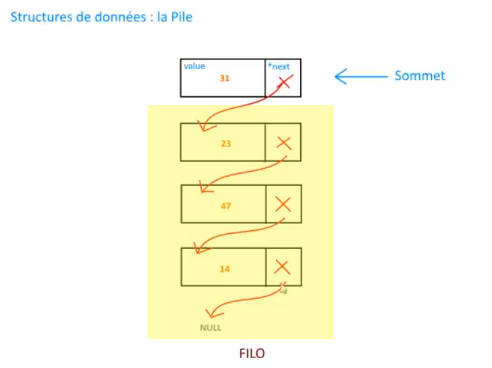
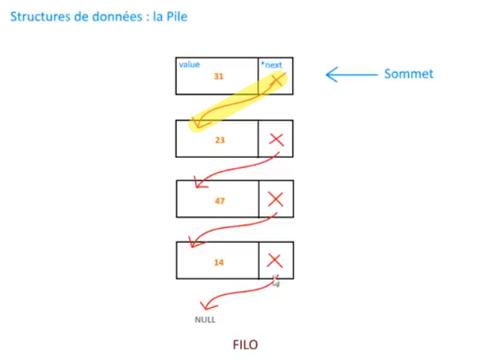
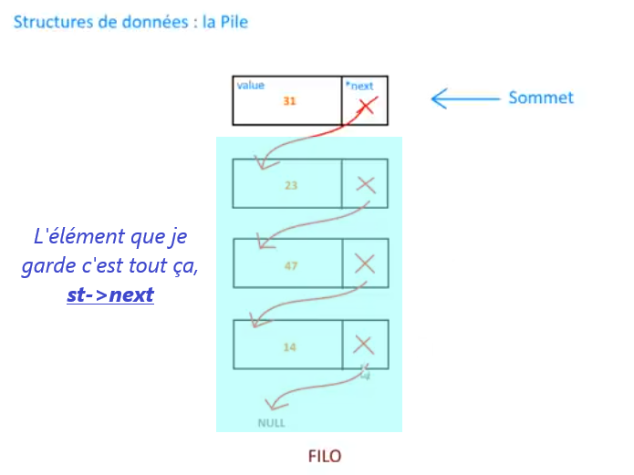
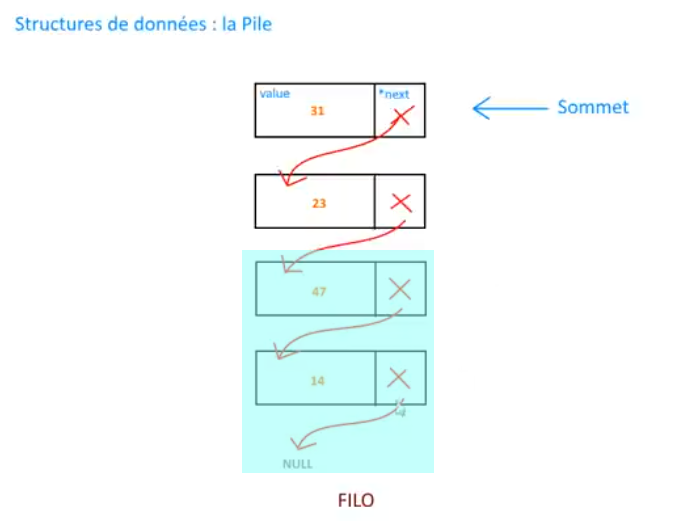
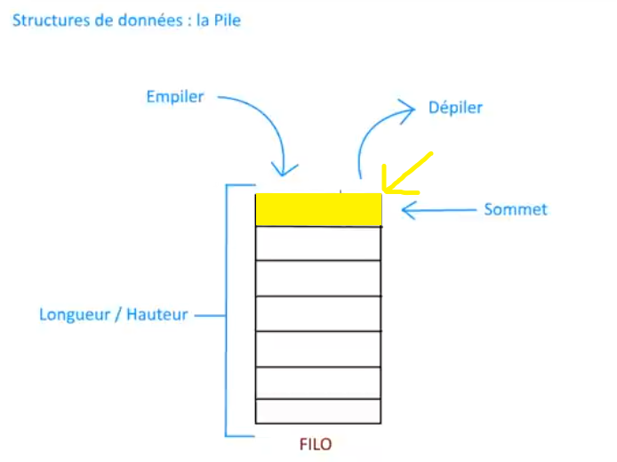

# [17. Piles](https://www.youtube.com/watch?v=zERZNLuxtyU)

Bonjour à tous et bienvenue pour cette séance numéro 17.

Maintenant que vous avez vu un peu les notions du langage c, je vous avez dit que nous ferions des choses un peu plus avancées donc tout ce que vous avez vu jusqu'à présent va vous servir dans les prochaines vidéos.

Il n'y a rien de nouveau en fait à apprendre avec le langage c, vous connaissez un petit peu tout ce qui fait partie des standards soit l'allocation dynamique, les tableaux, les chaînes, les pointeurs bref tout ce genre de choses. C'était vraiment toutes les notions à connaître au niveau du langage.

Maintenant on va les mettre toutes en application, on va les utiliser pour voir comment agencer un peu tout ça pour utiliser notamment ici, et à partir de cette vidéo-là, des structures de données.

Alors vous avez vu qu'avec les tableaux, on pouvait organiser un certain type de données de manière on va dire organisé puisque vous savez que les cases d'un tableau se suivent, elles sont stockées de manière continue dans la mémoire comme je vous l'ai expliqué dans les vidéos  précédentes.

On verra qu'il est nécessaire dans certains cas de mettre en place certaines structures de données.

Alors bien évidemment on ne va pas réfléchir à inventer des nouvelles structures par rapport à leur efficacité ou les avantages qu'elles peuvent avoir.

Il y a beaucoup de personnes qui ont déjà fait tout cela avant nous donc on va par contre apprendre à implémenter ces types de structures.

Alors avant toute chose et j'en profite parce que c'est la première vidéo vraiment des structures de données, il n'y a pas de solution qui soit forcément la mieux c'est-à-dire qu'une structure de données doit respecter certaines règles comme notamment la pile comme on va le voir très rapidement mais elle peu légèrement être différenciée si vous voulez, elle peut être un petit peu adaptée comme bon vous semble en fait tant qu'elle suit un petit peu les règles de ce type de structure donc vous pourrez avoir plusieurs types d'alimentation possible, plusieurs types de codage possible pour toute structure tant qu'elle suit quand-même les règles un petit peu de base.

On va donc commencer par la Pile pour cette première vidéo et la pile ça se résume à ça.



Voilà comment se compose une structure de Piles, on peut avoir besoin de l'utiliser d'ailleurs le système en utilise d'accord il utilise une Pile notamment avec le langage c quand fait des appels de fonction.

Par exemple, je vous ai peut-être parler d'une espèce de Pile d'appels c'est-à-dire notamment en récursivité c'est à dire quand vous allez appeler une fonction, il va donc créer un espèce de contexte où il va empiler dans la Pile une première valeur donc on va dire qu'on part toujours du bas d'accord.

Il empile ça comme une pile d'assiettes en fait d'accord donc ça va arriver ici.


Ainsi dans ce contexte de fonction, vous aurez les variables locales c'est-à-dire les variables qui sont propres à la fonction.

Si après je fais un appel à une autre fonction, eh bien elle va s'empirer part au-dessus d'accord au fur et à mesure.

Comme une pile d'assiettes en fait qui va s'empiler du bas vers le haut donc on appelle ça une structure *first in last out* d'accord donc FILO et je vous expliquer pourquoi.

Tout simplement parce que comme pour une pile d'assiètes justement la première valeur d'accord le premier élément qui aura été inséré donc le *first in* sera le dernier retiré *last out* tout simplement puisque si admettons ici, on a une pile remplie vous allez bien commencer par enlever celui du haut et pas celui du bas sinon tout va se casser la figure tout simplement.

Alors ça c'est une première règle à respecter au niveau de la structure d'une pile c'est à dire qu'on insère des éléments d'accord on peut en insérer comme ça au fur et à mesure qu'on veut.

Par contre à partir du moment où on veut retirer des éléments ce sera toujours le dernier qui a été inséré que l'on va enlever en premier et pas inversement donc il faut vraiment respecter ça.

Si on n'a pas ce respect en tout cas au niveau des éléments de leur insertion et de leur suppression notamment ou de leur récupération, on n'a pas une structure de piles d'accord c'est vraiment FILO donc c'est vraiment *first in last out* ça c'est vraiment à respecter.

Après on a certains termes de vocabulaire qu'on verra quand on parle notamment de la longueur de la pile ou de la hauteur, c'est simplement le nombre d'éléments qu'elle aura d'accord c'est à savoir et quand on parle de son sommet, c'est la plus haute donc c'est la dernière valeur qui a été insérée dans la pile voilà.

Ne vous en faites pas, on va voir un petit peu tout ça on va implémenter un petit peu ce schéma et vous verrez un peu comment ça fonctionne.

Alors dans quel système ça peut servir une Pile et bien ça peut servir pour beaucoup de choses, par exemple le système les utilisent notamment pour les appels de fonction, ça peut servir peut-être qu'un jour vous aurez besoin d'un programme et que la meilleure manière d'agencer les données de votre programme se fera par l'utilisation d'une pile.

A ce moment là, cet exemple se prêtera bien.

On va du coup implémenter ça directement au niveau du code.

J'ai créé trois fichiers donc le fichier main.c qui sera le principal, on va avoir un fichier stack donc c'est le terme anglais pour piles d'accord qui va contenir l'implémentation de la pile parce que là on fait vraiment de la programmation modulaire et on va utiliser plusieurs fichiers pour faire ça, pour que ce soit un peu plus propre et on va avoir bien sûr le fichier d'en-tête pour la fameuse pile donc tout simplement comme ça.

> strucure d'entiers
+ [main.c](entiers.c)
+ [stack.c](stack-entiers.c)
+ [stack.h](stack-entiers.h)

> structure de joueurs
+ [main.c](joueurs.c)
+ [stack.c](stack-joueurs.c)
+ [stack.h](stack-joueurs.h)

Alors ces fichiers-là en fait, vous pourrez si vous voulez les récupérer d'accord parce que je vous les fournirais dans la description de la vidéo, vous aurez une archive pour récupérer un petit peu l'implémentation qu'on a fait dans la vidéo, peut-être même un peu plus compléter, un peu plus commenté d'ailleurs et vous pourrez réutiliser ces deux fichiers dans vos programmes.

+ stack.c
+ stack.h

Ils seront tout à fait utilisable, vous pourrez d'ailleurs les améliorer puisqu'encore une fois ça restera une base, il y a toujours moyen d'améliorer du code et vous pourrez en tout cas les réutiliser tout simplement comme une bibliothèque tout simplement de fonctions.

C'est pour ça que je vous met ça dans un fichier point h pour les prototypes et les définitions de structures et tous ce qui est implémentation dans un fichier source mais ça pourrait être utilisé comme par exemple ici dans le fichier main.c

+ main.c
```c
#include <stdio.h>

int main(void)
{

    return 0;
}
```

Du coup, on va penser aux bonnes inclusions.

Là pour pouvoir utiliser notamment le fichier donc ici toutes les fonctions des piles, il faudra les inclures donc je vais faire un `#include "stack.h"`.

+ main.c
```c
#include <stdio.h>
#include "stack.h"

int main(void)
{

    return 0;
}
```

Voilà tout ce qu'on va voir ici, ce ne sont que des révisions.

Normalement tout ça ça va être clair pour vous. On va les remettre dans stack.c avec stdlib.h puisqu'on va faire un peu d'allocations.

+ stack.c
```c
#include <stdio.h>
#include <stdlib.h>
#include "stack.h"
```
+ main.c
```c
#include <stdio.h>
#include "stack.h"

int main(void)
{

    return 0;
}
```

Alors pas besoin de stdlib.h dans main.c

Voilà comme ça, on a tout ce qu'il faut là et dans stack.h on va pouvoir mettre nos prototypes et surtout définir la structure de la Pile donc déjà on va faire un `#ifndef` comme je vous avais expliqué puis un petit `#define` pour éviter tout simplement les inclusions multiples comme on l'avait déjà vu.

+ stack.h
```h
#ifndef __STACK__H__
#define __STACK__H__

#endif
```
+ stack.c
```c
#include <stdio.h>
#include <stdlib.h>
#include "stack.h"
```
+ main.c
```c
#include <stdio.h>
#include "stack.h"

int main(void)
{

    return 0;
}
```

Ce ne sont vraiment que des rappels de toute façon, il n'y aura rien de nouveau dans les syntaxes, dans les écritures si vous voulez dans les notions abordées, ce ne seront que des choses qu'on a déjà vu.

Simplement qu'on va mettre tout ça en pratique dans un exercice concret puisqu'il s'agit d'une structure de données.

Première chose, je vais faire quelque chose que j'utilise souvent pour les structures et notamment pour la programmation générale, c'est créé un type Booléen mais ce n'est pas un type Booléen puisque rappelez-vous c'est une donnée qui peut prendre deux valeurs vrai ou faux d'accord donc 1 pour vrai et 0 pour faux, et ça n'existe pas sur tous les standards en c.

Il y a des standards après qui ont permis d'inclure ce type de variables en fait mais nous pour être sûr que ça marche partout, on va le créer nous-mêmes.

## Type booléen

On va donc commencer par le commenter *Type booléen* et on va simplement faire un `typedef` pour carrément créer un type, on ne va pas seulement faire une énumération mais en plus on va faire un type. On fait une énumération donc on l'appele *enum* donc on fait une énumération que l'on va typer. On écrit ensuite *false* rappelez-vous en fait qui prend la valeur 0 d'accord false va être égal à zéro et true ça va être égal à 1.

+ stack.h
```h
#ifndef __STACK__H__
#define __STACK__H__

    /* Type booléen */
    typedef enum
    {
        false, //0
        true //1
    }Bool;

#endif
```

false égal 0 et true égal 1 tel que par défaut automatiquement sont définies les énumérations et on va l'appeler `..}Bool;` pour le type Booléen.

Voilà c'est simplement pour que ce soit plus pratique lorsque vous verrez pour certaines fonctions et maintenant on va pouvoir commencer par la définition d'une pile.

## Définition d'une Pile

+ stack.h
```h
#ifndef __STACK__H__
#define __STACK__H__

    /* Type booléen */
    typedef enum
    {
        false, //0
        true //1
    }Bool;

    /* Définition d'une Pile */

#endif
```

Nous allons créer notre fameux type c'est-à-dire que l'on va créer ce schéma de Piles d'accord.


Qu'est ce qu'une Pile en fait ? hé bien ça va être voyez ici une espèce de cellule d'accord qui va contenir un entier et ensuite un pointer vers la cellule suivante d'accord jusqu'à ce que la valeur ici à la fin donc en bas (c'est la première insérée) pointe sur NULL d'accord.

Ainsi donc en fait on va voir une pile et qui aura ensuite un pointeur vers une autre Pile d'accord.

Alors on va passer à l'implémentation, ce serra plus clair pour certaines choses. On va du coup tout simplement faire un `typedef struct` puisqu'on va créer un type à partir de ça et on va appeler ça *StackElement* donc un élément de Pile.

## Définition de la Pile

+ stack.h
```h
#ifndef __STACK__H__
#define __STACK__H__

    /* Type booléen */
    typedef enum
    {
        false, //0
        true //1
    }Bool;

    /* Définition d'une Pile */
    typedef struct StackElement
    {

    }StackElement, *Stack;

#endif
```

Ici nous disons que c'est le type `}StackElement,` ou bien un pointeur vers `*Stack`, c'est tout simplement qu'on aura comme ça deux notations.

Voilà, on aura comme ça le choix de 2 notation, on va plus ou moins cacher en fait l'utilisation d'un pointeur ici `*Stack` d'accord donc un pointeur de Pile ou bien un élément de Pile `}StackElement,`.

Je mets deux noms possibles d'accord pour tout ces types de structures.

Ma structure qu'est ce que c'est ? c'est un entier `int value;`.

+ stack.h
```h
#ifndef __STACK__H__
#define __STACK__H__

    /* Type booléen */
    typedef enum
    {
        false, //0
        true //1
    }Bool;

    /* Définition d'une Pile */
    typedef struct StackElement
    {
        int value;
    }StackElement, *Stack;

#endif
```

A la fin de la vidéo, je vous ferai un petit bonus où on transformera ça à la rigueur pour avoir des piles par exemple de joueurs.

Rappelez-vous les players qu'on faisait la dernière fois pour les structures énumération.

En bref, je vous montrerai qu'on peut tout simplement changer dans la structure de la pile les informations qu'on veut et on peut du coup avoir une pile de autre chose que ici des entier mais là on va travailler des entiers pour que ce soit simple au début, pour simplifier les choses.

Là on va avoir un `struct StackElement *next;` d'accord un StackElement parce que c'est le but et un pointeur vers le suivant `*next` d'accord mais ça on verra à l'implémentation comment ça fonctionne.

+ stack.h
```h
#ifndef __STACK__H__
#define __STACK__H__

    /* Type booléen */
    typedef enum
    {
        false, //0
        true //1
    }Bool;

    /* Définition d'une Pile */
    typedef struct StackElement
    {
        int value;
        struct StackElement *next;
    }StackElement, *Stack;

#endif
```

Voilà comment est définit notre Pile, on va voir les  prototypes des fonctions qu'on va pouvoir commencer à implémenter.

```c
/* Prototypes des fonctions */
```

Alors donc quand vous voulez développer une espèce de bibliothèque de fonctions comme je le fais ici, en général c'est comme ça qu'on procède. On s'occupe du fichier d'en-tête et ensuite, on va créer un prototype, implémenter la fonction du prototype. Ensuite on crée un deuxième prototype donc on implémente la fonction.

Bien sûr, au fûr et à mesure, on va les tester tout ça parce qu'il faut les tester au fûr et à mesure pour être sûr que le code fonctionne et on obtiendra quelque chose qui soit cohérent à la fin et complet.

## new_stack

Première chose ben moi je veux une fonction qui puisse me créer une nouvelle Pile ok donc on va dire que le prototype sera assez simple puisque du coup je vais simplement en fait retourner NULL quand je voudrais une nouvelle Pile.

Je considérer qu'en fait qu'une Pile vide, une nouvelle Pile c'est tout simplement NULL d'accord donc on va faire *Stack* voyez que là j'utilise Stack ainsi c'est un peu comme si j'avais un pointeur.

```c
/* Prototypes des fonctions */
Stack new_stack(void);
```

Voyez ici, je cache le pointeur avec ce qu'on a définit `, *Stack;` donc c'est tout simplement `Stack new_stack(void);`. On choisit de nommer la fonction new_stack(), ainsi je vais essayer de rester sur une notation un peu pareil au fur et à mesure de la vidéo. Elle ne prend rien bien évidemment et c'est tout.

+ stack.h
```h
#ifndef __STACK__H__
#define __STACK__H__

    /* Type booléen */
    typedef enum
    {
        false, //0
        true //1
    }Bool;

    /* Définition d'une Pile */
    typedef struct StackElement
    {
        int value;
        struct StackElement *next;
    }StackElement, *Stack;

    /* Prototypes des fonctions */
    Stack new_stack(void);

#endif
```

Voilà le prototype, on n'oublie pas le point virgule d'accord dans le fichier d'en-tête et on prend ensuite tout le nom sans point virgule `Stack new_stack(void)` et on le met dans stack.c pour implémenter.

+ stack.c
```c
#include <stdio.h>
#include <stdlib.h>
#include "stack.h"

Stack new_stack(void)
{

}
```

Alors je ne vais pas commenter chacune des fonctions car elles seront commentées dans les archives que vous allez récupérer dans la description de la vidéo mais là pour la vidéo, pour gagner du temps, on va rester sur des choses comme ça.

A l'arrière ce qu'on pourra faire par contre c'est séparer les fonctions par des petits séparateur comme ça `/*--..--*/` et c'est tout.

Ici tout bêtement, je fait un petit `return NULL;`.

+ stack.c
```c
#include <stdio.h>
#include <stdlib.h>
#include "stack.h"

Stack new_stack(void)
{
    return NULL;
}

/*---------------------------------------------*/
```

Alors je considère, ça c'est mon choix à moi d'accord que pour moi une pile, dans mon cas à moi, dans la représentation de la Pile, une Pile vide, c'est une Pile qui vaut NULL tout simplement d'accord.

Après vous pouvez très bien vous dire qu'une pile en fait ce n'est pas nul, c'est juste qu'elle contient par exemple une valeur zéro.

Bref c'est encore une fois vous voyez un choix  d'implémentation que l'on peut choisir.

Moi je vais dire que c'est NULL puisque je veux montrer ici que la fin de ma Pile en fait arrivera à NULL et on expliquera ça plus tard.

Alors voilà pour cette première implémentation d'accord ok.

Maintenant on va pouvoir créer une Pile pourquoi pas ? On va faire `Stack sta = new_stack();` alors ici il ne va pas se passer grand chose parce que ça va être un petit peu égale à NULL tout seul. On peut tester éventuellement, s'amuser à compiler.

+ main.c
```c
#include <stdio.h>
#include "stack.h"

int main(void)
{
    Stack sta = new_stack();

    return 0;
}
```
+ stack.c
```c
#include <stdio.h>
#include <stdlib.h>
#include "stack.h"

Stack new_stack(void)
{
    return NULL;
}

/*---------------------------------------------*/
```
+ stack.h
```h
#ifndef __STACK__H__
#define __STACK__H__

    /* Type booléen */
    typedef enum
    {
        false, //0
        true //1
    }Bool;

    /* Définition d'une Pile */
    typedef struct StackElement
    {
        int value;
        struct StackElement *next;
    }StackElement, *Stack;

    /* Prototypes des fonctions */
    Stack new_stack(void);

#endif
```
```powershell
gcc *.c -o prog
.\prog.exe
```

Alors là évidemment, on ne voit rien puisque je fais qu'un return de NULL donc là déjà c'est pour voir s'il n'y a pas d'erreur et donc ça vous permettra de suivre au fur et à mesure et on y va.

Première chose maintenant, on va pouvoir vérifier par exemple si la pile est vide et du coup comme pour nous la définition d'une Pile vide est très très simple ça va être facile à considérer qu'une pile est vide ou non.

On va utiliser le fameux type Bool, voyez que j'ai fait plus haut dans stack.h comme retour de la fonction et on va l'appeler is_empty_stack().

## is_empty_stack

```h
Bool is_empty_stack(Stack st);
```

Voilà est-ce que la Pile est vide et elle va prendre en prendre en paramètre bien sûr une pile.

On prendra toujours *st* comme variable pour les Pile pour que ce soit simple.

Voilà on prend le prototype et on implémente, voyez on fait au fur et à mesure et comme ça on reste sur quelque chose de clair.

+ stack.c
```c
#include <stdio.h>
#include <stdlib.h>
#include "stack.h"

Stack new_stack(void)
{
    return NULL;
}

/*---------------------------------------------*/

Bool is_empty_stack(Stack st)
{

}

/*---------------------------------------------*/
```

Et là quel est le test ? regardez une pile vide, qu'est-ce que c'est ? hé bien c'est NULL donc j'ai juste à faire ça.

```c
Bool is_empty_stack(Stack st)
{
    if(st == NULL)
        return true;
    
    return false;
}
```

Ainsi si st est null, je retourne true et pourquoi je peux retourner ce mot-là ? tout simplement parce qu'on l'a défini ici dans le Booléen. Voilà, on peut utiliser des mots plutôt que des chiffres c'est quand même beaucoup plus clair donc voilà évidemment si ce n'est pas null on fait un `return false;` donc pas besoin de mettre un else pour optimiser un peu le code.

Soit on rentre dans le if() ou non, on fait un return ou l'autre.

Ainsi ça ne sert à rien de faire ça, `else`.

```txt
Bool is_empty_stack(Stack st)
{
    if(st == NULL)
        return true;
    else
        return false;
}
```

Voilà ceci d'accord peut tout de suite être optimisée en faisant juste ça voilà.

```c
Bool is_empty_stack(Stack st)
{
    if(st == NULL)
        return true;
    
    return false;
}
```

Tout simplement comme ça ici on évite d'avoir un `else` donc à de quoi définir qu'une Pile est vide ou non.

On va tester ça maintenant et tester si la pile est vide donc si ça a retourné true c'est que la Pile sera vide.

```c
#include <stdio.h>
#include "stack.h"

int main(void)
{
    Stack sta = new_stack();

    if(is_empty_stack(sta))
        printf("La Pile est vide.\n");

    return 0;
}
```

Si ça retourne true c'est que la Pile est vide et sinon tout simplement la Pile a des éléments.

+ main.c
```c
#include <stdio.h>
#include "stack.h"

int main(void)
{
    Stack sta = new_stack();

    if(is_empty_stack(sta))
        printf("La Pile est vide.\n");
    else
        printf("La Pile a des elements.\n");

    return 0;
}
```

## 1e compilation et exécution

Là déjà, on va pouvoir vérifier quelque chose dans mon programme donc on compile et on teste.

+ main.c
```c
#include <stdio.h>
#include "stack.h"

int main(void)
{
    Stack sta = new_stack();

    if(is_empty_stack(sta))
        printf("La Pile est vide.\n");
    else
        printf("La Pile a des elements.\n");

    return 0;
}
```
+ stack.c
```c
#include <stdio.h>
#include <stdlib.h>
#include "stack.h"

Stack new_stack(void)
{
    return NULL;
}

/*---------------------------------------------*/

Bool is_empty_stack(Stack st)
{
    if(st == NULL)
        return true;
    
    return false;
}
```
```h
#ifndef __STACK__H__
#define __STACK__H__

    /* Type booléen */
    typedef enum
    {
        false, //0
        true //1
    }Bool;

    /* Définition d'une Pile */
    typedef struct StackElement
    {
        int value;
        struct StackElement *next;
    }StackElement, *Stack;

    /* Prototypes des fonctions */
    Stack new_stack(void);
    Bool is_empty_stack(Stack st);

#endif
```
```powershell
gcc *.c -o prog
.\prog.exe  
La Pile est vide.
```

On compile et on teste et on a *La Pile est vide.* donc très bien ça respecte bien évidemment notre choix ici de définir une pile comme étant nulle tout simplement (new_stack() -> NULL) donc la fonction fait en tout cas le travail qu'elle doit faire.

Très bien pour ces deux choses-là donc là rien de compliqué, tout le monde a bien suivi, on a vu comment créer un nouvelle Pile, on a vu comment vérifier qu'une pile avait des éléments ou non.

Maintenant vous attendez peut-être à éventuellement voir comment on peut ajouter des éléments, pourquoi pas d'accord.

Voilà ça on va le faire avant de voir comment on pourra l'afficher.

On va voir comment ajouter les éléments et après on verra éventuellement comment afficher une Pile, on va donc commencer par faire un push_stack().

## push_stack

```h
Stack push_stack(Stack st, int x);
```

push_stack() où push est un terme utilisé en informatique pour dire qu'on ajoute, vous pouvez mettre après *insert*, *add*, ainsi vous appeler ça comme vous voulez. Le noms des fonctions vraiment c'est vous qui voyez, il n'y a pas de meilleur nom ou de moins bien, chacun fait absolument comme il veut, moi j'ai pas problème avec ça.

Ne pas oublier du coup de mettre que ça prend la Pile, `Stack st` et ensuite l'élément a ajouté, `int x`.

On a dit qu'on travaillais, rappelez-vous, avec des entiers d'accord pour ajouter la fameuse valeur ici (int x) pour rester simple voilà.

Si vous voulez en fin de vidéo, on transformera en fait tout notre code et vous verez qu'il n'y aura pas grand chose a changer pour manipuler un petit entier-ici mais pourquoi pas par exemple une structure de joueurs avec un player et cetera.

Ainsi on regardera pour ça éventuellement.

Alors là comment on va faire ? comment allons-nous créer ça ? je vais vous expliquer au niveau de ce schéma-là.


Voilà rappelez-vous d'accord la fameuse structure de piles, on a cet élément-là.

Par défaut, on a juste NULL donc il faut considérer le fait que si on n'a rien du tout d'accord dans notre Pile, il faudra tout simplement que dans tous les cas on crée un nouvel élément.

Qu'est-ce que va être le nouvel élément ? ainsi on va devoir créer un StackElement c'est-à-dire tout ça.



Avec le x d'accord qu'on récupère ici en paramètre de fonction.

```c
Stack push_stack(Stack st, int x)
{

}
```

Il faudra ajouter le x à la valeur du StackElement qu'on aura créé et ensuite il faudra dire tout simplement que la suite de la Pile pointe vers ce que l'on a donc si la Pile est vide ce que l'on c'est NULL donc on dira simplement que la suite de la Pile pointe vers NULL donc très bien pour dire qu'il y a qu'un seul élément.

Et si jamais on avait déjà des éléments et bien comme vous voyez qu'on ajoute les éléments par-dessus automatiquement admettons que toute cette partie là voyez c'est la pile actuelle ok.



Eh bien, on dira que le nouvel élément flèche *next est égale à la Pile ici qu'on passé ici en paramètre de fonctions ici.

```h
Stack push_stack(Stack st, int x);
```


Là d'accord alors on va regarder du coup pour mettre ça en place.

Alors c'est un petit peu compliqué dans les explications parce que vous n'avez pas non plus énormément d'expérience en langage c mais à la longue ça viendra d'accord vous arriverez à comprendre la logique de tout ça, comment justement on met en place, comment fonctionne les Piles.

N'oubliez pas qu'on insère toujours des éléments par dessus les autres quand on est sur une structure de Pile et quand on va aller les retirer, on va les retirer par le dessus également d'accord.

N'oubliez pas qu'il peut y avoir une Pile ici c'est-à-dire le
st que je passe ici en paramètre et que ça peut soit être NULL ceci.

```txt
Bool is_empty_stack(Stack st)
{
    if(st == NULL)
etc.
```

Ici qu'on a vérifié tout à l'heure dans le main et ça peut être comme ça de maillons qu'on a ensemble, c'est une Pile qui contient déjà des éléments.


Voilà donc on doit gérer ces deux cas possibles (vide ou non) et vous allez voir que c'est en réalité très très simple.

On va dans tous les cas créer un nouvel élément parce que le but c'est d'avoir justement un nouvel élément de Pile donc on va faire un StackElement et on va faire un pointeur dessus, `StackElement *element;`.

```c
Stack push_stack(Stack st, int x)
{
    StackElement *element;
}
```

Et maintenant, on va faire de l'allocation dynamique tout simplement parce que rappelez-vous que l'ordinateur lui bon si c'est pour manipuler des entiers, pour manipuler un nombre flottant, ce genre de choses ça va il sait faire mais par contre pour lui un élément de Pile, il ne sait pas ce que c'est donc il ne sait pas quelle taille ça représente.

Si vous manipulez des Piles d'entiers, il ne va pas falloir allouer la même taille de mémoire qu'une Pile de chaînes de caractères ou même de joueurs, c'est évidemment pas la même chose.

On va faire tout simplement `element` et on va faire un malloc qui est simplement notre petit allocation de sizeof() et pour rester propre, on va mettre ceci `*element` d'accord.

```c
Stack push_stack(Stack st, int x)
{
    StackElement *element;

    element = malloc(sizeof(*element));
}
```

Voilà comme ça voilà il dit simplement la taille du pointeur `*element` donc il prendra en fait la taille de `StackElement` et il retournera le bon nombre d'octets.

A partir de là, on aura d'accord notre petite allocation qui sera fait proprement.

Toujours pour chaque allocation, ça on l'avais vu dans la vidéo sur l'allocation dynamique, si l'objet qu'on a alloué est égal à NULL vous affiché un message avec un petit fprintf() si on veut même carrément et au lieu de dire par exemple qu'on écrit dans un fichier, on écrit sur la sortie standard `fprintf(stderr);`. Voilà ça va écrire en fait dans votre terminal mais simplement que ça va utiliser un espèce de canal qui est normalement prévue que pour les erreurs donc je ne vais pas trop en parler dans une vidéo parce que je vais en parler éventuellement dans les tutoriels mais vous pouvez l'utiliser tel quel voilà vous mettez `stderr` en premier paramètre et en deuxième, vous mettez votre message *Probleme allocation dynamique*.

```c
Stack push_stack(Stack st, int x)
{
    StackElement *element;

    element = malloc(sizeof(*element));

    if(element == NULL)
    {
        fprintf(stderr, "Problème allocation dynamique.\n");
        exit(EXIT_FAILURE);
    }
}
```

On va rester très simple au niveau des explications et on quitte carrément avec une constante EXIT_FAILURE pour dire que voilà ça échoue en fait tout simplement.

Voilà là, on est bon.

A partir de là, on part du principe qu'à partir de cette endroit du code, après le if(), c'est que l'allocation s'est bien passée donc qu'est ce qu'on va faire ?

Je l'avais dit tout à l'heure mais admettons que mon schéma c'est ma nouvelle File avec (31) le nouveau maillon que l'on veut ajouter.


A ce moment, il n'y a pas encore la flèche rouge (31,*next->23) pour le nouveau maillon et on veut que la valeur soit ajoutée donc pour mon *element*, sa *valeur* donc on fait flèche value `element->value` avec une flèche parce que rappelez-vous que les Piles d'accord ce sont des pointeurs donc on met une flèche `->` et pas un seul point `.` et c'est égal à x, ce que j'ai passé en paramètre.

```c
Stack push_stack(Stack st, int x)
{
    StackElement *element;

    element = malloc(sizeof(*element));

    if(element == NULL)
    {
        fprintf(stderr, "Problème allocation dynamique.\n");
        exit(EXIT_FAILURE);
    }

    element->value = x;
}
```

Puis la suite de la Pile `element->next`, rappelez-vous qu'on suit ces deux éléments-là `value` et `*next` qui sont les deux choses de la Pile.

```txt
/* Définition d'une Pile */
typedef struct StackElement
{
    int value;
    struct StackElement *next;
}StackElement, *Stack;
```

Donc `element->next` va être égal tout simplement à la Pile elle-même d'accord.

```c
Stack push_stack(Stack st, int x)
{
    StackElement *element;

    element = malloc(sizeof(*element));

    if(element == NULL)
    {
        fprintf(stderr, "Problème allocation dynamique.\n");
        exit(EXIT_FAILURE);
    }

    element->value = x;
    element->next = st;
}
```

`element->next = st;` parce que en fait, on imagine que la Pile c'est tout ça et du coup voyez que la suite du nouvel élément bas c'est bien toute la Pile.

[06.PNG](schémas/06.PNG)

Ainsi si toute la Pile est vide, hé bien ça tombe bien, ça va être nul. Voilà ça va être NULL comme ici tout en bas et si il y a quelque chose ce serra donc tout simplement le restant de la Pile.

Tout simplement, la Pile c'est `st`.

Voyez comme c'est un peu plus simple quand on fait l'implémentation au niveau de la compréhension et alors on retourne tout simplement éléments pourquoi parce que
je vous rappelle que `element`, pourquoi ?

```c
Stack push_stack(Stack st, int x)
{
    StackElement *element;

    element = malloc(sizeof(*element));

    if(element == NULL)
    {
        fprintf(stderr, "Problème allocation dynamique.\n");
        exit(EXIT_FAILURE);
    }

    element->value = x;
    element->next = st;

    return element;
}
```

On retourne `element` parce qu'il contient maintenant toute la Pile ainsi s'il y avait déjà des éléments on les met dans `*next` donc maintenant tout est rattaché, pas de souci à ce niveau-là.

Voilà et là, on a effectivement l'ajout qui a été fait ok.

Alors avant de commencer ce qu'on peut faire d'ailleurs ici, comme la fonction push_stack() sachant qu'on retourne à chaque fois fois la Pile donc on va faire `sta = push_stack(sta, 14);` pour respecter la première valeur que l'on met.

[07.PNG](schémas/07.PNG)

+ main.c
```c
#include <stdio.h>
#include "stack.h"

int main(void)
{
    Stack sta = new_stack();

    if(is_empty_stack(sta))
        printf("La Pile est vide.\n");
    else
        printf("La Pile a des elements.\n");

    sta = push_stack(sta, 14);
    sta = push_stack(sta, 47);

    return 0;
}
```

On va respecter un tableau déjà la première valeur citée [14] puis on refait pareil avec [47]. On va reprendre les mêmes valeurs, alors je ne vais pas compiler, exécuter de  programme tout de suite tout simplement et ça vous l'avez peut-être remarqué pour beaucoup c'est que j'ai fait une allocation au niveau du code par contre j'ai pas une seule fois à un moment donné deux free().

D'accord, je n'ai tout simplement pas fait une libération de mémoire et ça ça va poser souci.

Alors j'aurais pu, si j'avais eu qu'un seul élément `sta = push_stack(sta, 14);` mais pas [47], ainsi j'aurais pu très bien dans main faire ça `free(sta);`.

+ main.c
```c
#include <stdio.h>
#include "stack.h"

int main(void)
{
    Stack sta = new_stack();

    if(is_empty_stack(sta))
        printf("La Pile est vide.\n");
    else
        printf("La Pile a des elements.\n");

    sta = push_stack(sta, 14);
    //sta = push_stack(sta, 47);

    free(sta);

    return 0;
}
```

Si on avait eu qu'un seul élément de la Pile donc on aurait pu le libérer.

Par contre là comme j'ai l'intention d'en faire plusieurs, on va déjà codé donc on ne va rien compiler pour le moment, on va coder la fonction qui va libérer la mémoire en fait proprement d'accord au niveau des Pile donc on va s'en occuper tout de suite.

On va l'appeler `Stack clear_stack(Stack st);`.

## clear_stack

```h
Stack clear_stack(Stack st);
```

clear_stack(), ça va va être quoi ? ça va retourner tout simplement une Pile vide, et en paramètre c'est la Pile à vider tout simplement.

Alors ça on va le développer tout de suite parce que c'est super important, on ne peut pas laisser comme ça des fuites mémoires donc on va le faire tout de suite.

Donc là c'est un petit moment où on ne va pas tester le code qu'on vient juste de faire, on va être obligé quand même de faire un code propre ici pour libérer la mémoire donc à ce niveau-là, vous verrez qu'on mettra un petit peu à jour cette fonction pour qu'elle soit un peu plus arrangé mais par rapport à ce qu'on a au début qu'est ce qu'on peut faire ? eh bien on va tout simplement utiliser la récursivité donc si vous ne savez pas ce que c'est, vous pouvez regarder sur la chaîne il y a une playlist tutoriel pour le langage c et il y a un petit tuto sur la récursivité parce que ça va vous être utile donc c'est un petit plus.

Sinon si vous ne savez pas vraiment ce que c'est et que ça ne vous intéresse pas. La récursivité c'est tout simplement une fonction qui va s'appeler elle-même d'accord qui va du coup s'appeler plusieurs fois à la suite pour exécuter un peu le même traitement jusqu'à un certain point d'arrêt donc nous qu'est ce qu'on va faire tout simplement ? 

On va créer un élément ok qui va servir en fait d'élément si vous voulez un peu de sauvegarde d'accord il servira comme ça d'élément temporaire.

```c
Stack clear_stack(Stack st)
{
    StackElement *element;
}
```

Donc on ne va rien allouer parce que vous voyez c'est déjà un StackElement et donc on le laisse tel quel, pas de souci parce qu'on a va juste s'en servir pour stocker des informations dedans.

Là donc on a notre élément voici tout ce qu'on a besoin et on va tout simplement déjà vérifier si la Pile n'est pas vide donc on va faire ça `if(is_empty_stack(st))` et si la Pile est vide, qu'est ce qu'on fait ? On retourne une nouvelle Pile.

```c
Stack clear_stack(Stack st)
{
    StackElement *element;

    if(is_empty_stack(st))
        return new_stack();
}
```

On retourne une nouvelle Pile et on a créé une fonction pour retourner une nouvelle Pile donc autant s'en servir.

J'aurais pu faire un return NULL mais comme on a fait une fonction voilà.

Pourquoi c'est bien d'utiliser les fonctions plutôt qu'une une valeur parce que le jour où je voudrais décidé que maintenant une nouvelle Pile c'est plus seulement NULL mais c'est que je ne sais pas moi, par exemple une autre valeur par défaut et autre chose... eh bien voyez comme ici on a mis les noms de fonction en valeur de retour, ça va se modifier partout dans le code donc c'est vraiment important d'utiliser les fonctions. Voilà c'est un petit peu le but sinon bah on ne ferait pas de fonction, on coderait tout sans fonction et puis très bien mais le jour où on voudrait modifier quoi que ce soit, il faudrait modifier absolument toutes les parties du code donc là on utilise au maximum les fonctions comme là vous-voyez.

```txt
Stack clear_stack(Stack st)
{
    StackElement *element;

    if(is_empty_stack(st))
        return new_stack();
}
```

Alors je ne me suis pas amusé à faire encore *st == NULL* puisque j'ai fait une fonction pour ça donc on gagne du temps, on a factorisé le code pour éviter la répétition donc on utilise au maximum nos fonctions donc si la Pile est vide, on pourrait retourner la Pile tel quel *Stack st* mais moi pour être sûr voyez je retourne une nouvelle Pile pour être sûr qu'il n'y a pas de soucis et que c'est fait comme il faut.

Et sinon qu'est ce qui se passe dans ce genre de cas si ce n'est pas bon ? eh bien je vais dire que l'élément, en fait je fait une sauvegarde, que l'élément c'est `st->next`.

```c
Stack clear_stack(Stack st)
{
    StackElement *element;

    if(is_empty_stack(st))
        return new_stack();
    
    element = st->next;
}
```

`st->next` veut dire que si on a en bref par exemple si on imagine qu'on a toute cette Pile-là.


... je veux dire que l'élément que je garde en fait c'est tout ça.



Ce sont les trois premiers éléments qui ont été ajoutées et le dernier [31] voyez que je ne le garde pas ok.

Pourquoi je ne garde pas [31] ? puisque je vais le libérer donc je vais faire un free() de st.

```c
Stack clear_stack(Stack st)
{
    StackElement *element;

    if(is_empty_stack(st))
        return new_stack();
    
    element = st->next;
    free(st);
}
```

`free(st);` parce qu'on ne peut libérer qu'un seul élément à la fois mais là normalement il faudra avoir une boucle pour qu'il supprime les autres c'est-à-dire qu'après il supprimer [47], puis le dernier [14] pour avoir effectivement une Pile complètement libre puisqu'il aurait retourné une nouvelle Pile, il aurait bien libérez toute la mémoire.

C'est là que la récursivité va avoir un intérêt donc je vous le dis voyez le tutoriel sur la récursivité si pour vous ce n'est pas clair.

Moi je ne met pas de while() puisque ça va se faire naturellement, je fais un return de clear_stack() voyez la fonction se rappelle elle-même d'accord c'est le même nom sauf qu'elle se rappelle sur `element`.

```c
Stack clear_stack(Stack st)
{
    StackElement *element;

    if(is_empty_stack(st))
        return new_stack();
    
    element = st->next;
    free(st);

    return clear_stack(element);
}
```

`return clear_stack(element);` donc ça va ré-exécuter le même code sauf qu'il y aura un élément en moins parce que vous avez vu que `element` maintenant ce n'était plus que tout la Pile `st->next` sauf la dernière valeur entrée donc après `element` ça va être tout ça.


Après `element` c'est tout ça (23, 47, 14), on va faire une sauvegarde on va dire que c'est `st->next` et donc à la suite on aura que les deux-là (47, 14), on va donc libérer le [23].

Ensuite on va rappeler la fonction il va prendre les deux-là.



Ensuite, il va sauvegarder que le [14], il va libérer [47] et ensuite il se retrouvera avec un [14], il va prendre la suite c'est-à-dire NULL et il va libérer le 14 et au dernier arrêt comme ce sera une pile vide (NULL), il va retourner new_stack().

Ainsi donc on aura bien libéré toute le mémoire, on aura libéré par exemple toutes nos valeurs de la Pile tout simplement. 

## 2e compilation et exécution

On va du coup pouvoir l'appeler par contre, on regarde si la Pile est vide ou non après push_stack() de [14] et [47] et donc après derrière on va vérifier si la Pile est vide et avant la fermeture, l'arrêt du code on va surtout pensez à nettoyer la Pile `sta = clear_stack(sta);` et on vérifie à la fin si elle n'est pas vide.

```c
#include <stdio.h>
#include "stack.h"

int main(void)
{
    Stack sta = new_stack();

    if(is_empty_stack(sta))
        printf("La Pile est vide.\n");
    else
        printf("La Pile a des elements.\n");

    sta = push_stack(sta, 14);
    sta = push_stack(sta, 47);

    if(is_empty_stack(sta))
        printf("La Pile est vide.\n");
    else
        printf("La Pile a des elements.\n");

    sta = clear_stack(sta);

    if(is_empty_stack(sta))
        printf("La Pile est vide.\n");
    else
        printf("La Pile a des elements.\n");

    return 0;
}
```

`sta = clear_stack(sta);` est une fonction très importante pour éviter les fuites mémoire.

N'oubliez pas que chaque fois que vous avez un malloc(), il faut un free() donc là on aura eu deux malloc() :

```txt
sta = push_stack(sta, 14);
sta = push_stack(sta, 47);
```

D'accord deux malloc() avec push_stack() à chaque fois donc ici il va faire la fonction donc rappeler clear_stack() deux fois donc il y aura bien deux free().

```txt
Stack clear_stack(Stack st)
{
    //...
    free(st);
```

Ok autant de free() qu'il y a eu d'éléments donc autant de malloc() tout simplement et là où normalement on a tout ce qu'il faut pour exécuter le code.

Ok donc on y va, c'est parti on compile.

+ main.c
```c
#include <stdio.h>
#include "stack.h"

int main(void)
{
    Stack sta = new_stack();

    if(is_empty_stack(sta))
        printf("La Pile est vide.\n");
    else
        printf("La Pile a des elements.\n");

    sta = push_stack(sta, 14);
    sta = push_stack(sta, 47);

    if(is_empty_stack(sta))
        printf("La Pile est vide.\n");
    else
        printf("La Pile a des elements.\n");

    sta = clear_stack(sta);

    if(is_empty_stack(sta))
        printf("La Pile est vide.\n");
    else
        printf("La Pile a des elements.\n");

    return 0;
}
```
+ stack.c
```c
#include <stdio.h>
#include <stdlib.h>
#include "stack.h"

Stack new_stack(void)
{
    return NULL;
}

/*---------------------------------------------*/

Bool is_empty_stack(Stack st)
{
    if(st == NULL)
        return true;
    
    return false;
}

/*---------------------------------------------*/

Stack push_stack(Stack st, int x)
{
    StackElement *element;

    element = malloc(sizeof(*element));

    if(element == NULL)
    {
        fprintf(stderr, "Problème allocation dynamique.\n");
        exit(EXIT_FAILURE);
    }

    element->value = x;
    element->next = st;

    return element;
}

/*---------------------------------------------*/

Stack clear_stack(Stack st)
{
    StackElement *element;

    if(is_empty_stack(st))
        return new_stack();
    
    element = st->next;
    free(st);

    return clear_stack(element);
}
```
+ stack.h
```h
#ifndef __STACK__H__
#define __STACK__H__

    /* Type booléen */
    typedef enum
    {
        false, //0
        true //1
    }Bool;

    /* Définition d'une Pile */
    typedef struct StackElement
    {
        int value;
        struct StackElement *next;
    }StackElement, *Stack;

    /* Prototypes des fonctions */
    Stack new_stack(void);
    Bool is_empty_stack(Stack st);
    Stack push_stack(Stack st, int x);
    Stack clear_stack(Stack st);

#endif
```
```powershell
gcc *.c -o prog
.\prog.exe     
La Pile est vide. 
La Pile a des elements.
La Pile est vide.
```

Il n'y a pas d'erreur écoutez c'est magnifique, je ne me suis pas gouré dans rien du tout et on va tester donc là on voit qu'au début la Pile est vide puis on a ajouté deux éléments, on voit que la Pile a des éléments. Ensuite on a fait un nettoyage et on vérifie et il nous dit que cette fois-ci la Pile est vide donc au niveau des textes, tout ça, ça à l'air d'être bon.

Maintenant moi je vais voir effectivement si on a bien les éléments qui sont partis au fur et à mesure, on va donc pouvoir créer notre fonction d'affichage.

## print_stack

Ok c'est parti donc c'est void puisque retourner un affichage ne va rien retourner du tout et on va l'appeler print_stack et qu'est qu'elle affiche ? une certaine Pile `Stack st`.

```h
void print_stack(Stack st);
```

Ainsi très simple les prototypes, on implémente c'est vraiment important de bien libérer la mémoire donc d'avoir cette fonction-là fait au plus tôt possible aussi.

Vous verrez qu'on va l'améliorer en fait, on va la raccourcir par la suite, il y aura moins de lignes que ça puisqu'on va utiliser une fonction en fait à la place d'utiliser tout ce qu'on fait ici. Vous verrez après d'ailleurs.

Au niveau du print_stack(), on va afficher la Pile donc qu'est ce qu'on va faire tout simplement ? eh bien on va faire un espèce de parcours, on va dire tu affiches la valeur ici [31] et ensuite tu passes à la suite [23][47][14] tant que tu ne tombe pas sur NULL c'est à dire qu'il va suivre les flèches rouhe les unes à la suite et quand il va tomber sur NULL donc du coup il va arrêter la boucle et il aura terminé d'afficher toute la Pile.

Très très simple ok c'est vraiment très simple à implémenter, c'est une des fonctions les plus facile de toute la structure.

Première chose et ça il ne faut pas oublier parce que ça on aurait tendance à l'oublier, est-ce que je vais m'amuser à afficher des éléments d'une Pile qui n'a pas d'éléments ? hé ben non donc première chose à vérifier : est-ce que la Pile contient des éléments ? Si la Pile ne contient pas d'élément ben écoutez, je mets un petit message simplement.

```c
void print_stack(Stack st)
{
    if(is_empty_stack(st))
        printf("Rien a afficher, la Pile est vide.");
}
```

C'est pas un message d'erreur, c'est pas une erreur qu'une pile est vide voilà du coup on va juste un petit printf() en disant *Rien a afficher, la Pile est vide.* comme ça on s'aura qu'on a essayé d'afficher, ce n'est pas un message d'erreur mais un message d'avertissement tout simplement et on fait un return.

Alors comme vous avez un void en type de retour, vous pouvez faire un return de rien du tout derrière.

```c
void print_stack(Stack st)
{
    if(is_empty_stack(st))
    {
        printf("Rien a afficher, la Pile est vide.\n");
        return;
    }
}
```

On peut retourner rien quand on a un void.

Si par contre vous avez mis un `int`, ça ne marcherait pas puisqu'il faudrait aussi avoir un entier en type de retour donc on fait un return pour dire qu'on quitte la fonction tout simplement.

Et sinon donc si la Pile n'est pas vide alors on fait la boucle.

Tant que la Pile n'est pas vide d'accord qu'est-ce que tu vas faire ? tu vas faire un printf(), tu vas m'afficher l'élément de la Pile `printf("[%d]\n");` ainsi on va les mettre comme ça pour respecter un petit peu la hiérarchie. L'élément, qu'est-ce que c'est ? c'est `st->value` d'accord c'est la valeur.

```c
void print_stack(Stack st)
{
    if(is_empty_stack(st))
    {
        printf("Rien a afficher, la Pile est vide.\n");
        return;
    }

    while(!is_empty_stack(st))
    {
        printf("[%d]\n", st->value);
    }
}
```

Et ensuite comment on va pouvoir du coup afficher vous voyez toute la sous-Pile, la suite ?


Eh bien on va dire que `st` donc ce qu'on veut afficher ça devient `st->next` d'accord voyez pour que le `st` ne soit jamais le même.

```c
void print_stack(Stack st)
{
    if(is_empty_stack(st))
    {
        printf("Rien a afficher, la Pile est vide.\n");
        return;
    }

    while(!is_empty_stack(st))
    {
        printf("[%d]\n", st->value);
        st = st->next;
    }
}
```

Au début le `st`, qu'est-ce que ça va être ? Au début c'est les 4 éléments, ensuite ce sera plus que les 3, les 2, le dernier [14] et ensuite NULL d'accord donc ça va bien suivre le chemin de la boucle.

Ok donc non ça ne va durer longtemps puisqu'on va afficher que deux valeurs, on va après avec les trois.

## 3e compilation et exécution

On y va, on va faire un `print_stack(sta);`

+ main.c
```c
#include <stdio.h>
#include "stack.h"

int main(void)
{
    Stack sta = new_stack();

    if(is_empty_stack(sta))
        printf("La Pile est vide.\n");
    else
        printf("La Pile a des elements.\n");

    sta = push_stack(sta, 14);
    sta = push_stack(sta, 47);

    print_stack(sta);

    if(is_empty_stack(sta))
        printf("La Pile est vide.\n");
    else
        printf("La Pile a des elements.\n");

    sta = clear_stack(sta);

    if(is_empty_stack(sta))
        printf("La Pile est vide.\n");
    else
        printf("La Pile a des elements.\n");

    return 0;
}
```
+ stack.c
```c
#include <stdio.h>
#include <stdlib.h>
#include "stack.h"

Stack new_stack(void)
{
    return NULL;
}

/*---------------------------------------------*/

Bool is_empty_stack(Stack st)
{
    if(st == NULL)
        return true;
    
    return false;
}

/*---------------------------------------------*/

Stack push_stack(Stack st, int x)
{
    StackElement *element;

    element = malloc(sizeof(*element));

    if(element == NULL)
    {
        fprintf(stderr, "Problème allocation dynamique.\n");
        exit(EXIT_FAILURE);
    }

    element->value = x;
    element->next = st;

    return element;
}

/*---------------------------------------------*/

void print_stack(Stack st)
{
    if(is_empty_stack(st))
    {
        printf("Rien a afficher, la Pile est vide.\n");
        return;
    }

    while(!is_empty_stack(st))
    {
        printf("[%d]\n", st->value);
        st = st->next;
    }
}

/*---------------------------------------------*/

Stack clear_stack(Stack st)
{
    StackElement *element;

    if(is_empty_stack(st))
        return new_stack();
    
    element = st->next;
    free(st);

    return clear_stack(element);
}
```
+ main.h
```
#ifndef __STACK__H__
#define __STACK__H__

    /* Type booléen */
    typedef enum
    {
        false, //0
        true //1
    }Bool;

    /* Définition d'une Pile */
    typedef struct StackElement
    {
        int value;
        struct StackElement *next;
    }StackElement, *Stack;

    /* Prototypes des fonctions */
    Stack new_stack(void);
    Bool is_empty_stack(Stack st);
    Stack push_stack(Stack st, int x);
    Stack clear_stack(Stack st);
    void print_stack(Stack st);

#endif
```
```powershell
gcc *.c -o prog
.\prog.exe     
La Pile est vide.
[47]
[14]
La Pile a des elements.
La Pile est vide.
```

Voilà la Pile esy vide, ensuite on ajoute, on affiche et comme on se retrouve avec deux éléments, il vous dit que la Pile à bien des éléments et ensuite du coup, il n'y a plus rien.

D'ailleurs on peut s'amuser au début pour faire un premier affichage d'accord lorsqu'on crée la Pile et on va faire ça aussi `/*--------------*/` histoire de s'y retrouver un peu dans le code. Voilà là on fait un ajout et ensuite on fait un nettoyage tout simplement.

+ main.c
```c
#include <stdio.h>
#include "stack.h"

int main(void)
{
    Stack sta = new_stack();

    if(is_empty_stack(sta))
        printf("La Pile est vide.\n");
    else
        printf("La Pile a des elements.\n");

    print_stack(sta);

    printf("\n-------------------\n");

    sta = push_stack(sta, 14);
    sta = push_stack(sta, 47);

    print_stack(sta);

    if(is_empty_stack(sta))
        printf("La Pile est vide.\n");
    else
        printf("La Pile a des elements.\n");

    printf("\n-------------------\n");

    sta = clear_stack(sta);

    print_stack(sta);

    if(is_empty_stack(sta))
        printf("La Pile est vide.\n");
    else
        printf("La Pile a des elements.\n");

    return 0;
}
```

Donc on essaie au début d'afficher une fois que ça a été créé, ensuite on affiche une fois qu on a ajouté des éléments, ensuite on affiche une fois qu'on a vidé la Pile donc comme ça, on aura un bon affichage.

Voilà, c'est parti.

```powershell
gcc *.c -o prog
.\prog.exe     
La Pile est vide.
Rien a afficher, la Pile est vide.

-------------------
[47]
[14]
La Pile a des elements.

-------------------
Rien a afficher, la Pile est vide.
La Pile est vide.
```

Voyez au début qu'on crée une Pile, on vérifie si la Pile est vide donc on essaie de l'afficher. On vous dit qu'il n'y a rien a afficher puisque la Pile est vide.

Ensuite, on a ajouté des éléments, on cherche à les afficher `[47][14]` très bien il les affiche donc c'est ce qu'il fait donc il les met bien à la suite. Vous voyez que le premier élément qu'on a ajouté c'est [14].

```txt
sta = push_stack(sta, 14);
sta = push_stack(sta, 47);
```

Quatorze [14] est celui qu'il a mis au bas de la pile et quand il y a eu ensuite le [47] qui est pourtant arrivé par après, il l'a mis par dessus, c'est pour ça que l'on retrouve le 47 avant le 14 c'est normal, et là donc il dit forcément que la Pile a des éléments `La Pile a des elements.` ce qui est normal. Par la suite, on libère toute la Pile. Il vous dit du coup qu'il n'y a plus rien à afficher et il vous confirme effectivement que la Pile est vide `Rien a afficher, la Pile est vide.`.

Alors à priori tout fonctionne bien à ce niveau-là d'accord.

Alors je vais retirer par contre les `if(is_empty_stack(sta))...else...` qu'on a fait-là partout parce que maintenant vous avez vu que la fonction marchait bien à ce niveau-là donc on va simplifier pour voir bien les trois étapes dans notre code d'accord.

+ main.c
```c
#include <stdio.h>
#include "stack.h"

int main(void)
{
    //step 1
    Stack sta = new_stack();
    print_stack(sta);

    printf("\n-------------------\n");

    //step 2
    sta = push_stack(sta, 14);
    sta = push_stack(sta, 47);
    print_stack(sta);

    printf("\n-------------------\n");

    //step 3
    sta = clear_stack(sta);
    print_stack(sta);

    return 0;
}
```
Ici je crée et j'essaie d'afficher (step 1), j'ajoute des éléments et j'essaie d'afficher (step 2) et enfin je nettoie et j'essaye d'afficher (step 3).

```powershell
gcc *.c -o prog
.\prog.exe     
Rien a afficher, la Pile est vide.

-------------------
[47]
[14]

-------------------
Rien a afficher, la Pile est vide.
```

Voilà hop `Rien a afficher, la Pile est vide.` ensuite on affiche quelque chose et en troisième, on n'a plus rien à afficher puisque la Pile est vide également.

Voilà ça c'est juste très bon au niveau de l'affichage très simple.

Vraiment une petite boucle jusqu'à temps de tomber sur NULL puisque c'est comme ça que la structure est définie donc ça c'est bon.

## pop_stack

On va maintenant passer à une autre fonction parce qu'on a vu comment empiler un élément, comment en ajouter un et on va voir maintenant comment en retirer un parce que quand on veut manipuler une pile, on ne s'amuse pas forcément à tout enlever d'un coup avec un client.

On a des fois juste besoin d'enlevé le dernier élément qui a été ajouté donc par exemple là  dans notre exemple qu'est-ce qu'on va enlever en premier ? Voyez on a mis 14, et ensuite on a mis 47 et donc si on fait un dépilage donc un dépillement, si on dépille tout simplement on va retirer du coup le 47 en premier et ensuite ce sera le 14 en dernier puisque c'est lui qui a été ajouté en premier.

Toujours pour respecter cette fameuse structure-là en FILO, first in last out.

On y va et ici elle va retourner la nouvelle Pile, on va faire un pop_stack() et elle ne prend que `Stack st` parce que rappeler-vous qu'elle va toujours prendre le dernier élément ajouté donc pas besoin de *int x* ou je ne sais quoi c'est juste ça.

```h
Stack pop_stack(Stack st);
```

C'est parti.

Voilà on va voir comment ça fonctionne, si on réfléchit bien parce que c'est quand même ça qui est important déjà le cas de la Pile vide toujours pareil est-ce qu'on va essayer de retirer un élément sur une Pile vide ? Non.

Si la Pile est vide, on retournera une nouvelle Pile ou alors on fera carrément un return.

L'un ou l'autre mais en général, je retourne une Pile vide, j'utilise ma fonction quand je vois par exemple qu'elle est vide comme ça je suis vraiment sûr, c'est donc histoire d'utiliser la fonction qu'on a faites sinon elle ne servirait pas des masses. Sinon eh bien regardez ce qu'on avait fait dans le clear_stack...

```txt
Stack clear_stack(Stack st)
{
    //etc.
    return clear_stack(element);
}
```

Alors là, c'est un peu ça qu'on avait faits sauf que là on avait fait en effet la récursivité pour que ça se fasse en boucle jusqu'à temps qu'il n'y ait plus aucun élément mais en fait retirer qu'un seul élément c'est ça en fait.

```txt
Stack clear_stack(Stack st)
{
    //etc.----------------
    element = st->next;
    free(st);
    //-----------------etc.
}
```

Retirer un seul élément, c'est ce code-là c'est-à-dire qu'on va dire que la Pile devient toute la suite pour que ça laisse le premier élément de la Pile donc le dernier rajouter tout seul qu'on va libérer avec un petit free() d'accords c'est tout simplement ça en fait.

On y va mais ici première vérification alors déjà on crée un `StackElement *element;`, par habitude, on le créera toujours en début de fonction et là on y va, si c'est vide on va retourner une nouvelle Pile.

```c
Stack pop_stack(Stack st)
{
    StackElement *element;

    if(is_empty_stack(st))
        return new_stack();
}
```

Voyez j'utilise les fonctions encore une fois.

Alors, j'aurais déclarer le StackElement après parce que là du coup si la Pile est vide, j'aurais créé un petit pointeur pour rien mais c'est pas pour le poids que ça prend et ça la norme du c veux qu'en général toutes les variables, tout ça, soient déclares en fait en début de fonction et après on fait ce que l'on a à faire donc moi je veux garder cette habitude.

C'est vrai qu'avec c++, on s'amuse à déclarer les variables un peu là où on veut mais en c j'ai gardé cette habitude de tout déclarer en début de fonction pour bien organiser, et après je fais ce qu'il y à faire donc très bien à ce niveau-là donc un pointeur ça ne prend pas beaucoup de place en mémoire.

Là on a fait ça. Si la Pile est vide, on retourne une nouvelle Pile comme ça on est sûr sinon on fait ce qu'on a fait tout à l'heure c'est à dire on dit que notre fameux élément c'est toute la Pile sauf le premier d'accord puisque c'est lui qu'on veut libérer en fait rappelez-vous par exemple dans cette représentation de Pile :


Dans cette représentation si on doit dépiler, c'est le 31 qu'on va enlever avant tout donc on prend tout ça ...


On prend donc tout ça, on sauvegarde et [31], on va le libérer et on retournera du coup cette nouvelle Pile donc c'est toute la Pile moins le premier élément.

La prochaine fois, on va avoir tout ça ...


on va prendre que [47][14] à sauvegarder et on va libérer le [23]. On va retourner que les deux éléments 47 et 14. Avez-vous compris un peu le système ? c'est ainsi de suite jusqu'à se retrouver avec du tout donc ça on fait ceci `element = st->next;` et `free(st);` et on retourne bien sûr l'élément.

```c
Stack pop_stack(Stack st)
{
    StackElement *element;

    if(is_empty_stack(st))
        return new_stack();
    
    element = st->next;
    free(st);

    return element;
}
```

Voilà tout simplement.

## 4e compilation et exécution

Là on va ajouter les éléments fidelement au schéma soit [23] et [31], on va les ajouter et on va juste enlever le [31], `sta = pop_stack(sta);`

+ main.c
```c
#include <stdio.h>
#include "stack.h"

int main(void)
{
    Stack sta = new_stack();
    print_stack(sta);

    printf("\n-------------------\n\n");

    sta = push_stack(sta, 14);
    sta = push_stack(sta, 47);
    sta = push_stack(sta, 23);
    sta = push_stack(sta, 31);
    print_stack(sta);

    printf("\n-------------------\n\n");

    sta = pop_stack(sta);
    print_stack(sta);

    printf("\n-------------------\n\n");

    sta = clear_stack(sta);
    print_stack(sta);

    return 0;
}
```
+ stack.c
```c
#include <stdio.h>
#include <stdlib.h>
#include "stack.h"

Stack new_stack(void)
{
    return NULL;
}

/*---------------------------------------------*/

Bool is_empty_stack(Stack st)
{
    if(st == NULL)
        return true;
    
    return false;
}

/*---------------------------------------------*/

Stack push_stack(Stack st, int x)
{
    StackElement *element;

    element = malloc(sizeof(*element));

    if(element == NULL)
    {
        fprintf(stderr, "Problème allocation dynamique.\n");
        exit(EXIT_FAILURE);
    }

    element->value = x;
    element->next = st;

    return element;
}

/*---------------------------------------------*/

Stack pop_stack(Stack st)
{
    StackElement *element;

    if(is_empty_stack(st))
        return new_stack();
    
    element = st->next;
    free(st);

    return element;
}

/*---------------------------------------------*/

void print_stack(Stack st)
{
    if(is_empty_stack(st))
    {
        printf("Rien a afficher, la Pile est vide.\n");
        return;
    }

    while(!is_empty_stack(st))
    {
        printf("[%d]\n", st->value);
        st = st->next;
    }
}

/*---------------------------------------------*/

Stack clear_stack(Stack st)
{
    StackElement *element;

    if(is_empty_stack(st))
        return new_stack();
    
    element = st->next;
    free(st);

    return clear_stack(element);
}
```
+ stack.h
```h
#ifndef __STACK__H__
#define __STACK__H__

    /* Type booléen */
    typedef enum
    {
        false, //0
        true //1
    }Bool;

    /* Définition d'une Pile */
    typedef struct StackElement
    {
        int value;
        struct StackElement *next;
    }StackElement, *Stack;

    /* Prototypes des fonctions */
    Stack new_stack(void);
    Bool is_empty_stack(Stack st);
    Stack push_stack(Stack st, int x);
    Stack clear_stack(Stack st);
    void print_stack(Stack st);
    Stack pop_stack(Stack st);

#endif
```

Voilà on va juste enlever le 31 d'accord par rapport aux codes que j'ai fait ici.

On y va, c'est parti, on teste et voilà.

```powershell
gcc *.c -o prog
.\prog.exe     
Rien a afficher, la Pile est vide.

-------------------

[31]
[23]
[47]
[14]

-------------------

[23]
[47]
[14]

-------------------

Rien a afficher, la Pile est vide.
```

Voyez au début, on a commencé par ajouter 14, 47, 23, 31. Ils sont bien empilés comme une pile d'assiettes, toujours pareil, la même histoire c'est le dernier élément qu'on a ajouté qui se retrouve du coup le plus en haut, et pour respecter la structure de la Pile c'est encore une fois du coup le dernier élément qu'on a ajouté dans la structure qui va être le  tout premier à être retiré quand on va faire un pop et vous voyez effectivement le 31 est le dernier qu'on a ajouté et il est du coup le premier à être enlevé. Voilà on se retrouve du coup bien ici avec trois éléments au lieu de 4 donc ça à l'air de fonctionner.

## clear_stack optimisé

Et maintenant, on va en profiter pour mettre à jour notre fonction de nettoyage. Voyez qu'on faisait tout ça.

```txt
Stack clear_stack(Stack st)
{
    StackElement *element;

    if(is_empty_stack(st))
        return new_stack();
    
    element = st->next;
    free(st);

    return clear_stack(element);
}
```

En fait comme je vous l'avais expliqué, on fait grosso modo le même code que le pop_stack().

```txt
Stack pop_stack(Stack st)
{
    StackElement *element;

    if(is_empty_stack(st))
        return new_stack();
    
    element = st->next;
    free(st);

    return element;
}
```

Au début on ne pouvait pas car on n'avait pas notre fonction pop_stack() mais moi j'ai envie de l'utiliser donc on va pouvoir faire une fonction qui en utilise une autre, c'est très bien donc ici je vais enlever tout ça :

```c
Stack clear_stack(Stack st)
{

}
```
... et je veux simplement dire que néttoyer toute la Pile c'est que tant la Pile n'est pas vide, ça va être mon point d'arrêt ça `!is_empty_stack(st)`. Mon point d'arrêt fait que ça va s'arrêter quand la Pile sera vide donc `st == NULL`. Ainsi je vais dire que `st == pop_stack(st)` donc oui pop_stack() de `st`.

Dans tout les cas, à la fin, je fait un `return new_stack();` comme ça on est sûr.

```c
Stack clear_stack(Stack st)
{
    while(!is_empty_stack(st))
        st = pop_stack(st);
    
    return new_stack();
}
```

Tout simplement et là on a optimisé le code d'accord avec moins de lignes on arrive à faire la même chose.

## 5e compilation et exécution

On va vérifier.

+ main.c
```c
#include <stdio.h>
#include "stack.h"

int main(void)
{
    Stack sta = new_stack();
    print_stack(sta);

    printf("\n-------------------\n\n");

    sta = push_stack(sta, 14);
    sta = push_stack(sta, 47);
    sta = push_stack(sta, 23);
    sta = push_stack(sta, 31);
    print_stack(sta);

    printf("\n-------------------\n\n");

    sta = pop_stack(sta);
    print_stack(sta);

    printf("\n-------------------\n\n");

    sta = clear_stack(sta);
    print_stack(sta);

    return 0;
}
```
+ stack.c
```c
#include <stdio.h>
#include <stdlib.h>
#include "stack.h"

Stack new_stack(void)
{
    return NULL;
}

/*---------------------------------------------*/

Bool is_empty_stack(Stack st)
{
    if(st == NULL)
        return true;
    
    return false;
}

/*---------------------------------------------*/

Stack push_stack(Stack st, int x)
{
    StackElement *element;

    element = malloc(sizeof(*element));

    if(element == NULL)
    {
        fprintf(stderr, "Problème allocation dynamique.\n");
        exit(EXIT_FAILURE);
    }

    element->value = x;
    element->next = st;

    return element;
}

/*---------------------------------------------*/

Stack pop_stack(Stack st)
{
    StackElement *element;

    if(is_empty_stack(st))
        return new_stack();
    
    element = st->next;
    free(st);

    return element;
}

/*---------------------------------------------*/

void print_stack(Stack st)
{
    if(is_empty_stack(st))
    {
        printf("Rien a afficher, la Pile est vide.\n");
        return;
    }

    while(!is_empty_stack(st))
    {
        printf("[%d]\n", st->value);
        st = st->next;
    }
}

/*---------------------------------------------*/

Stack clear_stack(Stack st)
{
    while(!is_empty_stack(st))
        st = pop_stack(st);
    
    return new_stack();
}
```
+ stack.h
```h
#ifndef __STACK__H__
#define __STACK__H__

    /* Type booléen */
    typedef enum
    {
        false, //0
        true //1
    }Bool;

    /* Définition d'une Pile */
    typedef struct StackElement
    {
        int value;
        struct StackElement *next;
    }StackElement, *Stack;

    /* Prototypes des fonctions */
    Stack new_stack(void);
    Bool is_empty_stack(Stack st);
    Stack push_stack(Stack st, int x);
    Stack clear_stack(Stack st);
    void print_stack(Stack st);
    Stack pop_stack(Stack st);

#endif
```
```powershell
gcc *.c -o prog
.\prog.exe
Rien a afficher, la Pile est vide.

-------------------

[31]
[23]
[47]
[14]

-------------------

[23]
[47]
[14]

-------------------

Rien a afficher, la Pile est vide.
```

Voilà, on a bien libéré la mémoire puisqu'on en a supprimé tous les éléments un par un jusqu'à temps que la Pile soit vide.

Dans tous les cas, c'est bon.

On a bientôt fini au niveau des fonctions, on a fait les fonctions les plus importantes d'accord pareil pour une structure de données sachez que je ne vous montrerai pas forcément toutes les fonctions qu'on peut faire.

Sachez qu'une structure de données, elle peut avoir des dizaines de fonctions possibles. Vous pouvez par exemple avoir des fonctions de tri ou des fonctions pour ajouter un élément dans l'ordre d'accord dans l'ordre croissant, décroissant. On pourrait aussi avoir quelque chose qui remet toutes les valeurs d'une Pile dans un certain ordre quand elles ont été toutes mélangées. Vous pouvez faire de la recherche, enfin bref vous pourrez faire plein plein des fonctions.

Moi je vous laisserai faire tout ça tout, simplement parce qu'il peut y en avoir autant qu'on veut des fonctions donc je ne vais pas faire une vidéo où je mets autant de fonctions que je veux, moi je veux vraiment les principales, celles qui sont vraiment propre à la structure elle-même c'est-à-dire *création de la structure*, *ajout d'éléments*, *suppression d'éléments*, *nettoyage* et éventuellement quelques petites fonctions utilitaires comme l'*affichage* et des choses qu'on va voir juste à la suite notamment *afficher le sommet de la Pile* et *afficher sa longueur* d'accord parce qu'on avait parlé tout à l'heure où j'avais dit que pour une Pile, on pouvait avoir justement voyez ici sa longueur donc la hauteur de la Pile et le sommet donc on va terminer avec ça d'accord ça va être la fin de notre petite vidéo.

## top_stack

Ici très très simple, là le sommet comme on manipule des entiers, je vais retourner un entier dont `int` et je vais dire top_stack(), le sommet de la Pile, sur quoi ? sur une Pile `Stack st`.

```h
int top_stack(Stack st);
```

Là, on va être très rapide sur ces fonctions parce qu'elles sont très très simple, la structure de la Pile est très simple implémenter du coup c'est quoi le sommet ? c'est tout simplement sa première valeur, ça va être `st->value` c'est tout.

Par contre attention, si on tombe sur une Pile vide, est-ce qu'on a quelque chose a afficher ? bien sûr que non donc si la Pile est vide `if(is_empty_stack(st))`, un petit printf() avec *Aucun sommet, la Pile est vide.* ce genre de chose.

```c
int top_stack(Stack st)
{
    if(is_empty_stack(st))
    {
        printf("Aucun sommet, la Pile est vide.\n");
        return;
    }

    return st->value;
}
```

Et là on va retourner rien `return;` pour dire à ce moment qu'on quitte carrément le programme, non pas qu'on ne veut pas retourner un entier. Bref on pourrait l'améliorer encore une fois, on pourrait dire voilà de retourner False puis du coup retourner autre chose que `int`. Ainsi on va laisser comme ça, on va dire qu'il y a aucun sommet, bref que la Pile est vide et sinon il retourne tout simplement `st->value`.

On retourne `st->value` puisque par défaut la Pile pointe tout de suite vers l'élément ici donc celui qui est le plus en haut.



En faisant donc `st->value`, on tombe forcément ici.

Voilà ça c'est sommet de la Pile tout simplement, très simple et on va l'afficher.

## 6e compilation et exécution

```c
printf("Sommet actuel : %d\n", top_stack(sta));
```

Voilà on va donner le sommet juste après l'affichage de la Pile.

+ main.c
```c
#include <stdio.h>
#include "stack.h"

int main(void)
{
    Stack sta = new_stack();
    print_stack(sta);

    printf("\n-------------------\n\n");

    sta = push_stack(sta, 14);
    sta = push_stack(sta, 47);
    sta = push_stack(sta, 23);
    sta = push_stack(sta, 31);
    print_stack(sta);
    printf("Sommet actuel : %d\n", top_stack(sta));

    printf("\n-------------------\n\n");

    sta = pop_stack(sta);
    print_stack(sta);
    printf("Sommet actuel : %d\n", top_stack(sta));

    printf("\n-------------------\n\n");

    sta = clear_stack(sta);
    print_stack(sta);
    printf("Sommet actuel : %d\n", top_stack(sta));

    return 0;
}
```
+ stack.c
```c
#include <stdio.h>
#include <stdlib.h>
#include "stack.h"

Stack new_stack(void)
{
    return NULL;
}

/*---------------------------------------------*/

Bool is_empty_stack(Stack st)
{
    if(st == NULL)
        return true;
    
    return false;
}

/*---------------------------------------------*/

Stack push_stack(Stack st, int x)
{
    StackElement *element;

    element = malloc(sizeof(*element));

    if(element == NULL)
    {
        fprintf(stderr, "Problème allocation dynamique.\n");
        exit(EXIT_FAILURE);
    }

    element->value = x;
    element->next = st;

    return element;
}

/*---------------------------------------------*/

Stack pop_stack(Stack st)
{
    StackElement *element;

    if(is_empty_stack(st))
        return new_stack();
    
    element = st->next;
    free(st);

    return element;
}

/*---------------------------------------------*/

void print_stack(Stack st)
{
    if(is_empty_stack(st))
    {
        printf("Rien a afficher, la Pile est vide.\n");
        return;
    }

    while(!is_empty_stack(st))
    {
        printf("[%d]\n", st->value);
        st = st->next;
    }
}

/*---------------------------------------------*/

int top_stack(Stack st)
{
    if(is_empty_stack(st))
    {
        printf("Aucun sommet, la Pile est vide.\n");
        return;
    }

    return st->value;
}

/*---------------------------------------------*/

Stack clear_stack(Stack st)
{
    while(!is_empty_stack(st))
        st = pop_stack(st);
    
    return new_stack();
}
```
+ stack.h
```h
#ifndef __STACK__H__
#define __STACK__H__

    /* Type booléen */
    typedef enum
    {
        false, //0
        true //1
    }Bool;

    /* Définition d'une Pile */
    typedef struct StackElement
    {
        int value;
        struct StackElement *next;
    }StackElement, *Stack;

    /* Prototypes des fonctions */
    Stack new_stack(void);
    Bool is_empty_stack(Stack st);
    void print_stack(Stack st);
    Stack push_stack(Stack st, int x);
    Stack pop_stack(Stack st);
    int top_stack(Stack st);
    Stack clear_stack(Stack st);

#endif
```
```powershell
gcc *.c -o prog
stack.c: In function 'top_stack':
stack.c:79:9: warning: 'return' with no value, in function returning non-void
   79 |         return;
      |         ^~~~~~
stack.c:74:5: note: declared here
   74 | int top_stack(Stack st)
      |     ^~~~~~~~~
```

Forcément, tant pis on va partir du principe que moi dans ma Pile il n'y avais que des entiers positifs donc on va dire que c'est `-1`.

```txt
//stack.c
int top_stack(Stack st)
{
    if(is_empty_stack(st))
    {
        printf("Aucun sommet, la Pile est vide.\n");
        return -1;
    }

    return st->value;
}
```
```txt
//stack.h
    /* Définition d'une Pile */
    typedef struct StackElement
    {
        unsigned int value;
        struct StackElement *next;
    }StackElement, *Stack;
```

Et si on veut être précis, on pourrais même dire que value est de type `unsigned int` au lieu de `int` tout simplement pour dire que c'est des entiers non-signés donc  automatiquement c'est que des valeurs positives dans notre Pile admettons comme ça ici je retourne -1 si ce n'est pas bon.

Et à la rigueur si c'est -1, j'affiche un message pour dire qu'il n'y a pas de sommet.

+ main.c
```c
#include <stdio.h>
#include "stack.h"

int main(void)
{
    Stack sta = new_stack();
    print_stack(sta);
    printf("Sommet actuel : %d\n", top_stack(sta));

    printf("\n-------------------\n\n");

    sta = push_stack(sta, 14);
    sta = push_stack(sta, 47);
    sta = push_stack(sta, 23);
    sta = push_stack(sta, 31);
    print_stack(sta);
    printf("Sommet actuel : %d\n", top_stack(sta));

    printf("\n-------------------\n\n");

    sta = pop_stack(sta);
    print_stack(sta);
    printf("Sommet actuel : %d\n", top_stack(sta));

    printf("\n-------------------\n\n");

    sta = clear_stack(sta);
    print_stack(sta);
    printf("Sommet actuel : %d\n", top_stack(sta));

    return 0;
}
```
+ stack.c
```c
#include <stdio.h>
#include <stdlib.h>
#include "stack.h"

Stack new_stack(void)
{
    return NULL;
}

/*---------------------------------------------*/

Bool is_empty_stack(Stack st)
{
    if(st == NULL)
        return true;
    
    return false;
}

/*---------------------------------------------*/

Stack push_stack(Stack st, int x)
{
    StackElement *element;

    element = malloc(sizeof(*element));

    if(element == NULL)
    {
        fprintf(stderr, "Problème allocation dynamique.\n");
        exit(EXIT_FAILURE);
    }

    element->value = x;
    element->next = st;

    return element;
}

/*---------------------------------------------*/

Stack pop_stack(Stack st)
{
    StackElement *element;

    if(is_empty_stack(st))
        return new_stack();
    
    element = st->next;
    free(st);

    return element;
}

/*---------------------------------------------*/

void print_stack(Stack st)
{
    if(is_empty_stack(st))
    {
        printf("Rien a afficher, la Pile est vide.\n");
        return;
    }

    while(!is_empty_stack(st))
    {
        printf("[%d]\n", st->value);
        st = st->next;
    }
}

/*---------------------------------------------*/

int top_stack(Stack st)
{
    if(is_empty_stack(st))
    {
        printf("Aucun sommet, la Pile est vide.\n");
        return -1;
    }

    return st->value;
}

/*---------------------------------------------*/

Stack clear_stack(Stack st)
{
    while(!is_empty_stack(st))
        st = pop_stack(st);
    
    return new_stack();
}
```
+ stack.h
```h
#ifndef __STACK__H__
#define __STACK__H__

    /* Type booléen */
    typedef enum
    {
        false, //0
        true //1
    }Bool;

    /* Définition d'une Pile */
    typedef struct StackElement
    {
        unsigned int value;
        struct StackElement *next;
    }StackElement, *Stack;

    /* Prototypes des fonctions */
    Stack new_stack(void);
    Bool is_empty_stack(Stack st);
    void print_stack(Stack st);
    Stack push_stack(Stack st, int x);
    Stack pop_stack(Stack st);
    int top_stack(Stack st);
    Stack clear_stack(Stack st);

#endif
```
```powershell
gcc *.c -o prog
.\prog.exe
Rien a afficher, la Pile est vide.
Aucun sommet, la Pile est vide.   
Sommet actuel : -1

-------------------

[31]
[23]
[47]
[14]
Sommet actuel : 31 

-------------------

[23]
[47]
[14]
Sommet actuel : 23 

-------------------

Rien a afficher, la Pile est vide.
Aucun sommet, la Pile est vide.   
Sommet actuel : -1
```

Là il retourne -1 forcément donc au début, il n'y a aucun sommet forcément donc il affiche -1, après le sommet actuel effectivement c'est bien 31, après le sommet c'est 23 et après il n'y en a plus donc le sommet c'est -1 tout simplement, très simple à utiliser.

On termine avec la dernière qui va calculer la hauteur donc la longueur en fait de la Pile.

## stack_length

```h
int stack_length(Stack st);
```

Alors je vais vite sur la fin puisque c'est vraiment très simple et là il faudra simplement compter le nombre d'éléments tout simplement.

On va créer une petite variable de comptage avec 0 par défaut, `int length = 0;` et on va dire tant que la Pile n'est pas vide `while(!is_empty_stack())`.

```c
int stack_length(Stack st)
{
    int length = 0;

    while(!is_empty_stack(st))
}
```

Elle sera très pratique cette petite fonction `is_empty_stack(st)`, elle est très simple, regardez le temps qu'elle nous fait gagner sinon on aurait répété énormément de fois le code.

Tant que c'est ça `!is_empty_stack(st)`, on fait un `length++;` qu'on incrémente de 1 et comme pour le print_stack(), on dit que là cette fois-ci on passe à la suite à chaque fois `st = st->next;`.

```c
int stack_length(Stack st)
{
    int length = 0;

    while(!is_empty_stack(st))
    {
        length++;
        st = st->next;
    }

    return length;
}
```

J'attends de tomber sur NULL donc j'attend que la Pile soit vide et à la fin dans tous les cas on retourne `length` et si on a rien eu de toute façon `length` est égal à zéro donc on a bien retourné une taille de 0 dans tous les cas.

Je vais mettre *Taille de la pile : %d* qui retournera la valeur de `stack_length(sta)`.

## 7e compilation et exécution

```c
printf("Taille de la Pile : %d\n", stack_length(sta));
```

Ainsi c'est cette ligne qu'on va recopier.

+ main.c
```c
#include <stdio.h>
#include "stack.h"

int main(void)
{
    Stack sta = new_stack();
    print_stack(sta);
    printf("Taille de la Pile : %d\n", stack_length(sta));

    printf("\n-------------------\n\n");

    sta = push_stack(sta, 14);
    sta = push_stack(sta, 47);
    sta = push_stack(sta, 23);
    sta = push_stack(sta, 31);
    print_stack(sta);
    printf("Taille de la Pile : %d\n", stack_length(sta));

    printf("\n-------------------\n\n");

    sta = pop_stack(sta);
    print_stack(sta);
    printf("Taille de la Pile : %d\n", stack_length(sta));

    printf("\n-------------------\n\n");

    sta = clear_stack(sta);
    print_stack(sta);
    printf("Taille de la Pile : %d\n", stack_length(sta));

    return 0;
}
```
+ stack.c
```c
#include <stdio.h>
#include <stdlib.h>
#include "stack.h"

Stack new_stack(void)
{
    return NULL;
}

/*---------------------------------------------*/

Bool is_empty_stack(Stack st)
{
    if(st == NULL)
        return true;
    
    return false;
}

/*---------------------------------------------*/

Stack push_stack(Stack st, int x)
{
    StackElement *element;

    element = malloc(sizeof(*element));

    if(element == NULL)
    {
        fprintf(stderr, "Problème allocation dynamique.\n");
        exit(EXIT_FAILURE);
    }

    element->value = x;
    element->next = st;

    return element;
}

/*---------------------------------------------*/

Stack pop_stack(Stack st)
{
    StackElement *element;

    if(is_empty_stack(st))
        return new_stack();
    
    element = st->next;
    free(st);

    return element;
}

/*---------------------------------------------*/

void print_stack(Stack st)
{
    if(is_empty_stack(st))
    {
        printf("Rien a afficher, la Pile est vide.\n");
        return;
    }

    while(!is_empty_stack(st))
    {
        printf("[%d]\n", st->value);
        st = st->next;
    }
}

/*---------------------------------------------*/

int top_stack(Stack st)
{
    if(is_empty_stack(st))
    {
        printf("Aucun sommet, la Pile est vide.\n");
        return -1;
    }

    return st->value;
}

/*---------------------------------------------*/

int stack_length(Stack st)
{
    int length = 0;

    while(!is_empty_stack(st))
    {
        length++;
        st = st->next;
    }

    return length;
}

/*---------------------------------------------*/

Stack clear_stack(Stack st)
{
    while(!is_empty_stack(st))
        st = pop_stack(st);
    
    return new_stack();
}
```
+ stack.h
```h
#ifndef __STACK__H__
#define __STACK__H__

    /* Type booléen */
    typedef enum
    {
        false, //0
        true //1
    }Bool;

    /* Définition d'une Pile */
    typedef struct StackElement
    {
        unsigned int value;
        struct StackElement *next;
    }StackElement, *Stack;

    /* Prototypes des fonctions */
    Stack new_stack(void);
    Bool is_empty_stack(Stack st);
    void print_stack(Stack st);
    Stack push_stack(Stack st, int x);
    Stack pop_stack(Stack st);
    int top_stack(Stack st);
    int stack_length(Stack st);
    Stack clear_stack(Stack st);

#endif
```
```powershell
gcc *.c -o prog
.\prog.exe     
Rien a afficher, la Pile est vide.
Taille de la Pile : 0

-------------------

[31]
[23]
[47]
[14]
Taille de la Pile : 4

-------------------

[23]
[47]
[14]
Taille de la Pile : 3

-------------------

Rien a afficher, la Pile est vide.
Taille de la Pile : 0
```

Voilà on teste *Taille de la Pile* au début 0, aucun élément. Là voyez [31][23][47][14] donc 4 éléments. On en enlève à 1, on passe plus qu'à 3 éléments et on vide tout donc on repasse donc à 0, pas de souci pour l'affichage de la taille et nous avons terminé pour les fonctions que je voulais vous montrer.

Encore une fois libre à vous de compléter cette structure, d'ajouter d'autres fonctions de recherches, de tri, de gestion ordonnée ou non, ce que vous voulez ou d'inversion de données bref ou pour scinder une Pile en deux Piles, en fusionner, fin vous pouvez vraiment inventer tout et n'importe quoi.

On peut vraiment s'amuser avec les structures de données, maintenant vous serez comment faire mais là vous avez je pense une très bonne base pour les utiliser dans certains projets un peu plus concret.

Comme petit bonus, je vous l'avais promis dans cette vidéo on va modifier la structure pour voir si on voulait par exemple utiliser autre chose que des entiers.

## Bonus pour définir des joueurs plutôt que des entiers

### modification des définitions 

Ainsi il y a beaucoup peut-être qui se demanderont oui mais si je veux par exemple manipuler des players donc les fameux joueurs, comment est-ce que je peux faire ? Est-ce que c'est  compliqué ? Pas du tout, c'est exactement le même code simplement que tout ce qui était avant un entier donc une valeur simplement donc ce qu'on avait ici dans la structure ici `unsigned int value;` va devenir un player.

```txt
/* Définition d'une Pile */
typedef struct StackElement
{
    unsigned int value;
    struct StackElement *next;
}StackElement, *Stack;
```

Alors normalement, j'aurais dû créer un autre fichier d'accord vous savez que quand on crée une structure ou autre ou un type de données, on crée un fichier d'en-tête pour ça, là comme je ne veux pas ajouter plein de fichiers je vais le créer spécialement dans les Piles donc évidemment ce n'est pas à faire d'accord ça je le dis tout de suite.

Ce que je fais ici normalement devra être mis dans un autre fichier mais c'est pour ne pas allonger la vidéo encore une fois avec plein d'autres fichiers donc le définition ici du joueur, *Définition d'un joueur*.

Attention la *Définition d'un joueur* devrait être mis dans un autre fichier ok donc on y va.

```h
/* Définition d'un joueur */
typedef struct Player
{

}
```

Je vais faire assez simple le joueur pour que ce soit trop long pareil donc le joueur, il va avoir un `char name[25];` (25, on n'a pas besoin d'autant d'élement), il va avoir un `int level;` un niveau voilà donc tout simple d'accord on va rester sur deux éléments car vous vous doutez bien que si ça marche avec ces deux-là vous pourrez en mettre autant que vous voulez ce sera pareil.

```h
/* Définition d'un joueur */
typedef struct Player
{
    char name[25];
    int level;
}Player;
```

Notez également le changement dans `struct StackElement` :

```txt
/* Définition d'une Pile */
typedef struct StackElement
{
    unsigned int value;
    struct StackElement *next;
}StackElement, *Stack;
```

devient...

```h
/* Définition d'une Pile */
typedef struct StackElement
{
    Player pp;
    struct StackElement *next;
}StackElement, *Stack;
```

Voilà on a `pp` et ensuite le playeur suivant `*next` tout simplement.

+ stack.h
```h
#ifndef __STACK__H__
#define __STACK__H__

    /* Type booléen */
    typedef enum
    {
        false, //0
        true //1
    }Bool;

    /* Définition d'un joueur */
    typedef struct Player
    {
        char name[25];
        int level;
    }Player;

    /* Définition d'une Pile */
    typedef struct StackElement
    {
        Player pp;
        struct StackElement *next;
    }StackElement, *Stack;

    /* Prototypes des fonctions */
    Stack new_stack(void);
    Bool is_empty_stack(Stack st);
    void print_stack(Stack st);
    Stack push_stack(Stack st, int x);
    Stack pop_stack(Stack st);
    int top_stack(Stack st);
    int stack_length(Stack st);
    Stack clear_stack(Stack st);

#endif
```

Voilà on va modifier en fonction donc est-ce qu'au niveau de la nouvelle Pile ça change  quelque chose ? Pas du tout, pas de changement avec `stack new_stack(void);` mais par contre au niveau de l'affichage cela va changer, `void print_stack(Stack st);`.

### modification de print_stack

Qu'est-ce qui va changer au niveau de l'affichage ? On n'affiche plus `st->value`, il n'existe plus puisque maintenant on va tout simplement afficher un nom `%s` et le niveau `%d`.

```txt
void print_stack(Stack st)
{
    if(is_empty_stack(st))
    {
        printf("Rien a afficher, la Pile est vide.\n");
        return;
    }

    while(!is_empty_stack(st))
    {
        printf("[%d]\n", st->value);
        st = st->next;
    }
}
```

devient ...

```c
void print_stack(Stack st)
{
    if(is_empty_stack(st))
    {
        printf("Rien a afficher, la Pile est vide.\n");
        return;
    }

    while(!is_empty_stack(st))
    {
        printf("[%s - niveau %d]\n", st->pp.name, st->pp.level);
        st = st->next;
    }
}
```

Pour le nom du joueur, on a donc `st->pp.name` et pour le niveau `st->pp.level` tout simplement donc ça c'est juste la modification qu'on aura au niveau du print_stack().

ok donc ça c'est c'est la modification qu'on aura au niveau du print_stack().

### modification de push_stack

Après on continue au niveau de push_stack(). On ne va plus avoir un `int x;` dans `Stack push_stack(Stack st, int x);` mais on va avoir un `player p` d'accord donc ça c'est important.

```h
Stack push_stack(Stack st, Player p);
```

Voyez très simple, on modifie vraiment très peu de chose.

```c
Stack push_stack(Stack st, Player p)
{
    StackElement *element;

    element = malloc(sizeof(*element));

    if(element == NULL)
    {
        fprintf(stderr, "Problème allocation dynamique.\n");
        exit(EXIT_FAILURE);
    }

    element->value = x;
    element->next = st;

    return element;
}
```

Alors il alloue ici `element` voyez ici du coup ça ne change rien.

Alors ici `element->value = x;` évidemment c'est pas juste `element` mais `element->pp.name` mais attention ce n'est pas un égal parce que vous savez qu'une chaîne de caractères il faut utiliser la fonction strcpy() pour faire une copie de `p.name` dans `element->pp.name` donc `strcpy(element->pp.name, p.name);`.

```c
Stack push_stack(Stack st, Player p)
{
    StackElement *element;

    element = malloc(sizeof(*element));

    if(element == NULL)
    {
        fprintf(stderr, "Problème allocation dynamique.\n");
        exit(EXIT_FAILURE);
    }

    strcpy(element->pp.name, p.name);
    element->next = st;

    return element;
}
```

Alors je ne l'ai pas fait, ce n'est pas sécurisé mais si le playeur qu'on met dépasse les 25 caractère même 24 puisqu'il faut prendre le caractère de fim comme vous savez, on aura un débordement tampon encore une fois là on n'est pas non plus là pour compliquer ou ajouter du code supplémentaire.

```txt
/* Définition d'un joueur */
typedef struct Player
{
    char name[25];
    int level;
}Player;
```

Ainsi on part du principe qu'on dépassera vraiment pas le nombre de caractères qu'on a autorisé pour les noms notamment ceux qu'on a ajouté ici à la suite et là `element->next` donc ça ne change vraiment pas à ce niveau-là.

Par contre, on n'oublie pas du coup `element->pp.level` qui est égal du coup à `p.level` voilà ce qu'on a ajouté ici.

```c
Stack push_stack(Stack st, Player p)
{
    StackElement *element;

    element = malloc(sizeof(*element));

    if(element == NULL)
    {
        fprintf(stderr, "Problème allocation dynamique.\n");
        exit(EXIT_FAILURE);
    }

    strcpy(element->pp.name, p.name);
    element->pp.level = p.level;
    element->next = st;

    return element;
}
```

Voilà donc là deux lignes forcément puisqu'on a deux éléments ok.

```txt
strcpy(element->pp.name, p.name);
element->pp.level = p.level;
```

### modification de top_stack

Pas de soucis à ce niveau.

On continue avec top_stack qui est un player à retourner.

```h
Player top_stack(Stack st);
```

```c
Player top_stack(Stack st)
{
    if(is_empty_stack(st))
    {
        printf("Aucun sommet, la Pile est vide.\n");
        return -1;
    }

    return st->value;
}
```

Ainsi quelle est le player le plus haut.

Donc ici il n'y a rien à rajouter donc du coup on va retourner NULL je ne sais pas par exemple `exit(EXIT_FAILURE);` et sinon il va retourner `return st->pp;`

```c
Player top_stack(Stack st)
{
    if(is_empty_stack(st))
    {
        printf("Aucun sommet, la Pile est vide.\n");
        exit(EXIT_FAILURE);
    }

    return st->pp;
}
```

Voilà d'accord on va retourner ça.

Ici pour la taille stack_length() c'est pareil, je pense qu'il y a pas de changement ici on compte tout simplement le nombre d'éléments et ensuite clear_stack(), on va utiliser toutes les fonctions qu'on a fait jusque là donc ça pas de souci.

### modification de main

Maintenant, je pense que je n'ai rien oublié et que tout est bon mais maintenant c'est au niveau du main que ça va se jouer donc quand on crée une nouvelle Pile pas de souci, on fait un print_stack() pas de souci, on vérifie la taille de la Pile, stack_length() ok.

Ensuite c'est push_stack() qui va changer voyez ici donc on va créer des players ici.

On va les créer d'ailleurs tout au début avec `Player p1 = {"Bernard", 15};` voilà Bernard de niveau 15 et on en crée un deuxième Max de niveau 27, `Player p2 = {"Max", 27};` et cetera.

```c
#include <stdio.h>
#include "stack.h"

int main(void)
{
    Player p1 = {"Bernard", 15};
    Player p2 = {"Max", 27};
    Player p3 = {"Lucie", 20};
    Player p4 = {"Chewbacca", 50};
    
    Stack sta = new_stack();
    print_stack(sta);
    printf("Taille de la Pile : %d\n", stack_length(sta));

    printf("\n-------------------\n\n");

    sta = push_stack(sta, 14);
    sta = push_stack(sta, 47);
    sta = push_stack(sta, 23);
    sta = push_stack(sta, 31);
    print_stack(sta);
    printf("Taille de la Pile : %d\n", stack_length(sta));

    printf("\n-------------------\n\n");

    sta = pop_stack(sta);
    print_stack(sta);
    printf("Taille de la Pile : %d\n", stack_length(sta));

    printf("\n-------------------\n\n");

    sta = clear_stack(sta);
    print_stack(sta);
    printf("Taille de la Pile : %d\n", stack_length(sta));

    return 0;
}
```

Voilà ici du coup vous avez vu par rapport à ce qu'on avait maintenant `Stack push_stack(Stack st, Player p);` donc stack et un player hé bien on peut passer un player tout simplement donc là `sta = push_stack(sta, 14);` au lieu de passer une valeur (14), je passe le player p1, p2, p3 et p4.

```c
#include <stdio.h>
#include "stack.h"

int main(void)
{
    Player p1 = {"Bernard", 15};
    Player p2 = {"Max", 27};
    Player p3 = {"Lucie", 20};
    Player p4 = {"Chewbacca", 50};
    
    Stack sta = new_stack();
    print_stack(sta);
    printf("Taille de la Pile : %d\n", stack_length(sta));

    printf("\n-------------------\n\n");

    sta = push_stack(sta, p1);
    sta = push_stack(sta, p2);
    sta = push_stack(sta, p3);
    sta = push_stack(sta, p4);
    print_stack(sta);
    printf("Taille de la Pile : %d\n", stack_length(sta));

    printf("\n-------------------\n\n");

    sta = pop_stack(sta);
    print_stack(sta);
    printf("Taille de la Pile : %d\n", stack_length(sta));

    printf("\n-------------------\n\n");

    sta = clear_stack(sta);
    print_stack(sta);
    printf("Taille de la Pile : %d\n", stack_length(sta));

    return 0;
}
```

Puis la taille de la Pile stack_length(), puis pop_stack() puis à priori ça m'a l'air d'être bon.

On va tester.

## 8e compilation et exécution

+ main.c
```c
#include <stdio.h>
#include "stack.h"

int main(void)
{
    Player p1 = {"Bernard", 15};
    Player p2 = {"Max", 27};
    Player p3 = {"Lucie", 20};
    Player p4 = {"Chewbacca", 50};
    
    Stack sta = new_stack();
    print_stack(sta);
    printf("Taille de la Pile : %d\n", stack_length(sta));

    printf("\n-------------------\n\n");

    sta = push_stack(sta, p1);
    sta = push_stack(sta, p2);
    sta = push_stack(sta, p3);
    sta = push_stack(sta, p4);
    print_stack(sta);
    printf("Taille de la Pile : %d\n", stack_length(sta));

    printf("\n-------------------\n\n");

    sta = pop_stack(sta);
    print_stack(sta);
    printf("Taille de la Pile : %d\n", stack_length(sta));

    printf("\n-------------------\n\n");

    sta = clear_stack(sta);
    print_stack(sta);
    printf("Taille de la Pile : %d\n", stack_length(sta));

    return 0;
}
```
+ stack.c
```c
#include <stdio.h>
#include <stdlib.h>
#include "stack.h"

Stack new_stack(void)
{
    return NULL;
}

/*---------------------------------------------*/

Bool is_empty_stack(Stack st)
{
    if(st == NULL)
        return true;
    
    return false;
}

/*---------------------------------------------*/

Stack push_stack(Stack st, Player p)
{
    StackElement *element;

    element = malloc(sizeof(*element));

    if(element == NULL)
    {
        fprintf(stderr, "Problème allocation dynamique.\n");
        exit(EXIT_FAILURE);
    }

    strcpy(element->pp.name, p.name);
    element->pp.level = p.level;
    element->next = st;

    return element;
}

/*---------------------------------------------*/

Stack pop_stack(Stack st)
{
    StackElement *element;

    if(is_empty_stack(st))
        return new_stack();
    
    element = st->next;
    free(st);

    return element;
}

/*---------------------------------------------*/

void print_stack(Stack st)
{
    if(is_empty_stack(st))
    {
        printf("Rien a afficher, la Pile est vide.\n");
        return;
    }

    while(!is_empty_stack(st))
    {
        printf("[%s - niveau %d]\n", st->pp.name, st->pp.level);
        st = st->next;
    }
}

/*---------------------------------------------*/

Player top_stack(Stack st)
{
    if(is_empty_stack(st))
    {
        printf("Aucun sommet, la Pile est vide.\n");
        exit(EXIT_FAILURE);
    }

    return st->pp;
}

/*---------------------------------------------*/

int stack_length(Stack st)
{
    int length = 0;

    while(!is_empty_stack(st))
    {
        length++;
        st = st->next;
    }

    return length;
}

/*---------------------------------------------*/

Stack clear_stack(Stack st)
{
    while(!is_empty_stack(st))
        st = pop_stack(st);
    
    return new_stack();
}
```
+ stack.h
```h
#ifndef __STACK__H__
#define __STACK__H__

    /* Type booléen */
    typedef enum
    {
        false, //0
        true //1
    }Bool;

    /* Définition d'un joueur */
    typedef struct Player
    {
        char name[25];
        int level;
    }Player;

    /* Définition d'une Pile */
    typedef struct StackElement
    {
        Player pp;
        struct StackElement *next;
    }StackElement, *Stack;

    /* Prototypes des fonctions */
    Stack new_stack(void);
    Bool is_empty_stack(Stack st);
    void print_stack(Stack st);
    Stack push_stack(Stack st, Player p);
    Stack pop_stack(Stack st);
    Player top_stack(Stack st);
    int stack_length(Stack st);
    Stack clear_stack(Stack st);

#endif
```
```powershell
gcc *.c -o prog
.\prog.exe
Rien a afficher, la Pile est vide.
Taille de la Pile : 0

-------------------

[Chewbacca - niveau 50]
[Lucie - niveau 20]
[Max - niveau 27]    
[Bernard - niveau 15]
Taille de la Pile : 4

-------------------  

[Lucie - niveau 20]
[Max - niveau 27]
[Bernard - niveau 15]
Taille de la Pile : 3

-------------------

Rien a afficher, la Pile est vide.
Taille de la Pile : 0
```

Voilà comment ça fonctionne. Au début rien du tout ensuite on ajoute nos quatre éléments donc pas de soucis d'accord on a bien ajouté nos personnages, il y a bien quatre éléments dans la Pile. Ensuite on retire Chewbacca, pas de bol, on se retrouve avec 3 et à la fin la Pile est vide donc ça fonctionne sans problème.

Ok et si j'avais utilisé ma fonction notamment ici top_stack() d'accord notamment par exemple ici bien j'aurai juste fait ça `printf("Dernier joueur : %s (%d)", last.name, last.level);` où last serais le dernier joueur `Player last = top_stack`

+ main.c
```c
#include <stdio.h>
#include "stack.h"

int main(void)
{
    Player p1 = {"Bernard", 15};
    Player p2 = {"Max", 27};
    Player p3 = {"Lucie", 20};
    Player p4 = {"Chewbacca", 50};
    
    Stack sta = new_stack();
    print_stack(sta);

    printf("\n-------------------\n\n");

    sta = push_stack(sta, p1);
    sta = push_stack(sta, p2);
    sta = push_stack(sta, p3);
    sta = push_stack(sta, p4);
    print_stack(sta);
    printf("Taille de la Pile : %d\n", stack_length(sta));

    Player last = top_stack(sta);

    printf("Dernier joueur : %s (%d)", last.name, last.level);

    printf("\n-------------------\n\n");

    sta = pop_stack(sta);
    print_stack(sta);
    printf("Taille de la Pile : %d\n", stack_length(sta));

    printf("\n-------------------\n\n");

    sta = clear_stack(sta);
    print_stack(sta);

    return 0;
}
```
```powershell
gcc *.c -o prog
.\prog.exe
Rien a afficher, la Pile est vide.

-------------------

[Chewbacca - niveau 50]
[Lucie - niveau 20]
[Max - niveau 27]
[Bernard - niveau 15]
Taille de la Pile : 4
Dernier joueur : Chewbacca (50)
-------------------

[Lucie - niveau 20]
[Max - niveau 27]
[Bernard - niveau 15]
Taille de la Pile : 3

-------------------

Rien a afficher, la Pile est vide.
```

On y va petit test, je vais vite mais au final j'ai juste changé le code pour manipuler des joueurs ou manipuler des simples entiers et regardez le dernier joueur, c'était bien  chewbacca qui a été ajouté avec un niveau 50 d'accord on peut comme ça formater le texte comme on veut pour faire des affichages, tout ça.

Voilà puis on va s'arrêter-là, on pourrait continuer encore comme ça longtemps mais c'était histoire de vous apporter ça comme petit bonus, et comme ça s'il y en a qui se posait la  question ben oui si je manipulais autre chose que des entiers, comment je pourrais faire ...

Donc vous avez un petit peu comment j'ai procédé alors ça peut fonctionner pour tout, vous pouvez mettre des tableaux, vous pouvez mettre n'importe quoi à partir du moment où ici vous voyez vous pouvez ajouter une structure hé bien vous mettez ce que vous voulez dans la structure, vous modifiez un peu certaines fonctions et après ça fonctionne tout simplement.

On peut faire fonctionner tout ça et avoir quelque chose qui est dynamique, qui est bien géré et surtout qui libèrent bien la mémoire à la fin puisqu'il faut bien vous bien avoir de free() que de malloc().

On va en rester-là, n'hésitez pas encore une fois a bien reprendre le code qui est disponible je rappelle dans la description de la vidéo, vous avez une petite archives que vous pouvez récupérer avec tout ce code-là bien commenté.

Alors je pense que j'aurais peut-être proposé une archive avec les entiers et une archive avec les joueurs comme ça vous aurez les deux de fait, ce sera toujours ça de gagné pour vous.

N'hésitez pas à les améliorer et à optimiser les fonctions, rajouter des fonctions, faire ce que vous voulez avec voir utiliser des piles dans un autre programme parce que vous avez besoin de ces structures pour mettre en place des données n'hésitez pas c'est fait là pour ça.

S'il y a des choses qui ne sont pas clair encore une fois, vous pouvez utiliser les commentaires, vous pouvez réagir à la vidéo, la partager parce que je pense que ça peut servir à beaucoup de monde en tout cas et on se retrouvera pour une prochaine structure dans la séance numéro 18.

A très bientôt tout le monde