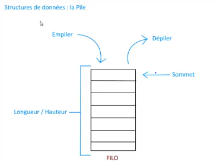
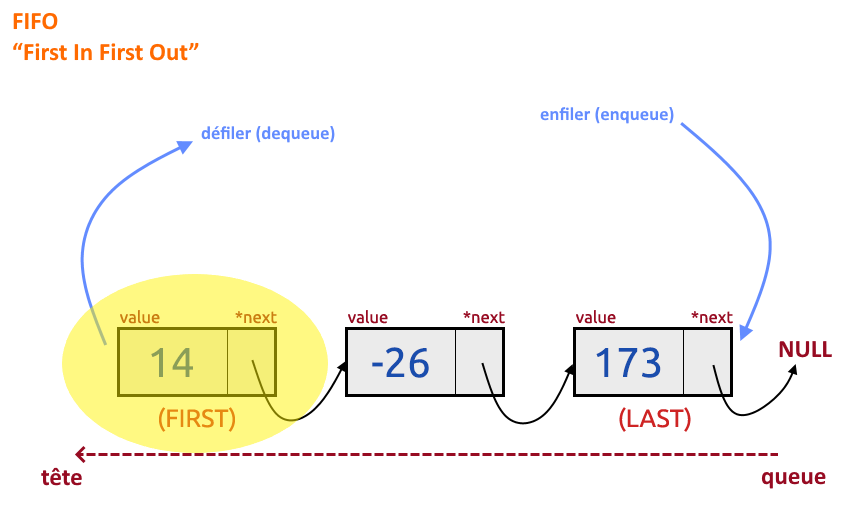
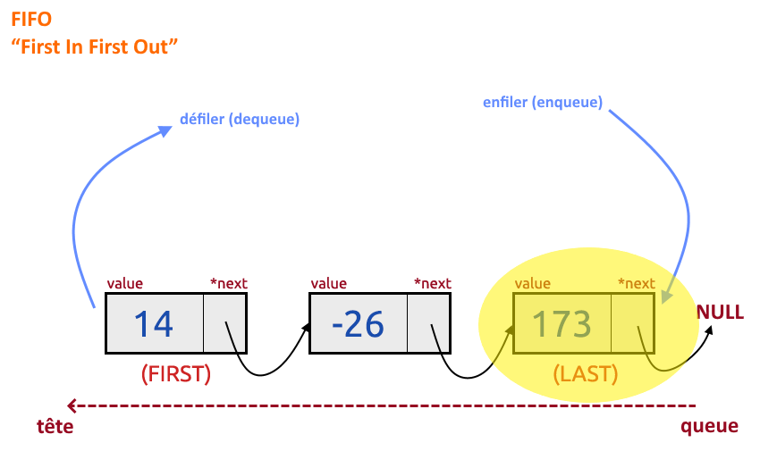
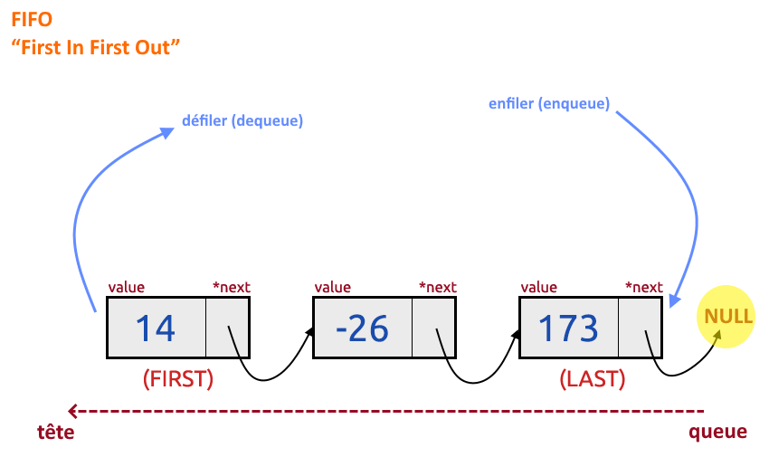
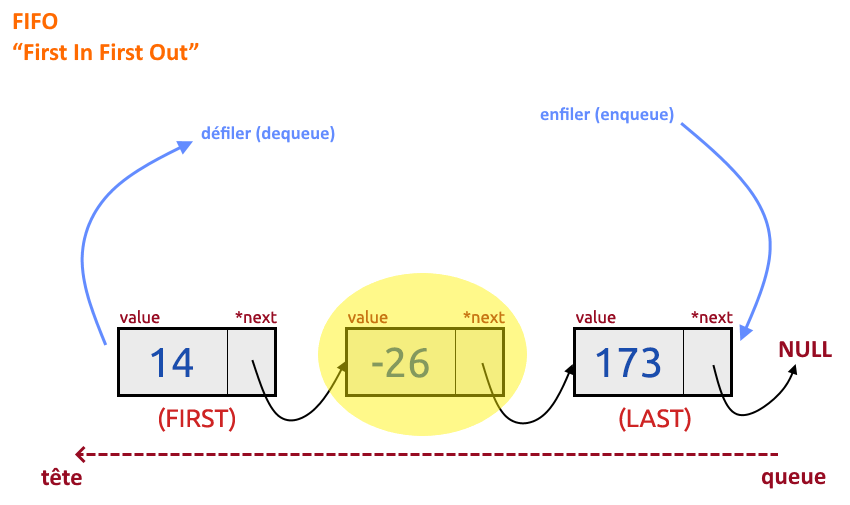
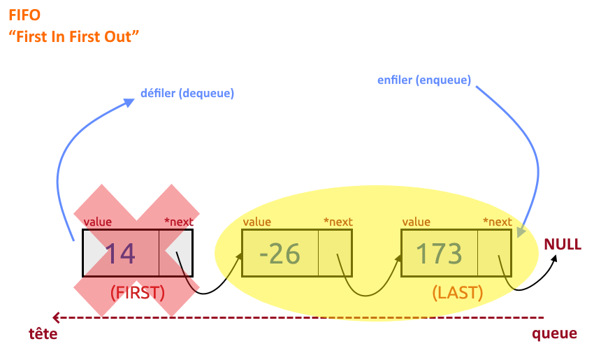

# [18. Files](https://www.youtube.com/watch?v=OV8f1hRsNP4)

Bonjour à tous dans cette séance numéro 18, nous allons voir notre deuxième structure de données sur cette formation en langage c.

La dernière fois nous avons parlé des piles (stack) et je vous ai expliqué qu'il y avait une structure un peu particulière à suivre notamment via le schéma que je vous avais proposé qui est ici.



Je vous fais un petit rappel pour cette petite séance par rapport à la structure telle qu'elle était dans la séance précédente, je vous avais dit que c'était une structure de type FILO c'est-à-dire First In Last Out.

En bref la première valeur qui a été insérée dans la pile sera la dernière à en ressortir, c'est ce que nous avons vu dans la séance d'avant avec les différentes fonctions qu'on avait développées, qu'on avait implémentées au niveau de cette structure de données-là.

Pour cette vidéo, on va parler en tout cas des Files donc ce qui s'appelle Queue pour  utiliser le terme anglais.

Stack pour Pile, Queue pour la File. 

Alors vous allez voir que la structure est un petit peu différente donc pour ça je vous ai réalisé un autre schéma qui est le suivant.


Alors il y a pas mal de choses, je vous ai mis vraiment beaucoup d'informations sur ce schéma il est disponible comme pour le code source, comme pour les autres structures de données dans la description de la vidéo. Vous avez des liens pour récupérer le schéma et pour récupérer bien évidemment le code source complet des fils que vous aurez à la fin.

Ainsi donc là grosse modo, je vous ai bien indiqués ici que nous avons une structure FIFO c'est-à-dire first in first out.

En bref c'est comme pour une files d'attentes dans un cinéma, dans n'importe où, la première personne qui est entrée dans la file sera la première à en sortir voilà.

Alors je vous ai mis un peu de vocabulaire rapidement histoire que vous sachiez un petit peu comment ça fonctionne. On a la tête de la file qui est évidemment son premier élément. On a la queue de la file donc le dernier élément donc le first est là à gauche, vous verrez  pourquoi parce qu'on va utiliser ces termes-là au niveau de notre code.

On va travailler sur une même structure comme on a fait un peu pour les piles, vous savez on va travaillez avec des entier donc on aura une value qui contient notre entier et on aura un pointeur vers l'élément suivant d'accord c'est ce que je vous ai représenté à chaque fois ici et bien évidemment le dernier élément, son pointeur next pointera évidemment sur nul pour indiquer qu'on arrive à la queu de la file.

On aura évidemment aussi 2 fonctions, une fonction qui permettra (j'ai gardé un peu les mêmes termes que pour les piles), on utilisera les termes push_queue par exemple pour tout ce qu'il s'agit d'enfiler c'est-à-dire d'ajouter une nouvelle valeur et pop_queue même si en réalité on ne parle pas vraiment de push et de pop pour une file quand il s'agira de retirer la première valeur donc celle qui en tête tout simplement.

Après je vous ai dit pas mal de petites choses, ce n'est pas pour vous embrouiller c'est juste pour vous expliquer rapidement ce schéma. On va revenir de toute façon dessus au fur et à mesure de ce que l'on va marquer au niveau développement.

Alors on va passer tout simplement au code donc on va faire 3 fichiers :

+ [main.c](main.c)
+ [queue.c](queue.c)
+ [queue.h](queue.h)


Alors queue.c qui servira à l'implémentation des fonctions de la file et on va avoir notre fichier d'en-tête queue.h qui va servir comme d'habitude pour mettre les prototypes, pour définir les structures, etc, etc.

Toujours pareil donc on va aller très très vite, je ne vais pas perdre trop de temps puisque c'est quelque chose que maintenant vous avez l'habitude et qu'on a vu d'ailleurs pour les piles donc on va faire ça pour éviter les inclusions qui tournent en boucle.

+ queue.h
```h
#ifndef __QUEUE__H__
#define __QUEUE__H___

#endif
```

Petite sécurité hop pas de souci à ce niveau-là.

## Bool

On va faire, on va remettre notre petit Booléen comme on le fait d'habitude, ça je vous dis c'est pratique voilà ça fait gagner du temps d'ailleurs je commenter le code peut être en même temps comme ça ça fera gagner du temps au niveau du code source que je vous donnerai en archive encore une fois dans la description de cette vidéo.

+ queue.h
```h
#ifndef __QUEUE__H__
#define __QUEUE__H___

/* Définition du type Booléen */
typedef enum
{
    false,
    true
}Bool;

#endif
```

Voilà ensuite histoire que vous preniez un peu l'habitude de commenter votre code *Définition d'une File*. Ensuite on va avoir des paramètres *Paramètres de la File* et ça ça va être la petite nouveauté. Les paramètres on les met après pour une question de logique voilà et ensuite on va avoir *Les prototypes*.

+ queue.h
```h
#ifndef __QUEUE__H__
#define __QUEUE__H___

/* Définition du type Booléen */
typedef enum
{
    false,
    true
}Bool;

/* Définition d'une File */

/* Paramètres de la File */

/* Prototypes */

#endif
```

Alors on va implémenter ça différement comme on a peut faire sur les piles pour ceux qui m'avait suivi depuis le début des vidéos, vous savez que ça c'est une nouvelle version de cette vidéo parce que j'avais enregistré l'ensemble des vidéos sur lesquelles j'avais encore une qualité audio qui n'était pas top quand je n'avais pas encore mon micro donc ça c'est évidemment la nouvelle version, la version la plus récente de cette vidéo et bien évidemment ça m'a permis de mettre à jour un petit peu toutes les vidéos du coup plutôt que de faire un petit peu comme je l'ai fais sur les anciennes càd d'utiliser un peu le même système pour implémenter chacune des structures que nous avons vu dans cette formation.

Je vais un petit peu varier comme ça selon la structure vous aurez un type d'implémentation  un petit peu différent, histoire voilà que vous puissiez voir plusieurs manières en fait d'implémenter ça parce que je vous avais expliqué qu'en fait il n'y a pas qu'une seule solution pour implémenter une structure de données.

Il y a plusieurs solutions et elles sont pour la plupart sauf erreur bien évidemment, elles sont justes il n'y en a pas une qui est plus fausse que l'autre c'est juste qu'il y a plusieurs manières de le faire donc là je vais faire une autre manière en fait d'implémentation des Files autrement que j'ai pu le faire dans l'ancienne version cette vidéo.

Alors définition d'une file bon ça on ne va pas changer par contre par rapport à ce qu'on a fait sur les piles, on va tout simplement faire `typedef struct QueueElement` avec QueueElement au lieu de StackElement. On va avoir avoir notre valeur `int value;` où comme d'habitude on travaille des entiers parce que c'est plus simple pour l'exemple et ensuite on va avoir un `struct QueueElement *next;` qui est donc un pointeur vers l'élément suivant. A la fin on répète QueueElement `...}QueueElement, *Queue;`.

+ queue.h
```h
#ifndef __QUEUE__H__
#define __QUEUE__H___

/* Définition du type Booléen */
typedef enum
{
    false,
    true
}Bool;

/* Définition d'une File */
typedef struct QueueElement
{
    int value;
    struct QueueElement *next;
}QueueElement, *Queue;

/* Paramètres de la File */

/* Prototypes */

#endif
```

Voilà donc absolument la même syntaxe que vous avez, ça c'est limite j'aurais pu copier coller la partie sur les piles et remplacer le mot Stack par Queue c'est exactement ça, vous n'avez qu'à comparer avec la vidéo précédente vous verez que vous aurez exactement la même chose.

## Paramètres de la File

Par contre ici `/* Paramètres de la File */` on va changer un petit peu, alors j'aurais pu utiliser une deuxième structure où j'aurais pu largement complexifier mon code. Moi je vais me faciliter un petit peu la vie je vais utiliser des variables statiques donc c'est un peu des variables globales qui vont fonctionner dans tout le programme et qui serviront de variables de paramètres pour la File.

Encore une fois j'aurais pu faire une structure en plus, une structure de paramètre de la File, ajouter à la File en elle-même mais ça aurait alourdi le code donc nous on va rester sur quelque chose de beaucoup plus simple et beaucoup plus pratique à l'utilisation, vous allez voir pourquoi par la suite, à quel point ça va vraiment nous faciliter la vie.

Pour ça on va utiliser donc le mot clé `static` donc histoire que ce soit disponible un peu partout, on va mettre `static QueueElement *first = NULL;` et vous allez créer un pointeur qui sera first.

+ queue.h
```h
#ifndef __QUEUE__H__
#define __QUEUE__H___

/* Définition du type Booléen */
typedef enum
{
    false,
    true
}Bool;

/* Définition d'une File */
typedef struct QueueElement
{
    int value;
    struct QueueElement *next;
}QueueElement, *Queue;

/* Paramètres de la File */
static QueueElement *first = NULL;

/* Prototypes */

#endif
```


first va correspondre si je reviens à mon schéma à l'élément qui sera ici en en-tête càd qu'on va garder en mémoire à chaque fois l'élément qu'on aura en tête de File, l'élément qu'on aura en queue de File et cetera pour pouvoir y accéder très facilement.

Comme on aura un pointeur sur chacun de ces éléments, on n'aura pas besoin de faire des parcours du début jusqu'à la fin ou inversement sur la File mais on aura directement le pointeur pour y accéder.

On va gagner un temps phénoménal et aussi au niveau de l'exécution donc ça c'est vraiment très intéressant, vous pouvez faire exactement la même chose du coup pour le dernier élément dont on va l'appeler last comme ça.

+ queue.h
```h
#ifndef __QUEUE__H__
#define __QUEUE__H___

/* Définition du type Booléen */
typedef enum
{
    false,
    true
}Bool;

/* Définition d'une File */
typedef struct QueueElement
{
    int value;
    struct QueueElement *next;
}QueueElement, *Queue;

/* Paramètres de la File */
static QueueElement *first = NULL;
static QueueElement *last = NULL;

/* Prototypes */

#endif
```


Maintenant on va se faire également plutôt que de se faire une petite fonction qui va compter par exemple le nombre d'éléments donc de faire un parcours chaque fois, chose qu'on a fait par exemple dans les Piles où je vous avais dit qu'on pouvait calculer la longueur ou la hauteur d'une pile d'une autre manière.

Hé bien, on pourrait simplement avoir une variable qu'on met à jour à chaque fois et après la fonction consistera simplement à retourner cette valeur donc on va mettre `static int nb_elements = 0;` et normelement pour être plus précis il faudrait que je précise que c'est le nombres d'éléments de la File mais là comme on a que ça dans cette vidéo, dans ce fichier, on ne va pas s'embêter et on met bien évidemment par défaut à 0.

+ queue.h
```h
#ifndef __QUEUE__H__
#define __QUEUE__H___

/* Définition du type Booléen */
typedef enum
{
    false,
    true
}Bool;

/* Définition d'une File */
typedef struct QueueElement
{
    int value;
    struct QueueElement *next;
}QueueElement, *Queue;

/* Paramètres de la File */
static QueueElement *first = NULL;
static QueueElement *last = NULL;
static int nb_elements = 0;

/* Prototypes */

#endif
```

Donc ça c'est les paramètres de la File.

Encore une fois, vous pourriez faire une structure supplémentaire, vous pourriez directement travailler d'une autre manière à l'implémentation pour ne pas avoir ces variables-là globales c'est comme vous voulez. Une ou l'autre des manières fonctionnent. Vous voyez c'est vous qui adapterez en fonction selon vos besoins, il n'y a pas de problème.

Voilà au niveau de queue.h.

On a tout ce qu'il faut ici.

+ main.C
```c
#include <stdio.h>
#include "queue.h"

int main(void)
{


    return 0;
}
```
+ queue.c
```c
#include <stdio.h>
#include <stdlib.h> //pour l'allocation dynamique.
#include "queue.h"

```
+ queue.h
```h
#ifndef __QUEUE__H__
#define __QUEUE__H___

/* Définition du type Booléen */
typedef enum
{
    false,
    true
}Bool;

/* Définition d'une File */
typedef struct QueueElement
{
    int value;
    struct QueueElement *next;
}QueueElement, *Queue;

/* Paramètres de la File */
static QueueElement *first = NULL;
static QueueElement *last = NULL;
static int nb_elements = 0;

/* Prototypes */

#endif
```

Ok main.c c'est bon, la partie implémentation queue.c c'est bon avec stdlib.h pour les allocations dynamiques.

Ensuite normalement tout est ok à ce niveau là, au niveau des définitions, paramètres, je pense qu'on a fait tour au niveau de queue.h ainsi que le petit Booléen qui va nous servir.

Ok eh bien on va commencer l'implémentation tout ça et je reviendrai s'il faut un peu sur le schéma pour vous montrer au fur et à mesure de ce qu'on développe donc il va y avoir moins de fonctions que ce qu'on a pu voir sur les Files, pas de fonction pour créer une File vide donc comme on vu pour la Pile. Il n'y aura pas voilà de fonction comme ça parce que vous allez voir qu'on va procéder autrement grâce à cela.

Alors là dans queue.c par défaut en fait dans mon programme si il faut regarder j'ai déjà en fait une File vide.

```c
static QueueElement *first = NULL;
static QueueElement *last = NULL;
static int nb_elements = 0;
```

Une File vide puisque ça c'est une File vide ça signifie que grâce à mes paramètres, je n'ai pas besoin de faire une fonction par exemple pour créer une nouvelle File.

Par défaut j'ai une File donc on va pouvoir travailler directement comme ça.

Du coup on va commencer par regarder en première fonction à développer celle qui va vérifier qu'une File est vide donc on va faire `Bool is_empty_...` alors on va garder la même notation que les vidéos précédentes que notamment celles sur les piles donc j'avais is_empty_stack() donc là je vais mettre is_empty_queue() voilà.

## is_empty_queue

```h
Bool is_empty_queue(void);
```

Ici par contre rappelez-vous sur les piles, on passe à chaque fois la pile en paramètre des fonctions mais ici pas du tout, vous allez voir pourquoi.

On va faire ça.

```c
#include <stdio.h>
#include <stdlib.h>
#include "queue.h"

Bool is_empty_queue(void)
{
    
}
```

Alors je commenterais chacunes des fonctions ici donc vous vous aurez toutes les fonctions commentées dans le fichier source que vous pouvez récupérer en description de vidéo.

Alors ici ça va être beaucoup plus différent et donc avant on faissait simplement un *if..==NULL* sur la Pile qu'on passait en paramètre et ici au niveau des Files on va procéder autrement.

Comment on utilise des paramètres encore une fois, on vérifie simplement si `first == NULL && last == NULL`, on n'a qu'à faire les deux et du coup on part du principe pour nous que notre File est vide voilà.

```c
#include <stdio.h>
#include <stdlib.h>
#include "queue.h"

Bool is_empty_queue(void)
{
    if(first == NULL && last == NULL)
        return true;
    
    return false;
}
```

Voilà c'est aussi simple que ça d'accord.

## 1e compilation et exécution

Je pense que par défaut on peut vérifier directement pour exécuter dés le début, ainsi plus vite on exécutera mieux on pourra corriger les erreurs s'il y en a.

+ main.c
```c
#include <stdio.h>
#include "queue.h"

int main(void)
{
    if(is_empty_queue())
        printf("File vide.\n");
    else
        printf("File non vide.\n");

    return 0;
}
```
+ queue.c
```c
#include <stdio.h>
#include <stdlib.h>
#include "queue.h"

Bool is_empty_queue(void)
{
    if(first == NULL && last == NULL)
        return true;
    
    return false;
}

/*---------------------------------------------*/
```
+ queue.h
```h
#ifndef __QUEUE__H__
#define __QUEUE__H___

/* Définition du type Booléen */
typedef enum
{
    false,
    true
}Bool;

/* Définition d'une File */
typedef struct QueueElement
{
    int value;
    struct QueueElement *next;
}QueueElement, *Queue;

/* Paramètres de la File */
static QueueElement *first = NULL;
static QueueElement *last = NULL;
static int nb_elements = 0;

/* Prototypes */
Bool is_empty_queue(void);

#endif
```
```powershell
gcc *.c -o prog
.\prog
File vide.
```

On teste ça `gcc *.c -o prog` puis prog et voilà la File est vide voyez pas de souci.

Dans la manière où j'ai décidé d'implémenter ça pas de problème il part du principe que la File est vide éffectivement alors bien sûr si vous vouliez en faire une deuxième, troisième (au pointeur *first), il faudrait procéder autrement. Il faudrait un first pour chacune des Files et à ce moment-là effectivement ce serait plus logique et plus intelligent de faire une structure plutôt que nos paramètres de File.

```c
/* Paramètres de la File */
static QueueElement *first = NULL;
static QueueElement *last = NULL;
static int nb_elements = 0;
```

Ce serrait mieux de faire une structure pour avoir comme ça une structure de paramètres par File que vous voudriez manipuler mais nous pour l'exemple ici, pour ce cours-là, on n'utilise qu'une seule File où je mets directement des paramètres de cette manière avec le mot-clé statique.

Alors là c'est bon on a implémenté une petite fonction qui vérifie si une File est vide ou non, et on va pouvoir passer à la suite.

Alors je vais faire des petites séparations comme ça `/*-------------*/` voilà et maintenant qu'est-ce qu'on peut faire de simples ? on peut vérifier la longueur parce qu'on a déjà l'élément.

Maintenant que j'ai fait par rapport à ça.

```c
/* Paramètres de la File */
static QueueElement *first = NULL;
static QueueElement *last = NULL;
```

... on va faire par rapport à ça :

```c
/* Paramètres de la File */
static int nb_elements = 0;
```

## queue_length

Donc là du coup on va gagner un temps fou aussi puisqu'on a juste à faire ça alors queue_length().

```h
int queue_length(void);
```

Pareil et du coup on ne prend rien du tout en paramètres puisqu'on a déjà des variables statiques et là on fait tout simplement voilà return de nb_elements.

```c
int queue_length(void)
{
    return nb_elements;
}
```

On retourne nb_elements càd ce qu'on a ici `static int nb_elements = 0;`, notre nombre d'éléments donc c'est beaucoup plus rapide on ne fait même pas de parcours à chaque fois, on fait que retourner une variable et donc là franchement on peut pas faire plus court que ça.

C'est même presque triste d'avoir une fonction qui fait juste un petit return mais au moins voilà c'est clair au niveau du nom donc quand on voudra vérifier la longueur on trouvera facilement.

Du coup on peut faire une petite vérification pour voir qu'elle fonctionne bien.

+ main.c
```c
#include <stdio.h>
#include "queue.h"

int main(void)
{
    printf("Taille de la File : %d\n", queue_length());

    return 0;
}
```
```powershell
gcc *.c -o prog
.\prog
Taille de la File : 0
```

On test et là voyez *Taille de la File : 0* pas de souci, on a effectivement qu'un élément très bien.

On va passer à la suivante là.

Je vais assez vite puisque ce sont des fonctions très rapide, très simple à mettre.

Elles vont être un peu plus complexe quand on va s'occuper de l'ajout ou la suppression d'éléments mais pour le moment ici pas de souci.

On va faire deux 2 autres fonctions très très rapides c'est-à-dire celle qui va retourner le premier élément d'accord et celle qui va retourner le dernier.

Je vous avais dit que le grâces à ces paramètres, ici on pourrait très rapidement avoir accès à l'un ou l'autre donc forcément à sa valeur.


On va simplement faire queue_first() et queue_last().

## queue_first

```h
int queue_first(void);
int queue_last(void);
```

Voilà on fera surrement un copier coller de la fonction après donc queue_first() ça correspond à quoi ?

Si la liste est vide vous vous doutez bien qu'on ne va rien retourner c'est-à-dire qu'on ne va pas retourner une autre valeur puisque moi je pars du principe que dans mes File je ne vais pas mettre des entiers négatifs donc je ne veux pas faire un return -1 donc je vais simplement faire ceci.

```h
int queue_first(void)
{
    if(is_empty_queue())
        exit(1);
    
    return first->value;
}
```

Voilà on implémenté tout à l'heure la fonction qui vérifie si la liste est vide et si elle vide, ecoutez je ne m'embête même pas je fais un petit `exit(1);`.

Alors vous vous pouvez faire autrement, mettre un message d'erreur pour dire qu'on ne peut pas ou envoyer quand même quelque chose.

Encore une fois vous faites comme vous voulez, vous avez compris le principe, ce n'est pas compliqué et sinon on retourne tout simplement dans `return first->value;`.

Tout simplement.

## queue_last

Là du coup un simple copier coller avec `return last->value;` au lieu de `return first->value;`.

```c
int queue_last(void)
{
    if(is_empty_queue())
        exit(1);
    
    return last->value;
}
```

Alors je rappelle ici que first, last, nb_elements et cetera, toutes ces choses-là ce sont ces fameuses variables d'accord c'est-à-dire que grâce à ces paramètres, on y accède sans problème d'accord qu'ils soient des pointeurs `*first`, `*last` ou simple variable normale `nb_element` voilà comme ils sont statiques on peut y accéder au niveau du fichier *queue.h* donc s'il a été inclus donc pas de problème, il est connu sans problème du programme. Voilà vous pouvez du coup travailler avec.

Voilà donc ça c'est bon.

Vous voyez déjà là quatre fonctions qui ont été faites très rapidement.

Maintenant on va voir passer aux choses sérieuses c'est à dire tout ce qui est affichage de la file et notamment ajout/suppression d'éléments donc l'affichage, très facile aussi vous allez voir vu. Si vous avez bien compris au niveau des Piles, au niveau des Files ce ne sera pas beaucoup plus compliqué.

On va du coup faire `void print_queue(void);`.

## print_queue

```h
void print_queue(void);
```

Ainsi dans toutes les fonctions qu'on va voir, on ne passera jamais en paramètre la File au niveau de notre programme puisque la File en réalité elle est là.

```h
/* Paramètres de la File */
static QueueElement *first = NULL;
static QueueElement *last = NULL;
static int nb_elements = 0;
```

Du fait qu'ici, on accède au premier élément ou au dernier, comme ce sont des pointeurs ils vont effectivement pointer vers les éléments-là (14, 26, 173) donc en fait on a un petit peu imaginé une corde en fait qui viendrait se relier à votre File peu importe où elle peut se trouver même si elle est perdue, même si on ne sait pas trop où est elle est, grâce à la corde qu'on a là on arrive toujours à la retrouver au bout donc automatiquement on peut y accéder sans problème.

Voilà alors on va reprendre *print_queue()* qu'on va implémenter et donc reprendre un peu plus de temps au niveau des explications histoire de vous situer bien sûr.

Précédement c'était vraiment très simple, voyez le code franchement il y a pratiquement pas de lignes de code, c'est très très rapide, très simple à faire.

Ici pour le print pareil.

Premier test logique si la File est vide, je ne vais pas m'amuser à afficher quelque chose qui evite donc je vais faire un `if(is_empty_queue()){}` ainsi si c'est vide, je ne met pas un message d'erreur parce que ce n'est pas une erreur de vouloir afficher une File vide donc je met simplement qu'un petit printf() avec *Rien a afficher, la File est vide.*

```c
void print_queue(void)
{
    if(is_empty_queue())
    {
        printf("Rien a afficher, la File est vide.\n");
        return
    }
}
```

Alors ça c'est vraiment le strict minimum qu'on puisse faire, on fait un return sans valeur d'accord faire un return sans valeur, vous pouvez en mettans simplement cette annotation-là `return;` même si vous avez un void en valeur de retour d'accord.

A partir du moment où vous ne retournez rien c'est comme si vous ne retournez rien donc ça correspond tout à fait aux mot-clé *void* et à partir de là donc si on est après ce boût de code c'est que la File n'est pas vide dans ce cas-là, on va se créer un élément temporaire `QueueElement *temp = first;` et on va dire qu'il pointe en fait c'est-à-dire qu'on va faire une espèce de copie en fait, si vous voulez, du pointeur qui pointe vers le premier élément.

```c
void print_queue(void)
{
    if(is_empty_queue())
    {
        printf("Rien a afficher, la File est vide.\n");
        return
    }

    QueueElement *temp = first;
}
```

Attention first, rappelez-vous ce n'est pas le premier élément d'accord de notre File mais c'est un pointeur vers le premier élément d'accord.


Voilà donc en fait c'est comme si on avait lancé un grappin, une autre corde si vous voulez sur le premier élément de la File qu'on avait stocké dans temp ce qui fait du coup que maintenant on a deux cordes (pointeurs) pour y aller et on ne va jamais comme ça toucher au pointeur first que lui on n'a pas envie voilà de modifier et cetera, on travaille toujours sur du temporaire.

A partir de là, pour notre affichage c'est vraiment très simple, on fait une petite boucle en disant que notre valeur temporaire n'est pas égale à nulle donc tant qu'on n'arrive pas ici d'accord ...



... donc vraiment tant qu'on a pas dépassé la fin de la File, on peut sans problème afficher les valeurs donc on va mettre cette notation comme j'ai l'habitude de le faire `printf("[%d] ", temp->value);` avec *temp->value* parce que je vous rappelle vous voyez ici temp contient le pointeur ici pour le premier élément et bien évidemment comme on a besoin de se déplacer c'est-à-dire qu'au début first est sur le premier élément et maintenant on a besoin qu'il se déplace d'élément en élément donc pour cela on va simplement faire comme pour les Piles `temp = temp->next;` et après la boucle un petit `printf("\n");` histoire d'avoir un petit retour à la ligne à l'affichage.

```c
void print_queue(void)
{
    if(is_empty_queue())
    {
        printf("Rien a afficher, la File est vide.\n");
        return;
    }

    QueueElement *temp = first;

    while(temp != NULL)
    {
        printf("[%d] ", temp->value);
        temp = temp->next;
    }
    printf("\n");
}
```

Voilà on a fait ceci, et maintenant on va faire `print_queue();`

```c
#include <stdio.h>
#include "queue.h"

int main(void)
{
    printf("Taille de la File : %d\n", queue_length());
    print_queue();

    return 0;
}
```
```powershell
gcc *.c -o prog
.\prog
Taille de la File : 0
Rien a afficher, la File est vide.
```

Si j'ai pas fait de bêtise sans erreur de code, il nous dit qu'il n'y a rien a afficher puisque la File est vide.

Voilà donc là pour le moment on n'a rien à afficher apparemment et on ne sait pas si ça fonctionne, on le verra quand on aura des éléments mais en tout cas on a implémenté ça et à priori ça devrait être bon donc pareil pas beaucoup de lignes de code encore une fois c'est  très rapide à faire.

On passe maintenant vraiment aux deux fonctions les plus importantes, celles que vous attendez surtout pour l'ajout et la suppression d'éléments et on va commencer par celle d'ajout.

On va l'appeler push mais normalement on ne dit pas push et pop pour une File, on parle de Queue ou alors de la adjonction en queue, adjonction et cetera, machin.

Ainsi il y a plusieurs termes différents, push et pop c'est vraiment réservé pour les Piles et moi pour garder des termes un peu cohérent parce que je sais qu'il y a des gens déjà qui parmi vous voilà vous ne parlez pas tous la même langue. Vous êtes de plusieurs pays différents, ce n'est pas forcément évident de travailler avec l'anglais parce qu'il y a beaucoup de gens qui ont du mal avec l'anglais donc je vais éviter de trop faire varier les mots sinon voila je vais en perdre pas mal donc au moins en gardant les mêmes mots, même si c'est pas tout à fait la bonne définition, on s'en fiche car l'important c'est que vous  compreniez ce que fait cette fonction.

## push_queue

push_queue, ça veut dire tu pousse un élément dans la File donc en bref t'insère un nouvel élément, t'ajoute un nouvel élément, ça veut dire la même chose et encore une fois il faut bien évidemment en paramètre préciser quel éléments ajouter.

```h
void push_queue(int x);
```

Voilà on va implémenter cette petite fonction.

Encore une fois c'est très simple, le but ça va être de créer une espèce d'élément comme ça (-26).



Le but est de créer un élément comme ça et d'y mettre notre x dans value et à la place du pointeur `*next` de (-26) ça va être NULL puisque rappelez-vous que quand on ajoute une valeur (enfiler enqueue) ça se met à la fin de la File donc forcément le next sera égale à NULL.

Et ensuite il faudra que cet élément (173), le *next du dernier élément qu'on avait avant soit rattaché à notre nouvel élément (enfiler enqueue) et que du coup last ce ne soit plus (173) mais que ce soit le nouvel élément qu'on va ajouter.

Voyez, il va y avoir deux modifications en fait donc on va devoir faire deux choses sur l'espèce d'élément de File qu'on a créé (173) et deux choses à faire sur cette élément qui est à la fin pour qu'il ne soit plus considéré comme étant le dernier élément.

Alors ce n'est pas forcément très clair au niveau des explications mais vous aller voir au niveau code ça veut tout dire donc au niveau de ça on va créer un `QueueElement * element` avec element toujours pareil tel que je l'ai appellé au niveau des Piles.

```c
void push_queue(int x)
{
    QueueElement *element;
}
```

Pareil j'évite de changer les noms pour ne pas vous perdre, alors je pourrais directement faire le malloc() mais je le faire à la ligne.

Du coup `element = malloc(sizeof(*element));`, ainsi avec cette notation-là, on est sûr qu'on fera bien l'allocation correctement et bien évidemment comme pour chaque allocation, on vérifie qu'elle a fonctionné sinon c'est que le système nous a pas autorisé à réserver la mémoire qu'on voulait et dans ce cas-là bon là il s'agit vraiment d'une erreur. On va garder la même notation *Erreur : problème allocation dynamique.* et on fait carrément un *exit(EXIT_FAILURE)*.

```c
void push_queue(int x)
{
    QueueElement *element;

    element = malloc(sizeof(*element));

    if(element == NULL)
    {
        fprintf(stderr, "Erreur : probleme allocation dynamique.\n");
        exit(EXIT_FAILURE);
    }
    //ici, l'allocation s'est bien passée.
}
```

Voilà on quitterais vraiment à cause d'une erreur d'accord tout simplement.

A partir d'ici là, après mon if(), l'allocation s'est bien déroulée donc on va pouvoir faire la suite.

Donc les deux choses à veiller au début, j'avais dit que l'on peut imaginer qu'on crée cette espèce de petite boîte-là.


Ainsi il faut remplir la partie value avec notre x d'accord ce qu'on a passé ici en  paramètres donc on le fait `element->value = x;`.

```c
void push_queue(int x)
{
    QueueElement *element;

    element = malloc(sizeof(*element));

    if(element == NULL)
    {
        fprintf(stderr, "Erreur : probleme allocation dynamique.\n");
        exit(EXIT_FAILURE);
    }
    
    element->value = x;
}
```

ensuite je vous avais dit il faut que son pointeur *next pointe vers NULL puisqu'il va devenir le dernier élément et vous voyez que le dernier élément pointe toujours vers NULL donc on y va `element->next = NULL;`.

```c
void push_queue(int x)
{
    QueueElement *element;

    element = malloc(sizeof(*element));

    if(element == NULL)
    {
        fprintf(stderr, "Erreur : probleme allocation dynamique.\n");
        exit(EXIT_FAILURE);
    }
    
    element->value = x;
    element->next = NULL;
}
```

Là on a réinitialisé la moitié du travail.

Le reste il va falloir le réaliser en fonction de deux cas.

Le cas où la File est vide parce qu'évidemment si la File est Vide ce sera automatiquement votre nouvel élément, il sera à la fois le premier et le dernier donc il sera first et last en même temps, il sera tout seul et s'il y a déjà des éléments et bien ce sera différent donc on va traiter ces deux cas à part.

Si la File est vide, on aura des choses à faire et si elle n'est pas vide on aura des choses à faire.

```c
void push_queue(int x)
{
    QueueElement *element;

    element = malloc(sizeof(*element));

    if(element == NULL)
    {
        fprintf(stderr, "Erreur : probleme allocation dynamique.\n");
        exit(EXIT_FAILURE);
    }
    
    element->value = x;
    element->next = NULL;

    if(is_empty_queue())
    {

    }
    else
    {

    }
}
```

Ok donc si la File est vide tout simplement on dit que element est le premier et element est le dernier, c'est juste ça.

```c
void push_queue(int x)
{
    QueueElement *element;

    element = malloc(sizeof(*element));

    if(element == NULL)
    {
        fprintf(stderr, "Erreur : probleme allocation dynamique.\n");
        exit(EXIT_FAILURE);
    }
    
    element->value = x;
    element->next = NULL;

    if(is_empty_queue())
    {
        first = element;
        last = element;
    }
    else
    {

    }
}
```

Donc là on va stocker element ici dans ces variables statiques d'accord à la fois ici à là.

```h
/* Paramètres de la File */
static QueueElement *first = NULL;
static QueueElement *last = NULL;
```

Voilà comme ça nos pointeurs ici vont pointer automatiquement vers notre élément, ce qui est tout à fait vrai s'il est tout seul il est à la fois la tête de la File et la queue de la File puisqu'il est seul dans la File donc c'est juste les seuls opérations à faire.

Sinon si on a déjà des éléments, c'est ce qu'on avait dit tout à l'heure c'est à dire que celui-là (173) va devoir pointer son pointeur next vers le nouvel élément et last donc notre petite variable de paramètres ici (*last) ne doit plus du coup pointer vers l'ancien dernier élément mais vers le nouveau donc deux opérations encore c'est à dire `last->next = element;` avec last->next qui maintenant pointe vers l'élément d'accord et last donc le dernier  élément c'est qui ? hé bien ce n'est pas celui qu'on avait avant mais c'est l'élément lui-même d'accord `last = element;` voilà.

```c
void push_queue(int x)
{
    QueueElement *element;

    element = malloc(sizeof(*element));

    if(element == NULL)
    {
        fprintf(stderr, "Erreur : probleme allocation dynamique.\n");
        exit(EXIT_FAILURE);
    }
    
    element->value = x;
    element->next = NULL;

    if(is_empty_queue())
    {
        first = element;
        last = element;
    }
    else
    {
        last->next = element;
        last = element;
    }

    nb_elements++;
}
```

Bon maintenant on peut imaginer en fait ici là que c'est le nouvel élément qu'on vient d'ajouter d'accord il est vrai qu'il y aurait un quatrième élément si on en avait déjà 3.


Voilà et on n'oublie pas ça c'est le petit paramètre intéressant le nb_element ici à faire une petite incrémentation pour ajouter +1 pour dire voilà on a un nouvel élément en plus et voilà push_queue() est fait tout simplement.

Alors je ne vais pas tester tout de suite parce que vous savez qu'à partir du moment où on fait des malloc() il faut libérer la mémoire sinon si j'exécute mon programme maintenant je vais avoir des fuites de mémoire donc ça c'est embêtant parce que du coup on ne peut pas tester ça tout de suite de manière propre.

On pourrait le tester mais en faisant des fuites derrière mais nous tant qu'à faire comme on a une fonction pour ça, on va directement passer à la fonction qui retire les éléments comme ça voilà on aura fait d'une pierre deux coups donc on y va.

On termine avec la deuxième et dernière fonction importante vraiment qui est pop_queue().

## pop_queue

```h
void pop_queue(void);
```

Alors du coup, on ne lui passe rien du tout.

Voilà donc là pas plus compliqué non plus, ainsi voyez grâce à nos variables de paramètres :

```h
/* Paramètres de la File */
static QueueElement *first = NULL;
static QueueElement *last = NULL;
static int nb_elements = 0;
```

Grâce à nos variables de paramètres, on gagne énormément de temps comparé par exemple aux piles.

Alors les Piles, on pourrait faire pareil, on pourrait avoir également une variable de paramètres qui est l'élément donc le sommet de la Pile, ce genre de choses ça pourrait très bien se faire sans problème. C'est pour ça que je vous dis il y a plusieurs manières d'implémenter les structures de données dans n'importe quel langage.

Moi je vais maintenant essayer de vous montrer plus de manières différentes pour voir qu'en fait elles fonctionnent toutes à la condition bien sûr de bien les implémenter donc pop_queue() comment ça va fonctionner ? 

Première chose à vérifier comme pour l'affichage, si la File est vide, vous n'allez pas vous amuser à retirer un élément d'une File vide donc première chose si la File est vide d'accord je vais te le dire avec un petit printf(), *Rien à retirer, la File est déjà vide* voilà et on fait un return point virgule puisque ça retourne void comme ça on ne retourne rien.

```c
void pop_queue(void)
{
    if(is_empty_queue())
    {
        printf("Rien a retirer, la File est deja vide.\n");
        return;
    }
}
```

Voilà à partir de ce moment, après ce test, comme pour tout à l'heure c'est qu'on a forcément quelque chose donc on va créer encore une fois comme pour l'affichage en fait c'est un peu comme pour l'affichage, on va créer une variable temporaire et on va lui mettre en fait le pointeur first d'accord donc elle va pointer temp c'est-à-dire le premier élément ça tombe bien car je vous rappelle que pour la File quand on retire un élément au retire le premier.

```c
void pop_queue(void)
{
    if(is_empty_queue())
    {
        printf("Rien a retirer, la File est deja vide.\n");
        return;
    }

    QueueElement *temp = first;
}
```


Ainsi il va falloir retirer first, on avait ajouté à la suite de last mais pour enlever donc défiler il faut retirer first.

C'est parfait on a récupérer first, grâce à notre variable temporaire on a récupéré du coup l'élément first puisqu'on a un pointeur qui pointe vers lui ainsi ça tombe bien c'est ce qu'il nous faut.

Du coup petite vérification, attention si first égale égale last `first == last`, si on tombe sur ce cas de figure ça veut dire quoi ? ça veut dire qu'on a qu'un seul élément.

A ce moment là, il n'y a pas besoin de commencer à faire des parcours de je ne sais quoi, de naviguer d'élément en élément parce qu'il sera tout seul donc on sait que c'est lui donc on va remettre nos paramètres au propre comme si en considérant que notre File est vide.

Je vous rappelle que notre File étant vide, c'est quoi ? si on regarde sur notre fonction qui le vérifie...

```c
Bool is_empty_queue(void)
{
    if(first == NULL && last == NULL)
        return true;
    
    return false;
}
```

Notre File est vide quand First égale NULL et que last égale NULL d'accord voyez donc on va les repasser à NULL ainsi `first = NULL;` et `last = NULL;` voilà.

```c
void pop_queue(void)
{
    if(is_empty_queue())
    {
        printf("Rien a retirer, la File est deja vide.\n");
        return;
    }

    QueueElement *temp = first;

    if(first == last)
    {
        first = NULL;
        last = NULL;
    }
}
```

Voilà donc ça c'est dans le cas on a qu'un seul élément sinon si on a plusieurs éléments, qu'est ce qu'on fait ? eh bien on dit que maintenant le premier élément c'est quoi ? c'est la suite de la File c'est à dire que c'est toute la File sauf le premier élément.

```c
void pop_queue(void)
{
    if(is_empty_queue())
    {
        printf("Rien a retirer, la File est deja vide.\n");
        return;
    }

    QueueElement *temp = first;

    if(first == last)
    {
        first = NULL;
        last = NULL;
    }
    else
        first = first->next;
}
```

Si je prends un exemple que j'avais ici.



first maintenant, elle ne se met plus à 14 mais elle se met à -26 donc il prend en fait ces deux morceaux là et 14 là bas il le laisse un petit peu dans la nature mais vous vous dites que si on fait ça, on a perdu cet élément et donc on ne va pas pouvoir libérer de la mémoire car on la perdu et ainsi on ne pas pouvoir libérer de la mémoire car on l'a perdu !

Mais non, on ne l'a pas perdu puisqu'on la enregistré ici `QueueElement *temp = first;` dans cette fameuse variable temporaire donc avec ce pointeur d'où l'intérêt de faire cette ligne là puisque maintenant qu'on l'a gardé en copie, en tout cas qu'on la rattaché comme je vous avais expliqué cette histoire de cordes au premier élément.

En faisant ça `first = first->next;` effectivement on l'a perdue mais comme on l'avait bien gardé ici `QueueElement *temp = first;` on peut faire tout simplement un free() de l'élément qui était gardé pour pouvoir le supprimer, `free(temp);`.

```c
void pop_queue(void)
{
    if(is_empty_queue())
    {
        printf("Rien a retirer, la File est deja vide.\n");
        return;
    }

    QueueElement *temp = first;

    if(first == last)
    {
        first = NULL;
        last = NULL;
    }
    else
        first = first->next;

    free(temp);
    nb_elements--;
}
```

Voilà là on a libéré la mémoire proprement et on n'oublie pas évidemment un petit `nb_elements--;` puisqu'on a retiré un élement et vous venez de faire le retrait tout simplement d'éléments d'une File.

Voilà aussi simple que ça.

Du coup bah on va pouvoir tester ça donc là on va pouvoir tester ça.

## 2e compilation et exécution

Là on faire push_queue().

Je vais prendre l'exemple du schéma, `push_queue(14);`

Alors quand on veut faire les tests un minimum proprement d'abord on print_queue() avant, après le test d'un seul élément et ensuite on en retire qu'un que je met tout de suite à la suite `pop_queue();` pour éviter les fuites mémoires, c'est important.

+ main.c
```c
#include <stdio.h>
#include "queue.h"

int main(void)
{
    printf("Taille de la File : %d\n", queue_length());
    print_queue();

    push_queue(14);
    printf("Taille de la File : %d\n", queue_length());
    print_queue();

    pop_queue();
    printf("Taille de la File : %d\n", queue_length());
    print_queue();

    return 0;
}
```
+ queue.c
```c
#include <stdio.h>
#include <stdlib.h>
#include "queue.h"

Bool is_empty_queue(void)
{
    if(first == NULL && last == NULL)
        return true;
    
    return false;
}

/*---------------------------------------------*/

int queue_length(void)
{
    return nb_elements;
}

/*---------------------------------------------*/

int queue_first(void)
{
    if(is_empty_queue())
        exit(1);
    
    return first->value;
}

/*---------------------------------------------*/

int queue_last(void)
{
    if(is_empty_queue())
        exit(1);
    
    return last->value;
}

/*---------------------------------------------*/

void print_queue(void)
{
    if(is_empty_queue())
    {
        printf("Rien a afficher, la File est vide.\n");
        return;
    }

    QueueElement *temp = first;

    while(temp != NULL)
    {
        printf("[%d] ", temp->value);
        temp = temp->next;
    }
    printf("\n");
}

/*---------------------------------------------*/

void push_queue(int x)
{
    QueueElement *element;

    element = malloc(sizeof(*element));

    if(element == NULL)
    {
        fprintf(stderr, "Erreur : probleme allocation dynamique.\n");
        exit(EXIT_FAILURE);
    }
    
    element->value = x;
    element->next = NULL;

    if(is_empty_queue())
    {
        first = element;
        last = element;
    }
    else
    {
        last->next = element;
        last = element;
    }

    nb_elements++;
}

/*---------------------------------------------*/

void pop_queue(void)
{
    if(is_empty_queue())
    {
        printf("Rien a retirer, la File est deja vide.\n");
        return;
    }

    QueueElement *temp = first;

    if(first == last)
    {
        first = NULL;
        last = NULL;
    }
    else
        first = first->next;

    free(temp);
    nb_elements--;
}
```
+ queue.h
```h
#ifndef __QUEUE__H__
#define __QUEUE__H___

/* Définition du type Booléen */
typedef enum
{
    false,
    true
}Bool;

/* Définition d'une File */
typedef struct QueueElement
{
    int value;
    struct QueueElement *next;
}QueueElement, *Queue;

/* Paramètres de la File */
static QueueElement *first = NULL;
static QueueElement *last = NULL;
static int nb_elements = 0;

/* Prototypes */
Bool is_empty_queue(void);
int queue_length(void);
int queue_first(void);
int queue_last(void);
void print_queue(void);
void push_queue(int x);
void pop_queue(void);

#endif
```
```powershell
gcc *.c -o prog
.\prog

Taille de la File : 0
Rien a afficher, la File est vide.
Taille de la File : 1
[14] 
Taille de la File : 0
Rien a afficher, la File est vide.
```

Au début, on teste avec un seul élément pour voir un petit peu comment se comporte le programme et voir si ça à marché correctement.

Donc *Taille de la File : 0* au début 0 puis *Rien a afiicher* et après on a ajouté notre élément avec la taille qui est passé à 1 tandis qu'à l'affiche ça a l'air de fonctionner pour le moment il nous met bien [14] et ensuite il supprime tout, on repasse à 0 il n'y a plus rien à afficher donc à priori vu les tests que j'ai fait ici, ça a l'air de marcher. 

Maintenant on va faire avec plus d'éléments

D'ailleurs je peux même m'amuser à le faire comme ça : `push_queue(14); push_queue(-26); push_queue(173);` ensuite on va en enlever qu'un seul au début puis on va enlever les deux derniers histoire de faire un intermédiaire en fait dans la suppression, `pop_queue(); pop_queue(); pop_queue();` pour ne pas tout supprimer d'un coup pour voir si a pas de bug.

+ main.c
```c
#include <stdio.h>
#include "queue.h"

int main(void)
{
    printf("Taille de la File : %d\n", queue_length());
    print_queue();

    push_queue(14);
    push_queue(-26);
    push_queue(173);
    printf("Taille de la File : %d\n", queue_length());
    print_queue();

    pop_queue();
    printf("Taille de la File : %d\n", queue_length());
    print_queue();

    pop_queue();
    pop_queue();
    printf("Taille de la File : %d\n", queue_length());
    print_queue();

    return 0;
}
```
```powershell
PS C:\Users\sam\OneDrive\Aide-mémoires\C\cours\018_files> gcc *.c -o prog
PS C:\Users\sam\OneDrive\Aide-mémoires\C\cours\018_files> .\prog    
Taille de la File : 0
Rien a afficher, la File est vide.
Taille de la File : 3
[14] [-26] [173] 
Taille de la File : 2
[-26] [173] 
Taille de la File : 0
Rien a afficher, la File est vide.
```

Donc au début, on a zéro, rien à afficher et là d'un coup on a ajouté les trois éléments d'un coup ça passe bien à 3 : [14] [-26] [173] voyez qu'ils sont bien à la suite comme j'ai voulu faire comme dans le schéma.

Au début, on en retire qu'un seul donc ça repasse à deux on a effectivement perdu [14] donc qui était le premier inséré et ensuite on repasse à zéro une fois qu'on a enlevé les deux derniers puisqu'on a fait deux pops, et effectivement la File est remise à zéro donc a priori ça a l'air de fonctionner, il n'y a pas de problème à ce niveau-là.

Voilà voilà pour cette implémentation des Files.

Alors petit bonus encore une fois qui peut être très pratique si vous n'avez pas envie de vous amuser par exemple à chaque fois de faire autant de pop qu'il y a eu de push, autant de retrait d'éléments que d'insertions.

Nous on va faciliter les choses en faisant encore une fois une petite fonction de nettoyage comme je vous avais fait pour les Piles, on va donc faire un `void clear_queue(void);`.

## clear_queue

```h
void clear_queue(void);
```

clear_queue() ça va simplement faire gagner du temps, c'est très rapide, vous allez voir.

Alors clear_queue() qu'est ce que c'est ? On peut afficher  un message, on peut s'amuser à faire ça.

```c
void clear_queue(void)
{
    if(is_empty_queue())
    {
        printf("Rien a nettoyer, la file est deja vide.\n");
        return;
    } 
}
```

Pour être rigoureux, on fait un printf() et un return point virgule mais à la rigueur ça on pourrais s'en passer.

Vraiment le strict obligatoire c'est deux lignes que je vais vous montrer, deux lignes pas plus, vous faites simplement ceci.

```c
void clear_queue(void)
{
    if(is_empty_queue())
    {
        printf("Rien a nettoyer, la file est deja vide.\n");
        return;
    } 

    while(!is_empty_queue())
        pop_queue();
}
```

Tant que la File n'est pas vide d'où l'utilité d'avoir fait cette fonction eh bien tu retires autant d'éléments que nécessaire.

Ainsi il y a bien à un moment donné où je vous rappelle pop, quand c'est vide il ne le fait pas.

```c
void pop_queue(void)
{
    if(is_empty_queue())
    {
        printf("Rien a retirer, la File est deja vide.\n");
        return;
    }
//...
```

Grâce à ce point d'arrêt en fait on va bien pouvoir prévoir à ce niveau-là au niveau de notre boucle.

## 3e compilation et exécution

Et là au lieu de faire tout ça `pop_queue(); pop_queue(); pop_queue();` donc là je vais vous montrer ici ici d'accord on fait juste un clear_queue() et on va pouvoir effacer tout d'un coup donc on va gagner un temps phénoménal.

+ main.c
```c
#include <stdio.h>
#include "queue.h"

int main(void)
{
    printf("Taille de la File : %d\n", queue_length());
    print_queue();

    push_queue(14);
    push_queue(-26);
    push_queue(173);
    printf("Taille de la File : %d\n", queue_length());
    print_queue();

    clear_queue();
    print_queue();

    return 0;
}
```
+ queue.c
```c
#include <stdio.h>
#include <stdlib.h>
#include "queue.h"

Bool is_empty_queue(void)
{
    if(first == NULL && last == NULL)
        return true;
    
    return false;
}

/*---------------------------------------------*/

int queue_length(void)
{
    return nb_elements;
}

/*---------------------------------------------*/

int queue_first(void)
{
    if(is_empty_queue())
        exit(1);
    
    return first->value;
}

/*---------------------------------------------*/

int queue_last(void)
{
    if(is_empty_queue())
        exit(1);
    
    return last->value;
}

/*---------------------------------------------*/

void print_queue(void)
{
    if(is_empty_queue())
    {
        printf("Rien a afficher, la File est vide.\n");
        return;
    }

    QueueElement *temp = first;

    while(temp != NULL)
    {
        printf("[%d] ", temp->value);
        temp = temp->next;
    }
    printf("\n");
}

/*---------------------------------------------*/

void push_queue(int x)
{
    QueueElement *element;

    element = malloc(sizeof(*element));

    if(element == NULL)
    {
        fprintf(stderr, "Erreur : probleme allocation dynamique.\n");
        exit(EXIT_FAILURE);
    }
    
    element->value = x;
    element->next = NULL;

    if(is_empty_queue())
    {
        first = element;
        last = element;
    }
    else
    {
        last->next = element;
        last = element;
    }

    nb_elements++;
}

/*---------------------------------------------*/

void pop_queue(void)
{
    if(is_empty_queue())
    {
        printf("Rien a retirer, la File est deja vide.\n");
        return;
    }

    QueueElement *temp = first;

    if(first == last)
    {
        first = NULL;
        last = NULL;
    }
    else
        first = first->next;

    free(temp);
    nb_elements--;
}

/*---------------------------------------------*/

void clear_queue(void)
{
    if(is_empty_queue())
    {
        printf("Rien a nettoyer, la file est deja vide.\n");
        return;
    } 

    while(!is_empty_queue())
        pop_queue();
}
```
+ queue.h
```h
#ifndef __QUEUE__H__
#define __QUEUE__H___

/* Définition du type Booléen */
typedef enum
{
    false,
    true
}Bool;

/* Définition d'une File */
typedef struct QueueElement
{
    int value;
    struct QueueElement *next;
}QueueElement, *Queue;

/* Paramètres de la File */
static QueueElement *first = NULL;
static QueueElement *last = NULL;
static int nb_elements = 0;

/* Prototypes */
Bool is_empty_queue(void);
int queue_length(void);
int queue_first(void);
int queue_last(void);
void print_queue(void);
void push_queue(int x);
void pop_queue(void);
void clear_queue(void);

#endif
```
```powershell
gcc *.c -o prog  
.\prog          
Taille de la File : 0
Rien a afficher, la File est vide.
Taille de la File : 3
[14] [-26] [173]
Rien a afficher, la File est vide.
```

Voyez que 0 on passe à 3 et ensuite on repasse à 0, il n'y a plus rien à afficher et donc ça a bien fonctionné.

On s'est servi en fait de notre fonction d'avant tout simplement donc en deux lignes minimum d'accord vous pouvez faire cette petite fonction de nettoyage très pratique d'accord donc n'hésitez pas à vous servir comme ça quand vous faites des structures ou même des bibliothèques, n'importe quoi, à utiliser des fonctions dans d'autres fonctions, c'est fait pour ça d'accord l'intérêt justement c'est quand vous avez quelque chose qui peut être répétée comme ici `pop_queue();` qui le fait de retirer un seul élément ça peut être quelque chose de répétitif.

On met ainsi `pop_queue();` dans une fonction ce qui fait que quand on veut tout supprimer, il suffit tout simplement de boucler.

Je vous rappelle que la notion de boucle, vous l'avez appris depuis le début de cette formation donc servez-vous-en voyez que ça permet de répéter quelque chose, une opération faite un certain nombre de fois.

Ainsi donc nous on avait vu par exemple comment répéter un affichage, répéter un calcul et vous pouvez évidemment répéter l'exécution d'une fonction, ça fonctionne bien évidemment sans problème.

Ce sera la fin du coup de cette petite vidéo, j'espère que vous avez appris pas mal de choses.

Encore une fois dans la description de la vidéo, vous pouvez retrouver tout le code source bien commenté donc je reprends ce code en fait et je l'aurais commenté correctement au niveau de l'archive que vous aurez et également ce petit schéma là.


Pour schéma de la Pile, vous l'avez dans la vidéo précédente bien évidemment, dans la description aussi et là je vous mettrais le schéma parce que je sais qu'en général vous me le demandez souvent d'avoir les schémas et cetera, les représentations, tout ce que je peux faire au niveau des vidéos pour avoir des notes à côté quand vous entraînez ou que vous codez de votre côté.

Je vous dis à très bientôt, on se retrouvera du coup pour la prochaine vidéo où on parlera des listes pour la prochaine séance donc pareil une nouvelle version de la vidéo, tout ça, et en attendant n'hésitez pas si vous avez des questions, des commentaires à faire, je suis là pour vous aider donc voilà ne vous en privez pas et à bientôt pour la vidéo ce sera la séance du coup numéro 19.

A bientôt tout le monde