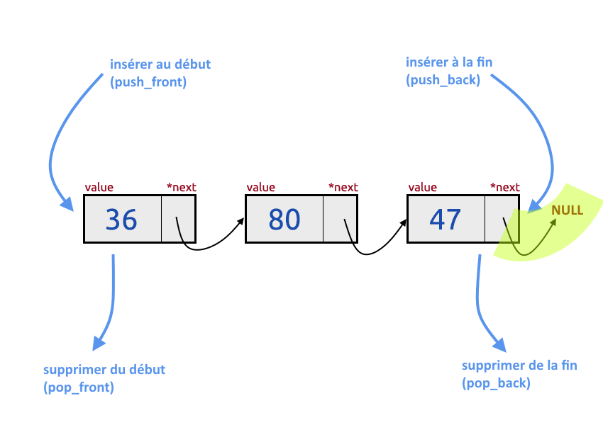
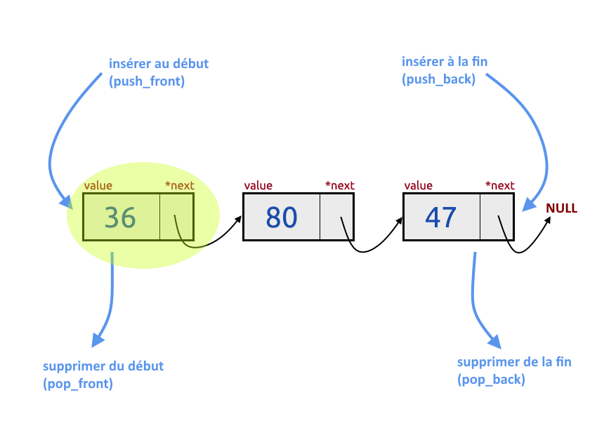
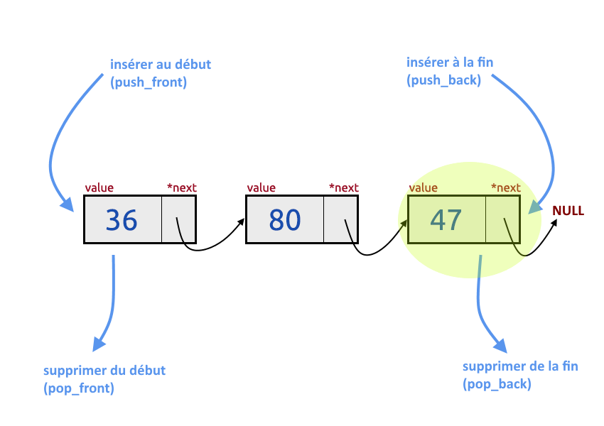
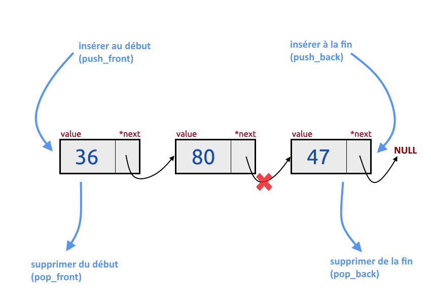
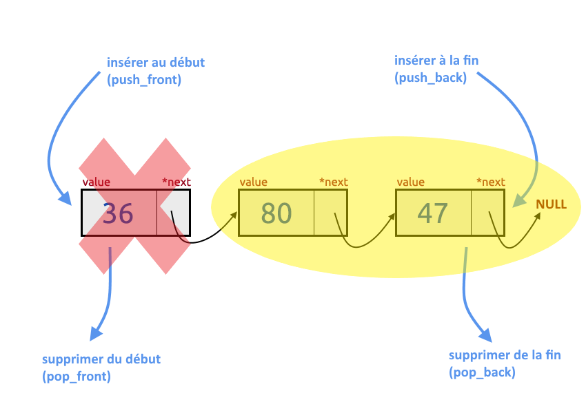

# [19. Listes](https://www.youtube.com/watch?v=FmaNOdbngLc)

Bonjour à tous et bienvenue pour cette nouvelle séance sur notre langage c.

On va continuer un petit peu les structures de données.

Aujourd'hui maintenant qu'on a vu les piles, les files, et vous avez vu qu'il y avait une structure assez particulière pour ces deux structures, on va en voir une qui est beaucoup plus flexible qu'on retrouve dans pas mal d'autres langages qui est la liste tout simplement.

On va donc regarder un petit peu ça, je vous ai fait un petit schéma comme d'habitude pour vous montrer rapidement, on va développer quelques fonctions pour pouvoir travailler avec nos fameuses listes.

Alors le schéma que j'ai à vous proposer est le suivant.


Grosso modo, la liste, il n'y a pas vraiment d'ordre particulier dans l'insertion des données ou le retrait des données, vous avez vu que pour les autres, il y avait un certain nombre de règles à respecter par rapport à ce qui devait être ressorti et ce qui pouvait être inséré donc ajouté dans la structure.

Ici on peut ajouter une donnée que ce soit en tête de la liste ou en fin de liste.

On peut retirer une donnée qui est à la fin de la liste ou bien au début de la liste peu importe donc c'est ce que j'ai représenté par ces quatres termes :

+ push_front
+ push_back
+ pop_front
+ pop_back

On a toujours le même système vous allez voir au niveau de la structure qu'on va développer de *value* et de *pointeur* vers l'élément suivant et le système d'entier puisque c'est beaucoup plus simple encore une fois au niveau de la vidéo pour ne pas faire quelque chose de trop long et trop compliqué surtout.

Alors pour gagner du temps parce qu'il y a quand même pas mal de fonctions à développer, un peu plus que les fois précédentes donc j'ai déjà préparé des fichiers au niveau de la vidéo comme ça ils sont déjà prêts.

On va pouvoir du coup travailler là dessus.

+ [main.c](cours/019_listes/main.c)
+ [list.c](cours/019_listes/list.c)
+ [list.h](cours/019_listes/list.h)
+ [schema-liste.PNG](cours/019_listes/schema-liste.PNG) 

+ main.c
```c
#include <stdio.h>
#include "list.h"

int main(void)
{

    return 0;
}
```
+ list.c
```c
#include <stdio.h>
#include <stdlib.h>
#include "list.h"
```
+ list.h
```c
#ifndef __LIST__H__
#define __LIST__H__

/* Définition du type Booléen */
typedef enum
{
    false,
    true
}Bool;

/* Définition d'une Liste */

/* Prototypes */

#endif
```

Alors on regarde un petit schéma ici.

Voilà donc comme d'habitude le fichier principal je rappelle puis un fichier list.c qui va avoir l'implémentation de nos différentes fonctions et un fichier list.h qui va contenir donc tout ce qui est définitions et prototypes de fonctions.

Voilà j'ai déjà mis le type Booléen puisqu'on l'utilise à chaque fois par habitude on va pouvoir avoir comment définir une liste puis on va pouvoir attaquer l'implémentation des différentes fonctions.

Alors au niveau de la liste, toujours pareil donc ici on va reprendre un petit peu ce qu'on avait fait sur les piles au niveau de l'implémentation et de la définition de la structure.

Au niveau des files vous avez vu qu'on avait utilisé des variables statiques donc qui pouvaient être utilisées directement dans nos programmes pour faciliter par exemple certains traitements.

Ici on va simplement utiliser une seule structure, celle de la liste et on n'aura pas d'éléments de paramètres tout simplement.

## Définition de la structure ListElement

Alors donc comme d'habitude on va faire un `typedef struct` et donc ici pour garder encore une fois les mêmes notations que j'ai pu faire dans les vidéos précédentes, on va l'appeler non pas *StackElement* mais *ListElement* dans laquelle on va avoir un élément value `int value;` qui sera la donnée en elle-même d'accord et on va avoir bien sûr un `struct ListElement *next;` qui serra notre pointeur vers l'élément suivant.

```c
typedef struct ListElement
{
    int value;
    struct ListElement *next;
}ListElement, *List;
```

Tout cela est un `}ListElement,` et en masquant bien évidemment le pointeur vers une liste, `*List;`.

Rien de nouveau en a toujours procédé comme ça, ici il n'y a vraiment rien de différent par rapport à d'habitude et du coup on va pouvoir passer à l'implémentation de nos fonctions et à commencer par la toute première qui est très simple et que vous connaissez maintenant sûrement par coeur qui est celle de création d'une nouvelle structure.

Encore une fois dans la vidéo précédente sur les files, il n'y en avait pas parce que je vous avais dit que je vous proposais plusieurs solutions d'implémentation pour que vous voyez qu'il y a vraiment plusieurs méthodes pour le faire et qu'elles fonctionnent toutes.

Après il y en a qui seront forcément plus optimisées que d'autres, plus pratique à l'utilisation, plus simple.

Encore une fois c'est vous qui voyez selon vos besoins et selon le projet dans lesquels vous voulez l'utiliser.

## Prototypes et fonctions

Ici du coup on va faire nos new_list().

### new_list

```h
List new_list(void);
```

On va avoir une fonction pour retourner une liste vide.

Pour simplifier les choses comme on a fait pour les piles, on fait simplement un return de NULL voilà on estime que pour nous une liste en fait c'est simplement NULL.

```c
List new_list(void)
{
    return NULL;
}
```

On retourne NULL comme ça on est vraiment au plus simple.

A partir de là, on va pouvoir passer à une autre fonction donc ça va très vite pour les premières fonctions, c'est les autres qui vont être un peu plus compliquées.

On va avoir notre fameuse fonction qui vérifie si la structure est vide donc ici on va garder la même nom également `is_empty`, pas `is_empty_stack` mais `is_empty_list`.

### is_empty_list

```h
Bool is_empty_list(List li);
```

is_empty_list() et on va vérifier bien sûr notre liste, là je vais un petit peu vite puisqu'encore une fois c'est des choses qu'on a vues assez régulièrement maintenant donc si vous avez bien suivi les vidéos précédentes tout ça vous connaissez déjà.

Ici très simplement vous pourrez même carrément faire un copier-coller des piles si vous vouliez, il suffit simplement de vérifier que `li == NULL` dans ce cas-là, on retourne vrai.

```c
Bool is_empty_list(List li)
{
    if(li == NULL)
        return true;
    
    return false;
}
```

Ici on ne met pas un else, ça ne sert à rien encore fois.

Ainsi si on n'a pas été dans le if() ici c'est que donc ce n'est pas nul et donc à ce moment là la liste n'est pas vide voilà.

Encore une fois la même implémentation que pour les piles sauf qu'ici au lieu d'avoir le `st` de stack pour la pile, on a notre `li` notre élément de liste et on continue un petit peu.

Qu'est-ce qu'on peut faire d'autre sur une liste ? alors on va pas forcément faire une fonction pour retourner le premier élément parce que c'est simple. Vous pouvez vous amuser à faire si vous voulez mais c'est suffisamment simples et on l'a déjà pas mal vu avant donc  je ne vais pas la faire ici.

On pourra avoir une fonction encore une fois pour calculer le nombre d'éléments d'accord la longueur c'est à dire de la liste, même chose on va la faire celle-là parce qu'elle est quand même intéressante mais pareil elle est vraiment très très simple.

Du coup on va la faire maintenant, ce sera plus rapide.

### list_length

On va donc faire list_length() où on l'appelle *length* parce que je crois que j'ai toujours utilisé le terme *length* et prend en paramètre `List li`.

```h
int list_length(List li);
```

Cette notation là d'accord et on va l'implémenter tout de suite comme ça on gagnera du temps à ce niveau là, on va vérifier les éléments.

Alors comment allons-nous procéder ? Au niveau du comptage, on va d'abord créer une petite  variable qui servira à compter et qui par défaut est à 0 d'accord `int size = 0;` et automatiquement ce size, on le retournera de toute façon. Je peux même carrément mettre `return size;` pour la fin voilà on peut faire de cette manière-là.

```c
int list_length(List li)
{
    int size = 0;


    return size;
}
```

A partir de là, ce que je peux faire alors j'ai deux choix c'est-à-dire soit si la liste est vide `if(is_empty_list(li))` donc on utilise notre petite fonction d'avant, on peut directement retourner size d'accord.

```c
int list_length(List li)
{
    int size = 0;

    if(is_empty_list(li))
        return size;


    return size;
}
```

Ainsi je vais vous montrer deux notations différentes et dans tous les cas, qu'est-ce qu'on fait ? Hé bien tant que `li` la liste est différente de nul parce que vous voyez que nulle en fait c'est quand on est en dehors de la liste.

+ Méthode 1 (répétition de re `return size;`)
```c
int list_length(List li)
{
    int size = 0;

    if(is_empty_list(li))
        return size;

    while(li != NULL)
    {
        ++size;
        li = li->next;
    }

    return size;
}
```

`while(li != NULL)` donc on va boucler de cette manière-là avec `li != NULL` d'accord et on va augmenter la taille de 1 `++size` à chaque fois pour compter chaque élément et on va avancer notre pointeur c'est-à-dire qu'on va dire que maintenant la liste passe à l'élément suivant `li = li->next;` donc au début on a (36) et ça va faire +1 ensuite ça passe au suivant (80) voyez au niveau de la boucle donc du coup ça fait encore +1 puis à l'élément suivant et ça fait encore +1 donc on arrive à 3. Et si on fait +1 on tombe sur NULL donc à ce moment là la boucle s'arrête et donc ont fait le return d'accord dans les deux cas.



Alors là vous voyez que aussi j'ai deux fois le `return size;` donc vous pouvez optimiser un petit peu ça.

Vous pouvez sans problème faire, ça peut se faire d'une manière si on fait ça, vous pouvez faire par exemple `if(!is_empty_list(li)){}` ainsi si la boucle n'est pas vide dans ce cas-là on fait notre petite boucle.

+ Méthode 2 (optimiser sans répétition de return)
```c
int list_length(List li)
{
    int size = 0;

    if(!is_empty_list(li))
        while(li != NULL)
        {
            ++size;
            li = li->next;
        }

    return size;
}
```

Si la boucle n'est pas vide parce que vous voyez que dans tous les cas vous allez retourner *size*.

Si la boucle est vide, toute cette partie-là ne va pas être faites.

```c
if(!is_empty_list(li))
    while(li != NULL)
    {
        ++size;
        li = li->next;
    }
```

Si cette boucle n'est pas faite, on retourne size qui est égal à zéro, c'est effectivement le cas sinon on va faire `while(li != NULL){...}` et size ne sera pas égale à zéro.

Ainsi vous faites une notation ou l'autre, c'est vous qui voyez.

Moi je vais garder celle-là mais vous pouvez utilisez l'autre qui est un petit peu plus longue mais ça ne changera pas grand chose et dans  tous les cas vous aurez le même résultat.

Voilà du coup pour la longueur de la liste donc je rappelle que la la longueur de la liste c'est simplement compter le nombre d'éléments qu'elle contient tout simplement.

Là on va passer aux fonctions un petit peu plus compliqué et surtout les plus intéressantes  notamment la première, print_list().

### print_list

On va commencer par celle-là parce qu'elle va permettre d'afficher la liste puisqu'elle rejoint un petit peu celle qui calcule la longueur.

Voilà donc c'est print_list().

```h
void print_list(List li);
```

On reprend donc le prototype et on y va.

Comment ça va se passer ? très simple, on réfléchit comme d'habitude quand on programme, on réfléchit à chaque chaque situation possible. Je veux afficher une liste. Qu'est-ce qui peut arriver à cette liste ? Hé bien le premier truc qui peut arriver, c'est que cette liste soit vide c'est-à-dire qu'on ne va pas essayer encore une fois d'afficher une liste qui n'a aucun élément donc première vérification qui est des plus logiques : si notre liste est bien et bien au plus simple on affiche un message *Rien a afficher, la Liste est vide.* et on fait un return sans rien puisque je rappelle qu'on retourne rien, c'est void.

```h
void print_list(List li)
{
    if(is_empty_list(li))
    {
        printf("Rien a afficher, la Liste est vide.\n");
        return;
    }
}
```

Voilà ça c'est la base et à partir de cet endroit-là, c'est que la liste n'est pas vide donc à ce moment là on va procéder à une boucle encore une fois pour pouvoir parcourir chacun des éléments sauf que là on ne va pas incrémenter une variable au niveau de la boucle comme on l'a fait ici avec list_length() voyez pour la longueur mais on va tout simplement afficher l'élément donc ça rejoint exactement de même système qu'au dessus.

On fait donc while() donc tant que nous ne sommes pas en dehors de la liste donc différent de NULL ici par rapport au schéma, `while(li != NULL){}`


A ce moment qu'est ce qu'on fait ? on fait tout simplement un printf() de l'élément en cours comme ceci `printf("[%d] ", li->value);)` et voilà un petit espace par rapport à nos structures, je vous rappelle `li->value` d'accord pour afficher l'élément actuel et tu n'oublie pas évidemment de déplacer le pointeur sinon on va toujours être sur le même élément et on aura d'ailleurs une boucle qui ne s'arrêtera jamais, elle sera infinie donc on fait comme tout à l'heure `li = li->next;`.

```h
void print_list(List li)
{
    if(is_empty_list(li))
    {
        printf("Rien a afficher, la Liste est vide.\n");
        return;
    }

    while(li != NULL)
    {
        printf("[%d] ", li->value);
        li = li->next;
    }

    printf("\n");
}
```

`li = li->next;` est la même chose que pour list_length(), que ce soit pour la longueur ou afficher, on fait exactement le même type de boucles sauf qu'ici on affiche un élément alors que pour la longueur on incrémente tout simplement une variable `++size;` pour pouvoir compter.

> print_list ≠ list_length

C'est vraiment la seule différence.

Pour représenter les choses on met un petit retour à ligne à la fin `printf("\n");` pour éviter que tout soit sur la même ligne.

Voilà on est bon au niveau de l'affichage-là.

On va commencer à tester notre petite fonction parce qu'on en a déjà fait 4 et on a encore rien tester au niveau programme donc on va regarder ça.

## 1e compilation et exécution

Ici donc je vais créer une liste que je vais appeler mylist et on va faire comme ceci d'accord.

```c
#include <stdio.h>
#include "list.h"

int main(void)
{
    List mylist = new_list();

    return 0;
}
```

Première base et ensuite tant qu'à faire on peut vérifier déjà si la liste est vide pourquoi pas donc on va faire `if(is_empty_list(li)){}` soit notre liste est vide, soit elle a des élément si elle n'est pas vide.

```c
#include <stdio.h>
#include "list.h"

int main(void)
{
    List mylist = new_list();

    if(is_empty_list(mylist))
        printf("Liste vide.\n");
    else
        printf("Liste a des elements.\n");

    return 0;
}
```
```c
#include <stdio.h>
#include <stdlib.h>
#include "list.h"

List new_list(void)
{
    return NULL;
}
/*----------------------------------------*/
Bool is_empty_list(List li)
{
    if(li == NULL)
        return true;
    
    return false;
}
/*----------------------------------------*/
int list_length(List li)
{
    int size = 0;

    if(!is_empty_list(li))
        while(li != NULL)
        {
            ++size;
            li = li->next;
        }

    return size;
}
/*----------------------------------------*/
void print_list(List li)
{
    if(is_empty_list(li))
    {
        printf("Rien a afficher, la Liste est vide.\n");
        return;
    }

    while(li != NULL)
    {
        printf("[%d] ", li->value);
        li = li->next;
    }

    printf("\n");
}
/*----------------------------------------*/
```
```h
#ifndef __LIST__H__
#define __LIST__H__

/* Définition du type Booléen */
typedef enum
{
    false,
    true
}Bool;

/* Définition d'une Liste */
typedef struct ListElement
{
    int value;
    struct ListElement *next;
}ListElement, *List;

/* Prototypes */
List new_list(void);
Bool is_empty_list(List li);
int list_length(List li);
void print_list(List li);

#endif
```
```powershell
gcc *.c -o prog       
.\prog.exe                   
Liste vide.
```

Comme d'habitude encore une fois voilà je rappelle, je le dis rapidement ici parce qu'il y a des gens qui me le demande en commentaire mais j'enregistre toujours le fichier avant de l'exécuter simplement parce que je fais le raccourci clavier ctrl+S qui fonctionne sur tous les logiciels informatiques, un traitement de texte, n'importe lequel, ctrl+S c'est le raccourci qui fait le fameux *Enregistrer* que vous voyez ici d'accord c'est même marqué d'ailleurs sur les logiciels.

Ne pensez pas que tout se met à jour automatiquement c'est moi qui fait le ctrl+S directement.

Ainsi donc à partir de là je compile et si tout a bien marché, il me dit que la liste est vide.

Pour le moment ça à l'air d'aller.

On peut vérifier la taille *Taille de la Liste :* alors on direais plutôt *Nombre d'élement* pour être plus logique dans les termes et là du coup on va faire `list_length(mylist)`.

```c
#include <stdio.h>
#include "list.h"

int main(void)
{
    List mylist = new_list();

    if(is_empty_list(mylist))
        printf("Liste vide.\n");
    else
        printf("Liste a des elements.\n");

    printf("Taille de la liste : %d\n", list_length(mylist));

    return 0;
}
```
```powershell
gcc *.c -o prog
.\prog.exe   
Liste vide.
Taille de la liste : 0
```

Même chose on recompile, on exécute et là *Taille de la liste : 0*, écoutez pour le moment ça a l'air de fonctionner donc on va virer tout ça et on va faire carrément un `print_list(mylist);`.

```c
#include <stdio.h>
#include "list.h"

int main(void)
{
    List mylist = new_list();

    print_list(mylist);
}
```
```powershell
gcc *.c -o prog
.\prog.exe   
Rien a afficher, la Liste est vide.
```

Et là *Rien a afficher, la Liste est vide.* donc à priori en tout cas en voyant comme ça les fonctions ont l'air d'avoir le comportement qu'on attendait puisqu'on a effectivement une liste vide.

Du coup on va pouvoir passer à la suite et on verra comme ça s'il y a toujours pas de bugs et si tout fonctionne correctement.

A partir de là, on va commencer maintenant à faire des fonctions pour pouvoir insérer des éléments, en ajouter alors la plupart du temps pour les listes on utilise le mot *insert* quand on fait des noms de fonctions.

Encore une fois moi je vous ai dit que je n'utilise pas forcément des noms très correct parce que j'utilise le terme de push alors qu'on l'utilise vraiment pour les piles et pas pour une liste. On dirait *insert* et on dirait *delete* pour retirer un élément et pas forcément *pop* comme je le fais aussi.

Moi j'ai gardé comme je l'avais dit là dernièrement ces mêmes noms histoire de ne pas vous perdre, de vous embrouiller dans les différentes structures que vous ayez en fait les structures de données qui changent mais que les noms de fonction soientt à peu près les mêmes, comme ça vous vous retrouvez un petit peu là-dedans.

Du coup ici on va faire la fonction qui va permettre d'ajouter un élément en fin de liste c'est à dire d'ajouter par ici, par l'arrière de la liste (droite).


Par ici, par l'arrière de la liste donc si il n'y en a pas ce sera le premier et évidemment si il y en a d'autres eh bien ça deviendra du coup le dernier élément.

Pour ça donc on prend en retour la nouvelle liste qui aurait l'élément en plus et on va  l'appeler push_back_list().

### push_back_list

push_back_list() où en paramètre on veut la liste et on veut aussi l'entier à ajouter.

```h
List push_back_list(List li, int x);
```

C'est parti pour cette implémentation qui va du coup être un tout petit peu plus complexe puisque selon qu'on ajoute en début de liste ou en fin de liste, on n'aura évidemment pas le même code et vous allez comprendre pourquoi.

Alors le code au niveau de l'ajout à l'arrière de la liste et le plus complexe des deux au niveaux de l'insertion, pourquoi ? puisque par défaut notre pointeur est placé au début donc il va falloir se placer tout à la fin de la liste et ensuite ajouter le nouvel élément c'est pour ça. Il y a quand même une petite différence.

Du coup, qu'est ce qu'on va faire ? première chose, on crée un nouvel élément. On alloue dynamiquement le nécessaire pour notre nouvel élément donc sizeof() du pointeur `*element` avec étoile pour être sûr d'avoir la bonne taille et toujours la même vérification si c'était égal à nul c'est que l'allocation n'a pas fonctionné et dans ce cas là on arrête le programme.

```c
List push_back_list(List li, int x)
{
    ListElement *element;

    element = malloc(sizeof(*element));

    if(element == NULL)
    {
        fprintf(stderr, "Erreur : problème allocation dynamique.\n");
        exit(EXIT_FAILURE);
    }
}
```

Voilà si ça n'a pas fonctionné, on écrit un message *Erreur : problème allocation dynamique.* et là toujours pareil on fait un `exit(EXIT_FAILURE);` ou `exit(1);` comme vous voulez. Moi j'utilise carrément la constante comme ça pas de souci à ce niveau donc ça on pourra en faire des copier-coller quand on aura besoin de refaire une autre fonction éventuellement donc c'est toujours la même syntaxe à part ici `ListElement` où on change la structure que vous utilisez. Ainsi pour les listes, les piles, on avait toujours les mêmes syntaxes.

A partir de là c'est que l'alocation, c'est bien passé donc on a d'autres éléments.

Notre élément qu'on a créé c'est ce genre de petite chose d'accord.



Un ListElement c'est ça en fait, c'est juste un petit ensemble-là donc il a une variable  value (36) et il aura le pointeur.

Alors value prend le x qu'on a en paramètre de la fonction, `element->value = x;` et l' *element->next* hé bien comme va être le dernier élément puisque je vous rappelle qu'on ajoute en fin de liste, c'est est égal à null d'accord `element->next = NULL;`, ce sera ça en fait le fameux null qu'on a ici qui indique qu'on est sorti de la liste.


```c
List push_back_list(List li, int x)
{
    ListElement *element;

    element = malloc(sizeof(*element));

    if(element == NULL)
    {
        fprintf(stderr, "Erreur : problème allocation dynamique.\n");
        exit(EXIT_FAILURE);
    }

    element->value = x;
    element->next = NULL;
}
```

Ici pas de problème.

Maintenant deux cas possibles soit la liste est déjà vide et du coup il y a que cet élément là donc on ne va pas s'embêter et on va le retourner tout simplement donc `if(is_empty_list(li)){}` donc si notre liste est vide, on retourne l'élément puisque de toute façon il n'y a que lui d'accord vous voyez qu'on l'a alloué donc c'est bien une liste, pas de souci on a fait la location, on a ajouté la valeur et on a bien mis NULL à la fin donc c'est comme si on avait que cette chose-là donc on peut sans problème retourner l'élément en lui-même.

```c
List push_back_list(List li, int x)
{
    ListElement *element;

    element = malloc(sizeof(*element));

    if(element == NULL)
    {
        fprintf(stderr, "Erreur : problème allocation dynamique.\n");
        exit(EXIT_FAILURE);
    }

    element->value = x;
    element->next = NULL;

    if(is_empty_list(li))
        return element;
}
```

C'est tout donc quelque part on abandonne en fait les listes puisqu'il n'y a rien dedans donc c'est nul donc on fait un return de element.

En revanche si on n'est pas dans ce return c'est que la liste n'est pas vide dans ce cas là on va créer une variable temporaire qui va nous permettre de faire notre parcours c'est bien c'est pour éviter de bouger le pointeur sur la liste en elle-même, de modifier directement au niveau de notre variable li donc on va créer une copie ce qui fait qu'on aura en fait un pointeur qui pointera sur la même chose d'accord.

Alors c'est un peu comme une référence, je ne vais pas employer le terme de copie parce que copie voudrait dire qu'ils ne sont pas pareil alors que là c'est une référence c'est-à-dire qu'ils sont absolument pareil c'est vraiment des clones qui agissent sur la même chose.

On va faire un `ListElement *temp;` donc la variable temporaire et on va dire que c'est égal à li `temp = li;` d'accord.

```c
List push_back_list(List li, int x)
{
    ListElement *element;

    element = malloc(sizeof(*element));

    if(element == NULL)
    {
        fprintf(stderr, "Erreur : problème allocation dynamique.\n");
        exit(EXIT_FAILURE);
    }

    element->value = x;
    element->next = NULL;

    if(is_empty_list(li))
        return element;
    
    ListElement *temp;
    temp = li;
}
```

`temp = li;` ça veut donc dire maintenant que li et temp, c'est deux pointeurs qui pointent ici.


Tous les deux au même endroit du coup à partir de là regardez ce que j'ai juste à faire, je vais me déplacer tout à la fin de ma liste tant que la suite de l'élément actuel `temp->next` est différent de NULL, `while(temp->next != NULL)` c'est-à-dire que tant que je ne suis pas arrivé à la fin de la liste en fait et bien je le déplace `temp = temp->next;`.

```c
List push_back_list(List li, int x)
{
    ListElement *element;

    element = malloc(sizeof(*element));

    if(element == NULL)
    {
        fprintf(stderr, "Erreur : problème allocation dynamique.\n");
        exit(EXIT_FAILURE);
    }

    element->value = x;
    element->next = NULL;

    if(is_empty_list(li))
        return element;
    
    ListElement *temp;
    temp = li;

    while(temp->next != NULL)
        temp = temp->next;
}
```

Donc là je ne fais que me déplacer en fait déplacer mon pointeur ici en fin de liste d'accords vraiment tout à la fin.



Le pointeur se déplace et s'il voit que c'est NULL, du coup il s'arrête et sera placé ici (47).

A partir de là une fois qu'il est ici, je peux dire que du coup le prochain élément est bien c'est notre éléments nouvellement créée `temp->next = element;` d'accord celui qu'on vient d'allouer et nous n'avons plus qu'à retourner du coup li voilà.

```c
List push_back_list(List li, int x)
{
    ListElement *element;

    element = malloc(sizeof(*element));

    if(element == NULL)
    {
        fprintf(stderr, "Erreur : problème allocation dynamique.\n");
        exit(EXIT_FAILURE);
    }

    element->value = x;
    element->next = NULL;

    if(is_empty_list(li))
        return element;
    
    ListElement *temp;
    temp = li;

    while(temp->next != NULL)
        temp = temp->next;

    temp->next = element;

    return li;
}
```

Alors vous allez me dire, pourquoi on retourne li alors qu'on travaille sur une variable temporaire ? voilà je vous ai dit que temporaire est une référence à li c'est-à-dire qu'en ayant parcouru avec la variable ici temporaire on a en fait déplacer li, ce qui fait qu'on a bien ajouté en fait l'élément sur notre liste de base et pas seulement sur temp.

temp, c'est vraiment un pointeur qui pointe sur le même endroit que cette variable li qui est un pointeur je vous le rappelle, `..., *List;` écrit comme ça, comme vous le voyez  d'accord c'est un pointeur voilà.

A partir d'ici on a bien travaillé sur la bonne liste et du coup on retourne la nouvelle liste qui à ce nouvel élément.

Voilà donc je vous avais dit que c'est un petit peu plus complexe, c'était l'une des plus complexes des deux, vous allez voir que celles pour ajouter en début de liste est du coup plus simple donc on va d'ailleurs la faire.

### push_front_list

```h
List push_front_list(List li, int x);
```

`List li, int x`, même chose celle-là va être un peu plus rapide très logiquement.

Voilà de toute manière, s'il y a des choses qui ne sont pas forcément compréhensible pour vous et que vous avez encore du mal à cerner, n'hésitez pas dans les commentaires de la vidéo à me poser des questions comme d'habitude, vous savez que je vous réponds.

Alors ici au niveau de front donc front ça veut dire qu'on va être ici.


D'accord on va vouloir ajouter un élément avant donc vous allez voir que ça va être vraiment très simple.

Première chose on va créer notre élément, logique on veut rajouter un nouvel élément donc il faut bien créer cette petite boîte-là donc je peux faire un copier coller tout bête de cette partie-là.

```c
List push_front_list(List li, int x)
{
    ListElement *element;

    element = malloc(sizeof(*element));

    if(element == NULL)
    {
        fprintf(stderr, "Erreur : problème allocation dynamique.\n");
        exit(EXIT_FAILURE);
    }
}
```

J'ai bien mon élément, je vérifie l'allocation donc c'est très bien.

A partir de là, qu'est ce qu'on va faire ? première chose, on met le x dans `element->value`.

```c
List push_front_list(List li, int x)
{
    ListElement *element;

    element = malloc(sizeof(*element));

    if(element == NULL)
    {
        fprintf(stderr, "Erreur : problème allocation dynamique.\n");
        exit(EXIT_FAILURE);
    }

    element->value = x;
}
```

`element->value = x;` donc ça on le fait dans tous les cas et justement en parlant des cas, il y en a deux comme d'habitude si la liste est vide, il ne va pas se passer la même chose que si elle ne l'est pas donc si la liste est vide, qu'est ce que nous avons faire ? hé bien `element->next = NULL` ok parce que si elle n'a aucun élément, ça veut dire en fait voilà qu'il est ici (47). Il est tout seul donc son pointeur `*next` pointe vers nulle automatiquement.

```c
if(is_empty_list(li))
    element->next = NULL;
```


Sinon si ce n'est pas ça et bien `element->next = li;` avec element->next équivaut toutes la liste qu'on a puisque element pour rappel doit se placer du coup tout devant donc à sa suite on met toute la liste d'avant donc ceci.

```c
List push_front_list(List li, int x)
{
    ListElement *element;

    element = malloc(sizeof(*element));

    if(element == NULL)
    {
        fprintf(stderr, "Erreur : problème allocation dynamique.\n");
        exit(EXIT_FAILURE);
    }

    element->value = x;

    if(is_empty_list(li))
        element->next = NULL;
    else
        element->next = li;
    
    return element;
}
```

Voilà et là du coup je vous rappelle qu'on retourne element `return element;`, pourquoi ? parce que regardez c'est `element->next` qui contient tout d'accord c'est dans `element->next` qu'on a mis `li` et pas inversement, on a pas mis element dans li. On a mis `li` dans `element->next` sinon on a rien mis du tout parce que c'est NULL donc tout les cas on retourne element.

Voilà faites attention à ça des fois, c'est ça que souvent le nom qu'on utilise dans les fonctions peut prêter à confusion, j'aurais pu donner n'importe quel autre nom : element, node, maillon bref il y a plein de termes qu'on veut. Moi je parle d'élément puisque c'est un élément de notre liste en réalité mais dans l'élément faut comprendre qu'on a du coup ici toute la liste finalement, on n'a pas qu'un élément, on a vraiment tout l'ensemble de la  liste.

Faites attention à ça, n'hésitez pas à relire le code pour bien comprendre chaque étape que je vous expliquez.

Du coup voyez elle est un petit peu plus courte et du coup beaucoup plus simple parce qu'on a pas eu besoin de parcourir toute la liste pour arriver à la fin, on était déjà devant tout au tout début de la liste donc il a juste suffi décalé en fait les éléments vers la droite.

C'est un peu ce qu'on a fait ici avec ça `element->next = li;` et si il n'y en a pas bien évidemment on a qu'un seul élément `element->next = NULL;` donc ça va très vite.

Voilà pour l'insertion et encore une fois je ne vais pas tester les codes tout de suite puisqu'on n'a pas fait de fonction pour retirer les éléments et donc libérer la mémoire donc comme j'ai pas trop envie de faire de fuites de mémoire, on ne va pas tester ça tout de suite on verra par la suite.

Maintenant on va pouvoir changer cette fois ci en faisant pop_back_list().

### pop_back_list

```h
List pop_back_list(List li);
```

Voilà et c'est parti on continue sur l'implémentation donc là on va faire la petite fonction qui va permettre de retirer le dernier élément de la liste d'accords donc ici ce serait par exemple le 47 qu'on retirait.


Comment ça va se passer ? si vous avez suivi au niveau de l'insertion normalement vous devriez à peu près vous en sortir au niveau du retrait, c'est un petit peu la même chose sauf que ici vous voyez on avait directement créer un élément d'accord.

```c
List push_back_list(List li, int x)
{
    ListElement *element;
//etc.
```

Alors que nous là pop_back_list(), on veut tout de suite vérifier une chose importante, n'essayez pas d'enlever un élément d'une liste qui est vide.

Cela paraît logique sinon vous allez avoir des erreurs si vous essayez d'enlever quelque chose qui n'existe pas donc première vérification ici est-ce que la liste est vide d'accord si elle est vide, vous avez deux choix : soit vous retourner votre petite fonction new_list() après tout on la développer pour retourner NULL pourquoi pas sinon vous retournez li aussi puisque si elle est vide, ça veut dire que *li == NULL* puisque je vous rappelle que dans son implémentation is_empty_list() c'est ce qu'on vérifie donc vous mettez la syntaxe que vous voulez.

```c
List pop_back_list(List li)
{
    if(is_empty_list(li))
        return new_list();
}
```

Moi je me disais que j'ai créé une fonction pour ça donc autant s'en servir, autant qu'elle sert à quelque chose.

Du coup en plus à la lecture, on arrive à bien comprendre.

Si la liste est vide, qu'est-ce qu'on retourne ? hé bien on retourne une liste vide ça paraît logique donc une nouvelle liste.

Si on passe ce premier test, à partir de là on considère que notre liste n'est pas vide du coup comment est-ce que ça va se passer ? il y a une petite chose déjà si la liste ne contient qu'un seul élément c'est à dire si `if(li->next == NULL)` c'est-à-dire si par exemple on n'aurait que ça (47) comme élément ça ce serait li et du coup voyez son pointeur `*next` pointeraient vers NULL.


Dans ce cas on aurait qu'un seul élement.

Alors qu'est-ce qu'on fait dans ce cas de figure ? hé bien des choses beaucoup plus simples que s'il y en avait plusieurs.

On peut directement libérer la mémoire en faisant un free() de li puisqu'il y a qu'un seul element donc pas besoin de faire plusieurs libérations, vous n'en fait qu'un seul c'est suffisant.

```c
List pop_back_list(List li)
{
    if(is_empty_list(li))
        return new_list();

    if(li->next == NULL)
    {
        free(li);
    }
}
```

Ensuite ça c'est un petit plus que je n'ai pas mis dans les séances précédentes mais c'est un truc en plus qu'on peut faire au niveau de la libération quand vous voulez vraiment être sûr que votre libération mémoire se fasse proprement, vous faites un free() et derrière l'élément que vous avez libéré, vous lui affectez la valeur NULL comme ceci.

```c
List pop_back_list(List li)
{
    if(is_empty_list(li))
        return new_list();

    if(li->next == NULL)
    {
        free(li);
        li = NULL;
    }
}
```

Voilà c'est une chose qui n'est pas obligatoire normalement ça c'est proprement mais comme je vous le dis j'aime bien varier un peu les choses au fil des vidéos.

Comme cette vidéo vient après les piles et les files du coup on rajoute un petit truc par rapport aux vidéos précédentes comme ça ça vous fait une petite astuce en plus au fur et à mesure que vous avancez dans la formation donc là voyez-vous vous faites free() de quelque chose entre parenthèses et ce quelque chose vous lui affecter la valeur NULL comme ça vous êtes vraiment sûr qu'il est égale à NULL et pas à n'importe, ça évite en fait que le compilateur vienne y mettre n'importe quelle valeur dedans.

Du coup écoutez maintenant qu'on a fait ça, qu'est-ce qu'on fait ? On fait la même chose, on fait un return de new_list() comme on a fait aux dessus.

```c
List pop_back_list(List li)
{
    if(is_empty_list(li))
        return new_list();

    if(li->next == NULL)
    {
        free(li);
        li = NULL;

        return new_list();
    }
}
```

new_list() ou bien, vous pouvez retourner NULL ce qui serait pareil puisque c'est une nouvelle liste mais comme vous avez développé une liste autant encore une fois qu'elle sert à quelque chose sinon dans tous les cas si on n'a fait aucun des deux if() au début c'est que notre liste en contient plusieurs et dans ce cas-là et dans ce cas-là on va utiliser deux éléments qui vont servir, rappelez vous, de référence comme on l'avait fait ici.

```c
List push_back_list(List li, int x)
{
    //...    
    ListElement *temp;
    //...
}
```

Ici on en avait utilisée une variable temporaire mais il va en faloir deux et vous allez comprendre pourquoi aussi.

Donc le premier que j'appelle *temp* qui est une référence à li dans tous les cas. Puis *before* pour dire avant pareil une référence à li.

```c
List pop_back_list(List li)
{
    if(is_empty_list(li))
        return new_list();

    if(li->next == NULL)
    {
        free(li);
        li = NULL;

        return new_list();
    }

    ListElement *temp = li;
    ListElement *before = li;
}
```

Alors déjà-là, on le déplace tant que `temp->next != NULL` qu'est-ce qu'on fait ? tant qu'en fait on n'arrive pas à la fin, on va dire déjà que `before = temp;`.

```c
List pop_back_list(List li)
{
    if(is_empty_list(li))
        return new_list();

    if(li->next == NULL)
    {
        free(li);
        li = NULL;

        return new_list();
    }

    ListElement *temp = li;
    ListElement *before = li;

    while(temp->next != NULL)
    {
        before = temp;
    }
}
```

Ok pourquoi on fait ça ? c'est pour pas perdre en fait la valeur qu'on avait juste avant, `ListElement *before = li;`. C'est pour ça qu'il est utile celui-là et vous allez voir pourquoi puisque après on fait ça `temp = temp->next;`.

```c
List pop_back_list(List li)
{
    if(is_empty_list(li))
        return new_list();

    if(li->next == NULL)
    {
        free(li);
        li = NULL;

        return new_list();
    }

    ListElement *temp = li;
    ListElement *before = li;

    while(temp->next != NULL)
    {
        before = temp;
        temp = temp->next;
    }
}
```

`temp = temp->next;`, ce pointer `temp` contient l'élément qui suit après parce qu'on a mis flèche next mais avant on a sauvegardé en fait dans before, c'est pour ça que je l'ai appelé comme ça pour dire que c'était celui avant, avant de passer à la suite ce qu'on a fait ici `temp = temp->next;`. 

Voilà c'est pour ça qu'on utilise donc 2 pointeurs.

Alors ce qu'il y a dans le while() c'est juste pour le déplacement de pointeurs d'accord vous verrez rien à l'écran c'est juste au niveau de la mémoire qu'on a déplacé les pointeurs, sur ce quoi ils pointaient alors une fois qu'on a fait ça on peut du coup dire que `before->next = NULL;` d'accord je rappelle qu'on enlève cet élément là (47) d'accord  l'élément de fin.

```c
List pop_back_list(List li)
{
    if(is_empty_list(li))
        return new_list();

    if(li->next == NULL)
    {
        free(li);
        li = NULL;

        return new_list();
    }

    ListElement *temp = li;
    ListElement *before = li;

    while(temp->next != NULL)
    {
        before = temp;
        temp = temp->next;
    }

    before->next = NULL;
}
```


Qu'est-ce qu'on lui dit ? On lui dit que l'avant dernier élément d'accord imaginez que before en fait pointe du coup vers l'avant dernier élément de la liste et on lui dit que
maintenant qu'on a cassé le lien là en fait.



Imaginez que le before c'est lui (80) d'accord lui (47) c'est le derniers et (80) c'est
le before donc temp c'est (47) et before c'est (80).

Ici le pointeur next de before a été enlevé du coup on a cassé ce lien, c'est ce qu'on vient de faire ici et ensuite on peut du coup à propos du fameux élément-là qui se retrouve tout seul (47), heureusement avant de casser le lien qui permettait de le rejoindre on la enregistré quelque part d'accord dans temp donc à ce moment-là on peut le libérer en faisant un `free(temp);` et comme pour tout à l'heure `temp = NULL;`, ça c'est une petite astuce en plus et voilà.

```c
List pop_back_list(List li)
{
    if(is_empty_list(li))
        return new_list();

    if(li->next == NULL)
    {
        free(li);
        li = NULL;

        return new_list();
    }

    ListElement *temp = li;
    ListElement *before = li;

    while(temp->next != NULL)
    {
        before = temp;
        temp = temp->next;
    }

    before->next = NULL;
    free(temp);
    temp = NULL;

    return li;
}
```

On n'a plus qu'à retourner li puisqu'il n'a plus maintenant l'élément qu'on vient de retirer parce qu'encore une fois en travaillant avec ces pointeurs-là, on a effectivement agit sur la vrai liste d'accord c'est des pointeurs qui travaille ensemble comme des références et ici on vient de retirer le dernier élément.

J'espère que ça a été clair au niveau des explications, c'est pas forcément le plus simple cette structure, elle est beaucoup plus flexible en utilisation par contre en développement elle est un poil plus complexe que la pile ou la file et on va terminer en tout cas au niveau des retraits avec pop_front_list() qui du coup sera évidemment beaucoup plus simple encore une fois parce qu'on a on n'a pas besoin de se déplacer tout à la fin.

### pop_front_list

```h
List pop_front_list(List li);
```

Ici très simple, première chose dans tous les cas qu'il faut faire créer un nouvel élément alors vous allez me demander pourquoi un nouvel élément ? Le nouvel élément en fait va permettre de récupérer toute notre liste sauf le premier, le premier élément-là d'accord.


```c
List pop_front_list(List li)
{
    ListElement *element;

    element = malloc(sizeof(*element));

    if(element == NULL)
    {
        fprintf(stderr, "Erreur : problème allocation dynamique.\n");
        exit(EXIT_FAILURE);
    }
}
```

Voilà donc on crée notre élément, et comme c'est ce que je veux faire pour gagner du temps, je fait un copier-coller. Voilà je crée un élément, je l'alloue dynamiquement, je vérifie l'allocation et c'est bon.

A partir de là, deux choses possibles si la liste est vide, je retourne li.

```c
List pop_front_list(List li)
{
    ListElement *element;

    element = malloc(sizeof(*element));

    if(element == NULL)
    {
        fprintf(stderr, "Erreur : problème allocation dynamique.\n");
        exit(EXIT_FAILURE);
    }

    if(is_empty_list(li))
        return li;
}
```

Voilà je pourrais d'ailleurs retourner enew_list() ncore une fois comme on veut, voyez c'est vraiment comme vous voulez.

Là je change un peu pour changer un peu mais ça fonctionne aussi donc si c'est ça on retourne li d'accord ça on n'aurait pu le faire en début de fonction plutôt d'éviter de créer *element*, on peut directement s'amuser à faire ça comme pour tout à l'heure d'accord.

```c
List pop_front_list(List li)
{

    if(is_empty_list(li))
        return li;
    
    ListElement *element;

    element = malloc(sizeof(*element));

    if(element == NULL)
    {
        fprintf(stderr, "Erreur : problème allocation dynamique.\n");
        exit(EXIT_FAILURE);
    }
}
```

Voilà comme pour tout à l'heure, c'est même encore plus optimisé voyez pour respecter cette syntaxe là d'ailleurs on pourrait même s'amuser à tester si la liste est vide au début de la fonction comme on avait fait avec la fonction pop_back_list().

```c
List pop_back_list(List li)
{
    if(is_empty_list(li))
        return new_list();
//etc.
```

Et du coup, je vous avait dit que new_list() est la même chose que de retourner une liste à NULL, et sinon du coup on crée cet élément-là `ListElement *element;`, on l'alloue dynamiquement et cetera, et on fait les choses nécessaires donc dans ce pointeur de récupération on va y mettre toute la liste sauf le premier élément c'est à dire `element = li->next;`.

```c
List pop_front_list(List li)
{

    if(is_empty_list(li))
        return li;
    
    ListElement *element;

    element = malloc(sizeof(*element));

    if(element == NULL)
    {
        fprintf(stderr, "Erreur : problème allocation dynamique.\n");
        exit(EXIT_FAILURE);
    }

    element = li->next;
}
```

Et là pas de problème parce que li on le connais, on ne la pas perdue puisqu'on l'a toujours ici grâce aux paramètres de la fonction (List li).

Du coup il nous suffit juste de faire `free(li)` et `li = NULL;` comme tout à l'heure, et enfin on peut retourner element, `return element;`.

```c
List pop_front_list(List li)
{

    if(is_empty_list(li))
        return li;
    
    ListElement *element;

    element = malloc(sizeof(*element));

    if(element == NULL)
    {
        fprintf(stderr, "Erreur : problème allocation dynamique.\n");
        exit(EXIT_FAILURE);
    }

    element = li->next;

    free(li);
    li = NULL;

    return element;
}
```

Avec element qui contient element, je vous rappelle, `element = li->next;`. Il contient tout ça sur mon schéma.



Si je prends mon schéma, on supprimer effectivement l'élément (36) en faisant `free(li); li = NULL;` et là vous venez de retirer le premier élément de votre liste tout simplement.

On va pouvoir passer au test parce qu'on a vraiment pas fait de test à ce niveau-là et voir comment ça fonctionne.

## 2e compilation et exécution

+ list.c
```c
#include <stdio.h>
#include <stdlib.h>
#include "list.h"

List new_list(void)
{
    return NULL;
}

/*----------------------------------------*/

Bool is_empty_list(List li)
{
    if(li == NULL)
        return true;
    
    return false;
}

/*----------------------------------------*/

int list_length(List li)
{
    int size = 0;

    if(!is_empty_list(li))
        while(li != NULL)
        {
            ++size;
            li = li->next;
        }

    return size;
}

/*----------------------------------------*/

void print_list(List li)
{
    if(is_empty_list(li))
    {
        printf("Rien a afficher, la Liste est vide.\n");
        return;
    }

    while(li != NULL)
    {
        printf("[%d] ", li->value);
        li = li->next;
    }

    printf("\n");
}

/*----------------------------------------*/

List push_back_list(List li, int x)
{
    ListElement *element;

    element = malloc(sizeof(*element));

    if(element == NULL)
    {
        fprintf(stderr, "Erreur : problème allocation dynamique.\n");
        exit(EXIT_FAILURE);
    }

    element->value = x;
    element->next = NULL;

    if(is_empty_list(li))
        return element;
    
    ListElement *temp;
    temp = li;

    while(temp->next != NULL)
        temp = temp->next;

    temp->next = element;

    return li;
}

/*----------------------------------------*/

List push_front_list(List li, int x)
{
    ListElement *element;

    element = malloc(sizeof(*element));

    if(element == NULL)
    {
        fprintf(stderr, "Erreur : problème allocation dynamique.\n");
        exit(EXIT_FAILURE);
    }

    element->value = x;

    if(is_empty_list(li))
        element->next = NULL;
    else
        element->next = li;
    
    return element;
}

/*----------------------------------------*/

List pop_back_list(List li)
{
    if(is_empty_list(li))
        return new_list();

    if(li->next == NULL)
    {
        free(li);
        li = NULL;

        return new_list();
    }

    ListElement *temp = li;
    ListElement *before = li;

    while(temp->next != NULL)
    {
        before = temp;
        temp = temp->next;
    }

    before->next = NULL;
    free(temp);
    temp = NULL;

    return li;
}

/*----------------------------------------*/

List pop_front_list(List li)
{

    if(is_empty_list(li))
        return li;
    
    ListElement *element;

    element = malloc(sizeof(*element));

    if(element == NULL)
    {
        fprintf(stderr, "Erreur : problème allocation dynamique.\n");
        exit(EXIT_FAILURE);
    }

    element = li->next;

    free(li);
    li = NULL;

    return element;
}

/*----------------------------------------*/
```
+ list.h
```h
#ifndef __LIST__H__
#define __LIST__H__

/* Définition du type Booléen */
typedef enum
{
    false,
    true
}Bool;

/* Définition d'une Liste */
typedef struct ListElement
{
    int value;
    struct ListElement *next;
}ListElement, *List;

/* Prototypes */
List new_list(void);
Bool is_empty_list(List li);
int list_length(List li);
void print_list(List li);
List push_back_list(List li, int x);
List push_front_list(List li, int x);
List pop_back_list(List li);
List pop_front_list(List li);

#endif
```

Première chose pour faire ça `mylist = push_back_list(mylist, 36);` où on met la valeur 36, et après `print_list(mylist);`.

+ main.c
```c
#include <stdio.h>
#include "list.h"

int main(void)
{
    List mylist = new_list();

    print_list(mylist);

    mylist = push_back_list(mylist, 36);
    print_list(mylist);

    return 0;
}
```

Voilà et on va tester cette partie-là.

```powershell
gcc *.c -o prog
.\prog.exe
Rien a afficher, la Liste est vide.
[36]
```

D'habord il nous dit au début que là il n'y a rien à afficher car la liste est vide, et derrière vous voyez qu'il a ajouté le 36 ça a l'air de fonctionné d'ailleurs par contre il y a **une fuite mémoire** parce que je n'ai pas pensé à faire un **pop** c'est pas bien grave car de toute manière c'était pour le test ici.

Là on va ajouter du coup les deux autres, on affichera ensuite et après on fera des pop's pour tester un peu toutes nos fonction, on fera pop_front_list() et  pop_back_list() pourquoi pas pour changer un petit peu. Et on aura 3 push et 3 pop donc là c'est bon.

+ main.c
```c
#include <stdio.h>
#include "list.h"

int main(void)
{
    List mylist = new_list();

    print_list(mylist);

    mylist = push_back_list(mylist, 36);
    print_list(mylist);

    mylist = push_front_list(mylist, 87);
    mylist = push_back_list(mylist, -4);
    print_list(mylist);

    mylist = pop_front_list(mylist);
    mylist = pop_front_list(mylist);
    print_list(mylist);

    mylist = pop_back_list(mylist);
    print_list(mylist);

    return 0;
}
```
```powershell
gcc *.c -o prog
.\prog.exe     
Rien a afficher, la Liste est vide.
[36]
[87] [36] [-4]
[-4]
Rien a afficher, la Liste est vide.
```

On test tout ça et on vera très vite s'il y a des erreurs au niveau du code donc au début,je vous rappelle qu'on créé une liste, on veut l'afficher et comme la liste est vide donc il n'y a rien a afficher. Ensuite on ajoute en fin de liste (36) et comme elle était vide de toute manière il n'y a que lui donc c'est effectivement le cas, on affiche 36. Ensuite on lui dit d'ajouter (87) en début de liste tu affiche 87 donc 87 va se retrouver avant 36 et enfin on ajoute (-4) donc on devra avoir [87] [36] [-4] et donc à l'affichage c'est effectivement ce que l'on a.

Ensuite on lui dit de retirer à chaque fois le premier élément et encore le premier élément donc il a dû retirer [87] [36], c'est bien le cas parce qu'on se retrouve qu'avec [-4] et il finit par retirer en fin de liste mais comme il n'y en a plus qu'un seul, c'est le dernier élément on affiche et il n'y a effectivement plus rien à afficher à la fin voilà donc ça a l'air de fonctionner parce qu'on peut s'amuser à faire c'est du front, front (push_front) à chaque fois voilà pour vérifier que ça fonctionne.

+ main.c
```c
#include <stdio.h>
#include "list.h"

int main(void)
{
    List mylist = new_list();

    print_list(mylist);

    mylist = push_front_list(mylist, 36);
    print_list(mylist);

    mylist = push_front_list(mylist, 87);
    mylist = push_front_list(mylist, -4);
    print_list(mylist);

    mylist = pop_front_list(mylist);
    mylist = pop_front_list(mylist);
    print_list(mylist);

    mylist = pop_back_list(mylist);
    print_list(mylist);

    return 0;
}
```
```powershell
gcc *.c -o prog
.\prog.exe     
Rien a afficher, la Liste est vide.
[36] 
[-4] [87] [36] 
[36]
Rien a afficher, la Liste est vide.
```

Pour vérifier que ça fonctionne donc on regarde, on a ajouté 36, ensuite par devant on ajoute 87, c'est bien cas et encore devant -4, c'est bien le cas et ensuite on retire le premier -4 donc devant ensuite le 87, c'est bien cas et finalement on garde le 36 et on supprime tout et la liste est vide.

Ecoutez ça à l'air de fonctionnairer donc on a effectivement toutes nos fonctions d'insertion et de suppression de valeur dans une liste que ce soit par l'avant ou par l'arrière donc c'est toutes ces petites fonctions-là très pratiques.

Ensuite une dernière petite chose même si c'est vraiment une fonction très très simple mais ça peut être pas mal de la vérifier, `list_length(mylist)`. Imaginez qu'elle ne soit pas bonne.

+ main.c
```c
#include <stdio.h>
#include "list.h"

int main(void)
{
    List mylist = new_list();

    print_list(mylist);

    mylist = push_front_list(mylist, 36);
    print_list(mylist);

    mylist = push_front_list(mylist, 87);
    mylist = push_front_list(mylist, -4);
    print_list(mylist);
    printf("Nombre d'elements : %d\n", list_length(mylist));

    mylist = pop_front_list(mylist);
    mylist = pop_front_list(mylist);
    print_list(mylist);

    mylist = pop_back_list(mylist);
    print_list(mylist);

    return 0;
}
```
```powershell
gcc *.c -o prog
.\prog.exe     
Rien a afficher, la Liste est vide.
[36]
[-4] [87] [36]
Nombre d'elements : 3
[36]
Rien a afficher, la Liste est vide.
```

Voilà nombre d'élément 3 donc c'est bien le cas.

Ok on va terminer avec une petite fonction très pratique et moi je l'aime bien puisqu'elle permet d'éviter de faire des pop, pop, pop autant de fois qu'il y a eu d'insertion, c'est la fameuse fonction de nettoyage qui va supprimer tout notre liste li.

## clear_list

```h
List clear_list(List li);
```

Elle va supprimer toute notre liste li et on va l'implémenter ce qui fait qu'en fait à la fin on n'aura plus qu'à faire `mylist = clear_list(mylist);`.

+ main.c
```c
#include <stdio.h>
#include "list.h"

int main(void)
{
    List mylist = new_list();

    print_list(mylist);

    mylist = push_front_list(mylist, 36);
    print_list(mylist);

    mylist = push_front_list(mylist, 87);
    mylist = push_front_list(mylist, -4);
    print_list(mylist);
    printf("Nombre d'elements : %d\n", list_length(mylist));

    mylist = clear_list(mylist);
    print_list(mylist);

    return 0;
}
```

Du coup on gagne vraiment beaucoup beaucoup de ligne, ça permet de tout effacer d'un coup.

On est parti pour cette fonction clear_list().

```c
List clear_list(List li)
{

}
```

clear_list(), comme pour les autres, on va réutiliser ce qu'on a fait-là, on ne va pas s'amuser à re coder toute la fonction, on a des fonctions de retrait d'éléments un par un donc on va s'en servir. L'avantage c'est que là vous pouvez choisir celle que vous voulez puisque que comme vous devez tout retirer vous pouvez prendre pop_back_list() ou pop_front_list().

La logique des choses voudrait qu'on prennent celle qui est évidemment la plus performante donc celle qui est la moins longue donc la moins longue ça va être pop_front_list() puisqu'on ne fait pas de parcours while().

pop_back_list() fait une petite boucle donc si vous avez mille éléments, il va falloir qu'elle parcourt les milles éléments jusqu'à la fin donc elle sera évidemment moins performante donc si vous voulez être plus efficace faudra utiliser la fonction **pop_front_list()**.

Du coup comment on va faire ça, c'est très simple en fait, première chose si la liste encore une fois est vide, vous n'allez pas vous amuser à effacer toute une liste vide donc on fait en utilise notre petite fonction de tout à l'heure en retournant new_list().

```c
List clear_list(List li)
{
    if(is_empty_list(li))
        return new_list();
}
```

Sinon on fait notre fameux while() tant que li est différent de NULL, rappelez le petit parcours qu'on faisais d'habitude donc tant qu'on arrive pas à la fin ici.


Voilà tant qu'on ne tombe pas sur NULL c'est que en fait on n'arrive pas à la fin ici on ne tombe pas sur NULL donc ce n'est pas vide en fait, ainsi on va tout simplement faire `li = pop_front_list(li);` où on utilise pop_front puisqu'on a dit qu'elle était beaucoup plus rapide que pop_back.

```c
List clear_list(List li)
{
    if(is_empty_list(li))
        return new_list();

    while(li != NULL)
        li = pop_front_list(li);
}
```

Voilà donc ça va boucler, ça va à chaque fois renvoyer li, ça va supprimer l'élément de début, encore l'élément du début, du début et cetera jusqu'à tant qu'on tombe sur NULL ça va s'arrêter et on aura effectivement tout supprimé.

## 3e compilation et exécution

Par rapport au code qu'on a ici, on va vérifier que ça a bien fonctionné et voilà.

+ list.h
```h
#ifndef __LIST__H__
#define __LIST__H__

/* Définition du type Booléen */
typedef enum
{
    false,
    true
}Bool;

/* Définition d'une Liste */
typedef struct ListElement
{
    int value;
    struct ListElement *next;
}ListElement, *List;

/* Prototypes */
List new_list(void);
Bool is_empty_list(List li);
int list_length(List li);
void print_list(List li);
List push_back_list(List li, int x);
List push_front_list(List li, int x);
List pop_back_list(List li);
List pop_front_list(List li);
List clear_list(List li);

#endif
```
+ list.c
```c
#include <stdio.h>
#include <stdlib.h>
#include "list.h"

List new_list(void)
{
    return NULL;
}

/*----------------------------------------*/

Bool is_empty_list(List li)
{
    if(li == NULL)
        return true;
    
    return false;
}

/*----------------------------------------*/

int list_length(List li)
{
    int size = 0;

    if(!is_empty_list(li))
        while(li != NULL)
        {
            ++size;
            li = li->next;
        }

    return size;
}

/*----------------------------------------*/

void print_list(List li)
{
    if(is_empty_list(li))
    {
        printf("Rien a afficher, la Liste est vide.\n");
        return;
    }

    while(li != NULL)
    {
        printf("[%d] ", li->value);
        li = li->next;
    }

    printf("\n");
}

/*----------------------------------------*/

List push_back_list(List li, int x)
{
    ListElement *element;

    element = malloc(sizeof(*element));

    if(element == NULL)
    {
        fprintf(stderr, "Erreur : problème allocation dynamique.\n");
        exit(EXIT_FAILURE);
    }

    element->value = x;
    element->next = NULL;

    if(is_empty_list(li))
        return element;
    
    ListElement *temp;
    temp = li;

    while(temp->next != NULL)
        temp = temp->next;

    temp->next = element;

    return li;
}

/*----------------------------------------*/

List push_front_list(List li, int x)
{
    ListElement *element;

    element = malloc(sizeof(*element));

    if(element == NULL)
    {
        fprintf(stderr, "Erreur : problème allocation dynamique.\n");
        exit(EXIT_FAILURE);
    }

    element->value = x;

    if(is_empty_list(li))
        element->next = NULL;
    else
        element->next = li;
    
    return element;
}

/*----------------------------------------*/

List pop_back_list(List li)
{
    if(is_empty_list(li))
        return new_list();

    if(li->next == NULL)
    {
        free(li);
        li = NULL;

        return new_list();
    }

    ListElement *temp = li;
    ListElement *before = li;

    while(temp->next != NULL)
    {
        before = temp;
        temp = temp->next;
    }

    before->next = NULL;
    free(temp);
    temp = NULL;

    return li;
}

/*----------------------------------------*/

List pop_front_list(List li)
{

    if(is_empty_list(li))
        return li;
    
    ListElement *element;

    element = malloc(sizeof(*element));

    if(element == NULL)
    {
        fprintf(stderr, "Erreur : problème allocation dynamique.\n");
        exit(EXIT_FAILURE);
    }

    element = li->next;

    free(li);
    li = NULL;

    return element;
}

/*----------------------------------------*/

List clear_list(List li)
{
    if(is_empty_list(li))
        return new_list();

    while(li != NULL)
        li = pop_front_list(li);
}
```
+ main.c
```c
#include <stdio.h>
#include "list.h"

int main(void)
{
    List mylist = new_list();

    print_list(mylist);

    mylist = push_front_list(mylist, 36);
    print_list(mylist);

    mylist = push_front_list(mylist, 87);
    mylist = push_front_list(mylist, -4);
    print_list(mylist);
    printf("Nombre d'elements : %d\n", list_length(mylist));

    mylist = clear_list(mylist);
    print_list(mylist);

    return 0;
}
```
```powershell
gcc *.c -o prog
.\prog.exe     
Rien a afficher, la Liste est vide.
[36]
[-4] [87] [36]
Nombre d'elements : 3
Rien a afficher, la Liste est vide.
```

Et voilà nombre d'éléments 3 et on n'a plus rien dans la liste donc il n'y a rien à afficher et donc ça a l'air de fonctionner à priori vous avez du coup pas mal de petites fonctions très utiles pour liste.

Vous pourriez en développer d'autres concernant la recherche d'éléments par exemple chercher un élément particulier, vous vous arrangez pour avoir une liste qui a pas deux éléments identiques donc qui permettrait par exemple de faire des insertions avec des valeurs triées ou non ou simplement des valeurs uniques.

On pourrait aussi trouver un élément suivant son indice par exemple rajouter ici dans la structure un indice d'accord `int index;` quelque chose comme ça et de dire par exemple qu'on a une fonction `get_value();` qui aurait entre parenthèses donc en paramètre ici on aurait l'indice en mettant par exemple `get_value(0);` avec 0 entre parenthèses qui permettrait d'avoir le premier élément de la liste et c'est un peu comme un tableau en fait sauf qu'on utiliserait une fonction avec des parenthèses au lieu d'un tableau avec un nom de tableau et des crochets, ça pourrait effectivement quelque chose d'utile également qui consisterait à parcourir chacun des éléments jusqu'à être sur le bon indice et ensuite d'afficher le value qui correspond à cet élément-là.

Voilà donc c'est assez simple, je vous donne plein d'idées de fonctions que vous pourriez développer en plus si vous voulez en ajouter à cette bibliothèque qui peut largement être complétés sur les listes, on peut avoir tout un tas de fonctions.

Là on a vraiment que les traitements basiques, n'hésitez pas à voir tout ça, n'hésitez pas à poser des questions s'il y a encore des choses qui ne sont pas encore très claires pour vous.

Encore une fois c'est un tout petit peu plus compliqué que les deux structures précédente et celles qui vont venir après càd les arbres et les graphes c'est pas forcément les plus simple non plus d'autant que ça va encore se complexifier puisqu'on verra les listes doublement chaînées càd qu'on va pouvoir parcourir à la fois à droite mais aussi par la gauche.

L'avantage c'est qu'ici on n'aura pas besoin du coup de se taper toujours plein de parcours
d'accord puisqu'on pourra à la fois se déplacer de la fin vers le début de la liste et inversement.

Vous verrez que ça c'est un petit avantage mais évidemment ça complique un petit peu le code.

Ecoutez je vous laisse avec ça.

A bientôt pour la prochaine vidéo, ce sera du coup la séance 20 sur les listes doublement chaînées et en attendant n'hésitez pas à commenter, liker et partager sur les réseaux et comme d'habitude toujours pareil.

Je fais un petit rappel également nous avons un serveur Discord pour ceux qui veulent de l'aide, privilégiez le Discord car je ne suis plus sur Skype d'accord je vais supprimer mon compte Skype donc le Discord vous permet de parler sur des salons textuelle et des salons vocaux où me trouver puisque je me connecte en général tous les jours sauf exception donc comme ça vous pouvez nous parler en privé, vous pouvez parler avec d'autres abonnés et du coup demander de l'aide et cetera.

Il y a pas mal de monde, vous êtes maintenant plus de 200 donc voilà n'hésitez pas.

Enfin en tout cas 200 au moment j'enregistre cette vidéo, il y en aura sûrement plus d'ici là mais voilà il y a suffisamment de monde pour se faire aider, pour poser des questions, etc et trouver vraiment des gens ici qui travaillent sur les mêmes choses que vous.

A bientôt et puis on se retrouve du coup pour la prochaine vidéo.

Bye bye