# [20. Listes doublement chaînées](https://www.youtube.com/watch?v=589GpRJ6VFo)

Bonjour à tous bienvenue pour cette séance numéro 20.

La dernière fois nous avions vu les listes, je vous avais expliqué que c'était une structure qui était assez flexible puisqu'elle ne respectait pas de condition particulière au niveau notamment de l'insertion et la suppression des données que l'on met à l'intérieur et là pour cette vidéo nous allons voir ce qu'on appelle la liste doublement chaînée.

Donc c'est simplement une liste qui va permettre de circuler dans les deux sens, je vais vous montrer ça sur un schéma et vous allez voir que ça offre divers avantages.

Pour cela le code va être évidemment un peu plus compliqué que ce que vous avez pu voir précédemment, on continue un petit peu encore à complexifier les choses maintenant que vous avancez un petit peu sur cette formation et voilà grosso modo ce à quoi ça ressemble.

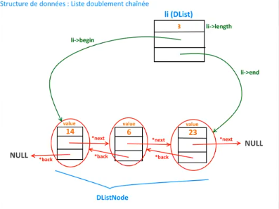

Alors on va avoir de base ce que vous connaissez d'habitude en général les fameuses petites cellules donc les nodes, les maillons, vous pouvez appeler ça comme vous voulez, qui vont avoir une valeur et à la base on avait souvent un pointeur next qui permettait d'aller sur l'élément suivant.

On avait un pointeur next pour les piles, on avait ça pour les files et on a vu ça pour les listes simple.

Là vous voyez qu'on va introduire un autre pointeur qui sera donc un pointeur back donc l'inverse qui va permettre d'aller sur l'élément précédent.

L'avantage de pouvoir aller dans les deux sens, c'est qu'on pourra parcourir la liste du début à la fin et de la fin vers le début.

Autre chose également que nous allons inclure et ne vous inquiétez pas tout ça on va le voir évidemment au niveau du code quand on va implémenter la structure, on va avoir vraiment notre liste qui va se trouver ici.

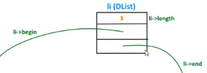

Notre liste va être une autre structure donc c'est histoire de varier encore une fois un petit peu, pour les piles, pour les listes simples on utilisait une autre structure toute bête et on travaillait comme ça en faisant des parcours pour calculer des longueurs ce genre de choses.

Au niveau des files, rappelez-vous on avait utilisé des variables statiques pour la longueur et notamment pour accéder au début et à la fin de la file pour que ça aille beaucoup plus vite au niveau des traitements et là je vous avais dit d'ailleurs qu'on pourrait également utiliser une seconde structure si on voulait si vous voulez gérer tout ce qui est un peu paramètres de la liste et là ça tombe bien dans cette liste doublement chaînée que nous allons voir, c'est ce que nous allons faire.

Ainsi la liste en elle-même en fait c'est ça, ce sera cet élément DList d'accord que j'ai appelé D simplement pour le fait que c'est doublement chaînée et ça contiendra à la fois la longueur donc la longueur on aura plus besoin de la calculer en faisant un parcours de tous les éléments pour les compter mais elle sera automatiquement mises à jour là-dedans `li->length` et on aura du coup accès rapidement et on aura deux pointeurs.

On aura un pointeur qui va pointer vers le premier élément de la liste doublement chaînée et ce qui fait du coup que depuis le 1e élément, o peut parcourir les suivants ou alors un pointeur qui va sur la fin de la liste et du coup on pourra parcourir de la fin pour revenir jusqu'au début.

Vous voyez un petit peu l'intérêt qu'on va avoir de mettre en place tout ça et on va passer tout de suite au code pour simplement implémenter ce que je vous ai monté sur ce schéma.

Alors j'ai préparé comme pour la vidéo précédente des fichiers de base et c'est toujours la même chose et on ne va pas revenir dessus maintenant et ça va faire gagner quelques minutes au niveau du code.

+ main.c
```c
#include <stdio.h>
#include "dlist.h"

int main(void)
{

    return 0;
}
```
+ dlist.c
```c
#include <stdio.h>
#include <stdlib.h>
#include "dlist.h"

/*-----------------------------------------------------*/
```
+ dlist.h
```h
#ifndef __DLIST__H__
#define __DLIST__H__

    /* Définition d'un booléen */
    typedef enum
    {
        false,
        true
    }Bool;

#endif
```

Alors on va passer tout de suite à ce que nous allons faire justement par rapport à cette liste doublement chaînée.

## Définition

### Un maillon de la DList

Alors déjà on va pouvoir définir une définition de ce qu'on va appeler un maillon en fait.

+ dlist.h
```h
#ifndef __DLIST__H__
#define __DLIST__H__

    /* Définition d'un booléen */
    typedef enum
    {
        false,
        true
    }Bool;

    /* Définition d'un maillon de la DList */

#endif
```

DList pour dire liste doublement chaînée donc on va créer ceci.

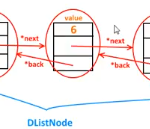

Comment va être implémenté au niveau code cette espèce de cellule donc c'est élément qui va contenir à la fois la valeur et nos deux pointeurs donc tout bêtement on va faire un `typedef struct DListNode` que l'on va appeler DListNode où j'utilise cette fois-ci Node plutôt que Element histoire de changer un petit peu.

```h
typedef struct DListNode
{

}
```

Là exceptionnellement je change de termes car comme on a vraiment deux structures je peux me permettre puisque dans les autres on en avait qu'une seule donc ça permetait de garder un peu le même nom et de ne pas vous embrouiller mais là de toute façon on a deux structures donc tout va changer à ce niveau-là.

Ici du coup très rapidement on va avoir notre petite valeur `int value;`, on va avoir bien évidemment DListNode et le pointeur qui va vers l'élément précédent `struct DListNode *back;` et on va avoir (il ne faut pas que je confonde avec que l'autre structure qu'on va faire après) `struct DListNode *next;` c'est-à-dire next le pointer vers l'élément suivant et cette structure est notre petite DListNode `...}DListNode;` et ici je ne met pas le pointeur, vous allez voir pourquoi puisque c'est vraiment juste pour spécifier, pour définir un maillon de la liste.

+ dlist.h
```h
#ifndef __DLIST__H__
#define __DLIST__H__

    /* Définition d'un booléen */
    typedef enum
    {
        false,
        true
    }Bool;

    /* Définition d'un maillon de la DList */
    typedef struct DListNode
    {
        int value;
        struct DListNode *back;
        struct DListNode *next;
    }DListNode;

#endif
```

Donc très simplement d'accord cette petite structure est définie.

### Une DListe

 maintenant nous allons effectivement pouvoir définir une DList donc notre fameuse liste doublement chaînée.

Ainsi comment va t-elle se constituer ? on va faire un `typedef struct DList`, c'est pour ça voilà ça que je n'ai pas utiliser le mot DListElement sinon on serait un petit peu perdu ici et là on va implémenter cette partie-là.


Cette fameuse petite boîte ici donc on va avoir la longueur `int length;` que l'on stockera dans une variable toute simple.

On aura pour le coup une DListNode qui va pointer donc vers le premier élément de cette  liste et un Node qui va pointer vers le dernier. Et comme on masque les pointeurs pour une utilisation plus simple au niveau du code, c'est un pointeur vers une liste de non-chaînées et voilà comment on définit du coup notre fameuse Dliste.

+ dlist.h
```h
#ifndef __DLIST__H__
#define __DLIST__H__

    /* Définition d'un booléen */
    typedef enum
    {
        false,
        true
    }Bool;

    /* Définition d'un maillon de la DList */
    typedef struct DListNode
    {
        int value;
        struct DListNode *back;
        struct DListNode *next;
    }DListNode;

    /* Définition d'une DListe */
    typedef struct DList
    {
        int length;
        struct DListNode *begin;
        struct DListNode *end;
    }*DList;

#endif
``` 

## Prototypes

Maintenant on va pouvoir entamer cette fois-ci nos prototypes donc normalement il n'y a vraiment rien de compliqué entre le fait que je vous ai tout expliqué et qu'il y a un schéma qui sera d'ailleurs disponible encore une fois avec le code source dans la description de la vidéo en téléchargement et donc vous aurez tous les détails de ce petit schéma que vous pourrez garder comme ça pour vous, comprendre et vous vous aider à mieux assimiler les différentes notions qu'on voit ici.


Voyez que c'est simple je veux dire que ça rejoint tout à fait le schéma on comprend rapidement.

Ici on a un node.


D'ailleurs je vous l'ai mis ici au niveau de la légende.

Et la liste c'est ça.


Alors ça pourrait être bizarre parce qu'on pourrait dire que la liste en fait c'est ce truc là *DListNode* mais n'oubliez pas en fait que `li->begin` n'est pas en fait seulement un pointer vers le premier élément comme s'il était tout seul, isolé puisqu'à partir du moment où vous avez le premier élément en fait vous avez tout.

C'est comme si vous attaché une corde en fait sur le premier élément mais comme le premier est attaché au deuxième, au troisième, etc, vous avez du coup toute la liste mais par le début et inversement pour `li->end`.

J'ai employé ces termes-là `li->begin` et `li->end` parce que c'est les noms qu'on utilisera bien évidemment par la fin de la liste voilà donc on va implémenter tout ça et de toute manière on reviendra sur le schéma assez souvent pour que vous puissiez comprendre.

Voilà alors on va commencer notre implémentation maintenant qu'on a défini un petit peu notre petite structure on va pouvoir commencer les fonctions et on va faire d'abord les fonctions les plus rapides celles qui vont aller très très vite, que vous connaissez pour la plupart et d'autres qui sont un peu nouvelles qui vont aller encore encore une fois relativement vite puisqu'on a déjà tout grâce à cela et on va vraiment gagner beaucoup de temps.

### new_dlist

Alors la première très simple encore comment on fait la fameuse fonction pour créer une nouvelle structure qui retourne vide et nous on va faire return de NULL.

+ dlist.h
```h
#ifndef __DLIST__H__
#define __DLIST__H__

    /* Définition d'un booléen */
    typedef enum
    {
        false,
        true
    }Bool;

    /* Définition d'un maillon de la DList */
    typedef struct DListNode
    {
        int value;
        struct DListNode *back;
        struct DListNode *next;
    }DListNode;

    /* Définition d'une DListe */
    typedef struct DList
    {
        int length;
        struct DListNode *begin;
        struct DListNode *end;
    }*DList;

    /* Prototypes */
    DList new_dlist(void);

#endif
``` 
+ dlist.c
```c
#include <stdio.h>
#include <stdlib.h>
#include "dlist.h"

DList new_dlist(void)
{
    return NULL;
}
/*-----------------------------------------------------*/
```

Voilà new_dlist() retourne null, et du coup vous avez comme ça le retour ici on va créer donc une espèce de liste doublement chaînée évident alors encore une fois le code qui est disponible dans la description de la vidéo est commenté avec tous les commentaires qui sont mis pour chacunes des fonctions, pour vraiment savoir à quoi elles servent exactement comme je fait d'habitude donc ici je ne m'amuse pas à commenter pour gagner du temps aussi mais le code que vous allez récupérer c'est le même que dans la vidéo mais avec les commentaires en plus.

### is_empty_dlist

Alors ça c'est bon très simple on va passer à la deuxième fonction toujours pareil, la fameuse fonction qui vérifie si la structure est vide qu'on appelle is_empty_dlist().

On l'appelle is_empty_dlist avec un d, on a bien compris que c'était la liste donc qu'elle soit double ou simple peu importe ici c'est qu'on travaille sur des doubles fin doublement chaînée et ici même vérification qu'avant je vais très vite puisqu'on a toujours fait comme ça càd que si la liste est nulle on retourne vrai et dans tous les cas si on continue cette fonction, on va retourner faux.

+ dlist.h
```h
#ifndef __DLIST__H__
#define __DLIST__H__

    /* Définition d'un booléen */
    typedef enum
    {
        false,
        true
    }Bool;

    /* Définition d'un maillon de la DList */
    typedef struct DListNode
    {
        int value;
        struct DListNode *back;
        struct DListNode *next;
    }DListNode;

    /* Définition d'une DListe */
    typedef struct DList
    {
        int length;
        struct DListNode *begin;
        struct DListNode *end;
    }*DList;

    /* Prototypes */
    DList new_dlist(void);
    Bool is_empty_dlist(DList li);

#endif
``` 
+ dlist.c
```c
#include <stdio.h>
#include <stdlib.h>
#include "dlist.h"

DList new_dlist(void)
{
    return NULL;
}
/*-----------------------------------------------------*/
Bool is_empty_dlist(DList li)
{
    if(li == NULL)
        return true;
    
    return false;
}
```

Voilà donc je vais vraiment très vite et vous pouvez mettre sur pause si besoin mais c'est les mêmes fonctions qu'on a pu le faire sur toutes les structures donc je ne perds pas
de temps là-dessus.

### dlist_length

Ensuite on va avoir et là ça va aller très vite c'est-à-dire comment récupérer notre fameuse longueur d'accord donc on va faire `int dlist_length(DList li);` qu'on appele *length* pour rester dans les termes de d'habitude. On va toujours utiliser le mot *length*.

+ dlist.h
```h
#ifndef __DLIST__H__
#define __DLIST__H__

    /* Définition d'un booléen */
    typedef enum
    {
        false,
        true
    }Bool;

    /* Définition d'un maillon de la DList */
    typedef struct DListNode
    {
        int value;
        struct DListNode *back;
        struct DListNode *next;
    }DListNode;

    /* Définition d'une DListe */
    typedef struct DList
    {
        int length;
        struct DListNode *begin;
        struct DListNode *end;
    }*DList;

    /* Prototypes */
    DList new_dlist(void);
    Bool is_empty_dlist(DList li);
    int dlist_length(DList li);

#endif
``` 

Voilà et là c'est pareil petite particularité bien évidemment si votre liste est vide, vous retournez 0. On pourrait retourner même l'élément puisque par défaut on aurait automatiquement 0 mais autant le retourner nous-même pour être sûr pour qu'à la relecture du code par exemple vous regardiez votre code deux trois mois plus tard que ce soit compréhensible plutôt que vous plutôt demander à quoi ça correspond.

Ainsi donc tout simplement, on utilise ce qu'on vient d'implémenter `int dlist_length(DList li);` donc si ma liste est vide, je return 0 sinon dans tous les cas j'ai juste à retourner `li->length;` et je vous rappelle que `li` c'est ça.


+ dlist.c
```c
#include <stdio.h>
#include <stdlib.h>
#include "dlist.h"

DList new_dlist(void)
{
    return NULL;
}
/*-----------------------------------------------------*/
Bool is_empty_dlist(DList li)
{
    if(li == NULL)
        return true;
    
    return false;
}
/*-----------------------------------------------------*/
int dlist_length(DList li)
{
    if(is_empty_dlist(li))
        return 0;
    
    return li->length;
}
```

Voyez grâce au paramètre qu'on a mis, en une seule petite ligne on retourne la longueur donc pas besoin voilà de calculer puisque ça va être qu'un ajouté en temps réel au niveau des autres fonctions qu'on veut implémenter donc on gagne vraiment un temps fou.

Voilà dlist_length() pour le nom de la longueur donc le nombre d'éléments je rappelle au niveau de la structure.

Alors pour le moment est-ce qu'on peut tester quelque chose ? oui ça peut toujours être intéressant donc on va créer des mylist `DList mylist = new_dlist();` et ensuite on teste si DList est vide.

```c
DList mylist = new_dlist();

if(is_empty_dlist(mylist))
    printf("Elle est vide.\n");
else
    printf("Elle contient des elements.\n");
//etc.
```

Petite vérification sinon elle contient des éléments, simplement s'assurer un petit peu que notre code fonctionne et après tu donne la *Taille de la DListe : %d\n* de la fonction dlist_length(mylist).

+ main.c
```c
#include <stdio.h>
#include "dlist.h"

int main(void)
{
    DList mylist = new_dlist();

    if(is_empty_dlist(mylist))
        printf("Elle est vide.\n");
    else
        printf("Elle contient des elements.\n");
    
    printf("Taille de la DListe : %d\n", dlist_length(mylist));

    return 0;
}
```
```powershell
gcc *c -o prog
.\prog.exe
Elle est vide.
Taille de la DListe : 0
```

Ok elle est bien vide et la taille du coup est de zéro puisque on n'a aucun élément, très bien on va partir sur une base correcte.

On passe à la suite, on a deux fonctions qui peuvent être intéressantes pourquoi parce qu'elles sont très rapides à faire, une qui permettra de récupérer la valeur du premier élément de la liste et l'autre qui permettra de récupérer la valeur du dernier du fait qu'ont a deux pointeurs dessus, ce serrais dommage de s'en priver.


### dlist_first

```c
int dlist_first(DList li);
```

Du coup je vais faire un dlist_first() pour le premier élément donc ici si évidemment ma liste est vide d'accord vous n'allez pas retourner quelque chose ça paraît logique donc moi je ne vais pas m'embêter à afficher un message d'erreur ou autre ici pour l'exemple je vais juste faire un `exit(1)`. Voilà on pourrait s'amuser à faire une erreur ou retourner autre chose mais là pour simplifier encore une fois le code on va juste faire un `exit(1);` et sinon qu'est-ce qu'on peut faire ? du coup on fait simplement un `return li->begin->value;` voilà (*càd d'une structure vers une autre structure*).

```c
int dlist_first(DList li)
{
    if(is_empty_dlist(li))
        exit(1);
    
    return li->begin->value;
}
```

## dlist_last

```c
int dlist_last(DList li);
```

On peut copier-coller la même chose pour dlist_last() puisque vous allez voir que c'est la même mais ici pour last sauf qu'au lieu d'être begin c'est end.

```c
/*-----------------------------------------------------*/
int dlist_first(DList li)
{
    if(is_empty_dlist(li))
        exit(1);
    
    return li->begin->value;
}
/*-----------------------------------------------------*/
int dlist_last(DList li)
{
    if(is_empty_dlist(li))
        exit(1);
    
    return li->end->value;
}
```

c'est exactement pareil donc on a celle qui retourne le premier élément et celle qui retourne le dernier élément de la liste très rapidement.

Voyez ça va vraiment très vite soit en une seule ligne en réalité puisque une partie est juste une vérification, vous pouvez avoir fait votre fonction donc ça va très vite.

Voilà et écoutez je pense qu'on a finit avec les fonctions rapides, et si on regarde sur le schéma voilà on a tout ce qu'il faut.

Ok donc maintenant à va pouvoir passer aux choses sérieuses, on va pouvoir passer comme d'habitude faire **l'insertion et la suppression d'éléments** et comme pour les listes de la précédente vidéo nous allons faire une insertion en début de liste et une insertion en fin de liste et une suppression d'éléments du début de la liste ou de la fin de la liste donc les deux et on va avoir une petite fonction bonus comme j'aime l'appeler qui permet de nettoyer toute la structure pour récupérer une structure vide.

### push_back_dlist

```h
DList push_back_dlist(DList li, int x);
```

voilà alors c'est parti, on va du coup l'appeler push_back_dlist et on va commencer par insertion en fin.

Comment nous allons procéder sur cette partie-là ?

```c
DList push_back_dlist(DList li, int x)
{

}
```

Je vous rappelle que le but c'est de créer notre petit maillon, c'est à dire de créer cette petite chose-là.

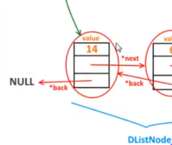

Donc on a.. et là encore je vais très vite parce qu'encore une fois c'est des choses comme on fait tout le temps, à chaque fois alors c'est vraiment limite j'aurais pu en copier-coller de l'autre coté.

```c
DList push_back_dlist(DList li, int x)
{
    DListNode *element;

    element = malloc(sizeof(*element));

    if(element == NULL)
    {
        fprintf(stderr, "Erreur : problème allocation dynamique.\n");
        exit(EXIT_FAILURE);
    }
}
```

fprintf(), sortie d'erreur standard en petit rappel et un petit exit(EXIT_FAILURE) car il ne faut surtout pas continuer un programme si une allocation dynamique n'a pas fonctionné.

Donc ça on aura sûrement besoin de le copier-coller dans d'autres cas puisqu'on va  réutiliser en peu la même syntaxe.

Voilà donc à partir de ce moment là nous avons alloué l'espace nécessaire pour ceci, pour un DListNode.


Ainsi qu'est-ce qu'on va faire en premier lieu ? on va le remplir, on va remplir le DListNode d'accord au niveau de sa valeur, on va y mettre le fameux x qu'on a récupéré en paramètre de la fonction, `element->value = x;`.

Ensuite pour le moment il n'y a rien qui le suit `element->next = NULL;` et il n'a rien qui le précède `element->back = NULL;`.

```c
DList push_back_dlist(DList li, int x)
{
    DListNode *element;

    element = malloc(sizeof(*element));

    if(element == NULL)
    {
        fprintf(stderr, "Erreur : problème allocation dynamique.\n");
        exit(EXIT_FAILURE);
    }

    element->value = x;
    element->next = NULL;
    element->back = NULL;
}
```

Alors je ne suis pas obligé de le faire tout de suite mais je préfère le faire parce que c'est plus logique et plus lisible quand on relit son code, en voyant ça on voit qu'on a créé l'élément de base sans rien, sans aucune liaison parce qu'on voit qu'il n'a rien avant et rien après et qu'on a simplement mis sa valeur et à partir de là du qu'on va pouvoir procéder suivant deux scénarios soit la liste est vide et on va faire certain nombre de choses comme vous avez coutume de le voir dans les précédentes de structure, soit elle n'est pas vide et dans ce cas là on fera autre chose.

Du coup si notre liste est vide `if(is_empty_dlist(li)){}` d'accord qu'est ce que nous allons faire ? nous allons initialiser cette structure parce que je vous rappelle maintenant on a deux structures d'accord donc là c'est bien on a ça.

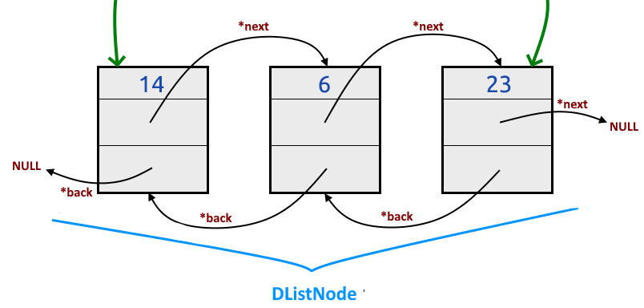

... mais on n'a pas créé en fait cette structure-là.

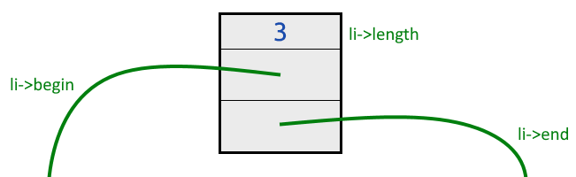

Comme on a quelque chose de vide, il va falloir la créée donc c'est parti, un malloc() et ne pas oublier l'étoile-ici `*li` parcequ'encore une fois, il faut déréférences le pointeur quand on indique ici la taille pour que le sizeof() prenne bien en compte la taille de `li`, `li = malloc(sizeof(*li));` et il ira chercher automatiquement en voyant que ça correspond à DList il se référera à la définition qu'on a là.

```c
/* Définition d'une DListe */
typedef struct DList
{
    int length;
    struct DListNode *begin;
    struct DListNode *end;
}*DList;
```
```c
//etc.
if(is_empty_dlist(li))
{
    li = malloc(sizeof(*li));

    if(li == NULL)
    {
        fprintf(stderr, "Erreur : problème allocation dynamique.\n");
        exit(EXIT_FAILURE);
    }
}
```

Il se réferera à la définition qu'on a là et il réservera la taille en mémoire nécessaire sans que vous ayez besoin de vous soucier de la taille qu'il faut.

Voilà même choses comme d'habitude `if(li == NULL){}` voilà parce qu'il faut évidemment toujours vérifier.

```c
DList push_back_dlist(DList li, int x)
{
    DListNode *element;

    element = malloc(sizeof(*element));

    if(element == NULL)
    {
        fprintf(stderr, "Erreur : problème allocation dynamique.\n");
        exit(EXIT_FAILURE);
    }

    element->value = x;
    element->next = NULL;
    element->back = NULL;

    if(is_empty_dlist(li))
    {
        li = malloc(sizeof(*li));

        if(li == NULL)
        {
            fprintf(stderr, "Erreur : problème allocation dynamique.\n");
            exit(EXIT_FAILURE);
        }
    }
}
```

A partir de là maintenant que j'ai créé donc vraiment la liste au complet que j'ai tout allouer, je peux remplir tous les champs adéquats.

De base on est d'accord que la taille par défaut de la liste est 0, par défaut sa taille est 0, `li->length = 0;`.

```c
//etc.
if(li == NULL)
{
    fprintf(stderr, "Erreur : problème allocation dynamique.\n");
    exit(EXIT_FAILURE);

    li->length = 0;
}
```

A ce moment là comme il n'y a qu'un seul élément je vous rappelle que la liste est vide, on est dans le if() du coup ça veut dire que le premier élément de la liste `li->begin = element;` ce sera le nouvel élément qu'on a créé plus haut, celui là `DListNode *element;` mais comme il est tout seul ce serra également le dernier élément `li->end = element;` parfaitement logique.

```c
DList push_back_dlist(DList li, int x)
{
    DListNode *element;

    element = malloc(sizeof(*element));

    if(element == NULL)
    {
        fprintf(stderr, "Erreur : problème allocation dynamique.\n");
        exit(EXIT_FAILURE);
    }

    element->value = x;
    element->next = NULL;
    element->back = NULL;

    if(is_empty_dlist(li))
    {
        li = malloc(sizeof(*li));

        if(li == NULL)
        {
            fprintf(stderr, "Erreur : problème allocation dynamique.\n");
            exit(EXIT_FAILURE);
        }

        li->length = 0;
        li->begin = element;
        li->end = element;
    }
}
```

Ici nous avons tout ce qu'il fallait dans le cas où la liste est vide donc si elle n'est pas vide, on va faire un else() et qu'est-ce que nous allons faire ? hé bien rappelez-vous  nous allons l'ajouter en fin rappelez-vous le nom de la fonction *push_back* donc on va dire qu'on va l'ajouter ici à la suite.

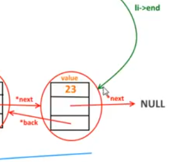

Hé bien on va dire qu'on va l'ajouter ici à la suite que `li->end` et je me retrouve du coup à cet élément (value=23), flèche next au lieu que ce soit NULL ça va devenir le nouvel élément donc `li->end->next = element;` ce qui tombe bien parce qu'on l'a ajouté à la suite donc ça c'est bon l'ancienne fin de la liste est relié au nouvel élément.

```c
else{ li->end->next = element; }
```

```c
DList push_back_dlist(DList li, int x)
{
    DListNode *element;

    element = malloc(sizeof(*element));

    if(element == NULL)
    {
        fprintf(stderr, "Erreur : problème allocation dynamique.\n");
        exit(EXIT_FAILURE);
    }

    element->value = x;
    element->next = NULL;
    element->back = NULL;

    if(is_empty_dlist(li))
    {
        li = malloc(sizeof(*li));

        if(li == NULL)
        {
            fprintf(stderr, "Erreur : problème allocation dynamique.\n");
            exit(EXIT_FAILURE);
        }

        li->length = 0;
        li->begin = element;
        li->end = element;
    }
    else
    {
        li->end->next = element;
        element->back = li->end;
        li->end = element;
    }

    li->length++;

    return li;
}
```

Par contre il faut montrer aussi que le pointeur back du nouvel élément qui je rappel est à NULL pour le moment doit être relié à ce qui était le dernier élément avant donc pour cela, on va faire `element->back = li->end` ou on dit que *element->back* est ce qui est pour le moment le dernier élément d'accord.

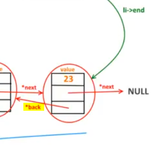

Ensuite au niveau notre paramétrage donc au niveau de la DList, il faut dire que `li->length` ne dois plus pointer du coup sur celui-là (value 23) si admettons que c'était le 23 puisque maintenant il devient l'avant dernier élément donc ça change donc maintenant le dernier élément c'est l'élément qu'on vient de créer `li->end = element;` logique puisqu'on l'ajoute en fin de liste donc c'est lui le dernier. 

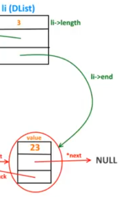

Et voilà tous les cas traités donc au niveau d'une liste qui ne serait pas vide et on n'oublie pas à la fin dans tous les cas que ce soit une liste vide ou non d'incrémenter la longueur de 1 d'accord puisqu'on vient d'ajouter un élément `li->length++;` et on peut retourner notre liste `return li;`.

```c
DList push_back_dlist(DList li, int x)
{
    DListNode *element;

    element = malloc(sizeof(*element));

    if(element == NULL)
    {
        fprintf(stderr, "Erreur : problème allocation dynamique.\n");
        exit(EXIT_FAILURE);
    }

    element->value = x;
    element->next = NULL;
    element->back = NULL;

    if(is_empty_dlist(li))
    {
        li = malloc(sizeof(*li));

        if(li == NULL)
        {
            fprintf(stderr, "Erreur : problème allocation dynamique.\n");
            exit(EXIT_FAILURE);
        }

        li->length = 0;
        li->begin = element;
        li->end = element;
    }
    else
    {
        li->end->next = element;
        element->back = li->end;
        li->end = element;
    }

    li->length++;

    return li;
}
```

Voilà le code est un peu complexe au début par rapport aux autres il y a un peu plus de choses puisque vous voyez qu'on a une deuxième structure ici qu'on doit allouer dynamiquement qu'il faudra du coup penser à libérer ce qui paraît logique donc ça fait des petites choses en plus mais ça devrait bien se passer à ce niveau là.

Voilà donc pas mal de choses, ça après vous connaissez le reste après honnêtement à part si vous vous en référez au schéma vous voyez que c'est quand même facile à comprendre, facile à suivre et du coup pour faire la suite ça va être beaucoup plus compréhensible.


On va passer maintenant qu'on a cet exemple-là ça va aller très très vite, on va faire la même chose pour le début.

### push_front_dlist

Alors là c'est pas qu'il n'y aura pas vraiment une différence au niveau de la longueur ou performance au niveau des deux fonctions par rapport aux listes simples comme on l'a vu dans la séance présente puisque là je vous rappelle qu'on a un pointeur qui va soit au début soit la fin donc dans l'un ou l'autre des cas on aura en fait la même chose avec quelques petits changements donc ici vous allez voir je veux juste faire ça, ça va vraiment aller très très vite au niveau de cette fonction, `push_front_dlist()`.

```h
DList push_front_dlist(DList li, int x);
```

Alors pour `DList push_front_dlist(DList li, int x);` je vais reprendre tout le code de *push_back_dlist()* d'accord puisque si vous voyez comment ça fonctionne doublement chainée vous voyez que ça peut fonctionner à l'endroit et à l'envers donc ça va être exactement la même chose à part que nous allons modifier quelques éléments donc tout ça on va re vérifier parce qu'on ne va pas s'amuser à faire un copier coller comme ça tout bête sans regarder au cas où. C'est bien de vérifier au cas où...

```c
DList push_back_dlist(DList li, int x)
{
//etc.
    else
    {
        li->end->next = element;
        element->back = li->end;
        li->end = element;
    }
//etc.
}
```

Ainsi donc je vérifie que j'ai bien allouer mon élément `DListNode *element;`. Ainsi je vérifie si la liste est vide `if(is_empty_dlist(li)){..}` qu'est ce que je fais ? j'alloue effectivement le DList `li = malloc(sizeof(*li));` et cetera c'est pas un problème.

Par contre cette partie-là va changer parce que là je vous rappelle qu'on n'ajoute pas en fin, on ajoute en début donc le `li->end` là n'a plus lieu d'être.

```c
//etc..
else
{
    li->end->next = element;
    element->back = li->end;
    li->end = element;
}
```
Alors ce qui va changer c'est ça `li->end->next = element;` c'est ce qui viens par rapport à l'élément de début et ce qui vient avant lui `li->begin->back = element;` c'est-à-dire que l'élément va venir avant le premier élément d'accord le reste on n'y touche pas.

Ensuite ici est-ce que c'est l'élément `element->back` ? non, puisque l'élément ici va se retrouver le 1er donc c'est flèche next `element->next` qui va du coup précédé l'élément qui était jusqu'à présent le premier `li->begin`.

Et enfin le premier élément devient ce qu'on vient de créer donc element, `li->begin = element;`.

```c
//etc..
else
{
    li->begin->back = element;
    element->next = li->begin;
    li->begin = element;
}
```

On fait toujours l'incrémentation, on retourne la liste et vous avez terminé votre fonction d'ajout en tête de liste donc vraiment très rapide voyez trois lignes à changer et vous avez exactement la même chose pourtant il y a pas mal de code quand même.

```c
DList push_front_dlist(DList li, int x)
{
    DListNode *element;

    element = malloc(sizeof(*element));

    if(element == NULL)
    {
        fprintf(stderr, "Erreur : problème allocation dynamique.\n");
        exit(EXIT_FAILURE);
    }

    element->value = x;
    element->next = NULL;
    element->back = NULL;

    if(is_empty_dlist(li))
    {
        li = malloc(sizeof(*li));

        if(li == NULL)
        {
            fprintf(stderr, "Erreur : problème allocation dynamique.\n");
            exit(EXIT_FAILURE);
        }

        li->length = 0;
        li->begin = element;
        li->end = element;
    }
    else
    {
        li->begin->back = element;
        element->next = li->begin;
        li->begin = element;
    }

    li->length++;

    return li;
}
```

Voilà pour l'ajout et avant de faire les tests encore une fois pour éviter les fuites de mémoire, nous allons créer les fonctions qui permettent de retirer.

Vous allez voir que ça ne va pas être plus compliqué que ça non plus donc on va faire pop_back_dlist().

### pop_back_dlist

```h
DList pop_back_dlist(DList li);
```

```c
DList pop_back_dlist(DList li)
{

}

DList pop_front_dlist(DList li)
{

}
```

Voilà on va faire un copier coller sur les deux on va avoir vraiment les mêmes choses.

Alors au niveau de la suppression d'éléments depuis la fin d'accord donc là il va falloir bien réfléchir aussi parce qu'encore une fois la libération de mémoire c'est super important donc il ne faut pas se tromper et va falloir libérer tout ce qu'il faut d'accord ça faut vraiment y songez donc ici on va commencer donc par pop_back_dlist() tout simplement et premières vérifications si encore une fois si la liste est vide, on ne va pas chercher à retirer un élément d'une liste vide.

Donc c'est la première vérification à faire si la liste est vide, on affiche simplement un message *Rien a supprimer, la DListe est deja vide.* et au lieu de faire simplement un return de *li* encore une fois pour utiliser les fonctions qu'on a fait, je préfère retourner new_dlist() qui fait que quand je relirai plus tard ma fonction en voyant cette ligne-là je comprendrais que je retourne bien quelque chose de vide puisque je sais que ma fonction-là retourne bien quelque chose de vide.

```c
DList pop_back_dlist(DList li)
{
    if(is_empty_dlist(li))
    {
        printf("Rien a supprimer, la DListe est deja vide.\n");
        return new_dlist();
    }
}

DList pop_front_dlist(DList li)
{

}
```

La fonction retournera quelque chose de vide, ce sera beaucoup plus lisible que de faire par exemple ceci `return li;` ou là du coup on pourrait se demander si *li* est vide ou pas etc c'est moins forcément lisible au niveau compréhension.

`return li;` ou `return new_dlist();`, les deux syntaxes sont bonnes mais en faisant comme ça déjà vous utilisez une fonction que vous avez faites donc moi ça a son intérêt et en plus de ça c'est beaucoup plus lisible quand vous relirez plus tard votre code surtout après quelques mois, quelques années donc ça c'est bon pour cette partie-là.

Autre cas et ça on l'avait vu d'ailleurs précédemment si il n'y a qu'un seul élément dans la liste, comment le vérifier ? on l'a vu tout à l'heure ici quand il avait qu'un seul élément `li->begin = element;` (push_back_dlist) avec `li->begin` c'est l'élément et en regardant `li->end = element;` avec `li->end` qui est aussi l'élément donc si le pointeur begin pointe sur la même chose que end et pour vérifier ça on fait simplement un `if(li->begin == li->end){}`.

```c
DList pop_back_dlist(DList li)
{
    if(is_empty_dlist(li))
    {
        printf("Rien a supprimer, la DListe est deja vide.\n");
        return new_dlist();
    }

    if(li->begin == li->end)
    {

    }    
}

DList pop_front_dlist(DList li)
{

}
```

Alors attention petite précision quand je fais cette vérification, ça ne veut pas dire que je vérifie la valeur de begin et de end d'accord je ne demande pas à voir si la valeur d'accord du premier élément par exemple ici le 14 est égal au 23 en fin encore une n'oubliez pas que ce sont des pointeurs, ici je ne vise pas les entiers.

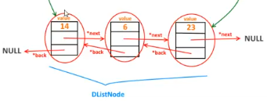

Je ne regarde pas les value mais je regarde directement les adresses des pointeurs, c'est pour dire est-ce que l'adresse de `li->begin` est la même que `li->end` donc ça pointe en fait vers la même chose, c'est surtout l'adresse de la variable qui est pointé, qui nous intéresse.

Si c'est ça ça veut dire qu'on a qu'un seul élément dans cette liste du coup évidemment la suppression sera très rapide puisqu'il y a simplement qu'à faire un `free(li)` et comme pour la vidéo précédente où on rajoute cette petite chose en plus `li = NULL;` notre petite astuce puis on retourne notre fameuse nouvelle liste `new_dlist();`.

```c
DList pop_back_dlist(DList li)
{
    if(is_empty_dlist(li))
    {
        printf("Rien a supprimer, la DListe est deja vide.\n");
        return new_dlist();
    }

    if(li->begin == li->end)
    {
        free(li);
        li = NULL;

        return new_dlist();
    }    
}

DList pop_front_dlist(DList li)
{

}
```

Voilà tout simplement et sinon écouter si on a ni fait le 1e return, ni fait le 2e return, on continue le code et on va donc créer un élément temporaire `DListNode *temp = li->end;` qui va servir à sauvegarder le `li->end` donc le dernier élément parce que je vous rappel qu'on va enlever par la fin de la liste et à partir de là on va pouvoir procéder à toutes nos modifications.

```c
DList pop_back_dlist(DList li)
{
    if(is_empty_dlist(li))
    {
        printf("Rien a supprimer, la DListe est deja vide.\n");
        return new_dlist();
    }

    if(li->begin == li->end)
    {
        free(li);
        li = NULL;

        return new_dlist();
    }

    DListNode *temp = li->end;
}

DList pop_front_dlist(DList li)
{

}
```

On procède à nos modification et maintenant `li->end` devient `li->end->back` donc on a déplacé en fait le pointeur `li->end`, `li->end = li->end->back;`.

```c
DList pop_back_dlist(DList li)
{
    if(is_empty_dlist(li))
    {
        printf("Rien a supprimer, la DListe est deja vide.\n");
        return new_dlist();
    }

    if(li->begin == li->end)
    {
        free(li);
        li = NULL;

        return new_dlist();
    }

    DListNode *temp = li->end;

    li->end = li->end->back;
}

DList pop_front_dlist(DList li)
{

}
```

Alors donc ici `li->end = li->end->back;` ne pointe plus sur le dernier élément mais ne vous inquiétez pas car on la sauvegardé dans cette variable, dans ce pointeur-là `DListNode *temp = li->end;`. C'est pour ça qu'on utilise ce pointeur `*temp`.

A partir de là, après on a `li->end->next = NULL;` d'accord c'est le nouvel élément, n'oubliez pas cet élément là il faut qu'il pointe vers Null parce qu'il ne doit plus être relié vers le élément qu'on va supprimer d'accord.


```c
DList pop_back_dlist(DList li)
{
    if(is_empty_dlist(li))
    {
        printf("Rien a supprimer, la DListe est deja vide.\n");
        return new_dlist();
    }

    if(li->begin == li->end)
    {
        free(li);
        li = NULL;

        return new_dlist();
    }

    DListNode *temp = li->end;

    li->end = li->end->back;
    li->end->next = NULL;
}

DList pop_front_dlist(DList li)
{

}
```

`li->end->next = NULL;` pour couper ce lien-là, imaginez qu'en fait si je veux enlever le 23 qu'est-ce qui se passerait ? eh bien on dit déjà que ici la flèche verte `li->end` pointe dorénavant vers le 6 donc vers cette DListNode là plus exactement.


Ensuite on dit que le flèche next du (6), on le rompt, on le casse et du coup il n'est plus lié à cet élément-là (23) mais ensuite il va falloir au niveau de la variable temporaire fléche next qu'elle soit égale à nulle `temp->next = NULL;` c'est à dire là par exemple pour ce node (23) là que la flèche next soit égale à NULL éffectivement.


Alors vous allez me dire il est déjà nul puisque c'est le dernier élément mais ici on est  vraiment sûr voilà qu'on fait les choses proprement.

Et ensuite le back c'est pareil, `temp->back = NULL;` voilà.

```c
DList pop_back_dlist(DList li)
{
    if(is_empty_dlist(li))
    {
        printf("Rien a supprimer, la DListe est deja vide.\n");
        return new_dlist();
    }

    if(li->begin == li->end)
    {
        free(li);
        li = NULL;

        return new_dlist();
    }

    DListNode *temp = li->end;

    li->end = li->end->back;
    li->end->next = NULL;
    temp->next = NULL;
    temp->back = NULL;

    free(temp);
    temp = NULL;

    li->length--;

    return li;
}

DList pop_front_dlist(DList li)
{

}
```

Ensuite le back pareil voilà où en fait le pointeur qui serait là par exemple pareil on l'enlève.


Du coup une fois qu'on a fait tout ça on n'a plus qu'à supprimer cet élément `free(temp);`, faire de coup ceci `temp = NULL;`

Enfin on fait un `li->length--;` c'est-à-dire qu'on décrémente de 1 parce qu'on a retiré un élément et ensuite bien évidemment ou retourne la liste `li` avec l'élément en moins voilà.

Pareil pas mal de petits codes mais si on y va tranquillement avec le schéma vous voyez que ça suit sans problème.

Au niveau de cette fonction pop_back_dlist() on respecte vraiment tout ce qu'on voulait faire au niveau de tous les pointer, au niveau des parcours qu'on peut faire puisqu'on peut accéder depuis le début ou la fin de la liste donc c'est vraiment beaucoup plus pratique et d'ailleurs pour la suivante donc pour la pop_front_dlist(), on va pouvoir donc faire l'autre fonction qui va être un copier-coller en fait avec quelques changements. Voilà ça va vraiment aller très vite.

### pop_front_dlist

On copie-colle tout pop_back_dlist() dans pop_front_dlist() comme ça on reprend vraiment la même chose.

```c
DList pop_front_dlist(DList li)
{
    if(is_empty_dlist(li))
    {
        printf("Rien a supprimer, la DListe est deja vide.\n");
        return new_dlist();
    }

    if(li->begin == li->end)
    {
        free(li);
        li = NULL;

        return new_dlist();
    }

    //DListNode *temp = li->end;

    //li->end = li->end->back;
    //li->end->next = NULL;
    temp->next = NULL;
    temp->back = NULL;

    free(temp);
    temp = NULL;

    li->length--;

    return li;
}
```

Par contre toute cette partie-là va changer enfin surtout cette partie-là.

```c
DListNode *temp = li->end;

li->end = li->end->back;
li->end->next = NULL;
```

Alors là ce n'est plus sur `li->end` mais ça va être `li->begin` parce que je vous rappelle qu'on retire l'élément du début d'accord donc on sauvegarde le premier élément, celui qu'on va supprimer justement parce que c'est lui qu'on a besoin de garder ici de côté.

```c
DListNode *temp = li->begin;

```

Du coup ici ce n'est plus `li->end = li->end->back;` mais `li->begin = li->begin->next;`. Voyez on inverse en fait les choses.

```c
DListNode *temp = li->begin;

li->begin = li->begin->next;
```

ici ce n'est plus `li->end->next = NULL;` mais c'est `li->begin->back = NULL;`.

```c
DListNode *temp = li->begin;

li->begin = li->begin->next;
li->begin->back = NULL;
```

Alors je récapitule un petit peu parce que ça fait beaucoup de flèches, de machin donc on a sauvegardé l'élément du début admettons par exemple celui avec le (14).


Ensuite on dit maintenant que le premier élément ça va être celui qui vient après donc ça va être le second actuellement (6) donc imaginez que la flèche verte vient se positionner d'accord.

Du coup sur ce nouvel élément (6) maintenant qui est admis comme premier, on va casser ici son pointeur back qui va pointer vers NULL comme le ferait un premier élément.

A partir de là, cette élément (14) qui est tout seul donc qui est temp maintenant je vous rappelle on lui dit donc que son pointer next et son pointeur back est égal à NULL donc rien du tout, rien du tout.

```c
DListNode *temp = li->begin;

li->begin = li->begin->next;
li->begin->back = NULL;
temp->next = NULL;
temp->back = NULL;
```

Bon on se retrouve du coup à partir du là, on fait une petite libération de l'élément qu'on a alloué dynamiquement, `free(temp);`. On met égal à NULL pour être sûr `temp = NULL;`, on décrémente de 1 puisqu'on vient de retirer un élément de la liste et on la retourne.

```c
DList pop_front_dlist(DList li)
{
    if(is_empty_dlist(li))
    {
        printf("Rien a supprimer, la DListe est deja vide.\n");
        return new_dlist();
    }

    if(li->begin == li->end)
    {
        free(li);
        li = NULL;

        return new_dlist();
    }

    DListNode *temp = li->begin;

    li->begin = li->begin->next;
    li->begin->back = NULL;
    temp->next = NULL;
    temp->back = NULL;

    free(temp);
    temp = NULL;

    li->length--;

    return li;
}
```

Voilà ça respecte parfaitement la même chose, voyez en quelques modifications de ligne donc ici 3, on obtient la même fonction mais en suppression par l'avant de la liste, de l'avant de la liste plutôt que la fin de la liste.

Alors maintenant qu'on a tout ça et on va pouvoir faire notre avant dernière fonction parce qu'on aura la petite fonction bonus mais on va voir notre petite fonction d'affichage parce que voyez qu'on ne l'a pas faite.

### print_dlist

Alors on va la faire maintenant.

```c
void print_dlist(DList li);
```

Alors ce serais bien qu'on teste un peu tout ça parce qu'on a pu l'occasion de les tester.

Àlors au niveau de l'affichage franchement pas de surprise, rien de compliqué c'est comme avant, la même chose, c'est comme si nous voulions ajouter quelque chose sauf que là on va utiliser un élément temporaire en fait pour pouvoir parcourir la liste du début à la fin et afficher du coup chacun des éléments jusqu'à la fin.

Première vérification comme d'habitude, si la liste est vide, on précise qu'il n'y a rien a afficher et donc DList est vide, et on fait un return sans rien derrière parce que je vous rappelle que le type de retour est void ici pour rappel.

```c
void print_dlist(DList li)
{
    if(is_empty_dlist(li))
    {
        printf("Rien a afficher, la DListe est vide.\n");
        return;
    }
}
```

A partir de là maintenant qu'on a fait cette vérification, on peut créer notre petit élément temporaire que nous allons mettre sur la même chose que ce que pointe *li->begin* donc le 1e élément, `DListNode *temp = li->begin;`.

```c
void print_dlist(DList li)
{
    if(is_empty_dlist(li))
    {
        printf("Rien a afficher, la DListe est vide.\n");
        return;
    }

    DListNode *temp = li->begin;
}
```

Ainsi la variable temporaire va être comme un curseur qui va se positionner au premier élément.

A partir de là, on a juste à dire bah tant que cet élément, cet espèce de curseur d'accord `temp->next` flèche next puisque c'est l'élément suivant est différente nul donc tant qu'on n'est pas sorti de la liste eh bien on peut tout bêtement afficher notre élément `temp->value` et on le déplace comme pour les piles, on a toujours fait ça partout partout en faisant `temps = temps->next;` comme on l'aurais fait avant `(li = li->next)`, ensuite pour la pile pareil `(st = st->next)` et cetera, et cetera.

```c
void print_dlist(DList li)
{
    if(is_empty_dlist(li))
    {
        printf("Rien a afficher, la DListe est vide.\n");
        return;
    }

    DListNode *temp = li->begin;

    //while(temp->next != NULL)
    while(temp != NULL) //erreur du cours, pas de flèche next parce qu'à un moment il arrive qu'en décalant le pointeur arrive sur NULL.
    {
        printf("[%d] ", temp->value);
        temp = temp->next;
    }

    printf("\n");
}
```

`temp = temp->next;` voilà c'est toujours un peu la même syntaxe qu'on retrouve, et bien sûr mettre un petit passage à la ligne `printf("\n");` à la fin de l'affichage voilà. Un petit printf() bien qu'on pourrait utiliser une autre fonction mais peu importe.

Voilà un niveau de print_dlist() et là normalement on a tout.

## Compilation et exécution

Ok alors déjà on va faire un test tout bête ici.

On va tester cette fonction `print_dlist(mylist);` voir comment elle se comporte du fait que la liste est vide.

+ dlist.c
```
#include <stdio.h>
#include <stdlib.h>
#include "dlist.h"

DList new_dlist(void)
{
    return NULL;
}

/*-----------------------------------------------------*/

Bool is_empty_dlist(DList li)
{
    if(li == NULL)
        return true;
    
    return false;
}

/*-----------------------------------------------------*/

int dlist_length(DList li)
{
    if(is_empty_dlist(li))
        return 0;
    
    return li->length;
}

/*-----------------------------------------------------*/

int dlist_first(DList li)
{
	if(is_empty_dlist(li))
		exit(1);
	return li->begin->value;
}

int dlist_last(DList li)
{
	if(is_empty_dlist(li))
		exit(1);
	return li->end->value;
}

/*----------------------------------------------------------------*/

void print_dlist(DList li)
{
	if(is_empty_dlist(li))
	{
		printf("Rien a afficher, la DListe est vide.\n");
		return;
	}

	DListNode *temp = li->begin;

	while(temp != NULL)
	{
		printf("[%d] ", temp->value);
		temp = temp->next;
	}
	printf("\n");
}

/*----------------------------------------------------------------*/

DList push_back_dlist(DList li, int x)
{
	DListNode *element;

	element = malloc(sizeof(*element));

	if(element == NULL)
	{
		fprintf(stderr, "Erreur : probleme allocation dynamique.\n");
		exit(EXIT_FAILURE);
	}

	element->value = x;
	element->next = NULL;
	element->back = NULL;

	if(is_empty_dlist(li))
	{
		li = malloc(sizeof(*li));
		if(li == NULL)
		{
			fprintf(stderr, "Erreur : probleme allocation dynamique.\n");
			exit(EXIT_FAILURE);
		}

		li->length = 0;
		li->begin = element;
		li->end = element;
	}
	else
	{
		li->end->next = element;
		element->back = li->end;
		li->end = element;
	}

	li->length++;

	return li;
}

/*-----------------------------------------------------*/

DList push_front_dlist(DList li, int x)
{
	DListNode *element;

	element = malloc(sizeof(*element));

	if(element == NULL)
	{
		fprintf(stderr, "Erreur : probleme allocation dynamique.\n");
		exit(EXIT_FAILURE);
	}

	element->value = x;
	element->next = NULL;
	element->back = NULL;

	if(is_empty_dlist(li))
	{
		li = malloc(sizeof(*li));
		if(li == NULL)
		{
			fprintf(stderr, "Erreur : probleme allocation dynamique.\n");
			exit(EXIT_FAILURE);
		}

		li->length = 0;
		li->begin = element;
		li->end = element;
	}
	else
	{
		li->begin->back = element;
		element->next = li->begin;
		li->begin = element;
	}

	li->length++;

	return li;
}

/*-----------------------------------------------------*/

DList pop_back_dlist(DList li)
{
	if(is_empty_dlist(li)) // Ne pas chercher a supprimer un element d'une liste vide.
	{
		printf("Rien a supprimer, la DListe est deja vide.\n");
		return new_dlist();
	}

	if(li->begin == li->end)
	{
		free(li);
		li = NULL;
		return new_dlist();
	}

	DListNode *temp = li->end;

	li->end = li->end->back;
	li->end->next = NULL;
	temp->next = NULL;
	temp->back = NULL;

	free(temp);
	temp = NULL;

	li->length--;

	return li;
}

/*-----------------------------------------------------*/

DList pop_front_dlist(DList li)
{
	if(is_empty_dlist(li))
	{
		printf("Rien a supprimer, la DListe est deja vide.\n");
		return new_dlist();
	}

	if(li->begin == li->end)
	{
		free(li);
		li = NULL;

		return new_dlist();
	}

	DListNode *temp = li->begin;

	li->begin = li->begin->next;
	li->begin->back = NULL;
	temp->next = NULL;
	temp->back = NULL;

	free(temp);
	temp = NULL;

	li->length--;
	return li;
}

/*-----------------------------------------------------*/

DList clear_dlist(DList li)
{
	while(!is_empty_dlist(li))
		li = pop_back_dlist(li);
	return new_dlist();
}
```
+ dlist.h
```
#ifndef __DLIST__H__
#define __DLIST__H__

    /* Définition d'un booléen */
    typedef enum
    {
        false,
        true
    }Bool;

    /* Définition d'un maillon de la DList */
    typedef struct DListNode
    {
        int value;
        struct DListNode *back;
        struct DListNode *next;
    }DListNode;

    /* Définition d'une DListe */
    typedef struct DList
    {
        int length;
        struct DListNode *begin;
        struct DListNode *end;
    }*DList;

    /* Prototypes */
    DList new_dlist(void);
    Bool is_empty_dlist(DList li);
    int dlist_length(DList li);
    int dlist_first(DList li);
    int dlist_last(DList li);
    void print_dlist(DList li);
    DList push_back_dlist(DList li, int x);
    DList push_front_dlist(DList li, int x);
    DList pop_back_dlist(DList li);
    DList pop_front_dlist(DList li);
    DList clear_dlist(DList li);

#endif
```
+ main.c
```c
#include <stdio.h>
#include "dlist.h"

int main(void)
{
    DList mylist = new_dlist();

    if(is_empty_dlist(mylist))
        printf("Elle est vide.\n");
    else
        printf("Elle contient des elements.\n");
    
    printf("Taille de la DListe : %d\n", dlist_length(mylist));

    print_dlist(mylist);

    return 0;
}
```
```powershell
gcc *.c -o prog
.\prog.exe     
Elle est vide.
Taille de la DListe : 0
Rien a afficher, la DListe est vide.
```

*Rien a afficher, la DListe est vide.* donc apparemment ça a l'air de fonctionner.

Maintenant on va ajouter des éléments.

On crée donc une liste vide, on demande à l'afficher et on indique sa taille. Ensuite on va faire push_back_dlist() en respectant notre schéma donc on va d'abord mettre le (14) et on va refaire un affichage parce qu'on était parti d'une liste vide et ensuite on partira d'une liste qui contient déjà des éléments pour mettre les deux autres donc le (6) le (23) et on fera un petit affichage pour la vérification de la taille voilà.


Ensuite `mylist = pop_front_dlist(mylist);` voilà on en retire qu'un seul d'accord puis une vérification et ensuite on en retire autant qu'on en a mis. Et je vérifie surtout que j'ai au moins autant de pop que de push histoire de bien tout enlever voilà.

Autant de push_back_dlist() que de pop_front_dlist() histoire de bien tout enlever. Alors c'est la même chose que pour les listes simples, je rappelle que les vrais terme serait *insert* et *delete* pour être plus précis plutôt que *push* et *pop* donc moi j'ai gardé encore une fois ces noms là pour ne pas vous embrouiller par rapport aux autres structures mais en préférence m'utiliser que les vrais terme ce sera encore évidemment encore mieux.

Voilà on a plus qu'à tester ça maintenant.

+ main.c
```c
#include <stdio.h>
#include "dlist.h"

int main(void)
{
    DList mylist = new_dlist();
    print_dlist(mylist);   
    printf("Taille de la DListe : %d\n", dlist_length(mylist));
    printf("\n-------------------\n");
    mylist = push_back_dlist(mylist, 14);
    print_dlist(mylist);   
    printf("Taille de la DListe : %d\n", dlist_length(mylist));
    printf("\n-------------------\n");
    mylist = push_back_dlist(mylist, 6);
    mylist = push_back_dlist(mylist, 23);
    print_dlist(mylist);   
    printf("Taille de la DListe : %d\n", dlist_length(mylist));
    printf("\n-------------------\n");
    mylist = pop_front_dlist(mylist);
    mylist = pop_front_dlist(mylist);
    print_dlist(mylist);   
    printf("Taille de la DListe : %d\n", dlist_length(mylist));
    printf("\n-------------------\n");
    mylist = pop_front_dlist(mylist);
    print_dlist(mylist);   
    printf("Taille de la DListe : %d\n", dlist_length(mylist));

    return 0;
}
```
```powershell
gcc *.c -o prog
.\prog.exe     
Rien a afficher, la DListe est vide.
Taille de la DListe : 0

-------------------
[14]
Taille de la DListe : 1

-------------------
[14] [6] [23]
Taille de la DListe : 3

-------------------
[23]
Taille de la DListe : 1

-------------------
Rien a afficher, la DListe est vide.
Taille de la DListe : 0
```

*Rien a afficher, la liste est vide.* donc au début taille zéro, ensuite on passe un élément et la taille est égale à 1.

Ensuite taille de la liste à 3 donc il en affiche 3.

Ensuite ça repasse à 1 d'accord et ensuite il n'affiche plus rien donc c'est bien.

On a donc effectivement au début dû rajouter (14) puis le (6) puis le (23) voyez qu'on a donc bien 3 éléments. Ensuite on a retiré en début de liste le (14) en premier et puis le (6) donc on garde bien le (23) à la fin jusqu'à qu'il reste qu'un seul élément et qu'on finisse par bien tout retirer et qu'il en reste bien 0.

Ecouter ça a l'air de fonctionner alors maintenant ce que je peux éventuellement modifier le comportement des fonctions pour voir si on a ce qu'il faut.

+ main.c
```c
#include <stdio.h>
#include "dlist.h"

int main(void)
{
    DList mylist = new_dlist();
    print_dlist(mylist);   
    printf("Taille de la DListe : %d\n", dlist_length(mylist));
    printf("\n-------------------\n");
    mylist = push_front_dlist(mylist, 14);
    print_dlist(mylist);   
    printf("Taille de la DListe : %d\n", dlist_length(mylist));
    printf("\n-------------------\n");
    mylist = push_front_dlist(mylist, 6);
    mylist = push_back_dlist(mylist, 23);
    print_dlist(mylist);   
    printf("Taille de la DListe : %d\n", dlist_length(mylist));
    printf("\n-------------------\n");
    mylist = pop_back_dlist(mylist);
    mylist = pop_front_dlist(mylist);
    print_dlist(mylist);   
    printf("Taille de la DListe : %d\n", dlist_length(mylist));
    printf("\n-------------------\n");
    mylist = pop_back_dlist(mylist);
    print_dlist(mylist);   
    printf("Taille de la DListe : %d\n", dlist_length(mylist));

    return 0;
}
```
```powershell
gcc *.c -o prog
.\prog.exe     
Rien a afficher, la DListe est vide.
Taille de la DListe : 0

-------------------
[14]
Taille de la DListe : 1

-------------------
[6] [14] [23]
Taille de la DListe : 3

-------------------
[14]
Taille de la DListe : 1

-------------------
Rien a afficher, la DListe est vide.
Taille de la DListe : 0
```

Alors au début c'est vide, pas de soucis. Ensuite *back* ou *front* ça ne change rien car j'ajoute qu'un seul élément (14).

Ensuite je dit d'ajouter au début (6) donc le (6) se retrouve bien devant le (14) et c'est le cas, et dérrière j'avais besoin de (23) qui se retrouve bien à la fin, `[6] [14] [23]`. C'est bien le cas, 3 élément.

Ensuite je retire un élément en fin `pop_back_dlist(mylist);` et un élément au début `pop_front_dlist(mylist);` donc je dois retrouver l'élément au milieu ce qui était bien le (14), c'est bien lui qui reste à la fin puisqu'on supprimer tout.

Ecouter ça à l'air de fonctionner maintenant qu'on a ce qu'il faut au niveau de ces petites fonctions.

### clear_dlist

On va pouvoir passer à la fonction bonus qui est du coup clear_dlist().

```h
DList clear_dlist(DList li);
```

Fonction qui nous ferra gagner énormément de temps comme d'habitude et ce sera évidemment la fin de cette vidéo.

Alors je vous dit que c'était un petit peu plus complexe et il y a un peu plus de code évidemment mais une fois que vous avez compris, que vous avez avez bien compris les piles, les files et les listes simples, en fait les listes doublements chaînées en fait c'est simplement qu'on peut aller dans l'autre sens mais voilà c'est pas plus compliqué que ça en fait à ce niveau.

Alors du coup cette fonction comme d'habitude, elle est très courte.

Première vérification je ne vais pas la faire comme d'habitude c'est-à-dire vérifier si c'est vide mais on va procéder autrement c'est-à-dire qu'on va la faire de manière encore plus intelligente, on va partir du principe de boucler en fait c'est-à-dire de retirer tous les éléments tant que la liste n'est pas vide et du coup quand on va sortir de la boucle c'est que la liste sera vide donc on pourra faire un simple return de new_dlist().

Comment est-ce qu'on procède ? On fait simplement ça `while(!is_empty_dlist(li)){}` je lui dit simplement que la liste je lui **dépop** quelques chose mais alors que je fasse l'une ou l'autre c'est pareil parce que vous avez vu qu'au niveau code, elles sont éxactement pareil.

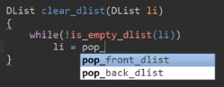

pop_back_dlist() et pop_front_dlist() sont pareil mais nous on va prendre back peu importe.

```c
DList clear_dlist(DList li)
{
    while(!is_empty_dlist(li))
        li = pop_back_dlist(li);

    return new_dlist();
}
```

Du coup là à partir du moment où la liste va être vide, on ne rentrera plus dans le while() donc on pourra faire sans problème le return de new_dlist() qui correspond je vous rappelle à la valeur de retour `DList` et voilà pour le clear.

On peut donc remplacer ceci:

```c
mylist = pop_back_dlist(mylist);
mylist = pop_front_dlist(mylist);
print_dlist(mylist);   
printf("Taille de la DListe : %d\n", dlist_length(mylist));
printf("\n-------------------\n");
mylist = pop_back_dlist(mylist);
```

...par:

```c
mylist = clear_dlist(mylist);
```

ET on peut supprimer tout les éléments.

+ main.c
```c
#include <stdio.h>
#include "dlist.h"

int main(void)
{
    DList mylist = new_dlist();
    print_dlist(mylist);   
    printf("Taille de la DListe : %d\n", dlist_length(mylist));
    printf("\n-------------------\n");
    mylist = push_front_dlist(mylist, 14);
    print_dlist(mylist);   
    printf("Taille de la DListe : %d\n", dlist_length(mylist));
    printf("\n-------------------\n");
    mylist = push_front_dlist(mylist, 6);
    mylist = push_back_dlist(mylist, 23);
    print_dlist(mylist);   
    printf("Taille de la DListe : %d\n", dlist_length(mylist));
    printf("\n-------------------\n");

    mylist = clear_dlist(mylist);

    print_dlist(mylist);   
    printf("Taille de la DListe : %d\n", dlist_length(mylist));

    return 0;
}
```
```powershell
gcc *.c -o prog
.\prog.exe     
Rien a afficher, la DListe est vide.
Taille de la DListe : 0

-------------------
[14]
Taille de la DListe : 1

-------------------    
[6] [14] [23]
Taille de la DListe : 3     

-------------------
Rien a afficher, la DListe est vide.
Taille de la DListe : 0
```

Voilà donc au début 1 élément, après 3 et d'un coup après on enlève tout les éléments, normal on ne fait qu'utiliser une fonction qui ne fait qu'enlever les élément un par un comme pour la séance précédente donc on boucle dessus, n'oubliez pas que ça permet de répéter un certain nombre de fois un traitement et du coup ça fonctionne sans problème ici donc cette fonction clear_dlist() est très courte mais vraiment très pratique pour s'assurer que la mémoire est bien libérée.

Voilà on a fait le tour un petit peu toutes ces fonctions.

J'espère que ça a été suffisamment compréhensibles pour vous, encore une fois désolé pour les petites fautes de frappe que j'ai pu faire, fautes d'inattention en plus on a sonné pendant la vidéo donc après c'est comme ça qu'on perd pas mal sa concentration quand on est dérangé en pleine vidéo surtout quand elles sont un petit peu longue.

En tout cas je suis arrivé jusqu'au bout donc voilà cette vidéo est faites et vous j'espère que ça a été suffisamment compréhensibles, encore une fois si vous avez des questions, si il y a des questions, s'il y a des choses pas forcément très clair entraînez vous et n'hésitez pas à reprendre les fonctions à les refaire par vous même, à vous aider du schéma, faire des petits schémas même à la main avec un crayon pour réussir à comprendre vraiment comment se passe toutes les mécaniques et toutes les étapes pour comprendre pourquoi voilà il faut sauvegarder un élément par exemple dans un pointeur temporaire, qu'il faut après le libérer, qu'il faut rompre un petit peu les pointeurs sur lesquels voilà il est relié comme ça vous avez vraiment pigé toute la logique derrière ça et pouvoir mieux assimiler le reste puisque voilà c'est des structures que vous aurez peut-être l'usage plus tard dans des projets concrets et en tout cas c'est bien de comprendre ça puisque les pointeurs vous serviront tout le temps dans ce langage surtout pour toutes les choses qui sont à venir sur cette formation parce qu'on a encore pas mal de vidéos qui vous attendent.

Je vous dis à très bientôt pour la séance du coup 21 qui concerne les arbres au binaire donc c'est encore une structure de données encore un peu plus complexe mais elle est vraiment très très utilisée dans le milieu de l'informatique.

A bientôt tout le monde