# [21. Arbres binaires](https://www.youtube.com/watch?v=x56yrmgx5B4)

Bienvenue sur votre formation en langage c, nous sommes à la 21e séance et aujourd'hui nous allons parler des arbres binaire.

C'est une nouvelle structure de données que nous allons aborder et d'une manière un petit peu différente, je vais vous montrer rapidement ce qu'on avait pu voir dans les séances précédentes.

```h
typedef struct StackElement
{
    int value;
    struct StackElement *next;
} StackElement, *Stack;
```

Si vous vous souvenez là je reprends l'exemple de la structure de piles, on avait volontairement dans nos structures de données cachez donc masquez l'utilisation des pointeurs c'est-à-dire que je faisais directement le typedef dans la structure. C'était pour simplement gagner du temps, ne pas avoir à faire le typedef juste après là vous voyez je mettais une virgule et je m'étais cet élément-là, `, *Stack;` ce qui fait que je pouvais utiliser directement des fonctions sans pointers en fait d'accord ils sont explicites, ils sont cachés et donc les prototypes suivants ont devrait avoir des pointeurs:

```h
Stack new_stack(void);
Stack push_stack(Stack st, int x);
Stack pop_stack(Stack st);
//etc.
```

Là normalement `Stack *new_stack(void)` il y aurait un pointeur, là aussi `Stack *st` voilà donc ça permettait d'avoir une utilisation masquée en fait des pointeurs et pour cette vidéo-là sur les arbres, j'aimerais que l'on procède différemment c'est-à-dire que l'on fasse l'inverse c'est-à-dire que l'on montre l'utilisation des pointeurs.

Pourquoi cette manière-là (montrer l'utilisation des pointeurs) ? puisque selon les cas et selon aussi ce que vous aurez à faire, vous pourrez les voir ou non et personnellement je ne pense pas qu'il ait de méthode qui soit mieux qu'une autre.

Il y en a qui vous diront que c'est bien de cacher les pointeurs puisque ça permet de faciliter le code et d'éviter les erreurs parce qu'on a vite fait d'oublier une étoile et du coup ça peut poser énormément de problèmes au niveau de la compilation, et il y en a d'autres qui vous diront que le langage c tiens sa force justement de l'utilisation des pointeurs et que c'est un petit peu dommage de les masquer.

Moi je ne suis pas d'un avis ou d'un autre je m'en fiche complètement c'est selon mes préférences suivant ce je veux faire sur le moment.

C'est pour ça que je vous ai proposé jusqu'à présent de les masquer et là pour les arbres nous allons volontairement les laissé affichés.

Voilà donc c'est la petite différence que nous allons avoir dans cette vidéo ici.

Autre point je parle d'arbres binaire puisque les arbres vont respecter une certaine structure, une certaine forme, vous allez voir je vais vous montrer rapidement avec un petit dessin comme ça fait à main levée pour voir comment ça se met en place et je vais vous les exposer d'une manière assez simpliste.

L'arbre est une structure de données qui est assez complexe, il y a toute une théorie des arbres autour de ça pour ceux qui s'intéressent beaucoup aux mathématiques, vous pouvez vous renseigner à ce niveau là d'ailleurs.

Par contre je ne veux pas que ce soit trop lourd déjà parce que je veux pas faire une vidéo qui dure trois heures parce qu'il y aurait énormément de possibilités, de choses que l'on peut faire avec une structure d'arbre donc on restera sur des fonctions essentielles, sur des fonctions vraiment on va dire indispensables mais qui restent les plus basiques c'est-à-dire celles qui vous serviront on va dire partout.

Libre à vous bien évidemment d'en inventer d'autres, d'en ajouter ce genre de choses, il n'y aura pas de souci. Elle n'y seront évidemment pas toutes on n'aura pas le temps de  voir tout dans la vidéo par contre vous aurez vraiment quelque chose qui vous permet d'avoir effectivement un arbre construit qui peut être utilisé, qui peut être affiché c'est quand même on va dire la base de tout.

On va commencer directement.

J'ai créé comme vous le voyez dans mon dossier les trois fichiers habituels le main.c, notre fichier d'implémentation tree.c et notre fichier d'en-tête tree.h.

+ main.c  
```c
#include "tree.h"

int main(void)
{

    return 0;
}
```
+ tree.c  
```c
#include "tree.h"

```
+ tree.h
```h
#ifndef __TREE__H__
#define __TREE__H__

#include <stdio.h>
#include <stdlib.h>

#endif
```

Voilà nos fichiers avec les différents lignes (#..) pour la compilation, pour éviter d'inclure plusieurs fois le fichier puisque je l'inclus dans main.c et je l'inclus dans tree.c donc ça évite de faire des boucles infinies.

Ainsi je fait des petits rappels comme ça de temps en temps ça ne fait pas de mal mais voilà normalement vous êtes au courant de tout ça il n'y a pas de soucis.

On va donc passer à cette structure mais avant avec paint grosso modo un arbre binaire va se composer de cette manière.

```
    O
   / \
```

On va avoir alors un élément qui serait la racine, il va avoir deux branches `/°\` c'est pour ça que l'on parle de binaires. 

```
    O
   / \
  O   O
```

Ensuite ici ce sont des noeuds, ce sont les noeuds de l'arbre donc on peut avoir comme ça jusqu'à deux éléments voilà.

```
    O
   / \
  O   O
 /\   /\ 
O  O O  O
   /\    \
  O  O    O
          /\
         O  O
```

Alors oui il peut très bien y en avoir qu'un seul aussi d'accord on peut très bien faire un arbre binaire de la sorte, pourquoi pas.

Voilà c'est toujours par deux maximum.

Un arbre non binaire donc un arbre standard ça pourrait tout simplement quelque chose comme ça voilà un exemple tout simple.

```
    O
   /|\
  O O O
```

Là on a un arbre qui n'est pas binaire.

Nous on va travailler sur ce genre de modèle binaire déjà parce que ce sera beaucoup plus utilisé en général en informatique on utilise beaucoup plus les arbres dit binaire et de toute manière si après vous savez faire pour des arbres binaires vous verrez que faire sur des arbres non-binaire c'est relativement simple il suffira d'adapter votre code.

En tout cas n'oubliez pas que tout ce que vous apprenez dans ces formations que ce soit celle-là ou une autre formation que je propose sur la chaîne doit vous permettre après de vous rendre autonome et de pouvoir vous adapter c'est à dire ne partez pas seulement de ce que vous avez appris ou tout ce que vous avez déjà.

N'hésitez pas à modifier, à l'améliorer parce que c'est toujours améliorable un code et à l'adapter, à rajouter des choses je vous dis, à le calquer en fait sur un autre modèle pour que ça puisse mieux correspondre par rapport à un projet que vous avez, par rapport à un problème donné pour pouvoir trouver sa solution.

C'est bien de pouvoir transformer un petit peu son code et de l'adapter.

Voilà c'est fait pour ça et c'est justement le but d'être développeur, d'être programmeur c'est de pouvoir modifier comme ça quelque chose, c'est un petit peu avoir un outil en fait et pouvoir le modeler un petit peu à la convenance du développeur pour l'utiliser et répondre au problème qui est posé donc maintenant on va vraiment travailler là-dessus sur les arbres binaire et je vais faire de la manière la plus simple.

En tout cas je vais essayer d'être simple et dans tous les cas si jamais il y avait des choses qui n'étaient pas claires, vous avez toujours les commentaires de la vidéo pour poser vos questions et il y en aura de toute manière comme toujours et j'y répondrai comme ça on pourra éclaircir un petit peu les points qui serait peut-être un petit peu obscur.

On va commencer directement alors on va pas faire d'énumération, on ne va pas créé de type bouléen on en aura pas besoin.

Vous allez voir qu'il y avait dans les autres structures et que là on ne va pas avoir.

Il n'y aura pas par exemple une fonction pour dire si l'arbre est vide, vous verrez qu'ici dans mon cas ce n'est pas utile, on va changer un petit peu la manière dont on a envie de se représnter-là.

Nous tout ce qu'on veut je vous rappelle au niveau dessin c'est de pouvoir avoir un élément comme ça qui serait une racine, pouvoir avoir jusqu'à deux branches et à chaque fois au bout d'un noeud de pouvoir lui ajouter jusqu'à maximum 2 branches éventuellement.

```
    O
   / \
  O   O
 /\   /\ 
O  O O  O
   /\    \
  O  O    O
          /\
         O  O
```

Alors donc au niveau vocabulaire ça `/°\` c'est la racine de l'arbre puis on a une branche ensuite tous les autres points ce sont des noeuds et voilà. Après on arrive sur les feuilles mais en fait les feuilles c'est les noeuds de la fin ceux qui n'ont pas de branches mais on ne parlera pas des feuilles dans la vidéos puisque je ne pourrais faire toutes les fonctions.

Je vous suggérais d'autres fonctions à faire en fin de vidéo mais dans tous les cas, on n'aura pas le temps de tout voir. Il y a vraiment vraiment beaucoup de chose, on pourrait faire 20, 30 fonctions je suis sûr au niveau des arbres par rapport à tout ce qui tourne autour de la théorie des arbres comme on aura après plus tard la théorie des graphes comme on verra dans la prochaine vidéo donc tout ça ce sont appelés communément les feuilles parce qu'elles n'ont pas de branche d'accord.

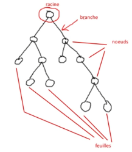

Voilà donc ça c'est la syntaxe ensuite ce qu'il faut comprendre c'est qu'il faut comprendre que là vous avez du coup un arbre donc là vous avez l'arbre complet ainsi ça c'est un arbre au complet d'accord.

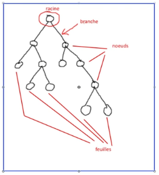

là vous avez ensuite un noeud.

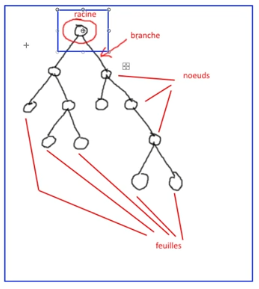

Et ce noeud possède un sous-arbre donc un arbre gauche. On peut l'appeler gauche tout simplement parce qu'il est à gauche simplement au niveau de représentation.

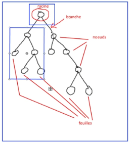

Et un arbre droit donc tout celui là.

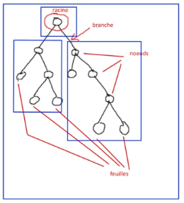

Voilà et cetera et c'est la même chose on a dans l'arbre gauche un sous-arbre gauche et on a un sous-arbre droit, et cetera et cetera.

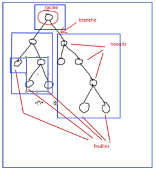

Voilà dans celui-là et on a la même chose dans l'arbre droit.


Et dans ce sous-arbre droite, on a encore des sous-arbre.

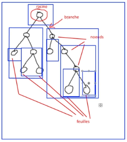

Alors le schéma ici c'est juste pour vous aider rapidement et vous verrez qu'au niveau de la présentation ce sera très simple grosso modo voyez à chaque fois on a les sous-ensembles donc là il y a un appel, il y a une référence à tout ce qui est récursivité.

J n'ai pas forcément utilisé la récusivité tout le temps, tout le temps là on va l'utiliser pas mal quand même au niveau de la structure de données puisque ça si prête très très bien et de toute manière vous pourrez retrouver une vidéo en annexe en tant que tutoriel sur comment faire de la récursivité en langage c.

Je fais en général ce genre de vidéo pour chaque langage de programmation comme ça ça permet de l'employer dans le langage que vous êtes en train d'apprendre, sur lequel vous êtes en train de vous former c'est bien plus pratique pour vous donc on va garder ça en place et voir comment faire ce genre de petites structures.

Voilà on reviendra sur le schéma éventuellement si on a besoin.

## La structure Tree

Au niveau de ma structure on va faire quelque chose de très simple, on va donc faire un *typedef struct* que l'on va appeler *Tree*, alors je pourrais l'appeler *BTree* pour binary tree mais bon on va rester simple ici comment on ne verra que les arbres binaire de toute façon voilà.

Dedans je veux qu'elle ait une valeur `int value;`, la valeur c'est tout simplement ce qu'il va y avoir ici `/°\` au sommet et je veux également alors un arbre gauche `struct Tree *tleft;` d'accord donc c'est un pointer vers une autre structure donc un autre abre, C'est pour ça que tout à l'heure j'ai parler de sous-arbre puisqu'on a des arbres dans l'arbres en fait à chaque fois des sous-ensemble et `struct Tree *tright;`. Ensuite et moi je vais rajouter une petite chose qui n'est pas forcément mis tout le temps mais moi j'aime bien avoir ce genre de choses c'est-à-dire `struct Tree *parent;`. Le premier parent c'est la racine et dés qu'on déscend dans les sous-arbres, les parents sont au-dessus.

```h
#ifndef __TREE__H__
#define __TREE__H__

#include <stdio.h>
#include <stdlib.h>

typedef struct Tree
{
    int value;
    struct Tree *tleft;
    struct Tree *tright;
    struct Tree *parent;
}Tree;

#endif
```

En réalité, on peut accéder comme ça à des valeurs un petit peu en arrière vous verrez que ça va être utile juste pour l'affichage en fait mais ça va nous sauver vraiment quand on va vouloir afficher là parce qu'on ne va pas s'éterniser trop longtemps c'est-à-dire qu'on en parlera quand on y sera.

On va voir donc comme ça.

Alors on ne fait pas `...}Tree, *Tree;` pour cacher les pointeurs, ils vont être vraiment affiché au niveau du code.

La structure est terminée.

## La fonction new_tree

On passe maintenant au prototypage c'est-à-dire les prototypes pour notre première fonction à savoir `Tree *new_tree(int x);` et là vous voyez que le pointeur est affiché, il n'est pas masqué d'accord on le voit directement.

```h
#ifndef __TREE__H__
#define __TREE__H__

#include <stdio.h>
#include <stdlib.h>

typedef struct Tree
{
    int value;
    struct Tree *tleft;
    struct Tree *tright;
    struct Tree *parent;
}Tree;

Tree *new_tree(int x);

#endif
```

On prend dans ce premier prototype et on va l'implémenter.

```c
#include "tree.h"

Tree *new_tree(int x)
{

}
```

Là je fais juste un `#include "tree.h"` vers le fichier d'en-tête évidemment comme pour main.c pareil on a le stdio.h et stdlib.h inclut dans tree.h.

Les deux fichiers d'en-tête sont dans tree.h et comme il inclu, ils sont partout alors on y va.

Grosso modo qu'est-ce que je veux ? Alors au début j'ai pas d'arbre encore on part du principe que j'en ai pas et je vais pouvoir dire bah tiens je crée ma racine.

C'est un petit peu ça à la base donc je crée une racine avec ma valeur, mon x et ensuite comme il n'y aura pas d'arbre gauche et d'arbre droit et bien il seront égal à null d'accord je vais partir de ce principe, c'est pour ça que je ne fait pas de fonction si l'arbre est vide parce qu'en fait un arbre qui est vide c'est un arbre qui n'existe pas.

Voilà à partir du moment où on crée un arbre, on aura au moins une racine donc il suffira de tester si l'arbre est nul alors on pourra considérer que c'est lui c'est vide pas besoin de faire une fonction ici, on ne va pas s'attarder là-dessus puis bon vous l'avez déjà vu dans les vidéos précédentes sur les autres structures. Maintenant vous savez bien comment ça marche à ce niveau là.

On va créer un arbre donc on va réserver une place en mémoire de manière dynamique et on fait un sizeof(*tr) et on vérifie bien évidemment que l'allocation s'est bien passé sinon le message *Erreur allocation mémoire.* et un exit() donc ça toujours pareil rien de nouveau jusqu'à présent mais super important toujours quand vous faites l'occasion dynamique de vérifier qu'elle a fonctionnée puisqu'elle ne peut ne pas fonctionner dans ce cas là il ne faut pas continuer le programme.

```c
#include "tree.h"

Tree *new_tree(int x)
{
    Tree *tr = malloc(sizeof(*tr));

    if(tr == NULL)
    {
        fprintf(stderr, "Erreur allocation mémoire.\n");
        exit(EXIT_FAILURE);
    }

}
```

Ce sont des petits rappels à chaque fois, je ne pense pas que ce soit un mal et au moins comme ça vous n'êtes pas perdu et ça vous permet de rafraîchir un petit peu toutes les choses qu'on a vu parce qu'on a vu beaucoup beaucoup de notions et beaucoup de rappel au fur et à mesure des vidéos.

Une fois qu'on a ça notre élément est prêt d'accord je vous rappelle que la structure c'est ça d'accord.

```h
typedef struct Tree
{
    int value;
    struct Tree *tleft;
    struct Tree *tright;
    struct Tree *parent;
}Tree;
```

On vient d'allouer en mémoire ces espaces là donc on a de la place pour trois arbres et la place pour une valeur donc ça tombe bien dans `tr->value = x;` comme il s'agit vraiment de pointeur c'est toujours des flèches, je vais mettre x. Ensuite `tr->tleft = NULL;`, `tr->tright = NULL;` et il n'a pas de parents puisque c'est la racine `tr->parent = NULL;`.

```c
#include "tree.h"

Tree *new_tree(int x)
{
    Tree *tr = malloc(sizeof(*tr));

    if(tr == NULL)
    {
        fprintf(stderr, "Erreur allocation mémoire.\n");
        exit(EXIT_FAILURE);
    }

    tr->value = x;
    tr->tleft = NULL;
    tr->tright = NULL;
    tr->parent = NULL;
}
```

`tr->parent = NULL;` donc c'est lui le plus haut en fait même si la racine normalement c'est au bas c'est un petit peu voilà, un petit peu délicat à ce niveau là c'est qu'on inverse en fait.

On dessine un arbre à l'envers justement puisque la racine est en haut mais on ne va pas le retourner par rapport à comment on va le concevoir donc un arbre en informatique ça part comme ça du haut avec la racine et on descend comme ça.

Ensuite il faut imaginer en fait vraiment que ce sont les racines de l'arbre c'est un peu bizarre comme nommage mais c'est comme ça ça s'appelle un arbre c'est pas moi qui choisi et qui l'ai inventé et voilà et on va se mettre une petite ligne l'aide ça ça va être pour nous c'est pas obligatoire je rappelle d'accord, *Aide pour le développeur* et on va mettre tout simplement `printf("Création de %d\n", tr->value);` comme ça on voit ce qui va être créé.

On retourne le tout et normalement on a tout ce qu'il faut.

```c
#include "tree.h"

Tree *new_tree(int x)
{
    Tree *tr = malloc(sizeof(*tr));

    if(tr == NULL)
    {
        fprintf(stderr, "Erreur allocation mémoire.\n");
        exit(EXIT_FAILURE);
    }

    tr->value = x;
    tr->tleft = NULL;
    tr->tright = NULL;
    tr->parent = NULL;

    //Aide pour le développeur
    printf("Creation de %d\n", tr->value);

    return tr;
}
```

On a donc alloué, vérifié que c'était bon. On a bien stocké la valeur de x, le reste est nul puisque on a que la racine. On a une petite ligne d'aide pour repérer effectivement la création comme ça avec cette valeur et on retourne tout normalement c'est bon.

## 1e compilation et exécution

Bon on va tester on va directement commencé à tester ça, on
va faire `Tree *arbre = new_tree(2);`, on va l'appeler avec un nom en français et donc moi je veux une racine où ces 2 donc on travaille avec des entiers pour rester simple.

```c
#include "tree.h"

int main(void)
{
    Tree *arbre = new_tree(2);

    return 0;
}
```
```powershell
gcc *.c -o prog
.\prog.exe
Creation de 2
```

Voilà et on exécute il vous met bien création de 2 donc pour le moment à priori on a effectivement créé cet élément alors là je vous le dis j'ai fait quelque chose que je n'aurais pas surtout pas dû faire c'est comme j'ai allouer dynamiquement vous voyez qu'à aucun moment je n'ai fait de free() donc là bas le truc c'est que quand l'allocation s'est terminée bas il y a eu une fuite de mémoire.

Voilà ça c'est à savoir, free() devrait directement être fait c'est pour vous montrer que c'est important n'oubliez pas à chaque malloc() il y a toujours un moment donné un free() pour libérer la mémoire.

Là je viens d'avoir une fuite mémoire parce que je n'ai pas libéré ça `Tree *tr = malloc(sizeof(*tr));`.

Là pour le coup si je veux être rigoureux, il faudrait faire ça `free(arbre);` parce que comme je n'ai pas d'autres éléments voilà donc il faudrait faire ça donc je vais relancer, recompiler et relancer le programme et là il n'y a pas de soucis.

```c
#include "tree.h"

int main(void)
{
    Tree *arbre = new_tree(2);

    free(arbre);

    return 0;
}
```
```powershell
gcc *.c -o prog
.\prog.exe
Creation de 2
```

Là je relance le programme donc pas de soucis, il aura bien libéré la mémoire par contre ce que j'ai lancé avant c'est trop tard c'est perdu dans ma mémoire donc je ne peux rien faire ce sera effacée au démarrage ou à la réinitiation de la ram du pc.

Voilà *Creation de 2* et là il n'y aura pas de fuite puisque j'ai bien libéré alors ça c'est bon, on va passer à la suite c'est à dire maintenant on va donc passer directement à une petite fonction qui va libérer justement la mémoire proprement.

## La fonction clean_tree

On va donc faire un clean_tree() donc elle ce n'est pas un pointeur d'accord c'est vraiment pour nettoyer par contre elle prend bien un pointeur sur un arbre et ça encore une fois ce n'est pas masqué.

```h
#ifndef __TREE__H__
#define __TREE__H__

#include <stdio.h>
#include <stdlib.h>

typedef struct Tree
{
    int value;
    struct Tree *tleft;
    struct Tree *tright;
    struct Tree *parent;
}Tree;

Tree *new_tree(int x);
void clean_tree(Tree *tr);

#endif
```

Alors comment va se passer le nettoyage.

```c
void clean_tree(Tree *tr)
{

}
```

Alors déjà première chose si l'arbre est nul vous doutez bien qu'il n'y a rien à faire donc on `return;`. Voilà on fait toujours comme un return d'accord c'est important.

```c
void clean_tree(Tree *tr)
{
    if(tr == NULL)
        return;
}
```

Voilà comme ça, on est sûr de quitter la fonction.

Ensuite un petit printf() avec une *Aide pour le développeur*, ça c'est important aussi ce serra juste pour nous aider parce que je ne vais pas commencer à utiliser des outils pour vérifier les fuites mémoire c'est vraiment pour que vous puissiez voir globalement que ça bien été supprimé comme ça *Suppression de %d* voilà et on le faire sur `tr->value` comme ça on va ensuite vérifier ça.

```c
void clean_tree(Tree *tr)
{
    if(tr == NULL)
        return;
    
    //Aide pour le développeur
    printf("Suppression de %d\n", tr->value);
}
```

Et ensuite on va faire un appel récursif c'est à dire qu'on va rappeler cette fonction clean_tree() d'accords alors si vous avez vu la vidéo sur la récursivité, vous pourrez évidemment savoir en quoi ça consiste mais ce qu'il faut comprendre globalement si je fait un petit rappel aussi c'est que là bon je note le code.

```c
void clean_tree(Tree *tr)
{
    if(tr == NULL)
        return;
    
    //Aide pour le développeur
    printf("Suppression de %d\n", tr->value);

    clean_tree();
}
```

Je rappelle `clean_tree();` sauf  qu'au lieu de le faire sur tout mon arbre `clean_tree(tr->tleft);`, je le fait sur tout le sous-arbre gauche et ensuite je vais le faire sur l'autre `clean_tree(tr->tright);` alors c'est pareil si vous le faites sur ldroite ou la gauche avant peu importe c'est vous qui voyez. Moi je fais gauche puis je fais droite et à la fin on va faire ça `free(tr)` de tr donc l'arbre à la fin.

```c
void clean_tree(Tree *tr)
{
    if(tr == NULL)
        return;
    
    //Aide pour le développeur
    printf("Suppression de %d\n", tr->value);

    clean_tree(tr->tleft);
    clean_tree(tr->tright);

    free(tr);
}
```

Alors comment ça va se passer ça ?

Il va donc vérifier que l'arbre n'est pas nul sinon il va simplement retourner.

Il va ensuite rappeler la fonction clean_tr() sur l'arbre gauche c'est-à-dire qu'au début il a tout cet arbre-là et puis il appel sur cet arbre gauche-là.


Et il appel sur l'arbre gauche-là.

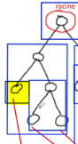

Et finallement il appel sur cet arbre-là.

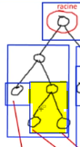

Alors tout ça il va le stocker dans une espèce de piles donc c'est une mémoire, un autre type de mémoire qui est une pile justement de tout ce qui va contenir les recursions c'est à dire toutes les choses ici qu'on a empilé dedans, et il va ensuite les traiter un par un c'est-à-dire que quand on fait le `free(tr);` en fait il va faire le free() ici.

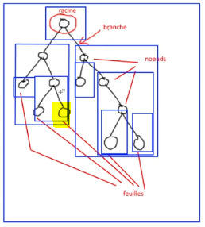

Le tr ce serra lui donc il va faire free() de ça puis il revient au noeud et fait free de l'arbre gauche par exemple.

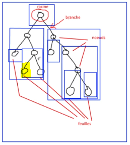

Puis il revient au sommet, free() de ça.


Puis free() de ça.

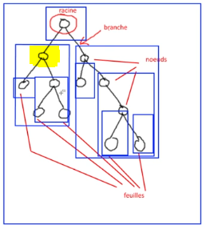

Et enfin free() de ça.

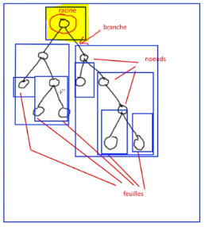

Alors il y aura bien évidemment l'autre partie mais on s'imagine que si on avait que cette partie-là d'accord de l'arbre c'est ce qu'il ferait d'accord.


Voyez il va faire le problème à l'envers, la récursivité c'est ça en fait.

La récursivité c'est on va rappeler la chose c'est-à-dire qu'on appelle une fonction pour travailler sur tout ça mais finalement on la rappelle pour travailler sur plus petit et finalement on la rappelle pour travailler sur plus petit enfin plus petit, etc, etc.

Mais tout ce qui a été déjà dit avant, on l'a stocké en mémoire sur une pile donc il se ouvient de chacun des noeuds de notre arbre et du coup il va les supprimer à l'envers.

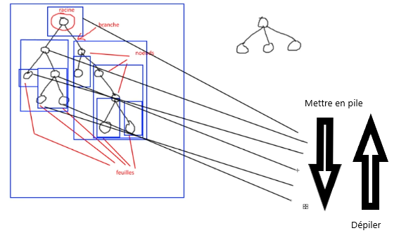

A la fin, le petit `free(tr)`, il va le faire à l'envers il va commencer par la dernière valeur en fait que vous avez mis dans la pile, etc, etc. Il va dépiler, et vous savez maintenant comment fonctionne une pile et au final si vous comprenez bien il aura effectivement libéré chaque noeud un par un donc chaque sous-arbre et au final l'arbre complet.

Voilà comment ça fonctionne donc si ce n'est pas suffisamment clair je vous redonnerais les détails dans des commentaires donc n'hésitez pas à poser vos questions mais dans tous les cas si vous savez comment fonctionne la récursivité, que vous avez vu la vidéo.

Alors je dis si vous avez vu la vidéo toujours pareil et comme les vidéos sont faites quand même normalement pour être fiable et viable pendant des années, il est possible qu'à l'heure où vous regardez cette vidéo l'annexe concernant la récursivité n'a pas encore été faites, publiée donc si c'est pas le cas, attendez ça viendra de toute façon et puis peut-être que déjà d'ici-là donc voilà vous pourrez en profiter.

Je fais toujours des vidéos, je prévois en faites. 

Alors on va vérifier ça et là si on n'a qu'un seul élément d'accord il devrait faire ça `clean_tree(tr->tleft);` et vu qu'on est déjà sur le dernier donc il va faire tout simplement ça `free(tr);` ce que j'ai fait tout à l'heure ici dans main.c

```c
#include "tree.h"

int main(void)
{
    Tree *arbre = new_tree(2);

    free(arbre);

    return 0;
}
```

`free(arbre);` d'ailleurs je peux l'enlever sinon on va avoir des soucis.

```c
#include "tree.h"

int main(void)
{
    Tree *arbre = new_tree(2);

    clean_tree();

    return 0;
}
```

Voilà ici s'il y a plusieurs ensembles voyez il va rappeler récursivement et cetera et cetera et cetera donc automatiquement il va supprimer chacun des éléments.

Voilà et bien là on peut réssayer et on voit qu'il va bien recréer 2.

```c
#include "tree.h"

int main(void)
{
    Tree *arbre = new_tree(2);

    clean_tree(arbre);

    return 0;
}
```
```c
#include "tree.h"

Tree *new_tree(int x)
{
    Tree *tr = malloc(sizeof(*tr));

    if(tr == NULL)
    {
        fprintf(stderr, "Erreur allocation mémoire.\n");
        exit(EXIT_FAILURE);
    }

    tr->value = x;
    tr->tleft = NULL;
    tr->tright = NULL;
    tr->parent = NULL;

    //Aide pour le développeur
    printf("Creation de %d\n", tr->value);

    return tr;
}

void clean_tree(Tree *tr)
{
    if(tr == NULL)
        return;
    
    //Aide pour le développeur
    printf("Suppression de %d\n", tr->value);

    clean_tree(tr->tleft);
    clean_tree(tr->tright);

    free(tr);
}
```
```h
#ifndef __TREE__H__
#define __TREE__H__

#include <stdio.h>
#include <stdlib.h>

typedef struct Tree
{
    int value;
    struct Tree *tleft;
    struct Tree *tright;
    struct Tree *parent;
}Tree;

Tree *new_tree(int x);
void clean_tree(Tree *tr);

#endif
```
```powershel
gcc *.c -o prog
.\prog.exe     
Creation de 2
Suppression de 2
```

Voilà il a bien créé 2 alors par contre on avait fait une fuite mémoire et vous savez que quand je me gourre dans quelque chose, que je fais une erreur d'inattention, je ne la cache pas je la laisse en direct puisque de toute manière c'est ça qui est important aussi pour vous de voir qu'on peut se tromper puisque c'est pas facile aussi de faire une vidéo en même temps qu'on programme.

Du coup donc là il a bien créé les deux, il le supprime à la fin par rapport à notre fonction donc là pas de souci tant qu'on aura toujours `clean_tree(arbre);` normalement j'aurais pas de fuites mémoire si j'ai bien fait la fonction de libération qui à priori devrait être correct.

## La fonction join_tree

Voilà donc maintenant on va pouvoir continuer avec une nouvelle fonction puisque là on a juste construit un arbre là et donc construit une racine mais qu'est ce qu'on va faire d'autre et bien vous allez voir que la méthode que je propose est assez intéressante puisqu'elle n'est pas forcément une approche qu'on pourrait avoir tout le temps.

Il y a plein de manière encore une fois de représenter la structure d'un arbre pour un langage c mais moi je vous en propose une parmi plein d'autres c'est pas la meilleure encore une fois c'est pas la plus rapide, c'est pas la plus performante, la plus optimisée mais elle a en tout cas le mérite de marcher et pour ce que vous vous allez vouloir faire elle sera très très bien.

On va faire ça `Tree *join_tree()`, on va appeler ça *join* alors c'est un nom qu'on note parce que simplement ça permet de joindre des arbres vous allez voir.

```c
Tree *join_tree(Tree *left, Tree *right, int node);
```

```c
#ifndef __TREE__H__
#define __TREE__H__

#include <stdio.h>
#include <stdlib.h>

typedef struct Tree
{
    int value;
    struct Tree *tleft;
    struct Tree *tright;
    struct Tree *parent;
}Tree;

Tree *new_tree(int x);
void clean_tree(Tree *tr);
Tree *join_tree(Tree *left, Tree *right, int node);

#endif
```

join_tree() donc on va avoir un arbre droit et un arbre gauche et on va avoir un noeud donc nous ça va être la valeur tout simplement.

Et tout simplement on va implémenter cette petite fonction.

```c
Tree *join_tree(Tree *left, Tree *right, int node)
{

}
```

Normalement si vous avez bien pigé ce que vous ai dit vous, voyez moi ce que je vais faire c'est je vais simplement dire avec mon schéma que le but de ma fonction c'est pouvoir dire que mon arbre gauche ce serait par exemple 2, l'arbre droit il aurait 4 mon *node* donc le  troisième élément ce serait celui qui va les rattacher tout les deux donc ce serait 6 du coup à la fin j'obtiendrai ça voilà.

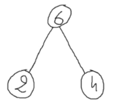

Voilà grosso modo ce que l'on va faire alors on va changer par contre main.c avec la valeur 6.

```c
#include "tree.h"

int main(void)
{
    Tree *arbre = new_tree(6);

    clean_tree(arbre);

    return 0;
}
```
```powershell
gcc *.c -o prog
.\prog.exe     
Creation de 6
Suppression de 6
```

Voilà ok on a recompilé mais maintenant comment ça fonctionne ? on va déjà allouer dynamiquement la mémoire comme on fait tout le temps sauf que là on va directement appeler new_tree() comme on a déjà fait la fonction, on ne va pas s'amuser à refaire un malloc() et cetera d'accord on sait comment créer un arbre comme ça qui n'a rien qui n'a pas d'arbre gauche, qui n'a pas d'arbre droit mais qui a juste son noeud donc sa racine en fait.

On va appeler new_tree() en mettant en paramètre *node*.

```c
Tree *join_tree(Tree *left, Tree *right, int node)
{
    Tree *tr = new_tree(node);

    tr->tleft = left;
    tr->tright = right;
}
```

Maintenant on va tout simplement dire que pour l'arbre gauche et l'arbre droit de `tr` c'est ce que j'ai passé en paramètre de ma fonction.

Voilà c'est tout.

Ensuite on a quelques vérifications à faire, on voudrait vérifier si left est différent de nul, tout simplement si left existe s'il y a quelque chose. Si c'est *NULL*, je vais dire que le parent de left c'est tr, et on fait le même test pour right. Puis on va retourner bien sûr notre arbre à la fin.

```c
Tree *join_tree(Tree *left, Tree *right, int node)
{
    Tree *tr = new_tree(node);

    tr->tleft = left;
    tr->tright = right;

    if(left != NULL)
        left->parent = tr;

    if(right != NULL)
        right->parent = tr;
    
    return tr;
}
```

Tout simplement s'il voit qu'il y a *left* ici pour le 2, il va dire que pour son parent c'est le 6 et le 4, il va dire que son parent c'est le 6.


Voilà voyez qu'on va pouvoir faire comme ça les jointures.

On pourra s'y retrouver surtout quand on va vouloir afficher l'arbre et pouvoir le reconstituer parce que le but en l'affichant c'est que quelqu'un qui viendrait voir votre affichage lorsqu'on va afficher avec des printf() il puisse redéssiner l'arbre et retrouver les bon arbre celui que vous vouliez éffectivement créer sinon c'est que vous aure mal fait votre affichage.

Voilà pour la jointure.

## 2e compilation et exécution

On va donc créer ce fameux arbre qu'on a fait donc on ne va pas utiliser new_tree() mais on va utiliser join_tree() et ici je vous ai dit que l'abre gauche c'est 2, l'arbre droit c'est 4 d'accord et le node c'est 6 donc ce qui va relier.

```c
#include "tree.h"

int main(void)
{
    Tree *arbre = join_tree(2, 4, 6);

    clean_tree(arbre);

    return 0;
}
```

Par contre là il prend bien des arbres d'accord donc on va utiliser, non pas mettre directement 2 ça ne marcherais pas ce qui provoquerais un soucis au niveau du type de données mais un new_tree(2) puis un new_tree(4).

```c
#include "tree.h"

int main(void)
{
    Tree *arbre = join_tree(new_tree(2), new_tree(4), 6);

    clean_tree(arbre);

    return 0;
}
```

Voilà j'espère que c'est clair mais niveau syntaxe ça va être un peu plus compliqué par contre l'approche au niveau de la logique en fait, au niveau de l'implémentation est très très simple c'est-à-dire que je crée un nouvel arbre tout seul le 2 voyez qu'il n'a pas d'abre gauche et pas d'arbre droit.


Je crée un arbre droit 4 et il n'a pas de fils gauche ou de fils droit, et ensuite j'ai mon node qui permet de joindre les 3, voilà ce que je viens de faire ici:

```c
Tree *arbre = join_tree(new_tree(2), new_tree(4), 6);
```

On va enregistrer, compiler et on va exécuter.

```c
#include "tree.h"

int main(void)
{
    Tree *arbre = join_tree(new_tree(2), new_tree(4), 6);

    clean_tree(arbre);

    return 0;
}
```
```c
#include "tree.h"

Tree *new_tree(int x)
{
    Tree *tr = malloc(sizeof(*tr));

    if(tr == NULL)
    {
    fprintf(stderr, "Erreur allocation mémoire.\n");
    exit(EXIT_FAILURE);
    }

    tr->value = x;
    tr->tleft = NULL;
    tr->tright = NULL;
    tr->parent = NULL;

    //Aide pour le développeur
    printf("Creation de %d\n", tr->value);

    return tr;
}

Tree *join_tree(Tree *left, Tree *right, int node)
{
    Tree *tr = new_tree(node);

    tr->tleft = left;
    tr->tright = right;

    if(left != NULL)
        left->parent = tr;

    if(right != NULL)
        right->parent = tr;
    
    return tr;
}

void clean_tree(Tree *tr)
{
    if(tr == NULL)
        return;
    
    //Aide pour le développeur
    printf("Suppression de %d\n", tr->value);

    clean_tree(tr->tleft);
    clean_tree(tr->tright);

    free(tr);
}
```
```h
#ifndef __TREE__H__
#define __TREE__H__

#include <stdio.h>
#include <stdlib.h>

typedef struct Tree
{
    int value;
    struct Tree *tleft;
    struct Tree *tright;
    struct Tree *parent;
}Tree;

Tree *new_tree(int x);
void clean_tree(Tree *tr);
Tree *join_tree(Tree *left, Tree *right, int node);

#endif
```
```powershell
gcc *.c -o prog
.\prog.exe     
Creation de 4
Creation de 2
Creation de 6
Suppression de 6
Suppression de 2
Suppression de 4
```

Voilà il a créé 4, 2 et 6 et il a bien supprimé 6, 2, 4. Alors pourquoi supprimer dans cet ordre-là parce qu'il supprime toujours comme vous voyez la racine et je vous rappelle que comme c'est récursif voyez je vous avez dit que c'était du coup pris à la suppression donc il va bien supprimer la première valeur c'est à dire ici notre racine et ensuite il les supprime du coup à l'envers d'accord il va faire 6 2 4.

Il va suivre en fait notre ordre au niveau de l'arbre binaire c'est-à-dire le (6) puis l'arbre gauche (2) et ensuite l'arbre droit (4) puis toujours arbre gauche/droite et cetera.

C'est surtout de voir rapidement que tout ce qui est supprimé est bien supprimé comme ça on est sûr que la fonction de libération de mémoire est bien passée sur tout les valeurs, ça ne veut pas dire que je n'ai pas de fuites mémoires normalement j'en ai pas je vous le dit mais au moins on est sûr en tout cas qu'elle passe sur toutes les valeurs donc voilà pour la jointure.

Alors on va compliquer un petit peu les choses c'est-à-dire comment du coup on peut faire un arbre un peu plus complexe, je ne sais pas moi, par exemple cet arbre là, avec 8 et 3.


Alors comment faire ce genre d'arbre-là, hé bien c'est la même chose sauf qu'il faut procéder à l'envers, vous avez un premier arbre ici.

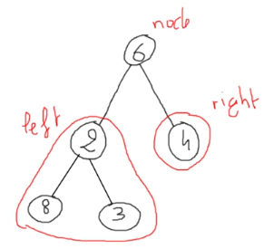

Voilà ça ce sera votre arbre left, votre arbre right et le node par rapport à notre fonction join_tree() celle qu'on a ici.

```c
Tree *arbre = join_tree(new_tree(2), new_tree(4), 6);
```

Mais ici vous voyez que left c'est déjà un arbre en fait à trois comme c'est binaire, voyez qu'il y a toujours maximum trois éléments un triangle en fait donc il suffira de dire hé bien là en fait à l'appel au lieu de faire un new_tree() pour l'arbre gauche il faudra refaire un join_tree() c'est-à-dire un join_tree() dans un join_tree() soit le *join* de tout ça.

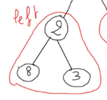

Voilà on va donc faire *join* de 8, 3, 2 donc on va le changer ici c'est-à-dire `join_tree(join_tree(new_tree(8), new_tree(3), 2), .., ..);` un join dans un join.

```c
#include "tree.h"

int main(void)
{
    Tree *arbre = join_tree(join_tree(new_tree(8), new_tree(3), 2), new_tree(4), 6);

    clean_tree(arbre);

    return 0;
}
```

Tout ça on va le faire avec new_tree() de 4 et on le rattache à 6 d'accord donc grâce à ce schéma-là j'ai ça, je vous rappelle les éléments dans l'ordre :

```c
join_tree(
    join_tree(new_tree(8), new_tree(3), 2),     //premier argument.
    new_tree(4),                                //2e
    6);                                         //3e.
```

Nos 3 arguments au niveau de ma fonction join_tree() et ceci `join_tree(new_tree(8), new_tree(3), 2),` c'est tout ça.


Voilà ça correspond donc effectivement à notre schéma, on va donc compiler.

```c
#include "tree.h"

int main(void)
{
    Tree *arbre = join_tree(join_tree(new_tree(8), new_tree(3), 2), new_tree(4), 6);

    clean_tree(arbre);

    return 0;
}
```
```c
#include "tree.h"

Tree *new_tree(int x)
{
    Tree *tr = malloc(sizeof(*tr));

    if(tr == NULL)
    {
    fprintf(stderr, "Erreur allocation mémoire.\n");
    exit(EXIT_FAILURE);
    }

    tr->value = x;
    tr->tleft = NULL;
    tr->tright = NULL;
    tr->parent = NULL;

    //Aide pour le développeur
    printf("Creation de %d\n", tr->value);

    return tr;
}

Tree *join_tree(Tree *left, Tree *right, int node)
{
    Tree *tr = new_tree(node);

    tr->tleft = left;
    tr->tright = right;

    if(left != NULL)
        left->parent = tr;

    if(right != NULL)
        right->parent = tr;
    
    return tr;
}

void clean_tree(Tree *tr)
{
    if(tr == NULL)
        return;
    
    //Aide pour le développeur
    printf("Suppression de %d\n", tr->value);

    clean_tree(tr->tleft);
    clean_tree(tr->tright);

    free(tr);
}
```
```h
#ifndef __TREE__H__
#define __TREE__H__

#include <stdio.h>
#include <stdlib.h>

typedef struct Tree
{
    int value;
    struct Tree *tleft;
    struct Tree *tright;
    struct Tree *parent;
}Tree;

Tree *new_tree(int x);
void clean_tree(Tree *tr);
Tree *join_tree(Tree *left, Tree *right, int node);

#endif
```
```powershell
gcc *.c -o prog
.\prog.exe     
Creation de 4
Creation de 3
Creation de 8
Creation de 2
Creation de 6
Suppression de 6
Suppression de 2
Suppression de 8
Suppression de 3
Suppression de 4
```

Et là on a bien 4 3 8 2 6, 6 2 8 3 4 donc tout est bien détruit également.

Tout ce qui a été créés est détruits.

Voilà pour la jointure alors on peut toujours procédé de cette manière c'est-à-dire qu'on va faire en fait des *join*, dans des *join*, dans des *join* puisque tout fonctionne toujours par paire de 3 comme ça mais voilà tout ça ce sont des arbres d'accord (bleu).

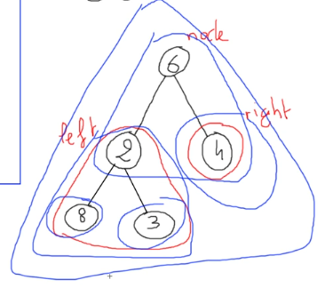

C'est ça la récursivité, des arbres dans des arbres dans des arbres tout le temps.

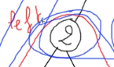

Le (2) aussi est un arbre sauf que lui comme il a des éléments fils ont est du coup obligé de les considérer du coup avec. On ne peut pas dire qu'ils sont nuls parce qu'il n'est pas vraiment tout seul-lui.

Voilà on a plusieurs arbres.

Voilà au niveau du join_tree() donc avec ça vous pouvez former les arbres que vous voulez.

On va voir après une petite une petite variante pour pouvoir ajouter les éléments également en fait quand on veut, pas comme ça devoir faire tout à la main mais pouvoir ajouter les éléments dans un certain ordre précis mais avant ça on va voir comment je pense que c'est intéressant c'est-à-dire comment afficher les arbres.

Maintenant je pense qu'on a vu tout ce qu'il fallait au niveau des fonctions pour pouvoir le faire donc on va pouvoir le faire. On ne va pas aller trop vite et on va pour afficher.

## La fonction print_tree_prefix

Donc pour afficher, on va faire `void print_tree_prefix()` et encore une fois on ne met pas de pointeur et je vais donner une nom à cet affichage c'est-à-dire le nom de préfix.

Pourquoi le donner le nom de prefix ? Alors on va suivre un certain ordre.

Au niveau de la théorie des arbre, vous avez trois manières de parcourir donc d'afficher parce qu'on parcourt chaque valeur pour afficher un arbre, vous pourrez et vous avez la manière un-fixe c'est à dire on lit le node et on lit ensuite un arbre gauche ou un arbre droit, ou alors inversement.

Tandis que l'ordre préfixe, c'est celui que nous allons faire et celui que nous allons faire, qu'on respectera tout le temps parce que c'est le plus standard donc on va faire depuis la racine toute la partie gauche et ensuite on aura la partie droite. 

Tandis que quand c'est postfixe, on fait tout ce qui est à droite et ensuite on fait ce qui est à gauche d'accord donc c'est dans c'est ordre-là que ça fonctionne donc nous on va rester sur du préfixe, vous verrez que vous pourrez faire la même fonction en poste fixe en inversant certaines choses.

```c
void print_tree_prefix(Tree *tr);
```

Elle va prendre du coup en paramètre un arbre tout simplement voilà et on va regarder comment l'afficher.

Alors je vous le dis tout de suite normalement si on voulait faire les choses proprement, si on voulait faire quelque chose de joli on pourrait utiliser une bibliothèque graphique pour afficher l'arbre comme ça d'accord avec vraiment des petites bulles, des petites branches et cetera et cetera parce que ça rajouterait par contre beaucoup de code, ça rajouterait même des notions qu'on n'avait pas encore vu à l'heure actuelle au niveau de la formation parce qu'on n'a même pas abordé la sdl, on l'abordera juste après parce que là on va parler des graphes après cette vidéo-là et on aura la sdl ensuite donc on arrive très vite à la 2d.

Par contre on n'a pas vu voilà l'utilisation de bibliothèques graphiques donc c'est pas utile, c'est surtout pas le sujet de la vidéo par contre vous allez voir que même avec de simples printf() on va être capable de reconstituer notre argent facilement et on pourra voir si notre exemple c'est-à-dire si notre programme a été bien développé.

Au niveau de l'affichage, comment on va procéder à l'affichage dans l'ordre ? on va  commencer par la racine ici (6) et comme on fait du préfixe, ont fait tout ce qui est à gauche en premier : 6, 2 et 8.

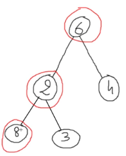

A (8) est-ce qu'il y a un élément à gauche ? non il n'y en a pas d'autre, donc on remonte ici (2) et on fait ce qu'il y a à droite.

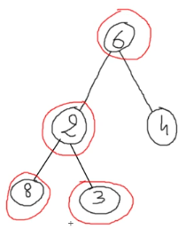

Voilà là comme c'est du binaire, on regarde si (3) a un élément à gauche ? non donc on remonte (3)->(2)->(6) et on va à droite et on fait celui-là (4).

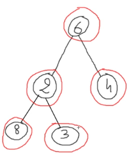

Est-ce que (4) a un élément à gauche ? non et vous voyez qu'on a tout parcouru.

On aura fait dans l'ordre (6)->(2)->(8)->(3)->(4) ok si ça avait été postfix, ça aurais été (6)->(4)->(2)->(3)->(8) donc on a vraiment comme ça des ordres différents, c'est important de le voir donc nous on va voir le préfixe puisque c'est suffisant, il suffira d'inverser si vous voulez faire du postfix ça fonctionnera aussi.

C'est encore une fois de la théorie sur les arbres si vous voulez vous renseigner, voir l'histoire de parcours, de préfix, postfix, de parcours en profondeur, de parcours en largeur, etc, il y a quelques petites choses que je vous dis qu'on ne verra pas parce que ça n'a pas d'utilité ici.

N'hésitez pas à vous renseigner il y a vraiment plein d'informations.

Enfin la théorie des graphes, la théorie des arbres, il y en a des livres complets, des livres complets donc n'hésitez pas à vous renseigner si vous voulez.

Au niveau de notre affichage on va faire très simplement vous allez voir c'est une manière que moi j'ai d'affiché des arbres comme ça quand je veux le faire simplement ça fonctionne très bien, on arrive à s'y retrouver et voilà c'est fonctionnel on arrive à reconstituer l'arbre ensuite à la main, en le dessinant.

Du coup on va faire première vérification si l'arbre est nul d'accord si l'arbre est nul bien évidemment on n'a rien à afficher et je vais faire un `return;`, je ne vais même pas afficher un message d'erreur de toute façon ça va faire gagner un petit peu de temps vous savez comment faire de toute façon.

```c
void print_tree_prefix(Tree *tr)
{
    if(tr == NULL)
        return;
}
```

Maintenant qu'est-ce qui se passe ? si mon arbre, son parent est différent de nul donc en bref si c'est pas la racine (6) donc en bref si c'est le 2, le 8, le 3 ou le 4, qu'est ce que je vais faire ? je vais faire un certain nombre de choses, je vais afficher de cette manière `printf("");` ainsi vous allez voir pourquoi par la suite je sépare les deux manières alors dans ce cas ci, j'affiche au début la valeur du parent *tr->parent->value* et ensuite *tr->value* si je ne vous dis pas de bêtises parce que ça *tr->parent* ça va me diriger vers une adresse et donc nous on veut la valeur de cet arbre *tr->parent*.

```c
void print_tree_prefix(Tree *tr)
{
    if(tr == NULL)
        return;
    
    if(tr->parent != NULL)
        printf("(%d) -> (%d)\n", tr->parent->value, tr->value);
}
```

La valeur de l'arbre parent sera comme ça dans une bulle, et la valeur de tr dans une 2e bulle.

Sinon si c'est la racine, elle n'a pas de parents la racine si on essaye d'afficher *tr->parent->value* sur la racine, on va avoir évidemment une erreur de segmentation puisqu'on va accéder à une partie de la zone mémoire qui n'existe pas donc le programme d'ailleurs va planter il ne cherchera même pas à savoir.

Du coup on va juste faire %d de *tr->value*.

```c
void print_tree_prefix(Tree *tr)
{
    if(tr == NULL)
        return;
    
    if(tr->parent != NULL)
        printf("(%d) -> (%d)\n", tr->parent->value, tr->value);
    else
        printf("(%d)\n", tr->value);
}
```

Voilà d'accord ça c'est juste la petite distinction en fait c'est pour dire que l'affichage ça va différencier les choses et ont aura comme ça les bons éléments.

Ensuite on va pouvoir procéder à un affichage récursif c'est à dire si on a un arbre gauche donc qui est différent de nul `if(tr->tleft != NULL)`, on va appeler la fonction vous allez voir c'est comme pour le nettoyage d'accord préfixe `print_tree_prefix()` sauf qu'on va  l'appeler sur notre arbre gauche *tr->tleft* attention.

```c
void print_tree_prefix(Tree *tr)
{
    if(tr == NULL)
        return;
    
    if(tr->parent != NULL)
        printf("(%d) -> (%d)\n", tr->parent->value, tr->value);
    else
        printf("(%d)\n", tr->value);

    if(tr->tleft != NULL)
        print_tree_prefix(tr->tleft);
}
```

Et c'est ensuite la même chose pour l'arbre droit, alors pourquoi pour l'arbre droit après ? tout simplement puisque j'ai dit que c'était du préfixe donc on commence par gauche et on fait à droite ensuite.

```c
void print_tree_prefix(Tree *tr)
{
    if(tr == NULL)
        return;
    
    if(tr->parent != NULL)
        printf("(%d) -> (%d)\n", tr->parent->value, tr->value);
    else
        printf("(%d)\n", tr->value);

    if(tr->tleft != NULL)
        print_tree_prefix(tr->tleft);

    if(tr->tright != NULL)
        print_tree_prefix(tr->tright);
}
```

Si vous faites une fonction postfix vous aurez juste à inverser ça *tleft* et *tright*.

```c
if(tr->tright != NULL)
    print_tree_prefix(tr->tright);

if(tr->tleft != NULL)
    print_tree_prefix(tr->tleft);
```

Voilà c'est tout parce que je ne retourne rien donc je récapitule si l'arbre est vide on retourne directement, il n'y a rien à afficher.

Ensuite à ce niveau, je vais afficher tout simplement la valeur de mon arbre,  *tr->value* si c'est pas la racine, je vais afficher en plus de quoi il provient pour savoir de quoi il est relié **tr->parent->value** et ensuite je vais traiter récursivement chaque sous-arbre donc toujours pareil c'est-à-dire que je vais afficher donc (6) et après je vais passer par les événements comme ça gauche, gauche pour faire le travail à l'envers.

## 3e compilation et exécution

Alors c'est un peu vague ce que je vous raconte mais ça va être beaucoup plus clair quand on va le tester donc là on est ici dans main.c et avant de faire le nettoyage, on va faire un `print_tree_prefix(arbre);` et vous allez voir que ça fonctionne.

Par contre pour différencier un affichage `printf("\n-----------------------\n");`. Voilà c'est juste pour séparer un peu les choses et que ce soit plus lisible mais finalement on ne va pas les mettre parce que ce sont des appels réccurisifs.

Voilà on va tester ça.

```c
#include "tree.h"

int main(void)
{
    Tree *arbre = join_tree(join_tree(new_tree(8), new_tree(3), 2), new_tree(4), 6);

    print_tree_prefix(arbre);

    clean_tree(arbre);

    return 0;
}
```
```c
#include "tree.h"

Tree *new_tree(int x)
{
    Tree *tr = malloc(sizeof(*tr));

    if(tr == NULL)
    {
    fprintf(stderr, "Erreur allocation mémoire.\n");
    exit(EXIT_FAILURE);
    }

    tr->value = x;
    tr->tleft = NULL;
    tr->tright = NULL;
    tr->parent = NULL;

    //Aide pour le développeur
    printf("Creation de %d\n", tr->value);

    return tr;
}

Tree *join_tree(Tree *left, Tree *right, int node)
{
    Tree *tr = new_tree(node);

    tr->tleft = left;
    tr->tright = right;

    if(left != NULL)
        left->parent = tr;

    if(right != NULL)
        right->parent = tr;
    
    return tr;
}

void print_tree_prefix(Tree *tr)
{
    if(tr == NULL)
        return;
    
    if(tr->parent != NULL)
        printf("(%d) -> (%d)\n", tr->parent->value, tr->value);
    else
        printf("(%d)\n", tr->value);

    if(tr->tleft != NULL)
        print_tree_prefix(tr->tleft);

    if(tr->tright != NULL)
        print_tree_prefix(tr->tright);
}

void clean_tree(Tree *tr)
{
    if(tr == NULL)
        return;
    
    //Aide pour le développeur
    printf("Suppression de %d\n", tr->value);

    clean_tree(tr->tleft);
    clean_tree(tr->tright);

    free(tr);
}
```
```h
#ifndef __TREE__H__
#define __TREE__H__

#include <stdio.h>
#include <stdlib.h>

typedef struct Tree
{
    int value;
    struct Tree *tleft;
    struct Tree *tright;
    struct Tree *parent;
}Tree;

Tree *new_tree(int x);
void clean_tree(Tree *tr);
Tree *join_tree(Tree *left, Tree *right, int node);
void print_tree_prefix(Tree *tr);

#endif
```
```powershell
gcc *.c -o prog
.\prog.exe     
Creation de 4
Creation de 3
Creation de 8
Creation de 2
Creation de 6
(6)
(6) -> (2)
(2) -> (8)
(2) -> (3)
(6) -> (4)
Suppression de 6
Suppression de 2
Suppression de 8
Suppression de 3
Suppression de 4
```

On ne va pas afficher d'autres printf() dans print_tree_prefix() parce que ce sont des appels récurssifs.

Voilà ce qui est intéressant c'est ça.

```powershell
(6)
(6) -> (2)
(2) -> (8)
(2) -> (3)
(6) -> (4)
```

Voilà donc c'est ça qui est intéressant, toute la partie que j'ai là.

Là vous allez me dire mais j'ai pas un arbre en fait, j'ai pas de petites bulles avec des branches mais si vous regardez bien vous êtes capable de le reconstituer, rappelez-vous que j'ai utilisé la fonction préfixe print_tree_prefix() donc elle doit suivre un ordre préfixe, on va redessiner cet arbre en suivant cet ordre donc on imagine qu'on a rien du tout dans  mon fichier.

Reprenons dans l'ordre, on voit qu'on a un (6) et comme il est tout seul voyez il n'y a pas de flèche, on en déduit que c'est la racine c'est comme ça, c'est par rapport à comment on a prévu notre affichage. Je le met ici donc comme c'est la racine, on sait qu'il est en haut voilà.

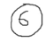

Ensuite il vous met que (6) voyez qu'il est relié à un 2 `(6) -> (2)` et comme on fait du préfixe on sait automatiquement que la première valeur qu'on donne c'est celle à gauche ici.

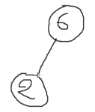

Voilà donc je ne la met pas à droite c'est du préfixe.

Ensuite on passe à la suivante on dit que (2) il est relié à un 8 `(2) -> (8)`, toujours du préfixe on prend toujours par la gauche en premier.

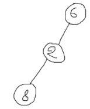

Ensuite on dit que (2) est relié à 3 donc ça tombe bien on a fait égtal à gauche donc on peut faire égal à droite.

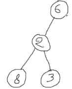

Et on termine en disant que (6) est relié à 4 donc on a fait la partie gauche donc on peut faire la partie droite.

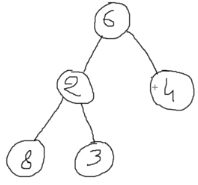

Voilà (6)->(2)->(8)->(3)->(4) et si vous regardez le schéma d'avant c'est exactement le même.


Alors pas au niveau du dessin mais au niveau des valeurs en tout cas.

On a été capable de reconstituer l'arbre comme ça alors ça nécessite évidemment de redessiner soi-même mais avec du simple texte, pas besoin de commencer d'affichage graphique compliqué qui seront plus très lourd surtout pour des tests de ce genre, vous pouvez très simplement avec des petites flèches, des parenthèses représenter votre arbre et avec ça vous êtes capable de le reconstituer facilement.

Il y a des fois des représentations comme ça d'affichage d'arbre qui sont faits avec des accolades ou des crochets super compliqués enfin pour s'y retrouver c'est juste n'importe quoi et là comme on sait que c'est un ordre préfixe puisqu'on a utilisé la fonction d'affichage en préfixe, on peut suivre le bon ordre donc on est sûr de ne pas se tromper et on peut reconstituer l'arbre et là vous venez de créer cet arbre-là voilà en langage c, c'est tout simplement avec ces quelques petits bouts de code qui ne sont franchement pas gros gros gros du tout donc c'est suffisant ce petit appel récursif.

```c
void print_tree_prefix(Tree *tr)
{
    if(tr == NULL)
        return;
    
    if(tr->parent != NULL)
        printf("(%d) -> (%d)\n", tr->parent->value, tr->value);
    else
        printf("(%d)\n", tr->value);

    if(tr->tleft != NULL)
        print_tree_prefix(tr->tleft);

    if(tr->tright != NULL)
        print_tree_prefix(tr->tright);
}
```

Un peit appel réccursif et comme ça on passe à chaque fois par chaque sous-ensembles, c'est pour ça que la réactivité en a beaucoup parce que ça si prête vraiment, les arbres ils sont faits pour ça donc c'est vraiment dommage de ne pas les utiliser, de ne pas en profiter, ça c'était pour l'affichage.

## La fonction count_tree_nodes

On va terminer avec une dernière fonction, une dernière fonction et là je pense que ça sera largement suffisant tout ça pour vraiment que vous ayez vu et que vous puissiez dire bah oui j'ai vu les arbres un petit peu justement en langage c, je les ai manipuler ce sera suffisant c'est une fonction qui va compter alors count_tree_nodes().

```h
int count_tree_nodes(Tree *tr);
```

Voilà elle va compter le nombre de noeuds, ça peut être utile.

Même chose, après on peut chipoter, est-ce que vous considérez que la racine fait partie des noeuds ? est-ce que vous considérez ici que les feuilles (8) et (3) font partie des noeuds ?

Ainsi moi je vais tout considérer, je ne m'embête pas en fait sinon il faudrait faire une condition et vérifier par exemple que si on a ni d'arbres gauche ni d'arbre droit c'est qu'on arrive à une feuille donc on ne la compte pas et si c'est la racine donc la première valeur, on fait un -1 parce qu'on retire toujours la racine comme il n'y en a qu'une seule et on est sûr que c'est bon d'accord.

C'est une possibilité voyez très simplement, on pourra adapter cette fonction encore une fois pour ne pas compter ni la racine ni les feuilles si on veut être très très précis puisqu'en théorie voilà un ce n'est pas la racine, ce ne sont pas les feuilles même si il y a quelque fois où s'en est un voilà ça devient un noeud à partir du moment où il y a deux branches.

On va récupérer ce petit prototype et on va développer notre fonction, très facile aussi encore une fois ça va aller très très vite vous allez voir et on vérifie que l'arbre n'est
pas vide.

```c
int count_tree_nodes(Tree *tr)
{
    if(tr == NULL)
        return 0;
}
```

S'il est vide je peux `return 0;` c'est à dire qu'il n'a pas de noeud puisqu'il n'existe pas je peux même *return* tout court rien du tout mettre une erreur ou ce qu'on veut, peu importe, et là je vais faire un seul return.

```c
int count_tree_nodes(Tree *tr)
{
    if(tr == NULL)
        return 0;
    
    return ...
}
```

Et un seul return ne signifie pas qu'on ne fait rien d'autres ? non parce que quand on fait du récursif on va retourner l'appel de la fonction autant de fois que nécessaire pour travailler sur les sous-arbres donc les sous-ensembles et pourra les compter d'accord comme il va les faire un par un, il va vous donner le nombre donc on va faire tout simplement `return` et on va mettre des parenthèses et je vais essayer de pas me gourer au niveau de la syntaxe.

```c
int count_tree_nodes(Tree *tr)
{
    if(tr == NULL)
        return 0;
    
    return (count_tree_nodes(tr->tleft) + count_tree_nodes(tr->tright) + 1);
}
```

Voilà entre parenthèse tout le return d'accord vous avez tout ça c'est-à-dire qu'on fait toute la partie gauche `count_tree_nodes(tr->tleft)`, c'est un peu un count_tree_nodes en préfixe entre guillemets, plus la droite `count_tree_nodes(tr->tright)` qu'on fait après et +1 voilà on n'oublie pas la racine sinon vous avez un élément en moins.

Encore une fois si vous faites ça vous ne comptez pas la racine.

```c
return (count_tree_nodes(tr->tleft) + count_tree_nodes(tr->tright));
```

Voilà c'est une possibilité encore une fois qu'on peut toujours adaptée c'est ça qui est super, c'est qu'on peut adapter un petit peu comme on veux et là on peut compter le nombre d'éléments, on met par exemple `printf("Nombre de noeuds : %d\n", count_tree_nodes(arbre));`.

```c
#include "tree.h"

int main(void)
{
    Tree *arbre = join_tree(join_tree(new_tree(8), new_tree(3), 2), new_tree(4), 6);

    print_tree_prefix(arbre);

    printf("Nombre de noeuds : %d\n", count_tree_nodes(arbre));

    clean_tree(arbre);

    return 0;
}
```
```c
#include "tree.h"

Tree *new_tree(int x)
{
    Tree *tr = malloc(sizeof(*tr));

    if(tr == NULL)
    {
    fprintf(stderr, "Erreur allocation mémoire.\n");
    exit(EXIT_FAILURE);
    }

    tr->value = x;
    tr->tleft = NULL;
    tr->tright = NULL;
    tr->parent = NULL;

    //Aide pour le développeur
    printf("Creation de %d\n", tr->value);

    return tr;
}

Tree *join_tree(Tree *left, Tree *right, int node)
{
    Tree *tr = new_tree(node);

    tr->tleft = left;
    tr->tright = right;

    if(left != NULL)
        left->parent = tr;

    if(right != NULL)
        right->parent = tr;
    
    return tr;
}

void print_tree_prefix(Tree *tr)
{
    if(tr == NULL)
        return;
    
    if(tr->parent != NULL)
        printf("(%d) -> (%d)\n", tr->parent->value, tr->value);
    else
        printf("(%d)\n", tr->value);

    if(tr->tleft != NULL)
        print_tree_prefix(tr->tleft);

    if(tr->tright != NULL)
        print_tree_prefix(tr->tright);
}

int count_tree_nodes(Tree *tr)
{
    if(tr == NULL)
        return 0;
    
    return (count_tree_nodes(tr->tleft) + count_tree_nodes(tr->tright) + 1);
}

void clean_tree(Tree *tr)
{
    if(tr == NULL)
        return;
    
    //Aide pour le développeur
    printf("Suppression de %d\n", tr->value);

    clean_tree(tr->tleft);
    clean_tree(tr->tright);

    free(tr);
}
```
```h
#ifndef __TREE__H__
#define __TREE__H__

#include <stdio.h>
#include <stdlib.h>

typedef struct Tree
{
    int value;
    struct Tree *tleft;
    struct Tree *tright;
    struct Tree *parent;
}Tree;

Tree *new_tree(int x);
void clean_tree(Tree *tr);
Tree *join_tree(Tree *left, Tree *right, int node);
void print_tree_prefix(Tree *tr);
int count_tree_nodes(Tree *tr);

#endif
```
```powershell
gcc *.c -o prog
.\prog.exe  
Creation de 4
Creation de 3
Creation de 8
Creation de 2
Creation de 6
(6)
(6) -> (2)   
(2) -> (8)   
(2) -> (3)
(6) -> (4)
Nombre de noeuds : 5
Suppression de 6
Suppression de 2
Suppression de 8
Suppression de 3
Suppression de 4
```

Voilà et il me met que le nombre de noeuds est de 5 effectivement un deux trois quatre cinq.


Voilà c'est tout, tout simplement vous faites juste ça et vous pouvez comme ça retournez votre nombre de noeuds alors on aurait pu avoir des fonctions pour comparer différents arbres avec les valeurs qu'ils ont, des fonctions de tri, on pourra avoir des fonctions pour inverser ou faire des rotations d'arbres, de sous-arbres et cetera.

C'est plein de choses qui peuvent être faites que je vous laisserai éventuellement voir si ça vous intéresse mais déjà avec ça vous pouvez faire beaucoup beaucoup de choses vraiment vous pouvez ajouter des choses dedans, vous pouvez l'afficher ça fait déjà suffisamment beaucoup pour avoir assimilé en tout cas le fonctionnement des arbres.

N'hésitez pas à vous renseigner en complément sur leurs théories c'est-à-dire sur tout ce qui est théorie des arbres, etc, les propriétés qui les concernent.

C'est un plus encore une fois, un complément qui est non négligeable et qui peut vraiment vous servir surtout si plus tard vous travaillez dans des projets où vous aurez besoin de mettre ce genre de structure en avant, vous aurez de toute façon besoin d'avoir un peu plus que ce que nous avons vu dans cette vidéo.

Alors on va en rester-là, on n'ira pas plus loin que ça, alors je vais juste par contre vous donner quelques idées de fonction c'est-à-dire qu'on aurait pu faire une fonction insérer vous savez les fameuse fonction push qu'on faisait pour les piles, etc, on peut faire une fonction push_tree(), etc qui aurait permis par exemple de mettre les valeurs parents de croissance c'est à dire que là on aurait ceci.

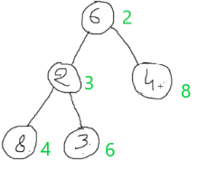

Par ordre de croissance c'est-à-dire que là on aurait eu (2)->(3)->(4)->(6)->(8) en fait comme ça en suivant un ordre préfixe maïs il aurait simplement fallu parcourir les sous ensemble en récursif et si notre valeur en fait donc par exemple notre arbres suivant était plus petit que la valeur qu'on voulait insérer et bien on faisait soit une insertion soit en fait on continuait le parcours donc ça permettait comme ça de se placer en fait au bon endroit donc je ne vais pas encore une fois vous développez ça puisque ça va rajouter beaucoup beaucoup de choses.

En plus je ne sais pas combien de temps cette vidéo aura duré mais je pense qu'elle aura été quand même suffisamment longue où on aura vu pas mal de petites choses.

En tout cas vous avez l'essentiel honnêtement sur les arbres vous êtes capable d'en créer vous êtes capable de joindre des valeurs, vous pouvez libérer de la mémoire c'est quand-même super important vous pouvez les afficher et vous pouvez compter le nombre de noeuds, ça fait déjà beaucoup petites choses.

Maintenant si vous voulez faire du tri, si vous voulait faire des rotations, calculer la hauteur, faire des parcours simplement pour je ne sais quoi n'hésitez pas à vous entraîner, ce serait un très très bon entraînement en plus là on a vraiment les pointeurs qui sont affichés, qui sont vraiment volontairement affiché donc ça vous fera une autre une autre manière d'implémenter tout ça.

En attendant je vous dis moi à très très bientôt on se retrouvera pour la prochaine vidéo qui sera la dernière structure de données normalement ça devrait être les graphes, ça c'est le passage obligé également quand on fait du c et à priori je ne devrais pas en voir d'autres.

Alors je sais qu'il y a les tables de hachage et plein d'autres trucs mais peut-être que les tables des hachages je les garderai pour une vidéo annexes alors toujours pareil peut-être qu'elle est déjà publiée en annexe ou alors peut-être que j'ai ou j'aurai fait une vidéo sur les tables de hachâge dans le cours.

Je n'en sais rien encore à l'heure où j'ai enregistré cette vidéo, tout ce que je sais en tout cas où je suis sûr c'est que la prochaine fois nous parlons des graphes et qu'après ça normalement on devrait s'arrêter avec les structures de données et on pourra attaquer la 2d avec la sdl donc c'est à dire parler de graphisme, d'affichage 2d pourquoi pas faire des petits jeux vidéo, des petites choses comme ça d'affichage, des traitements d'image, du son, gérer des polices d'écriture, gérer des manettes, des claviers, des souris bref pas mal de petites choses intéressantes qui devrait vous intéresser je pense.

Alors très honnêtement ça faisait beaucoup la partie de la formation comme ça sur les structures de données est assez lourde puisque c'est un petit peu la même chose on voit une structure, on implémente, on voit comment ça fonctionne et on passe à une nouvelle et cetera.

Ce n'est pas personnellement même pour moi c'est pas la partie la plus intéressante alors elle est d'un point de vue de ce qu'on apprend et cetera bien évidemment qu'elle l'est par contre c'est pas on va dire que quand je fais des programmes, des projets implémenter des arbres, implémenter des graphes c'est pas ce qui me plaît le plus bien évidemment.

Mais c'est un passage quand même important puisque c'est bien de le savoir surtout que dans d'autres langages comme le c++ ou java ou autres, ce sont des structures qui sont déjà faites donc on n'aurait pas besoin de les créer vous-même, elles sont déjà proposer nativement dans les langages donc on ne peut pas passer à côté.

On ne peut pas faire de c sans savoir ce qu'est un arbre en informatique, je ne pense pas ça concevable donc c'était important pour moi que vous le voyez.

Voilà on va en rester là maintenant pour cette petite ou grande vidéo je ne sais pas trop car je n'ai pas surveiller l'heure mais il est très tard, et je vous dis à très bientôt.

On se retrouvera pour une prochaine vidéo et la prochaine fois nous devrions parler des Graphes