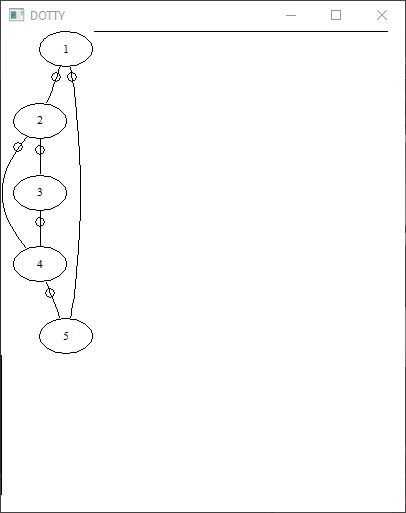
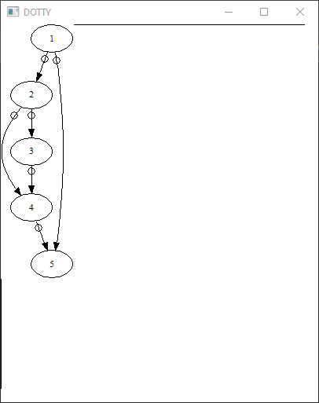

# [22. Graphes](https://www.youtube.com/watch?v=T5MU8NDMMj4)

Bonjour à tous, bienvenue pour cette 22e séance sur votre formation en langage C.

Elle est très spéciale pour le coup puisque c'est la dernière séance pour laquelle vous verrez les structures de données.

Vous avez vu les piles, les fils, vous avez vu les listes ou les listes doublement chaînées, les arbres binaire également et nous allons dans cette séance-là parler des graphes qui est une notion très très très importante et qu'on retrouve beaucoup en informatique et dans les mathématiques, je pourrais d'ailleurs faire une formation complète si on voulait on pourrait faire une formation rien que sur les graphes, rien que sur les arbres.

Il y a tellement de choses en fait qu'on pourrait compter dessus voilà on pourrait en faire une quantité astronomique.

Moi je vais me contenter de quelque chose d'assez simplifié j'ai envie de dire puisque vous êtes habitué maintenant à faire pas mal de structures de données avec tout ce que vous avez vu dans les séances précédentes et je ne voulais pas forcément répéter un peu l'opération comme on a fait avant en faisant les mêmes fonctions toujours un peu le même fonctionnement surtout que les graphes, il y a encore la complexité en plus donc je parle de difficultés à comprendre en fait la notion, les notions qu'il a derrière et je voulais pas vous perdre au bout de deux minutes hein sinon je ne vois pas l'intérêt encore une fois même si on progresse doucement au niveau de la difficulté je préfère que ça reste quand même accessible facilement que vous ne puissiez pas être trop découragé.

Pour ceux qui voudront plus que ce qui est présenté dans la vidéo et ce que vous allez  pouvoir récupérer dans la description de la vidéo, dans les archives où je vous proposerais tout simplement le code source à télécharger.

Vous pouvez évidemment vous renseigner personnellement de votre côté et cetera pour vous renseigner un petit peu sur la ce qu'on appelle **la théorie des graphes**, vous mettre le mot théorie des quelque chose.

Vous avez la théorie des arbres, la théorie des piles, la théorie des listes, etc et vous trouverez tout un tas de contenus avec beaucoup de choses mathématique notamment pour voir un peu comment que ça se passe.

Au moment où j'enregistre cette vidéo il n'y a pas encore de formation algorithmique d'accord donc sur l'algorithme tout ce qui est algorithme et cetera. Sinon c'est quelque chose qui est prévu c'est peut-être déjà en ligne si vous suivez cette formation un petit peu plus tard que que la date où je l'ai publier et dans cette formation algorythmie je propose justement tout ce qui est générale et qui peut du coup se rattacher à n'importe quel langage que ce soit algorythme de tri, de recherche, de parcours, etc.

C'est justement là que ça peut être intéressant le parcours dans des graphes, dans des arbres, etc que je n'ai pas forcément aborder, la complexité, la récursivité bref beaucoup de notions voyez général qui sont vraiment propre à un algorithme plutôt qu'à un langage en particulier donc là nous n'allons pas voir tout simplement de parcours, de graphes et cetera dans cette vidéo puisque je réserve cela pour la formation algorithmes, tout ce qui est algorythmie qui concernera absolument n'importe quel langage c'est quelque chose qui est vraiment à part.

Ici on se contentera absolument que sur les graphes et on va simplifier ça et on va faire en plus sa transition pour la séance prochaine et vous allez voir ça très vite.

Alors passons maintenant que j'ai fait cette petite intro et que je vous ai expliqué rapidement tout ça au développement ou simplement une implémentation de nos graphes alors exceptionnellement j'ai décidé de pas vous faire de schémas, pourquoi alors que c'est l'une des notions, des structures les plus compliqués ? parce que justement comme elle est très compliquée, qu'elle a plusieurs manières d'être représentés, si je fais un schéma ça va tellement être le cafouillis entre les liens, etc, les pointeur tout ça vous allez vous y perdre et au final ça va plus vous embrouiller que vous aidez.

Donc concentrez-vous un maximum sur les explications que je peux donner, sur le code qui est noté, etc. On va aller tranquillement même si cette vidéo est un peu plus longue que ce qui était prévu ce n'est pas grave vous avez l'habitude. Vous pouvez la mettre sur pause autant que vous voulez, reprendre voilà plusieurs fois.

Posez des questions, vous savez qu'il y a le serveur Discord, il y a le site perso bref vous avez tous les moyens de me contacter et poser des questions et vous faire aider par les autres abonnés si besoin donc il y a vraiment tout ce qu'il faut.

Je vais vous montrer du coup comment ça se passe.

On va voir avec les explications et cetera comment ça se passe mais avant tout je pense que ça paraît logique, à quoi peut servir un graphe ? à quoi sert vraiment un graphe ? qu'elle utilité on peut en avoir ? dans quels cas c'est utilisé ? Alors vous utilisez tous internet c'est comme ça d'ailleurs que vous m'avez trouvé et bien **internet est un réseau** on appelle ça la toile mondiale et ce n'est pas pour rien puisque c'est un réseau donc c'est un graphe.

Internet est un graphe qui représente donc tout l'internet, vous pouvez imaginer que chaque site internet d'accord, chaque espace, chaque adresse web, chaque adresse ip si on veut être un peu plus technique est un **noeud**, un **sommet** ce qu'on appellerait un sommet d'un graphe et chaque url en fait qui permet de passer d'un site à l'autre, d'une page à l'autre, d'une adresse ip à une autre donc une espèce de pont sera ce qu'on appelle une **arrêtre** ou un **arc de graphe** donc ces choses que nous allons voir.

On pourrait imaginer comme ça tout un maillage avec plein de petits cercles et tous ces cercles sont reliés comme ça par des droites, des segments qui permettent de les relier les un aux autres, ça peut être un réseau routier, ça peut être un réseau pour les trains, pour les avions, pour n'importe quoi, ça peut être pour un jeu vidéo également on peut retrouver ça.

Par exemple si vous prenez un jeu d'échecs ou ce genre de choses, on peut très bien imaginer un graphe voire même un arbre si on va être encore plus précis pour pouvoir choisir, montrer par exemple la liste des coûts possibles.

Par exemple selon la pièce que vous avez dans un échiquier, il y a une liste de coups que vous avez droit qui sont autorisés à faire et d'autres que vous ne pouvez pas faire.

Chaque pièce se déplace à sa manière donc ça pourrait très bien être définis par un graphe.

Voilà vous avez comme ça plusieurs utilités, ça peut également servir quand on a par exemple plusieurs endroits à faire qu'on devrait calculer un itinéraire et de trouver par exemple quel serait le chemin le plus court en fait pour passer par tous les sommets donc par exemple par tous les noeuds en fait du graphes en prenant les chemins les plus courts par exemple.

Donc ça c'est des petites choses comme ça, voyez des petits algorythme qu'on peut un petit peu déduire de cette représentation.

Voilà grosso modo pour représenter les graphes, encore une fois je ne veux pas vous faire un cours complet sur les graphes, on entrerait dans des mathématiques et plus tellement de l'informatique. Je vous dis que vous pouvez vous renseigner, chercher *Théorie des graphes*  sur internet vous allez trouver tout un tas de propriétés mathématiques, de conditions bref il y a tout un tas de choses intéressantes à voir avec de l'expérience qui ont été faites, avec des histoires de pont justement des chemins bref vous verrez un petit peu l'origine des graves c'est vraiment très intéressante et très passionant.

Nous on va vraiment ici se contenter sur un code et on va s'amuser à représenter ça donc encore une fois comme je l'avais dit c'est pour ça que j'ai pas fait de schémas parce que ça va vraiment être trop trop trop compliqué donc exceptionnellement vous n'en n'aurez pas vous pouvez imaginer tout un ensemble de sommets donc ce sera comme des cercles à chaque endroit qui sont reliés du coup ensemble d'accords par différentes arrêtes et on va représenter ça et de toute manière à la fin de cette vidéo vous aurez quelque chose de visuel sous les yeux donc ne vous en faites pas vous arriverez vraiment à voir ce que c'est au final tout de suite si vous ne comprenez pas vraiment et que ça reste encore assez vague.

Du coup on va directement passer à l'implémentation d'accord j'ai déjà suffisamment parler suffisamment représentés les choses et on va voir un peu ça.

Alors pour représenter les graphes d'une manière informatique, on peut avoir plusieurs manière, on peut faire une matrice d'adjacence, on peut faire **une liste d'adjacence** ou de valeurs adjacentes et on peut faire également une liste d'incidents donc une voilà une liste de valeurs d'incidences mais on verra un petit peu en quoi ça consiste.

Le principe c'est de définir un ensemble de sommets donc nous on va rester sur des choses très simple, on ne va pas commencer à utiliser des chaînes de caractères ou autres encore une fois on va utiliser que des entiers et en plus vous allez voir que la manière dont on va implémenter ça les sentiers seront directement définie au début du programme.

En bref on va choisir dès le début du programme, combien notre graphe possède de sommets et ensuite on va créer les liens que l'on veut entre les différents sommets mais là c'est au choix, on fera ce que l'on veut mais je ne vais pas vous faire de fonction par exemple pour retirer un sommet en ajouter un en cours de programme et cetera.

Encore une fois ça c'est des choses qu'on a vues, répétees avec toutes les autres structures de données donc libre à vous d'améliorer toute l'implémentation des graphes que je vais vous donner ici, d'en faire une autre version, une autre représentation il y en a des tas et des tas possible donc vraiment celle-là n'est pas la seule et elle est très très assez basique quand-même par rapport à ce qu'on va voir même si on pourra déjà faire pas mal de choses comme vous allez le constater très vite.

Voilà donc nous on va s'occuper de représenter ça par une liste d'adjacences et vous allez voir à quoi ça consiste par la suite avec l'implémentation.

Donc la liste d'adjacences tout simplement on va avoir notre graphe d'accord qui va être représenté d'une certaine manière donc avec une structure comme on l'a fait jusqu'à présent et au niveau de nos structures, on va avoir différents éléments qui ont du coup toute leur importance.

On va pouvoir par exemple dire si notre graphe est **orienté ou non** mais je vais vous expliquer ce que c'est, c'est une propriété des graphes.

Il y a des graphes **connexes ou non** mais ça on n'en parlera pas dans la vidéo ça n'a aucun intérêt pour le coup, on va voir le nombre tout simplement de sommets ce qu'on appelle un **vertex** si on emploi le terme anglais, **vertices** si on l'emploie au plurielle et un **edge** donc ça va être un arc, ça va être une arête en fait du graphe donc on utilisera  bien évidemment toujours des termes anglais et on va voir ensuite pour chaque partie du graphe un nombre de voisins, **neigthbor**.

Les voisins c'est simplement sa liste de d'adjacences et la liste d'adjacences contiendra plusieurs éléments qui pourront également être liés à d'autres en fonction des connexions que l'on fera entre les différents sommets.

Donc là je vais certainement déjà en perdre pas mal qui se disent oh je ne comprends pas là alors qu'on a même pas encore noter de code que je suis déjà perdu. Ne vous en faites pas tout ce que je vous dis là, je vais le répéter au niveau de l'implémentation donc on commence déjà.

## Définitions des structures

### Bool

Première chose et là je suis sûr que tout le monde va s'y retrouver, on va faire comme d'habitude alors une petite représentation d'un booléen.

```c
#ifndef __GRAPH__H__
#define __GRAPH__H__

    typedef enum
    {
        false,
        true
    }Bool;

#endif
```

Voilà là-dessus pas de problème donc je rappelle false c'est égal à zéro ici puisque c'est le premier argument, true c'est égal à 1 comme ça ça représente ça comme il faut.

### NodeListElement

Ensuite on va pouvoir passer à la représentation d'un **node** donc un noeud d'accord qui plus tard se chaîner d'accord imaginez une liste chaînée comme ça d'un ensemble de noeud donc nous on va tout simplement l'appeler NodeListElement, `typedef struct NodeListElement`

Je garde les mêmes termes comme j'utilisais dans les séances précédentes avec le Element à la fin question d'habitude, histoire de garder un peu les mêmes termes pour que vous ne soyez pas perdu.

Voilà à ce niveau là et maintenant qu'est-ce qu'on va y mettre ? hé ben on va y mettre la valeur. La valeur ça va être la valeur du noed donc imaginez en fait votre élément, votre sommet d'accord qui va contenir une valeur, on mettra ça là-dedans, `int value`.

Ensuite on va comme c'est un fonctionnement de liste chaînée donc ça normalement vous connaissez puisque vous l'avez vu dans les vidéos précédentes, un NodeListElement flèche  next, c'est le fameux pointeur vers l'élément suivant.

```c
typedef struct NodeListElement
{
    int value;
    struct NodeListElement *next;
}NodeListElement, *NodeList;
```

Normalement ça c'est compréhensible d'accord ça c'est tout à fait le même fonctionnement que la liste chaînée, on a un élément et on a des éléments qui viennent à sa suite jusqu'à temps qu'à qu'on arrive sur *next* ça veut dire qu'il y en a plus donc là si déjà vous ne comprenez pas jusqu'ici je vous conseille tout de suite d'arrêter cette vidéo et de revoir les structures précédente ou au moins celle des listes histoire de bien comprendre tout ça et de mieux appréhender ce qui va venir ici.

`...}NodeListElement, *NodeList;` c'est un peu toujours la même syntaxe que j'ai utilisée en mettant Node... ici du coup le pointeur en enlevant le mot *Element*.

Voilà comme ça vous êtes pas dépaysés, vous savez alors on va commenter le code très rapidement donc il sera complètement commenté au niveau du code que vous allez récupérer dans la description de la vidéo, en fonction ne vous en faites pas vous aurez tout ce qu'il faut: *Définition d'un noeud (sommet)*, *Définition d'un Bolléen*.

```c
#ifndef __GRAPH__H__
#define __GRAPH__H__

    /* Définition d'un Bolléen */
    typedef enum
    {
        false,
        true
    }Bool;

    /* Définition d'un Noeud (sommet) */
    typedef struct NodeListElement
    {
        int value;
        struct NodeListElement *next;
    }NodeListElement, *NodeList;

#endif
```

Voilà c'est mieux de prendre l'habitude de commenter un minimum surtout quand vous reprenez un code quelques semaines, voir même quelques jours après ça peut devenir des fois très peu compréhensible.

### AdjencyListElement

Ensuite on va définir tout simplement notre fameuse **liste d'adjacences** d'accord je vous  avais dit qu'on va avoir une liste d'éléments adjacents et vous allez voir qu'on va travailler avec une sorte de tableau en fait tout simplement.

Vous savez qu'un tableau on peut sans problème maintenant utiliser l'allocation dynamique et c'est justement ce que l'on va faire.

Donc on va définir une liste d'adjacences, *Définition d'une liste d'adjacence* et vous voyez je n'utilise pas le code d'avant parce que je pars du principe par exemple qu'on a on aurait vraiment que cette structure.

```c
/*Définition d'une liste d'adjacence*/
typedef struct AdjencyListElement
{
    NodeListElement *begin;
}AdjencyListElement, *AdjencyList;
```

Donc on va l'appeler AdjencyListElement et dedans on met `NodeListElement *begin;` avec begin donc on va dire le premier en fait d'accord on démarre par celui-là c'est la tête en fait si vous voulez de la liste d'adjacences donc moi je l'appelle begin, vous pouvez l'appeler head, start comme vous voulez encore une fois c'est qu'un nom et c'est pas spécialement important tant que vous arrivez à vous comprendre quand vous vous relisez c'est le principale et là on va mettre ça `...}AdjencyListElement, *AdjencyList;` voilà d'accord.

Donc là déjà voyez qu'on rajoute un truc en plus par rapport à ce qu'on avait vu avant mais rien de compliqué avec un petit pointeur qui va pointer vers un premier élément de ce type là `NodeListElement` rien de nouveau et c'est tout.

Alors plus tard si vous voulez améliorer cette structures, on pourrait ajouter d'autres éléments.

On pourra rajouter le nombre de sommets qu'on aurait ce genre de choses ou le nombre d'éléments que vous avez par exemple dans votre liste, libre à vous de le faire moi encore une fois je reste au plus simple histoire que ce soit vraiment compréhensible et accessible pour tout le monde sinon je ne vois pas l'intérêt.

S'il n'y a que deux personnes qui comprennent sur quelques centaines c'est pas intéressant dans tous les cas vous aurez vu quelque chose de concret qui fonctionne.

### GraphElement

Et là on va définir le graphe maintenant on va faire ça donc *Définition d'un graphe*.

```c
/* Définition d'un graphe */
typedef struct GraphElement
{
    Bool is_oriented;
    int nb_vertices;
    AdjencyList tab_neighbours;
}GraphElement, *Graph;
```

Alors ce qui est important c'est de définir un bouléen ici et on va l'appeler *is_oriented*.

Le graphe est orienté.

Qu'est ce que ça veut dire qu'un graphe est orienté ? et bien imaginer par exemple vous avez un point A et un point B et on vous dit que vous pouvez aller du point A au point B d'accord et également du point B au point A.

Si c'est le cas. Si par exemple dans un graphe tous les sommets peuvent aussi bien aller de l'un à l'autre et de l'autre à l'un, du coup partout dans le graphe, on dit que le graphe est non orienté c'est-à-dire qu'on peut se déplacer dans toutes les directions possibles.

Si par contre il y a un endroit où on peut se déplacer que de A vers B ou que de B vers A, à ce moment-là votre graphe est orienté d'accord donc ça vous allez voir que ça va être  intéressant parce que moi je vais vous proposer de représenter les deux types de graphe ce sera un petit plus que vous aurez comme ça au niveau de cette représentation.

Donc on va le garder ici en bouléen pour définir tout de suite si notre graphe et orienté ou non donc ça me paraît intéressant.

Alors ça c'est super intéressant c'est le nombre de sommets, le `int nb_vertices;` et j'utilise le terme anglais donc le nombre de sommets ce sont un petit peu les endroits où vous pouvez aller.

Imaginez si on prend les cartes routières et que les sommets sont des villes d'accord lyon, Paris, Marseille, Nice et cetera d'accord et que les arêtes soientt en fait par exemple le nombre de kilomètres qu'il faut faire. Alors nous on ne va pas y mettre des choses dans les arrête ou dans les dans les graphes parce que ça encore une fois ça va compliquer encore un peu plus le graphe et ça va déjà être suffisamment compliqué comme ça quand vous allez vous en rendre compte donc vous imaginez juste que vous avez en fait différentes villes et vous avez des arrêtes qui permettent de relier une ville à une autre.

Il y a certaine ville qui sont accessibles de l'une à l'autre et d'autres qui ne le sont pas forcément même si dans la vraie vie on peut s'y retrouver mais imaginez dans votre tête que certaines villes peuvent être rejointe l'une à l'autre et d'autres non.

D'accord il y a des villes qu'on ne pourrait pas rejoindre n'importe quel endroit à partir de n'importe ou donc on peut s'imaginer ça donc c'est important évidemment de savoir le nombre de sommets qu'on va avoir dans notre graphe.

Si je reprenais la représentation de la carte routière, ce serait à ce moment là le nombre  de villes et ici on va avoir notre fameuse liste `AdjencyList tab_neighbours;` et je vais l'appeler tab_neighbours pour le tableau des voisins en fait d'accord.

`AdjencyList tab_neighbours;` donc là c'est la liste des voisins simplement la
liste d'adjacences voilà voilà donc là on est bon au niveau de la représentation ici.

## new_graph

### Prototype de new_graph

Ensuite on va pouvoir passer aux prototypes et notamment dans l'implémentation vraiment de ce qu'on fait à ce niveau là donc on va passer par une première implémentation de fonctions qui est évidemment celle qui va nous permettre de créer notre graphe ok.

Alors on va partir du principe qu'on crée un nouveau graphe qu'on va appeler `Graph new();` ça paraît logique comme on a toujours fait jusqu'à présent sauf que là on va lui passer ça ce que je vous ai dit c'est ce qui va un petit peu changé parce parce que sinon on aurait vraiment quelque chose de compliqué donc en bref on aurait un graphe vide et il aurait fallu que je vous fasse une fonction pour ajouter un sommet un par un, ensuite ajouter des arête et ensuite pouvoir enlever des sommets, pouvoir enlever des arrêtes.

Bref ça aurait été vachement bien c'est sûr parce que ce serrait du coup très très flexible, on aurait énormément de fonction et ça va être vraiment être très très très compliqué donc libre à vous de le faire, ça pourraît être un très bon exercice si vous voulez vous entraîner là dessus que vous avez bien compris toutes les structures avant de passer à la suite de la formation mais personnellement moi je me contenterai de ce que je vous donne ici.

Ce sera encore une fois déjà bien assez compliqué pour la majorité des personnes qui veulent aller plus loin encore une fois allez-y voilà ne vous contentez pas seulement de ce que je vous montre en vidéo l'intérêt c'est que vous soyez après autonome et que vous soyez curieux de s'intéresser à des choses encore plus compliquées, encore plus avancées.

```c
/* Prototypes */
Graph new(int vertices, Bool is_oriented);
```

Là on va noter `int vertices` donc c'est le nombre de sommets qu'on va vouloir créer à notre graphe à sa création par exemple dès le début je pourrais dire je veux créer un graphe qui a cinq sommets par exemple ou alors je crée un graphe qui en a dix et cetera.

`int vertices`, on pourra comme ça définir automatiquement à la création du graphe combien on veut de sommets et ensuite il y a tout simplement parce que ça paraît logique parce que ce graphe est orienté ou non, est-ce qu'on le veut orienté ou non ? `Bool is_oriented`.

Voilà ça c'est la base.

```c
#ifndef __GRAPH__H__
#define __GRAPH__H__

    /* Définition d'un Bolléen */
    typedef enum
    {
        false,
        true
    }Bool;

    /* Définition d'un Noeud (sommet) */
    typedef struct NodeListElement
    {
        int value;
        struct NodeListElement *next;
    }NodeListElement, *NodeList;

    /*Définition d'une liste d'adjacence*/
    typedef struct AdjencyListElement
    {
        NodeListElement *begin;
    }AdjencyListElement, *AdjencyList;

    /* Définition d'un graphe */
    typedef struct GraphElement
    {
        Bool is_oriented;
        int nb_vertices;
        AdjencyList tab_neighbours;
    }GraphElement, *Graph;

/* Prototypes */
Graph new(int vertices, Bool is_oriented);

#endif
```

### Implémentation de new_graph

Alors notre première implémentation.

Et là on va essayer de ne pas aller trop vite histoire que ce soit clair pour vous. 

C'est parti.

```c
#include <stdio.h>
#include <stdlib.h>
#include "graph.h"

Graph new_graph(int vertices, Bool is_oriented)
{
    int i;
    GraphElement *element;
    element = malloc(sizeof(*element));
    if(element == NULL)
    {
        fprintf(stderr, "Erreur : Probleme creation Graphe.\n");
        exit(EXIT_FAILURE);
    }

    element->is_oriented = is_oriented;
    element->nb_vertices = vertices;

    element->tab_neighbours = malloc(vertices * sizeof(AdjencyListElement));
    if(element->tab_neighbours == NULL)
    {
        fprintf(stderr, "Erreur : Probleme creation Graphe.\n");
        exit(EXIT_FAILURE);
    }
    for(i=1;i<element->nb_vertices+1;i++)
        element->tab_neighbours[i-1].begin=NULL;

    return element;
}
```

Alors comment ça va se passer pour cette implémentation ? il suffit simplement comme vous le savez d'initialiser les structures d'accord donc on va utiliser déjà un compteur `int i;` alors on ne le faisait jamais avant parce que des fois on faisait juste un `return 0;` dans la création d'une nouvelle structure mais là ça va être un peu différent et je vais vous montrer pourquoi donc ça on va s'en parce que j'aurai besoin d'un compteur, vous allez voir après.

Après on commence par créer un `GraphElement *element;` donc c'est simplement mon graphe et on va faire un `element = malloc(sizeof(*element));`. La syntaxe vous la connaissez bien depuis le temps alors ici rien de différent de d'habitude.

On test et on fait un fprintf sur la sortie d'erreur standard et on met *Erreur Probleme creation Graphe.*. On change un peu les messages pour les rendre un peut plus humain. Si jamais la location ne s'est pas passé correctement on quitte évidemment le programme, ça je ne vous apprends rien maintenant vous avez l'habitude et on va du coup pouvoir passer au remplissage des choses.

Déjà on a si on regarde un peu la structure `struct GraphElement`.

```c
/* Définition d'un graphe */
typedef struct GraphElement
{
    Bool is_oriented;
    int nb_vertices;
    AdjencyList tab_neighbours;
}GraphElement, *Graph;
```
on a le nombre de vertices, de sommets `int nb_vertices;`.

Alors pour commencer dans l'ordre pour ne pas vous perdre déjà `element->is_oriented = is_oriented` dans lequel on copie `is_oriented` qui a été passé à la fonction `Graph new_graph(int vertices, Bool is_oriented)`.

Bref à la création du graphe, on aura juste à mettre *true* ou *false* ici en paramètre à l'appel de la fonction `Graph new_graph(int vertices, Bool is_oriented)` tout simplement pour écrire le mot puisque je vous rappelle qu'on a défini cette petite énumération.

```c
/* Définition d'un Bolléen */
typedef enum
{
    false,
    true
}Bool;
```

Ici sinon on aurait dû mettre 0 ou 1 donc c'est juste que c'est plus compréhensible en mettant true ou false.

Ensuite on va avoir notre fameuse valeur pour le nombre de sommets et ça va évidemment être vertices, `element->nb_vertices = vertices;`.

Ainsi je rappelle ce sont deux paramètres (is_oriented et vertices) qu'on a passé donc on les enregistre juste dans la structure. Jusque-là pas de soucis, on va doucement et on ne va pas se perdre non plus.

Ensuite et c'est là que c'est intéressant, vous avez vu que la liste d'adjacences `AdjencyListElement` va avoir un certain nombre d'éléments d'accord ces éléments qui seront remplies ensuite avec ces systèmes de noeuds (struct NodeListElement) donc le paramètre `int vertices` ça dépend du nombre de sommets qu'on a choisi d'accord donc on va devoir du coup faire une allocation dynamique que l'on sépare ici des autres.

Voilà un petit malok `element->tab_neighbours = malloc(vertices * sizeof(AdjencyListElement));` c'est le malloc du nombre de sommets qu'on a choisi multiplié par nombre de choses qu'on veut alors ici je vais vous noter carrément le nom `AdjencyListElement` pour que vous puissiez comprendre que c'est ça que l'on fait.

Ainsi on fait autant de fois ça `AdjencyListElement` d'accord d'éléments d'adjacences comme ça donc avec `*begin` qui pointera sur le premier qu'il y à de sommets d'accord donc dans la structure `struct GraphElement` si vous regardez bien on va avoir le nb_vertices multiplié par la liste d'adjacences et chacune des lits d'adjacences pointera vers un premier élément qui sera node et ce node sera c'est une liste chainée d'accord qui a plusieurs éléments éventuellement. 

Je ne sais pas si vous voyez un petit peu la représentation or là je pense que si vous écoutez bien ce que je vous dit ce sera plus simple quitte à ce que vous faites en même temps un petit schéma sur un papier ou autre, faites-le pour comprendre ce que vous dessinez plutôt admettons que je vous aurais fait un schéma avec plein de traits dans tous les sens, des flèches et franchement quand vous allez vous le représentez déjà de votre côté vous allez voir que très vite on se retrouve avec des traits dans tous les sens.

C'est pour ça que j'ai dit que je vais éviter les schémas pour ce coup-ci parce que sinon ça va être du grand n'importe quoi, vous avez déjà vu dans certaines vidéos précédentes c'était déjà limite au niveau des représentations donc là je me suis qu'on va peut-être éviter donc c'est bon à ce niveau là.

Par contre ce qui va être quand même pas mal c'est tester `if(element->tab_neighbours == NULL)` et ici on met le même message d'erreur, on ne s'embête pas.

Voilà donc je vérifie tout, on a créé un élément `GraphElement *element;` on l'a du coup réservé cet élément, `element = malloc(sizeof(*element));` en effet mit la place qu'il fallait pour créer un nouveau graphe. On vérifie la location `if(element == NULL)`, ensuite du coup on stocke bien l'orientation qu'on a pris à l'appel `element->is_oriented = is_oriented;`. On stocque bien le nombre de sommets que l'on veut `element->nb_vertices = vertices;` et du coup on alloue autant de liste d'adjacences qu'il y a de sommets parce que chaque sommet aura une liste d'adjacences.

En bref chaque sommet va avoir une liste d'autres sommets sur lesquels on peut aller c'est à dire qui permettra de définir les liens qu'on a entre eux donc c'est ça qu'on mettra en place.

Et du coup on vérifie l'alocation de tout ça.

Voilà écoutez je pense que là on est ok, s'il y a des erreurs de toute manière on les verra à la compilation et s'il y a une erreur, on le corrige directement ensemble et vous voyez que justement voilà ça peut arriver, je peut faire des erreurs de compilation aussi, ne vous en faites pas là dessus.

Voilà maintenant je dois initialiser ceci au niveau de ma table d'adjacences d'accord.

```c
/*Définition d'une liste d'adjacence*/
typedef struct AdjencyListElement
{
    NodeListElement *begin;
}AdjencyListElement, *AdjencyList;
```

J'initialise chacun au niveau de ma table d'adjacences d'accord donc je vais utiliser mon fameux compteur, c'est pour ça qu'il le fallait et je vais **choisir de commencer à 1** pourquoi ? puisque en fait je veux que par défaut par exemple si je dis que je veux cinq sommets ainsi je veux qules nomme 1 2 3 4 5. Si j'en veux trois, je qui les nomme 1 2 3 encore une fois on ne va pas utiliser des chaînes de caractères ça va complexifier le code pour rien donc nous on va partir de ce principe: *c'est qu'il y aura en fait autant de sommets qu'on a choisi et le premier sommet commencera à 1 jusqu'à le nombre qu'on a donné en fait ici en paramètre `int vertices` donc si c'est 10 et bien il y aura 10 sommet de 1 à 10 tout simplement.

Donc je vais dire de i qu'on initialise du coup à 1, et on met plus petit parce que je préfère qu'on mette le nombre de sommet +1 (sinon vous mettez plus petit ou égal, ou différent), `for(i=1;i<element->nb_vertices+1;i++)` voilà on ajoute le +1 après le complément donc si j'avais commencé à 0 si par exemple je voulais qu'il soit nommé de 0 à 9 par exemple si on avait 10 sommets, vous mettez i=0 et là vous enlevez le +1 d'accord, *for(i=0;i<element->nb_vertices;i++)* ainsi vous adoptez un le code c'est vraiment vous qui voyez. Et à partir de là du coup je met que `element->tab_neighbours[i-1].begin = NULL;` donc je met -1 parce que je commence à 1 mais si je commençais à 0 encore une fois, vous ne mettez que i *element->tab_neighbours[i].begin = NULL;* d'accord donc voilà vraiment vous adapter comme vous voulez mais vous ajoutez à la suite le .begin et ce ce n'est pas une flèche puisque c'est juste un tableau qu'on a fait d'accord.

```c
for(i=1;i<element->nb_vertices+1;i++) //i=0;i<element->nb_vertices;i++
    element->tab_neighbours[i-1].begin = NULL; //element->tab_neighbours[i].begin = NULL;
```

Et voilà comme on ne met rien du tout, on initialise le begin à NULL.

On évite vraiment de laisser des pointeurs ou autre en mettant rien dedans, on met à NULL, on met à zéro et cetera bref on initialise au maximum pour être sûr qu'il n'y ai pas  n'importe quoi.

Ca c'est fait et du coup je crois que l'ont peut déjà retourner l'élément puisqu'on a tout géré `return element;`, voilà exactement comme c'est NULL pour le moment on n'a pas encore fait de node.

Bon normalement au niveau de la création du graphe, on est bon voyez que dès le début vous voyez que je ne vais pas lancer mon jeu parce que je fais déjà des allocations ça veut dire que je vais déjà devoir faire des libérations de mémoire donc je préfère vraiment vraiment attendre et on fera notre fonction de libération donc on verra ça plus tard.

On ne va pas libérer la mémoire parce que je part du principe qu'il va y avoir besoin d'utiliser les nodes parce qu'on part du principe qu'il y aura des sommets vraiment créé dans notre graphe donc faudra lkes libérer et comme on ne les avons pas encore vu ça va être un peu compliqué donc on va se contenter de ça pour le moment.

On va partir du principe que ça fonctionne et si à la compilation ça ne fonctionne pas, on le verra très vite et on pourra corriger en conséquence.

Là à priori ça a l'air d'être bon mais on n'est pas à l'abri d'une erreur donc on verra ça plus tard.

Ok donc ça c'est la création du graphe.

```c
#include <stdio.h>
#include <stdlib.h>
#include "graph.h"

Graph new_graph(int vertices, Bool is_oriented)
{
    int i;
    GraphElement *element;
    element = malloc(sizeof(*element));
    if(element == NULL)
    {
        fprintf(stderr, "Erreur : Probleme creation Graphe.\n");
        exit(EXIT_FAILURE);
    }

    element->is_oriented = is_oriented;
    element->nb_vertices = vertices;

    element->tab_neighbours = malloc(vertices * sizeof(AdjencyListElement));
    if(element->tab_neighbours == NULL)
    {
        fprintf(stderr, "Erreur : Probleme creation Graphe.\n");
        exit(EXIT_FAILURE);
    }
    for(i=1;i<element->nb_vertices+1;i++)
        element->tab_neighbours[i-1].begin=NULL;

    return element;
}
```

## is_empty_graph

On va ensuite passer à autre chose et cette fois ci on va faire la fameuse fonction pour vérifier si le graphe est vide donc là ça va être vraiment très très simple.

```c
Bool is_empty_graph(Graph G);
```

Là c'est assez simple si c'est NULL, on retourne true sinon on retourne false, voilà.

```c
Bool is_empty_graph(Graph g)
{
    if(g == NULL)
        return true;
    
    return false;
}
```

Voilà donc très simple encore une fois j'ai été très vite puisque ça vous connaissez c'est toujours toujours un peu la même chose sur chacune des structures qu'on a vu en tout cas moi je voulais vous la représenter tel quel pour que ce soit simple donc voilà si on a un graphe qui en fait qui est NULL donc qui n'existe pas donc un graphe vide parce que vous voyez qu'à partir du moment où on fait seulement créer un graphe il n'est pas vraiment vide puisqu'on a déjà fait de la location donc là c'est un peu différent de ce qu'on a pu voir dans les autres structures.

Voilà s'il n'y en a pas c'est NULL, c'est qu'il n'y a vraiment rien du tout donc ça c'est bon pour la deuxième fonction et on va pouvoir passer à la suite.

## add_node

Alors on va arriver sur des choses un peu plus complexe évidemment.

Notre graphe va avoir besoin d'une fonction particulière qui va nous permettre de créer un noeud.

Un noued ça va vraiment permettre en fait de remplir si vous voulez notre sommet d'accord de le créer vraiment au niveau de la structure et pour on dire `NodeList` donc c'est une liste plus exactement et donc imaginez une liste chaînée d'accord ça reprend exactement les mêmes principes que ce qu'on a vu dans la liste chaînée sauf que plutôt que se dire qu'on va réutiliser le code des listes chaînées parce que nos listes elles manipulent comme vous avez vu des entier il aurait fallu l'adapter mais là je préfère qu'on parte vraiment de zéro pour tout ça pour que ce soit plus clair donc `NodeList add_node(int x);` et on demande quel élément on rajoute donc ça c'est bon.

```c
NodeList add_node(int x)
{
    NodeList n = malloc(sizeof(NodeListElement));

    if(n == NULL)
    {
        fprintf(stderr, "Erreur : Probleme creation Node.\n");
        exit(EXIT_FAILURE);
    }

    n->value = x;
    n->next = NULL;

    return n;
}
```

Alors c'est une petite fonction aussi puisqu'encore une fois c'est juste rajouter un élément qu'on crée et puis c'est tout et on la retourne parce qu'elle va nous servir pour une autre fonction ainsi c'est vraiment une petite fonction en interne en fait qui va servir pour le reste au niveau de notre implémentation donc là je vais définir un NodeList que je vais appeler n parce qu'il y a tellement peu de choses qu'on a pas besoin de mettre un nom explicite `NodeList n = malloc()` on s'en fiche.

Ainsi je vais faire un malloc() avec un sizeof() de NodeListElement tout simplement, `NodeList n = malloc(sizeof(NodeListElement));`.

Et toujours la même vérification, `if(n == NULL)` avec le message *Erreur : Probleme creation Node.*.

Alors je rappelle qu'un node c'est un noued, c'est ce qui serra représenté en fait après nos sommets, on aura nos sommets dans le graphe donc ça c'est ok.

Du coup qu'est-ce qu'on a si vous regardez au niveau du node ? il a une valeur et un élément next.

```c
/* Définition d'un Noeud (sommet) */
typedef struct NodeListElement
{
    int value;
    struct NodeListElement *next;
}NodeListElement, *NodeList;
```

Ainsi c'est vraiment très simple value prend l'élément en paramètre `n->value = x;` et l'élément suivant il n'y en a pas donc c'est NULL `n->next = NULL` parce qu'on va le réutiliser et on retourne n, `return n;`.

C'est une fonction qui vous permet en fait d'obtenir n par contre j'aurais même pu l'appeler get_node() pour être plus exact mais c'est pas tellement grave et au niveau du nom on va garder ça donc elle rend un node donc un noeud qu'on a tout simplement ici implémenter surtout qu'on à allouer dynamiquement ça c'est important.

Voilà pour le moment vous n'en voyez pas l'utilité de cette petite fonction mais vous allez le voir juste après ne vous en faites pas, on va voir ça plus en détail donc on va passer  maintenant que vous avez vu un petit peu comment fonctionne les listes, on va faire notre petite fonction de nettoyage.

## erase_graph

### Définition erase_graph

Cette fonction de nettoyage ne retourne rien puisqu'elle va vraiment l'effacer c'est-à-dire qu'elle ne va pas vous rendre un graphe vide puisqu'ici new_graph() le graphe n'est pas vraiment vide puisqu'on alloue déjà des choses.

Nous l'intérêt c'est de libérer la mémoire donc on ne retourne rien ça va vraiment tout éffacer et il faudra recréer un nouveau graphe avec la fonction de graphe.

```c
void erase_graph(Graph g);
```

Elle prend un graphe.

### Parenthèse pointeur et structure

Là alors petite parenthèse parce qu'il y en a plein qui me pose la question parce qu'ils voient à chaque fois que je faisais toujours ces structures-là où je m'étais par exemple un terme ici `GraphElement` qui est le même que là `struct GraphElement` et ensuite avec le pointeur je mettais un terme raccourci `*Graph` c'est-à-dire que je changeais le nom.

```c
/* Définition d'un graphe */
typedef struct GraphElement
{
    Bool is_oriented;
    int nb_vertices;
    AdjencyList tab_neighbours;
}GraphElement, *Graph;
```

Il faut comprendre qu'en fait quand vous mettez ceci `Graph g` c'est égal à faire `GraphElement *g` avec le pointeur g d'accord.

```c
//Graph g == GraphElement *g
```

C'est juste ce système de notation `...}GraphElement, *Graph;` ça permet de masquer en fait l'utilisation du pointeur et du coup de simplifier la lisibilité du code c'est pour ça que par exemple vous voyez ici je n'ai pas besoin de mettre le pointeur.

```c
NodeList add_node(int x)
{
    NodeList n = malloc(sizeof(NodeListElement));
}
```

Dans NodeList, je n'ai pas besoin de mettre de pointeur, je peux mettre n tout simplement très pratique sinon si je voulais mettre un pointer il aurait fallu je l'appelle NodeListElement.

```c
NodeList add_node(int x)
{
    NodeListElement *n = malloc(sizeof(*n));
}
```

Voilà et j'aurais même pu optimiser en faisant ça `sizeof(*n)`.

Vraiment il ne faut pas être choqué par rapport à cette syntaxe mais c'est juste une question de masquage en fait de pointeur d'accord mais comme on me l'a demandé c'est vrai en commentaire du coup je me suis dit que ça pouvait être bien de le préciser dans cette petite vidéo comme c'est la dernière structure qu'on va voir sur cette formation.

### Début implémentation erase_graph

```c
void erase_graph(Graph g)
{
    if(is_empty_graph(g))
    {
       printf("Rien a effacer, le Graphe n'existe pas.\n");
       return; 
    }

    //...
}
```

Voilà donc du coup on revient sur erase_graph() donc ça c'est pour supprimer simplement.

Première chose déjà si le graphe est vide `` on ne va pas le supprimer avec le message *Rien a effacer, le Graphe n'existe pas.* donc je ne met un style d'erreur standard parce que c'est pas une erreur en fait c'est juste qu'il en a pas donc il n'y en a pas.

On ne retourne rien du tout puisque c'est du void.

Alors ensuite on va rester comme ça puisqu'on a pas encore vu l'ajout d'arrête et donc continuera de la compléter après, c'est pas grave.

## add_edge

On va pouvoir et ça c'est important créer la fonction qui va nous faire lire.

Là vous voyez qu'on a créer nos sommets et imaginez que si je choisit de faire un graphe de 5 sommets, il va y avoir un sommet 1, 2, 3, 4, et 5 et moi je veux pouvoir ensuite moi-même définir moi-même mon choix et quel lien je fait.

Est ce que je relis le 1 et le 5, est-ce que je relie le 3 avec le 2, est-ce que je relis le 2 avec le 1 donc ça on va évidemment créer une fonction pour l'avoir parce que c'est quand même tout l'intérêt.

On va l'appeler add_edge() puisque edge c'est pour un arc, une arrête en termes anglais sur un graphe g, il va y avoir src et vous verrez pourquoi je dis ces noms plutôt que juste par exemple v1 et v2 ou sommet1 et sommet2... et enfin dest pour destination. C'est pas pour rien parce que vous avez vu que l'on peut faire des graphes orienté ou pas, c'est au choix donc ça va permettre de fonctionner en tout cas suivant le type de graphe qu'on a créé.

```c
void add_edge(Graph g, int src, int dest)
{}
```

Donc là je vais faire déjà ce qui concerne un graphe orienté d'accord c'est à dire que je pars du principe que mon graphe par défaut il est orienté logique c'est-à-dire que là on peut aller que de A vers B et pas de B vers A par exemple donc j'ai un minimum de choses à faire, on va créer du coup un noeud tout simplement comme d'habitude on va faire comme ça `NodeList n`, *Par défaut : Graphe orienté !* histoire de vous orienté au niveau du code.

```c
void add_edge(Graph g, int src, int dest)
{
    //Par défaut : Graphe orienté !
    NodeList n = add_node(dest);
}
```

A partir de là, je vais utiliser ma fameuse fonction add_node() et je lui passe destination pourquoi je passe destination ? parce qu'on ne peut aller que de A à B donc on peut aller que de source à destination donc le seul endroit atteignable c'est destination.

C'est la destination que je crée ici. 

Ensuite du coup je dis `n->next = g->tab_neighbours[src-1].begin` où je me décale de 1 parce que je vous rappelle que j'ai décide de commencer les numéro des sommets par 1 plutôt que 0 donc je mets -1 ici sinon j'aurais juste mis src donc la source et c'est .begin d'accord.

Alors prenez le temps de relire, prenez le temps de revoir d'accord donc *g->tab_neighbours* c'est tout le graphe d'accord et *src-1* va être le premier élément ici *src-1* va être  remplacé par l'indice 0 dans begin.

```c
void add_edge(Graph g, int src, int dest)
{
    //Par défaut : Graphe orienté !
    NodeList n = add_node(dest);
    n->next = g->tab_neighbours[src-1].begin;
}
```

*src-1* va être  remplacé par l'indice 0 dans begin donc ça veut dire que `n` va devenir le premier élément de la liche chaînée en fait des noeuds d'accord effectivement c'est ce qu'on a ajouté donc on fait ça d'accord.

Et ensuite parce que ce n'est pas suffisant, on prend notre petit tableau de l'indice 0 point begin `g->tab_neighbours[src-1].begin` est égal au node.

```c
void add_edge(Graph g, int src, int dest)
{
    //Par défaut : Graphe orienté !
    NodeList n = add_node(dest);
    n->next = g->tab_neighbours[src-1].begin;
    g->tab_neighbours[src-1].begin = n;
}
```

Voilà donc là en fait en a mis si vous voulez toute la partie qu'on avait, l'ensemble des voisins si bien sûr il y en a parce que si il n'y en a pas, ce serait égal à NULL `g->tab_neighbours[src-1].begin = NULL` si c'est égal à NULL. On a mit `g->tab_neighbours[src-1].begin` sur la suite du node `n->next` donc les éléments suivants on a décalé et en premier on a mit du coup le node qui devient premier élément, n devient le premier élément.

```g->tab_neighbours[src-1].begin = n;
```

Le node nouvellement créée et devient le premier élément, il devient begin si vous voulez. Le node nouvelement créé devient la tête donc ça c'est important et vous verrez pourquoi.

Donc ça c'est dans le cas où notre graphe est orienté et si maintenant le graphe est non orienté mais en tout cas ça c'est à faire dans tous les cas.

```c
void add_edge(Graph g, int src, int dest)
{
    NodeList n = add_node(dest);
    n->next = g->tab_neighbours[src-1].begin;
    g->tab_neighbours[src-1].begin = n;
}
```

Ca c'est à faire dans tous les cas que le graphe soit orienté ou non-orienté c'est-à-dire que dans tout les cas c'est à faire.

Par contre si le graphe est non orienté on va avoir un bout de code en plus donc on va faire une condition, si mon graphe est l'inverse de `is_oriented` avec un point d'exclammation comme vous savez faire s'il est l'inverse de `g->is_oriented`.

```c
void add_edge(Graph g, int src, int dest)
{
    NodeList n = add_node(dest);
    n->next = g->tab_neighbours[src-1].begin;
    g->tab_neighbours[src-1].begin = n;

    if(!g->is_oriented)
    {

    }
}
```

Voilà si c'est l'inverse de `!g->is_oriented` c'est-à-dire que s'il n'est pas orienté je vais faire des choses en plus, ça va être exactement le même code qu'avant sauf que ce n'est pas destination mais du coup c'est src, on inverse.

```c
void add_edge(Graph g, int src, int dest)
{
    NodeList n = add_node(dest);
    n->next = g->tab_neighbours[src-1].begin;
    g->tab_neighbours[src-1].begin = n;

    if(!g->is_oriented)
    {
        n = add_node(src);
        n->next = g->tab_neighbours[dest-1].begin;
        g->tab_neighbours[dest-1].begin = n;  
    }
}
```

On inverse (dest->src) c'est à dire qu'on disait que node peut aller de sources vers destination mais là comme ici je rentre dans le cas où il serait non orientés `!g->is_oriented` et ben je lui dis qu'il peut également aller de destination à source donc je fais ça. Ensuite ce n'est plus `[dest-1]` mais `[src-1]` voilà donc vous inverser en fait les termes.

Alors c'est la même chose ce code-là sauf que vous remplacer tous les *dest* par *src* mais il ne suffit pas de remplacer, il faut que vous compreniez aussi le code et pourquoi j'ai fait ça d'accord vraiment de comprendre.

Grâce à ça on va pouvoir du coup définir un arc donc une arête entre deux sommets donc deux vertex, pardon vertices et pour dire en fait qu'on peut aller du A vers B et du B vers A.

Ainsi on pourra aller du sommet 1 vers le sommet 2 et également du sommet 2 vers le sommet 1 d'accord on peut faire l'aller-retour en fait on peut faire dans les deux sens.

Si c'était orienté, on pourrait aller que dans un sens ou dans l'autre.

Je pense que maintenant le système d'orienté/non orienté vous l'avez suffisamment compris vu le nombre de fois où je l'ai répété dans la vidéo mais c'est mieux de le répéter un peu plus de fois pour que tout le monde ait bien compris.

Voilà donc ça c'est dans le cas où effectivement le graphe n'est pas orienté et ça de toute façon qu'il soit orienté ou non, on doit le faire ainsi faut bien qu'on ajoute quand même quelque chose, faut bien qu'on fasse une liaison de A vers B au minimum après si c'est également de B vers A on fait cela `if(!g->is_oriented)` et c'est du coup via cette  condition-là qu'on le vérifie et on peut s'arrêter-là.

On va s'arrêter-là du coup puisque j'ai tout fait, on a créé la liaison de source vers destination et s'il est non orienté de destination vers source donc c'est bon.

Voilà pour l'ajout de notre arrête tout simplement d'éléments.

### Fin implémentation erase_graph

Maintenant bah écoutez on n'a plus qu'à compléter un peu erase_graph().

```c
void erase_graph(Graph g)
{
    if(is_empty_graph(g))
    {
       printf("Rien a effacer, le Graphe n'existe pas.\n");
       return; 
    }

    //...
}
```

On va compléter cette partie là parce que c'est ce que j'attendais en fait au niveau de ça pour tester le code puisque là on n'a rien tester du fait qu'il faut bien libérer la mémoire puisque j'ai pas envie de faire des fuites mémoires sur le pc.

Du coup comment comment ça va se passer ? déjà si on a des sommets adjacents donc comment le vérifier ainsi *Si sommets adjacents* donc vraiment s'il y a une liste d'adjacences donc on va vérifier tout simplement via ça `if(g->tab_neighbours)` d'accord si ça ça existe donc si c'est pas nul, si ce n'est pas égal à false quelque chose comme ça on va avoir un certain nombre de choses.

```c
void erase_graph(Graph g)
{
    if(is_empty_graph(g))
    {
       printf("Rien a effacer, le Graphe n'existe pas.\n");
       return; 
    }

    if(g->tab_neighbours)
    {

    }
}
```

Alors là il ne faut pas se tromper parce que mine de rien ça c'est quand même la fonction la plus importante, c'est celle qui va libérer la mémoire correctement donc on va essayer de ne pas se tromper, pas faire de bêtises donc je vais avoir besoin d'un pointeur logique puisqu'à la création j'en ai utilisé un donc à priori je devrais en utiliser un pour la libération, `int i;`.

Je vais faire un `for(i=1 ; i < g->nb_vertices+1 ; i++)` comme pour la création avec *g->nb_vertices+1* et comme il y a genre pas mal de chose on va mettre des accolades.

```c
void erase_graph(Graph g)
{
    if(is_empty_graph(g))
    {
       printf("Rien a effacer, le Graphe n'existe pas.\n");
       return; 
    }

    if(g->tab_neighbours)
    {
        int i;

        for(i = 1 ; i < g->nb_vertices + 1 ; i++)
        {

        }

    }
}
```

Ici on va créer le node `NodeList` c'est parce qu'on a besoin de le récupérer d'accord on va faire un `NodeList n = g->tab_neighbours[i-1].begin;`. Je vous rappelle encore une fois comme je décide que mon premier sommet est à 1 et vous savez qu'en c les tableaux et même en informatique d'une manière générale commence toujours par l'indice 0, je suis obligé du coup de faire -1 pour qu'il commence par l'indice 0 sinon il commencerait par 1 et automatiquement sur le dernier élément ça déborderais du tableau et il y aurait un plantage magnifique du programme.

On récupère comme ça et c'est `.begin` parce que si je me contente que de faire sans là éffectivement il ne va pas être content donc là je récupère bien le pointeur du premier élément de la liste chaînée en fait des noeuds d'accord des sommets.

```c
void erase_graph(Graph g)
{
    if(is_empty_graph(g))
    {
       printf("Rien a effacer, le Graphe n'existe pas.\n");
       return; 
    }

    if(g->tab_neighbours)
    {
        int i;

        for(i = 1 ; i < g->nb_vertices + 1 ; i++)
        {
            NodeList n = g->tab_neighbours[i-1].begin;
        }

        //...
    }
}
```

Maintenanty on fait la boucle et on va se déplacer sur le node donc on va faire ça `while(n != NULL)`. On se déplace sur n, on crée un élément temporaire tmp qui sera donc le node donc on le sauvegarde. On sauvegarde le node dans tmp `NodeList tmp =n;` du coup je peux me décaler voilà sinon effectivement ça aurait posé quelques petits soucis `n = n->next;` et du coup je peux libérer l'élément temporaire `free(tmp);` puisque vous voyez que de toute manière j'ai déplacé ici le pointeur.

```c
void erase_graph(Graph g)
{
    if(is_empty_graph(g))
    {
       printf("Rien a effacer, le Graphe n'existe pas.\n");
       return; 
    }

    if(g->tab_neighbours)
    {
        int i;

        for(i = 1 ; i < g->nb_vertices + 1 ; i++)
        {
            NodeList n = g->tab_neighbours[i-1].begin;

            while(n != NULL)
            {
                NodeList tmp = n;
                n = n->next;
                free(tmp);
            }
        }
    }
}
```

Voilà ça ce sont des choses qu'on a déjà vu sur plein de structures un set cette syntaxe là on utilise un élément temporaire, on se décale d'un élément donc à l'élément suivant et du coup on libère ce qui a été mis dans le temporaire, ça c'est des choses voilà qu'on a déjà fait plein de fois c'est pour isoler si vous voulez l'élément dans tmp que l'on veut supprimer.

Donc là du coup vous voyez tant que ces différents de NULL `while(n != NULL)` on va  supprimer toute la liste des noeuds d'accord ils vont vraiment tous être supprimés. Le free() ici va s'exécuter un certain nombre de fois et du coup une fois que ça c'est fait, une fois que le for() est passé parce qu'il y a tout là dedans on veut pouvoir libérer la liste d'adjacences.

On va pouvoir libérer la liste d'adjacences.

```c
void erase_graph(Graph g)
{
    if(is_empty_graph(g))
    {
       printf("Rien a effacer, le Graphe n'existe pas.\n");
       return; 
    }

    if(g->tab_neighbours)
    {
        int i;

        for(i = 1 ; i < g->nb_vertices + 1 ; i++)
        {
            NodeList n = g->tab_neighbours[i-1].begin;

            while(n != NULL)
            {
                NodeList tmp = n;
                n = n->next;
                free(tmp);
            }
        }

        //Libération de la liste d'adjacence
        free(g->tab_neighbours);
    }
}
```

`free(g->tab_neighbours);` voilà maintenant que du coup on a enlevé chaque élément, on peut après tout s'amuser à faire ça. Alors je rappelle que for() va se faire à chaque fois. C'est pour ça que je vous dit que dans le graphe il y a une liste d'adjacences et chaque liste d'adjacences est une liste chaînée d'éléments. Imaginez si j'avais représenté ça sur un schéma le bazar que ça aurait été parce qu'on a un ensemble de listes chaînées dans des
listes plus ou moins chaînées même si on utilise des tableaux.

Je vous simplement imaginez le bazar que ça aurait été si j'avais vraiment fait ça sous forme de schémas avec des dessins et tout donc c'est pour ça qu'on a un for() et que dans le for() on a un while() et ça va être exécuté autant de fois qu'il y a de sommet autant vous dire ça fait pas mal de choses à traiter.

Alors donc normalement là on a tout libérés correctement si je n'ai pas oublié quelque chose et pas fait de bêtises, on verra bien après je ne vais pas faire des tests et vérifier s'il n'y a pas des fuites mémoire ou pas, normalement ça devrait être bon et là `free(g->tab_neighbours);` on libère simplement voilà le tableau *tab_neighbours* puisque je vous rappelle qu'au niveau de la création voyez on avait tous ces éléments qui avaient été évidemment allouer ici.

```c
Graph new_graph(int vertices, Bool is_oriented)
{
    GraphElement *element;
    element = malloc(sizeof(*element));
    //etc.
    element->tab_neighbours = malloc(vertices * sizeof(AdjencyListElement));
    //etc.
}
```

On a éffectivement allouer *element* et *element->tab_neighbours* qui ont alloués dynamiquement donc n'oubliez pas toutes ces choses-là doivent être libérés, on a fait un malloc() pour le graphe `element = malloc(sizeof(*element));`, un malloc pour la liste d'adjacences `element->tab_neighbours = malloc(vertices * sizeof(AdjencyListElement));` et autant de malloc() nécessaire pour chacun des nodes.

```c
NodeList add_node(int x)
{
    NodeList n = malloc(sizeof(NodeListElement));
    //etc.
}
```

D'accord donc là à la libération on libère tous les nodes, on libère la liste d'adjacences et du coup qu'est ce qu'il nous reste ? eh bien on a pas encore libéré le fameux graphe donc on le fait tout à la fin après le if(){}.

```c
void erase_graph(Graph g)
{
    if(is_empty_graph(g))
    {
       printf("Rien a effacer, le Graphe n'existe pas.\n");
       return; 
    }

    if(g->tab_neighbours)
    {
        int i;

        for(i = 1 ; i < g->nb_vertices + 1 ; i++)
        {
            NodeList n = g->tab_neighbours[i-1].begin;

            while(n != NULL)
            {
                NodeList tmp = n;
                n = n->next;
                free(tmp);
            }
        }
        //Libération de la liste d'adjacence
        free(g->tab_neighbours);
    }
    //Libération du Graphe
    free(g);
}
```

Voilà `free(g);` et dans le if(){} test tant qu'il y a des sommets qui existent donc s'il y a des sommets qui existent on fait tout les traitement avant.

Donc ça semble logique si vous n'avez pas tout compris, on a je rappelle trois types de structures qui utilisent de l'allocation dynamique, on a donc fait 3 malloc même si il y en a un qui a été multiplié par le nombre de nodes qu'il y a eu.

```c
Graph new_graph(int vertices, Bool is_oriented)
{
    GraphElement *element;
    element = malloc(sizeof(*element));
    //etc.
    element->tab_neighbours = malloc(vertices * sizeof(AdjencyListElement));
    //etc.
}
NodeList add_node(int x)
{
    NodeList n = malloc(sizeof(NodeListElement));
    //etc.
}
```
Voilà les 3 malloc() et du coup on a 3 free().

```c
void erase_graph(Graph g)
{
    //etc.
                free(tmp);
            }
        }
        //Libération de la liste d'adjacence
        free(g->tab_neighbours);
    }
    //Libération du Graphe
    free(g);
}
```

En général et il y a que quelques très rares exceptions mais dès qu'il y a un malloc(), il y a un free() donc là c'est effectivement le cas ainsi 3 malloc(), 3 free() avec celui là qui en avoir plusieurs puisqu'il y a plusieurs nodes `element->tab_neighbours = malloc(vertices * sizeof(AdjencyListElement));` donc node on l'a créé après avec add_node() autant de fois qu'il y en avait puisque le add_node() on l'exécute autant de fois que l'on veut faire un edge, add_edge(). Voilà c'est fait à chaque fois, il y en a plusieurs de fait.

Voilà donc là c'est bon pour la libération et on va pouvoir du coup créer le graphe, vous n'allez pas avoir beaucoup de représentation mais bon pourquoi pas.

## Compilation et exécution

A la rigueur on peut juste le tester pour voir qu'il ne plante pas ce sera déjà pas mal on verra si y a des erreurs de compilation donc on va créer un graphe que je vais appeler g1, `Graph g1 = new_graph()` new_graph() et je veux que mon nouveau graphe ait 5 sommets donc il aura des sommets de 1 à 5 histoire de vous représenter les choses. Ensuite donc là vous voyez je vous remontre ici `Graph new_graph(int vertices, Bool is_oriented);` le graphe a besoin de l'orientation et dans ce cas est-ce que je veux qu'il soit orienté ou non ? On va commencer par non on va dire que ce sera un graphe non orienté `Graph g1 = new_graph(5, false);` donc ici *non orienté* histoire de s'y retrouver.

Ne soyons pas fous, `erase_graph(g1);` pour pouvoir tester ce code-là.

```c
#include <stdio.h>
#include <stdlib.h>
#include "graph.h"

int main(void)
{
    Graph g1 = new_graph(5, false);//Non orienté

    erase_graph(g1);

    return 0;
}
```
```powershell
gcc *.c -o prog
./prog
```

Enfin à l'exécution déjà bon ben on en voit rien mais ça il n'y a pas d'erreur, ça ne plante pas, il n'y a pas de programme qui à fermé parce qu'il y a eu un débordement et cetera donc je ne sais pas si c'est bon ou pas, si ça marche vraiment mais en tout cas il n'y a pas d'erreur de compilation, pas d'erreur d'exécution aussi bien que la création `Graph g1 = new_graph(5, false);` que la suppression de `erase_graph(g1);`.

On va du coup s'amuser à faire l'ajout de sommets donc voyez qu'il y a les sommet de 1 à 5 donc on va faire add_edge() mais regardez *void* donc on retourne pas le graphe, `void add_edge(Graph g, int src, int dest);`. Le add_edge() se fait vraiment tout seul donc faites juste add_edge() et vous précisé bien évidemment le graphe sinon ce serait un peu compliqué.

Vous précisé le graphe donc g1 et ici comme ce n'est pas un graphe non-orienté on peut les mettre dans n'importe quel ordre, on peut la destination dest à la place de src peu importe on se fiche donc de l'ordre dans lequel ils sont mais ne mettez pas par exemple ceci, `add_edge(g1, 6, 17);` sinon là vous dites de créer un lien du sommet 6 vers le sommet 17 alors que je vous dis qu'il y a que 5 sommets et qu'il vont de 1 à 5 donc il n'existerait pas.

Alors pour faire les choses propement, vous pouvez **vérifier que le sommet existe** ici avant de faire la création, je vous laisserai le soin de le faire encore une fois c'est un ajout  en plus d'amélioration. Voilà si vous voulez des exercices comme ça à faire n'hésitez pas ça peut être un très bon exercice ici d'améliorer la sécurité de cette fonction pour éviter de faire un lien qui n'existent tout simplement ou même quelqu'un qui mettrait autre chose que des entiers par exemple.

```c
void add_edge(Graph g, int src, int dest)
{
    NodeList n = add_node(dest);
    n->next = g->tab_neighbours[src-1].begin;
    g->tab_neighbours[src-1].begin = n;

    if(!g->is_oriented)
    {
        n = add_node(src);
        n->next = g->tab_neighbours[dest-1].begin;
        g->tab_neighbours[dest-1].begin = n;  
    }
}
```

Donc nous on va faire par exemple un lien et dire ben tiens je crée un lien de 1 vers 2. Alors comme c'est non-orienté, pas besoin de mettre 2 vers 1, c'est automatique. Je met également vers 5, 2 vers 4 bref on va essayer de tout lier histoire que certains ne sont pas tout seul.

```c
#include <stdio.h>
#include <stdlib.h>
#include "graph.h"

int main(void)
{
    Graph g1 = new_graph(5, false);//Non orienté

    add_edge(g1, 1, 2);
    add_edge(g1, 1, 5);
    add_edge(g1, 2, 4);
    add_edge(g1, 2, 3);
    add_edge(g1, 3, 4);
    add_edge(g1, 4, 5);

    erase_graph(g1);

    return 0;
}
```

Voilà normalement aucun sommet est tout seul même, il sont au moins tous lié à un autre sommet donc il n'y en a pas un qui va se retrouver tout seul même si ça peut arriver.

On peut avoir des graphiques des éléments isolés, il n'y a pas beaucoup d'intérêts sauf dans très peu de cas mais nous ici au moins voilà ils sont tous relié à quelque chose.

On voit que 1 sera relié au sommet 2 et 5, 2 sera relié au sommet 3 et 4, 3 il sera relié qu'au sommet 4 et 4 relié au sommet 5 et rappelez-vous les inverses fonctionne aussi évidemment puisque c'est non-orientées.

Donc là c'est bon, on re teste aussi pour voir si ma fonction d'ajout a été.

```powershell
gcc *.c -o prog
./prog
```

Magnifique pour le moment ça ne plante pas donc on verra évidemment à l'affichage quand on va faire un affichage voir si c'est bon par rapport à ça.

## print_graph

Alors comme on en est à l'affichage, on va pouvoir du coup s'en occuper.

On y va on va d'abord on va faire un print_graph() parce qu'il va y avoir une petite surprise dans cette vidéo qui fera la transition avec la séance prochain puisque on va complètement changer de notions au niveau de cette formation en langage c, on va finir avec les structures de données avec les graphes et on va attaquer autre chose donc print_graph() du coup on a juste besoin de Graphe g.

```c
void print_graph(Graph g);
```

Alors jusque-là pas de problème, alors là on va procéder par un affichage très simple c'est-à-dire comment représenter un Graphe, c'est comme pour un arbre et cetera pas forcément facile en ligne de commande mais ça se fait.

On va dire tout simplement que pour chaque sommet, le nombre de sommet auquel il est lié par exemple pour le 1, il faudra afficher qu'il est relié à 2 et à 5 que 2 est relié à 3 et à 4, que 3 est relié à 4, que 4 est relié à 5 et que 5 est relié à rien du tout donc on va faire du coup un petit affichage or c'est un choix personnel, vous pouvez changer/modifier en fait vous en fait ce que vous voulez mais moi c'est comme ça que je vais l'afficher.

Déjà si le Graphe est vide, je ne vais pas m'amuser à l'afficher, *Rien a afficher, le Graphe n'existe pas.*.

```c
void print_graph(Graph g)
{
    if(is_empty_graph(g))
    {
        printf("Rien a afficher, le Graphe n'existe pas.\n");
        return;
    }
}
```

Après ça ça peut arriver que si par exemple vous faites un graphe `Graph g1 = NULL` et puis vous essayez d'envoyer ça au print_graph() tout simplement.

Voilà et à partir de là on y est première chose ça paraît logique un petit compteur d'ailleurs question d'habitude dans les conventions du langage c en général tout ce qui est déclarations de variable est mit au début de fonction c'est une norme mêmes sur des anciennes version du c, on ne pouvait même pas mettre `int i;` par exemple en plein milieu du code c'était réservé par exemple au c++ d'accord pour garder les bonnes habitudes on va mettre ça au début sauf que dans certains cas on n'a vraiment pas le choix.

```c
void print_graph(Graph g)
{
    int i;
    
    if(is_empty_graph(g))
    {
        printf("Rien a afficher, le Graphe n'existe pas.\n");
        return;
    }
}
```

On va garder la même syntaxe comme d'habitude, `for(i = 1 ; 1 < g->nb_vertices + 1 ; i++)` normalement je ne dois pas vous perdre, on fait juste de l'affiche donc on va parcourir notre liste en fait, on va lire notre liste d'adjacences et chacun des nodes de cette liste donc une liste dans une liste comme je vous l'avais expliqué c'est en fait des listes dans un tableau plus exactement si on veut être précis pour pouvoir les afficher.

On va l'appeler notre liste n `NodeList n` qu'on égal à `g->tab_neighbours[i-1].begin` donc ça ça doit vous rappeler quelque chose et là on va changer l'affichage.

```c
void print_graph(Graph g)
{
    int i;
    
    if(is_empty_graph(g))
    {
        printf("Rien a afficher, le Graphe n'existe pas.\n");
        return;
    }

    for(i = 1 ; i < g->nb_vertices + 1 ; i++)
    {
        NodeList n = g->tab_neighbours[i-1].begin;
    }
}
```

Alors au début en tout cas je veux qu'il m'affiche le sommet concerné donc on va l'afficher comme ça *(%d) : * et on mettra deux points ok donc c'est *i* le sommet parce qu'on commence à 1 ça ira comme ça de 1 à 5 puisque je vous rappelle qu'on est dans une boucle for().

```c
void print_graph(Graph g)
{
    int i;
    
    if(is_empty_graph(g))
    {
        printf("Rien a afficher, le Graphe n'existe pas.\n");
        return;
    }

    for(i = 1 ; i < g->nb_vertices + 1 ; i++)
    {
        NodeList n = g->tab_neighbours[i-1].begin;
        printf("(%d) : ", i);
    }
}
```

Et ensuite comme on l'a fait tout à l'heure tant que ces différent de NULL `while(n != NULL)` on va faire `printf("%d, ", n->value)` de %d et je met une virgule voilà pour mettre tous les différents éléments de n->value, c'est ce qu'on va afficher donc la valeur du sommet auquel il est relié, et on va décaler notre pointeur à chaque fois `n = n->next;` donc ça on a vu dans toutes les structures encore une fois c'est très très très simple comme syntaxe il n'y a pas de souci et on terminera à la fin pour dire qu'il n'y en a pas après en mettant le mot *NULL*, on l'écrit comme en c tout en majuscule.

```c
void print_graph(Graph g)
{
    int i;
    
    if(is_empty_graph(g))
    {
        printf("Rien a afficher, le Graphe n'existe pas.\n");
        return;
    }

    for(i = 1 ; i < g->nb_vertices + 1 ; i++)
    {
        NodeList n = g->tab_neighbours[i-1].begin;
        printf("(%d) : ", i);

        while(n != NULL)
        {
            printf("%d, ", n->value);
            n = n->next;
        }

        printf("NULL\n");
    }
}
```

Puis on va s'arrêter là, ça a l'air correct.

## Execution et affichage

```c
#include <stdio.h>
#include <stdlib.h>
#include "graph.h"

int main(void)
{
    Graph g1 = new_graph(5, false);//Non orienté

    print_graph(g1);

    add_edge(g1, 1, 2);
    add_edge(g1, 1, 5);
    add_edge(g1, 2, 4);
    add_edge(g1, 2, 3);
    add_edge(g1, 3, 4);
    add_edge(g1, 4, 5);

    print_graph(g1);
    erase_graph(g1);

    return 0;
}
```
```powershell
gcc *c. -o prog
./prog
(1) : NULL
(2) : NULL
(3) : NULL
(4) : NULL
(5) : NULL
(1) : 5, 2, NULL
(2) : 3, 4, 1, NULL
(3) : 4, 2, NULL
(4) : 5, 3, 2, NULL
(5) : 4, 1, NULL
```

Voilà donc au début ça affiche NULL, il ne faudrait pas que je fasse ça mais il faudrait que je dise plutôt `!g->tab_neighbours` mais apparemment il ne va pas vouloir tant pis !

```c
void print_graph(Graph g)
{
    int i;
    
    if(!g->tab_neighbours)
//etc.
```

Et avec `g->nb_vertices == 0`.

Il n'est pas content donc on ne va pas mettre ça, et là tant que c'est égale à 0 donc là ça ne change pas grand chose et j'obtient la même chose donc on s'en fiche un peu.

Alors de toute façon les sommets on les a donc on va laissé l'affichage parce qu'on a les sommets même si le graphique est donc on fait ça.

```c
void print_graph(Graph g)
{
    int i;
    
    // if(g->nb_vertices == 0)
    // {
    //     printf("Rien a afficher, le Graphe n'existe pas.\n");
    //     return;
    // }

    for(i = 1 ; i < g->nb_vertices + 1 ; i++)
    {
        NodeList n = g->tab_neighbours[i-1].begin;
        printf("(%d) : ", i);

        while(n != NULL)
        {
            printf("%d, ", n->value);
            n = n->next;
        }

        printf("NULL\n");
    }
}
```

On enlève le test parce qu'on a les sommets même si le graphique est vide.

Il faut que je vérifie si pour chacun des sommets, il n'y a aucun voisin mais ça va faire des tests en plus, ça va alourdir la donction d'affichage donc je ne suis pas sûr que ce soit vraiment utile de ne pas affiché ceci.

```powershell
(1) : NULL
(2) : NULL
(3) : NULL
(4) : NULL
(5) : NULL
```

Alors on va donc rester sur quelque chose comme ça.

```c
void print_graph(Graph g)
{
    int i;

    for(i = 1 ; i < g->nb_vertices + 1 ; i++)
    {
        NodeList n = g->tab_neighbours[i-1].begin;
        printf("(%d) : ", i);

        while(n != NULL)
        {
            printf("%d, ", n->value);
            n = n->next;
        }

        printf("NULL\n");
    }
}
```

On affichera donc même s'il n'y a pas d'arrête qui se crée puisqu'à la création du Graphe même par défaut il y a des sommets et là on voit qu'avant il n'y a absolument rien.
```powershell
(1) : NULL
(2) : NULL
(3) : NULL
(4) : NULL
(5) : NULL
```

Et vous voyez qu'ensuite on a quelque chose.
```powershell
(1) : 5, 2, NULL
(2) : 3, 4, 1, NULL
(3) : 4, 2, NULL
(4) : 5, 3, 2, NULL
(5) : 4, 1, NULL
```

D'ailleurs je peux enlever cet affichage au début qui ne sert à rien, c'était juste pour voir si le programme ne plantais pas, du coup voilà ce qui est intéressant.

```c
#include <stdio.h>
#include <stdlib.h>
#include "graph.h"

int main(void)
{
    Graph g1 = new_graph(5, false);//Non orienté

    add_edge(g1, 1, 2);
    add_edge(g1, 1, 5);
    add_edge(g1, 2, 4);
    add_edge(g1, 2, 3);
    add_edge(g1, 3, 4);
    add_edge(g1, 4, 5);

    print_graph(g1);
    erase_graph(g1);

    return 0;
}
```
```powershell
gcc *c. -o prog
./prog
(1) : 5, 2, NULL
(2) : 3, 4, 1, NULL
(3) : 4, 2, NULL
(4) : 5, 3, 2, NULL
(5) : 4, 1, NULL
```

Est-ce que c'est logique avec ce qu'on a fait ? Là il nous dit que le (1) il va vers le 5 et il va également vers 2 (voyez on a mit plein de virgules mais c'est pour séparer). Ensuite il nous dit que le (2) va vers 3, 4 et 1 sachant que 1 va vers 2 donc 2 va vers 1 logique parce que ce n'est pas un graphe orienté. Ensuite le (3) va vers 4 et il va vers 2 puisque 2 va vers 3 d'accord on doit donc vérifier comme ça. (4) va vers 5 effectivement, il va vers 3 puisqu'on doit avoir 3 et 4, et il va vers 2 puisqu'on a 2 et 4. Et le (5) va vers 4 et 1.

Alors le mieux je vous conseille de prendre un papier, je n'ai pas fait de schémas mais alors on peut peut-être s'amuser à faire un petit schéma ou moins pour ça quand même.

Rappelez-vous que j'ai créé mon Graphe avec 5 sommets donc vous définissez 5 sommets et comme j'ai 5 valeurs je les mets comme ça en cercle alors au niveau d'un graphe que vous les représenté sur papier ou autre peu importe dans quel ordre où vous mettez les points on s'en fiche l'important c'est que les liaisons entre les différents sommets soit bonnes.

[schéma](schéma.PNG)

Alors déjà je fait mon lien entre 1 et 2, un lien entre 1 et 5, un lien entre 2 et 4, un lien entre 2 et 3, un lien entre 3 et 4 et je fait un lien entre 4 et 5. Voilà on a une espèce de maison penchée et si j'avais mis le 2, 3 et 4 vers le haut la maison serait debout mais c'est pas grave la représentation franchement elle n'a absolument aucune importance en tout cas ça aurait pu être représenté comme une maison ça n'aurais pas posé de soucis mais l'important c'est que les liaisons soient bonnes et pour que cet affiche soit bon il faut qu'en relisant ce que j'ai dans le terminal je soit capable de refaire le même.

```powershell
gcc *c. -o prog
./prog
(1) : 5, 2, NULL
(2) : 3, 4, 1, NULL
(3) : 4, 2, NULL
(4) : 5, 3, 2, NULL
(5) : 4, 1, NULL
```

On a (1) qui est relié au 5, le 1 va également au 2. Ensuite on voit que le (2) est relié au 3, au 4 et au 1. Ensuite le (3) au 4 et 2 ce qui était déjà fait. Le (4) est relié au 5, au 3 et au 2 ce qui est déjà fait. Enfin le (5) est relié au 4 et au 1 ce qui est déjà fait. Vous voyez qu'on obtient exactement la même forme ou en tout cas les mêmes liens donc mon affichage ici est parfaitement représentatif de ce que j'ai voulu créé.

J'ai voulu créer ce graphe et j'ai effectivement obtenu ce Graphe donc à priori l'affichage a l'air de fonctionner.

Ecouter toutes les fonctions qu'on a implémentées ici sont correctes d'accord il n'y a pas d'erreurs donc ça c'est cool parce que je ne pensais pas que je ne ferais pas d'erreurs comme ça de compilation bien que je pensais qu'une petite erreur ce serait glissée ou pas mais en tout ça a l'air correct donc c'est bien mais on n'en a pas fini avec cette vidéo on va voir autre chose parce que j'ai dit qu'il aurait un petit plus pour cette vidéo c'est que je vous avouerais que représenter les graphes comme ça c'est pas forcément plus génial.

Hé bien pour faire la transition avec ce qui arrive prochainement c'est à dire que la suite de cette formation va attaquer la 2d avec la bibliothèque sdl et on dit bien bibliothèque, pas librairie d'accord.

*Library* c'est le terme anglais pour bibliothèque, j'insiste du coup je vous fais la transition puisque nous allons afficher les graphe sur une interface en 2d et on va utiliser un logiciel c'est pas moi qui ait fait le logiciel.

C'est un logiciel qui existe déjà qui s'appelle *Graphviz*.

## Graphviz

Graphviz est un logiciel d'accord donc vous allez sur https://graphviz.org/ et vous avez une section download et vous pouvez télécharger la version correspondant à votre système, ce son vraiment des exécutables et vous avez pour windows également.

Pour windows exceptionnellement parce que c'est ce que je vais vous montrer dans la vidéo je vous recommande de prendre l'archive zip donc là c'est la version 2.38 au moment où je fais cette vidéo et pour Linux vous avez les paquets d'aide si vous êtes sur ubuntu, debian ou Linux Mint ou les paquets rpm selon que vous êtes sur fedora Red Hat et cetera.

Alors si je préfère le faire avec la version non installée, je mettre directement le zip.

> https://graphviz.org/download/

Alors je suppose que si vous passez par les installateurs, il va aller rajouter le programme dans la variable d'environnement donc vous pourrez en fait accéder aux programmes comme vous faites avec gcc vous savez en tapant gcc il arrive à trouver le chemin, il sait où il se trouve dans vos fichiers donc je pense qu'il doit l'ajouter à la variable d'environnement en faisant ça donc moi pour Windows ici parce que c'est ce que j'ai fait et je vais vous montrer. On va utiliser directement le zip d'accord donc vous récupérez si vous êtes sur windows comme moi vous récupérer l'archive ici.

Vous téléchargez le fameux fichier d'accord et vous allez obtenir ça et l'ouvrir.

    .
    |_ Graphviz
        |_ bin
            |_ dotty.exe
    |_ main.c
    |_ graph.c
    |_ graph.h
    |_ graph.data  

Voilà c'est un programme qui permet tout simplement de représenter des graphes en utilisant un petit langage de script qui s'appelle le dot.

C'est le dot language qui est utilisé qui en représentant d'une certaine manière en fait sous forme de texte, sous forme textuelle les différents liens va nous permettre d'afficher un graphe en 2d ça c'est plutôt sympa, ça change a en tout cas de ça mais je voulais qu'on le fasse en notre console parce que si ou pire vous n'y arrivez pas avec Graphviz si ça ne vous intéresse pas ou autre au moins vous aurez cette affichage qui vous comme vous le voyez fonctionne d'accord il n'y a pas de souci donc on a tout vu au niveau de ce que je voulais montrer au niveau des graphes. Il n'y a pas de fonction de suppression, de sommets ou autres ou de parcours encore une fois en profondeur ou largeur.

Les parcours nous les verrons ou vous pouvez déjà les voir tout dépend de quand vous voyez cette vidéo sur la formation de tout ce qui est Algorythmie puisque c'est des choses de très générale, tout ce qui après est **suppression de sommets** ou autre c'est à vous de le faire éventuellement ça peut être un bon exercice si vous voulez améliorer cette bibliothèque ou changer sa représentation, c'est vous qui voyez mais moi je ne l'ai pas fait ici pour que ce ne soit pas trop trop trop compliqué.

Là du coup on va utiliser Graphviz alors je vais le renommer et je vais l'appeler *graphviz* comme ceci et on va l'utiliser donc on va du coup créer un fichier c'est-à-dire qu'on va modifier (petit bonus de cette vidéo) notre code en conséquence pour pouvoir utiliser ce fichier binaire là **dotty.exe**.

*dotty.exe* c'est lui qui va nous permettre d'afficher le graphe qu'on garde ici à côté de mes fichiers sources et on va donc créer un fichier c'est-à-dire que *dotty.exe* attend un fichier avec du langage dot à l'intérieur qu'il peut interpréter du coup, afficher en 2d un graphe correspondant.

Voyez que mon code il ne produit pas de fichier en fait en langage dot ainsi ne vous en faites pas besoin d'apprendre quoi que ce soit au niveau du langage, c'est assez simple grosso modo la représentation je peux vous la montrer dans **graph.data** avec .data choisi au pif.

Voilà grosso modo ça va fonctionner comme ça : là comme on est sur un **graphe non orienté** d'accord la syntaxe est la suivante c'est-à-dire la syntaxe est la suivante, il faut le nom de graphe et moi je peux l'appeler *my_graph*, `graph my_graph`.

```data
graph my_graph
{

}
```

D'abord on ouvre les accolades et si certains font un peu du web et qui connaisse le .json ça peut faire penser à ça très légèrement encore une fois mais c'est très simple et là en fait le but c'est qu'ici on a un sommet relié à 5 et 2 `(1) : 5, 2, NULL` et bien on va écrire que le sommet est relié comme ceci.

```data
graph my_graph
{
    1 -- 2;
    1 -- 5;
}
```

Ensuite on regarde la ligne suivante `(2) : 3, 4, 1, NULL` et on peut dire que 2 est relié à 3.

```powershell
(1) : 5, 2, NULL
(2) : 3, 4, 1, NULL
(3) : 4, 2, NULL
(4) : 5, 3, 2, NULL
(5) : 4, 1, NULL
```
```data
graph my_graph
{
    1 -- 2;
    1 -- 5;
    2 -- 3;
}
```

Et cetera et cetera, on liste comme ça l'ensemble des liaisons.

Si c'est un **graphe orienté**, c'est ce qu'on verra plus tard, il suffit non pas de mettre `graph` mais `digraph` et de mettre des fléches ici, c'est tout.
```data
digraph my_graph
{
    1 -> 2;
    1 -> 5;
    2 -> 3;
}
```

Là du coup ça a un intéret parce que si je fais ça `1 -> 2` & `2 -> 1` par exemple c'est pas la même chose parce que là je dis que 1 ça va vers 2 mais 2 peut aussi aller vers 1 parce que c'est pas obligatoire sur un graphe orienté on peut dire par exemple qu'on peut aller
de 1 vers 2 `1 -> 2` mais pas de 2 vers 1 d'accord donc voilà c'est juste ça le langage dot.

En tout cas pour la vidéo on va juste se contenter de faire ça donc vraiment très très simple donc le but c'est qu'en fait qu'on ne le fasse pas à la main et il va faloir qu'à partir du graphe qu'on a créé ici `Graph g1 = new_graph(5, false);` d'avoir notre programme qui créé un fichier donc sous cette forme d'accord et ensuite utilise le programme dotty.exe pour l'afficher sur une interface en 2D donc voilà on fait des trucs un petit peu plus sympa que tout ce qu'on a vu précédemment.

Alors donc graph.data sera créé par le programme et en plus ça nous fait réviser la création de fichier et tout donc c'est vraiment très sympa comme transition avant d'attaquer la sdl.

Alors on va modifié un peu notre représentation de tout ça puisqu'évidemment il va nous manquer des choses alors comme il va y avoir un fichier à manipuler moi je vais pouvoir en fait au fur et à mesure qu'on va ajouter des liens, vous avez vu qu'au niveau du langage dot correspond à la fonction add_edge() donc je vais déjà créé le fichier et quand on va créer notre graphe ça va ouvrir ce fameux fichier et au fur et à mesure qu'on va ajouter des liens on va les ajouter dans ce fichier et une fois qu'on détruit en fait le graphe on pourra si vous voulez en fait tout simplement libérer donc fermer le fichier, c'est important et comme ça on pourra gérer les affichages donc on va faire ça dans cette ordre.

### Ajouter un champ FILE à la structure GraphElement

Déjà comme je manipule un fichier tout au long de l'exécution mais il va falloir l'ajouter au
niveau de mon graphe donc je vais le mettre ici `FILE *graph_file;`.

```c
/* Définition d'un graphe */
typedef struct GraphElement
{
    Bool is_oriented;
    int nb_vertices;
    AdjencyList tab_neighbours;
    /*--------- Graphviz ----------*/
    FILE *graph_file;
    /*-----------------------------*/
}GraphElement, *Graph;
```

Voilà le fichier du Graphe tout simplement qu'on appelle *graph_file*, on s'en fiche du nom.

Alors donc ça c'est le premier ajout important du coup qu'est ce qui va changer eh bien il va y avoir au niveau de la création du graphe où il va se passer autre chose.

### Création du fichier Graphviz

On va faire ça du coup un peu plus proprement pour que ce soit plus pratique à réutiliser en cas de création de graphes multiples donc moi ce qui va changer, je vais créer mon fichier après le for() dans new_graph().

```c
Graph new_graph(int vertices, Bool is_oriented)
{
    int i;
    GraphElement *element;
    element = malloc(sizeof(*element));
    if(element == NULL)
    {
        fprintf(stderr, "Erreur : Probleme creation Graphe.\n");
        exit(EXIT_FAILURE);
    }

    element->is_oriented = is_oriented;
    element->nb_vertices = vertices;

    element->tab_neighbours = malloc(vertices * sizeof(AdjencyListElement));
    if(element->tab_neighbours == NULL)
    {
        fprintf(stderr, "Erreur : Probleme creation Graphe.\n");
        exit(EXIT_FAILURE);
    }
    for(i=1;i<element->nb_vertices+1;i++)
        element->tab_neighbours[i-1].begin = NULL;

    /*--------- Graphviz ----------*/

    return element;
}
```

Je crée un nouveau fichier qu'on va ouvrir donc on va pouvoir commencer travailler dedans donc je vais le faire à cet endroit là par contre je vais différencier deux choses, je vous ai expliqué tout à l'heure que selon si c'est un graphe orienté voyez qu'il y a des mots qui vont changer par exemple avoir un mot *graph* ou *digraph*, on va avoir des flèches ou autre donc ça veut dire qu'on va devoir faire quand même deux petites conditions pour pouvoir gérer un cas ou autres donc on va commencer tout de suite par le faire.

Ainsi si le graphe est orienté `if(element->is_oriented)` on va faire un fichier orienté qu'on appelle `digraph.out` qu'on appelle comme ça dans le langage dot, et .out pour dire que c'est un fichier de sortie donc ça representera notre fameux fichier de sortie qui serra utilisé par le fameux exécutable dotty.exe et comme c'est en écriture on met *w*.

```c
if(element->is_oriented)
    element->graph_file = fopen("digraph.out", "w");
```
Sinon s'il n'est pas orienté même chose sauf qu'au lieu de créer un fichier `digraph.out`, on créé un fichier `graph.out`.

```c
if(element->is_oriented)
    element->graph_file = fopen("digraph.out", "w");
else
    element->graph_file = fopen("graph.out", "w");
```

Simplement pour avoir 2 fichiers comme ça différent pour qu'on sache en fait quand je vois par exemple ici mon code si je vois un fichier `graph.out` je saurai que c'est un graphe non orienté et si c'est juste marqué Graphe je saurai qu'il ne l'est pas voilà c'est juste question de lisibilité pour nous donc il nous servira quand même pas mal pour la suite.

Une fois que ça c'est fait d'accord il va falloir évidemment je vous rappelle attention vérifier que le fichier n'est pas NULL sinon *Erreur : Probleme creation du fichier.* voilà très important.

```c
/*--------- Graphviz ----------*/
if(element->is_oriented)
    element->graph_file = fopen("digraph.out", "w");
else
    element->graph_file = fopen("graph.out", "w");

if(element->graph_file == NULL)
{
    fprintf(stderr, "Erreur : Probleme creation du fichier.\n");
    exit(EXIT_FAILURE);
}
```

Voilà qu'on a fait un fopen, il faudra faire un fclose() mais vous verrez qu'on le fera plus tard toute façon, on va tout modifier au niveau du code avant de le compiler et de l'exécuter pour que tout soit bien fermer correctement donc ça c'est bon et ensuite ce qui va changer c'est qu'on va ajouter le début du fichier.

Vous vous rappelez ce que j'avais dit au début du fichier, le terme on va exactement le géré à ce niveau donc `if(element->is_oriented)`, qu'est ce qu'on va avoir ? eh bien on va commencer à remplir ce fichier avec fprintf() donc ça c'est des révisions de tout ce qu'on a vu sur les fichiers : `fprintf(element->graph_file, ...)` on commence par l'appeler écrire et l'appeler *digraph my_graph* comme ceci et on met \n pour aller à la ligne. Et pour avoir le début de l'accolade ouvrante on écrit `fprintf(element->graph_file, "digraph my_graph\n{\n");`. Ensuite si le graphe n'est pas orienté, il y a juste un mot qui change : graph au lieu de digraph.

```c
Graph new_graph(int vertices, Bool is_oriented)
{
    int i;
    GraphElement *element;
    element = malloc(sizeof(*element));
    if(element == NULL)
    {
        fprintf(stderr, "Erreur : Probleme creation Graphe.\n");
        exit(EXIT_FAILURE);
    }

    element->is_oriented = is_oriented;
    element->nb_vertices = vertices;

    element->tab_neighbours = malloc(vertices * sizeof(AdjencyListElement));
    if(element->tab_neighbours == NULL)
    {
        fprintf(stderr, "Erreur : Probleme creation Graphe.\n");
        exit(EXIT_FAILURE);
    }
    for(i=1;i<element->nb_vertices+1;i++)
        element->tab_neighbours[i-1].begin = NULL;

    /*--------- Graphviz ----------*/
    if(element->is_oriented)
        element->graph_file = fopen("digraph.out", "w");
    else
        element->graph_file = fopen("graph.out", "w");

    if(element->graph_file == NULL)
    {
        fprintf(stderr, "Erreur : Probleme creation du fichier.\n");
        exit(EXIT_FAILURE);
    }

    if(element->is_oriented)
        fprintf(element->graph_file, "digraph my_graph\n{\n");
    else
        fprintf(element->graph_file, "graph my_graph\n{\n");
    /*-----------------------------*/

    return element;
}
```

Voilà du coup c'est très cours le changement c'est juste ça, vous enlever le `di` au début, vous pouvez garder la même syntaxe et là normalement on est bon donc c'est juste pour la création du Graphe voyez tout ce qu'on a rajouté en plus c'est tout ça, c'est le petit rajout qu'on a fait à la création du Graphe.

### Ajouter un lien dans le fichier Graphviz

C'est pas terminé, on va voir évidemment d'autres choses à rajouter, des choses à rajouter au niveau de l'ajout d'accord déjà de l'ajout dans add_edge() c'est-à-dire que l'avantage ici de l'ajout c'est que j'ai ça `int src` et ça `int dest` ça tombe bien dans mon fichier vous voyez il faut toujours l'élément et le second et soit des flèches, soit des traits pour les relier, pour que ce soit dans le fichier donc ça va être très facile puisqu'on a ici une fonction qui nous permet d'avoir ces deux éléments très facilement sans devoir faire des parcours via des boucles, tout ça.

On les a directement dans cette fonction donc autant s'en servir et les ajouter dans le fichier à ce moment-là et pas avant donc on va faire ça directement à la fin, *Ajout d'un lien dans le fichier Graphviz* comme ça on saura à quoi ça correspond.

```c
void add_edge(Graph g, int src, int dest)
{
    NodeList n = add_node(dest);
    n->next = g->tab_neighbours[src-1].begin;
    g->tab_neighbours[src-1].begin = n;

    if(!g->is_oriented)
    {
        n = add_node(src);
        n->next = g->tab_neighbours[dest-1].begin;
        g->tab_neighbours[dest-1].begin = n;  
    }

    //Ajout d'un lien dans le fichier Graphviz
}
```
Ici du coup évidemment c'est `g` d'accord je rappelle que c'est le paramètre de la fonction avec is_oriented `if(g->is_oriented)` évidemment parce qu'on va avoir les deux cas donc s'il est orienté on va faire un fprintf() d'accord et la syntaxe va se présenter de la manière suivante une petite tabulation \t parce qu'on est dans les accolades n'oubliez pas par rapport à la manière dont on a représenté ça. Alors on va faire une %d et comme le graphe est orienté, je vous ai expliqué qu'en langage dot il faut mettre une flèche avec les espaces comme ça de chaque côté, %d suivi d'un point virgule et le retour à la ligne histoire d'avoir un lien par ligne `fprintf(g->graph_file, "\t%d -> %d;\n", ...);`.

Ensuite on remplace le premier %d par src puisque là c'est orienté donc ça a vraiment une importance de les mettre dans le bon ordre et le deuxième %d c'est dest donc c'est la source avant la flèche et la destination après donc là l'ordre des variables que vous mettez ici est très importante, vraiment ne mettez pas n'importe quoi, `fprintf(g->graph_file, "\t%d -> %d;\n", src, dest);`

Et ensuite si c'est non orienté ça va être la même chose je peux garder cette syntaxe sauf qu'ici c'est deux traits, `fprintf(g->graph_file, "\t%d -- %d;\n", src, dest);`.

```c
void add_edge(Graph g, int src, int dest)
{
    NodeList n = add_node(dest);
    n->next = g->tab_neighbours[src-1].begin;
    g->tab_neighbours[src-1].begin = n;

    if(!g->is_oriented)
    {
        n = add_node(src);
        n->next = g->tab_neighbours[dest-1].begin;
        g->tab_neighbours[dest-1].begin = n;  
    }

    /*--------- Graphviz ----------*/
    //Ajout d'un lien dans le fichier Graphviz
    if(g->is_oriented)
        fprintf(g->graph_file, "\t%d -> %d;\n", src, dest);
    else
        fprintf(g->graph_file, "\t%d -- %d;\n", src, dest);
    /*-----------------------------*/
}
```

Voilà voyez que c'est un tout petit changement comme ça d'écriture parce que le langage d'écriture parce que le langage dot fonctionne comme ça donc là je m'adapte en fonction du langage donc l'avantage dans cette vidéo c'est que vous aurez implémenté les graphes et vous aurez en plus utilisé un langage de script externe et un exécutable externe pour afficher votre grave que vous avez programmé donc c'est je pense ça rassemble du coup pas mal de notions, pas mal de trucs à réviser en même temps donc ça fera vraiment une vidéo très très complète je pense pour vous et surtout avant d'attaquer la suite qui sera je vous rassure beaucoup plus simples.

La 2D qu'on va voir après ça va être beaucoup beaucoup plus simple, ça va être l'occasion de se détendre un peu, de souffler un petit peu après cet enchaînement on va dire de structures de données donc on va du coup terminé avec ça.

Alors c'est tout en fait si le graphe est orienté on met tel chose sinon on met autre chose.

Ici on a complété au fur et à mesure c'est-à-dire qu'à chaque fois que je veux ajouter un lien et bah en fonction de l'orientation du graphe je vais donc du coup mettre ces syntaxes-là et on termine à la libération du Graphe.

### Fin et fermeture du fichier Graphviz

Voilà la libération du Graphe ici, on va faire la libération de notre fichier d'accord donc le fichier on va libérer ici, *Fin et fermeture du fichier*.

```c
void erase_graph(Graph g)
{
    if(is_empty_graph(g))
    {
       printf("Rien a effacer, le Graphe n'existe pas.\n");
       return; 
    }

    if(g->tab_neighbours)
    {
        int i;

        for(i = 1 ; i < g->nb_vertices + 1 ; i++)
        {
            NodeList n = g->tab_neighbours[i-1].begin;

            while(n != NULL)
            {
                NodeList tmp = n;
                n = n->next;
                free(tmp);
            }
        }
        //Libération de la liste d'adjacence
        free(g->tab_neighbours);
    }
    
    //Fin et fermeture du fichier Graphviz


    //Libération du Graphe
    free(g);
}
```

Et là tout ce qu'il y a à faire c'est fprintf() mais attention on n'a pas terminé de préparer le fichiers. Si vous faites des erreurs d'ailleurs en dot, vous aurez un plantage au lancement de dotty.exe donc ça c'est important donc `fprintf(g->graph_file, "}\n");` pour la fin du fichier avec un petit retour à la ligne par convention et du coup on peut fermer notre petit fichier `fclose(g->graph_file);` voilà.

```c
//Fin et fermeture du fichier Graphviz
fprintf(g->graph_file, "}\n");
fclose(g->graph_file);
```

Voilà notre petit fichier sera bien fermé puisqu'on doit tous les cas à partir où on créé un graphe, il faut penser à le libérer donc ouverture de fichier, fermeture de fichier, tout les malloc() on fait des free() à chaque fois donc a priori ici il n'y a pas de problème on fait les choses proprement.

```c
void erase_graph(Graph g)
{
    if(is_empty_graph(g))
    {
       printf("Rien a effacer, le Graphe n'existe pas.\n");
       return; 
    }

    if(g->tab_neighbours)
    {
        int i;

        for(i = 1 ; i < g->nb_vertices + 1 ; i++)
        {
            NodeList n = g->tab_neighbours[i-1].begin;

            while(n != NULL)
            {
                NodeList tmp = n;
                n = n->next;
                free(tmp);
            }
        }
        //Libération de la liste d'adjacence
        free(g->tab_neighbours);
    }
    
    /*--------- Graphviz ----------*/
    //Fin et fermeture du fichier Graphviz
    fprintf(g->graph_file, "}\n");
    fclose(g->graph_file);
    /*-----------------------------*/

    //Libération du Graphe
    free(g);
}
```

## display_graph

Ben écoutez je crois que c'est bon, on a fait grosso modo tout ce qu'il faut, il ne reste plus maintenant qu'à faire notre petite fonction donc celle là `void print_graph(Graph g);` gardez-là print_graph() et considéré que c'est la fonction pour afficher en console et nous on va en avoir une nouvelle et on va juste utiliser un mot différent c'est-à-dire qu'on va appeler cela display_graph() voilà même si vous pourriez l'appeler print_graph_in_console() et print_graph_in_2D_gui() bref vous mettez le nom que vous voulez ça n'a vraiment aucune importance tant que ça reste compréhensible pour vous.

```c
void display_graph(Graph g);
```

En fait ça va être très simple parce que le but si les choses ont bien été faites ici pour le moment on ne va rien mettre.

```c
void display_graph(Graph g)
{
    //Code
}
```

Théoriquement si j'ai bien fait mon code d'accord tout ce qu'on a fait avant (main.c) devrait me créer mon fichier parce que vous voyez que mon fichier il est bien créé, fermé et tout donc on va déjà voir que le fichier est bien créé avant tout.

On va voir si j'ai pas fait d'erreurs surtout.

```c
#include <stdio.h>
#include <stdlib.h>
#include "graph.h"

int main(void)
{
    Graph g1 = new_graph(5, false);//Non orienté

    add_edge(g1, 1, 2);
    add_edge(g1, 1, 5);
    add_edge(g1, 2, 4);
    add_edge(g1, 2, 3);
    add_edge(g1, 3, 4);
    add_edge(g1, 4, 5);

    print_graph(g1);
    erase_graph(g1);

    return 0;
}
```
```powershell
gcc *c. -o prog
.\prog.exe     
(1) : 5, 2, NULL
(2) : 3, 4, 1, NULL
(3) : 4, 2, NULL
(4) : 5, 3, 2, NULL
(5) : 4, 1, NULL
```

Voilà il affiche bien en console parce que je rappelle qu'on a `print_graph(g1);` et il a bien créé *graph.out* comme c'est non-orienté, il a bien choisi le bon.

```
graph my_graph
{
	1 -- 2;
	1 -- 5;
	2 -- 4;
	2 -- 3;
	3 -- 4;
	4 -- 5;
}
```

*graph.out* alors j'ai choisi l'extension .out mais vous pouvez mettre ce que vous voulez, il n'y a pas d'extension obligatoire pour le dot. Vous pouvez mettre .dot, .data, .tructruc vous mettez ce que vous voulez on s'en fou.

Par rapport au langage dot, la syntaxe est parfaitement correct d'accord j'ai bien le mot *graph* pour non orienté, un nom *my_graph*, des accolades ouvrantes et fermantes et chaque lien comme ça ligne par ligne avec le point virgule à la fin qui va bien et comme c'est non-orienté on met un double tiret donc ça m'a l'air correct.

Alors donc ça de toute façon, je vous le dis tout de suite si dotty.exe exécute ce fichier là il va l'afficher sans problème il n'y a pas d'erreur dans graph.data donc je vois tout de suite qu'il n'y a pas de problème.

Nous plutôt que de le faire à la main et cetera et ce même si la méthode n'est pas forcément très propre mais je vous le montre quand même parce que c'est bien de le savoir pour vite fait tester on va utiliser la fameuse fonction system().

Alors donc le rappelle que la fonction system() d'accord est propre à un langage c'est-à-dire que cette petite fonction qui system() dans lequel on met des choses dedans est une fonction qui va utiliser des fonctions du système de votre os.

Par exemple vous voyez quand je veux effacer ici dans mon invité de commandes windows d'accord le fameux cmd et si je veux effacer l'écran je tape cls et ça efface l'écran.

Si vous êtes sûrs aux GNU Linux ou Mac OS, il faut taper *clear* ce genre de chose.

Quand je veux ici par exemple me déplacer dans un dossier ça va être *CD* Chain Directory sur linux et mac os ça va être exactement la même chose, on a des commandes qui peuvent
changer donc si je fais par exemple ça `system("cls");`

```c
void display_graph(Graph g)
{
    system("cls");
}
```

`system("cls");` reviendrait au même que ici dans mon invité de commandes de le taper directement d'accord donc du coup si vous êtes sur GNU Linux, cette commande-là ne va pas être reconnue et ça va planter donc vraiment cette fonction n'est pas portable du tout parce qu'elle permet d'utiliser que des fonctions propres au système.

Nous pourquoi on va l'utiliser ici puisque on veut s'éviter de devoir faire ça par exemple de prendre le fichier *.\Graphviz\bin\dotty.exe*, puis d'aller ouvrir un terminal en fait, puis d'aller exécuter ce fichier là en prenant le chemin comme ça qu'on a en absolu et ensuite de renvoyer le chemin absolu vers notre fichier de graph. 

Sachez que si je vous demande de faire ça, il y en aura plein qui ne seront pas le faire ça va être galère donc si vous voulez le faire de manière très simple on va le faire avec la commande système exceptionnellement même si encore une fois je vous dis c'est pas portable et c'est pas quelque chose à faire habituellement, c'est bien pour vos tests mais ne distribuez pas un code comme ça avec du system() dans tous les sens ça ne sera pas portable du tout et en plus pas forcément sécurisé dans certains cas.

Ainsi donc là on va juste lui dire tu lances le binaire ici et en argument de ton exécutable tu passes le fameux fichier qu'on vient de créer et c'est tout ce qu'on va dire.

Pour ça sur Windows et que sur Windows si vous faites `echo %CD%` par exemple du coup pour Current Directory vous voyez qu'il me mets mon chemin actuel c'est le répertoire courant sur linux et mac os, c'est `%pwd%` d'accord c'est dollars pwd pour pareil le répertoire courant ou le point `.` d'accord ça peut être également le point pour le répertoire courant donc vous avez plusieurs manières de l'afficher donc je dis simplement ça, `system("%CD%");`.

```c
void display_graph(Graph g)
{
    system("%CD%");
}
```

Voilà et comme par contre on est sur du langage c, voyez que sur windows ce sont des anti-slash et que sur les autres systèmes ce sont des slash mais là en programmation c'est toujours des slash peu importe le système donc là j'arrive ici dans mon répertoire courant `%CD%` d'accord et je dois aller dans *.\Graphviz\bin\dotty.exe* donc `%CD%/Graphviz/bin/dotty.exe` et en argument, je vous rappelle qu'on est toujours sur le répertoire courant donc *graph.out*.

On fait ça proprement si le graphe est orienté sinon il y aura du coup un fichier qui s'appelle graph.out et tout ça c'est pour Windows seulement !

```c
void display_graph(Graph g)
{
    //Windows seulement !
    if(g->is_oriented)
        system("%CD%/Graphviz/bin/dotty.exe digraph.out");
    else
        system("%CD%/Graphviz/bin/dotty.exe graph.out");
}
```

Si vous avez installez Graphviz sur par exemple votre Linux ou Mac os via votre exécutable, je pense que vous pourrez lancer directement dotty.exe depuis votre terminal. Vous tapez le nom de votre executable dans le terminal qui serra reconnu par le système et vous tappez graph.out.

```
>dotty graph.out
```
Et si vous avez installer sur Windows la version avec exécutable il y a des chances qu'il vous l'ai ajouté dans la variable d'environnement comme pour gcc mais ici on a mit Graphviz dans notre projet pour éviter de tout mélanger et puis j'avais pas spécialement envie d'installer dotty sur mon système parce que je ne l'utiliserai pas du coup je l'ai laissé comme ça en version portable donc version archivée et comme ça je peux l'utiliser moi-même en ligne de commande donc voilà donc ça c'est vraiment purement windows d'accord.

Si vous devez le faire sur linux, ce sera sûrement autre chose donc de toute façon si vous utilisez déjà GNU Linux ou mac, vous connaissez un minimum en tout cas la ligne de commande pour certains traitements donc vous verrez comment en ligne de commande accéder à un exécutable d'accord.

Donc là on va garder ça et écouter on va pouvoir passer au `display_graph();` donc on va laisser le `print_graph();` comme ça on aura les deux pour voir si ça correspond bien et vous allez voir ça va être la magie qui va opérer si tout est bon qu'on va essayer de reproduire après de voir si on a le bon graphe à la fin.

```c
#include <stdio.h>
#include <stdlib.h>
#include "graph.h"

int main(void)
{
    Graph g1 = new_graph(5, false);//Non orienté

    add_edge(g1, 1, 2);
    add_edge(g1, 1, 5);
    add_edge(g1, 2, 4);
    add_edge(g1, 2, 3);
    add_edge(g1, 3, 4);
    add_edge(g1, 4, 5);

    print_graph(g1);
    display_graph(g1);
    erase_graph(g1);

    return 0;
}
```
```powershell
gcc *.c -o prog
.\prog.exe
(1) : 5, 2, NULL
(2) : 3, 4, 1, NULL
(3) : 4, 2, NULL
(4) : 5, 3, 2, NULL
(5) : 4, 1, NULL
```


Petite interface 2D alors Dotty est un logiciel un peu vieux parce que voyez avec un clic droit, menu contextuelle on peut ajouter de choses et si je fait clic gauche ça ajoute des sommets qu'on peut d'ailleurs supprimer.

L'intérêt c'est pas de vous apprendre à utiliser le logiciel dotty après si ça vous intéresse, vous pouvez vous amuser avec mais c'est surtout que vous ayez une représentation  sous forme 2d pour que ce soit beaucoup plus visuelle que ce qu'il y a ici en ligne de commande donc là il suffit de vérifier: le (1) du coup doit aller vers 5 et 2, puis le (2)  vers 3, 4, 1 et cetera.

Alors on s'y retrouve après si on prend les doubles liaison parce que ce n'est pas encore une fois un graphe orienté donc voilà pour un **graphe non orientés**.

Du coup on va changer, on va faire un graphe orienté pour montrer la différence ici et on l'affiché du coup.

```c
#include <stdio.h>
#include <stdlib.h>
#include "graph.h"

int main(void)
{
    Graph g1 = new_graph(5, true);//orienté

    add_edge(g1, 1, 2);
    add_edge(g1, 1, 5);
    add_edge(g1, 2, 4);
    add_edge(g1, 2, 3);
    add_edge(g1, 3, 4);
    add_edge(g1, 4, 5);

    print_graph(g1);
    display_graph(g1);
    erase_graph(g1);

    return 0;
}
```
```powershell
gcc *.c -o prog
.\prog.exe   
(1) : 5, 2, NULL
(2) : 3, 4, NULL
(3) : 4, NULL
(4) : 5, NULL
(5) : NULL
```


Voilà donc là on a juste changé par un seul terme, j'ai dit je fais un graphe orienté cette fois `Graph g1 = new_graph(5, true);//orienté` alors vous allez voir la représentation a changé.

Et là si vous regardez voyez qu'il y a moins de choses qu'avant.

Par exemple comme on a dit que (1) était à 2, on n'a pas répété que (2) allais vers 1 puisque c'est orienté donc on estime qu'il ne peut pas parce que moi j'ai marqué que (1) allais vers 2 et j'ai jamais marqué que (2) allais vers 1 donc c'est là tout son intérêt.

Là vous voyez qu'il a ajouté des flèches noires (orienté) comme ça vous voyez qu'on peut aller que dans certains endroits donc imaginez qu'on remplace les chiffres par des villes, on pourrait dire que de (1) on peut aller effectivement jusque 3 par contre une fois qu'on est à (5) voyez qu'on ne peut aller nulle part c'est-à-dire qu'une fois qu'on est sur (5) on est bloqué. Il n'y a rien qui permet de sortir du sommet numéro 5 donc voilà par contre  le (4) permet de mener au 5 comme le (1).

On voit que le 3 on peut y rentrer à partir du (2) et on peut aller au 4 mais c'est tout d'accord et si vous regardez le (3) il vous dit effectivement qu'il peut aller qu'au 4 et on vous dit que (2) il peut aller au 3 ou 4 ce qui est effectivement le cas: le (2) peut aller au 3 et il peut aller au 4 donc c'est parfaitement fidèle à la représentation du graphe orienté.

Voilà donc petite interface 2D très sympathique qui utilise d'ailleurs des bibliothèques justement faites pour ça aussi, une bibliothèque pour faire des Gui qui permet de représenter je vous dis le graphe comme ça de manière plus visuel donc il y a pas mal de choses.

Si ça vous intéresse vous pouvez toujours vous renseigner dessus et puis l'utiliser de manière un peu plus avancé c'est vous qui voyez moi personnellement, je n'utilise jamais.

J'utilise vraiment exceptionnellement pour vous, cherchez un logiciel qui permettait d'afficher les graphes et c'est un logiciel que j'avais utilisé quand j'étais en iut on s'en servait donc un petit peu donc il était installé déjà par défaut sur le système donc voilà ça pourrait être pas mal parce que c'est plutôt sympa.

Après il y en a pas mal d'autres aussi mais celui est vraiment intéressant, vraiment intéressant à utiliser et très simple à mettre en place.

Voilà donc cette vidéo écoutez bas touche à sa fin, je vous dit qu'on a vu pas mal de choses.

Encore une fois pour tout ce qui est autres reliés à la théorie des graphes, je vous dit les parcours, les recherches, les tris et tout ça, c'est des choses que vous aurez l'occasion peut-être de voir tout de suite ou plus tard tout dépend du moment où vous regardez cette vidéo dans la formation qui concerne vraiment tout ce qui est algorithmie et sinon bah en tout cas ici vous avez vraiment une façon très simple et en tout cas la plus simple possible pour créer un graphe, créer des liens et les afficher soit en console soit avec une petite interface en 2d.

Moi je vous dis à très bientôt.

La prochaine fois on a terminé en tout cas avec les structures de données c'est terminé pour cette formation vous avez vraiment vu tout ce que je voulais vous montrez moi  personnellement.

Libre à vous de vous renseigner encore un peu plus parce qu'il y a plein d'autres choses à l'étape de hachage, etc.

Il y a peut-être des choses que j'ai fait ou que je ferai dans la partie des tutoriels à vous de voir vous pouvez aller consulter un petit peu la playlist à ce sujet et pour la prochaine vidéo nous allons attaquer la 2d avec la bibliothèque sdl.

Voilà donc on va voir ça c'est vraiment sympa, on va voir comment gérer des images, des sprites, comment les faire bouger, comment gérer de la musique, du son, utiliser le clavier, la souris et même des joystick donc vera un petit peut tout ça comment fonctionne un petit peu tous tout ce système là.

Pour faire de la 2d, pas des interfaces graphiques avec des boutons, des champs textes  mais vraiment de la 2d par exemple pour créer un jeu vidéo ou créer un petit programme voilà graphique très sympathique voilà un mini paint ou ce genre de choses.

Voilà je vous dis à très bientôt, j'espère encore une fois que c'était suffisamment clair.

Je sais que c'est assez complexe comme notion c'est pour ça je vous ai dit que je vous ai pas fait de schémas parce que vous imaginez bien le bazar et je pense que j'ai été assez simple quand même je pense dans l'implémentation des différentes fonctions, différentes structures même s'il faut le reconnaître c'est beaucoup plus complexe déjà que juste les piles, les files, etc. Là on est passé encore un cran au dessus mais si vous avez le moindre souci n'hésitez pas à poser des questions dans les commentaires de la vidéo.

Vous avez également notre serveur Discord si vous voulez poser des questions aux autres abonnés qui se feront un plaisir de vous aidez, moi même personnellement parce que je viens tous les jours sur Discod donc n'hésitez pas vous avez tout ce qu'il faut pour avancer, pour progresser si vous avez des petites choses qui vous bloque vous serez très très vite débloqué donc profitez-en.

Moi je vous dis à très bientôt j'espère que ça vous a plu j'espère que cette formation vous plaît en tout cas et que ça vous donnera envie de continuer et on se retrouve la prochaine fois pour attaquer la partie 2D.

A bientôt tout le monde