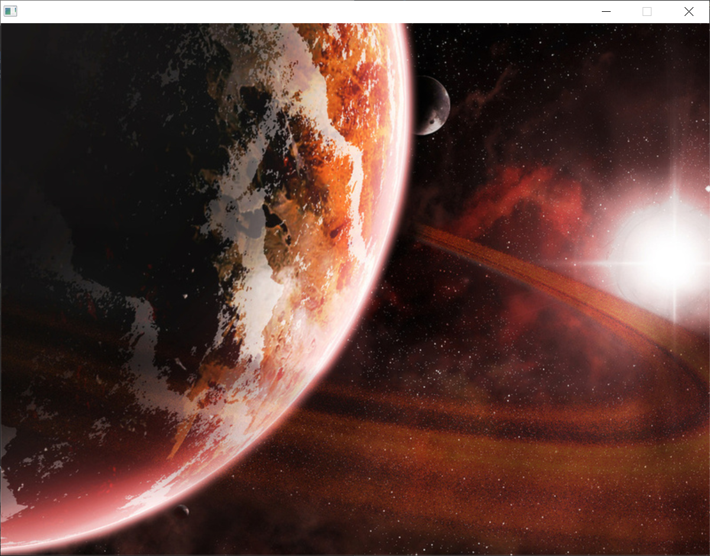
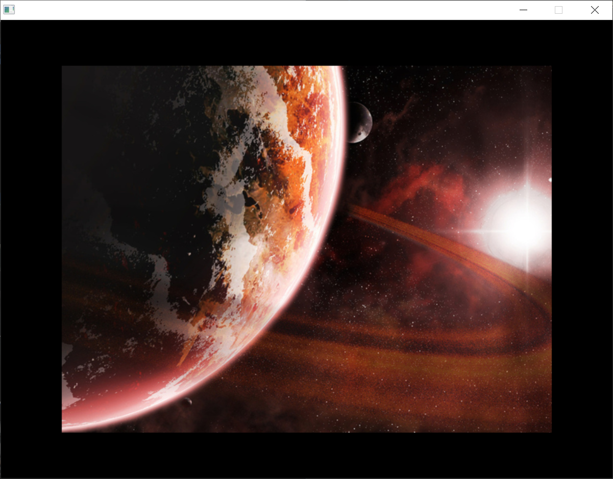
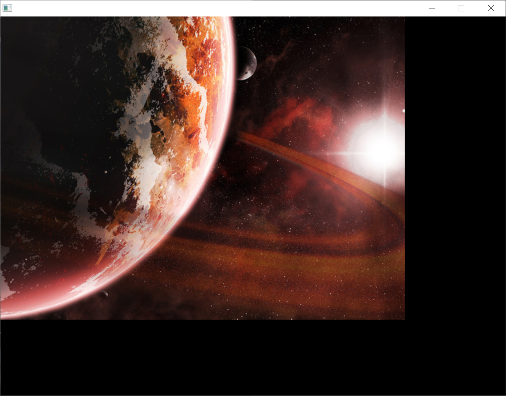
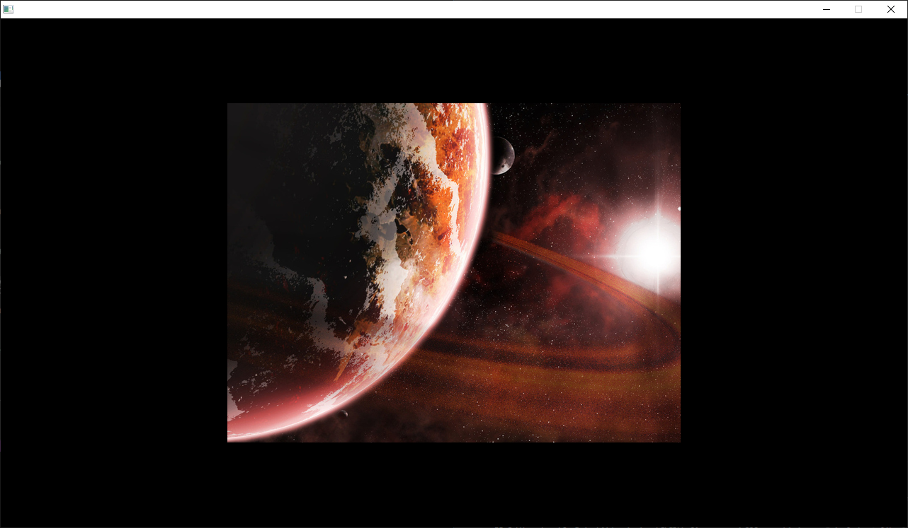
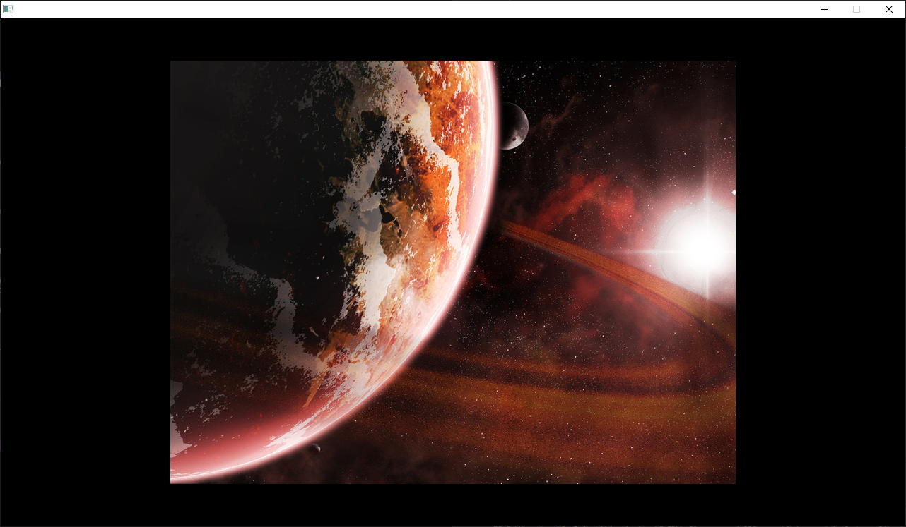

# [26. Création texture](https://www.youtube.com/watch?v=IF99v5_uHEY)

Bonjour à tous, bienvenue pour cette 26ème séance en sdl sur la formation en langage c.

On va continuer maintenant à voir comment gérer nos texture, c'est la troisième chose que vous devez voir en sdl où vous savez comment manipuler des fenêtres, vous savez également comment gérer vos systèmes de rendu d'accord pour avoir le fameux tableau noire que j'avais évoqué dans la précédente vidéo et là nous allons passer aux textures où on va travailler tout simplement avec des images puisque c'est évidemment plus agréable visuellement pour travailler avec ça et pour apprendre comment faire tout simplement en sdl avec sa bibliothèque graphique en bas-niveau.

Je vais vous montrer avec le code qu'on avait précédemment donc je n'ai pas modifié d'accord j'ai laissé le code qu'on avait c'est à dire l'initialisation de la sdl, la création de la fenêtre, du rendu d'accord trois secondes d'attentes ensuite on détruit le rendu, on détruit la fenêtre, on quitte la sdl et toujours notre petite fonction bien évidemment pour quitter proprement dans les cas où ça peut être utile.

```c
/*
    GNU/Linux et MacOS
        > gcc main.c $(sdl2-config --cflags --libs) -o prog
        > gcc *.c $(sdl2-config --cflags --libs) -o prog
    Windows
        > gcc src/m025.c -o bin/prog -I include -L lib -lmingw32 -lSDL2main -lSDL2
        > gcc src/m025.c -o bin/prog -I include -L lib -mingw32 -lSDL2main -lSDL2 -mwindows
*/
#include <stdio.h>
#include <stdlib.h>
#include <SDL.h>

void SDL_ExitWithError(const char *message);

int main(int argc, char *argv[])
{
    SDL_Window *window = NULL;
    SDL_Renderer *renderer = NULL;

    //Lancement SDL
    if(SDL_Init(SDL_INIT_VIDEO) != 0)
        SDL_ExitWithError("Initialisation SDL");
    
    //Création fenêtre + rendu
    if(SDL_CreateWindowAndRenderer(800, 600, 0, &window, &renderer) != 0)
        SDL_ExitWithError("Impossible de creer la fenetre et le rendu");
    
    /*--------------------------------------------------------------------*/
    SDL_Delay(3000);
    /*--------------------------------------------------------------------*/

    SDL_DestroyRenderer(renderer);
    SDL_DestroyWindow(window);
    SDL_Quit();

    return EXIT_SUCCESS;
}

void SDL_ExitWithError(const char *message)
{
    SDL_Log("ERREUR : %s > %s\n", message, SDL_GetError());
    SDL_Quit();
    exit(EXIT_FAILURE);
}
```

Voilà on va regarder comment à partir de là, on va pouvoir travailler donc ici on va commencer à voir comment fonctionnent les textures.

Je vous avais dit que les textures c'était un petit peu la nouvelle version des surfaces qu'on avait dans les anciennes versions de la sdl mais là pour le coup dans la sdl2 les surfaces on été conservés et on va en avoir besoin pour créer notre texture à partir de cette fameuse  surface.

Vous verrez que c'est beaucoup plus pratique, on pourrait faire une création de textures tout simplement de base mais c'est un peu plus compliqué à manipuler donc autant créer une surface, de s'en servir pour avoir notre image et après de créer la texture à partir de cette dernière.

Pour cela donc cette vidéo ne sera pas très longue par rapport à ce que je vais vous montrer mais il y a pas mal de choses qui sont intéressantes à voir.

On va commencer par créer notre pointeur pour la surface donc *SDL_Surface* et encore une fois je le rappelle respectez bien les majuscules, les minuscules et les underscore et cetera dans les noms. Ils ne sont pas là par hasard d'accord *SDL_Surface* c'est bien S majuscule et là c'est bien SDL tout en majuscules aussi c'est super
important.

Là on crée un pointeur image qu'on initialise à NULL ça c'est important aussi et on va faire un pointeur en tout cas pour la texture qu'on va appeler texture.

```c
    /*-----------------------------------------------------------------*/
    SDL_Surface *image = NULL;
    SDL_Texture *texture = NULL;
    
    SDL_Delay(3000);
    /*-----------------------------------------------------------------*/
```

Sur un vrai projet un vrai, un jeu vidéo, un vrai programme en 2D, utilisez bien évidemment des noms beaucoup plus explicite pour vos variable et vos pointer.

Comme c'est un cours et que je n'aurais de toute façon qu'une seule texture je garde le mot *texture* mais pour faire les choses plus proprement bien sûr travaillez avec des noms explicites pour que ce soit beaucoup plus clair.

Voilà on continue donc une fois qu'on a ça on va pouvoir charger notre image d'accord à l'aide de la surface et pour cela je peux récupérer quelques images que je met dans le répertoire *src* et voyez que j'ai toujours le même arborescence que ce qu'on a vu précédemment et que je vous ai même proposé dans la description en téléchargement dans la séance 25.

Alors au niveau du src, j'ai deux images, une qui fait 800 x 600 pixels donc c'est exactement la taille que j'ai choisi moi pour ma fenêtre sdl rappelez vous et il y en a une qui est un petit peu plus petite.

Si vous l'avez remarqué vous voyez que le format est bmp tout simplement parce que de bases la SDL travail avec seulement le format bmp, c'est un format qui même s'il est lourd en terme de fichiers d'accord il un peu plus lourd par exemple que le png ou le jpeg donc des formats notamment compressé, c'est un format qu'elle s'est très bien manipuler parce que je vous rappelle que la sdl est une bibliothèque bas niveau donc elle sait bien manipuler les fichiers assez lourd en tant qu'image pour les charger et vraiment les optimiser dans ce sens là.

N'hésitez pas à checker régulièrement la playlist des tutoriels pour le langage c ou même les autres d'ailleurs de manière générale pour voir un petit peu, il y aura des vidéos en annexe sur la sdl notamment par  exemple pour afficher d'autres formats d'image d'accord de travailler avec du jpeg, du png ou éventuellement du gif, ça peut être des choses intéressantes à voir.

Par contre là pour le cours on s'occupera du format bmp donc vous pouvez télécharger des images pour faire cet exercice fin cette partie du cours en tout cas pour voir comment ça fonctionne donc j'ai choisi encore une fois volontairement une image qui fait exactement les dimensions que j'ai de ma fenêtre 800 par 600 et une que j'ai légèrement réduite d'accord donc *planete* et *planete2*.

On va travailler avec ça.

## SDL_loadBMP

On y va, on va charger du coup notre principale image, celle qui occupera vraiment toute la fenêtre sdl.

Dans *image*, on va utiliser la fonction SDL_loadBMP et ici vous allez lui passer le chemin vers l'image.

Alors le chemin vers l'image, il est où ? si vous souvenez des vidéos précédentes je compile toujours mon projet à partir d'ici d'accord.


    SDL.
    |_ bin
    |_ include
    |_ lib
    |_ src
        |_ m26.c
        |_ planete.bmp
        |_ planete2.bmp


Comme l'image je rappelle est dans src et bien il faut bien évidemment  indiquer ce répertoire *src* et ensuite seulement le nom complet plus l'extension de l'image donc ça ne vous trompez pas donc si vous avez repris exactement la même arborescence que vous avez récupéré l'archive de la vidéo précédente, vous pourrez mettre exactement le même chemin sinon vous adapter en fonction de ce que vous avez choisi comme hérarchie au niveau d'autres projets.

```c
    /*-----------------------------------------------------------------*/
    SDL_Surface *image = NULL;
    SDL_Texture *texture = NULL;

    image = SDL_LoadBMP("src/planete.bmp");
    
    SDL_Delay(3000);
    /*-----------------------------------------------------------------*/
```

Voilà à partir de là si l'image à chargee tant mieux, si elle n'a pas chargée, cette fonction renvoye NULL d'accord et comme on a initialisé proprement notre image à NULL donc si c'est toujours à NULL et que ça n'a pas bougé évidemment on ne va pas continuer le programme voilà.

```c
    /*-----------------------------------------------------------------*/
    SDL_Surface *image = NULL;
    SDL_Texture *texture = NULL;

    image = SDL_LoadBMP("src/planete.bmp");

    if(image == NULL)
    {

    }
    
    SDL_Delay(3000);
    /*-----------------------------------------------------------------*/
```

Alors dans l'idéal ce n'est pas forcément très propre mais dans l'idéal il faudrait faire des fonctions pour gérer tout ce qui est destruction puisque là si par exemple notre image n'arrive pas à chargée vous avez quand même réussi à créer la fenêtre et a créer le rendu donc SDL_CreateWindowAndRenderer() devrait être détruit.

Or vous voyez que dans ma une fonction SDL_ExitWithError(), je ne le fait pas forcément mais si admettons votre programme quitte à ce moment là (lancement de la SDL).

```c
//Lancement SDL
if(SDL_Init(SDL_INIT_VIDEO) != 0)
    SDL_ExitWithError("Initialisation SDL");

//Création fenêtre + rendu etc...
```

Là vous n'aurez pas par exemple de rendu ou de fenêtre à supprimer  d'accord.

Donc ce serait un petit peu superflu d'avoir une fonction par exemple qui à trop de choses éventuellement à faire donc à vous de voir.

Moi je vais faire un peu de répétitions de codes parce que je ne veux pas alourdir la vidéo et que ce soit trop compliqué mais vous essayez de faire les choses proprement d'accord donc là on fera ça évidemment.

```c
    /*-----------------------------------------------------------------*/
    SDL_Surface *image = NULL;
    SDL_Texture *texture = NULL;

    image = SDL_LoadBMP("src/planete.bmp");

    if(image == NULL)
    {
        SDL_DestroyRenderer(renderer);
        SDL_DestroyWindow(window);
        SDL_ExitWithError("Impossible de charger l'image");
    }
    
    SDL_Delay(3000);
    /*-----------------------------------------------------------------*/
```

Voilà vous voyez comme il y a de la répétition ici de code, n'hésitez pas à faire une fonction en l'occurrence donc en question par rapport à ça pour que ce soi beaucoup plus propre et après du coup je vais quitter comme j'avais fait avec SDL_ExitWithError() et là je met *Impossible de charger l'image*.

## SDL_CreateTextureFromSurface

A partir d'ici si on n'a pas toujours pas quitté le programme, c'est que l'image a bien été chargé du coup on va pouvoir s'en servir ça tombe bien.

Pour se servir de l'image, on va créer une texture à partir de la surface donc à partir de ce qu'on a fait ici `SDL_Surface *image = NULL;` d'accord de ce qu'on a chargé donc ça tombe bien c'est une fonction qui s'appelle SDL_CreateTextureFromSurface() d'accord.

Cette fonction va tout simplement renvoyé votre texture parce que c'est là l'intérêt et ça va permettre tout simplement de charger notre texture donc de la créé notamment à partir de la surface et si ça n'a pas fonctionné ça renverra NULL comme pour le chargement d'une image.

Donc c'est partis, on fait `texture = SDL_CreateTextureFromSurface();`.

Ok cette fonction prend en paramètre le rendu `renderer` évidemment d'accord elle a besoin de créer le texture par rapport à un rendu et surtout par rapport à la surface donc nous c'est image `image` d'accord c'est notre pointeur ici.

```c
    /*-----------------------------------------------------------------*/
    SDL_Surface *image = NULL;
    SDL_Texture *texture = NULL;

    image = SDL_LoadBMP("src/planete.bmp");

    if(image == NULL)
    {
        SDL_DestroyRenderer(renderer);
        SDL_DestroyWindow(window);
        SDL_ExitWithError("Impossible de charger l'image");
    }

    texture = SDL_CreateTextureFromSurface(renderer, image);
    
    SDL_Delay(3000);
    /*-----------------------------------------------------------------*/
```

Pareil comme quand je vous l'ai dis si la texture n'a pas pu être créée ça va renvoyer NULL donc à ce moment là on fait exactement ça.

```c
    /*-----------------------------------------------------------------*/
    SDL_Surface *image = NULL;
    SDL_Texture *texture = NULL;

    image = SDL_LoadBMP("src/planete.bmp");

    if(image == NULL)
    {
        SDL_DestroyRenderer(renderer);
        SDL_DestroyWindow(window);
        SDL_ExitWithError("Impossible de charger l'image");
    }

    texture = SDL_CreateTextureFromSurface(renderer, image);

    if(texture == NULL)
    {
        SDL_DestroyRenderer(renderer);
        SDL_DestroyWindow(window);
        SDL_ExitWithError("Impossible de créer la texture");
    }
    
    SDL_Delay(3000);
    /*-----------------------------------------------------------------*/
```

Voilà donc encore une fois c'est pas très propre, c'est de la répétition de code mais vous verrez bien sûr en fonction pour optimiser, pour éviter cette répétition-là.

## SDL_FreeSurface

Voilà à partir de cet endroit là du programme (avant `if(texture == NULL)`), on a pu charger notre image, on a pu créer la texture et on va voir.

Vous avez vu par exemple qu'on a créé une texture à partir de la surface donc n'hésitez pas on n'en a plus besoin, c'est pour ça que je vous avez dit que c'était très rapide, son utilité, on se sert juste d'une surface pour créer notre texture à partir d'elles dont vous pouvez directement, détruire donc libérer les ressources SDL_FreeSurface() à cet endroit-là.

```c
    /*-----------------------------------------------------------------*/
    SDL_Surface *image = NULL;
    SDL_Texture *texture = NULL;

    image = SDL_LoadBMP("src/planete.bmp");

    if(image == NULL)
    {
        SDL_DestroyRenderer(renderer);
        SDL_DestroyWindow(window);
        SDL_ExitWithError("Impossible de charger l'image");
    }

    texture = SDL_CreateTextureFromSurface(renderer, image);
    SDL_FreeSurface(image);
    if(texture == NULL)
    {
        SDL_DestroyRenderer(renderer);
        SDL_DestroyWindow(window);
        SDL_ExitWithError("Impossible de créer la texture");
    }
    
    SDL_Delay(3000);
    /*-----------------------------------------------------------------*/
```

SDL_FreeSurface(), vous pouvez le faire juste après l'endroit où vous tenter de créer la texture d'accord même avant la vérification (avant `if(texture == NULL)`) parce que si jamais ça ça quitte quitte d'accord que ça ne fonctionne pas, que la texture n'a pas pu être créer, vous n'aurez pas libéré la surface et vous allez avoir du coup avoir des fuites de mémoire donc n'hésitez pas à libérer la surface dans tous les cas et après vous verrez de toute façon ici si la texture a bien été créé.

Voilà ça c'est important à faire pour ne pas oublier la moitié et que les choses soient faites correctement.

A partir de là maintenant qu'on a créé la texture, on va pouvoir la charger en mémoire alors une chose que vous devez savoir maintenant que vous êtes quand même à un niveau assez avancé en c, on peut le dire c'est qu'il y a une différence au niveau graphique entre le fait de charger une ressource en mémoire d'accord de la charger dans la mémoire vive et le fait de l'afficher.

Ce n'est pas parce que vous allez charger votre image dans la mémoire, qu'elle va s'afficher à l'écran.

Ce sont vraiment deux étapes distinctes et différentes, et nous on va vraiment ici voir la différence.

Là on a juste créé la texture d'accord, SDL_CreateTextureFromSurface(). 

La texture est créée au niveau de la sdl.

## SDL_QueryTexture

Maintenant on va la charger en mémoire et pour ça on va utiliser SDL_QueryTexture() qui prend en premier paramètre la texture ok. Elle prend ensuite en deuxième et troisième paramètre le format raw et le point d'accès à notre texture. Nous comme c'est des choses qu'on ne va pas utiliser qui ne servent absolument pas de manière usuelle, on ne précise pas ces paramètres donc on met NULL à la place d'accord je n'entre pas dans le détail sinon ce sera trop compliqué et ensuite on va lui passer et bien la largeur et la hauteur d'une forme et notamment un rectangle.

Voilà on va travailler avec un rectangle pour charger en mémoire notre texture donc ce rectangle, on va le créer on va faire un `SDL_Rect rectangle;` où on l'appelle *rectangle* pour rester simple ici et du coup on va le récupérer.

```c
    /*-----------------------------------------------------------------*/
    SDL_Surface *image = NULL;
    SDL_Texture *texture = NULL;

    image = SDL_LoadBMP("src/planete.bmp");

    if(image == NULL)
    {
        SDL_DestroyRenderer(renderer);
        SDL_DestroyWindow(window);
        SDL_ExitWithError("Impossible de charger l'image");
    }

    texture = SDL_CreateTextureFromSurface(renderer, image);
    SDL_FreeSurface(image);
    if(texture == NULL)
    {
        SDL_DestroyRenderer(renderer);
        SDL_DestroyWindow(window);
        SDL_ExitWithError("Impossible de créer la texture");
    }

    SDL_Rect rectangle;

    SDL_QueryTexture(texture, NULL, NULL, &rectangle.w, &rectangle.h);
    
    SDL_Delay(3000);
    /*-----------------------------------------------------------------*/
```

Et du coup on récupère *texture* et donc la largeur du rectangle c'est `rectangle.w` souvenez-vous que c'est une structure et l'autre c'est `rectangle.h` pour la hauteur voilà. :warning: On fait un passage par adresse.

```c
SDL_QueryTexture(texture, NULL, NULL, &rectangle.w, &rectangle.h);
```

Toute cette fonction-là si elle fonctionne bien elle va renvoyer 0, si elle ne fonctionne pas elle va renvoyer autre chose donc on fait directement la vérification de son retour donc si tout cela `SDL_QueryTexture(texture, NULL, NULL, &rectangle.w, &rectangle.h);` est différent de zéro donc que ça n'a pas marché, à ce moment là rebelote on fait tout ça d'accord pareil je rappelle que c'est pas très propre parce que c'est de la répétition de code mais vous faites les choses plus proprement au niveau de votre propre programme d'accord moi c'est pour encore une fois gagne du temps au niveau de cette vidéo.

```c
    /*-----------------------------------------------------------------*/
    SDL_Surface *image = NULL;
    SDL_Texture *texture = NULL;

    image = SDL_LoadBMP("src/planete.bmp");

    if(image == NULL)
    {
        SDL_DestroyRenderer(renderer);
        SDL_DestroyWindow(window);
        SDL_ExitWithError("Impossible de charger l'image");
    }

    texture = SDL_CreateTextureFromSurface(renderer, image);
    SDL_FreeSurface(image);
    if(texture == NULL)
    {
        SDL_DestroyRenderer(renderer);
        SDL_DestroyWindow(window);
        SDL_ExitWithError("Impossible de créer la texture");
    }

    SDL_Rect rectangle;

    if(SDL_QueryTexture(texture, NULL, NULL, &rectangle.w, &rectangle.h) != 0)
    {
        SDL_DestroyRenderer(renderer);
        SDL_DestroyWindow(window);
        SDL_ExitWithError("Impossible de charger la texture");
    }
    
    SDL_Delay(3000);
    /*-----------------------------------------------------------------*/
```

Voilà on a la surface, la texture, on charge notre image, on vérifie bien l'image, on crée la texture depuis la surface qu'on libère derrière. On libère la surface du coup qu'on a plus besoin. Ensuite on vérifie la texture, une fois que c'est bon pour la texture on se sert de notre rectangle parce que ça va nous servir en fait le rectangle.

Imaginez que ça va être l'encadré en fait de votre image, de votre texture tout simplement, on la charge en mémoire à partir de là à partir de la largeur et de la hauteur et c'est bon.

Comme on a une image à 800 par 600 et que ma fenêtre fait je rappelle 800 par 600 je vais directement la centrer en fait pour qu'elle occupe toute la fenêtre en fait directement donc pour faire ça au niveau notre rectangle parce que c'est lui qui nous sert en fait d'encadrement pour notre texture on va dire que rectangle point x c'est donc la largeur de la fenêtre moins la largeur du rectangle divisé par deux et mettez bien les parenthèses pour que la soustraction se fasse bien en priorité avant la division.

```c
rectangle.x = (800 - rectangle.w) / 2;
```

Et pour le point y du rectangle c'est la même chose sauf que c'est pour la hauteur, hauteur de la fenêtre moins hauteur de rectangle divisé par 2.

```c
rectangle.x = (800 - rectangle.w) / 2;
rectangle.y = (600 - rectangle.h) / 2;
```

### define width et height

Alors pour faire les choses plus proprement encore vous voyez que là, je répète à chaque fois la largeur *800* et la hauteur *600* de la fenêtre. Ici c'est répété plusieurs fois et bien sûr comme vous avez apris à le faire, on va faire un petit `define` dans notre programme et puis définir la largeur et la hauteur pour éviter de les répéter.

Comme ça si un jour vous voulez changer ce paramètre-là, vous aurez juste à le changer à un seul endroit et ce sera appliqué sur tout le programme d'ailleurs on va le faire puisque après tout faisons les choses comme il faut.

```c
#define WINDOW_WIDTH 800
#define WINDOW_HEIGHT 600
```

Voilà donc ça ne change rien d'accord j'ai juste passer une macro donc une define, une définition tout simplement pour faire un remplacement au niveau pré processeur et à partir de là une fois qu'on a ça, on a chargé en mémoire notre image mais encore une fois elle n'est pas affiché donc on va éviter de compiler tout de suite parce que ça ne servira à rien donc on va s'occuper de l'affichage directement de l'image.

## SDL_RenderCopy

Maintenant qu'on va vraiment dire que l'image est centrée, on va pouvoir l'afficher avec la fonction SDL_RenderCopy() d'accords donc on va copier dans le rendu la texture qui est à la base chargée en mémoire d'accord c'est comme ça que ça va se passer.

SDL_RenderCopy() va donc prendre le rendu ok, elle va prendre ensuite la texture, le troisième paramètre c'est le rectangle source d'accord donc si jamais vous avez besoin d'afficher l'image d'une autre manière mais si vous voulez qu'elle occupe vraiment tout le rendu d'accord toute la partie vous mettez à NULL et nous c'est ce qu'on veut donc on va faire ça d'accord par rapport à notre rectangle car on veut qu'elle occupe tout le rectangle dont on se sert de cadre donc on met à NULL et ensuite le rectangle destination cen c'est l'autre mais comme on en a qu'un seul vous mettez notre rectangle de destination `&rectangle` et vous le passez par adresse comme ceci.

```c
SDL_RenderCopy(renderer, texture, NULL, &rectangle)
```

p.s. D'ailleurs ici aussi il faut évidemment passer par adresse la structure `rectangle` (SDL_Rect).

```c
SDL_QueryTexture(Texture, NULL, NULL, &rectangle.w, &rectangle.h)
```

Il faut bien évidemment passer ça par adresse aussi car c'est une structure simple d'accord c'est pas un pointeur donc il faut bien le passer par adresse donc n'oubliez pas le & commerciale ici d'accord donc pour SDL_QueryTexture() et pour SDL_RenderCopy().

Voilà et cette fonction SDL_RenderCopy() comme pour SDL_QueryTexture() renvoie 0 si elle a bien fonctionné et elle renvoie autre chose si ce n'est pas le cas donc on va la faire directement dans un if() donc si vous voulez être sûre de ne rien oublié vous écrivez votre fonction comme si ne faisiez aucune vérification et après vous l'entouré d'une condition pour gérer les erreurs comme ça vous êtes sûr de ne pas oubliez les choses c'est toujours bien organisé.

```c
if(SDL_RenderCopy(renderer, texture, NULL, &rectangle) != 0)
{
    SDL_DestroyRenderer(renderer);
    SDL_DestroyWindow(window);
    SDL_ExitWithError("Impossible d'afficher la texture");
}
```

Vous faites comme ceci et pareil *Impossible d'afficher la texture* alors *afficher* signifie que ça va être chargé au niveau de l'écran d'accord au niveau de notre rendu plus exactement.

## SDL_RenderPresent

C'est pas vraiment SDL_RenderCopy() qui affiche l'écran, l'affichage d'écran c'est comme vous l'avez vu précédemment avec le rendu ben c'est en faisant un SDL_RenderPresent() et c'est d'ailleurs ce qu'on va faire de toute façon à la fin donc on y va SDL_RenderPresent(renderer) càd du rendu.

```c
SDL_RenderPresent(renderer);
```

Et on obtient ceci.

```c
/*
    GNU/Linux et MacOS
        > gcc main.c $(sdl2-config --cflags --libs) -o prog
        > gcc *.c $(sdl2-config --cflags --libs) -o prog
    Windows
        > gcc src/m025.c -o bin/prog -I include -L lib -lmingw32 -lSDL2main -lSDL2
        > gcc src/m025.c -o bin/prog -I include -L lib -mingw32 -lSDL2main -lSDL2 -mwindows
*/
#include <stdio.h>
#include <stdlib.h>
#include <SDL.h>

#define WINDOW_WIDTH 800
#define WINDOW_HEIGHT 600

void SDL_ExitWithError(const char *message);

int main(int argc, char *argv[])
{
    SDL_Window *window = NULL;
    SDL_Renderer *renderer = NULL;

    //Lancement SDL
    if(SDL_Init(SDL_INIT_VIDEO) != 0)
        SDL_ExitWithError("Initialisation SDL");
    
    //Création fenêtre + rendu
    if(SDL_CreateWindowAndRenderer(WINDOW_WIDTH, WINDOW_HEIGHT, 0, &window, &renderer) != 0)
        SDL_ExitWithError("Impossible de creer la fenetre et le rendu");

    /*-----------------------------------------------------------------*/
    SDL_Surface *image = NULL;
    SDL_Texture *texture = NULL;

    image = SDL_LoadBMP("src/planete.bmp");

    if(image == NULL)
    {
        SDL_DestroyRenderer(renderer);
        SDL_DestroyWindow(window);
        SDL_ExitWithError("Impossible de charger l'image");
    }

    texture = SDL_CreateTextureFromSurface(renderer, image);
    SDL_FreeSurface(image);
    if(texture == NULL)
    {
        SDL_DestroyRenderer(renderer);
        SDL_DestroyWindow(window);
        SDL_ExitWithError("Impossible de créer la texture");
    }

    SDL_Rect rectangle;

    if(SDL_QueryTexture(texture, NULL, NULL, &rectangle.w, &rectangle.h) != 0)
    {
        SDL_DestroyRenderer(renderer);
        SDL_DestroyWindow(window);
        SDL_ExitWithError("Impossible de charger la texture");
    }

    rectangle.x = (WINDOW_WIDTH - rectangle.w) / 2;
    rectangle.y = (WINDOW_HEIGHT - rectangle.h) / 2;

    if(SDL_RenderCopy(renderer, texture, NULL, &rectangle) != 0)
    {
        SDL_DestroyRenderer(renderer);
        SDL_DestroyWindow(window);
        SDL_ExitWithError("Impossible d'afficher la texture");
    }
    
    SDL_RenderPresent(renderer);
    SDL_Delay(3000);
    /*-----------------------------------------------------------------*/

    SDL_DestroyRenderer(renderer);
    SDL_DestroyWindow(window);
    SDL_Quit();

    return EXIT_SUCCESS;
}

void SDL_ExitWithError(const char *message)
{
    SDL_Log("ERREUR : %s > %s\n", message, SDL_GetError());
    SDL_Quit();
    exit(EXIT_FAILURE);
}
```

Voilà `SDL_RenderPresent(renderer)` et là ça va vraiment faire une actualisation pour afficher sur notre fenêtre donc dans notre rendu, le contenu.

Alors on y va, et je récupère ma ligne ici de compilation.

Alors il y a pas mal de code mine de rien après il y a du code qui est répété bien sûr mais déjà au niveau juste sdl, on a quand même pas mal de petites choses.

On fait ça.

```powershell
gcc src/m026.c -o bin/prog -I include -L lib -lmingw32 -lSDL2main -lSDL2
.\bin\prog.exe
```


On voit ce que ça donne à l'exécution et voilà votre image qui s'affiche donc directement et complètement sur votre fenêtre sdl donc c'est plutôt sympa à gérer.

Pour l'image *planete2.bmp* on va juste changer, on rengistre, on recompile et elle va s'afficher bien centrée.

```c
//etc.
image = SDL_LoadBMP("src/planete2.bmp");
//etc.
```



Voilà et voyez que l'image s'affiche bien centrée puisqu'on s'est occupé de centrer justement grâce à ces lignes du rectangle ici.

```c
rectangle.x = (WINDOW_WIDTH - rectangle.w) / 2;
rectangle.y = (WINDOW_HEIGHT - rectangle.h) / 2;
```

Si vous ne voulez pas centrer l'image c'est très simple vous mettez 0, 0.

```c
rectangle.x = 0;
rectangle.y = 0;
```

Alors qu'est-ce que ça va faire ? si vous avez bien compris le rectangle va être positionné au niveau des fenêtres en coordonnés (0, 0) c'est à dire tout en haut à gauche du rendu d'accord puisque on le charge rappelez-vous dans un rendu donc là si je compile l'image va être tout en haut à gauche de la fenêtre.

  

Voilà c'est plutôt sympa à gérer et donc on peut faire grâce à notre petite macro ici.

```c
#define WINDOW_WIDTH 800
#define WINDOW_HEIGHT 600
```

Grâce à notre petite macro, l'avantage c'est que si on veut modifier d'un coup ça et bien là on va pouvoir la résolution de base.

```c
rectangle.x = (WINDOW_WIDTH - rectangle.w) / 2;
rectangle.y = (WINDOW_HEIGHT - rectangle.h) / 2;
//etc.
#define WINDOW_WIDTH 1280
#define WINDOW_HEIGHT 720
```

  
*planête 2*


*planête 1*

Voilà ce sont des choses très simples à faire, ce sont des maths de base franchement pour centrer un élément par rapport à un encadré donc ici pour le coup notre fenêtre-là pour que ce soit toujours centré peu importe ce que l'on va changer au niveau de la résolution bien sûr.

Alors j'espère que cette vidéo vous aura été utile et vous aura appris encore pas mal de choses.

Vous voyez que c'est très bien pensés en tout cas au niveau de la sdl que ce soit pour les fenêtres, que ce soit pour les rendu, que ce soit pour les textures.

On crée bien les choses, on vérifie toujours à chaque fois les retours des fonctions ça c'est vraiment la règle d'or c'est ce qui fera la différence entre vous et les développeurs qui font de la sdl ou qui font tout simplement du développement graphique sans rien vérifier en faisant confiance aveuglément au niveau des fonctions et sur le coup on va dire de manière habituelle ça va fonctionner et il suffit d'une fois où je ne sais pas que le processeur est un peu trop occupés ou n'importe quoi ou la carte graphique bref n'importe quels facteurs externes ou même liés plus ou moins directement à votre programme influe sur son exécution et là vous aurez un plantage et c'est ce que des fois vous pouvez rencontrer sur certains jeux ou programme graphique donc si vous voulez être sûr de bien faire les choses, vérifiez toujours toujours toujours les retours de vos fonctions quand elles ont un retour d'accord.

On ne vérifie pas pour certaines parce qu'elles renvoient void donc évidemment ça ne sert à rien comme celle-là SDL_Quit() notamment mais pour les fonctions qui renvoyent un message d'erreur ou un code de retour pour vérifier leur fonctionnement, toujours bien vérifier ce qu'elles retournent pour être sûr qu'elles que tout s'est bien passé au niveau de votre programme et vous serez sûr d'avoir quand même quelque chose d'un maximum stable, au maximum fonctionnelle.

On s'arrêtera là pour cette petite séance.

N'hésitez pas à vous entraîner toujours pareil avec la sdl il faut s'entraîner, il faut pratiquer consulter régulièrement la playlist des tutoriels en langage c, la playlist des exercices puisqu'il y a ou il y aura des exercices en langage c pour manipuler la sdl, pour déplacer des images, des petits personnages, tout ça, vraiment des choses pour vous exercer.

N'hésitez pas à voir tout ça régulièrement, laissez des commentaires ou des questions si quelque chose n'est pas suffisamment clair parce que là on a quand même à un stade assez avancé de la formation en langage c puisqu'après la sdl on attaquera tout ce qui est programmation systèmes et réseaux et après on en aura terminé avec le langage c.

Et j'aurais vraiment tout vu, tout ce qui est en tout cas intéressant à voir avec le langage c et vous pourrez maintenant être assez suffisamment autonomes avec ce langage pour apprendre d'autres choses par vous même.

J'espère encore une fois que ça vous a été utile et que ça vous aura appris pas mal de choses, je vous dis à bientôt pour une prochaine vidéo et on se retrouve très prochainement avec cette formation au langage c.

Ciao tout le monde