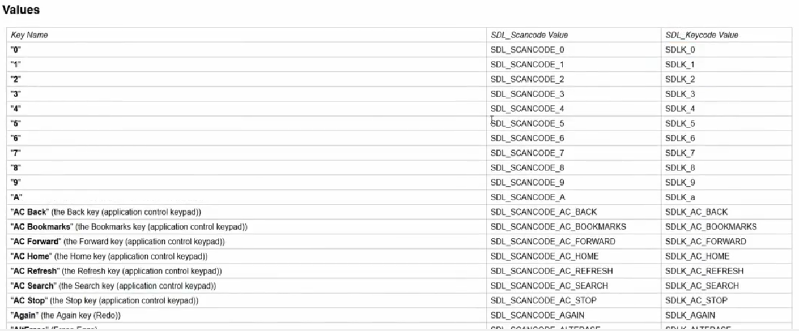

# [27. Gestion événements (1/2)](https://www.youtube.com/watch?v=k7ZkeqrbnwA)

Bonjour à tous et bienvenue sur la séance 27 en sdl, on continue avec la programmation avec le langage c pour aborder un autre cas très intéressant de la programmation sur des bibliothèques 2D.

La dernière fois, nous avons vu tout ce qui était fenêtre, rendu et tout ce qui était texture d'accord on a vu suffisamment de choses intéressantes pour cela et nous allons nous attaquer aux événements donc ce sera une notion donc un groupe de choses à apprendre en deux parties.

Eventuellement bien sûr n'hésitez pas à aller voir dans la playlist des tutoriels du langage c, vous aurez et vous avez de toute façon des compléments liés à la programmation en langage c notamment avec la sdl et pourquoi pas les événements puisqu'il a énormément de choses à dire et je ne vais pas tous présenter non plus dans le cours donc il y aura des suppléments, des choses en annexe dans les tutoriels.

On va directement allé sur le code et on va voir comment ça se passe.

```c
/*
    GNU/Linux et MacOS
        > gcc main.c $(sdl2-config --cflags --libs) -o prog
        > gcc *.c $(sdl2-config --cflags --libs) -o prog
    Windows
        > gcc src/m027.c -o bin/prog -I include -L lib -lmingw32 -lSDL2main -lSDL2
        > gcc src/m027.c -o bin/prog -I include -L lib -mingw32 -lSDL2main -lSDL2 -mwindows
*/
#include <stdio.h>
#include <stdlib.h>
#include <SDL.h>

#define WINDOW_WIDTH 1280
#define WINDOW_HEIGHT 720

void SDL_ExitWithError(const char *message);

int main(int argc, char *argv[])
{
    SDL_Window *window = NULL;
    SDL_Renderer *renderer = NULL;

    //Lancement SDL
    if(SDL_Init(SDL_INIT_VIDEO) != 0)
        SDL_ExitWithError("Initialisation SDL");
    
    //Création fenêtre + rendu
    if(SDL_CreateWindowAndRenderer(WINDOW_WIDTH, WINDOW_HEIGHT, 0, &window, &renderer) != 0)
        SDL_ExitWithError("Impossible de creer la fenetre et le rendu");

    /*-----------------------------------------------------------------*/

    /*-----------------------------------------------------------------*/

    SDL_DestroyRenderer(renderer);
    SDL_DestroyWindow(window);
    SDL_Quit();

    return EXIT_SUCCESS;
}

void SDL_ExitWithError(const char *message)
{
    SDL_Log("ERREUR : %s > %s\n", message, SDL_GetError());
    SDL_Quit();
    exit(EXIT_FAILURE);
}
```
## Partie 1
Jusqu'à présent vous vous souvenez qu'on exécutait nos programmes en les faisant attendre avec SDL_Delay() pendant deux, trois, six secondes etc et ont quitte.

Le problème, vous vous doutez bien que dans un véritable programme ce n'est pas comme ça que nous allons procéder.

Dans une vraie application d'accord ou un vrai jeu vidéo ce que l'on va faire en fait c'est que nous allons lancer le programme à l'infini d'accord c'est-à-dire qu'on le lance et à partir de là pendant qu'il est exécuté, on va attendre des actions de l'utilisateur parce que c'est à l'utilisateur de choisir de quitter son programme, de faire certaines actions.

Qu'elles sont les actions ? c'est tout simplement déplacer sa souris, clicquer et appuyer sur une touche de son clavier, utiliser un joystick bref ou simplement le fait de quitter le programme en appuyant sur la croix de la fenêtre.

Ce genre de choses mais ça ce sont des événements justement d'accord ce sont des événements que nous allons pouvoir capturer et en fonction de leur type, en fonction de l'événement qui a été fait, nous allons pouvoir traiter un certain nombre de choses par rapport au type d'événement donc tout ça on va regarder.

On va regarder l'exemple minimal pour commencer qui est à mettre dans tous vos programmes sdl à partir de maintenant d'accord c'est l'exemple qui est fonctionnel tout le temps partout et qui est vraiment à mettre au minimum pour éviter de mettre par exemple un SDL_Delay() avant de quitter parce  que ce n'est pas très propre.

On faisait ça jusqu'à présent pour ne pas compliquer mais maintenant on va s'attaquer aux événements.

Pour faire simple on va donc créer une **boucle infinie** et on va passer pour cela par une variable.

### SDL_bool

Alors je vais vous présenter un nouveau type de la sdl qui est le SDL_bool.

```c
SDL_bool
```

C'est tout simplement un type de variables sdl qui est booléen donc qui peut prendre la valeur false ou true mais en écrivant d'une manière assez précis.

https://wiki.libsdl.org/SDL_bool


Donc là je vous ai mis la page du wiki rapidement donc c'est très simple vous voyez SDL_bool tout simplement qu'il peut prendre cette valeur là, SDL_FALSE qui correspond à *0* ou *false* d'accord et SDL_TRUE qui correspondu à *1* ou *true*.

Voilà il suffira de noter SDL_TRUE ou SDL_FALSE selon les valeurs que vous voulez mettre donc tout en majuscule c'est évidemment important.

On va donc faire *program_launched* d'accord pour dire qu'on a un programme lancé et par défaut il est égal à SDL_TRUE.

```c
SDL_bool program_launched = SDL_TRUE;

while(program_launched)
{

}
```

Là on a juste à faire du coup `while(program_launched){}` ça veut dire bah tant que le programme est lancé et là il est toujours à true donc ça c'est pratique.

Si je compilais et que j'exécutais mon programme il tournerait à l'infini sans jamais s'arrêter d'accord il faudrait l'éteindre de force qui n'est évidemment pas propre du tout donc c'est pas ça la gestion des événements.

Là on a juste fait une boucle infinie comme si on avait juste fait un `while(1){}` et terminé donc ça n'a rien avoir avec la sdl en soit à part qu'on a utilisé ici un type particulier puisqu'il existe en sdl autant s'en servir, autant en profiter ça offre une chose que vous connaissez en plus.

### SDL_Event

Maintenant ce qui va nous intéresser, c'est de récupérer des événements donc pour ça on va utiliser une structure donc on va créer une variable de type SDL_Event d'accord donc de type *événement* pour la sdl.

Pareil je vous montre rapidement:

https://wiki.libsdl.org/SDL_Event

Vous avez un SDL_Event, c'est une structure qui possède bien évidemment beaucoup d'informations donc on aura l'occasion de voir par la suite et ce qui est intéressant surtout c'est qu'elle va gérer plusieurs types d'événements.

On voit des événements pour les claviers *SDL_KeyboardEvent*, des événements pour les joysticks *SDL_JoyAxisEvent*, des événements pour les souris *SDL_MouseMotionEvent* et notamment un qui va nous intéresser *SDL_QuitEvent* qui est l'événement dans le cas où on quitte le programme et ça c'est vachement utile parce que c'est ce que nous allons mettre au minimum.

On y va, on va créer un SDL_Event que je vais appeler *event* parce que c'est très simple comme nom puisque c'est génériques.

```c
SDL_bool program_launched = SDL_TRUE;

while(program_launched)
{
    SDL_Event event;
}
```

Vous évidemment, **n'hésitez pas à utilisez des noms plus explicite, ce sera mieux**.

Et là ce que je vais vous montrer n'est qu'à faire qu'une seule fois c'est à dire que tout ce qui est gestion d'événements, il n'y a pas besoin de le faire à plusieurs endroits dans votre programme.

Normalement vous ne devez avoir qu'une seule boucle infinie avec une seule gestion des événements et c'est dans cette gestion d'événements que vous aurez tous les événements de votre programme qui seront attendus ou en tout cas traités en fonction d'accords.

**Vous ne devez pas avoir trois ou quatre endroits différents avec des SDL_Event normalement une seule ça suffit, c'est comme ça que ça fonctionne**.

A partir de là, maintenant qu'on a créé cette structure on va vouloir lire d'accord tous les événements qui peuvent passer.

Ensuite on a deux choses éventuelles d'accord soit nous avons une fonction qui va permettre d'attendre un évènement c'est-à-dire qu'elle va bloquer le programme jusqu'à ce qu'on saisisse ou en tout cas jusqu'à ce qu'on intervienne en effectuant une action ou alors nous avons une fonction qui va laisser l'exécution du programme mais en parallèle elle va évidemment capturer tous les événements qui pourrait se passer et ça c'est super important à savoir.

### SDL_PollEvent

Voilà donc la première et nous c'est celle que nous allons voir pour commencer, c'est celle qui est non bloquante c'est à dire celle qui va capturer les événements mais sans couper, sans bloquer l'exécution du programme.

Alors pour ça je veux juste faire un while() qui va se faire sur le retour de SDL_PollEvent() qui prend en paramètre l'événement par adresse donc *event* qu'on vient de créer ici.

```c
SDL_bool program_launched = SDL_TRUE;

while(program_launched)
{
    SDL_Event event;

    while(SDL_PollEvent(&event))
    {

    }
}
```

On peut éventuellement initialisé event, `SDL_Event event = ..` peut importe moi je vais laisser comme ça.

Par habitude en général j'initialise pas puisque de toute façon on a directement un événement qui est récupèré.

Alors cette fonction `SDL_PollEvent(&event)` va lire tous les événements d'accord. Pour cette fonction dés qu'il va y avoir un événement qui va être déclenché quels qu'il soit en fait, elle va le capturer en fait et le mettre dans *event*.

Tous dans *event* par exemple dés qu'il va y avoir un déplacement de la souris donc que je vais déplacer d'un pixel ma souri ça va capturer un *event* et dès que je vais cliquer ça va capturer un événement, dès que j'appuie sur une touche du clavier, etc, etc.

Cette fonction SDL_PollEvent() va tout capturer.

Le problème c'est que nous, on voudrait savoir quoi en particulier, qu'est ce qu'il faut faire selon certaines actions ? donc on ne peut pas lui dire bah voilà traiter tous les événements il y en a tellement que ce serait absolument interminables et de toute manière dans un jeu dans une application vous n'allez pas gérer 100% des événements, juste ce qui vous intéresse.

Donc nous le premier c'est dans le cas où nous allons quitter proprement le programme notamment en appuyant sur la croix de la fenêtre donc pour ça on va faire un switch() sur l'événement donc event possède un membre qui s'appelle *type*.

#### event type

SDL_Event a un attribut qui s'appelle *type* en fait le type de l'événement d'accord donc ça c'est évidemment une information importante à avoir donc on fait un switch() sur event.type

```c
SDL_bool program_launched = SDL_TRUE;

while(program_launched)
{
    SDL_Event event;

    while(SDL_PollEvent(&event))
    {
        switch(event.type)
        {

        }
    }
}
```

Pourquoi un switch() parce que vous risquez au fur et à mesure de votre application d'avoir beaucoup d'événements à gérer donc c'est mieux de mettre dans un switch() que dans un ensemble de if().

En général quand vous commencez à avoir plus de 5 if() donc là moi dans mon cours bien sûr il y en aura pas autant puisque c'est un cours mais dans un programme réel, vous en aurez certainement plus que cinq type d'événement à gérer donc c'est beaucoup plus lisible, beaucoup plus propre je trouve dans un switch() d'accord que de faire une succession de if() ... else() et cetera.

##### SDL_QUIT

Ainsi au niveau de ce switch(), on va prendre le cas qui nous intéresse c'est à dire moi je veux gérer quelque chose au niveau du programme quand l'utilisateur va vouloir quitter ce programme donc c'est le fameux SDL_QUIT et là je vais gérer certaines choses.

```c
SDL_bool program_launched = SDL_TRUE;

while(program_launched)
{
    SDL_Event event;

    while(SDL_PollEvent(&event))
    {
        switch(event.type)
        {
            case SDL_QUIT:

        }
    }
}
```

Alors simplement par rapport à la boucle que nous avons fait ici, rappelez vous la boucle infinie, on a juste à passer la variable `program_launched` à false donc c'est `SDL_FALSE` ce qui va quitter le programme et on oublie pas le `break` pour faire la revision de la structure switch().

```c
SDL_bool program_launched = SDL_TRUE;

while(program_launched)
{
    SDL_Event event;

    while(SDL_PollEvent(&event))
    {
        switch(event.type)
        {
            case SDL_QUIT:
                program_launched = SDL_FALSE;
                break;

            default:
                break;
        }
    }
}
```

SDL_FALSE tout en majuscules et on n'oublie pas le break ça c'est révision de la structure switch et on n'oublie pas le cas par défaut dans le quel on ne fait rien et on met break aussi.

Voilà et là vous avez le système d'événements donc **le gestionnaire d'évènement minimale** que vous pourrez utiliser pour vos programmes sdl donc ne mettez plus comme avant lorsqu'on faisait du SDL_Delay() pour mettre en pause le programme pendant 3, 4 secondes avant de quitter.

Maintenant vous laissez tourner le programme en boucle d'accord comme un vrai programme en fait tout simplement comme un vrai programme informatique et pour pouvoir terminer le programme, il suffira de le fermer avec le bouton de la fenêtre tout simplement comme on le fait sur n'importe quelle application ou n'importe quel jeu vidéo.

Ainsi là vous avez vraiment le minimum.

Je rappelle, je récapitule tous, on créé une variable booléenne `SDL_bool program_launched` qui va permettre de faire une boucle infinie sur un programme.

Ensuite on va lire tous les événements qui peuvent survenir au niveau de la sdl, `SDL_PollEvent()` et on va traiter chacun des types d'événements que l'on veut donc nous pour l'exemple minimum on traite le type d'événement dans le cas où nous voulons quitter le programme et toujours parce que ça c'est une obligation et c'est important de le faire dans le switch(), le cas par défaut où on ne fera rien.

On est parti maintenant pour compiler ça.

```c
/*
    GNU/Linux et MacOS
        > gcc main.c $(sdl2-config --cflags --libs) -o prog
        > gcc *.c $(sdl2-config --cflags --libs) -o prog
    Windows
        > gcc src/m027.c -o bin/prog -I include -L lib -lmingw32 -lSDL2main -lSDL2
        > gcc src/m027.c -o bin/prog -I include -L lib -mingw32 -lSDL2main -lSDL2 -mwindows
*/
#include <stdio.h>
#include <stdlib.h>
#include <SDL.h>

#define WINDOW_WIDTH 1280
#define WINDOW_HEIGHT 720

void SDL_ExitWithError(const char *message);

int main(int argc, char *argv[])
{
    SDL_Window *window = NULL;
    SDL_Renderer *renderer = NULL;

    //Lancement SDL
    if(SDL_Init(SDL_INIT_VIDEO) != 0)
        SDL_ExitWithError("Initialisation SDL");
    
    //Création fenêtre + rendu
    if(SDL_CreateWindowAndRenderer(WINDOW_WIDTH, WINDOW_HEIGHT, 0, &window, &renderer) != 0)
        SDL_ExitWithError("Impossible de creer la fenetre et le rendu");

    /*----------------------------------------------*/
    SDL_bool program_launched = SDL_TRUE;

    while(program_launched)
    {
        SDL_Event event;

        while(SDL_PollEvent(&event))
        {
            switch(event.type)
            {
                case SDL_QUIT:
                    program_launched = SDL_FALSE;
                    break;

                default:
                    break;
            }
        }
    }
    /*----------------------------------------------*/

    SDL_DestroyRenderer(renderer);
    SDL_DestroyWindow(window);
    SDL_Quit();

    return EXIT_SUCCESS;
}

void SDL_ExitWithError(const char *message)
{
    SDL_Log("ERREUR : %s > %s\n", message, SDL_GetError());
    SDL_Quit();
    exit(EXIT_FAILURE);
}
```
```powershell
gcc src/m027.c -o bin/prog -I include -L lib -lmingw32 -lSDL2main -lSDL2
.\bin\prog.exe
```
```
    +---------------+
    |         - # x |
    |               |
    |               |
    |               |
    +---------------+
```

Là le programme cette fois ci voyez il ne fait plus un espèce de sablier qu'il va quitter après quelques secondes mais il tourne en boucle comme une véritable application, un véritable programme.

Voilà j'ai rien mit de précis dedans d'accord pour ne pas  compliquer mais le seul moyen de le quitter c'est par rapport à notre gestionnaire d'évènements c'est en fermant la fenêtre ici voilà d'accord et à partir de là votre programme va quitter tout simplement le gestionnaire d'évènement et va détruire leur rendu, fermer la fenêtre, quitter la sdl, etc.

Bref tout va se faire comme il faut mais pas de problème à ce niveau là donc c'est pour ça que c'est important.

Ne quittez pas directement votre programme ici.

```c
case SDL_QUIT:
    program_launched = SDL_FALSE; //Pas un return ou un exit()
    break;
```

Ne faites pas ici un return ou un exit(), surtout pas !

Tout simplement vous sortez de la boucle d'accord et comme ici vous sortez forcément de la boucle infinie.

```c
while(program_launched)
//etc.
program_launched = SDL_FALSE;

//etc.
SDL_DestroyRenderer(renderer);
SDL_DestroyWindow(window);
SDL_Quit();
return EXIT_SUCCESS;
```

Ainsi il continue et il va faire les choses qu'il va faire donc notamment les nettoyages de fin de programme donc c'est important de le faire dans cet ordre-là, ne mettez pas exit() ici.

```c
case SDL_QUIT:
    program_launched = SDL_FALSE; //Pas un return ou un exit()
    break;
```

Ici vous traitez vraiment les informations c'est pour ça que c'est mieux de passer par des variables intermédiaire pour être sûr de bien faire les nettoyages de libération de mémoire pour éviter les fuites de mémoire dans vos programmes.

Voilà ça c'est la base d'accords c'est vraiment le minimum pour gérer les événements d'accord vous ne pouvez pas faire plus petit en tout cas voilà c'est vraiment le minimum à mettre pour que ce soit propre.

### SDL_WaitEvent

On a également la version encore une fois bloquante donc ça j'en avais parlé donc la version bloquante alors je peux éventuellement vous la montrer ici, SDL_WaitEvent(). 

https://wiki.libsdl.org/SDL_WaitEvent

Voilà je ne sais pas si je vais vous faire un exemple de programme dessus donc c'est SDL_WaitEvent() d'accord qui prend l'événement par contre elle va retourner 1 en cas de succès et 0 s'il y a eu une erreur donc celle-là par contre il faut vérifier son retour d'accord c'est important.

Il faut vérifier le retour de SDL_WaitEvent() mieux encore que SDL_PollEvent() comme on l'a vu ici qui va faire pareil d'accord elle va retourner 1 dans tous les cas si il y a un événement qui attendu ou 0 s'il n'y a rien de disponible.


C'est pour ça que moi j'ai pas fait de vérification ici.

```c
while(SDL_PollEvent(&event)){}
```

On ne vérifie pas le retour de SDL_PollEvent() parce que si ça retourne 0 c'est qu'il s'est rien passé donc c'est pas grave d'accord c'est qu'il y a vraiment pas d'événement.

Ainsi c'est pas obligatoire de vérifier le retour de SDL_PollEvent() pour le coup.

Par contre honnêtement pour SDL_WaitEvent() faites la vérification.

Comment fonctionne SDL_WaitEvent() ? je vais simplement faire comme ceci.

```c
//while(SDL_PollEvent(&event)){}
while(SDL_WaitEvent(&event) == 1){}
```

On recompile.

```c
/*
    GNU/Linux et MacOS
        > gcc main.c $(sdl2-config --cflags --libs) -o prog
        > gcc *.c $(sdl2-config --cflags --libs) -o prog
    Windows
        > gcc src/m027.c -o bin/prog -I include -L lib -lmingw32 -lSDL2main -lSDL2
        > gcc src/m027.c -o bin/prog -I include -L lib -mingw32 -lSDL2main -lSDL2 -mwindows
*/
#include <stdio.h>
#include <stdlib.h>
#include <SDL.h>

#define WINDOW_WIDTH 1280
#define WINDOW_HEIGHT 720

void SDL_ExitWithError(const char *message);

int main(int argc, char *argv[])
{
    SDL_Window *window = NULL;
    SDL_Renderer *renderer = NULL;

    //Lancement SDL
    if(SDL_Init(SDL_INIT_VIDEO) != 0)
        SDL_ExitWithError("Initialisation SDL");
    
    //Création fenêtre + rendu
    if(SDL_CreateWindowAndRenderer(WINDOW_WIDTH, WINDOW_HEIGHT, 0, &window, &renderer) != 0)
        SDL_ExitWithError("Impossible de creer la fenetre et le rendu");

    /*----------------------------------------------*/
    SDL_bool program_launched = SDL_TRUE;

    while(program_launched)
    {
        SDL_Event event;

        while(SDL_WaitEvent(&event) == 1)
        {
            switch(event.type)
            {
                case SDL_QUIT:
                    program_launched = SDL_FALSE;
                    break;

                default:
                    break;
            }
        }
    }
    /*----------------------------------------------*/

    SDL_DestroyRenderer(renderer);
    SDL_DestroyWindow(window);
    SDL_Quit();

    return EXIT_SUCCESS;
}

void SDL_ExitWithError(const char *message)
{
    SDL_Log("ERREUR : %s > %s\n", message, SDL_GetError());
    SDL_Quit();
    exit(EXIT_FAILURE);
}
```
```powershell
gcc src/m027.c -o bin/prog -I include -L lib -lmingw32 -lSDL2main -lSDL2
.\bin\prog.exe
```

Alors là vous ne voyez rien parce qu'on a rien dans notre applications mai si par exemple j'avais affiché une image ou autre admettons eh bien on aurait bloqué l'exécution du programme d'accord càd que je n'avais pas quitter ou fait autre chose et bien là SDL_WaitEvent() bloque le programme, bloque l'exécution d'accord.

Si admettons j'avais dit bah tiens j'affiche un texte après ici au niveau du programme oo je ne sais où ... ben tant que je n'aurais pas quitté la boucle ça n'aurait pas été fait donc ça peut être intéressant à voir.

```
    +---------------+
    |         - # x | (On ne peux pas quitter)
    |               |
    |               |
    |               |
    +---------------+
```

Voyez je ne peux pas quitter parce qu'évidemment il attend l'event.

Voilà donc c'est bloqué.

Voilà regardez je ne peux pas quitter le programme puisque évidemment il attend qu'il se passe quelque chose et comme là je n'ai pas d'autres actions, je suis obligé de quitter ça pas proprement du tout.

Alors attention à SDL_WaitEvent() puisque rappelez vous c'est une fonction bloquante.

Elle va attendre évidemment que il se passe quelque chose donc elle va bloquer le programme en attendant.

Alors je pensais que je ne pourrais pas vous montrer du fait que j'avais pas fais de rendus, ou d'images et cetera mais en fait si.

```
    +---------------+
    |         - # x | (On ne peux pas quitter)
    |               |
    |               |
    |               |
    +---------------+
```

Voilà tant mieux comme ça vous voyez un petit peu la différence avec les deux.

```c
//while(SDL_PollEvent(&event)){}
while(SDL_WaitEvent(&event) == 1){}
```

Là voilà encore une fois SDL_PollEvent() je rappelle laisse le programme tourner en parallèle mais elle lit quand même les événements qui pourraient intervenir donc survenir au niveau de l'exécution.

## Partie 2

Voilà pour la base, on va voir alors que c'est une vidéo qui sera en deux parties pour les événements, on va maintenant voir un petit peu ce qui peut se faire au niveau du clavier.

D'accord on regardera le reste pour la vidéo suivante puisque il y a encore pas mal de choses à vous montrer.

Pour le clavier là c'est pareil, il n'y a pas besoin de tout connaître par coeur parce que moi-même personnellement je ne connais pas tous les types par coeur parce qu'il y en a énormément.

En plus quand vous utilisez beaucoup de bibliothèques 2d sur plusieurs langages différents, c'est impossible de retenir toutes les constantes, tous les noms et cetera parce que ça en fait énormément énormément, ça en fait par centaines donc vous avez tout simplement un SDL_KeyboardEvent().

### SDL_KeyboardEvent

Vous avez un SDL_KeyboardEvent().

https://wiki.libsdl.org/SDL_KeyboardEvent

Dans SDL_KeyboardEvent on a le type *keysym* comme ceci pour symbole en fait.

https://wiki.libsdl.org/SDL_Keysym

Quand on va dans SDL_Keysym on a également un autre type *sym* ... SDL_Keycode.

https://wiki.libsdl.org/SDL_Keycode

Voilà *sym* pour symbole et là vous avez un code intéressant  ici en fonction de la touches de votre clavier.



Vous avez la colonne *SDL_Keycode Value* qui est simplement la touche sur laquelle vous appuyez.

Si par exemple vous décidez d'appuyer sur la touche *A* que vous soyez sur un clavier azerty, qwerty et cetera, ce sera la touche *A*.

Par contre *SDL_SCANCODE Value* c'est physique, c'est à dire que c'est l'endroit physique de la touche donc si vous choisissez l'emplacement de la touche *A* et bien sur un clavier qwerty ce sera la touche *Q* d'accord donc ça fait attention en fonction des deux.

Nous on va travailler avec *SDL_Keycode_Value* parce que voilà c'est bien travailler avec ça mais dans certains jeux vidéo ou autre, ça peut être intéressant de travailler également avec les *SDL_SCANCODE Value* et voyez qu'ils ont ici un nom différent au niveau des types.

Key Name|SDL_SCANCODE Value|SDL_Keycode Value
-|-|-
"0"|SDL_SCANCODE_0|SDLK_0       
"1"|SDL_SCANCODE_1|SDLK_1      
"2"|SDL_SCANCODE_2|SDLK_2   
"3"|SDL_SCANCODE_3|SDLK_3
etc.     

https://wiki.libsdl.org/SDL_Keycode

D'accords donc là c'est les symboles mais imaginez un petit peu le type d'évènements de type clavier mais je vais montrer en programmation ce que ça donne.

Vous avez tous les codes ici d'accord ils sont tous affichés là et toutes les touches y sont pratiquement d'accord à part quelques exceptions genre pour *halt*, etc qui n'y est pas parce que ce sont des touches réservés mais sinon vous avez tout : *ctrl*, *f1*, *f2*, etc, *barre d'espace*, toutes les lettres, les chiffres, et cetera.

Alors donc maintenant que je vous ai montré ça parce que là ce n'est pas assez suffisant il faut que je vous montre évidemment en pratique ce que ça donne.

Nous allons les utiliser.

Alors vous avez vu que SDL_QUIT c'était un type d'événement donc je rappelle un type d'évenement dans `event.type` pour le cas où nous quittons le programme.

On va laisser SDL_QUIT parce que c'est important de l'avoir mais ce qu'on peut ajouter également c'est dans le cas nous allons gérer le clavier.

Le clavier il y a deux types qui sont intéressants à connaître d'ailleurs je peux peut-être revenir dessus.

Alors nous allons dans SDL_Event nous allons avoir plusieurs types pour les claviers tel que SDL_KeyboardEvent.

https://wiki.libsdl.org/SDL_Event
https://wiki.libsdl.org/SDL_KeyboardEvent

Pour SDL_KeyboardEvent, on voit deux cas différents:

+ SDL_KEYDOWN
+ SDL_KEYUP

SDL_KEYDOWN c'est tout simplement quand vous appuyez sur la touche d'accord et SDL_KEYUP c'est quand vous relâchez la touche.

Faites attention c'est deux choses différentes en termes d'événements, en terme de programmation autant vous en tant qu'utilisateur peut-être vous pensiez que c'était la même chose mais en terme de programmation le fait d'appuyer sur une touche ou de relâcher une touche en fait il y a deux actions qui se passe.

Voilà quand vous appuyer sur une touche de clavier en réalité vous déclenchez deux événements càd un événement sur l'appui et un sur le relâchement donc ça on peut les gérer indépendamment si on veut.

#### SDL_KEYDOWN

Nous on va travailler sur SDL_KEYDOWN.

Ok donc dans le cas où nous avons un SDL_KEYDOWN donc dans le cas où nous avons un appui sur une touche, il va se passer certaines choses.

```c
switch(event.type)
{
    case SDL_KEYDOWN:
    //...

    case SDL_QUIT:
        program_launched = SDL_FALSE;
        break;
    
    default:
        break;
}
```

Là on va refaire un switch() parce qu'on risque d'avoir plusieurs événements à gérer c'est à dire que là vous allez gérer tous les types de touches de votre clavier que vous voulez donc si vous êtes dans un jeu vidéo vous savez certainement que l'on peut avoir des dizaines, des vingtaines de touches de clavier utilisés pour un seul jeu vidéo ça peut être assez complet, assez grand en terme de gestion d'événements donc c'est bien encore une fois de le faire dans un switch().

Alors qu'est ce qu'on vérifie dans ce switch() ? ça va être très simple, vous allez avoir un type pour le SDL_KEYDOWN c'est ce qu'on nous avons vu tout à l'heure qui est le `event.key` qu'on a vu ici.

Event Type|Event Structure|SDL_Event Field
-|-|-
SDL_KEYDOWN & SDL_KEYUP|SDL_KeyboardEvent|key
etc.

https://wiki.libsdl.org/SDL_Event

##### event key keysym sym

*key* c'est le type qu'à chaque fois vous pouvez retrouver. Ensuite on a point *keysym* que je vous ai dit tout à l'heure et enfin on a point *sym*, `event.key.keysym.sym`.

```c
switch(event.type)
{
    case SDL_KEYDOWN:
        switch(event.key.keysym.sym)
        {

        }

    case SDL_QUIT:
        program_launched = SDL_FALSE;
        break;
    
    default:
        break;
}
```

Alors tout ça n'est pas inventé si jamais vous avez peur d'oublier les noms.

+ [SDL_Event](https://wiki.libsdl.org/SDL_Event) : Data Fields  

Uint32|type|event type
-|-|-
[SDL_KeyboardEvent](https://wiki.libsdl.org/SDL_KeyboardEvent)|key|keyboard event data
etc.

+ [SDL_KeyboardEvent](https://wiki.libsdl.org/SDL_KeyboardEvent) : Data Fields  

Uint32|type|the event type; SDL_KEYDOWN or SDL_KEYUP
-|-|-
[SDL_Keysym](https://wiki.libsdl.org/SDL_Keysym)|keysym|the SDL_Keysym representing the key that was pressed or released
etc.

+ [SDL_Keysym](https://wiki.libsdl.org/SDL_Keysym) : Data Fields  

||||
-|-|-
[SDL_Keycode](https://wiki.libsdl.org/SDL_Keycode)|sym|SDL virtual key code; see SDL_Keycode for details
etc.

Donc là vous obtenez du coup une autre structure *SDL_Keycode* qui va du coup prendre toutes ces choses-là.

```
Values
<<Include(SDL_SCANCODEAndKeycode, , , from="##Start include here.", to="##End include here.")>>
```
*Bug dans l'affichage.*

Aller sur le wiki et garder cette page https://wiki.libsdl.org/SDL_Keycode dans vos favoris ou autre pour avoir comme ça tous les codes des touches du clavier et on va pouvoir comme ça gérer les choses et là dans ce cas on fait un `default: break;` aussi toujours pareil et on va pouvoir gérer évidemment les autres touches.

```c
switch(event.type)
{
    case SDL_KEYDOWN:
        switch(event.key.keysym.sym)
        {
            default:
                break;
        }

    case SDL_QUIT:
        program_launched = SDL_FALSE;
        break;
    
    default:
        break;
}
```

##### SDLK_b

Imaginons par exemple un autre cas où je vais appuyer sur la touche pareil on veux la touche *B* regardez ici.

Key Name|SDL_SCANCODE Value|SDL_Keycode Value
-|-|-
"B"|SDL_SCANCODE_B|SDLK_b     
etc.  

https://wiki.libsdl.org/SDL_Keycode

eh bien je vais prendre SDLK_b donc dans le cas où on appuie donc attention c'est pas le relâchement mais c'est l'appui sur la touche b, je vais faire certaines choses donc déjà je faire un break.

```c
switch(event.type)
{
    case SDL_KEYDOWN:
        switch(event.key.keysym.sym)
        {
            case SDLK_b:
                printf("Vous avez appuye sur B\n");
                break; //continue pour éviter de quitter la boucle à chaque fois.
            
            default:
                break; //continue pour éviter de quitter la boucle à chaque fois.
        }

    case SDL_QUIT:
        program_launched = SDL_FALSE;
        break;
    
    default:
        break;
}
```

Alors ici on s'embête pas, on va en fait afficher dans le terminal ici parce qu'on le laisse toujours ouvert un texte même si bien évidemment sur un vrai programme sdl, il faudrait genre faire des affichages ou déplacer un personnage ou tout simplement gérer une autre animation, quelque chose de ce genre donc on va juste faire *Vous avez appuye sur B*.

Alors on y va mais on met `continue` dans mon switch pour éviter de quitter la boucle à chaque fois.

```c
/*
    GNU/Linux et MacOS
        > gcc main.c $(sdl2-config --cflags --libs) -o prog
        > gcc *.c $(sdl2-config --cflags --libs) -o prog
    Windows
        > gcc src/m027.c -o bin/prog -I include -L lib -lmingw32 -lSDL2main -lSDL2
        > gcc src/m027.c -o bin/prog -I include -L lib -mingw32 -lSDL2main -lSDL2 -mwindows
*/
#include <stdio.h>
#include <stdlib.h>
#include <SDL.h>

#define WINDOW_WIDTH 1280
#define WINDOW_HEIGHT 720

void SDL_ExitWithError(const char *message);

int main(int argc, char *argv[])
{
    SDL_Window *window = NULL;
    SDL_Renderer *renderer = NULL;

    //Lancement SDL
    if(SDL_Init(SDL_INIT_VIDEO) != 0)
        SDL_ExitWithError("Initialisation SDL");
    
    //Création fenêtre + rendu
    if(SDL_CreateWindowAndRenderer(WINDOW_WIDTH, WINDOW_HEIGHT, 0, &window, &renderer) != 0)
        SDL_ExitWithError("Impossible de creer la fenetre et le rendu");

    /*----------------------------------------------*/
    SDL_bool program_launched = SDL_TRUE;

    while(program_launched)
    {
        SDL_Event event;

        while(SDL_PollEvent(&event))
        {
            switch(event.type)
            {
                case SDL_KEYDOWN:
                    switch(event.key.keysym.sym)
                    {
                        case SDLK_b:
                            printf("Vous avez appuye sur B\n");
                            continue;
                        
                        default:
                            conitnue;
                    }

                case SDL_QUIT:
                    program_launched = SDL_FALSE;
                    break;
                
                default:
                    break;
            }
        }
    }
    /*----------------------------------------------*/

    SDL_DestroyRenderer(renderer);
    SDL_DestroyWindow(window);
    SDL_Quit();

    return EXIT_SUCCESS;
}

void SDL_ExitWithError(const char *message)
{
    SDL_Log("ERREUR : %s > %s\n", message, SDL_GetError());
    SDL_Quit();
    exit(EXIT_FAILURE);
}
```
```powershell
gcc src/m027.c -o bin/prog -I include -L lib -lmingw32 -lSDL2main -lSDL2
.\bin\prog.exe
Vous avez appuye sur B
Vous avez appuye sur B
Vous avez appuye sur B
Vous avez appuye sur B
```

Maintenant que j'ai mit un continue à chaque fois que  j'appuie sur b regardez dans le terminal voilà bbbbb.

Voilà vous pouvez gérer vraiment l'événement au niveau de votre clavier d'accord.

Vous pouvez faire ça pour du coup pas mal de touches et  imaginez maintenant je pense que vous avez compris l'application dans un jeu vidéo par exemple je prend cet exemple parce qu'il est parlant pour tout le monde.

Par exemple quand vous allez appuyer sur flèche de gauche, vous allez déplacer les coordonnées du sprite de votre personnage vers la gauche d'accord donc etc.

Si vous appuyez à droite, flèche droite, hé bien ça va le déplacer vers la droite, vous allez pouvoir gérer comme ça des animations, déplacer des sprites, des personnages, etc donc c'est tout simplement comme ça que se font les bases d'un jeu vidéo en 2d.

C'est aussi simple que ça, c'est juste du déplacement d'image selon des événements et pour créer simplement de l'animation d'accord en animant plusieurs images on créé une animation.

Voilà c'est comme ça que ça fonctionne sur un jeu.

## SDL_KEYUP

Tout simplement et voilà le programme est terminée donc c'est aussi simple d'accord j'ai pas d'autre chose à vous montrer après bien sûr il y a plusieurs types, il y a encore une fois le SDL_KEYUP d'accord on peut très bien le gérer aussi.

On peut faire et je pense qu'on terminera la vidéo avec ça parce que c'est déjà pas mal.

Je vais faire copier coller et j'écrit *Vous avez relache la touche B*.

```c
/*
    GNU/Linux et MacOS
        > gcc main.c $(sdl2-config --cflags --libs) -o prog
        > gcc *.c $(sdl2-config --cflags --libs) -o prog
    Windows
        > gcc src/m027.c -o bin/prog -I include -L lib -lmingw32 -lSDL2main -lSDL2
        > gcc src/m027.c -o bin/prog -I include -L lib -mingw32 -lSDL2main -lSDL2 -mwindows
*/
#include <stdio.h>
#include <stdlib.h>
#include <SDL.h>

#define WINDOW_WIDTH 1280
#define WINDOW_HEIGHT 720

void SDL_ExitWithError(const char *message);

int main(int argc, char *argv[])
{
    SDL_Window *window = NULL;
    SDL_Renderer *renderer = NULL;

    //Lancement SDL
    if(SDL_Init(SDL_INIT_VIDEO) != 0)
        SDL_ExitWithError("Initialisation SDL");
    
    //Création fenêtre + rendu
    if(SDL_CreateWindowAndRenderer(WINDOW_WIDTH, WINDOW_HEIGHT, 0, &window, &renderer) != 0)
        SDL_ExitWithError("Impossible de creer la fenetre et le rendu");

    /*----------------------------------------------*/
    SDL_bool program_launched = SDL_TRUE;

    while(program_launched)
    {
        SDL_Event event;

        while(SDL_PollEvent(&event))
        {
            switch(event.type)
            {
                case SDL_KEYDOWN:
                    switch(event.key.keysym.sym)
                    {
                        case SDLK_b:
                            printf("Vous avez appuye sur B\n");
                            continue;
                        
                        default:
                            continue;
                    }

                case SDL_KEYUP:
                    switch(event.key.keysym.sym)
                    {
                        case SDLK_b:
                            printf("Vous avez relache la touche B\n");
                            continue;
                        
                        default:
                            continue;
                    }

                case SDL_QUIT:
                    program_launched = SDL_FALSE;
                    break;
                
                default:
                    break;
            }
        }
    }
    /*----------------------------------------------*/

    SDL_DestroyRenderer(renderer);
    SDL_DestroyWindow(window);
    SDL_Quit();

    return EXIT_SUCCESS;
}

void SDL_ExitWithError(const char *message)
{
    SDL_Log("ERREUR : %s > %s\n", message, SDL_GetError());
    SDL_Quit();
    exit(EXIT_FAILURE);
}
```
```powershell
gcc src/m027.c -o bin/prog -I include -L lib -lmingw32 -lSDL2main -lSDL2
.\bin\prog.exe
Vous avez appuye sur B
Vous avez relache la touche B
Vous avez appuye sur B
Vous avez appuye sur B
Vous avez appuye sur B
Vous avez appuye sur B
Vous avez appuye sur B
Vous avez appuye sur B
Vous avez appuye sur B
Vous avez appuye sur B
Vous avez appuye sur B
Vous avez appuye sur B
Vous avez appuye sur B
Vous avez appuye sur B
Vous avez appuye sur B
Vous avez appuye sur B
Vous avez relache la touche B
Vous avez appuye sur B
Vous avez relache la touche B
```

Voyez que si je reste appuyé vous voyez que ça se répète tous seul et dés que je relâche ... si j'appuie et que je relâche, j'appuie je relâche, j'appuie je relâche d'accord voyez ça change.

Par contre si je reste appuyé évidemment la sdl gère par défaut tout cela donc tout ce qui est double buffer d'accord le double-buffering ou tout ce qui est répétition de touches est géré alors je le dis ça c'est important parce que si jamais vous avez programmé à l'époque avec la sdl 1.2 ou  autre c'était à nous de le gérer manuellement.

Il fallait nous même gérer le double-buffering pour ne pas avoir de scintillement d'écran et il fallait gérer également géré la répétition de touche.

Ici depuis la sdl 2.0 ils ont optimisé les choses, ils partent du principe que de toute façon on ne veut pas de scintillement d'écran parce que ce serait désagréable pour les yeux bien évidemment.

Imaginez par exemple qu'à chaque fois que dans un jeu vidéo vous changer la position d'un personnage hé bien votre écran se coupe et se rallume d'accord instantanément c'est ce qu'on appelle un clignotement d'écran et c'est hyper désagréable et bien évidemment dans un vrai programme ça ne se fait jamais donc là c'est géré par défaut et la répétition de touche pareil, pas besoin de le gérer par exemple même si vous restez appuyé sur une touche vous voyez que par défaut la sdl maintenant gère très bien ça.

```
Vous avez appuye sur B
Vous avez appuye sur B
Vous avez appuye sur B
Vous avez appuye sur B
Vous avez appuye sur B
Vous avez appuye sur B
Vous avez appuye sur B
Vous avez appuye sur B
Vous avez appuye sur B
Vous avez relache la touche B
Vous avez appuye sur B
Vous avez relache la touche B
```

Si j'appuie juste comme ça, j'appuie je relâche eh bien il gère les deux cas séparément.

```
Vous avez appuye sur B
Vous avez relache la touche B
Vous avez appuye sur B
Vous avez relache la touche B
Vous avez appuye sur B
Vous avez relache la touche B
Vous avez appuye sur B
Vous avez relache la touche B
```

Tout est bien gérée voilà on quitte et ce sera déjà pas mal.

Je pense avoir fait le tour de ce que je voulais montrer pour commencer donc on est resté sur des bases mais c'est vraiment l'essentiel à savoir.

Je dis qu'une fois que vous savez déjà ça vous savez beaucoup de choses parce qu'avec cette vidéo maintenant vous savez gérer, comment gérer des événement donc même si je vous ai pas montré tous les types d'événements qui existent hé bien vous pourrez toujours aller voir sur le wiki pour utiliser en regardant tout simplement le type d'événement et qu'est ce qu'il a comme constant puisque ce sera exactement le même fonctionnement donc vous savez en tout cas quitter votre programme proprement et vous savez comment gérer votre clavier d'accord.

Dans la vidéo suivante on regardera surtout tout ce qui concerne la souris et les fenêtres et on fera également, on n'abordera des sujets notamment concernant les images d'accord notamment les frames donc le fps c'est à dire les images par seconde que votre programme va afficher par exemple comment afficher un programme en 30 fps, en 60 fps.

Alors donc ça pour ceux encore une fois qu'ils jouent aux jeux vidéo, vous devez bien connaître ces termes-là et bien tout ça vous allez l'apprendre dans la vidéo prochaine.

En attendant j'espère qu'il y avait suffisamment de choses vues ici, je vous ai laissé vraiment avec tout ce qui me semblait important à voir pour cette première partie.

On se retrouve du coup pour la deuxième concernant les événements et je vous dis à bientôt sur cette formation aux language c