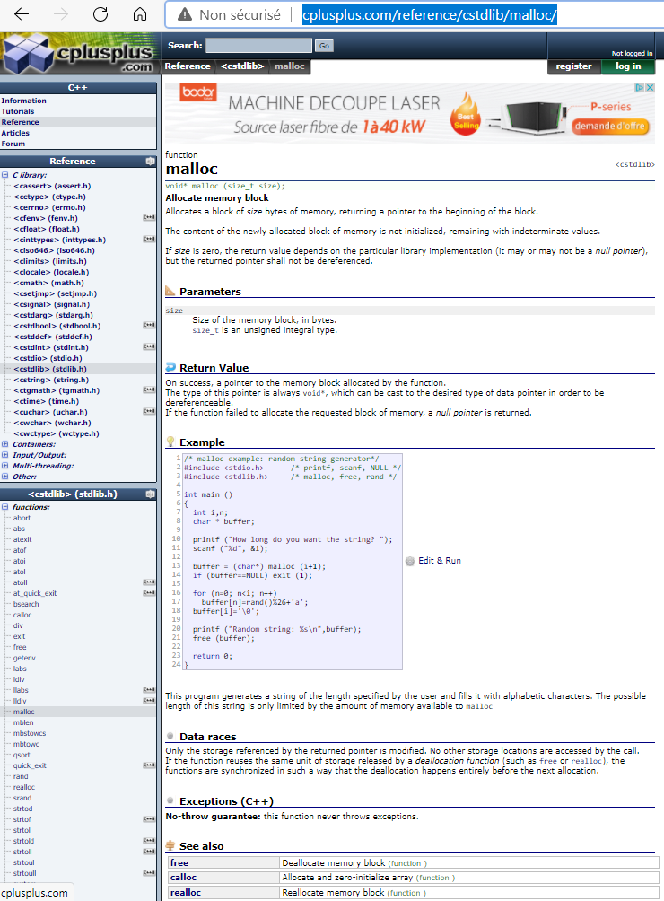
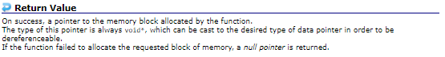
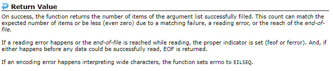
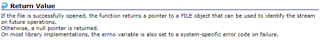

# [Gestion erreurs](https://www.youtube.com/watch?v=lzzXNRK7Khw)


+ [Vérifier le retour de vos fonctions](#Vérifier-le-retour-de-vos-fonctions)
+ [errno](#errno)
+ [fprintf](#fprintf)
+ [perror](#perror)


Bonjour à tous et bienvenue pour ce tutoriel en langage c, je vais vous montrer des bonnes habitudes à avoir pour gérer vos erreurs dans ce langage et dans les différents codes que vous allez développer.

Contrairement a des langages plus récent comme le c++, le Java ou autre, on peut retrouver tout un système d'exception qui permet évidemment de gérer les erreurs correctement avec quelque chose on va dire d'un peu plus moderne un peu plus complet, évidemment on a quelque chose d'un peu plus standard au niveau du langage c mais il existe évidemment des fonctionnalités pour arriver à ce genre de choses.

Je vais vous montrer tout ça au cours de cette vidéo, comment travailler avec nos erreurs et surtout comment est-ce qu'on devrait développer au niveau de notre code à la base.

## Vérifier le retour de vos fonctions

Vous savez que au niveau des fonctions des bibliothèques standard du langage c ont un certain mode de fonctionnement parce que je vous avais expliqué qu'une fonction par rapport à la norme c'est quelque chose qui porte un nom, qui a un certain nombre de paramètres ou non, et qui va avoir une valeur de retour donc elle va retourner quelque chose sauf bien évidemment si elle est de type retour void c'est à dire qu'elle ne retournerait rien mais pour les fonctions propres à la norme elles ont forcément quelque chose à retourner.

Alors dans ce cas-là, le code ou la valeur de retour va vous servir à quelque chose, elle va vous servir à vous assurer que la fonction a bien fonctionnée comme on l'attendait et a eu le comportement qui était souhaité.

Alors on ne le fait pas forcément dans tous nos programmes, vous avez vu dans mes vidéos que je ne le fais pas à chaque fois parce que ce serait très très long mais c'est pourtant complètement indispensable 2 vérifier à chaque fois le retour des fonctions que vous utilisez de la bibliothèque standard c'est à dire que même quand vous faites un printf(), que vous faites un scanf(), quand vous faites un strcpy(), quand vous faites un fclose(), un malloc(), toutes ces fonctions devraient être testées au niveau de leur valeur de retour.

Alors on a appris à tester la valeur de retour de certaines fonctions comme la fonction fopen() pour vérifier l'ouverture d'un fichier ou bien encore pour la fonction malloc() pour ce qui était de l'allocation dynamique de mémoire mais on l'a pas forcément fait au vu pour les autres fonctions.

Et bien tout cela va avoir son importance et c'est justement ce que je vais vous montrer dans cette vidéo.

Pour cela, on va d'abord ajouter une espèce de petite variable globale qui va fonctionner comme une macro selon certains os donc faites attention à ce niveau-là, vous ne pourrez pas récupérer l'adresse de cette variable c'est ça que je voulais dire puisqu'elle sera parfois définie comme étant une constante, une macro.

On va faire un include c'est à dire qu'on va inclure le fichier d'en-tête *errno* avec 2R pour error.

```c
#include <stdio.h>
#include <errno.h>

int main(void)
{

    return 0;
}
```

L'ajout de cet en-tête là va permettre d'ajouter une variable qui s'appelle *errno* tout simplement.

Cette variable globale sera bien sûr accessible partout dans vos programmes, et elle va permettre de détecter les erreurs éventuelles, et vous permettre de les identifier, de les exploiter, de les traiter et ce genre de choses parce qu'évidemment c'est tout l'intérêt au niveau de nos programmes de vérifier un petit peu les erreurs.

Voilà de vérifier le fonctionnement de ce que l'on fait et de prévenir l'utilisateur en cas de problème, ça c'est super important de passer par cela.

Alors si vous vous demandez par exemple que retourne vos fonctions principales comme code, comme valeur alors sachez que vous n'êtes pas obligé de le retenir par cœur, c'est des choses bien évidemment que vous serez à force d'utiliser certaines fonctions.

Vous arriverez bien évidemment à retenir avec la pratique mais si vous voulez recherchez des fonctions que vous avez peut être utilisé tout les 36 du mois comment on dit, c'est mieux de passer par les manuels ou la documentation de référence au niveau des fonctions.

Pour ça moi je vous propose un site très simple qui s'appelle cplusplus.com

[http://cplusplus.com/](http://cplusplus.com/)  

Voilà donc même si ça s'appelle cplusplus pour ceux qui ne servent pas dans le c++ vous pouvez également utiliser la bibliothèque standard du langage c donc moi je passe généralement par ce site quand je cherche quelque chose voilà parce que j'ai pris cette habitude là.

Il y a certainement plein d'autres sites, il y en a vraiment plein d'autres mais moi j'ai toujours utilisé celui-là quand je cherchais une valeur de retour ou autre donc vous pouvez passer par celui-là ou faire une petite recherche sur internet pour en trouver un autre qui serait plus à votre goût.

Alors ici on va aller tout simplement dans */Reference*, dans */C Library* pour la bibliothèque standard et là vous allez retrouver un petit peu tous les fichiers d'en-tête.

[http://cplusplus.com/reference/](http://cplusplus.com/reference/)
  

Par exemple on peut aller dans *stdlib* pour aller cherché ma fonction malloc().

[http://cplusplus.com/reference/cstdlib/malloc/](http://cplusplus.com/reference/cstdlib/malloc/)  
 

Voilà je vais chercher ma fonction malloc() pareil si vous ne savez pas de quoi je parle ici, allez voir la vidéo en question si vous n'avez pas vu l'allocation dynamique aller voir la séance là-dessus avant de regarder ce tutoriel.

Évidemment vous pouvez voir le prototype de la fonction `void* malloc (size_t size) ;` et puis vous avez tout un tas d'informations donc les paramètres et cetera et vous avez une partie pour *Return Value*.

*Return Value* vous mais tout simplement qu’en cas de succès, on a un pointeur retourné, un pointeur vers le bloc qui a été alloué en mémoire par la fonction donc ça pas de souci c'est à dire que c'est l'information elle-même qu'on a alloué qui permet d'être utilisé à ce niveau-là. On vous dit également que le type de ce pointeur est un `*void` mais ça ne nous intéresse pas ici et sinon on vous dit que si la fonction échoue dans l’allocation de ce que vous lui avez demandé donc si vous n'arrivez pas à demander à l'os, et que l'os n'arrive pas à vous réserver en mémoire ce que vous avez demandé ça va retourner un pointeur nul.

 

C'est pour ça qu'on avait vu dans la vidéo sur l'allocation dynamique, on faisait un petit test, un if(), une petite condition pour vérifier si après avoir fait un malloc() tout a bien marché.

```c
#include <stdio.h>
#include <stdlib.h>
#include <errno.h>

// Variable -> errno

int main(void)
{
    int *ptr_entier;

    ptr_entier = malloc(sizeof(int));

    if(ptr_entier == NULL)
    {
        printf("Erreur allocation dynamique.\n");
        exit(EXIT_FAILURE);
    }

    return 0;
}
```

Voilà un petit exemple de programme ou en cas d'erreur d'allocation dynamique on faisait un Exit(), on quittait le programme tout simplement parce que je vous avais expliqué qu'en cas d'échec de l'allocation dynamique, il ne faut surtout pas continuer le programme.

Alors voilà le genre de chose que l'on faisait.

Alors ici on faisait tout simplement un test sur la récupération de la valeur de retour `ptr_entier` de la fonction d'accord donc il y avait vraiment un intérêt ici par rapport à ce qu'on avait pour Return value sur http://cplusplus.com/reference/cstdlib/malloc/

Il y a vraiment un intérêt par rapport à ça pour vérifier ça.

D'ailleurs on peut raccourcir cette syntaxe, ainsi on peut mettre le malloc() dans la condition sans problème.

```c
#include <stdio.h>
#include <stdlib.h>
#include <errno.h>

// Variable -> errno

int main(void)
{
    int *ptr_entier;

    if((ptr_entier = malloc(sizeof(int))) == NULL)
    {
        printf("Erreur allocation dynamique.\n");
        exit(EXIT_FAILURE);
    }

    return 0;
}
```

Voilà donc quand on met notre allocation entre 2 parenthèses dans la condition ` if((ptr_entier = malloc(sizeof(int))) == NULL)` alors vous faites tout le test de ça et ça va faire exactement la même chose et vous faites directement la condition ça permet ainsi de gagner quelques lignes lors de notre test et d'ailleurs dans certains cas ce sera beaucoup plus pratique de faire comme ça ça nous permettra de gagner du temps au niveau du nombre de lignes que vous avez.

Donc là on fait bien notre allocation et on fait notre retour de l’allocation dans `ptr_entier` et et ce retour là on va le tester dans la condition, et donc si c'est nul on affiche notre message d'erreur et on quitte, sinon on continue le programme sans problème et affectation ce sera bien déroulé et on pourra travailler avec l'information qu'on a.

Je rappelle que dans ce genre de cas on n'oublie pas de faire `free(ptr_entier);`.

```c
#include <stdio.h>
#include <stdlib.h>
#include <errno.h>

// Variable -> errno

int main(void)
{
    int *ptr_entier;

    if((ptr_entier = malloc(sizeof(int))) == NULL)
    {
        printf("Erreur allocation dynamique.\n");
        exit(EXIT_FAILURE);
    }

    free(ptr_entier);
    return 0;
}
```

De toute façon on ne fera pas le free() si ça échoué donc on va quitter le programme, il n'y a pas de problème à ce niveau-là.

Voilà ça c'est des petites choses qu'on avait vu.

Alors ça vous pouvez le faire avec toutes les fonctions, nous on l'a fait vraiment avec des fonctions on va dire sensible tel que la fonction d'allocation ou la fonction d'ouverture de fichier mais on pourrait vraiment le faire pour tout.

On va le faire maintenant ici avec la fonction scanf() si on veut par exemple tout simplement récupérer une information donc on va faire ceci, on va demander 2 nombres qu'on sépare avec un espace.

```c
#include <stdio.h>
#include <stdlib.h>
#include <errno.h>

// Variable -> errno

int main(void)
{
    int nb1, nb2;

    printf("Entrez deux nombres : ");
    scanf("%d %d", &nb1, &nb2);

    printf("Nb1 = %d - Nb2 = %d\n", nb1, nb2);
    return 0;
}
```

Alors on pourrait de manière naïve tester directement le programme et faire confiance par rapport à ce qu'on a fait par rapport à ce qu'on exécute, si on met 15 et 3 ça affiche bien les choses.

```powershell
gcc main.c -o prog
prog.exe
Entrez deux nombres : 15 3
Nb1 = 15 - Nb2 = 3
```

Pas de souci mais on pourrait également s'assurer que le scanf() a bien eu le comportement qu'on voulait.

Sans parler de saisie sécurisée ou non parce que ce n'est pas le but de ce tutoriel-là, on peut directement les vérifier donc on va aller sur la référence (cplusplus.com), on va aller tout simplement sur *stdio.h*.

Alors sur le site petite parenthèse il faut mettre un c devant le nom si vous faites du c plus plus pour l'ajouter.

Ici nous allons nous occuper de scanf().

[http://cplusplus.com/reference/cstdio/scanf/](http://cplusplus.com/reference/cstdio/scanf/)  

Voilà donc on a pas mal d'information et on va chercher la partie concernant la valeur de retour et là on aura des informations qui sont précises à ce niveau-là.

  

On vous met qu'en cas de succès la fonction retourne le nombre d’éléments qui ont été affectés avec succès donc moi ici les éléments j'en ai 2 `%d %d` donc ça veut dire qu'a priori si ça s'est bien passé le retour de scanf() devrait être 2 d'accord à priori parce que j'ai 2 affectations. Et sinon voilà on lit très très vite mais on nous retourne EOF.

Voilà donc au cas d'échec on n’aura pas du tout le retour du nombre d'affectations réussi (eof is returned).

Alors comment allons-nous tester à ce niveau-là, on va faire `int ret = 0;` que l'on va mettre à 0 par défaut, et on va récupérer le retour de scanf() à l'intérieur puis j'affiche le retour de scanf() et je verrais bien combien ça me donne.

```c
#include <stdio.h>
#include <stdlib.h>
#include <errno.h>

// Variable -> errno

int main(void)
{
    int nb1, nb2;
    int ret = 0;

    printf("Entrez deux nombres : ");
    ret = scanf("%d %d", &nb1, &nb2);

    printf("Nb1 = %d - Nb2 = %d\n", nb1, nb2);
    printf("RET = %d\n", ret);

    return 0;
}
```
```powershell
gcc main.c -o prog
prog.exe
Entrez deux nombres : 15 3
Nb1 = 15 - Nb2 = 3
RET = 2
```

Voilà là je rentre mes 2 nombres et il a pas de souci parce qu'il a bien pris en compte la valeur de retour mais maintenant Regardez si je fais une bêtise et que je mets un nombre et un caractère `f` par exemple ou même n'importe quoi `4194432`.

```c
#include <stdio.h>
#include <stdlib.h>
#include <errno.h>

// Variable -> errno

int main(void)
{
    int nb1, nb2;
    int ret = 0;

    printf("Entrez deux nombres : ");
    ret = scanf("%d %d", &nb1, &nb2);

    printf("Nb1 = %d - Nb2 = %d\n", nb1, nb2);
    printf("RET = %d\n", ret);

    return 0;
}
```
```powershell
gcc main.c -o prog
prog.exe
Entrez deux nombres : 15 fzdz
Nb1 = 15 - Nb2 = 32759
RET = 1
```

Là vous voyez que `ret = 1` donc ça montre bien qu'il y a eu une affectation qui a échoué d'ailleurs on a une valeur complètement bizarre `32759` c'est à dire qu'on a absolument n'importe quoi là-dedans.

Là le problème c'est que je m'amuse à afficher des variables alors que la lecture c'est absolument mal passé au niveau de la saisie donc la chose logique aurait été tout simplement de faire ceci d'ailleurs on n'est même pas obligé de passer par *ret* mais on peut le tester quand même ici sachant qu'il est égal à 2 si la saisie s'est bien passée.

```c
#include <stdio.h>
#include <stdlib.h>
#include <errno.h>

// Variable -> errno

int main(void)
{
    int nb1, nb2;
    int ret = 0;

    printf("Entrez deux nombres : ");
    ret = scanf("%d %d", &nb1, &nb2);

    if(ret ==2)
    {
        printf("Nb1 = %d - Nb2 = %d\n", nb1, nb2);
        printf("RET = %d\n", ret);
    }
    else
        printf("Erreur de saisie !\n");

    return 0;
}
```
```powershell
gcc main.c -o prog
prog.exe
Entrez deux nombres : 15 3
Nb1 = 15 - Nb2 = 3
RET = 2
```

Et si je fais ça.

```powershell
gcc main.c -o prog
prog.exe
Entrez deux nombres : 15 zeff
Erreur de saisie !
```

Là il me met tout simplement erreur de saisie donc ça permet d'éviter d'afficher des choses, et d'afficher des résultats sur des informations qui sont peut être complètement corrompues ou qui sont pas du tout attendues, qui peuvent avoir un comportement assez spécifiques.

Là on s'est occupé de vérifier le retour de la fonction scanf() et du coup ça nous a permis d'éviter d'afficher quelque chose qui serait faux.

Alors ça c'est important c'est la première règle à savoir au niveau de tout ce qui est gestion d'erreur, voilà le premier point essentiel de ce tutoriel que je vous présente c'est de **vérifier au maximum le retour de vos fonctions**.

Dans l'idéal surtout si vous faites de la programmation assez sensible comme la programmation système ou du réseau, il faudrait normalement vérifier le retour de toutes les fonctions que nous utilisons c'est à dire que là même dans l'absolu il faudrait qu'on vérifie le retour de printf() pour être sûr que au niveau de l'affichage j’ai ce que j'attendais.


À chaque fois qu'on utilise une fonction de la bibliothèque standard donc qui est inclus dans les fichiers d'en-tête, il faudrait vérifier à chaque fois que ce soit pour un fclose(), un fopen(), un malloc(), un scanf(), un fgets(), un strcpy(), n'importe quelle fonction.

Voilà nous devrions vérifier le retour à chaque fois pour être sûr quel ai le comportement attendu puisque ces fonctions étaient développées de sorte à retourner des valeurs précises en fonction de leur succès ou non dans leur fonctionnement donc ça a de l'intérêt à ce niveau-là.

User et abuser, n'hésitez pas à abuser de tout ce qui est référence pour vos langages donc n'hésitez pas à bien vérifier les valeurs de retour parce que c'est bien de les connaître un minimum et après de bien les vérifier lors de vos programmes et dans le codage de votre programme, ça c'est super important.

Tout à l'heure nous avions ajouté `#include <errno.h>` et jusqu à présent on a fait que vérifier le retour des fonctions mais ce n'est pas suffisant !

## errno

alors le errno, la première chose à faire à ce niveau-là pour pouvoir détecter des erreurs c'est d'abord l’initialiser à 0 c'est à dire que c'est bien à chaque fois avant de faire les tests de toujours le passer à 0 pour être sûr qu'il n'y a pas de valeurs d'avant, ou une mauvaise valeur à l'intérieur et que du coup les résultats soient faussés.

Donc par habitude nous allons faire `errno = 0 ;` avant de passer à nos tests donc moi je le fais tout simplement au début.

```c
#include <stdio.h>
#include <errno.h>

// Variable -> errno

int main(void)
{
    errno = 0;

    return 0;
}
```

Alors qu'est-ce que je pourrais tester qui pourrait éventuellement mener à une erreur ? il nous faut une fonction qui ne retourne pas la bonne chose donc on va prendre par exemple le scanf().

```txt
#include <stdio.h>
#include <errno.h>

// Variable -> errno

int main(void)
{
    int nb1, nb2;
    int ret = 0;

    errno = 0;

    printf("Entrez deux nombres : ");
    ret = scanf("%d %d", &nb1, &nb2);

    if(ret ==2)
    {
        printf("Nb1 = %d - Nb2 = %d\n", nb1, nb2);
        printf("RET = %d\n", ret);
    }
    else
        printf("Erreur de saisie !\n");

    return 0;
}
```

La première vérification à faire c'est tout simplement d'utiliser une fonction qui va s'appeler la fonction perror() qui va permettre d'utiliser l'erreur que errno retourne donc errno va tout simplement contenir un code d'accord un code d'erreur et le os c'est capable ensuite de traduire ce code un message d'erreur.

L'avantage c'est qu'on verra tout à l'heure c’est qu'avec certaines fonctions on va pouvoir afficher un message qui va pouvoir en plus changer de langue en fonction de la langue du système, que ce soit en anglais, en français ou autre ça va pouvoir être adapté donc ça peut être utile.

Alors dans notre cas pour la location il est possible qu'il nous l’affiche en anglais mais ce n'est pas bien grave car l'important est de bien avoir un message d'erreur qui est géré à ce niveau-là.

Alors on va utiliser qu'une seule instruction dans le cas où ça a échoué donc dans le cas où `ret != 2` donc dans le cas où j'ai pas mes valeurs, on va utiliser perror() en utilisant mon propre message mais vous allez voir par la suite que ça va en fait utiliser en retour donc moi je noterai juste comme message *Erreur : * et après on verra comment il va gérer les espaces ou autre.

```c
#include <stdio.h>
#include <errno.h>

// Variable -> errno

int main(void)
{
    int nb1, nb2;
    int ret = 0;

    errno = 0;

    printf("Entrez deux nombres : ");
    ret = scanf("%d %d", &nb1, &nb2);

    if(ret ==2)
        printf("Nb1 = %d - Nb2 = %d\n", nb1, nb2);
    else
        perror("Erreur : ");

    return 0;
}
```
```powershell
gcc main.c -o prog
prog.exe
Entrez deux nombres : 15 3
Nb1 = 15 - Nb2 = 3
```

```powershell
gcc main.c -o prog
prog.exe
Entrez deux nombres : 15 zefzf
Erreur : : No error
```

Alors il me met *No error* parce qu'apparemment il ne l'a pas fixé donc pour lui ce n'est pas une erreur qu'il considère. Il n'a d'ailleurs pas détecté une erreur en particulier.

On va donc le faire sur quelque chose d'un peu plus explicite donc on va le faire ici sur l'ouverture de fichier comme ceci et comme on n'a pas de fichier `truc.txt` ici il va nous indiquer une erreur.

```txt
#include <stdio.h>
#include <errno.h>

// Variable -> errno

int main(void)
{
    errno = 0;
    FILE *fic;

    fic = fopen("truc.txt", "r");

    return 0;
}
```

Alors logiquement on va d'abord aller voir la fonction fopen() et admettons qu'on ne sait pas ce que ça retourne, et bien on va chercher dans la référence (cplusplus.com).

[http://cplusplus.com/reference/cstdio/fopen/](http://cplusplus.com/reference/cstdio/fopen/)  
  

Voilà ici on cherche les valeurs de retour, alors si le fichier a bien été ouvert normalement ça nous met directement à pointer vers le fichier, vers l'objet donc le fichier en lui-même c'est à dire le flux pour pouvoir le lire bien évidemment donc pas de souci à ce niveau-là sinon ça nous retourne tout simplement un pointeur nul.

Ah si on sait que si c'est un pointeur nul qui est retourné c'est qu'on n'a pas pu ouvrir le fichier donc du coup on n'a plus qu'a faire ce test là `if(fic == NULL)` voir encore une fois rappelez vous qu'on peut mettre dans la condition directement l'utilisation de la fonction `if((fopen("truc.txt", "r")) == NULL)` voilà c'est tout à fait possible de faire comme ça mais nous on va éviter de compliquer l'écriture, et on n'oublie pas de faire un `fclose(fic);` et je rappelle que le fichier ne sera fermé seulement s'il a réussi à être ouvert. On va tester perror().

```c
#include <stdio.h>
#include <errno.h>

// Variable -> errno

int main(void)
{
    errno = 0;
    FILE *fic;

    fic = fopen("truc.txt", "r");

    if(fic == NULL)
    {
        perror("ERREUR");
    }

    fclose(fic);
    return 0;
}
```
```powershell
gcc main.c -o prog
prog.exe
ERREUR: No such file or directory
``` 

Là je pense qu'il va prendre le message en compte et c'est le cas parce que mon fichier n'existe pas de toute manière donc ça va forcément poser un soucis voilà donc il affiche simplement *ERREUR: No such file or directory".

Donc il indique qu'il n'a pas réussi à ouvrir le fichier donc ça peut être pratique d'avoir ce genre de chose alors on peut très bien ajouter un message que l'on veut avant celui par défaut donc ça c'est adaptable.

## fprintf

Alors maintenant au sujet de fprintf() c'est une fonction qui est dans stdio donc ici pas besoin d'ajouter un autre en-tête, il suffit de l'appeler et en premier paramètre on va spécifier le flux de lecture donc souvent ça peut être un flux de fichier par exemple `fic` mais nous on va utiliser un canal de communication.

Sur n'importe quel os, on a 3 canaux de communication que ce soit sur Windows Linux ou Mac ça ne changera pas. 

Alors vous avez d'abord le canal de sortie standard donc c'est notre terminal tout simplement ce qu'afficherait le terminal. Alors vous avez également le canal d'entrée donc ça c'est quand vous faites une saisie lorsqu'on récupère avec fscanf(), fgets() et cetera. Enfin il y a une sortie d'erreur standard.

`stdout` est la sorti standard, `stdin` est l'entrée et `stderr` qui va être la sortie d'erreur.

```txt
fprintf(stdout, <message>)
fprintf(stdin, <message>)
fprintf(stderr, <message>)
```

Voilà ça permet d'isoler chacun des types de messages que vous communiquez sur un des canaux donc pour éviter d'avoir tout qui est mélanger.

Ensuite on écrit simplement notre message, par exemple *Problème ouverture de fichier*.

```c
#include <stdio.h>
#include <errno.h>

// Variable -> errno

int main(void)
{
    errno = 0;
    FILE *fic;

    fic = fopen("truc.txt", "r");

    if(fic == NULL)
        fprintf(stderr, "Probleme ouverture de fichier\n");

    fclose(fic);
    return 0;
}
```
```powershell
gcc main.c -o prog
prog.exe
Probleme ouverture de fichier
```

C'est maintenant vous voulez vous servir de errno par rapport à ce message là, il contient encore une fois un code d'erreur mais pour ça vous allez devoir ajouter l'en-tête pour les chaînes de caractères donc string.h tout simplement et on va utiliser une autre fonction qui est strerror() et là vous allez pouvoir y mettre tout simplement le code `stderror(<error>)`.

Voilà donc nous on le met carrément à la suite comme paramètre de fprintf().

Voilà vous avez vu le premier paramètre de fprintf() c'est le canal donc le flux en fait, mon message et ensuite `strerror(errno)`.

Et on va voir ce que ça donne comme résultat.

```c
#include <stdio.h>
#include <errno.h>
#include <string.h>

// Variable -> errno
// strerror(<code>)

int main(void)
{
    errno = 0;
    FILE *fic;

    fic = fopen("truc.txt", "r");

    if(fic == NULL)
        fprintf(stderr, "Probleme ouverture de fichier\n", strerror(errno));

    fclose(fic);
    return 0;
}
```
```powershell
gcc main.c -o prog
prog.exe
Probleme ouverture de fichier
```

Voilà donc là il n'a rien affiché parce que je n'ai pas précisé quelque chose, comme ici je passe un élément `strerror(errno)` n'oubliez pas comme pour une lecture ou un affichage d'ajouter l'information donc on va l'ajouter avec un %s puisque cette fonction strerror() va retourner une chaîne de caractères.

```c
#include <stdio.h>
#include <errno.h>
#include <string.h>

// Variable -> errno
// strerror(<code>)

int main(void)
{
    errno = 0;
    FILE *fic;

    fic = fopen("truc.txt", "r");

    if(fic == NULL)
        fprintf(stderr, "Probleme ouverture de fichier : %s\n", strerror(errno));

    fclose(fic);
    return 0;
}
```
```powershell
gcc main.c -o prog
prog.exe
Probleme ouverture de fichier : No such file or directory
```

Voilà alors évidemment ça répète la chose parce qu'on a déjà un message mais on peut adapter tout ça.

```c
#include <stdio.h>
#include <errno.h>
#include <string.h>

// Variable -> errno
// strerror(<code>)

int main(void)
{
    errno = 0;
    FILE *fic;

    fic = fopen("truc.txt", "r");

    if(fic == NULL)
        fprintf(stderr, "Err : %s\n", strerror(errno));

    fclose(fic);
    return 0;
}
```
```powershell
gcc main.c -o prog
prog.exe
Err : No such file or directory
```

Voilà c'est vous qui mettez vos : comme vous voulez bref c'est vous qui gérez le formatage.

Là nous allons travailler du coup avec cette petite variable `errno`, cette variable globale qui va permettre du coup de détecter les erreurs et de travailler en fonction.

Alors nous pouvons éventuellement faire d'autres choses mais je n'ai pas forcément d'exemples parlants, en tout cas d'exemples très sympa montrer pour provoquer une erreur.

Vous pouvez par exemple faire avec des fonctions mathématiques, souvent avec des fonctions mathématiques on peut générer des erreurs donc éventuellement vous pourrez tester avec celle-ci pour voir un petit peu comment ça fonctionne.

Ainsi s'il y a une règle à vous dire c'est lorsque vous utilisez la variable globale `errno` donc c'est de bien ajouter le fichier d'en-tête errno.h, de bien initialiser à chaque fois la variable globale `errno = 0;` **ou réinitialiser la variable globale à 0 c'est important**.

**Ensuite vous faites votre test de fonction en vérifiant son retour**, ça c'est super important de vérifier sa valeur de retour et en fonction vous affichez une erreur convenablement.

Alors ça c'est super important parce que si vous avez une erreur dans un programme, ne faites pas que quitter le programme mais afficher un petit message en français ou en anglais peu importe mais un message pour indiquer à l'utilisateur ce qui s'est passé voilà parce que s'il y a un message qui s'affiche avec un code bizarre, l'utilisateur ne va absolument rien comprendre.

Par contre si vous mettez qu'ici il n'a pas trouvé de fichier, ou *file not found* quelque chose comme ça c'est parlant voilà c'est dans le langage humain, on comprend ce que ça veut dire donc utilisez toujours des messages d'erreur.

Pour cela vous avez la fonction fprintf() en passant par le canal d'erreur standard (stderr) pour le faire, et vous pouvez même utiliser strerror() tout simplement que vous pouvez utiliser directement avec un `fprintf(stderr, "%d\n", strerror(errno))` voilà vous pouvez faire directement avec un seul %s sans soucis ça peut fonctionner comme ça donc avec `strerror(errno)` qui retourne une chaîne à partir d'un code.

## perror

Ou alors vous pouvez tout simplement passer par perror().

```c
#include <stdio.h>
#include <errno.h>
#include <string.h>

// Variable -> errno
// strerror(<code>)

int main(void)
{
    errno = 0;
    FILE *fic;

    fic = fopen("truc.txt", "r");

    if(fic == NULL)
        perror("ERR");

    fclose(fic);
    return 0;
}
```
```powershell
gcc main.c -o prog
prog.exe
ERR: No such file or directory
```

Voilà on peut directement passer par perror() plutôt que de passer par une chaîne ou autre (%s).

Donc voilà il y a plusieurs solutions possibles, ainsi les messages sont gérés par le code d'erreur de cette variable globale errno et donc par le langage ce qui permet d'afficher des messages différents en fonction du problème qui a été reporté donc ici notamment l'ouverture d'un fichier donc ça peut être pas mal de voir à ce niveau-là comment ça s'est passé.

On pourrait le faire même pour fclose() du coup parce que si fclose() n'est pas fait, on pourrait directement afficher un message ce qui serait intéressant.

N'hésitez pas à essayer ce genre de chose, et d'ailleurs au niveau du perror() que j'ai fait ici on pourrait d'ailleurs même faire `exit(EXIT_FAILURE);` parce que j'essaie d'ouvrir un fichier qui n'existe pas mais attention parce que ces constantes sont dans stdlib.h

```c
#include <stdio.h>
#include <stdlib.h>
#include <errno.h>
#include <string.h>

// Variable -> errno
// strerror(<code>)

int main(void)
{
    errno = 0;
    FILE *fic;

    fic = fopen("truc.txt", "r");

    if(fic == NULL)
    {
        perror("ERR");
        exit(EXIT_FAILURE);
    }

    fclose(fic);
    return 0;
}
```
```powershell
gcc main.c -o prog
prog.exe
ERR: No such file or directory
```

Voilà comme ça donc pas de problème à ce niveau-là au niveau de la gestion de nos erreurs donc voilà si je dois faire un résumé encore une fois c'est de toujours vérifier le retour de nos fonctions tout le temps tout le temps, d'afficher un message d'erreur quand il y a eu une erreur pour que l'utilisateur ait compris pourquoi ça a planté, qu'est-ce qui a marché et qu'est-ce qui n'a pas marché. Et si vraiment vous voulez aller plus loin dans l'affichage des messages d'erreur, un peu plus technique, en passant par des messages du système, vous pouvez utiliser ce fichier d'en-tête errno.h et travailler avec la variable globale errno et comme ça vous pourrez tout faire à ce niveau-là grâce aux fonctions perror(), strerrno() et éventuellement la fonction fprintf() pour afficher sur la sortie d'erreur standard vos différents messages.

Je m'arrêterais-là pour ce tutoriel je pense que j'ai fait tout de ce qui était nécessaire à savoir.

Ça reste très simple je n'ai rien montré de compliqué dans cette vidéo, c'est un tutoriel très accessible mais j'espère que ça vous aura servi que ça vous donnera de bonnes habitudes de programmation surtout au niveau de la vérification de vos fonctions.

Vérifiez toujours et ne faites pas forcément confiance à l'usage des fonctions, ça ne veut pas toujours dire qu'elles vont toujours fonctionner donc vérifiez bien ce qui se passe pour être sûr de ne pas avoir de comportement bizarre ou indéterminé dans votre programme.

À bientôt tout le monde pour la prochaine vidéo sur le chaîne