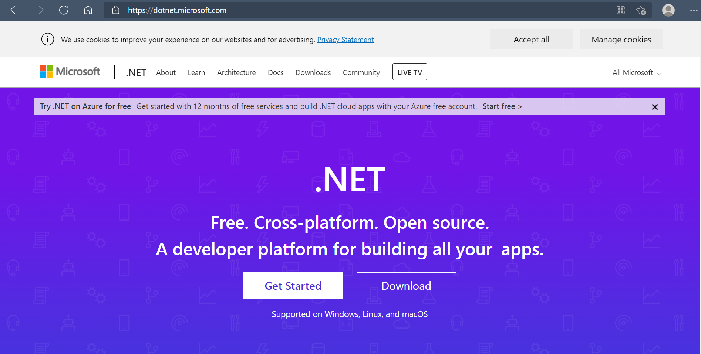
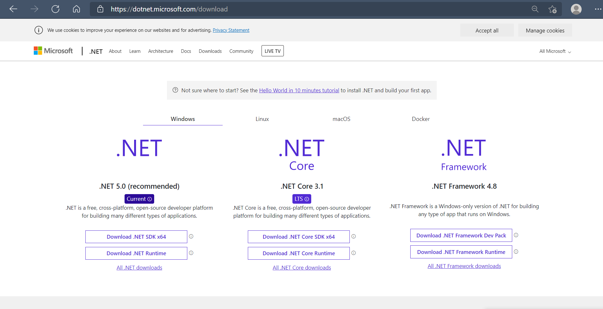
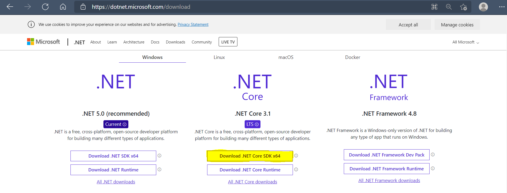
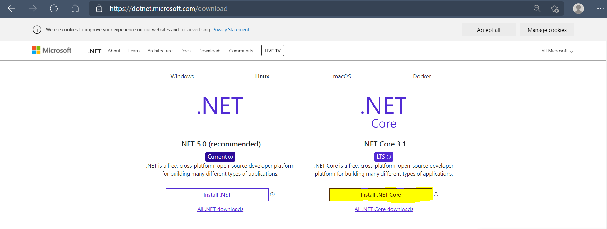
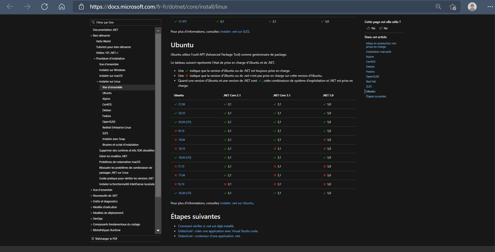

# [1. Introduction](https://www.youtube.com/watch?v=uHUkndqnHAg)

Bonjour tout le monde et bienvenue pour ce cours d'introduction à la formation au langage CSharp, le langage de Microsoft qui a été initié en 2002, qui a même été normalisé en 2001, ce qui s'est fait assez tôt.

Ensuite le langage a connu pas mal d'évolution jusqu à la version d'aujourd'hui qui est la version 8 du langage CSharp.

Dans ce cours je vais vous proposer d'aborder tous les concepts de ce langage, de la même manière que d'autres langages qui sont proposés sur la chaîne tel que Java et c++ et cetera, et vous allez suivre un petit peu tout ce processus, tout ce que vous allez voir sur ce cours pour étudier les notions avant d’arriver sur des choses beaucoup plus avancées sur la suite.

J'avais attendu la sortie de cet outil dans sa version 3.0, vous allez très vite comprendre pourquoi et avant de démarrer cette formation j'avais prévu de faire ça dans le courant de 2019 mais peut être que vous avez prévu de voir cette intro 5 ou 10 ans, 250 et vous avez retrouvé cette vidéo dans les vestiges d'une ancienne civilisation.

C'est la toute première formation que vous Découvrez sur cette chaîne bienvenue à vous.

Très rapidement comme je l'avais dit en début de vidéo, CSharp est un langage qui a été créé par Microsoft qui s'inspirait qui est beaucoup plus simple que de langage comme C++ ou Java parce qu'ils s'en inspirent beaucoup beaucoup avec bien sûr tout un tas de différence par rapport à ces langages et d'autres choses qui sont similaires.

Alors pour cela nous allons utiliser un outil qui est assez récent, qui s'appelle Dot Net Core qui est un framework qui va surtout permettre la prise en charge multiplateforme du langage CSharp.

À l'époque quand on voulait programmer en langage CSharp, c'était du propriétaire donc du langage Microsoft.

C'était Windows exclusivement et on avait quelques solutions qui étaient arrivés par la suite pour Linux et Mac OS mais qui ne prenait pas forcément tout en charge ce qui était assez compliqué et pas forcément pratique.

Avec le changement de PDG chez Microsoft, et beaucoup de changements en interne, on a eu l'arrivée de Dot Net Core qui est tout simplement un nouveau framework mais qui va reprendre toute la technologie DOT Net qui est un ensemble de classes et de choses qui sont déjà pré développés qu'on va pouvoir inclure dans pas mal de langage de programmation.

En gros cette technologie DOT Net sert notamment pour les gamers qui jouent aux jeux vidéo ainsi il y a des redistributions de DOT Net qui sont utilisés pour la prise en charge de beaucoup de jeux et de technologie qui sont utilisés dans les jeux vidéo mais on va retrouver ça aussi dans pas mal de langage que ce soit l’ASP, le SSharp dans le Visual basic et bien évidemment le langage CSharp qui en fait partie.

Pour cela nous allons installer très rapidement vous allez voir que c'est très simple cet outil Dot Net Core, encore une fois l'avantage c'est que vous aurez tous le même outil peu importe votre système d'exploitation ce que je préfère et ce que je privilégie en général sur mes cours donc c'est pas plus mal comme ça.

Donc on va bien évidemment là où en général on fait 100% de Manuel pour tout, là vous allez voir qu'il y a quand même certains outils qui vont nous faire des choses automatiquement mais ça ne veut pas dire qu'on va s'amuser à lancer quelques commandes tout le temps sans comprendre ce que l'on fait, non.

On va bien sûr analyser tout ce qu'il se passe avec ces commandes en console et voir comment un projet en CSharp est construit.

Passons directement à cette page.

[https://dotnet.microsoft.com/](https://dotnet.microsoft.com/)  
  

Nous avons depuis ce site, vous avez accès à la page en ce qui concerne la technologie DOT Net et la technologie notamment DOT Net Core qui nous intéresse, qui va prendre en charge tous les outils qu'il va falloir pour compiler donc c'est à dire écrire notre code source d'accord sur un éditeur.

On parlera rapidement de l'éditeur pour ceux qui suivent pour la première fois un langage de programmation du coup on reviendra très rapidement sur les outils que vous avez besoin pour pouvoir programmer.

Après le téléchargement vous aurez tout l'ensemble d'outils que vous aurez besoin pour pouvoir obtenir des programmes depuis votre code qui seront exécutables.

On va dans la section download, et vous avez les différentes catégories.

[https://dotnet.microsoft.com/download](https://dotnet.microsoft.com/download)  
  

Vous avez les différentes catégories, et là comme je vais juste montrer sur Windows comment ça se passe et encore c'est très très rapide donc peu importe par vous passer vous récupérez et puisqu'on va travailler au minimum avec la version *.NET Core 3.0* qui est sortie il y a quelques jours.

Je voulais attendre la version 3.0 tout simplement parce qu'elle prend en charge la dernière version de CSharp donc on commencera sur le fonctionnement le plus récent du langage au lieu de partir sur quelque chose qui est un peu ancien voire obsolète donc pas de problème par rapport à ça.

Pour Windows on choisit de construire des applications (Build App) donc on va récupérer directement le **.NET Core SDK** depuis ce bouton là.

  

Pour Linux c'est très simple aussi, vous choisissez votre distribution.

  

Vous choisissez votre distribution mais c'est vraiment la distribution n'est pas là renseignée, il est possible que d'autres soient prises en charge peut être pas officiellement mais en tout cas ça devrait pouvoir fonctionner sur d’autres distributions mais après si vous êtes sur Linux c'est mieux de passer par une de ces distributions-là pour éviter d'avoir des problèmes de compatibilité.

Par exemple ici on va prendre pour Ubuntu.

[https://docs.microsoft.com/fr-fr/dotnet/core/install/linux-ubuntu](https://docs.microsoft.com/fr-fr/dotnet/core/install/linux-ubuntu)  
  

Voilà donc on peut faire des commentaires très simple mais si vous ne connaissez pas c'est comment avec *dpkg*, *chown*, *apt get* et cetera, vous pouvez apprendre à l'utiliser et à le comprendre via mon cours GNU Linux sur la chaîne youtube aussi et comprendre certaines choses s'il vous manque des connaissances.

Je ne vais pas montrer l'installation mais une fois que tout est installé, c'est juste utiliser des commandes et pour Windows c’est un exécutable avec le suivant suivant installer, à priori sur Mac OS c'est également un exécutable.

Pareil vous choisissez *Build Apps* puis **Download .NET Core SDK** Et ainsi vous récupérez le SDK donc très très simple à ce niveau-là.

Une fois que il est bien installé et configuré, il devrait normalement être reconnu depuis un terminal donc pour le vérifier on va lancer un terminal, un invite de commande ou en PowerShell, ce que vous voulez selon votre os et vous allez utiliser l'outil `dotnet` c'est tout.

```powershell
C:\Users\sam>dotnet

Usage: dotnet [options]
Usage: dotnet [path-to-application]

Options:
  -h|--help         Display help.
  --info            Display .NET Core information.
  --list-sdks       Display the installed SDKs.
  --list-runtimes   Display the installed runtimes.

path-to-application:
  The path to an application .dll file to execute.
```

Alors voilà c'est tout en minuscule, on peut vérifier maintenant la version avec `dotnet --version`.

```powershell
C:\Users\sam>dotnet --version
3.1.410
```

Voilà comme ça ici on peut voir si on part bien sûr la bonne version et que l'outil a bien été installé bien sûr donc là on a la version 3.1

Évidemment si vous suivez cette vidéo avec une version plus récente, il n'y a pas de souci mais sachez qu'il faudra installer au minimum la version 3.0 qui prend en charge CSharp 8.

C'est par contre vous installez la version 2.2, il y a à priori beaucoup de chance que les choses ne soient pas compatibles par la suite avec votre version du framework donc vous aurez du coup de grosses erreurs pour suivre le cours donc partez tous sur dotnet 3.0 pour suivre le cours et partir avec CSharp 8 qu'on soit sur la même longueur d'onde et la même version de langage et qu'on n'ait pas de problème par la suite pour suivre ce cours.

Une fois que ça fait on va pouvoir démarrer la création d'un nouveau projet.

Alors petite parenthèse, alors évidemment vous n'allez pas programmer avec le bloc-notes Windows voir simple pal comme vous avez sur d'autres systèmes d'exploitation, il faut passer au minimum par un éditeur de code qui est tout simplement le logiciel qui va vous permettre de colorer syntaxiquement le code.

## créer un projet en mode console

Créer un projet en mode console CSharp ou Visual Basic ou FSharp

```powershell
dolnet new console -o FirstApp
dolnet new console -o FirstApp -lang VB
dolnet new console -o FirstApp -lang FSharp
```

