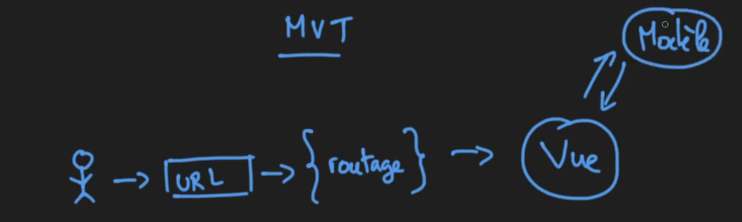
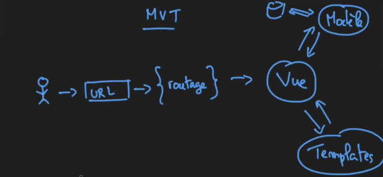
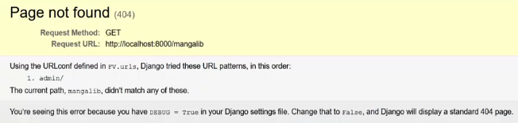
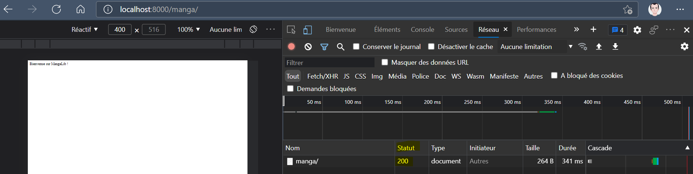

# [3. Création d'application](https://www.youtube.com/watch?v=t1B3NocLLWY)

+ [Intoduction - Architecture MVT](#Intoduction---Architecture-MVT)
+ [Mettre en place notre application](#Mettre-en-place-notre-application)
    ```powershell
    PS C:\MyDjango\FV> python manage.py startapp mangalib
    PS C:\MyDjango\FV> python manage.py runserver
    ```
    + [Créer un fichier URL : .FV/mangalib/urls.py](#Créer-un-fichier-URL)
    + [Créer cette vue : .FV/mangalib/views.py](Créer-cette-vue)
+ [Indiquer l'url de notre application](#Indiquer-le-url-de-notre-application)
    + [Éditer le fichier urls existant : .FV/FV/urls.py](#Éditer-le-fichier-urls-existant)
+ [Ajouter notre projets dans les configurations](#Ajouter-notre-projets-dans-les-configurations)
    + [Éditer le fichier des configurations : .FV/FV/settings.py](#Éditer-le-fichier-des-configurations)
+ [Test - Actualisation](#Test---Actualisation)

## Intoduction - Architecture MVT

L'utilisateur inscrit une URL dans le navigateur. Cet URL est analysé au niveau d'un système de routage (On verra comment établir des root) qui va appeler la bonne vue correspondante (le V que l'on retrouve dans MVT et l'architecture MVC, cet autre patron d'architecture). La vue est ce qui est affiché au niveau du navigateur, la page web avec les informations.


On fait des demandes qui vont nécéssité la récupération de données et ce ferra en partie avec une communication avec un modèle.



Le modèle ça va être la représentation même toutes les informations que vous aurez par la suite en base de données. Ce modèle va pouvoir communiquer avec nos bases de données éventuellement récupérer les différentes données, les synchroniser où générer simplement les tables pour les enregistrements qu'on aurait en base de données par rapport aux différents modèles.


On pourrait par exemple avoir un modèle pour nos utilisateurs, on pourrait avoir un modèle pour l'article d'un site, on pourrait avoir un modèle pour un panier et on va retrouver toutes ces informations là donc la vue va forcément communiquer avec ce modèle.

La vue va permettre également de travailler avec un ensemble de Template ce qui va permettre d'alimenter ou d'enrichir cette vue. Template pour le T de MVT.

Les Templates vont être les structures, les gabarits qui vont composer notre page.



Pour résumer simplement, vous allez définir un modèle et dire que pour tel page de votre site, vous voulez une en-tête avec un logo à gauche par exemple, une barre de recherche à droite et entre les 2 le titre de votre site. Ensuite admettons votre menu de navigation en dessous de tout ça et puis ensuite retrouver certains articles consultés sur la droite et avoir toute une partie section en bas à gauche et ainsi de suite.

Voilà on va établir un gabarit qui sera alimenté par les informations issu directement de ce qu'on aura récupéré des modèles (VUE <-> MODELE) qui vont être injectés et qui vont formées notre revue et toutes ces informations bien alimentées vont être retournés à l'utilisateur qui aura donc un affichage sur son navigateur web c'est à dire le résultat par rapport à l'url qu'il a demandé.


Voilà pour le fonctionnement principal.

## Mettre en place notre application

Maintenant on va voir comment mettre en place notre application, on va travailler avec la VUE pour cette séance et par la suite on travaillera aussi avec les modèles puis avec les templates. On parlera aussi du routage et cetera donc on va retrouver tous ces éléments qu'on retrouvera au fur et à mesure de la formation.

Un cadriciel comme Django est un outil qui permet d'accélérer le développement de certaines applications et certains sites web donc évidemment on retrouve des éléments assez récurrents sur ces différents projets et automatiquement Django propose un ensemble d'applications qu'il fournit au départ.

+ Créer notre 1e application.
```powershell
PS C:\MyDjango\FV> python manage.py startapp mangalib
PS C:\MyDjango\FV> 
```
```txt
C.
|_ FV
    |_ FV
    |_ mangalib
    |   |_ migrations
    |   |_ __init__.py
    |   |_ admin.py
    |   |_ apps.py
    |   |_ models.py
    |   |_ tests.py
    |   |_ views.py
    |
    |_ db.sqlite3
    |_ manage.py
```

*nb. On retrouve un fichier de modèle models.py et un fichier de vue views.py, ainsi qu'un fichier de test pour effectuer des tests sur notre applications et identifier des bugs et cetera.*

+ Démarrer le serveur.
```powershell
PS C:\MyDjango\FV> python manage.py runserver
```
+ Tester nos pages.
    + http://localhost:8000/
    + http://localhost:8000/admin/login/?next=/admin/ (on vera plus tard que des applications sont déjà présentes au niveau de notre projet)
    + http://localhost:8000/mangalib (problème de rootage puisqu'on a fait une demande de url en cliquant sur un lien *[l'utilisateur n'écrit pas l'url en dur*] et on va rendre tout ceci fonctionnel.)


### Créer un fichier URL 

On va permettre le routage au sein de notre application elle-même.

```txt
C.
|_ FV
    |_ FV
    |_ mangalib
    |   |_ migrations
    |   |_ __init__.py
    |   |_ admin.py
    |   |_ apps.py
    |   |_ models.py
    |   |_ tests.py
    |   |_ views.py
    |   |_ urls.py
    |
    |_ db.sqlite3
    |_ manage.py
```
.FV/mangalib/urls.py
```py
from django.urls import path
from . import views #afficher à l'écran

urlpatterns = [
    path('', views.index, name='index')
]
```
*nb. rootage, personnalisation url, réecriture avec utilisation d'expressions rationnelles à voir pour ce cours Django.*

### Créer cette vue

.FV/mangalib/views.py
```py
from django.shortcuts import render
from django.http import HttpResponse

def index(request):
    return HttpResponse("Bienvenue sur MangaLib !")
```
*nb. envoyer une réponse http avec `HttpResponse`, un simple message au lieu d'un rendu pour le moment ! On commence par envoyer une requête Http auprès de notre navigateur pour récupérer quelque chose et ici pour l'instant on a une réponse erreur 404 (Page non trouvé). On y voit l'url demandé, la méthode GET.*


## Indiquer le url de notre application

Faire le lien au niveau de notre projet pour qu'il puisse avoir l'application et ensuite dans la configuration de notre projet, de faire savoir que cette application a été créée donc elle a été installée, disponible au sein de notre projet.

### Éditer le fichier urls existant

On va dans le urls.py qui existe déjà.

.FV/FV/urls.py
```py
"""FV URL Configuration
...etc...
"""
from django.contrib import admin
from django.urls import path

urlpatterns = [
    path('admin/', admin.site.urls),
]
```

*nb. On a déjà l'url, le chemin qui permet d'accéder à admin qui nous charge les modules jusqu'à urls `django.urls` et ce fichier urls, c'est le fichier urls de l'application. Ici on indique des fichiers, différents modules.*

*Ici on fait une inclusion sachant que pour admin c'est une exception déjà présente donc on utilise ce système-là `admin.site.urls` mais nous on va faire une inclusion donc on import `include` en plus.*

.FV/FV/urls.py
```py
"""FV URL Configuration
...etc...
"""
from django.contrib import admin
from django.urls import path, include

urlpatterns = [
    path('admin/', admin.site.urls),
    path('manga/', include('mangalib.urls'))
]
```

## Ajouter notre projets dans les configurations

Ajout de `'mangalib'` aux définitions des applications.

### Éditer le fichier des configurations

.FV/FV/settings.py
```py
# Application definition

INSTALLED_APPS = [
    'django.contrib.admin',
    'django.contrib.auth',
    'django.contrib.contenttypes',
    'django.contrib.sessions',
    'django.contrib.messages',
    'django.contrib.staticfiles',
    'mangalib'
]

#...etc...
```

## Test - Actualisation

http://localhost:8000/manga/
  

*nb. Pas de html, pas de template, juste un message http qu'on peut éventuellement inspecter : On a un code 200 comme réponse renvoyé donc la page a bien été trouvée.*



Voilà notre 1e application.

On essayera de dévelloper une petite base de données pour mangas sachant que le but n'est pas de faire un vrai projet mais juste prendre en main l'outil avec les fonctionnalités usuels avec ce Frameworks à faire évoluer au fur et à mesure des séances.