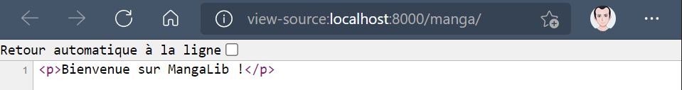
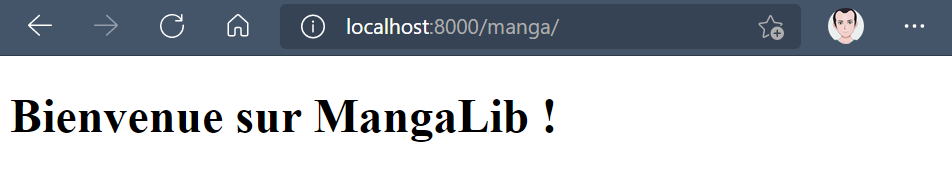
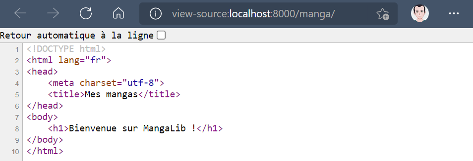
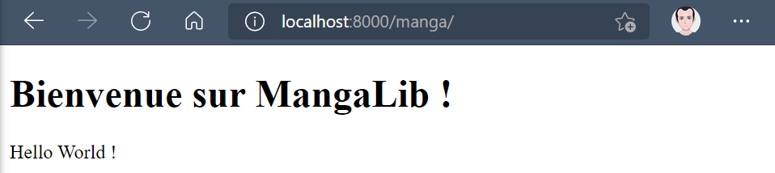
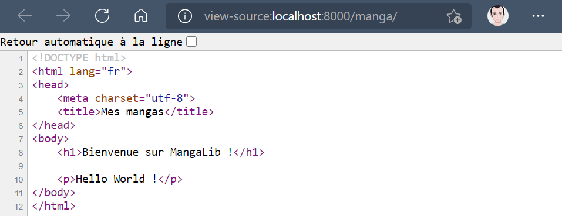

# [4. Chargement template](https://www.youtube.com/watch?v=82M_yuQ3CAY)

+ [Configuration](#Configuration)
+ [Créer notre répertoire avec notre template](#Créer-notre-répertoire-avec-notre-template)
+ [Utiliser la variable message dans html](Utiliser-la-variable-message-dans-html)

Ajout d'un template et pas seulement un message ou du code en dure.

On va voir le strict nécessaire concernant les templates.

On lance le serveur.
```powershell
PS C:\MyDjango\FV> python manage.py runserver
```
Voilà un simple message qu'on avait envoyé via une réponse http.

http://localhost:8000/manga/


Voilà un simple message on n'a même pas de code HTML bien qu'on pourrait.

Voilà tout moment on peut envoyer du HTML puisque notre navigateur possède un moteur acheté ml il va pouvoir parfaitement interpréter ce code.

Ajout de balise `<p></p>`

.FV/mangalib/views.py
```py
from django.shortcuts import render
from django.http import HttpResponse

def index(request):
    return HttpResponse("<p>Bienvenue sur MangaLib !</p>")
```


Les balises sont bien prisent en compte.

## Configuration

Un framework nécessite une certaine rigueur et une configuration, un paramétrage qui correspondra mieux à votre façon travailler.

On ouvre settings.py et on va regarder au niveau des fameux templates.

.FV/FV/settings.py
```py
#...etc...
TEMPLATES = [
    {
        'BACKEND': 'django.template.backends.django.DjangoTemplates',
        'DIRS': [],
        'APP_DIRS': True,
        'OPTIONS': {
            'context_processors': [
                'django.template.context_processors.debug',
                'django.template.context_processors.request',
                'django.contrib.auth.context_processors.auth',
                'django.contrib.messages.context_processors.messages',
            ],
        },
    },
]
#...etc...
```

+ `'APP_DIRS': True,` permet d'associer nos templates à notre nos applications c'est-à-dire que le moteur va cherché en fait des gabarits par rapport aux applications qu'on a installé disponible sur notre projet. C'est vachement pratique parce que pour une application on peut avoir un template ou plusieurs. Malgré cela on sait pas bien les choses, on ne va pas mélanger les données avec ce qui est lié à l'affichage directement.

On reste sur cette configuration qui fonctionne très bien au niveau du moteur.

## Créer notre répertoire avec notre template

On crée notre répertoire templates, un sous-dossier du nom de notre application et un fichier .html, `C:/FV/mangalib/templates/mangalib/index.html`.

C:/FV/FV/templates/mandalib/
```txt
C.
|_ FV
    |_ FV
    |_ mangalib
    |   |_ migrations
    |   |_ templates
    |   |   |_ mangalib
    |   |       |_ index.html
    |   |
    |   |_ __init__.py
    |   |_ admin.py
    |   |_ apps.py
    |   |_ models.py
    |   |_ tests.py
    |   |_ views.py
    |   |_ urls.py
    |
    |_ db.sqlite3
    |_ manage.py
```
C:/FV/FV/templates/mandalib/index.html
```html
<!DOCTYPE html>
<html lang="fr">
<head>
    <meta charset="utf-8">
    <title>Mes mangas</title>
</head>
<body>
    <h1>Bienvenue sur MangaLib !</h1>
</body>
</html>
```

On va voir comment intégrer notre template à notre application.

## Éditer la vue

Maintenant nous modifions la vues que nous avons sinon on n'aura pas de changement.

.FV/mangalib/views.py
```py
from django.shortcuts import render
from django.http import HttpResponse

def index(request):
    return HttpResponse("<p>Bienvenue sur MangaLib !</p>")
```

On a besoin d'un chargeur de templates qui va récupérer notre fichier, `from django.template import loader`.

```py
from django.shortcuts import render
from django.http import HttpResponse
from django.template import loader

def index(request):
```

Nous allons utiliser un contexte de données c'est-à-dire qu'on va avoir des variables de template qui vont être utilisés et on va par exemple pouvoir injecter des informations dans notre définition index(), on va pouvoir travailler avec nos objets python et des valeurs et on pourra les récupérer dans le template pour les afficher. On verra pour les vues, on pourra faire pas mal de petites choses comme ça. 

Par défaut on va appeler notre variable `context`, c'est un dictionnaire et on va tout mettre sur une seule ligne qu'on va appeler **message**.

```py
from django.shortcuts import render
from django.http import HttpResponse
from django.template import loader

def index(request):
    context = {"message": "Hello World !"}
```

On va passer par notre chargeur pour récupérer le template donc nous voulons notre gabarit, notre modèle grâce à une petite fonction get_template().

.FV/mangalib/views.py
```py
from django.shortcuts import render
from django.http import HttpResponse
from django.template import loader

def index(request):
    context = {"message": "Hello World !"}
    template = loader.get_template("mangalib/index.html")
    return HttpResponse(template.render(context, request))
```

Cette fois-çi, on retourne toujours HttpResponse() avec plus d'informations.

On test et on actualise.

http://localhost:8000/manga/



## Utiliser la variable message dans html

On va essayer d'utiliser cette variable `message`.

Alors si on a déjà fait du HTML/CSS, on ne peut pas afficher des variables avec ce langage. On a des variables on CSS mais c'est pour le CSS mais en HTML ce n'est pas un langage de programmation qui permet de représenter de l'information donc il n'est pas fait pour programmer.

Ici grâce au système de templates qui va permettre d'injecter des informations parce que c'est un système qui va permettre d'injecter des informations avant même le HTML qui est un rendu fixe (encore une fois on ne peut pas être traité des variables telles quelles).

Via nos templates, on a en fait des variables qu'on va pouvoir injecter et cette variable `"message": "Hello World !"` va être ajoutée dans un fichier HTML avant lui-même d'être affichée.

Pour injecter cette variable on va utiliser une syntaxe particulière au niveau de nos templates.

C:/FV/FV/templates/mandalib/index.html
```html
<!DOCTYPE html>
<html lang="fr">
<head>
    <meta charset="utf-8">
    <title>Mes mangas</title>
</head>
<body>
    <h1 style="color:#4c75d6">Bienvenue sur MangaLib !</h1>

    <p>{{ message }}</p>
</body>
</html>
```

Voilà encore une fois si c'était juste du HTML, cette syntaxe `{{ message }}` serait affiché tel quel mais là comment passe par un framework qui va en fait charger ce fichier HTML `"mangalib/index.html"` afin d'y injecter les différentes valeurs donc il cherche une information "message" entouré de doubles accolades qu'il va remplacer par "Hello World !" et ensuite il envoie tout ça dans la réponse http avec la fonction HttpResponse() avec le rendu qui va faire qu'on obtient notre information.

Nous allons voir tout ça à l'exécution.

http://localhost:8000/manga/



Si je regarde le code source, on ne voit pas les doubles accolades mais on a véritablement le remplacement par un texte.

Il est très important de comprendre qu'avec Django, le remplacement des variables dont le HTML se fait avant et non on n'arrive pas à faire exécuter des variables dont le HTML parce que ça se passe vraiment avant.

Voilà c'est toute cette information que l'on peut retrouver dans le code source de la page web qui est envoyé dans notre navigateur, il n'y a plus d'histoire de variable car c'est le moteur HTML qui interprète les balises et ça il sait bien le faire.

voilà c'est tout ce qu'il y a à savoir.

Noté également qu'on peut utiliser un fichier CSS(`<h1 style="color:#4c75d6">` et cetera), JavaScript grâce au moteur de notre navigateur donc indépendemment de Django, Python qui n'ont rien à voir. Tout fonctionne sans problème.