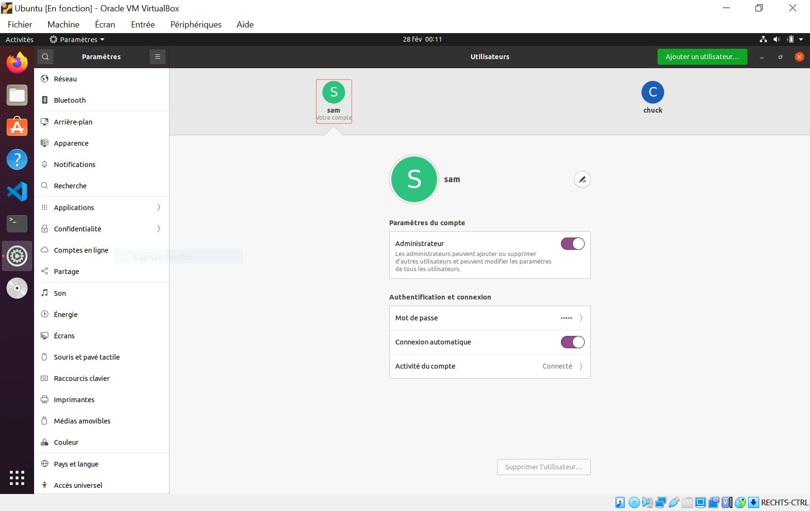

# [14. Utilisateurs et groupes](https://www.youtube.com/watch?v=kDK-zwkMFIQ)

Précédemment on a vu comment manipuler nos fichiers, et on a commencé à aborder les droits qu'on verra dans la prochaine vidéo.

Qui est concerné par ces droits ? ce sont les utilisateurs et de manière un peu plus poussé des groupes.

Ce qu'il faut savoir, c'est que pour accèder à notre système, tout fonctionne par un système de **session** pour pouvoir se connecter à l'aide d'un pseudonyme et d'un mot de passe.

Pour se connecter, tout un tas de vérifications.

:warning: la gestion des utilisateurs se fait à l'aide de fichier.

**Un utilisateur est un fichier et pareil pour les informations, les identifiants de connection sont également des fichiers.**

La dernière fois on a vu comment afficher le contenu d'un fichier avec la commande `cat`.

On se rend dans `etc` pour Editing Text Configuration qui reprend tout les fichiers de configuration du système.

## Le fichier des utilisateurs

Afficher le fichier des utilisateurs, `/etc/passwd` avec toutes les informations séparées par des `:`

```bash
cat /etc/passwd #afficher le fichier des utilisateurs.
	...
	sam:x:1000:1000:sam,,,:/home/sam:/bin/bash
		#sam = login.
		#: = séparateur deux points.
		#x = emplacement pour les mots de passe.
		#1000 = identifiant pour l'utilisateur.
		#1000 = identifiant de groupe.
		#sam,,, = informations un peu libre.
		#/home/sam = chemin vers le dossier personnel.
		#/bin/bash = shell de connection.
```

Alors l'utilisateurs créé au moment de l'installation du système:

	sam:x:1000:1000:sam,,,:/home/sam:/bin/bash

Tout est enregistrés par ligne, une ligne par utilisateur. Certains sont par défaut et d'autres ont été créé.

Toutes ces informations sont ordonnées, tout est rangées correctement.

Par ligne, on a l'identifiant `sam`, un séparateur `:` qui pourront servir également plutard pour formater des affichages. Ensuite on a `x` qui est l'emplacement pour les mots de passe. Ensuite on a un identifiant utilisateur `1000` car pour le système c'est plus facile de manipuler des nombres que des chaîne de caractères, c'est le 1er, le seul utilisateur ajouté à l'installation. Les autres tel que `root` sont obligatoire au niveau du système. Ensuite la même valeur `1000` càd l'identifiant de groupe.

Sur les distribution tel que Ubuntu, Mint, on nous met le même groupe que l'utilisateur et comme c'est le premier groupe créé ici on lui met l'identifiant `1000` également.

Après l'id de groupe, tout un tas d'informations séparées par deux points et tout un tas de virgule `,` avec des infos manquantes. Ce sont des informations libres, flexibles sans règles particulières. C'est pour y mettre toutes les informations concernant la personne physique (nom complet, téléphone, adresse e-mail, etc.). Ensuite le **répertoire personnel** `/home/sam`. Ensuite on a `/bin/bash` qui est le shell de connection.

Quand on se connecte à sa session, il va exécuter le shell `/bin/bash`, pour certains utilisateur c'est `/bin/false` pour certains utilisateurs particuliers, on refuse simplement qu'ils exécutent un terminal donc on mettra tout simplement ça donc on met `false`. Selon les cas, il peut y avoir des shell un peu différent.

Par défaut, un nouvelle utilisateur de Linux c'est `/bin/bash`, voilà pour le shell de connection.

En gros, on a le _login_, le _mot de passe_, l'_UID_ càd l'identifiant utilisateur, le _GID_ càd l'identifiant de groupe, ensuite les infos personnelles, le _/home_ et ensuite le shell de connection au niveau du fichier **/etc/passwd**.

## Le fichier des mots de passe

Les mots de passe sont super important au niveau de la session car ils permettent de se connecter et d'avoir accès à vos données car chaque utilisateur possède sa propre session, son propre espace d'utilisation.

Les mots de passe sont stockés dans un autre fichier en dehors de `/etc/passwd`.

Comme je ne suis pas super utilisateur, il me dit que je n'ai pas la permission d'afficher.
```bash
cat /etc/shadow #fichier des mots de passe.
	...
	cat: /etc/shadow: Permission non accordée
```
Le mot de passe n'est pas enregistré dans un fichier en clair, non il est évidemment chiffré donc si quelqu'un le recupère, même principe pour un développeur de site avec des mots de passe en DB, le mot de passe est chiffré qu'il faudrait tenté de craquer pour trouver la version en clair du mot de passe.

Comme le mot de passe doit être comparé pour se connecter, il faut bien le stocker et au niveau de linux, il est stocké de manière chiffré et pas en clair.

```bash
sam@sam:~$ sudo cat /etc/shadow
sam:$6$KDfWgbpAdMfhCVMw$YWFwGfYN7.
```

Voilà ce qu'on obtient sur mon système virtualisé.

Si on voulais modifier le mdp via le fichier de config, il faudrait désactivé le fonctionnement de shadow qui est cette espèce de système qui permet d'exporter à part le mdp. Ensuite procéder à part le mdp et seulement enfin réactiver ce fonctionnement là. Pareil, il n'y a que le super utilisateur `root` qui a les droits pour le faire.

Connaître `/etc/passwd` qui contient par ligne chaque enregistrement d'utilisateur et `/etc/shadow` qui peut s'appeler différemment selon les distributions qui contient les mots de passe chiffrés.

## Afficher le fichier des groupes

Chaque utilisateur est défini par ces informations et avec des permissions définies par des groupes.

Le fichier des groupes est `/etc/group` avec les mdp dans un fichier shadow.

```bash
cat /etc/group #afficher le fichier des groupes.
	...
	sam:x:1000: # = groupe utilisateur.
```

Certains groupes ont les mêmes noms d'utilisateurs que vues tout à l'heure.

Comme pour moi il y a un groupe qui s'appelle `sam` où je suis le seul dedans car il est créé à la création de l'utilisateur, et il y a l'identifiant du groupe `1000`. Par exemple, `pulse:x:128:` c'est le groupe 128, c'est pour tout ce qui est audio notamment. Pour ssl, `ssl-cert:x:111;`. Pour les jeux, `games:x:60:`. Pour shadow, `shadow:x:42:`.

Tout ça va permettre de gérer les droits et définir des groupes particuliers avec des utilisateurs dont le groupe est obligatoire même si son groupe c'est lui même son identifiant. Un groupe peut acceuillir plusieurs utilisateurs différent.

A quoi sert ce système de groupe ? C'est la base du système de permission sur le système qui va permettre de dire que tout les utilisateurs qui appartiennent à tel groupe ont tel accès. Sur Linux, ont pourrais interdire certains utilisateurs d'utiliser la carte son, l'imprimante, etc.

Il suffirait de créer un groupe particulier avec le nom souhaité et d'ajouter tout les utilisateurs dans ce groupe qui auraient le droit d'utiliser l'imprimante.

Un nouvel utilisateur dans un nouveau groupe par défaut et moi je peux être dans plusieurs groupes différents.



Ici je ne suis pas `root`, je suis `Administrateur` c'est différent. Vous avez l'utilisateur `Normal`. Vous avez `Administrateur` qui pourra se donner les droits super utilisateur et vous `root` qui a tout les droits.

```bash
cat /etc/passwd #afficher le fichier des utilisateurs.
	...
	sam:x:1000:1000:sam,,,:/home/sam:/bin/bash
	chuck:x:1001:1001:,,,:/home/chuck:/bin/bash
```

chuck a été créé, on incrémente de 1, utilisateur `1001` et groupe `1001`, il a son propre répertoire `/home/chuck` et son propre shell de connection `/bin/bash`.

```bash
cat /etc/group #afficher le fichier des groupes.
	...
	sam:x:1000:
	chuck:x:1001:
```

Egalement un groupe du même nom, chuck.

Voilà ce qu'il faut savoir au niveau utilisateur.

Voyez aussi les répertoires utilisateurs, les dossiers utilisateurs.

```bash
sam@sam:~$ ls /home
chuck  sam
```

Si je ne suis pas administrateur `root` qui aura accès aux dossiers de tout le monde mais on verra comment gérer les droits et permissions sur les fichiers dans la prochaine vidéo parce que c'est une notion de sécurité.
