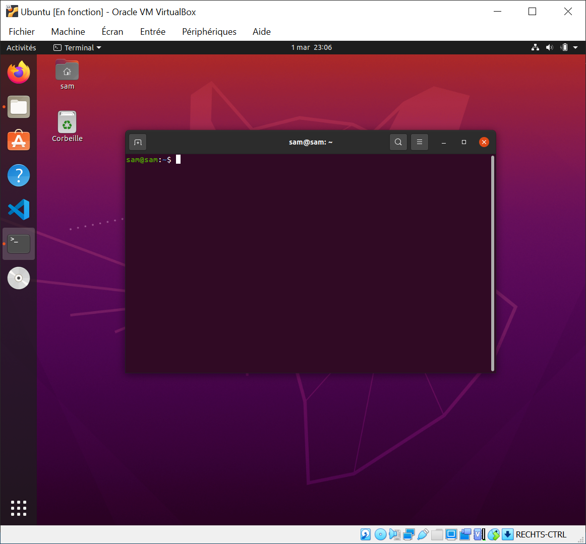
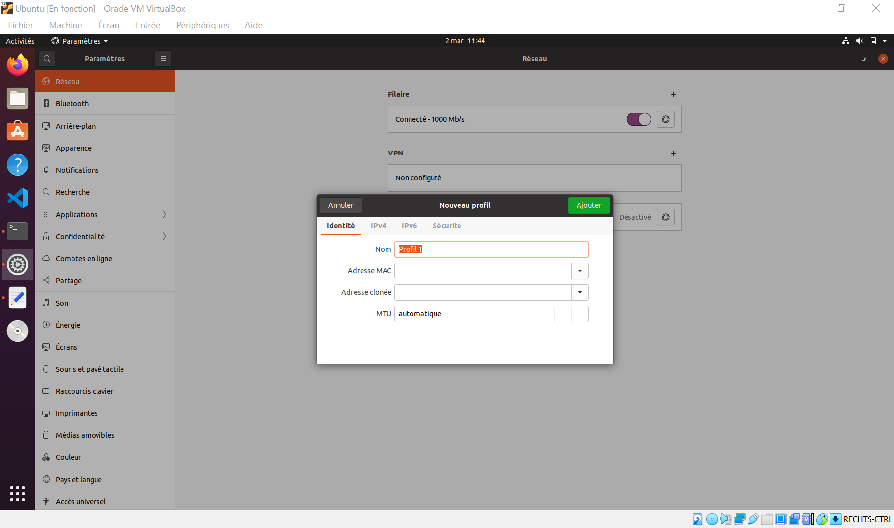

# [27. Configuration netplan](https://www.youtube.com/watch?v=KGPNP9WggK0)

Bonjour à tous, bienvenue pour la 27e séance sur ce cours GNU linux, on va parler des interfaces réseau on va tout simplement voir comment faire de la configuration réseau, ça va être la partie la moins drôle vous allez très vite comprendre pourquoi on file de la vidéo puisque vous il faut savoir qu'il y a plusieurs distributions linux, ça c'est un premier point à prendre en compte.

La configuration d'un réseau se faisait d'une certaine manière on va dire sur des anciens systèmes, on peut dire ça comme ça. S'il y a eu des changements ou des modifications qui ont été importés selon les distributions pour pouvoir configurer un réseau autrement, on a également des changements sur les système d'amorçage mais je vais en parler aussi qui ont encadré on va dire cette configuration réseau.

Le problème c'est que les différentes distributions n'utilisent pas forcément les mêmes méthodes ou les mêmes systèmes pour pouvoir encadrer ou gérer en tout cas cette configuration du réseau et pire encore d'ailleurs c'est qui le côté voilà un peu un peu casse pieds c'est qu'on a des fois donc certaines distributions qui sont passés à des méthodes un peu plus moderne mais continue quand même à utiliser en parallèle certaines méthodes on va dire à l'ancienne et du coup ça se mélange un petit peu donc c'est le casse tête peut-être avez-vous déjà essayé de faire de la configuration sur une debian ou ubuntu et puis en voulant passer sur une archi Linux, vous vous êtes rendu compte qu'il y avait pas mal de choses qui changaient et si vous êtes sur fedora pareil, sur open suse, etc bref c'est assez compliqué.

En gros voilà donc j'ai le t-shirt "On en a gros !" ça va être un peu le bazar.

Alors le but de cette vidéo bien sûr parce que c'est quand même plus pratique, je part du principe encore une fois pour la majorité d'entre vous que vous avez installé le même système que je propose dans ce cours à savoir la distribution ubuntu, jusque là pas de problème mais si vous utilisez une distribution qui est une variante d'ubuntu ou une distribution qui en dérivent ça ne posera normalement pas de problème à condition bien sûr d'être sur une distribution ou en tout cas dans une version récente, ça va de soi mais ça sans même parler de configuration réseau, vous devez de toute façon utiliser une distribution au minimum récentes ou en tout cas la version à long terme donc la lts, la plus à jour.

Pour les gens qui seront sur d'autres distributions en tout cas des distributions qui utilisent des principes de configurations réseaux différents càd que si vous voyez que ce que je propose cette vidéo ne fonctionne pas et que vous avez fait le choix de partir sur une distribution autre que celle que je propose dans cette vidéo donc une distribution autre qu'une ubuntu ou une dérivé, je propose où je proposerai ça dépend du moment évidemment vous regardez cette vidéo en annexe dans la playlist des tutoriels les autres méthodes de configuration pour le réseau d'accords donc c'est pas forcément que j'ai même pas envie de parler de méthodes à l'ancienne parce qu'il y a des distributions par exemple qui resteront toujours sur l'ancienne méthode qu'on utilisait pour configurer du réseau d'accords qui ne veulent pas passer sur des outils qui sont sorties plus récemment ou en tout cas après donc c'est au choix des différentes distributions.

Alors il y a des distributions qui sont très light et du coup utilise l'ancien système, d'autres qui sont passés à des choses beaucoup plus récentes qui changent complètement donc je vais vous faire un petit résumé, on va en parler de toute façon dans le détail parce qu'il y a plein plein de choses à savoir avant même de passer à la configuration.

Cette vidéo donc je vous le cache pas ne sera pas forcément ce qu'il y a de plus passionnant d'accord la configuration réseau de base à part les administrateurs réseaux et même eux je ne suis pas sûr qu'ils soient spécialement amoureux de ce genre de procédé c'est pas toujours la joie de configurer un réseau et en plus de ça quand on a un système aussi fragmenté que linux est encore plus compliqué parce que selon la distribution que vous utilisé et la version de la distribution, la configuration ne sera fera pas de la même manière.

Donc mon but dans cette vidéo c'est de décortiquer un petit peu tout ça avec vous pour qu'on voit ce qu'ils proposent aujourd'hui en tout cas sur une Ubuntu par exemple une version de 2018 voilà c'est le minimum c'est la version lts actuelle la plus récente et après vous pourrez vous adapter ou voir les autres vidéos que je propose sur la chaîne pour trouver en fait ce qui correspond le mieux à votre distribution.

On va passer directement sur la machine ici voilà.



Et on va regarder un petit peu tout ça en détail parce qu'il y a évidemment pas mal d'éléments donc vous allez voir c'est assez le bazar par rapport à ça.

Pour faire simple déjà on avait vu sur la séance précédente quelques petites commandes pour vérifier des informations en réseaux d'ailleurs je ne vous l'ai pas forcément dit mais dans cette information je vous ai montré ou utilisé des outils qui resteront forcément tout le temps d'accord parce qu'encore une fois tout ce qui est lié au réseau change pas mal sur la distribution donc vous verrez que certaines commandes liées au terminal ou autre tendrons en tout cas à disparaître selon les cas, il faudra voir un petit peu tout ça.

On va regarder du coup quelques outils pour vérifier notre connexion donc on va rester évidemment sur les choses les plus standard on ne va pas commencer à faire du réseau virtuel parce qu'il y a évidemment tout un tas de configuration et de scénarios possibles en réseau, on restera sur des choses assez classique mais bien sûr et après il faudra voir de votre côté pour configurer des choses un peu plus complexe d'autant qu'encore une fois vous verrez que selon la méthode utilisée et bien les moyens changerons  donc ça fait tellement tellement en fait de possibilités différentes qu'il n'est malheureusement pas possible de vous faire quelques vidéos comme ça pour dire voilà une fois que vous avez vu cette vidéo vous saurez configurer votre réseau ou n'importe quel scénario ou tel structure de réseau sur n'importe quelle distribution linux, ce n'est malheureusement pas possible donc on va essayer de voir un maximum et de couvrir un maximum de cas possible mais on ne pourra malheureusement pas tous les couvrir.

## ping

Première chose déjà avoir c'est la commande à connaître évidemment pour interroger un serveur par exemple si je veux interroger le site de google je vais faire la commande `ping` et ça va envoyer certains paquets ça et le temps de réponse donc le temps que ça a pris et si vous normalement ce genre de résultat vous avez votre connexion internet qui est fonctionnel.

```bash
sam@sam:~$ ping google.fr
PING google.fr (142.250.179.163) 56(84) bytes of data.
64 octets de ams15s41-in-f3.1e100.net (142.250.179.163) : icmp_seq=1 ttl=118 temps=17.9 ms
64 octets de ams15s41-in-f3.1e100.net (142.250.179.163) : icmp_seq=2 ttl=118 temps=17.5 ms
64 octets de ams15s41-in-f3.1e100.net (142.250.179.163) : icmp_seq=3 ttl=118 temps=16.5 ms
64 octets de ams15s41-in-f3.1e100.net (142.250.179.163) : icmp_seq=4 ttl=118 temps=17.5 ms
64 octets de ams15s41-in-f3.1e100.net (142.250.179.163) : icmp_seq=5 ttl=118 temps=16.3 ms
64 octets de ams15s41-in-f3.1e100.net (142.250.179.163) : icmp_seq=6 ttl=118 temps=28.4 ms
64 octets de ams15s41-in-f3.1e100.net (142.250.179.163) : icmp_seq=7 ttl=118 temps=16.9 ms
64 octets de ams15s41-in-f3.1e100.net (142.250.179.163) : icmp_seq=8 ttl=118 temps=17.5 ms
64 octets de ams15s41-in-f3.1e100.net (142.250.179.163) : icmp_seq=9 ttl=118 temps=16.4 ms
64 octets de ams15s41-in-f3.1e100.net (142.250.179.163) : icmp_seq=10 ttl=118 temps=17.6 ms
64 octets de ams15s41-in-f3.1e100.net (142.250.179.163) : icmp_seq=11 ttl=118 temps=41.2 ms
64 octets de ams15s41-in-f3.1e100.net (142.250.179.163) : icmp_seq=12 ttl=118 temps=17.2 ms
64 octets de ams15s41-in-f3.1e100.net (142.250.179.163) : icmp_seq=13 ttl=118 temps=17.4 ms
...
```

D'accord on arrive à ping google.fr donc c'est qu'on arrive effectivement à envoyer des données vers son adresse donc on arrive à communiquer par le réseau donc ça on va s'en servir de tant en temps pour vérifier par exemple notre configuration après moi je ne vais pas évidemment éditer ma configuration réseau, je vous montrerai juste là où ça se passe et comment on fait d'autant que vous allez voir même sur cette distribution là il ya déjà du mélange voilà ça utilise des outils modernes mais en même temps ça travaille aussi avec des choses qui sont déjà plus anciennes donc c'est encore un mélange et c'est un peu là pour le coup  l'inconvénient c'est que quand il y a des outils qui changent ou des programmes qui change pour gérer notamment des choses bas niveau comme le réseau ou autre, hé bien le temps de faire la migration souvent eh bah ça se mélange un petit peu mais c'est pas forcément très pratique donc peut être que bon dans quelques quelques versions supplémentaires, dans quelques années on sera sur des outils 100% on va dire actuelle et ils auront peut-être laissé tomber les outils d'avant en tout cas pour certaines distributions.

Un point important en tout cas par rapport à ça et ça concerne pour le coup cette distribution c'est de savoir que votre système d'exploitation quand vous le démarrer en fait il y a pas mal de choses qui démarre avant  même que vous ayez accès à votre bureau d'accord nous avons notamment ce qu'on appelle le **init** qui est le système d'initialisation.

En gros comment ça marche pour évidemment simplifier les choses parce que c'est beaucoup plus complexe ce que je vais vous dire juste après, c'est un processus d'accord donc on verra un petit peu en fait un programme d'accord c'est un système qui va charger le noyau donc en l'occurrence ici linux qui va ensuite permettre de monter la partition racines ... vous savez le fameux `/` qui représente la partition système, pour pouvoir charger ce dernier directement donc via en fait la bonne partition alors ça va démarrer une console puisque généralement vous voyez des lignes défilées quand vous démarrez votre os en tout cas si vous avez une distribution qui l'affichent parce qu'on peut le masquer avec un splash screen éventuellement et on va avoir le processus Init qui est du coup celui qui possède le premier pid donc le pid 1 qui va démarrer or d'ailleurs on doit pouvoir le trouver je pense si on fait un `ps | grep "init"` et on filtre avec init.

```bash
sam@sam:~$ ps -auwx | grep "init"
root           1  0.0  0.2 169896 11968 ?        Ss   mar01   0:04 /sbin/init splash
sam         5720  0.0  0.0  11608   656 pts/0    S+   01:12   0:00 grep --color=auto init
```

Voilà ici `/sbin/init` d'accord c'est toujours celui qui aura le premier pid et en gros c'est le premier processus de votre programme qui va être lancée et c'est la dernière tâche en fait qui va se terminer.

Quand vous allez éteindre votre système vous allez mettre en extinction votre ordinateur et c'est le dernier processus qui viendra s'éteindre d'accord pour l'aret.

Pourquoi je vous parle à nouveau de processus alors qu'on est sensé parler de configuration réseau ? parce que justement depuis certaines versions nous avons des distributions qui ont choisi de changer de système d'initialisation voilà càd qu'il n'existe pas qu'un seul système d'initialisation, il en existe plusieurs, il en existait plusieurs.

Evidemment et encore une fois comme linux est un système qui propose tout un ensemble de distribution on va dire même les distributions qui font partie de la famille des systèmes unix, j'en ai d'ailleurs parlé dans mon tuto de choix de distribution linux, vous avez une toute une fragmentation càd tout un tas de systèmes  finalement disponible et ces systèmes n'ont pas l'obligation d'accord de dire eh ben on utilise absolument tous le même système d initiation.

Demain si mêmes vous par exemple vous vous voulez développer votre propre système d'initialisation et le proposer au public, il y aura un nouveau système d'initialisation qui sera disponible sur internet et que les gens pourront utiliser donc il en existe pas mal comme ça et c'est ça justement qui a été modifié, qui a été changé ou adopter pour certaines distributions et ubuntu en fait partie même la distribution debian qui est une grosse, une méta distribution qui a connu des changements là dessus.

Par exemple on avait le système qui s'appelait donc qui s'appelle SysV init donc c'est le fameux système v d'accord qui est un peu on va dire l'ancêtre c'est un peu le système historique, on a eu ensuite notamment pour ubuntu (je vous parle d'ubuntu) qui utilisait en tout cas ce type de système d'initialisation, qui ensuite est passé à Upstart.

Upstart c'était avant 2015 qu'il y a eu le changement comme ça pour Upstart et ensuite en 2015 c'est l'arrivée d'un autre donc on a eu System V, on a eu ensuite Upstart et ensuite est arrivé un autre système qui s'appelle système d.

Et ça c'est d'ailleurs vous avez peut-être vu passer des articles sur internet si vous vous renseigner un peu sur l'actualité sur linux ou autre vous a avez peut être entendu parler d'un débat notamment entre SysV init (le système V) et le system d d'accord c'est un peu un débat assez houleux sur internet et même encore aujourd'hui d'ailleurs donc il faut savoir depuis 2015, ubuntu notamment parce qu'on parle d'ubuntu ici à adopter ce système d'initialisation là c'est à dire le fameux système d d'accord.

Le system d est utilisé puisque c'est la distribution là que vous avez installé normalement pour suivre ce cours celui que je vous ai proposé et je vous ai proposé Ubuntu si je ne dit pas de bêtises c'était la 10.04.

```bash
sam@sam:~$ uname -a
Linux sam 5.8.0-44-generic #50~20.04.1-Ubuntu SMP Wed Feb 10 21:07:30 UTC 2021 x86_64 x86_64 x86_64 GNU/Linux
```

En gros voilà au minimum c'est sûr que c'est la version 2018 donc par rapport à 2015 on a plusieurs versions de sortie après donc depuis ces distributions là, système d est le système d'initialisation qui est intégré à Ubuntu, qui est intégré à debian c'est pour ça qu'il y a eu d'ailleurs pas mal d'histoire, ça a fait beaucoup de bruit en ce passage à système d chez debian. Je crois que fedora aussi est passé à système d, on peut utiliser système d sur Arch Linux bref pas mal de distributions proposées pour autant ça j'insiste vraiment dessus ce n'est pas une obligation.

Ne partez pas du principe que comme système d est plus récents ça veut dire que toutes les distributions vont passées à ça et que les autres systèmes vont disparaître, non il y a des distributions linux même des distributions très connues qui ont fait le choix et qui feront le choix de conserver un autre système d'initialisation ce qui rend du coup la tâche un peu plus compliquée pour tout ce qui est configuration réseau, pourquoi ?

Système d en fait et c'est d'ailleurs ça qui a fait débat au final, c'est pour ça que je prends le temps de vous expliquer parce que c'est important ça vous en dit voilà un peu plus sur l'univers Linux.

C'est important de savoir un peu encore une fois ce qu'on utilise voilà de comprendre pourquoi il y a des débats, ce n'est pas forcément des choses sans raison.

A la base un système d'initialisation eh bien il initialise, il se chargent d'initialiser son système donc il fait un certain type de tâche et après terminé, il laisse la main au système et après c'est à vous de gérer le système et tout un système de ce qu'on appelle de services en place ou de "demon" qui vont en faites faire tourner tout un tas de choses en tâche de fond et qui vont permettre d'exploiter donc de pouvoir utiliser son système.

Système d en arrivant est un autre système d'initialisation qui encadre du coup et qui englobe tout un tas d'autres choses, il est composé de pas mal d'outils différents qui vont encadré tout un tas de partie du système notamment la partie réseau, c'est pour ça que les systèmes qui sont passés par ce système, qui intégre du coup système ont dans leur configuration réseau si bien sûr c'est fait correctement l'utilisation de système d pour configurer d'accord effectuer la configuration des interfaces réseau, ce qui n'est pas forcément le cas avec d'anciens systèmes d'où la complication, la complexité, tout ça et le fait que pour moi mine de rien de faire une vidéo là dessus c'est pas évident parce que je ne pourrai encore une fois malheureusement pas tout vous expliquer dans cette vidéo, c'est juste pas possible même avec quelques tutos en annexe, il vous manquera forcément des choses.

Vous serez donc obligé pour certains d'entre vous d'aller consulter des documentations bien spécifiques à certaines configurations précises de votre distribution si vous l'utilisez pas quelque chose par exemple ubuntu ou ubuntu dérivés ou debian et compagnie donc pas toujours évident.

Voilà pour l'histoire en gros bon là moi je vais vous proposer la configuration sur ce système là donc si vous avez encore une fois installé ubuntu, vous êtes sur ubuntu, xbuntu, linux mint, fin bref voilà une version qui est dérivé dans tout les cas et qui propose system d parce que c'est pas forcément le cas de 100% des distributions, vous devriez pouvoir vous en sortir avec ça et on va essayer de voir le moyens de configuration réseau le plus récent parce que comme logiquement ces systèmes comme ils sont passés à système d ils partent du principe qu'ils passeront sur ce type de configuration et vont abandonner les anciennes méthodes on va dire d'accord donc ça c'est important.

Voilà pour la grosse très très très grosse parenthèse et je vais vous expliquer ça fait déjà un quart d'heure que je vous explique tout ça et ont n'a même pas commencer la configuration mais c'était important il fallait vraiment le dire, c'était un passage obligé pour que vous sachiez en fait un petit peu dans quoi vous arrivez parce que ce n'est pas forcément évident.

Du coup la configuration réseau que nous allons faire sera basé là dessus mais c'est pas tout c'est à dire que ubuntu en l'occurrence à partir de 2017 a créé, a mis en place un outil qui permet de configurer le réseau avec une autre surcouche ça s'appelle netplane d'accord donc **netplan** peut s'utiliser notamment avec un ce qu'on appelle un renderer d'accord donc ça peut être en l'occurrence network d qui est en fait le composant réseau de system d ou par exemple network manager.


Network manager, c'est ce qui vous permet très simplement maintenant via une interface graphique on peut éditer donc une configuration réseau qui est déjà faite donc l'avantage c'est qu'il n'y a pas de configuration par fichier, par ligne de commande, tout ça voilà tout se passe en version graphique et on peut par exemple configurer voilà une nouvelle interface wifi, bluetooth et cetera, réseaux virtuels, vpn, tout ce qu'on veut d'accord.

Il y a beaucoup beaucoup de choses évidemment si vous êtes un simple utilisateur linux, vous passez par l'interface graphique tout simplement et ça se configure facilement.

Là évidemment à ce stade de la formation logiquement vous vous intéressez à la ligne de commande, vous voulez faire de l'administration d'accord de votre système donc vous voulez également savoir comment ça se passe derrière parce que cliquer sur des boutons dans une interface c'est bien beau mais qu'est-ce qui est modifié derrière ? quel fichier ? quelle configuration ? comment ça se met en place ? et là on arrive sur des choses évidemment beaucoup plus technique.

On va donc regarder ensemble comment fonctionne **Netplan** en l'occurrence parce que c'est ce dernier qui est d'ailleurs utilisé sur cette distribution que vous avez normalement installé si vous avez mis la même et qui devrait être installé sur toutes les versions Ubuntu qui dépassent la version 2017 d'accord donc celles qui viendront après continuerons d'utiliser Netplan sauf si un jour Canonical dit un jour on change à nouveau et on vire Netplan et on met autre chose et ça on aura le temps de voir venir à ce moment là ok.

Alors ce qu'on va faire d'accord au niveau de Netplan, on va accéder aux différents fichiers et voir un petit peu comment ça se met en place et il est possible des fois que je fasse référence à des fichiers d'anciennes configurations parce qu'en gros Netplan si vous voulez avant cet outil là, on utilisait notamment un outil qui s'appelle **ifupdown** d'accord qui normalement n'est plus présent ici parce que s'il est présent ce serait très embêtant ça veut dire que du coup ils l'ont laissé installé alors qu'il n'est plus utilisé.

## ifupdown obsolète

```bash
sam@sam:~$ network-manager
network-manager : commande introuvable

sam@sam:~$ sudo apt remove ifupdown
[sudo] Mot de passe de sam : 
Lecture des listes de paquets... Fait
Construction de l arbre des dépendances       
Lecture des informations d état... Fait
Le paquet « ifupdown » n est pas installé, et ne peut donc être supprimé
0 mis à jour, 0 nouvellement installés, 0 à enlever et 7 non mis à jour.
```

Voilà il n'est pas installé c'est plutôt rassurant, je préfère ça, notamment tout ce qui est résolution alors je vérifie en fait tout simplement que les paquets ne sont pas installés `resolvconf` notamment logiquement ne devrait pas être installé non plus.

## resolvconf obsolète

```bash
sam@sam:~$ sudo apt remove resolvconf
Lecture des listes de paquets... Fait
Construction de l arbre des dépendances       
Lecture des informations d état... Fait
Le paquet « resolvconf » n est pas installé, et ne peut donc être supprimé
0 mis à jour, 0 nouvellement installés, 0 à enlever et 7 non mis à jour.
```

Déjà c'est pas mal parce que si c'était installé, je vous avouerai que ce serait du coup assez embêtant parce qu'il garde ces fichiers alors que finalement le système ne s'en sert plus donc ça serait un peu dommage donc en gros avant de passer par ces paquets là donc ça c'est éventuellement des paquets que j'aborde ou que j'aborderai dans des vidéos annexes via les tutoriels de GNU Linux que vous pouvez retrouver comme ça pour configurer des distributions qui utilisent encore ces moyens, ces méthodes de configuration réseau.

Nous ici on va travailler avec Neplan, **Netplan** c'est tout simplement une  surcouche qui dit voilà on a un espace centralisé pour s'occuper de toutes nos configurations réseau, il y en a qui trouveront ça mieux, d'autres qui trouveront ça du coup moins bien parce qu'évidemment imaginez des administrateurs réseaux qui ont configuré leurs réseaux à l'époque avec les anciens outils `ifupdown` et cetera et qui ont fait ça pendant peut-être 20 ans, hé bien forcément du jour au lendemain quand on dit que ça maintenant ça ne fonctionne plus on passe à autre chose, ça change tout les habitudes et ça généralement quand on est administrateur root on n'aime pas forcément tout changer comme ça du jour au lendemain.

Voilà d'ailleurs pourquoi ça fait beaucoup débat avec System d parce qu'on reproche notamment System d de vouloir en fait d'avoir la main mise si vous voulez sur trop de choses sur le système.

Là où normalement c'est sencé juste être un système d'initialisation, le problème c'est que System d travaille également avec les sessions, avec les interfaces graphiques. Voilà il s'occupe un petit peu ... il a beaucoup de composants en fait qui sont rattachés à tout un tas de choses du système càd le noyau, etc et les gens trouvent qu'il y en a trop.

Généralement sur linux, on veut que chaque chose fasse un certain nombre de tâches bien spécifiques qui lui sont propres et sans plus mais là le problème c'est que System d c'est un petit peu un outil à tout faire d'accord à tout modifier, tout configurer et c'est ça beaucoup qui dérange on va dire les puristes qui préfèrent son ancêtre par exemple **SysV init** qui lui du coup était un peu plus moins curieux.

Voilà pour cette partie ici, on va pour cela alors très simplement parce que vous allez voir que par défaut mon système est configuré d'une certaine manière, trouver le fichier de configuration lié à **Netplan** donc on ne va pas parler du fameux fichier d'interface qui stocké `/etc/network/interfaces` donc ça ça je
l'aborderai aussi parce que ça bah c'est les fichiers à l'ancien.

```bash
sam@sam:~$ cat /etc/network/interfaces
cat: /etc/network/interfaces: Aucun fichier ou dossier de ce type
```

D'ailleurs si je fais ça vous verrez qu'il n'y a rien.

S'il y avait quelque chose, ce ne serait même plus utilisé puisque ces commandes ne sont même plus normalement installé sur le système pourtant un fichier de configuration peut encore exister c'est pour ça que la migration je vous dit n'est pas 100 % faites parce que je suis sûr que si on fouille un petit peu on trouvera des vieux fichiers de configuration qui sont disponibles sur l'os alors que le système ne s'en sert plus donc c'est des fichiers qui clairement ne servent à rien donc c'est un petit peu dommage mais on va laisser le temps que les choses se fassent, que la migration se fasse comme il faut et ça va prendre encore quelques années.

## netplan

Nous on va aller ici tout simplement donc on va déjà regarder ce qu'il y a parce ça va dépendre du système, tout dépend en fait de comment il a été installé parce que si c'est en version serveur, en version cloud, en version Desktop ça peut changer, etc ça peut changer mais en gros toujours pareil c'est dans `/etc` vous savez quand on a abordé l'arborescence, généralement les fichiers de configuration se mettent dans cette arborescence, `/etc/netplan` et on va y accéder et faire un `ls`.

```bash
sam@sam:~$ cd /etc/netplan
sam@sam:/etc/netplan$ ls
01-network-manager-all.yaml
```

Voilà il n'y en a qu'1 ce qui est normal puisque c'est une version desktop d'ubuntu donc il propose un fichier de configuration, peut-être que certains connaissent c'est un fichier au format `.yaml` d'accord c'est un format qui permet d'ordonner des informations. Il y a également du `.xml`, on retrouve d'autres formats comme le `.json` et le `.yaml` en fait partie voilà c'est un des formats de données qu'on peut utiliser donc pour `Netplan` ça utilise de yaml alors c'est d'ailleurs quelques petites contraintes, c'est un peu contraignant à utiliser et je vous en parlerais un peu plus en détails mais en gros comment ça se passe.

Ce qu'on va faire si vous avez ce fichier donc vous pouvez tester de votre côté, l'important aujourd'hui dans cette vidéo surtout qu'il y a pas mal de choses à dire et ça vous évitera de voir la vidéo d'une traite, faites les choses au fur à mesure, mettez en pause et vérifier.

Là ce que vous allez vérifier c'est que déjà que vous ayez ça `/etc/netplan` si déjà sur votre système vous n'avez pas de Netplan bon bah déjà c'est que vous êtes sur une distribution qui n'utilise pas cet outil donc au moins ce sera clair vous saurez que cette vidéo là, vous pouvez même limite vous arrêtez maintenant, ça n'aura pas forcément d'intérêt d'aller plus loin sauf si vous voulez par curiosité vous renseigner, savoir comment que ça se passe sur ubuntu et compagnie.

A partir de là nous avons un fichier de configuration présent, on va l'ouvrir en tout cas on va d'afficher. On va voir un peu ce qu'il représente parce qu'encore une fois vous ne savez pas forcément en quoi ça consiste, on va regarder.

```bash
sam@sam:/etc/netplan$ cat 01-network-manager-all.yaml
# Let NetworkManager manage all devices on this system
network:
  version: 2
  renderer: NetworkManager
```

On pourrait même passer passer par l'interface graphique pour que vous voyez un peu. Voilà on va l'afficher sur l'interface graphique parce que le formatage est important de `.yaml` c'est pour ça que je préfère vous l'afficher.

```bash
sam@sam:/etc/netplan$ gedit 01-network-manager-all.yaml
```
```yaml
# Let NetworkManager manage all devices on this system
network:
  version: 2
  renderer: NetworkManager
```

Voilà comment ça se présente en gros alors point très important au niveau du formatage qu'il faut avoir dans un fichier `.yaml`, n'utilisez pas de tabulation d'accord si vous voulez faire des retraits comme vous voyez ici ce sont des espaces d'accord vous pouvez faire deux espaces, ce qu'on appelle du coup une tabulation de deux espaces, vous pouvez faire en 4, en 6, en 8 etc bref c'est 2, 4, 8 généralement mais ça les trois alternatives fonctionnent mais là par défaut voyez que c'est en deux espaces donc ça c'est à savoir si vous mettez des tabulations, vous aurez certainement des problèmes pour le fichier.

Là en gros comment ça fonctionne pour faire très simple, vous voyez tout simplement je ne vais pas faire une présentation du format de fichier `.yaml` comment ça se formate mais on va s'intéresser au niveau des choses là.

Nous avons donc ici ce qui représente notre réseau d'accords.

```yaml
# Let NetworkManager manage all devices on this system
network:
  version: 2
  renderer: NetworkManager
```

Donc ça ça nous intéresse pas ici tout ce qui est marqué "version: 2..." et nous avons donc ce que je vous parlais tout à l'heure le "renderer" c'est à dire ce qui va permettre en fait de gérer, de manager en fait la configuration réseau donc là vous voyez que ce linux qu'on a installé ici, il est simple il s'agit simplement de notre renderer qui "NetworkManager" et du coup c'est lui qui va gérer tout ce qui est périphérique donc notamment nos cartes réseau d'accords s'il y avait du wifi ce serait pareil voilà c'est la configuration qui est fait on peut difficilement je pense faire plus simple.

C'est en gros on dit voilà c'est cet outil là qui va se charger de toute la configuration.

En gros ça revient en fait à modifier une configuration, une interface, je vais ici, si je veux en ajouter une nouvelle c'est ce qu'on a vu, je ne m'embête pas je peux le faire ici en interface graphique pas de problème d'accord.


Ca c'est vraiment le minimum en tout cas le plus simple qu'on puisse faire, nous on va voir maintenant pour gérer autre chose.

Comment ça fonctionne parce qu'on va se dire du coup pour une configuration réseau, comment ils arrivent en fait juste via ce fichier `.yaml` à se connecter à internet, on va d'ailleurs regarder mais ça c'est important de vous montrer, on va essayer de ne pas aller trop vite. La vidéo sera un peu longue mais c'est pas grave de toute façon c'est important.



On peut regarder vite fait les petites informations pour voir un petit peu comment ça se met en place.

On voit ici possibilité d'une configuration (DHCP). Apparemment ici on n'aurais aucune mention de l'adresse ip quoi que ce soit on a juste une méthode qui est marqué ici automatique et dhcp.


Le dhcp en fait c'est simplement le protocole qui va permettre de configurer dynamiquement les hôtes en gros c'est lui qui n'est d'ailleurs pas présent par défaut sur toutes les distributions linux voilà il y a des distributions qui n'ont pas cet outil dhcp installé, il faut l'installer soi-même, évidemment Ubuntu le propose déjà ne vous inquiétez pas et en gros ce dernier va dire et bien votre routeur c'est à dire votre box internet parce que c'est ce qui nous intéresse ici.

Vous avez certainement une box free, orange, sfr, bouygues ou que sais-je qui va donc via ce routeur ou la passerelle va dire avec dhcp tout configurés votre réseau donc on utilise dhcp et ça va balayer en fait toute la plage adresses ip et ça va configurer automatiquement en fait votre adresse ip, l'adresse de la passerelle éventuellement donc généralement c'est la passerelle de votre routeur puisqu'en gros ce qu'il faut que vous compreniez c'est que quand vous communiquez en fait par exemple de l'intérieur vers l'extérieur, ça fait pas genre de votre machine à internet mais ça fait de votre machine puis ça passe par votre routeur c'est à dire votre box internet et ensuite c'est elle qui transite l'information sur internet et à l'inverse même chose, internet avec des informations qui arrivent d'internet puis ça passe par votre passerelle donc votre routeur qui agit comme un filtre, comme un pare feu, il va traiter l'information éventuellement s'il y a des choses à vérifier, de la sécurité ou que sais-je et ensuite va vous restituer l'information d'accord c'est pour ça qu'on parle de passerelle c'est-à-dire qu'il y a un intermédiaire entre vous et l'extérieur, en l'occurrence internet si on parle d'internet.

Voilà comment ça fonctionne.

Du coup le dhcp va se charger de configurer tout ça automatiquement.

L'avantage de dhcp c'est qu'on n'a pas besoin de configurer quoi que ce soit au niveau des adresses ip et de l'adresse de passerelle, masque sous-réseaux, toute ces choses-là. On met dhcp ça fonctionne donc NetworkManager comme il utilise ce système là via notre configuration que nous avons ici pour notre outil Netplan.

```yaml
# Let NetworkManager manage all devices on this system
network:
  version: 2
  renderer: NetworkManager
```

Voilà on lui dit simplement tu utilise NetworkManager avec NetworkManager qui utilise ici dhcp pas de problème ça fonctionne et normalement de toute façon comme vous avez installé votre distribution, vous avez la connexion qui est disponible par défaut en tout cas en filaire, il n'y a pas de problème le dhcp fonctionne ça se connecte et c'est ça qui nous permet de brancher votre câble réseau, votre câble ethernet sur votre tour et hop ça vous connecte à internet tout de suite.

Ce n'est pas parce que c'est comme ça que fonctionne un câble c'est juste que le dhcp va automatiquement configurer votre interface réseau et ça va se connecter à internet tout seul, maintenant si on ne veut pas utiliser par exemple et c'est le cas par exemple quand on veut faire un parc informatique ou qu'on veut relier plusieurs machines d'accord au sein d'un réseau privé, d'un réseau local peu importe mais en gros on ne veut pas forcément utiliser d'outils dhcp alors on peut le faire c'est l'idéal d'accord quand on veut faire de la configuration réseau.

D'accord si vous le pouvez, utiliser dhcp d'accord ce sera moins prise de tête c'est votre routeur ou en tout cas les différentes machines et passerelles et compagnie qui vont s'occuper de faire la configuration de manière automatique.

On gagne du temps, on ne s'embête pas et honnêtement l'administration réseau quand on peut éviter d'aller renseigner l'adresse manuellement quand on peut l'éviter c'est bien mais vous vous êtes là aussi pour savoir comment ça fonctionne.

Le truc c'est pas d'apprendre à cliquer sur des boutons, c'est de savoir comment ça fonctionne derrière donc ici nous avons ce qu'on appellerait une interface du coup tout à fait simple.

Ce qu'on va faire alors je ne vais pas enregistrer mon fichier mais je vais vous montrer et tout ce qui est précédé d'un dièse `#` c'est juste du texte pour la personne qui consulte le fichier parce n'est pas pris en compte.

Voilà manuellement on va indiquer que nous allons créer une configuration donc nous allons manipuler notre interface pour dire que nous utiliserons dhcp avec un adressage donc pas de problème on va noter `network:` ici, on va à la ligne puis faire un retrait de 2 espaces comme il faisait ça par défaut, on ne va pas changer, et à partir de là, on met `version: 2` voilà ça nous concerne pas.

```yaml
# Let NetworkManager manage all devices on this system
#network:
#  version: 2
#  renderer: NetworkManager

network:
  version: 2
```

Ensuite le `renderer` alors il peut continuer d'utiliser `renderer: NetworkManager` ou puisque système d est présent sur cette distribution, on peut utiliser son service associés qui est networkd avec un d à la fin, `renderer: networkd`.

Voilà on peut utiliser l'un ou l'autre par exemple on peut mettre ça.

```yaml
# Let NetworkManager manage all devices on this system
#network:
#  version: 2
#  renderer: NetworkManager

network:
  version: 2
  renderer: networkd
```

## configuration filière

A partir de là je note pour les interfaces lié au filière d'accord pour les interfaces ethernet ici et là voyez c'est important de mettre les retraites comme il faut ici tout est sur la même colonne et après on passe sur autre chose d'ailleurs au niveau syntaxe pour information vous avez des validateurs en ligne de fichiers `.yaml`.

```yaml
#...
  ethernets:
```

En gros vous lui passer un fichier `.yaml` vous copier-coller et vérifier qu'au niveau de la syntaxe, vous n'avez pas fait d'erreur.

N'hésitez pas éventuellement si vous faites des configurations à la main, à utiliser un validateur pour vérifier que votre fichier est propre syntaxiquement que vous n'avez pas loupé d'espace, de tabulation où je ne sais quoi et après comme ça vous serez que si vous avez une erreur, une configuration qui n'est pas prise en compte et bien ça ne vient pas d'une mauvaise syntaxe ou d'une erreur de syntaxe au niveau de votre fichier de configuration.

A partir de là il faut renseigner les interfaces alors à l'époque c'est pour ça que je vous dis encore une fois c'est très très très casse pieds en fait de vous faire une vidéo qui soit la plus complète possible parce qu'à l'époque par exemple pour  les réseaux filaires on les représentaient par l'identifiant `eth` et ensuite on mettait un numéro, si on voulait notre réseau filaire de basse c'était `eth0`.

```yaml
# Let NetworkManager manage all devices on this system
#network:
#  version: 2
#  renderer: NetworkManager

network:
  version: 2
  renderer: networkd
  ethernets:
    eth0
```

Si on en voulait un deuxième on mettait `eth1` etc etc.

Depuis qu'il y a eu des changements system d et compagnie, maintenant voilà on aime bien faire plus compliqué donc on met `enp3s0`.

```yaml
# Let NetworkManager manage all devices on this system
#network:
#  version: 2
#  renderer: NetworkManager

network:
  version: 2
  renderer: networkd
  ethernets:
    enp3s0:
```

Si jamais bon je me suis trompé vous me direz en commentaire, normalement c'est ça si je ne dit pas de bêtises, c'est ça oui `enp3s0` et après 0 parce que c'est la première.

Ok donc là on lui dit première interface filaire vous voyez tout se déroule en fait c'est comme une espèce d'arbre où on met chaque information une à une et ici je lui dis simplement encore **2 espaces** dhcp en ipv4 alors l'appareil je ne vais pas vous faire un distinguo mais en gros l'ipv4 ce sont les fameuses adresses en `192.168.14.1` par exemple d'accord soit les adresses comme ça où il y a 4 groupes d'accord de valeur de 0 à 255 ok et après comme ces adresses là au bout d'un moment on a commencé à en avoir plus assez si vous voulez, plus suffisamment pour pouvoir adresser toutes les machines qui existent dans monde, on a proposé donc un autre  système d'adressage notamment l'adressage ipv6 qui permet en fait d'avoir une plage d'adresse beaucoup plus, beaucoup plus conséquente donc ça il faudra pouvoir le différencier au niveau de vos configurations donc si vous voulez utiliser l'ipv4 il faudra mettre un 4 `dhcp4` d'accord et si vous voulez faire une configuration pour l'ipv6 vous mettez un 6 `dhcp6` donc on va faire du simple on va rester sur l'ipv4, on fait ça.

```yaml
# Let NetworkManager manage all devices on this system
#network:
#  version: 2
#  renderer: NetworkManager

network:
  version: 2
  renderer: networkd
  ethernets:
    enp3s0:
      dhcp4:
```

On lui dit qu'il l'utilise `true` mais il me semble que `yes` passe aussi mais il y a plusieurs possibilités mais bon voilà tout simplement.

```yaml
# Let NetworkManager manage all devices on this system
#network:
#  version: 2
#  renderer: NetworkManager

network:
  version: 2
  renderer: networkd
  ethernets:
    enp3s0:
      dhcp4: true
```

Donc je résume, ce fichier dit simplement que le système de rendu pour la configuration réseau c'est `networkd` d'accord ensuite on configure une interface `enp3s0` et ça c'est le nom de cette interface qui utilisera dhcp en ipv4.

Ok donc là en gros on pourrait enregistrer le fichier et ça ferait ça.

Donc c'est quasiment ce qu'il avait de base, une fois qu'on a fait par exemple ce qu'on veut, on va pouvoir prendre en compte en tout cas les changements qu'il y a eu.

## generate try apply

Alors en gros on va régénérer tout ce qu'il faut pour les renderer notamment les networkd et cetera en faisant par exemple un `netplan generate` ok ça ça permet de régénérer tout ce qu'il faut.

Ensuite avant de valider les changements qui ont pu être faits au niveau de la configuration on va la tester, on fait un `netplan try` qui va vérifier en fait que votre configuration réseau fonctionne. Si jamais il y a des problèmes, vous pouvez éventuellement la déboguer donc après généralement ce qu'on fait pour la mettre pour l'appliquer complètement càd l'enregistrer sur le disque et qu'elle soit toujours en fait effective même si vous redémarrez votre machine, que ça reste en fait tout le temps, on fera notre `netplan apply`.

On peut éventuellement avec un petit tiret d, `netplan -d apply` faire du débogage, par exemple s'il y a des erreurs ça vous affichera les erreurs éventuelles au niveau de votre fichier voilà donc on fait un `netplan generate`, on fait ensuite un `netplan try` pour tester tout simplement la nouvelle configuration réseau et ensuite on fait un `netplan apply` pour que ce soit appliqué effectivement bien enregistré, pris en compte sur le système, très important.

```bash
netplan generate #regénérer le fichier netplan.
netplan try #vérifier que la configuration réseau fonctionne.
netplan apply #appliquer complètement la configuration même après le redémarrage.
netplan -d apply #faire du débogage.
```

Voilà différentes choses à faire.

## systemctl

Après on peut redémarrer le service qui s'occupa de tout ce qui est gestion réseau donc là pareil on commence sur system d, il faut utiliser `systemctl` mais si votre distribution n'utilise pas system d ce ne sera pas forcément la même chose.

Encore une fois voilà ça complique un peu parce que vous voyez que les commandes ici on n'a pas genre une commande en Shell qui fonctionne sur toutes les distributions linux c'est pour système d, si vous êtes sur SysV init, Upstart ou autre, et bien c'est d'autres noms de commandes que je ne vais pas forcément vous montrez là puisqu'on n'a pas ces outils là sur cette distribution.

On fait donc simplement ça `systemctl restart systemd-networkd` avec **systemd** qui est le nom du système d'initialisation et **noteworkd** c'est son composant en fait lié au réseau.

```bash
systemctl restart systemd-networkd #redémarre le service et prend en compte la configuration.
```

Et là ça va redémarrer en fait le service et ça prendra en compte votre configuration.

Voilà différentes choses comme ça à savoir.

Voilà c'est un peu laborieux, il y a plein plein de choses à prendre en compte, c'est pas évident.

Je vous avait dit que ça n'allait pas être la vidéo la plus passionnante mais au  moins vous saurez comment ça fonctionne et vous serez paré surtout pour tout ce qui viendra plus tard, voilà vous ne vous mélangerez pas les pinceaux parce que si après plus tard vous consulter d'autres tutos, des documentations, des wikis etc vous allez trouver des anciennes méthodes et vous allez vous mélanger les pinceaux.

Là au moins je vous montre la méthode avec Netplan qui est pour le coup la plus récente qui soit donc au moins vous aurez ce qu'il faut par rapport à ça.

Alors est-ce qu'on peut configurer d'autres petites choses, en tout cas montrer comment on configure d'autres petites choses et bien ça c'est du dhcp donc de la configuration qui se fait automatiquement.

```yaml
# Let NetworkManager manage all devices on this system
#network:
#  version: 2
#  renderer: NetworkManager

network:
  version: 2
  renderer: networkd
  ethernets:
    enp3s0:
      dhcp4: true
```

Quand mon routeur fait de la configuration, il va m'assigné directement la bonne adresse ip, l'adresse de la passerelle, tout ce qu'il faut, tout sera mis en place pas de problème.

Admettons qu'on ait besoin pour je ne sais quelle raison par exemple encore une fois vouloir interconnecter plusieurs machines, besoin de mettre l'information manuellement... eh bien on va le faire de cette manière alors on va garder comme ça mais on va virer `dhcp4` parce qu'on n'en veut plus pour le coup.

On voit ici on va virer le dhcp puisqu'on ne veut plus dhcp pour le coup alors bien sûr ce ne sont pas des vrais adresses, je vous montre simplement comment on l'écrirait pour que ce soit appliqué après c'est à vous éventuellement comme vous êtes en plus sur des systèmes virtualisés de faire des tests.

Si vous avez plusieurs machines sur un réseau local, essayez de les interconnecter pour voir si elles peuvent communiquer avec un `ping` la fameuse commande qu'on a vu tout à l'heure quand on fait `ping` et puis vous mettez l'adresse ip de votre machine et voir que deux machines peuvent communiquer entre elles sans envoyer des informations mais si c'est le cas c'est que vous aurez bien configurer vos interfaces réseaux sinon c'est qu'il y a quelque chose qui ne va pas donc n'hésitez pas à vous entraîner, à faire des petits tests comme ça entre votre pc fixes et votre pc portable ou autre.

Vous avez plusieurs moyens de tester et de vérifier un peu ces configurations réseaux.

En gros ici on va lui dire que j'ai besoin de renseigner des adresses (addresses en anglais) et je veux lui spécifier l'adresse par exemple ip qui serait ma machine ici donc je mets une adresse quelconque d'accord je mets absolument quelque chose comme ça au pif.

```yaml
# Let NetworkManager manage all devices on this system
#network:
#  version: 2
#  renderer: NetworkManager

network:
  version: 2
  renderer: networkd
  ethernets:
    enp3s0:
      addresses:
        - 192.168.54.12/24
```

On met vraiment quelque chose de fictif ici, mettez votre adresse IP pas de problème ensuite la passerelle donc la passerelle en ipv4 donc on écrit ça comme ça `gateway4` et ensuite on aurait directement l'adresse à noter.

```yaml
# Let NetworkManager manage all devices on this system
#network:
#  version: 2
#  renderer: NetworkManager

network:
  version: 2
  renderer: networkd
  ethernets:
    enp3s0:
      addresses:
        - 192.168.54.12/24
      gateway4: 192
```

Alors comment on récupère ces informations ? j'anticipe un peu les questions qui peuvent arriver en commentaire et certains me diront comment je connais l'adresse ip de la machine ? comment je connais l'adresse de la passerelle ou le masque de sous réseau, ce genre de choses ?

Encore une fois, je vous l'ai dit ce qui vous permet de vous connecter à internet c'est votre box internet.

Votre box internet c'est votre routeur, votre routeur possède une adresse ip pour y accéder d'accord si vous êtes chez free vous avez une adresse ip qui correspond à la box free pour accéder au routeur, chez orange c'est une autre adresse et cetera.

Alors c'est généralement du 192.168.0.1 ou 192.168.0.0 ou 192.168.1.1 voilà renseignez vous, faites une recherche sur internet accéder au routeur free, freebox révolution, livebox orange, peu importe la boxe que vous avez et vous aurez l'adresse ip pour accéder aux routeur de là vous pourrez consulter les informations de votre routeur et il vous donnera tout simplement l'adresse ip que vous avez donc votre adresse ip publique celle qui va vous permettre de communiquer sur internet ce n'est pas l'adresse privé et la passerelle donc la passerelle c'est généralement l'adresse ip du routeur lui-même d'accord puisque vous allez passer par lui quand vous allez vouloir communiquer des informations ou en recevoir d'accord ça passera par votre routeur, par votre box internet et le masque de sous-réseau généralement c'est 255.255.255.0 mais ça peut changer aussi selon les cas.

En gros vous aurez toutes ces informations à récupérer deouis votre routeur d'accord n'essayez pas de les deviner où je ne sais quoi.

Vous vous connecter à votre routeur vous allez trouver toutes les informations qui seront renseignés et du coup ces informations vous les noterer dans le fichier `.yaml` soit l'adresse ip (addresses), vous aurez votre masque et c'est pareil je met n'importe quoi voilà.

```yaml
# Let NetworkManager manage all devices on this system
#network:
#  version: 2
#  renderer: NetworkManager

network:
  version: 2
  renderer: networkd
  ethernets:
    enp3s0:
      addresses:
        - 192.168.54.12/24
      gateway4: 192.168.10.4
```

Et éventuellement si vous avez besoin de configurer des serveurs dns, on peut aussi le faire d'accord voyez qu'il y a 3 parties càd la partie pour l'adresse ip (il peut y en avoir plusieurs mais on en a qu'une), la passerelle (il n'y en a qu'une adresse) et on a les serveurs de noms. Et là pour les serveurs de noms ça va se présenter de plusieurs manières soit vous mettez directement les adresses et s'il y en a plusieurs vous mettez des crochets et séparé par des virgules [1.2.3.4, 1.2.2.4] ainsi de suite.

```yaml
# Let NetworkManager manage all devices on this system
#network:
#  version: 2
#  renderer: NetworkManager

network:
  version: 2
  renderer: networkd
  ethernets:
    enp3s0:
      addresses:
        - 192.168.54.12/24
      gateway4: 192.168.10.4
      nameservers:
        addresses: [1.2.3.4, 1.2.2.4]
```

Vous mettez votre première adresse, je mets n'importe quoi et vous séparées par des virgules d'accord et ainsi de suite. On peut également mettre leur nom d'hôte associés donc simplement `search` puis ce qui correspond à chacun par exemple [mydomain.com, mydomain.fr].

```yaml
# Let NetworkManager manage all devices on this system
#network:
#  version: 2
#  renderer: NetworkManager

network:
  version: 2
  renderer: networkd
  ethernets:
    enp3s0:
      addresses:
        - 192.168.54.12/24
      gateway4: 192.168.10.4
      nameservers:
        search: [mydomain.com, mydomain.fr]
        addresses: [1.2.3.4, 1.2.2.4]
```

Je mets vraiment des trucs encore une fois fictif mais c'est suffisant pour comprendre comment ça fonctionne donc voyez il y a vraiment un format à respecter d'accord encore une fois avec des espaces je rappelle, il faut faire que des espaces pas de tabulation attention sinon vous aurez des problèmes de syntaxe et on configure tout ça comme ça.

Voilà pour `network`, on la version `version: 2`, tel rendu `renderer: networkd`. Ensuite en filaire `ethernets`, en filaire nous avons l'interface là `enp3s0`.

Pour cette interface `enp3s0` seulement donc tout ce qui est en retrait par rapport à **enp3s0**, on a pour adresse ça `192.168.54.12/24` il y en a qu'une seule même si pour le coup même si ici `addresses` ça doit être au pluriel au niveau du nom parce que c'est important avec le fichier ensuite qui est analysé, il est parsé en fait et du coup c'est tous ces mots là qui permettent de dire que le rendu c'est `networkd`, l'interface on lui associe tel ip.

Voilà tout ces mots là, il faut surtout pas vous tromper mais pareil faites attention aux minuscules majuscules tout en minuscule voilà toujours pareil en informatique prenez l'habitude là où vous voyez que je mets une majuscule mettez des majuscules sinon c'est que c'est en minuscules.

Pas de problème donc tout va être parsé et il va comme ça pouvoir effectuer la configuration pareil une fois qu'on a configuré ça on peut enregistrer son fichier et on ferme.

On fait ce que je vous ai montré un `netplan generate`, ensuite on fait un `netplan try` pour vérifier que ça fonctionne ensuite on fait un `netplan apply`, on redémarre le service via `systemctl restart systemd-networkd` si vous êtes sur System d pour `networkb` et après par exemple on fait un `ping` de je ne sais quoi et on voit si notre configuration fonctionne ou simplement on ouvre un navigateur web, on accède à internet et on regarde si on arrive à accéder aux sites voulus voilà.

## configuration wifi

Qu'est ce que je peux vous montrer aussi avant de terminer ? il y a des gens parmi vous qui sont en wifi donc on peut montrer peut-être une configuration wifi c'est bien de le voir.

On a vu le filaire autant voir le wifi ça fait partie des bases on va dire.

Le wifi ce n'est pas `ethernets` mais on pourrait laisser `ethernets` juste après, on va le laissé ici et ajouter le wifi à la suite donc c'est `wifis` avec un s d'accord toutes les interfaces wifi.

```yaml
# Let NetworkManager manage all devices on this system
#network:
#  version: 2
#  renderer: NetworkManager

network:
  version: 2
  renderer: networkd
  ethernets:
    enp3s0:
      addresses:
        - 192.168.54.12/24
      gateway4: 192.168.10.4
      nameservers:
        search: [mydomain.com, mydomain.fr]
        addresses: [1.2.3.4, 1.2.2.4]
  wifis:
```

Donc toute cette partie là `ethernets` concerne les connexions filaires, les connexions wifi `wifis` viennent en dessous donc mettez clairement que l'information que vous avez besoin donc voilà comment on le gère.

## ifconfig

On aura pour l'interface donc un nom correspondant à l'interface de notre réseau wifi alors si évidemment vous avez besoin de récupérer ces noms que vous n'avez pas vous verrez que les noms pour les interfaces wi-fi sont des noms à rallonge très sympathique, vous pouvez alors à l'ancienne on peut taper `ifconfig` voir `ifconfig -a`.

```bash
sam@sam:~$ sudo apt install net-tools
Lecture des listes de paquets... Fait
Construction de l arbre des dépendances       
Lecture des informations d état... Fait
net-tools est déjà la version la plus récente (1.60+git20180626.aebd88e-1ubuntu1).
0 mis à jour, 0 nouvellement installés, 0 à enlever et 7 non mis à jour.
sam@sam:~$ ifconfig
enp0s3: flags=4163<UP,BROADCAST,RUNNING,MULTICAST>  mtu 1500
        inet 10.0.2.15  netmask 255.255.255.0  broadcast 10.0.2.255
        inet6 fe80::b891:c554:c1fc:dd60  prefixlen 64  scopeid 0x20<link>
        ether 08:00:27:4f:ae:24  txqueuelen 1000  (Ethernet)
        RX packets 2988  bytes 4160481 (4.1 MB)
        RX errors 0  dropped 0  overruns 0  frame 0
        TX packets 1230  bytes 112363 (112.3 KB)
        TX errors 0  dropped 0 overruns 0  carrier 0  collisions 0

lo: flags=73<UP,LOOPBACK,RUNNING>  mtu 65536
        inet 127.0.0.1  netmask 255.0.0.0
        inet6 ::1  prefixlen 128  scopeid 0x10<host>
        loop  txqueuelen 1000  (Boucle locale)
        RX packets 131  bytes 12456 (12.4 KB)
        RX errors 0  dropped 0  overruns 0  frame 0
        TX packets 131  bytes 12456 (12.4 KB)
        TX errors 0  dropped 0 overruns 0  carrier 0  collisions 0

sam@sam:~$ ifconfig -a
enp0s3: flags=4163<UP,BROADCAST,RUNNING,MULTICAST>  mtu 1500
        inet 10.0.2.15  netmask 255.255.255.0  broadcast 10.0.2.255
        inet6 fe80::b891:c554:c1fc:dd60  prefixlen 64  scopeid 0x20<link>
        ether 08:00:27:4f:ae:24  txqueuelen 1000  (Ethernet)
        RX packets 2988  bytes 4160481 (4.1 MB)
        RX errors 0  dropped 0  overruns 0  frame 0
        TX packets 1230  bytes 112363 (112.3 KB)
        TX errors 0  dropped 0 overruns 0  carrier 0  collisions 0

lo: flags=73<UP,LOOPBACK,RUNNING>  mtu 65536
        inet 127.0.0.1  netmask 255.0.0.0
        inet6 ::1  prefixlen 128  scopeid 0x10<host>
        loop  txqueuelen 1000  (Boucle locale)
        RX packets 131  bytes 12456 (12.4 KB)
        RX errors 0  dropped 0  overruns 0  frame 0
        TX packets 131  bytes 12456 (12.4 KB)
        TX errors 0  dropped 0 overruns 0  carrier 0  collisions 0
```

Voyez que ça fonctionne mais normalement cet outil ne devrait plus être disponible sur la distribution, logiquement étant donné que System d utilisent d'autres outils, et bien `ifconfig` le paquet ne devrait même pu être installé, voyez encore un problème qui fait que malgré tout les changements qu'il y a eu un peu plus moderne sur la configuration réseau, on se retrouve quand même à se traîner des vieux paquets.

## ip

Logiquement il faut plutôt utilisé `ip a` avec a pour all et voyez on obtient grosso modo la même chose et comme ça ça vous indique les différentes configurations.

```bash
sam@sam:~$ ip a
1: lo: <LOOPBACK,UP,LOWER_UP> mtu 65536 qdisc noqueue state UNKNOWN group default qlen 1000
    link/loopback 00:00:00:00:00:00 brd 00:00:00:00:00:00
    inet 127.0.0.1/8 scope host lo
       valid_lft forever preferred_lft forever
    inet6 ::1/128 scope host 
       valid_lft forever preferred_lft forever
2: enp0s3: <BROADCAST,MULTICAST,UP,LOWER_UP> mtu 1500 qdisc fq_codel state UP group default qlen 1000
    link/ether 08:00:27:4f:ae:24 brd ff:ff:ff:ff:ff:ff
    inet 10.0.2.15/24 brd 10.0.2.255 scope global dynamic noprefixroute enp0s3
       valid_lft 85658sec preferred_lft 85658sec
    inet6 fe80::b891:c554:c1fc:dd60/64 scope link noprefixroute 
       valid_lft forever preferred_lft forever
```

Alors moi bon j'ai pas de wifi ici donc forcément je n'aurais pas d'information donc je vais mettre un nom fictif mais généralement vous retrouverez en fait un nom pour votre configuration wifi si vous en avez bien sûr une de disponible.

Au niveau du wifi vous allez avoir un nom un peu bizarre donc par exemple comme pour le `enp3s0` en fait ça va être par exemple `wlp2s0b2` un nom à rallonge en fait correspondant à votre interface wifi ok une fois qu'on a le nom ici.

```yaml
# Let NetworkManager manage all devices on this system
#network:
#  version: 2
#  renderer: NetworkManager

network:
  version: 2
  renderer: networkd
  ethernets:
    enp3s0:
      addresses:
        - 192.168.54.12/24
      gateway4: 192.168.10.4
      nameservers:
        search: [mydomain.com, mydomain.fr]
        addresses: [1.2.3.4, 1.2.2.4]
  wifis:
    wlp2s0b2:
```

Alors on peut préciser qu'on utilise `dhcp4: false` ou `dhcp4: no` par exemple puis pareil en version ipv6 `dhcp6: no` et on fait ça comme ça.

```yaml
# Let NetworkManager manage all devices on this system
#network:
#  version: 2
#  renderer: NetworkManager

network:
  version: 2
  renderer: networkd
  ethernets:
    enp3s0:
      addresses:
        - 192.168.54.12/24
      gateway4: 192.168.10.4
      nameservers:
        search: [mydomain.com, mydomain.fr]
        addresses: [1.2.3.4, 1.2.2.4]
  wifis:
    wlp2s0b2:
      dhcp4: no
      dhcp6: no
```

On peut bien évidemment cumuler différentes informations.

Le truc dites vous c'est que tout va être analysé pour vous dire voilà comment configurer votre interface réseau ou vos interfaces réseaux donc nous on va se contenter du minimum par rapport à ça et là bas c'est la même chose en fait.

Qu'avons nous pour le wifi ? on a évidemment les adresses `addresses` donc ça à priori on peut reprendre les mêmes informations en gros alors pareil le plus simple pour éviter d'utiliser des tirets comme ça `- 192.168.54.12/24` on va le mettre dans des crochets d'accord par exemple `addresses: [192.168.54.12/24]` par exemple votre adresse admettons.

```yaml
# Let NetworkManager manage all devices on this system
#network:
#  version: 2
#  renderer: NetworkManager

network:
  version: 2
  renderer: networkd
  ethernets:
    enp3s0:
      addresses:
        - 192.168.54.12/24
      gateway4: 192.168.10.4
      nameservers:
        search: [mydomain.com, mydomain.fr]
        addresses: [1.2.3.4, 1.2.2.4]
  wifis:
    wlp2s0b2:
      addresses: [192.168.54.12/24]
```

Pas de problème là-dessus, on va avoir l'adresse de la passerelle en ipv4 donc pareil c'est quelque chose donc je veux aller très vite pour ne pas parler inutilement. Et ici on ne met pas de `x.x.x.x` mais la vraie adresse pour le coup.

```yaml
# Let NetworkManager manage all devices on this system
#network:
#  version: 2
#  renderer: NetworkManager

network:
  version: 2
  renderer: networkd
  ethernets:
    enp3s0:
      addresses:
        - 192.168.54.12/24
      gateway4: 192.168.10.4
      nameservers:
        search: [mydomain.com, mydomain.fr]
        addresses: [1.2.3.4, 1.2.2.4]
  wifis:
    wlp2s0b2:
      addresses: [192.168.54.12/24]
      gateway4: [x.x.x.x]
```

Et ensuite on va voir les points d'accès d'accord donc je ne vais pas vous montrer la configuration d'un réseau wifi ouvert càd un open wifi notamment dans un mcdo ou dans une gare ou je ne sais quoi, c'est un peu différent il y a des informations en moins donc je pars du principe que vous voulez faire une connexion wifi depuis votre box donc vous avez normalement un **ssid** d'accord c'est l'identifiant de votre box et vous avez ensuite un mot de passe donc là c'est très simple, on fait `access-points` comme ceci puis vous mettez votre **ssid** genre `Livebox-D745` peu importe et vous mettez deux points et ensuite vous avez `password`. `password` et là il ne faut pas se tromper et votre mot de passe tel que:

```yaml
# Let NetworkManager manage all devices on this system
#network:
#  version: 2
#  renderer: NetworkManager

network:
  version: 2
  renderer: networkd
  ethernets:
    enp3s0:
      addresses:
        - 192.168.54.12/24
      gateway4: 192.168.10.4
      nameservers:
        search: [mydomain.com, mydomain.fr]
        addresses: [1.2.3.4, 1.2.2.4]
  wifis:
    wlp2s0b2:
      addresses: [192.168.54.12/24]
      gateway4: [x.x.x.x]
      access-points:
        Livebox-D745:
          password: monjolimotdepasse1234
```

## ping vérification

D'accord et là même chose enregistrement, on applique tout ça, on redémarre le  service pour la configuration réseau et on vérifie bien sûr que l'interface wifi fonctionne avec un petit `ping` c'est le plus simple pour vérifier une connexion.

```bash
netplan generate #regénérer le fichier netplan.
netplan try #vérifier que la configuration réseau fonctionne.
netplan apply #appliquer complètement la configuration même après le redémarrage.
netplan -d apply #faire du débogage.

systemctl restart systemd-networkd #redémarre le service et prend en compte la configuration.

ping google.fr
```

On ping sur par exemple pour google ou n'importe quel autre site et si ça envoie le paquet c'est qu'à priori la connexion fonctionne sinon c'est qu'il y a quelque chose qui n'est pas..

Voilà au niveau de la configuration, il y avait plein de choses, il avait vraiment vraiment plein de choses.

Qu'est ce que je peux vous montrer aussi ? alors évidemment j'ai pas spécialement parlé de tout ce qui était résolution dns parce que ça concerne pas tellement la majorité des gens d'entre-vous donc on ne peut pas tout voir là.

Pour le réseau évidemment pas mal de choses, en peut tellement tellement voir de scénarios différents de configurations réseaux comme je vous l'ai dit en début de vidéo il n'est pas possible de tout abordé c'est juste impossible je ne suis qu'un être humain et je ne connais pas non plus d'ailleurs tous les systèmes d'initialisation qui existent dans l'univers linux et toutes les configurations.

Voilà j'en ai fait pas mal parce que j'ai évidemment manipuler Linux depuis très longtemps donc je suis passé par SysV init, Upstart, tout ça donc ça c'est sûr que j'ai migré et j'ai changé un petit peu mes habitudes de configuration réseau mais je suis loin de toutes les connaître, il en existe sûrement beaucoup plus que ça et c'est déjà assez galère quand on essaye de voir tous les changements qu'il y a, tout ce que voilà tout ce que ça change les formats, les fichiers de configuration et compagnie donc on aura je pense vu pas mal ici.

On en a fait pas mal.

## ifup ifdown

Pareil si vous avez besoin par exemple à un moment donné de couper une interface c'est bien le savoir parce que même chose avant d'utiliser des anciens outils on utilisait `ifup` et `ifdown` notamment voilà donc on n'utilise plus logiquement quand on a System d d'ailleurs attendez j'espère qu'il ne sont pas installés.

```bash
sam@sam:~$ ifup

La commande « ifup » n a pas été trouvée, mais peut être installée avec :

sudo apt install ifupdown       # version 0.8.35ubuntu1, or
sudo apt install netscript-2.4  # version 5.5.3
```

C'est bien, très bien.

## ip link

Comme `ifup` et `ifdown` ne sont pas installés logiquement ça ne fonctionne plus  mais en gros on va dire sur la méthode un peu plus moderne maintenant qu'on est sur du System d notamment du Netplan et quand on veut par exemple arrêter une interface admettons que je veux par exemple couper mon interface, par exemple j'ai possibilité d'utiliser l'éthernet ou le wifi hé bien je veux désactiver mon interface wifi sans forcément enlever la configuration je veux juste la désactiver parce que je suis branché en filaire, je peux tout simplement faire `ip link` ici suivi du nom de l'interface donc si c'est le wifi par exemple `wlp2s0b2` fin bref c'est le nom super à rallonge et ensuite vous mettez `down`, `up` pour activer.

```bash
ip link wsl2sb6 down #désactiver mon interface wi-fi.
ip link wsl2sb6 up #ré-activer mon interface wi-fi.
ip link enp3s0 down #désactiver mon interface filiaire.
```

## ip addr

Pareil on peut récupérer toutes les informations de tout ce qui configuration des interfaces `ip a`, on peut aussi mettre un `ip addr` pareil.

```bash
sam@sam:~$ ip a
1: lo: <LOOPBACK,UP,LOWER_UP> mtu 65536 qdisc noqueue state UNKNOWN group default qlen 1000
    link/loopback 00:00:00:00:00:00 brd 00:00:00:00:00:00
    inet 127.0.0.1/8 scope host lo
       valid_lft forever preferred_lft forever
    inet6 ::1/128 scope host 
       valid_lft forever preferred_lft forever
2: enp0s3: <BROADCAST,MULTICAST,UP,LOWER_UP> mtu 1500 qdisc fq_codel state UP group default qlen 1000
    link/ether 08:00:27:4f:ae:24 brd ff:ff:ff:ff:ff:ff
    inet 10.0.2.15/24 brd 10.0.2.255 scope global dynamic noprefixroute enp0s3
       valid_lft 81520sec preferred_lft 81520sec
    inet6 fe80::b891:c554:c1fc:dd60/64 scope link noprefixroute 
       valid_lft forever preferred_lft forever

sam@sam:~$ ip addr
1: lo: <LOOPBACK,UP,LOWER_UP> mtu 65536 qdisc noqueue state UNKNOWN group default qlen 1000
    link/loopback 00:00:00:00:00:00 brd 00:00:00:00:00:00
    inet 127.0.0.1/8 scope host lo
       valid_lft forever preferred_lft forever
    inet6 ::1/128 scope host 
       valid_lft forever preferred_lft forever
2: enp0s3: <BROADCAST,MULTICAST,UP,LOWER_UP> mtu 1500 qdisc fq_codel state UP group default qlen 1000
    link/ether 08:00:27:4f:ae:24 brd ff:ff:ff:ff:ff:ff
    inet 10.0.2.15/24 brd 10.0.2.255 scope global dynamic noprefixroute enp0s3
       valid_lft 81515sec preferred_lft 81515sec
    inet6 fe80::b891:c554:c1fc:dd60/64 scope link noprefixroute 
       valid_lft forever preferred_lft forever
```

Même chose, `ìp addre` d'accord on trouve parfois des informations un peu plus détaillées donc c'est bien de connaître aussi.

Voilà je pense qu'on va s'arrêter là, tout ça je vais l'enlever on ne va modifier ce fichier `/etc/netplan` pas besoin de toute façon de mettre une configuration  manuelle moi j'utilise `dhcp` aucun problème donc n'hésitez pas encore une fois surtout que pour le coup vous êtes sur un système virtualisé.

Comme petit test vous essayer de trouver deux machines qui utilise bien sûr Linux et vous vous permettez en fait aux deux machines de communiquer entre elles d'accord sur leur réseau à elle donc en fait A qui pourra accéder à la machine B, la machine B qui pour accéder à la machine A et ensuite vous faites un ping de la machine A vers B pour voir si ça envoie et l'inverse aussi.

Et voir comme ça pour configurer 2 interface, n'hésitez pas pareil si vous avez du wifi disponible à configurer une interface wifi pour voir que ça fonctionne.

Bref voilà c'est pas toujours évident, vous allez forcément un peu galérer et en plus si vous faites des erreurs dans la configuration du fichier, que vous vous trompez dans des lettres que vous oubliez un `d` dans `addresses` parce qu'il en faut deux en anglais ou autre parce que vous mettez des tabulations au lieu d'espace ça va être un peu compliqué mais au moins vous savez en gros d'accord grossièrement  comment on fait de la configuration réseau d'interface avec l'outil **Netplan** via System d d'accord et son composant associé `Networkd` donc oui ça fait pas mal de choses.

Si vous êtes sur SysV init, sur Upstart ou sur un autre outil ou vous-même juste là dessus sans Netplan parce qu'on peut aussi faire de la configuration système sans Netplan voilà Netplan n'est pas obligatoire donc voyez encore une autre possibilité que celle que ce je vous ai montré en vidéo. Il y aura d'autres configurations à faire.

Dans tous les cas parce que il y a des gens qui verons cette vidéo à la sortie sur la chaîne et d'autres qui la verront peut-être un mois plus tard, un an plus tard, dans 20 ans soyons fous n'hésitez pas toujours évidemment à consulter la playlist des tutoriels de linux d'accord comme ça vous trouverez certainement des vidéos annexe pour effectuer d'autres configurations réseau avec d'autres outils que Netplan, d'autres systèmes initialisation que System d et comme ça vous aurez pas mal d'informations.

J'espère que j'ai été assez explicite encore une fois c'est pas évident pour moi et que ce soit assez dynamique parce qu'il y a plein de choses à voir.

Je peux pas non plus me contenter du minimum parce que sinon bah il n'y aurait pas lieu de faire cette vidéo. Si je vous fais une vidéo de configuration réseau pour rien vous montrer, honnêtement autant pas la faire donc là je vous ai quand même montré pas mal de choses.

Maintenant c'est à vous de vous renseigner un peu, voir comment ça fonctionne, de faire des petits tests de configuration, faire communiquer certaines machines pour voir un peu comment ça se passe.

Si après vous avez besoin un jour de configurer un vpn hé bien regardez voilà comment configurer un vpn avec Netplan vous trouverez sûrement des documentations, des wikis et comme c'est Canonical qui gère ça donc les connaissances ils ont dû certainement proposer des documentations assez explicite pour montrer comment faire donc renseignez vous, trouvez tout un tas de choses comme ça et testez, voyez puis apportez votre retour dans les commentaires, voir un peu ce que vous avez et si vous utilisez une distribution mais je vous dit surveiller dans le tutoriel pour trouver des annexes, pour pouvoir configurer autrement que via ces outils que je vous ai montré là vos interface réseau.

Et au moins cette partie est faite, je vous avouerez que ce n'est pas forcément la vidéo que j'ai préférez faire sur cette formation parce qu'il ya trop trop de choses c'est trop éparpillé, c'est assez compliqué mais au moins c'est fait, on va pouvoir passer à autre chose.

On arrive sur le dernier chapitre qui sera de la programmation, qui sera beaucoup plus intéressant pour le coup.

Voilà il fallait faire ça, je ne pouvais pas faire un cours Linux sans vous montrer comment faire d'administration réseau c'était pas possible.

Au moins vous êtes prêt, vous êtes armé pour la suite, croyez moi si vous avez pigé ça, si vous avez suivi ça normalement vous êtes tranquilles pendant un bon bout de temps avant que tout change à nouveau et puis qu'on passe sur d'autres outils complètement différent avec du `.json` mélangé avec des interfaces `.java` ou je ne sais quoi bref que ça parte complètement en cacahuètes.

A bientôt tout le monde pour de nouvelles vidéos et la suite en tout cas de ce cours GNU Linux.

Ciao tout le monde