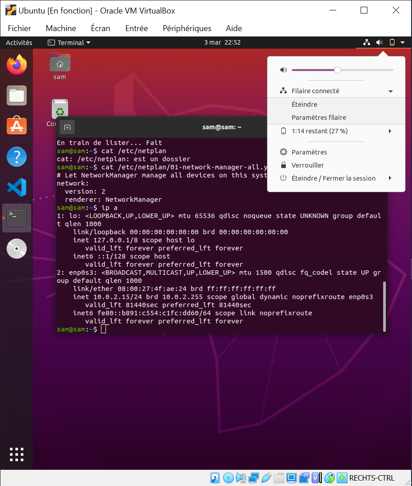

# [28. Réseau et routage](https://www.youtube.com/watch?v=v4MS4g03vsY)

Bonjour à tous bienvenue pour cette 28ème séance GNU linux, je vous retrouve ici dans une vidéo qui n'était pas forcément prévue pour le cours, j'aurais plutôt mis dans les tutoriels et finalement j'ai préféré l'intégrer dans le cours puisque c'est quelque chose de très important pour tout ce qui concerne la configuration réseau et ça vient s'ajouter directement à la suite de la séance où on a vu comment configurer nos interfaces avec l'outil Netplan de Canonical.

Petite parenthèse déjà pour commencer, pour les personnes parmi vous qui veulent juste utiliser leurs systèmes GNU linux comme vous feriez avec Windows, Mac os évidemment vous en êtes ici quasiment à la fin de cette formation GNU Linux, on est sur des notions beaucoup plus avancées et on n'est plus dans le simple usage du système mais vraiment dans la gestion de l'administration de ce système donc ça nous concernera pas forcément.

Généralement avec l'installation simplement du système votre configuration réseau est déjà faites, vous pouvez aller sur internet il n'y a pas de problème.

Pour le wifi ça peut être des fois un peu plus compliqué mais dans l'ensemble surtout sur du matériel bien pris en charge ça ne pose pas trop de soucis à ce niveau là.

Cette vidéo là concerne surtout une minorité d'entre vous qui vont voir véritablement à faire de la configuration, administrer leur réseaux, avoir une configuration réseau bien spécifique, du routage statique bref des configurations bien spécifique à votre usage en tout cas que ce soit personnel, en entreprise, etc.

On va regarder tout ça ensemble alors je vais basculer directement sur le système Linux mais avant rendez-vous sur https://github.com/jasonchampagne/FormationVideo/tree/master/Ressources/GNU-Linux où vous avez un fichier des commandes Shell qui ont été vues sur le cours. Les quelques unes qui n'ont pas été vus encore sur le cours, seront abordées dans la playlist des tutoriels GNU linux ou certaines qui sont tellement simple que je les ai juste ajoutées ici au tableau parce qu'il a pas besoin de faire une vidéo de 20 secondes pour vous l'expliquer c'est vraiment des commandes très très simpliste il y en a très peu. Il y en a peut-être deux comme ça que j'ai dû ajouter et que je n'avais pas spécialement envie de les montrer en vidéo.

[Commandes Shell](https://github.com/jasonchampagne/FormationVideo/blob/master/Ressources/GNU-Linux/commandes-shell.md)  

Rien de compliqué, l'usage est parfaitement explicite.

J'ai rajouté en revanche un peu plus récemment une liste de commandes à éviter.

```txt
Commandes à éviter

Ces commandes ne sont pas sécurisées, plus maintenues et/ou devenues obsolètes :

    arp
    ftp
    ifconfig
    ifdown
    ifup
    iptunnel
    iwconfig
    nameif
    netstat
    rcp
    route
    telnet
```

Comme je vous l'ai indiqué ce sont des commandes qui ne sont pour la plupart non  sécurisés, qui sont tout simplement plus maintenues ou devenues obsolètes.

En gros comprenez que certaines commandes qui n'ont plus été mise à jour ou sécurisées et corrigées depuis plus de 10 15 ans donc c'est peut-être pas forcément l'idéal là tout de suite en 2020, au moment où cette vidéo est faites, de faire usage de ces différentes commandes donc sachez que pour cette liste là qui sera peut-être mise à jour et il y a certainement des commandes que j'ai pu oublier puisque c'est ce qui m'était venu en tête donc il y en aura certainement à ajouter et mettre à jour au fur et à mesure comme la liste d'ailleurs.

Voilà ces commandes là attention à leurs usages car vous êtes sur un système par rapport à des contraintes bien précises, vous n'avez absolument pas le choix de vous en servir.

A partir du moment où vous utilisez ces commandes là, posez vous la question s'il ne faudrait pas plutôt utiliser les commandes qui viennent les remplacer ou qui  sont leurs équivalents, on va dire sécurisés. Je pense notamment à `ftp` qui a son équivalent `sftp` voir `ssh` pour faire véritablement de la connexion à distance sécurisé et ici pour toutes ces commandes en gros vous allez voir dans cette vidéo justement qu'on peut les remplacer avec un seul outil pratique par rapport à ça.

Voilà ça c'est la petite parenthèse pour de dire que certaines commandes sont très très vieille et qu'il faudrait quand même éviter leur usage.

Alors petite surprise ça c'est la petite cerise sur le gâteau qui fait plaisir, vous allez voir notamment sur cette distribution je rappelle pour ceux qui arrivent en cours de route et c'est pas bien parce que vous n'êtes pas censé commencer un cours de la 28ème séance mais depuis la première, c'est un peu la logique.

La logique voudrait qu'on commence par la première vidéo.

Sachez que notamment cette distribution est la 18.04 version sortie en avril 2018 et je vais vous montrer un truc qui est incroyable, assez génial au niveau des différents outils, par exemple si je voulais utiliser les outils à l'ancienne comme `ifconfig` que je vous déconseille et donc si je l'utilise il fonctionne parfaitement et je crois même que sur une ancienne vidéo j'ai dû m'en servir.

```bash
sam@sam:~$ ifconfig
enp0s3: flags=4163<UP,BROADCAST,RUNNING,MULTICAST>  mtu 1500
        inet 10.0.2.15  netmask 255.255.255.0  broadcast 10.0.2.255
        inet6 fe80::b891:c554:c1fc:dd60  prefixlen 64  scopeid 0x20<link>
        ether 08:00:27:4f:ae:24  txqueuelen 1000  (Ethernet)
        RX packets 4394  bytes 6191753 (6.1 MB)
        RX errors 0  dropped 0  overruns 0  frame 0
        TX packets 1019  bytes 105004 (105.0 KB)
        TX errors 0  dropped 0 overruns 0  carrier 0  collisions 0

lo: flags=73<UP,LOOPBACK,RUNNING>  mtu 65536
        inet 127.0.0.1  netmask 255.0.0.0
        inet6 ::1  prefixlen 128  scopeid 0x10<host>
        loop  txqueuelen 1000  (Boucle locale)
        RX packets 213  bytes 18747 (18.7 KB)
        RX errors 0  dropped 0  overruns 0  frame 0
        TX packets 213  bytes 18747 (18.7 KB)
        TX errors 0  dropped 0 overruns 0  carrier 0  collisions 0
```

J'ai du me servir de `ifconfig` voilà ce sont de vieilles habitudes des fois qu'on a du mal à enlever et tout simplement parce qu'un certain outil est installé donc je vais faire `apt list net-tools` et on va retrouver un package ici voilà qui est parfaitement installé sur le système et qui possède tout un tas d'outils qui sont hautement déprécier qu'on ne devrait plus utiliser.

```bash
sam@sam:~$ apt list net-tools
En train de lister... Fait
net-tools/focal,now 1.60+git20180626.aebd88e-1ubuntu1 amd64  [installé]
net-tools/focal 1.60+git20180626.aebd88e-1ubuntu1 i386
```

Certains outils dont la fameuse commande `ip` qu'on va aborder dans cette vidéo qui est un peu vraiment le sujet de cette vidéo est installé dans un autre package qui est tout simplement `iproute2` qui est bien évidemment déjà installé donc là je rappelle que je n'ai rien installer moi même d'accord.

```bash
sam@sam:~$ apt list iproute2
En train de lister... Fait
iproute2/focal,now 5.5.0-1ubuntu1 amd64  [installé, automatique]
iproute2/focal 5.5.0-1ubuntu1 i386
```

J'ai rien installer en plus c'est ce qui a été directement installé avec l'installation de systèmes comme on l'a fait sur les premières séances de ce cours et aussi puisque vous l'avez vu dans la séance précédente que finalement la configuration réseau sur ce système là passe par l'outil que canonical a mis au point qui est l'outil Netplan donc si je fais un petit `apt list netplan` on retrouve bien sûr ce paquet installé sinon on aurait un peu du mal à l'utiliser.

```bash
sam@sam:~$ apt list netplan
En train de lister... Fait
```

(dans le cours, netplan est retourné:`netplan/bionic 1.10.1-5build1 amd64`)

Et pour terminer, la petite apothéose si je fais un `cat /etc/netplan/01-network-manager-all.yaml` et là normalement c'est un fichier `.yaml` on l'avait vu précédemment et on voit que finalement toute la configuration réseau passe par notre outil, notre gestionnaire NetworkManager très pratique qui est finalement le service utilisé par ce système pour faire toute la configuration réseau notamment proposant une petite interface graphique qui nous permet de faire des modifications et cetera et cetera.

```bash
sam@sam:~$ cat /etc/netplan/01-network-manager-all.yaml
# Let NetworkManager manage all devices on this system
network:
  version: 2
  renderer: NetworkManager
```


Voilà pas mal de choses et suffisamment de quoi se faire plaisir donc tous ces outils comme vous voyez c'est un petit peu le but sont complètement mélangé pour des soucis de compatibilité ou simplement pour que l'utilisateur qui aurait toujours utilisé `ifconfig` pour faire justement son paramétrage.

Alors si `ifconfig` se retrouve sur la version d'ubuntu 2018 ne se retrouvent pas perdu avec les nouveaux outils et puisse à se rassurer en utilisant les outils qu'ils utilisaient il ya 10 15 ans et que ça fonctionne donc c'est le coté on va dire avantageux pour ces personnes là mais qui peut poser pas mal de problèmes pour les autres.

Pour autant nous allons ensemble aborder les outils modernes notamment depuis ce fameux paquet `iproute2` avec un 2 à la fin, la commande `ip`vqui rassemble à elle seule quasiment tous les outils, les commandes que j'ai pu vous montrer ici qui sont obsolètes, dépréciés notamment `netstat`, `ifconfig`, `ifdown`, etc car tout ça vous pouvez le faire en fait avec `ip`.

```txt
Commandes à éviter

Ces commandes ne sont pas sécurisées, plus maintenues et/ou devenues obsolètes :

    arp
    ftp
    ifconfig
    ifdown
    ifup
    iptunnel
    iwconfig
    nameif
    netstat
    rcp
    route
    telnet
```

Toutes ces commandes permettaientt de faire `ip` vous le permet aussi.

Très pratique et pour les autres, on a éventuellement la commande `iw` et en a `ss` pour tout ce qui est socket mais on n'en parlera pas dans cette vidéo donc ici on va pouvoir faire tout un tas de choses, cet outil `ip` va permettre pour ceux qui se posent la question à quoi ça sert finalement et c'est ce que nous allons voir dans cette vidéo maintenant on attaque vraiment, on entre dans le vif du sujet.

`ip` permettra de faire toute la configuration de vos interfaces comme on l'a fait précédemment avec `netplan` mais sans `netplan` même si je n'appliquerai pas bien sûr les configurations que je vais utiliser dans les commandes puisque de toute façon ça ne marcherait pas au niveau de mon système et vous très certainement que si vous êtes sur un système particulier vous pourrez appliquer effectivement ces paramétrages là et vous servir de ce que vous avez appris dans cette vidéo, on peut bien sûr activer/désactiver différentes interfaces on pourra l'appliquer directement sur le système ça fonctionnera et vous verrez un petit peu.

On pourra couper certaines connexions bien précise genre le filiaire etc ça fonctionnera sans problème à ce niveau là.

Vous pourrez gérer tout ce qui est le routage d'accord n'utilisez plus un ancien outil etc vous avez iproute2 d'où le nom d'ailleurs du paquet qui a été choisi pour ça pour dire qu'il y a ip et aussi tout ce qui concerne le routage et après on retrouve également tout ce qui est cache, tout ce qui à arp et tout ce qui est tunnel etc etc, le wifi bien évidemment bref  ça englobe vraiment tout ce qui est réseau et avec une seule commande vous allez pouvoir quasiment on va dire gérer 95% de tout ce qui est configuration réseau.

Donc très pratique enfin pour certains d'autres  trouveront que c'est moins pratique parce qu'il y a tout dans une seule plutôt que d'avoir des choses bien séparées bref après ça c'est une question de goûts et préférences de chacun mais ici on va voir un peu comment utilisez cet outil là avec notamment des commandes usuelles c'est à dire les commandes que je dis qu'il faut connaître un minimum, qui sont bien à connaître quand on fait de l'administration réseau.

## ip a

Premières choses à connaître quand même c'est de pouvoir lister nos différentes interfaces d'accord savoir les interfaces que nous avons de disponibles sur notre système, vous pouvez taper un simple `ip a` comme ceci et l'ensemble des interfaces sont affichées.

```bash
sam@sam:~$ ip a
1: lo: <LOOPBACK,UP,LOWER_UP> mtu 65536 qdisc noqueue state UNKNOWN group default qlen 1000
    link/loopback 00:00:00:00:00:00 brd 00:00:00:00:00:00
    inet 127.0.0.1/8 scope host lo
       valid_lft forever preferred_lft forever
    inet6 ::1/128 scope host 
       valid_lft forever preferred_lft forever
2: enp0s3: <BROADCAST,MULTICAST,UP,LOWER_UP> mtu 1500 qdisc fq_codel state UP group default qlen 1000
    link/ether 08:00:27:4f:ae:24 brd ff:ff:ff:ff:ff:ff
    inet 10.0.2.15/24 brd 10.0.2.255 scope global dynamic noprefixroute enp0s3
       valid_lft 81440sec preferred_lft 81440sec
    inet6 fe80::b891:c554:c1fc:dd60/64 scope link noprefixroute 
       valid_lft forever preferred_lft forever
```

Nous retrouvons en premier l'interface `lo` qui est le loopback c'est le réseau local d'accord par exemple si vous faites du web et notamment avec d'autres cours que je propose sur la chaîne, vous avez vu que vous pouviez en fait avoir votre site en local et parfaitement naviguer sur votre site sur votre réseau local donc c'est grâce à ça, grâce au loopback vous pouvez faire ce genre de choses, c'est le fameux 127.0.0.1 ou .0 à la fin ou le fameux localhost d'accord c'est le serveur local.


Ensuite nous avons ici..

```bash
2: enp0s3: <BROADCAST,MULTICAST,UP,LOWER_UP> mtu 1500 qdisc fq_codel state UP group default qlen 1000
    link/ether 08:00:27:4f:ae:24 brd ff:ff:ff:ff:ff:ff
    inet 10.0.2.15/24 brd 10.0.2.255 scope global dynamic noprefixroute enp0s3
       valid_lft 81440sec preferred_lft 81440sec
    inet6 fe80::b891:c554:c1fc:dd60/64 scope link noprefixroute 
       valid_lft forever preferred_lft forever
```

Vous n'aurez pas forcément exactement le même affichage tout ça, ça peut être complètement différent, plus complet sûrement d'ailleurs `enp0s3` qui correspond à mon réseau filaire que je retrouve ici dans le menu.



C'est cette connexion filaire qui m'a permis notamment d'aller depuis mon navigateur sur la page github ici.

[Commandes Shell](https://github.com/jasonchampagne/FormationVideo/blob/master/Ressources/GNU-Linux/commandes-shell.md)  

D'accord c'est la connexion qui est parfaitement activée, effective, fonctionnelle etc pas de problème à ce niveau-là.

## ip addr

On peut filtrer un petit peu ces différentes informations parc qu'il y a plein d'informations, toutes les interfaces on été affichée peut-être que vous vous en aurez 3 4 5 6 si vous avez du wifi, si vous avez des choses à part configuré ou d'autres cartes réseau, ou autres qui sont directement branché sur votre pc, on peut par exemple choisir d'afficher une interface bien précises d'accord moi par exemple si je veux juste afficher cette interface ici `enp0s3` d'accord je peux le faire aussi.

On peux faire par exemple `ip addr show enp0s3`que je peux afficher.

```bash
sam@sam:~$ ip addr show enp0s3
2: enp0s3: <BROADCAST,MULTICAST,UP,LOWER_UP> mtu 1500 qdisc fq_codel state UP group default qlen 1000
    link/ether 08:00:27:4f:ae:24 brd ff:ff:ff:ff:ff:ff
    inet 10.0.2.15/24 brd 10.0.2.255 scope global dynamic noprefixroute enp0s3
       valid_lft 80448sec preferred_lft 80448sec
    inet6 fe80::b891:c554:c1fc:dd60/64 scope link noprefixroute 
       valid_lft forever preferred_lft forever
```

Le `enp0s3` juste celle là ou alors afficher simplement le loopback, `ip addr show lo`.

```bash
sam@sam:~$ ip addr show lo
1: lo: <LOOPBACK,UP,LOWER_UP> mtu 65536 qdisc noqueue state UNKNOWN group default qlen 1000
    link/loopback 00:00:00:00:00:00 brd 00:00:00:00:00:00
    inet 127.0.0.1/8 scope host lo
       valid_lft forever preferred_lft forever
    inet6 ::1/128 scope host 
       valid_lft forever preferred_lft forever
```

D'accord pas de problème.

Alors petite particularité de la commande `ip` notamment au niveau des options parce que vous voyez que c'est la commande `ip`, on va pouvoir la faire  suivre ensuite avec pas mal d'options et après on va pouvoir travailler sur nos interfaces, sur les configurations qu'on veut faire.

Il faut savoir que cet outil propose tout un tas d'alias en gros en alias comprenez que par exemple on peut marquer `addr` à la place, on peut marquer `r` pour le routage ou on peut marquer `route`, vous pourrez marquer `ls` pour lister les éléments ou le mot `list` au complet ou le mot `show` etc etc donc ne soyez pas trop comment dire effrayé par ça, si vous trouvez qu'un jour au lieu d'employer `show` vous trouvez une commande où il y a `list` c'est en fait simplement des alias, c'est pour faire la même chose.

## man ip

Donc là pour le coup, je trouve que ça peut être un peu déroutant parce qu'on pourrait avoir l'impression que si les noms sont différents et bien les commandes font autre chose donc au pire si vous n'êtes pas sûr vous testez les commandes d'accord vous comparez `list` avec `show` et si vous voyez que ça donne exactement le même résultat c'est qu'à priori elles font la même chose et bien évidemment utilisez, abusez des manuels en faisant un `man ip` qui vous donnera un maximum d'informations.

```bash
sam@sam:~$ man ip

IP(8)                                Linux                               IP(8)

NAME
       ip - show / manipulate routing, network devices, interfaces and tunnels

SYNOPSIS
       ip [ OPTIONS ] OBJECT { COMMAND | help }

       ip [ -force ] -batch filename

       OBJECT := { link | address | addrlabel | route | rule | neigh | ntable
               | tunnel | tuntap | maddress | mroute | mrule | monitor | xfrm
               | netns | l2tp | tcp_metrics | token | macsec }

       OPTIONS := { -V[ersion] | -h[uman-readable] | -s[tatistics] |
               -d[etails] | -r[esolve] | -iec | -f[amily] { inet | inet6 |
               link } | -4 | -6 | -I | -D | -B | -0 | -l[oops] { maximum-addr-
               flush-attempts } | -o[neline] | -rc[vbuf] [size] | -t[imestamp]
               | -ts[hort] | -n[etns] name | -N[umeric] | -a[ll] | -c[olor] |
               -br[ief] | -j[son] | -p[retty] }

etc.
```

On aurait pu faire pareil une formation avec 30 vidéos juste pour parler de cet outil `ip` tellement que c'est complet bref vous avez largement tout ce qu'il faut là dessus.

## ipv4 ipv6

On peut filtrer également au niveau de l'ip c'est à dire par exemple qu'on peut faire `ip -4 a` par exemple pour afficher les informations en ipv4 comme ceci d'accord.

```bash
sam@sam:~$ ip -4 a
1: lo: <LOOPBACK,UP,LOWER_UP> mtu 65536 qdisc noqueue state UNKNOWN group default qlen 1000
    inet 127.0.0.1/8 scope host lo
       valid_lft forever preferred_lft forever
2: enp0s3: <BROADCAST,MULTICAST,UP,LOWER_UP> mtu 1500 qdisc fq_codel state UP group default qlen 1000
    inet 10.0.2.15/24 brd 10.0.2.255 scope global dynamic noprefixroute enp0s3
       valid_lft 77320sec preferred_lft 77320sec
```

Vous voyez que là la version ipv4 qui est affichée par défaut d'ailleurs elle est en ipv6.

Si vous voulez forcer l'ipv6 vous mettez `ip -6 a`.

```bash
sam@sam:~$ ip -6 a
1: lo: <LOOPBACK,UP,LOWER_UP> mtu 65536 state UNKNOWN qlen 1000
    inet6 ::1/128 scope host 
       valid_lft forever preferred_lft forever
2: enp0s3: <BROADCAST,MULTICAST,UP,LOWER_UP> mtu 1500 state UP qlen 1000
    inet6 fe80::b891:c554:c1fc:dd60/64 scope link noprefixroute 
       valid_lft forever preferred_lft forever
```

## ip a vs ip addr

```bash
sam@sam:~$ ip a
1: lo: <LOOPBACK,UP,LOWER_UP> mtu 65536 qdisc noqueue state UNKNOWN group default qlen 1000
    link/loopback 00:00:00:00:00:00 brd 00:00:00:00:00:00
    inet 127.0.0.1/8 scope host lo
       valid_lft forever preferred_lft forever
    inet6 ::1/128 scope host 
       valid_lft forever preferred_lft forever
2: enp0s3: <BROADCAST,MULTICAST,UP,LOWER_UP> mtu 1500 qdisc fq_codel state UP group default qlen 1000
    link/ether 08:00:27:4f:ae:24 brd ff:ff:ff:ff:ff:ff
    inet 10.0.2.15/24 brd 10.0.2.255 scope global dynamic noprefixroute enp0s3
       valid_lft 75650sec preferred_lft 75650sec
    inet6 fe80::b891:c554:c1fc:dd60/64 scope link noprefixroute 
       valid_lft forever preferred_lft forever

sam@sam:~$ ip addr
1: lo: <LOOPBACK,UP,LOWER_UP> mtu 65536 qdisc noqueue state UNKNOWN group default qlen 1000
    link/loopback 00:00:00:00:00:00 brd 00:00:00:00:00:00
    inet 127.0.0.1/8 scope host lo
       valid_lft forever preferred_lft forever
    inet6 ::1/128 scope host 
       valid_lft forever preferred_lft forever
2: enp0s3: <BROADCAST,MULTICAST,UP,LOWER_UP> mtu 1500 qdisc fq_codel state UP group default qlen 1000
    link/ether 08:00:27:4f:ae:24 brd ff:ff:ff:ff:ff:ff
    inet 10.0.2.15/24 brd 10.0.2.255 scope global dynamic noprefixroute enp0s3
       valid_lft 75644sec preferred_lft 75644sec
    inet6 fe80::b891:c554:c1fc:dd60/64 scope link noprefixroute 
       valid_lft forever preferred_lft forever
```

`ip a` est un alias à `ip addr` ça évite de noter le mot complet comme ça et vous avez comme ça différentes syntaxe disponibles pour rendre un peu le tout  flexible donc ça c'est la base d'accords afficher les interfaces, afficher une interface en particulier donc filtrer un petit peu le renvoi de la commande et on peut notamment affiché l'ipv4, l'ipv6 si on a besoin des informations bien précises.

## interfaces actives

Ce qui peut être intéressant aussi là on rentre un peu plus dans la configuration c'est de voir les interfaces qui sont activées d'accord celles qui sont finalement opérationnelles.

Pour le faire donc on a `ip` toujours pareil et on va utiliser notre option link ok et ensuite c'est pareil on peut marquer `ip link ls`, on peut marquer `ip link show`, on peut marquer `ip link list` vous voyez. Vous pouvez marquer `ip link ls up` comme ça et vous mettez up pour dire les interfaces active donc ce qui est pris en compte. Là forcément moi les deux le sont déjà donc pas de problème d'accord ça affiche parfaitement les deux ici.

```bash
sam@sam:~$ ip link ls up

   1: lo: <LOOPBACK,UP,LOWER_UP> mtu 65536 qdisc noqueue state UNKNOWN mode DEFAULT group default qlen 1000
      link/loopback 00:00:00:00:00:00 brd 00:00:00:00:00:00
   2: enp0s3: <BROADCAST,MULTICAST,UP,LOWER_UP> mtu 1500 qdisc fq_codel state UP mode DEFAULT group default qlen 1000
      link/ether 08:00:27:4f:ae:24 brd ff:ff:ff:ff:ff:ff

sam@sam:~$ ip link list up

   1: lo: <LOOPBACK,UP,LOWER_UP> mtu 65536 qdisc noqueue state UNKNOWN mode DEFAULT group default qlen 1000
      link/loopback 00:00:00:00:00:00 brd 00:00:00:00:00:00
   2: enp0s3: <BROADCAST,MULTICAST,UP,LOWER_UP> mtu 1500 qdisc fq_codel state UP mode DEFAULT group default qlen 1000
      link/ether 08:00:27:4f:ae:24 brd ff:ff:ff:ff:ff:ff

sam@sam:~$ ip link show up

   1: lo: <LOOPBACK,UP,LOWER_UP> mtu 65536 qdisc noqueue state UNKNOWN mode DEFAULT group default qlen 1000
      link/loopback 00:00:00:00:00:00 brd 00:00:00:00:00:00
   2: enp0s3: <BROADCAST,MULTICAST,UP,LOWER_UP> mtu 1500 qdisc fq_codel state UP mode DEFAULT group default qlen 1000
      link/ether 08:00:27:4f:ae:24 brd ff:ff:ff:ff:ff:ff

sam@sam:~$ ip l show up

   1: lo: <LOOPBACK,UP,LOWER_UP> mtu 65536 qdisc noqueue state UNKNOWN mode DEFAULT group default qlen 1000
      link/loopback 00:00:00:00:00:00 brd 00:00:00:00:00:00
   2: enp0s3: <BROADCAST,MULTICAST,UP,LOWER_UP> mtu 1500 qdisc fq_codel state UP mode DEFAULT group default qlen 1000
      link/ether 08:00:27:4f:ae:24 brd ff:ff:ff:ff:ff:ff
```

Voilà si je fait `show` ça renvoye la une chose voilà et pour `link` il y a aussi un alias, on peut mettre `l` à la place de link bref voyez peu on peut écrire finalement la commande et ça fera axactement la même chose. C'est juste à chaque fois des synonymes, des mots en remplacement pour la syntaxe au niveau des options de la commande `ip`.

## activer désactiver une interface

Au niveau de ça on va pouvoir notamment coupé l'interface pour le réseau filaire et vous verrez qu'elle ne sera plus afficher quand on fait ceci `ip link show up` on n'aura plus le enp0s3 qui sera affiché.

On va regarder tout ça de toute façon c'est un peu le but des différentes commandes que je vais vous montrer, comment fait-on pour activer/désactiver une interface généralement il faut le faire en super utilisateur là on touche à des choses beaucoup plus rattachés au système donc on fait dans le paramétrage donc on va faire `sudo ip link set ...` ou avec un l `sudo ip l set ...` et là vous choisissez ce que vous voulez modifier donc on set l'interface moi c'était dans mon cas enp0s3 mais peut être que vous ce sera différent mais peu importe et là bas vous choisissez up c'est pour l'activer, down c'est pour le désactiver.

```bash
sudo ip link set enp0s3 down #désactiver l'interface.
sudo ip link set enp0s3 up #activer l'interface.
```
Je fais ça et là normalement la connexion devrait se couper dans quelques secondes logiquement si l'interface est bien désactivé.

Voilà voyez que la connexion est perdue ainsi si j'essai d'actualiser une page et logiquement aucun accès à internet.


ok si je refais la fameuse commande de tout à l'heure, on voit que dans les interfaces qui sont activés il n'y a plus l'interface attaché au réseau filaire, on a plus que le lookback qui est activé.

```bash
sam@sam:~$ sudo ip link set enp0s3 down
sam@sam:~$ ip link show up
1: lo: <LOOPBACK,UP,LOWER_UP> mtu 65536 qdisc noqueue state UNKNOWN mode DEFAULT group default qlen 1000
    link/loopback 00:00:00:00:00:00 brd 00:00:00:00:00:00
```

On peut bien sûr relancer tout ça, on fait un up et voilà ça s'active instantanément et je refais un show, pas de problème.

```bash
sam@sam:~$ sudo ip link set enp0s3 up
sam@sam:~$ ip link show up
1: lo: <LOOPBACK,UP,LOWER_UP> mtu 65536 qdisc noqueue state UNKNOWN mode DEFAULT group default qlen 1000
    link/loopback 00:00:00:00:00:00 brd 00:00:00:00:00:00
2: enp0s3: <BROADCAST,MULTICAST,UP,LOWER_UP> mtu 1500 qdisc fq_codel state UP mode DEFAULT group default qlen 1000
    link/ether 08:00:27:4f:ae:24 brd ff:ff:ff:ff:ff:ff
```

Activation/désactivation n'utilisait plus encore une fois `ifconfig`, les `ifup`, `ifdown` qui sont des commandes je rappelle dépréciées, vous pouvez faire tout cela encore une fois avec la commande `ip` très simplement.

Ca c'est les choses on va dire assez simple d'accord  dans les configurations, pareil je ne vous ai pas dit c'est quand même bien d'en parler même si on l'a quand même pas aborder dans les vidéos précédentes mais un petit rappel ne fait pas de mal où et comment est défini finalement cette configuration sur le système
ubuntu, debian et cetera on en avait parlé c'était dans /etc/network/interfaces.

```bash
sam@sam:~$ ls /etc/network
if-down.d  if-post-down.d  if-pre-up.d  if-up.d
```


D'ailleurs moi mon contenu voilà sera très très réduit puisque on passe par Netplan au niveau de ce système et vous en fonction du système que vous utilisez, vous aurez peut-être beaucoup plus d'informations affichées à ce niveau-là, ça c'est tout ici.

Pour tout ce qui est RedHat, fedora, voilà tout ces systèmes-là qui sont autres que debian, ubuntu.

Si ça n'a pas changé entre temps mais ça a pu changer puisque je n'ai pas utilisé ces systèmes là depuis un petit moment, logiquement il y avait ça dans /etc/sysconfig/network-scripts/ et là vous devez avoir un ensemble de fichiers pour tout ce qui est configuration réseau donc c'est peut-être ici mais ça peut être changé puisque j'ai plus utilisé fedora depuis pas mal de versions, comme ça évolue assez vite mais je ne sait plus où ils en sont au niveau de la gestion de la configuration réseau donc à voir mais en tout cas vous savez que vous avez un fichier aussi pour retrouver la configuration écrite d'accord faut bien évidemment que ce soit enregistré quelque part pour que le système puisse utiliser et l'appliquer surtout.

Voilà c'était la petite parenthèse pour savoir un petit peu où c'était enregistré quand on fait des opérations différentes.

Attention pareil au niveau des commandes vous avez des commandes où les données ne seront pas persistante d'accord vous allez appliquer des paramétrages qui seront faits le temps de l'exécution de votre système mais il faudra bien à un moment donné que ce soit écrit pour pouvoir en fait garder, appliquer parfaitement de manière persistante la configuration de votre réseau mais ça logiquement je ne vous apprends rien maintenant vous devez savoir et comprendre comment ça fonctionne.

Si on fait juste des choses en ligne de commande qui ne modifie pas de fichier de configuration, c'est parfaitement logique qu'au redémarrage de votre machine la configuration appliquée aura été perdue ce qui parfaitement normal.

Qu'est-ce qu on peut voir aussi ? maintenant qu'on a vu pour lister l'information, on a vu comment activer/ désactiver des interfaces ce qui est quand même à vrai dire la base à savoir quand on fait de l'administration réseau.

## add ip

On peut notamment voir tout ce qui est application d'adresse d'accord par exemple comment je peux assigner une adresse alors là je ne vais évidemment pas l'appliquer parce qu'avec Netplan ça va poser pas mal de problèmes et pour vous en gros, vous avez toujours la commande `ip` donc c'est `ip addr` ou `ip a` d'accord ça s'applique sur les adresses, vous faites un ajout `ip a add 192.168.4.36` d'accord vous mettez votre adresse ip donc ça peut être n'importe quoi, n'importe quoi mais il ne faut pas non plus une addresse fictive sinon évidemment ça ne marchera pas, moi je mets une adresse au pif et après vous pouvez appliquer le masque à la passerelle généralement c'est ça `ip a add 192.168.4.36/255.255.255.0` ou alors l'écriture un peu plus réduite qui est 24, `ip a add 192.168.4.36/24`.

Vous appliquer une adresse `ip a add 192.168.4.36/24` et à ce niveau là vous l'appliquez donc vous dites j'ajoute cette adresse avec ce masque finalement de sous-réseau à une interface et vous mettez le nom de votre interface qui correspond d'accord.

```bash
sam@sam:~$ ip a add 192.168.4.36/24 enp0s3
```

Ca va permettre de dire cette adresse `192.168.4.36/24` tu la lie à `enp0s3` d'accord on fait une assignation d'adresse à une interface.

Voilà si vous voulez la retirer vous faites un `del` d'accord c'est l'inverse, je ne vais pas vous remontrer toute commande, c'est exactement le même principe, on peut ajouter, on peut supprimer bien sûr des adresses qui ont été assignées au niveau des interfaces donc là je ne pourrai pas vous montrer en affichage ce que ça donne comme résultat donc à vous de le faire sur un système pour lequel l'outil est utilisable donc si vous êtes comme moi sur Ubuntu 18 ou supérieur il y a des chances que ce soit sur Netplan donc à la rigueur vous n'avez même pas besoin d'apprendre ce genre de chose et savoir comment ça fonctionne.

Après si vous êtes sur d'autres distributions, vous utiliserez de toute façon l'outil ip pour faire votre configuration et là vous pourrez voir un petit peu ce que ça donne comme résultat et attention je fais un petit rappel parce que j'ai vu dans certains commentaires le problème arrive et je devrais normalement pas le dire mais c'est la base aussi soit avant de modifier tout ce qui est configuration réseau, tout ce qui est configuration au niveau de votre système alors quand ça concerne des fichiers n'hésitez pas à faire des backups d'accord normalement vous savez faire des copies de fichiers on l'a largement vue avant même en super utilisateur.

Vous faites une copie de fichiers de sauvegarde, après vous faites une modification au niveau de la configuration comme ça si jamais il y a un problème que vous êtes bourrés ou qu'il y a un problème, que ça ne marche plus, que vous avez perdu votre connexion internet vous pourrez restaurer l'ancien fichier, pas de problème parce que si vous éditez le fichier original et que évidemment si vous faites n'importe quoi, s'il faut revenir aux fichiers d'origine et vous ne savez pas quoi faire ça va être très compliqué et moi à distance via commentaire ça va être compliqué aussi parce qu'il faudra que je prenne en compte le système que vous avez, ce que vous avez fait ce que vous aviez au départ, vos interfaces et cetera.

Bref autant vous dire que c'est quasiment impossible de pouvoir vous dépanner convenablement à distance comme ça.

Attention c'est la base de tout on n'édite pas un fichier original comme ça, on fait toujours une copie on édite une copie et s'il y a un problème on restaure le fichier original pour que tout revienne à la configuration tel qu'on l'avait avant que tout plantes et tout partent en cacahuète.

Voilà qu'est ce qu'on peut voir aussi ? parce qu'on ne va pas non plus avoir 15 millions de commandes parce que l'outil `ip` est très très très très très riche et complet il y a plein plein plein de choses donc moi je vais surtout aborder avec vous les configurations les plus standards, celles que vous allez retrouver le plus quand vous allez faire de la configuration réseau.

On n'a pas parlé de routage mais avant on va parler de passerelle au niveau de l'assignation des adresses ip.

## add gateway

Si vous avez besoin éventuellement d'ajouter par exemple une passerelle par défaut logiquement vous l'ajoutez quand vous faites l'assignation avec le fameux slash 24 `/24` ou en mettant l'adresse complète normalement c'est `/255.255.255.0` le plus souvent.

Vous pouvez le faire comme ça mais si vous ne l'aviez pas fait au départ et que vous voulez l'ajouter à la suite vous faites un simple `ip route add default via 192.168.x.x` avec route ou r c'est un alias puis default pour avoir la passerelle par défaut via et là vous mettez à votre adresse ip pour que ça rattache en fait le gateway, la passerelle par défaut à l'adresse ip que vous spécifiez ici, vous avez compris le principe.

```bash
sam@sam:~$ ip route add default via 192.168.x.x
```

Ok on va peut-être pouvoir terminer avec le routage, ça va être assez rapide aussi mais c'est pour que vous sachiez un peu comment ça marche, vous en avez vu une petite partie parce qu'on utilise finalement l'option route `ip route` d'accord ou l'option r `ip r` qui logiquement doit faire la même chose si je ne dis pas de bêtises.

On fait `ip route` et là on va pouvoir appliquer d'accord donc assigner en fait un routage directement donc là vous mettez `ip route add <ip>` ou `ip route del <ip>`  en fonction parce que c'est comme pour l'assignation d'une adresse, toujours pareil après c'est quand même assez simple de retenir que les termes sont suffisamment explicites et au niveau des commandes on retrouve un peu la même chose `add`, `del`, `list`, `show`, `set` voilà on retrouve des commandes assez similaire d'un outil à l'autre ou d'un sous-outil que ce soit pour le routage et l'adresse donc on arrive à se retrouver assez facilement et là bas très simplement vous spécifiez généralement votre adresse ip pour le quel j'ai mit <ip> pour dire que là en fait vous remplacer par une ip genre `ip route add 198.168.x.x` où on peut avoir éventuellement le masque appliqué `ip route add X.X.X.X/24 via <IP> enp0s3` et là ont fait simplement via et vous mettez votre adresse donc on fair un routage entre une adresse et une autre d'accord pour faire une connexion et vous appliquez ça à votre interface.

```bash
sam@sam:~$ ip route add X.X.X.X/24 via <IP> enp0s3
```

Alors je rappel soit `ip route` puis ajouter l'ip que vous avez avec le masque `X.X.X.X/24` puis `via` donc c'est ce qui fait la connexion, la liaison puis l'autre ip `<IP>` et on applique bien sûr ça sur une interface `enp0s3` ok.

Pour l'enlever alors on va faire un `del` et on pourra enlever directement l'information d'accord.

```bash
sam@sam:~$ ip route del X.X.X.X/24 via <IP> enp0s3
```

Voilà je pense qu'on va pouvoir s'arrêter là au niveau des commandes mais est-ce qu'on a parlé de listing ça c'était plus important des différents outils soit ne pas forcément utiliser `ifconfig` et compagnie, `ip` avec l'assignation d'adresse, le routage et le changement, l'activation des interfaces bon on a vu tout ça très bien.

## activer désactiver le service

Alors pour terminer cette petite séance quand même au niveau de tout ce qui est service, si vous êtes sur un système qui utilise le système d'initialisation plus anciens comme SysV init mais attention plus anciens ne veut pas dire forcément obsolète comme je vous l'avais dit dans une autre formation enfin dans une autre séance que certains ont choisis, certains mainteneur de distribution ont choisis même en 2020 d'utiliser des systèmes d'initialisation qui sont plus anciens c'est un choix purement choisi/réfléchi et après tout chacun fait un peu comme il veut donc là dessus pas de problème.

Vous avez notamment la possibilité de par exemple tout ce qui est rechargement c'est-à-dire couper finalement le service d'accord qui permet de gérer tout ce qui est réseau avec /etc/init.d/network et là on peut faire start, on peut faire stop.

```bash
sam@sam:~$ sudo /etc/init.d/network stop
sam@sam:~$ sudo /etc/init.d/network start
```

Il y aura donc pas évidemment au moment où je fais cette vidéo mais il y aura aussi un tuto sur tout ce  qui est système d'initialisation, on parlera de SysV init, on parlera de Init, on parlera de System d et si vous êtes notamment comme sur ce système càd sur System d ça se fait tout simplement avec la commande sudo:

```bash
sam@sam:~$ sudo service network-manager stop
```

On utilise simplement `sudo service` et puis on passe par network-manager et après en gros on fait la commande qu'on veux.

En gros si je lance cette commande, on coupe le service qui gère en fait le réseau puis je perd toute connexion.


```bash
sam@sam:~$ sudo service network-manager stop
sam@sam:~$ ip link ls up
1: lo: <LOOPBACK,UP,LOWER_UP> mtu 65536 qdisc noqueue state UNKNOWN mode DEFAULT group default qlen 1000
    link/loopback 00:00:00:00:00:00 brd 00:00:00:00:00:00
2: enp0s3: <BROADCAST,MULTICAST,UP,LOWER_UP> mtu 1500 qdisc fq_codel state UP mode DEFAULT group default qlen 1000
    link/ether 08:00:27:4f:ae:24 brd ff:ff:ff:ff:ff:ff
```

Alors ici ce n'est pas une interface qu'on a coupé, on a juste simplement coupé le service qui gère en fait le réseau d'accord c'est vraiment deux choses différentes, l'interface elles sont activés mais comme on a coupé le service on a plus de connexion.

Voilà il faudra relancer, redémarrer et c'est reparti.

```bash
sam@sam:~$ sudo service network-manager start
```


Voilà c'est reparti ok donc ça bon ça n'a rien à voir ce n'est pas forcément rattaché ou à la configuration réseau, là ça concerne plus les services de votre système.

C'était bien de terminer avec ça, si jamais vous voulez par exemple à un moment donné recharger votre configuration pour voir si elle a été gardée, vous faites un ptit restart et ça `sudo service network-manager start` c'est la commande pour System d.

`sudo /etc/init.d/network restart` et ça c'est généralement la commande si vous êtes sur un ancien système d'initiation.

Retenez que System d généralement c'est ça `sudo service network-manager start`, il y avait encore d'autres commandes encore plus anciennes mais là on a quand même très très peu de chances que vous soyez encore sur des choses beaucoup plus préhistorique que ça donc généralement l'une ou l'autre de ces commandes devraient passer et sinon si vous êtes sur une distribution assez particulière vous aurez certainement dans sa documentation la commande à utiliser pour redémarrer le service lié au réseau tout simplement.

Voilà à priori si vous avez choisi ce genre distribution c'est que vous savez un minimum vous en servir sinon utilisez encore une fois une distribution un petit peu plus user friendly comme on dit où tout est un peu plus simple pour éventuellement permettre la configuration par interface graphique etc etc.

Voilà je pense qu'on va pouvoir s'arrêter là, évidemment j'ai pas pu vous montrer tous les échanges en application parce que je ne vais pas faire une configuration réseau avec des adresses ip qui n'existe pas donc ça ne marcherait pas donc il aurait fallu un ensemble de machines différentes pour faire des vrais routage et vous montrer que le routage est fonctionnel tout ça.

C'est pas forcément le plus pratique on va dire que pour enseigner ça pas évidente parce qu'il faudrait avoir le matériel en fait pour pouvoir montrer que ça fonctionne et tout est bien connecté mais c'est pas le cas donc c'est un peu un peu plus compliqué donc bien sûr si vous n'avez pas besoin de faire ce genre de configuration ça ne vous posera pas de problème.

Limite tout ce que je vous ai expliqué dans ce cours vous servira juste à titre d'information et sans plus sans que vous ayez besoin un jour de le mettre en place ou de le pratiquer et pour les autres personnes qui font de l'administration voilà vous savez que vous avez cet outil `ip` qui permet de faire énormément et quasiment tout au niveau de votre administration réseau.

Si ce n'est pas ip encore une fois vous avez iw ou ss pour les différentes configurations liés au socket mais tout est là.

Vous avez 3 commandes en gros pour tout gérer, pour gérer le routage, l'assignation d'adresse, tout ce qui est au niveau des passerelles, tout ce qui au niveau des interfaces, les configurations de vos périphériques, tout peut-être gérer directement avec ces outils là et si vous êtes comme sur cette vidéo sur une Ubuntu donc le système Canonical qui propose Netplan hé bien vous n'avez plus vraiment à vous soucier de ça puisque toute la configuration comme on l'a vu dans la séance précédente se fera avec l'outil Netplan, c'est encore autre chose, on peut parfaitement utiliser ce genre d'outil aussi.

Voilà donc c'est encore une fois un pour terminer cette grosse partie sur configuration réseau sur linux puisque après on va passer à d'autres choses.

On va parler de tout ce qui est connexion distance, on va parler un peu de SSH pour la suite, on parlera notamment oui évidemment de pare-feu voilà donc c'est la prochaine vidéo qui sera d'ailleurs très  certainement sur tout ce qui est configuration d'un pare feu.

Ensuite on parlera un peu de connexions ssh à distance et on abordera le dernier chapitre d'accord avant la fin du cours sur tout ce qui est programmation en batch d'accord vous allez créer des scripts bash directement sur votre linux ce sera le prochain et dernier chapitre de ce cours.

Voilà je pense que tout est dit à ce niveau là, tout est fait.

N'hésitez pas bien sûr à tester un maximum encore une  fois pensé à sauvegarder des fichiers à chaque fois, de faire des copies de vos fichiers de configuration pour ne pas éditer les fichiers originaux et pas vous retrouver sans connexion internet comme j'ai pu des fois le voir en commentaires où des gens ont tout perdu et comme c'est le système qu'ils utilisent au quotidien hé bien quand vous avez plus de connexion internet et que vous ne pouvez plus refaire votre configuration c'est dommage !

Attention à ça.

Prenez soin de vous, on se retrouve bientôt en tout cas pour une nouvelle séance, je ne sais pas quoi évidemment mais on se retrouve très bientôt pour un prochain contenu sur la chaîne.

A bientôt tout le monde.

Ciao ciao