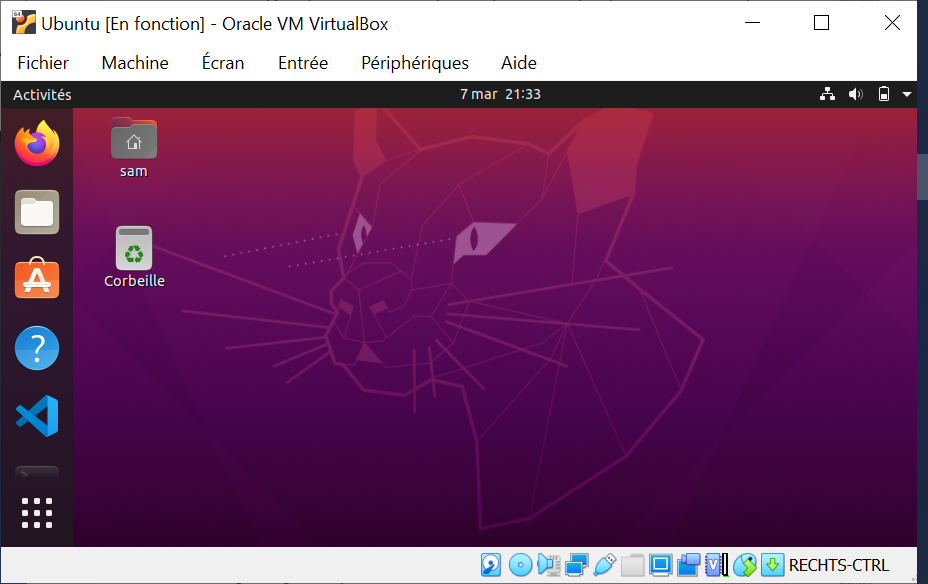
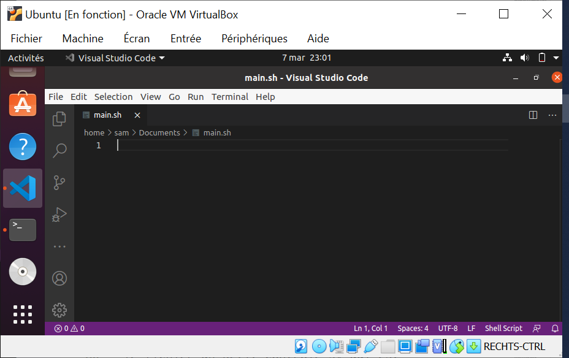

# [30. Introduction bash](https://www.youtube.com/watch?v=XGxtbcAzk-g)

Bonjour à tous et bienvenue pour cette 30ème séance GNU Linux sur la chaîne Formations vidéos.

On se retrouve aujourd'hui comme promis pour le dernier chapitre de ce cours avec la programmation de scripts.

Jusqu'à présent et vous avez vu sur les toutes dernières séances qu'on a eue là dernièrement beaucoup beaucoup de commandes à utiliser en console càd depuis votre terminal.

Je vous avais parlé sur la vidéo d'introduction d'ailleurs concernant la ligne de commande de différents types de shell.

Les Shells sont simplement des programmes que nous allons utiliser qui permettent d'utiliser un peu toutes ces commandes.

Je vous ai parlé de Bash (Bourne-Again shell), on a également ZSH et on en a beaucoup beaucoup d'autres vous pouvez d'ailleurs vous renseigner, je pense que pas mal d'entre vous l'ont déjà fait.

Il faut savoir évidemment que tous ces derniers donc regroupe le terminal càd l'outils que vous avez pour pouvoir taper ces différentes commandes et qui sont en fait donc des langages parce qu'on va parler plus exactement de deux langages parce qu'il y a plusieurs langages de scripts d'accord vous pouvez et vous avez appris déjà à le faire, à utiliser ces différentes commandes depuis votre terminal et va pouvoir bien évidemment utiliser ces mêmes commandes et on va en voir d'autres spécialement pour de la programmation.

On va faire un peu de programmation pour terminer ce chapitre directement depuis un script.

Vous aller avoir un fichier et vous allez pouvoir programmer dedans, utiliser également toutes les commandes que vous avez vu jusqu'à présent, les commandes pour lister des fichiers, pour faire de l'affichage, pour peu importe en fait pour déplacer comme faire de la copie etc.

Toutes ces commandes sont parfaitement valide au niveau de vos fichiers et vous allez pouvoir faire de la programmation avec tout ce que ça inclut bien évidemment et si vous n'avez jamais programmé de votre vie, peut-être que Bash sera le premier langage de programmation que vous ferez et bien vous allez découvrir ça directement sur ce cours là.

On y va, on passe directement sur l'interface.



Qu'est ce que je peux vous dire à ce niveau là ? alors oui au niveau du langage Bash, le langage est interprété d'accord ce n'est pas un langage qui est compilé or si vous ne savez pas ce que ça veut dire, nous n'allons pas passer par une étape de compilation pour faire simple j'ai déjà détaillé un petit peu les différentes étapes plus en détail sur d'autres vidéos.

Vous retrouverez ça éventuellement si ça vous intéresses mais en gros on va produire un code dans un fichier, on va le faire passer par tout un ensemble d'outils notamment un compilateur qui va produire ensuite notre fichier d'accord qu'on pourra éventuellement exécuter.

Ici on passe par de l'interprétation c'est à dire que nous allons noter notre code dans un fichier.

Ce code sera parfaitement lisible on pourra l'ouvrir commun un simple fichier texte et on va le faire interpréter ici par Bash.

Bash est simplement notre interpréteur aussi.

Voilà comment ça va se passer alors jusqu'à présent si on passait par un petit terminal, encore une fois on a vu tout un tas de commandes. On a vu la commande `cat`, on a vu `echo`, on a vu `ls`, on a vu `chmod` bref on a vu tout un tas tout un tas de commandes, encore une fois ici vous vous trouvez déjà sur le terminal de Bash qui va interpréter ces commandes.

Au niveau du fichier ce sera la même chose, c'est simplement que l'interpréteur va interpréter donc il va analyser chaque chose qui était écrite dans votre fichier et va les exécuter à la suite d'accord c'est vraiment la petite différence qu'on a mais ça permet de travailler avec des scripts directement.

Peut-être que des gens parmi vous se demandent à quoi ça peut servir càd pourquoi on utilise ce genre de langage parce qu'on peut faire finalement pas mal de choses comme vous avez vu ce qu'on a fait jusqu'à présent donc c'est assez complet c'est tout simplement généralement pour faire de l'administration système, pour par exemple automatiser certaines tâches ou carrément englober d'autres programmes.

Il est clair que vous n'allez pas forcément vous amuser à faire du jeu vidéo avec un langage comme Bash quoique c'est tout à fait possible bien évidemment on peut faire un truc en ligne de commande même si on n'aura pas d'interface graphique mais c'est pas le sujet, on va dire ici mais on va principalement l'utiliser pour le système d'accord pour se faciliter un peu la vie, pour englober certains programme.

Admettons je vais avoir un programme qui est déjà en ligne de commande voire même en interface graphique qui permet d'utiliser des fonctionnalités en console mais les commandes sont peut-être un peu trop longue,il y a beaucoup de choses à répéter voilà il y a du code assez complexe et bien je peux éventuellement encadré d'accord comme un groupeur de ces commandes au sein d'un script écrit en Bash ce qui me permettra de simplifier un petit peu son usage et on va voir de toute façon tout ça au niveau des dernières séances qu'on va voir pour ce cours.

Ne vous inquiétez pas on verra tout simplement le tout en détails.

## créer le fichier

Ok la première chose à faire ça va être de créer tout simplement un fichier, on va commencer par ça.

Alors je vais le faire dans document et on va créer notre fichier alors on va l'appeler main ça c'est un terme que j'utilise généralement pour le fichier principal dans pas mal de langage de programmation comme ça vous ne serez pas perdu si vous venez d'une autre formation et on va lui donner une extension.

```bash
main.sh
main.bash
```

L'extension un petit peu usuelle c'est `.sh` d'accord pour shell tout simplement mais vous pouvez également utiliser l'extension propre avec le terme précis du shell qui est `.bash` ok encore une fois **Bourne-Again shell** 

```bash
sam@sam:~$ cd Documents
sam@sam:~/Documents$ ls
sam@sam:~/Documents$ touch main.sh
```

Comme vous voulez, moi je vais utiliser l'extension usuel parce que c'est celle qu'on retrouve le plus souvent est celle que vous serez souvent le plus  amenés en tout cas à voir et au moins voilà il n'y a pas de problème à ce niveau-là.

Je ne vais pas faire `touch` mais je vais le faire directement depuis `code` et normalement s'il était installé, c'est plus lisible pour vous que d'utiliser un autre éditeur.

```bash
sam@sam:~$ cd Documents
sam@sam:~/Documents$ ls
sam@sam:~/Documents$ code main.sh
```



Un petit ctrl+S du fichier pour vérifier qu'il est enregistré et nous avons notre fichier qui est prêt.

Normalement en plus on va pouvoir profiter de la coloration et par défaut l'éditeur la propose sinon il y a moyen d'installer pour rappel des extensions qui permettent de faire ceci.

## désigner le shell

Ok alors on va avoir une première chose a indiquer c'est à dire que vous avez maintenant bien compris sur linux, on a donc notre système. On peut avoir éventuellement un ensemble d'utilisateurs donc de sessions d'accord sur ce système on peut avoir des groupes bref on peut avoir tout un tas de types de droits et de permissions différentes en fonction.

Vous avez même vu si vous souvenez un petit peu ça c'est du rappel de la vidéo sur les utilisateurs, la gestion des utilisateurs notamment certaines lignes dans des fichiers qui permettait d'indiquer le shell c'est à dire le shell qui va être utilisé par défaut par utilisateur.

Eventuellement peut-être qu'un utilisateur voudra utiliser un shell par défaut autre que Bash, il peut y en avoir d'autres par exemple il y a Sh qui est un peu plus léger bref on trouvera des chaînes un peu plus léger on va dire que Bash.

Bash propose quand même davantage de fonctionnalités par rapport à d'autres, c'est pour ça qu'on l'aborde dans ce cours.

Bref on peut éventuellement désigner un autre Shell à ce niveau là.

Nous pour ne pas poser de problème et par habitude aussi parce que c'est une bonne habitude à prendre, on va spécifier à nouveau ce shell ici au niveau notre fichier pour dire en fait d'utiliser automatiquement ce Shell pour exécuter notre script puisse qu'on va écrire un script dans ce langage d'accord.

On va pour cela utiliser une ligne très spécial qui commence par un symbole, le croisillon qui va nous servir tout simplement à faire des commentaires au niveau de notre code.

```sh
# Un commentaire.
```

Un commentaire pour ceux qui ne savent pas tout  simplement, c'est une partie qui va être ignorée à l'exécution d'accord c'est simplement un texte qui peut vous aider en tant que développeurs à faire des notations, indiquer des choses mais ça ne va pas être interprété d'accord ce ne sera pas du code à proprement parler c'est du commentaire d'ailleurs si vous utilisez un éditeur de code vous remarquerez que la coloration va généralement être différente du code tout simplement par rapport à ça.

Là je peut noter n'importe quoi à la base mais ici on aura quand même une ligne un peu spécial qui elle pour le coup ne sera pas ignorée mais elle va être parfaitement interprété, `!#`.

Vous allez mettre un point d'exclamation ici au départ et on va indiquer ensuite le chemin vers le shell qu'on va utiliser donc nous c'est Bash qui est à cet emplacement `/bin/bash` tout simplement et nous avons notre fichier qui est créé.

```sh
#!/bin/bash
```

## echo

Comme le veut l'habitude bien sûr pour des différents langages de programmation, nous allons faire le grand, le fameux "Hello world !" et on va utiliser une commande que vous avez déjà vu, c'est pas nouveau qui est la commande `echo`.

```sh
#!/bin/bash

echo "Hello World !"
```

Voilà `echo` est un programme je rappelle que vous avez sur ce le système qui doit être dans `/bin` je crois, je ne sais pas si on peut voir, est-ce qu'on peut la retrouver ...

```bash
sam@sam:~/Documents$ whereis echo
echo: /usr/bin/echo /usr/share/man/man1/echo.1.gz
```

Voilà c'est ça `/usr/bin/echo`, c'est directement au
niveau du système donc on retrouve ces commandes, c'est du Bash donc on peut parfaitement utiliser tout ça depuis notre interpréteur, il n'y a pas de problème.

Je rappelle qu'on est dans un fichier mais c'est comme si vous étiez en fait dans le terminal, simplement qu'on va faire exécuter ce fichier ça va nous permettre de programmer pas mal de choses si on veut.

On va laisser ça comme ça donc je fais un petit ctrl+S encore pour enregistrer, pour être sûr.

```sh
#!/bin/bash

echo "Hello World !"
```

## ls

Je refait un petit `ls` qu'on a bien la présence du fichier.

```bash
sam@sam:~/Documents$ ls
main.sh
```

## chmod

Maintenant à ce stade vous serez tentés de vouloir l'exécuter mais vous avez appris également que sur GNU Linux, on a pas mal de systèmes encore une fois, de permission et il va falloir rendre ce fichier exécutable.

Rappelez vous il y a trois parties, il y a le fait de pouvoir alors exécuter ou accéder d'accord ça fait partie de l'exécution, de l'accès même simplement par exemple à un répertoire parce que le répertoire est un fichier un peu particulier, puis on à la lecture et on a l'écriture.

Comme je suis le créateur de ce script, on va en tant que owner c'est à dire en tant que propriétaire de ce fichier, lui donner, lui ajouter tout simplement les droits d'exécution.

Vous avez appris et c'est que de la révision la petite commande `chmod` et on va utiliser un `u+x` pour dire que moi en tant que propriétaire je lui ajoute les droits, la permission en tout cas d'exécutions à mon script tout simplement, `chmod u+x main.sh`.

```bash
sam@sam:~$ cd Documents
sam@sam:~/Documents$ ls
sam@sam:~/Documents$ code main.sh
sam@sam:~/Documents$ ls
sam@sam:~/Documents$ whereis echo
echo: /usr/bin/echo /usr/share/man/man1/echo.1.gz
sam@sam:~/Documents$ ls
main.sh
sam@sam:~/Documents$ chmod u+x main.sh
sam@sam:~/Documents$ 
```

Normalement vous ne devriez pas avoir d'erreur, si il y a le moindre problème c'est qu'il y a vraiment un souci sur votre système et c'est pas normal du tout et à partir de là on va pouvoir l'exécuter.

## exécution

Pour exécuter un fichier vous faites un point, vous faites un slash suivi du nom et normalement vous pouvez même commencer à compléter et avec la touche magique tab ça sauto-complète automatiquement et ça on peut le faire de toute façon avec toutes les commandes du shell puisqu'en fait elles sont inscrites avec fichier qui permet l'autocomplétion directement depuis la console ce qui est quand même vachement pratique.

```sh
#!/bin/bash

echo "Hello World !"
```

```bash
sam@sam:~$ cd Documents
sam@sam:~/Documents$ ls
sam@sam:~/Documents$ code main.sh
sam@sam:~/Documents$ ls
sam@sam:~/Documents$ whereis echo
echo: /usr/bin/echo /usr/share/man/man1/echo.1.gz
sam@sam:~/Documents$ ls
main.sh
sam@sam:~/Documents$ chmod u+x main.sh
sam@sam:~/Documents$ ./main.sh
Hello World
sam@sam:~/Documents$ 
```

Je fais entrer et nous avons le programme qui s'exécute.

Voyez là on n'est plus du tout sur un retour de commande qu'on aurait noté directement ici en ligne de commande mais à l'exécution de notre fichier donc là c'est quand même vraiment vraiment très pratique.

Voilà vous avez fait votre premier fichier, on va évidemment avant de terminer cette vidéo, on ne va pas s'arrêter tout de suite parce que je sais que vous êtes un peu impatient d'aller un peu plus loin.

## Options

### option e

On va regarder quelques petites notions de `echo` même si on en avait déjà vu puisque j'en avais déjà parlé de cette commande déjà auparavant mais on va voir un peu comment que ça s'applique ici.

Vous avez notamment alors le tiret e d'accord donc l'argument tiret e qui va permettre d'utiliser notamment des caractères spéciaux donc des méta caractères qu'on va retrouver dans pas mal de langage de programmation c'est généralement à quelques petites exceptions près les mêmes sur tout les langages programmation.

Je vais mettre sous forme de commentaires pour que vous puissez voir, on a l'anti slash n `\n` pour faire une nouvelle ligne, pour aller à la ligne suivante en fait tout simplement, new line. On a `\t` pour la tabulation, on va avoir pour la tabulation verticale `\v`, on va voir en anti slash f `\f` pour changer de page donc en fait elle va carrément sauter tout un certain nombre de lignes comme si ça éffacait par exemple la console ect ect. On a le retour chariot `\r` et ainsi de suite.

```sh
#!/bin/bash

# \n \t \v \f \r

echo -e "Hello World !"
```

Alors quand on veut utiliser ce genre de commandes un peu spécial, ce genre de caractère un peu spéciaux, on va utiliser l'argument tiret e ce qui permet par exemple en plein milieu de mettre ceci d'accord.

```sh
#!/bin/bash

# \n \t \v \f \r

echo -e "Hello\nWorld !"
```

Je fais ça et je reviens dans la console et plus besoin de remettre les droits, il a déjà les droits évidemment d'exécution. J'ai plus qu'à re-exécuté il n'y a pas de compilation à faire parce c'est juste un langage compilé ici, c'est juste interprété donc on n'a plus qu'à r-exécuter le script et les changements bien sûr sont opérés directement à partir du moment où vous avez bien enregistré le fichier.

Alors ça j'insiste là-dessus car comme il y a encore beaucoup beaucoup de gens qui galèrent avec des fichiers pas enregistrés, je vous le dis c'est quasiment universel sauf bien sûr si vous êtes sur un autre système que windows ou GNU linux donc Mac os, vous n'avez pas forcément la touche control, c'est la touche pomme peut-être ou une autre (je ne sais plus exactement) mais vous pouvez directement enregistrés c'est toujours le raccourci ctrl+S et bien sûr c'est un raccourci que vous pouvez faire directement au clavier.

Des fois en vidéo vous ne me voyez pas le faire mais temps en temps je le rappelle que je le fais pour que vous puissiez le savoir parce qu'apparemment il y a des gens pour qui ce n'est pas forcément évident donc c'est pas plus mal de le rappeler.

## option n

On peut également carrément ignorer le retour à la ligne parce que vous avez vu que le `echo` à la fin par défaut il fait un retour à ligne d'accord comme
si on avait ici fait un anti-slash n, `\n`.

```sh
#!/bin/bash

# \n \t \v \f \r

echo -e "Hello World !\n"
```

Si on veut éviter de prendre en compte les retours à la ligne, vous mettez simplement un tiret n `-n` en tant qu'argument comme ça là ça ignore le retour à la ligne donc là ça va faire un truc pas très très beau si je re-exécute.

```sh
#!/bin/bash

# \n \t \v \f \r

echo -n "Hello World !\n"
```

```bash
sam@sam:~/Documents$ ./main.sh
Hello World !\nsam@sam:~/Documents$ 
```

Voilà on a le hello world directement et on a le prompt qui s'affiche à nouveau à la suite et non pas la ligne.

Est-ce qu'on s'arrête là ? oui, on ne va pas aller trop vite c'est vraiment qu'une vidéo comme indique le titre d'introduction à la programmation de scripts en Bash.

On verra bien sûr la suite pour les petits curieux et les plus impatients d'entre vous sachez qu'il ne va pas y avoir énormément de vidéos en fait sur 5 ou 6 vidéos avant la vidéo de conclusion donc il n'y a pas énormément de choses à voir ce n'est pas non plus un langage programmation hyper évoluer dans le sens où il y a énormément de fonctionnalités, de syntaxe, c'est quand même assez déjà à ce niveau là parce que c'est un langage de script.

Ce n'est pas en fait pour être non plus archi complet et tenir sur un livre de 900 pages c'est pas le but donc on aura fait assez vite le tour des choses essentielles sur ce langage et vous pourrez bien évidemment vous servir de tout ce que vous aurez appris pour programmer vos propre script.

Encore une fois c'est pour ça que c'était aussi le dernier chapitre de ce cours comme pour beaucoup de choses, comme pour l'utilisation de la ligne de commande, vous n'aurez pas forcément besoin si vous ne faites que utiliser de manière standard votre système.

Mais pour les gens qui veulent commencer à faire de l'administration qui veulent commencer à faire de la programmation ça vous intéressera et le jour où vous aurez goûté j'ai envie de dire eh bien vous aurez du mal à vous en passer parce que ça peut pas mal aidé, ça peut faciliter un petit peu la vie dans pas mal de paramètres.

Voilà c'est toujours un petit peu de savoir faire ça et pour ceux que ça intéresse d'autant plus.

Je crois que j'ai fait le tour, on va s'arrêter là.

J'espère que cette vidéo en tout cas vous aura plu on attaque la prochaine fois en parlant des variables on va voir comment stocker des données puisque on exécute des commandes, ça nous renvoy un résultats mais est-ce qu'on peut, parce que là on est quand même dans un script, garder des données en mémoire d'accord les conserver le temps d'exécution pour pouvoir travailler avec, les afficher et plus tard faire tout un tas de choses et les exploiter  finalement au niveau de nos différents scripts donc on garde ça pour la prochaine fois je vous dis à bientôt pour la suite bien sûr de cette programmation de scripts bash