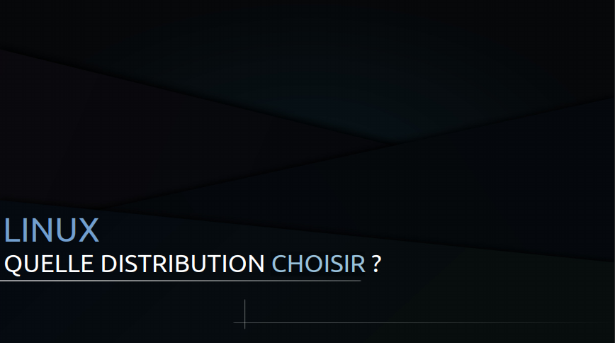
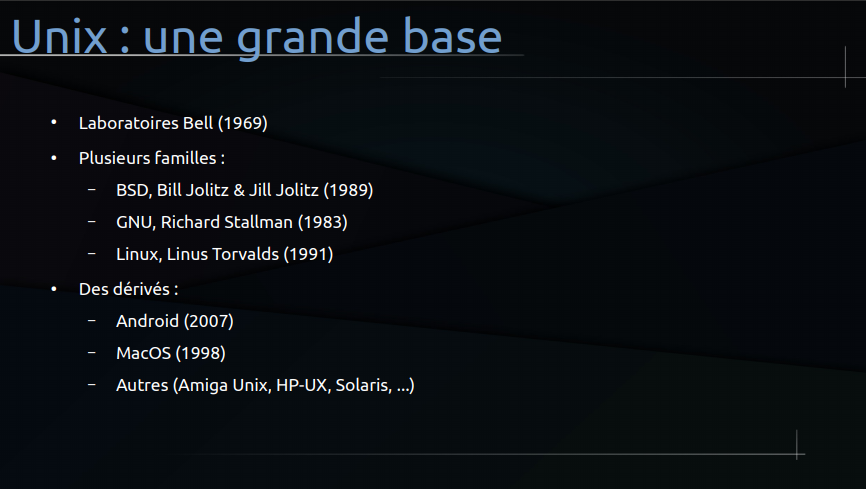
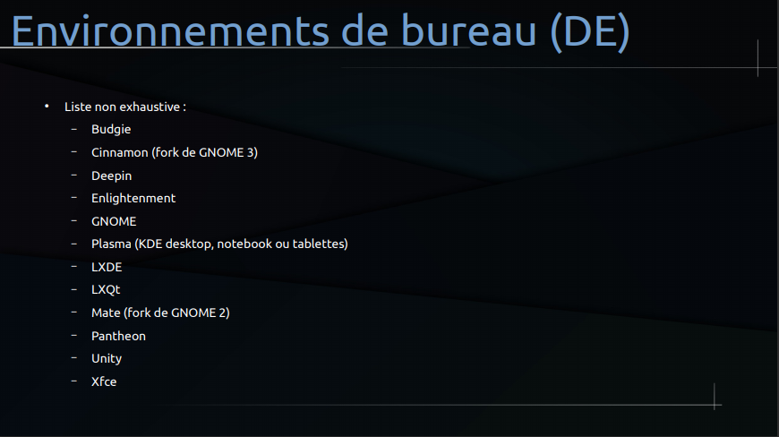
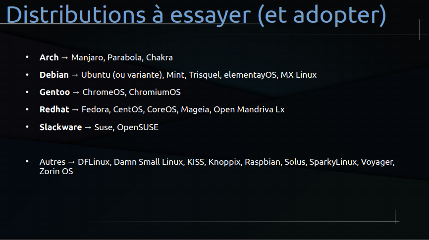
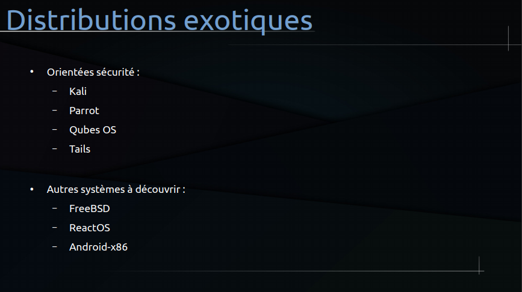
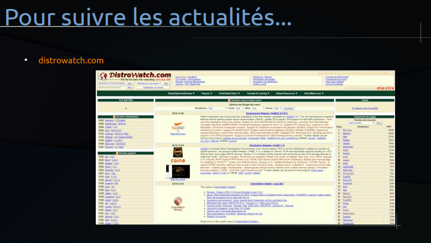

# [Quelle distribution choisir ?](https://www.youtube.com/watch?v=6w2jBj8m7-8)

[Diaporama de la séance](https://github.com/jasonchampagne/FormationVideo/blob/master/Ressources/GNU-Linux/quelle-distribution-choisir.pdf)

## 
## 
> Unix est un ensemble de famille de systèmes d'exploitation.
> Créer dans les laboratoires Bell sur base de travaux chez AT&T.
> Ne pas confondre avec Linux qui est une composante de Unix, fait partie de Unix.
> BSD est à part de Linux qui vient après. BSD est une famille de système (Free BSD, Open BSD). BSD a la philosophie de sécurité, très fiable. Il est utilisé pour l'administration serveur.
> Android fait partie des la famille Unix, des système Unix, on a en fait un déru-ive de Linux.
> MacOS fait partie de la famille Unix qu'il soit propiétare, on a pas le code source des système d'appel.
> Les principaux système sont GNU et Linux
## 
> mobille (tablette, etc.), serveur (photostore chez soi, etc).
> rolling-release = constamment à jour.
> Distribution Linux stable : Ubuntu et Mint.
> dpkg pour les distriution Debian avec ces paquet deb, rpm lié à Red hat et pacman est le gestionnaire utilisé par Arch Linux.
> Debian est très communautaire.
## 
> Bonne nouvelle les DE sont intercheangeables, pas besoin de choisir Mint pour l'environnement bureau (visuel) cinamone, Gnome de Ubuntu, l'environnement KDE, etc. Sur Windows pas possible.
> kbuntu (envi kde avec Ubuntu), lubuntu (envi LXDE avec Ubuntu).
> Généralement Linux non propriétaire, on peut personnaliser comme on veut.
> enlightenment, le plus personnalisable mais pas le plus facile à configurer !
> *LXDE* minimaliste et leger, idéal pour les vieux pc (contrarement à Plasma, Gnome et Kde très lourd à charger).
> Gnome 2 (tel que la distribution de Mint, voilà Gnome 2 ou Cinamone) puis succèder par Gnome 3.
> *Pantheon* s'inspire de MacOS et pas trop lourd en mémoire.
> *XFCE*, très leger aussi.
> Unity utiliser par Ubuntu avant de passer à Gnome.
## 
> il est recommandé de partir sur **la branche Debian** (stable), et pour faire quelque chose d'un peu différent des autres, on peut partir sur la branche Redhat.
> Redhat grosse distribution utilisé par entreprise avec des distributions payantes tel que CentOS pour faire du serveur. Mageia c'est l'histoire de Mandrake et Mandriva qui n'existent plus et la résurection de Mandriva qui est Open Mandriva Lx aujourd'hui.
> Slackware avec des dérivés plus user friendly (Suse et OpenSUSE) est une branche technique, et pareil pour Gentoo est la base des système Chrome. C'est l'idéal pour les bidouilleurs.
> Arch et son dérivé Manjaro qui permet de ne pas s'embêter à installer manuellement tout son système. Arch Linux est intéressant quand on veut apprendre à installer son système soi-même. Pour la sécurité par exemple de l'hébergement d'un site web/serveur, on ne choisit pas Arch.
> Autres : DFLinux (avant c'était AndyLinux, un debian très simple pour découvrir Linux) *Damn Small Linux* et *Kiss* (distribution très très très légère mais technique qui peuvent tourner sur de petites configurations matérielles) Raspian (dérivé de Debian pour Raspebery, distribution pour autre chose qu'un ordinateur) Solus (distribution qui propose Budgie) Voyager (basé sur Xubuntu, distribution qui propose l'environnement XCSE) Zorin OS (copie de l'interface de Windows 10)
## 
> Kali (anciennement Backtrack), Qubes OS (sépare dans des conteneur les différent usages qu'on peut avoir, sépare les différentes instances professionnelles, familliales, etc) et Tails (rejoint le fameux réseaux Thor)
> Kali et Parrot très très très spécifique, **non recommandé** pour novice ! Kali utilisé sur un périphérique (ex: consultant en entreprise) pour éffectuer par exemple des tests de sécurité, d'intrusion par exemple avec tels outils, logiciels déjà pré-configuré qui dispose de son propres systèmes de dépot. Ce distribution englobe pareil la formation GNU Linux, la sécurité en général, le réseaux, le web, la programmation, administration système, administration réseaux, etc.
> On n'est plus dans les distributions Linux mais ça vaut le coup : FreeBSD (à voir si on fait de l'hebergement web, similaire à Linux), ReactOS (basé sur le noyau NT de Windows qui est un système fermé et on peut retrouver un système libre, open source avec l'avantage de faire tourner les programmes Windows), Android-x86.
## 
+ [Distrowatch](https://distrowatch.com/)

+ Plein de distribution, Mint est basé sur Ubuntu qui est basé sur Debian.
