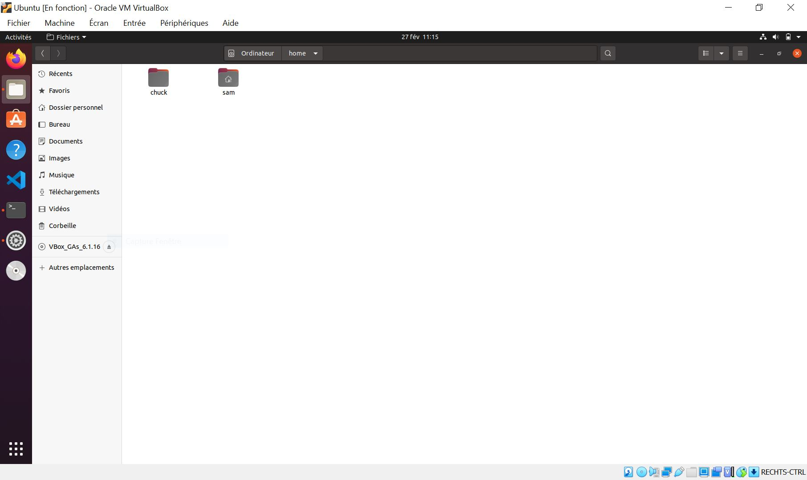

## [25. Environnement multi-utilisateurs](https://www.youtube.com/watch?v=I78LksopViE)

Salut a tous, nous retrouvons pour la 25ème séance pour cette formation GNU linux, je vous avait dit qu'on allait passer sur un tout nouveau chapitre concernant la partie, on va dire réseau tout ce qui partage les fichiers, échanges, communications, etc et j'ai remarqué en préparant mes prochaines vidéos qu'il manquait certaines commandes qui me semble quand même utiles pour l'environnement GNU linux et qu'on va aborder et ça tombe bien parce que ça fera finalement justement une bonne transition entre ce qui est local ou réseau local donc Environnement Utilisateurs ce qui va être le thème de cette vidéo.

Du coup et ce qu'on verra par la suite c'est à dire parler de ftp, de configuration réseau, etc on va voir tout un tas de choses pour la suite.

Petit rappel parce qu'il y a des fois des gens qui se demandent est-ce que la formation est terminée ou pas je précise rapidement qu'une formation se termine toujours avec une vidéo de conclusion donc si vous n'avez pas une vidéo qui s'appelle conclusion sur une formation c'est que la formation est encore en cours et qu'il y a d'autres vidéos à venir.

Ici on aura donc un gros chapitre à faire sur la  partie réseau, internet, etc et on terminera avec un dernier chapitre sur de la programmation de scripts shell et c'est avec ce chapitre là pardon qu'on conclura ce cours de linux avec une petite vidéo de conclusion comme je le fais traditionnellement sur les formations qui se terminent.

On va passer directement sur notre environnement, j'ai gardé voilà il y a pas de commandes à voir dans cette vidéo.

On va aller un peu plus loin que la séance 14 qui parlait notamment des utilisateurs et groupes d'accord je vous avait expliqué comment ça fonctionnait et comment c'était stocké au niveau du système, comment c'était représenté et on avait vu rapidement si vous souvenez comment créer un nouvel utilisateur via l'interface graphique.

Il me semble important surtout par exemple si un jour vous manipuler un système linux qui n'a pas justement d'interfaces graphiques puisqu'on aborde, on parle de ligne de commande, de faire ça via le terminal.

Pour cela nous allons voir une première commande toute simple qui permet d'ajouter un utilisateur en ligne de commande donc ce qu'on faisions précédemment via l'interface graphique alors sur cette distribution Budgie, on a ça directement dans administration utilisateurs donc en gros on pouvait créer d'autres utilisateurs et cetera et cetera.


## adduser

Bref on peut faire plein de choses mais on va créer un utilisateur en ligne de commande éventuellement par exemple pour un environnement où on n'aurait pas d'interface graphique, vous avez une commande qui est très simple très simple qui est `adduser` comme il s'agit de la création d'utilisateurs, vous avez vu pour l'interface graphique qu'on nous demandais d'être connecté en super utilisateur pour le faire, il faudra le faire évidemment avec des droits supplémentaires donc on va passer par le `root` donc le super utilisateur.

```bash
sam@sam:~$ sudo adduser chuck

    [sudo] Mot de passe de sam : 
    Ajout de l utilisateur « chuck » ...
    Ajout du nouveau groupe « chuck » (1001) ...
    Ajout du nouvel utilisateur « chuck » (1001) avec le groupe « chuck » ...
    Création du répertoire personnel « /home/chuck »...
    Copie des fichiers depuis « /etc/skel »...
    Nouveau mot de passe : 
    Retapez le nouveau mot de passe : 
```

Voilà on précise le nom d'utilisateur que vous voulez créer ensuite il crée un groupe "chuck" du même nom donc si vous avez votre pseudo vous allez créer un groupe qui porte le même nom. Voilà on verra plus tard comment ranger certaines catégories d'activités ou de droits de permissions par rapport à des groupes bien spécifiques.

Alors il nous demande un nouveau mdp et si rien n'est affiché c'est normal, on le rentre une deuxième fois ensuite on a tout un tas d'informations à rentrer optionnels qu'on peut rentrer mais si vous ne voulez pas les enregistrer vous faites entrer à chaque fois. Et une fois que c'est correcte, on valide.

```bash
sam@sam:~$ sudo adduser chuck
[sudo] Mot de passe de sam : 
    Ajout de l utilisateur « chuck » ...
    Ajout du nouveau groupe « chuck » (1001) ...
    Ajout du nouvel utilisateur « chuck » (1001) avec le groupe « chuck » ...
    Création du répertoire personnel « /home/chuck »...
    Copie des fichiers depuis « /etc/skel »...
    Nouveau mot de passe : 
    Retapez le nouveau mot de passe : 
    passwd : le mot de passe a été mis à jour avec succès
    Modification des informations relatives à l utilisateur chuck
    Entrez la nouvelle valeur ou « Entrée » pour conserver la valeur proposée
        Nom complet []: Chuck NORRIS
        N° de bureau []: 
        Téléphone professionnel []: 
        Téléphone personnel []: 
        Autre []: 
    Ces informations sont-elles correctes ? [O/n] o
sam@sam:~$ 
```

## su

L'utilisateur est créé je peux sans problème me connecter maintenant avec la commande `su` qu'on a déjà vu précédemment, à cet utilisateur-là.

```bash
sam@sam:~$ su chuck
Mot de passe : 
chuck@sam:/home/sam$ cd $HOME
chuck@sam:~$ ls
chuck@sam:~$ 
```

Alors voila je suis connecté dessus et me voilà sur le répertoire de chuck, `chuck@sam:~$`.

On peut vérifier directement via l'interface graphique.



Voilà on retrouve bien le répertoire personnel de Chuck qui ne comporte aucun autre répertoire mais ça c'est pareil ça va dépendre des distributions.

Pour une distribution basée sur ubuntu (Budgie) donc une debian, on a un répertoire template qui se fait.

Ca ne veut pas dire que vous l'aurez forcément si vous êtes sur Archi Linux, sur Fedora etc etc mais peut importe notre nouvelle utilisateur est créé.

## passwd

Si on veut un jour modifier le mot de passe d'utilisateur on a une autre commande qui est `passwd` tout simplement.

On va se déconnecter `exit` et on fait la commande `sudo passwd chuck`.

```bash
chuck@sam:~$ exit
exit
sam@sam:~$ sudo passwd chuck
    [sudo] Mot de passe de sam : 
    Nouveau mot de passe : 
    Retapez le nouveau mot de passe : 
    passwd : le mot de passe a été mis à jour avec succès
sam@sam:~$ 
```

Voilà ça vous permet de rentrer un nouveau mot de passe encore pour pouvoir mettre à jour.

## usermod

Jusque là pas de problème, maintenant si on veut modifier des informations précises sur un utilisateur, on peut utiliser notamment la commande `usermod`.

```bash
sam@sam:~$ usermod chuck
    usermod : aucune option
    Utilisation : usermod [options] LOGIN

    Options :
    -b, --badnames                allow bad names
    -c, --comment COMMENT         définir une nouvelle valeur pour le champ
                                    « GECOS »
    -d, --home REP_PERS           définir un nouveau répertoire personnel
                                    pour le compte de l utilisateur
    -e, --expiredate DATE_EXPIR   fixer la date de fin de validité du compte
                                    à DATE_EXPIR
    -f, --inactive INACTIF        fixer la durée d inactivité du mot de passe
                                    après sa fin de validité à INACTIF
    -g, --gid GROUPE              forcer l utilisation de GROUPE comme
                                    nouveau groupe primaire
    -G, --groups GROUPES          définir une nouvelle liste de groupes
                                    supplémentaires
    -a, --append                  append the user to the supplemental GROUPS
                                    mentioned by the -G option without removing
                                    the user from other groups
    -h, --help                    afficher ce message d aide et quitter
    -l, --login IDENTIFIANT       définir un nouveau nom pour le compte
    -L, --lock                    bloquer le compte de l utilisateur
    -m, --move-home               déplacer le contenu du répertoire personnel
                                    vers le nouvel emplacement (à n utiliser
                                    qu avec -d)
    -o, --non-unique              autoriser l utilisation d un identifiant
                                    d utilisateur (UID) dupliqué (non unique)
    -p, --password MOT_DE_PASSE   utiliser un mot de passe chiffré pour le
                                    nouveau mot de passe
    -R, --root RÉP_CHROOT       répertoire dans lequel chrooter
    -P, --prefix PREFIX_DIR       prefix directory where are located the /etc/* files
    -s, --shell INTERPRÉTEUR      nouvel interpréteur de commandes initial
                                    pour le compte de l utilisateur
    -u, --uid UID                 définir un nouvel identifiant (UID) pour le
                                    compte de l utilisateur
    -U, --unlock                  déverrouiller le compte de l utilisateur
    -v, --add-subuids FIRST-LAST  add range of subordinate uids
    -V, --del-subuids FIRST-LAST  remove range of subordinate uids
    -w, --add-subgids FIRST-LAST  add range of subordinate gids
    -W, --del-subgids FIRST-LAST  remove range of subordinate gids
    -Z, --selinux-user            nouvelle correspondance de l utilisateur SELinux pour le compte d utilisateur

sam@sam:~$ 
```

Voilà donc on fait `usermod` le nom d'utilisateur et en gros les informations qu'on a pu entrer lorsqu'on a créé un utilisateur, si on veut pouvoir en ajouter plus tard, des commentaires, un groupe par exemple d'appartenance on pourra utiliser tout un tas de commandes différentes.

Par exemple, j'ai un groupe qui s'appelle "sudo" qui permet notamment d'utiliser des commandes super utilisateurs c'est le cas sur mon compte principal "jachampagne" mais ce n'est pas le cas sur mon compte "chuck" que j'ai créée donc je peux très bien faire `usermode chuck -G` avec un grand G pour dire que l'utilisateur chuck je l'ajoute au groupe sudo.

```bash
sam@sam:~$ sudo usermod chuck -G sudo
sam@sam:~$ 
```

Attention il doit le faire en sudo aussi et voilà et du coup l'utilisateur chuck appartiendra également à ce groupe super utilisateur en bref il pourra utiliser des commandes avec le fameux sudo.

Si je me connecte sur ce compte chuck, il pourra utiliser les commandes avec le fameux sudo comme je le fait ici, je pourrais exécuter les commandes avec les permissions de root.

## deluser

Si vous avez besoin éventuellement de supprimer un utilisateur vous avez la commande `deluser` mais c'est également avec des permissions root.

```bash
sam@sam:~$ sudo deluser chuck
    Suppression de l utilisateur « chuck »...
    Attention ! Le groupe « chuck » ne contient plus aucun membre.
    Fait.
sam@sam:~$ 
```

Voilà là on vous dit que le groupe chuck ne contient plus aucun membre donc voilà il faudra éventuellement supprimer un groupe on va en parler un petit peu après. On va déjà vérifier ici et je vais aller dans les dossier.


Voilà il reste le répertoire personnel càd que le répertoire personnel n'est pas supprimé par défaut donc ça c'est à vous de le supprimer éventuellement pour faire du nettoyage si vous voulez.

Pour nettoyer le dossier utilisateur,

```bash
sam@sam:~$ sudo rm -R /home/chuck
    [sudo] Mot de passe de sam : 
sam@sam:~$ 
sam@sam:~$ ls /home
sam
sam@sam:~$ clear
```


Voilà on évite comme ça d'avoir des répertoires personnel qui traînent et dans /home, on ne retrouve qu'un utilisateur.

Vous avez vu une commande pour ajouter un utilisateur pour éditer des informations.

Toujours pareil, vous avez toujours le manuel si vous avez besoin d'informations supplémentaires. Vous faites `usermod` vous trouverez pas mal d'autres options supplémentaires.

Evidemment je ne vais pas toutes vous les montrer parce que je ne les connais pas toutes, je ne les utilise pas toutes non plus. Il a énormément d'options pour chacune des commandes linux donc faut en avoir l'utilité et la commande pour supprimer un utilisateur.

Pour ça on a fait le tour.

## groups

On va parler des groupes maintenant, je vous avais montré comment que c'était stocké et à quoi ça servait et on n'en avait pas mal parlé, on a fait pas mal de vidéos au cours de cette formation.

Maintenant comment on peut véritablement géré ces groupes en ligne de commande, comment ça peut fonctionner ?

Première chose que nous avons vu c'est les groupes d'accord d'appartenance en gros on crée un utilisateur et un groupe est créé portant de même nom ça je vous l'avais dit.

Vous pouvez déjà listé tout un tas de groupes avec la commande `groups`.

```bash
sam@sam:~$ groups #lister les groupes.
sam adm cdrom sudo dip plugdev lpadmin lxd sambashare
sam@sam:~$ 
```

Si je fait `groups` ici on voit tous les groupes pour le compte courant, l'utilisateur courant donc comme je suis connecté sur sam, on voit que j'appartiens au groupe utilisateur, sam. Il y a un groupe adm, sudo, dip, plugdev, lpadmin, lxd et sambashare.

Voilà on pas mal de groupe différent mais on va regarder les groupes d'un autre utilisateur.

```bash
sam@sam:~$ groups
sam adm cdrom sudo dip plugdev lpadmin lxd sambashare
sam@sam:~$ sudo adduser chuck #regarder les groupes d'un autre utilisateur.
    ...
sam@sam:~$ groups chuck
chuck : chuck
sam@sam:~$ 
```

Voilà on voit que pour chuck on a que ce groupe chuck.

On peut l'ajouter au groupe sudo.

```bash
sam@sam:~$ sudo usermod chuck -G sudo
sam@sam:~$ groups chuck
chuck : chuck sudo
sam@sam:~$ 
```

Si je refais la commande `groups` on voit maintenant qu'il appartient au groupe utilisateurs chuck ainsi qu'au groupe sudo.

On peut comme ça gérer différents groupes à chaque fois.

## addgroup

On peut en ajouter de nouveau, alors l'ajout de groupe c'est quand même assez particulier, il ne faut le faire n'importe comment voilà ça a quand même une utilité bien spécifique.

Voilà si un jour vous avez besoin de créer de nouveau groupe pour linux vous saurez qu'il existe la commande `addgroup` pour pouvoir ajouter de nouveaux groupes et notamment ajouter par exemple un utilisateur à un groupe spécifique d'accord.

```bash
sam@sam:~$ man addgroup
```

Pareil si vous galérez un petit peu vous avez normalement quelques commande ici, et vous pourrez gérer tout un tas d'utilisateurs.

On peut même d'ailleurs s'en passer puisque avec le `adduser` on peut déjà ajouter pas mal d'utilisateurs ou notamment modifier les groupes comme vous l'avez vu avec `usermod` modifier les groupes au quel appartient un utilisateur.

On retrouve pas mal de similitudes entre ces deux commandes là donc je vais aller assez vite là dessus.

## chgrp

Il nous reste encore quelques autres commandes à voir, un changement de groupe càd que si je fais `chgrp` pour chuck, on va pouvoir choisir en fait un changement de groupes spécifiques, pareil c'est dans des cas très particuliers.

```bash
sam@sam:~$ man chgrp
```

Par exemple dans le manuel, on voit l'exemple.

```bash
sam@sam:~$ chgrp staff /u #Change the group of /u to "staff".
```

En gros on vous dis par exemple pour les autres ici `/u` on leur applique en fait le groupe staff, ça permet par exemple d'appliquer un groupe à un ensemble d'utilisateurs ou éventuellement un utilisateur en particulier. Par exemple ça reviendra faire ´chgrp sudo ... un certain utilisateur ou un groupe d'utilisateurs´.

Pareil on peut en avoir l'utilité mais c'est des choses qu'on peut changer au cas par cas, ça c'est plus quand on veut faire de la modification de masse, un peut plus importante par exemple pour changer de groupe ici pour un utilisateur.

Je vais passer assez rapidement là-dessus parce qu'encore une fois c'est des cas très spécifique beaucoup plus déjà détaillé quand on a besoin d'un usage bien particulier sur son système et je pense que pour une majorité vous n'aurez pas forcément besoin de ça et si vous en avez besoin vous savez en tout cas qu'il existe des commandes.

On a beaucoup de commandes pour gérer des utilisateurs, on a des commandes pour gérer les groupes pareil si le terminal vous embête vous pouvez faire ça via l'interface graphique toute façon je rappelle par interface graphique ou tout peut être fait via un terminal. Tout dépend de vous, vous êtes plus technique ou vous utilisez simplement votre linux à la souris via l'interface graphique, vous pouvez sans problème vous passez de la ligne de commande.

## id

Il nous reste 4 ou 5 petites commandes très particulières et la prochaine commande que je vais vous montrer est une commande qui va vous permettre justement de voir les identifiants d'utilisateurs et les identifiants de groupes.

Rappelez vous on en avait parlé justement sur la séance 14 avec les GID et les UID qui sont vraiment des identifiants différends avec la commande `id` simplement vous pouvez retrouver ces numéros bien précis.

```bash
sam@sam:~$ id
uid=1000(sam) gid=1000(sam) groupes=1000(sam),4(adm),24(cdrom),27(sudo),30(dip),46(plugdev),120(lpadmin),131(lxd),132(sambashare)
```

En gros on voit ici que j'ai mon identifiant utilisateurs donc c'est 1000 puisque par défaut quand vous créez un premier utilisateur sur une distribution fraîchement installée, il vous met l'identifiant 1000.

    uid=1000(sam)

Il a créé un groupe portant le même numéro donc un GID.

    gid=1000(sam)

Ensuite on a les différents groupes auxquels appartiennent cet utilisateur donc on voit le 1000(sam) donc ça c'est le groupe qu'on a vu ici gid=1000, on a le groupe adm qui correspond au numéro 4, on a le groupe cdrom 24, sudo c'est 27 etc etc etc

Ensuite si je fait `id` suivi d'un nom d'utilisateur, on retrouve toutes les informations concernant cet utilisateur là d'accord donc on a pas mal  d'informations aussi et on voit là les différents groupes qu'on avait ajouté et ici on en a que 2, mon propre groupe et le groupe sudo qu'on avait ajouté avec `usermod`.

```bash
sam@sam:~$ id chuck
uid=1001(chuck) gid=1001(chuck) groupes=1001(chuck),27(sudo)
```

Voilà pour les utilisateurs, les groupes, ça complète, ça termine un petit peu toutes les choses qu'on avait déjà vu précédemment, on avait expliqué comment fonctionnaient les utilisateurs et les groupes sur le système ça c'était la base de la base à connaître si vous utiliser linux c'est le minimum que vous deviez connaître si vous êtes un simple utilisateur.

Ensuite on a vu comment gérer ses utilisateurs et ses groupes notamment en ligne de commande et on avait vu comment c'était stocké au niveau du système dans quels fichiers etc pour les configurations notamment pour les mots de passe et là on a été encore un peu plus loin, on est passé par une commande pour gérer tout ça pour retrouver un petit peu toute l'information que vous y voyez.

Voilà il y a vraiment plusieurs manières de procéder que vous soyez sur un serveur via un simple terminal et qui n'a absolument pas d'interface graphique ou sur un système un peu plus user friendly comme ici où vous avez éventuellement une interface graphique pour faire vos modifications.

Passons à la petite transition qui va faire vraiment la transition entre encore une fois ce qui est purement local ou privé on va dire à ce qui est environnement multi utilisateurs et ce qui amènera du coup à tout ce qui est la partie réseau qu'on abordera un petit peu plus tard en tout cas pour la suite de cette formation.

## users

Imaginons que vous ayez un environnement donc avec plusieurs utilisateurs en réseau local.

Plusieurs personnes, plusieurs sessions vont être démarrées, il y aura plusieurs utilisateurs connectés.

Vous en tant qu'administrateur de ce réseau, vous êtes la machine hôte alors on peut dire vous êtes le root, vous avez certaines commandes et possibilités pour la surveillance du système et la surveillance de ses utilisateurs.

La première commande à connaître, c'est la commande `users` avec un s qui va permettre de voir tous les utilisateurs qui sont connectés donc moi évidemment je vous ai pas fait un parc informatique là et tout un tas de connexion différentes donc je suis tout seul d'accord je suis le seul qui est connecté ici à sa session.

Bon peu importe mais si ici plus tard vous créer véritablement un réseau local vous verrez apparaître chacun des noms utilisateurs de votre réseau simplement avec cette commande là.

```bash
sam@sam:~$ users
sam
```

## who

Ensuite nous avons également possibilité de voir les utilisateurs qui se sont connectés sur une machine en particulier par exemple vous avez un ordinateur physique et vous voulez savoir quels ont été toutes les sessions démarrées sur cet ordinateur et vous avez la commande `who` d'accord donc moi pareil un seul utilisateur.

```bash
sam@sam:~$ who
sam      :0           2021-02-26 07:36 (:0)
```

On voit la dernière date et dernières heures de connexion parce que j'ai démarré cette machine effectivement à 07h36 avant de faire ma vidéo du coup on retrouve directement la date et l'information ici.

## w

On peut aller plus loin càd qu'on peut carrément vérifier tous les utilisateurs et voir ce qu'ils sont en train de faire donc c'est à dire surveiller l'activité du système concernant les utilisateurs dans votre environnement multi utilisateurs et là on a la commande `w`.

```bash
sam@sam:~$ w
 13:35:38 up  5:20,  1 user,  load average: 0,01, 0,06, 0,02
UTIL.    TTY      DE               LOGIN@   IDLE   JCPU   PCPU QUOI
sam      :0       :0               ven07   ?xdm?   7:53   0.01s /usr/lib/gdm3/gdm-x-sessio
```

Et ici on va voir donc chaque utilisateur d'accord et on trouvera depuis quand il est connecté, on verra également depuis combien de temps c'est démarré donc "7:53" c'est l'heure de connexion en fait l'heure de log soit depuis combien de temps que c'est démarré.

On aura éventuellement aussi l'occupation du cpu ça permet par exemple de voir s'il y a une activité, une utilisation cpu un peu forte. On pourrait se dire tiens cet utilisateur est en train de faire quelque chose qui est en train de prendre pas mal de ressources cpu, c'est bizarre d'accord c'est louche et après on peut éventuellement surveiller voilà tout un tas de processus et la session qui est lancé tout un tas d'informations différentes.

Encore une fois pour savoir tout simplement ce qu'un utilisateur est en train de faire, ça si un jour vous avez un utilisateur en réseau qui exécute des fichiers bizarres, des programmes bizarre qui prennent énormément de bande passante en cpu ou autre en mémoire vous le verrez bien assez vite, il y aura une charge plus élevée que la normale et avec cette commande là vous pourrez surveiller l'activité de votre système et voir un petit peu qu'elle est l'utilisateurs qui est effectivement responsable de ça.

Voilà pour ces petites commandes très pratique donc il n'y pas grand chose de compliqué, c'est très simple.

Pareil n'hésitez pas à voir les options supplémentaires pour ces différentes commandes.

## tload

On peut trouver tout un tas d'options pour chacune des commandes linux et on terminera cette vidéo avec une commande qui va vous montrer un petit peu la charge c'est à dire au niveau de la mémoire utilisée sur votre système donc cette commande c'est `tload` qu'on va utiliser par défaut pour commencer ici.

```bash
sam@sam:~$ tload

 0,00, 0,05, 0,04 
```

Si j'exécute ça va afficher toutes les 5 secondes des symboles pour représenter en fait un graphe d'accord donc c'est une forme graphique dans un terminal bien évidemment qui va représenter en fait tout simplement la charge d'accord du système donc plus il y a évidemment de choses qui se passent d'activité plus on va avoir en fait des courbes haute et différence à symbole qui vont s'afficher donc des étoiles des égals ou des simples tirets selon le type de tâche et seulement ce qui est effectué.

Alors c'est pas forcément un outil des plus pratiques au départ parce que ça peut sembler un peu complexe mais dites-vous que simplement une représentation graphique en fait de ce qui se passe.

Alors là par contre parce il ne se passe pas grand chose sur mon système donc on va lancer quand même un petit truc et faire un rafraichissement toutes les secondes donc on va changer le délait, on va mettre -d et 1 seconde.

```bash
sam@sam:~$ tload -d 1


 0,00, 0,05, 0,04 -------

***************         *
*****************    ****
*************************
*************************
*************************
```

Voilà j'ai ouvert un navigateur et on voit qu'il y a une activité.

En gros ça va vous représenter une courbe d'accord.

Imaginez qu'en fait la crête ici donc la  fin des étoiles ici en fait ça représente votre courbe donc on peut voir qu'on a une courbe qui descend et puis évidemment s'il y a quelque chose qui est exécuté sur le système a priori la courbe remonte.

Si on charge une vidéo, la courbe remonte, il y a une petite augmentation.

Vous pouvez surveiller comme ça, c'est vraiment une représentation graphique ça purge depuis un fichier.

On peut retrouver toutes les informations dans le manuel de la commande, il y a un fichier système en fait qui vous permet de récupérer ces informations là et cette commande `tload` va faire une représentation tout simplement graphique de ça donc là on voit que dès la lecture de la vidéo paf une activité un peu plus importante pour télécharger évidemment les différentes parties de la vidéo qui est due au streaming.

```bash
sam@sam:~$ tload -d 1

 0,00, 0,05, 0,04 ------------------
                            ****
                            ****
                            ****
***************         ************
*****************    ***************
************************************
************************************
************************************
```

Donc on peut comme ça surveiller et voir que ça  correspond en fait à des pics sur une espèce de  courbe tracée qui permet de voir un petit peu l'activité comme ça tout simplement la charge du système, on parle de **charge générale** et il y a évidemment pas mal d'options pour travailler avec ça.

Je fait ctrl+C pour quitter et voilà.

Vous pouvez régler le délais évidemment toutes les 5 secondes, toutes les 10 secondes, vous mettez ce que vous voulez et encore une fois avec un `man tload` vous allez retrouver tout un tas d'options qui peuvent servir, on peut changer l'échelle c'est à dire si c'est plus grands, affiché en plus grand ou en plus petit avec `-s, --scale`.

```bash
sam@sam:~$ man tload

    OPTIONS
        -s, --scale number
```

Et le fichier en question c'est celui-là.

```bash
sam@sam:~$ man tload

    FILES
        /proc/loadavg load average information
```

Voilà si vous voulez les informations plus en détails et je pense qu'on va pouvoir s'arrêter là pour cette transition ça termine véritablement tout ce qui est utilisateur, tout ce qui est en local.

On a vu qu' il y a différentes commandes pour gérer plusieurs utilisateurs puisque vous avez un ordinateur familial ou un ordinateur en entreprise ou autre dans une école où n'importe quoi qui devra donc permettre la connexion de plusieurs personnes, à voir du coup plusieurs sessions possibles.

Là vous savez qu'il y a des commandes pour surveiller certaines choses notamment l'administration système tout ça pour être sûr qu'il y a pas d'abus en fait de problème par rapport à ça.

Je pense qu'on a fait le tour là dessus par rapport à tout ce que j'avais à noter.

On pourra passer effectivement dès la prochaine séance à la partie un peu réseau internet etc, il y a beaucoup beaucoup de commandes encore à voir on se sera un gros chapitre pour faire un peu le tour de tout ça.

On ne va pas forcément voir tout ce qui existe et on verra une bonne partie quand même enfin déjà à la fin de cette formation GNU Linux de toute façon nous aurons un bon bagage en termes de commandes si vous voyez sur mon github d'ailleurs je vous ai fait un tableau avec toutes les commandes qui ont été abordés en vidéo, dans des tutos avec les numéros de sens tout ça.

Vous verrez que le tableau déjà pas mal grand et avec la partie réseau et la suite ça va bien s'agrandir et vous aurez franchement vu toutes les principales et déjà si vous savez les utiliser, si vous savez les identifier, vous saurez faire énormément de choses sur votre système linux.

On va s'arrêter là.

J'espère en tout cas que cette vidéo vous aurait été utile, vous avez pas mal d'informations données sur cette séance.

S'il y a des questions n'hésitez pas faut pas hésiter.

C'est la vidéo de transition du coup avant de passer à l'étape, la partie réseau qui suivra dès la prochaine séance et je vous dis à bientôt pour une prochaine vidéo GNU linux.

En attendant n'hésitez pas à partager la vidéo et à faire découvrir cet environnement linux à d'autres personnes qui sont peut-être habitués seulement et simplement à windows, mac os ou d'autres systèmes du genre

A bientôt tout le monde pour une prochaine vidéo