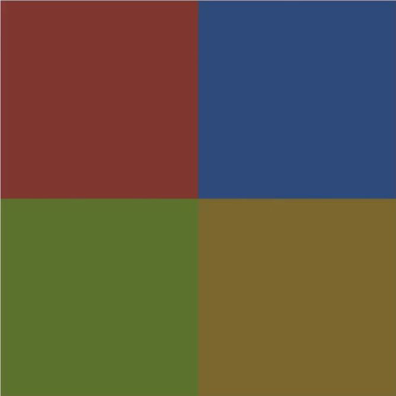

# [11. Images](https://www.youtube.com/watch?v=VXZ5mP8jUWw)
20-01-21

Bonjour à tous, bienvenue sur votre séance numéro 11 en html css, on va attaquer une autre partie qui est très importante et très utile dans la programmation en web, dans le développement web et notamment l'utilisation d'image alors c'est un terme assez générale que j'ai pris pour le titre de cette vidéo.

On va voir des petites choses un peu plus détaillées que de simples images au cours de cette vidéo donc je vais vous montrer un petit peu ce qu'il en est.

On va reprendre directement un code ici voilà.
```html
	<!DOCTYPE html>
	<html lang="fr">
	<head>
		<meta charset="UTF-8">
		<title>Images</title>
	</head>
	<body>
		<h1>Images et figures</h1>
		
	</body>
	</html>
```
Et je vais vous montrer des choses très simples à utiliser alors j'ai récupéré pour cela des images sur des sites libres de droit d'ailleurs n'hésitez pas si vous voulez travailler avec des images de chercher en tout cas des sites avec des images libres de droit c'est à dire que vous pouvez les utiliser qu'elles n'ont pas de droit d'auteur et vous pouvez du coup vous en servir pour un site web ou n'importe quoi, pour n'importe quelle création donc vous pouvez prendre ce qu'il faut.

Alors petit conseil au niveau du nommage des images d'accord comme il s'agit d'un fichier que vous allez manipuler il ne faut évidemment dans la mesure du possible ne pas mettre d'accent d'accord, pas de caractères accentués ou caractères spéciaux dans le nom des images et si vous voulez mettre plusieurs mots d'accord pour faire par exemple plusieurs mots sur le nom de l'image, vous pouvez utiliser le caractère -, le tiret d'accord comme là je l'ai fait pour pic-large.jpg par exemple j'ai mis un petit tiret au milieu pour pouvoir tout simplement espacer les mots.

Ne mettez pas d'espace dans les noms de fichier, ni de caractères accentués d'accord, ce sera beaucoup plus pratique comme ça.

Ca c'est la petite parenthèse pour ces images là.

Comme vous l'avez bien compris, nous allons voir comment html affiche ces différentes images là que j'ai récupérée pour la vidéo donc c'est très simple vous allez avoir la balise html qui s'appelle `` tout simplement.
```html
	<!DOCTYPE html>
	<html lang="fr">
	<head>
		<meta charset="UTF-8">
		<title>Images</title>
	</head>
	<body>
		<h1>Images et figures</h1>
		
>		
	</body>
	</html>
```
Elle va prendre un paramètre donc un attribut obligatoire qui est l'attribut 'src' pour source qui va donc demander un lien vers l'image en question.
```html
	<!DOCTYPE html>
	<html lang="fr">
	<head>
		<meta charset="UTF-8">
		<title>Images</title>
	</head>
	<body>
		<h1>Images et figures</h1>
		
>		
	</body>
	</html>
```
`` est une balise orpheline donc elle n'a pas de fermeture, elle se faire directement comme ça et il n'y a pas de balise de fermeture comme ceci, <del>`</img>`</del> voilà d'accord ça ça n'existe pas il n'y a pas de fermeture comme ça de la balise image.

C'est une balise orpheline c'est à dire qui se comporte de cette manière là, un peu comme la balise `<meta>` comme on l'a vu ici au niveau de la création de notre page.

On va lui passer le lien donc nous le lien comment ça va  fonctionner, toujours pareil vous avez le lien relatifs c'est à dire à l'endroit où vous trouver.

Là mon fichier index.html se trouve dans mon répertoire là.

	C:\Users\sam\...\011_images\index.html

Donc la partie relative c'est tout ce qui se trouve à proximité de lui donc voyez qu'à partir de mon fichier, je peux relativement accéder aux fichiers qui sont côte à côte donc juste en tapant le nom, ce sera plus rapide.

Par contre si j'avais fait un répertoire genre images.

	.\images\

Et si je met par exemple cette image là, japan-girl.jpg

	.\images\japan-girl.jpg

Là il faudra que je spécifie évidemment le nom du répertoire au niveau du chemin de l'image pour y accéder, on va voir ça par la suite.

Après le chemin absolu, c'est le chemin complet donc moi par exemple ce serait ça.

	C:\Users\sam\...\011_images

C'est Users, jason, dekstop etc.

Mais ça dans ce genre de cas, pour la vidéo, on n'en a pas besoin donc ici on va tout simplement afficher cette image ici d'accord pic-large.jpg comme ceci.

On va y accèder donc là elle est à côté de mon fichier donc pas besoin de mettre de répertoire quoi que ce soit, je peux directement noter le nom de l'image pic-large.jpg et noter directement le nom de l'extension, alors c'était du jpeg.
```html
<!DOCTYPE html>
<html lang="fr">
<head>
	<meta charset="UTF-8">
	<title>Images</title>
</head>
<body>
	<h1>Images et figures</h1>
	
	
</body>
</html>
```
Voilà alors attention pour ceux qui sont sur Windows, je le répète assez souvent dans mes vidéos, vérifiez que votre système windows affiche bien l'extension des fichiers, vous pouvez remarquer que tous mes fichiers, il y a une extension à chaque fois la fin .quelque chose, .html, .jpg, .png etc

Si ce n'est pas le cas allez dans les options des dossiers depuis le panneau de configuration ou dans les paramètres pour ne pas masquer surtout l'extension des fichiers au niveau du système ça c'est super important donc ici j'ai ça.

On va déjà faire un affichage simple, on va actualiser pour que vous voyez comment ça se passe d'accord donc voilà l'image qui est affiché directement sur ma page.
```txt
	Images et figures
	+---------------------------+
	|							|
	|							|
	|							|
	|							|
	|			pic-large.jpg	|
	+---------------------------+
```
Elle est vraiment énorme, c'est pourquoi j'ai prit une image de très très grande taille mais on peut changer l'image.

Alors j'avais pris la même en plus petite voilà donc on actualise comme vous voyez c'est bien géré à ce niveau-là voilà.
```html
<!DOCTYPE html>
<html lang="fr">
<head>
	<meta charset="UTF-8">
	<title>Images</title>
</head>
<body>
	<h1>Images et figures</h1>
	
	
</body>
</html>
```
```txt
	Images et figures
	+-------------------+
	|					|
	|					|
	|	pic-little.jpg	|
	+-------------------+
```
C'est bien géré à ce niveau-là donc ce type d'image c'est la base d'accords vous avez ceci.

Maintenant on va rentrer sur un point très important, question accessibilité notamment pour certaines personnes qui sont handicapés visuellement ou simplement ou des personnes qui n'utilisent pas de navigateur graphique c'est à dire qu'ils utilisent ce qu'on appelle des navigateurs textuel par exemple en ligne de commande, ça existe et mine de rien y a pas mal d'utilisateurs qui s'en servent.

Pour cela, ces gens là en tout cas ne verront pas forcément les images s'afficher et donc au niveau de l'image, il faut toujours spécifier dans la mesure du possible un attribut 'alt' c'est à dire l'attribut alternatif.

Si vous ne mettez pas 'alt' comme je l'ai fais ici, tout ce qui va en fait analyser votre page va considérer que votre image est vraiment super importante par rapport au reste du document.

En bref si cette image n'était pas dans le document et bien en fait voilà votre document quelque part n'aurait de plus raison d'être d'accord, il n'existerait pas où ils n'auraient pas de raison d'être sans cette image là.

En revanche si vous voulez faire le minimum, que votre image a quand même pas forcément une importance absolue mais que vous ne voulez pas forcément désigner de représentation, vous devez au minimum mettre l'attribut 'alt' avec une chaîne vide.
```html
	<!DOCTYPE html>
	<html lang="fr">
	<head>
		<meta charset="UTF-8">
		<title>Images</title>
	</head>
	<body>
		<h1>Images et figures</h1>
		
		
	</body>
	</html>
```
alt="", ça ça veut dire que ceux qui par exemple sont sur un navigateur textuel donc il n'affichera pas les images et bien ça n'affichera tout simplement pas l'image d'accord parce que voilà on peut s'en passer, pas de souci.

Par contre on indiquera bien quand même que voilà on avait prévu de mettre éventuellement quelque chose alternatif alt="" sauf que là on ne précise rien.

Maintenant si votre image est effectivement peut avoir une importance càd à détailler d'accord quand même, vous pouvez mettre un texte d'accord qui détaille quelque chose donc là je vais mettre une description "Texte allternatif à l'image".
```html
	<!DOCTYPE html>
	<html lang="fr">
	<head>
		<meta charset="UTF-8">
		<title>Images</title>
	</head>
	<body>
		<h1>Images et figures</h1>
		
		
	</body>
	</html>
```
Qu'est-ce qu'il va se passer ? dans le cas où votre navigateur par exemple ne va pas charger l'image ou simplement qui va prendre du temps à charger l'image parce qu'elle prend une certaine taille pour être chargée ou que la personne qui consulte votre site n'utilise pas tout simplement de navigateurs graphique donc ne peut pas voir les images s'afficher et elle aura à la place ce texte alternatif d'affiché, "Texte allternatif à l'image".

Ca lui permet comme ça de ne pas perdre l'information, je peux vous montrer d'ailleurs voilà si je mets une erreur dans l'image par la suite vous voyez on aura le texte alternatif.
```html
<!DOCTYPE html>
<html lang="fr">
<head>
	<meta charset="UTF-8">
	<title>Images</title>
</head>
<body>
	<h1>Images et figures</h1>
	
	
</body>
</html>
```
```txt
	Images et figures
	#Texte alternatif à l'image
```
C'est mieux que rien, c'est mieux d'avoir un texte alternatif pour dire quoi par exemple ici on avait cette information là d'accord si évidemment ça une pertinence.

Si ce n'est pas pertinent autant que vous ne mettiez rien du tout c'est à dire une chaîne vide d'accord.

Moi je recommande de mettre comme toujours l'attribut 'alt' soit vous mettez effectivement un texte alternatif parce qu'il y a quelque chose à dire sur cette image soit vous laissez vite parce que c'est une image donc elle est là pour faire joli entre guillemet au niveau de votre votre article ou niveau de votre page web par contre on peut sans problème sans passer.

Voilà on pourrait très bien l'enlever ça ne poserait pas de souci à la compréhension de l'article ou du contenu qui est autour de cette image là voilà.
```html
<!DOCTYPE html>
<html lang="fr">
<head>
	<meta charset="UTF-8">
	<title>Images</title>
</head>
<body>
	<h1>Images et figures</h1>
	
	
</body>
</html>
```
```txt
	Images et figures
	#
```
Comme ça voyez ici là ça passe simplement la chose, il n'y a pas de problème donc mettez 'alt' quand même tout le temps même si vous n'avez pas forcément prévu de mettre un texte alternatif à ce niveau là.

On va réfficher l'image voilà.
```html
<!DOCTYPE html>
<html lang="fr">
<head>
	<meta charset="UTF-8">
	<title>Images</title>
</head>
<body>
	<h1>Images et figures</h1>
	
	
</body>
</html>
```
```txt
	Images et figures
	+-------------------+
	|					|
	|					|
	|	pic-little.jpg	|
	+-------------------+
```
Maintenant on va arriver dans un cas donc ça c'était grosso modo ce que je voulais vous montrer alors on a d'autres attributs qui peuvent être intéressants ici que vous pouvez utiliser en html d'accord ça ne se fera pas avec le css mais directement avec le html.

Vous avez bon l'attribut 'width' comme ceci qui permet de définir une largeur à votre image d'accord.
```html
	
```
Alors attention si je regarde notamment la little ici et que je fais propriété, donc clic droit et propriété détail, on voit qu'elle fait 640 x 426 pixels d'accord donc 640 en largeur et 426 en hauteur donc elle fait cette taille là.

Si admettons je veux forcer la largeur à 500 d'accord ce genre de choses, je fais ça.
```html
<!DOCTYPE html>
<html lang="fr">
<head>
	<meta charset="UTF-8">
	<title>Images</title>
</head>
<body>
	<h1>Images et figures</h1>
	
	
</body>
</html>
```
```txt
	Images et figures
	+-------------------+
	|					|
	|					|
	|	pic-little.jpg	|
	+-------------------+
```
voilà comment va être l'image mais déjà d'ailleurs elle pourrait être déformée.

Par la suite je vais faire même plus petit histoire que vous voyez bien, voilà ce genre de choses, 200.
```html
<!DOCTYPE html>
<html lang="fr">
<head>
	<meta charset="UTF-8">
	<title>Images</title>
</head>
<body>
	<h1>Images et figures</h1>
	
	
</body>
</html>
```
```txt
	Images et figures
	+-------------------+
	|					|
	|					|
	|	pic-little.jpg	|
	+-------------------+
```
Là attention parce que ça ça pourrait il y a une erreur souvent fréquente pour les gens qui démarre en web vous pourriez penser que la en fait bien vous allez par exemple alléger le chargement de la page parce que ben oui l'image que vous affichez ici elle fait que 200 pixels au lieu de faire les 640 de prévu, alors c'est pas comme ça que ça fonctionne !

En réalité, l'image vous ne l'avez pas changée donc c'est toujours cette image là, pic-little.jpg, qui est chargée au niveau de la page web donc celle qui fait 53,7 ko comme vous le voyez là sur l'info bulle.

Par contre c'est après le navigateur qui redimensionne cette image dans la volée donc il le fait directement donc vous avez l'impression que c'est une nouvelle image alors que non c'est la même image mais qui a été réduite en taille.

Par contre à la base il a bien chargé la même donc si votre image, elle fait 1 méga eh bien il va devoir charger un méga de données et après faire la redimension pour l'afficher donc ça ne changera rien donc si vous voulez alléger le chargement des pages, il faut évidemment travailler directement à l'origine des images donc soit les compresser pour réduire leur taille ou ce genre de choses.

C'est pas seulement en redisant la taille ici au niveau html que vous allez le faire.

Après ce qu'on peut s'amuser à faire c'est au niveau de la hauteur avec 'height' comme ceci.
```html
	
```
Et si vous voulez avoir un ratio correct c'est à dire d'avoir des bonnes proportions, vous pouvez le mettre aussi à "auto" ce genre de choses.
```html
	
```
C'est à dire qu'il va gérer la hauteur automatiquement en fonction de la largeur que vous avez mis voilà donc là pas de problème d'accord au niveau de l'affichage.
```html
<!DOCTYPE html>
<html lang="fr">
<head>
	<meta charset="UTF-8">
	<title>Images</title>
</head>
<body>
	<h1>Images et figures</h1>
	
	
</body>
</html>
```
```txt
	Images et figures
	+-------------------+
	|					|
	|					|
	|	pic-little.jpg	|
	+-------------------+
```
Ici pas de souci parce que l'image ne pose pas de souci au redimensionnement et voyez comme ça il va bien adapter.

Ca évitera par exemple de faire des choses comme ça, je peux vous montrer ce genre de chose, 300 x 1000, qui sera c'est bizarre.
```html
<!DOCTYPE html>
<html lang="fr">
<head>
	<meta charset="UTF-8">
	<title>Images</title>
</head>
<body>
	<h1>Images et figures</h1>
	
	
</body>
</html>
```
```txt
	Images et figures
	+-------------------+
	|					|
	|					|
	|					|
	|					|
	|					|
	|					|
	|					|
	|					|
	|					|
	|					|
	|					|
	|	pic-little.jpg	|
	+-------------------+
```
Là voyez vous aurez évidemment une déformation de l'image d'accord alors que si j'avais juste mit "auto".
```html
<!DOCTYPE html>
<html lang="fr">
<head>
	<meta charset="UTF-8">
	<title>Images</title>
</head>
<body>
	<h1>Images et figures</h1>
	
	
</body>
</html>
```
```txt
	Images et figures
	+---------------------------------------+
	|										|
	|										|
	|										|
	|										|
	|										|
	|										|
	|										|
	|										|
	|										|
	|										|
	|										|
	|						pic-little.jpg	|
	+---------------------------------------+
```
Voilà, je peux bien évidemment gérer les choses plus correctement donc la voyez en fonction de ce que j'ai voulu comme largeur il adapte donc là l'image pour le coup elle est affichée beaucoup plus grandes que ce qu'elle est de manière originale, c'est pour ça qu'on voit apparaître d'ailleurs quelques petits pixels pixels. 

Voyez qu'elle se pixellise parce que c'est une image de 640 pixels et la je lui demande de s'afficher à 1000 de hauteur et une largeur du coup en proportion avec cet hauteur là.

On a du coup une image très large pour le coup voilà ça c'est des petits attributs qui sont à connaître, qui sont pas mal utile ça vous servira dans certains cas pour gérer par exemple des hauteurs automatique en fonction des largeurs d'image que vous voulez.

Alors attention pas de pourcentage un niveau de ça c'est vraiment des pixels qu'il faut d'accord donc ça "200", "500", "1000" c'est un nombre de pixels ou la valeur "auto" pour se soit gérer automatiquement.

Vous ne pouvez pas mettre 10%, 50%, ça ne fonctionne pas.

C'est obligatoirement en pixels ici notamment depuis qu'on est en html 5 parce que c'était pas forcément pareil avant mais c'était pas automatiquement des bonnes manières de procéder donc là au moins on est sûr d'avoir quelque chose de correct.

Un autre attribut optionnel parce que vous n'êtes pas obligé de le mettre à chaque fois mais ça peut servir.

Admettons donc là pour le coup vous avez une image super important mais qui demande peut-être beaucoup de détails d'accord pour être expliquée, vous pouvez utiliser l'attribut 'longdesc' comme ceci et vous pouvez lui spécifier une url par exemple donc si par exemple votre image pour lui donner tous les détails vous pouvez lui indiquer un site web d'accord ou alors tout simplement un identifiant vers un autre élément de votre site d'accord.

Par exemple on fait id="" égale quelque chose d'accord truc par exemple eh bien vous pourriez mettre ici un identifiant pour un autre élément voilà.
```html
	
```
Alors pas lui même maus pour un autre, vous pouvez faire ce genre de choses donc ça c'est très peu utilisé mais dans certains cas ça peut être utile comme par exemple vous avez un graphique ou vraiment une image pas forcément assez claire et que vous avez un détail quelque part, un paragraphe pour la détailler ou même carrément un lien, une url pour avoir le détail complet sur cette image, vous pouvez le préciser ici.
```html
	longdesc="truc"
```
Alors qu'est ce que ça va faire ce genre de choses ? ça ne va pas changer quoi que ce soit au niveau visuel d'accord c'est vraiment en termes d'aspirations site donc c'est à dire au niveau de l'analyse du code source qu'on va le voir ou directement au niveau des analyseurs de pages d'accord donc ça ne va pas proposer forcément de lien cliquable ou autres pour accéder à ça d'accord c'est vraiment un titre informatif donc c'est pour ça que j'en parle vite fait puisque c'est pas forcément utilisé à tous les coups d'accord.

Ce qui est vraiment obligatoire c'est l'attribut 'src' et 'halt' pour avoir un texte alternatif dans tous les cas même si on le laisse vide et éventuellement modifier la largeur et la hauteur si vous voulez gérer ici l'affichage tout en sachant que vous ne rechangé pas l'image d'origine, ça c'est important.

Voilà pour ce cas de figure qui est très simple encore une fois, c'est des choses très simples.

Alors je peux montrer également pour cette image là d'accord qui est dans le sous dossier que je devais vous montrer donc on va le faire tout de suite.

Donc là comment que ça se passe ? on a de manière relative à partir du fichier html, où je suis, on a un sous dossier donc je vais aller dans ce sous dossier donc je vais noter son nom "images/", on met un slash et ensuite du coup s'il y avait un autre dossier, on mettrait encore le nom du dossier, slash et cetera et là on récupère le nom de l'image, copier/coller pour être sûr de ne pas se tromper.
```html
	
```
```html
<!DOCTYPE html>
<html lang="fr">
<head>
	<meta charset="UTF-8">
	<title>Images</title>
</head>
<body>
	<h1>Images et figures</h1>
	
	
</body>
</html>
```
```txt
	Images et figures
	+-------------------+
	|					|
	|					|
	|	japan-girl.jpg	|
	+-------------------+
```
Voilà on actualise et l'image et gérer d'accord et c'est pareil, je peux toujours faire la même chose 'width' par exemple à 600 et du coup la hauteur tu prends un hauteur automatique qui concerne en fait les proportions de l'image pour éviter de déformer l'image et d'avoir un résultat qui ne soit pas forcément joli.
```html
<!DOCTYPE html>
<html lang="fr">
<head>
	<meta charset="UTF-8">
	<title>Images</title>
</head>
<body>
	<h1>Images et figures</h1>
	
	
</body>
</html>
```
```txt
	Images et figures
	+-------------------+
	|					|
	|					|
	|	japan-girl.jpg	|
	+-------------------+
```
Donc au moins là vous pouvez comme ça respecter les proportions donc c'est à dire le ratio entre la largeur et la hauteur.

Voilà pour l'affichage d'image, je vous ai montré tout ce qu'ils avaient en tout cas d'intéressant par rapport à ça.

On rentre maintenant dans un cas un peu plus particulier pour ceux par exemple qui voudra afficher justement des graphiques, des tableaux, ce genre de choses des images assez explicative où vous auriez besoin de mettre une légende.

Ou alors exemple tout bête, vous utilisé une image de quelqu'un, d'un photographe ou de quelqu'un qu'il l'a fait, qui avait un droit d'auteur et voulez créditer cette image, hé bien pour le faire vous n'allez pas forcément utiliser uniquement l'image ici mais vous allez la placer dans un ensemble de figures d'accord ce qu'on appelle les figures d'ailleurs pour ça que j'ai mis le titre "Images et figures".
```html
	<body>
		<h1>Images et figures</h1>
		
		
	</body>
```
Comment ça va fonctionner c'est très simple vous mettez une balise ici `<figure>` d'accord voilà donc c'est une balise ici qui se ferme.
```html
	<!DOCTYPE html>
	<html lang="fr">
	<head>
		<meta charset="UTF-8">
		<title>Images</title>
	</head>
	<body>
		<h1>Images et figures</h1>
		
		<figure>
		
		</figure>
	</body>
	</html>
```
A l'intérieur vous mettez bien votre image comme ça a été défini d'accord y'a pas de soucis comme ceci.
```html
	<!DOCTYPE html>
	<html lang="fr">
	<head>
		<meta charset="UTF-8">
		<title>Images</title>
	</head>
	<body>
		<h1>Images et figures</h1>
		
		<figure>
			
		</figure>
	</body>
	</html>
```
Et là on a mis 200 pour que soit plus petit et ici vous allez utiliser la balise `<figcaption>` comme ceci et ça vous allez tout simplement mettre une légende à l'intérieur alors ça peut être un crédit si par exemple l'image appartient à quelqu'un d'accord UnTel.
```html
<!DOCTYPE html>
<html lang="fr">
<head>
	<meta charset="UTF-8">
	<title>Images</title>
</head>
<body>
	<h1>Images et figures</h1>
	
	<figure>
		
		<figcaption>Crédit : UnTel</figcaption>
	</figure>
</body>
</html>
```
```txt
	Images et figures
	+-------------------+
	|					|
	|					|
	|	japan-girl.jpg	|
	+-------------------+
	Crédit : UnTel
```
Voyez ça se met automatiquement en dessous de l'image d'accord qui est considérée ici comme une représentation avec une légende.

Vous pouvez y mettre un site, n'importe quoi genre par exemple la source d'une image si vous l'avez récupéré depuis quelque part, vous mettez la source en mettant un lien voilà.
```html
<!DOCTYPE html>
<html lang="fr">
<head>
	<meta charset="UTF-8">
	<title>Images</title>
</head>
<body>
	<h1>Images et figures</h1>
	
	<figure>
		
		<figcaption>Source : <a href="">lesite.com</a></figcaption>
	</figure>
</body>
</html>
```
```txt
	Images et figures
	+-------------------+
	|					|
	|					|
	|	japan-girl.jpg	|
	+-------------------+
	Source : lesite.com
```
D'accord vous pouvez très bien faire comme ça ou simplement mettre un descriptif.

Si par exemple votre image a besoin d'être décrite voilà vous pouvez mettre aussi un descriptif, Une japonaise en robe traditionnelle.
```html
<!DOCTYPE html>
<html lang="fr">
<head>
	<meta charset="UTF-8">
	<title>Images</title>
</head>
<body>
	<h1>Images et figures</h1>
	
	<figure>
		
		<figcaption>Une japonaise en robe traditionnelle</figcaption>
	</figure>
</body>
</html>
```
```txt
	Images et figures
	+-------------------+
	|					|
	|					|
	|	japan-girl.jpg	|
	+-------------------+
	Une japonaise en robe traditionnelle
```
Voilà ce qui permet de décrire un peu ce que l'on voit sur l'image d'accord si vous voulez apporter une petite description courte donc il ne s'agit pas non plus de faire un paragraphe complet, écrire un pavé mais c'est d'avoir une description courte concernant l'image en question.

Voilà si vous avez besoin de faire ce genre de choses sur votre site pour que ce soit beaucoup plus pertinent et beaucoup plus correct au niveau sémantique et bien mettez votre image dans un ensemble de balises `<figure>` et `<figcaption>` pour lui apporter une légende supplémentaires.

Ca c'est pas mal d'avoir ça puisque je rappelle que l'attribut 'alt' n'ai pas fait justement pour ce type de choses, il n'est pas fait pour mettre une légende.

'alt' est fait pour avoir un texte alternatif si l'image n'arrive pas à s'afficher ou simplement que l'utilisateur n'a pas d'affichage d'image sur son navigateur donc ça c'est à savoir aussi.

Voilà pour ce deuxième point donc ça voilà je voulais montrer tout ça, l'affichage des images ensuite tout ce qui est gestion avec légende parce que c'est important à voir.

Là on va attaquer une autre partie, là c'est pareil c'est du bonus parce que c'est utilisé que dans certains cas de figure mais c'est bien que je vous le montre parce que je sais que ça va plaire à pas mal de monde, ça permette de gérer en fait tout un ensemble d'image avec des zones d'accord que vous allez même pouvoir interagir avec en fait.

Vous allez pouvoir avoir des zones cliquables pour accéder à d'autres url ou même carrément à d'autres images et je vais vous montrer comment ça fonctionne.

Première chose, on va afficher une carte alors j'ai fait bien évidemment quelque chose de très simple parce que le but ce n'était pas de commencer à faire quelque chose de très complexe ce qu'il faut que vous compreniez l'utilisation donc on va juste l'afficher comme ceci. 

Admettons ce serait par exemple une carte du monde d'accord même si là j'ai fait évidemment quelque chose de très simple parce que il faut que vous compreniez l'utilité voilà.
```html
<!DOCTYPE html>
<html lang="fr">
<head>
	<meta charset="UTF-8">
	<title>Images</title>
</head>
<body>
	<h1>Images et figures</h1>
	
	
</body>
</html>
```
```txt
	Images et figures
	+-------------------+
	|					|
	|					|
	|		carte.png	|
	+-------------------+
```
Je remontre à l'actualisation F5 voilà ce qu'on a par défaut d'accord donc là c'est une image simple comme je vous ai montré en début de vidéo où j'ai différencié ici 4 couleurs mais vous allez voir pourquoi.

A partir de là je vais pouvoir définir une map d'accord, une map c'est une zone spécifique qui aura vraiment une importance.

Je vais faire ça `<map>` et je vais lui donner un nom à cette map ok donc je vais l'appeler "worldmap" par exemple donc ça se ferme aussi.
```html
	<body>
		<h1>Images et figures</h1>
		
		
		
>		<map name="worldmap">
		
		</map>
	</body>
```
Et à partir de là donc le nom est obligatoire d'accord il va vraiment être utile par rapport à ça, pourquoi ? puisque nous allons l'ajouter au niveau de l'image, on va dire que notre image ici elle va utiliser une map en particulier donc 'usemap' voilà on a un autre attribut.
```html
	<body>
		<h1>Images et figures</h1>
		
		
		
		<map name="worldmap">
		
		</map>
	</body>
```
Vous n'oubliez pas de mettre un dièse c'est important sinon ça ne marchera pas et vous mettez le nom de la map en question donc la valeur de l'attribut 'name'.
```html
	usemap="#worldmap"
```
Comme ça maintenant votre image ici `` va être lié à ce que nous allons faire ici dans la map. 

Alors vous allez comprendre à quoi ça sert parce que c'est vachement sympa, on peut faire des trucs très intéressant avec ce type de balise `<map>`.

Alors par défaut si j'actualise, on ne vois rien qui se passe, c'est normal on a créé une map mais sans définir de propriété ou de chose en plus.
```html
<!DOCTYPE html>
<html lang="fr">
<head>
	<meta charset="UTF-8">
	<title>Images</title>
</head>
<body>
	<h1>Images et figures</h1>
	
	
	
	<map name="worldmap">
	
	</map>
</body>
</html>
```
```txt
	Images et figures
	+-------------------+
	|					|
	|					|
	|		carte.png	|
	+-------------------+
```
Moi ce que je vais faire en fait c'est permettre à l'utilisateur que quand il va cliquer en fait sur le carré rouge ici d'accord seulement sur le carré rouge pas sur les autres et bien que ça le redirige vers autre chose d'accord un autre contenu.

Moi ce que je vais faire c'est que si on clique sur le carré rouge, on affichera seulement le carré rouge.

Voilà donc ça c'est très simple comment on va faire ? on va utiliser la balise `<area>`.

Alors `<area>` va prendre plusieurs types de valeurs d'accord ça c'est important, la première c'est l'endroit où vous voulez l'envoyer donc ça c'est pas mal de mettre un 'href' donc moi j'avais choisi ici carte-rouge.png voilà donc ça c'est la base.
```html
	<map name="worldmap">
		<area href="carte-rouge.png" ...>
	</map>
```
Ensuite elle va prendre la zone à déterminer c'est à dire la zone qui sera cliquable par rapport aux liens que j'ai mis ici donc je vais appeler ça 'shape' d'accord et 'shape' va pouvoir prendre 3 valeurs possibles, notamment pour que se soit valide encore une fois parce qu'on travaille en html 5 donc attention de ne pas utiliser d'autres valeurs que celles que je vais vous montrer.
```html
	<map name="worldmap">
		<area href="carte-rouge.png" shape="">
	</map>
```
Vous avez la valeur "rect" qui va permettre d'établir un rectangle alors un carré aussi parce que je rappelle qu'un carré est une sorte de rectangle particulier où tous ses côtés sont de longueur égale.

Vous avez le cercle, le carré et vous aurez le polygone, alors le polygone ça peut avoir 15, 20 côtés autant que vous voulez. Ca pourrait être défini avec une forme très spécifique donc moi pour la vidéo je vous ai bien évidemment fait des formes très simple c'est à dire ici des rectangles donc des carrés en l'occurrence pour que se soit plus simple à comprendre.
```html
	shape="rect"
```
Donc je vais utiliser la valeur "rect" et à partir de là, on va définir des coordonnées donc avec coords donc 2 o c'est important de ce rectangle d'accord c'est à dire que on va définir ici la zone cliquable sous forme rectangulaire d'accord pour accéder à cette page là à partir de mon image "carte.png" pour savoir si vous avez bien compris tout ce que j'ai dit.
```html
	<map name="worldmap">
		<area href="carte-rouge.png" shape="rect" coords="">
	</map>
```
Pour le rectangle ça va être très simple au niveau de la gestion pour ça je vais vous le noter parce qu'il y a pas mal de choses à voir parce que je ne vais pas vous montrer les 3 exemples.

Alors si 'shape' est "rect" vous allez avoir x1,y1 x2,y2 et j'expliquerai après à quoi ça correspond.
```html
	<!--
		shape = rect -> x1,y1 x2,y2
	-->
```
Pour le cercle, on mettra "circle" d'accord en anglais bien évidemment, vous allez avoir x, y et un r, je l'expliquerais aussi pourquoi.
```html
	<!--
		shape = rect 	-> x1,y1 x2,y2
				circle 	-> x, y, r
	-->
```
Et pour le polygone on va écrire "poly" et là ça prendra plusieurs choses x1,y1,x2,y2,...,x10,y10 alors là il peut y en avoir beaucoup d'accords.
```html
	<!--
		shape = rect 	-> x1,y1 x2,y2
				circle 	-> x, y, r
				poly	-> x1,y1,x2,y2,...,x10,y10
	-->
```
Alors comment ça fonctionne ?

Dans le cas d'un rectangle d'accord x1 et y1 ce sont des coordonées qui vont être affichées.

Les coordonnées ça correspond à quoi ? ça va correspondre à la largeur donc x c'est toujours la largeur, c'est l'abscisse et y c'est l'ordonnée donc la coordonnée xy du point qui est en haut à gauche de la forme que vous voulez, rectangulaire.

Donc nous au niveau de l'image, c'est pour ça que j'ai fait une image simple, le rouge vous voyez qu'il commence ici en haut à gauche donc ça veut dire que sa coordonnée x donc l'horizontale c'est zéro d'accord parce qu'elle est vraiment tout en haut à gauche ici donc c'est zéro. Et le y c'est zéro aussi parce que voilà le x il augmente au fur à mesure que vous allez là sur la droite et le y augmente au fur et à mesure que vous descendez dans l'image ok.
```txt
	(0, 0)
	+---------------------------------- > X
	|  +------------+------------+
	|  |			|			 |
	|  |			|			 |
	|  |			|			 |
	|  |			|			 |
	|  |			|			 |
	|  +------------+------------+
	|  |			|			 |
	|  |			|			 |
	|  |			|			 |
	|  |			|			 |
	|  |			|			 |
	|  +------------+------------+ (500, 500)
	|
	|
	v
	Y
```
Donc le point de coordonnées (0, 0) est là et le point de coordonnées (500, 500) puisque j'ai fait un carré de 500 x 500 il est ici tout en bas à droite du coup c'est pour ça que j'ai fait ça parce que vous voyez que ça va être très simple à calculer du coup pour avoir que le carré rouge.

Donc moi le premier point pour le carré rouge ça va être (0, 0) donc je vais le noter, j'expliquerai après pour le cercle et pour le polygone ne vous en faites pas donc vous mettez 0,0 c'est le xy.
```html
	coords="0, 0 "
```
Un espace et là le x2 y2 c'est tout simplement ce qui va être la coordonnée du point tout en bas à droite de votre forme rectangulaire donc nous au niveau de l'image je rappelle comme ça fait 500, le x2 va être à 250 et le y2 va être à 250 aussi donc j'ai juste à noter 250, 250.
```html
	coords="0, 0 250, 250"
```
Alors ça attention, ce n'est pas des valeurs tout le temps pareil c'est par rapport moi à l'image que j'ai fait ici pour cette vidéo, c'est les coordonnées que je dois choisir.

Genre si vous vous avez un rectangle par exemple où vous devez sectionner toute la partie rouge et bleu et on le verra après, il faudra mettre 500 et 250 ok parce que x est beaucoup plus grand mais ça on le verra éventuellement après.

Donc voilà on va pouvoir actualiser pour voir ce qui se passe.

Voilà on va pouvoir actuliser pour voir ce qu'il se passe donc là voyez que par défaut mon curseur ne change pas d'accord je peux cliquer partout, il ne va rien se passer.
```html
<!DOCTYPE html>
<html lang="fr">
<head>
	<meta charset="UTF-8">
	<title>Images</title>
</head>
<body>
	<h1>Images et figures</h1>
	
	<!--
		shape = rect 	-> x1,y1 x2,y2
				circle 	-> x, y, r
				poly	-> x1,y1,x2,y2,...,x10,y10
	-->
	
	
	
	<map name="worldmap_red">
		<area href="carte-rouge.png" shape="rect" coords="0, 0 250, 250">
	</map>
</body>
</html>
```
```txt
	Images et figures
	+-----------+-----------+
	|			|			|
	|			|			|
	|			|			|
	|			|			|
	|			|			|
	+-----------+-----------+
	|			|			|
	|			|			|
	|			|			|
	|			|			|
	|			|			|
	+-----------+-----------+
```
Là j'actualise et là regardez, dés que je vais sur le rouge voyez c'est calculé précisément parce que c'est vraiment au pixel, je vais pouvoir cliquer d'accord c'est que sur le rouge donc on voit bien, on peut tester pour voir voyez c'est vraiment quand on rentre dans le rouge.

Et là si je clique !
```txt
	+-----------+
	|			|
	|			|
	|			|
	|			|
	|			|
	+-----------+
```
Si je clique, j'accède donc voyez à l'image que j'ai mis donc ça fonctionne d'accord.

Si on veut changer admettons que maintenant je veux que la zone cliquable ce soit ce rectangle là, à la fois le carré rouge et le carré bleu.

Eh bien je vais adapter aussi donc ça part de 0, 0 ça ne change pas par contre ici le x c'est le double parce que je veux également le bleu avec donc je vais mettre 500 et je ne change pas pour la hauteur donc là j'actualise et la voilà voyez que maintenant c'est le rouge et le bleu.
```html
	coords="0, 0 500, 250"
```
```html
<!DOCTYPE html>
<html lang="fr">
<head>
	<meta charset="UTF-8">
	<title>Images</title>
</head>
<body>
	<h1>Images et figures</h1>
	
	<!--
		shape = rect 	-> x1,y1 x2,y2
				circle 	-> x, y, r
				poly	-> x1,y1,x2,y2,...,x10,y10
	-->
	
	
	
	<map name="worldmap_red-blue">
		<area href="carte-rouge.png" shape="rect" coords="0, 0 500, 250">
	</map>
</body>
</html>
```
```txt
	Images et figures
	+-----------+-----------+
	|			|			|
	|			|			|
	|			|			|
	|			|			|
	|			|			|
	+-----------+-----------+
	|			|			|
	|			|			|
	|			|			|
	|			|			|
	|			|			|
	+-----------+-----------+
```
Le rouge et le bleu par contre le jaune et le vert ça ne fonctionne pas donc là peu importe où je clique sur ce grand rectangle d'accord qui est composé de rouge et de bleu, je vais accéder à l'image que j'ai choisi-là.

Alors ça ça peut servir à quoi ce genre de fonctionnalité ? Par exemple vous voulez faire une map monde admettons, ça peut être pour un jeu, ça peut être pour n'importe quoi et quand on clique dessus en fait on peut zoomer d'accord.

On peut avoir par exemple des sous map ou des sous-carte ce genre de choses ou apporter des informations un peu plus détaillée ça peut être pratique.

Pareil ça peut être utile par exemple si vous faites un site lié à la science ou lié à tout ce qui est médecine genre vous voulez montrer un schéma d'accord et pour avoir un zoom sur une partie du schéma et bien il suffit de cliquez par exemple sur un organe du corps et quand la personne va cliquer dessus, vous allez afficher un zoom d'accord, un détail de l'organe en question voilà comme ça la personne pourra naviguer en fait dans votre image et ça ça peut être sympa à utiliser au niveau de votre sites web donc n'hésitez pas à l'utiliser, à faire des tests dessus parce que ça peut vraiment servir.

Alors je reviens sur les deux autres cas qui sont importants, le cercle vous l'aurez maintenant compris le x et et le y ce sont les coordonnées du centre du cercle et le r c'est le rayon du cercle.
```txt
	circle 	-> x, y, r
```
A partir de ces 3 points là on peut déterminer une zone circulaire.
```txt
	poly	-> x1,y1,x2,y2,...,x10,y10
```
Pour le polygone, x1 et y1 c'est tout simplement la coordonnées x et y du point 1 du polygone et cetera d'accord donc à partir de là bas vous pouvez faire des formes, n'importe quoi, vous pouvez faire des étoiles, vous pouvez faire des trapèzes, vous pouvez faire des formes qui n'ont absolument pas du tout de nom en particulier pour définir vraiment des zones exacts.

Par exemple admettons que vous prendriez une carte de France d'accord et vous auriez une mappemonde et quand la personne clique sur la france, ça lui affiche la France avec les départements ce genre de choses eh bien il faudrait faire de la france une espèce de polygones en fait si on veut simplifier et bien il faudrait noter toutes les coordonnées pour faire tout le tour en fait de la France par rapport à votre image complète votre mappemonde et ça permettrait comme ça à la personne de cliquer.

Voilà comme ça vous allez voir la forme simple du rectangle, la forme circulaire et si vous voulez vraiment quelque chose de très précis, très détaillée, très minutieux vous pouvez aussi utiliser le polygone donc voilà comment ça fonctionne et on peut en définir plusieurs d'accord.
```html
	<area href="carte-rouge.png" shape="rect" coords="0, 0 250, 250">
	<area href="pic-large.jpg" shape="rect" coords="250, 250 500, 500">
```
Ca veut dire que si je clique sur le carré rouge ça va afficher l'image carte-rouge.png. Si je clique sur le carré jaune, ça va m'afficher pic-large.jpeg.
```html
<!DOCTYPE html>
<html lang="fr">
<head>
	<meta charset="UTF-8">
	<title>Images</title>
</head>
<body>
	<h1>Images et figures</h1>
	
	<!--
		shape = rect 	-> x1,y1 x2,y2
				circle 	-> x, y, r
				poly	-> x1,y1,x2,y2,...,x10,y10
	-->
	
	
	
	<map name="worldmap_2map">
		<area href="carte-rouge.png" shape="rect" coords="0, 0 250, 250">
		<area href="pic-large.jpg" shape="rect" coords="250, 250 500, 500">
	</map>
</body>
</html>
```
```txt
	Images et figures
	+-----------+-----------+
	|			|			|
	|			|			|
	|carte-rouge|			|
	|			|			|
	|			|			|
	+-----------+-----------+
	|			|			|
	|			|			|
	|			| pic-large	|
	|			|			|
	|			|			|
	+-----------+-----------+
```
Voyez je peux rien faire sur le bleu, le vert non plus.

Si je clique ici sur le rouge, j'ai bien carte-rouge, je fais précédent et si je clique sur le jaune j'ai bien l'image pic-large donc ça fonctionne.

Vous pouvez gérer des images mais vous pouvez mettre des url d'accord.

On pourrait très bien mettre une autre page en fait une url qui serait par exemple exactement la même page ici mais avec une autre image d'affichée on pourrait très bien mettre une url en html au niveau du 'href' et ça fonctionne puisque ici c'est un attribut de liens comme vous l'avez appris sur la balise `<a>` que vous connaissez.

Voilà pour le fonctionnement de map, j'ai pris un peu de temps parce que c'est je pense intéressant de le montrer et je sais que parmi vous, il y en a beaucoup qui vont l'utiliser, qui vont s'amuser avec donc n'hésitez pas parce que ça peut être vraiment très sympa à utiliser pour réaliser voilà de la navigation au sein d'images, au sein de représentations graphiques et là c'est plutôt sympa quand même au niveau au niveau fonctionnalités.

On peut faire des choses assez intéressantes sur cette partie là.

Est-ce que je vous montre encore autre chose ? Il y a pas mal d'autres choses sur les images, plein de choses que je ne vais pas vous montrer parce que c'est pas forcément facile à aborder au début notamment maintenant avec l'arrivée des tablettes et smartphones tout ça, il y a beaucoup de choses aussi qui sont assez précises mais qui sont pas forcément à voir maintenant puisque on vient tout simplement de commencer donc c'est pas forcément utile de voir ça tout de suite.

Donc je pense que je m'arrêterai là, je sais pas si je veux montrer d'autres choses tout de suite ... alors je vais juste vous en parler d'accords pour terminer la vidéo pour que vous sachiez que ça existe mais on reviendra dessus éventuellement dans d'autres vidéos ou alors sur des tutoriels que je publierais.

Vous avez une balise donc c'est juste en parler pour que vous sachez qu'elle existe, une balise `<picture>` comme ceci qui peut elle fonctionner de manière assez spéciale.
```html
	<picture>
	
	</picture>
```
Par exemple je vais mettre `<source>` alors je vous montre rapidement je vais aller assez vite parce qu'encore une fois c'est pas le but de vous montrer ça complètement.
```html
	<picture>
		<source></source>
	</picture>
```
Et je vais néttoyer un peu mon fichier et je met une image à l'intérieur de <picture>.
```html
	<!DOCTYPE html>
	<html lang="fr">
	<head>
		<meta charset="UTF-8">
		<title>Images</title>
	</head>
	<body>
		<h1>Images et figures</h1>

		<picture>
			<source>
			
		</picture>
	</body>
	</html>
```
Ici je vais avoir quelque chose au niveau de source comment ça va fonctionner ? hé bien en fait je vais ici utiliser un attribut 'srcset' qui va permettre de mettre plusieurs images mais je met juste celle-là, pic-large.jpg.
```html
	<!DOCTYPE html>
	<html lang="fr">
	<head>
		<meta charset="UTF-8">
		<title>Images</title>
	</head>
	<body>
		<h1>Images et figures</h1>

		<picture>
>			<source srcset="pic-large.jpg">
			
		</picture>
	</body>
	</html>
```
Admettons je vais avoir une image donc moi par exemple je met pic-large et on va utiliser l'attribut 'media' et ça c'est un attribut qui est un peu compliqué à l'heure actuelle là où vous en êtes en tout cas dans la formation. 
```html
		<picture>
			<source srcset="pic-large.jpg" media="">
			
		</picture>
```
Je ne vais pas pouvoir vous en parler parce que je vais en perdre beaucoup, ça va être assez compliqué à voir mais c'est un attribut en fait qui peut permettre de faire des requêtes un peu complexe au niveau de la sélection de différents paramètres.

On peut par exemple gérer deux médias en fonction du type utilisé est-ce que c'est un écran ? est ce que c'est pour une imprimante ? en fonction par exemple de la largeur ou de la hauteur donc en fonction des résolutions, en fonction de la densité de pixels aussi en fonction de l'orientation de l'écran. Par exemple sur un smartphone, une tablette si vous êtes en mode portrait ou en mode paysage.

Donc on peut passer pas mal de paramètres dans médias y compris quelque part des propriétés css, chose qu'on n'a pas encore vu à ce stade de la formation donc évidemment j'ai pas forcément envie de vous présenter tout.

Tout ce qui est à savoir en tout cas par rapport à ça c'est qu'on va pouvoir gérer différentes informations c'est à dire par défaut l'image sera celle là d'accord.

	"pic-little.jpg"

Donc celle là c'est la petite en l'occurrence et ici media="" on pourrait éventuellement dire sous certaines propriétés, sous certaines conditions plutôt d'affiché la ou les images parce qu'on peut très bien gérer tout un tas d'image en fait précisées ici.

Et c'est le navigateur en fonction de l'orientation de l'écran, de la résolution, des tailles, tout ça ou est-ce que vous prévoyez de faire une impression ou autre ... il choisira le bon comportement à adopter et notamment quelle image a afficher ou non, ça peut aussi être une question de débit d'accord en fonction de l'appareil utilisé si vous avez peu de connexions donc peu de débit internet, il pourra par exemple préférer charger une petite image plutôt qu'une grande donc c'est vachement intéressant quand même d'accord.

C'est une fonctionnalité qui a vraiment de l'intérêt mais qui est un peu je pense compliqué tout de suite à voir surtout qu'on n'a pas encore démarré css et que là bas il faudrait parler un peu de css pour comprendre ça et de toute façon nous le ferons tout ce qui est média, tout ce qui est justement responsive au niveau du design ... c'est des choses que nous allons voir en css donc j'ai pas envie forcément de brûler les étapes par rapport à ça mais je voulais quand même vous en parler parce que voilà histoire que vous sachiez qu'il a une balise `<picture>`, une balise source `<src>` qui vont permettre de gérer ce genre de choses et bah on les verra tout simplement.

Moi ce que je peux faire ici éventuellement c'est de faire un (min-width: 600px) donc là on tombe sur du css mais je vous le montre d'accord, 600 pixels comme ceci voilà pour gérer ce type d'image.
```html
<!DOCTYPE html>
<html lang="fr">
<head>
	<meta charset="UTF-8">
	<title>Images</title>
</head>
<body>
	<h1>Images et figures</h1>

	<picture>
		<source srcset="pic-large.jpg" media="(min-width: 600px)">
		
	</picture>
</body>
</html>
```
```txt
	Images et figures
	+-------------------+-----------+
	|					|			|
	|					|			|
	|					|			|
	+-------------------+			|
	|								|
	|								|
	+-------------------------------+
```
Et là je vais en fait me comporter d'accord en fonction de ce qui sera fait par la suite donc là pour le moment vous ne verrez rien de particulier donc là on le voit un petit peu.

L'image change si on élargit la fênetre, on voit l'image en large, on réduit et on voit l'image en little.

Voyez qu'en fonction en fait, il considère donc par rapport à la propriété que je vous ai mit là comme ça ça vous fera le petit bonus de fin de vidéo, il dit que l'image grande, pic-large, il va l'affiché à condition que la largeur au minimum de mon navigateur soit 600 pixels sinon eh ben il affichera ce que j'ai mis là par défaut dont c'est à dire la petite d'accord "pic-little.jpg".

Voilà c'est comme ça que ça va être géré.

Dés qu'on dépasse le 600 pixels de largeur donc là pouf il passe sur la grande image voilà donc ça c'est des choses qu'on apprendra à faire parce que ça permet en fait d'adapter.

On va pouvoir gérer les images utilisées en fonction donc là ça a vraiment son intérêt surtout pour tout ce qui est mobile voilà smartphones, tablettes et cetera donc ça quand même de l'intérêt ce niveau là.

Je resterai avec ça je ne vais pas aller plus loin dans cette partie là puisqu'on aura l'occasion d'en parler en css quand on va avoir des choses beaucoup plus avancés, vous vous démarrez tout juste avec les bases en tout cas en html même si on a quand même vu pas mal de balises maintenant.

On ne va pas brûler les étapes, j'espère en tout cas que ça vous a plu de voir tout ça d'accord vous avez appris pas mal de choses.

Comme d'habitude pratiquez et testez et mélangez vos attributs, faites plein de tests sur vos pages, vérifiez qu'elles sont bien valide d'accord vous pouvez voir un tuyau j'ai fait un tutoriel dans la playlist des tutoriels de html pour comment valider vos pages web selon les standards html du w3c pour qu'elles soient valide.

N'hésitez pas à le faire aussi pour être sûr de faire du bon code parce que créer, faire de l'html c'est facile c'est donné à tout le monde par contre le faire bien là on pourrait en parler voilà donc faites les choses comme il faut et n'hésitez-pas évidemment à bien comprendre ce que vous faites et si vous avez des questions vous me demandez et je vous apporterai bien sûr toute l'aide dont vous pourrez avoir besoin.

On se retrouve pour la prochaine vidéo donc on parlera, on va attaquer d'autres médias, on va notamment parler de l'audio et la vidéo, gérer toutes ces choses là c'est quand même un petit peu le béaba de ce qu'on trouve maintenant sur internet, tout ce qui est média, visuel, tout ça, on ne peut pas vraiment s'en passer, on en voit vraiment partout, à toutes les sauces donc ce sera en tout cas le thème de la prochaine vidéo.

A bientôt tout le monde sur formation vidéo