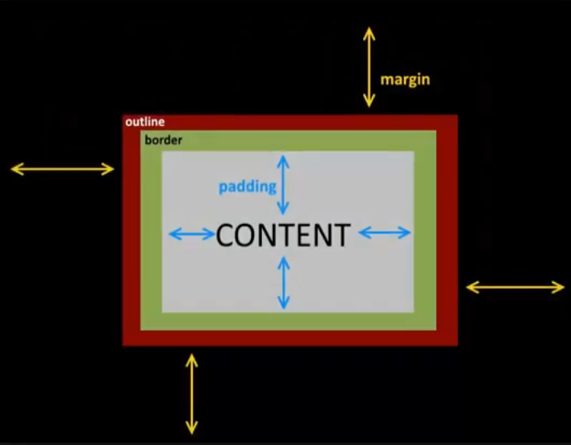

# [20. Bordures et contours](https://www.youtube.com/watch?v=9GWjxAcGzVQ)
02-02-21

Bonjour tout le monde et bienvenu pour cette séance 20 en html css.

On avait attaqué la notion de modèle de boîte précédemment, je vous avais expliqué que c'était un gros chapitre puisque c'est quelque chose qui permet de gérer un petit peu tous nos éléments sur nos pages web et là dans cette vidéo, nous allons continuer sur ce point. On va travailler sur ces modèles de boîtes mais nous avons également parler des fameuses bordures et des contours.

Alors je vais revenir sur le schéma vu précédemment, je l'ai gardez avec des petites choses nouvelles qu'on verra par la suite.


<!--
					|
					| margin
		+-------------------------------+
margin	|  outline						|
--------|  +------------------------+	|
		|  |  border				|	|
		|  |  +-----------------+	|	|
		|  |  |		| padding	|	|	|
		|  |  |--- CONTENT -----|	|	|
		|  |  |		|			|	|	|
		|  |  +-----------------+	|	|
		|  |						|	|
		|  +------------------------+	|----------
		|								|
		+-------------------------------+
-->
Dans la vidéo précédente, on avait parlé du contenu, de voir comment vous pouvez mettre le contenu dans une sorte de boîte dans lequel on va pouvoir spécifier des dimensions éventuellement et on avait parlé des marges intérieur, des marges extérieur.

Dans cette vidéo, nous allons voir tout ce qui concerne les bordures et tout ce qui concerne les contours, je vous avais expliqué que ça se mettaient à l'extérieur des bordures.

Donc gardez toujours en tête ce schéma, très important pour ce principe de boîte c'est vraiment tout suffisamment explicatifs pour comprendre un petit peu tout ce système là.

Il y a une chose que je n'avais pas abordé dans la vidéo précédente et c'est plutôt bien que je vous le dise parce que c'est pas forcément évident au premier abord quand on commence css, c'est au niveau de l'alignement des éléments par exemple pour les centrer.

Et on avait vu dans la video précédente, j'ai repris le code de la vidéo précédente même si j'ai un peu alléger le code de la fin de la vidéo d'avant.
```html
<!DOCTYPE html>
<html lang="fr">
<head>
	<meta charset="UTF-8">
	<title>Modèle de boite en CSS</title>
	<link rel="stylesheet" href="style.css">
</head>
<body>
	<div>
		<p>Lorem ipsum dolor sit amet, consectetur adipisicing elit. Debitis, ipsa, dolorum fugiat quae ea quaerat adipisci unde ducimus modi tenetur libero quidem tempora cupiditate voluptatibus labore neque reiciendis? Id, repellendus.</p>
	</div>
</body>
</html>
```
```css
	html
	{
		background-color:#FFF;
	}
	body
	{
		background-color:#DDD;
		width:800px;
	}
	div
	{
		background-color:#BBB;
		padding:5px;
		width:600px;
	}
	p
	{
		background-color:#c76f6f;
		width:400px;
		padding:10px;
		text-align:justify;
	}
```
```txt
	+-------------------------------+-----------+
	|								|			|	
	|+----------------------+		|			|
	||<p>Lorem ipsum dolor	| <div>	| <body>	| <html>
	||sit amet, consectetur	|		|			|
	||adipisicing elit.</p>	|		|			|
	|+----------------------+		|			|
	|								|			|
	+-------------------------------+-----------+
```
Nous avions des éléments comme ça c'est à dire que là, on aimerait peut-être par exemple que le `<body>` soit centré sur la page et la `<div>` également et pourquoi pas aussi la partie du paragraphe `<p>` c'est-à-dire de centrer les éléments.

Pour ça on va travailler avec les marges extérieur d'accord c'est à dire que les marges extérieur plutôt que de leur dire combien ça doit faire une marge à gauche et à droite parce que vous n'allez pas vous amuser à calculer vous même sinon vous auriez des différences selon la résolution de l'utilisateur.

Les navigateurs sont suffisamment intelligents avec leurs algorithmes pour calculer ça eux mêmes, il y a donc possibilité d'utiliser la valeur auto.

Je n'en ai pas parlé dans la vidéo précédente et c'est pour ça que je le fait-là donc le `<body>`, pour le centrer il suffit simplement d'utiliser la propriété 'margin' et au lieu de mettre des valeurs quelconques, on met auto ça veut dire qu'il va régler automatiquement.

Alors il faut que ce soit au minimum "auto" pour la gauche et la droite d'accord le 'margin-left' le 'margin-right', vous pouvez très bien mettre une marge haute en faisant 10px par exemple.
```css
>	margin:10px auto
```
"auto" ça c'est la droite, la gauche vous mettez par exemple 0 et gauche vous mettez "auto", au minimum il faut que la droite et la gauche soit en automatiques et c'est le navigateur qui va calculer l'espace a laissé là à l'extérieur et l'espace à laissé là de sorte qu'ils soient égaux.
```css
>	margin:10px auto 0 auto
```
```css
	html
	{
		background-color:#FFF;
	}
	body
	{
		background-color:#DDD;
		width:800px;
		margin:10px auto 0 auto;
	}
	div
	{
		background-color:#BBB;
		padding:5px;
		width:600px;
	}
	p
	{
		background-color:#c76f6f;
		width:400px;
		padding:10px;
		text-align:justify;
	}
```
c'est le navigateur qui va calculer l'espace a laissé là à l'extérieur et l'espace à laissé là de sorte qu'ils soient égaux d'accord peu importe la résolution de l'écran donc l'avantage c'est que en mettant ça du coup ce paramètre en automatique, cette propriété, on peut aligner l'élément c'est-à-dire le centrer et même plus exactement avec 'margin' "auto".

Alors on pourrait le faire sur autre chose, un `<div>` et cetera et comme on va le répéter, quand vous avez des propriétés qui se répète avec les mêmes valeurs sur plusieurs sélecteurs eh bien vous reprenez ses sélecteurs par exemple si je veux le faire sur `<body>`, sur `<div>` et sur le paragraphe `<p>` et vous mettez cette propriété margin:auto; ça évitera tout simplement de mettre le margin:auto; dans le `<body>`, ici et ici, de l'écrire trois fois.
```css
	html
	{
		background-color:#FFF;
	}
	body,div,p
	{
		margin:auto;
	}
	body
	{
		background-color:#DDD;
		width:800px;
	}
	div
	{
		background-color:#BBB;
		padding:5px;
		width:600px;
	}
	p
	{
		background-color:#c76f6f;
		width:400px;
		padding:10px;
		text-align:justify;
	}
```
Comme ça le jour où vous voulez changer le comportement ici des marges pour ces trois éléments, il suffira juste de modifier un seul endroit donc factorisation, on n'hésite pas de faire ça en css ça marche bien aussi et là du coup ça donc centrer nos trois éléments, nos trois boîtes.
```txt
	+-----------+-------------------------------------+-----------+
	|			|       +----------------------+	  |			  |
	|			|       |<p>Lorem ipsum dolor  | <div>|   <body>  | <html>
	|			|       |sit amet, consectetur |	  |			  |
	|			|       |adipisicing elit.</p> |	  |			  |
	|			|       +----------------------+	  |			  |
	+-----------+-------------------------------------+-----------+
```
Voilà le `<body>` est centré, le `<div>` est centré et ici le paragraphe sur fond rouge est centré également donc très pratique donc c'est comme ça qu'on centre un design par exemple quand on fait son site web qu'on ne veut pas évidemment qu'il soit sur la gauche, ça se faisait à l'époque beaucoup càd qu'on s'embêtait pas à centrer les éléments sur la page, on laissait le site en fait sur la gauche et s'il y avait une marge à droite c'était pas grave.

A l'époque ça se faisait beaucoup comme ça, maintenant depuis on va dire même depuis plus de 10 ans, 15 ans, 20 ans, évidemment on a pris l'habitude de centrer les sites web pour que ce soit mieux présenter donc on n'hésite pas à utiliser ça, un petit coup de margin:auto; et ça le fait tout seul à ce niveau là.

C'est pareil aussi, au niveau de la hauteur et de la largeur, les dimensions, vous pouvez spécifier notamment quand vous gérez des images de dire eh bien je gère par exemple une hauteur automatique en fonction de la large, ça permet par exemple de garder vous savez les proportions càd d'éviter des déformations notamment sur une image.

Une image on pourrait très bien dire, le sélecteur img, je veux que les images aient une largeur de 400 pixels par exemple et pour la hauteur, pour garder vous savez la proportion de l'image càd pour éviter de la déformer genre aplatir un visage ou l'étendre, on peut mettre aussi la valeur "auto".
```css
	img
	{
		width:400px;
		height:auto;
	}
```
"auto" c'est à dire que ça la hauteur c'est le navigateur qui avec son algorithme va s'arranger pour calculer la hauteur minimal en fonction de la largeur que nous aurons d'accord donc par rapport à width égal 400 pixels il saura comment adapter la hauteur selon l'image que vous avez mis parce que selon les dimensions de votre image à la base le calcul sera différent donc ça c'est des petites parenthèses très rapidement début de vidéo mais c'est des choses à savoir.

N'hésitez pas à utiliser cette valeur "auto" dans certains cas, elle peut vachement être utile.

Et maintenant on aborde véritablement cette partie de la vidéo avec les bordures, on va commencer déjà par ça et ensuite les contours. Je vais essayer d'aller assez vite mais comme pour la vidéo précédente il y a beaucoup d'éléments donc ça va prendre un peu de temps mais n'hésitez pas évidemment à mettre en pratique au fur et à mesure de ce que je vous montre en vidéo pour bien comprendre les choses.

Donc la bordure je vais revenir sur le schéma, on va le garder ouvert.


<!--
					|
					| margin
		+-------------------------------+
margin	|  outline						|
--------|  +------------------------+	|
		|  |  border				|	|
		|  |  +-----------------+	|	|
		|  |  |		| padding	|	|	|
		|  |  |--- CONTENT -----|	|	|
		|  |  |		|			|	|	|
		|  |  +-----------------+	|	|
		|  |						|	|
		|  +------------------------+	|----------
		|								|
		+-------------------------------+
-->
Comme on expliquer, la bordure, c'est ce qui va ici faire l'encadrement en fait de notre contenu vous voyez c'est à dire que ça va entouté les marges intérieur donc les 'padding' donc pour ça nous avons utilisé une méta propriété, donc c'est souvent ce qu'on fait le plus, qui est 'border'. Je vais vous le noter en commentaire aussi très rapidement on verra les cas où on l'utilise.
```css
	/*
		border:
	*/
```
Donc on à 'border' d'accord c'est la méta propriétaire.

Et 'border' prend trois éléments donc dans n'importe quel ordre elle prend tout simplement une épaisseur `<width>` donc l'épaisseur de la bordure width. Elle prend un <style> on en parlera et une `<color>` d'accord `<width>` `<style>` `<color>`.
```css
	/*
		border:<width> <style> <color>
	*/
```
C'est comme ça que du coup qu'on peut obtenir càd que si on ne veut pas utiliser la méta propriété 'border' directement, on peut juste par exemple spécifier l'épaisseur en utilisant 'border-width', pour le style on a 'border-style' voyez c'est très très logique au niveau du nommage des propriétés et 'border-color' voilà c'est ça qu'il y a à connaître.
```css
	/*
		border:<width> <style> <color>
			border-width:
			border-style:
			border-color:
	*/
```
Pour ces choses là, au niveau des styles ... alors je note beaucoup de choses après on verra ça au niveau du css, on a plusieurs valeurs possibles d'ailleurs je peux les noter en fait au niveau de la propriété ici. On a bon les fameux "initial", "inherit" et tout ce qui est "none" on va dire toutes les valeurs qu'on peut retrouver sur un peu toutes les propriétés comme on avait vu sur d'autres propriétés en css mais on a surtout le "dotted", on va voir un petit peu à quoi ça correspond. 
```css
	/*
		border:<width> <style> <color>
			border-width:
			border-style:dotted|dashed
			border-color:
	*/
```
| des barres verticales pour dire que c'est l'un ou l'autre des valeurs "dashed", "solid" donc c'est un trait ce qu'on va voir, on a "double", "groove", "ridge", "inset", "outset" voilà on a 8.
```css
	/*
		border:<width> <style> <color>
			border-width:
			border-style:dotted|dashed|solid|double|groove|ridge|inset|outset
			border-color:
	*/
```
8 qui ont des styles précis voilà et puis 'border-color' c'est comme d'habitude, c'est en rgb, en hexadécimal, fin comme on a déjà vu ou alors le nom directement de la couleur mais ça on a déjà vu dans une autre séance donc il n'y a pas de problème je ne reviens pas dessus.

Voilà donc au niveau de la bordure moi je vais dire par exemple que pour mon `<body>` on va appliquer une bordure de genre 5 pixels d'accord dans une certaine couleur genre dans un bleu et cetera et avec un train plein d'accord dont ce sera vraiment un encadrement plein donc pour le `<body>` donc ça prend comme je dis n'importe lequel de ces éléments dans n'importe quel ordre donc moi je vais commencer par l'épaisseur donc 5 pixels, un espace, ensuite "solid" parce que je veux que ce soit un trait plein et ensuite une couleur #3783e7, une espèce de bleu un peu clair et on actualise et voilà.
```css
	html
	{
		background-color:#FFF;
	}
	body,div,p
	{
		margin:auto;
	}
	body
	{
		background-color:#DDD;
>		border:5px solid #3783e7;
		width:800px;
	}
	div
	{
		background-color:#BBB;
		padding:5px;
		width:600px;
	}
	p
	{
		background-color:#c76f6f;
		width:400px;
		padding:10px;
		text-align:justify;
	}
```
```txt
	+===========+=====================================+===========+
	|			|       +----------------------+	  |			  |
	|			|       |<p>Lorem ipsum dolor  | <div>|   <body>  | <html>
	|			|       |sit amet, consectetur |	  |			  |
	|			|       |adipisicing elit.</p> |	  |			  |
	|			|       +----------------------+	  |			  |
	+===========+=====================================+===========+
```
Et on actualise et on obtient cette fameuse bordure comme vous voyez tout autour de 5 pixels donc si je voulais évidemment ne pas va spécifier ces trois éléments, j'aurais pu utiliser voilà les propriétés 'border-width', 'border-style' et 'border-color' par exemple alors il aurait mit surement "solid" par défaut ce genre de choses.

Alors pour voir la différence entre les différents styles je vois vous les tester rapidement, "dotted" ça donne ça, ce sont des points.
```css
	body
	{
>		border:5px dotted #3783e7;
	}
```
```txt
	+= = = = = =+ = = = = = = = = = = = = = = = = = = + = = = = = +
	|			|       +----------------------+	  |			  |
				|       |<p>Lorem ipsum dolor  | <div>|   <body>    <html>
	|			|       |sit amet, consectetur |	  |			  |
				|       |adipisicing elit.</p> |	  |			  
	|			|       +----------------------+	  |			  |
	+= = = = = =+ = = = = = = = = = = = = = = = = = = + = = = = = +
```
```css
	body
	{
		border:5px dashed #3783e7;
		border:5px double #3783e7;
		border:5px groove #3783e7;
		border:5px dashed #3783e7;
		border:5px ridge #3783e7;
		border:5px inset #3783e7;
		border:5px outset #3783e7;
	}
```
"dashed" ce sont des tirets, je vous montre assez rapidement, je vais aller vite voilà c'est pour que vous voyez grosso modo.

"double" c'est un double trait pour faire vraiment une sorte de cadre.

On a ensuite "groove", après on va avoir des effets un petit peu de perspectives, des effets 3d donc "groove" vous ne voyez peut être pas bien mais ça fait voilà un petit effet de relief on va dire.

On a "ridge" voilà donc là ça inverse les couleurs, couleurs un peu claires ou autre et on a une "inset" "outset" donc là ça un espèce d'encadré comme un relief, un enfoncement comme si en fait le cadre était enfoncé dans la partie html en blanc, et là "outset" c'est l'inverse, on a l'impression que l'élément ressort de l'écran voilà comme si c'était une sorte de bouton.

A vous de voir lequel vous intéresse au niveau des bordures, on va rester sur quelque chose d'un peu plus simple.
```css
	html
	{
		background-color:#FFF;
	}
	body,div,p
	{
		margin:auto;
	}
	body
	{
		background-color:#DDD;
>		border:5px dashed #3783e7;
		width:800px;
	}
	div
	{
		background-color:#BBB;
		padding:5px;
		width:600px;
	}
	p
	{
		background-color:#c76f6f;
		width:400px;
		padding:10px;
		text-align:justify;
	}
```
On actualise,
```txt
	+= = = = = =+ = = = = = = = = = = = = = = = = = = + = = = = = +
	|			|       +----------------------+	  |			  |
				|       |<p>Lorem ipsum dolor  | <div>|   <body>    <html>
	|			|       |sit amet, consectetur |	  |			  |
				|       |adipisicing elit.</p> |	  |			  
	|			|       +----------------------+	  |			  |
	+= = = = = =+ = = = = = = = = = = = = = = = = = = + = = = = = +
```
Pour la majorité, je n'utilise jamais ces types là à part "dashed", "solid", les autres ça quand même beaucoup plus rares et voilà donc du coup on peut faire des petits éléments sympa comme ça.

Ca c'est pour les bordures d'ailleurs pour éviter qu'ils touchent directement.
```css
	html
	{
		background-color:#FFF;
	}
	body,div,p
	{
		margin:auto;
	}
	body
	{
		background-color:#DDD;
		border:5px dashed #3783e7;
		width:800px;
>		margin-top:25px;
	}
	div
	{
		background-color:#BBB;
		padding:5px;
		width:600px;
	}
	p
	{
		background-color:#c76f6f;
		width:400px;
		padding:10px;
		text-align:justify;
	}
```
On actualise,
```txt
	+= = = = = =+ = = = = = = = = = = = = = = = = = = + = = = = = +
	|			|       +----------------------+	  |			  |
				|       |<p>Lorem ipsum dolor  | <div>|   <body>    <html>
	|			|       |sit amet, consectetur |	  |			  |
				|       |adipisicing elit.</p> |	  |			  
	|			|       +----------------------+	  |			  |
	+= = = = = =+ = = = = = = = = = = = = = = = = = = + = = = = = +
```
voilà c'est beaucoup plus clair ensuite pour des questions visuels.
```css
	html
	{
		background-color:#FFF;
	}
	body,div,p
	{
		margin:auto;
	}
	body
	{
		background-color:#DDD;
		border:5px dashed #3783e7;
		width:800px;
>		margin-top:25px;
	}
	div
	{
		background-color:#BBB;
		padding:5px;
		width:600px;
>		margin-top:25px;
>		margin-bottom:25px;
	}
	p
	{
		background-color:#c76f6f;
		width:400px;
		padding:10px;
		text-align:justify;
	}
```
On actualise,
```txt
	+= = = = = =  = = = = = = = = = = = = = = = = = = = = = = = = +
				+-------------------------------------+			  
	|			|       +----------------------+	  |			  |
				|       |<p>Lorem ipsum dolor  | <div>|   <body>    <html>
	|			|       |sit amet, consectetur |	  |			  |
				|       |adipisicing elit.</p> |	  |			  
	|			|       +----------------------+	  |			  |
				+-------------------------------------+
	+= = = = = =+ = = = = = = = = = = = = = = = = = = + = = = = = +
```
Donc là, on a comme ça notre petite bordure donc très simple à utiliser.

Les bordures comme vous l'avez vu, je pense que vous l'avez compris ca se fait autour de notre boîte de contenu donc vous avez une bordure en haut 'border-top', une bordure à droite 'border-right', la bordure en bas 'border-bottom' et la bordure à gauche 'border-left' comme pour le 'padding', le 'margin' vous pouvez comme en a fait par exemple ici 'margin-top', 'padding-left' et cetera faire la même chose pour la bordure.

Vous pouvez très bien par exemple de dire je le fais qu'à un seul endroit du genre 'border-top' d'accord et pour 'border-top' c'est qui est bien là du coup c'est que vous pouvez changer les différents éléments donc ça c'est intéressant, vous pouvez en faisant 'border-top' ça reprendrait exactement les trois `<width>` `<style>` `<color>`.
```css
	/*
		border:<width> <style> <color>
			border-width:
			border-style:dotted|dashed|solid|double|groove|ridge|inset|outset
			border-color:
		
		border-top:<width> <style> <color>
	*/
```
Alors je peux vous montrer en faisant ça hop, border-top. Je vais un peu vite parce que ce n'est pas compliqué à comprendre voyez voilà ça ne va appliquer qu'à un seul endroit.
```css
	html
	{
		background-color:#FFF;
	}
	body,div,p
	{
		margin:auto;
	}
	body
	{
		background-color:#DDD;
>		border-top:2px dashed #3783e7;
		width:800px;
		margin-top:25px;
	}
	div
	{
		background-color:#BBB;
		padding:5px;
		width:600px;
		margin-top:25px;
		margin-bottom:25px;
	}
	p
	{
		background-color:#c76f6f;
		width:400px;
		padding:10px;
		text-align:justify;
	}
```
On actualise,
```txt
	+= = = = = =  = = = = = = = = = = = = = = = = = = = = = = = = +
				+-------------------------------------+			  
				|       +----------------------+	  |			  
				|       |<p>Lorem ipsum dolor  | <div>|   <body>    <html>
				|       |sit amet, consectetur |	  |			  
				|       |adipisicing elit.</p> |	  |			  
				|       +----------------------+	  |			  
				+-------------------------------------+
```
Evidemment pour chacun de ces parties de bordures d'accord vous pouvez également retrouver ces éléments-là càd que pour 'border-top' on peut évidemment faire juste ceci.
```css
	/*
		border:<width> <style> <color>
			border-width:
			border-style:dotted|dashed|solid|double|groove|ridge|inset|outset
			border-color:
		
		border-top:<width> <style> <color>
			border-top-width
			border-top-style
			border-top-color
	*/
```
Je pense que vous avez tous compris le principe et c'est pareil pour 'border-bottom'.
```css
	/*
		border:<width> <style> <color>
			border-width:
			border-style:dotted|dashed|solid|double|groove|ridge|inset|outset
			border-color:
		
		border-top:<width> <style> <color>
			border-top-width
			border-top-style
			border-top-color
		
		border-bottom:<width> <style> <color>
			border-bottom-width
			border-bottom-style
			border-bottom-color
	*/
```
D'accord je ne vais pas faire les autres (left et right) je pense que vous avez pigé un petit peu le principe, comme ça on peut vraiment modifier les parties de la bordure que nous voulons d'accord précisement donc ça c'est plutôt sympa.

Alors on va mettre une bordure complète donc avec 'border' ça se met sur les quatre côtés voilà.
```css
	html
	{
		background-color:#FFF;
	}
	body,div,p
	{
		margin:auto;
	}
	body
	{
		background-color:#DDD;
>		border:2px dashed #3783e7;
		width:800px;
		margin-top:25px;
	}
	div
	{
		background-color:#BBB;
		padding:5px;
		width:600px;
		margin-top:25px;
		margin-bottom:25px;
	}
	p
	{
		background-color:#c76f6f;
		width:400px;
		padding:10px;
		text-align:justify;
	}
```
On actualise,
```txt
	+= = = = = =  = = = = = = = = = = = = = = = = = = = = = = = = +
				+-------------------------------------+			  
	|			|       +----------------------+	  |			  |
				|       |<p>Lorem ipsum dolor  | <div>|   <body>    <html>
	|			|       |sit amet, consectetur |	  |			  |
				|       |adipisicing elit.</p> |	  |			  
	|			|       +----------------------+	  |			  |
				+-------------------------------------+
	+= = = = = =+ = = = = = = = = = = = = = = = = = = + = = = = = +
```
Et on a fait le tour normalement pour ce système de bordures d'accord donc on a vu un petit peu comment régler tout ça alors petites choses sympas avec les bordures, vous allez pouvoir appliquer des motifs également càd plutôt que d'appliquer une simple couleur vous allez pouvoir si vous voulez appliquer une image et ça je vais essayé de l'expliquer un peu mieux aussi pour que vous puissez comprendre parce que ce n'est pas forcément facile à mettre en place et pourtant ça peut avoir des effets très intéressants à ce niveau là.

On va utiliser pour cela la propriété 'border-image'.

'border-image' prend pas mal d'éléments puisqu'elle prendre la `<source>` donc ça va être le lien en fait vers notre image, après ce qu'on appelle un `<slice>` c'est au niveau de la découpe en fait de notre image et `<width>` au niveau de l'épaisseur toujours pareil puis le `<outset>` ça on en parlera aussi vous allez voir c'est une sorte de marge en fait autour de la bordure et le `<repeat>` c'est comment on gère la répétition du motif et là il y a pas mal de choses à voir.
```css
	/*
		border:<width> <style> <color>
			border-width:
			border-style:dotted|dashed|solid|double|groove|ridge|inset|outset
			border-color:
		
		border-top:<width> <style> <color>
			border-top-width
			border-top-style
			border-top-color
		
		border-bottom:<width> <style> <color>
			border-bottom-width
			border-bottom-style
			border-bottom-color
		
		border-image:<source> <slice> <width> <outset> <repeat>
	*/
```
Il y a pas de choses à voir puisque pour ces choses là, on prendre une image d'accord donc que j'ai appelé border.png donc prenez une image en png de préférence qui a de la transparence autour c'est évidemment mieux ce sera plus joli et il faut comprendre que la propriété 'border-image' va couper votre image en neuf parties comme ceci d'accord.
```txt
		|	|
	----+---+----
		|	|
	----+---+----
		|	|
```
Voilà comme ceci un quadrillage c'est à dire que là vous imaginez que le centre c'est votre contenu en gros d'accord qui va plus ou moins se trouver à cet endroit là et ça les 8 autres parties c'est ce qui va faire vraiment la bordure voyez on peut imaginer que c'est une bordure de l'élément.

Comme ça vous pourrez donc vous créer vos propres images ou en prendre d'autres sur internet et gérer à ce niveau là donc nous on va pouvoir du coup utiliser ce système là pour créer notre propre border donc notre propre image de bordures en fait sur nos éléments.

Alors plutôt que de se prendre la tête parce qu'il y a beaucoup de choses à voir c'est à dire qu'après pour border ici on va voir plein d'éléments a préciser et c'est pas forcément pratique parce que des fois il faut faire pas mal de tests selon les types de données que vous mettez ça peut être compliqué à utiliser donc déjà on va montrer les propriétés qui sont toutes seules.

Maintenant je vais vous montrer déjà par où passer, vous pouvez aller sur un site plus mais celui-là est simple à utiliser :

https://www.google.com/search?&q=border+images+generator

Et vous obtenez un site de générateurs de bordures l'avantage c'est que vous allez avoir directement l'effet visuel de la bordure que vous faites, vous chargez votre image et voilà comment ça se passe c'est à dire que là par défaut voyez il vous montre un petit peu comment va être le motif.

Donc le rectangle ça va être le contenu et autour voyez c'est la bordure que ça va appliquer et il vous met le code css correspondant voilà il vous met d'ailleurs les préfixes selon le navigateur que vous avez mais normalement 'border-image' est bien connu sur les navigateurs récents donc pour un navigateur récent vous n'avez pas besoin par contre si vous voulez que se soient compatibles sur des très vieilles versions de navigateurs : firefox, chrome, etc.

Le but en fait c'est qu'après vous avez juste à prendre l'endroit où vous voulez appliquer cette bordure genre ici et vous mettez toute la partie de code.

Par exemple (border image generator mozilla),
```css
	border-image-slice: 42 42 42 42;
	border-image-width: 42px 42px 42px 42px;
	border-image-outset: 0px 0px 0px 0px;
	border-image-repeat: round round;
	border-image-source: url("https://mdn.mozillademos.org/files/6017/border-image-6.svg"); 
```
Vous avez un système de préfixes dont je n'ai pas forcément parlé, c'est pour gérer opera, safari, etc.
```css
	border-style: solid;
	border-width: 27px;
	-moz-border-image: url(border.png) 27 repeat;
	-webkit-border-image: url(border.png) 27 repeat;
	-o-border-image: url(border.png) 27 repeat;
	border-image: url(border.png) 27 fill repeat;
```
Pour gérer les différents navigateurs vous avez ce système de prefixes, j'en ai pas forcément parler puisqu'on a pas utilisé mais je ferais sûrement une vidéo annexe là dessus.

Et du coup vous n'avez pas besoin de vous prendre la tête de comment ça s'affiche puisque vous obtenez les différents rendus par la suite.
```css
	html
	{
		background-color:#FFF;
	}
	body,div,p
	{
		margin:auto;
	}
	body
	{
		background-color:#DDD;
		border:2px dashed #3783e7;
		width:800px;
		margin-top:25px;

>		border-image-slice: 42 42 42 42;
>		border-image-width: 42px 42px 42px 42px;
>		border-image-outset: 0px 0px 0px 0px;
>		border-image-repeat: round round;
>		border-image-source: url("https://mdn.mozillademos.org/files/6017/border-image-6.svg");

	}
	div
	{
		background-color:#BBB;
		padding:5px;
		width:600px;
		margin-top:25px;
		margin-bottom:25px;
	}
	p
	{
		background-color:#c76f6f;
		width:400px;
		padding:10px;
		text-align:justify;
	}
```
On actualise,
```txt
	+= = = = = =  = = = = = = = = = = = = = = = = = = = = = = = = +
				+-------------------------------------+			  
	|			|       +----------------------+	  |			  |
				|       |<p>Lorem ipsum dolor  | <div>|   <body>    <html>
	|			|       |sit amet, consectetur |	  |			  |
				|       |adipisicing elit.</p> |	  |			  
	|			|       +----------------------+	  |			  |
				+-------------------------------------+
	+= = = = = =  = = = = = = = = = = = = = = = = = = = = = = = = +
```
Voilà ça vous donne comme ça un petit peu une idée de comment ça va s'afficher alors après grâce à 'outset' on peut gérer le quadrillage.
```txt
		|	|		  |		|
	----+---+----	--+-----+----
		|	|		  |		|
	----+---+----	--+-----+----
		|	|		  |		|
```
Grosso modo au centre, le centre du contenu et autour en fait ça va être la bordure, vous  pouvez changer un petit peu là où la bordure s'arrête ça peut du coup gérer des motifs assez particulier border.

'border-image-slice' pour l'épaisseur donc on peut gérer évidemment qu'une seule des 4 parties et 'border-image-repeat' c'est la manière dont l'élément va être répétée.

Alors voilà donc il n'y a pas de secret, il faut tester plusieurs choses et voir un petit peu.

Grosso modo, vous avez donc 'border-image' et vous allez pouvoir comme ça gérer les différentes propriétés c'est à dire que vous avez également 'border-image-source', 'border-image-slice', 'border-image-width', 'border-image-outset' et cetera.

Donc la source ça va être une url, pour le slice vous allez pouvoir en fait préciser des valeurs en normale ou des valeurs en %. Vous pouvez en préciser une seule ou plusieurs et puis 17 par exemple.
```css
	border-image: url(border.png) 27 17 fill repeat;
```
Voilà ça va changer bien évidemment l'affichage.

Après voilà c'est une image en png, ce n'est pas une image en vectoriel donc si elle est trop agrandie elle va commencer à pixeliser c'est normal.

Qu'est-ce qu'on peut avoir également d'autres ? 

Le 'border-image-outset' c'est l'élargissement en fait c'est à dire c'est ce qui va mettre des marges autour donc ça c'est pareil on n'a pas besoin de le voir forcément et pour la répétition vous avez différents mot càd pour le repeat ici vous avez donc "repeat", vous avez "stretch", vous avez du coup "round" pour le 3e.

Donc ça je vais du coup passer assez vite au niveau du css bon déjà parce que moi personnellement voilà comme j'en utilise très très rarement et le mieux si vraiment vous voulez vous en servir utiliser un générateur parce que s'amuser à faire à la main, trouver les valeurs et tout pour avoir exactement le motif qu'on veut c'est pas forcément pratique voilà en fonction donc ça peut être un peu galère donc n'hésitez pas à utiliser un générateur.

Bien sûr il faut comprendre comment ça fonctionne, il ne faut pas juste se servir d'un générateur sans le comprendre mais logiquement si vous avez pigé un petit peu son fonctionnement, il n'y a pas de problème.

Voilà vous voyez en fait le contenu ici c'est l'image ici entre les 4 croisements du centre.
```txt
	border-image-generator

		|	|		
	----+---+----	
		|	|		
	----+---+----	
		|	|		
```
Du coup en fonction de là où vous le mettez, voyer que ça se coupe.

Je pense que vous comprenez le principe.

Utilisez des images de préférence en vectoriel et format svg ça permettra d'avoir des choses qui peuvent s'agrandir à l'infini sans pixeliser ou alors des images avec un format assez grand pour que ça ne puisse pas évidemment pixéliser si ça suit les contours de votre contenu.

N'hésitez pas à mettre en pratique et à vous servir de site voilà ça ne sert de vous prendre la tête à faire ça à la main, vous allez plus passer de temps pour au final ne pas obtenir le résultat que vous voulez plutôt qu'autre chose donc pour ce coup là vous pouvez utiliser un générateur ça va quand même vous faciliter la vie et faire gagner du temps.

Voilà on va revenir à quelque chose de normal.
```css
	html
	{
		background-color:#FFF;
	}
	body,div,p
	{
		margin:auto;
	}
	body
	{
		background-color:#DDD;
		width:800px;
		margin-top:25px;
	}
	div
	{
		background-color:#BBB;
		padding:5px;
		width:600px;
		margin-top:25px;
		margin-bottom:25px;
	}
	p
	{
		background-color:#c76f6f;
		width:400px;
		padding:10px;
		text-align:justify;
	}
```
On actualise,
```txt
	+-------------------------------------------------------------+
	|			+-------------------------------------+			  |
	|			|       +----------------------+	  |			  |
	|			|       |<p>Lorem ipsum dolor  | <div>|   <body>  |  <html>
	|			|       |sit amet, consectetur |	  |			  |
	|			|       |adipisicing elit.</p> |	  |			  |
	|			|       +----------------------+	  |			  |
	|			+-------------------------------------+			  |
	+-------------------------------------------------------------+
```
Et nous allons passer maintenant à quelques dernières propriétés avant de terminer cette vidéo notamment une qui est très intéressante qui est arrivée un peu plus récemment pour gérer des arrondis.

Pour gérer des arrondis nous allons avoir une fameuse mêta propriété 'border-radius'.
```css
	/*
		border:<width> <style> <color>
			border-width:
			border-style:dotted|dashed|solid|double|groove|ridge|inset|outset
			border-color:
		
		border-top:<width> <style> <color>
			border-top-width
			border-top-style
			border-top-color
		
		border-bottom:<width> <style> <color>
			border-bottom-width
			border-bottom-style
			border-bottom-color
		
		border-image:<source> <slice> <width> <outset> <repeat>
	*/
```
'border-radius' soit vous mettez qu'une seule valeur et ça va s'appliquer aux quatre coins ici de la boîte, soit vous allez voir plus tard avoir en fait d'autres propriétés qui vont permettre de gérer que sur un seul des coins.

D'accord vous pouvez lui mettre une valeur en pixels par exemple 10px.
```css
	html
	{
		background-color:#FFF;
	}
	body,div,p
	{
		margin:auto;
	}
	body
	{
		background-color:#DDD;
		width:800px;
		margin-top:25px;
>		border-radius:10px;
	}
	div
	{
		background-color:#BBB;
		padding:5px;
		width:600px;
		margin-top:25px;
		margin-bottom:25px;
	}
	p
	{
		background-color:#c76f6f;
		width:400px;
		padding:10px;
		text-align:justify;
	}
```
On actualise,
```txt
	O-------------------------------------------------------------O
	|			+-------------------------------------+			  |
	|			|       +----------------------+	  |			  |
	|			|       |<p>Lorem ipsum dolor  | <div>|   <body>  |  <html>
	|			|       |sit amet, consectetur |	  |			  |
	|			|       |adipisicing elit.</p> |	  |			  |
	|			|       +----------------------+	  |			  |
	|			+-------------------------------------+			  |
	O-------------------------------------------------------------O
```
Voilà le résultat voyez ça fait de petits arrondis comme on peut mettre une valeur évidemment en %, 35%.
```css
	html
	{
		background-color:#FFF;
	}
	body,div,p
	{
		margin:auto;
	}
	body
	{
		background-color:#DDD;
		width:800px;
		margin-top:25px;
>		border-radius:35%;
	}
	div
	{
		background-color:#BBB;
		padding:5px;
		width:600px;
		margin-top:25px;
		margin-bottom:25px;
	}
	p
	{
		background-color:#c76f6f;
		width:400px;
		padding:10px;
		text-align:justify;
	}
```
On actualise,
```txt
	O-------------------------------------------------------------O
	|			+-------------------------------------+			  |
	|			|       +----------------------+	  |			  |
	|			|       |<p>Lorem ipsum dolor  | <div>|   <body>  |  <html>
	|			|       |sit amet, consectetur |	  |			  |
	|			|       |adipisicing elit.</p> |	  |			  |
	|			|       +----------------------+	  |			  |
	|			+-------------------------------------+			  |
	O-------------------------------------------------------------O
```
Voilà donc ça peut du coup donner des effets assez intéressant d'ailleurs il y avait une mode à l'époque où tout le monde faisait des arrondis partout partout en fait pour les boîtes, pour tous pour les  rectangle et cetera.

Et si je veut l'appliquer qu'à un seul endroit et bien on retrouve les fameuses propriété : 
```css
	/*
		border:<width> <style> <color>
			border-width:
			border-style:dotted|dashed|solid|double|groove|ridge|inset|outset
			border-color:
		
		border-top:<width> <style> <color>
			border-top-width
			border-top-style
			border-top-color
		
		border-bottom:<width> <style> <color>
			border-bottom-width
			border-bottom-style
			border-bottom-color
		
		border-image:<source> <slice> <width> <outset> <repeat>
		
		border-radius
			border-top-left-radius
			border-top-right-radius
			border-bottom-left-radius
			border-bottom-right-radius
	*/
```
L'avantage c'est que si je veux appliquer la chose d'accord a des endroits précis et bien je peux faire ça.
```css
	html
	{
		background-color:#FFF;
	}
	body,div,p
	{
		margin:auto;
	}
	body
	{
		background-color:#DDD;
		width:800px;
		margin-top:25px;
>		border-top-left-radius:25%;
>		border-bottom-right-radius:25%;
	}
	div
	{
		background-color:#BBB;
		padding:5px;
		width:600px;
		margin-top:25px;
		margin-bottom:25px;
	}
	p
	{
		background-color:#c76f6f;
		width:400px;
		padding:10px;
		text-align:justify;
	}
```
On actualise,
```txt
	O-------------------------------------------------------------+
	|			+-------------------------------------+			  |
	|			|       +----------------------+	  |			  |
	|			|       |<p>Lorem ipsum dolor  | <div>|   <body>  |  <html>
	|			|       |sit amet, consectetur |	  |			  |
	|			|       |adipisicing elit.</p> |	  |			  |
	|			|       +----------------------+	  |			  |
	|			+-------------------------------------+			  |
	+-------------------------------------------------------------O
```
Voilà c'est sympa.

voilà et pour le 'border-radius', je vous avait dit que pour 'padding' ou 'margin', il fallait commencer par la version en haut c'était top puis right, bottom, left.

Toujours dans cette ordre là, haut, droite, bas, gauche.
```txt
		1			
	+-----------+
	|			|
  4	|			| 2
	|			|
	+-----------+
			3
```
Pour la bordure comme on a un rectangle ça commence toujours par l'élément en haut, à gauche ensuite l'élément en haut, à droite puis en bas, à droite puis en bas, à gauche.
```txt
	1			2
	+-----------+
	|			|
	|			|
	|			|
	+-----------+
	4			3
```
Si vous voulez spécifier en fait certaines valeurs directement dans le 'border-radius' vous pouvez faire par exemple, border-radius:25px 10px 25px 10px;
```css
	html
	{
		background-color:#FFF;
	}
	body,div,p
	{
		margin:auto;
	}
	body
	{
		background-color:#DDD;
		width:800px;
		margin-top:25px;
>		border-radius:25px 10px 25px 10px;
	}
	div
	{
		background-color:#BBB;
		padding:5px;
		width:600px;
		margin-top:25px;
		margin-bottom:25px;
	}
	p
	{
		background-color:#c76f6f;
		width:400px;
		padding:10px;
		text-align:justify;
	}
```
On actualise,
```txt
	O-------------------------------------------------------------+
	|			+-------------------------------------+			  |
	|			|       +----------------------+	  |			  |
	|			|       |<p>Lorem ipsum dolor  | <div>|   <body>  |  <html>
	|			|       |sit amet, consectetur |	  |			  |
	|			|       |adipisicing elit.</p> |	  |			  |
	|			|       +----------------------+	  |			  |
	|			+-------------------------------------+			  |
	+-------------------------------------------------------------O
```
Voilà donc on a des gros arrondi en haut-gauche et bas-droite et des plus petits ailleurs on pourrait même ne pas en mettre du tout genre 0.
```css
	border-radius:25px 0 25px 0;
```
Voilà ça évite d'utiliser les 4 propriétés et de tout avoir en une seule propriété.

Voilà pour les bordures.

On va maintenant passer aux contours donc ça va aller très vite pour le coup parce que vous allez voir que c'est un peu le même principe que pour les 'border' d'accord parce que c'est exactement le même fonctionnement donc au lieu d'avoir 'border' ici d'accord on va avoir 'outline'.
```css
	/*
		border:<width> <style> <color>
			border-width:
			border-style:dotted|dashed|solid|double|groove|ridge|inset|outset
			border-color:
		
		border-top:<width> <style> <color>
			border-top-width
			border-top-style
			border-top-color
		
		border-bottom:<width> <style> <color>
			border-bottom-width
			border-bottom-style
			border-bottom-color
		
		border-image:<source> <slice> <width> <outset> <repeat>
		
		border-radius
			border-top-left-radius
			border-top-right-radius
			border-bottom-left-radius
			border-bottom-right-radius
			
		outline
	*/
```
Par contre ce qu'il faut savoir, 'outline' comme pour certaines propriétés c'est que certains navigateurs vont impliquer un style par défaut. Vous avez par exemple Chrome qui va vous mettre un 'outline' donc une espèce de contour extérieur en bleu par exemple ou en jaune donc souvent il y a certaines personnes qui pensent pas soit à annuler ce style sur 'outline' donc en faisant un outline:none;
```css
	outline:none;
```
Ou alors ne pense pas à spécifier un autre site ce qui fait que notre site vas garder en fait la mise en forme des contours par défaut des navigateurs mais selon le navigateur on n'aura pas les mêmes effets donc n'hésitez pas à modifier ce style là.

La 'outline' ça va aller assez vite parce que c'est exactement le même principe càd que c'est comme pour 'border' c'est 'width', 'style', 'color' dans n'importe quel ordre mais on peut garder cet ordre là si on veut ou 'none' bien sûr si vous ne voulez rien mettre.
```css
	/*
		border:<width> <style> <color>
			border-width:
			border-style:dotted|dashed|solid|double|groove|ridge|inset|outset
			border-color:
		
		border-top:<width> <style> <color>
			border-top-width
			border-top-style
			border-top-color
		
		border-bottom:<width> <style> <color>
			border-bottom-width
			border-bottom-style
			border-bottom-color
		
		border-image:<source> <slice> <width> <outset> <repeat>
		
		border-radius
			border-top-left-radius
			border-top-right-radius
			border-bottom-left-radius
			border-bottom-right-radius
			
		outline:<width> <style> <color>
	*/
```
Ou "none" si vous ne vous ne voulez rien mettre.

On peut mettre 'outline'. Déjà on peut mettre ceci, `border:2px solid blue;` et on va mettre `outline:5px dashed green;`
```css
	html
	{
		background-color:#FFF;
	}
	body,div,p
	{
		margin:auto;
	}
	body
	{
		background-color:#DDD;
		width:800px;
		margin-top:25px;
>		border:2px solid blue;
>		outline:5px dashed green;
	}
	div
	{
		background-color:#BBB;
		padding:5px;
		width:600px;
		margin-top:25px;
		margin-bottom:25px;
	}
	p
	{
		background-color:#c76f6f;
		width:400px;
		padding:10px;
		text-align:justify;
	}
```
On actualise,
```txt
	+--------------------------------------------------------------+	
	|+------------------------------------------------------------+|
	||			+-------------------------------------+			  ||
	||			|       +----------------------+	  |			  ||
	||			|       |<p>Lorem ipsum dolor  | <div>|   <body>  ||  <html>
	||			|       |sit amet, consectetur |	  |			  ||
	||			|       |adipisicing elit.</p> |	  |			  ||
	||			|       +----------------------+	  |			  ||
	||			+-------------------------------------+			  ||
	|+------------------------------------------------------------+|
	+--------------------------------------------------------------+
```
On actualise et voilà voyez que ça se met effectivement au contour de la bordure, vraiment juste autour de la bordure qui elle-même du coup entoure le contenu, l'espace du contenu donc sa zone.

Voilà comment on peut gérer ça, pour 'outline' vous pouvez évidemment gérer chaque élément séparément c'est comme pour 'border', vous avez également si vous 'outline-width' et 'outline-style' voyez je vais assez vite parce que c'est très simple si vous voulez gérer qu'une seule des parties 'outline-width' 'outline-style' 'outline-color'.
```css
	/*
		border:<width> <style> <color>
			border-width:
			border-style:dotted|dashed|solid|double|groove|ridge|inset|outset
			border-color:
		
		border-top:<width> <style> <color>
			border-top-width
			border-top-style
			border-top-color
		
		border-bottom:<width> <style> <color>
			border-bottom-width
			border-bottom-style
			border-bottom-color
		
		border-image:<source> <slice> <width> <outset> <repeat>
		
		border-radius
			border-top-left-radius
			border-top-right-radius
			border-bottom-left-radius
			border-bottom-right-radius
			
		outline:<width> <style> <color>
			outline-width
			outline-style
			outline-color
	*/
```
C'est à savoir, on peut également dans des rares cas même si bon ça fait un peu beaucoup vous pouvez même mettre une marge en fait, un espace entre la bordure et le contour càd que si vous voulez par exemple qu'il y ait un espace entre les deux, 'border' et 'outline', qui ne se collent pas...


<!--
					|
					| margin
		+-------------------------------+
margin	|  outline						|
--------|  +------------------------+	|
		|  |  border				|	|
		|  |  +-----------------+	|	|
		|  |  |		| padding	|	|	|
		|  |  |--- CONTENT -----|	|	|
		|  |  |		|			|	|	|
		|  |  +-----------------+	|	|
		|  |						|	|
		|  +------------------------+	|----------
		|								|
		+-------------------------------+
-->
si vous voulez par exemple qu'il y ait un espace entre les deux, 'border' et 'outline', qui ne se collent pas, vous pouvez utiliser une propriété qui ne fait pas partie de la propriété 'outline', elle est à part qui 'outline-offset' et 'outline-offset' vous mettez bien sûr une valeur en pixels si vous voulez et ça vous permet de mettre une petite marge.
```css
	/*
		border:<width> <style> <color>
			border-width:
			border-style:dotted|dashed|solid|double|groove|ridge|inset|outset
			border-color:
		
		border-top:<width> <style> <color>
			border-top-width
			border-top-style
			border-top-color
		
		border-bottom:<width> <style> <color>
			border-bottom-width
			border-bottom-style
			border-bottom-color
		
		border-image:<source> <slice> <width> <outset> <repeat>
		
		border-radius
			border-top-left-radius
			border-top-right-radius
			border-bottom-left-radius
			border-bottom-right-radius
			
		outline:<width> <style> <color>
			outline-width:
			outline-style:
			outline-color:
		outline-offset:
	*/

	html
	{
		background-color:#FFF;
	}
	body,div,p
	{
		margin:auto;
	}
	body
	{
		background-color:#DDD;
		width:800px;
		margin-top:25px;
		border:2px solid blue;
		outline:5px dashed green;
>		outline-offset:20px;
	}
	div
	{
		background-color:#BBB;
		padding:5px;
		width:600px;
		margin-top:25px;
		margin-bottom:25px;
	}
	p
	{
		background-color:#c76f6f;
		width:400px;
		padding:10px;
		text-align:justify;
	}
```
On actualise,
```txt
	+-------------------------------------------------------------------+
	|																	|
	|	+------------------------------------------------------------+	|
	|	|			+-------------------------------------+			 |	|
	|	|			|       +----------------------+	  |			 |	|
	|	|			|       |<p>Lorem ipsum dolor  | <div>|   <body> |	|  <html>
	|	|			|       |sit amet, consectetur |	  |			 |	|
	|	|			|       |adipisicing elit.</p> |	  |			 |	|
	|	|			|       +----------------------+	  |			 |	|
	|	|			+-------------------------------------+			 |	|
	|	+------------------------------------------------------------+	|
	|																	|
	+-------------------------------------------------------------------+
```
Voilà vous voyez, ça permet de mettre une petite marge voilà et du coup voyez qu'on a une marge de 20 pixels pour le coup autour donc ça c'est vraiment si on veux parce vous voyez ça concerne pas mal de marge entre les marges extérieurs, les marges pour le contour, la marge d'intérieur où on a vraiment tous les côtés donc évidemment utiliser en fonction de ce que vous voulez faire sur votre design, vous avez comme ça pas mal de solutions possibles et nous en avons terminé normalement avec tout ce qui est bordures et tout ce qui est contour et on va avoir quelques petits éléments particuliers et notamment un qui va s'appliquer au niveau des tableaux, c'est pour ça que pour ceux qui avaient été qui est attentif vous avez peut-être vu que là j'avais quelques balises pour gérer des tableaux et donc on a un tableau d'accord.
```html
<!DOCTYPE html>
<html lang="fr">
<head>
	<meta charset="UTF-8">
	<title>Modèle de boite en CSS</title>
	<link rel="stylesheet" href="style.css">
</head>
<body>
	<table>
		<tr>
			<th>Colonne 1</th>
			<th>Colonne 2</th>
		</tr>
		<tr>
			<td>bla bla bla</td>
			<td>bla bla bla</td>
		</tr>
		<tr>
			<td>bla bla bla</td>
			<td>bla bla bla</td>
		</tr>
		<tr>
			<td>bla bla bla</td>
			<td>bla bla bla</td>
		</tr>
		<tr>
			<td>bla bla bla</td>
			<td>bla bla bla</td>
		</tr>
	</table>
</body>
</html>
```
```txt
	+-------------------------------------------+
	|											|
	|	+-----------------------------------+	|
	|	|Colonne 1 Colonne 2				|	|
	|	|bla bla bla bla bla bla			|	|
	|	|bla bla bla bla bla bla			|	|
	|	|bla bla bla bla bla bla			|	|
	|	|bla bla bla bla bla bla			|	|
	|	+-----------------------------------+	|
	|											|
	+-------------------------------------------+
```
On va embellir un peu, 
```css
	html
	{
		background-color:#FFF;
	}
	body,div,p
	{
		margin:auto;
	}
	body
	{
		background-color:#DDD;
>		width:1200px;
>		margin:auto;
	}
	div
	{
		background-color:#BBB;
		padding:5px;
		width:600px;
		margin-top:25px;
		margin-bottom:25px;
	}
	p
	{
		background-color:#c76f6f;
		width:400px;
		padding:10px;
		text-align:justify;
	}
```
```txt
	+-----------------------------------+
	|Colonne 1 Colonne 2				|
	|bla bla bla bla bla bla			|
	|bla bla bla bla bla bla			|
	|bla bla bla bla bla bla			|
	|bla bla bla bla bla bla			|
	+-----------------------------------+
```
Voilà donc on a un `<body>` sur notre document `<html>` sans surprise à ce niveau-là et du coup on va pouvoir gérer notre tableau. 

Le tableau va être par défaut, ça dépend des navigateurs ce n'est pas forcément sur tous mais là vous voyez que sur Firefox on n'a pas l'impression d'avoir un tableau pour le coup. 

Pourquoi ? Ok puisque nous n'avons pas les parties de cellules c'est-à-dire ce qui nous permet de différencier les cellules donc pour ça en général on va faire un table{} dans lequel on va faire un 
```css
	html
	{
		background-color:#FFF;
	}
	body,div,p
	{
		margin:auto;
	}
	body
	{
		width:1200px;
		margin:auto;
	}
	table
	{
>		border:1px solid #000;
	}
	div
	{
		background-color:#BBB;
		padding:5px;
		width:600px;
		margin-top:25px;
		margin-bottom:25px;
	}
	p
	{
		background-color:#c76f6f;
		width:400px;
		padding:10px;
		text-align:justify;
	}
```
```txt
	+---------------------------+
	|Colonne 1 Colonne 2		|
	|bla bla bla bla bla bla	|
	|bla bla bla bla bla bla	|
	|bla bla bla bla bla bla	|
	|bla bla bla bla bla bla	|
	+---------------------------+
```
Voilà certains navigateurs le font par défaut mais là c'est à vous de le gérer, border…

et ensuite sur les éléments `<td>` on fera la même chose que sur `<table>`. 
```css
	html
	{
		background-color:#FFF;
	}
	body,div,p
	{
		margin:auto;
	}
	body
	{
		width:1200px;
		margin:auto;
	}
>	table, td, th
	{
		border:1px solid #000;
	}
	div
	{
		background-color:#BBB;
		padding:5px;
		width:600px;
		margin-top:25px;
		margin-bottom:25px;
	}
	p
	{
		background-color:#c76f6f;
		width:400px;
		padding:10px;
		text-align:justify;
	}
```
```txt
	+----------------------------+
	|+------------++------------+|
	||Colonne 1   ||Colonne 1   ||
	|+------------++------------+|
	|+------------++------------+|
	||bla bla bla ||bla bla bla ||
	|+------------++------------+|
	|+------------++------------+|
	||bla bla bla ||bla bla bla ||
	|+------------++------------+|
	|+------------++------------+|
	||bla bla bla ||bla bla bla ||
	|+------------++------------+|
	+----------------------------+
```
Et voilà je ne reviens pas sur le tableau on a déjà fait une vidéo dessus, on a fait un border sur `<table>` `<th>` `<td>`.
 
Voilà par défaut on différencie bien les cellules dans le tableau mais par contre vous voyez qu'il y a des espaces entre elles.
 
Pour éviter cet effet là si vous ne voulez pas cet effet là.

Vous avez une propriété spéciale qui va être 'border-collapse' et qui prend 2 valeurs possibles en tout cas 2 valeurs utilisées, soit vous mettez "separate" mais c'est le type par défaut c'est-à-dire que ça sépare bien les choses donc c'est elle que c'est ici.
```css
	table, td, th
	{
		border:1px solid #000;
		border-collapse:separate;
	}
```
```txt
	+----------------------------+
	|+------------++------------+|
	||Colonne 1   ||Colonne 1   ||
	|+------------++------------+|
	...
```
Soit vous mettez "collapse" et vous allez coller les cellules.
```css
	table, td, th
	{
		border:1px solid #000;
		border-collapse:collapse;
	}
```
```txt
	+---------------------------+
	|Colonne 1	 | Colonne 2	|
	+------------+--------------+
	|bla bla bla | bla bla bla	|
	+------------+--------------+
	|bla bla bla | bla bla bla	|
	+------------+--------------+
	|bla bla bla | bla bla bla	|
	+------------+--------------+
	|bla bla bla | bla bla bla	|
	+------------+--------------+
```
Et vous allez coller les cellules et du coup l'avantage c'est pratique vous n'avez plus qu'a faire sur `<td>` `<th>`, un 'padding' à 10px; pour éviter que ça cole trop.
```css
	html
	{
		background-color:#FFF;
	}
	body,div,p
	{
		margin:auto;
	}
	body
	{
		width:1200px;
		margin:auto;
	}
	table, td, th
	{
		border:1px solid #000;
>		border-collapse:collapse;
	}
	td,th
	{
		padding:10px;
	}
	div
	{
		background-color:#BBB;
		padding:5px;
		width:600px;
		margin-top:25px;
		margin-bottom:25px;
	}
	p
	{
		background-color:#c76f6f;
		width:400px;
		padding:10px;
		text-align:justify;
	}
```
```txt
	+----------------------------+
	|+------------++------------+|
	||Colonne 1   ||Colonne 2   ||
	|+------------++------------+|
	|+------------++------------+|
	||bla bla bla ||bla bla bla ||
	|+------------++------------+|
	|+------------++------------+|
	||bla bla bla ||bla bla bla ||
	|+------------++------------+|
	|+------------++------------+|
	||bla bla bla ||bla bla bla ||
	|+------------++------------+|
	+----------------------------+
```
Et voilà ça ressemble déjà un peu plus à un tableau mais si jamais vous conservez volontairement cet espace sur les cellules, border-collapse:separate;
```css
	html
	{
		background-color:#FFF;
	}
	body,div,p
	{
		margin:auto;
	}
	body
	{
		width:1200px;
		margin:auto;
	}
	table, td, th
	{
		border:1px solid #000;
>		border-collapse:separate;
	}
	td,th
	{
		padding:10px;
	}
	div
	{
		background-color:#BBB;
		padding:5px;
		width:600px;
		margin-top:25px;
		margin-bottom:25px;
	}
	p
	{
		background-color:#c76f6f;
		width:400px;
		padding:10px;
		text-align:justify;
	}
```
```txt
	+============================+
	||Colonne 1   ||Colonne 2   ||
	|+============++============+|
	||bla bla bla ||bla bla bla ||
	|+============++============+|
	||bla bla bla ||bla bla bla ||
	|+============++============+|
	||bla bla bla ||bla bla bla ||
	+============================+
```
Voilà vous avez également la possibilité de choisir l'épaisseur de ces marges là c'est-à-dire l'espace entre les différents éléments avec la propriété et c'est avec celle là qu'on terminera la vidéo qui est 'border-spacing'.
```css
	html
	{
		background-color:#FFF;
	}
	body,div,p
	{
		margin:auto;
	}
	body
	{
		width:1200px;
		margin:auto;
	}
	table, td, th
	{
		border:1px solid #000;
		border-collapse:separate;
>		border-spacing:10px;
	}
	td,th
	{
		padding:10px;
	}
	div
	{
		background-color:#BBB;
		padding:5px;
		width:600px;
		margin-top:25px;
		margin-bottom:25px;
	}
	p
	{
		background-color:#c76f6f;
		width:400px;
		padding:10px;
		text-align:justify;
	}
```
```txt
	+----------------------------+
	|+------------++------------+|
	||Colonne 1   ||Colonne 2   ||
	|+------------++------------+|
	|+------------++------------+|
	||bla bla bla ||bla bla bla ||
	|+------------++------------+|
	|+------------++------------+|
	||bla bla bla ||bla bla bla ||
	|+------------++------------+|
	|+------------++------------+|
	||bla bla bla ||bla bla bla ||
	|+------------++------------+|
	+----------------------------+
```
Voilà on peut gérer ça et ça peut être pratique selon les cas de faire ça comme ça.

On peut également faire des styles différents, sur `<th>` `font-size:36px;`
```css
	html
	{
		background-color:#FFF;
	}
	body,div,p
	{
		margin:auto;
	}
	body
	{
		width:1200px;
		margin:auto;
	}
	table, td, th
	{
		border:1px solid #000;
		border-collapse:separate;
		border-spacing:10px;
	}
	td,th
	{
		padding:10px;
	}
	th
	{
		font-size:36px;
	}
	div
	{
		background-color:#BBB;
		padding:5px;
		width:600px;
		margin-top:25px;
		margin-bottom:25px;
	}
	p
	{
		background-color:#c76f6f;
		width:400px;
		padding:10px;
		text-align:justify;
	}
```
```txt
	+----------------------------+
	|+------------++------------+|
	||Colonne	  ||Colonne		||
	||		  1   ||	    2   ||
	|+------------++------------+|
	|+------------++------------+|
	||bla bla bla ||bla bla bla ||
	|+------------++------------+|
	|+------------++------------+|
	||bla bla bla ||bla bla bla ||
	|+------------++------------+|
	|+------------++------------+|
	||bla bla bla ||bla bla bla ||
	|+------------++------------+|
	+----------------------------+
```
Voilà vous pouvez comme ça gérer plusieurs styles différents, faire des espèces de cartes ou n'importe quoi, c'est à vous de voir en tout cas css permet pas mal de choses et 'était la petite propriété que je voulais vous montrer pour cette fin de séance qui sont quand même à connaître qui sont 'border-collapse' et 'border-spacing' qui peuvent être utilisés si évidemment vous avez séparer les cellules d'un tableau "separate". 

Si 'border-collapse' n'est pas "separate", 'border-spacing' ne sera pas utile donc voyez en fonction de ce que vous voulez faire. 

Et voilà qui termine cette vidéo, je crois ne rien avoir oublié mais si j'ai oublié quelque chose ce n'est pas bien grave parce qu'il y a tellement de choses entre les balises et le propriétaire que ça va très vite et qu'on oublie vite une petite dans le lot mais ce n'est pas grave si j'ai oublié quelque chose. 

Comme je n'avais pas forcément songé dans la vidéo précédente de parler de margin=auto; et une hauteur automatique dans la dimension des boîtes Eh bien j'en parlerai dans la vidéo prochaine donc ce n'est pas bien grave. 

J'espère en tout cas que ça vous aura permis de pouvoir beaucoup de choses encore et te faire mal à prendre mais en tout cas on est loin d'avoir fini avec toutes les possibilités que l'on peut faire avec la mise en place des contenus, des boîtes notamment de tout ce qui est les boîtes dynamiques c'est à dire des choses qu'on verra par la suite. 

À priori pour la prochaine vidéo on va voir tout ce qui est affichage et positionnement, pourquoi ? Parce que ce sont des choses nécessaires à connaître avant de commencer à aborder les systèmes de boîte un peu plus moderne qui sont arrivés avec la dernière version de HTML. 

On va déjà parler de ça tout ce qui est affichage et positionnement, priorité des éléments vous allez voir que c'est très important et après on va pouvoir commencer à rentrer dans la partie moderne de CSS. 

Là on a vu des choses qui existent déjà depuis pas mal de temps pour la majorité mais là on va attaquer des choses un peu plus récentes, un peu plus dynamique en tout cas pour cette formation directement langage CSS. 

J'espère en tout cas que ces cours vous plaisent et que ça vous apprend beaucoup de choses est-ce que ça vous permettra de produire des sites vachement riches au niveau design, graphiquement est-ce qu'ils vont permettront de faire pas mal de choses. 

N'hésitez pas bien sûr à pratiquer un maximum, à revoir les vidéos même les anciennes s'il y a des choses qui ne sont pas comprise. 

Ayez toujours des notes à proximité pour vous aider dans votre développement n hésiter pas bien sûr si vous voulez me montrer des designs que vous avez fait, pour me demander mon avis ou parce que vous êtes contents d'avoir fait votre premier design web.

N'hésitez pas sur le discord, vous avez les réseaux sociaux donc ne vous en privez pas je vous dis à bientôt du coup pour la prochaine séance sur cette formation HTML CSS