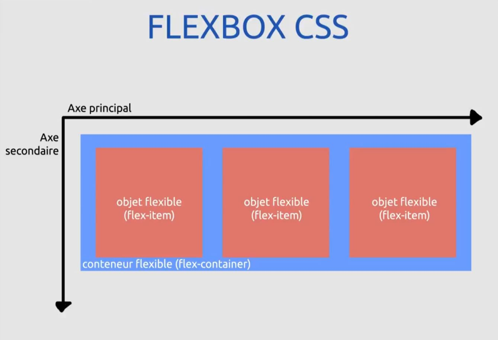
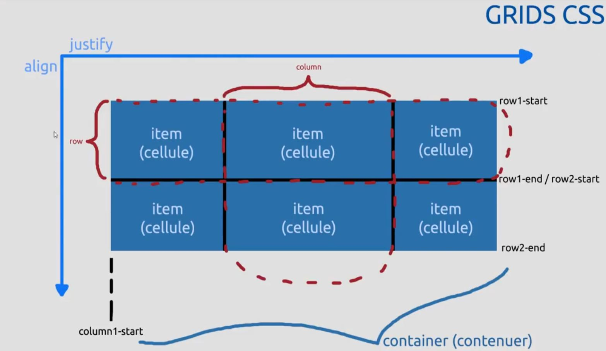

# [24. Grid](https://www.youtube.com/watch?v=wItB9sia1rg)
11-02-2021

Bonjour à tous et bienvenue sur cette séance numéro 24 sur html css où nous allons aborder les grilles ou le terme anglais the grid qui vient et propose en tout cas une autre manière de positionner nos éléments que flexbox que nous avions vu dans la vidéo précédente.

Je vous avais expliqué que flexbox s'utilisait principalement pour des détails d'un design càd des petites parties d'accord de notre design, de notre site web tandis que grid a été conçu pour travailler vraiment sur des grosses portions en général d'un design ce qu'on appelle le gabarit.

Le gabarit ça va être quoi ? c'est ce qui va composer par exemple l'en-tête d'un site, le pied de page, le menu ce genre de choses et à l'intérieur de cette grosse portions nous pourrons éventuellement avoir des éléments mis sous forme de flex d'accord en flexbox pour pouvoir gérer de manière flexible des éléments à l'intérieur.

Donc on peut évidemment et c'est tout l'intérêt associer les deux méthodes d'accord par la suite pour mettre en place tout ça.

Alors petite mise en garde au moment où je fais cette vidéo l'utilisation de grid n'est pas forcément prise en charge partout ça veut dire que toutes les propriétés ne sont pas forcément valide partout et tous les navigateurs ne prennent pas forcément tout en charge non plus donc c'est un petit peu une vidéo que nous faisons en avance de ce qui va arriver au niveau html d'accord au niveau du web avec css mais au moins quand ce sera vraiment pris en charge à 100% partout vous aurez déjà connaissance de cette technique là et vous pourrez parfaitement l'appliquer partout donc si vous voyez parmi les choses que je vais vous montrer ou les choses que vous allez réutiliser ou tester, qui ont des résultats qui ne marchent pas, des effets qui ne ne fonctionnent pas il ne faudra pas trop poser de questions c'est qu'à priori votre navigateur en question ou certaines propriétés particulières ne sont pas prises en charge.

Donc je tenais à le préciser puisque cette vidéo est vraiment un peu en avance par rapport à son temps faut savoir que le grid n'était vraiment pas bien pris en charge au début de l'année 2018 donc là on n'arrive pas loin de l'année 2019 donc on a évidemment une meilleure prise en charge qu'au mois de janvier mais il peut y avoir encore certaines choses qui ne sont pas bien prises en charge.

Alors comme pour la vidéo flexbox je vais essayer de vous montrer un maximum de choses je ne pourrai pas tout montrer évidemment puisqu'il y a énormément des centaines et centaines de contextes différents d'application de cette méthode là don on essaiera de montrer un maximum et je vais essayer surtout que vous ayez des exemples et des résultats visuels que vous puissiez voir effectivement l'effet des propriétés que nous allons voir.
```html
<!DOCTYPE html>
<html lang="fr">
<head>
	<meta charset="UTF-8">
	<title>Grilles CSS</title>
	<link rel="stylesheet" href="style.css">
</head>
<body>
	<div class="container">
		<div class="item">A</div>
		<div class="item">B</div>
		<div class="item">C</div>
		<div class="item">D</div>
		<div class="item">E</div>
		<div class="item">F</div>
		<div class="item">G</div>
		<div class="item">H</div>
	</div>
</body>
</html>
```
Grosso modo nous avons donc ici et ça on le verra par rapport à un schéma que je vais vous montrer juste après un conteneur d'accord donc un "container" qu'il y aura ici l'ensemble de nos éléments et plusieurs éléments divers pour lequel j'ai mit une lettre pour chacun d'accord qui sont nos items donc nos objets.
```css
	/*
		CONTAINER :	display
					grid-template-columns ; grid-template-rows ; grid-template-area ; grid-template 
					justify-content ; align-content ; place-content ; justify-items ; align-items; place-items
					grid-column-gap ; grid-row-gap ; (grid-)gap
					grid-auto-columns ; grid-auto-rows ; grid-auto-flow
					grid
		
		
		ITEM :		grid-column ; grid-row ; grid-area
					grid-column-start ; grid-column-end ; grid-row-start ; grid-row-end
					justify-self ; align-self ; place-self
	
	*/
	
	body
	{
		background-color:#EEE;
	}

	.container
	{
		border:2px dashed #aa5230;
		height:500px;
		width:800px;
	}
	
	.item
	{
		border:1px solid #221fb3;
		background-color:#386ccc;
		color:#FFF;
		font-weight:bolder;
		padding:10px;
	}
```
```txt
	+---------------------------------------------------+
	| A													|
	+---------------------------------------------------+
	| B 												|
	+---------------------------------------------------+
	| C													|
	+---------------------------------------------------+
	| D													|
	+---------------------------------------------------+
	| E													|
	+---------------------------------------------------+
	| F													|
	+---------------------------------------------------+
	:													:
	:													:
	:													:
	:													:
	.....................................................
```
A partir de là j'applique un petit effet très rapide en css en plus d'un petit fond gris mais ça peu importe, le conteneur a une bordure orange, a une certaine hauteur, une certaine largeur prédéfinie.
```css
	.container
	{
		border:2px dashed #aa5230;
		height:500px;
		width:800px;
	}
```
Et les objets auront donc une couleur bleu donc avec un texte en blanc, un texte en gras et une petite marge interne.
```css
	.item
	{
		border:1px solid #221fb3;
		background-color:#386ccc;
		color:#FFF;
		font-weight:bolder;
		padding:10px;
	}
```
On obtient par défaut ce type d'effets visuels d'accord ce rendu ici.
```txt
	+---------------------------------------------------+
	| A													|
	+---------------------------------------------------+
	| B 												|
	+---------------------------------------------------+
	| C													|
	+---------------------------------------------------+
	| D													|
	+---------------------------------------------------+
	| E													|
	+---------------------------------------------------+
	| F													|
	+---------------------------------------------------+
	:													:
	:													:
	:													:
	:													:
	.....................................................
```
Par défaut on a plusieurs `<div>` qui se mettent évidemment les uns à la suite des autres puisque je rappelle que `<div>` est un élément de type bloc par défaut et donc les éléments de type blocs se mettent les uns en dessous des autres par rapport à l'ordre dans les quelles ils sont écrits et définit dans le fichier html.

Voilà, au niveau de grid donc vous allez voir qu'il y a pas mal de similitudes avec flexbox sauf que nous allons travailler sur quelque chose ici de plus général d'accord on ne travaille pas forcément que sur des détails et en plus il est bidimensionnel c'est à dire qu'il va pouvoir travailler à la fois sur les lignes et les colonnes alors que flexbox ne peut travailler que sur l'un ou l'autre d'accord donc ça c'est l'avantage que tire justement cette technique là et vous verrez aussi que ça permet de l'associé par la suite avec flybox donc n'hésitez pas.

On va commencer d'abord très rapidement parce que évidemment cette vidéo va être un peu long parce que plutôt que d'en faire plusieurs j'en ai fait évidemment qu'une seule, une seule vidéo pour que vous ayez tous dessus donc n'hésitez pas à la voir si nécessaire en plusieurs fois, faire des tests entre deux au fur et à mesure voilà ne pas forcément attendre de voir toute la vidéo complète avant de commencer à faire vos propres tests sur vos fichiers.

Vous pouvez couper en plusieurs fois et puis tester en même temps pour bien comprendre les choses.

On va regarder sur des exemples de sites concret justement voir comment fonctionne ce principe d'accord au niveau de galerie. 

On va aller sur la page de Twitch bas par rapport à ma page où je fait mes lives et là on arrive très vite à identifier un système de grille.

Système de grille faut simplement comprendre des lignes et des colonnes d'accord comme on l'aurait dans un tableau, comme on l'aurait dans un logiciel de tableur comme Excel, comme Calk ou ce genre de choses pour mettre tout ça à disposition.

Là on se rend très vite compte qu'on peut par exemple retrouver une ligne, on identifie facilement des colonnes et on voit qu'on peut retrouver par exemple d'autres colonnes à l'intérieur de cette colonne du milieu, vous voyez très vite qu'on peut trouver comme ça plusieurs éléments.
```txt
	+-----------------------------------+
	| Twitch							|
	+-------+---------------+-----------+
	|		|				|			|
	|		|				|			|
	|		|				|			|
	|		|				|			|
	|		|				|			|
	|		|				|			|
	|		|				|			|
	|		|				|			|
	+-------+---------------+-----------+
```
Je ne veux pas ralonger la vidéo mais je voulais vous donner quelques exemples concrets pour que vous puissiez bien vous illustrer ça sur ce site par exemple on voit également très vite d'accord comment on peut identifier des lignes d'accord.
```txt
	+-----------------------------------+
	| Topachat							|
	+-----------------------------------+
	+-----------------------------------+
	|									|
	|									|
	+--------+--------+--------+--------+
	|		 |		  |		   |	    |
	|		 |		  |		   |	    |
	|		 |		  |		   |	    |
	|		 |		  |		   |	    |
	|		 |		  |		   |	    |
	|		 |		  |		   |	    |
	|		 |		  |		   |	    |
	|		 |		  |		   |	    |
	|		 |		  |		   |	    |
	|		 |		  |		   |	    |
	+--------+--------+--------+--------+
```
On peut bien apercevoir les lignes rapidement ok et on voit aussi évidemment les colonnes d'accord, on voit qu'il y a 4 colonnes alors il pourrait y en avoir que deux, on pourrait très bien dire qu'il y a en fait que deux colonnes mais qu' il y a ici deux parties pour chaque colonne.

On peut en imaginer qu'une seule qui est centré mais on peut en imaginer 7 puis beaucoup d'autres aussi.
```txt
	+---------------------------------------------------------------+
	|																|
	|	+-------+		+-------+		+-------+		+-------+	|
	|	|		|		|		|		|		|		|	    |	|
	|	|		|		|		|		|		|		|	    |	|
	|	+-------+		+-------+		+-------+		+-------+	|
	|																|
	+---------------------------------------------------------------+
```
Ici on a tout simplement ici un conteneur flexbox pour le coup qui peut être mit à l'intérieur d'un grid donc d'une ligne de grill et les éléments flexbox sont mis comme ça avec des espaces qui sont bien arrangé comme on a vu par exemple dans la vidéo d'avant donc c'est des choses tout à fait possibles.

Voilà et puis sur ce site là qui est un peu plus un peu plus épurée.
```txt
	+---------------------------+
	| Elementary				|
	|							|
	|	##	##	##	##	##		|
	|							|
	|	##	##	##	##	##		|
	|							|
	|							|
	+---------------------------+
```
Sur ce site là c'est pareil, on arrive facilement à identifier des colonnes, des lignes, etc donc on se rend bien compte que le principe de grid notamment pour les gabarits fonctionnera dans tous les cas puisqu'on va vraiment pouvoir créer comme des lego en fait, on va pouvoir dire exactement comment sont disposés nos éléments sur combien de lignes, combien de colonne, de quelle taille, quel espace, quelle séparation entre chaque etc etc.

Comme pour flexbox on va vraiment pouvoir modifier le comportement de tout ça aussi bien pour le conteneur que les éléments qu'il contient et tout ça on va le regarder par la suite.

On va enlever tout ça on n'en a plus besoin et on va revenir là dessus, on va regarder un petit schéma très rapide que je vous ai fait par rapport à ça alors je remontre vite fait le schéma flexbox qui était assez simple aussi.


<!--
	FLEXBOX CSS
	
	Axe principal
A	+---------------------------------------- >
x	| +--------------------------------------+
e	| | +----------++----------++----------+ |
	| | | Objet	   || Objet	   || Objet	   | |
s	| | | flexible || flexible || flexible | |
e	| | | (flex    || (flex    || (flex    | |
c	| | | -item)   || -item)   || -item)   | |
o	| | +----------++----------++----------+ |
n	| | conteneur flexible (flex-container)	 |
d	| +--------------------------------------+
a	|
i	|
r	|
e	|
	v
-->
Un axe principal d'accord donc la justification se faisait sur cet axe là d'accord ce qui permet par exemple de positionner des éléments ici sur l'horizontale donc les colonnes et l'axe secondaire pour l'alignement donc 'flex-align' qui permettait de jouer sur la verticale donc les lignes en l'occurrence.

Même si on travaille au niveau flexbox que sur une seule des dimensions à la fois ok on avait notre conteneurs et nos différents éléments.

Pour la grille c'est un peu le même principe mais en beaucoup plus évolué.


<!--
	GRIDS CSS
	
	JUSTIFY
A	+---------------------------------------------------------------- >
L	|						COLUMN
I	|		+-----------+-----------+-----------+ row1-start
G	|		| Item		| Item		| Item		|
N	|	ROW	| (cellule)	| (cellule)	| (cellule)	|
	|		|			|			|			|
	|		+-----------+-----------+-----------+ row1-end/row2-start
	|		| Item		| Item		| Item		|
	|		| (cellule)	| (cellule)	| (cellule)	|
	|		|			|			|			|
	|		+-----------+-----------+-----------+ row2-end
	|		:
	|		column1-start
	|
	|		\_______container (conténeur)_______/
	v
-->
On retrouve toujours ce principe de justification en horizontal, alignement en vertical, on a ici tout un ensemble de cellules qui sur cette partie forme ce qu'on appellera une ligne donc 'row' puisqu'on utilisera évidemment des termes anglais au niveau des propriétés css et si je prends plusieurs cellules ici dans la verticale on obtient une colonne pas de problème.

On voit également et ça c'est la petite nouveauté que par exemple la première ligne commence évidemment là (row1-start) et elle se termine évidemment là (row1-end).

Comme les cellules sont collés hé bien évidemment là où s'arrête la première ligne commence la seconde (row1-end/row2-start) et la seconde ligne termine ici (row2-end).

Pour les colonnes c'est la même chose, le début de la colonie 1 et là (column1-start), la fin de la colonne 1 et le début de la colonne 2 etc etc je suis allez assez vite pour montrer ça.

Le conteneur c'est évidemment tout ce qui représenté, tout ce qu'il contient toutes ces différentes cellules donc là on a un conteneur qui est de 2 lignes pour 3 colonnes d'accord dont 6 cellules si vous avez compris un petit peu le principe.

Voilà on reviendra de temps en temps sur le petit schéma si on a besoin d'illustrer par rapport à ça donc j'ai fait un truc très simple, très rapide mais c'est bien d'avoir un petit visuel pour se rendre compte un peu des  choses.

Voilà comment que ça va se passer donc on y va.

On a beaucoup de propriétés à voir je vais évidemment pas forcément toutes vous les détailer parce qu'il en a pas mal qui ne sont pas forcément utile à détailler notamment 'grid' qui n'est pas forcément utile à mon sens en tout cas de vous la détailler complètement, je ne vais pas non plus faire une vidéo de trois heures donc on va essayer d'aller assez vite sur certaines propriétés et prendre plus de temps sur les autres mais que vous ayez quand même un résultat visuel pour que vous puissiez à la fin avoir compris ce principe, le mettre en pratique et plus tard balles utilisées vraiment sur des vrais problème c'est tout l'intérêt.

Première chose, vous voyez j'ai séparé le conteneur (.container) et l'item (.item) d'accord ici et éventuellement si plus tard on veut un terme précis d'ailleurs on peut le faire. Voilà je le met tout de suite parce que des fois on aura besoin de spécifier des choses sur un seul des éléments particulier comme on l'avait déjà fait sur flexbox donc je vais le remettre déjà.
```html
<!DOCTYPE html>
<html lang="fr">
<head>
	<meta charset="UTF-8">
	<title>Grilles CSS</title>
	<link rel="stylesheet" href="style.css">
</head>
<body>
	<div class="container">
		<div class="item iA">A</div>
		<div class="item iB">B</div>
		<div class="item iC">C</div>
		<div class="item iD">D</div>
		<div class="item iE">E</div>
		<div class="item iF">F</div>
		<div class="item iG">G</div>
		<div class="item iH">H</div>
	</div>
</body>
</html>
```
On peut mettre plusieurs classes sur un seul élément, c'est un petit rappel de ce qu'on a vu précédemment, il suffit évidemment de les séparer par des espaces, ça vous le savez parce qu'on l'a déjà vu avant ok.
```css
	/*
		CONTAINER :	display
					grid-template-columns ; grid-template-rows ; grid-template-area ; grid-template 
					justify-content ; align-content ; place-content ; justify-items ; align-items; place-items
					grid-column-gap ; grid-row-gap ; (grid-)gap
					grid-auto-columns ; grid-auto-rows ; grid-auto-flow
					grid
		
		
		ITEM :		grid-column ; grid-row ; grid-area
					grid-column-start ; grid-column-end ; grid-row-start ; grid-row-end
					justify-self ; align-self ; place-self
	
	*/
	
	body
	{
		background-color:#EEE;
	}

	.container
	{
		border:2px dashed #aa5230;
		height:500px;
		width:800px;
	}
	
	.item
	{
		border:1px solid #221fb3;
		background-color:#386ccc;
		color:#FFF;
		font-weight:bolder;
		padding:10px;
	}
```
Donc ça n'a rien changé de toute façon au niveau de l'affichage là parce qu'on applique rien d'autre en particulier.
```txt
	+---------------------------------------------------+
	| A													|
	+---------------------------------------------------+
	| B 												|
	+---------------------------------------------------+
	| C													|
	+---------------------------------------------------+
	| D													|
	+---------------------------------------------------+
	| E													|
	+---------------------------------------------------+
	| F													|
	+---------------------------------------------------+
	:													:
	:													:
	:													:
	:													:
	.....................................................
```
Donc on y va, comment va-t-on utiliser ce système de grille ? on va travailler déjà sur le conteneur.

On va utiliser la fameuse propriété 'display' qu'on connaît bien, ce n'est plus nouveau maintenant sauf qu'au lieu d'avoir une valeur en "flex", on utilisera une valeur en "grid".
```css
	body
	{
		background-color:#EEE;
	}

	.container
	{
		border:2px dashed #aa5230;
		height:500px;
		width:800px;
>		display:grid;
	}
	
	.item
	{
		border:1px solid #221fb3;
		background-color:#386ccc;
		color:#FFF;
		font-weight:bolder;
		padding:10px;
	}
```
Ce que je n'ai pas dit précédemment c'est que dans les cas où ce n'est pas forcément pris en compte par 'internet-explorer' je parle bien d'internet explorer et pas de Edge 10 et supérieur, vous pouvez aussi le noter comme ceci "-ms-grid" d'accord pour avoir les deux disponibles, vous pouvez  noter les deux si vous voulez.
```css
	body
	{
		background-color:#EEE;
	}

	.container
	{
		border:2px dashed #aa5230;
		height:500px;
		width:800px;
>		display:-ms-grid;
	}
	
	.item
	{
		border:1px solid #221fb3;
		background-color:#386ccc;
		color:#FFF;
		font-weight:bolder;
		padding:10px;
	}
```
Nous pour des raisons évidentes puisqu'on est sur firefox on va rester sur "grid" tout simplement et si là j'actualise, pas de changement.
```css
	/*
		CONTAINER :	display
					grid-template-columns ; grid-template-rows ; grid-template-area ; grid-template 
					justify-content ; align-content ; place-content ; justify-items ; align-items; place-items
					grid-column-gap ; grid-row-gap ; (grid-)gap
					grid-auto-columns ; grid-auto-rows ; grid-auto-flow
					grid
		
		
		ITEM :		grid-column ; grid-row ; grid-area
					grid-column-start ; grid-column-end ; grid-row-start ; grid-row-end
					justify-self ; align-self ; place-self
	
	*/
	
	body
	{
		background-color:#EEE;
	}

	.container
	{
		border:2px dashed #aa5230;
		height:500px;
		width:800px;
		display:grid;
	}
	
	.item
	{
		border:1px solid #221fb3;
		background-color:#386ccc;
		color:#FFF;
		font-weight:bolder;
		padding:10px;
	}
```
```txt
	+---------------------------------------------------+
	| A													|
	|													|
	+---------------------------------------------------+
	| B 												|
	|													|
	+---------------------------------------------------+
	| C													|
	|													|
	+---------------------------------------------------+
	| D													|
	|													|
	+---------------------------------------------------+
	| E													|
	|													|
	+---------------------------------------------------+
	| F													|
	|													|
	+---------------------------------------------------+
```
Si j'actualise pas de changement à part ces petits comportement par défaut au niveau du remplissage mais on va très vite l'expliquer par la suite.

On a vraiment que ça qui change mais sinon au niveau comportement comme on n'a rien spécifié particulier pour le moment on a vraiment un comportement par défaut donc ça et on verra pourquoi là ça a changé au niveau du remplissage.

On va commencer par une première chose c'est à dire définir les colonnes d'accord et les lignes de notre contenu et là ça va être très très simple en fonction de ce que vous voulez d'accord donc là on voit qu'on a encore une fois huit éléments d'accord.

J'aurais pu mettre 1 2 3 jusqu'à 8 si je voulais mais j'ai mis des lettres à la place peu importe et on va pouvoir les organiser par rapport à ça.

Admettons je vais obtenir ce schéma là.


<!--
	GRIDS CSS
	
	JUSTIFY
A	+---------------------------------------------------------------- >
L	|						COLUMN
I	|		+-----------+-----------+-----------+ row1-start
G	|		| Item		| Item		| Item		|
N	|	ROW	| (cellule)	| (cellule)	| (cellule)	|
	|		|			|			|			|
	|		+-----------+-----------+-----------+ row1-end/row2-start
	|		| Item		| Item		| Item		|
	|		| (cellule)	| (cellule)	| (cellule)	|
	|		|			|			|			|
	|		+-----------+-----------+-----------+ row2-end
	|		:
	|		column1-start
	|
	|		\_______container (conténeur)_______/
	v
-->
D'accord 2 lignes, 3 colonnes alors ça va être un peu bizarre parce ce qu on a 8 éléments.

On pourrait se dire tiens c'est curieux, on va partir du principe que nous on veut travailler, changer le comportement de 6 éléments d'accord parce qu'on veut seulement 6 cellules et le reste ce sera considéré comme étant en dehors de notre grille et là on verrait que là ça aura une importance par rapport à certaines propriétés.

On y va ici donc je reprends ça du coup "grid-template-columns" et là j'ai été obligé de noter toutes les propriétés pour être sûr de ne rien oublier sur la vidéo parce que j'ai pas envie de terminer ma vidéo qui va prendre certainement une heure facile et à la fin me rendre compte que j'ai oublié la moitié des choses donc j'ai noté ce que je voulais vous dire parce que je n'aurais pas certainement eu tout en tête.
```css
	/*
		CONTAINER :	display
					grid-template-columns ; grid-template-rows ; grid-template-area ; grid-template 
					justify-content ; align-content ; place-content ; justify-items ; align-items; place-items
					grid-column-gap ; grid-row-gap ; (grid-)gap
					grid-auto-columns ; grid-auto-rows ; grid-auto-flow
					grid
		
		
		ITEM :		grid-column ; grid-row ; grid-area
					grid-column-start ; grid-column-end ; grid-row-start ; grid-row-end
					justify-self ; align-self ; place-self
	
	*/
	
	body
	{
		background-color:#EEE;
	}

	.container
	{
		border:2px dashed #aa5230;
		height:500px;
		width:800px;
		display:grid;
>		grid-template-columns:;
	}
	
	.item
	{
		border:1px solid #221fb3;
		background-color:#386ccc;
		color:#FFF;
		font-weight:bolder;
		padding:10px;
	}
```
Alors pour ça c'est bon voilà comment ça va se passer.

Au niveau des valeurs ici nous allons pouvoir prendre pas mal de choses, on va pouvoir noter des valeurs fixe en pixels, on pourra noter les valeurs évidemment en %, des valeurs automatiques et des valeurs un peu nouvelle aussi que nous allons voir ici avec l'écrit.

On va commencer par le plus simple en disant que je rappelle qu'on veut ce schéma là d'accord on veut 6 cellules.


<!--
A	+---------------------------------------------------------------- >
L	|						COLUMN
I	|		+-----------+-----------+-----------+ row1-start
G	|		| Item		| Item		| Item		|
N	|	ROW	| (cellule)	| (cellule)	| (cellule)	|
	|		|			|			|			|
	|		+-----------+-----------+-----------+ row1-end/row2-start
	|		| Item		| Item		| Item		|
	|		| (cellule)	| (cellule)	| (cellule)	|
	|		|			|			|			|
	|		+-----------+-----------+-----------+ row2-end
	|		:
	|		column1-start
	|
	|		\_______container (conténeur)_______/
	v
-->
Donc on va commencer par leur donner une taille fixe donc on va commencer par ça.

Alors il faut faire gaffe parce que j'ai mis une largeur de 800 px donc je ne peux pas mettre n'importe quoi donc on va mettre "100px 100px 100px" 
```css
	.container
	{
>		grid-template-columns:100px 100px 100px;
	}
```
Et éventuellement on va préciser le nombre de lignes, on n'est pas obligé, on pourrait juste préciser des colonnes mais comme on a un schéma très précis on a choisi vraiment là un emplacement particulier donc on va le faire et on va mettre "150px 150px" pour la deuxième.
```css
	.container
	{
>		grid-template-columns:100px 100px 100px;
>		grid-template-rows:150px 150px;
	}
```
Donc il faut lire en termes de colonne ça `grid-template-columns:100px 100px 100px;` c'est 3 colonnes.

Et ça c'est 2 lignes, `grid-template-rows:150px 150px;`

Ici 2*3=6 donc ça on obtient bien cette représentation qui est ici si je suit mon schéma.

Je vais actualiser et voilà ce que nous obtenons.
```css
	/*
		CONTAINER :	display
					grid-template-columns ; grid-template-rows ; grid-template-area ; grid-template 
					justify-content ; align-content ; place-content ; justify-items ; align-items; place-items
					grid-column-gap ; grid-row-gap ; (grid-)gap
					grid-auto-columns ; grid-auto-rows ; grid-auto-flow
					grid
		
		
		ITEM :		grid-column ; grid-row ; grid-area
					grid-column-start ; grid-column-end ; grid-row-start ; grid-row-end
					justify-self ; align-self ; place-self
	
	*/
	
	body
	{
		background-color:#EEE;
	}

	.container
	{
		border:2px dashed #aa5230;
		height:500px;
		width:800px;
>		display:grid;
>		grid-template-columns:100px 100px 100px;
>		grid-template-rows:150px 150px;
	}
	
	.item
	{
		border:1px solid #221fb3;
		background-color:#386ccc;
		color:#FFF;
		font-weight:bolder;
		padding:10px;
	}
```
Je vais actualiser et voilà ce que nous obtenons.
```txt
	+-------+-------+-------+...............+
	| A		| B		| C		|				:
	|		|		|		|				:
	|		|		|		|				:
	|		|		|		|				:
	+-------+-------+-------+				:
	| D		| E		| F		|				:
	|		|		|		|				:
	|		|		|		|				:
	|		|		|		|				:
	+-------+-------+-------+				:
	| G		| H		|						:
	|		|		|						:
	|		|		|						:
	|		|		|						:
	|		|		|						:
    +-------+-------+.......................+
```
Et là on arrive très vite à se rendre compte de ce qui se passe alors où est la grille ? d'accords la réelle grille que nous avons faites ? et bien elle est ici alors c'est tout ça bien évidemment parce que vous voyez que le conteneur est encadré en orange et on voit bien que tout est dedans du coup on peut dire bah la grille c'est tout ça en fait mais en réalité la grille que nous avons explicitement positionner elle est là, elle va de A à F.
```txt
	+-------+-------+-------+
	| A		| B		| C		|
	|		|		|		|
	|		|		|		|
	|		|		|		|
	+-------+-------+-------+
	| D		| E		| F		|
	|		|		|		|
	|		|		|		|
	|		|		|		|
	+-------+-------+-------+
```
Les éléments G et H sont dits en dehors ils sont en fait des cellules de la grille qui ont été automatiquement générée par le navigateur d'accord.

Nous on a choisi de définir ceci d'ailleurs vous voyez qu'elles ont effectivement une hauteur égale, une hauteur que nous avons définie qui est la hauteur de 150 pixels d'accord chacune et là.
```txt
	+-------+-------+
	| G		| H		|
	|		|		|
	|		|		|
	|		|		|
	|		|		|
	+-------+-------+
```
Là vous voyez qu'elles sont un peu plus grande parce qu'il a simplement pris l'espace qui restait dans le conteneur.

Et ça on verra, on va pouvoir faire des choses aussi sur ce qui n'est pas considéré comme faisant partie de la grille explicitement définie par nous mêmes au niveau du CSS, on aura des propriétés pour travailler là dessus.

Pour le moment on va juste s'occupé de ceux là surtout.

Voilà une première manière de faire par rapport à ça, on peut également très bien dire je fais en automatique, je vous monte rapidement.
```css
	/*
		CONTAINER :	display
					grid-template-columns ; grid-template-rows ; grid-template-area ; grid-template 
					justify-content ; align-content ; place-content ; justify-items ; align-items; place-items
					grid-column-gap ; grid-row-gap ; (grid-)gap
					grid-auto-columns ; grid-auto-rows ; grid-auto-flow
					grid
		
		
		ITEM :		grid-column ; grid-row ; grid-area
					grid-column-start ; grid-column-end ; grid-row-start ; grid-row-end
					justify-self ; align-self ; place-self
	
	*/
	
	body
	{
		background-color:#EEE;
	}

	.container
	{
		border:2px dashed #aa5230;
		height:500px;
		width:800px;
		display:grid;
>		grid-template-columns:auto auto auto;
		grid-template-rows:150px 150px;
	}
	
	.item
	{
		border:1px solid #221fb3;
		background-color:#386ccc;
		color:#FFF;
		font-weight:bolder;
		padding:10px;
	}
```
```txt
	+------------+------------+------------+
	| A			 | B		  | C		   |
	|			 |			  |			   |
	|			 |			  |			   |
	|			 |			  |			   |
	+------------+------------+------------+
	| D 		 | E		  | F		   |
	|			 |			  |			   |
	|			 |			  |			   |
	|			 |			  |			   |
	+------------+------------+------------+
	| G			 | H		  |			   :
	|			 |			  |			   :
	|			 |			  |			   :
	|			 |			  |			   :
	|			 |			  |			   :
	|			 |			  |			   :
	+------------+------------+............+
```
Ici il se passera ça et automatiquement tu règles en fonction de l'espace que tu as choisi plutôt sympa à connaître.

On peut évidemment mélanger les deux, on peut mélanger plusieurs notation différente pas de problème.
```css
	/*
		CONTAINER :	display
					grid-template-columns ; grid-template-rows ; grid-template-area ; grid-template 
					justify-content ; align-content ; place-content ; justify-items ; align-items; place-items
					grid-column-gap ; grid-row-gap ; (grid-)gap
					grid-auto-columns ; grid-auto-rows ; grid-auto-flow
					grid
		
		
		ITEM :		grid-column ; grid-row ; grid-area
					grid-column-start ; grid-column-end ; grid-row-start ; grid-row-end
					justify-self ; align-self ; place-self
	
	*/
	
	body
	{
		background-color:#EEE;
	}

	.container
	{
		border:2px dashed #aa5230;
		height:500px;
		width:800px;
		display:grid;
>		grid-template-columns:auto 150px auto;
		grid-template-rows:150px 150px;
	}
	
	.item
	{
		border:1px solid #221fb3;
		background-color:#386ccc;
		color:#FFF;
		font-weight:bolder;
		padding:10px;
	}
```
```txt
	+-------------+---------+------------+
	| A			  | B	    | C		     |
	|			  |		    |			 |
	|			  |		    |			 |
	|			  |		    |			 |
	+-------------+---------+------------+
	| D 		  | E	    | F		     |
	|			  |		    |			 |
	|			  |		    |			 |
	|			  |		    |			 |
	+-------------+---------+------------+
	| G			  | H	    |			 :
	|			  |		    |			 :
	|			  |		    |			 :
	|			  |		    |			 :
	|			  |		    |			 :
	|			  |		    |			 :
	+-------------+---------+............+
```
Là où c'est intéressant c'est ce qui en automatique va se régler et ce qui ne l'est pas sera là.

Là l'automatique ne se règle pas (A) puisqu'il choisit en fait sur le reste et il calcule en fait une valeur fixe au niveau du navigateur donc là si j'arrive à cette largeur, automatiquement on aperçoit un scrolling obligatoire d'ailleurs on a aussi un scrolling vertical.
```txt
	+-------------+---------+-----#
	| A			  | B	    | C	  #
	|			  |		    |	  #
	|			  |		    |	  #
	|			  |		    |	  #
	+-------------+---------+-----#
	| D 		  | E	    | F	  #
	|			  |		    |	  #
	|			  |		    |	  #
	|			  |		    |	  #
	+-------------+---------+-----#
	| G			  | H	    |	  #
	|			  |		    |	  #
	|			  |		    |	  #
	###############################
```
Si on veut maintenant des choses beaucoup plus flexible on va pouvoir parler non pas en calcul fixe gérer automatiquement par le navigateur mais de calcul dynamique géré par navigateur, et pour ça nous avons quelque chose d'intéressant qui est cette notation "1fr 1fr 1fr".
```css
	/*
		CONTAINER :	display
					grid-template-columns ; grid-template-rows ; grid-template-area ; grid-template 
					justify-content ; align-content ; place-content ; justify-items ; align-items; place-items
					grid-column-gap ; grid-row-gap ; (grid-)gap
					grid-auto-columns ; grid-auto-rows ; grid-auto-flow
					grid
		
		
		ITEM :		grid-column ; grid-row ; grid-area
					grid-column-start ; grid-column-end ; grid-row-start ; grid-row-end
					justify-self ; align-self ; place-self
	
	*/
	
	body
	{
		background-color:#EEE;
	}

	.container
	{
		border:2px dashed #aa5230;
		height:500px;
		width:800px;
		display:grid;
>		grid-template-columns:1fr 1fr 1fr;
		grid-template-rows:150px 150px;
	}
	
	.item
	{
		border:1px solid #221fb3;
		background-color:#386ccc;
		color:#FFF;
		font-weight:bolder;
		padding:10px;
	}
```
Le fameux "fr" qui désigne en fait un espace libre un free space d'accord comme là j'ai mit trois fois 1 pour chacun, chaque colonne donc il y en a 3, vont prendre chacune la même portion d'accord la même proportion donc 1/3 1/3 1/3.

Donc là le navigateur va calculer ça de manière dynamique et voyez d'ailleurs que les cellules qui ne font pas partie explicitement de la grille que nous avons définie sont également coupées de la même manière sauf celle-là "I" qui du coup est absente mais ça c'est normal.
```txt
	+------------+------------+------------+
	| A			 | B		  | C		   |
	|			 |			  |			   |
	|			 |			  |			   |
	|			 |			  |			   |
	+------------+------------+------------+
	| D 		 | E		  | F		   |
	|			 |			  |			   |
	|			 |			  |			   |
	|			 |			  |			   |
	+------------+------------+------------+
	| G			 | H		  |			   :
	|			 |			  |			   :
	|			 |			  |			   :
	|			 |			  |			   :
	+------------+------------+............+
```
Et là on va pouvoir donc gérer cette partie là.

Alors oui on n'a pas de flexibilité mais ça c'est normal, si vous voyez qu'il y a le scroll quand on redimentionne la fenêtre c'est pourquoi ? tout simplement parce que j'ai défini ici des tailles.
```css
	.container
	{
		height:500px;
		width:800px;
	}
```
On peut l'enlever pour le moment et comme ça on se rend bien compte de ce qui se passe.
```css
	/*
		CONTAINER :	display
					grid-template-columns ; grid-template-rows ; grid-template-area ; grid-template 
					justify-content ; align-content ; place-content ; justify-items ; align-items; place-items
					grid-column-gap ; grid-row-gap ; (grid-)gap
					grid-auto-columns ; grid-auto-rows ; grid-auto-flow
					grid
		
		
		ITEM :		grid-column ; grid-row ; grid-area
					grid-column-start ; grid-column-end ; grid-row-start ; grid-row-end
					justify-self ; align-self ; place-self
	
	*/
	
	body
	{
		background-color:#EEE;
	}

	.container
	{
		border:2px dashed #aa5230;
>		/*height:500px;
>		width:800px;*/
		display:grid;
		grid-template-columns:1fr 1fr 1fr;
		grid-template-rows:150px 150px;
	}
	
	.item
	{
		border:1px solid #221fb3;
		background-color:#386ccc;
		color:#FFF;
		font-weight:bolder;
		padding:10px;
	}
```
```txt
	+------------+------------+------------+
	| A			 | B		  | C		   |
	|			 |			  |			   |
	|			 |			  |			   |
	|			 |			  |			   |
	+------------+------------+------------+
	| D 		 | E		  | F		   |
	|			 |			  |			   |
	|			 |			  |			   |
	|			 |			  |			   |
	+------------+------------+------------+
	| G			 | H		  |			   :
	|			 |			  |			   :
	+......................................+
```
Il faudra que j'enlève pour que vous ayez le résultat attendus assez visuel.

Voilà ce que nous avons ici pour cette partie là alors là on voit qu'on a répété quelque chose "1fr 1fr 1fr" admettons que je veuille que ma colonne du milieu soit un peu plus importante que celles sur les côtés.

On pourrait par exemple imaginer un site avec toute une partie à gauche, une partie à droite qui font les mêmes tailles mais qui sont beaucoup plus petites que le centre où il y a les articles, le texte principal.

On peut tout simplement faire ceci.
```css
	.container
	{
		border:2px dashed #aa5230;
		/*height:500px;
		width:800px;*/
		display:grid;
>		grid-template-columns:1fr 2fr 1fr;
		grid-template-rows:150px 150px;
	}
```
Et comment ça fonctionne au niveau réflexion ? comme ont réfléchi à ça ? c'est de se dire là on fait la somme en fait des nombres que nous avons ici "1fr 2fr 1fr", des chiffres ça nous donne donc la part totale donc là on a 4 emplacements de libres et lui au centre "2fr" en occupe 2 sur 4 donc il occupe la moitié et sur les cotés "1fr" ils occupent 1/4 et 1/4 chacun d'accord donc là si j'actualise on obtient ça.
```css
	/*
		CONTAINER :	display
					grid-template-columns ; grid-template-rows ; grid-template-area ; grid-template 
					justify-content ; align-content ; place-content ; justify-items ; align-items; place-items
					grid-column-gap ; grid-row-gap ; (grid-)gap
					grid-auto-columns ; grid-auto-rows ; grid-auto-flow
					grid
		
		
		ITEM :		grid-column ; grid-row ; grid-area
					grid-column-start ; grid-column-end ; grid-row-start ; grid-row-end
					justify-self ; align-self ; place-self
	
	*/
	
	body
	{
		background-color:#EEE;
	}

	.container
	{
		border:2px dashed #aa5230;
		/*height:500px;
		width:800px;*/
		display:grid;
>		grid-template-columns:1fr 2fr 1fr;
		grid-template-rows:150px 150px;
	}
	
	.item
	{
		border:1px solid #221fb3;
		background-color:#386ccc;
		color:#FFF;
		font-weight:bolder;
		padding:10px;
	}
```
```txt
	+------------+--------------------+------------+
	| A			 | B		          | C		   |
	|			 |			          |			   |
	|			 |			          |			   |
	|			 |			          |			   |
	+------------+--------------------+------------+
	| D 		 | E		          | F		   |
	|			 |			          |			   |
	|			 |			          |			   |
	|			 |			          |			   |
	+------------+--------------------+------------+
	| G			 | H		          |			   :
	|			 |			          |			   :
	+..............................................+
```
Et paris c'est calculé automatiquement d'accord peu importe la largeur que vous allez avoir, la colonne au centre occupera toujours 2/4 de la largeur qui est actuellement disponibles et eux occuperont toujours 1/4.
```txt
	+-------+----------+--------+
	| A		| B		   | C		|
	|		|		   |		|
	|		|		   |		|
	|		|		   |		|
	+-------+----------+--------+
	| D 	| E		   | F	    |
	|		|		   |		|
	|		|		   |		|
	|		|		   |		|
	+-------+----------+--------+
	| G		| H		   |		:
	|		|		   |		:
	+...........................+
```
Ca ne changera pas ce sera toujours calculé comme ça donc là on a bien un calcul dynamique pour le coup, ce n'est plus quelque chose de fixe comme on l'avait tout à l'heure alors si éventuellement on a comme j'ai fait tout à l'heure là quand on a "1fr" d'accord comme ça qui se répète on peut utiliser une petite commande de répétition pour éviter de devoir le taper à chaque fois comme là on a trois fois "1fr" je peux utiliser la valeur "repeat()" qui va répeter 3 fois "1fr" et vous pouvez répéter ça comme ça.
```css
	/*
		CONTAINER :	display
					grid-template-columns ; grid-template-rows ; grid-template-area ; grid-template 
					justify-content ; align-content ; place-content ; justify-items ; align-items; place-items
					grid-column-gap ; grid-row-gap ; (grid-)gap
					grid-auto-columns ; grid-auto-rows ; grid-auto-flow
					grid
		
		
		ITEM :		grid-column ; grid-row ; grid-area
					grid-column-start ; grid-column-end ; grid-row-start ; grid-row-end
					justify-self ; align-self ; place-self
	
	*/
	
	body
	{
		background-color:#EEE;
	}

	.container
	{
		border:2px dashed #aa5230;
		/*height:500px;
		width:800px;*/
		display:grid;
>		grid-template-columns:repeat(3, 1fr);
		grid-template-rows:150px 150px;
	}
	
	.item
	{
		border:1px solid #221fb3;
		background-color:#386ccc;
		color:#FFF;
		font-weight:bolder;
		padding:10px;
	}
```
```txt
	+------------+--------------------+------------+
	| A			 | B		          | C		   |
	|			 |			          |			   |
	|			 |			          |			   |
	|			 |			          |			   |
	+------------+--------------------+------------+
	| D 		 | E		          | F		   |
	|			 |			          |			   |
	|			 |			          |			   |
	|			 |			          |			   |
	+------------+--------------------+------------+
	| G			 | H		          |			   :
	|			 |			          |			   :
	+..............................................+
```
C'est simplement une autre manière de noter plutôt que de noter "1fr" "1fr" "1fr" autant de fois que nécessaire, vous mettez ça "repeat(3, 1fr)".

Si on voulait 5 colonnes, on mettra ça "repeat(5, 1fr)" sur deux lignes et là voyez le changement est directe d'accord.
```css
	/*
		CONTAINER :	display
					grid-template-columns ; grid-template-rows ; grid-template-area ; grid-template 
					justify-content ; align-content ; place-content ; justify-items ; align-items; place-items
					grid-column-gap ; grid-row-gap ; (grid-)gap
					grid-auto-columns ; grid-auto-rows ; grid-auto-flow
					grid
		
		
		ITEM :		grid-column ; grid-row ; grid-area
					grid-column-start ; grid-column-end ; grid-row-start ; grid-row-end
					justify-self ; align-self ; place-self
	
	*/
	
	body
	{
		background-color:#EEE;
	}

	.container
	{
		border:2px dashed #aa5230;
		/*height:500px;
		width:800px;*/
		display:grid;
>		grid-template-columns:repeat(5, 1fr);
		grid-template-rows:150px 150px;
	}
	
	.item
	{
		border:1px solid #221fb3;
		background-color:#386ccc;
		color:#FFF;
		font-weight:bolder;
		padding:10px;
	}
```
```txt
	+-----------+-----------+------------+-----------+-----------+
	| A			| B		 	| C		     | D		 | E		 |
	|			|			|			 | 		     |		     |
	|			|			|			 |  		 |		     |
	|			|			|			 |  		 |		     |
	|			|			|			 |  		 |		     |
	+-----------+-----------+------------+-----------+-----------+
	| F			| G		 	| H		     |
    |			|			|			 |
    |			|			|			 |
    |			|			|			 |
    |			|			|			 |
    +-----------+-----------+------------+
```
On a nos cinq colonnes, nos deux lignes donc tout s'adapte en fonction par rapport à ça et le redimentionnement.

C'est important de le voir.

On va rester sur 3, on va garder comme ça: repeat(3, 1fr).
```css
	/*
		CONTAINER :	display
					grid-template-columns ; grid-template-rows ; grid-template-area ; grid-template 
					justify-content ; align-content ; place-content ; justify-items ; align-items; place-items
					grid-column-gap ; grid-row-gap ; (grid-)gap
					grid-auto-columns ; grid-auto-rows ; grid-auto-flow
					grid
		
		
		ITEM :		grid-column ; grid-row ; grid-area
					grid-column-start ; grid-column-end ; grid-row-start ; grid-row-end
					justify-self ; align-self ; place-self
	
	*/

	body
	{
		background-color:#EEE;
	}

	.container
	{
		border:2px dashed #aa5230;
		/*height:500px;
		width:800px;*/
		display:grid;
>		grid-template-columns:repeat(3, 1fr);
		grid-template-rows:150px 150px;
	}
	
	.item
	{
		border:1px solid #221fb3;
		background-color:#386ccc;
		color:#FFF;
		font-weight:bolder;
		padding:10px;
	}
```
```txt
	+------------+------------+------------+
	| A			 | B		  | C		   |
	|			 |			  |			   |
	|			 |			  |			   |
	|			 |			  |			   |
	+------------+------------+------------+
	| D 		 | E		  | F		   |
	|			 |			  |			   |
	|			 |			  |			   |
	|			 |			  |			   |
	+------------+------------+------------+
	| G			 | H		  |			   :
	|			 |			  |			   :
	+......................................+
```
G et H évidemment ne sont pas impactés je rappelle par le choix de la hauteur 250 pixels parce que ça ne fait pas partie de ce que nous avons définit ok.

Donc on a vu ça.
```css
	CONTAINER :	display
				grid-template-columns ; grid-template-rows ;
```			
Et maintenant,
```css
				grid-auto-columns ; grid-auto-rows ;
```
On va du coup passé directement à ces petites choses là parce que ça rejoint un peu ça. Tout ce qui n'est pas défini explicitement on va pouvoir l'adapter avec ça et le nom l'indique bien 'grid-auto-columns' ça veut dire de choisir automatiquement d'accord les dimensions des colonnes non définies explicitement.

'grid-auto-rows' ça c'est la même chose pour les lignes et ça ce sera pour l'ordre dans lequel des éléments s'enchaînent à la suite des autres. Est-ce qu'ils s'enchaînent par colonnes ou est-ce qu'il s'enchaînent par lignes mais on expliquera ça un petit peu plus en détail tout à l'heure.

Donc là comment je fais pour indiquer que certaines lignes ne font pas partie de ce que nous avons explicitement définis ? on peut également pour le coup leur donner quelque chose en faisant cette propriété 'grid-auto-rows' et je lui dis que tout ce qui n'a pas été définie par moi explicitement je veux que ça fasse quand même 100 pixels en hauteur et là voilà.
```css
	/*
		CONTAINER :	display
					grid-template-columns ; grid-template-rows ; grid-template-area ; grid-template 
					justify-content ; align-content ; place-content ; justify-items ; align-items; place-items
					grid-column-gap ; grid-row-gap ; (grid-)gap
					grid-auto-columns ; grid-auto-rows ; grid-auto-flow
					grid
		
		
		ITEM :		grid-column ; grid-row ; grid-area
					grid-column-start ; grid-column-end ; grid-row-start ; grid-row-end
					justify-self ; align-self ; place-self
	
	*/

	body
	{
		background-color:#EEE;
	}

	.container
	{
		border:2px dashed #aa5230;
		/*height:500px;
		width:800px;*/
		display:grid;
		grid-template-columns:repeat(3, 1fr);
		grid-template-rows:150px 150px;
>		grid-auto-rows:100px;
	}
	
	.item
	{
		border:1px solid #221fb3;
		background-color:#386ccc;
		color:#FFF;
		font-weight:bolder;
		padding:10px;
	}
```
```txt
	+------------+------------+------------+
	| A			 | B		  | C		   |
	|			 |			  |			   |
	|			 |			  |			   |
	|			 |			  |			   |
	+------------+------------+------------+
	| D 		 | E		  | F		   |
	|			 |			  |			   |
	|			 |			  |			   |
	|			 |			  |			   |
	+------------+------------+------------+
	| G			 | H		  |			   :	\
	|			 |			  |			   :	| 100px
	|			 |			  |			   :	/
	+......................................+
```
Voilà on aura les 100 pixels de choisi dans tous les cas.

Comme ça vous pouvez vraiment gérer ce qui est en dehors et y compris des cellules qui sont implicitement créer parce en bas à droite en fait c'est une cellule (#) même si on ne voit pas de couleurs qui a été créée. Vous voyez bien qu'ici même si c'est un espace vide, elle fait quand même partie de cette de cette section là.
```txt
	A|B|C
	D|E|F
	G|H|#
```
Donc on peut également là (#) gérer.

On peut gérer bien sûr pareil pour les colonnes mais pour gagner du temps, je ne vais pas forcément vous montrer en détail parce que je pense que vous avez compris le principe c'est exactement pareil pour la colonne.

Tous qui sera colonnes nom explicite, explicitées avec 'grid-template-columns:repeat(3, 1fr);' on pourra gérer autre chose également avec 'grid-auto-columns'

Pour 'grid-auto-flow' alors là je ne sais pas si on verra bien visuellement ce que ça peut donner (apparemment rien).
```css
	/*
		CONTAINER :	display
					grid-template-columns ; grid-template-rows ; grid-template-area ; grid-template 
					justify-content ; align-content ; place-content ; justify-items ; align-items; place-items
					grid-column-gap ; grid-row-gap ; (grid-)gap
					grid-auto-columns ; grid-auto-rows ; grid-auto-flow
					grid
		
		
		ITEM :		grid-column ; grid-row ; grid-area
					grid-column-start ; grid-column-end ; grid-row-start ; grid-row-end
					justify-self ; align-self ; place-self
	
	*/

	body
	{
		background-color:#EEE;
	}

	.container
	{
		border:2px dashed #aa5230;
		/*height:500px;
		width:800px;*/
		display:grid;
		grid-template-columns:repeat(3, 1fr);
		grid-template-rows:150px 150px;
>		grid-auto-flow:row;
	}
	
	.item
	{
		border:1px solid #221fb3;
		background-color:#386ccc;
		color:#FFF;
		font-weight:bolder;
		padding:10px;
	}
```
```txt
	+------------+------------+------------+
	| A			 | B		  | C		   |
	|			 |			  |			   |
	|			 |			  |			   |
	|			 |			  |			   |
	+------------+------------+------------+
	| D 		 | E		  | F		   |
	|			 |			  |			   |
	|			 |			  |			   |
	|			 |			  |			   |
	+------------+------------+------------+
	| G			 | H		  |			   :
	|			 |			  |			   :
	+......................................+
```
Ca ne change rien mais si vous voulez si on a par exemple des éléments libres d'accord les éléments qui ne font pas partie de ce que nous avons définies explicitement vont s'empiler en ligne donc si on met cette valeur là 'grid-auto-flow:row;' d'accord et si on met en colonne 'grid-auto-flow:column;' ils vont s'empiler plus tôt par colonnes si on a par exemple plusieurs emplacements de libres en colonnes.
```css
	/*
		CONTAINER :	display
					grid-template-columns ; grid-template-rows ; grid-template-area ; grid-template 
					justify-content ; align-content ; place-content ; justify-items ; align-items; place-items
					grid-column-gap ; grid-row-gap ; (grid-)gap
					grid-auto-columns ; grid-auto-rows ; grid-auto-flow
					grid
		
		
		ITEM :		grid-column ; grid-row ; grid-area
					grid-column-start ; grid-column-end ; grid-row-start ; grid-row-end
					justify-self ; align-self ; place-self
	
	*/

	body
	{
		background-color:#EEE;
	}

	.container
	{
		border:2px dashed #aa5230;
		/*height:500px;
		width:800px;*/
		display:grid;
		grid-template-columns:repeat(3, 1fr);
		grid-template-rows:150px 150px;
>		grid-auto-flow:column;
	}
	
	.item
	{
		border:1px solid #221fb3;
		background-color:#386ccc;
		color:#FFF;
		font-weight:bolder;
		padding:10px;
	}
	
	+------------+------------+------------+---+
	| A			 | C		  | E		   | G |
	|			 |			  |			   |   |
	|			 |			  |			   |   |
	|			 |			  |			   |   |
	+------------+------------+------------+---+
	| B 		 | D		  | F		   | H |
	|			 |			  |			   |   |
	|			 |			  |			   |   |
	|			 |			  |			   |   |
	+------------+------------+------------+---+
```
Là comme j'ai dis en fait et bien les éléments restant tu les additionne en fait à une suite en tant que colonnes eh bien ils se sont mis à la suite càd là on a vu au départ qu'on avait ce schéma là d'accord.


<!--
A	+---------------------------------------------------------------- >
L	|						COLUMN
I	|		+-----------+-----------+-----------+ row1-start
G	|		| Item		| Item		| Item		|
N	|	ROW	| (cellule)	| (cellule)	| (cellule)	|
	|		|			|			|			|
	|		+-----------+-----------+-----------+ row1-end/row2-start
	|		| Item		| Item		| Item		|
	|		| (cellule)	| (cellule)	| (cellule)	|
	|		|			|			|			|
	|		+-----------+-----------+-----------+ row2-end
	|		:
	|		column1-start
	|
	|		\_______container (conténeur)_______/
	v
-->
On a 2 lignes, 3 colonnes par défaut, il gérait ça en ligne donc voyez qu'il avait créé une troisième ligne d'accord parce que par défaut en fait c'est ça la valeur.
```css
	.container
	{
>		grid-auto-flow:flow;
	}
```
Par défaut c'est ça.
```css
	/*
		CONTAINER :	display
					grid-template-columns ; grid-template-rows ; grid-template-area ; grid-template 
					justify-content ; align-content ; place-content ; justify-items ; align-items; place-items
					grid-column-gap ; grid-row-gap ; (grid-)gap
					grid-auto-columns ; grid-auto-rows ; grid-auto-flow
					grid
		
		
		ITEM :		grid-column ; grid-row ; grid-area
					grid-column-start ; grid-column-end ; grid-row-start ; grid-row-end
					justify-self ; align-self ; place-self
	
	*/

	body
	{
		background-color:#EEE;
	}

	.container
	{
		border:2px dashed #aa5230;
		/*height:500px;
		width:800px;*/
		display:grid;
		grid-template-columns:repeat(3, 1fr);
		grid-template-rows:150px 150px;
>		grid-auto-flow:flow;
	}
	
	.item
	{
		border:1px solid #221fb3;
		background-color:#386ccc;
		color:#FFF;
		font-weight:bolder;
		padding:10px;
	}
```
```txt
	+------------+------------+------------+
	| A			 | B		  | C		   |
	|			 |			  |			   |
	|			 |			  |			   |
	|			 |			  |			   |
	+------------+------------+------------+
	| D 		 | E		  | F		   |
	|			 |			  |			   |
	|			 |			  |			   |
	|			 |			  |			   |
	+------------+------------+------------+
	| G			 | H		  |			   :
	|			 |			  |			   :
	+......................................+
```
Voilà c'est pour ça qu'on a notre fameuse troisième initié alors que quand on regarde notre schéma et ce qu'on a avait mis ici 'grid-template-rows:150px 150px;' on a dit qu'on avait que deux lignes mais lui vous voyez on a créé implicitement donc c'est le navigateur qui en a défini une troisième qui est la fameuse troisième ligne pour le coup automatique et si on veut changer ce comportement par défaut, encore une fois on met 'column'.
```css
	body
	{
		background-color:#EEE;
	}

	.container
	{
		border:2px dashed #aa5230;
		/*height:500px;
		width:800px;*/
		display:grid;
		grid-template-columns:repeat(3, 1fr);
		grid-template-rows:150px 150px;
>		grid-auto-flow:column;
	}
	
	.item
	{
		border:1px solid #221fb3;
		background-color:#386ccc;
		color:#FFF;
		font-weight:bolder;
		padding:10px;
	}
```
```txt
	+------------+------------+------------+---+
	| A			 | C		  | E		   | G |
	|			 |			  |			   |   |
	|			 |			  |			   |   |
	|			 |			  |			   |   |
	+------------+------------+------------+---+
	| B 		 | D		  | F		   | H |
	|			 |			  |			   |   |
	|			 |			  |			   |   |
	|			 |			  |			   |   |
	+------------+------------+------------+---+
```
Et là ça va ajouter éventuellement des colonnes supplémentaires s'il y a des éléments en trop d'accord qui ne rentre pas dans ce que nous avons définie comme grille donc ça c'est la grille défini de A à F. Ensuite G et H, les cellules en tout cas implicite mais qui font évidemment partie de tout notre conteneur. Ca ne dépasse jamais le conteneur on est bien à l'intérieur tout le temps quoi qu'il arrive... (redimentionnement de la fenêtre).
```txt
	+---+---+---+---+		+-------+-------+-------+---+
	| A | C | E | G |		| A 	| C 	| E 	| G |
	|   |   |   |   |		|   	|   	|   	|   |
	|   |   |   |   |		|   	|   	|   	|   |
	|   |   |   |   |		|   	|   	|   	|   |
	+---+---+---+---+		+-------+-------+-------+---+
	| B | D | F | H |		| B 	| D 	| F 	| H |
	|   |   |   |   |		|   	|   	|   	|   |
	|   |   |   |   |		|   	|   	|   	|   |
	|   |   |   |   |		|   	|   	|   	|   |
	+---+---+---+---+		+-------+-------+-------+---+
```
Donc G et F ne bouge pas parce qu'on n'a rien définit comme taille ou autre actuellement, ensuite A,B,C,D,E,F a été défini par des valeurs dynamiques donc c'est réglé dynamiquement (redimentionnement), le reste ça reste fixe sauf si on venait éventuellement à préciser quelque chose avec les fameux 'grid-auto-columns' et 'grid-auto-rows' donc là d'ailleurs comme un ami sous forme de colonne on pourrait le faire, `grid-auto-columns:100px;`
```css
	/*
		CONTAINER :	display
					grid-template-columns ; grid-template-rows ; grid-template-area ; grid-template 
					justify-content ; align-content ; place-content ; justify-items ; align-items; place-items
					grid-column-gap ; grid-row-gap ; (grid-)gap
					grid-auto-columns ; grid-auto-rows ; grid-auto-flow
					grid
		
		
		ITEM :		grid-column ; grid-row ; grid-area
					grid-column-start ; grid-column-end ; grid-row-start ; grid-row-end
					justify-self ; align-self ; place-self
	
	*/

	body
	{
		background-color:#EEE;
	}

	.container
	{
		border:2px dashed #aa5230;
		/*height:500px;
		width:800px;*/
		display:grid;
		grid-template-columns:repeat(3, 1fr);
		grid-template-rows:150px 150px;
		grid-auto-flow:column;
>		grid-auto-columns:100px;
	}
	
	.item
	{
		border:1px solid #221fb3;
		background-color:#386ccc;
		color:#FFF;
		font-weight:bolder;
		padding:10px;
	}
```
```txt
	+------------+------------+------------+-----+
	| A			 | C		  | E		   |   G |
	|			 |			  |			   |     |
	|			 |			  |			   |     |
	|			 |			  |			   |     |
	+------------+------------+------------+-----+
	| B 		 | D		  | F		   |   H |
	|			 |			  |			   |     |
	|			 |			  |			   |     |
	|			 |			  |			   |     |
	+------------+------------+------------+-----+
											\____/
											 100px
```									 
Voilà hé là automatiquement ça passe à une largeur de 100 pixels puisqu'on a dit que la colonne devait faire 100 pixels vous voyez elle prend plus de place que le reste et éventuellement des fois elle dépasse puisque la largeur ne suffit plus donc on se retrouve avec un scroll éventuellement (voir redimentionnement).
```txt
	+---+---+---+-----------+
	| A | C | E | G 		|
	|   |   |   |   		|
	|   |   |   |   		|
	|   |   |   |   		|
	+---+---+---+-----------+
	| B | D | F | H 		|
	|   |   |   |   		|
	|   |   |   |   		|
	|   |   |   |   		|
	+---+---+---+-----------+
				\___________/
					100px
```
Voilà pour ça donc on a vu pas mal de choses, je vous ai montré ça.
```txt
		CONTAINER :	display
					grid-template-columns ; grid-template-rows
```
On a vu toutes celles-là c'était plutôt importante à voir.
```txt
	grid-auto-columns ; grid-auto-rows ; grid-auto-flow
```
Et on va maintenant passer aux autres notamment celles-ci.
```txt
		ITEM :		grid-column ; grid-row
```
Ca c'est importante et on va voir aussi celles-là.
```txt
	grid-column-start ; grid-column-end ; grid-row-start ; grid-row-end
```			
On a pas mal de petites choses.

On peut si on ne veut pas procéder de cette manière là dire par exemple, donc donner un numéro si vous voulez, un emplacement précis à une cellule en particulier.

Donc les cellules en particulier je rappelle qu'elles sont là.
```html
	<div class="container">
>		<div class="item iA">A</div>
>		<div class="item iB">B</div>
>		<div class="item iC">C</div>
>		<div class="item iD">D</div>
>		<div class="item iE">E</div>
>		<div class="item iF">F</div>
>		<div class="item iG">G</div>
>		<div class="item iH">H</div>
	</div>
```
Il y en a de A à H donc c'est pour ça que j'ai mis des classes particulières, ensuite comment ça se calcule ? ben c'est simple c'est par rapport à l'endroit de la cellule.
```txt
	+------------+------------+------------+
	| (1,1)		 | (1,2)	  | (1,3)	   |
	|			 |			  |			   |
	+------------+------------+------------+
	| (2,1)		 | (2,2)	  | (2,3)	   |
	|			 |			  |			   |
	+------------+------------+------------+
```
C'est comme si on mettait des coordonnées pour chacune de ces cellules, eh bien on va pouvoir l'explicité. Par défaut c'est calculé comme ça mais on peut très bien dire mais moi F par exemple "iF" donc là je rappelle que les propriétés ici on les fait sur le "container" et puis les propriétés sur des items.
```css
	/*
		CONTAINER :	display
					grid-template-columns ; grid-template-rows ; grid-template-area ; grid-template 
					justify-content ; align-content ; place-content ; justify-items ; align-items; place-items
					grid-column-gap ; grid-row-gap ; (grid-)gap
					grid-auto-columns ; grid-auto-rows ; grid-auto-flow
					grid
		
		
		ITEM :		grid-column ; grid-row ; grid-area
					grid-column-start ; grid-column-end ; grid-row-start ; grid-row-end
					justify-self ; align-self ; place-self
	
	*/
```
Donc sur un item particulier .iF ou éventuellement .item si on veut le faire sur tous d'accord donc nous .iF on va lui dire donc on va prendre 'grid-column' et on va veut lui dire par exemple moi je veux qu'il soit sur la première colonne quoi qu'il arrive, tout le temps, la colonne numéro 1.
```css
	/*
		CONTAINER :	display
					grid-template-columns ; grid-template-rows ; grid-template-area ; grid-template 
					justify-content ; align-content ; place-content ; justify-items ; align-items; place-items
					grid-column-gap ; grid-row-gap ; (grid-)gap
					grid-auto-columns ; grid-auto-rows ; grid-auto-flow
					grid
		
		
		ITEM :		grid-column ; grid-row ; grid-area
					grid-column-start ; grid-column-end ; grid-row-start ; grid-row-end
					justify-self ; align-self ; place-self
	
	*/

	body
	{
		background-color:#EEE;
	}

	.container
	{
		border:2px dashed #aa5230;
		/*height:500px;
		width:800px;*/
		display:grid;
		grid-template-columns:repeat(3, 1fr);
		grid-template-rows:150px 150px;
		grid-auto-flow:column;
		grid-auto-columns:100px;
	}
	
	.item
	{
		border:1px solid #221fb3;
		background-color:#386ccc;
		color:#FFF;
		font-weight:bolder;
		padding:10px;
	}
	
	.iF
	{
>		grid-column:1;
	}
```
```txt
	+------------+------------+------------+-----+
	| F			 | B		  | D		   |   G |
	|			 |			  |			   |     |
	|			 |			  |			   |     |
	|			 |			  |			   |     |
	+------------+------------+------------+-----+
	| A 		 | C		  | E		   |   H |
	|			 |			  |			   |     |
	|			 |			  |			   |     |
	|			 |			  |			   |     |
	+------------+------------+------------+-----+
											\____/
											 100px
```
Là j'actualise la page et voyez ce qui se passe F fini en première colonne donc automatiquement il a changé de position d'accord il est déscendu et tout est décalé.

Alors on va virer ça.
```css
		/*grid-auto-flow:column;
		grid-auto-columns:100px;*/
```
Je vais l'enlever pour l'exemple.
```css
	/*
		CONTAINER :	display
					grid-template-columns ; grid-template-rows ; grid-template-area ; grid-template 
					justify-content ; align-content ; place-content ; justify-items ; align-items; place-items
					grid-column-gap ; grid-row-gap ; (grid-)gap
					grid-auto-columns ; grid-auto-rows ; grid-auto-flow
					grid
		
		
		ITEM :		grid-column ; grid-row ; grid-area
					grid-column-start ; grid-column-end ; grid-row-start ; grid-row-end
					justify-self ; align-self ; place-self
	
	*/

	body
	{
		background-color:#EEE;
	}

	.container
	{
		border:2px dashed #aa5230;
		/*height:500px;
		width:800px;*/
		display:grid;
		grid-template-columns:repeat(3, 1fr);
		grid-template-rows:150px 150px;
	}
	
	.item
	{
		border:1px solid #221fb3;
		background-color:#386ccc;
		color:#FFF;
		font-weight:bolder;
		padding:10px;
	}
	
	.iF
	{
		grid-column:1;
	}
```
```txt
	+------------+------------+------------+
	| A			 | B		  | C		   |
	|			 |			  |			   |
	|			 |			  |			   |
	|			 |			  |			   |
	+------------+------------+------------+
	| D 		 | E		  | 		   :
	|			 |			  |			   :
	|			 |			  |			   :
	|			 |			  |			   :
	+------------+------------+------------+
	| F			 | G 		  | H		   |
	+--------------------------------------+
```										
Voilà comme ça on se rend mieux compte de ce qui se passe a,b,c,d voilà tous les éléments se mettent à la suite.

F normalement se met ici.
```txt
	+------+------+------+
	|      |      |      |
	|      |      |      |
	+------+------+------+
	|      |      | (F)   
	|      |      |      
	+------+------+------+
	|      |      |      |
    +------+------+------+
```
Mais là exceptionnellement comme on lui a dit qu'il était en première colonne hé bien il ne va pas se trouver en troisième colonne donc il va laisser un emplacement libre sans problème donc là on a créé en fait implicitement une autre cellule d'accord un autre emplacement de notre grille qui fait partie de notre conteneurs donc voilà comment on peut faire.

Si on avait décalé à la deuxième voilà 'grid-column:2;', comment ça se serait passé ?
```css
	/*
		CONTAINER :	display
					grid-template-columns ; grid-template-rows ; grid-template-area ; grid-template 
					justify-content ; align-content ; place-content ; justify-items ; align-items; place-items
					grid-column-gap ; grid-row-gap ; (grid-)gap
					grid-auto-columns ; grid-auto-rows ; grid-auto-flow
					grid
		
		
		ITEM :		grid-column ; grid-row ; grid-area
					grid-column-start ; grid-column-end ; grid-row-start ; grid-row-end
					justify-self ; align-self ; place-self
	
	*/

	body
	{
		background-color:#EEE;
	}

	.container
	{
		border:2px dashed #aa5230;
		/*height:500px;
		width:800px;*/
		display:grid;
		grid-template-columns:repeat(3, 1fr);
		grid-template-rows:150px 150px;
	}
	
	.item
	{
		border:1px solid #221fb3;
		background-color:#386ccc;
		color:#FFF;
		font-weight:bolder;
		padding:10px;
	}
	
	.iF
	{
		grid-column:2;
	}
```
```txt
	+------------+------------+------------+
	| A			 | B		  | C		   |
	|			 |			  |			   |
	|			 |			  |			   |
	|			 |			  |			   |
	+------------+------------+------------+
	| D 		 | E		  | 		   :
	|			 |			  |			   :
	|			 |			  |			   :
	|			 |			  |			   :
	+------------+------------+------------+
	:			 | F 		  | G		   |
	+------------+-------------------------+
	| H			 |						   :
	+------------+.........................+
```
Comme F n'est pas la troisième il ne peut pas se mettre après E, comme ce n'est pas la première il ne peut pas se mettre avant F donc la deuxième colonne disponible suivante après là où est F donc ça décale forcément tout le reste mais là on se retrouve du coup avec 4 lignes donc ça c'est vraiment à prendre bien en compte 1 donc c'est des choses qui vont peut-être prendre un petit peu compliqué au départ mais vous verrez par la suite avec la pratique tout ça ça finira par rentrer donc c'est normal si vous ne retenez pas tout.

Pareil pour les propriétés comme il y a vraiment beaucoup si vous ne les retenez pas par coeur c'est normal aussi.

C'est avec la pratique, le fait de les utiliser réutiliser plusieurs fois vous finirez naturellement par les retenir parce que les noms sont quand même assez facilement reconnaissable et on les retient facilement fait par la suite c'est toujours un peu les mêmes termes 'justify-...', 'align-...' et cetera 'grid-column' et cetera etc. On arrive quand même vite à s'y retrouver et à force dans faire bien évidemment vous retiendrez ça naturellement.

Voilà pour cette partie.

On peut également dire pour compter plus facilement, on voit qu'on a trois colonnes d'accord sur le schéma donc si on veut être un peu plus lisible au niveau de l'écriture pour nous, on peut très bien dire que ce sera la deuxième colonne sur trois donc on fait 2 / 3 d'accord.
```css
	/*
		CONTAINER :	display
					grid-template-columns ; grid-template-rows ; grid-template-area ; grid-template 
					justify-content ; align-content ; place-content ; justify-items ; align-items; place-items
					grid-column-gap ; grid-row-gap ; (grid-)gap
					grid-auto-columns ; grid-auto-rows ; grid-auto-flow
					grid
		
		
		ITEM :		grid-column ; grid-row ; grid-area
					grid-column-start ; grid-column-end ; grid-row-start ; grid-row-end
					justify-self ; align-self ; place-self
	
	*/

	body
	{
		background-color:#EEE;
	}

	.container
	{
		border:2px dashed #aa5230;
		/*height:500px;
		width:800px;*/
		display:grid;
		grid-template-columns:repeat(3, 1fr);
		grid-template-rows:150px 150px;
	}
	
	.item
	{
		border:1px solid #221fb3;
		background-color:#386ccc;
		color:#FFF;
		font-weight:bolder;
		padding:10px;
	}
	
	.iF
	{
>		grid-column:2 / 2;
	}
```
```txt
	+------------+------------+------------+
	| A			 | B		  | C		   |
	|			 |			  |			   |
	|			 |			  |			   |
	|			 |			  |			   |
	+------------+------------+------------+
	| D 		 | E		  | 		   :
	|			 |			  |			   :
	|			 |			  |			   :
	|			 |			  |			   :
	+------------+------------+------------+
	:			 | F 		  | G		   |
	+------------+-------------------------+
	| H			 |						   :
	+------------+.........................+
```
Ce serra la même chose juste que c'est beaucoup plus explicite et si vous voulez que ça occupe une colonne complète ou une ligne complète donc ça marcherais pareil avec 'grid-row' que je ne vous montre pas parce que c'est la même chose, vous mettez la valeur positive et la valeur négative, 2/-2.
```css
	.iF
	{
>		grid-column:2 / -2;
	}
```
Quand vous mettez quelque chose - (moins) quelque chose hé bien ça va en fait remplir tout.

Alors là "2 / -2" évidemment là ça n'a pas occupée, on va plutôt "1 / -1" ce sera même mieux.
```css
	/*
		CONTAINER :	display
					grid-template-columns ; grid-template-rows ; grid-template-area ; grid-template 
					justify-content ; align-content ; place-content ; justify-items ; align-items; place-items
					grid-column-gap ; grid-row-gap ; (grid-)gap
					grid-auto-columns ; grid-auto-rows ; grid-auto-flow
					grid
		
		
		ITEM :		grid-column ; grid-row ; grid-area
					grid-column-start ; grid-column-end ; grid-row-start ; grid-row-end
					justify-self ; align-self ; place-self
	
	*/

	body
	{
		background-color:#EEE;
	}

	.container
	{
		border:2px dashed #aa5230;
		/*height:500px;
		width:800px;*/
		display:grid;
		grid-template-columns:repeat(3, 1fr);
		grid-template-rows:150px 150px;
	}
	
	.item
	{
		border:1px solid #221fb3;
		background-color:#386ccc;
		color:#FFF;
		font-weight:bolder;
		padding:10px;
	}
	
	.iF
	{
>		grid-column:1 / -1;
	}
```
```txt
	+------------+------------+------------+
	| A			 | B		  | C		   |
	|			 |			  |			   |
	|			 |			  |			   |
	|			 |			  |			   |
	+------------+------------+------------+
	| D 		 | E		  | 		   :
	|			 |			  |			   :
	|			 |			  |			   :
	|			 |			  |			   :
	+------------+------------+------------+
	| F 		  						   |
	+------------+-------------------------+
	| G			 | H		  |			   :
	+------------+------------+............:
```
Il faut le faire avec "1 / -1" parce qu'il n'y a pas besoin de 2 - 2 pour le coup donc vous mettez "1 / -1" et vous avez un remplissage complet d'accord voilà il occupe vraiment tout en en lui même donc il prend toute la place qu'il faut éventuellement.

Alors là comme il n'a pas pu tout occuper, on peut également faire ça, grid-row:1 / -1; On remplace 'grid-column' par 'grid-row'.
```css
	/*
		CONTAINER :	display
					grid-template-columns ; grid-template-rows ; grid-template-area ; grid-template 
					justify-content ; align-content ; place-content ; justify-items ; align-items; place-items
					grid-column-gap ; grid-row-gap ; (grid-)gap
					grid-auto-columns ; grid-auto-rows ; grid-auto-flow
					grid
		
		
		ITEM :		grid-column ; grid-row ; grid-area
					grid-column-start ; grid-column-end ; grid-row-start ; grid-row-end
					justify-self ; align-self ; place-self
	
	*/

	body
	{
		background-color:#EEE;
	}

	.container
	{
		border:2px dashed #aa5230;
		/*height:500px;
		width:800px;*/
		display:grid;
		grid-template-columns:repeat(3, 1fr);
		grid-template-rows:150px 150px;
	}
	
	.item
	{
		border:1px solid #221fb3;
		background-color:#386ccc;
		color:#FFF;
		font-weight:bolder;
		padding:10px;
	}
	
	.iF
	{
>		grid-row:1 / -1;
	}
```
```txt
	+------------+------------+------------+
	| F			 | A		  | B		   |
	|			 |			  |			   |
	|			 |			  |			   |
	|			 +------------+------------+
	|	 		 | C		  | D		   |
	|			 |			  |			   |
	|			 |			  |			   |
	+------------+------------+------------+
	| E			 | G		  | H		   |
	+------------+------------+------------+
```
Comme vous voyez ça occupera tout ce qu'il faut donc
en fonction s'il y a besoin.

Voilà donc ça je vais le retirer pour le moment, on ne va pas compliquer les choses, on va rester sur un truc comme ça et ce sera pas mal.
```css
	/*
		CONTAINER :	display
					grid-template-columns ; grid-template-rows ; grid-template-area ; grid-template 
					justify-content ; align-content ; place-content ; justify-items ; align-items; place-items
					grid-column-gap ; grid-row-gap ; (grid-)gap
					grid-auto-columns ; grid-auto-rows ; grid-auto-flow
					grid
		
		
		ITEM :		grid-column ; grid-row ; grid-area
					grid-column-start ; grid-column-end ; grid-row-start ; grid-row-end
					justify-self ; align-self ; place-self
	
	*/

	body
	{
		background-color:#EEE;
	}

	.container
	{
		border:2px dashed #aa5230;
		/*height:500px;
		width:800px;*/
		display:grid;
		grid-template-columns:repeat(3, 1fr);
		grid-template-rows:150px 150px;
	}
	
	.item
	{
		border:1px solid #221fb3;
		background-color:#386ccc;
		color:#FFF;
		font-weight:bolder;
		padding:10px;
	}
```
```txt
	+------------+------------+------------+
	| A			 | B		  | C		   |
	|			 |			  |			   |
	|			 |			  |			   |
	|			 |			  |			   |
	+------------+------------+------------+
	| D 		 | E		  | F		   |
	|			 |			  |			   |
	|			 |			  |			   |
	|			 |			  |			   |
	+------------+------------+------------+
	| G			 | H		  |			   :
	|			 |			  |			   :
	+......................................+
```
Qu'est-ce que je dois vous montrer aussi ? parce il faut vraiment pas que j'oublie, il y a vraiment plein de choses plein de choses, il faut surtout pas que j'oublie les choses que je voulais vous montrer.

Au niveau de repeat(), ce qu'on peut voir aussi pour lui ici voilà on peut avoir cette ici.
```css
	.container
	{
		grid-template-columns:repeat(3, 1fr);
>		grid-template-rows:repeat(2, 150px);
	}
```
Alors on va revenir à "1fr 1fr 1fr".
```css
	body
	{
		background-color:#EEE;
	}

	.container
	{
		border:2px dashed #aa5230;
		/*height:500px;
		width:800px;*/
		display:grid;
		grid-template-columns:1fr 1fr 1fr;
		grid-template-rows:150px 150px;
	}
	
	.item
	{
		border:1px solid #221fb3;
		background-color:#386ccc;
		color:#FFF;
		font-weight:bolder;
		padding:10px;
	}
```
```txt
	+------------+------------+------------+
	| A			 | B		  | C		   |
	|			 |			  |			   |
	|			 |			  |			   |
	|			 |			  |			   |
	+------------+------------+------------+
	| D 		 | E		  | F		   |
	|			 |			  |			   |
	|			 |			  |			   |
	|			 |			  |			   |
	+------------+------------+------------+
	| G			 | H		  |			   :
	|			 |			  |			   :
	+......................................+
```
Il existe des petites valeurs un peu différente, on a vu le retour, on a vu les valeurs en pixels, les valeurs avec le "fr", le repeat() ce genre de choses mais il y en a également une qui s'appelle "min-content". On va mettre "min-content" et voyez ce qui change.
```css
	/*
		CONTAINER :	display
					grid-template-columns ; grid-template-rows ; grid-template-area ; grid-template 
					justify-content ; align-content ; place-content ; justify-items ; align-items; place-items
					grid-column-gap ; grid-row-gap ; (grid-)gap
					grid-auto-columns ; grid-auto-rows ; grid-auto-flow
					grid
		
		
		ITEM :		grid-column ; grid-row ; grid-area
					grid-column-start ; grid-column-end ; grid-row-start ; grid-row-end
					justify-self ; align-self ; place-self
	
	*/

	body
	{
		background-color:#EEE;
	}

	.container
	{
		border:2px dashed #aa5230;
		/*height:500px;
		width:800px;*/
		display:grid;
>		grid-template-columns:min-content 1fr 1fr;
		grid-template-rows:150px 150px;
	}
	
	.item
	{
		border:1px solid #221fb3;
		background-color:#386ccc;
		color:#FFF;
		font-weight:bolder;
		padding:10px;
	}
```
```txt
	+---+------------+------------+
	| A	| B		  	 | C		  |
	|	|			 |			  |
	|	|			 |			  |
	|	|			 |			  |
	+---+------------+------------+
	| D | E		  	 | F		  |
	|	|			 |			  |
	|	|			 |			  |
	|	|			 |			  |
	+---+------------+------------+
	| G	| H		  	 |			  :
	|	|			 |			  :
	+...+............+............+
```
On met "min-content" et regardez ce qui ce qui change en fait, le comportement que ça a.

Automatiquement "min-content" va occuper l'espace minimum par rapport à ce que vous avez à l'intérieur de l'item donc à la place de du caractère A et le fameux padding que voyez j'ai appliqué de 10 pixels partout.
```css
	.item
	{
		padding:10px;
	}
```
Donc il prend juste cette place là de 10 pixels et ensuite terminé la cellule s'arrête d'accord il ne va pas forcément continuer de l'agrandir donc on a vraiment le minimum.

Si on fait le maximum donc l'inverse "max-content" on aura évidemment l'inverse.
```css
	body
	{
		background-color:#EEE;
	}

	.container
	{
		border:2px dashed #aa5230;
		/*height:500px;
		width:800px;*/
		display:grid;
>		grid-template-columns:max-content 1fr 1fr;
		grid-template-rows:150px 150px;
	}
	
	.item
	{
		border:1px solid #221fb3;
		background-color:#386ccc;
		color:#FFF;
		font-weight:bolder;
		padding:10px;
	}
```
```txt
	+---+------------+------------+
	| A	| B		  	 | C		  |
	|	|			 |			  |
	|	|			 |			  |
	|	|			 |			  |
	+---+------------+------------+
	| D | E		  	 | F		  |
	|	|			 |			  |
	|	|			 |			  |
	|	|			 |			  |
	+---+------------+------------+
	| G	| H		  	 |			  :
	|	|			 |			  :
	+...+............+............+
```
Donc là pourquoi ça ne change rien ? tout simplement parce que c'est le maximum par rapport à l'élément que nous avons ok.

Alors là où ça peut être utile si je reviens sur "min-content" ici c'est qu'évidemment en ajoutant quelque chose dans ma cellule `<div>` "Cellule A" comme il a besoin de ce minimum de place voilà comment ça se passera d'accord.
```html
<!DOCTYPE html>
<html lang="fr">
<head>
	<meta charset="UTF-8">
	<title>Grilles CSS</title>
	<link rel="stylesheet" href="style.css">
</head>
<body>
	<div class="container">
		<div class="item iA">Cellule A</div>
		<div class="item iB">B</div>
		<div class="item iC">C</div>
		<div class="item iD">D</div>
		<div class="item iE">E</div>
		<div class="item iF">F</div>
		<div class="item iG">G</div>
		<div class="item iH">H</div>
	</div>
</body>
</html>
```
```css
	/*
		CONTAINER :	display
					grid-template-columns ; grid-template-rows ; grid-template-area ; grid-template 
					justify-content ; align-content ; place-content ; justify-items ; align-items; place-items
					grid-column-gap ; grid-row-gap ; (grid-)gap
					grid-auto-columns ; grid-auto-rows ; grid-auto-flow
					grid
		
		
		ITEM :		grid-column ; grid-row ; grid-area
					grid-column-start ; grid-column-end ; grid-row-start ; grid-row-end
					justify-self ; align-self ; place-self
	
	*/

	body
	{
		background-color:#EEE;
	}

	.container
	{
		border:2px dashed #aa5230;
		/*height:500px;
		width:800px;*/
		display:grid;
>		grid-template-columns:min-content 1fr 1fr;
		grid-template-rows:150px 150px;
	}
	
	.item
	{
		border:1px solid #221fb3;
		background-color:#386ccc;
		color:#FFF;
		font-weight:bolder;
		padding:10px;
	}
```
```txt
	+-------+------------+------------+
	|Cellule| B		  	 | C		  |
	| A		|			 |			  |
	|		|			 |			  |
	|		|			 |			  |
	+-------+------------+------------+
	| D 	| E		  	 | F		  |
	|		|			 |			  |
	|		|			 |			  |
	|		|			 |			  |
	+-------+------------+------------+
	| G		| H		  	 |			  :
	|		|			 |			  :
	+.......+............+............+
```
Donc il va évidemment ajouter l'espace nécessaire en conséquence voilà et si je mets "max-content" on a évidemment ici tout sur la même ligne puisque c'est la largeur maximale par rapport à ce que j'ai défini dans mon fichier.
```css
	/*
		CONTAINER :	display
					grid-template-columns ; grid-template-rows ; grid-template-area ; grid-template 
					justify-content ; align-content ; place-content ; justify-items ; align-items; place-items
					grid-column-gap ; grid-row-gap ; (grid-)gap
					grid-auto-columns ; grid-auto-rows ; grid-auto-flow
					grid
		
		
		ITEM :		grid-column ; grid-row ; grid-area
					grid-column-start ; grid-column-end ; grid-row-start ; grid-row-end
					justify-self ; align-self ; place-self
	
	*/

	body
	{
		background-color:#EEE;
	}

	.container
	{
		border:2px dashed #aa5230;
		/*height:500px;
		width:800px;*/
		display:grid;
>		grid-template-columns:max-content 1fr 1fr;
		grid-template-rows:150px 150px;
	}
	
	.item
	{
		border:1px solid #221fb3;
		background-color:#386ccc;
		color:#FFF;
		font-weight:bolder;
		padding:10px;
	}
```
```txt
	+---------+------------+------------+
	|Cellule A| B		   | C		    |
	|         |			   |			|
	|		  |			   |			|
	|		  |			   |			|
	+---------+------------+------------+
	| D 	  | E		   | F		    |
	|		  |			   |			|
	|		  |			   |			|
	|		  |			   |			|
	+---------+------------+------------+
	| G		  | H		   |			:
	|		  |			   |			:
	+.........+............+............+
```
Vous voyez un petit peu la différence de comportement entre "min-content" et "max-content", on n'a pas la même chose donc ça c'est une autre possibilité.

On a également des valeurs en "auto" (auto-fill) pour des valeurs en fait précise, pas forcément utile là d'ailleurs.

Qu'est ce que j'aurais pu montrer ? je ne vais pas montrer "auto-fill" tout de suite. Je vais vous montrer "fit-content()" on va mettre 50 pixels, ce sera pas mal.
```html
<!DOCTYPE html>
<html lang="fr">
<head>
	<meta charset="UTF-8">
	<title>Grilles CSS</title>
	<link rel="stylesheet" href="style.css">
</head>
<body>
	<div class="container">
		<div class="item iA">A</div>
		<div class="item iB">B</div>
		<div class="item iC">C</div>
		<div class="item iD">D</div>
		<div class="item iE">E</div>
		<div class="item iF">F</div>
		<div class="item iG">G</div>
		<div class="item iH">H</div>
	</div>
</body>
</html>
```
```css
	/*
		CONTAINER :	display
					grid-template-columns ; grid-template-rows ; grid-template-area ; grid-template 
					justify-content ; align-content ; place-content ; justify-items ; align-items; place-items
					grid-column-gap ; grid-row-gap ; (grid-)gap
					grid-auto-columns ; grid-auto-rows ; grid-auto-flow
					grid
		
		
		ITEM :		grid-column ; grid-row ; grid-area
					grid-column-start ; grid-column-end ; grid-row-start ; grid-row-end
					justify-self ; align-self ; place-self
	
	*/

	body
	{
		background-color:#EEE;
	}

	.container
	{
		border:2px dashed #aa5230;
		/*height:500px;
		width:800px;*/
		display:grid;
>		grid-template-columns:fit-content(50px) 1fr 1fr;
		grid-template-rows:150px 150px;
	}
	
	.item
	{
		border:1px solid #221fb3;
		background-color:#386ccc;
		color:#FFF;
		font-weight:bolder;
		padding:10px;
	}
```
```txt
	+---+------------+------------+
	| A	| B		  	 | C		  |
	|	|			 |			  |
	|	|			 |			  |
	|	|			 |			  |
	+---+------------+------------+
	| D | E		  	 | F		  |
	|	|			 |			  |
	|	|			 |			  |
	|	|			 |			  |
	+---+------------+------------+
	| G	| H		  	 |			  :
	|	|			 |			  :
	+...+............+............+
```
"fit-content" pareil va prendre juste l'espace nécessaire ici d'accord ce n'est pas une question de minimal ou de maximum c'est une question en fait de l'emplacement qu'il a juste besoin d'accord sans poser question du maximum et minimum, il prend juste l'emplacement qu'il a besoin.

Je vous les montre rapidement parce que ça peut être intéressant à utiliser et on a éventuellement et ça je le fait avec le repeat() puisque c'est souvent utilisé comme ça, on fait par exemple un repeat(3, minmax()), on note minmax() et on lui donne, lui dit la valeur minimale.

La colonne ne doit jamais être en dessous de 100 pixels d'accord et elle ne doit jamais être au dessus par exemple de 200 pixels. On peut noter ça comme ça.
```css
	.container
	{
		grid-template-columns:repeat(3, minmax(100px, 200px));
	}
```
On peut très bien mettre comme ça.
```css
	.container
	{
		grid-template-columns:repeat(3, minmax(min-content, max-content));
	}
```
Voyez, on peut vraiment adapter en fait, mélanger les différentes syntaxes. J'essaie de vous les montrer un petit peu toutes, il en existe encore d'autres mais je vous montres les principales.
```css
	/*
		CONTAINER :	display
					grid-template-columns ; grid-template-rows ; grid-template-area ; grid-template 
					justify-content ; align-content ; place-content ; justify-items ; align-items; place-items
					grid-column-gap ; grid-row-gap ; (grid-)gap
					grid-auto-columns ; grid-auto-rows ; grid-auto-flow
					grid
		
		
		ITEM :		grid-column ; grid-row ; grid-area
					grid-column-start ; grid-column-end ; grid-row-start ; grid-row-end
					justify-self ; align-self ; place-self
	*/
```
```txt
 class="container"

	+-------+-------+-------+
	| A		| B		| C	    |
	|		|		|		|
	|		|		|		|
	|		|		|		|
	+-------+-------+-------+
	| D 	| E		| F	    |
	|		|		|		|
	|		|		|		|
	|		|		|		|
	+-------+-------+-------+
	| G		| H		|		:
	|		|		|		:
	+.......+.......+.......+
	
	
	  100px   100px
	|-------|-------|
	
	+-------+-------#
	| A		| B		#
	|		|		#
	|		|		#
	|		|		#
	+-------+-------#
	| D 	| E		#
	|		|		#
	|		|		#
	|		|		#
	+-------+-------#
	| G		| H		#
	|		|		#
	+.......+.......#
	
	#################
```
Voilà donc là on aura toujours donc une valeur max on peut éventuellement rétrécir jusqu'à 100 pixels, une fois qu'on a rétréci jusque là voyez une fois qu'on passe en dessous des 100 pixels automatiquement on bloque la réduction et là bas on a évidemment un scrolling parce qu'on peut pas réduire plus que 100 pixels au minimum donc ça ça peut être bien dans certain cas par exemple si vous ne voulez pas qu'une des cellules soit vraiment écrasée ou écrase le contenu que vous avez genre une image ou un texte ou un logo au point qu'il soit limite  plus lisible hé bien vous pouvez vraiment mettre une valeur minimale et ça c'est bien pratique.

minmax(100px, 200px) ça propose les deux à la fois donc plutôt sympa et plutôt à connaître aussi pour mélanger un petit peu les choses comme ça.

Alors tout à l'heure on a voulu mettre fill-content(), c'est comme si vous mettiez en "auto".
```css
	.container
	{
		grid-template-columns:repeat(3, auto);
	}
```
Comme si vous mettiez valeur en automatique parce que ça gère en fait soi-même par rapport au remplissage d'accord ou alors vous mettez éventuellement.
```css
	.container
	{
		grid-template-columns:repeat(3, minmax(min-content, max-content));
	}
```
Et normalement il va gérer d'ailleurs par rapport à l'espace disponible.
```css
	/*
		CONTAINER :	display
					grid-template-columns ; grid-template-rows ; grid-template-area ; grid-template 
					justify-content ; align-content ; place-content ; justify-items ; align-items; place-items
					grid-column-gap ; grid-row-gap ; (grid-)gap
					grid-auto-columns ; grid-auto-rows ; grid-auto-flow
					grid
		
		
		ITEM :		grid-column ; grid-row ; grid-area
					grid-column-start ; grid-column-end ; grid-row-start ; grid-row-end
					justify-self ; align-self ; place-self
	
	*/

	body
	{
		background-color:#EEE;
	}

	.container
	{
		border:2px dashed #aa5230;
		/*height:500px;
		width:800px;*/
		display:grid;
>		grid-template-columns:repeat(3, minmax(min-content, max-content));
		grid-template-rows:150px 150px;
	}
	
	.item
	{
		border:1px solid #221fb3;
		background-color:#386ccc;
		color:#FFF;
		font-weight:bolder;
		padding:10px;
	}
```
```txt
	+---+---+---+............................
	| A | B | C |							:
	|	|	|	|							:
	|	|	|	|							:
	|	|	|	|							:
	|	|	|	|							:
	|	|	|	|							:
	+---+---+---+							:
	| D | E | F |							:
	|	|	|	|							:
	|	|	|	|							:
	|	|	|	|							:
	|	|	|	|							:
	|	|	|	|							:
	+---+---+---+							:
	| G | H | 								:
	|	|	|								:
	.........................................
```
Voilà il prend vraiment le minimum d'accord en fonction donc sans plus par rapport à la place qu'il y a besoin.

Comme vous voyez les lettres sont toutes petites, c'est un seul caractère, il n'a pas besoin de faire des cellules qui sont énormes par rapport à ça vraiment pratique aussi à gérer en fonction de ce que l'on veut.


Voilà pour ça je pense qu'on restera là alors j'aurai peut-être voulu montrer toutes les syntaxes mais déjà avec ce que vous avez ici vous avez vraiment de quoi faire donc ce sera déjà pas mal pour commencer.

Ok donc on a vu.
```txt
		CONTAINER :	display
					grid-template-columns ; grid-template-rows ;
					grid-auto-columns ; grid-auto-rows ; grid-auto-flow
		ITEM :		grid-column ; grid-row ;
```
Donc ça on a vu et maintenant on en est là.
```css
	/*
		CONTAINER :	grid-template-area ; grid-template 
					justify-content ; align-content ; place-content ; justify-items ; align-items; place-items
					grid-column-gap ; grid-row-gap ; (grid-)gap
					grid
		
		ITEM :		grid-area
					grid-column-start ; grid-column-end ; grid-row-start ; grid-row-end
					justify-self ; align-self ; place-self
	
	*/
```
Donc on en est là, voyez qu'on a déjà pas mal d'enlever, on a vu pas mal du tout.

On va revenir sur celle là 'grid-column-start' puisque tout à l'heure on a vu le fameux 'grid-column', 'grid-row' donc ça c'est le même principe ici le '..start', '..end' et cetera  mais on ne va pas seulement travailler sur le numéro de la cellule comme on l'a vu tout à l'heure mais travailler sur l'endroit où ça commence et l'endroit où ça se termine.

Pour ça je vais vous montrer très rapidement parce que ça revient un petit peu au même.

Je peux très bien dire que .iB commence à 2.
```css
	/*
		CONTAINER :	grid-template-area ; grid-template 
					justify-content ; align-content ; place-content ; justify-items ; align-items; place-items
					grid-column-gap ; grid-row-gap ; (grid-)gap
					grid
					
		ITEM :		grid-area
					grid-column-start ; grid-column-end ; grid-row-start ; grid-row-end
					justify-self ; align-self ; place-self
	*/
	body
	{
		background-color:#EEE;
	}

	.container
	{
		border:2px dashed #aa5230;
		/*height:500px;
		width:800px;*/
		display:grid;
		grid-template-columns:repeat(3, 1fr);
		grid-template-rows:150px 150px;
	}
	
	.item
	{
		border:1px solid #221fb3;
		background-color:#386ccc;
		color:#FFF;
		font-weight:bolder;
		padding:10px;
	}
	
	.iB
	{
>		grid-row-start:2;
	}
```
```txt
	+------------+------------+------------+
	| A			 | C		  | D		   |
	|			 |			  |			   |
	|			 |			  |			   |
	|			 |			  |			   |
	+------------+------------+------------+
	| B 		 | E		  | F		   |
	|			 |			  |			   |
	|			 |			  |			   |
	|			 |			  |			   |
	+------------+------------+------------+
	| G			 | H		  |			   :
	|			 |			  |			   :
	+......................................+
```
Voilà on lui a dit de commencer à la ligne 2 et on peut faire ça, grid-row-start:3;
```css
	.iB
	{
>		grid-row-start:3;
	}
```
```txt
	+------------+------------+------------+
	| A			 | C		  | D		   |
	|			 |			  |			   |
	|			 |			  |			   |
	|			 |			  |			   |
	+------------+------------+------------+
	| E 		 | F		  | G		   |
	|			 |			  |			   |
	|			 |			  |			   |
	|			 |			  |			   |
	+------------+------------+------------+
	| B			 | H		  |			   :
	|			 |			  |			   :
	+......................................+
```
Si je fait ça, là il est en ligne 3 pourtant on a jamais spécifier ici qu'il y avait deux lignes.
```css
	.container
	{
		grid-template-columns:repeat(3, 1fr);
		grid-template-rows:150px 150px;
		...
	}
```
Comme on n'a pas spécifié qu'il y avait que deux lignes, il fait partie du coup de la section qui n'est pas explicitement définie donc il serra impacté par le fameux 'grid-auto-rows' et je dit par exemple qu'elle doit faire 150 pixels et qui du coup serra affecté par cette nouvelle hauteur.
```css
	/*
		CONTAINER :	grid-template-area ; grid-template 
					justify-content ; align-content ; place-content ; justify-items ; align-items; place-items
					grid-column-gap ; grid-row-gap ; (grid-)gap
					grid
					
		ITEM :		grid-area
					grid-column-start ; grid-column-end ; grid-row-start ; grid-row-end
					justify-self ; align-self ; place-self
	*/
	body
	{
		background-color:#EEE;
	}

	.container
	{
		border:2px dashed #aa5230;
		/*height:500px;
		width:800px;*/
		display:grid;
		grid-template-columns:repeat(3, 1fr);
		grid-template-rows:150px 150px;
>		grid-auto-rows:150px;
	}
	
	.item
	{
		border:1px solid #221fb3;
		background-color:#386ccc;
		color:#FFF;
		font-weight:bolder;
		padding:10px;
	}
	
	.iB
	{
		grid-row-start:3;
	}
```
```txt
	+------------+------------+------------+
	| A			 | C		  | D		   |
	|			 |			  |			   |
	|			 |			  |			   |
	|			 |			  |			   |
	+------------+------------+------------+
	| E 		 | F		  | G		   |
	|			 |			  |			   |
	|			 |			  |			   |
	|			 |			  |			   |
	+------------+------------+------------+
	| B			 | H		  |			   :
	|			 |			  |			   :
	|			 |			  |			   :
	|			 |			  |			   :
	+......................................+
```
Ainsi une nouvelle hauteur de 150px serra affecté à notre section.

Voilà on peut gérer comme ça et dire où commence la ligne pour cet élément là, où est-ce qu'elle se termine, où commence la colonne, où est ce qu'elle se termine ...

Je pense que c'est suffisamment explicites pour ne pas avoir tout à montrer je pense qu'on a fait le tour un peu de tout ça donc vous avez 4 propriétés par rapport à ça.

	grid-column-start ; grid-column-end ; grid-row-start ; grid-row-end

Je suis allez très vite dessus puisque ça me paraît quand même suffisamment simple et si vous voulez en voir un peu plus tester par vous même et vous verrez visuellement ce que ça donne là. Je vous ai montré déjà ce qu'il fallait par rapport à ça.

Alors nos petites propriétés que nous avons vu ici.
```css
	.container
	{
		grid-template-rows:150px 150px;
		grid-template-columns:repeat(3, 1fr);
	}
```
Alors que je fait ça j'écrit toujours plutôt les lignes avant les colonnes, rows puis columns par habitude mais vous verrez qu'au niveau des propriétés notamment 'grid-template' c'est une méta propriété c'est-à-dire qu'elle rassemble plusieurs valeurs à la fois.
```css
	/*
>		CONTAINER :	grid-template-area ; grid-template 
					justify-content ; align-content ; place-content ; justify-items ; align-items; place-items
					grid-column-gap ; grid-row-gap ; (grid-)gap
					grid
					
		ITEM :		grid-area
					grid-column-start ; grid-column-end ; grid-row-start ; grid-row-end
					justify-self ; align-self ; place-self
	*/
```
Donc au lieu de tout noter comme ça avec 'grid-template-rows' et 'grid-template-columns' vous pouvez très bien utiliser 'grid-template' et ainsi commencer par les lignes "150px 150px" et ensuite vous mettez un slash "/" ça c'est important pour différencier et vous mettez ensuite la valeur des colonnes "repeat(3, 1fr);" donc ça remplace les deux propriétés là.
```css
	.container
	{
		grid-template:150px 150px / repeat(3, 1fr);
	}
```
C'est juste un raccourci voilà une propriété raccourci ça fait évidemment exactement la même chose d'accord même chose si j'actualise.
```css
	/*
		CONTAINER :	grid-template-area ; grid-template 
					justify-content ; align-content ; place-content ; justify-items ; align-items; place-items
					grid-column-gap ; grid-row-gap ; (grid-)gap
					grid
					
		ITEM :		grid-area
					grid-column-start ; grid-column-end ; grid-row-start ; grid-row-end
					justify-self ; align-self ; place-self
	*/
	body
	{
		background-color:#EEE;
	}

	.container
	{
		border:2px dashed #aa5230;
		/*height:500px;
		width:800px;*/
		display:grid;
>		grid-template:150px 150px / repeat(3, 1fr);
		grid-auto-rows:150px;
	}
	
	.item
	{
		border:1px solid #221fb3;
		background-color:#386ccc;
		color:#FFF;
		font-weight:bolder;
		padding:10px;
	}
```
```txt
	+------------+------------+------------+
	| A			 | B		  | C		   |
	|			 |			  |			   |
	|			 |			  |			   |
	|			 |			  |			   |
	+------------+------------+------------+
	| D 		 | E		  | F		   |
	|			 |			  |			   |
	|			 |			  |			   |
	|			 |			  |			   |
	+------------+------------+------------+
	| G			 | H		  |			   :
	|			 |			  |			   :
	|			 |			  |			   :
	|			 |			  |			   :
	+......................................+
```
On a viré où on commencait la ligne .iB donc c'est normal que vous avez vu que ça s'actualise.

Si on fait que ça admettons.
```css
	.container
	{
		grid-template:150px 150px / repeat(3, 1fr);
		-> grid-template:150px 150px;
	}
```
Si on fait que ça "150px 150px", ça veut dire que ça va s'appliquer aussi bien que pour les lignes et les colonnes.

Si vous ne mettez qu'un seul ensemble de valeurs et que le CSS ne voit pas de slash, il va appliquer ça "150px 150px" en fait aussi bien pour les lignes et les colonnes.
```css
	/*
		CONTAINER :	grid-template-area ; grid-template 
					justify-content ; align-content ; place-content ; justify-items ; align-items; place-items
					grid-column-gap ; grid-row-gap ; (grid-)gap
					grid
					
		ITEM :		grid-area
					grid-column-start ; grid-column-end ; grid-row-start ; grid-row-end
					justify-self ; align-self ; place-self
	*/
	body
	{
		background-color:#EEE;
	}

	.container
	{
		border:2px dashed #aa5230;
		/*height:500px;
		width:800px;*/
		display:grid;
>		grid-template:150px 150px;
		grid-auto-rows:150px;
	}
	
	.item
	{
		border:1px solid #221fb3;
		background-color:#386ccc;
		color:#FFF;
		font-weight:bolder;
		padding:10px;
	}
```
```txt
	+-------------------------------+
	| A								|
	|								|
	+-------------------------------+
	| B								|
	|								|
	+-------------------------------+
	| C								|
	|								|
	+-------------------------------+
	| D								|
	|								|
	+-------------------------------+
	| E								|
	|								|
	+-------------------------------+
	| F								|
	|								|
	+-------------------------------+
	| G								|
	|								|
	+-------------------------------+
	| H								|
	|								|
	+-------------------------------+
```
On enlève ça, `grid-auto-rows:150px;`
```css
	/*
		CONTAINER :	grid-template-area ; grid-template 
					justify-content ; align-content ; place-content ; justify-items ; align-items; place-items
					grid-column-gap ; grid-row-gap ; (grid-)gap
					grid
					
		ITEM :		grid-area
					grid-column-start ; grid-column-end ; grid-row-start ; grid-row-end
					justify-self ; align-self ; place-self
	*/
	body
	{
		background-color:#EEE;
	}

	.container
	{
		border:2px dashed #aa5230;
		/*height:500px;
		width:800px;*/
		display:grid;
>		grid-template:150px / 150px;
	}
	
	.item
	{
		border:1px solid #221fb3;
		background-color:#386ccc;
		color:#FFF;
		font-weight:bolder;
		padding:10px;
	}
```
```txt
	+-------------------------------+
	| A								|
	+-------------------------------+
	| B								|
	+-------------------------------+
	| C								|
	+-------------------------------+
	| D								|
	+-------------------------------+
	| E								|
	+-------------------------------+
	| F								|
	+-------------------------------+
	| G								|
	+-------------------------------+
	| H								|
	+-------------------------------+
```
Donc voilà c'est surtout mieux comme ça donc évidemment pas de gros changement parce qu'on n'a pas spécifié autre chose.

On va avancer sur autre chose maintenant quelque chose d'un peu plus visuel donc je ne vais pas perdre trop de temps pour que vous voyez un petit peu tout ça au niveau visuel pour notre grille, grid.

Admettons un jour vous voulez vraiment faire une grille en particulier d'accord vraiment un exemple précis et je vais modifier un peu mon html exceptionnellement même si ce n'était pas forcément prévu mais on va le faire tant pis si ça rallonge un peu la vidéo comme on est sur les dernieres c'est quand même super important on va mettre le conteneur ici sur `<body>` parce que vous pouvez le faire sur le `<body>` ça pose absolument aucun problème et on va designer un mini site web vraiment très rapide avec un titre d'accord je ne vais pas mettre beaucoup de balises structurantes, c'est vraiment pour faire quelque chose de très simple.
```html
<!DOCTYPE html>
<html lang="fr">
<head>
	<meta charset="UTF-8">
	<title>Grilles CSS</title>
	<link rel="stylesheet" href="style.css">
</head>
<body class="container">
	<header>
		<h1>MonSite</h1>
	</header>
	
	<section>
		<p>Lorem ipsum dolor sit amet, consectetur adipisicing elit. Totam, necessitatibus, iste eveniet ducimus voluptates sunt animi voluptatibus consequatur iure unde temporibus nam. Sint, et provident eveniet beatae cupiditate quas aut?</p>
	
		<p>Lorem ipsum dolor sit amet, consectetur adipisicing elit. Totam, necessitatibus, iste eveniet ducimus voluptates sunt animi voluptatibus consequatur iure unde temporibus nam. Sint, et provident eveniet beatae cupiditate quas aut?</p>
	</section>
	
	<aside>
		<h2>Une sidebar</h2>
	
		<p>Lorem ipsum dolor sit amet, consectetur adipisicing elit. Totam, necessitatibus, iste eveniet ducimus voluptates sunt animi voluptatibus consequatur iure unde temporibus nam. Sint, et provident eveniet beatae cupiditate quas aut?</p>
	</aside>
	
	<footer>
		<p>Copyright 2018 - Monsite</p>
	</footer>
	
</body>
</html>
```
Voilà je n'ai pas mis de `<nav>` encore une fois, on s'en fiche c'est vraiment pour que vous ayez quelques chose à trouver.
```css
	/*
		CONTAINER :	grid-template-area ; grid-template 
					justify-content ; align-content ; place-content ; justify-items ; align-items; place-items
					grid-column-gap ; grid-row-gap ; (grid-)gap
					grid
					
		ITEM :		grid-area
					grid-column-start ; grid-column-end ; grid-row-start ; grid-row-end
					justify-self ; align-self ; place-self
	*/
	body
	{
		background-color:#EEE;
	}

	.container
	{
		border:2px dashed #aa5230;
		/*height:500px;
		width:800px;*/
		display:grid;
	}
	
	.item
	{
		border:1px solid #221fb3;
		background-color:#386ccc;
		color:#FFF;
		font-weight:bolder;
		padding:10px;
	}
```
Par défaut on a ça, ce serait simple `<div>` voilà ce qu'on obtiendrais.
```txt
	.....................................
	: MonSite							:
	: Lorem ipsum ...					:
	: 									:
	: Lorem ipsum ...					:
	: 									:
	: Une sidebar						:
	: Lorem ipsum ...					:
	: 									:
	: Copyright 2018 - Monsite			:
	.....................................
```
Déjà quand on voit ça, on voit que le html est bien organisé, on bien tous les éléments qui s'affichent, toutes les informations sont là encore une fois notre html semble correcte.

Maintenant on aimerais modifier ça juste en modifiant le css sans toucher au html. On va organiser ça avec un design précis.

Alors le mieux quand c'est comme ça, vous faites un schéma vous prenez une feuille avec un crayon et vous faites votre schéma en fait sous forme de grille, de votre design, et de dire je veux mon titre ici, ma section là, le pied de page à tel endroit et cetera.

Vous découpez ça avec n'importe quel grilles, peu importe le nombre de lignes et des colonnes et après vous allez pouvoir définir ça. 

Comment on va le faire ? alors pour chacun des éléments donc moi bon j'ai pas mis de classe exceptionnellement là parce que j'ai qu'une seule section, qu'un seul `<aside>` et cetera mais évidemment quand on fait bien les choses on met une classe pour le `<header>`, pour `<section>` et c'est sur ces classes-là qu'on utilise des sélecteurs css pour appliquer ce qu'on a fait comme je l'ai fais tout à l'heure avec mes éléments `<div>` où on a mit des classes particulières pour chacun "item iA", "item iB" et cetera. Là pour simplifier la chose je ne mets pas de classe exceptionnellement puisque j'ai qu'une seule fois ces balises là `<header>`, `<aside>`, `<footer>` etc.

Donc on y va, le conteneur ne change pas ça il n'y a pas de soucis donc là où ça va changer c'est pour le `<header>` et le `<header>` je vais lui donner un nom avec la fameuse propriété 'grid-area' et donc c'est la prochaine propriété que nous voyons et vous mettez le nom que vous voulez d'accord moi je vais l'appeler "header" on va rester très simple. Puis on a la `<section>` que je vais appeler "section". `<aside>` mais non ça ne se fait pas de les appeler par leur nom de balise parce que dans l'idéal ce n'est pas vraiment bien de prendre des mots réservé même si header/aside/section ne sont pas considérés comme des sélecteurs mais dans le doute et par habitude, je prèfère qu'on évite ce genre de chose.
```css
	header{grid-area:entete;}
	section{grid-area:principal;}
	aside{grid-area:lateral;}
	footer{grid-area:pied;}
```
Voilà une fois vous avez ces noms et c'est là que ça va être génial, très pratique, nous allons pouvoir utiliser cette magnifique propriété 'grid-template-areas' qui du coup permet de gérer l'emplacement de vos différents éléments de manière visuelle càd que rien qu'au niveau ici du texte on aura bien une représentation visuelle de ce que nous voulons produire.

Donc on le met sur le conteneur, .container, très important ici et on va pouvoir former tout ce que nous voulons d'accord.

Alors on première chose, on ouvre des doubles guillemets pour écrire une chaîne de caractères pour ceux qui font de la programmation.
```css
	/*
		CONTAINER :	justify-content ; align-content ; place-content ; justify-items ; align-items; place-items
					grid-column-gap ; grid-row-gap ; (grid-)gap
					grid
					
		ITEM :		justify-self ; align-self ; place-self
	*/
	body
	{
		background-color:#EEE;
	}

	.container
	{
		border:2px dashed #aa5230;
		/*height:500px;
		width:800px;*/
		display:grid;
>		grid-template-areas:"";
	}
	
	.item
	{
		border:1px solid #221fb3;
		background-color:#386ccc;
		color:#FFF;
		font-weight:bolder;
		padding:10px;
	}

	header{grid-area:entete;}
	section{grid-area:principal;}
	aside{grid-area:lateral;}
	footer{grid-area:pied;}
```
Là j'ouvre des doubles guillemets comme pour ouvrir une chaîne de caractères pour ceux qui font de la programmation, "" ça va représenter ma première ligne.

Première je veux quoi ? Moi je décide d'avoir un site sur deux colonnes principalement pour la `<section>` à gauche. Je vais mettre de mettre le `<aside>` à droite ou à gauche peu importe.

`<header>` et `<footer>` prendrons toute la largeur de l'écran, ça aussi d'accord donc très simple comme design mais c'est pour que vous compreniez.

Comme on a deux colonnes et bien ici pour ma première ligne je veux que l'en-tête donc je vais faire ça "entete" en première colonne et en deuxième colonne, j'ai encore l'en-tête donc je remets le nom "entete entete".
```css
	.container
	{
		grid-template-areas:"entete entete";
	}
	
	header{grid-area:entete;}
```
Voyez je prend le nom que j'ai mis dans 'grid-area'.

Ensuite nouvelle ligne donc je dit que je recrée une nouvelle chaîne "" et là je suis en deuxième ligne.

Si je récrit dans une nouvelle chaîne c'est que c'est la deuxième ligne donc je fais "principal" en première colonne et "lateral" en deuxième et je refais enfin pour la dernière ligne toute la partie du `<footer>`, "pied pied".
```css
	/*
		CONTAINER :	justify-content ; align-content ; place-content ; justify-items ; align-items; place-items
					grid-column-gap ; grid-row-gap ; (grid-)gap
					grid
					
		ITEM :		justify-self ; align-self ; place-self
	*/
	body
	{
		background-color:#EEE;
	}

	.container
	{
		border:2px dashed #aa5230;
		/*height:500px;
		width:800px;*/
		display:grid;
>		grid-template-areas:"entete entete"
							"principal lateral"
							"pied pied";
	}
	
	.item
	{
		border:1px solid #221fb3;
		background-color:#386ccc;
		color:#FFF;
		font-weight:bolder;
		padding:10px;
	}

	header{grid-area:entete;}
	section{grid-area:principal;}
	aside{grid-area:lateral;}
	footer{grid-area:pied;}
```
Juste avec ça j'actualise et voilà.
```txt
	.....................................
	: MonSite							:
	:									:
	: Lorem ipsum ...	Une sidebar		:
	: 									:
	: Lorem ipsum ...	Lorem ipsum ...	:
	: 									:
	: Copyright 2018					:
	.....................................
```
Voilà le changement que nous avons, tout est géré automatiquement avec les éléments.

`<h1>MonSite</h1>` donc on ne le voit pas mais il prend toute la largeur en réalité alors on va le voir vraiment si on met des couleurs.
```html
<!DOCTYPE html>
<html lang="fr">
<head>
	<meta charset="UTF-8">
	<title>Grilles CSS</title>
	<link rel="stylesheet" href="style.css">
</head>
<body class="container">
	<header class="item">
		<h1>MonSite</h1>
	</header>
	
	<section class="item">
		<p>Lorem ipsum dolor sit amet, consectetur adipisicing elit. Totam, necessitatibus, iste eveniet ducimus voluptates sunt animi voluptatibus consequatur iure unde temporibus nam. Sint, et provident eveniet beatae cupiditate quas aut?</p>
	
		<p>Lorem ipsum dolor sit amet, consectetur adipisicing elit. Totam, necessitatibus, iste eveniet ducimus voluptates sunt animi voluptatibus consequatur iure unde temporibus nam. Sint, et provident eveniet beatae cupiditate quas aut?</p>
	</section>
	
	<aside class="item">
		<h2>Une sidebar</h2>
	
		<p>Lorem ipsum dolor sit amet, consectetur adipisicing elit. Totam, necessitatibus, iste eveniet ducimus voluptates sunt animi voluptatibus consequatur iure unde temporibus nam. Sint, et provident eveniet beatae cupiditate quas aut?</p>
	</aside>
	
	<footer class="item">
		<p>Copyright 2018 - Monsite</p>
	</footer>
	
</body>
</html>
```
Idem avec des couleurs et des cadres.
```css
	body
	{
		background-color:#EEE;
	}

	.container
	{
		border:2px dashed #aa5230;
		/*height:500px;
		width:800px;*/
		display:grid;
>		grid-template-areas:"entete entete"
							"principal lateral"
							"pied pied";
	}
	
	.item
	{
		border:1px solid #221fb3;
		background-color:#386ccc;
		color:#FFF;
		font-weight:bolder;
		padding:10px;
	}

	header{grid-area:entete;}
	section{grid-area:principal;}
	aside{grid-area:lateral;}
	footer{grid-area:pied;}
```
```txt
	+-------------------------------------+
	| MonSite							  |
	+-------------------+-----------------+
	|					|				  |
	| Lorem ipsum ...	| Une sidebar	  |
	| 					|				  |
	| Lorem ipsum ...	| Lorem ipsum ... |
	| 					|				  |
	+-------------------+-----------------+
	| Copyright 2018					  |
	+-------------------------------------+
```
On voit bien comment ça se passe et l'avantage c'est que du coup tout est géré comme ça lorsqu'on redimentionne pas de problème.
```txt
	+------------------------+
	| MonSite				 |
	+-----------+------------+
	|			|		     |
	| Lorem 	| Une sidebar|
	| ipsum ...	|			 |
	| Lorem		| Lorem 	 |
	| ipsum ...	| ipsum ...	 |
	+-----------+------------+
	| Copyright 2018		 |
	+------------------------+ <--
```
Alors attention, on ne fait pas du responsive encore une fois c'est pas le thème de cette vidéo mais ce sera la prochaine mais voit déjà qu'on a quand même des contenus flexible très facilement donc plutôt pratique par rapport à ça.

Ainsi en changeant css, on a pu créer notre fameuse grille d'accords qui est sous forme de 3 lignes / 2 colonnes et on s'en rend bien compte ici juste à la lecture du css 1, 2, 3 lignes et nous avons 2 colonnes puisque nous avons deux mots par ligne.
```txt
	grid-template-areas:"entete entete"
						"principal lateral"
						"pied pied";
```
Ok si éventuellement on veut un emplacement libre éventuellement par exemple ici un espace entre 2 et bien vous pouvez le faire. On peut faire ceci donc "entete entete entete" prend toute la largeur pas de problème et ça aussi "pied pied pied" mais là je veux un petit espace entre "principal" et "lateral". Vous pouvez mettre des points alors vous pouvez en mettre qu'un seul c'est suffisant mais on pourrait en mettre plusieurs.
```txt
	grid-template-areas:"entete entete entete"
						"principal . lateral"
						"pied pied pied";

	grid-template-areas:"entete entete entete"
						"principal ... lateral"
						"pied pied pied";
```
Vous pouvez faire ça, si j'en met qu'un seul ça veut dire qu'il va créer une cellule vide tout simplement et on obtiendra ça.
```css
	/*
		CONTAINER :	justify-content ; align-content ; place-content ; justify-items ; align-items; place-items
					grid-column-gap ; grid-row-gap ; (grid-)gap
					grid
					
		ITEM :		justify-self ; align-self ; place-self
	*/
	
	body
	{
		background-color:#EEE;
	}

	.container
	{
		border:2px dashed #aa5230;
		/*height:500px;
		width:800px;*/
		display:grid;
>		grid-template-areas:"entete entete entete"
							"principal . lateral"
							"pied pied pied";
	}
	
	.item
	{
		border:1px solid #221fb3;
		background-color:#386ccc;
		color:#FFF;
		font-weight:bolder;
		padding:10px;
	}

	header{grid-area:entete;}
	section{grid-area:principal;}
	aside{grid-area:lateral;}
	footer{grid-area:pied;}
```
```txt
	+-------------------------------------+
	| MonSite							  |
	+-------------------+-----------------+
	|					|				  |
	| Lorem ipsum ...	| Une sidebar	  |
	| 					|				  |
	| Lorem ipsum ...	| Lorem ipsum ... |
	| 					|				  |
	+-------------------+-----------------+
	| Copyright 2018					  |
	+-------------------------------------+
```
Alors là on ne le voit pas parce qu'évidemment nous n'avons pas de largeur ou quoi que ce soit mais on pourra avoir comme ça un élément vide donc ça peut être utile.

Là où ça va être du coup beaucoup plus intéressant et il faut le faire dans 'grid-template-rows' pour le quel on va dire "1fr 1fr 1fr", on pourrait mettre repeat(3, 1fr) mais c'est pareil de toute façon. Vous pouvez utiliser la syntaxe avec le repeat() ce serait encore mieux et ici 'grid-template-columns' donc nous avons 3 colonnes dans le quel on va mettre par exemple "1fr 25px 1fr" voilà.
```css
	/*
		CONTAINER :	justify-content ; align-content ; place-content ; justify-items ; align-items; place-items
					grid-column-gap ; grid-row-gap ; (grid-)gap
					grid
					
		ITEM :		justify-self ; align-self ; place-self
	*/
	
	body
	{
		background-color:#EEE;
	}

	.container
	{
		border:2px dashed #aa5230;
		/*height:500px;
		width:800px;*/
		display:grid;
>		grid-template-rows:1fr 1fr 1fr;
>		grid-template-columns:1fr 25px 1fr;
>		grid-template-areas:"entete entete entete"
							"principal . lateral"
							"pied pied pied";
	}
	
	.item
	{
		border:1px solid #221fb3;
		background-color:#386ccc;
		color:#FFF;
		font-weight:bolder;
		padding:10px;
	}

	header{grid-area:entete;}
	section{grid-area:principal;}
	aside{grid-area:lateral;}
	footer{grid-area:pied;}
```
Alors qu'est-ce que ça veut dire ? donc là ça veut dire que la première ligne fera "1fr", ça fera 25 pixels pour la deuxième colonne etc mais là "entete entete entete" comme tout est de même nom du coup ça fera 100%.

Ici pareil "pied pied pied" voyez le fait de mettre toujours le même nom ça va occuper toute la même zone.

C'est là où ça va différer pour le "principal" qui fera "1fr", la cellule vide "." qui fera 25 pixels et le reste qui fera "1fr".

Et là du coup nous avons ça et on voit bien qu'effectivement on avait donc implicitement une cellule vide qui s'est créée donc elle n'est pas de la couleur du reste parce qu'elle n'est pas considérée comme un grid item mais elle fait partie de la grille quand même voilà.
```txt
	+-------------------------------------+
	| MonSite							  |
	|									  |
	|									  |
	+------------------+-+----------------+
	|				   | |				  |
	| Lorem ipsum ...  | | Une sidebar	  |
	| 				   | |				  |
	| Lorem ipsum ...  | | Lorem ipsum ...|
	| 				   | |				  |
	+------------------+-+----------------+
	| Copyright 2018					  |
	|									  |
	|									  |
	+-------------------------------------+
```
Voilà comme ça vous pourrez gérer des espaces entre vos différentes cellules.

voilà comment c'est géré donc ça peut être plutôt utile en fonction.

Voilà alors bien sûr bon j'ai mis "1fr" mais je ne suis pas obligé de forcément le faire ça c'est vous qui voyez. "1fr" met des hauteur qui sont très grandes donc c'est à vous de voir en fonction. C'est pas forcément la bonne idée mais pourquoi pas.

On peut mettre en "auto" ce serra peut être mieux.
```css
	/*
		CONTAINER :	justify-content ; align-content ; place-content ; justify-items ; align-items; place-items
					grid-column-gap ; grid-row-gap ; (grid-)gap
					grid
					
		ITEM :		justify-self ; align-self ; place-self
	*/
	
	body
	{
		background-color:#EEE;
	}

	.container
	{
		border:2px dashed #aa5230;
		/*height:500px;
		width:800px;*/
		display:grid;
>		grid-template-rows:auto auto auto;
		grid-template-columns:1fr 25px 1fr;
		grid-template-areas:"entete entete entete"
							"principal . lateral"
							"pied pied pied";
	}
	
	.item
	{
		border:1px solid #221fb3;
		background-color:#386ccc;
		color:#FFF;
		font-weight:bolder;
		padding:10px;
	}

	header{grid-area:entete;}
	section{grid-area:principal;}
	aside{grid-area:lateral;}
	footer{grid-area:pied;}
```
```txt
	+-------------------------------------+
	| MonSite							  |
	+------------------+-+----------------+
	|				   | |				  |
	| Lorem ipsum ...  | | Une sidebar	  |
	| 				   | |				  |
	| Lorem ipsum ...  | | Lorem ipsum ...|
	| 				   | |				  |
	+------------------+-+----------------+
	| Copyright 2018					  |
	+-------------------------------------+
```
Voilà en "auto" c'est un peu plus agréable de gérer ça comme ça, c'est géré par rapport à l'espace. On a mit des 'padding' mais sinon tout est géré de cette manière.

Voyez très rapidement on arrive visuellement avec cette partie là à voir quelle design on veut obtenir juste en lisant ça.
```txt
	grid-template-areas:"entete entete entete"
						"principal . lateral"
						"pied pied pied";
```
C'est beaucoup plus pratique puisqu'on nomment chacune des parties que l'on veut, les portions ce qu'on appelle les grosses portions du site vraiment celles qui font partie du gabarit du site.
```css
	header{grid-area:entete;}
	section{grid-area:principal;}
	aside{grid-area:lateral;}
	footer{grid-area:pied;}
```
Et avec ça, on arrive juste au niveau ici de plusieurs chaînes à définir des lignes, des colonnes, éventuellement des cellules vides et on arrive comme ça à former tout notre design donc c'est très très pratique du coup à appliquer et très facile surtout très facile et très rapide à appliquer par la suite donc c'est une possibilité d'accord donc n'hésitez pas à vous en servir parce que c'est vraiment vraiment beaucoup plus efficace et ça fait gagner du temps sur certains certains emplacements un peu compliqués, ça peut être pas mal utile.

Après si vous avez des interfaces avec 25 colonne je sais pas quoi ça risque d'être un peu long à écrire donc des fois il faudra plutôt passer par ces syntaxes-là.
```css
	grid-template-rows:auto auto auto;
	grid-template-columns:1fr 25px 1fr;
```
Mais quand vous n'avez pas trop et ça va être quand même la majorité des projets vous allez faire, vous pouvez utiliser cette syntaxe qui est visuellement beaucoup plus explicite que de noter des valeurs chiffrées, évidemment là c'est peut-être moins explicite quand on utilise notamment les 'grid-column', les 'grid-row' comme on l'a vu en début de vidéo qui était pas forcément aussi détaillé, aussi visuellement parlant que cette propriété-là.

Voilà on va retourner sur quelque chose d'un peu plus simple, on va revenir sur l'exemple de tout à l'heure.
```html
<!DOCTYPE html>
<html lang="fr">
<head>
	<meta charset="UTF-8">
	<title>Grilles CSS</title>
	<link rel="stylesheet" href="style.css">
</head>
<body>
	<div  class="container">
		<div class="item iA">A</div>
		<div class="item iB">B</div>
		<div class="item iC">C</div>
		<div class="item iD">D</div>
		<div class="item iE">E</div>
		<div class="item iF">F</div>
		<div class="item iG">G</div>
		<div class="item iH">H</div>
	</div>
</body>
</html>
```
```css
	/*
		CONTAINER :	justify-content ; align-content ; place-content ; justify-items ; align-items; place-items
					grid-column-gap ; grid-row-gap ; (grid-)gap
					grid
					
		ITEM :		justify-self ; align-self ; place-self
	*/
	body
	{
		background-color:#EEE;
	}

	.container
	{
		border:2px dashed #aa5230;
		/*height:500px;
		width:800px;*/
		display:grid;
		grid-template-rows:150px 150px;
		grid-template-columns:1fr 1fr 1fr;
	}
	
	.item
	{
		border:1px solid #221fb3;
		background-color:#386ccc;
		color:#FFF;
		font-weight:bolder;
		padding:10px;
	}
```
```txt
	+------------+------------+------------+
	| A			 | B		  | C		   |
	|			 |			  |			   |
	|			 |			  |			   |
	|			 |			  |			   |
	+------------+------------+------------+
	| D 		 | E		  | F		   |
	|			 |			  |			   |
	|			 |			  |			   |
	|			 |			  |			   |
	+------------+------------+------------+
	| G			 | H		  |			   :
	|			 |			  |			   :
	+......................................+
```
On revient à l'exemple de tout à l'heure pas de problème avec ça alors maintenant on va pouvoir parler des alignements voilà ça va être intéressant. On va pratiquement finir avec ça. La vidéo est bientôt terminée rassurez-vous, il n'y a pas 150 000 me propriété à voir mais vous avez vu que c'était quand même assez complet au niveau des grilles. C'est pour ça que ça prend du temps du coup d'être vraiment pris en charge complètement par les navigateurs parce qu'il y a beaucoup beaucoup de choses à corriger et les navigateurs sont censés calculer via des algorithmes, tout ça, donc c'est le motif, l'explication, la raison pour laquelle ça prend du temps est vraiment pris en charge partout parce que ça demande énormément d'ajouts sur les navigateurs internet.

Alors à partir de ça pour l'alignement ça va être très simple.
```txt
	GRIDS CSS
	
	JUSTIFY
A	+---------------------------------------------------------------- >
L	|						COLUMN
I	|		+-----------+-----------+-----------+ row1-start
G	|		| Item		| Item		| Item		|
N	|	ROW	| (cellule)	| (cellule)	| (cellule)	|
	|		|			|			|			|
	|		+-----------+-----------+-----------+ row1-end/row2-start
	|		| Item		| Item		| Item		|
	|		| (cellule)	| (cellule)	| (cellule)	|
	|		|			|			|			|
	|		+-----------+-----------+-----------+ row2-end
	|		:
	|		column1-start
	|
	|		\_______container (conténeur)_______/
	v
```
Alors je rapelle que 'justify' c'est tout ce qui va se régler sur l'horizontale, 'align' c'est tout ce qui va se régler sur la verticale.

On va pouvoir jouer sur toute la grille càd que c'est toute la grille que nous allons déplacer d'accord en méttant au début, à la fin, centré, etc.

On va pouvoir également bouger tout une colonne ou toute une ligne ou éventuellement un seul des éléments présents d'accord alors plutôt que ça s'étale par défaut comme ça le fait là voyez comme ça remplit en fait tous l'élément sur toute la place qu'il a, on pourrait dire par exemple ici B occupe que cette partie là d'accord.
```txt
	+------------+------------+------------+
	| A			 | B		  | C		   |
	|			 |			  |			   |
	|			 |			  |			   |
	|			 |			  |			   |
	+------------+------------+------------+
	| D 		 | E		  | F		   |
	|			 |			  |			   |
	|			 |			  |			   |
	|			 |			  |			   |
	+------------+------------+------------+
	| G			 | H		  |			   :
	|			 |			  |			   :
	+......................................+
```
Et ça on pourra dire dans le conteneur ça occupe une certaine place ou autre donc c'est là que va intervenir les dimensions fixe que j'avais mit pour le conteneur parce que sinon on ne verra pas visuellement ce que ça donne voilà et là on va mieux se rendre compte de ce qui se passe.
```css
		height:500px;
		width:800px;
```
Ce qu'on va faire ? on va commencer déjà par ce qui s'applique sur le conteneur avec 'justify-content' et 'justify-content' je rappelle ça va être pour l'alignement de toute la grille et vous allez de toute façon très vite voir visuellement ce que ça donne, vous allez forcément très vite vous en rendre compte.

Si je fais ça 'justify-content' à "start" et j'actualise.
```css
	...
	.container
	{
		height:500px;
		width:800px;
		...
		grid-template-columns:1fr 1fr 1fr;
>		justify-content:start;
	}
	...
```
```txt
	+------------+------------+------------+
	| A			 | B		  | C		   |
	|			 |			  |			   |
	|			 |			  |			   |
	|			 |			  |			   |
	+------------+------------+------------+
	| D 		 | E		  | F		   |
	|			 |			  |			   |
	|			 |			  |			   |
	|			 |			  |			   |
	+------------+------------+------------+
	| G			 | H		  |			   :
	|			 |			  |			   :
	|			 |			  |			   :
	|			 |			  |			   :
	|			 |			  |			   :
	+------------+------------+............+
```
Si je fait "start", aucun changement c'est le comportement par défaut de la grille.

Si je met maintenant "end" ça va tout simplement tout basculer à la fin et là évidemment pour que ça fonctionne il ne faut pas mettre "1fr 1fr 1fr" mais par exemple mettons `grid-template-columns:100px 100px 100px`.
```css
	/*
		CONTAINER :	justify-content ; align-content ; place-content ; justify-items ; align-items; place-items
					grid-column-gap ; grid-row-gap ; (grid-)gap
					grid
					
		ITEM :		justify-self ; align-self ; place-self
	*/
	body
	{
		background-color:#EEE;
	}

	.container
	{
		border:2px dashed #aa5230;
		height:500px;
		width:800px;
		display:grid;
		grid-template-rows:150px 150px;
>		grid-template-columns:100px 100px 100px;
>		justify-content:end;
	}
	
	.item
	{
		border:1px solid #221fb3;
		background-color:#386ccc;
		color:#FFF;
		font-weight:bolder;
		padding:10px;
	}
```
```txt
	............+-------+-------+-------+
	:			| A		| B		| C		|
	:			|		|		|		|
	:			|		|		|		|
	:			|		|		|		|
	:			+-------+-------+-------+
	:			| D 	| E 	| F 	|
	:			|		|		|		|
	:			|		|		|		|
	:			|		|		|		|
	:			+-------+-------+-------+
	:			| G		| H		| 		:
	:			|		|		|		:
	:			|		|		|		:
	:			|		|		|		:
	:...........+-------+-------+.......:
```
Si j'utilise "1fr" ça ne bouge pas.

C'est ça qui est embêtant avec ces vidéos-là à vous montrer parce qu'il faut vraiment que je pense à presque tout les cas possibles.

Voilà sinon on ne se rend pas compte de la différence donc je refais "start" et voilà comment ça se passe.
```css
	/*
		CONTAINER :	justify-content ; align-content ; place-content ; justify-items ; align-items; place-items
					grid-column-gap ; grid-row-gap ; (grid-)gap
					grid
					
		ITEM :		justify-self ; align-self ; place-self
	*/
	body
	{
		background-color:#EEE;
	}

	.container
	{
		border:2px dashed #aa5230;
		height:500px;
		width:800px;
		display:grid;
		grid-template-rows:150px 150px;
>		grid-template-columns:100px 100px 100px;
>		justify-content:start;
	}
	
	.item
	{
		border:1px solid #221fb3;
		background-color:#386ccc;
		color:#FFF;
		font-weight:bolder;
		padding:10px;
	}
```
```txt
	+-------+-------+-------+................
	| A		| B		| C		|               :
	|		|		|		|               :
	|		|		|		|               :
	|		|		|		|               :
	+-------+-------+-------+               :
	| D 	| E 	| F 	|               :
	|		|		|		|               :
	|		|		|		|               :
	|		|		|		|               :
	+-------+-------+-------+				:
	| G		| H		| 						:
	|		|		|						:
	|		|		|						:
	|		|		|						:
	|		|		|						:
	+-------+-------+.......................:
```
Alors on fait `grid-auto-rows:100px;` d'ailleurs pareil parce que sinon pareil on ne verra pas quand on va faire l'autre alignement voilà il ne faut surtout pas que ça touche les bords du 'container'.
```css
	/*
		CONTAINER :	justify-content ; align-content ; place-content ; justify-items ; align-items; place-items
					grid-column-gap ; grid-row-gap ; (grid-)gap
					grid
					
		ITEM :		justify-self ; align-self ; place-self
	*/
	body
	{
		background-color:#EEE;
	}

	.container
	{
		border:2px dashed #aa5230;
>		height:500px;
>		width:800px;
		display:grid;
		grid-template-rows:150px 150px;
>		grid-template-columns:100px 100px 100px;
>		justify-content:start;
>		grid-auto-rows:100px;
	}
	
	.item
	{
		border:1px solid #221fb3;
		background-color:#386ccc;
		color:#FFF;
		font-weight:bolder;
		padding:10px;
	}
```
```txt
	+-------+-------+-------+................
	| A		| B		| C		|               :
	|		|		|		|               :
	|		|		|		|               :
	|		|		|		|               :
	+-------+-------+-------+               :
	| D 	| E 	| F 	|               :
	|		|		|		|               :
	|		|		|		|               :
	|		|		|		|               :
	+-------+-------+-------+				:
	| G		| H		| 						:
	|		|		|						:
	|		|		|						:
	+-------+-------+						:
	:										:
	:										:
	........................................:
```
Voiilà pour "start", si je fais "end".
```css
	/*
		CONTAINER :	justify-content ; align-content ; place-content ; justify-items ; align-items; place-items
					grid-column-gap ; grid-row-gap ; (grid-)gap
					grid
					
		ITEM :		justify-self ; align-self ; place-self
	*/
	body
	{
		background-color:#EEE;
	}

	.container
	{
		border:2px dashed #aa5230;
		height:500px;
		width:800px;
		display:grid;
		grid-template-rows:150px 150px;
		grid-template-columns:100px 100px 100px;
>		justify-content:end;
		grid-auto-rows:100px;
	}
	
	.item
	{
		border:1px solid #221fb3;
		background-color:#386ccc;
		color:#FFF;
		font-weight:bolder;
		padding:10px;
	}
```
```txt
	................+-------+-------+-------+
	:				| A		| B		| C		|
	:				|		|		|		|
	:				|		|		|		|
	:				|		|		|		|
	:				+-------+-------+-------+
	:				| D 	| E 	| F 	|
	:				|		|		|		|
	:				|		|		|		|
	:				|		|		|		|
	:				+-------+-------+-------+
	:				| G		| H		| 		:
	:				|		|		|		:
	:				|		|		|		:
	:				+-------+-------+		:
	:										:
	:										:
	:.......................................:
```
Il se passe ça.

On retrouve "center" c'est pareil pour ceux qui ont vu la vidéo sur flexbox de toute façon vous êtes sensé l'avoir vu si vous en êtes là sinon c'est embêtant donc "center".
```css
	/*
		CONTAINER :	justify-content ; align-content ; place-content ; justify-items ; align-items; place-items
					grid-column-gap ; grid-row-gap ; (grid-)gap
					grid
					
		ITEM :		justify-self ; align-self ; place-self
	*/
	body
	{
		background-color:#EEE;
	}

	.container
	{
		border:2px dashed #aa5230;
		height:500px;
		width:800px;
		display:grid;
		grid-template-rows:150px 150px;
		grid-template-columns:100px 100px 100px;
>		justify-content:center;
		grid-auto-rows:100px;
	}
	
	.item
	{
		border:1px solid #221fb3;
		background-color:#386ccc;
		color:#FFF;
		font-weight:bolder;
		padding:10px;
	}
```
```txt
	........+-------+-------+-------+........
	:		| A		| B		| C		|		:
	:		|		|		|		|		:
	:		|		|		|		|		:
	:		|		|		|		|		:
	:		+-------+-------+-------+		:
	:		| D 	| E 	| F 	|		:
	:		|		|		|		|		:
	:		|		|		|		|		:
	:		|		|		|		|		:
	:		+-------+-------+-------+		:
	:		| G		| H		| 				:
	:		|		|		|				:
	:		|		|		|				:
	:		+-------+-------+				:
	:										:
	:										:
	:.......................................:
```
Et on retrouve les mêmes valeurs que pour la flexbox donc "start", "end", "center", "stretch" comportement par défaut.
```css
	/*
		CONTAINER :	justify-content ; align-content ; place-content ; justify-items ; align-items; place-items
					grid-column-gap ; grid-row-gap ; (grid-)gap
					grid
					
		ITEM :		justify-self ; align-self ; place-self
	*/
	body
	{
		background-color:#EEE;
	}

	.container
	{
		border:2px dashed #aa5230;
		height:500px;
		width:800px;
		display:grid;
		grid-template-rows:150px 150px;
		grid-template-columns:100px 100px 100px;
>		justify-content:stretch;
		grid-auto-rows:100px;
	}
	
	.item
	{
		border:1px solid #221fb3;
		background-color:#386ccc;
		color:#FFF;
		font-weight:bolder;
		padding:10px;
	}
```
```txt
	+-------+-------+-------+................
	| A		| B		| C		|               :
	|		|		|		|               :
	|		|		|		|               :
	|		|		|		|               :
	+-------+-------+-------+               :
	| D 	| E 	| F 	|               :
	|		|		|		|               :
	|		|		|		|               :
	|		|		|		|               :
	+-------+-------+-------+				:
	| G		| H		| 						:
	|		|		|						:
	|		|		|						:
	+-------+-------+						:
	:										:
	:										:
	........................................:
```
"stretch" non pas par défaut mais je veux dire que ça va remplir en fait l'ensemble donc ça c'est bien à savoir.

On va avoir "space-between".
```css
	/*
		CONTAINER :	justify-content ; align-content ; place-content ; justify-items ; align-items; place-items
					grid-column-gap ; grid-row-gap ; (grid-)gap
					grid
					
		ITEM :		justify-self ; align-self ; place-self
	*/
	body
	{
		background-color:#EEE;
	}

	.container
	{
		border:2px dashed #aa5230;
		height:500px;
		width:800px;
		display:grid;
		grid-template-rows:150px 150px;
		grid-template-columns:100px 100px 100px;
>		justify-content:space-between;
		grid-auto-rows:100px;
	}
	
	.item
	{
		border:1px solid #221fb3;
		background-color:#386ccc;
		color:#FFF;
		font-weight:bolder;
		padding:10px;
	}
```
```txt
	+-------+.......+-------+.......+-------+
	| A		|		| B		|		| C		|   
	|		|		|		|		|		|   
	|		|		|		|		|		|   
	|		|		|		|		|		|   
	+-------+		+-------+		+-------+   
	| D 	|		| E 	|		| F 	|   
	|		|		|		|		|		|   
	|		|		|		|		|		|   
	|		|		|		|		|		|   
	+-------+		+-------+		+-------+	
	| G		|		| H		| 				:	
	|		|		|		|				:
	|		|		|		|				:	
	+-------+		+-------+				:
	:										:
	:										:
	........................................:
```
Je vous montre vite pace que ce sont exactement les mêmes exemples, ensuite "space-around".
```css
	/*
		CONTAINER :	justify-content ; align-content ; place-content ; justify-items ; align-items; place-items
					grid-column-gap ; grid-row-gap ; (grid-)gap
					grid
					
		ITEM :		justify-self ; align-self ; place-self
	*/
	body
	{
		background-color:#EEE;
	}

	.container
	{
		border:2px dashed #aa5230;
		height:500px;
		width:800px;
		display:grid;
		grid-template-rows:150px 150px;
		grid-template-columns:100px 100px 100px;
>		justify-content:space-around;
		grid-auto-rows:100px;
	}
	
	.item
	{
		border:1px solid #221fb3;
		background-color:#386ccc;
		color:#FFF;
		font-weight:bolder;
		padding:10px;
	}
```
```txt
	....+-------+.......+-------+.......+-------+....
	:	| A		|		| B		|		| C		|	:   
	:	|		|		|		|		|		|	:   
	:	|		|		|		|		|		|	:   
	:	|		|		|		|		|		|	:   
	:	+-------+		+-------+		+-------+	:   
	:	| D 	|		| E 	|		| F 	|	:   
	:	|		|		|		|		|		|	:   
	:	|		|		|		|		|		|	:   
	:	|		|		|		|		|		|	:   
	:	+-------+		+-------+		+-------+	:	
	:	| G		|		| H		| 					:	
	:	|		|		|		|					:
	:	|		|		|		|					:	
	:	+-------+		+-------+					:
	:												:
	:												:
	:...............................................:
```
C'est exactement les mêmes exemples "space-around" qui met des espaces partout mais pas forcément équilibré d'accord et si on veut des espaces égaux on mettra "space-evenly".
```css
	/*
		CONTAINER :	justify-content ; align-content ; place-content ; justify-items ; align-items; place-items
					grid-column-gap ; grid-row-gap ; (grid-)gap
					grid
					
		ITEM :		justify-self ; align-self ; place-self
	*/
	body
	{
		background-color:#EEE;
	}

	.container
	{
		border:2px dashed #aa5230;
		height:500px;
		width:800px;
		display:grid;
		grid-template-rows:150px 150px;
		grid-template-columns:100px 100px 100px;
>		justify-content:space-evenly;
		grid-auto-rows:100px;
	}
	
	.item
	{
		border:1px solid #221fb3;
		background-color:#386ccc;
		color:#FFF;
		font-weight:bolder;
		padding:10px;
	}
```
```txt
	....+-------+...+-------+...+-------+....
	:	| A		|	| B		|	| C		|	:   
	:	|		|	|		|	|		|	:   
	:	|		|	|		|	|		|	:   
	:	|		|	|		|	|		|	:   
	:	+-------+	+-------+	+-------+	:   
	:	| D 	|	| E 	|	| F 	|	:   
	:	|		|	|		|	|		|	:   
	:	|		|	|		|	|		|	:   
	:	|		|	|		|	|		|	:   
	:	+-------+	+-------+	+-------+	:	
	:	| G		|	| H		| 				:	
	:	|		|	|		|				:
	:	|		|	|		|				:	
	:	+-------+	+-------+				:
	:										:
	:										:
	:.......................................:
```
"space-evenly" avec des espaces extérieurs et entre les différentes colonnes enfin les différentes items sont égaux, voilà.

On peut faire exactement la même chose avec l'alignement verticale, c'est exactement exactement pareil donc je le fais très vite parce que c'est exactement la même chose sauf qu'au lieu de le faire sur l'horizontale ça se fait sur la verticale.
```css
	body
	{
		background-color:#EEE;
	}

	.container
	{
		border:2px dashed #aa5230;
		height:500px;
		width:800px;
		display:grid;
		grid-template-rows:150px 150px;
		grid-template-columns:100px 100px 100px;
>		align-content:start;
		grid-auto-rows:100px;
	}
	
	.item
	{
		border:1px solid #221fb3;
		background-color:#386ccc;
		color:#FFF;
		font-weight:bolder;
		padding:10px;
	}
```
```txt
	+-------+-------+-------+................
	| A		| B		| C		|               :
	|		|		|		|               :
	|		|		|		|               :
	|		|		|		|               :
	+-------+-------+-------+               :
	| D 	| E 	| F 	|               :
	|		|		|		|               :
	|		|		|		|               :
	|		|		|		|               :
	+-------+-------+-------+				:
	| G		| H		| 						:
	|		|		|						:
	|		|		|						:
	+-------+-------+						:
	:										:
	:										:
	........................................:
```
```css
	body
	{
		background-color:#EEE;
	}

	.container
	{
		border:2px dashed #aa5230;
		height:500px;
		width:800px;
		display:grid;
		grid-template-rows:150px 150px;
		grid-template-columns:100px 100px 100px;
>		align-content:end;
		grid-auto-rows:100px;
	}
	
	.item
	{
		border:1px solid #221fb3;
		background-color:#386ccc;
		color:#FFF;
		font-weight:bolder;
		padding:10px;
	}
```
```txt
	.........................................
	:										:
	:										:
	:										:
	+-------+-------+-------+				:
	| A		| B		| C		|               :
	|		|		|		|               :
	|		|		|		|               :
	|		|		|		|               :
	+-------+-------+-------+               :
	| D 	| E 	| F 	|               :
	|		|		|		|               :
	|		|		|		|               :
	|		|		|		|               :
	+-------+-------+-------+				:
	| G		| H		| 						:
	|		|		|						:
	|		|		|						:
	+-------+-------+.......................:
```
```css
	body
	{
		background-color:#EEE;
	}

	.container
	{
		border:2px dashed #aa5230;
		height:500px;
		width:800px;
		display:grid;
		grid-template-rows:150px 150px;
		grid-template-columns:100px 100px 100px;
>		align-content:stretch;
		grid-auto-rows:100px;
	}
	
	.item
	{
		border:1px solid #221fb3;
		background-color:#386ccc;
		color:#FFF;
		font-weight:bolder;
		padding:10px;
	}
```
```txt
	+-------+-------+-------+................
	| A		| B		| C		|               :
	|		|		|		|               :
	|		|		|		|               :
	|		|		|		|               :
	+-------+-------+-------+               :
	| D 	| E 	| F 	|               :
	|		|		|		|               :
	|		|		|		|               :
	|		|		|		|               :
	+-------+-------+-------+				:
	| G		| H		| 						:
	|		|		|						:
	|		|		|						:
	+-------+-------+						:
	:										:
	:										:
	........................................:
```

Après c'est à vous de voir en fonction après bon là comme j'ai mit certaine valeur fixe il y a des trucs qui ne changent pas forcément ça changera quand vous aurez des valeurs un peu plus dynamique c'est normal.

Ok pour ça et si vous voulez utiliser les deux d'accord à la fois 'justify-content' et 'align-content' d'accord vous avez 'place-content' qui permet de mettre les deux ensemble pour gagner du temps. C'est une méta propriété qui rassemblée les 2 donc vous faites ça dans le .container.
```css
	.container
	{
		place-content:center / center;
	}
```
En premier ça prend l'alignement donc il ne faut pas se tromper d'accord le premier c'est l'alignement par exemple si je veux tout centrer hé bien je mets alignement vertical "center" et l'alignement horizontal centré "center".
```css
	/*
		CONTAINER :	justify-content ; align-content ; place-content;
					justify-items ; align-items; place-items
					grid-column-gap ; grid-row-gap ; (grid-)gap
					grid
					
		ITEM :		justify-self ; align-self ; place-self
	*/

	body
	{
		background-color:#EEE;
	}

	.container
	{
		border:2px dashed #aa5230;
		height:500px;
		width:800px;
		display:grid;
		grid-template-rows:150px 150px;
		grid-template-columns:100px 100px 100px;
>		place-content:center center;
		grid-auto-rows:100px;
	}
	
	.item
	{
		border:1px solid #221fb3;
		background-color:#386ccc;
		color:#FFF;
		font-weight:bolder;
		padding:10px;
	}
```
```txt
		.................................
		:								:
		:								:
		:	+-------+-------+-------+	:
		:	| A		| B		| C		|   :
		:	|		|		|		|   :
		:	|		|		|		|   :
		:	|		|		|		|   :
		:	+-------+-------+-------+   :
		:	| D 	| E 	| F 	|   :
		:	|		|		|		|   :
		:	|		|		|		|   :
		:	|		|		|		|   :
		:	+-------+-------+-------+	:
		:	| G		| H		| 			:
		:	|		|		|			:
		:	|		|		|			:
		:	+-------+-------+			:
		:								:
		:...............................:
```
Voilà si jamais sur Firefox, il n'est pas prit en compte.
```css
	-webkit-place-content:center center;
```
Pour Mirosoft,
```css
	-ms-place-content:center center;
```
Sur Chrome il passe, il me semble.

On utilise rarement quand même plus rarement les méta propriété parce que c'est moins lisible personnellement mais bon c'est un choix personnel mais apparemment là il le reconnaît pas lui (ne pas mettre le slash).

Bon passons en tout cas voilà vous savez que 'place-content' ça prend l'alignement et la justification donc les deux ensembles en fait d'accord.

Et là nous avions vu pour tout l'ensemble de la grille mais nous pouvons voir aussi pour l'ensemble ici des éléments d'accord pour ça aussi donc là il va falloir utiliser les items donc on fait 'justify-items'. Alors déjà par défaut sans 'justify-items'.
```css
	/*
		CONTAINER :	justify-items ; align-items; place-items
					grid-column-gap ; grid-row-gap ; (grid-)gap
					grid
					
		ITEM :		justify-self ; align-self ; place-self
	*/

	body
	{
		background-color:#EEE;
	}

	.container
	{
		border:2px dashed #aa5230;
		height:500px;
		width:800px;
		display:grid;
		grid-template-rows:150px 150px;
		grid-template-columns:100px 100px 100px;
>		justify-items:;
		grid-auto-rows:100px;
	}
	
	.item
	{
		border:1px solid #221fb3;
		background-color:#386ccc;
		color:#FFF;
		font-weight:bolder;
		padding:10px;
	}
```
```txt
	+-------+-------+-------+................
	| A		| B		| C		|               :
	|		|		|		|               :
	|		|		|		|               :
	|		|		|		|               :
	+-------+-------+-------+               :
	| D 	| E 	| F 	|               :
	|		|		|		|               :
	|		|		|		|               :
	|		|		|		|               :
	+-------+-------+-------+				:
	| G		| H		| 						:
	|		|		|						:
	|		|		|						:
	+-------+-------+						:
	:										:
	:										:
	........................................:
```
'justify-items', on met "start".
```css
	/*
		CONTAINER :	justify-items ; align-items; place-items
					grid-column-gap ; grid-row-gap ; (grid-)gap
					grid
					
		ITEM :		justify-self ; align-self ; place-self
	*/

	body
	{
		background-color:#EEE;
	}

	.container
	{
		border:2px dashed #aa5230;
		height:500px;
		width:800px;
		display:grid;
		grid-template-rows:150px 150px;
		grid-template-columns:100px 100px 100px;
>		justify-items:start;
		grid-auto-rows:100px;
	}
	
	.item
	{
		border:1px solid #221fb3;
		background-color:#386ccc;
		color:#FFF;
		font-weight:bolder;
		padding:10px;
	}
```
```txt
	+---+.......+---+.......+---+................
	| A	|		| B	|		| C	|				:   
	|	|		|	|		|	|				:   
	|	|		|	|		|	|				:   
	|	|		|	|		|	|				:   
	+---+		+---+		+---+				:   
	| D |		| E |		| F |				:   
	|	|		|	|		|	|				:   
	|	|		|	|		|	|				:   
	|	|		|	|		|	|				:   
	+---+		+---+		+---+				:	
	| G	|		| H	| 							:	
	|	|		|	|							:
	|	|		|	|							:	
	+---+		+---+							:
	:											:
	:											:
	:...........................................:
```
'justify-items', on met "end".
```css
	/*
		CONTAINER :	justify-items ; align-items; place-items
					grid-column-gap ; grid-row-gap ; (grid-)gap
					grid
					
		ITEM :		justify-self ; align-self ; place-self
	*/

	body
	{
		background-color:#EEE;
	}

	.container
	{
		border:2px dashed #aa5230;
		height:500px;
		width:800px;
		display:grid;
		grid-template-rows:150px 150px;
		grid-template-columns:100px 100px 100px;
>		justify-items:end;
		grid-auto-rows:100px;
	}
	
	.item
	{
		border:1px solid #221fb3;
		background-color:#386ccc;
		color:#FFF;
		font-weight:bolder;
		padding:10px;
	}
```
```txt
	........+---+.......+---+.......+---+............
	:		| A	|		| B	|		| C	|			:   
	:		|	|		|	|		|	|			:   
	:		|	|		|	|		|	|			:   
	:		|	|		|	|		|	|			:   
	:		+---+		+---+		+---+			:   
	:		| D |		| E |		| F |			:   
	:		|	|		|	|		|	|			:   
	:		|	|		|	|		|	|			:   
	:		|	|		|	|		|	|			:   
	:		+---+		+---+		+---+			:	
	:		| G	|		| H	| 						:	
	:		|	|		|	|						:
	:		|	|		|	|						:	
	:		+---+		+---+						:
	:												:
	:												:
	:...............................................:
```
'justify-items', on met "stretch".
```css
	/*
		CONTAINER :	justify-items ; align-items; place-items
					grid-column-gap ; grid-row-gap ; (grid-)gap
					grid
					
		ITEM :		justify-self ; align-self ; place-self
	*/

	body
	{
		background-color:#EEE;
	}

	.container
	{
		border:2px dashed #aa5230;
		height:500px;
		width:800px;
		display:grid;
		grid-template-rows:150px 150px;
		grid-template-columns:100px 100px 100px;
>		justify-items:stretch;
		grid-auto-rows:100px;
	}
	
	.item
	{
		border:1px solid #221fb3;
		background-color:#386ccc;
		color:#FFF;
		font-weight:bolder;
		padding:10px;
	}
```
```txt
	+-------+-------+-------+................
	| A		| B		| C		|               :
	|		|		|		|               :
	|		|		|		|               :
	|		|		|		|               :
	+-------+-------+-------+               :
	| D 	| E 	| F 	|               :
	|		|		|		|               :
	|		|		|		|               :
	|		|		|		|               :
	+-------+-------+-------+				:
	| G		| H		| 						:
	|		|		|						:
	|		|		|						:
	+-------+-------+						:
	:										:
	:										:
	........................................:
```
Et cetera, et cetera.

Voilà je pense que vous avez un peu compris le principe.

Si on change `justify-items:stretch;` par `align-items:stretch;` ça joue encore une fois sur la verticale.


<!--
	GRIDS CSS
	
	JUSTIFY
A	+---------------------------------------------------------------- >
L	|						COLUMN
I	|		+-----------+-----------+-----------+ row1-start
G	|		| Item		| Item		| Item		|
N	|	ROW	| (cellule)	| (cellule)	| (cellule)	|
	|		|			|			|			|
	|		+-----------+-----------+-----------+ row1-end/row2-start
	|		| Item		| Item		| Item		|
	|		| (cellule)	| (cellule)	| (cellule)	|
	|		|			|			|			|
	|		+-----------+-----------+-----------+ row2-end
	|		:
	|		column1-start
	|
	|		\_______container (conténeur)_______/
	v
-->

'align-items', on met "start".
```css
	/*
		CONTAINER :	justify-items ; align-items; place-items
					grid-column-gap ; grid-row-gap ; (grid-)gap
					grid
					
		ITEM :		justify-self ; align-self ; place-self
	*/

	body
	{
		background-color:#EEE;
	}

	.container
	{
		border:2px dashed #aa5230;
		height:500px;
		width:800px;
		display:grid;
		grid-template-rows:150px 150px;
		grid-template-columns:100px 100px 100px;
>		align-items:start;
		grid-auto-rows:100px;
	}
	
	.item
	{
		border:1px solid #221fb3;
		background-color:#386ccc;
		color:#FFF;
		font-weight:bolder;
		padding:10px;
	}
```
```txt
	+-------+-------+-------+................
	| A		| B		| C		|               :
	+-------+-------+-------+               :
	:										:
	:										:
	+-------+-------+-------+               :
	| D 	| E 	| F 	|               :
	+-------+-------+-------+               :
	:										:
	:										:
	+-------+-------+						:
	| G		| H		| 						:
	+-------+-------+						:
	:										:
	:										:
	:										:
	:										:
	:.......................................:
```
'align-items', on met "end".
```css
	/*
		CONTAINER :	justify-items ; align-items; place-items
					grid-column-gap ; grid-row-gap ; (grid-)gap
					grid
					
		ITEM :		justify-self ; align-self ; place-self
	*/

	body
	{
		background-color:#EEE;
	}

	.container
	{
		border:2px dashed #aa5230;
		height:500px;
		width:800px;
		display:grid;
		grid-template-rows:150px 150px;
		grid-template-columns:100px 100px 100px;
>		align-items:end;
		grid-auto-rows:100px;
	}
	
	.item
	{
		border:1px solid #221fb3;
		background-color:#386ccc;
		color:#FFF;
		font-weight:bolder;
		padding:10px;
	}
```
```txt
	.........................................
	:										:
	:										:
	+-------+-------+-------+               :
	| A		| B		| C		|               :
	+-------+-------+-------+               :
	:										:
	:										:
	+-------+-------+-------+               :
	| D 	| E 	| F 	|               :
	+-------+-------+-------+               :
	:										:
	:										:
	+-------+-------+						:
	| G		| H		| 						:
	+-------+-------+						:
	:										:
	:										:
	:										:
	:										:
	:.......................................:
```
Voilà ça décale les éléments parce qu'en fait A fait tout ça d'accord.
```txt
	+-------+................................
	| A		|								:
	|		|								:
	|		+-------+-------+               :
	|		| B		| C		|               :
	+-------+-------+-------+               :
	:										:
	:										:
	+-------+-------+-------+               :
	| D 	| E 	| F 	|               :
	+-------+-------+-------+               :
	:										:
	:										:
	+-------+-------+						:
	| G		| H		| 						:
	+-------+-------+						:
	:										:
	:										:
	:										:
	:										:
	:.......................................:
```
Il faut imaginer ça, il faut le voir de cette manière en fait, notre cellule (A) est là d'accord mais l'élément voyez est situé au bas de la cellule donc il faudrait que je mette une autre couleur mais comme ce n'est pas forcément pratique.

Voilà il faut le voir comme ça là on a une cellule.
```txt
	+-------+
    | A		|
    |		|
    |		|
    |		|
    +-------+
```
On en a une deuxième et on en a une troisième qui n'est pas définie explicitement donc on s'en fiche un peu.
```txt
	+-------+
	| A		|
	|		|
	|		|
	|		|
	+-------+
	| D 	|
	|		|
	|		|
	|		|
	+-------+
	| G		|
	|		|
	+-------+
```
'align-items', on met "center".
```css
	/*
		CONTAINER :	justify-items ; align-items; place-items
					grid-column-gap ; grid-row-gap ; (grid-)gap
					grid
					
		ITEM :		justify-self ; align-self ; place-self
	*/

	body
	{
		background-color:#EEE;
	}

	.container
	{
		border:2px dashed #aa5230;
		height:500px;
		width:800px;
		display:grid;
		grid-template-rows:150px 150px;
		grid-template-columns:100px 100px 100px;
>		align-items:center;
		grid-auto-rows:100px;
	}
	
	.item
	{
		border:1px solid #221fb3;
		background-color:#386ccc;
		color:#FFF;
		font-weight:bolder;
		padding:10px;
	}
```
```txt
	.........................................
	:										:
	+-------+-------+-------+               :
	| A		| B		| C		|               :
	+-------+-------+-------+               :
	:										:
	:										:
	:										:
	+-------+-------+-------+               :
	| D 	| E 	| F 	|               :
	+-------+-------+-------+               :
	:										:
	:										:
	:										:
	+-------+-------+						:
	| G		| H		| 						:
	+-------+-------+						:
	:										:
	:										:
	:										:
	:										:
	:.......................................:
```
Voilà donc au centre et au centre vraiment de chaque élement.

Et puis pareil si on veut les deux à la fois c'est 'place-items'.

Voilà c'est pareil, je ne vais pas vous montrer 'place-items'

Au moment où je fait la vidéo on lui met carrément propriété inconnu...

Voilà certains éditeurs de code ne prennent pas forcément encore tous en charge donc si c'est un truc qui ne fonctionne pas, ne vous inquiétez pas c'est normal on est vraiment sur une vidéo un peu en avance avec ce qui est vraiment pris en charge actuellement sur les navigateurs web donc c'est pas grave si vous n'utilisez pas c'est deux trucs-là c'est franchement pas un problème vous pouvez de toute façon le faire avec les autres propriétés qu'on a vu tout à l'heure.

On va maintenant continuer de voir ça si on veut travailler sur un élément en particulier.
```css
	/*
		CONTAINER :	justify-items ; align-items; place-items
					grid-column-gap ; grid-row-gap ; (grid-)gap
					grid
					
>		ITEM :		justify-self ; align-self ; place-self
	*/
```
Donc on va revenir sur un truc par défaut donc là c'est plus '...-content' ou '...-items' c'est '...-self' c'est à dire lui-même c'est à dire qu'il s'aligne lui-même donc si je fais un `.iE{align-self:center;}`
```css
	/*
		CONTAINER :	justify-items ; align-items; place-items
					grid-column-gap ; grid-row-gap ; (grid-)gap
					grid
					
		ITEM :		justify-self ; align-self ; place-self
	*/

	body
	{
		background-color:#EEE;
	}

	.container
	{
		border:2px dashed #aa5230;
		height:500px;
		width:800px;
		display:grid;
		grid-template-rows:150px 150px;
		grid-template-columns:100px 100px 100px;
		grid-auto-rows:100px;
	}
	
	.item
	{
		border:1px solid #221fb3;
		background-color:#386ccc;
		color:#FFF;
		font-weight:bolder;
		padding:10px;
	}
	
	.iE{align-self:center;}
```
```txt
	+-------+-------+-------+................
	| A		| B		| C		|               :
	|		|		|		|               :
	|		|		|		|               :
	|		|		|		|               :
	|		|		|		|               :
	+-------+-------+-------+               :
	| D 	| 	 	| F 	|               :
	|		+-------+		|               :
	|		| E		|		|               :
	|		+-------+		|               :
	|		|		|		|               :
	+-------+-------+-------+				:
	| G		| H		| 						:
	|		|		|						:
	|		|		|						:
	+-------+-------+						:
	:										:
	:										:
	:.......................................:
```
Voilà on se rend bien compte de où est réellement la cellule E en fait, on pourrait penser qu'elle est que c'est que ce qui est en bleu mais non il faut bien comprendre que c'est ça votre cellule E.
```txt
	+-------+
	| E		|
	+-------+
```
Pourquoi c'est ça parce que je vous rappelle que nous avons définies en ligne une hauteur de 150 pixels d'accord c'est vraiment important.

Sachez que c'est vraiment le truc qui est compliqué à comprendre pour les gens parce que comme là je suis obligé de mettre des couleurs pour que vous le voyez visuellement on serait tenté de dire bah en fait la cellule est là.
```txt
	+-------+
	| E		|
	+-------+
```
Mais non l'élément est là.
```txt
	.........
	:		:
	+-------+
	| E		|
	+-------+
	:		:
	:.......:
```
Donc là on a l'élément visible, élément valide en fait par rapport au contenu html, il l'a rempli parce qu'il y avait un "E" si j'avais mit plus de textes et je peux vous montrer de toute façon je pourrais mettre un petit retour à la ligne voilà.
```html
<!DOCTYPE html>
<html lang="fr">
<head>
	<meta charset="UTF-8">
	<title>Grilles CSS</title>
	<link rel="stylesheet" href="style.css">
</head>
<body>
	<div  class="container">
		<div class="item iA">A</div>
		<div class="item iB">B</div>
		<div class="item iC">C</div>
		<div class="item iD">D</div>
		<div class="item iE">E<br>E</div>
		<div class="item iF">F</div>
		<div class="item iG">G</div>
		<div class="item iH">H</div>
	</div>
</body>
</html>
```
```css
	/*
		CONTAINER :	justify-items ; align-items; place-items
					grid-column-gap ; grid-row-gap ; (grid-)gap
					grid
					
		ITEM :		justify-self ; align-self ; place-self
	*/

	body
	{
		background-color:#EEE;
	}

	.container
	{
		border:2px dashed #aa5230;
		height:500px;
		width:800px;
		display:grid;
		grid-template-rows:150px 150px;
		grid-template-columns:100px 100px 100px;
		grid-auto-rows:100px;
	}
	
	.item
	{
		border:1px solid #221fb3;
		background-color:#386ccc;
		color:#FFF;
		font-weight:bolder;
		padding:10px;
	}
	
	.iE{align-self:center;}
```
```txt
	+-------+-------+-------+................
	| A		| B		| C		|               :
	|		|		|		|               :
	|		|		|		|               :
	|		|		|		|               :
	|		|		|		|               :
	|		|		|		|               :
	+-------+-------+-------+               :
	| D 	| 	 	| F 	|               :
	|		+-------+		|               :
	|		| E		|		|               :
	|		| E		|		|               :
	|		+-------+		|               :
	|		|		|		|               :
	+-------+-------+-------+				:
	| G		| H		| 						:
	|		|		|						:
	|		|		|						:
	+-------+-------+						:
	:										:
	:										:
	:.......................................:
```
Voilà d'accord ça va s'adapter évidemment jusqu'à atteindre la hauteur maximale c'est parfaitement logique.

Ok donc on reste là dessus.
```html
<!DOCTYPE html>
<html lang="fr">
<head>
	<meta charset="UTF-8">
	<title>Grilles CSS</title>
	<link rel="stylesheet" href="style.css">
</head>
<body>
	<div  class="container">
		<div class="item iA">A</div>
		<div class="item iB">B</div>
		<div class="item iC">C</div>
		<div class="item iD">D</div>
		<div class="item iE">E</div>
		<div class="item iF">F</div>
		<div class="item iG">G</div>
		<div class="item iH">H</div>
	</div>
</body>
</html>
```
```css
	/*
		CONTAINER :	justify-items ; align-items; place-items
					grid-column-gap ; grid-row-gap ; (grid-)gap
					grid
					
		ITEM :		justify-self ; align-self ; place-self
	*/

	body
	{
		background-color:#EEE;
	}

	.container
	{
		border:2px dashed #aa5230;
		height:500px;
		width:800px;
		display:grid;
		grid-template-rows:150px 150px;
		grid-template-columns:100px 100px 100px;
		grid-auto-rows:100px;
	}
	
	.item
	{
		border:1px solid #221fb3;
		background-color:#386ccc;
		color:#FFF;
		font-weight:bolder;
		padding:10px;
	}
	
	.iE{align-self:center;}
```
```txt
	+-------+-------+-------+................
	| A		| B		| C		|               :
	|		|		|		|               :
	|		|		|		|               :
	|		|		|		|               :
	|		|		|		|               :
	+-------+-------+-------+               :
	| D 	| 	 	| F 	|               :
	|		+-------+		|               :
	|		| E		|		|               :
	|		+-------+		|               :
	|		|		|		|               :
	+-------+-------+-------+				:
	| G		| H		| 						:
	|		|		|						:
	|		|		|						:
	+-------+-------+						:
	:										:
	:										:
	:.......................................:
```
Ben voilà on peut faire pareil pour 'justify-self' et je pense que vous avez compris le principe.
```css
	/*
		CONTAINER :	justify-items ; align-items; place-items
					grid-column-gap ; grid-row-gap ; (grid-)gap
					grid
					
		ITEM :		justify-self ; align-self ; place-self
	*/

	body
	{
		background-color:#EEE;
	}

	.container
	{
		border:2px dashed #aa5230;
		height:500px;
		width:800px;
		display:grid;
		grid-template-rows:150px 150px;
		grid-template-columns:100px 100px 100px;
		grid-auto-rows:100px;
	}
	
	.item
	{
		border:1px solid #221fb3;
		background-color:#386ccc;
		color:#FFF;
		font-weight:bolder;
		padding:10px;
	}
	
	.iE{justify-self:center;}
```
```txt
	+-------+-------+-------+................
	| A		| B		| C		|               :
	|		|		|		|               :
	|		|		|		|               :
	|		|		|		|               :
	|		|		|		|               :
	+-------+--+--+-+-------+               :
	| D 	|  |E | |		|				:
	|		|  |  | |		|				:
	|		|  |  | |		|				:
	|		|  |  | |		|				:
	|		|  |  | |		|				:
	+-------+--+--+-+-------+				:
	| G		| H		| 						:
	|		|		|						:
	|		|		|						:
	+-------+-------+						:
	:										:
	:										:
	:.......................................:
```
'justify-self', avec "end".
```css
	/*
		CONTAINER :	justify-items ; align-items; place-items
					grid-column-gap ; grid-row-gap ; (grid-)gap
					grid
					
		ITEM :		justify-self ; align-self ; place-self
	*/

	body
	{
		background-color:#EEE;
	}

	.container
	{
		border:2px dashed #aa5230;
		height:500px;
		width:800px;
		display:grid;
		grid-template-rows:150px 150px;
		grid-template-columns:100px 100px 100px;
		grid-auto-rows:100px;
	}
	
	.item
	{
		border:1px solid #221fb3;
		background-color:#386ccc;
		color:#FFF;
		font-weight:bolder;
		padding:10px;
	}
	
	.iE{justify-self:end;}
```
```txt
	+-------+-------+-------+................
	| A		| B		| C		|               :
	|		|		|		|               :
	|		|		|		|               :
	|		|		|		|               :
	|		|		|		|               :
	+-------+----+--+-------+               :
	| D 	|    | E|		|				:
	|		|    |  |		|				:
	|		|    |  |		|				:
	|		|    |  |		|				:
	|		|    |  |		|				:
	+-------+----+--+-------+				:
	| G		| H		| 						:
	|		|		|						:
	|		|		|						:
	+-------+-------+						:
	:										:
	:										:
	:.......................................:
```
Histoire que ce soit bien clair pour tout le monde.

Et 'place-self' c'est l'assemblage des deux 'justify-self' et 'align-self' mais j'imagine qu'il n'est pas pris non plus, vérifiez quand même des fois, attendez on va tester.

'place-self', avec "end".
```css
	/*
		CONTAINER :	justify-items ; align-items; place-items
					grid-column-gap ; grid-row-gap ; (grid-)gap
					grid
					
		ITEM :		justify-self ; align-self ; place-self
	*/

	body
	{
		background-color:#EEE;
	}

	.container
	{
		border:2px dashed #aa5230;
		height:500px;
		width:800px;
		display:grid;
		grid-template-rows:150px 150px;
		grid-template-columns:100px 100px 100px;
		grid-auto-rows:100px;
	}
	
	.item
	{
		border:1px solid #221fb3;
		background-color:#386ccc;
		color:#FFF;
		font-weight:bolder;
		padding:10px;
	}
	
	.iE{place-self:center center;}
```
```txt
	+-------+-------+-------+................
	| A		| B		| C		|               :
	|		|		|		|               :
	|		|		|		|               :
	|		|		|		|               :
	|		|		|		|               :
	+-------+-------+-------+               :
	| D 	|       |		|				:
	|		|  +-+  |		|				:
	|		|  |E|  |		|				:
	|		|  +-+  |		|				:
	|		|       |		|				:
	+-------+-------+-------+				:
	| G		| H		| 						:
	|		|		|						:
	|		|		|						:
	+-------+-------+						:
	:										:
	:										:
	:.......................................:
```
Il me semble qu'il fonctionne sur Chrome mais sur Firefox non, sur la version la plus récente au moment où je fait cette vidéo en tout cas ça n'a pas l'air de fonctionner et apparemment mon éditeur non plus ne reconnait pas non plus les propriétés, mon visual studio code alors que je suis en dernière version ici mais c'est pas bien grave, c'est très récent donc c'est normal je ne m'inquiète pas là dessus c'est logique.

Ok et on a terminé avec tout ça on a fini les alignements et on n'a plus grand-chose pour finir cette vidéo.
```css
	/*
		CONTAINER :	grid-column-gap ; grid-row-gap ; (grid-)gap
					grid
	*/
```
Voilà je vous avait promis dès le début que la vidéo allait être un peu longue avec les espacements, vous savez quand on faisait tout à l'heure des cellules vides, on peut gérer les espacements entre les colonnes 'grid-column-gap', entre les lignes 'grid-row-gap' ou les deux à la fois '(grid-)gap' d'accord et je vais vous expliquer un petit peu pourquoi ici je le mets entre parenthèses, entre les cellules.

Donc ça s'applique je rappelle sur le CONTAINER très important donc on va revenir sur un truc par défaut et on fait simplement 'grid-column-gap' pour dire l'espace entre les colonnes sera de 25 pixels "25px" et sans surprise on obtient ça.
```css
	/*
		CONTAINER :	grid-column-gap ; grid-row-gap ; (grid-)gap
					grid
	*/

	body
	{
		background-color:#EEE;
	}

	.container
	{
		border:2px dashed #aa5230;
		height:500px;
		width:800px;
		display:grid;
		grid-template-rows:150px 150px;
		grid-template-columns:100px 100px 100px;
		grid-auto-rows:100px;
>		grid-column-gap:25px;
	}
	
	.item
	{
		border:1px solid #221fb3;
		background-color:#386ccc;
		color:#FFF;
		font-weight:bolder;
		padding:10px;
	}
```
```txt
	+-------+...+-------+...+-------+................
	| A		|	| B		|	| C		|               :
	|		|	|		|	|		|               :
	|		|	|		|	|		|               :
	|		|	|		|	|		|               :
	+-------+	+-------+	+-------+               :
	| D 	|	| E 	|	| F 	|               :
	|		|	|		|	|		|               :
	|		|	|		|	|		|               :
	|		|	|		|	|		|               :
	+-------+	+-------+	+-------+				:
	| G		|	| H		|	 						:
	|		|	|		|							:
	|		|	|		|							:
	+-------+	+-------+							:
	:		 										:
	:		 										:
	:...............................................:

			\__/
			 25px
```
Sans surprise on obtient ça, là il y a 25 pixels de largeur entre les colonnes.

Si on le fait pour les lignes fait pour les lignes.
```css
	/*
		CONTAINER :	grid-column-gap ; grid-row-gap ; (grid-)gap
					grid
	*/

	body
	{
		background-color:#EEE;
	}

	.container
	{
		border:2px dashed #aa5230;
		height:500px;
		width:800px;
		display:grid;
		grid-template-rows:150px 150px;
		grid-template-columns:100px 100px 100px;
		grid-auto-rows:100px;
>		grid-column-gap:25px;
>		grid-row-gap:50px;
	}
	
	.item
	{
		border:1px solid #221fb3;
		background-color:#386ccc;
		color:#FFF;
		font-weight:bolder;
		padding:10px;
	}
```
```txt
	+-------+...+-------+...+-------+................
	| A		|	| B		|	| C		|               :
	|		|	|		|	|		|               :
	|		|	|		|	|		|               :
	|		|	|		|	|		|               :
	+-------+	+-------+	+-------+               :	\
	:												: 	| 50px
	+-------+	+-------+	+-------+               :	/
	| D 	|	| E 	|	| F 	|               :
	|		|	|		|	|		|               :
	|		|	|		|	|		|               :
	|		|	|		|	|		|               :
	+-------+	+-------+	+-------+               :
	:												:
	+-------+	+-------+							:
	| G		|	| H		|	 						:
	|		|	|		|							:
	:...............................................:

			\__/
			 25px
```
Voilà sans surprise, comme on n'a pas défini de trucs spécifique pour G et H ils se mettent là.

Et du coup si on veut les deux, on met 'grid-gap', par exemple 25 et 10 pixels.
```css
	/*
		CONTAINER :	grid-column-gap ; grid-row-gap ; (grid-)gap
					grid
	*/

	body
	{
		background-color:#EEE;
	}

	.container
	{
		border:2px dashed #aa5230;
		height:500px;
		width:800px;
		display:grid;
		grid-template-rows:150px 150px;
		grid-template-columns:100px 100px 100px;
		grid-auto-rows:100px;
>		grid-gap:25px 10px;
	}
	
	.item
	{
		border:1px solid #221fb3;
		background-color:#386ccc;
		color:#FFF;
		font-weight:bolder;
		padding:10px;
	}
```
```txt
	+-------+...+-------+...+-------+................
	| A		|	| B		|	| C		|               :
	|		|	|		|	|		|               :
	|		|	|		|	|		|               :
	|		|	|		|	|		|               :
	+-------+	+-------+	+-------+               :	\
	:												: 	| 25px
	+-------+	+-------+	+-------+               :	/
	| D 	|	| E 	|	| F 	|               :
	|		|	|		|	|		|               :
	|		|	|		|	|		|               :
	|		|	|		|	|		|               :
	+-------+	+-------+	+-------+               :
	:												:
	+-------+	+-------+							:
	| G		|	| H		|	 						:
	|		|	|		|							:
	+-------+	+-------+							:
	:												:
	:...............................................:

			\__/
			 10px
```
Voilà en premier la ligne et ensuite les colonnes d'accord il fonctionne toujours comme ça et c'est les lignes en premier et les colonnes ensuite très important par rapport à ça.

Alors à la base l'écard comme ça était prévu n'être fait que sur les grilles et finalement ils se sont dit bah pourquoi pas avoir cette propriété pour flexbox aussi après tout puisque ça suis un petit peu ce même principe donc ils ont retiré le préfixe 'grip-gap' devient 'gap' pour dire que 'gap' vous pouvez en réalité l'utiliser aussi bien avec grid et flexbox.

Vous pouvez très bien mettre les deux si vous avez peur que ce ne soit pas prit en compte et faire comme ça.
```css
	.container
	{
		...
		gap:25px 10px;
		grid-gap:25px 10px;
	} 
```
Voilà pour être sûr que ce soit prit en charge comme ça il n'y a pas de problème.

Mais à la longue en tout cas c'est cette version 'gap' qui marchera et cette syntaxe 'grap-gap' serra obsolète, serra même voilà non reconnue donc va tendre à disparaître.

Il le dise même sur VScode dans une petite pop-up au-dessus de 'gap' : "....Replaced by 'gap' property." donc apparemment à  partir de firefox version 52, chrome 57 et cetera donc c'est pas si vieux que ça parce que Chrome 57 c'est pas très vieux, on est à Chrome 69, la version 69 au moment où je fait la vidéo donc ce n'est pas si vieux que ça mais normalement ça devrait être 'gap' qui maintenant devrait être pris en charge si vous avez évidemment un navigateur web récent.

Mais si quelqu'un n'a pas au minimum par exemple firefox en version 52 et bien lui la propriété qui s'appelle juste 'gap' ne fonctionnera pas donc il aura besoin de cette version là, 'grid-gap' donc n'hésitez pas à utiliser les deux.
```css
	gap:25px 10px;
	grid-gap:25px 10px;
```
Pour Flexbox on n'avait pas vu mais il y avait la propriété 'order', j'ai même dit que 'order' c'est un peu spécial parce que ça ne s'appelait pas comme ceci 'flex-order' mais c'est pareil parce qu'à la base on n'avait 'flex-order' et comme ils se sont dit qu'après tout on pouvait gérer l'ordre de certains éléments, certains items pour un grid eh bien ils ont tout simplement viré le préfixe donc vous pouvez évidemment utiliser cette propriété 'order'.
```css
	body
	{
		background-color:#EEE;
	}

	.container
	{
		border:2px dashed #aa5230;
		height:500px;
		width:800px;
		display:grid;
		grid-template-rows:150px 150px;
		grid-template-columns:100px 100px 100px;
		grid-auto-rows:100px;
>		order:;
	}
	
	.item
	{
		border:1px solid #221fb3;
		background-color:#386ccc;
		color:#FFF;
		font-weight:bolder;
		padding:10px;
	}
```
Je ne vais pas vous montrer parce qu'on l'a déjà vu avec Flexbox, vous pouvez l'utiliser pour des grid items ça fonctionnera aussi pour gérer l'ordre des éléments.

Voilà bon on a fait le tour, on va terminer avec celle-là.
```css
	/*
		CONTAINER :	grid
	*/
```
Là ça va aller très vite puisque cette propriété est un peu galère à utiliser dans le sens où elle est moins lisible parce qu'elle rassemble un peu tout voilà par exemple vous allez pouvoir faire et c'est un peu un peu étrange. Je vais revenir sur un point que je n'ai pas forcément montré c'est que vous pouvez nommer ... je ne l'ai pas fait parce que c'est pas forcément plus pratique ... mais vous pourrez éventuellement nommer les lignes et les colonnes ici dans les valeurs.
```css
	.container
	{
		...
		grid-template-rows:150px 150px;
		...
	}
```
Alors on va reprendre les noms que j'ai mit ici dans mon schéma.


<!--
	GRIDS CSS
	
	JUSTIFY
A	+---------------------------------------------------------------- >
L	|						COLUMN
I	|		+-----------+-----------+-----------+ row1-start
G	|		| Item		| Item		| Item		|
N	|	ROW	| (cellule)	| (cellule)	| (cellule)	|
	|		|			|			|			|
	|		+-----------+-----------+-----------+ row1-end/row2-start
	|		| Item		| Item		| Item		|
	|		| (cellule)	| (cellule)	| (cellule)	|
	|		|			|			|			|
	|		+-----------+-----------+-----------+ row2-end
	|		:
	|		column1-start
	|
	|		\_______container (conténeur)_______/
	v
-->
"row1" voyez c'est pas pour rien que j'ai mis ce nom là vous allez comprendre pourquoi, alors on met ceci.
```css
	.container
	{
		...
		grid-template-rows:[row1-start] 150px 150px;
		...
	}
```
"[row1-start] 150px" ceci d'accord pour dire que la ligne 1 commence ici [row1-start] et elle fait 150 pixels ok et ensuite quand on a la ligne 1 qui est finie, on passera à la ligne 2 a 150 pixels.
```css
	.container
	{
		...
		grid-template-rows:[row1-start] 150px [row1-end row2-start] 150px;
		...
	}
```
Voilà voyez on peut spécifier des noms comme ça, on peut nommer en fait donc on appelle ça des pistes.
```txt
	[row1-start]
	[row1-end row2-start]
```
Je ne vous pas donner le nom technique mais ça s'appelle des pistes quand on choisit ici des valeurs pour les lignes et les colonnes.

Voilà on peut éventuellement nommé ça si vous voulez.

Personnellement c'est pareil, je l'utilise moins donc je ne vous l'ai pas montré en vidéo pour ne pas en rajouter encore parce qu'encore une fois il y a énormément de syntaxe possible pour les grilles comme pour Flexbox donc je ne peux pas forcément exactement vous montrer tout ce qui existe peut-être que dans une semaine au moment où je fait cette vidéo, il y aura des nouvelles syntaxe qui sortiront, qui seront rendues disponibles aussi. Voilà on ne sait pas donc voilà au moins vous savez que c'est possible de faire ça mais moi je ne vous ai pas forcément montré.

Ensuite la propriété 'grid' c'est une propriété qui rassemble pas mal de choses d'accord on peut mettre beaucoup de valeur par exemple plutôt d'avoir à écrire je ne sais pas moi 'grid-template-rows' ou 'grid-template-columns' d'accord ce que j'ai fait ici en fait.
```css
	.container
	{
		...
		grid-template-rows:150px 150px;
		grid-template-columns:100px 100px 100px;
		...
	}
```
... alors vous pourrez noter ça `grid:;` donc on pourrait même carrément utiliser 'area' c'est à dire qu'on pourrait très bien faire ça aussi.

Donc ce sont les lignes en premier, ça fonctionne comme 'template' comme si je faisais un 'grid-template'.
```css
	/*
		CONTAINER :	grid
	*/
	
	body
	{
		background-color:#EEE;
	}

	.container
	{
		border:2px dashed #aa5230;
		height:500px;
		width:800px;
		display:grid;
		grid-auto-rows:100px;
>		grid:150px 150px / 100px 100px 100px;
	}
	
	.item
	{
		border:1px solid #221fb3;
		background-color:#386ccc;
		color:#FFF;
		font-weight:bolder;
		padding:10px;
	}
```
```txt
	+-------+-------+-------+................
	| A		| B		| C		|               :
	|		|		|		|               :
	|		|		|		|               :
	|		|		|		|               :
	+-------+-------+-------+               :
	| D 	| E 	| F 	|               :
	|		|		|		|               :
	|		|		|		|               :
	|		|		|		|               :
	+-------+-------+-------+				:
	| G		| H		| 						:
	|		|		|						:
	|		|		|						:
	|		|		|						:
	|		|		|						:
	+-------+-------+.......................:
```
Donc on retourne face à un comportement par défaut parce que j'ai viré les espaces donc les 'gap' ce qui est logique.

Alors éventuellement on peut spécifier ça, on peut faire d'autres choses. On peut avoir l'auto flow qui est pris en charge.

On peut avoir également les 'area' c'est à dire qu'on aurait par exemple 'grid:' puis un nommage [row1-start] et puis après on met les parties comme tout à l'heure "entete entete entete" lorsqu'on avait nommé le `<header>` et ensuite on met par exemple l'emplacement que ça prend genre "1fr" ce genre de chose. 
```css
	.container
	{
		grid:[row1-start] "entete entete entete" 1fr;
	}
```
Voyez on peut vraiment accumuler comme ça plusieurs éléments comme ça à la suite des autres, après on peut aller à ligne pour passer sur un autre élément.
```css
	.container
	{
		grid:[row1-start] "entete entete entete" 1fr
			;
	}
```
Donc personnellement encore une fois c'est mon avis personnel je ne trouve ça pas du tout lisible parce qu'on essaye de faire des méta propriétés pour gagner quelques lignes sur les fichiers css pour avoir le moins de taille au niveau des fichiers mais là de toute façon certes c'est une méta propriété mais au dinal on est obligé de tout noter.

On est obligé de noter tout un tas de choses donc vous n'allez pas forcément faire de l'économie au niveau de la taille du fichier à la fin en css donc je trouve que ça rend plus les choses illisible qu'autre chose personnellement.

Moi en pratique je ne l'utilise pas parce que je trouve ça plus illisibles que pratique en fait mais comme il fallait que je vous la montre, sachez qu'elle existe si vous voulez comme ça factoriser des écritures en une seule propriété mais je ne conseille pas personnellement à l'usage parce que ben voilà déjà vous êtes en plus en train d'apprendre, c'est pas forcément l'idéal après pour bien piger les choses.

Donc autant à la rigueur d'avoir des propriétés je trouve beaucoup plus explicite.
```css
	/*
		CONTAINER :	grid
	*/

	body
	{
		background-color:#EEE;
	}

	.container
	{
		border:2px dashed #aa5230;
		height:500px;
		width:800px;
		display:grid;
		grid-template-rows:150px 150px;
		grid-template-columns:100px 100px 100px;
		grid-auto-rows:100px;
	}
	
	.item
	{
		border:1px solid #221fb3;
		background-color:#386ccc;
		color:#FFF;
		font-weight:bolder;
		padding:10px;
	}
```
Alors je vais virer tout ça et voilà on sait qu'on a à faire directement voilà à 'grid-auto-rows' et 'grid-auto-columns', on met en place les lignes et les colonnes c'est beaucoup plus clair je trouve que cela la simple propriété 'grid' mais elle existe donc vous pouvez évidemment vous en servir il n'y a absolument pas de problème là dessus et voilà je pense qu'on va pouvoir enfin s'arrêter.

C'est incroyable on est arrivé au bout de cette vidéo !

Je vous avouerais que ça a été compliqué à préparer puisqu'il fallait vraiment que je pense à toutes les propriétés, que j'en n'oublie pas et bah de se retrouver en plein milieu de la vidéo puis de me dire mince il fallait que je montre tel propriété ou que visuellement, on n'arrive pas à avoir un résultat visuel.

Vous avez vu qu'à un moment j'ai dû changer du html, changé pas mal de trucs pour que vous ayez quelque chose à voir donc n'hésitez pas comme toujours à faire pas mal d'exemples, à reprendre pas mal de fichiers, à tester ça avec des vrais gabarits, des vrais designs pour vous rendre compte vraiment de tout le potentiel de ce type de fonctionnement de boîtes de contenu en fait simplement qui sont flexibles.

Et n'hésitez pas à le mélanger aussi avec flex par exemple dans vos éléments ici.
```html
	<!DOCTYPE html>
	<html lang="fr">
	<head>
		<meta charset="UTF-8">
		<title>Grilles CSS</title>
		<link rel="stylesheet" href="style.css">
	</head>
	<body>
		<div  class="container">
			<div class="item iA">
				<ul>
					<li></li>
					<li></li>
				</ul>
			</div>
			<div class="item iB">B</div>
			<div class="item iC">C</div>
			<div class="item iD">D</div>
			<div class="item iE">E</div>
			<div class="item iF">F</div>
			<div class="item iG">G</div>
			<div class="item iH">H</div>
		</div>
	</body>
	</html>
```
A l'intérieur je peux mettre une liste et puis dans votre liste par exemple sera un élément flexbox et du coup chaque item de la liste, chaque ligne `<li>` enfait de votre `<ul>` ou `<ol>`, une liste à puce, pourrait être un élément flex item sur lequel vous pourrez par exemple jouer sur l'alignement ce genre de choses donc on peut tout à fait associer les deux et c'est là tout l'intérêt d'accord.

Ces deux techniques flexbox et grid ont été créés dans le but de fonctionner ensemble, je le dis, je le répète c'est de ne pas utiliser que grid ou que flexbox, l'idéal c'est de mélanger les deux pour vraiment tirer le plein potentiel de chacun parce qu'elles occupent chacun un fonctionnement précis et elles fonctionnent vraiment mieux quand elles sont utilisées ensemble et c'est ça qui va être un peu complexe au début parce que ça change tout la manière d'écrire et de créer des sites web.

Vous voyez que c'est plus quelque chose d'aussi simple quz ça pouvait être à l'époque.

A l'époque c'était très très simple de faire du css ou autres mais évidemment avec le temps, avec les nouveautés ça c'est énormément complexifier.

On n'est plus dans les mêmes facilités que ce qui pouvait y avoir il y a 5 ou 10 ans donc là on a quand même pas mal évolué au niveau du langage c'est presque de la programmation.

On est vraiment presque dans des trucs comme ça avec repeat(), des machin comme ça vous allez maintenant des sortes de fonctions qui prennent des paramètres donc on arrive quand même sur quelque chose d'un peu plus complexe que ça pouvait se faire il y a quelques années.

En tout cas j'espère ça vous a plu, on attaquera la prochaine fois la dernière vidéo de ce cours, on arrive à la fin ça y est !

On parlera des media queries qui nous permettront de gérer des designs adaptatifs donc tout simplement ce qu'on appelle le responsive design pour pouvoir adapter le comportement et l'ordonnancement, l'organisation, la mise en place de nos éléments html en fonction de la résolution de l'écran, que ce soit une petite résolution de smartphones ou tablettes, une résolution pc etc etc et bien évidemment tout ça pourra se mettre et pourra se mettre en application avec tout ce que vous avez vu avant avec grida, avec flexbox pour faire un fonctionnement complètement flexibles et complètement adaptatif pour avoir un site qui évidemment se comporte de manière dynamique et fluide peu importe la résolution de votre écran.

Ce sera la dernière vidéo du cours et viendra ensuite derrière la vidéo de conclusion donc séance 25 les media queries, séance 26 la vidéo de conclusion comme j'ai l'habitude de le faire et on aura terminé avec le court html css.

En tout cas j'espère que ça vous plaît que vous vous amusez vraiment bien, que vous apprenez énormément de choses.

S'il y a des questions n'hésitez pas mais faites des tests, tester vraiment pas mal de choses parce que c'est compliqué au départ pour s'y mettre et en faisant pas mal de tests sur vos pages, sur vos fichiers css vous arriverez bien à assimiler tout ça et pas besoin de retenir par coeur les propriétés d'accord.

Vous pouvez les noter et faire des copier coller c'est pas grave du tout, ça finira par rentrer naturellement, je n'ai pas appris tout ça comme ça du jour au lendemain, il m'a fallu du temps aussi, il m'a fallu tester sur des sites et tout ça pour vraiment comprendre le fonctionnement et les choses que ça faisait, ce que ça produisait.

Je vous dis à bientôt pour la prochaine séance.

On se retrouvera du coup pour parler des media queries.

Ciao tout le monde