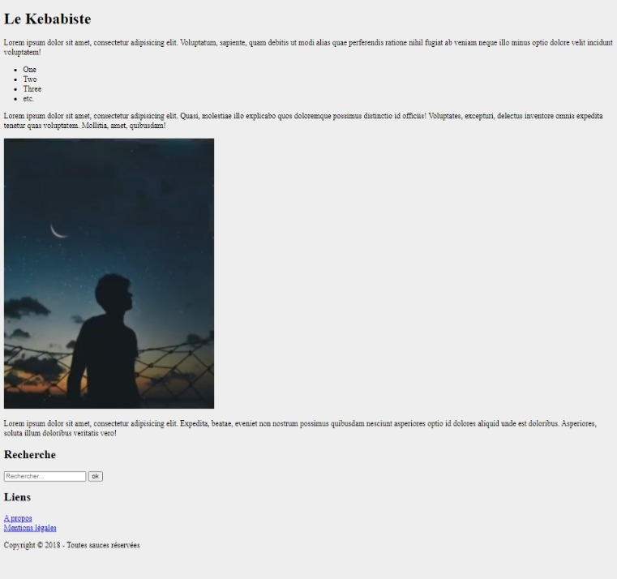
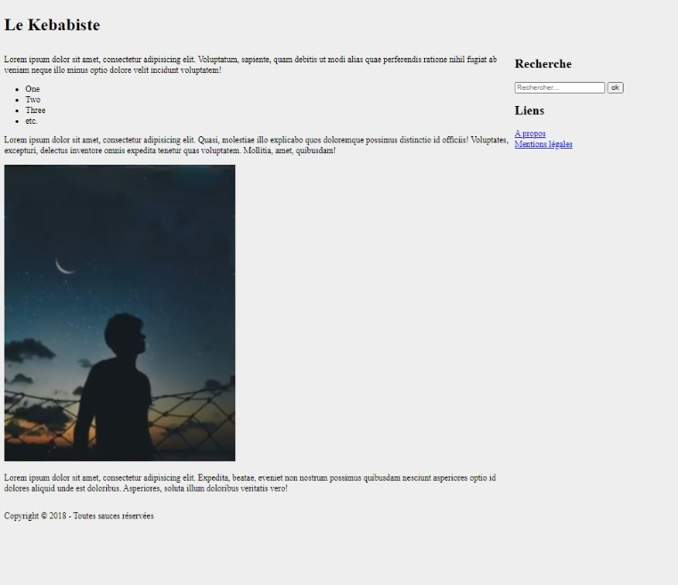
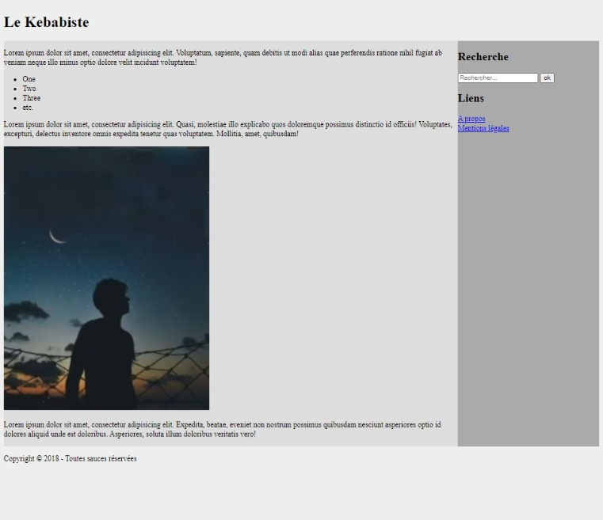
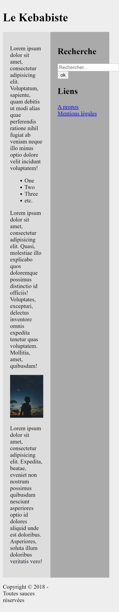
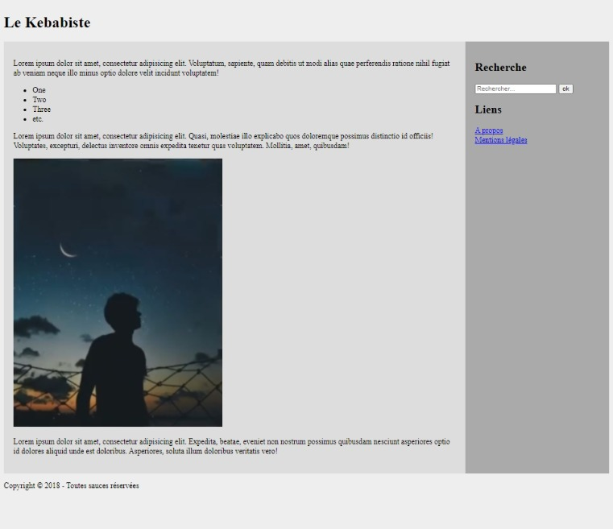
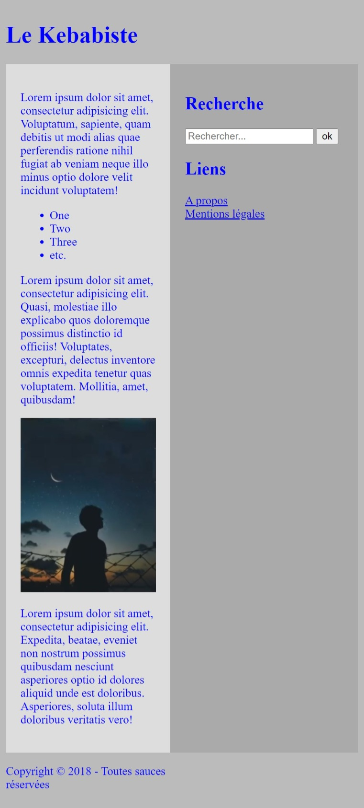
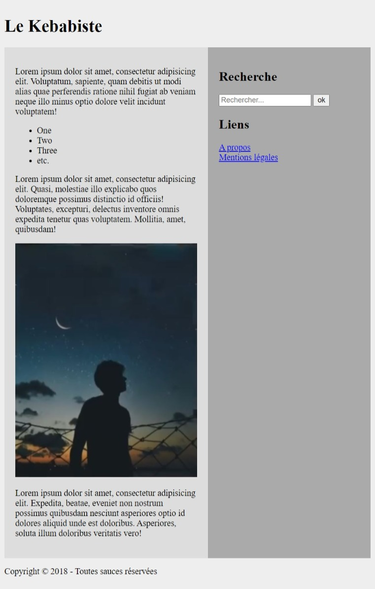
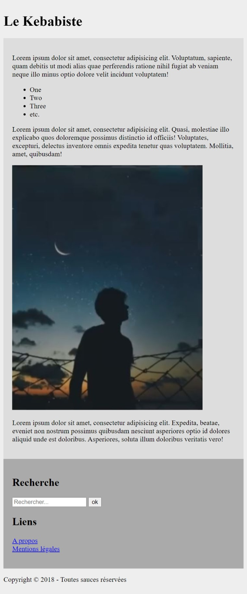
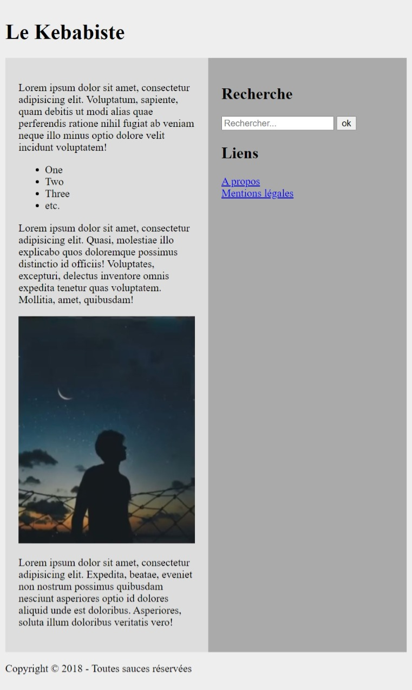

# [25. Media queries](https://www.youtube.com/watch?v=_p8abfdp_Co)
14-02-21

Bonjour à tous et bienvenue pour cette vidéo numéro 25 sur les médias queries qui va clôturer notre formation sur html css pour voir comment adapter le comportement de nos pages donc le design donc le fil du contenu du fichier css en fonction de différents paramètres de l'affichage en fait donc de notre écran par exemple sa résolution si nous voulons gérer des affichages notamment adaptatifs avec des périphériques comme les smartphones et tablettes en plus des écrans d'ordinateur.

Vous verrez que ça va être très très simple pour la mettre en place, il n'y aura pas grand grand chose à apprendre dans cette vidéo et pas grand chose à comprendre mais c'est vraiment quelque chose qui va nous aider à produire des designs responsives par la suite.

Cette vidéo n'est pas là pour vous apprendre à faire un site complet évidemment avec un design adaptatif c'est juste pour comprendre l'utilisation des requêtes médias donc les media queries et bien évidemment au moment où j'ai fait cette vidéo ce n'est pas encore le cas mais je prévois de toute façon un tutoriel où je vous montrerai comment concevoir un design de sites web donc quelque chose d'assez basique mais en tout cas quelque chose de fonctionnel avec tout un système responsive que ce soit pour tous les types de contenus c'est à dire les images, des paragraphes, et cetera.

Donc on verra bien évidemment tout ça ensemble y compris les tableaux d'ailleurs.

Alors là on va passer sur un fichier très simple.
```html
<!DOCTYPE html>
<html lang="fr">
<head>
	<meta charset="UTF-8">
	<title>Grilles CSS</title>
	<link rel="stylesheet" href="style.css">
</head>
<body class="container">
	<header class="item">
		<h1>Le Kebabiste</h1>
	</header>
	
	<section class="item">
		<p>Lorem ipsum dolor sit amet, consectetur adipisicing elit. Voluptatum, sapiente, quam debitis ut modi alias quae perferendis ratione nihil fugiat ab veniam neque illo minus optio dolore velit incidunt voluptatem!</p>
		
		<ul>
			<li>One</li>
			<li>Two</li>
			<li>Three</li>
			<li>etc.</li>
		</ul>
		
		<p>Lorem ipsum dolor sit amet, consectetur adipisicing elit. Quasi, molestiae illo explicabo quos doloremque possimus distinctio id officiis! Voluptates, excepturi, delectus inventore omnis expedita tenetur quas voluptatem. Mollitia, amet, quibusdam!</p>
		
		<p></p>
		
		<p>Lorem ipsum dolor sit amet, consectetur adipisicing elit. Expedita, beatae, eveniet non nostrum possimus quibusdam nesciunt asperiores optio id dolores aliquid unde est doloribus. Asperiores, soluta illum doloribus veritatis vero!</p>
	</section>
	
	<aside class="item">
		<h2>Recherche</h2>
		
		<form action="post" action="">
			<p><input type="search" placeholder="Rechercher...">
			<input type="submit" value="ok"></p>
		</form>
		
		<h2>Liens</h2>
		
		<p><a href="#">A propos</a><br>
		<a href="#">Mentions légales</a></p>
	</aside>
	
	<footer>
		<p>Copyright &copy 2018 - Toutes sauces réservées</p>
	</footer>
</body>
</html>
```
Au niveau du fichier html vous allez remarquer très vite donc j'ai fait un petit ensemble encore assez rapides donc on va garder le système des grilles qu'on avait vu précédemment comme vous l'avez vu il n'y a pas longtemps parce que c'était dans la vidéo précédente, ça vous fera quelques petits rappels.

Donc le `<body>` sera le conteneur "container" d'accord de la grille et chaque partie ici seront des items "item".

On a un `<header>` où on a juste mit un petit titre `<h1>`. On a ensuite la partie `<section>` d'accord qui sera la partie principale de notre site si on veut faire ça donc j'ai fait un truc très basique mais c'est comme ça qu'il faut le voir. `<aside>` sera la barre latérale d'accord le aside et on aura le pied de page `<footer>`.

Voilà donc chaque élément "item", tous à l'intérieur du `<body>` qui est le contenu d'accord.

Au niveau css.
```css
body
{
	background-color:#EEE;
}

img
{
	max-width:100%;
	height:auto;
}
```


Tout simplement, j'ai un petit peu réduit la couleur blanche donc couleur de fond ici #EEE. Ensuite simplement une image qui est affichée pour l'avoir de manière responsive donc si vous voulez notamment c'est une première chose que vous allez voir sur cette vidéo, vous allez afficher une image en responsive voilà les deux propriétés à appliquer dessus pour dire ici 'max-width' que nous spécifions une l'ageur maximale de 100 % d'accord ce sont des propriétés que vous connaissez. Tout ça on l'a déjà vu et la hauteur s'adapte automatiquement d'où la valeur "auto" en fonction des autres paramètres donc en l'occurrence de la largeur.

Selon la largeur que fera votre image sans jamais dépasser le maximum qu'elle fait réellement d'accord que le fichier de l'image fait sinon elle serait étirée du coup elle se pixeliserait et ce ne serait pas très agréable à l'oeil et bien la hauteur s'adaptera automatiquement en fonction.

Voilà donc c'est juste ça d'accord et au niveau rendu de base voilà ce que ça donne d'accord.

Donc là on a un exemple d'un tout petit contenu même si encore une fois c'est très succinct, très rapide et très court de petit site web en fait sur lequel on pourrait définir un petit peu les différentes portions.

Je vous avais dit que le système de grille était justement conçu et prévu pour gérer les gabarits de notre site web c'est-à-dire les grosses portions de ce site et là ça tombe bien puisque chacune ces parties est présente. Nous avons une en-tête, un pied de page et les différentes grosse section de notre site donc `<section>` et `<aside>` en l'occurrence.

Donc on va voir sous un système de grille déjà comment mettre ça en place.

Alors là ce n'est pas média queries que nous allons voir, c'est juste pour avoir un rendu un peu mieux que ça parce que là c'est juste du html donc on va prendre ça un petit peu mieux présentable donc on y va.

Première chose que nous allons faire donc le conteneur, .container, je rappelle tout ça ce sont uniquement des rappels d'accord 'grid-template-columns' alors on va mettre mettre d'abord "auto" une grande partie automatique et genre on va mettre 150 pixels en taille minimale et en maximum 300 pixels. Ok hé là on ne va pas oublier le 'display'.
```css
	.container
	{
		display:grid;
		grid-template-columns: auto minmax(150px, 300px);
	}
```
Ensuite 'grid-template-areas' et ça ce sont les différentes parties donc on va avoir une autre partie "entete entete" je remets un petit peu ce qu'on a vu précédemment d'accord il n'y a rien de nouveau ici donc l'en-tête occupera toute la partie ensuite on va avoir principal et la barre latéral de cette manière "principal bare" et on aura ensuite le pied de page de cette manière "pied pied" d'accord.
```css
	body
	{
		background-color:#EEE;
	}
	
	img
	{
		max-width:100%;
		height:auto;
	}

	.container
	{
		display:grid;
		grid-template-columns: auto minmax(150px, 300px);
		grid-template-areas:"entete entete"
							"principal bare"
							"pied pied";
	}
```
Au niveau des items .item alors on voit rien d'afficher ici mais c'est pas grave alors ce que je vais faire c'est donner un nom au `<header>`.
```css
	body
	{
		background-color:#EEE;
	}
	
	img
	{
		max-width:100%;
		height:auto;
	}

	.container
	{
		display:grid;
		grid-template-columns: auto minmax(150px, 300px);
		grid-template-areas:"entete entete"
							"principal bare"
							"pied pied";
	}
	
	header
	{
		grid-area:entete;
	}
```
L'en-tête ici "entete" c'est le `<header>` par rapport à comment on a déterminé notre grille.

Ensuite on aura section, ici on n'utilise pas de classe d'accord j'utilise directement comme sélecteur la balise en question puisque je n'ai qu'une seule balise `<section>` ici dans mon code html donc pour faire plus simple au niveau de la vidéo et plus rapide je fais ça comme ça.
```css
	body
	{
		background-color:#EEE;
	}
	
	img
	{
		max-width:100%;
		height:auto;
	}

	.container
	{
		display:grid;
		grid-template-columns: auto minmax(150px, 300px);
		grid-template-areas:"entete entete"
							"principal bare"
							"pied pied";
	}
	
	header
	{
		grid-area:entete;
	}
	
	section
	{
		grid-area:principal;
	}
```
Ensuite le `<aside>` alors même chose, 'grid-area' et le `<footer>` c'était pour le pied.
```css
body
{
	background-color:#EEE;
}

img
{
	max-width:100%;
	height:auto;
}

.container
{
	display:grid;
	grid-template-columns: auto minmax(150px, 300px);
	grid-template-areas:"entete entete"
						"principal bare"
						"pied pied";
}

header
{
	grid-area:entete;
}

section
{
	grid-area:principal;
}

aside
{
	grid-area:bare;
}

pied
{
	grid-area:pied;
}
```
Voilà pour cette partie là nous avons cette mise en page d'accord si j'actualise nous obtenons ceci d'accord alors on ne s'en rend pas forcément compte d'ailleurs mais on va mieux le faire par la suite.


Comment on peut faire ça ? `<section>`, on va lui mettre une autre couleur ce sera mieux qu'on puisse voir un petit peu comment ça se représente #DDD. `<aside>` on va le mettre en un peu plus foncée voilà #AAA. J'actualise toujours et voilà comment ça se représente.
```css
body
{
	background-color:#EEE;
}

img
{
	max-width:100%;
	height:auto;
}

.container
{
	display:grid;
	grid-template-columns: auto minmax(150px, 300px);
	grid-template-areas:"entete entete"
						"principal bare"
						"pied pied";
}

header
{
	grid-area:entete;
}

section
{
	background-color:#DDD;
	grid-area:principal;
}

aside
{
	background-color:#AAA;
	grid-area:bare;
}

pied
{
	grid-area:pied;
}
```

Ok donc là grosso modo donc on a bien notre en-tête ici "Le Kebabiste" on voit bien nos deux parties qui se mettent bien côte-à-côte d'accord donc on peut gérer ces parties là alors j'ai pas mis de 'padding' mais évidemment je pourrais le faire pour ceux qui veulent chipoter mais encore une fois le but n'est pas de faire un vrai design ici, c'est vraiment juste de montrer le principe des requêtes médias que nous allons voir par la suite.

Alors comme je répète l'élément, on va le mettre à la fois pour `<section>` et `<aside>` voilà donc optimise un maximum tout ça.
```css
body
{
	background-color:#EEE;
}

img
{
	max-width:100%;
	height:auto;
}

.container
{
	display:grid;
	grid-template-columns: auto minmax(150px, 300px);
	grid-template-areas:"entete entete"
						"principal bare"
						"pied pied";
}

header
{
	grid-area:entete;
}

section,aside
{
	padding:20px;
}

section
{
	background-color:#DDD;
	grid-area:principal;
}

aside
{
	background-color:#AAA;
	grid-area:bare;
}

pied
{
	grid-area:pied;
}
```

Comme ça voyez ça évite que ça touche les bords ici "25px" au niveau des parties et on gère notre contenu sous forme de grille et donc si on change la résolution on voit que ça s'adapte d'accord.

j'arrive évidemment avec une partie de défillement horizontale puisqu'encore une fois je n'ai pas rendu tout le site responsif, on voit que tout s'adapte et mon image tel que je l'ai fais ici avec les propriétés que nous avons là 'max-width' et 'height' d'accord s'adapte aussi d'accord en fonction jusqu'à atteindre sa taille de 100 % et sans jamais bien sûr la dépasser, on voit qu'en engrandissant la page, l'image ne continue pas de grandir sinon on aurait quelque chose qui se pixelise.

Voilà pour cette partie là donc on a quelque chose qui ressemble un peu plus à un site web, une base en tout cas ici.

Nous ce qu'on aimerait faire c'est là que ça va être intéressant c'est d'utiliser des requêtes médias qui vont permettre de changer certaines propriétés css en fonction des paramètres que nous avons et l'un des paramètres qui va être très intéressant à utiliser c'est la largeur de l'écran c'est à dire sa résolution.

La hauteur on s'en fiche parce qu'on peut naviguer sur un site peu importe la hauteur même sur un smartphone ou une tablette mais c'est au niveau de la largeur que ça va être un peu différente.

Première chose que nous allons faire ça ne fait pas partie des standards du w3c mais je vous le donne comme petite astuce, entre parenthèse sur cette vidéo, ça a été intégré via safari mobile donc le navigateur d'apple qui a mis ça donc pour les versions mobiles pour permettre en fait d'avoir certains réglages au niveau des navigateurs mobiles surtout pour les périphériques tactiles.

On ajoute simplement donc une balise `<meta>`, on lui donne le nom de "viewport" qui représente en fait l'écran de ces différents périphériques et en content="" on va mettre différentes valeurs donc la première ça va être la largeur en fait "width:device-width" pour dire en fait d'utiliser vraiment les valeurs en pixels dites css, pourquoi ? parce que vous savez sûrement que sur les écrans d'appareils par exemple genre les écrans retina ou autres en fait un pixel peut en fait être composée de plusieurs sous pixels donc nous comme on veut travailler avec des valeurs en pixels css d'accord comme on veut utiliser le css comme unité on va mettre tout simplement ceci comme valeur "width:device-width" pour vraiment prendre ceci donc les pixels css.
```html
	<head>
		<meta name="viewport" content="width:device-width, ">
	</head>
```
Et ensuite on met une petite virgule, une propriété "initial-scale=1" à 1, on pourrait mettre 1.0 mais on met 1 tout court qui va tout simplement dire que l'échelle de l'écran est à 1 c'est à dire qu'elle est en taille normale donc pour ce qui concerne notamment le zoom d'accord il n'y a pas de zoom ou de dézoom de fait, on le met à 1 comme ça on aura quelque chose de propre.
```html
	<head>
		<meta name="viewport" content="width:device-width, initial-scale=1">
	</head>
```
Alors ça je vous le donne puisque c'est maintenant bien pris en compte par l'ensemble des navigateurs web mais ce n'est pas encore une fois intégré dans le standard du w3c, ça le sera peut-être dans quelques mois, un an on ne sait pas parce qu'évidemment il faut que ce soit proposé jusqu'à être ensuite intégré au niveau du standard pour le w3c donc les standards du web mais comme c'est quand même amené à l'être, je vous le donne puisque c'est de toute façon pris en charge par les navigateurs que vous utilisez donc vous pouvez l'utiliser et si jamais de toute façon ce n'est pas pris en charge, cette ligne sera tout simplement ignorée et ça ne coûte rien donc ça ne posera aucun problème au niveau de votre page web.

Vous pouvez le mettre dès le moment où vous allez utiliser des médias queries donc notamment travailler sur des designs responsives ça va être un petit plus au niveau de vos pages web.
```html
<!DOCTYPE html>
<html lang="fr">
<head>
	<meta charset="UTF-8">
	<title>Grilles CSS</title>
	<link rel="stylesheet" href="style.css">
	<meta name="viewport" content="width:device-width, initial-scale=1">
</head>
<body class="container">
	<header class="item">
		<h1>Le Kebabiste</h1>
	</header>
	
	<section class="item">
		<p>Lorem ipsum dolor sit amet, consectetur adipisicing elit. Voluptatum, sapiente, quam debitis ut modi alias quae perferendis ratione nihil fugiat ab veniam neque illo minus optio dolore velit incidunt voluptatem!</p>
		
		<ul>
			<li>One</li>
			<li>Two</li>
			<li>Three</li>
			<li>etc.</li>
		</ul>
		
		<p>Lorem ipsum dolor sit amet, consectetur adipisicing elit. Quasi, molestiae illo explicabo quos doloremque possimus distinctio id officiis! Voluptates, excepturi, delectus inventore omnis expedita tenetur quas voluptatem. Mollitia, amet, quibusdam!</p>
		
		<p></p>
		
		<p>Lorem ipsum dolor sit amet, consectetur adipisicing elit. Expedita, beatae, eveniet non nostrum possimus quibusdam nesciunt asperiores optio id dolores aliquid unde est doloribus. Asperiores, soluta illum doloribus veritatis vero!</p>
	</section>
	
	<aside class="item">
		<h2>Recherche</h2>
		
		<form action="post" action="">
			<p><input type="search" placeholder="Rechercher...">
			<input type="submit" value="ok"></p>
		</form>
		
		<h2>Liens</h2>
		
		<p><a href="#">A propos</a><br>
		<a href="#">Mentions légales</a></p>
	</aside>
	
	<footer>
		<p>Copyright &copy 2018 - Toutes sauces réservées</p>
	</footer>
</body>
</html>
```
On retourne maintenant sur le fichier css sachant que ce que nous avons vu jusqu'à présent c'était juste des choses que vous savez faire à ce stade de la formation, d'être capable de faire tout ce que j'ai montré ici.
```css
	body
	{
		background-color:#EEE;
	}
	
	img
	{
		max-width:100%;
		height:auto;
	}

	.container
	{
		display:grid;
		grid-template-columns: auto minmax(150px, 300px);
		grid-template-areas:"entete entete"
							"principal bare"
							"pied pied";
	}
	
	header
	{
		grid-area:entete;
	}
	
	section,aside
	{
		padding:20px;
	}
	
	section
	{
		background-color:#DDD;
		grid-area:principal;
	}
	
	aside
	{
		background-color:#AAA;
		grid-area:bare;
	}

	pied
	{
		grid-area:pied;
	}
```
Voilà si ce n'est pas le cas, il est temps de revenir sur des anciennes vidéos si tout ce que je vous ai montré là n'est pas encore clair pour vous mais normalement tout ça vous avez largement les capacités, les compétences pour le faire. J'ai rien montré de nouveau à part ça.
```html
	<meta name="viewport" content="width:device-width, initial-scale=1">
```
Evidemment mais sinon tout le reste c'est que des choses que nous avons vu, que vous êtes capable de faire.

A partir de là nous allons commencer à travailler avec nos requêtes médias alors les requêtes médias, on pourrait de base d'accords comme ça se faisait à la base dire de charger certains fichiers css en fonction de certaines conditions pour ceux qui font de la programmation vous savez ce qu'est une condition alors on va retrouver un petit peu le même système.

On dirait par exemple qu'on aurait un fichier css pour toutes les petites résolutions.
```html
	<link rel="stylesheet" href="small.css">
```
Voilà pour toutes les petites résolutions et comment ça se chargerait ce fichier hé bien selon cette condition là 'media' qui dirait tout un tas de choses d'accord à l'intérieur on mettra plusieurs conditions par exemple que nous soyons sur un écran donc ordinateurs, tablettes, smartphones et que par exemple la largeur de l'écran soit égale ou inférieure admettons à 600 pixels de largeur parce qu'on pourrait dire hé bien si on est à 600 pixels de largeur ou moins c'est qu'à priori on est sur un petit écran donc probablement un smartphone donc on va charger un fichier css dans lequel nous avons défini des propriétés seulement pour les petits écran et cela permettra du coup de charger des fichiers css donc des propriétés en fonction de différentes conditions d'accord.
```html
	<link rel="stylesheet" media="" href="small.css">
```
Alors ça c'est bien mais c'est pas bien en fait pour une simple et bonne raison que chaque fichier css chargé, effectue une requête http et risque du coup de surcharger donc en termes de performances, en termes de ressources, justement le nombre de requêtes.

Plus vous allez charger de requêtes http plus vous allez perdre en performance et moins c'est bien d'accord le but est d'essayer d'avoir un minimum de requêtes pour optimiser les chargements de vos pages et optimiser les performances donc en général sur un gros site, on se contente dans l'idéal un seul fichier css ce serait l'idéal mais si vous en avez deux ou trois puisque des fois on intègre d'autres fichiers css issues de bibliothèques ou de frameworks de trucs comme ça ... voilà on essaie quand même rarement de dépasser ces fichiers css et aussi d'avoir des fichiers qui sont les plus petit possible c'est à dire les plus léger possible en taille.
```html
	<link rel="stylesheet" media="" href="small.css">
```
Donc ça c'est pas forcément la bonne méthode mais je vous montre que ça existe et si un jour vous téléchargez un site, un design ou je ne sais quoi qui est déjà fait et que vous tous tomber sur ce genre de ligne, vous serez à quoi ça correspond, vous saurez qu'est ce que ça veut dire et pourquoi il y a ce genre de ligne, que ce n'est pas sortis de nulle part.

Nous nous allons voir la méthode directement dans un seul fichier css d'accord donc le moins possible en intégrant directement nos requêtes médias ici (style.css).

Alors la requête média, on va l'indiquer très facilement avec un @ et le mot @media ça c'est la première chose à faire.
```css
	@media
```
Comme là nous n'avons qu'une seule on va faire quelque chose de très simple c'est ouvrir simplement des parenthèses @media() et ici faire vérifier une condition donc via une expression.
```css
	@media()
```
Il existe pas mal de choses que nous pourrons vérifier mais il y a pas mal de paramètres qui ne sont soit plus valide donc qu'ils sont devenus obsolètes parce que les api ne sont plus en fait utilisable, ne sont plus correct aujourd'hui et on a également des valeurs qui ne sont pas prises en charge par l'ensemble des navigateurs voire même presque pas pour certaines donc moi je vais vous montrer vraiment les plus utilisées, celles de toute façon que vous allez vous allez vous servir et nous ce qui nous intéresse c'est notamment la largeur de l'écran donc il y en a une première qui pour déterminer la largeur exacte de l'écran qui est 'width' et vous le savez ça vous savez déjà le faire en css c'est exactement la même chose.
```css
	@media(width)
```
Si vous voulez une largeur minimale ce sera 'min-width' comme on l'a vu en css également et si vous voulez une largeur maximale ce sera 'max-width' cette propriété donc à vérifier pourra prendre une valeur avec n'importe quelle unité en pixels, en em, en pourcent, ce que vous voulez d'accord.
```css
	@media(min-width)
	@media(max-width)
```
Donc nous ce qu'on peut faire c'est de dire par exemple je vais gérer certaines choses si mon écran fait admettons 600 pixels ou moins, comment je fais ça ? hé bien je dis :
```css
	@media(max-width:600px;)
	{
	}
```
J'ouvre des accolades aussi.

Tout ce que je vais mettre ici à l'intérieur de cette requête @media sera chargé, sera pris en compte par le fichier seulement si la largeur de mon écran ne dépasse pas les 600 pixels d'accord c'est à dire qu'il va jusqu'à 600 pixels le fait de m'être 'max-width'.

Si je veux tout ce qui fait 600 pixels et plus il faudra tout simplement remplacer 'max-width' par 'min-width'.
```css
	@media(min-width:600px;)
	{
	}
```
Si je veux quand c'est exactement égal à 600 pixels, je fais ça d'accord.
```css
	@media(width:600px;)
	{
	}
```
Nous on met ça et on va changer un comportement par défaut.
```css
	body
	{
		background-color:#EEE;
	}
	
	img
	{
		max-width:100%;
		height:auto;
	}

	.container
	{
		display:grid;
		grid-template-columns: auto minmax(150px, 300px);
		grid-template-areas:"entete entete"
							"principal bare"
							"pied pied";
	}
	
	header
	{
		grid-area:entete;
	}
	
	section,aside
	{
		padding:20px;
	}
	
	section
	{
		background-color:#DDD;
		grid-area:principal;
	}
	
	aside
	{
		background-color:#AAA;
		grid-area:bare;
	}

	pied
	{
		grid-area:pied;
	}

>	@media(max-width:600px;)
	{
	}
```
On met ça et on va changer un comportement par défaut.
```css
	body{background-color:#EEE;}
	img{max-width:100%;height:auto;}
	.container{display:grid;grid-template-columns: auto minmax(150px, 300px);	grid-template-areas:"entete entete"	"principal bare" "pied pied";}
	header{grid-area:entete;}
	section,aside{padding:20px;}
	section{background-color:#DDD;grid-area:principal;}
	aside{background-color:#AAA;grid-area:bare;}
	pied{grid-area:pied;}
```
ça c'est le comportement par défaut que nous avons pour notre site d'accord c'est quoi qu'il arrive nous avons ça et nous nous voulons dire et bien dans le cas où nous avons une largeur inférieure ou égale à 600 pixels on veut changer certaines choses. Qu'est ce qu'on pourrait faire ?

Admettons voyez le fond de la page est de cette couleur là #EEE et bien on pourrait très bien la changer. Alors je reprends cette partie là que je mets ici.
```css
	body
	{
		background-color:#EEE;
	}

	img
	{
		max-width:100%;
		height:auto;
	}

	.container
	{
		display:grid;
		grid-template-columns: auto minmax(150px, 300px);
		grid-template-areas:"entete entete"
							"principal bare"
							"pied pied";
	}
	
	header
	{
		grid-area:entete;
	}
	
	section,aside
	{
		padding:20px;
	}
	
	section
	{
		background-color:#DDD;
		grid-area:principal;
	}
	
	aside
	{
		background-color:#AAA;
		grid-area:bare;
	}

	pied
	{
		grid-area:pied;
	}

>	@media(max-width:600px)
	{
		body
		{
			background-color:#BBB;
		}
	}
```
Voyez je met le sélecteur de `<body>` et la propriété 'background-color' donc je peux très bien les réutiliser. Je pourrais tout reprendre si je veux, si je voulais tout modifier et ici je vais dire en fait ce ne sera pas de cette couleur là, ça va être par exemple en #BBB; donc un petit peu moins blanc donc un peu plus foncée et on va tester ça donc on y va et on va actualiser.

Voilà donc là on n'observe aucun changement d'accord normale et dès que je vais réduire, dès que je vais arriver à 600 pixels, regarder la couleur de fond va changer voilà.


Voilà au dessus de 600px on repasse au clair parce qu'au dessus de 600px je ne rentre plus dans cette condition.
```css
>	@media(max-width:600px)
	{
		body
		{
			background-color:#BBB;
		}
	}
```
C'est comme en programmation, je ne rentre plus dans la condition où l'écran donc la largeur fait 600 pixels ou moins donc cette partie là sera ignorée donc ce qui s'applique c'est le background-color ici.
```css
	body
	{
		background-color:#EEE;
	}
```
Et dès lors que j'arrive à 600 pixels ou moins par rapport à la requête 'media' que j'ai défini, on change la couleur de fond.

On pourra faire ça sur tout un tas de choses vraiment après changer n'importe quoi, changer les couleurs, changer n'importe quoi. On va mettre ça comme ça et j'actualise.
```css
	body
	{
		background-color:#EEE;
	}

	img
	{
		max-width:100%;
		height:auto;
	}

	.container
	{
		display:grid;
		grid-template-columns: auto minmax(150px, 300px);
		grid-template-areas:"entete entete"
							"principal bare"
							"pied pied";
	}
	
	header
	{
		grid-area:entete;
	}
	
	section,aside
	{
		padding:20px;
	}
	
	section
	{
		background-color:#DDD;
		grid-area:principal;
	}
	
	aside
	{
		background-color:#AAA;
		grid-area:bare;
	}

	pied
	{
		grid-area:pied;
	}

>	@media(max-width:600px)
	{
		body
		{
			background-color:#BBB;
			color:blue;
		}
	}
```

Voilà si je passe cette valeur limite, hop on change toutes les couleurs d'accord donc en fait ces requêtes médias permettent de gérer des comportements adaptatifs d'accord de nos fichiers css, de nos propriétés css et là ça a vraiment complètement son intérêt par la suite donc voilà ce que je voulais vous montrer.

Alors évidemment on ne va pas forcément s'amuser à tout reprendre mais ce qui peut être intéressant et là c'est ce qui nous intéresse nous c'est par exemple, c'est un départ on va dire c'est un début de réponse aux designs responsives, au design adaptatif pour les smartphones, tout ça parce que c'est l'intérêt quand même des médias queries même si je ne vous fais pas une vidéo que sur ça je vous montre un point de départ.

Comment je peux faire et ça vous l'avez peut-être vu sur les sites justement qui sont optimisés pour mobiles pour me dire que quand j'arrive à une résolution trop petite ça devient vraiment pas lisible du tout.

Là on a un truc tout petit et là on a une colonne qui rend toute petite et du coup c'est pas franchement très très lisible, imaginez quelqu'un sur un smartphone qui a cette résolution là ou une tablette, c'est franchement pas agréable à lire d'accord.

Ce qu'on aimerait peut-être c'est de dire la colonne ici qui a une barre latérale c'est pourquoi pas la passer en dessous d'accord de notre partie principale de notre site parce que c'est pas forcément très important donc à la rigueur on peut mettre en dessous, c'est moins important que la partie qui à gauche.

Comment faire ça ? hé bien logiquement si vous avez bien compris tout ce que je vous ai montré et notamment ce que vous avez vus sur les grilles vous pouvez le faire facilement, comment que ça se fait ? alors vous voyez qu'ici on a défini des choses pour le conteneur donc on le fait ici. Et si c'est à 600 pixels ou moins donc pour moi si j'estime que c'est plus petit pour moi et que du coup ça rend moins lisible les choses.
```css
	body
	{
		background-color:#EEE;
	}

	img
	{
		max-width:100%;
		height:auto;
	}

	.container
	{
		display:grid;
		grid-template-columns: auto minmax(150px, 300px);
		grid-template-areas:"entete entete"
							"principal bare"
							"pied pied";
	}
	
	header
	{
		grid-area:entete;
	}
	
	section,aside
	{
		padding:20px;
	}
	
	section
	{
		background-color:#DDD;
		grid-area:principal;
	}
	
	aside
	{
		background-color:#AAA;
		grid-area:bare;
	}

	pied
	{
		grid-area:pied;
	}

>	@media(min-width:600px)
	{
		.container
		{

		}
	}
```
On va définir autre chose donc au lieu d'avoir tout ça comme ça.
```css
	.container
	{
		display:grid;
		grid-template-columns: auto minmax(150px, 300px);
		grid-template-areas:"entete entete"
							"principal bare"
							"pied pied";
	}
```
On va laisser `display:grid;`, on ne va pas le changer mais on va changer ça en fait.
```css
	@media(min-width:600px)
	{
		.container
		{
			grid-template-columns: auto minmax(150px, 300px);
			grid-template-areas:"entete entete"
								"principal bare"
								"pied pied";
		}
	}
```
On va changer la manière dont sont répartis les colonnes et comment sont répartis les différentes aires.

Les colonnes moi je veux qu'on en ait qu'une seule, regardez bien je vous dis que celle là, il faut qu'elle passe en dessous donc je veux qu'une seule colonne aussi et c'est ce qu'on fera habituellement sur les smartphones vous verrez que tous les sites une fois qu'ils sont en design smartphones ou tablettes, petite tablette, tout est sur une seule colonne donc pour faire ça, on a juste à faire ça, on l'a déjà vu précédemment soit "1fr" voilà pour dire que ça occupe tout l'espace disponible pour la colonne de gauche, une seule colonne.
```css
	@media(min-width:600px)
	{
		.container
		{
			grid-template-columns: 1fr;
			grid-template-areas:"entete entete"
								"principal bare"
								"pied pied";
		}
	}
```
Et ensuite dans 'grid-template-areas' vous répartissez les parties de votre site de la manière que vous voulez donc ici on a plus deux fois l'en-tête "entete" parce qu'on n'a pas deux colonnes et on fait ça.
```css
	@media(max-width:600px)
	{
		.container
		{
			grid-template-columns: 1fr;
			grid-template-areas:"entete"
								"principal"
								"bare"
								"pied";
		}
	}
```
Voilà `<aside>` devait arriver juste en dessous donc je le met ici, vous voyez tout est sur une colonne on arrive bien encore une fois ça je vous l'avais dit dans la vidéo précédente c'est que visuellement on arrive bien à se représenter comment est conçu la grille de notre site quand on en a évidemment pas trop parce que si on a 25 colonnes et 48 lignes là ça deviendrait un petit peu du n'importe quoi mais là comme on a quand même très peu de choses dans la majorité des cas, c'est très lisible et là on y va.
```css
body
{
	background-color:#EEE;
}

img
{
	max-width:100%;
	height:auto;
}

.container
{
	display:grid;
	grid-template-columns: auto minmax(150px, 300px);
	grid-template-areas:"entete entete"
						"principal bare"
						"pied pied";
}

header
{
	grid-area:entete;
}

section,aside
{
	padding:20px;
}

section
{
	background-color:#DDD;
	grid-area:principal;
}

aside
{
	background-color:#AAA;
	grid-area:bare;
}

pied
{
	grid-area:pied;
}

@media(max-width:600px)
{
	.container
	{
		grid-template-columns: 1fr;
		grid-template-areas:"entete"
							"principal"
							"bare"
							"pied";
	}
}
```
> `>600px`



> `<600px`


On va mettre comme ça, on actualise et tant que je suis sur une résolution au dessus de 600 pixels donc des grands écrans et des grandes résolutions aucun problème, on a la place pour avoir deux colonnes donc c'est plus agréable d'avoir deux colonnes d'ailleurs on a un meilleur design.

Par contre plus on s'approche d'une résolution petite et du coup qui devient inconfortable pour la lecture.

Automatiquement, voyez donc 600 pixels ça fait quand même déjà assez large donc avant que ça devienne vraiment trop écrasé et du coup trop désagréable à la lecture, on a passé cette partie de notre site en dessous et là évidemment on garde cette largeur qui est quand même beaucoup plus agréable pour les deux.

Et si je réduit même au minimum minimum donc là bon après ça dépend de mon navigateur mais sur un smartphone on va pas non plus être comme ça mais on va plus tôt être comme ça.

Vous voyez que ça reste quand même beaucoup plus lisible d'accord tout reste parfaitement lisible et il y a un meilleur confort pour tout alors encore une fois je suis pas là pour vous montrer comment on fait un site responsive, il faudrait modifier beaucoup de choses par exemple l'affichage donc la taille des polices, comment on gère les marges, comment on gère les alignements, tout ça et c'est encore une fois pas le but de cette vidéo.

Là le but c'était vraiment de vous montrer l'intérêt et la puissance d'accord, l'utilité de ces requêtes médias et ce qu'elle va vous permettre de faire.

Vous allez pouvoir vraiment changer complètement le comportement de vos sites en fonction des résolutions.

Alors du coup on va aussi voir d'autres petits éléments avant de s'arrêter là parce que là j'avais qu'une seule requête média mais en fait cette requête média peut prendre aussi un type d'appareil, un type de périphérique.

Ces types d'appareils, il y en a trois à connaître.

Alors vous en avez 3 mais dont un principal, vous avez 'all' qui prend tout en compte d'accord.
```css
>	@media all (max-width:600px)
	{
		.container
		{
			grid-template-columns: 1fr;
			grid-template-areas:"entete"
								"principal"
								"bare"
								"pied";
		}
	}
```
'all' c'est vraiment tous les types d'appareils.

Ok donc ça c'est à connaître, si vous voulez prendre des notes c'est maintenant donc 'all' c'est vraiment tous les types de périphériques, tous les types d'appareils pour afficher.

Ensuite vous avez le 'screen', 'screen' c'est tout simplement les écrans ordinateurs, smartphones, tablettes, etc.
```css
>	@media screen (max-width:600px)
	{
		.container
		{
			grid-template-columns: 1fr;
			grid-template-areas:"entete"
								"principal"
								"bare"
								"pied";
		}
	}
```
Ensuite vous avez 'speech' si vous utilisez un outil de synthèse vocale.
```css
>	@media speech (max-width:600px)
	{
		.container
		{
			grid-template-columns: 1fr;
			grid-template-areas:"entete"
								"principal"
								"bare"
								"pied";
		}
	}
```
Et vous avez enfin 'print' quand par exemple vous voulez imprimer une page, vous faites un aperçu avant impression si vous connaissez ce style de commandes et bien quand vous avez l'aperçu avant impression donc ça validera en fait cette condition ici pour dire le média est bien en mode 'print' donc bien par exemple en "apperçus" avant impression.
```css
>	@media print (max-width:600px)
	{
		.container
		{
			grid-template-columns: 1fr;
			grid-template-areas:"entete"
								"principal"
								"bare"
								"pied";
		}
	}
```
Donc voilà il y a 'screen', 'print', 'speech' d'accord et si on voulez tout à la fois vous mettez 'all' alors il n'y en a pas d'autre. Il y en avait d'autres à l'époque notamment pour par exemple les télés, etc mais ça a été rendue obsolète parce que ça ne servaint à rien donc ils ont supprimé tout ça et ils ont tous rassemblés maintenant ensemble donc ce sont vraiment les trois valeurs possibles et les 3 valeurs utilisables avec le 'all' évidemment si vous voulez prendre tout en compte par rapport ici au type de périphérique.

Alors si vous n'avez qu'une seule requête médias vous ne mettez rien d'accord vous mettez juste ça `@media{...}` et directement passé à votre condition mais si plus tard on veut rajouter plusieurs vérifications là on peut s'amuser par exemple à faire ça.
```css
>	@media screen and
	{
		.container
		{
			grid-template-columns: 1fr;
			grid-template-areas:"entete"
								"principal"
								"bare"
								"pied";
		}
	}
	
	@media screen
```
Voilà et comme je vérifie une autre condition je vais mettre l'opérateur 'and'. On a également l'opérateur 'not' pour dire "ce n'est pas" et on a l'opérateur 'only' pour dire quand c'est seulement quelque chose donc only() avec quelque chose entre parenthèses d'accord.
```css
>	@media screen only ()
	{
		.container
		{
			grid-template-columns: 1fr;
			grid-template-areas:"entete"
								"principal"
								"bare"
								"pied";
		}
	}
	
	@media screen
```
Voilà, on peut mettre 'not', 'and', et cetera. Nous ce qu'on peut faire c'est ça comme ceci entre parenthèses comme tout à l'heure.
```css
>	@media screen and (max-width:600px;)
	{
		.container
		{
			grid-template-columns: 1fr;
			grid-template-areas:"entete"
								"principal"
								"bare"
								"pied";
		}
	}
	
	@media screen
```
Et là je peux faire un autre en dessous mais encore une fois je ne suis pas obligé, le screen si je veux tout prendre ou  pas, je peux très bien faire comme ça, ça ne pose aucun problème aussi.
```css
>	@media(max-width:600px;)
	{
		.container
		{
			grid-template-columns: 1fr;
			grid-template-areas:"entete"
								"principal"
								"bare"
								"pied";
		}
	}
	
	@media screen
```
Et je peux très bien mettre à la suite dire que quand j'arrive à une résolution de 1200px qui est vraiment très grande là pour le coup on est sur du grand écran, un écran pc haute résolution et bien on affiche d'autre chose, par exemple, des éléments un peu plus riches qui sont un peu plus voilà qui ont besoin d'être chargé sur des grands écrans mais qu'on éviterait de charger sur des petits écrans pour ne pas alourdir la page càd d'avoir des choses qui serait inutile sur un affichage de smartphone, de tablette mais qu'on veut par contre afficher sur des grandes résolutions.
```css
>	@media screen and (max-width:600px;)
	{
		.container
		{
			grid-template-columns: 1fr;
			grid-template-areas:"entete"
								"principal"
								"bare"
								"pied";
		}
	}
	
>	@media screen and (min-width:1200px;)
	{
	
	}
```
Voilà un cas où on veut afficher sur de grandes résolutions c'est à dire des résolutions dès qu'on a un écran qui atteint 1200 pixels ou qui fait plus que 1200 pixels d'accord, on fait ça.

Comme ça on peut gérer d'autres choses donc ça peut être éventuellement utile.

Voilà on va rester sur une seule requête, on ne va pas compliquée par rapport à ce que je vous montre dans la vidéo donc on restera sur quelque chose de simple.

Vous avez vu un le 'all', 'print', 'screen' et 'speech'. Vous avez vu des petits opérateurs 'not', 'and', 'only' donc des trucs très simple et vous allez pouvoir gérer ça de cette manière.

Alors maintenant on va terminer cette vidéo parce que j'avais dit qu'il n'y a pas grand chose quand même à voir mais ça va quand même assez vite mais il y a des petites choses intéressantes qui sont vraiment importantes que je vais vous donner, des petits conseils pour vous la manière de concevoir ensuite vos interface notamment au niveau de ce qu'on appelle les points de rupture c'est à dire que vous allez voir souvent quand vous allez manipuler des frameworks que certaines définissent des points de rupture c'est à dire à quel moment on doit gérer différentes tailles d'écran.

Par exemple vous allez avoir quelque chose comme ça, `@media screen and (min-width:600px;)`
```css
	@media screen and (min-width:600px;){}
```
Et là {} on va avoir un certains nombres de choses qui vont être gérées. Ensuite si on arrive à 768 pixels, il se passe autre chose.
```css
	@media screen and (min-width:600px;){}
	@media screen and (min-width:768px;){}
```
C'est pas des valeurs que je prends au pif, c'est des valeurs qu'on retrouve dans beaucoup de frameworks, dans beuacoup d'outils justement qui font ce qu'on appelle des points de ruptures et vous allez comprendre pourquoi...

Ensuite 'min-width' de 992px, je crois.
```css
	@media screen and (min-width:600px;){}
	@media screen and (min-width:768px;){}
	@media screen and (min-width:992px;){}
```
Il a des différences selon les cas mais voilà on a des valeurs comme ça qui reviennent assez souvent après on peut avoir 1024 ou 1280 etc.
```css
	body
	{
		background-color:#EEE;
	}

	img
	{
		max-width:100%;
		height:auto;
	}

	.container
	{
		display:grid;
		grid-template-columns: auto minmax(150px, 300px);
		grid-template-areas:"entete entete"
							"principal bare"
							"pied pied";
	}
	
	header
	{
		grid-area:entete;
	}
	
	section,aside
	{
		padding:20px;
	}
	
	section
	{
		background-color:#DDD;
		grid-area:principal;
	}
	
	aside
	{
		background-color:#AAA;
		grid-area:bare;
	}

	pied
	{
		grid-area:pied;
	}

	@media(max-width:600px)
	{
		.container
		{
			grid-template-columns: 1fr;
			grid-template-areas:"entete"
								"principal"
								"bare"
								"pied";
		}
	}
	
	@media screen and (min-width:600px;){}
	@media screen and (min-width:768px;){}
	@media screen and (min-width:992px;){}
	@media screen and (min-width:1024px;){}
```
Bref je vous les passe même si je ne vais pas tous les faire.

Alors ça ça détermine comme il existe tout un tas de résolutions d'accord d'écran que ce soit pour les pc, pour les vieux pc, les pc de maintenant qui peuvent avoir des écrans de 27 pouces donc des écrans très très grands et des écrans vachement allongé, d'autres peuvent avoir des écrans beaucoup plus anciens. Ensuite les écrans tablettes ou les écrans de smartphones, des écrans de fablettes donc ce qui est entre les deux.

Vous avez du coup des résolutions complètement dingues càd qu'ils y a des smartphones qui ont des largeurs de 320 pixels voire même moins et puis vous en avez qui arrive jusqu'à presque 600px, vous voyez ça va vraiment de loin et on ne peut évidemment pas faire des requêtes médias pour toutes les types de résolution qui existent en smartphones, en tablettes, en pc, c'est à dire qu'il faudrait du coup créer autant de requêtes médias là qu'il y a de résolutions existantes d'écrans. Vous en aurez des centaines et des centaines et ça vous ferait un fichier css juste monstrueux donc ce serait ingérable.

Donc quand on fait du webdesign d'accord quand on conçoit comme ça nos sites et donc du coup quand on veut gérer un site vraiment complètement responsif càd qu'il va bien s'afficher sur un grand écran de pc, un écran de pc standard, une tablette qu'elle soit en mode paysage ou portrait parce que du coup si elle est mode paysage c'est un peu plus large que le mode portrait et un smartphone mode paysage ou mode portrait, on va gérer ce qu'on appelle des points de rupture càd qu'on va dire voilà un smartphone pour nous c'est jusqu'à 600 pixels que ce soit portraits/paysages.

Une fois qu'on arrive à 600 pixels on arrive sur de la tablette en mode portrait par exemple, une fois qu'on arrive à 768 on arrive sur la tablette en mode paysage, une fois qu'on arrive à 992 on arrive sur un petit pc par exemple d'accord sur un petit écran de pc et quand on arrive à 1024 on arrive sur du grand écran de pc, etc.

Donc on a des valeurs comme ça 'small', 'médium', 'large', 'xl' et cetera donc on peut gérer différentes points de rupture.

Alors ça je le vois assez souvent mais pour moi personnellement c'est pas une méthode que je vais forcément vous recommandez, vous allez comprendre très vite pourquoi.

Le problème c'est que déjà vous pouvez mettre ces valeurs là (1024, 992, 768, 600) d'accord ce ne sera pas faux càd que si vous faites ça par exemple pour gérer vos différentes résolutions, ce sera tout à fait juste.
```css
	@media screen and (min-width:600px;){}
	@media screen and (min-width:768px;){}
	@media screen and (min-width:992px;){}
	@media screen and (min-width:1024px;){}
```
Par contre si moi je veux faire ça, 400 pixels, et puis ici je met 600 pixels et là je mets 800 puis là je met 1200, une grande résolution.
```css
	@media screen and (min-width:400px;){}
	@media screen and (min-width:600px;){}
	@media screen and (min-width:800px;){}
	@media screen and (min-width:1200px;){}
```
Voilà ce ne sera pas faux non plus d'accord parce qu'il y à des écrans qui vont faire entre de 0 à 400 pixels à l'écran qui feront entre 400 et 600 d'autres entre 600 et 800 d'autres entre 800 et 1200 et d'autres au delà de 1200 donc on va forcément avoir des écrans qui rentreront dans ces requêtes médias donc ça se validera et on verra à ce moment là comment que ça se passe au niveau de notre notre site web.

Pourquoi cette méthode n'est pas forcément la plus optimale même si on la voit dans beaucoup de frameworks comme boostera par exemple qui utilise  cette méthode, tout simplement parce qu'elle se base mais c'est un petit peu normal quand on fait un framework on produit un outil qui doit être le plus généreux possible donc on est un peu obligé de faire ça et on est un petit peu obligé de travailler sur ce genre de méthode.

On va tout simplement définir des points de rupture pour dire eh bien que ça occupe à peu près toutes les résolutions qu'on peut imaginer càd qu'on essaie de trouver des moyennes en fait de changement de résolution mais le mieux quand vous allez vraiment travailler sur un site précis ça va être de toujours adapter ces points de rupture càd les valeurs que vous mettrez ici en fonction du site sur lequel vous travaillez d'accord en fonction du projet.

Vous allez créer votre site au départ de manière normale d'accord vous allez faire en fait un site normal qui n'est pas responsif et après le meilleur moyen de faire les vérifications, une fois que votre site est responsive, enfin est développé c'est tout simplement de gérer en fait l'espacement.

Vous avez ici donc votre écran de pc.

Vous avez votre écran de pc, vous avez l'affichage de votre site, vous avez l'affichage de votre site, vous vérifier comment se passe l'affichage. Est ce que c'est pas trop large ? Est ce que le confort de lecture est correct ? Est ce que c'est pas voilà trop illisible ? Est ce que c'est pas écrit en trop petit ? Est ce que les lignes ne sont pas trop longue d'accord en largeur ? et qui du coup rendent la lecture trop fatigante et après vous allez jouer vous même sur le changement de résolution ce que vous pouvez faire notamment sur un pc en changeant la résolution de votre navigateur web d'accord la fenêtre de votre navigateur (redimentionnement manuel) et vous voyez en fonction de comment vous le réduisez d'accord donc là bon moi j'ai déjà un truc de responsif avec ça donc ça ne compte pas.

Alors vous mettez en commentaire les medias queries.
```css
	body
	{
		background-color:#EEE;
	}

	img
	{
		max-width:100%;
		height:auto;
	}

	.container
	{
		display:grid;
		grid-template-columns: auto minmax(150px, 300px);
		grid-template-areas:"entete entete"
							"principal bare"
							"pied pied";
	}
	
	header
	{
		grid-area:entete;
	}
	
	section,aside
	{
		padding:20px;
	}
	
	section
	{
		background-color:#DDD;
		grid-area:principal;
	}
	
	aside
	{
		background-color:#AAA;
		grid-area:bare;
	}

	pied
	{
		grid-area:pied;
	}

	@media(max-width:600px)
	{
		/*.container
		{
			grid-template-columns: 1fr;
			grid-template-areas:"entete"
								"principal"
								"bare"
								"pied";
		}*/
	}
	
	@media screen and (min-width:600px;){}
	@media screen and (min-width:768px;){}
	@media screen and (min-width:992px;){}
	@media screen and (min-width:1024px;){}
```
On commente les media queries et vous chercher les points où votre deign en fait devient désagréable c'est à dire au fur et mesures que vous réduisez...
```txt
	.............................................<--
	: Le Kebabiste								:<--
	+-------------------+-----------------------+<--
	| Lorem ipsum ...	|	Recherche			|<--
	| 					|	+---------------+	|<--
	| * One				|	|Rechercher...	|	|<--
	| * Two				|	+---------------+	|<--
	| * Three			|	Liens				|<--
	| * etc.			|	A propos			|<--
	| Lorem ipsum ...	|	Mentions légales	|<--
	| +-----------+		|						|<--
	| |img		  |		|						|<--
	| |			  |		|						|<--
	| |			  |		|						|<--
	| |			  |		|						|<--
	| +-----------+		|						|<--
	| Lorem ...			|						|<--
	+-------------------+-----------------------+<--
	: Copyright © 2018							:<--
	:...........................................:<--
```
Voilà je réduit mais pour le moment ça reste correcte donc je ne vois pas l'intérêt de mettre un point de rupture ici d'accord au moment où je me dis là ce serait peut être bien d'en avoir un eh bien je cherche donc là pour moi ça va et là tout de suite vous voyez quand la partie de droite commence à être vraiment trop petite par rapport à la partie de droite et bien je me dis c'est un peu embêtant.

Alors là vous estimez à peu près donc la largeur qu'il y a ici, on pourrait le faire avec un logiciel, n'importe quoi, et dire ça fait à peu près tels large et vous mettez un premier point de rupture pour ça, pour dire bas une fois qu'on arrive par exemple sur un écran donc je ne sais pas moi on a vu que ça faisait 800 pixels au pif.

Donc on se dit ça fait 800 pixels de l'argeur et donc il faudrait que je change, que j'ai un point de rupture eh bien vous le faites à ce moment là vous dites cela.
```css
	body
	{
		background-color:#EEE;
	}

	img
	{
		max-width:100%;
		height:auto;
	}

	.container
	{
		display:grid;
		grid-template-columns: auto minmax(150px, 300px);
		grid-template-areas:"entete entete"
							"principal bare"
							"pied pied";
	}
	
	header
	{
		grid-area:entete;
	}
	
	section,aside
	{
		padding:20px;
	}
	
	section
	{
		background-color:#DDD;
		grid-area:principal;
	}
	
	aside
	{
		background-color:#AAA;
		grid-area:bare;
	}

	pied
	{
		grid-area:pied;
	}

>	@media(max-width:800px)
	{
	
	}
```
Je fais ça `@media(max-width:800px)` du coup ça veut dire quoi ? ça veut dire que dès que j'arrive à 800 pixels ou moins je vais changer comportement de ce qu'il y a donc c'est à dire que je vais faire ce qu'on a fait tout à l'heure d'ailleurs je vais récupérer ici on va remettre la même chose.
```css
	body
	{
		background-color:#EEE;
	}

	img
	{
		max-width:100%;
		height:auto;
	}

	.container
	{
		display:grid;
		grid-template-columns: auto minmax(150px, 300px);
		grid-template-areas:"entete entete"
							"principal bare"
							"pied pied";
	}
	
	header
	{
		grid-area:entete;
	}
	
	section,aside
	{
		padding:20px;
	}
	
	section
	{
		background-color:#DDD;
		grid-area:principal;
	}
	
	aside
	{
		background-color:#AAA;
		grid-area:bare;
	}

	pied
	{
		grid-area:pied;
	}

>	@media(max-width:800px)
	{
		.container
		{
			grid-template-columns: 1fr;
			grid-template-areas:"entete"
								"principal"
								"bare"
								"pied";
		}
	}
```
On était parti sur 800 pour l'exemple comme ça mais prit au pif et du coup on va voir comme je n'était pas très très loin en fait c'est il manquait 25, 30 pixels mais bon voilà peu importe.

Au moment où je me rends compte que moi visuellement quand j'ai testé mon site, que je trouvais que ça devenait pas bien au niveau de la largeur, au niveau du confort du site, au niveau de la navigation parce que c'est ça le plus important c'est de voir comment est le confort au niveau de navigation du site, j'ai décidé de mettre un point de rupture à cet endroit là (800px) donc là je me suis dit qu'à 800 pixels c'est ce serait peut-être bien d'avoir qu'une seule colonne parce qu'après ça devient trop compact, trop contracté donc j'ai créé moi même, volontairement mon point de rupture ici à 800 pixels et tout ce qui est en dessous de 800 pixels passe en une colonne et du coup là c'est plus agréable.

Vous voyez c'est un choix qui vous appartient en tant que développeur d'accord et ça n'est pas forcément des valeurs toujours les mêmes qui soient prises parce que selon le site par exemple ici pour un bloc ça si prête bien par contre il y a peut-être des sites genre une galerie d'images on n'a pas forcément besoin de tout réduire au bout de 800 pixels d'accord ou de changer les choses à 800 pixels. On peut très bien réduire avant, après et c'etera.

Donc ça c'est vraiment le conseil que je peux vous donner c'est d'adapter vos points de rupture d'accord avec les requêtes médias en fonction du site c'est à dire que ça va se traiter au cas par cas.

Chaque site devra en fait dans l'idéal bien sûr avoir ses propres points de rupture pour que ça colle vraiment parfaitement à ce site.

Bien évidemment si vous utilisez un framework est un outil qui va s'utiliser de manière générique, vous aurez des points de repère à peu près déterminé c'est à dire que dans 95 % des cas voire moins ça va à peu près passer où vous verrez que pour certains petits détails de votre site, il y a des fois où ce ne sera pas top.

Vous n'aurez pas forcément des affichages très agréable mais bon comme on est obligé de produire quelque chose de générique quand on fait un framework et bien on essaie de faire quelque chose qui fonctionne un petit peu.

Un framework pour ceux qui se poseraient la question c'est simplement un ensemble d'outils c'est à dire qu'on crée en fait un gros fichier css où on détermine plusieurs classes déjà faites par exemple comme containers et cetera et après la personne qui utilise le fichier, inclus ici, charge le fichier css du framework.
```html
	<link rel="stylesheet" href="">
```
Elle n'a plus qu'à utiliser les classes que vous avez créés et ce qui permet comme ça de rendre la conception de design beaucoup plus rapide donc ça comme on fait sous un framework pour que ce soit utilisable par plein de personnes donc pour des centaines, des milliers, des milliers de sites web, il faut évidemment faire le choix de certains points de rupture pour que ça colle avec un maximum de sites web.

Le truc c'est comprenez que avec des points de rupture qui ont été définies pour quelque chose de génériques ou de général ne correspondra pas à 100 % des sites web donc n'hésitez pas, vous allez travailler avec les requêtes médias à vraiment choisir les points de rupture en fonction du site sur lequel vous êtes en train de travailler.

Regardez visuellement, testez sur votre écran et vous voyez si à un moment est-ce que vous c'est confortable ? est-ce que ça vous paraît correct à la navigation, à la lecture, au niveau accessibilité, visibilité d'avoir un site qui s'affiche de telle manière ?

Et si à un moment donné vous voyez que ça ne va pas d'accord, qu'il y a un petit point où pour vous ça ne va plus en fait d'accord c'est plus agréable et bien c'est certainement une largeur où il est temps de mettre un point de rupture pour changer certains agencements, pour mettre des blocs les en dessous des autres pour en mettre côte à côte, etc.

On peut faire ça que des images, on peut faire ça avec des blocs de contenu, on peut faire ça pour des formulaires, pour des tableaux, on peut tout gérer, d'absolument tout gérer donc n'hésitez pas vraiment à réfléchir de cette manière parce que je ne pense pas que c'est quelque chose qu'on vous dira souvent ou si vous consultez des tutos justement sur le web design mais c'est vraiment un conseil que je peux vous donner, c'est d'adapter ses points de rupture et d'adapter vos différentes résolutions en fonction du site en particulier sauf si évidemment vous utilisez encore une fois un framework qui sera assez génial mais dans l'idéal n'hésitez pas à tester, vérifier vous-même et visuellement de définir vos points de rupture. Vous aurez quelque chose de beaucoup plus agréable et dites vous que l'utilisateur derrière qui utilisera votre site, qui naviguera dessus trouvera évidemment aussi un meilleur confort à naviguer sur le site. C'est quand même quelque chose qu'on recherche et qui est très très important.

Voilà je pense qu'on va pouvoir s'arrêter là, j'ai fait le tour vraiment de tout ce qui était intéressant à savoir ici.

Pour ceux je vous dit qui veulent avoir grosso modo un ordre d'idée, je peux vous les donner pour référence. On peut terminer par ça si vous voulez mais grosso modo tel que ça se décide à peu près partout car je dis c'est pas forcément les valeurs, ce n'est pas encore une fois des valeurs absolues mais bon c'est grosso modo tels qu'on les définies.

On définit à peu près qu'un smartphone d'accord va jusqu'à 568 pixels d'accord.
```css
	/*
		568px
	*/
```
Voilà tout ce qui est en dessous de 568 pixels est un smartphone.

Une fois qu'on arrive à cette taille de 568 pixels, on a des choses au dessus d'accord après on a en général un point de rupture qui se fait à 768, après si je ne dit pas de bêtise c'est 992px.
```css
	/*
		568px
		768px
		992px
	*/
```
Même si ce n'est pas exactement ça, on pourrait prendre limite n'importe quoi ça passerait grosso modo on définit ça de cette manière, 1024 et 1200 (1280) pour les grands écrans.
```css
	/*
		568px
		768px
		992px
		1024px
		1280px
	*/
```
Des fois 1200 et des fois 1280 peu importe mais vous allez souvent retrouver ces valeurs là par exemple pour les points de rupture au niveau des media queries parce que ça permet de toucher un maximum de résolution sans trop faire de dégâts, on va dire, en fonction des sites web sur lesquels vous allez travailler d'accord.

Là on est sur du format xl (1280px), du format large lg (1024px), ce sont des codes utilisés pour ça puis là on est sur un format moyen, un médium md (992px). Là ensuite on est sur un format small sm (768px) tout simplement et tout ce qui est en dessous de ça après on est sur le format xs donc extra small (560px).
```css
	/*
		xs -> 568px
		sm -> 768px
		md -> 992px
		lg -> 1024px
		xl -> 1280px
	*/
```
Grosso modo c'est ça donc souvent on retrouve ces codes là, ça je vous les donne parce que dans beaucoup de frameworks css, vous allez souvent trouver les gens qui ont construit ces frameworks qui utilisent ces noms en fait (xs, sm, md, lg, xl) par rapport souvent à ces points de rupture là.

Des fois ça peut être différent, par exemple:
```css
	/*
		xs -> 600px
		sm -> 800px
		md -> 1000px
		lg -> 1200px
		xl -> 1440px
	*/
```
Des fois il y a des gens qui mettent 1440px, c'est vraiment en fait au choix de l'utilisateur encore une fois, il n'y a pas une valeur qui est plus juste qu'une autre c'est qu'on essaie simplement de faire les choses qui passent le mieux avec le plus de résolution possible mais comme il existe énormément, des centaines de  résolutions différentes selon les téléphones.

Prenez des samsung, les iphone, les sony, tous les types de marques, tous les types de téléphones, de tablettes, de fablettes, de pc's, tous les écrans d'ordinateur tout ça.

On a vraiment de tout en résolution, ça va de moins de 200 pixels pour des tout petits écrans à plus de 2000 pixels, fin vraiment des grosses résolutions donc automatiquement vous pouvez pas gérer tous les cas donc il faut essayer d'en gérer un maximum et que ce soit un maximum confortable et agréable au niveau de la navigation de votre site web.

Voilà donc ça je vous le donne juste à titre d'information, à titre de référence mais de toute façon si un jour vous manipulerez des frameworks vous les retrouverez assez vite donc vous saurez pourquoi ces gens choississent ces valeurs là.

C'est pas des valeurs voilà qui ont été prises parce que ce sont absolument celles à appliquer partout. C'est juste qu'ils ont fait le choix de ces valeurs là parce qu'il faut bien en choisir mais dans l'idéal si vous pouvez proposer quelque chose de beaucoup plus fin beaucoup, plus affinées en fait, beaucoup plus proche de votre site et bien encore une fois le meilleur moyen de le faire c'est de tester votre site et quand vous voyez que ça ne passe pas d'accord que ce n'est pas très agréable, vous mettez des points de rupture à ces endroits là et ce sera carrément bien d'accord donc c'est vraiment du sur mesure, c'est au cas par cas d'accord.

Les points de rupture dans l'idéal se font chacun uniquement site par site d'accord ils ne sont jamais les mêmes d'un site à l'autre ou alors sauf pour des cas, on va dire assez similaire.

Voilà je vais vous laisser avec ça j'espère que cette vidéo vous aura plu donc c'était pas très compliqué je pense que par rapport à d'autres vidéos qu'on a vue dernièrement flexbox et gri qui étaient quand même assez complexe tant il y avait de propriétés et de choses nouvelles à assimiler.

Là je pense que c'est assez simple en comparaison des vidéos d'avant et ça clôture tout simplement notre cours en html css.

Donc pour la prochaine vidéo parce qu'il en aura évidemment une petite dernière, je vous ferai comme je le fais habituellement une petite vidéo de conclusions pour vous dire voilà bah qu'est ce que vous pouvez faire d'autre par la suite, à la suite de ce cours et voilà vers quoi vous tournez et qu'est-ce que vous êtes maintenant effectivement capable de faire avec toutes ces vidéos et toutes ces choses que vous avez apprisent ici.

En tout cas j'espère que ça vous a plu je vous dis bah du coup à bientôt on se retrouvera de toute façon dans la conclusion et on aura l'occasion de faire un peu le point sur toutes ces vidéos que vous avez eu jusqu'à présent donc c'est 25 séances en html css.

A bientôt pour une prochaine vidéo.

Ciao tout le monde