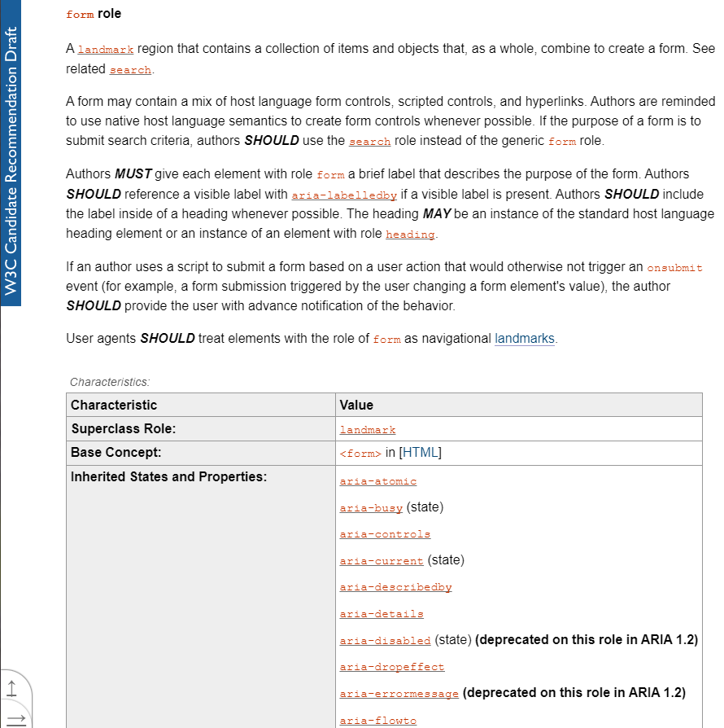

# [Accessibilité web](https://www.youtube.com/watch?v=bLPONCBPDeQ) 🔢

+ [Règles d'accessibilité web](https://www.w3.org/WAI/standards-guidelines/fr)

+ [Structure et sémantique](#Structure-et-sémantique)
+ [strong](#strong)
+ [abbr](#abbr)
+ [Balises structurantes](#Balises-structurantes)
+ [img](#img)
+ [form tabindex](#form-tabindex)
+ [a visited](#a-visited)
+ [label id](#label-id)
+ [img max-width](#img-max-width)
+ [Les attributs ARIA](#Les-attributs-ARIA)

---

## Structure et sémantique

```html
<!DOCTYPE html>
<html lang="fr">
<head>
    <meta charset="UTF-8">
    <title>FormationVideo - tutoriel HTML/CSS</title>
    <link rel="stylesheet" href="main.css">
</head>
<body>
    <h1>Accessibilité sur le Web</h1>

    <h2>Tutoriel pour HTML/CSS.</h2>

    <p>Lorem ipsum, dolor sit amet consectetur adipisicing elit. At praesentium perferendis alias id ducimus quia nemo minima minus corporis commodi deleniti dolorum unde enim eligendi eos saepe, incidunt veniam sunt.</p>

    <p>Lorem ipsum dolor, <a href="#">sit amet consectetur adipisicing elit</a>. Incidunt enim, tempore vero voluptatibus pariatur nulla nihil quaerat rerum laudantium suscipit id necessitatibus ullam dolores odit harum amet officia est libero.</p>
    
</body>
</html>
```
```css
body
{
    background-color: #111;
    color:#ddd;
    margin:auto;
    width:800px;
}

h1
{
    color:#5a8aF2;
    margin-bottom: 50px;
    text-align: center;
}
```

## strong

Balise qui donne de l'importance au niveau de la sémantique.

```html
<strong></strong>
```

## abbr

Ajouter du sens, une description.

```html
<abbr title="HyperText Markup Language">HTML</abbr>
```

## Balises structurantes

Balises structurantes (header main footer) autrefois des div (ex : `<div id="header">`) qui permettent d'améliorer l'accessibilité de nos pages.

```html
<!DOCTYPE html>
<html lang="fr">
<head>
    <meta charset="UTF-8">
    <title>FormationVideo - tutoriel HTML/CSS</title>
    <link rel="stylesheet" href="main.css">
</head>
<body>
    <header id="header">
        <h1>Accessibilité sur le Web</h1>
    </header>

    <div id="page">
        <p>Lorem ipsum dolor sit amet consectetur adipisicing elit. Quasi quas quidem dolorum ducimus nam vitae alias illum delectus, voluptatem, animi consequatur sapiente expedita mollitia tempora, iste porro ex eveniet quibusdam!</p>

        <p>Lorem ipsum dolor sit amet, consectetur adipisicing elit. Mollitia praesentium eligendi perferendis sint nulla corporis amet voluptatum quibusdam, enim laborum temporibus odit, ipsam ut expedita distinctio quo alias dolore error!</p>
    </div>

    <div id="footer">
        <p>Copyright - René la tauple</p>
    </div>
    
</body>
</html>
```
```css
body
{
    background-color: #111;
    color:#ddd;
    margin:auto;
    width:800px;
}

h1
{
    color:#5a8aF2;
    margin-bottom: 50px;
    text-align: center;
}
```

## img

Utiliser l'attribut alt en cas d'erreur d'affichage ou d'handicap utilisateur. Et pour apporter une information utile, on peut apporter une information.

Les systèmes de lecture peuvent lire le contenu de alt au lieu de src.

```html
<!DOCTYPE html>
<html lang="fr">
<head>
    <meta charset="UTF-8">
    <title>FormationVideo - tutoriel HTML/CSS</title>
    <link rel="stylesheet" href="main.css">
</head>
<body>
    <p></p>
    <p> </p>
</body>
</html>
```
```css
body
{
    background-color: #111;
    color:#ddd;
    margin:auto;
    width:800px;
}

h1
{
    color:#5a8aF2;
    margin-bottom: 50px;
    text-align: center;
}
```

## form tabindex

Utiliser tabindex pour contrôler la navigation avec la touche tab sur les différents champs d'un formulaire.

Important pour la navigation au clavier.

```html
<!DOCTYPE html>
<html lang="fr">
<head>
    <meta charset="UTF-8">
    <title>FormationVideo - tutoriel HTML/CSS</title>
    <link rel="stylesheet" href="main.css">
</head>
<body>
    <p></p>
    <p> </p>

    <form action="post">
        <p><input tabindex="1" type="text" name="someField1"> <input tabindex="2" type="text" name="someField2"></p>
        <p><input tabindex="3" type="text" name="someField3"></p>
        <p><input tabindex="4" type="submit" name="validationButton" value="OK"> <input></p>
    </form>
</body>
</html>
```
```css
body
{
    background-color: #111;
    color:#ddd;
    margin:auto;
    width:800px;
}

h1
{
    color:#5a8aF2;
    margin-bottom: 50px;
    text-align: center;
}
```

## a visited

Le lien visité change de couleur.

```html
<!DOCTYPE html>
<html lang="fr">
<head>
    <meta charset="UTF-8">
    <title>FormationVideo - tutoriel HTML/CSS</title>
    <link rel="stylesheet" href="main.css">
</head>
<body>
    <h1>Accessibilité sur le Web</h1>

    <h2>Tutoriel pour HTML/CSS.</h2>

    <p>Lorem ipsum, dolor sit amet consectetur adipisicing elit. At praesentium perferendis alias id ducimus quia nemo minima minus corporis commodi deleniti dolorum unde enim eligendi eos saepe, incidunt veniam sunt.</p>

    <p>Lorem ipsum dolor, <a href="#">sit amet consectetur adipisicing elit</a>. Incidunt enim, tempore vero voluptatibus pariatur nulla nihil quaerat rerum laudantium suscipit id necessitatibus ullam dolores odit harum amet officia est libero.</p>

    <p></p>
    <p> </p>
</body>
</html>
```
```css
body
{
    background-color: #111;
    color:#ddd;
    margin:auto;
    width:800px;
}

h1
{
    color:#5a8aF2;
    margin-bottom: 50px;
    text-align: center;
}

a
{
    color:#cda343;
}

a:visited
{
    color:red;
}
```

## label id

Associer la même valeur entre l'étiquette et le champ de texte.

```html
<form action="/tutorial/action.html">
  <fieldset>
    <legend>User Information</legend>
    <label for="firstname" id="label-firstname">First name</label> &nbsp;
    <input type="text" id="firstname" name="firstname"><br /><br />

    <label for="lastname" id="label-lastname">Last name</label> &nbsp;
    <input type="text" id="lastname" name="lastname"><br /><br />

    <input type="submit" value="Submit">
  </fieldset>
</form>
```

## img max-width

Les images vont s'adapter au body avec la propriété `max-width`.

On peut aussi adapter le texte avec `text-align` et voir en fonction du bord de l'écran.

Penser aux media queries.

```html
<!DOCTYPE html>
<html lang="fr">
<head>
    <meta charset="UTF-8">
    <title>FormationVideo - tutoriel HTML/CSS</title>
    <link rel="stylesheet" href="main.css">
</head>
<body>
    <h1>Accessibilité sur le Web</h1>

    <h2>Tutoriel pour HTML/CSS.</h2>

    <p>Lorem ipsum, dolor sit amet consectetur adipisicing elit. At praesentium perferendis alias id ducimus quia nemo minima minus corporis commodi deleniti dolorum unde enim eligendi eos saepe, incidunt veniam sunt.</p>

    <p>Lorem ipsum dolor, <a href="#">sit amet consectetur adipisicing elit</a>. Incidunt enim, tempore vero voluptatibus pariatur nulla nihil quaerat rerum laudantium suscipit id necessitatibus ullam dolores odit harum amet officia est libero.</p>

    <p></p>
    <p> </p>
</body>
</html>
```
```css
body
{
    background-color: #111;
    color:#ddd;
    margin:auto;
    max-width:800px;
    width:100%; /* On ne dépace pas le conteneur car on occupe 100% du body */
}

h1
{
    color:#5a8aF2;
    margin-bottom: 50px;
    text-align: center;
}

/* Garder les proportions de l'image */
img
{
    height:auto;
    max-width:100%;
}

a
{
    color:#cda343;
}

a:visited
{
    color:red;
}
```

## Les attributs ARIA

+ [Accessible Rich Internet Applications (WAI-ARIA) 1.2](https://www.w3.org/TR/wai-aria-1.2/#ua_dom)

L'HTML prévaut et utiliser les attribut ARIA pour des infos supplémentaires.

```html
<!DOCTYPE html>
<html lang="fr">
<head>
    <meta charset="UTF-8">
    <title>FormationVideo - tutoriel HTML/CSS</title>
    <link rel="stylesheet" href="main.css">
</head>
<body>
    <h1>Accessibilité sur le Web</h1>

    <h2>Tutoriel pour HTML/CSS.</h2>

    <p>Lorem ipsum, dolor sit amet consectetur adipisicing elit. At praesentium perferendis alias id ducimus quia nemo minima minus corporis commodi deleniti dolorum unde enim eligendi eos saepe, incidunt veniam sunt.</p>

    <p>Lorem ipsum dolor, <a href="#">sit amet consectetur adipisicing elit</a>. Incidunt enim, tempore vero voluptatibus pariatur nulla nihil quaerat rerum laudantium suscipit id necessitatibus ullam dolores odit harum amet officia est libero.</p>

    <p></p>
    <p> </p>

    <form method="post" action="">
        <input type="text" aria-label="Effectuer une recherche sur le site">
    </form>
</body>
</html>
```
```css
body
{
    background-color: #111;
    color:#ddd;
    margin:auto;
    max-width:800px;
    width:100%; /* On ne dépace pas le conteneur car on occupe 100% du body */
}

h1
{
    color:#5a8aF2;
    margin-bottom: 50px;
    text-align: center;
}

/* Garder les proportions de l'image */
img
{
    height:auto;
    max-width:100%;
}

a
{
    color:#cda343;
}

a:visited
{
    color:red;
}
```

[La balise form (attributs ARIA)](https://www.w3.org/TR/wai-aria-1.2/#ua_dom)  

  

Pour être encore plus précis.

```html
    <form method="post" action="" aria-label="Formulaire de recherche sur le site">
        <input type="text" aria-label="Critère de recherche">
    </form>
```

*Le HTML se suffit à lui-même mais on peut juger utile d'apporter d'avantages d'informations. Les attributs ARIA s'utilisent sur tout type de balises (span, div, et cetera).

+ [Définition](https://developer.mozilla.org/fr/docs/Web/Accessibility/ARIA?msclkid=65267efbc86e11ec9bcffde2157e20fb)

Accessible Rich Internet Applications (ARIA) (qu'on pourrait traduire par « applications internet riches et accessibles ») sont un ensemble d'attributs qui définissent comment rendre le contenu et les applications web accessibles.

ARIA complète HTML afin que les éléments interactifs et les widgets puissent être utilisés par les outils d'assistance quand les fonctionnalités standard ne le permettent pas. Ainsi, ARIA permet de rendre accessible les widgets JavaScript, les indications dans les formulaires, les messages d'erreur et les mises à jour dynamiques du contenu, etc.


Ciao tout le monde