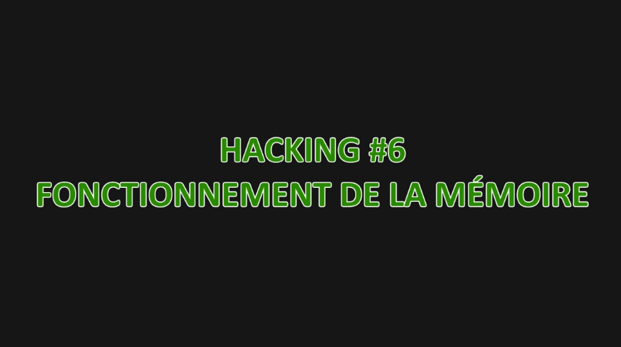
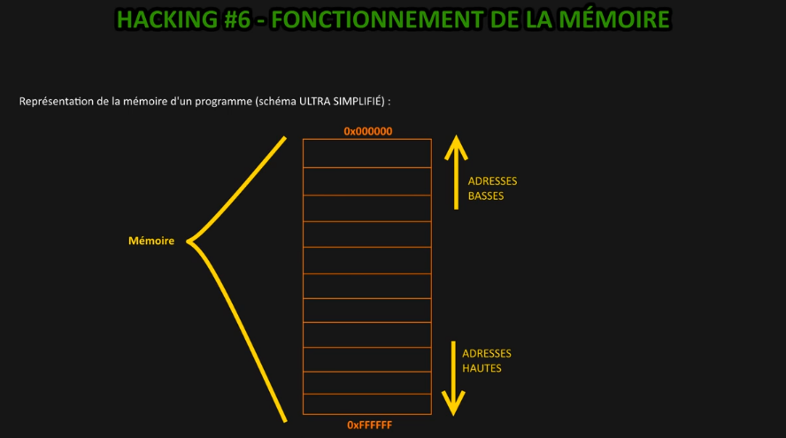
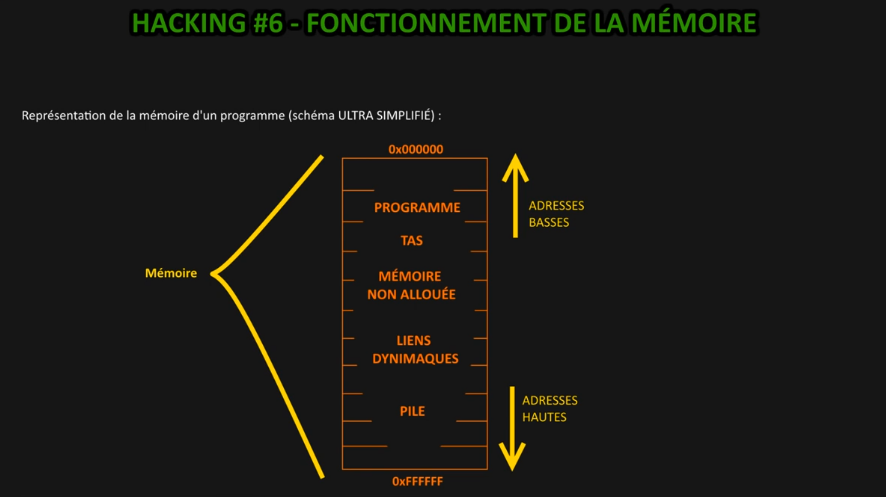
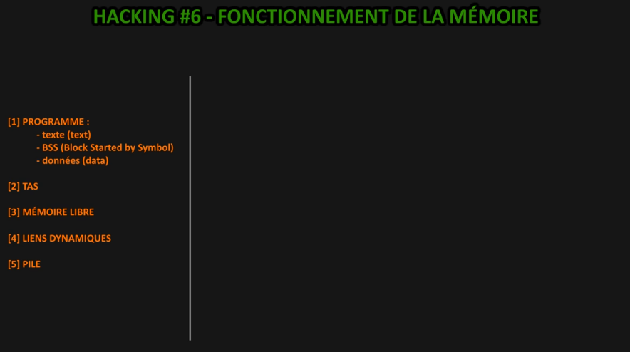
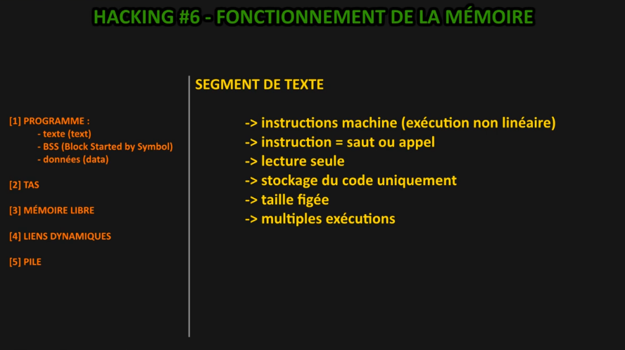
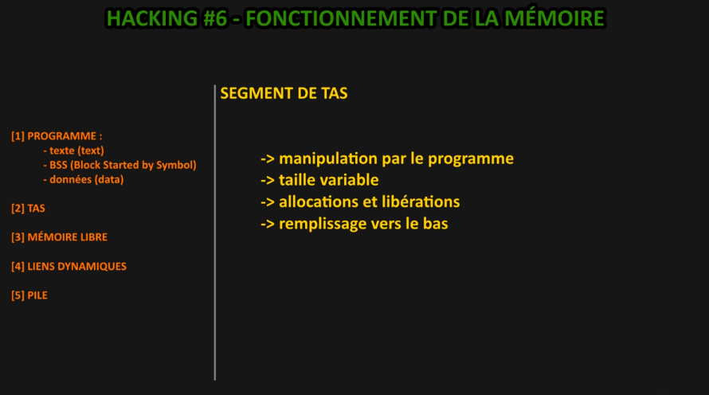
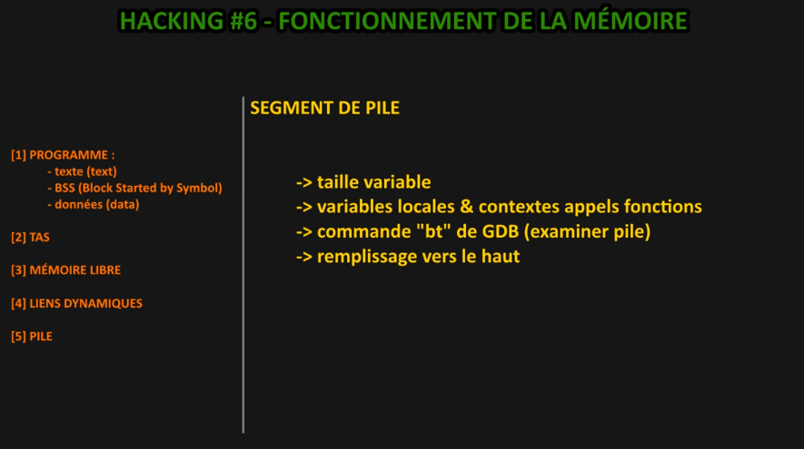
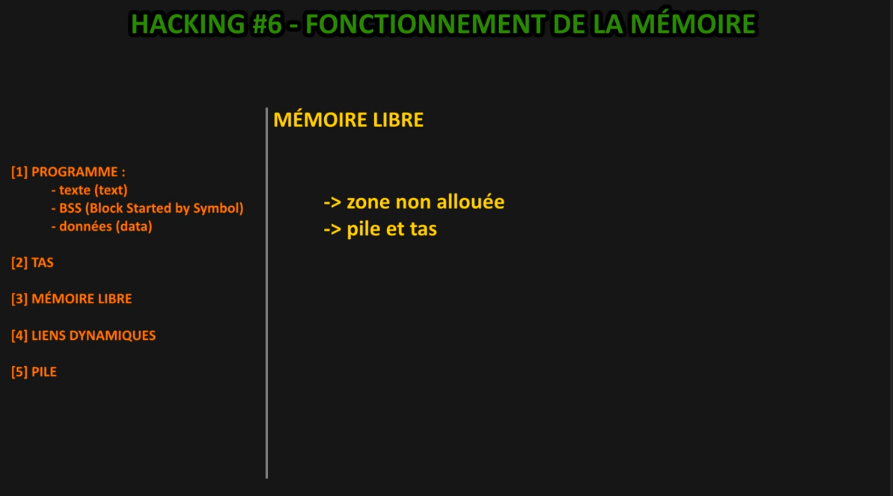
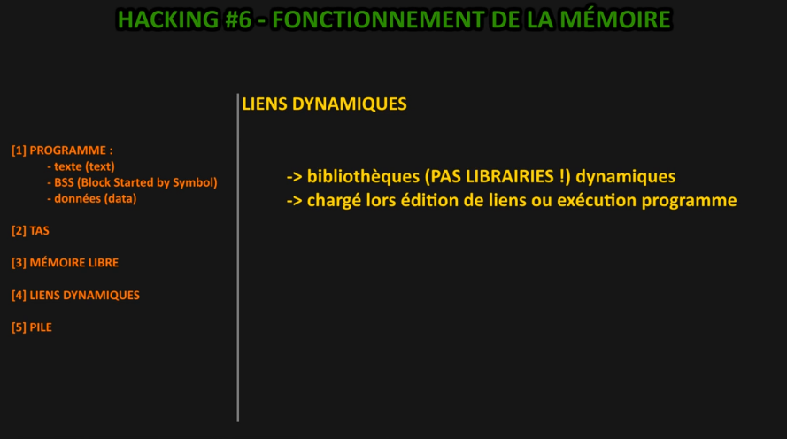

# [[ARCHIVE] Hacking #6 - fonctionnement mémoire](https://www.youtube.com/watch?v=LwtN9yq8IOE&list=PLrSOXFDHBtfG0Fb0g--43a0b47e9hrwlB&index=13)

Bloc mémoire avec des adresses, adressage de mémoire.  

En bas, les adresses basses et en haut les adresses hautes.

Segments gérés selon les spécificité de notre programme, selon le fonctionnement et son exécution, il y a des segments qui vont être gérées selon le type de donnée à stocker.

Un couche programme (la plus haute dan les adresses basses).

Une couche qui concerne le tas, la mémoire allouée, les liens dynamiques et la Pile (voir structure Pile en C).

On commence sur un premier segment *SEGMENT DE TEXTE* tel qu'on peut le lire dans les documentation.

Il stocke des instructions machines (une seule chose par instruction) comme on retrouve le langage binaire en langage assembleur qui est le plus proche du langage binaire et il va suivre une exécution non linéaire.

Les instructions seront sous forme de saut (vers une autre instruction) ou d'appel (à une partie de code). On verra en langage assembleur les appels (CALL), les sauts (JUMP).

Lecture seule parce qu'on y stocke le code qui ne doit pas être changé en cours de route. Le code ne change pas au cours de l'exécution donc on s'assure que le code ne change pas en cours d'exécution.
Il a une taille figée.

Ce segment permet plusieurs exécution d'un même programme (plusieurs instances de naviagteur, plusieurs jeu d'un même MMO, 3 instances de notre éditeur de code et cetera)

BSS est également un segment de données, *block starting symbol* et données c'est *data* donc le *segment data* et ils ont chacun une utilité aussi.

Ces deux-là les variables globales et statiques (histoire de portée de variable en C). Ce segment sert à stocker ces variables-là.  
Une taille figée.  

Un accès en écriture car si on a une variable globale dans notre script c, il va aller l'écrite dans ce segment de données. 

La différenciation se fait entre donnée et BSS c'est à dire que dans bas on va y stocker ce qui est variable non initialisée et à partir du moment où une variable est initialisée, elle va passer dans le segment de données donc le segment data.  

Grosso modo le segment de données stock le code donc les instructions machine tandis que les segments BSS et donnée vont servir à stocker les variables globales et statiques selon quels sont initialisés ou pas.

Cela pourra évidemment être manipulé par le programme donc par le programmeur vous ferez qu'on pourra faire des choses dessus. Il a une taille variable mais on reviendra dessus par rapport à la mémoire vive et il va stocker tout ce qui est allocation et libération donc tout ce qui va être allocation dynamique de mémoire et la libération de mémoire.

Vous pouvez imaginer qu'il y aurait comme des blocs et que dès que vous allouez quelque chose il va faire un bloc et il va l'enlever dès qu'on lui perd la mémoire.

On dit que le remplissage va se faire vers le bas c'est à dire qu'on va stocker vers les adresses hautes.

Avec le langage c, on connaît cette structure de données.

Elle a une taille variable évidemment parce que ça va dépendre du nombre d'éléments stockés à l'intérieur.

Elle fonctionne avec un remplissage vers le haut donc des adresses basses c'est à dire imaginez vous une pile d'objets à partir duquel vous commencez par le bas puis vous remplissez par le haut et si vous voulez dépiler vous allez commencer par enlever celui du haut parce que si vous enlevez l'assiette du bar vous risquez d'avoir des petits problèmes.

Alors c'est une taille variable forcément et on va y stocker les variables locales mais également les contextes des appels de fonction, tout simplement que quand on fait un appel de fonction il faut imaginer une boîte, une petite boîte, un frame, un bloc de cette fonction c'est à dire que si vous avez suivi la formation sur le langage c cette fonction à ses propres variables et quand la fonction est terminée vous savez que les variables sont détruites automatiquement parce qu'il y a une porte variable qui fait que tout ce qui est local est propre à la fonction où ça a été créé.

Une variable i qui a été créé dans une fonction lambda, elle n'est pas la même variable qui serait créé dans une autre ou par exemple pour la fonction main(). Rappelez vous comme ça une histoire de contexte où chaque fonction à ses propres données. Chaque fonction à ses propres données et donc ça ça va être géré au niveau de la pile, ça va être stocké. On va également avoir les variables locales quand on fait i égale quelque chose, toutes ces variables locales sont stockées automatiquement sur la pile.

On en parlera plus tard même de certains registres (EIP, et cetera). On parlera de tout un tas de registres pour savoir comment ça fonctionne au niveau de la pile parce que ce n'est pas l'objectif de cette vidéo et on le verra par la suite avec la mise en pratique de certains codes.

Alors un dernier point parce qu'avec la commande "bt", on peut examiner la pile. Tel qu'on a vu le GDB dans une précédente vidéo donc "bt" permettra d'examiner la pile et on aura besoin de le faire dans certains cas.

Grosso modo vous voyez qu'il y a ces différents segments de texte (text), BSS (Block Started by Symbol) et données (data). et on a le segment de Tas et le segment de Pile, ce sont des notions qui reviennent très souvent quand on aborde le fonctionnement de la mémoire d'un programme.

La mémoire libre c'est toute la zone non alloué, c'est la zone qui va permettre à la Pile et au Tas de stocker d'autres informations qui va s'agrandir au fur et à mesure et ainsi on peut comprendre qu'il y a une partie qui est libre et qui n'est pas utilisée.

Il y a une petite dernière qui sont les liens dynamiques, on parle de bibliothèque dynamique c'est à dire que dynamique signifie qu'on va pouvoir les inclure soit qu'elles sont chargées lors de l'édition de lien (voir la vidéo sur les étapes de compilation).

L'édition de liens c'est justement là où on va intégrer toutes les bibliothèques dynamiques, on peut le faire également avec certaines fonctions lors de l'exécution du programme.

Ainsi les liens dynamiques c'est également un espace mémoire qui est utilisé, qui est nécessaire pour pouvoir faire tout ça. C'est pour ça que je voulais ajouter en bonus, et on en parle pas forcément parce que ça nous intéresse pas plus que ça pour le moment mais je tenais quand même à le préciser au cas où vous entendrez parler.

En résumé retenez qu'il y a 5 segments : Texte (Text), données (data), BSS, la Pile et le Tas, et le lien dynamique en bonus même si ce n'est pas de la mémoire utilisée parce qu'elle est juste libre mais c'est bien de savoir qu'elle est là.

vous aurez compris comment ça fonctionne c'est à dire que les adresses basses sont en-haut et inversement.

Voilà les bases nécessaires pour faire du hacking, de la programmation système et ce genre de chose et le fonctionnement de la mémoire surtout dans des langages bas niveau tels que le langage c, voir le c++ pourquoi pas.

Dans la vidéo 7 on va se mettre à faire de la pratique.

Voilà on aura parlé d'édition de liens, on parle de débogage dans le fonctionnement de la mémoire et ça tombe bien c'est des choses qu'on a vu dans les séances précédentes.

Par la suite on fera beaucoup plus de codage.

À très bientôt et on se retrouve pour une prochaine vidéo