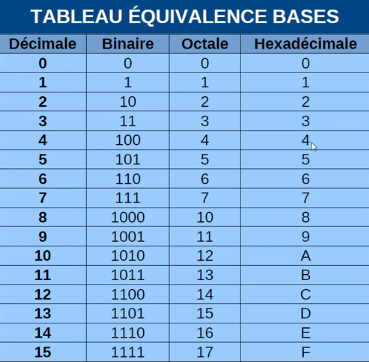

# [[ARCHIVE] Tutoriel Hacking - conversion bases numériques](https://www.youtube.com/watch?v=d3YfR0m9vw0&list=PLrSOXFDHBtfG0Fb0g--43a0b47e9hrwlB&index=14)

45<sub>(10)</sub> = 101101<sub>(2)</sub>
> `45/2=22` et `5%2=1`
```txt
45|2
 1|22|2
    0|11|2
       1|5|2
         1|2|2
           0|1|2
             1|0
```

---
23<sub>(10)</sub> = 17<sub>(16)</sub>
```txt
23|16
 7| 1|16
    1| 0
```

---
1011010<sub>(2)</sub> = 90<sub>(10)</sub>

= 1x2<sup>6</sup> + 0x2<sup>5</sup> + 1x2<sup>4</sup> + 1x2<sup>3</sup> + 0x2<sup>2</sup> + 1x2<sup>1</sup> + 0x2<sup>0</sup> 
> 2 4 8 16 32 64 128 256 512 1024 2048 4056 8152

= 1x64 + 0 + 1x16 + 1x8 + 0 + 1x2 + 0

= 64 + 16 + 8 + 2

=  80 + 10 = 90<sub>(10)</sub>

---
AB51<sub>16</sub> = Ax16<sup>3</sup> + Bx16<sup>2</sup> + 5x16<sup>1</sup> + 1x16<sup>0</sup>

= 10 x 4096 + 11 x 256 + 5 x 16 + 1

= 40960 + 2816 + 80 + 1

= 43857<sub>(10)</sub>

---
755<sub>(7)</sub> = 7x8<sup>2</sup> + 5x8<sup>1</sup> + 5x8<sup>0</sup>

= 493<sub>(2)</sub>

---
110101111<sub>(10)</sub> = 1AF<sub>(16)</sub>
> 1 octet = 8 bits
> 1 hexa = 4 chiffres binaires
```txt
(000)1 1010  1111
[0001][1010][1111]
  1      A     F
```
---
A95<sub>(16)</sub> = 101010010101<sub>(2)</sub>
```txt
  A     9     5
[1010][1001][0101]
```

---
1011011<sub>(2)</sub> = 133<sub>(8)</sub>
> 1 octale = 3 chiffres binaires
```txt
(00)1 011  011
[001][011][011]
  1    3    3
```

---
Hex <-> Oct : conversion plus longue et source d'erreur.
Hex <-> Bin <-> Oct : décomposer chaque chiffre hexadécimale en 4 chiffres binaires, ou inversemment ça fonctionne aussi.


## Tableau d'équivalence bases

*Pour gagner du temps*
