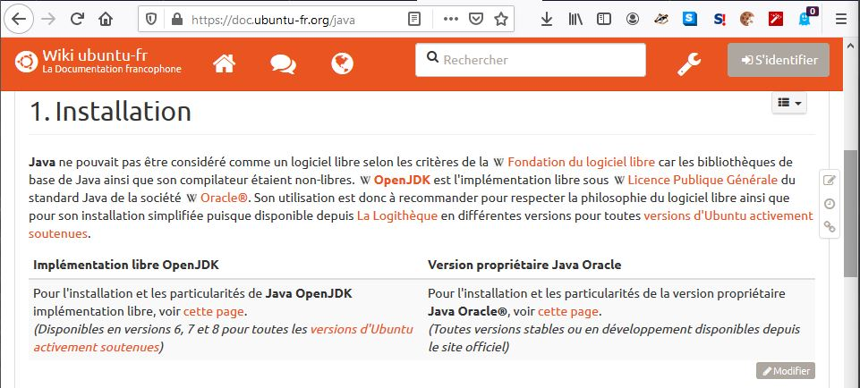
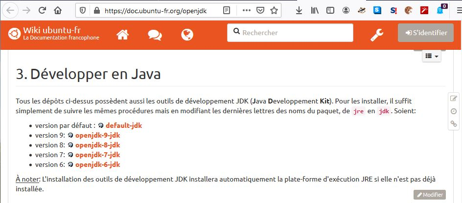

# [1. Introduction](https://www.youtube.com/watch?v=_l4pJ7HCrl4)

```java
/* YouTube: https://www.youtube.com/watch?v=_l4pJ7HCrl4
 * Titre: JavaScript #1 - hello world !
 * Date: 27-02-20 | Revision: 16-05-20
 * Compiler: -
 * Interpreter: -
 * Author: Samuel Jacquet
 *
 * Download : jdk-14.0.1_windows-x64_bin.zip
 */
```

+ [Introduction](#Introduction)
+ [Installation](#Installation)
    + [Installations sur Windows](#Installations-sur-Windows)
    + [Installations sur Linux](#Installations-sur-Linux)

# Introduction

Vidéo d'introduction à la formation au langage Java.

C'est un langage qu'on a peut être déjà utilisé sans s'en rendre compte sur notre système, notre ordinateur par le biais de quelques programmes. Il est utilisé dans beaucoup de domaine et qui est intégré dans pas mal de solution.

Ainsi il ne serait pas étonnant d'avoir des logiciels sur son ordinateur qui utilisent le logiciel Java, en tout cas la machine virtuelle de Java pour éxécuter des  programme fait via ce langage.

Dans cette vidéo, nous allons faire une présentation rapide ce dernier en exposant quelques intérets pour étudier et apprendre ce langage et ensuite, on verra comment l'installer.

Ce n'est pas très long ou pas très compliqué.

On commence par se connecter sur le site de Java : https://www.java.com/fr/

On voit déjà le logo qui ressemble à une tasse de café.

Le langage Java a été créé en 1995 par Sun Microsystem, appelé Sun pour être plus rapide.

Par la suite, cette société a été racheté par la société Oracle. Oracle est une très grosse entreprise avec son logo bien présent sur la page de Java qui a racheté le projet en 2009.

A la base, c'est un langage qui a été conçu pour permettre de réaliser des systèmes embarqués. Par exemple, dans la voiture, dans des appareils électroniques.

Des programmes embarqués sur tout ces supports. C'est pour cela qu'il a été conçu, créé à la base. Il a été pensé pour ça.

Après suivant l'évolution qu'il a eu et ses mises à jour, l'adoption par rapport aux utilisateurs et par rapport aux développeurs, son champ d'utilisation n'a pas forcément été celui qu'on attendait. Même si on mise beaucoup dans l'embarqués, ce n'est pas là où il excèle le plus, où on l'utilise le plus.

On va surtout le retrouver dans de l'applicatif, des logiciels et aussi pas mal en web également parce qu'on peut faire des sites web avec notamment JDE (ou Java EE) qui est une extension précise de Java qui permet de faire des solutions, applications web avec des servlet et des JSP. 

Ce cours s'adresse à n'importe qui même ceux qui n'ont aucune base.

Le langage Java, c'est un langage qui est objet à la base. Ce n'est pas comme le C++, qui peut être multi-paradigme, c'est à dire qu'ils peuvent permettre de programmer de 
plusieurs manières différentes.

Pour Java, on est dans un langage qui est objet, un peu plus haut niveau que le C++ qui ne va pas proposer plusieurs manières de développer nos applications.

Avec Java, c'est soit de l'objet, soit de l'objet. C'est de la programmation objet, on va manipuler des classes. On apprendra les concept par la suite tel que l'héritage, le polymorphisme, etc. On va utiliser beaucoup d'éléments liés à la programmation orienté objet, ou son diminutif POO.

On va étudier l'objet mais aussi des choses qui ne sont pas forcément en relation avec la technologie objet tel que les boucles, les fonctions, etc. 

Dés le début de la formation, il faut essayer de rester sur ce point. Le langage Java est un langage Objet. Il serait incohérent de mettre à l'écard cette technologie du langage puisqu'elle en fait partie intégrante et ça va toujours s'orienter vers cette approche Objet du langage. 

L'intéret de Java, car c'était un langage qui était prévu à la base pour être embarqués un peu partout. C'est un langage qui se veut portable. 

Comment va t-il fonctionner ? On va créer notre programme en écrivant du code.

Ensuite on va le pseudo-compiler (on parle de pseudo-compilation mais on ne rentre pas dans des détails compliqués pour cette vidéo) en bytecode qui lui pourra être interprêter
par une machine virtuelle.

La machine virtuelle Java va s'éxécuter et elle pourra lire un bytecode qui est un pseudo-code que la machine virtuelle de Java est capable de comprendre. 

Java n'est ni un code compilée à partir d'un code natif par exemple le C++ ou le C, des langages un peu plus bas niveau, et c'est ni un langage complètement interprêté. Même Python ne serait pas un bon exemple car dans Python il y a aussi une pseudo-compilation. 

Actuellement c'est assez compliqué de trouver des langages qui sont purement du langage interprêté. Peut être le Lua mais le Lua a des cas où l'on retrouve de la pseudo compilation.

Le Lua serait peut être un peu plus parlant pour ce cas là.

Si on a un langage qui est purement interprêté, il faut un interprêteur capable de le traduire pour exécuter les instructions qu'on lui a données. Java est un peu entre les deux, il est compilé d'une certaine manière et on obtient un code, un intermédiaire de code qui lui est interprêté par une machine virtuelle qui est capable de le traduire pour éxécuter les instructions qu'on lui a ordonné. Pas besoin d'aller dans les détails, c'est suffisant pour la compréhension.

Java est un langage qui est très portable parce qu'à partir du moment où l'on installe une machine virtuelle que ce soit sur Linux, Windows, MacOS, Android, etc on pourra éxécuter un pseudo-code, le fameux bytecode pour être exécuter sans modifier le code source qui a été créé à la base. On écrit un programme une fois et on peut l'éxecuter partout. C'est le principe de cette portabilité du code et donc de ce fonctionnement via machine virtuelle.

Ensuite, même si le projet a été racheté en 2009 par Oracle, il faut savoir qu'en 2006, il a changé de licence.

Selon le principe des licence, il y a des logiciels sous licences propriétaires c'est à dire qu'on a pas le code source du logiciel, on ne peut pas le modifier, on ne peut pas l'adapter, l'analyser, le consulter, voir carément vendre une version modifiée du langage. 

Pourtant Java est passé en 2006 en Open-source sous les termes de GNU General Public Licence (GPL). On peut aller voir par nous-même au sujet de la licence GPL. C'est une licence de GNU.

De nos jour, on a la version V3 mais on a également la GPL2 ou la toute premiere version.

Ainsi en 2006, on a eu ce passage en licence open-source et on a groso modo deux version de Java qui coexistent, qui continuent d'évoluer chacune en parallèle :
    + On a la version initialement de Sun, la version propriétaire.
    + On a la version open source, appelé l'OpenJDK. OpenJDK est une version open source de l'environnement qui va nous servir à exécuter du Java et éventuellement des outils de développement.

De tout les langages de programmation, pourquoi prendre le Java ?

Java est un langage qui est indépendant de la plateforme. C'est un très bon point. C'est ce qui en fait sa force.

On a un seul code à écrire et ensuite on pourra l'exécuter sur une machine virtuelle peu importe le support sur lequel le code s'exécutera. A part quelques exceptions près où il faudra par moment faire quelques petites modifications mais pratiquement jamais.

Le code sera portable puisqu'il sera indépendant de la plateforme. Cette portabilité lui confère un autre avantage est d'avoir accès à un ensemble de bibliothèques qui sont disponible en standard.

Par exemple en Java, en natif, en standard via des bibliothèques qui sont intégrées à l'intérieur, on peut manipuler pas mal de choses comme des bases de données, différents type de formats de données sans devoir télécharger ou configurer des bibliothèques externes alors qu'il faudrait le faire sur un langage plus bas niveau comme le C ou le C++. 

En C++, par exemple, si on veut manipuler des bases de données, il faudra télécharger une bibliothèque tierce. Le téléchargement d'une bibliothèque tierce ne signifie pas forcément quelque chose de portable mais qu'il faudra adapter suivant qu'on le fait fonctionner sur Windows ou Linux. 

Ca peut être vu comme un défaut pour les langages plus bas niveau.

C'est un avantage du langage Java. Si on doit manipuler des infrastructures un peu particulière, à priori, Java devrait le faire. C'est un langage qui a un ensemble de bibliothèques qui sont très vaste. Il est impossible de connaître toutes les bibliothèques de Java puisqu'il y en a enormément.

Il y a des bibliothèques pour faire du web, de la base de données, de l'applicatif, de la 3D, du réseaux, tout un tas de choses et pratiquement tout est déjà disponibles en standard.

Pas besoin de commencer à télécharger des trucs fait par d'autres personnes ou des bibliothèques externes dont déjà pour beaucoup disponibles en standards.

Les deux points essentiels de Java, ses deux gros avantages :
    + L'indépendance de Java vis à vis de nos plateformes. 
    + Le fait qu'il y ai énormément de fonctionnalités disponibles en standard. Pas besoin de télécharger autre chose à part.

Le problème comme tout langage de programmation (il n'y a pas de langage parfait). Le souci avec Java, c'est qu'on a pas la possibilité de gérer la mémoire, la possibilité de faire un programme qui gère la mémoire plus spécifiquement, qui en fait de la programmation plus bas niveau, de la programmation système. Ce n'est pas possible en Java, là où le C++ le permettrait. Ce n'est pas un inconvénient, c'est une limite du langage. On ne peut pas parler de défaut dans ce cas. Il n'est pas conçu pour faire de la programmation système ou bien de la gestion de mémoire. Si on veut faire de la gestion de mémoire, on ne va pas utiliser Java, ce serait un très mauvais choix. On parlera plutôt de limite.

La limite de Java, c'est qu'on ne peut pas faire de la gestion de mémoire. Par contre C++ possède cette atout-là, de gérer de la mémoire, de faire de la programmation très bas niveau.

Du coup puisqu'il n'y a pas de programmation plus bas niveau, qu'il y a une machine virtuelle qui est censé exécuter le bytecode Java, c'est évidemment un langage qui aura une exécution plus lente. On ne peut pas dire qu'il a une exécution lente mais plus lente par rapport à des langages compilés en natif comme le C++.

Si on devait faire des tests de performance, des Benchmarks de très haut niveau et si on comparait C++ avec Java, C++ sera toujours devant. En effet, c'est un langage plus bas niveau qui permet de programmer plus bas. C++ est un langage qui est compilé en natif. On a un code source, on procède à des étapes de compilation et on obtient un binaire. Ce genre de langage sera toujours le langage le plus performant comparé à Java. C'est évident.

Le fait d'avoir besoin d'une machine virtuelle qui tourne en parallèle et qui en plus va faire tout un tas de choses également (on en parlera) rend l'exécution plus lente qu'un langage compilé mais ce n'est pas parce que on dit qu'il est plus lent que C++, qu'il est lent. Il faut prendre ça de manière relative.

Java reste très rapide par rapport à l'utilisation qu'on doit en avoir.

C'est donc une autre limite du langage, ces temps d'exécution. Pour certaine chose très très critique, Java ne serait pas forcément le bon choix. 

Un autre point à savoir au niveau de certaines limites de Java, c'est son intégration avec le système sur lequel on travaille qui est assez faible. Ce qui est normal parce que Java veut être un langage portable.

Quand on veux un langage qui soit indépendant d'une plateforme, il ne doit pas trop se rattacher à une plateforme en particulier. Du coup, on perd une intégration avec le système en particulier.

Par exemple, si on veut commencer à manipuler des PDFs ou un type de fichier Office ou travailler avec notre système de messagerie mail sur notre OS, ça va être assez délicat avec Java parceque beaucoup de choses seront très compliqué dans ce sens là. Toujours parce que le langage n'est pas prévu pour être très rattaché au support, à la plateforme en particulier mais rester un peu en surface pour du coup rester suffisament portable et indépendant de chacune d'entre-elles.

Voilà c'est le défaut de ces qualités. C'est qu'en ayant certains attouts, ça lui confère certaines limites.

Voilà groso modo, les 5 points à retenir :

    + Les 2 attouts à retenir :
        + L'indépendance vis à vis des plateformes.
        + La standardisation de beaucoup de fonctionnalités dans le langage.
    + Les 3 limites à retenir :
        + Pas de gestion de la mémoire possible, pas de pointeurs (évidemment, c'est logique), etc.
        + Une exécution forcémment plus lente qu'un langage complètement compilé.
        + Très peu d'intégration avec le système puisqu'il est portable.

Maintenant que tout cela est dit, on va pouvoir passer à l'installation.

## Installation

Qu'est-ce qu'il nous faut pour Java ?

Comme pour les autres langages, il nous faut un éditeur de codes. On ne va pas s'amuser à installer un environnement de développement qui peut être ultra lourd, très lent et qui demande beaucoup de configurations (Il y aura peut être des tutos sur certaines playlist pour installer un environnement de développement comme Eclipse, NetBeans, Visual
Studio ou autre).

Pour cette formation, on va se contenter du minimum car on essaye d'être indépendant de tout outils. En Java, on est pas obligé d'installer un environnement de développement pour programmer en Java. Pour Java, on a juste besoin d'avoir des outils de développement et avec notre éditeur de code et une simple ligne de commande, on pourra compiler en bytecode nos programme et les exécuter avec la machine virtuelle sans problème.

Donc il nous faut un éditeur de code, le plus simple que l'on veut tel que Atome, Bracket, Visual Studio Code, Sublime Text, NotepadPlusPlus, etc. Il y a des sites qui font des comparatifs éventuellement. Il faut chercher un éditeur de code qui n'est pas lié à un langage en particulier. Pas un éditeur de code spécialement pour Java sinon il faudra installer un éditeur de code différent par langage. Il en faut un qui permet de programmer dans plusieurs langages. 

Il faut voir selon nos goût, nos préférences, est-ce qu'on veut un logiciel en anglais ou en français, avec un système de thème ou non, d'autocomplétion, des plugins, etc ?
Il faut télécharger celui qui nous plaît et celui qu'on préfère dans le lot. Par exemple, NotepadPlusPlus est un peu ancien et pas mal connu.
Une fois qu'on a cet éditeur de téléchargé et d'installé, il nous faudra Java avec les outils de développement.
On va commencer avec Windows, on reviendra avec Linux et MacOS après.

### Installations sur Windows

Il faut aller sur "java se" dans la barre de recherche avant d'arriver sur le site d'Oracle. On arrive à priori sur cette page :

[https://www.oracle.com/java/technologies/javase-downloads.html](https://www.oracle.com/java/technologies/javase-downloads.html)

On tombe ainsi sur la page d'Oracle pour le téléchargement sur lequel il faut distinguer deux choses. 

Au moment de la vidéo, c'est la version Java SE 10.0.1 et il y a deux cas particulier, on a ce que l'on appelle le JDK qui possède à la fois le JRE, c'est Runtime Environment, l'environment de lancement qui va permettre de faire tourner notre programme plus des outils de développement. 

Si un jour, on a un programme qui nécessite Java pour fonctionner, il faudrait simplement le JRE, c'est à dire la machine virtuelle, pour juste un utilisateur et pas un développeur. 

En tant que développeur, on a besoin à la fois des outils de développement plus ce fameux JRE qui est la machine virtuelle.

Donc on installe le JDK, sur lequel on fait Download et on viens sur cette page :

[https://www.oracle.com/java/technologies/javase-jdk14-downloads.html](https://www.oracle.com/java/technologies/javase-jdk14-downloads.html)

Si besoin, il faut accepter la licence (Oracle Binary Code Licence Agrement for Java SE). 

Il est recommandé de lire les licences, les conditions d'utilisation. Il ne faut hésiter à lire pour voir ce qu'il en retourne. 

On peut ainsi chosir la plateforme, sur Windows, on télécharge le fichier éxécutable ce qui devrait s'installer très simplement (un version compressé existe depuis 2020).

Pour Linux, on pourrait passer par cette page mais c'est un peu plus délicat, on regardera sur un système Linux pour installer Java en ligne de commande. Ca peut être assez déroutant d'installer Java via le package.

Le téléchargement de Java est assez long, ça prend quelques centaines de mega. Ils n'ont pas forcément beaucoup de bande passante. 

Si on lance l'exécutable, on laisse tout par défaut. On voit sur la seconde fenêtre la partie "Development tools" et le "JRE" (+ également le code source de Java). 

L'installation est assez rapide, il installe le JRE à part et ensuite il devrait redémarrer l'installateur du JRE.

Il est recommandé de ne pas "Activer le contenu Java dans le navigateur" dans la "configuration personnalisée" à cause de petite faille de sécurité lié à ça. 

Il faut ensuite activer Java dans la variable d'environnement. C'est important de le faire pour ainsi l'utiliser en ligne de commande. L'installateur ne va pas le faire tout seul contrairement à Python qui permettait d'ajouter le chemin de l'éxécutable de l'interprêteur à la variable d'environnement.

Si on passe par l'éxécutable, on récupère le lien de javac.exe dans les binaire :
```txt
    C:\Program Files\Java\jdk-13.0.2\bin\
```
C'est l'outil qui va nous permettre de transformer en bytecode notre programme.

On copie ce chemin à la variable d'environnement PATH.

    Sur Windows 10, c'est un clic droit sur le menu Démarrer, "Paramètres Windows", Rechercher "Environnement ..." et il devrait nous proposer "Modifier les variables d'environnement système". On suit ensuite le bouton "Variables d'environnement" et on va modifier la variable PATH. On copie le lien avec éventuellement un slash à la fin et on fait entrer.

Qu'est-ce que cela veut dire ? Pour accéder à l'éxécutable javac.exe, on aura plus besoin de taper tout le chemin dans un terminal pour l'utiliser :
```txt
    C:\Program Files\Java\jdk-13.0.2\bin\javac.exe
```
Grace à l'ajout aux variables d'environnement, il faudra juste taper :
```powershell
    javac.exe
```
...parce que tout le chemin a été ajouté à la variable d'environnement.

Pour Mac c'est pareil. Il faut voir comment fonctionne le système des variables d'environnement.

### Installations sur Linux

Pour Linux, on va plutôt installer la version Open Source, c'est à dire Open JDK.

Cette version est recommandée mais après on peut installer la version de Sun mais en général, on va préférer Open JDK. Il est probable que la majorité des systèmes l'installent par défaut.

Soit il est installé, soit il ne l'est pas. On va aller sur internet et la doc suivant notre destribution (Débian, Ubuntu, Linux Mint, Budgie, etc), une version basé sur Débian à la base.

On chercher "Doc Ubuntu" et on trouve tout ce qu'il faut pour aide pour installer Java même si c'est pas toujours à jour. Parce qu'il faut que ce soit tenu à jour.

[https://doc.ubuntu-fr.org/](https://doc.ubuntu-fr.org/)  
[https://doc.ubuntu-fr.org/java](https://doc.ubuntu-fr.org/java)  

Il faut voir quels versions se trouve dans les dépots (probablement une version inférieur).

Il y a plusieurs versions, on peut faire cohabiter plusieurs versions ensembles. 

Mais pour rester sur quelque chose de simple, on va installer OpenJDK. On chercher une implémentation libre d'OpenJDK. Jusqu'à la version 11, il y a avait deux versions :
```txt
	Implementation libre OpenJDK ;
	Version propriétaire Java Oracle.
```
On ouvre "cette page" dans l'implementation libre OpenJDK (Capture.JPG). On arrive sur la page :

[https://doc.ubuntu-fr.org/openjdk](https://doc.ubuntu-fr.org/openjdk)  
  
	
On a une version "par défaut" (Capture2.JPG) sinon on peut installer une version particulière.

  

On va installer "default-jdk". On revient sur le terminal mais avant on met à jour les paquets.
```bash
	sudo apt-get update
```
Si on est sur Arch Linux ou une autre distribution, c'est qu'on est déjà sur quelque chose de plus compliqué à la base. Si on est sur ce genre d'OS Linux, c'est qu'on est à priori capable de se débrouiller tout seul.

On installe maintenant le default-jdk :
```bash
	sudo apt-get install default-jdk
```
La version par défaut qui m'installe est la 11.Les fonctionnalité arrivé avec les versions 14 de Java ne seront probablement pas disponible sur Linux.

En Java, on ne vera pas tout ce qu'il y a sur Java. Dans cette formation, on verra les concepts de Java. On étudiera quelques bibliothèques en standard qui sont intéressants à faire. Le reste serra à apprendre nous même en autonome parce que c'est un langage vraiment très vaste. Il y a énormément de chose. 

Enfin, on vérifie que Java est bien installé avec la commande :
```bash
	javac
```
Si toutes les options s'affiche, c'est que cela a fonctionner.
```bash
	clear
```
Voilà si c'est installé, on pourra l'utiliser en lignes de commandes sur Windows, Linux, MacOS.

Il suffira de tapper "javac" suivi de quelques arguments derrières pour pouvoir convertir en pseudo-code et après éxécuter notre programme avec la commande Java. 

Si par contre "javac" ne fonctionne pas lorsqu'on teste, laisser un commentaire ou bien reprendre toutes les étapes pour voir si on a pas oblier quelque chose. Sur Windows, il ne faut pas oublier d'ajouter sur la variable d'environnement PATH (le chemin).

Sur MacOS, à priori, il ne doit pas y avoir besoin de le faire et sur Linux, c'est gérer tout seul par défaut.