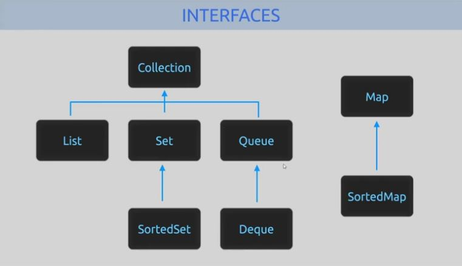
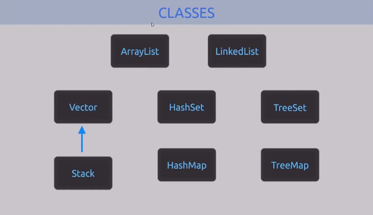

# [22. Introduction collections](https://www.youtube.com/watch?v=ov3d4s5w_m0)

Bonjour à tous et bienvenue pour cette vingt-deuxième séance en Java. 

Petite introduction Pour un grand chapitre qui arrive sur ce cours avec toutes les collections, la collection qu'on ne va pas aborder dans la globalité parce qu'il y en a vraiment énormément mais on va en aborder pas mal. 

Je voulais justement faire une petite vidéo d'introduction Pour revenir sur certaines choses et notamment des vidéos des séances qu'on n'a pu aborder précédemment et qui vont nous servir. 

Pour suivre ce nouveau chapitre, il est inutile de suivre le cours si vous n'avez pas assimilà des notions comme l'héritage, le polymorphisme, le fonctionnement et l'utilité des interfaces, on en a longuement parlà, Je vais essayer d'être un maximum complet et de vous donner un maximum de détails sur cette partie-là pour que vous puissiez comprendre le principe et à quoi ça sert, dans quels cas vous allez pouvoir les employer.

Encore une fois comme je vous l'avais dit précédemment, le langage Java est très très riche, riche en contenu et riche en classe qu'il possède d'une manière native que l'on utilise que l'on peut réutiliser que l'on peut étendre pour ajouter des fonctionnalités. 

Les interfaces permettent de garantir certaines fonctionnalités au niveau de nos programmes, c'est très important. 

Si vous avez des problèmes avec ces différentes notions, ces différents concepts en programmation et plus exactement le langage Java, ça sert à rien de poursuivre car tout ce que vous avez vu évidemment jusqu'à prèsent va vous servir pour la suite et va vous aider un petit peu à comprendre tout ça.

Les collections, il faut le voir comme des interfaces en principe parce que ce sont notamment les interfaces qui proposent la garantie qui en fait établissent un certain nombre de fonctionnalités d'accord. 

C'est en fait un contrat, une sorte de contrat pour dire que telle interface garantie que toute ces fonctionnalités, ces méthodes en l'occurrence vont être disponibles, utilisable pour toutes les classes qui l'implémenterons.

Vous allez retrouver tout un tas de classes que vous allez pouvoir directement utiliser en programmation qui vont implémenter ces différentes interfaces et proposer différentes manières de manipuler, de gérer, de stocker des données.

Les collections c'est un terme qu'on utilise en Java pour prèsenter pour parler de tout ce qui est structure de données. 

Vous avez peut-être vu dans d'autres langages de programmation Ou simplement en informatique de manière générales, entendu parler de pile, de liste, de file, on a vu précédemment comme manipuler des tableaux à taille fixe notamment sur les premières séances du cours lorsqu'on a parlà des tableaux. 

Et là on va manipuler des structures un petit peu plus complexe et surtout des structures dynamiques, l'avantage de ces différentes structures c'est qu'elles pourront accueillir une taille variable d'éléments. 

Parce que en fait des collections permettent de stocker ce qu'on appelle des éléments, des différentes données et on peut ajouter de nouveaux éléments, en supprimer, on peut accèder à ces différents éléments, supprimer même un endroit bien précis de la structure et tout ça est géré de manière dynamique au niveau de la mémoire. C'est tout l'intérêt d'ailleurs de se servir de ses collections. 

## Prise de note

On va passer un petit peu à ce qui vous attend pour la suite, j'ai préparé de quoi prendre des notes en tout cas pour vous noter quelques petites choses par rapport à ça, mais on reviendra dessus. 

La première chose à savoir ce sont les interface. 

En Java il y a énormément d'interface qui sont rattachés aux collections et je vais vous en prèsenter quelques-unes au travers d'un schéma pour faire très simple et faire cette petite introduction Aux collections que nous allons voir en Java. 

On commence par ici avec ce petit schéma Qui vous prèsente en tout cas rapidement 4 grandes familles de collection. 
```txt
+--------------------------+		+-----------+
|       Collection         |		|   Map     |
+------+-----------+-------+		+-----------+
| List |    Set    | Queue |		| SortedMap |
+------+-----------+-------+		+-----------+
       | SortedSet | Deque |
       +-----------+-------+
```
Alors toutes les interfaces ne sont pas reprèsentés. Je vous invite d'ailleurs à aller voir sur la documentation de Java, vous trouverez comme ça tout le détail de chaque interface disponible et si d'ailleurs vous galèrez un petit peu avec les documentations, j'ai fait une vidéo d'aide qui vous permet d'ailleurs de voir un petit peu la manière dont vous avez à consulter les documentations en ligne. 

A partir de là, j'ai mis une interface ...Encore une fois je n'ai pas mis toutes les interfaces qui existent, j'ai mis surtout celles qui étaient le plus pertinentes pour vous faire cette introduction à savoir cette interface collection, d'accord, qui est vraiment une interface mère Et qui va avoir différentes interfaces, ici des sous interfaces de celle-ci. 

On retrouve une première grande famille qui est l'interface des listes (List). Il y aura tout un tas de structures sous forme de liste et vous verrez que beaucoup beaucoup de classe peuvent implémenter cette interface là. 

On a ensuite l'interface de type Set ou éventuellement Set qui sont ordonnés (SortedSet).

On a Queue qui correspond au fil et ici on a Deque, ça c'est autre chose c'est pour les fils doublement chaînées. Nous ne rentrerons pas dans les détails pour le moment pour la 3e famille. 

Et une 4e famille, qui est ta part, qui n'appartient pas directement à collection, ici comme interface. On a une interface Map et notamment comme ça une autre interface qui est SortedMap qui est en fait une map ordonné. 

On retrouve comme ça pas mal d'éléments. 

Dans la description de la vidéo vous retrouverez comme d'habitude, comme c'est souvent le cas sur d'autres vidéos, un lien vers mon github et vous avez comme ça la possibilité de retrouver les différents schémas prèsenté en vidéo. Vous pouvez retrouver aussi pas mal d'informations aussi sur la manière que vous aurez de stocker vos informations, vos éléments, vos données selon le type de structure, type de collection utilisé mais c'est des choses qu'on va voir au fur et à mesure dans les prochaines vidéos. 

Là c'est vraiment une vidéo d'introduction Et ensuite on va aborder pas mal de types de collections différentes pour voir comment fonctionne ces différentes collections-là. 

A partir de ces interfaces on va pouvoir retrouver des classes qui vont les implémenter. 

Encore une fois, les interfaces vous garantissent un certain nombre de méthodes. Par contre on saura que pour collection, On va retrouver tout un tas de méthodes qui sont garanties pour cette interface. ça peut-être tout simplement, j'ai mis ça dans un fichier Java pour voir.
```java
	/*
		Quelques méthodes de l'interface Collection

	*/

	add()
	addAll()
	clear()
	contains()
	isEmpty()
	remove()
	size()
```

On va retrouver par exemple la méthode add(element) qui permettra d'ajouter un élément. Je ne vais pas mettre les valeurs de retour et cetera, le but ce n'est pas de vous énumèrer ce que l'on retrouve dans une documentation Mais simplement que vous puissiez voir quelques méthodes. Je vais d'ailleurs ne pas mettre de paramêtres. 

Vous avez add qui permet d'ajouter un élément, Vous allez d'ailleurs voir que dans une collection vous allez pouvoir en ajouter une autre. Vous allez pouvoir ajouter une collection dans une autre collection addAll().

Vous allez pouvoir éventuellement supprimer clear() Pour supprimer le contenu de votre collection. 

Vérifiez si votre collection contient des éléments en particulier contains().

Sachant que l'on peut ajouter des éléments ou vider une collection, On a de quoi vérifier si elle possède des éléments ou pas isEmpty(). Donc si si elle est vide. Très simplement. 

Et on va retrouver d'autres choses, oui si on a fait add(), on a aussi remove() pour supprimer des éléments. 

Vous verrez que selon le type de collection, Les comportements sont bien évidemment différents, c'est aussi tout l'intérêt de passer par une interface et ensuite on a par exemple des méthodes comme size() pour avoir le nombre d'éléments de notre collection. 

Sa notre interface collection garantie encore une fois et c'est là qu'il faut avoir compris le principe des interfaces et de tout ce que je vous expliquais précédemment sur toutes ces notions d'interface, d'héritage, de polymorphisme et cetera. 

C'est à partir de cette interface là (Collection), on garantit que toutes les classes qui vont l'implémenter doivent forcément implémenter ces méthodes (add(), remove(), ...).

Vous savez d'avance que toutes les classes qui vont l'utiliser qui implémente éventuellement cette interface collection ou une autre interface auront toutes ces méthodes-la qui seront disponibles. 

Là ça va être très pratique parce que en apprenant à utiliser une collection, ça va déjà vous apprendre à utiliser plein d'autres collections parce que vous allez vraiment retrouver des méthodes qui sont disponibles sur l'ensemble, la quasi-totalité des corrections que vous allez utiliser en Java donc ça c'est vraiment très très pratique virgule il n'y aura pas besoin D'apprendre pour chaque Collection, toutes les méthodes de chaque collection. 

Vous allez retrouver pas mal de choses qui sont similaires et qui sont même identiques de l'une à l'autre. 

A partir de là, revenons sur le schéma.

## Interfaces


<!--
```txt 
+--------------------------+		+-----------+
|       Collection         |		|   Map     |
+------+-----------+-------+		+-----------+
| List |    Set    | Queue |		| SortedMap |
+------+-----------+-------+		+-----------+
       | SortedSet | Deque |
       +-----------+-------+
```
-->
Chaque sous interface ici (List, Set, Queue, Map) propose un contrat un peu plus spécialisé c'est-à-dire qu'elles possèdent toutes les informations de l'interface collection Mais également des méthodes qui sont peut-être un peu plus spécifiques on s'imagine bien qu'on ne va peut-être pas manipuler une file (Queue) comment on va manipuler une liste (List), on aura peut-être des choses qui vont différer où qui vont s'ajouter et ainsi de suite. 

Pareil pour les Map. 

A partir de là, si j'ai par exemple une classe plus tard qui implémente cette interface liste (List) qui elle-même est une sous interface de collection, On sait que dans notre sous-classe de List on aura, nous aurons toutes ces informations là (Collection + List). ça va nous permettre d'utiliser énormément énormément de méthodes de manipulation de nos données avec ses différentes collections.

Puisque je vous parlais justement de classe pour manipuler directement nos collections, on va les retrouver ici (nouveau schéma) : 

## Classes


<!--
```txt
+-------------+--------------+
| Arraylist   | LinkedList   |
+--------+----+----+---------+
| Vector | HashSet | TreeSet |
+----^---+---------+---------+
| Stack  | HashMap | TreeMap |
+--------+---------+---------+
```
-->
Voici parmi les classes pour manipuler directement nos colections, on les retrouve ici. On les retrouve ici, je vous en ai énumuré quelques-unes. 

Est-ce qu'on va tous les aborder en vidéo ? Honnêtement au moment où je fais cette vidéo je n'en sais rien. Je sais qu'on va en aborder pas mal. Au moins 4 ou 5 dans le tableau ci-dessus après peut-être qu'on les fera toutes je n'en sais rien. 

Mais en tout cas voilà à peu près un ordre d'idée. 

ArrayList, on reviendra de toute façon dessus. LinkedList, Vector, Stack et cetera. 

Le but, c'est de ne pas avoir des collections à taille fixe mais des collections beaucoup plus complexe et dynamique notamment pour se débarrasser de "comment gérer la mémoire ?" Ou bien on a un tableau qui fait tant, qui peut contenir tant d'éléments... on ne pourra pas aller au-delà. On pourrait pas aller au-delà virgule sinon on aurait tout simplement des exceptions qui serait provoquée. 

A partir d'ici on a des collections dynamiques donc c'est un moment au départ on a 5 éléments de notre collection, si plus tard on se retrouve avec des éléments dans la collection, la taille de la capacité de la collection en elle-même, du conteneur, va évoluer dynamiquement sans problème et tout sera géré au niveau de ces différentes classes, nativement implémentée dans Java, c'est là encore Une fois tout l'intérêt.

Donc on verra pas mal de chose, d'accord. On reviendra de toute façon en fonction des classes qui vont être abordés sur chacune d'entre elles par exemple vous serez lesquels permettent d'avoir des données, des informations qui sont ordonnées. Celles qui permettent ou qui autorisent ou qui interdisent la prèsence de doublons dans les différentes structures. Est-ce qu'on a un fonctionnement par couple clà valeur comme on a notamment dans les Maps, ça vous connaissez un petit peu pour certains. 

On a abordé ça quand on a parlà des chaînes de caractères, je vous ai beaucoup parlà de tout ce qui était accès concurrents ou non, vous savez ThreadSafe ou non, c'est à dire ce qui va être synchroniser il se fait Multi threading et ce sera forcément plus long à l'usage parce que ça fonctionne dans un environnement multi threading. Et ce qui est en mono thread sont des choses qui elles ne sont pas synchroniser et qui sont forcément plus rapides par rapport à ça.

Rappelez-vous de StringBuilder, StringBuffer, je vous avais expliqué la différence entre ces 2 classes et dans quel cas il fallait utiliser l'une et dans quel cas il fallait utiliser l'autre. 

Mais là c'est un petit peu pareil, pour ceux qui vous attendent pour la suite du cours en fonction des différentes classes de collection Que nous verrons, je vous expliquerais dans quel cas on va plutôt utiliser ArrayList, dans quel cas on va plutôt utiliser Vector et cetera et cetera. 

Parce que vous allez voir qu'il y en a certaines qui sont un assez similaire et sur le coup on peut se demander pourquoi il en existe 3 différentes, pour citer ces 3 là : ArrayList, Vector et LinkedList. On peut véritablement y stocker la même chose, C'est véritablement en fonction de leur spécificité qui va faire la différence à l'usage afin de se dire que pour tel cas, je dois plutôt utiliser ça et dans tel ou tel autre qu je vais plutôt utiliser Vector parce que ça répond à des besoins bien précis en fonction. 

Voilà pour cette introduction Et je pense que je ne vais pas faire plus long parce qu'on aura bien l'occasion de revenir dans le détail sur toutes les autres choses donc on a fait le tour. 

Il n'y avait pas grand chose à noter seulement quelques méthodes par-ici.

Si vous voulez en savoir plus par avance vous pouvez toujours aller consulter de la documentation mais on verra dans le détail, énormément de classe, comment on les utilise, on parlera notamment des itérateurs parce que vous verrez que les itérateurs c'est une notion qui va rentrer en jeu au niveau de c'est collections mais qui a vraiment son importance par rapport à ça.

Je ne pense pas que je ferais une vidéo itérateurs à part, je pense que ce sera directement intégré quand on abordera la première collection que nous verrons qui sera peut-être avec Vector ou ArrayList, une de ces 2 probablement.

Comme ça vous verrez ce qui vous attend un petit peu pour la suite. 

S'il y a des questions par rapport à ça même si c'est juste une vidéo d'introduction, n'hésitez pas bien évidemment si vous voulez en savoir un peu plus par rapport à ça.

Moi je vous retrouve prochainement pour une nouvelle séance en Java et à priori on commencera par ArrayList et Vector parce qu'il y a déjà pas mal de choses à dire là dessus et ces 2 classes en l'occurrence s'utilise dans des caves bien spécifique, bien précis, parce qu'elles font globalement la même chose mais elles ne s'utilisent pas de la même manière ou en tout cas dans le même contexte.

Je vous dis à bientôt pour la suite de cette formation si y a des questions en commentaires n'hésitez pas à les poser. 

A bientôt tout le monde