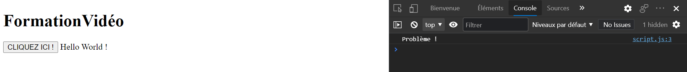

# [2. Hello world !](https://www.youtube.com/watch?v=PsosD3WyFfI)

+ [Intégrer du Javascript dans des balises HTML](#Intégrer-du-Javascript-dans-des-balises-HTML)
+ [Intégrer du JavaScript dans des balises scripts](#Intégrer-du-JavaScript-dans-des-balises-scripts)
+ [Intégrer du JavaScript par un fichier externe](#Intégrer-du-JavaScript-par-un-fichier-externe)
+ [Afficher le Hello World dans le navigateur avec un objet document](#Afficher-le-Hello-World-dans-le-navigateur-avec-un-objet-document)
+ [Commentaires en JavaScript](#Commentaires-en-JavaScript)
+ [Déboggage](#Déboggage)
    + [Objet console - méthode log](#Objet-console---méthode-log)
    + [Objet console - méthode clear](#Objet-console---méthode-clear)
    + [Objet console - méthode error](#Objet-console---méthode-error)
+ [Documentation et outil](#Documentation-et-outil)

## Intégrer du Javascript dans des balises HTML

On clique sur le bouton qui déclenche un événnement avec la fonction alert() qui affiche le message *Hi !* dans une pop-up.

```html
<!DOCTYPE html>
<html lang="fr">
<head>
    <meta charset="UTF-8">
    <meta name="viewport" content="width=device-width, initial-scale=1.0">
    <meta http-equiv="X-UA-Compatible" content="IE=edge">
    <title>Ma page web</title>
</head>
<body>
    <h1>FormationVidéo</h1>

    <button onclick="alert('Hi !')">CLIQUEZ ICI !</button>
</body>
</html>
```

:warning: Cette méthode n'est pas conseillée.

## Intégrer du JavaScript dans des balises scripts

```html
<!DOCTYPE html>
<html lang="fr">
<head>
    <meta charset="UTF-8">
    <meta name="viewport" content="width=device-width, initial-scale=1.0">
    <meta http-equiv="X-UA-Compatible" content="IE=edge">
    <title>Ma page web</title>
</head>
<body>
    <h1>FormationVidéo</h1>

    <button>CLIQUEZ ICI !</button>

    <script>
        alert('Hi !');
    </script>
</body>
</html>
```

Sachez que le Javascript est bloquant lors du chargement de notre page et tant que le Javascript ne sera pas chargé le reste de la page ne sera pas chargé donc pensez à toujours mettre cette balise `<script></script>` à la fin du fichier juste avant la balise fermante.

Cette méthode n'est pas conseillée.

## Intégrer du JavaScript par un fichier externe

+ script.js
```js
alert('Hi !');
```
+ index.html
```html
<!DOCTYPE html>
<html lang="fr">
<head>
    <meta charset="UTF-8">
    <meta name="viewport" content="width=device-width, initial-scale=1.0">
    <meta http-equiv="X-UA-Compatible" content="IE=edge">
    <title>Ma page web</title>
</head>
<body>
    <h1>FormationVidéo</h1>

    <button>CLIQUEZ ICI !</button>

    <script src="script.js"></script>
</body>
</html>
```

Privilégiez toujours le script externe.

## Afficher le Hello World dans le navigateur avec un objet document

On a vu que alert() c'était pour ouvrir une pop up, on l'écrit avec simple `alert('Hi !');` ou double guillemets `alert("Hi !");`. Le point-virgule n'est pas obligatoire mais on le conseille car on le retrouve en C, et cetera.

+ script.js
```js
document.write("Hello World !");
```

## Commentaires en JavaScript

```js
//Un commentaire

/* un commentaire
sur plusieurs
lignes */

document.write("Hello World !");
```

## Déboggage

Quand on compile en C, le compilateur affiche les erreurs en console sinon pour des langages orienté-objet c'est l'interprêteur qui nous le dit.

Pour le JavaScript, le navigateur sert de console de déboggage.

Cliquez sur F12 qui ouvre la console, l'inspecteur.

### Objet console - méthode log

Cet objet console contient une méthode log() pour afficher un problème par exemple.

+ script.js
```js
document.write("Hello World !");

console.log("Problème !");
```



L'affichage est dans la console et pas sur la page web.

### Objet console - méthode clear

Effacer la console.

+ script.js
```js
console.clear();
```

### Objet console - méthode error

Afficher un message d'erreur.

+ script.js
```js
console.error();
```

Prilivigiez pour indiquer un problème.

## Documentation et outil

[Doc JavaScript Mozilla](https://developer.mozilla.org/fr/docs/Web/JavaScript/Reference)  
[jsfiddle](https://jsfiddle.net/)  