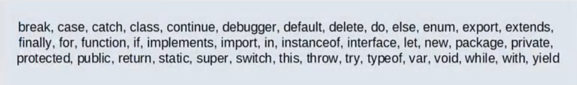
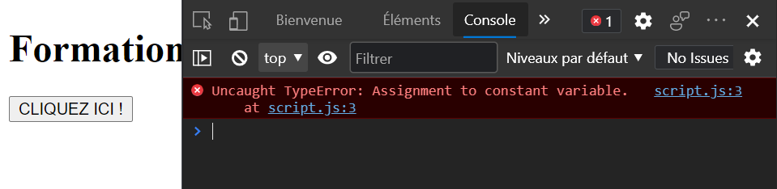

# [3. Variables](https://www.youtube.com/watch?v=r_ylc4StEeo)

+ [Affichage en dur](#Affichage-en-dur)
+ [Déclarer une variable](#Déclarer-une-variable)
+ [Initialiser une variable](#Initialiser-une-variable)
+ [Afficher une variable](#Afficher-une-variable)
+ [Manipuler ces variables](#Manipuler-ces-variables)
+ [Connaître le type](#Connaître-le-type)
+ [Demander une information](#Demander-une-information)
+ [Convertir un type](#Convertir-un-type)
+ [Rappel - les fonctions vues](#Rappel---les-fonctions-vues)
+ [Constante](#Constante)

## Affichage en dur

+ script.js
```js
document.write("Hello World !");
```
+ index.html
```html
<!DOCTYPE html>
<html lang="fr">
<head>
    <meta charset="UTF-8">
    <meta name="viewport" content="width=device-width, initial-scale=1.0">
    <meta http-equiv="X-UA-Compatible" content="IE=edge">
    <title>Ma page web</title>
</head>
<body>
    <h1>FormationVidéo</h1>

    <button>CLIQUEZ ICI !</button>

    <script src="script.js"></script>
</body>
</html>
```

## Déclarer une variable

Typage dynamique en JavaScript, ce langage interprêter déduit le type de la donnée.

+ script.js
```js
var variable;
var myVar;
var my_var;
```

:warning: attention aux mots-réservés à ne pas utiliser.


## Initialiser une variable

Utiliser l'opérateur d'affectation `=`.

+ script.js
```js
var age;

age = 14;
```

ou déclaration et initialisation.

+ script.js
```js
var age = 14;
```

Nous n'avons pas de fonction ici donc la portée de cette variable est globale.

:warning: privilégiez le mot-clé var parce que si on ne le met pas on aura une variable globale.

+ script.js
```js
age = 14;
```

Le mot-clé `let` dépendra d'un bloc de code alors que `var` serra accessible dans une fonction et pas dans une autre ou à l'extérieur. `let` appartiendra au bloc de code où on la déclarré et pas en dehors du bloc.

+ script.js
```js
let age = 14;
```

Le plus souvent on utilisera le mot-clé `var`.

## Afficher une variable

+ script.js
```js
var age = 14;

document.write(age);
```

On peut passer par allert() pour ouvrir une pop-up ou autre.

+ script.js
```js
var age = 14;

alert(age);
```

## Manipuler ces variables

Changer la valeur.

+ script.js
```js
var age = 14;
age = 28;
alert(age);
```

Passer d'un nombre à une chaîne de caractères.

+ script.js
```js
var age = 14;
document.write(age);
age = "Jason";
document.write(age);
```

Changer JavaScript de manière dynamique, change le type.

## Connaître le type

On écrit avec parenthèse `typeof()` ou sans `typeof`.

+ script.js
```js
var age = 14;

document.write(typeof(age));
```

On obtient bien *number*.

+ script.js
```js
var majeur = true;

document.write(typeof majeur);
```

Un *boolean* et cetera.

## Demander une information

A l'opposé, on stocke une information en dur.

+ script.js
```js
var data = 141;

document.write(data);
```

On utilise prompt().

+ script.js
```js
var name = prompt("Comment t'appelles-tu ? ");

document.write(typeof name);
```

On affecte le retour de prompt dans une variable `name` qui sera de type *string* dans tous les cas.

## Convertir un type

Caster, parser le type de la variable.

+ script.js
```js
var age = prompt("Quel âge as-tu ? ");

age = parseInt(age);

document.write(typeof age);
```

## Rappel - les fonctions vues

```js
/*
    document.write()
    alert() / confirm()
    prompt()

    parseInt()
    parseFloat()
*/
```

alert() ouvre un pop-up et confirm() est un bloc qui affiche un message et on clic sur Ok.

## Constante

Dans les autres langages, on ajoute *const* mais en JavaScript on remplace var par *const*.

+ script.js
```js
const PI = 3.14;
PI = 2;

document.write(PI);
```

La console de JavaScript (F12)



:warning: utiliser le mot-clé *const* sur un tableau garantit la constance du type du tableau mais pas les valeurs.


```js
/*
    const   : valeur constante (non modifiable) pour nombres, chaînes, booléens, ...
              type de données contant, mais contenu modifiable pour tableaux, objets, ...
*/
```

Dans d'autres langages, le mot clé *const* sur un tableau rend les données immuables.

*const* protège le type.

+ script.js
```js
const data = 14;
data = "14";
```