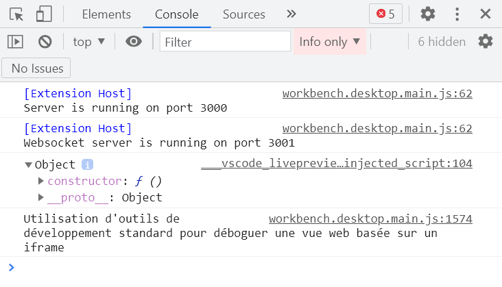
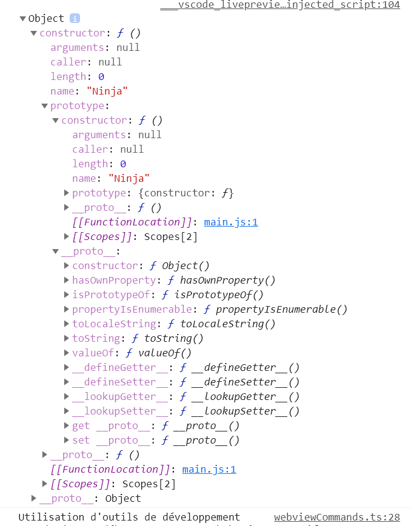
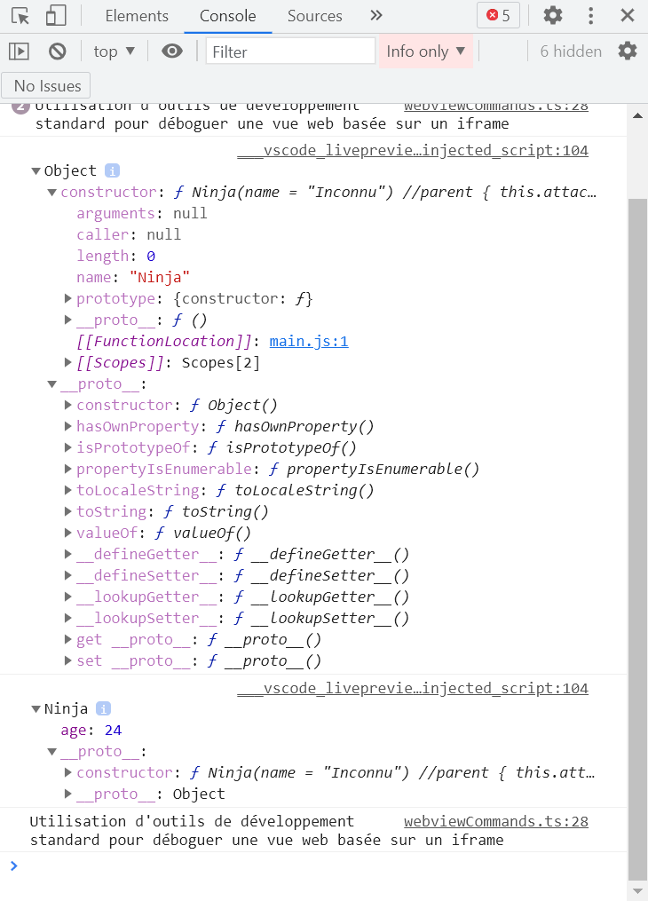
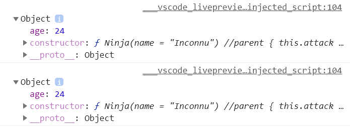

# [10. Héritage](https://www.youtube.com/watch?v=2BoeW9J-Hso)

+ [Syntaxe de déclaration littérale ou déclarer une valeur brute](#Syntaxe-de-déclaration-littérale-ou-déclarer-une-valeur-brute)
+ [Syntaxe pour déclarer un objet](#Syntaxe-pour-déclarer-un-objet)
    + [Créer une instance](#Créer-une-instance)
+ [Syntaxe de déclaration de classe](#Syntaxe-de-déclaration-de-classe)
+ [Parenthèse sur la différence entre un constructeur via une fonction et un constructeur via une classe](#Parenthèse-sur-la-différence-entre-un-constructeur-via-une-fonction-et-un-constructeur-via-une-classe)
+ [Notion héritage](#Notion-héritage)
    + [clonage de deux objets distincs](#clonage-de-deux-objets-distincs)
    + [Liaison d'un prototype à un autre](#Liaison-d-un-prototype-à-un-autre)
    + [Méthode de classe](#Méthode-de-classe)

+ index.html
```html
<!DOCTYPE html>
<html lang="fr">
<head>
    <meta charset="UTF-8">
    <title>Cours JavaScript</title>
    <style>
        body{background-color:#111;color:#e2a93f;margin:auto;width:800px;}
        h1{color:#af8943;text-align:center;}
    </style>
</head>
<body>
    <h1>JavaScript #10 - Héritage</h1>
    <script src="main.js"></script>
</body>
</html>
```
+ main.js
```js

```

Rappel sur la manière de définir des entités, des objets.

En JavaScript, nous avons des objets, par exemple une fonction est un objet. Même si on a abordé la programmaion orienté objet plutard dans le cours, en réalité on de l'objet partout.

Le concept de classe et d'instance en Java, C++, CSharp, PHP diffèrent beaucoup du JavaScript d'où le fait que cette séance est très importante pour ce langage et qui fait l'incompréhension des développeurs JavaScript avec toutes les évolutions qu'il a connus ces dernières années.

## Syntaxe de déclaration littérale ou déclarer une valeur brute

On a parlé de pas mal d'objet mais maintenant on va commencer par définir des entités avec pas mal de méthodes.

On va aborder une 1e méthode sur la manière de définir une entité, une information par exemple, on va travailler avec des Ninjas et donc on a une première méthode très simple qui est l'**écriture litérale**.

Littérale c'est un terme que l'on a déjà employé par exemple quand on parle d'information en dur.

Admettons que je fasse ceci `let data = 14;` avec le 14 qui est une valeur littérale, une valeur brute c'est à dire qu'on l'indique directement dans le code. Ce n'est pas quelque chose de dynamique que l'on demande à l'utilisateur, ce n'est pas une affectation d'une autre variable et cetera mais c'est une valeur littérale, une valeur en brut.

Alors on va essayer d'être le plus clair possible dans le vocabulaire utilisé et on va donc essayer de faire une déclaration littérale de ce que l'on appellerait dans un autre langage de programmation une classe.

Admettons on va créer un naruto (qui est un Ninja) et on va lui indiquer tout un tas de valeurs donc les valeurs vont être écrites littéralement, elles seront inscrites en dur dans le code.

```js
let naruto = 
{
    attack: function() { return "Rasengan"; },
    name: "Naruto Uzumaki",
    weapon: "Kunai"
};
```

Voilà on a une attaque qui est un objet, un name et cetera.

Voilà ça permet un peu comme la solution ternaire qui permet ainsi de fonctionner soit dans un cas soit dans un autre en fonction du test qu'on a fait sur une condition de dire par exemple qu'ici on appliquerait une valeur ou en dur mais on verra ça peut être plus tard.

Donc tout ceci est une déclaration via une écriture littérale Dan Ninja qui est ici Naruto.

Si je veux faire un autre Ninja, il faudrait refaire un peu la même chose, il faudrait l'appeler autrement puis d'autres informations pour la cohérence..

```js
let naruto = 
{
    attack: function() { return "Rasengan"; },
    name: "Naruto Uzumaki",
    weapon: "Kunai"
};

let naruto2 = 
{
    attack: function() { return "Rasengan"; },
    name: "Naruto Uzumaki",
    weapon: "Kunai"
};
```

On peut essayer d'afficher.

+ main.js
```js
let naruto = 
{
    attack: function() { return "Rasengan"; },
    name: "Naruto Uzumaki",
    weapon: "Kunai"
};

document.write("<h2>");
document.write(naruto.attack());
```
```txt
JavaScript #10 - Héritage
Rasengan
```

Voilà ça on ne l'avait pas forcément vu précédemment mais au moins c'est bien de le savoir parce que ça existe déjà depuis pas mal de temps alors que le mot clé `let` c'est quelque chose qui n'est pas si vieux que ça donc on l'a introduit ici et on peut directement afficher l'élément que ce soit name ou attack().

Voilà pour la déclaration littérale.

## Syntaxe pour déclarer un objet

Maintenant on va faire la déclaration d'un objet sachant que je n'avais pas été très loin dans les explications et dans les définitions mais je vous avais dit qu'une fonction c'est un objet donc on va se servir d'une fonction comme un constructeur d'objets.

Ainsi jusqu'ici on avait une écriture littérale pour créer un Naruto mais je ne pourrai pas m'en servir par exemple pour créer dynamiquement autre chose c'est à dire qu'il aurait fallu répéter ce bloc Naruto et changer les informations.

Maintenant je vais créer une fonction Ninja avec un N majuscule pour dire que c'est une fonction particulière, un peu le formalisme qu'on aurait sur d'autres langages de programmation pour une classe même si ici ce n'est pas vraiment une classe.

```js
function Ninja(name, weapon)
{

}
```

Voilà on indique les différents paramètres comme ça on a du coup quelque chose de dynamique, on utilise la variable this.

Là je vais vous montrer une petite nouveauté syntaxique, vous affectez à `this.name =` deux cas possible (*ici la valeur de name donné en paramètre sinon une valeur par défaut*) mais il ne faut pas que la première valeur référencée `name` soit égal à false voilà il ne faut pas mettre ce genre de choses `this.name = false;` mais ça va nous permettre simplement de dire que si on a renseigné l'attribut name c'est à dire qu'il peut être égal à true et c'est ce qu'on affectera comme valeur à notre attribut.

```js
this.name = name;
```

Sinon on va utiliser un opérateur || (ou) et dans un autre cas on lui affectera une valeur par défaut donc par exemple si on n'indique pas l'information name, le nom sera Naruto Uzumaki.

```js
function Ninja(name, weapon)
{
    this.attack = function()
    {
        return "Rahhhh !!";
    };
    
    this.name = name || "Naruto Uzumaki";
    this.weapon = weapon || "shurikan";
}
```

Alors c'est important mais ici on n'a pas créer d'objet, ça en est déjà un donc il a sa propre vie et on peut afficher les informations concernant cette variable `naruto` qui est notre objet.

```txt
let naruto = 
{
    attack: function() { return "Rasengan"; },
    name: "Naruto Uzumaki",
    weapon: "Kunai"
};

document.write(naruto.attack());
```

### Créer une instance

Utiliser l'opérateur `new` qui va passer par le constructeur ici.

```js
function Ninja(name, weapon)
{
    this.attack = function()
    {
        return "Rahhhh !!";
    };
    
    this.name = name || "Naruto Uzumaki";
    this.weapon = weapon || "shurikan";
}

let hinata = new Ninja("Hinata Hyûga");
document.write(hinata.name + "<br>");
document.write(hinata.attack() + "<br>");
```

:warning: dans d'autres langages `new` fait référence à l'appel d'un constructeur de classe mais ici on n'a pas de classe mais on a un objet parce qu'ici notre fonction est un objet et nous permet de créer des objets.

Notre fonction est un objet et nous permet de créer des objets donc ça c'est important l'objet est l'instance.

Ainsi avec la classe, on a des instances de cette classe qui sont des objets mais ici l'objet est une instance donc il n'y a pas de distinction entre les 2.

Il y a vraiment une différence entre cette histoire d'objets `function Ninka()` et ce qu'on avait vu précédemment avec la syntaxe de classe.

Voilà on y va on met également un petit peu de code `document.write()` histoire d'avoir quelque chose à afficher et on y va.

+ main.js
```js
let naruto = 
{
    attack: function() { return "Rasengan"; },
    name: "Naruto Uzumaki",
    weapon: "Kunai"
};

document.write("<h2>Écriture littérale</h2>");
document.write(naruto.name + "<br>");
document.write(naruto.attack() + "<br>");

//-------------------------------------------------------------

function Ninja(name, weapon)
{
    this.attack = function()
    {
        return "Rahhhh !!";
    };
    
    this.name = name || "Naruto Uzumaki";
    this.weapon = weapon || "shurikan";
}

document.write("<h2>Constructeur via fonction</h2>");
let hinata = new Ninja("Hinata Hyûga");
document.write(hinata.name + "<br>");
document.write(hinata.attack() + "<br>");
```
```txt
JavaScript #10 - Héritage
Écriture littérale
Naruto Uzumaki
Rasengan
Constructeur via fonction
Hinata Hyûga
Rahhhh !!
```

Alors voilà ça marche sans problème !

Voilà cette instanciation d'un objet est une autre manière de faire avec avantage que très facilement peut créer d'autres Ninja donc on peut très facilement déclarer un nouveau Ninja `let hinata = new Ninja("Hinata Hyûga");` donc on va à chaque fois faire de la copie d'information notamment grâce au mot clé `this` et surtout pour la fonction attack() parce que les attributs `name` et `weapon` peuvent varier d'un Ninja à l'autre.

Ainsi si cette attaque est à chaque fois identique, pour éviter de copier à chaque fois cette fonction, autant la dégager mais ça on l'a déjà vu précédemment.

```js
    this.attack = function()
    {
        return "Rahhhh !!";
    };
```

Voilà on l'avait déjà vu précédemment même si on ne va pas faire des rappels sur tout sinon on risque de perdre pas mal de temps mais on peut également se servir des prototypes en partant du nom de la classe, un point puis prototype `Ninja.prototype` puisque dès qu'on crée un objet `function Ninja()` en JavaScript, il y a automatiquement cet attribut `prototype` qui lui est créé et c'est pour ça qu'on dit que la programmation objet de JavaScript est un langage où la programmation objet est orienté prototype au départ de manière historique et pas classe mais on reviendra là-dessus.

```js
Ninja.prototype.attr = //...
Ninja.prototype.attack = //...
```

Voilà syntaxe où on crée un nouvel attribut, une nouvelle méthode et cetera et cetera.

Alors voilà pour la 2e partie.

## Syntaxe de déclaration de classe

Il y a maintenant la fameuse nouvelle syntaxe même si on l'avait déjà abordé sans trop rentrer dans le détail, nouvelle syntaxe qui pour le coup est plus moderne même si tout ce qui a déjà été utilisé avant n'est pas forcément devenu obsolète et qu'il ne faut plus s'en servir justement, c'est aussi pour ça que cette vidéo est très importante parce qu'il y a beaucoup de gens qui ont tendance à penser que maintenant nous que nous avons une syntaxe qui va ressembler beaucoup plus aux autres langages de programmation qui permet de programmer un objet comme Java justement puisque JavaScript c'est pas mal inspiré au départ du Java et que maintenant il fait partie de son histoire, de CSharp, C++ et tout ça et du coup on a tendance à penser que javaScript est un langage orienté classe.

Pas du tout, JavaScript n'est pas un langage orienté classe parce que même avec la syntaxe dite par classe, en réalité derrière nous avons toujours cette histoire de prototype. Pour quelle raison ? C'est lié à l'histoire du langage c'est-à-dire que le langage a été bâti sur ce concept d'orientation prototype donc si on voulait complètement abandonner cette structure, cette manière de concevoir le langage, il aurait fallu au final tout réécrire ce qui aurait été complètement impensable pour des raisons de compatibilité et cetera.

C'est ça qui fait également la force du langage javascript par rapport à pas mal d'autres c'est qu'il est tout simplement orientée prototype, et non pas orienté classe.

Ainsi la syntaxe de classe, que je vais montrer ici et qu'on a déjà vu de toute façon, est en fait une surcouche, ce qu'on appelle un sucre syntaxique, ça veut dire que c'est une autre manière d'écrire du code mais en réalité derrière si vous allez vous renseigner un petit peu et que vous regardez les codes pour voir un petit peu ce qu'il se passe derrière au niveau de javascript vous verrez que vous allez retrouver des prototypes tout simplement, c'est juste que vous n'aurez pas besoin d'écrire vous-même les prototypes manuellement et de gérer ça par vous même mais vous passerez par une syntaxe qui vous sera beaucoup plus familière avec d'autres langages de programmation que vous utilisez peut être.

Alors on y va on va créer cette classe que l'on ne va pas appeler Ninja parce que cet objet existe déjà donc ça risque de poser problème, attention qu'ici je dis bien *objet* et non *classe* pour `function Ninja(name, weapon)` par rapport à ce qu'on pourrait dire sur d'autres langages de programmation.

Maintenant on va utiliser le mot clé `class` mais alors pourquoi est-ce que j'utilise ce mot clé là ? tout simplement pour ressembler à d'autres langages de programmation Parce que c'est beaucoup plus parlant pour un développeur. Imaginez quelqu'un qui fait du C++, du Java, du PHP, et cetera Eh bien quand il passe à javascript et qu'il utilise ce genre de syntaxe, ce sera beaucoup plus facile pour lui, beaucoup plus facile à s'adapter parce que c'est une syntaxe qu'il connaît bien donc c'est beaucoup plus rassurant et beaucoup de développeurs n'ont pas très envie de se prendre la tête à avoir des différences syntaxiques et sémantiques entre les différents langages.

```js
class
```

Pourtant on n'a pas cette histoire de classe comme on l'aurait avec d'autres langages et on va de toute façon détailler un petit peu tout ça derrière donc ici on va changer un peu le nom et on va l'appeler Genin `class Genin` et on va commencer par créer le constructeur `constructor()`.

```js
class Genin
{
    constructor()
    {

    }
}
```

Alors on pourrait penser que constructor() est une méthode puisqu'on est dans une classe mais en réalité puisque c'est un langage qui est orienté prototype, d'ailleurs derrière tout ça nous avons des prototype et donc constructor() est une fonction, c'est un objet donc tout est objet.

Tout est objet, rappelez-vous que les fonctions sont des objets en javascript.

C'est le même schéma que dans les autres langages objet, où on retrouve la syntaxe de tout à l'heure `this.name = name || "Naruto Uzumaki";` pour ajouter une valeur par défaut. Ensuite on écrit nos fonctions et cetera.

```js
class Genin
{
    constructor(name = "Naruto Uzumaki", weapon = "shuriken")
    {
        this.name = name;
        this.weapon = weapon;
    }
}
```

On parle maintenant de Constructeur via classe dans le sens qu'on connaît déjà du mot classe, qu'on connaît peut être via d'autres langages. Ainsi on peut pas dire que les classes en JavaScript sont les mêmes que les classes en PHP, non ce sont 2 choses distinctes donc il ne faut pas tout mélanger. C'est une exception qui fait que ce n'est pas la même chose dans tous les langages de programmation.

Maintenant on va créer un Sasuke Uchiha.

```js
class Genin
{
    constructor(name = "Naruto Uzumaki", weapon = "shuriken")
    {
        this.name = name;
        this.weapon = weapon;
    }

    attack()
    {
        return "Rahhhh !!";
    }
}

document.write("<h2>Constructeur via classe</h2>");
let sasuke = new Genin("Sasuke Uchiha", "shuriken fuma");
document.write(hinata.name + "<br>");
document.write(hinata.attack() + "<br>");
```

Ensuite on y va et on actualise.

```js
let naruto = 
{
    attack: function() { return "Rasengan"; },
    name: "Naruto Uzumaki",
    weapon: "Kunai"
};

document.write("<h2>Écriture littérale</h2>");
document.write(naruto.name + "<br>");
document.write(naruto.attack() + "<br>");

//-------------------------------------------------------------

function Ninja(name, weapon)
{
    this.attack = function()
    {
        return "Rahhhh !!";
    };
    
    this.name = name || "Naruto Uzumaki";
    this.weapon = weapon || "shurikan";
}

document.write("<h2>Constructeur via fonction</h2>");
let hinata = new Ninja("Hinata Hyûga");
document.write(hinata.name + "<br>");
document.write(hinata.attack() + "<br>");

//-------------------------------------------------------------

class Genin
{
    constructor(name = "Naruto Uzumaki", weapon = "shuriken")
    {
        this.name = name;
        this.weapon = weapon;
    }

    attack()
    {
        return "Rahhhh !!";
    }
}

document.write("<h2>Constructeur via classe</h2>");
let sasuke = new Genin("Sasuke Uchiha", "shuriken fuma");
document.write(hinata.name + "<br>");
document.write(hinata.attack() + "<br>");
```
```txt
JavaScript #10 - Héritage
Écriture littérale
Naruto Uzumaki
Rasengan
Constructeur via fonction
Hinata Hyûga
Rahhhh !!
Constructeur via classe
Hinata Hyûga
Rahhhh !!
```

J'actualise et on voit que ça marche sans problème.

## Parenthèse sur la différence entre un constructeur via une fonction et un constructeur via une classe

On a ainsi 2 syntaxes différentes avec un constructeur via une fonction et un constructeur via une classe, ainsi que l'écriture littérale mais qui est beaucoup plus limitée bien qu'elle ait quand même de l'intérêt concernant les performances ce qui est quand même très important.

La performance au javascript est un argument très important autant sur d'autres langages la performance n'est pas tellement un argument, la première chose que l'on va viser ce sera plutôt dans le codage et cetera tel qu'on peut le voir sur la chaîne.

Ainsi en javascript, remarqueras que ça peut aller très très vite la différence de performance et de rapidité d'exécution de script. On est sur des choses qui sont interprétées, on est sur du web, il y a beaucoup d'opérations de traitement qui sont fait et en fonction de la syntaxe que l'on va choisir pour les différentes conceptions, on va faire différentes implémentations et donc avoir énormément de différences en termes de performances du code.

Pour le coup il va falloir s'intéresser dans quelqu'un on va travailler avec les prototypes et donc quelqu'un on va vraiment utiliser cette couche d'abstraction (**les classes**) c'est-à-dire d'optimiser avec ses classes en javascript qui sont en réalité des prototype mais qui passe par des intermédiaires et cetera et cetera.

Puis de savoir dans quel cas on peut simplement utiliser une écriture littérale pour avoir directement les informations en brut, bref on peut voir la chose de manière différente.

Maintenant bien que l'objectif de cette vidéo soit la notion d'héritage, il va être intéressant de s'intéresser justement à la différence entre les classes et les prototypes, parce que dans d'autres langages de programmation on ne va pas entendre parler de cette notion de prototype parce que c'est pas vraiment quelque chose qui existe en fait, on peut entendre parler de prototype de fonction mais ça n'a rien à voir et qui plus est Manon depuis les dernières normes sortie de JavaScript on a les notions de classe avec des mots-clés qu'on retrouve dans pas mal d'autres langages tel que `class` et le mot clé `constructor` tel qu'on peut avoir `construct` pour PHP ou bien il y a même directement le nom pour d'autres langages bref il y a des choses très similaires.

Vous entendrez certainement que la méthode des classes tel qu'on a pu l'écrire `class Genin{}` peut être plus récente que les 2 autres au détriment du reste, certains peuvent se diront que ce qui est plus récent et plus moderne est peut être la meilleure des solutions à privilégier alors que d'autres vous diront tout simplement que ce système de classe en javascript n'est pas du PHP, ce n'est pas du C++ mais c'est un langage prototypé, et derrière ça c'est juste une manière de masquer les prototypes pour dire qu'il y a des prototype derrière ces classes.

Pour autant ce n'est pas parce que il y a des prototype derrières qu'on peut se dire que le système via fonction soit équivalent au système via classe et dire qu'en gros ce qui valent les constructeurs par fonction sont équivalent aux constructeurs par classe alors que pas du tout on a vraiment une distinction entre les 2 au niveau de la sémantique et du fonctionnement en général.

Alors il faut voir une classe comme notre idée à nous, notre vision abstraite de la chose par exemple si on a une idée c'est à dire une illustration abstraite de ce qui serait un Genin. Ainsi on va pouvoir créer des instances de nos objets différents donc on va retrouver un petit peu ce principe là tandis qu'en terme de prototype `function Ninja()`, on va véritablement retrouver un modèle c'est à dire que c'est un modèle sur lequel on va pouvoir se calquer. À partir de là on peut déjà faire tout un tas de choses.

Alors les inconvénients au niveau de la classe, le but de ce genre de syntaxe `class Genin{}`, c'est un petit peu de faire comme toutes les autres langage de programmation qui utilise ce genre de syntaxe donc c'est de pouvoir dire qu'on va créer une hiérarchie de classe de dire par exemple qu'un jour on va avoir une classe *Genin* et qu'on va pouvoir faire de l'héritage dessus, et c'est ici qu'on va commencer à parler d'héritage, c'est à dire de se dire qu'on va faire une autre classe plus tard tel que `class Shuunin{}` qui va avoir toutes les informations d'une Genin d'accord mais elle va être spécialisée, c'est à dire qu'elle va hériter de tout ce que sait faire un Genin avec les informations qu'elle a et ce qu'elle sait faire mais elle va avoir des choses supplémentaires c'est à dire qu'elle sera spécialisée.

```js
class Genin
{
    constructor(name = "Naruto Uzumaki", weapon = "shuriken")
    {
        this.name = name;
        this.weapon = weapon;
    }

    attack()
    {
        return "Rahhhh !!";
    }
}

class Shuunin
{

}

document.write("<h2>Constructeur via classe</h2>");
let sasuke = new Genin("Sasuke Uchiha", "shuriken fuma");
document.write(hinata.name + "<br>");
document.write(hinata.attack() + "<br>");
```

Voilà on va avoir toute une hiérarchie, on va avoir des classes, des sous-classes, et ça va créer tout un arbre hiérarchique de classes. Forcément cette condition va rendre un peu plus strict l'implémentation et va surtout créer de la dépendance au niveau de tout ça parce qu'on peut par exemple avoir des liaisons au niveau de ces différentes classes, ainsi un changement opéré sur l'une peut éventuellement venir casser quelque chose dans une autre. Alors dans ce cas ci on n'a pas forcément d'exemple à nous montrer parce que ce serait trop long et pas forcément utile pour cette séance, en tout cas pas pour tout de suite.

Enfin voilà il y a forcément cette idée de dépendance entre les différentes classes que l'on va définir finalement dans cette hiérarchie de classes donc voilà ce sont des choses très importantes à savoir.

Automatiquement dans ce genre de cas on fonctionne par les prototypes (`function Ninja()`) c'est-à-dire que on va d'abord commencer par créer un prototype et plus tard on va pouvoir faire une copie du prototype que l'on a actuellement et rajouter tout un tas d'informations. Alors l'avantage par rapport à la classe c'est que déjà dans la classe on définit tout ce que l'on veut ici `class Genin{ … ici … }` et au moment de l'exécution on fait avec ce que l'on a, ni plus ni moins mais ça on l'avait déjà vu. Par contre pour les prototyper ça on l'avait déjà vu précédemment c'est à dire qu'on peut avoir leur définition mais rien n'empêche en cours d'exécution tel qu'on l'a vu ici dans une toute petite portion de code ici.

```js
function Ninja(name, weapon)
{
    this.attack = function()
    {
        return "Rahhhh !!";
    };
    
    this.name = name || "Naruto Uzumaki";
    this.weapon = weapon || "shurikan";
}

document.write("<h2>Constructeur via fonction</h2>");
let hinata = new Ninja("Hinata Hyûga");
document.write(hinata.name + "<br>");
document.write(hinata.attack() + "<br>");
```

Malgré sa petite portion rien ne m'empêche d'avoir un plus long code et ainsi d'avoir la définition ici de mon objet `function Ninja(){…ici…}` et plus tard de me dire que n'importe quel moment de l'exécution de mon programme et bien de dire que les ninjas en plus d'attaquer, ils vont pouvoir se défendre, ils vont pouvoir se soigner alors que ce n'était pas défini au départ donc on va ajouter des propriétés, ajouter des méthodes à notre objet ici au cours de l'exécution de notre programme, alors qu'on ne pourrait pas faire ça avec une classe.

On ne va pas pouvoir ajouter des fonctionnalités en plus à notre classe au cours de l'exécution du programme, le seul moyen ce serait de faire éventuellement une nouvelle classe spécialisée comme ici `class Shuunin{}` en lui disant que tu as tout ce que contient la classe `class Genin` mais en plus maintenant tu vas pouvoir te défendre.

```js
class Genin
{
    constructor(name = "Naruto Uzumaki", weapon = "shuriken")
    {
        this.name = name;
        this.weapon = weapon;
    }

    attack()
    {
        return "Rahhhh !!";
    }
}

class Shuunin
{
    defend()
}
```
Voilà le fait qu'elle puisse se défendre ce sera un plus, il faudra que ce soit quand même défini en amont ainsi voilà les différences que l'on peut avoir entre les classes et les objets de fonction.

Alors un autre point qui va être important c'est que au départ notre `function Ninja()` va permettre aussi plus de flexibilité, au niveau de débutant tel que l'on est on ne peut pas voir le potentiel que peuvent apporter Le système de prototypant JavaScript tandis que plus tard on verra dans quel cas ça peut être intéressant.

En gros on en sera à venir à utiliser les classes que dans des cas très spécifiques, éventuellement faire de l'héritage sur `class Genin{}` que dans des cas très spécifiques aussi mais dans la majorité des cas privilégiez les prototype :warning:

```js
function Ninja(name, weapon)
{
    //...
}
```

Dans la majorité des cas il faut privilégier les prototypes pour avoir quelque chose de beaucoup plus libre même si ce n'est pas vraiment le terme, et qu'on va pouvoir gérer un peu plus à l'exécution.

Alors dans ce jardin car on se retrouve avec des divergences par rapport à des gens qui vont penser que c'est mieux comme ceci ou comme cela, et du coup ça va se débattre avec des personnes qui ne sont jamais vraiment d'accord avec d'un côté des gens qui vont penser qu'il ne faudrait utiliser des prototypes dans 100% des cas, et puis limite ne plus utiliser ce genre de syntaxe avec des classes même si c'est arrivé plus récemment. Puis d'autres vont se dire que cette syntaxe de classe est plus récente, qu'il faut l'adopter et arrêter d'utiliser ce qui était ancien.

Ici nous ne prendrons pas parti pour l'un ou pour l'autre parce que comme beaucoup de gens je suis très curieux et je me renseigne, et je m'intéresse à pas mal de choses, et comme en plus Java script est un langage qui continue d'évoluer tous les jours aussi. On peut néanmoins se faire l'opinion que dans la plupart des cas on va utiliser les prototypes et dans d'autres cas on va utiliser la syntaxe de classe.

Avec du recul on pourra juger de l'efficacité d'une méthode et puis de l'autre. Le plus important est d'avoir conscience que l'utilisation de telle ou telle syntaxe peut avoir des conséquences sur le projet notamment au niveau de la performance au point de vue de javascript pour avoir quelque chose d'optimal.

## Notion héritage

Alors on va parler maintenant d'héritage parce qu'il y a pas mal de choses et c'est quand même le principe de cette vidéo.

On va revenir d'abord sur la création d'objets parce qu'on n'a pas encore tout montré et ce sera pas mal de l'aborder mais avant rappelez vous qu'on a d'abord vu l'écriture littérale de manière classique, on a vu ensuite l'usage d'une fonction comme constructeur et enfin une syntaxe un petit peu de classe qu'on le retrouve dans pas mal de langage de programmation. Maintenant ce que l'on peut faire c'est créer des objets d'une autre manière, il faut savoir qu'on a une hiérarchie qui existe déjà au niveau de javascript, en gros parce que je vous dis que finalement tout est objet, vous avez une avant-dernière section concernant cette hièrarchie, l'avant dernière partie de cette hiérarchie c'est finalement … que l'on peut voir ici en commentaire.

```js
/*
    Let some_ninja = new Object()
*/
```

Voilà on va utiliser directement cet appel là, c'est un constructeur qui est disponible partout donc en gros on a le l'avant-dernier élément qui sera `Object()` si on suit une hiérarchie, et le dernier élément c'est `null`

```js
/*
    Object -> null
*/
```

Une fois qu'on a `null` on sait qu'on ne peut plus remonter plus loin.

Alors on pourrait se demander pourquoi est-ce qu'on se dit ça ? Admettons que je mette ici par exemple notre classe Ninja, qui représente finalement notre Ninja, et puis plus tard avec l'héritage on va se dire que le Ninja on va le compléter avec autre chose par exemple on pourrait se dire un SuperNinja et puis si on remonte d'un cran plus haut, on retombera sur Ninja forcément.

```js
/*
    SuperNinja -> Ninja
*/
```

Et puis on va remonter, remonter et on va retomber sur Object et à un moment donné on arrivera sur Null et si on arrive à Null c'est qu'on a atteint le point le plus original et après il y a plus rien.

```js
/*
    SuperNinja -> Ninja -> Object -> null
*/
```

Quand c'est `null`, cela signifie que c'est vide, il n'y a plus rien.

C'est pour ça que nous allons pouvoir créer des objets de plusieurs manières, ici au lieu de passer par cet opérateur `new`, on pourrait tout à fait créer un objet d'une autre manière et je vais vous montrer 2 petites astuces qui font aussi le potentiel, la puissance des prototypes en JavaScript.

Voilà on va vraiment écrire l'héritage, on fait notre constructeur à l'aide de la fonction Ninja dans lequel on va juste mettre un `this.name`

```js
function Ninja(name)
{
    this.name = name;
}
```

Je n'ai pas d'autre information c'est juste le constructeur directement.

Maintenant je vais faire une autre fonction qui va faire office aussi de constructeur aussi, à qui on va juste passer une information.

```js
function Ninja(name) //parent
{
    this.name = name;
}

function SuperNinja(weapon) //enfant
{
    this.weapon = weapon;
}
```

Alors comment est-ce que ça va fonctionner avec l'héritage ? On va dire que l'élément fils ou fille va hériter de son parent ainsi Ninja est l'objet parent et SuperNinja est l'objet enfant.

Alors comment est-ce que ça fonctionne dans d'autres langages, CSharp, PHP, et cetera, on dira que SuperNinja est une classe spécialisée de Ninja, et on ferait une sorte d'héritage en disant que SuperNinja hérite de Ninja et apporte des choses en plus.

En gros cela veut dire qu'on peut très bien ajouter à la SuperNinja, cette ligne-là `this.name = name;` même si ce n'est pas nécessaire parce que cette variable est héritée de Ninja.

```txt
function Ninja(name) //parent
{
    this.name = name;
}

function SuperNinja(weapon) //enfant
{
    this.name = name;
    this.weapon = weapon;
}
```

Voilà SuperNinja aura aussi le nom mais il aura en plus une arme, ça ce qu'on aurait comme fonctionnement si javascript était un langage objet orienté class mais comme je vous l'ai dit Java script est un langage objet orienté prototype. 

### clonage de deux objets distincs

Alors comment est-ce que ça fonctionne ? Là ça c'est un autre cheminement de pensée qu'il faut avoir c'est à dire qu'il faut simplement se dire c'est que d'abord on va créer notre Ninja comme ceci.

```js
let naruto = new Object();
```

Voilà alors ici on crée un objet sans passer par forcément par Ninja ou SuperNinja. on crée notre objet de départ, on lui ajoute un attribut `name` et voilà.

Ce que l'on peut faire aussi, c'est utiliser une méthode create() et on va mettre Ninja.

```js
function Ninja(name = "Inconnu") //parent
{
    this.name = name;
}

function SuperNinja(weapon) //enfant
{
    this.weapon = weapon;
}

let naruto = Object.create(Ninja);
naruto.name = "Naruto";
document.write(naruto.name);
```
```txt
JavaScript #10 - Héritage
Ninja
```

Voilà nous avons vu comment créer des Ninjas en tant que information tel quel sans hiérarchie directement, on aura ce système de hiérarchie par contre si on utilise le système de classe comme on a pu le voir dans d'autres langages de programmation c'est-à-dire c'est ce qu'on va voir mais nous ici on va éviter ce système de hièrarchie de classe en utilisant le système de prototype.

On va faire un clonage, une copie de Ninja pour le SuperNinja.

```js
function Ninja(name = "Inconnu") //parent
{
    this.name = name;
}

function SuperNinja(weapon) //enfant
{
    this.weapon = weapon;
}

SuperNinja.prototype = Object.create(Ninja.prototype);
```

Voilà en fait une copie de Ninja pour SuperNinja c'est-à-dire pour les distinguer parce qu'on ne veut pas qu'un Ninja sois un SuperNinja en réalité. Voilà comment ça fonctionne en javascript avec les prototype c'est à dire que si on veut un SuperNinja, on n'est pas obligé d'hérité forcément de Ninja c'est-à-dire qu'on va simplement faire un clonage de Ninja parce qu'on est bien d'accord qu'on va bien apprendre les informations de Ninja parce que il y aura une espèce d'héritage et puis après on ajoute autre chose tels que des informations qu'il aura plus ce genre de chose.

Voilà à partir de là on peut faire tous les traitements que l'on veut.

Il faut comprendre qu'on a un clonage qui permet de bien distinguer les 2 objets : Ninja et SuperNinja. Ainsi un Ninja ne sera pas un SuperNinja pour autant via ce mécanisme SuperNinja aura comme hérité les informations de Ninja.

Alors on va afficher maintenant le contenu de prototype dans la console.

```js
function Ninja(name = "Inconnu") //parent
{
    this.attack = function() { return "Aya !!" };
    this.name = name;
}

function SuperNinja(weapon) //enfant
{
    this.weapon = weapon;
}

SuperNinja.prototype = Object.create(Ninja.prototype);

let naruto = new SuperNinja("shuriken");
console.log(Ninja.prototype);
```
ctrl+Maj+J pour afficher la console.
  

Voilà dans la console on développe Object et on constate que le constructeur est bien là en nous indiquant `constructor` pourtant on n'a pas indiqué de constructeur comme on l'avait déjà vu auparavant et si on développé encore ça nous fait un prototype dans lequel il y a plein d'informations.

  

Voilà on voit notamment plein d'informations tel que le constructeur par défaut qui est Object().

```txt
constructor : function Object()
```

Voilà il n'y a pas besoin d'avoir un constructeur, il peut donc être fait par des faux. On aurait pu le faire aussi avec la syntaxe de classe, ça aurait pu fonctionner aussi.

Voilà on retrouve donc tout un tas d'éléments, pas mal de méthode.

Alors ce qu'on va faire c'est `Ninja.call(this)` avec le mot-clé `this` qui va correspondre à SuperNinja.

```js
function Ninja(name = "Inconnu") //parent
{
    this.attack = function() { return "Aya !!" };
    this.name = name;
}

function SuperNinja(name = "Inconnu", weapon = "Kunai") //enfant
{
    Ninja.call(this)
    this.weapon = weapon;
}

SuperNinja.prototype = Object.create(Ninja.prototype);

let naruto = new SuperNinja("shuriken");

console.log(Ninja.prototype);
console.log(SuperNinja.prototype);
```

`Ninja.call(this)` avec this qui va correspondre à SuperNinja et on lui donne en réalité l'élément qu'il attend c’est-à-dire `name` parce qu'en réalité SuperNinja n'a pas le `name` qu'on veut récupérer de Ninja.

À partir de là on va faire un clonage du prototype `SuperNinja.prototype = Object.create(Ninja.prototype);` donc voilà c'est simplement qu'on a un SuperNinja qu'on va créer, on le clone à partir de Ninja et puis on lui ajoute une arme que notre objet Ninja n'a pas. C'est tout.

Voilà on n'a pas besoin de se embêter avec une hiérarchie de classe où on a directement tout en définition, pas de problème et comme c'est encore une fois des prototypes, rien ne m'empêche plus tard de faire `SuperNinja.prototype.age = 24;` et ainsi de dire que tous les ninjas ont 24 ans !

```js
function Ninja(name = "Inconnu") //parent
{
    this.attack = function() { return "Aya !!" };
    this.name = name;
}

function SuperNinja(name = "Inconnu", weapon = "Kunai") //enfant
{
    Ninja.call(this)
    this.weapon = weapon;
}

SuperNinja.prototype = Object.create(Ninja.prototype);

let naruto = new SuperNinja("shuriken");

SuperNinja.prototype.age = 24;

console.log(Ninja.prototype);
console.log(SuperNinja.prototype);
```

Voilà admettons `SuperNinja.prototype.age = 24;` qui est quelque chose que nous pourrions pas faire avec cette fameuse syntaxe de classe parcequ'il faudrait qu'elle soit directement écrit via la définition en elle-même donc ça c'est des choses qu'on avait déjà vu.

On peut voir également en console qu'on a plein d'informations (ctrl+Maj+J).

 

Envoie par exemple que notre objet a fait appel au constructeur de Ninja, envoie également qu'il y a beaucoup d'informations.

Voilà un petit peu le principe, comment est-ce qu'on peut faire de l'héritage ainsi SuperNinja va finalement hériter de Ninja et possède pas mal d'éléments et on garde ce principe de flexibilité des prototypes.

Voilà ça fait déjà pas mal de détails sinon il y aura beaucoup trop de choses à aborder et la meilleure manière de comprendre c'est encore de pratiquer et de voir l'efficacité que ça peut donner au niveau de notre code sans autre moyen de voir comment ça fonctionne en réalité à moins de pratiquer.

Voilà pour la théorie.

### Liaison d un prototype à un autre

Maintenant si on veut lier nos prototype parce qu'on l'a vu que tout cet objet, même nos fonctions sont des objets et peuvent fonctionner comme des constructeurs, on a vu que pour chacun il y avait un prototype donc on a automatiquement des prototype avec nos objets, et finalement cette relation va se faire entre prototypes au niveau de ce fonctionnement là, pas entre des classes c'est-à-dire qu'on va juste pouvoir lier des prototype en réalité donc on lie des objets avec d'autres objets.

Ainsi on parlera de liaison d'objet à objet, et on peut comme ça faire du clonage et cetera, et récupérer les choses.

Ce que l'on va faire et c'est plutôt que d'avoir un clonage direct ici `SuperNinja.prototype = Object.create(Ninja.prototype);` c'est-à-dire d'avoir une copie où on sépare bien distinctement nos 2 objets, représentations `function Ninja(){}` et `functionSuperNinja(){}` mais on peut aussi faire une affectation d'un prototype à l'autre c'est-à-dire qu'on ne va pas créer un objet de cette manière `SuperNinja.prototype = Object.create(Ninja.prototype);` mais on va faire directement `SuperNinja.prototype = Ninja.prototype;`.

```js
function Ninja(name = "Inconnu") //parent
{
    this.attack = function() { return "Aya !!" };
    this.name = name;
}

function SuperNinja(name = "Inconnu", weapon = "Kunai") //enfant
{
    Ninja.call(this)
    this.weapon = weapon;
}

SuperNinja.prototype = Ninja.prototype;

let naruto = new SuperNinja("shuriken");

SuperNinja.prototype.age = 24;

console.log(Ninja.prototype);
console.log(SuperNinja.prototype);
```
 

Voilà à partir de là tous les changements que je vais faire sur un objet vont être répercutés sur l'autre automatiquement.

Par exemple lorsqu'on a ajouté `SuperNinja.prototype.age = 24;` Eh bien grâce à cette simple ligne `SuperNinja.prototype = Ninja.prototype;`, on ajouter un attribut `age` en prototype de Ninja qu'on peut voir au niveau de la console.

Alors une autre petite subtilité qu'il faut noter et qui est très important c'est que d'un côté on a la possibilité de faire le clonage de 2 objets distinctes, et d'un autre côté la liaison d'un prototype à un autre en faisant une affectation. Voilà on fait une affectation c'est tout ce qui sera ajouté à l'un, sera ajouté à l'autre.

:warning:
```js
SuperNinja.prototype = Object.create(Ninja.prototype); //clonage (deux objets distincs)
SuperNinja.prototype = Ninja.prototype; //liaison d'un prototype à un autre
```

OK voilà là distinction très importante entre ces 2 syntaxes donc ça c'est vraiment très très très important et à retenir lancer une passer passer en suivante sans avoir oublié cette information.

### Méthode de classe

Maintenant on va voir la même chose mais avec cette syntaxe de classe.

```js
class Ninja
{
    constructor(name = "Naruto")
    {
        this.name = name;
    }
}
```

Alors si je veux faire une classe pas dans le sens de la hiérarchie entre les classes comme on retrouve dans d'autres langages de programmation mais le côté de pouvoir créer une dépendance entre les différentes classes et tout ce que ça peut amener, on va créer `SuperNinja` qui va étendre notre super classe `Ninja`.

```js
class Ninja
{
    constructor(name = "Naruto")
    {
        this.name = name;
    }
}

class SuperNinja extends Ninja
{
    constructor(name = "Naruto", weapon = "shuriken")
}
```

À partir de là, on crée le constructeur de SuperNinja auquel on va renseigner les 2 informations et à l'intérieur de ce constructeur on va appeler le constructeur de Ninja c'est à dire que SuperNinja en hérite, mieux il l'étend Hé bien SuperNinja, on dira que c'est une sorte de Ninja.

SuperNinja est une sorte de Ninja, en théorie il y a vraiment une dépendance de l'un vis-à-vis de l'autre donc on ne peut vraiment pas dire que Ninja est distinct de SuperNinja, Eh bien non parce que pour construire un SuperNinja on va construire un Ninja aussi en partie, et il aura des choses en plus.

Pour cela on a notre méthode super() qui signifie supérieur, qui va faire appel à la classe parente donc Ninja et on va devoir lui passer l'information qui a besoin notre constructeur de SuperNinja qui est ton l'occurrence la variable name.

```js
class Ninja
{
    constructor(name = "Naruto")
    {
        this.name = name;
    }
}

class SuperNinja extends Ninja
{
    constructor(name = "Naruto", weapon = "shuriken")
    {
        super(name);
        this.weapon = weapon;
    }
}
```

Et ensuite on définit seulement ce qui appartient à ce SuperNinja avec le mot clé `this` dont il y a seulement l'arme en plus a déclarer.

Alors on n'oublie pas les points virgules bien sûr.

Maintenant je peux créer mon instance.

```js
class Ninja
{
    constructor(name = "Naruto")
    {
        this.name = name;
    }
}

class SuperNinja extends Ninja
{
    constructor(name = "Naruto", weapon = "shuriken")
    {
        super(name);
        this.weapon = weapon;
    }
}

let kakashi = new SuperNinja("Kakashi Hatake", "kunai");
document.write(kakashi.name + "<br>");
document.write(kakashi.weapon + "<br>");
```
```txt
JavaScript #10 - Héritage
Kakashi Hatake
kunai
```

Voilà ça fonctionne c'est à dire qu'on a notre classe principale, on a une classe dérivée donc une classe qui étend une autre donc cette hérarchie qui se construit, et la construction de cette classe spécialisée dépend en partie de la construction de la classe parente.

Voilà c'était important.

Alors on pourrait faire de l'héritage multiple, mais on n'en fera pas parce que ça amène dans 99% des cas à du mauvais code.

L'héritage multiple ce serait de dire par exemple que notre classe hérite de plusieurs classes genre elle peut par exemple hériter de Ninja et puis d'une classe Medecin.

```js
class SuperNinja extends Ninja, Medecin
```

Alors généralement l'héritage multiple pose pas mal de problèmes en programmation donc même s'il y a moyen de bidouiller un petit peu le code pour faire de l'héritage multiple, on ne le verra pas.

C'est pas plus mal de ne pas faire d'héritage multiple en JavaScript.

Bien sûr il y a d'autres choses que nous pourrions voir, on peut faire de l'héritage par concaténation, on peut faire également de la délégation de prototype, pas mal de choses qu'on aura l'occasion de voir.

Quand on sera vraiment très à l'aise avec les bases en javascript, on sera probablement amené à utiliser des bibliothèques, à réutiliser du code, à utiliser des frameworks. Et on sera amené à constamment utilisé comme ça des prototypes, on fera de la délégation, on fera également pas mal d'étendue de prototype sans forcément passer par cette syntaxe de classe, on fera également de la concaténation pour l'héritage bref on fera tout un tas de manipulations.

Bien sûr avant tout ça il faudra avoir les bases en JavaScript avant d'utiliser des Frameworks et des bibliothèques qui sont faites en javascript donc nous devons faire les choses dans l'ordre.

Alors on aurait pu parler également de ce qui est de la visibilité des variables c'est à dire le mot clé `var` ainsi que le mot-clé `led` et cetera ainsi que les variables globales et donc ça ça peut être un petit exercice assez sympa à faire à ce niveau et de voir comment ça se passe au niveau des méthodes, dans les prototype lorsqu'on ajoute de nouvelles fonctions et cetera.

Ainsi ça peut être intéressant de voir au niveau de la *visibilité* mais également surtout au niveau de l'héritage, par exemple si j'appelle quelque chose dans la classe fille au niveau de la classe mère alors qu'est-ce qui se passe ? Voilà alors ça c'est des choses qu'on n'a pas forcément vu même si on a pu le montrer dans d'autres cours, sur d'autres langages de programmation mais là déjà avec ce qu'on a vu on a déjà un bon paquet.

Cette vidéo était très importante voire indispensable surtout pour les gens qui ont des problèmes à utiliser les bibliothèques et des frameworks, c'est justement des problèmes liés à ce système de prototypage de javascript qui n'est pas compris parce qu'on a tendance à mettre JavaScript au même niveau que d'autres langages orienté classe comme PHP, etc.

Voilà nous avons vu que le système de classe en javascript et le fait de masquer ses prototypes à lui pour se rapprocher de la syntaxe et de la manière de faire des autres langages.

Voilà il ne faut pas oublier ce qu'il y a derrière ce langage JavaScript et comprendre que c'est un avantage par rapport aux autres langages à ce niveau là donc n'hésitez pas à mettre tout ça en pratique.

Maintenant on sait ce qu'est un objet, on sait ce qu'est éventuellement une classe ou en prototype ainsi dans les séances suivantes on va pouvoir manipuler les pas mal d'objets en javascript et on va s'amuser avec tout ça.

À bientôt tout le monde