# [11. Exceptions](https://www.youtube.com/watch?v=oAbmzi_2AWo)

+ [Lever notre exception et capturer une erreur](#Lever-notre-exception-et-capturer-une-erreur)
+ [Le bloc try catch](#Le-bloc-try-catch)
+ [Le bloc finally](#Le-bloc-finally)
+ [Les types erreurs et les conditions](#Les-types-erreurs-et-les-conditions)
+ [Créer un type erreur personnalisé via une fonction](#Créer-un-type-erreur-personnalisé-via-une-fonction)
+ [Créer un type erreur personnalisé via la syntaxe des classes](#Créer-un-type-erreur-personnalisé-via-la-syntaxe-des-classes)
+ [Pas d'assertion en JavaScript !](#Pas-d-assertion-en-JavaScript)

Bienvenue sur la vidéo sur les exceptions, nous aurions pu l'appeler gestion des erreurs le traitement des erreurs que l'on peut retrouver avec javascript puisque ça concerne ce principe c'est à dire de pouvoir capturer éventuellement les erreurs et de pouvoir les traiter au niveau de nos programmes.

Pas mal de choses vu précédemment vont pouvoir nous servir au cours de cette séance, et c'est une petite vidéo de transition avant la suite nous allons manipuler de plus en plus d'objets de javascript avant de passer à d'autres chapitres et de continuer sur la progression de ce cours de programmation.

+ index.html
```html
<!DOCTYPE html>
<html lang="fr">
<head>
    <meta charset="UTF-8">
    <title>Cours JavaScript</title>
    <style>
        body{background-color:#111;color:#e2a93f;margin:auto;width:800px;}
        h1{color:#af8943;text-align:center;}
    </style>
</head>
<body>
    <h1>JavaScript #11 - exceptions</h1>
    <script src="main.js"></script>
</body>
</html>
```
+ main.js
```js

```

En terme d'erreur, ils peuvent y en avoir plusieurs qui peuvent arriver, on n'est pas à l'abri par exemple oublia symbole, d'oublier des parenthèses lorsqu'on fait des conditions, ce genre de chose et on va obtenir des erreurs de syntaxe.

```js
let data = 24;
```

On peut également avoir des erreurs un peu plus compliquées qu'on va retrouver qui sont les erreurs de logique, ce qui peut être attaché au type de données voilà d'autres éléments qui font que quand on va vouloir vérifier son code pour identifier les erreurs, cela risque d'être encore un peu plus compliqué même si pour ça il y a des outils pour nous aider.

On va voir aussi ce qu'on appelle des erreurs d'exécution qui ne sont pas forcément rattachés à une erreur d'inattention du développeur, une erreur dans le code directement lié à un élément tiers. Admettons que l'on veut ouvrir un fichier, on va supposer que ce fichier existe mais le problème c'est que si le fichier en question n'existe pas, Eh bien l'ouverture du fichier ne sera pas possible. Ça peut être également lié à des ressources tierces comme le réseau, ça peut être un accès disque, ça peut être un accès qui est vraiment extérieur au programme en lui-même, à une ressource en lecture ou en écriture qui fait que si l'opération de lecture ou d'écriture n'est pas possible pour une certaine raison, on aura une erreur à l'exécution avec le risque éventuellement que ça fasse planter notre programme.

Le but d'exception que nous allons voir dans cette vidéo va permettre de vérifier c'est à dire qu'au lieu de se contenter d'écrire un code en pensant tout va bien se passer, qu'on ne pourra jamais avoir de problème par exemple lié à une connexion en réseau, que tous les fichiers que l'on veut lire sont forcément existants et disponible, dans le bon format et la bonne extension et cetera et cetera, nous allons traiter les cas possibles d'erreurs qu'il peut y avoir.

Alors ça ne concerne pas encore une fois les erreurs de syntaxe si par exemple on écrit une condition `if()` et que au lieu de mettre des parenthèses, on les oublie et puis qu'on écrit une condition limite à la python `if number < 14 ` ce qui ne marcherait pas en JavaScript parce qu'il manque les parenthèses tout simplement. À partir de là on va pouvoir traiter pas mal d'erreurs d'exécution.

Pour commencer le plus simple est de voir comment on va pouvoir générer une erreur alors évidemment il y a pas mal de moyens de le faire, par exemple on va faire comme ceci en écrivant dans la console directement (ctrl+Maj+J).

```js
console.log(data);
```
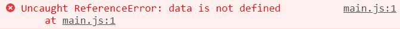

En analysant consoler, on voit qu'on a une petite erreur c'est à dire une erreur de référence avec Uncaught qui signifie que ça n'a pas été capturé et on a ensuite quelque chose qui termine par le terme Error `ReferenceError`.

qui est un type soit de nombreux types qui existent en javascript, type d'erreur que l'on peut avoir ici en termes d'erreur d'exécution.

Ainsi on a des `ReferenceError` qui veut simplement dire que cette variable `data` n'est pas défini, c'est le cas on essaie d'afficher la valeur d'une variable qui n'existe pas donc elle faudrait qu'elle existe au préalable pour qu'elle ne génère plus d'exceptions.

```js
let data = 24;
console.log(data);
```
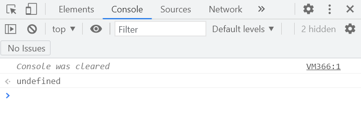

Voilà alors là il n'y a plus d'erreur donc pas de problème lorsque j'actualise (dans le terminal avec Visual Studio code, on peut utiliser la fonction clear()).

Alors on peut trouver pas mal d'erreur tel qu'un `TypeError`, on aura également des erreurs plus internes tel que `InternalError`, on aura également des erreurs sur ce qui est évaluation d'expression et cetera bref tout ce qui va avoir un nom terminer par le terme `Error` tout un tas de types d'erreurs qui sont au niveau de JavaScript.

## Lever notre exception et capturer une erreur

Rappelez vous qu'en JavaScript tout est objet, tout ce que nous avons au niveau de javascript sont des manipulations d'objets et il existe tout simplement de manière native un objet qui s'appelle `Error` de javascript.

Le plus simple parce que là on a vu que l'erreur `ReferenceError` avait été lever toute seule quand on avait actualiser la page web avec un script dont on n'avait pas déclaré la variable data.

En avait voulu afficher une donnée et comme elle n'avait pas été trouvée, on a eu une exception qui a été levée mais cette exception ne la traite jamais c'est à dire qu'il nous indique qu'il y a une erreur mais qu'on ne sait pas traiter cette erreur là pour pouvoir faire éventuellement quelque chose à partir de cette erreur générée donc automatiquement on a eu cette erreur qui nous a indiqué que ça n'avait pas été capturé.

Alors comment ça se passe ? c'est à dire que vous voyez que cette lever d'exception a été faite automatiquement donc cela veut dire que est ce que nous en tant que développeur pouvons manuellement lever une exception, et nous allons faire ça au plus simple.

Merci nous avons notre objet généré qui est `Error` qui est finalement le type d'exception le plus général d'accord cela signifie que c'est assez vague, que cela représente une erreur, et donc qu'est ce que c'est comme erreur, est ce que c'est une erreur d'évaluation? est-ce que c'est une erreur de référence ? Ou alors est ce que c'est une erreur ou on a par exemple débordé de la zone d'emplacement de certaines collections qu'on verra plus tard comme les tableaux donc on ne sait pas trop on a juste `Error`.

Alors pour lever notre exception, il y a une instruction avec le terme `throw` qui permet de lever une exception et on va utiliser une instance d'un autre objet `Error`.

```js
throw new Error("Je lève une erreur...");
```

Voilà on crée une instance d'un autre objet `Error` et le plus simple c'est d'écrire le message qu'on lève une erreur bien qu'on ne lève rien du tout dans ce cas-ci, on a vraiment fait quelque chose de très simple.

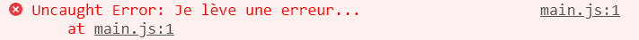

Voilà on retrouve bien ce terme `Error` qui est finalement l'erreur la plus générique, la plus basique des types d'exceptions qu'on peut avoir en javascript et on a bien sûr le message lorsqu'on a actualiser notre page.

J'aurais pu ne pas afficher le message du tout, mais j'ai choisi d'afficher un message qui permet d'afficher directement dans la console ce qui est pas mal pratique à ce niveau-là.

Voilà la méthode la plus simple c'est à dire qu'on lève une exception mais le but c'est pas simplement de se dire qu'on peut générer des exceptions manuellement, afficher des erreurs mais l'intérêt c'est de pouvoir traiter les exceptions qui peut être levées automatiquement.

Donc ça c'est une première méthode `throw new Error("Je lève une erreur...");` pour lever les exceptions, et si on a déjà programmé dans d'autres langages de programmation qui gèrent les exceptions, on ne va pas apprendre grand-chose de nouveau pour cette partie là parce que ça va être grossièrement la même syntaxe et c'est quand même l'avantage.

Alors d'un langage à l'autre, c'est quand même assez rare d'avoir une syntaxe différente.

## Le bloc try catch

Alors maintenant nous allons utiliser le bloc try catch avec quelques subtilités mais qui est le minimum à savoir ici.

En gros et ça c'est un conseil pour vos développements à venir d'accord quand vous savez qu'une opération ou un traitement, en fait un bout de code peut éventuellement générer des exceptions donc lever des exceptions donc c'est à dire qu'il y aurait un risque qu'il y ait une erreur d'exécution c'est à dire que ce n'est pas garanti à 100% que ça fonctionne, il faudra donc le englober dans un bloc try puis on va la capturer, rappelez vous que tout à l'heure il était indiqué `Uncaught` c'est-à-dire le fait d'avoir une erreur non capturée.

```js
try
{
    //Code sensible, qui pourrait lever une exception
    throw new Error("Une erreur s'est produite...");
}
```

Si je me contente de ça alors il n'y a pas de lever, on pourrait même se contenter de ne pas faire de bloc try catch et maintenant va capturer ce type d'erreur catch qui est un autre bloc,  on va lui indiquer une variable qui servira à récupérer l'objet `Error` ainsi on voudra récupérer ce qu'il a récupéré comme informations pour pouvoir travailler dessus et les exploiter, généralement on utilise une variable qui s'appelle `e` mais on peut mettre le nom que l'on veut ou `err` et puis on traite l'erreur dans le bloc `{…}` c'est-à-dire que à partir du moment où il y a une exception qui est levé, on arrive dans le bloc catch.

```js
try
{
    //Code sensible, qui pourrait lever une exception
    throw new Error("Une erreur s'est produite...");
}
catch(err)
{

}
```

Admettons qu'on fasse un code et que tout se passe bien qu'il n'y ait jamais de problème, le bloc catch sera tout simplement ignoré.

Voilà il n'est pas obligatoire que le traite le contenu de ce bloc catch(). C'est seulement si une exception a été levée.

Ici le plus simple c'est afficher tout simplement en console la variable qui a été récupérée.

```js
try
{
    //Code sensible, qui pourrait lever une exception
    throw new Error("Une erreur s'est produite...");
}
catch(err)
{
    console.log(err);
}
```
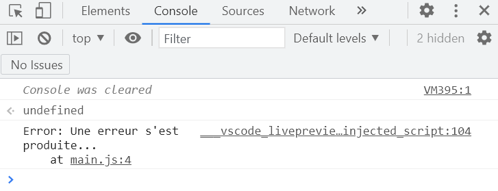

Voyez que par défaut lorsqu'on actualise, on a ce nom `Error` et on a ce message d'erreur comme tout à l'heure.

On n'a plus le `Uncaught` c'est à dire le message pour dire que ce n'était pas capturé puisque c'est ce que nous avons fait, nous l'avons capturé. Dans la console on peut avoir également tout un tas d'autres informations c'est à dire une trace pour savoir dans quel fichier il y a eu une lever d'exception, quelle ligne et cetera bref on a pas mal d'informations.

Ensuite à partir de cet objet, je peux très bien avoir accès à quelques attributs puisque c'est un objet.

Le plus simple c'est l'attribut message, `err.message`.

```js
try
{
    //Code sensible, qui pourrait lever une exception
    throw new Error("Une erreur s'est produite...");
}
catch(err)
{
    console.log(err.message);
}
```
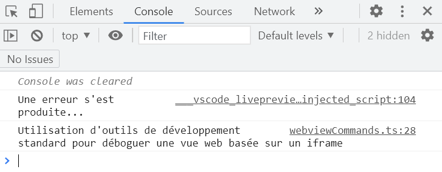

Voilà on ne va afficher que son message.

Certaines fois on a un code aussi, `err.code`.
```js
try
{
    //Code sensible, qui pourrait lever une exception
    throw new Error("Une erreur s'est produite...");
}
catch(err)
{
    console.log(err.code);
}
```
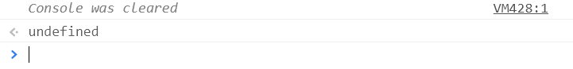

Voilà cet attribut n'est pas défini.

On va avoir également stack `err.stack` qui va permettre d'avoir la trace qui va nous indiquer le fichier en question et la ligne qui est concerné par l'erreur.

```js
try
{
    //Code sensible, qui pourrait lever une exception
    throw new Error("Une erreur s'est produite...");
}
catch(err)
{
    console.log(err.stack);
}
```
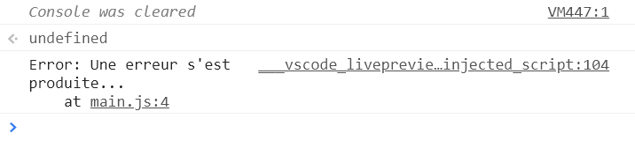

Voilà il nous indique dans quel fichier l'erreur s'est produite, la ligne etc.

Attention parce que des fois je pense à l'attribut `err.filename` et il doit y avoir également `err.lineNumber` dont je vous parle rapidement sans vous montrer ce que ça fait parce que selon le navigateur ce n'est pas forcément pris en charge, ce ne sont pas en fait des propriétés standard pour cet objet `Error` donc selon le navigateur que vous avez.

Alors dans la vidéo on a testé sur Firefox et ça passe mais on n'a pas de mémoire tous les navigateurs sur lequel c'est pris en charge ou pas.

```js
try
{
    //Code sensible, qui pourrait lever une exception
    throw new Error("Une erreur s'est produite...");
}
catch(err)
{
    console.log(err.lineNumber);
}
```
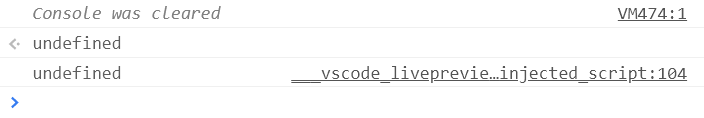

Sur Edge ça ne marche pas.

Voilà les attributs `filename` et `lineNumber` son taille vite parce que ce ne sont pas standard, ils ne sont pas disponibles partout et ça ne fonctionnera pas à tous les coups tandis que `stack` à condition qu'on ne dise pas de bêtises il fonctionne pas à tous les coups et ´message` étant l'information la plus générale, la plus importante qu'il y ait, la plus essentielle en ce qui concerne les erreurs, vous l'avez également partout aussi.

Voilà au plus simple donc ça c'était le strict minimum à faire à partir d'une simple variable `err` éventuellement on affiche la totalité des informations sans spécifier un attribut comme ceci `console.log(err);`

+ main.js
```js
try
{
    //Code sensible, qui pourrait lever une exception
    throw new Error("Une erreur s'est produite...");
}
catch(err)
{
    console.log(err);
}
```

Ne pas oublier que l'on va mettre le code à risque dans le bloc try{} donc si vous savez que le code à l'intérieur peut éventuellement lever une exception c'est à dire qu à un moment donné il va y avoir un `throw new …` suivi de quelque chose donc peu importe le type `Error` ou autre, Eh bien ensuite on traite l'information dans le bloc catch(){} qui sait on n'a pas fait gros c'est à dire qu'on s'est juste contenté d'afficher l'erreur. Voilà on n'est pas en train de faire une correction, de vérifier une information ou autre mais c'est évidemment le but à la longue lorsqu'on sera sur des programmes plus poussés le but ne sera pas simplement d'afficher l'erreur ce qui n'a vraiment pas beaucoup d'intérêt.

Alors maintenant qu'est ce qui se passe lorsqu'il y a une exception ? Alors il faut savoir que nos programmes s'exécutent dans des **threads** alors vous avez peut être remarqué si vous savez comment fonctionne un processeur, vous avez différents threads c'est à dire des coeurs et chacun peut avoir un ou deux threads voir plus en fonction.

Ces threads permettent d'exécuter des programmes de manière parallèle, de ne pas dire qu'on va tout exécuter dans un seul thread et que tout se passe dans un seul et même cycle (même si je n'aime pas trop le terme) mais on peut avoir comme ça des traitements et des exécutions qui se font comme ça de manière parallèle.

Alors en cas d'exception, vous pouvez voir que le thread où est en train d'être exécuté le programme ici va être stoppé, ce qui veut dire que si vous avez de la **programmation parallélisé** (ça c'est quelque chose que nous avons pas encore abordé) ça ne veut pas stopper les autres parties de notre programme qui serait dans d'autres threads par contre le thread en cours est effectivement stoppé.

Cela signifie pour faire simple, si vous avez une exception qui est rencontrée, le programme sera stoppé. Il n'y a pas de quoi que ce soit qui continue derrière et puis de dire que si je fais quelque chose on va continuer l'exécution du programme…

```js
try
{
    //Code sensible, qui pourrait lever une exception
    throw new Error("Une erreur s'est produite...");
}
catch(err)
{
    console.log(err);
}

document.write("OK");
```

Non on ne va pas continuer l'exécution du programme mais on va stopper le thread en cours. Il faudrait éventuellement que `document.write("OK");` soit dans un autre thread pour que cette partie continue mais nous n'en sommes pas là du tout en ce qui concerne les **programmes asynchrones, synchrones** et cetera. On est loin d'en être là encore pour le moment au niveau de javascript.

Sachez le histoire d'être bien précis pour ce langage parce que ce n'est pas forcément le cas des autres langages car tout ne fonctionne pas pareil c'est à dire qu'ici on parle d'**interruption du thread en cours**.

Alors le but ici par rapport au code qu'on vient de faire c'est d'afficher un message en cas d'erreur, un message un peu plus explicite pour l'utilisateur, ça peut être par exemple de faire une autre tentative. On pourrait très bien par exemple faire un nouveau try avec une correction par exemple pour le traitement qu'on essaie de faire si le premier n'a pas marché.

```js
try
{
    //Code sensible, qui pourrait lever une exception
    throw new Error("Une erreur s'est produite...");
}
catch(err)
{
    try
    {

    }
    console.log(err);
}
```

Voilà on peut évidemment les imbriquer car ce ne sont que des blocs de code donc on peut évidemment réécrire n'importe quoi dans ce bloc, on peut faire des conditions ou des boucles, définir des choses, créer des variables et cetera.

## Le bloc finally

Alors maintenant la petite subtilité de ce bloc try catch (on va repartir du code minimal), la petite subtilité c'est de passer par un bloc finally.

Comme vous l'avez vu il n'est pas obligatoire mais en fait il vous garantit que peu importe ce qu'il se passe, peu importe qu'on ait le bon scénario c'est à dire que tout ce qu'il y a dans le try se passe bien ou bien alors une exception est lever et on rentre dans le bloc catch, peu importe le scénario, on fera ce qui était inscrit dans le bloc finally.

```js
try
{
    //Code sensible, qui pourrait lever une exception
    throw new Error("Une erreur s'est produite...");
}
catch(err)
{
    console.log(err);
}
finally
{
    document.write("OK");
}
```
```txt
JavaScript #10 - Héritage
OK
```

Là vous voyez que si j'actualise, on a le message ok qui s'est bien réalisé et si admettons que j enlève le levage d'erreur, il se exécutera quand même.

```js
try
{
    //Code sensible, qui pourrait lever une exception
    //throw new Error("Une erreur s'est produite...");
}
catch(err)
{
    console.log(err);
}
finally
{
    document.write("OK");
}
```
```txt
JavaScript #10 - Héritage
OK
```

Voilà il se passera dans les 2 cas mais si certains se posent encore l'utilité de ce genre de bloc, c'est très simple, admettons que vous ayez voulu ouvrir un fichier et que l'ouverture du fichier s'est bien passée et après vous voulez faire une opération sur ce fichier qui peut éventuellement générer une erreur, peu importe laquelle, s'il y a une erreur à ce moment-là vous n'allez certainement pas laisser le programme s'interrompt et gardez le fichier ouvert par exemple. Attention en ce qui concerne Java script c'est un petit peu différent mais il y a des langages on doit fermer les fichiers, il y a des histoires de flux il faut bien respecter ça.

On ne va donc pas laisser les ressources tel quel mais vous allez par exemple fermer un fichier qui a été ouvert.

Le bloc finally permet ainsi de garantir, de dire qu'il y a une erreur qui s'est produit au moment où on a voulu exploiter le fichier qui a pu être ouvert et dans ce cas-là le traitement qu'on a pu faire sur le fichier ouvert marche ou non, on s'en fiche on veut que dans les 2 cas, les 2 scénarios possibles, le fichier soit fermé.

Voilà à quoi peut servir un bloc finally, c'est pour dire que quoi qu'il arrive, je veux que tu fasses au moins ces traitements là, dans les 2 cas.

Très important et ça vous en aurez souvent usage, dans certains cas précis, donc ce n'est pas quelque chose qu'on rencontrait peu mine de rien et c'est bien de savoir que c'est une option qui existe pour cette gestion d'exception.

Voilà on aura vu déjà pas mal d'informations bien qu'il n'y ait pas grand chose à vous montrer, ce qui est déjà une partie importante pour cette gestion d'exceptions.

## Les types erreurs et les conditions

Alors on a vu les blocs try catch finally mais maintenant on va pouvoir voir par exemple certains types d'erreurs, peut être que vous allez vouloir vérifier un type d'erreur précis.

Alors il n'y a pas de moyens comme dans d'autres langages par exemple de le faire directement c'est à dire que dans certains langages on peut spécifier directement le type d'erreur.

Au niveau de javascript pour faire au plus simple, on va passer directement par une condition pour pouvoir tester. Pour ce faire on va pouvoir utiliser l'opérateur `typeof` qui permet de déterminer le type d'une information et comme on parle d'un objet on a aussi la possibilité d'utiliser l'opérateur `instanceof` pour dire de quel type est `e`.

```js
if(e typeof)
if(e instanceof)
```

Alors nous avions vu que le type le plus générique pour les erreurs c'était `Error` mais on va en avoir d'autres.

```js
/*
    Error
    TypeError, RangeError, SyntaxError
    InternalError, EvalError
*/
```

Il doit y avoir 7 types d'erreur en javascript mais comme il y en a ajouté comme langage JavaScript évolue constamment donc si vous avez plusieurs types d'erreur, et si vous voulez vérifier que l'erreur qui a été levé est obligatoirement d'un de ces types là par exemple `TypeError` et pas autre chose, Eh bien vous allez pouvoir faire ceci.

```js
/*
    Error
    TypeError, RangeError, SyntaxError
    InternalError, EvalError
*/

try
{
    //throw new Error("Une erreur s'est produite...");
    someFunction();
}
catch(err)
{
    if(err instanceof TypeError)
        console.log();
    else if(err instanceof RangeError)
        console.log();
}
```

Ainsi si `err` est une instance de `TypeError` alors je traite l'information d'une certaine manière mais on peut également faire un `else if` si par exemple on a levé un autre type exception.

Alors on pourrait se demander pourquoi est-ce qu'on va traiter ce genre de choses dans le catch, Eh bien on pourrait avoir des opérations qui ne vont pas forcément lever le même type d'exception.

Peut être qu'on a certaines instructions qui peuvent lever différents types en même temps, ou peut être qu'on va avoir l'appel à une fonction `someFunction()` mais peut être que cette fonction selon l'endroit des traitements qu'elle est en train de faire souhaite lever ce type d'exception `TypeError` ou bien lever ce type d'exception `RangeError`. Cela signifie que si on a eu `TypeError`, on sait comment on va pouvoir traiter l'exception et par rapport à quoi il y a eu une erreur tandis que si on a une `RangeError` on connaît d'où vient l'erreur et qu'est-ce qui a levé cette exception, et on le traite d'une autre manière.

Voilà on va pas traiter un problème de type avec un problème de bord (ou de portée) au niveau du code que l'on a eu.

Voilà une méthode qui est un peu plus important pour pouvoir filtrer plus correctement ce type d'exception qui a été soulevé, qui a été levé ici directement dans le try donc c'est pas mal à savoir et ça permet de détailler un peu plus et de définir les choses un peu plus précisément pour que ce soit beaucoup plus clair.

## Créer un type erreur personnalisé via une fonction

Alors nous allons revenir sur un petit rappel parce qu'il faut savoir qu'en javascript, il y a cette histoire de prototype d'accord c'est un langage objet orienté prototype et vous avez vu qu'avec les derniers standards **ecmascript 6**, il y a cette instauration des classes mais comme je vous l'ai expliqué récemment concernant l'héritage, vous avez vu qu'on parle de classe mais c'est pas comme dans les autres langages de programmation c'est à dire que derrière on a toujours cette histoire de programmation orientée prototype même si on a l'impression aujourd'hui qu'on a de la programmation orientée classe d'accord.

Alors maintenant je vais vous montrer 2 manières de faire parce que là on a vu comment lever manuellement une exception éventuellement, on a vu également maintenant comment capturer une exception pour pouvoir traiter des erreurs donc ça c'est très important mais vous avez remarqué qu'en terme de type d'erreur, on n'en a pas des milliers, des milliers.

Peut être qu à un moment donné vous allez vouloir gérer de manière personnalisée un certain type d'erreur, par exemple on pourrait très bien s'amuser à faire une `ZeroDivisionError` qui peut être un type d'exception et qui existe déjà dans d'autres langages de programmation, de dire tout simplement que quand on tente une division (qu'on tente une division par zéro, Eh bien on lève ce genre d'exception).

Alors on pourrait tester au niveau de javascript, qui pourrait traiter la `ZeroDivisionError` d'une certaine manière, essayez par exemple de faire une division par 0 en javascript et de voir un petit peu ce qu'il se passe à l'exécution. Voilà pour un exercice très simple.

Voilà on aimerait par exemple pour n'importe quel type de programme pour pouvoir traiter un certain type d'erreur, de se dire qu'on voudrait par exemple créer un certain type personnalisé bien précis qui n'existe pas de manière basique en natif en javascript.

La méthode la plus simple de le faire c'est de passer par une fonction.

On va donc rester sur le système de prototype pour gérer ça de cette manière. Ainsi je vais vous montrer une notation sous forme de fonction, ce qu'on appelle finalement une notation dit à l'ancienne tel qu'on pouvait le voir dans **ecmascript 5** pour ceux qui veulent les informations bien précises, et après on verra la notation via le principe des classes qui a été instauré par la suite avec **ecamascript 6**.

Alors ce que nous allons faire c'est qu'on va pouvoir passer par notre objet `Error` parce que après tout il est fait pour ça et l'intérêt c'est de s'en servir (donc on vire tout le code et on va faire une function).

```js
function MyError(message)
{

}
```

En paramètre de cette fonction on lui passe le message parce que c'est quand même le minimum à savoir concernant ici notre type d'erreur.

On va utiliser une variable pour retourner notre type d'erreur `err` qu'on écrit pas en majuscule puisque c'est quelque chose qu'on va retourner directement alors qu'on sait qu'on pourrait très bien mettre une constante à majuscule mais ça c'est vous qui voyez et on crée une `new Error()` au quel on va passer le message parce que c'est finalement l'élément que prend cet objet `Error` de JavaScript. Cet élément est en `const` parce qu'on ne veut pas y toucher, on ne va pas faire de modification à ce niveau-là et à partir de là on peut rajouter autant d'informations qu'on veut.

```js
function MyError(message)
{
    const err = new Error(message);
    //...
}
```

À partir de là on va pouvoir rajouter des informations c'est à dire que là on crée déjà un objet de type `Error` car rappelez vous qu'on a déjà le message `message`, on a `stack`, on peut éventuellement avoir `lineNumber` (ça on ne l'a pas parce que ce n'est pas standard partout), `filename` et cetera. En bref on peut avoir d'autres attributs et on peut très bien en ajouter d'autres.

En Java script on peut très bien faire `err.` donc on met `err` et on rajoute un point et puis une autre information donc par exemple on pourrait rajouter un fichier de log `err.logfile` Auquel on spécifierait l'endroit où il se trouve.

```js
function MyError(message)
{
    const err = new Error(message);
    err.logfile = 'log/myerror.log';
}
```

On pourrait également spécifier par exemple un code `err.code`.

```js
function MyError(message)
{
    const err = new Error(message);
    err.logfile = 'log/myerror.log';
    err.code = 'INITIALIZATION_DATABASE_ERROR';
}
```

Saints Row l'a déjà remarqué surtout pour Oracle qui fait beaucoup ça, MySQL fait beaucoup ça aussi, donc beaucoup de systèmes on a des fois des codes d'erreur qui sont généralement écrit en majuscule par exemple on pourrait avoir le message `err.code = 'INITIALIZATION_DATABASE_ERROR';` mais ça peut être aussi des fois un code sous forme de nombres par exemple entre le développeur on pourrait se dire que ce type d'erreur c'est une erreur 310 `err.code = 310;`.

```js
err.code = 310;
```

Voilà on pourrait dire que le code de cette erreur est 310 donc on ajouterait toutes les informations que l'on veut et puis on fait un petit `return` de tout ça.

```js
function MyError(message)
{
    const err = new Error(message);
    err.logfile = 'log/myerror.log';
    err.code = 310;

    return err;
}
```

Je rappelle qu'on avance une fonction donc on peut retourner l'information à la fin sans problème, alors le message on peut éventuellement le retraiter par la suite si on veut pouvoir le définir dans cette fonction même si on l'a en argument de la fonction mais on aurait pu évidemment passer un message dans le corps de cette fonction.

```js
function MyError(message)
{
    const err = new Error(message);
    err.logfile = 'log/myerror.log';
    err.code = 310;
    err.message = message || "Le message générique";

    return err;
}
```

Voilà on définira un message et puis éventuellement on mettra un message par défaut, de base.

À partir d'ici, on fait notre instance, notre objet Error `const err = new Error(message);`. Ensuite, on lui ajoute des éléments de manière personalisé certaines informations (`err.logfile`, `err.code`, etc.). On l'ajoute enfin à la chaîne des prototypes `CustomException.prototype = Object.create(Error.prototype);` c'est-à-dire que le erreur-là `Error.prototype` est ajouté à la chaîne des prototypes `CustomException`. `CustomException` est un tier particulier. Nous pourrons faire des tests maintenant qu'on connaît ce genre de syntaxe `CustomException.prototype` tandis que `Object.create(Error.prototype);` a été abordé dans la vidéo précédente donc maintenant on devrait voir comment ça fonctionne.

on peut faire `throw new MyError()`.

```js
function MyError(message)
{
    const err = new Error(message);
    err.logfile = 'log/myerror.log';
    err.code = 310;

    return err;
}

CustomException.prototype = Object.create(Error.prototype);

throw new MyError("Problème !");
```
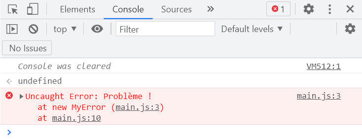

Voilà on lit bien un problème, on indique que ça n'a pas été capturé `Uncaught` ce qui est effectivement le cas puisqu'on n'a rien capturer du tout mais vous voyez en tout cas qu'on fait comme ça personnaliser les types d'erreurs.

Voilà on a `MyError` qui n'existe pas de manière native en JavaScript C'est à dire qu'on a créé notre propre type d'erreur, notre propre type d'exception, on aurait pu également l'appeler `MyException` si vous voulez.

Voilà pour cette première méthode, qu'on pourrait appeler à l'ancienne mais elle est loin de ne plus être utilisé aujourd'hui où qui serait forcément obsolète, ce qui n'est absolument pas le cas. On l'a bien compris dans la séance précédente concernant les prototype en javascript même si on a tendance à dire que maintenant qu'il y a les classes, on ne peut plus se servir du reste ce qui est quand même faux.

Voilà pour cette première syntaxe.

## Créer un type erreur personnalisé via la syntaxe des classes

Si on veut le faire sous forme de classe, d'une manière un peu plus moderne, on va pouvoir réviser les choses qu'on a vu précédemment pour vérifier si on a bien compris l'utilisation des classes en javascript, tout ce qui est l'héritage et cetera. Il y avait également si vous vous rappelez certaines choses qu'on avait vues concernant les fonctions.

On va commencer par créer une classe (on vire tout le reste du code), c'est une classe qui va étendre `Error`

```js
class MySpecialException extends Error
{

}
```

À l'intérieur de notre classe on commence par créer le constructeur `constructor()` et non pas construct que plutôt la syntaxe de PHP, et à partir de là on va pouvoir gérer directement nos éléments donc ici on est encore une fois sous la syntaxe sous forme de classe qui est la syntaxe de **ecmascript 6** qui est pour le coup plus moderne parce qu'elle est arrivé forcément après.

Alors quelles informations va pouvoir gérer ? On va cette fois-ci gérer une information de code, et on va lui passer des paramètres variables c'est à dire qu'on ne sait pas combien de paramètres on peut avoir éventuellement.

```js
class MySpecialException extends Error
{
    constructor(code, ...params)
    {

    }
}
```

Alors comme on a un héritage, on va construire notre exception `MySpecialException` à partir de la classe `Error` donc on va du coup faire appel à super() auquel on va passer les paramètres.

```js
class MySpecialException extends Error
{
    constructor(code, ...params)
    {
        super(...params);

        this.name = "MySpecialException";
        this.code = code;
    }
}
```

Et après on peut mettre un nom d'exception (très intéressant) en écrivant ceci `this.name = ""` et puis on donne autant d'attributs que tout à l'heure bien qu'on ne l'a pas fait tout à l'heure pour l'autre syntaxe mais on peut le faire et c'est peut être mieux.

Après bien sûr on peut rajouter tous les attributs que l'on veut sans aucun problème.

Ainsi on peut déjà lever l'exception.

```js
class MySpecialException extends Error
{
    constructor(code, ...params)
    {
        super(...params);

        this.name = "MySpecialException";
        this.code = code;
    }
}

throw new MySpecialException();
```
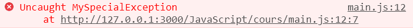

On va capturer cet exception pour avoir quelques petits trucs.

```js
class MySpecialException extends Error
{
    constructor(code, ...params)
    {
        super(...params);

        this.name = "MySpecialException";
        this.code = code;
    }
}

try
{
    throw new MySpecialException();
}
catch(e)
{
    console.log(e);
}
```
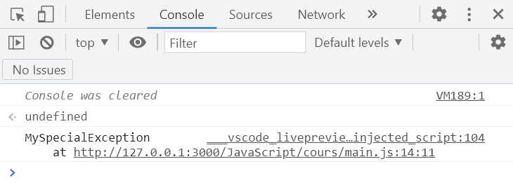

On peut afficher le nom.

```js
class MySpecialException extends Error
{
    constructor(code, ...params)
    {
        super(...params);

        this.name = "MySpecialException";
        this.code = code;
    }
}

try
{
    throw new MySpecialException();
}
catch(e)
{
    console.log(e.name);
}
```
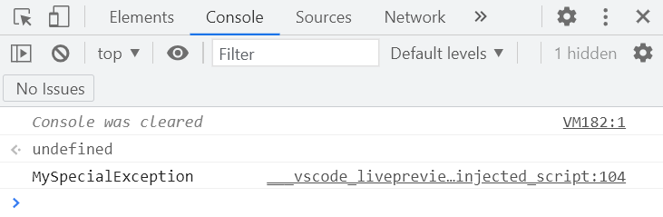

Là vous voyez qu'on affiche bien le nom, on peut aussi afficher le code.

```js
class MySpecialException extends Error
{
    constructor(code, ...params)
    {
        super(...params);

        this.name = "MySpecialException";
        this.code = code;
    }
}

try
{
    throw new MySpecialException();
}
catch(e)
{
    console.log(e.code);
}
```

Voilà on affiche le code d'erreur, pareil c'est un attribut personnalisé qu'on a choisi nous-mêmes et puis bien sûr on peut retrouver les attributs de `Error`, ceux qui ont été hérités d'un autre objet `Error`, `e.stack`.

```js
class MySpecialException extends Error
{
    constructor(code, ...params)
    {
        super(...params);

        this.name = "MySpecialException";
        this.code = code;
    }
}

try
{
    throw new MySpecialException();
}
catch(e)
{
    console.log(e.stack);
}
```
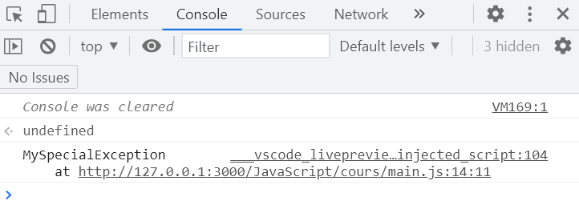

Alors au lieu de mettre ça dans log(), on pourrait mettre ça dans error().

:warning:
```js
console.error(e.stack);
```

Alors on avait vu ce error() en tout début de cours donc autant l'utiliser ici parce qu'il est tout à fait adéquat pour indiquer que c'est une erreur et pas seulement un message d'information.

Voilà pour une autre manière de faire, c'est une question de préférence car ce n'est pas moi qui vais vous dire d'utiliser la syntaxe des prototypes, la syntaxe littérale, la syntaxe avec les mots clés de classe ou d'héritage qu'on connaît beaucoup dans d'autres langages de programmation donc c'est à vous devoir.

Ainsi dans ce cas nous aurions vu encore 2 syntaxes, la syntaxe prototype (un peu la syntaxe historique) et on a la syntaxe plus nouvelle qui est la syntaxe de classe avec le mot-clé `extend` et la construction du constructeur `constructor`  qui est similaire à d'autres langages de programmation objet, orienté classe.

## Pas d assertion en JavaScript

Alors petite parenthèse de fin, il n'y a pas d'**assertion** en Java script, ce que l'on retrouve pourtant dans d'autres langages, on peut par contre se créer une fonction assert() si on veut, ce qui se résumerait au coussin par lui passer une condition et un message et en gros si la condition n'est pas satisfaite, on se sert de ce qu'on a vu jusqu'ici comme ceci.

```js
function assert(condition, message)
{
    if(!condition)
        throw message || "Erreur d'assertion";
}
assert(1 === 1);
```

On rappelle qu'on a le symbole `||` pour dire que s'il n'y a pas un message qui est indiqué alors on met notre phrase à nous. Par exemple on peut faire un `assert(1 === 1);` avec une condition pour tester si 1 était égal en valeur et en type à 1 donc si s'il n'y a pas de problème ça marche.

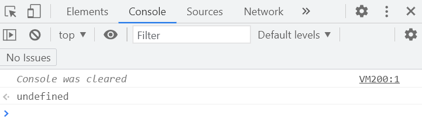

Et si c'est 1 par rapport à 2.

```js
function assert(condition, message)
{
    if(!condition)
        throw message || "Erreur d'assertion";
}
assert(1 === 2);
```
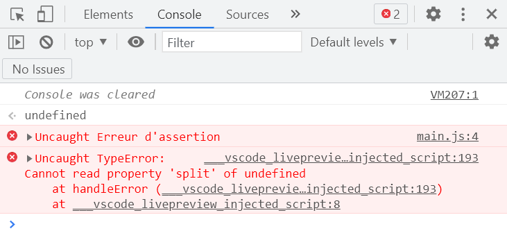

Voilà on a bien une erreur d'assertion.

Si on a l'habitude de faire des assertions dans d'autres langages, et si Java script ne propose pas nativement, ça peut peut être vous dérouter un petit peu mais je vous le montre parce que ça peut être intéressant.

Alors on a fait une fonction assert() mais on pourrait encore l'améliorer avec l'objet `Error` alors qu'on pourrait s'en servir donc autant s'en servir puisqu'il existe comme on l'a utilisé pour nos types customisés d'exceptions où on s'est servi de l'objet `Error` donc on pourrait également se servir de l'objet `Error` ici.

Voilà pour la petite astuce toute simple qui permet de faire des assertions on javascript.

Voilà on s'arrêtera ici et on verra d'autres choses, pour la prochaine fois on va faire le tour de pas mal d'objets qui existe en JavaScript comme les chaînes, les tableaux, les collections et après je pense on devrait passer à un autre chapitre parce que avec le langage JavaScript, on va pouvoir faire du web, travailler avec du CSS et du HTML et utiliser Java script là-dessus.

Ainsi nous sommes ici dans une première partie, chapitre de Java script, ou on a vu l'utilisation brute du langage donc n'hésitez pas à vous exercer. Par exemple exercez vous à faire vos propres types d'exceptions, essayez par exemple de faire des conversions lorsqu'on a vu par exemple la division par 0, essayer de faire des calculs ou vous savez que à coup sûr il va y avoir une erreur qui sera généré essai traité tout ça pour savoir comment ça fonctionne.

Voilà essaye de maîtriser un maximum ce concept là pour avoir le code le plus propre possible par la suite.

Ciao tout le monde