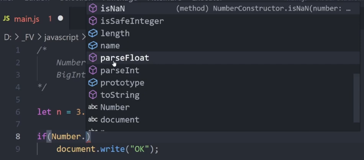

# [12. Nombres](https://www.youtube.com/watch?v=t2nPQyJkQlI)
+ [Number et BigInt](#Number-et-BigInt)

+ [Number](#Number)
+ [Propriétés](#Propriétés)
    + [MAX_VALUE](#MAX_VALUE)
    + [MAX_SAFE_INTEGER](#MAX_SAFE_INTEGER)
    + [NaN](#NaN)
+ [Méthodes](#Méthodes)
    + [isNaN()](#isNaN)
    + [isInteger()](#isInteger)
    + [isFinite()](#isFinite)
    + [isSafeInteger()](#isSafeInteger)
+ [prototype](#prototype)
    + [valueOf()](#valueOf)
    + [toString()](#toString)
    + [toFixed()](#toFixed)

+ [BigInt](#BigInt)
+ [](#)
+ [](#)
+ [](#)
+ [](#)

Bonjour et Bienvenue dans cette séance 12 en javascript, où nous allons faire une petite parenthèse sur tout ce que nous avons vu dans la programmation objet revenir plus en détail sur le type de données que nous pouvons manipuler.

Maintenant vous savez ce qu'est une classe et ce que sont des objets, des instances, on a manipulé des méthodes et des attributs également pour avoir des propriétés à nos différentes classes et maintenant nous allons revenir sur les différents éléments.

Maintenant nous allons faire un petit rappel sur les types que l'on peut avoir, dans les prochaines vidéos on va passer en revue les différents types de données et les manipulations que l'on peut faire dessus et de passer finalement un nouveau chapitre de cette formation parce qu'il y a encore beaucoup de choses à voir.

Nous allons passer au code et faire un petit rappel, histoire de ne pas perdre tout le monde et on va préciser quelques petites choses.

```js
/*
	Types primitifs :
        undefined
*/
```
on va retrouver d'abord des types dits primitifs, ce sont des types qui permettent de manipuler une certaine catégorie d'informations essaye types concernés par javascript sur le suivant : on retrouve notamment un type un peu particulier qui est *undefined* est un type que l'on retrouve généralement lorsqu'on déclare une variable sans l’initialiser, sans lui donner une valeur.

```js
let n;

document.write(n);
```
```txt
JavaScript #12 - nombres
undefined
```

On obtient `undefined` car la variable n'a pas été initialisée, elle n'a pas été déclarée avec une valeur réelle donc automatiquement d'un seul à qui s'applique ici. Alors ce n'est pas quelque chose qu'on retrouve forcément dans d'autres langages de programmation.

```js
/*
	Types primitifs :
        undefined
        null
*/
```

On a ensuite la valeur `null` que l'on peut éventuellement donner et qui va simplement indiquer rien. Ainsi il fait partie des types primitifs qu'on a en javascript.

```js
/*
	Types primitifs :
        undefined
        null
        Boolean (true, false)
*/
```

Ensuite on a des types pour représenter plusieurs types de données différentes donc par exemple type `Boolean` qui va représenter un booléen c'est à dire qu'il peut prendre 2 valeurs à savoir true ou false, vrai ou faux, c'est binaire, c'est soit l’un soit l'autre.

```js
/*
	Types primitifs :
        undefined
        null
        Boolean (true, false)
        Number
        BigInt
*/
```

Voilà on ne rentrera pas dans les détails pour ces types là mais nous ce qui va nous intéresser pour cette vidéo c'est le type `number` et `BigInt`.

Voilà on va en parler.

```js
/*
	Types primitifs :
        undefined
        null
        Boolean (true, false)
        Number
        BigInt
        String
        Symbol
*/
```

Ensuite on retrouve également d'autres types qui sont les types `String` et `Symbol`.

Alors il faut savoir également que les types `String` et `Symbol` son récent par rapport aux autres, et donc on aura l'occasion de plus en parler et s'il y a certains types dont je n'aborde pas et que je rentre pas dans le détail dans le cours, vous pourrez toujours surveiller la playlist des tutoriels de javascript si un jour c'est traité en annexe.

```js
/*
	Types primitifs :
        undefined
        null
        Boolean (true, false)
        Number
        BigInt
        String
        Symbol

    Autres types :
        Object
        Array
*/
```

Ensuite on retrouve ce qui est propre aux objets, on va mettre cela dans Autres types dont un qu'on parle beaucoup qui est `Object` et le type `Array` dont on parlera plus tard.

## Number et BigInt

## Number

Jusqu'à présent pouvait travailler avec des nombres sans problème par exemple comme ceci.

```js
let n = 125;

document.write(n);
```
```txt
JavaScript #12 - nombres
125
```

Voilà j'ai bien la valeur, je peux travailler avec et faire des calculs, on peut utiliser des opérateurs et faire de l'affichage et même avec l'usage de prompt, on peut carrément faire de la saisie d'informations, faire de la conversion en entier bref c'est ce qu'on a déjà fait jusqu'à présent sans dire ce qui se cachait derrière parce qu'on avait toute cette partie objet.

Ici par exemple si je veux déclarer quelque chose de type number, on va avoir une syntaxe un peu particulière mais que l'on connaît maintenant parce qu'on va utiliser l'opérateur `new` et on va faire ceci.

```js
let n = new Number(144); //NaN

document.write(n);
```
```txt
JavaScript #12 - nombres
144
```

Alors ici on prend en paramètre une valeur, on peut également la mettre sous forme de chaîne peu importe puisqu'on va tenter de faire une conversion de cette valeur pour que ça devienne la propriété de cette instance, cet objet.

Ici si on n'a pas pu faire de conversion, ça donnera *Not a number* (NaN) et sinon on obtiendra bien notre objet.

En actualisant, il n'y a pas de différence par rapport à ce que l'on faisait avant à part que nous avons ici précisément cet objet dans une classe Number qui englobe le type, qui représente le nombre en javascript.

Si on veut par exemple travailler sur une conversion d'un donnée en nombre tel quel, on utilisera Number() sous forme de fonction c'est à dire en faisant appel directement à une fonction et pas forcément un constructeur ici.

```js
let n = Number(144);

document.write(n);
```

Voilà on fera pour le coup conversion.

Attention la différence entre `Number(144)` et `new Number(144)` est très importante parce que si je m'amuse à utiliser les différentes formes, nous allons pouvoir tester, pour voir un petit peu la différence en considérant qu'il y a plusieurs syntaxes possibles.

```js
let n = new Number(144);
let n2 = Number(144);
let n3 = 144;

if(n instanceof Number)
    document.write("n est un Number<br>");
if(n2 instanceof Number)
    document.write("n2 est un Number<br>");
if(n3 instanceof Number)
    document.write("n3 est un Number<br>");
```
```txt
JavaScript #12 - nombres
n est un Number
```

Pour rappel, `n` est une instance, `n2` et pour l'appel d'une simple fonction et `n3` c'est directement l'initialisation.

Lorsque j'actualise, on voit qu'il n'y a que le premier qui nous confirme que c'est bien d'une instance donc on pourrait avoir éventuellement d'autres choses qui seraient d'une instance issu d'une autre classe ou qui pourrait même être autre chose n'appartenant pas à une classe parce que vous savez que Java script est à langage très particulier surtout avec les dévotions qu'il a connu qu'on a vu notamment avec les classes, les prototype qu'on a vu et tout ce que cela engendré.

En tout cas si vous voulez avoir vraiment une instance de la classe Number, il faudra passer par l'opérateur `new` qu'on a déjà utilisé précédemment lorsqu'on manipulait des classes.

Maintenant nous allons voir quelques propriétaires pour voir ce qu'il y a finalement dans cette classe Number et on verra que cette syntaxe `new Number()` sera utilisé dans des cas très spécifiques notamment si on veut pouvoir utiliser des méthodes de la classe et donc on pourra voir éventuellement un nombre sous cette forme là mais on va revenir sur quelque chose si on veut pouvoir notamment vérifier des informations.

## Propriétés

Comme Number est une classe, elle va posséder des propriétés, des attributs et avoir des méthodes. Je vais vous montrer quelques-unes des propriétés de cette classe qui peuvent servir pareil suivant l'usage que vous en aurez donc juste ce qui semble important à voir et qui pourrait éventuellement servir.

### MAX_VALUE

Par exemple si vous voulez voir la valeur maximale d'un nombre, on peut directement y accéder sans passer par une variable, juste en passant par la classe en utilisant le petit opérateur de portée `.` en demandant la valeur maximale.

```js
/*
    Number
    BigInt
*/

document.write(Number.MAX_VALUE);
```
```txt
JavaScript #12 - nombres
1.7976931348623157e+308
```

Voilà la valeur maximale, on peut avoir de très très grandes valeurs.

Au niveau de javascript on va pouvoir gérer des valeurs maximales jusqu'à 2 puissance 53 donc des fourchettes de valeurs assez particulières entre ce qui peut être géré tout court est ce que javascript va gérer parce que le langage peut décider de gérer un nombre jusqu'à une certaine taille ou pas…

Ainsi ici nous avons la valeur qui peuvent être supporter au maximum de manière générale.

### MAX_SAFE_INTEGER

C'est maintenant je veux la valeur pour un entier, admettons qu'on veut une valeur sûre pour la taille d'un entier on va avoir `MAX_SAFE_INTEGER`.

```js
document.write(Number.MAX_VALUE + "<br>");
document.write(Number.MAX_SAFE_INTEGER + "<br>");
```
```txt
JavaScript #12 - nombres
1.7976931348623157e+308
9007199254740991
```

Là on va retomber sur 2 puissance 53-1 ou en tout cas c'est la taille que ça comporte pour la manipulation via la classe Number. On a toujours ce repère de puissance 53 par rapport au nombre manipulable par Javascript.

Comme on a MAX, on a aussi la valeur minimale.

```js
document.write(Number.MIN_VALUE + "<br>");
document.write(Number.MIN_SAFE_INTEGER + "<br>");
```
```txt
JavaScript #12 - nombres
1.7976931348623157e+308
9007199254740991
```

Voilà ici on a donc l'inverse c'est à dire que ce sera -2 puissance 53-1 Donc le tout mis dans les négatifs. Pareil ici on a une très très grande valeur 5e-324 donc on peut avoir un nombre très très très très petit mais encore une fois pas forcément manipulable par javascript et suivant aussi le nombre que peut gérer votre processeur d'ordinateur donc on a bien sûr aussi plusieurs contraintes pas forcément pour le coup lié au langage ou au logiciel.

### NaN

On a également aussi une propriété Not a Number `NaN` Sur quelque chose qui est censé représenter un nombre même si ça paraît bizarre d'avoir ceci `Number.NaN` mais sachez que ça existe si admettons un jour vous avez besoin de représenter quelque chose pour dire que ce n'est pas un nombre.

```js
document.write(Number.NaN + "<br>");
```

Si on veut dire que quelque chose n'est pas un nombre, on peut utiliser cette propriété `NaN`.

Voilà je tenais quand même à vous citer cette propriété dont on parle beaucoup en javascript et qui est importante.

## Méthodes

Maintenant pour la suite de la vidéo nous allons passer à quelques méthodes que nous allons manipuler alors il faut savoir qu'en javascript, nous avons ce que représente les objets c'est à dire la classe *Object* qui est vraiment au plus haut et on va ensuite avoir des éléments par héritage et on va notamment voir également `Number.prototype` qui doit vous parler un petit peu avec tout ce qu'on a vu sur les classes avec Javascript.

### isNaN

Pareil à partir de là nous avons plusieurs vérifications possibles par exemple si on veut pouvoir faire la vérification sur un nombre du style :

```js
let n = true;

if(Number.isNaN(n))
    document.write("OK");
```
```
JavaScript #12 - nombres
```

Là le booléen n'est pas considéré comme un nombre d'accord le booléen est considéré comme un cas particulier, et si à tout moment je fais ceci.

```js
let n = 154;

if(Number.isNaN(n))
    document.write("OK");
```
```
JavaScript #12 - nombres
```

Voyez qu'en faisant ceci, il ne considère toujours pas que ce n'est pas un nombre, on a ainsi des cas vraiment particuliers.

Mais alors si on fait ceci `NaN`.

```js
let n = NaN;

if(Number.isNaN(n))
    document.write("OK");
```
```
JavaScript #12 - nombres
OK
```

### isInteger

Alors ce qui va être utile également c'est pour un entier donc par exemple si j'essaie de tester si c'est un entier avec une valeur dont on a besoin de vérifier si c'est un entier.

```js
let n = 255;

if(Number.isInteger(n))
    document.write("OK");
```
```
JavaScript #12 - nombres
OK
```

Effectivement j'actualise mon navigateur et on a toujours okay.

Maintenant si je mais une valeur comme ceci avec une partie décimale 255.63, normalement ça ne devrait pas être considéré comme un entier et c'est effectivement le cas.

```js
let n = 255.63;

if(Number.isInteger(n))
    document.write("OK");
```
```
JavaScript #12 - nombres
```

Petite particularité notamment si ça tombe sur une valeur pile, le langage considèrera que c'est un entier.

```js
let n = 255.0;

if(Number.isInteger(n))
    document.write("OK");
```
```
JavaScript #12 - nombres
OK
```

Voilà donc faites attention à ne pas utiliser cette méthode Parce que même si on a une partie décimale, le langage peut considérer que c'est un entier.

Maintenant si on note quelque chose comme ça, voyez que ça change tout.

```js
let n = 255.00000000001;

if(Number.isInteger(n))
    document.write("OK");
```
```
JavaScript #12 - nombres
```

Voyez que finalement on considère que ça change tout parce qu’encore une fois s'il n'y a qu'un 0, on considère qu'il n'y a que des 0 donc écrire 255.0000000 reviens à écrire 255.0.

```js
let n = 255.0000000000;

if(Number.isInteger(n))
    document.write("OK");
```
```
JavaScript #12 - nombres
OK
```

Attention donc à cette partie là.

### isFinite

Voyons maintenant une autre méthode, isFinite().

```js
let n = 255.56;

if(Number.isFinite(n))
    document.write("OK");
```
```
JavaScript #12 - nombres
OK
```

La pareil si je demande un nombre fini, on a bien OK mais là pareil il me faudrait un nombre infini, un cas où la valeur ne s'arrête pas.

Voilà il faudrait qu'un nombre ne soit pas fini pour que cette méthode isFinite() ne renvoie pas vrai mais ça peut servir.

> ----------------------------------

### isSafeInteger

+ Note : On a oublié de dire tantôt qu'on a également aussi isSafeInteger() pour savoir si c'est un entier que peut gérer javascript.

```js
let n = 255.56;

if(Number.isSafeInteger(n))
    document.write("OK");
```

> ----------------------------------

Alors il y a quelques autres méthodes qu'on ne voit pas forcément que le retrouve notamment dans l'objet global et que l'on peut visionner avec Visual Studio.

  

Voilà ces méthodes sont accessibles également avec d'autres types qu'on a déjà utilisé avec le prompt lorsqu'on faisait de la saisie utilisateur donc il y a certaines méthodes qu'on va revoir très souvent comme par exemple toString(), parseInt(), parseFloat() et cetera.

Voilà ce sont des méthodes qu'on va pouvoir réutiliser à chaque fois et qu'on ne va pas rappeler dans cette vidéo.

## prototype

Maintenant ce qui va être intéressant c'est tout ce qu'on va avoir au niveau de `Number.prototype`.

### valueOf

Voilà `prototype` va notamment être utilisé directement comme une méthode c'est à dire notre objet Number, un point suivi du nom de la méthode directement par exemple comme ceci `n.valueOf()`.

```js
let n = 3.1623799;

document.write(n.valueOf());
```
```
JavaScript #12 - nombres
3.1623799
```

Voilà cette méthode nous retourne directement la valeur de `n` dans le cas où c'est une valeur qui est représentable.

### toString

toString() c'est un cas particulier qu'on a déjà vu sous forme de chaîne comme on l'a déjà vu si ça peut l'être sinon Java script prévoit un formatage bien précis sous forme de chaîne donc on a cette méthode qui est tout à fait valide.

```js
let n = 3.1623799;

document.write(n.toString());
```
```
JavaScript #12 - nombres
3.1623799
```

### toFixed

Maintenant on a la méthode toFixed() et si on ne met pas un nombre de décimales en paramètre elle va nous retourner directement la partie entière d'un nombre.

```js
let n = 3.1623799;

document.write(n.toFixed());
```
```
JavaScript #12 - nombres
3
```

Evidemment si je met à 2 décimale.

```js
let n = 3.1623799;

document.write(n.toFixed(2));
```
```
JavaScript #12 - nombres
3.16
```

Évidemment si on met à 5 décimales, on va voir également un arrondi de 7 à 8.

```js
let n = 3.1623799;

document.write(n.toFixed(5));
```
```
JavaScript #12 - nombres
3.16238
```

Voilà pour Number.

## BigInt

Maintenant nous allons passer à BigInt, qui va servir à manipuler des nombres plus grands que 2^53 donc on va avoir des nombres arbitraires parce qu'on avait des nombres avec une précision spécifique pour Number c'est à dire que je ne l'ai pas dit mais c'était en 64 bits donc c'est une double précision donc on peut avoir des valeurs plus précises qu'en simple pour ceux qui notamment utilisent d'autres langages de programmation.

```js
/*
    Number
    BigInt  :   nombres plus grands que 2^53
*/
```

On n’en aura probablement jamais besoin ou alors ton des cas très spécifique on va utiliser le type BigInt.

Alors voilà pour l'utiliser, on ne va pas utiliser l'opérateur `new` qu'on utilise pas généralement pour ce type-là et ainsi on peut indiquer de très très très grand nombre.

```js
let bn = BigInt(1463326461818187461);
document.write(bn);
```
```
JavaScript #12 - nombres
1463326461818187520
```

:warning: *1463326461818187461* est différent de *1463326461818187520*

Voilà on peut afficher des valeurs assez grandes pour le coup quoique ici on a probablement une valeur qui n'est pas bonne donc on a exagéré, on refais ici.

```js
let bn = BigInt(14633264618181);
document.write(bn);
```
```
JavaScript #12 - nombres
14633264618181
```

On va pouvoir ainsi manipuler quelque chose comme ça mais il faut faire attention à ne pas mettre l'opérateur `new` parce que vous allez voir que selon la syntaxe que vous allez utiliser soit on va créer effectivement le type que vous avez ici souhaite ça va créer un objet donc de type objet donc c'est un cas un peu spécial et on aura l'occasion d'en reparler encore parce que c'est quelque chose qui va concerner d'autres types de données qu'on va manipuler.

Voilà ici c'était pour BigInt et on va retrouver les méthodes de tout à l'heure ToString() donc il y a pas mal de méthodes que l'on retrouve un petit peu partout et cetera.

Voilà comme ça on peut manipuler de grands nombres mais il y a quand même peu de chances que vous en ayez besoin.

Voilà BigInt est arrivé il y a peu de temps dans le langage mais je voulais quand même l'aborder même s'il n'y a pas grand-chose à dire ici mais il y aura probablement d'autres choses dans les mises à jour futures.

Voilà nous allons nous arrêter là.

C'était intéressant de parler des types pour dire qu'on n'a pas juste un type et qu'on déclare une valeur de ce type mais qu'on a une véritablement une classe avec lequel on a pas mal de possibilités et de fonctionnalités donc je voulais faire quand même une petite vidéo dessus pour faire en bref énumération et un petit tour de tout ce qu'on pouvait retrouver là-dedans.

Si on veut plus de détails sur ce genre de classe il faut aller voir dans la documentation, comme d'habitude dans les vidéos on ne montre pas tout de A à Z mais juste voir ce qui est essentiel avec une explication et puis d'avoir la curiosité d'aller en voir plus selon les besoins et les usagés que l'on peut avoir.

À bientôt pour la prochaine séance où on va parler des chaînes de caractères sur lequel on va revenir en détail et on enchaînera avec les tableaux donc à priori ce sont les 2 prochains types de données qu'on va aborder dans ce cours parce qu'il faut revenir à ça près tout ce qu'on a vu jusqu'à présent.

Ciao