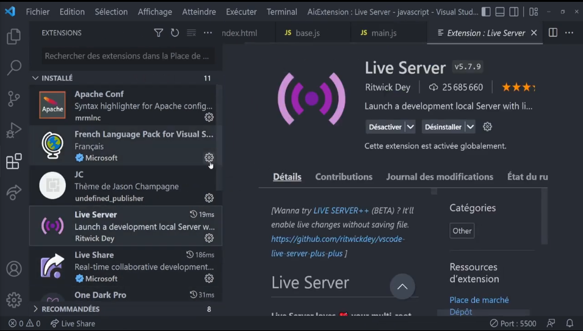
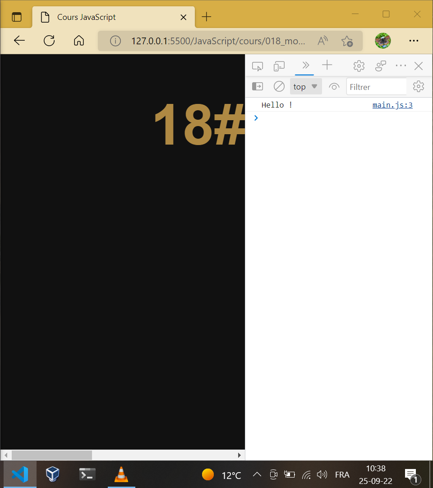

# [18. Modules](https://www.youtube.com/watch?v=uT80wq0TA98)

+ [Introduction](#Introduction)
+ [Qu'est-ce qu'un module ?](#Qu-est-ce-qu-un-module)
+ [Chargement d'un script comme un module](#Chargement-d-un-script-comme-un-module)
+ [Création d'un module](#Création-d-un-module)
+ [Utilisation du module](#Utilisation-du-module)
+ [Exécution du programme via HTTP](#Exécution-du-programme-via-HTTP)
+ [Renommage des exports](#Renommage-des-exports)
+ [Création d'un objet module](#Création-d-un-objet-module)
+ [Chargement dynamique d'un module](#Chargement-dynamique-d-un-module)
+ [Conclusion](#Conclusion)

>

## Introduction

Un module, scinder un programme en plusieurs partie pour mieux organiser les choses.

Comment créer des modules et les intégrer aux scripts.

## Qu est-ce qu un module

Le module est chargé en différé. En premier la page web est chargée puis c'est autour du module.

Avantage du module qui n'est exécuté qu'une seule fois.

## Chargement d un script comme un module

Charger un module sur une page web avec l'attribut `src` mais cette fois on ajoute l'attribut `type` pour pouvoir charger un module et non plus uniquement un script. Ici le fichier main.js est le fichier qui va utiliser le module avec une syntaxe spécifique.

En cas de navigateau qui n'aurais pas de màj comme pour quelqu'un qui n'as pas javascript d'activé, on a une balise `<noscript>` donc on utiliserais ici la balise `<script nomodule>` et indiquer à l'utilisateur un message d'erreur.

+ index.html
```html
<!DOCTYPE html>
<html lang="fr">
    <head>
        <title>JavaScript</title>
        <meta charset="UTF-8">
        <style>
            body{background-color:#111;color:#c8a94b;font-family:sans-serif;font-size:42px;margin:auto;width:1000px;}
            h1{color:#af8943;text-align:center;}
        </style>
    </head>
    <body>
        <h1>18# - Modules</h1>
        <script type="module" src="main.js"></script>
        <script nomodule>
            <p>Message d'indication...</p>
        </script>
    </body>
</html>
```
+ main.js
```js
document.write("Test !");
```

Au niveau Html, on ne fait rien de plus bien qu'on peut intégrer du code directement mais on travail un maximum des fichiers.

## Création d un module

Nous allons indiquer dans notre module les éléments (variables, fonctions, classes) qui peuvent être exporter du fichier, utilisés depuis l'extérieur ensuite les endroits où on veut utiliser les élements de notre module on importe le fichier.

Main.js va utiliser notre module. Deux manière d'exporter :

+ base.js
```js
function hello()
{
    return "Hello !";
}

export {hello};
```

Ou ..
```js
export function hello()
{
    return "Hello !";
}
```

Importer notre module :

+ main.js
```js
import {hello} from "./base.js";

console.log(hello());
```

## Utilisation du module

Attention lorsqu'on travaillait sur un document, on pouvait se contenter de charger le fichier html et c'est le moteur du navigateur qui exécute tout les scripts. En revanche pour les modules javascript, on doit avoir un système de requête Http càd pas depuis le chargement d'un fichier local.

On a donc besoin de lancer un liver serveur et de lancer ensuite nos fichiers html.

NodeJS lance un live serveur mais à ce stade du cours on a pas fait de cours sur NodeJS.

Installer Live Server sur Visual Studio Code.



## Exécution du programme via HTTP

Cliquer sur le bouton Go Live en dessous de Visual Studio Code.

Une page souvre en local ici [http://127.0.0.1:5500/JavaScript/cours/018_modules/](http://127.0.0.1:5500/JavaScript/cours/018_modules/)

Et au niveau de l'inspection par la console, on a le *Hello !*



Sans serveur, on aura des erreurs. On est obligé de passer par le protocole Http.

On récupère le retour de notre fonction pour l'afficher :

+ main.js
```js
import {hello} from "./base.js";

document.body.innerHTML = hello();
```
```
Hello !
```

Actualiser en temps réel.

Le module est fonctionnel !

## Renommage des exports

Alors on peut exporter plusieurs fonctions.

On peut utiliser des alias grâce au mot-clé `as` :

+ base.js
```js
function hello()
{
    return "Hello !";
}

function hi()
{
    return "Hi !";
}

export
{
    hello as bonjour, 
    hi
};
```
+ main.js
```js
import {bonjour} from "./base.js";

document.body.innerHTML = bonjour();
```
```
Hello !
```

On peut exporter des classes, des fonctions, tout ce porte des identificateurs.

## Création d un objet module

Ici on travaillait avec un élément tout seul mais on peut importer tout un objet.

+ base.js
```js
function hello()
{
    return "Hello !";
}

export{hello};
```
+ main.js
```js
//import {hello} from "./base.js";
import * as Base from "./base.js";

document.body.innerHTML = Base.hello();
```
```
Hello !
```

## Chargement dynamique d un module

+ main.js
```js
//import {hello} from "./base.js";
// import * as Base from "./base.js";


// document.body.innerHTML = Base.hello();


import("./base.js").then((Base) =>
{
    Base.hello();
});
```

On enregistre tout dans l'objet Base pour l'affichage dynamique avec l'opérateur `=>` et les fonctions qu'on a déjà vu.

## Conclusion

On vera des outils pour travailler coté serveur avec JavaScript.

La modularité ne sera pas utilisé coté client.

Nouveau chapitre dans le prochaine séance pour manipuler DOM, comment manipuler des éléments de notre page Web.

A bientôt tout le monde