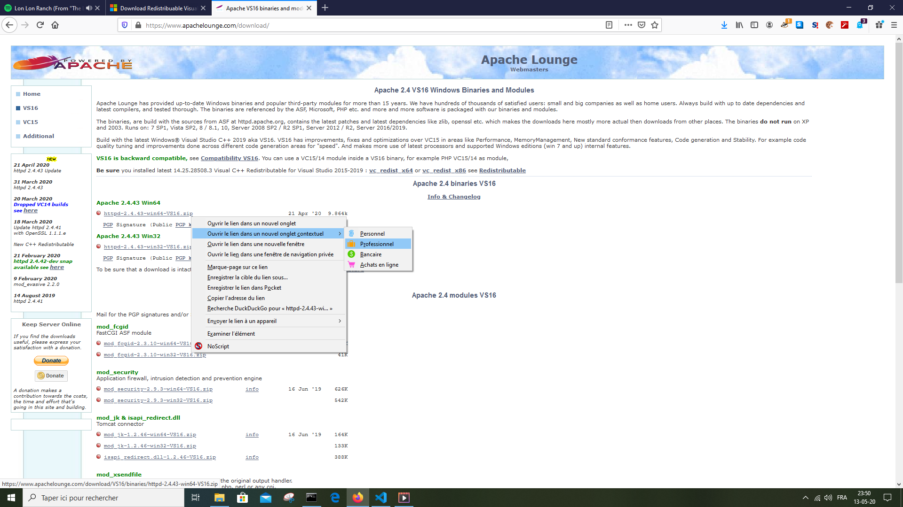

# [2. Installer serveur HTTP](https://www.youtube.com/watch?v=79XwZrJdzho)

## Introduction

Cette séance va permettre d'installer un serveur HTTP. Nous allons installer PHP durant la prochaine séance.

Pourquoi un serveur HTTP ? parceque on en a besoin pour pouvoir exécuter nos pages web.

Nous allons pouvoir procéder à cette installation directement sur notre machine. Peu importe l'ordinateur et peu importe le système également.

Une fois installer, on pourra utiliser des pages HTML/CSS zt pourquoi pas des scripts PHP pour pouvoir rendre un peu plus dynamique nos sites web.

Au niveau des serveurs HTTP dsponibles, il y en a plusieurs. On entend parler d'Apache, Nginx (Open source), IIS 7 qui appartient à Microsoft. Nous utilisons Apache parce que c'est un des plus populaire. Si il y a le moindre problème dessus, on trouve facile de la documentation ou de l'aide.

La majorité des serveur sont sur Apache. Il existe depuis de nombreuses années. Apache a été fondé en 1995 par Apache software fondation et c'est sous licence libre.

## Installation

On va voir comment installer Apache sur Windows et Linux mais pas sur MacOS. Tout ce qui est Apache et serveur HTTP est dans la majorité des cas déjà installé sur MacOS (à vérifier).

1. Windows

Pour procéder à l'installation sur Windows, il faut d'habord aller chercher Apache et plus précissement la partie HTTP. 

On arrive sur le page https://httpd.apache.org/ et ensuite on va dans la section download https://httpd.apache.org/download.cgi pour récupérer la dernière version du moment "2.4.43" (released 2020-04-01). 

Si la version est plus récente, ce n'est pas un problème, on a peut être des choses en plus. Ce n'est pas un soucis, on prend la version la plus récente qui est stable. On clique sur la version, on arrive ici https://httpd.apache.org/download.cgi#apache24

On choisit "Files for Microsoft Windows". Si néanmoins le site change, il faut alors trouver des exécutables fait pour Windows. 

https://httpd.apache.org/docs/current/platform/windows.html#down
		
On arrive enfin sur la page du téléchargement d'Apache pour Windows qui nous explique qu'il n'y a pas de distribution binaire Windows d'Apache mais seulement le code source avec quand même certains groupes qui ont proposé un package avec des binaire pour Apache, c'est ce que nous allons récupérer. 

Nous allons le récupérer sur Apache Lounge https://www.apachelounge.com/download/ sur lequel on voit les binaires au quel il faudra faire attention aux redistribuables VC16, Visual C++ que l'on va aborder. Parmi les binaires, on récupère la version 64 bits sauf si on est sur la version 32 bits.


    
On récupère la version 64 bits [httpd-2.4.43-win64-VS16.zip](https://www.apachelounge.com/download/VS16/binaries/httpd-2.4.43-win32-VS16.zip).

Pourquoi VS16 ? Parce que ça concerne les redistribuables Windows. Il y a beaucoup de logiciels sur Windows qui demandent d'installer des packages de Microsoft pour fonctionner.
    
Il est recommandé d'installer directement le redistribuable. On tape dans la barre de recherche *Redistribuable Visual C++ 2015*. On arrive sur la page https://www.microsoft.com/fr-FR/download/details.aspx?id=48145 sur la quel on vérifie bien le titre *Visual C++ Redistributable for Visual Studio 2015*.

Le C++ n'a rien avoir avec le fait que ce soit du C++ au niveau du web et de PHP. C'est juste au niveau de Windows, le logiciel en a besoin pour fonctionner de ce package. On clique sur télécharger et on récupère la version 64 bits [vc_redist.x64.exe](https://www.microsoft.com/fr-fr/download/confirmation.aspx?id=48145)

Il est recommandé d'installer le redistribuable avant et après on pourra s'occuper d'Apache. C'est le genre de package qui néanmoins déjà installer avant avec d'autres logiciels ou avec des jeux. Dans ce cas, il est possible de déjà l'avoir.

Une fois que Apache est téléchargé, on a obtenu une archive "httpd-2.4.41-win64-VS16.zip que l'on va pouvoir décompresser. Après on retire le dossier Apache24 du dossier d'archivage. On peut suprimmer le fichier d'archivage (vide). On vérifie qu'on a bien l'ensemble des répertoires et fichiers dans le dossier Apache24 dans lequel on retrouve un htdocs, un bin, un conf, etc.

Il est recommandé de ne pas les modifier au niveau des noms pour aller vite et en plus si on le modifie, il va faloir le modifier partout dans la configuration d'Apache qui est proposé par défaut.

Il est recommandé de copier Apache24 dans le disque local C. Faire un couper-coller de Apache24 dans C:\.

## Configuration

Maintenant que Apache est téléchargé et placé là où il faut.

Au niveau de la configuration, on va dans le répertoire conf, voir un httpd.conf

    \Apache24\conf\httpd.conf

On a plus de 530 lignes dans ce fichier.

### Configuration du serveur root (ligne 38)

On regarde d'abord la racine du serveur :

```conf
Define SRVROOT "c:/MyWamp/apache"
ServerRoot "${SRVROOT}"
```

Il est recommandé de le mettre dans le disque local C et de ne pas changer le nom du répertoire parce qu'il est par défaut configuré dans le C.
    
Dans Windows, il est repertorié avec des anti-slashs : `C:\MyWAMP\Apache24\conf`

Du fait que c'est multiplateforme, il faut mettre des slashs même si on est sur Windows. Le c peut être en minuscule `c:` ou en majuscule `C:`, ça ne change pas.

Si on veut changer le chemin d'accès et le nom du repertoire pour Apache, il faudra changer ce chemin en conséquence.

### Configuration du port d'écoute (ligne 61)

On ne le modifie pas. 

```conf
Listen 80
```
    
C'est le port HTTP. Les sites web écoute toujours sur le port 80.

Quand c'est du HTTPS, c'est du 443.
    
### Décommenter les modules nécessaires (ligne 163)

Il y a tout un tas de lignes LoadModule. Ce sont des modules qui vont pouvoir être utilisé au niveau de Apache. Pas mal sont commenter, c'est à dire qu'il ne sont pas utilisable et d'autres décommenter.

Par la suite, on aura peut être besoin d'en utiliser. Si un jour on fait un site web en local et qu'on constate qu'une fonctionnalité ne marche pas, c'est qu'il nous manque le module.

C'est par exemple le cas lorsqu'on veut faire de la réecriture d'URL. Il faut décommenter cette ligne :

```conf 
LoadModule rewrite_module modules/mod_rewrite.so
```

Celui là on l'utilise beaucoup même pour des frameworks.

On peut ainsi le décommenter en retirant le `#` au début.

### L'adresse de l’admin

Nous avons l'adresse de l'admin, du serveur mais puisque nous, on travaille en local, on n'en a pas besoin.

```conf 
ServerAdmin admin@example.com
```

### Le ServerName (ligne 228)

```conf 
ServerName localhost
``` 

Il faut décommenter la ligne et puisqu'on est en local, on met simplement localhost.

C'est un nom générique qui signifie simplement serveur local.

Il faut vérifier qu'à priori il n'y ait pas besoin de double quottes ou autre.

### Le répertoire (ligne 252)

```conf
DocumentRoot "${SRVROOT}/htdocs"
```

Changer éventuellement le chemin du répertoire. htdocs, c'est là où va se trouver le site ou nos sites web.

Le but est d'avoir les outils avec un fonctionnement minimum et pas d'explorer toutes les fonctionnalités d'Apache pour pouvoir apprendre à utiliser PHP pour faire nos sites web.

On va pas faire de la configuration ou faire des hôtes virtuels, etc.

Il faut juste penser à bien vérifier les chemins à chaque fois et bien décommenter Sinon on aura un petit problème.

```conf
ServerName localhost
```

## Démarrer Apache

Maintenant qu'on a configurer, on devrait pouvoir démarrer Apache.

On pourrait le démarrer comme un service mais ce n'est pas recommander car ça pourrait ammener des problèmes.
        
C'est quand on veut utiliser Apache pour faire notre site Web en local, on charge Apache nous-même, il faut se rendre dans le repertoire des binaires et ouvrir :

```powershell        
\apache\bin\httpd.exe
```

Ca va nous demander des autorisations au niveau de notre pare-feu, on autorise l'accès et si il n'y a pas d'erreur affichée, une fenêtre s'ouvre. 
        
Cette fenêtre est notre serveur c'est à dire que si on la ferme, le serveur se coupe, on peut la réduire et il est important de la laisser ouverte.

Activer localhost dans la barre de recherche. Si ça fonctionne, le message suivant apparait : "It works !"

## Fin d'introduction sur Windows

A coté, il est conseillé de suivre la formation HTML/CSS en parallèle de PHP.

On va pouvoir développer nos sites directement dans :
```
.\apache\htdocs
```
Ensuite HTML n'a pas besoin de serveur avec du PHP parce qu'elle fonctionne déjà toute seule. Il suffit d'ouvrir une page HTML dans le navigateur, ça fonctionnera.

Jusqu'ici il n'y aurait pas de différence sans installer de serveur HTTP mais si on a installé cet outil, c'est pour installer PHP par la suite.

Ce n'est pas trop long, il y a juste un peu de configuration à faire.

Dans l'ancienne formation, Monsieur Champagne montrait l'installation d'un package mais l'intérêt de cette séance est d'installer tous les éléments séparemment. AInsi on voit ce que l'on installe et à quoi cela sert.

Il existe XAMPP ou EasyPHP ou WampServer. Ce sont des ensembles de programmes qui installe tout d'un coup. Il pourrons être proposé dans des tutoriels en annexe.

## Installation sur Linux

Au niveau de Linux, c'est encore plus rapide.

Tout ce qui est développement s'installe toujours plus vite sur Linux que sur Windows.

Sur un système dit Ubuntu mais qu'on soit sur un système Debian, Mint, etc on aura la même chose. 

Sur un système particulier comme Fedora, OpenSuse ou ArchLinux, il faudra se débrouiller avec l'installation de paquets. Il faudra donc adapter les commandes suivantes à ces systèmes. Si on est sur ce genre d'OS, c'est qu'on a un minimum d'expérience.

On passe par un terminal :

```bash
sudo apt-get install apache2
```

Ca va très vite car niveau configuration, on est tranquille.

### Empêcher le service de démarrer au démarrage de l'OS

Contrairement à Windows, Apache va démarrer au lancement de notre système.

En effet, dés qu'on démarre notre Linux, Apache va démarrer.

Sur Windows, sans Apache, ce que l'on a mis dans htdocs ne fonctionnent plus.

On est vraiment ici sur un serveur HTTP.

Pour Linux, le service est déjà activé par défaut.

Pour ne pas être dérangé par le service qui démarre au lancement de notre OS, on peut le désactiver avec la commande :

```bash
sudo systemctl disable apache2
```

apache2 sera désactivé de la liste des services qui vont se lancer au démarrage du système.

### Contrôler le démarrage du service, du système Apache

On choisit alors de démarrer, couper le serveur Apache quand on veut.

Pour le démarrer, il faut juste faire :

```bash
sudo systemctl start apache2
```

Le service Apache est démarré.

### Arrêter le service

Pour couper le service :

```bash
sudo systemctl stop apache2
```

### Redémarrer Apache

Pour redémarrer le serveur HTTP :

```bash
sudo systemctl restart apache2
```

On peut ensuite faire un test sur notre navigateur en tapant localhost et si le serveur est arrêter, ça ne fonctionnera pas.

Ensuite, on fait la commande start et si on actualise, cela fonctionne. C'est important de noter que le terminal n'as pas besoin de rester ouvert.

Par défaut on tombe sur une page "It works".

## Le stockage des pages|Linux

On a vu que les sites était stocker dans `"${SRVROOT}/htdocs"` pour Windows.

Ou est-ce stocké pour Linux ?

Dans la formation sur GNU/Linux, on a vu que ce qui est un peu divers est stocker dans un répertoire en particulier du système. C'est le répertoire /var (Stockage des pages HTML).

```bash
/var/www/html/html.index
```

On se rend sur le repertoire root, la racine représenté par un slash. Puis dans le repertoire /var. Puis dans le dossier /www. Et ensuite dans le dossier /html.

Sur les anciennes versions d'Ubuntu, il n'y avait pas le dossier HTML, c'était directement dans le dossier /www mais sous les versions plus récente d'Ubuntu, il y a un sous-dossier HTML.

On a vu également qu'il y a une gestion assez stricte au niveau des droits des fichiers sur Linux. Il faut alors s'accorder tous les droits sur notre répertoire c'est à dire qu'on soit propriétaire de ce dit répertoire (voir formation GNU/Linux).

### Tester nos droits

On peut tester nos droits :

```bash
ls -l /var/www/html
```

*-rw-r--r--*, on voit que c'est lecture écriture *-rw* mais on a pas l'accès *-r* et personne n'a l'accès à l'écriture et au reste *--r--*. On ne pourra même pas accéder au fichier */var/www/html/index.html* pour l'ouvrir.

### Changer les droits

On fait 755 suivi d'un *-R* sur le dit répertoire pour obtenir les bons droits.

```bash
sudo chmod 755 -R /var/www/html
```

Cette commande n'est pas suffisante, on juste fait pour l'accès. Si on rappel la ligne :

```bash
ls -l /var/www/html
```

*-rwxr-xr-x*, on constate que le ls a changé mais maintenant il faut devenir propriétaire du répertoire et de tout son contenu donc il va faloir faire cela de manière récursive :

```bash
sudo chown $USER:$USER -R /var/www/html 
```

On peut utiliser son nom de `USER` précédé de `sudo chown`. On peut utiliser son nom ou bien la variable `%USER`. On met ensuite deux point `:` suivi du groupe qui est en fait le même que le nom d'utilisateur. On met un `-R` pour spécifier qu'on veut le faire de manière récurcive sur tout, les dossiers, sous-dossiers `/var/www/html`.

Si le cadenas est disparu du fichier, c'est qu'on nous as donné les droits.

Cette commande est a faire à chaque fois dés qu'on ajoute de nouveau fichiers ou autres.

C'est à dire à refaire les deux commandes, le chmod et le chown sur tout le répertoire pour être sûr d'avoir les bons droits sur notre répertoire de sites web.

/var/www/html/indexl.html peut ainsi être ouvert avec un éditeur de texte par exemple.

On peut supprimer le texte et mettre autre chose à la place et sauvegarde avec ctrl+S.

On actualise la page localhost pour vérifier qu'on est bien sur la page que l'on vient de faire.

On peut voir ainsi si le serveur Apache est bien lancé et qu'il fonctionne correctement.

## Conclusion

Sur linux, on a pas configurer les chemins mais on peut les changer par défaut même si on ne le fait pas dans cette séance car le but est d'avoir un environnemnt rapidement en place pour pouvoir suivre les vidéos. 

Pour rappel, sur Windows, c'est dans htdocs que l'on met nos scripts et nos sites web éventuels en mettant par exemple des sous-dossiers pour chaque site. Pour Linux, on a tout simplement le /var/www/html/ et tout est dans html. On pourra créer un dossier avec un site :
```txt
    /var/www/html/monsite
    /var/www/html/monsite/index.html
```
Et ensuite pour y accéder, on aura juste à faire :
```txt
	localhost/monsite/
```
si on va juste sur localhost, il nous mettra la liste de nos répertoires.

A ce niveau tout est fonctionnel pour le serveur HTTP que le soit sur Windows our sur Linux.

On a pas pu tester sur MacOS mais il est possible que le nécessaire soit préinstaller.

Sur internet, il serra alors possible si c'est pas le cas de trouver comment installer Apache sur OSx, etc.

Dans la prochaine séance (3), on installera PHP et on intégrera les modules PHP pour Apache parce qu'il ne faut pas juste PHP, PHP c'est ce qui va nous permettre d'interprêter nos pages programmées en PHP et ensuite il faut avoir le module PHP intégré à Apache pour qu'il puisse simplement l'utiliser avec lui. Pour que cela fonctionne directement avec notre serveur HTTP.

Dans la séance 4, on commencera à programmer en PHP.

[Documentation](https://www.php.net/manual/fr/)