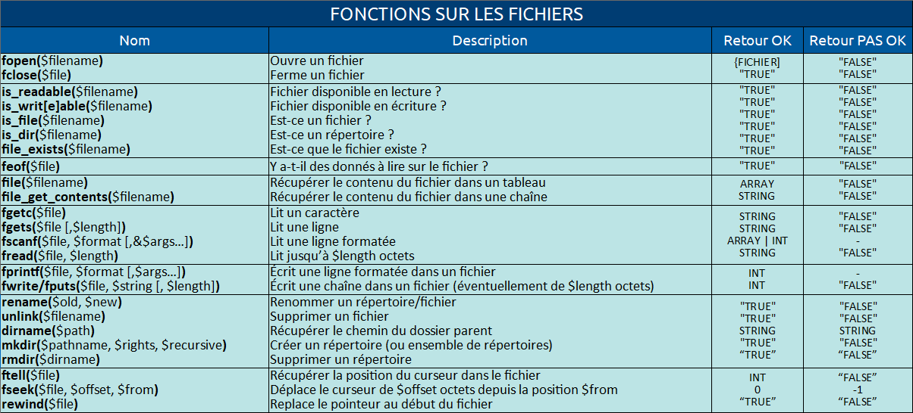

# [14. Fichiers](https://www.youtube.com/watch?v=06FZz73qelU)

Bonjour à tous et bienvenue pour cette séance 14 en PHP. 

Nous allons voir maintenant comment travailler avec des fichiers, et on va regarder ça avec pas mal d'exemples que je vais vous montrer dans cette vidéo ainsi que d'autres fonctions que vous allez apprendre. 

Il va y avoir beaucoup beaucoup de fonctions que je vais vous proposer sur cette séance. 

On ne verra pas tout avec des exemples parce qu'il y en a une bonne quantité, et je vous les donnerai comme ça en fin de vidéo pour que vous puissiez comme ça les noter ou les tester de votre côté pour voir un petit peu à quoi elles peuvent servir. 

Alors affichée va pouvoir nous servir à stocker des informations donc en général on ne va pas stocker des grandes quantités de données et si on veut faire ça on va plutôt privilégier un fichier formaté dans un format particulier. 

On peut par exemple faire ça avec un fichier en XML, un fichier en JSON éventuellement et si on a vraiment des quantités encore plus importantes et qu'on a besoin de sélectionner des informations, de faire de la recherche, de faire des requêtes sur ces données on préférera utiliser une base de données. 

Ce sont des choses que nous verrons de toute façon, que nous apprendrons à utiliser sur ce cours et via les tutoriels de PHP donc on verra tout ça. 

Mais pour le moment, on va s'occuper des fichiers donc afficher on va pouvoir lire un fichier qui existe déjà pour récupérer les informations qu'elle contient comme nous allons pouvoir écrire à l'intérieur pour pouvoir y mettre de nouvelles informations donc on va regarder tout ça. 

Alors petite parenthèse, il y a une chose à savoir en tout cas sur Linux et Mac OS, les fichiers vous ne pouvez pas en fait le lire et écrire dessus comme vous voulez. 

Il y a un système de droit donc un système de permissions, et si vous ne connaissez pas ça, que vous ne savez pas à quoi ça consiste le système de permission parce que ce sera tout à fait à connaître et à savoir quand vous allez par exemple déployer un site en ligne c'est à dire le mettre via un client FTP pour le mettre en ligne donc si vous ne connaissez pas ça je vous invite à aller voir ma formation sur GNU-Linux avec la séance 15 qui parle des droits et des permissions. 

Même si vous êtes là pour pouvoir faire du PHP, vous verrez que cette vidéo là pourra vous servir à comprendre dans le détail à quoi consiste le système de permissions. 

Sur Windows on n'a pas le même système, le système Windows n'utilise pas de système de permissions sur les fichiers et n'est pas du coup affecté par ce genre de choses. 

Ce qu'il faut comprendre par exemple, c'est que pour lire un fichier, il faudra être sûr que vous ayez le droit de le lire en tant que utilisateur et pour écrire dedans également. 

Il faudra être sûr d'avoir le droit d'écriture sur le fichier donc on en parlera et vous verrez qu'il y a même des fonctions qui permettent de vérifier ces choses-là. 

Alors on va commencer d'abord par créer un petit fichier ici. 

Je vais mettre l'extension .txt mais vous pouvez mettre celle que vous voulez et donc ce n'est pas obligatoirement .txt mais vous pouvez mettre .dat .data .done ce que vous voulez même .db si ça vous amusent. 

Peu importe il n'y a pas de restriction particulière par rapport à ça. 

Alors pour les infos on peut noter ceci.
```txt
	infos.txt
		chat
		chien
		elephant
		aigle
		tortue
		pingouin
```
Voilà ce sont des noms d'animaux quand je mets ligne par ligne et vous allez voir pourquoi. 

De toute façon, on va pas mettre les noms n'importe comment, on va essayer de les présenter d'une certaine manière tel que le développeur va par exemple le décider, va le choisir pour travailler là-dessus. 

Alors la première chose à faire c'est de ouvrir ce fichier et donc dans notre cas ça va être très pratique parce que notre fichier texte est juste à côté de notre script donc pour l'ouverture ça va être assez simple au niveau du chemin. 

Vous pouvez bien évidemment faire un dossier, et avoir votre fichier à l'intérieur d'un dossier. 

Dans ce cas-là on va préciser le chemin du fichier d'accord. 

On verra tout ça mais nous pour le moment on va se contenter de le laisser dans le répertoire courant. 

Voilà on va juste laisser ça comme ça. 

On va d'abord créer une variable $myFile qui va être notre fichier, et nous allons utiliser une fonction pour l'ouvrir. 

La fonction en PHP est fopen() qui va prendre le chemin vers ce fichier et donc nous c'est directement le nom du fichier parce qu'on n'a pas de sous dossier comme ceci.
```php
	$myFile = fopen("infos.txt", ...);
```
S'il y avait un sous dossier, il suffira de faire ça.
```php
	$myFile = fopen("dossier/infos.txt", ...);
```
Ou encore s'il y avait un autre dossier par exemple et cetera et cetera.
```php
	$myFile = fopen("dossier/autredossier/infos.txt", ...);
```
Je pense que vous comprenez bien ce système parce qu'il n'y a rien de compliqué voilà. 

Et en 2e paramètre pour cette fonction fopen(), nous allons le passer tout simplement le mode d'ouverture du fichier. 

Et ce mode d'ouverture comme il y en a pas mal, je vous ai fait un petit schéma ici, un petit tableau pour les énumérer principalement. Alors il en manque quelques-uns très très spécifiques mais que vous n'aurez de toute façon pas l'utilité. Il y a très peu de chances que vous vous en servez un jour.


<!--
MODES D'OUVERTURE DE FICHIER EN PHP

+-----------+-----------+---------------+---------------+---------------------------------------------------+
|Caractère	|Accès		|Placement fic. |Création fic.	|Notes												|
+-----------+-----------+---------------+---------------+---------------------------------------------------+
|	r		|lecture	|début			|non			|-													|
|	r+		|lec.+ écr.	|début			|non			|-													|
|	w		|écriture	|début			|oui			|Réduit la taille du fichier à 0.					|
|	w+		|lec.+ écr.	|début			|oui			|Réduit la taille du fichier à 0.					|
|	a		|écriture	|fin			|oui			|Fonction fseek() n'a aucun effet.					|
|	a+		|lec.+ écr.	|fin			|oui			|Fonction fseek() que pour la lecture.				|
|	x		|écriture	|début			|oui			|Si le fichier existe, fopen() échoue -> E_WARNING.	|
|	x+		|lec.+ écr.	|début			|oui			|Si le fichier existe, fopen() échoue -> E_WARNING.	|
|	c		|écriture	|début			|oui			|Si le fichier existe, n'est pas tronqué.			|
|	c+		|lec.+ écr.	|début			|oui			|Si le fichier existe, n'est pas tronqué.			|
+-----------+-----------+---------------+---------------+---------------------------------------------------+
-->
Donc ça c'est la mode que vous allez retrouver un jour assez communément selon le type d'ouverture du fichier. 

On voit qu'on a un caractère pour représenter. 

C'est par exemple je veux ici ouvrir mon fichier en lecture, je vais écrire le caractère r c'est-à-dire que je vais juste noter ça comme ça tout simplement.
```php
		$myFile = fopen("infos.txt", "r");
```
Voilà donc le mode va s'ouvrir ici comme une chaîne de caractères. 

Je reviens sur le schéma et vous voyez que chacun des axes est précis c'est-à-dire qu'il y en a qui vont vous donner un accès au fichier simplement lecture, d'autres simplement en écriture et d'autres pour les 2. 

Ensuite on va avoir le placement au niveau du fichier c'est à dire que quand on va ouvrir le fichier, on va avoir un curseur qui va se placer à l'intérieur, soit il va se placé au début du fichier d'accord et il va écrire les données en décalant celle qu'il y aurait éventuellement déjà, soit il va se placer en début de fichier et il va remplacer donc écraser les anciennes données c'est-à-dire qu'il va écrire par-dessus, ça peut arriver aussi et on le voit ici pour le mode d'écriture. Soit il va se placer en fin de fichier donc on parle en ajout c'est pour ça qu'il y a un a pour add qui permet évidemment d'ajouter à la fin du fichier sans enlever ce qui a été mis avant donc en fonction de ce que vous allez vouloir faire, vous pourrez choisir le mode qui vous convient. 

On voit également que pour certains modes, pour la majorité mais pas pour les modes r et r+, le fichier va être créé s'il n'existe pas. 

Par exemple si le fichier infos.txt n'existait pas, Eh bien il aurait créé à condition d'utiliser un des autres modes parce que vous voyez que pour le mode r et r+ ce n'est pas le cas. 

Et je vous ai mis quelques petites infos supplémentaires concernant certains modes. 

On voit qu'il y a des modes qui vont réduire la taille du fichier à 0 donc il faut enfaite tranquille fichier. 

On voit qu'il y en a qui vont pas permettre … alors ça on va voir la fonction fseek() qui va permettre de déplacer le curseur au sein du fichier donc on voit que pour certains modes, la fonction de positionnement du curseur n'aura aucun effet d'accord ou alors que pour la lecture ici par exemple (a+). 

Et pas mal d'autres petites choses à savoir, par exemple ici (c et c+) si le fichier existe il ne sera pas tronqué c'est-à-dire qu'on ne va pas écraser les informations contrairement à ce qu'on ferait avec les modes w et w+ mais tout ça on va en parler. 

Donc nous on ne va pas essayer tous les modes, je vais vous montrer les plus standards. 

r, là on veut simplement lire le fichier, on va se placer au début alors oui puisqu'on veut lire le fichier c'est bien qu'on se place au début et on est sûr que le fichier porte bien ce nom parce qu'on vient de le faire avant donc pas besoin qui le créé s'il n'existe pas évidemment surtout que pour une lecture il ne le fera pas. 

Donc on va faire ça comme ça.
```php
	$myFile = fopen("infos.txt", "r");
```
Et la fonction fopen() va retourner tout simplement le fichier si ça a bien été ouvert et elle va retourner false c'est évidemment le fichier n'a pas réussi à le trouver. 

Donc si le fichier n'a pas pu être ouvert, on va faire par exemple comme ceci comme vous l'avez appris avec les conditions, avec les valeurs booléennes, Eh bien on va quitter et donc pour quitter l'exécution du script vous pouvez utiliser l'instruction `exit(1)`. Vous pouvez donc écrire ça comme ça. 
```php
	$myFile = fopen("infos.txt", "r");
	
	if(!$myFile)
		exit(1);
```
Vous pouvez l'écrire avec un espace aussi.
```php
	$myFile = fopen("infos.txt", "r");
	
	if(!$myFile)
		exit 1;
```
Si vous écrivez comme ça exit; simplement ça fait un `exit(0)`.
```php
	$myFile = fopen("infos.txt", "r");
	
	if(!$myFile)
		exit;
```
Et il faut savoir qu'en informatique je vous l'avais déjà dit 0 veut dire tout c'est bien passé.

Si on retourne autre chose que 0, c'est qu'il y a eu une erreur.

Et on peut même retourner un message.
```php
	$myFile = fopen("infos.txt", "r");
	
	if(!$myFile)
		exit("Ouverture du fichier impossible");//die()
```
Voilà alors exit a un alias c'est-à-dire qui fait la même chose mais qui a un nom différent qui s'appelle die(). 

die(), c'est l'alias de exit(). 

OK c'est exactement la même chose, c'est juste que c'est 2 noms différents pour utiliser la même fonction donc ça c'est à connaître aussi éventuellement. 

Donc on fait ça si le fichier n'a pas pu être ouvert, automatiquement arrête l'exécution du script donc ça va être stoppé ici dans IF. 

Et n'oublie pas c'est-à-dire qu'une fois qu'on a ouvert un fichier c'est-à-dire la dernière ligne de mon fichier c'est qu'on a pu ouvrir ce fichier et donc on ne va pas oublier d'utiliser une fonction de fermeture du fichier qui est fclose() et on lui passe en paramètre le fichier.
```php
	$myFile = fopen("infos.txt", "r");
	
	if(!$myFile)
		exit("Ouverture du fichier impossible");//die()
	
	fclose($myFile);
```
Donc `$myFile` et en réalité un pointeur de fichier c'est pour ça qu'on a un curseur qui va pointer sur le flux de l'information que nous avons dans le fichier. 

Pour être exact c'est comme ça que ça fonctionne. 

Alors là `fclose($myFile)`, on dit qu'on ferme ce fichier là. 

Alors fclose() c'est pareil, elle retourne True si ça fonctionnait et false si ça n'a pas fonctionné. 

Dans l'idéal c'est même mieux de vérifier son retour. 

Par exemple vous pouvez faire ça et mettez des parenthèses parce que des fois c'est mieux de les mettre.
```php
	if(!(fclose($myFile)));
```
Certaines parenthèses ne sont pas obligatoires autour de fclose() et donc on va éviter d'en rajouter plus que nécessaire. 
```php
	$myFile = fopen("infos.txt", "r");
	
	if(!$myFile)
		exit("Ouverture du fichier impossible");//die()
	
	if(!fclose($myFile))
```
Donc si fclose() à retourner l'inverse de true d'où le `!`, je rappelle, donc false et là on pourra mettre aussi un message.
```php
	$myFile = fopen("infos.txt", "r");
	
	if(!$myFile)
		exit("Ouverture du fichier impossible");//die()
	
	if(!fclose($myFile))
		exit("Fermeture du fichier echouee");
```
Alors ça c'est une habitude à prendre maintenant que vous êtes à un stade un peu plus avancé en programmation de toujours vérifier le retour des fonctions.

Maintenant que vous savez ce qu'est une fonction et qu'elle peut retourner éventuellement des valeurs surtout les fonctions internes de PHP, vérifiez donc tout le temps ce qu'elles peuvent retourner et traiter l'erreur si jamais elle se produit. 

C'est super important, on ne laisse pas un programme tourné si un fichier n'a pas été ouvert donc on vérifie. 

Après le fclose() honnêtement vous pouvez vous en passer. 

Si vous voulez vous pouvez, si vous voulez vous pouvez laisser un fclose() en partant du principe qui a priori ça va se fermer sans problème mais il peut y avoir un risque que non donc c'est bien aussi dans l'idéal de vérifier le retour de la fonction et donc pallier à la d'éventuelles erreurs qui pourrait intervenir donc nous on va le laisser comme ça pour avoir quelque chose de propre. 

Et ici on va pouvoir travailler sur notre fichier.
```php
	$myFile = fopen("infos.txt", "r");
	
	if(!$myFile)
		exit("Ouverture du fichier impossible");//die()

-->
	
	if(!fclose($myFile))
		exit("Fermeture du fichier echouee");
```
On va pouvoir travailler sur notre fichier donc on va avoir des fonctions de lecture et on va regarder pas mal de petites choses. 

Alors pour ça nous allons utiliser quelques fonctions simples et la première, la plus simple en tout cas c'est une fonction qui va lire un seul caractère. 

Alors attention quand vous lisez un fichier, un caractère comprend également un espace, un retour à la ligne et tout ça qui représente également des caractères. 

D'ailleurs concernant les retours à la ligne, il y a une petite parenthèse à faire en fonction des systèmes c'est-à-dire selon le système d'exploitation où vous êtes, vous allez avoir différents caractères pour indiquer le retour à la ligne. Sur Windows on va avoir `\r\n`. Sous Linux on va avoir `\n` et sur Mac OS ça va être `\r` pour le retour chariot également appelé new line, C'est pour ça qu'on parle de `\n`. Et pour Windows vous voyez qu'il met les 2 c'est-à-dire que pour Windows en retour à la ligne est indiquée par `\r\n` c'est-à-dire les 2 caractères donc ça ça peut poser problème par exemple quand on veut lire ou écrire dans un fichier. 

Vous allez voir que dans certains cas ça va vous poser des soucis, vous allez tester votre programme en PHP sur Windows ça va bien fonctionner, et puis vous allez le tester sur Linux ou Mac OS et là il y aura des problèmes.
```php
	/*
		Windows		:	\r\n
		GNU/Linux	:	\n
		MacOS		:	\r
	*/
```
Donc si vous avez des problèmes par rapport à la lecture et à l'écriture, il y a de fortes chances que ça intervienne de cette manière. 

Donc et là du coup je vais faire une petite parenthèse dessus, il est recommandé plutôt que d'ouvrir le fichier en mode texte, en mode formaté, c'est à dire où les retours à la ligne ici vont dépendre de votre OS, vous pouvez également travailler avec votre fichier en mode binaire. 

Et pour travailler en mode binaire, c'est tout ce que je vous ai montré dans le tableau sur les modes d'ouverture de fichier en PHP. 

Simplement que après le r, le w, le a, le x, le c, vous mettez avant le + éventuellement la lettre b pour dire binaire. 

Donc ici par exemple je vais ouvrir en lecture seulement et en mode binaire.
```php
>	$myFile = fopen("infos.txt", "rb");
	
	if(!$myFile)
		exit("Ouverture du fichier impossible");//die()
	
	if(!fclose($myFile))
		exit("Fermeture du fichier echouee");
```
Si par exemple je voulais ouvrir en a+, je vais marquer tout simplement "ab+" donc vous voyez que le + on le met toujours à la fin.

Ne faites pas a+b sinon ça va poser problème. 

Donc vous mettez comme ça et ça va s'ouvrir en mode binaire.
```php
>	$myFile = fopen("infos.txt", "ab+");
	
	if(!$myFile)
		exit("Ouverture du fichier impossible");//die()
	
	if(!fclose($myFile))
		exit("Fermeture du fichier echouee");
```
L'avantage c'est qu'en mode binaire avec un fichier, c'est qu'on travaille avec des octets donc il n'y a plus de raison de se demander comment est représenté un retour à la ligne, ce sont des octets. 

Un octet c'est exactement la même chose pour n'importe quel système d'exploitation évidemment d'accord. 

Le langage machine est le même pour tout le monde, il n'y a pas de distinction. 

Donc un octet sera lu pareil peu importe votre système. 

Si vous avez besoin d'avoir un code qui est portable qui fonctionne vraiment sur plusieurs systèmes d'exploitation, je vous recommandé toujours de travailler en mode binaire. 

Ça ne changera rien, vous pouvez travailler en mode binaire sur un fichier texte, pas besoin d'avoir un fichier binaire. 

Je dis ça parce que dans certains langages de programmation, on a besoin pour ouvrir un fichier en mode binaire d'avoir un fichier binaire d'accord, pour écrire en mode binaire d'écrire sur un fichier en binaire. 

Et pour PHP ce n'est pas le problème, pour PHP vous ouvrez n'importe quel type de fichier en mode normal donc en mode texte on peut dire ou en mode binaire d'accord. 

Et en mode texte vous aurez ça en prendre en compte.
```php
	/*
		Windows		:	\r\n
		GNU/Linux	:	\n
		MacOS		:	\r
	*/
```
Et en mode binaire non. 

Ce seront des octets en mode binaire. 

Nous on va rester sur quelque chose de simple et on va travailler en mode texte, en mode normal, en lecture seule. 

On y va et je vais récupérer ici même si ce n'est qu'un seul caractère mais c'est une chaîne que va renvoyer la fonction fgetc() qui signifie File Get Character. On lui passe le fichier `$myFile` voilà et ensuite on peut faire un echo de `$str` tout simplement.
```php
<?php

$myFile = fopen("infos.txt", "r");

if(!$myFile)
	exit("Ouverture du fichier impossible");//die()

$str = fgetc($myFile);
	echo $str;

if(!fclose($myFile))
	exit("Fermeture du fichier echouee");
```
```txt
	http://localhost/PHP/cours/014_fichiers/
	c
```
Voilà je vais actualiser ma page et on voit qu'on a le caractère c.

Si je répète l'opération une 2e fois une 3e fois même si ce n'est pas propre on va voir comment faire ça un peu plus optimisé. 

On va qu'on va lire caractère par caractère au sein du fichier.
```php
<?php

$myFile = fopen("infos.txt", "r");

if(!$myFile)
	exit("Ouverture du fichier impossible");//die()

$str = fgetc($myFile);
	echo $str;
$str = fgetc($myFile);
	echo $str;
$str = fgetc($myFile);
	echo $str;

if(!fclose($myFile))
	exit("Fermeture du fichier echouee");
```
```txt
	http://localhost/PHP/cours/014_fichiers/
	cha
```
On va lire caractère par caractère au sein du fichier c'est-à-dire en l'occurrence le mot chat qu'on avait ici en premier. 

Donc voilà ça récupère bien un seul caractère à la fois donc une chaîne de caractères. 

Donc ici ça renvoie $str de type string donc même s'il n'y a qu'un seul caractère c'est une chaîne de caractères dans tous les cas. 

Dans le cas où on veut faire ça on peut faire tout simplement une boucle, je pense que certains l'auront deviné. 

fgetc() est une fonction qui va retourner une chaîne de caractères tant qu'elle a quelque chose à lire et une fois qu'elle n'a plus rien à lire elle va retourner false donc c'est très simple à utiliser du coup.

On va faire ça, tant que while est égal à true, on peut faire un echo de `$str`.
```php
<?php

$myFile = fopen("infos.txt", "r");

if(!$myFile)
	exit("Ouverture du fichier impossible");//die()

while($str = fgetc($myFile))
	echo $str;

if(!fclose($myFile))
	exit("Fermeture du fichier echouee");
```
Et là vous allez peut-être me dire qu'il n'y a pas de point d'arrêt et qu'on risque d'avoir une boucle infinie. 

Non on n'aura pas une boucle infinie parce qu'ici on utilise à chaque itération, à chaque tour de boucle, on fait appel à la fonction fgetc(). 

Vous pouvez dans un while() faire un appel de fonction, ça fonctionne également et je vous l'avais déjà dit qu'à l'intérieur d'un while() c'était une expression. 

Du coup une expression, je vous ai dit que ça pouvait être n'importe quoi, ça peut être une opération de comparaison ou une opération d'autres choses ou un appel à une fonction ou un appel avec un retour de fonction que l'on affecte et cetera. 

Voilà on peut faire un peu ce qu'on veut. 

À chaque appel de fgetc(), on va déplacer le curseur d'un caractère à chaque fois donc ça veut bien dire qu'à un moment donné il va arriver à la fin du fichier. La fonction fgetc() va retourner false et du coup on va sortir de la boucle while. 

Si j'actualise, voilà ce qu'il se passe.
```php
	http://localhost/PHP/cours/014_fichiers/
	chat chien elephant aigle tortue pingouin
```
Et donc vous voyez que les retours à la ligne ont été représentés par des espaces. 

En si on peut récupérer l'information sans problème, ça fonctionne vraiment de la bonne manière comme ça. 

Et il s'est bien arrêté à la fin du fichier donc pas de souci. 

`fgetc($myFile)` est une manière de procéder. 

Maintenant si on veut faire les choses encore mieux, il y a une fonction prévue pour tester la fin du fichier. 

Plutôt que d'attendre ici le retour de la fonction, on peut vérifier le retour du retour de la fonction, comment faire ça ? On peut faire tant que eof, End Of File, donc tant que le fichier … ici on a une fonction qui teste si on arrive à la fin du fichier.
```php
	$myFile = fopen("infos.txt", "r");

	if(!$myFile)
		exit("Ouverture du fichier impossible");//die()

>	while(feof($myFile))

	if(!fclose($myFile))
		exit("Fermeture du fichier echouee");
```
Là en fait on a une fonction qui teste si on arrive à la fin d'afficher sur $myFile. 

Nous on veut que tant qu'elle n'est pas en fin de fichier, donc l'inverse avec le petit `!`, on fait certaines choses. 

Donc on n'est pas arrivé à la fin du fichier `$myFile`, qu'est-ce qu'on fait ? On peut directement sans passer par une variable intermédiaire, on affiche le retour de fgetc() sur `$myFile`. Je n'ai même pas besoin des accolades parce que je n'ai qu'une seule instruction.
```php
<?php

$myFile = fopen("infos.txt", "r");

if(!$myFile)
	exit("Ouverture du fichier impossible");//die()

while(!feof($myFile))
	echo fgetc($myFile);

if(!fclose($myFile))
	exit("Fermeture du fichier echouee");
```
```txt
	http://localhost/PHP/cours/014_fichiers/
	chat chien elephant aigle tortue pingouin
```
Et là on obtient exactement la même chose sans aucune différence sauf que au lieu de faire un peu plus de ligne, on a utilisé une fonction interne de PHP, feof() qui permet de vérifier ça.

feof() vérifie si on est à chaque fois à la fin de fichier donc très simple à utiliser. 

Alors ça fonctionne ne vous en faites pas on reviendra à la fin avec lequel j'ai fait un tableau avec toutes les fonctions que je vous recommande de connaître concernant en fait les manipulations de fichiers soit l'écriture la lecture et des tests et cetera sur le fichier. 

Voilà donc tout ça on le verra à la fin de la vidéo. 

Voilà c'est très pratique à utiliser. 

Passons à autre chose et si vous voulez ne pas lire un seul caractère à chaque fois, vous pouvez lire aussi par ligne. Pour ça vous allez utiliser la fonction fgets() pour File Get String. 

Elle va lire ligne par ligne. 

Vous pouvez éventuellement lui préciser une taille à lire et dans ce cas-là elle lira la taille que vous avez demandée. Par exemple ici en paramètre vous pouvez lui dire de ne lire que 2 caractères.
```php
	$myFile = fopen("infos.txt", "r");

	if(!$myFile)
		exit("Ouverture du fichier impossible");//die()

	while(!feof($myFile))
>		echo fgets($myFile, 2);

	if(!fclose($myFile))
		exit("Fermeture du fichier echouee");
```
Dans ce cas-là elle ne lira pas me parler mais elle lira caractère par caractère. 

On peut lire comme ça au niveau des octets donc au niveau des informations. 

Le mieux c'est de travailler directement comme ça.
```php
<?php

$myFile = fopen("infos.txt", "r");

if(!$myFile)
	exit("Ouverture du fichier impossible");//die()

while(!feof($myFile))
	echo fgets($myFile);

if(!fclose($myFile))
	exit("Fermeture du fichier echouee");
```
```txt
	http://localhost/PHP/cours/014_fichiers/
	chat chien elephant aigle tortue pingouin
```
Et là ça va retourner ligne par ligne donc là vous voyez qu'on obtient aucune différence ici.

Ça ça peut être intéressant à savoir. 

Après on peut utiliser un petit retour à la ligne en HTML et du coup on ferme la balise PHP, ?>. 
```php
<?php

$myFile = fopen("infos.txt", "r");

if(!$myFile)
	exit("Ouverture du fichier impossible");//die()

while(!feof($myFile))
	echo fgets($myFile).'<br>';

if(!fclose($myFile))
	exit("Fermeture du fichier echouee");

?>
```
```txt
	http://localhost/PHP/cours/014_fichiers/
	chat
	chien
	elephant
	aigle
	tortue
	pingouin
```
Et ainsi on peut présenter les informations telles qu'elles étaient dans le fichier. 

La ça affiche ligne par ligne avec un retour à la ligne  à chaque fois. 

Si on regarde le code source, le code HTML. 
```txt
	chat 
	<br>chien 
	<br>elephant 
	<br>aigle 
	<br>tortue 
	<br>pingouin 
	<br><br>
```
Vous voyez ça fait bien le `<br>` à chaque fois.

Donc vous pouvez voir `<br>` à la fin parce qu'on l'a fait à chaque itération. 

Voilà pour l'information. 

Voilà pour les petites fonctions à connaître fgetc(), fgets() ce qui est plutôt pratique. 

On en a une autre également qui va surtout être très très efficace en mode binaire c'est la fonction fread().

fread() c'est pareil, elle va tout simplement lire une ligne mais elle peut également prendre une certaine taille à lire c'est-à-dire qu'elle peut lire par exemple jusqu à tant de octets. 

On peut faire simplement 6 fread() à qui on va passer le fichier $myFile et éventuellement on peut lui passer une valeur il est dur par exemple tu vas lire jusqu à 14 octets. On va lui dire de lire jusqu à 14 octets donc vous pouvez faire ça.
```php
	$myFile = fopen("infos.txt", "r");

	if(!$myFile)
		exit("Ouverture du fichier impossible");//die()

	while(!feof($myFile))
		echo fread($myFile, 14);

	if(!fclose($myFile))
		exit("Fermeture du fichier echouee");
```
Ou bien vous faites comme ça.
```php
<?php

$myFile = fopen("infos.txt", "r");

if(!$myFile)
	exit("Ouverture du fichier impossible");//die()

while(!feof($myFile))
	echo fread($myFile);

if(!fclose($myFile))
	exit("Fermeture du fichier echouee");
```
```txt
	http://localhost/PHP/cours/014_fichiers/
	Warning: fread() expects exactly 2 parameters, 1 given in ...
```
Alors le problème c'est que là je n'ai pas d'arrêt. 

L'avantage c'est qu'ici on va pouvoir travailler directement en mode binaire. 

Alors je ne sais pas combien je peux avoir de caractère mais fread() va prendre en 2nd paramètre une valeur arbitraire.
```php
<?php

$myFile = fopen("infos.txt", "rb");

if(!$myFile)
	exit("Ouverture du fichier impossible");//die()

while(!feof($myFile))
	echo fread($myFile, 10);

if(!fclose($myFile))
	exit("Fermeture du fichier echouee");
```
```txt
	http://localhost/PHP/cours/014_fichiers/
	chat chien elephant aigle tortue pingouin
```
Voilà c'est vraiment comme ça c'est une valeur arbitraire, on peut également récupérer une information aussi en lui précisant les tailles jusqu où elle doit lire pour s'arrêter sinon elle ne s'arrêtera pas. 

On peut comme ça choisir la taille de lecture ou bien lire ligne par ligne et là c'est intéressant encore une fois quand on travaille en mode binaire. 
```php
<?php

$myFile = fopen("infos.txt", "rb");

if(!$myFile)
	exit("Ouverture du fichier impossible");//die()

while(!feof($myFile))
	echo fread($myFile, filesize("infos.txt"));

if(!fclose($myFile))
	exit("Fermeture du fichier echouee");
```
```txt
	http://localhost/PHP/cours/014_fichiers/
	chat chien elephant aigle tortue pingouin
```
C'est vraiment intéressant à ce niveau-là. 

C'est pas mal utile bien que j'en parle très rapidement pour lire en tant que qu'octets. 

On ne parle pas de caractère, on parle vraiment de octet ici donc c'est très utile si vous travaillez en mode binaire encore une fois donc ça c'est à voir.

Voilà pour la lecture. 

On a également un autre petits points je vais aller très vite dessus. 

Si vous voulez par exemple lire l'intégralité du fichier sans même chercher à l'ouvrir ici donc on va avoir une fonction ici qui va faire tout un tas de choses. Je vais mettre tout ça en commentaire pour éviter de le réecrire tout à l'heure. Et je n'ai pas envie de me retaper tout le code.

Voilà on peut s'amuser à utiliser la fonction file() donc je vais utiliser ici là variable $info et je vais appeler la fonction file().

Alors la fonction file(), on va lui spécifier le chemin. Elle prend un chemin vers un fichier.
```php
	$infos = file("infos.txt");
```
En l'occurrence elle va vous renvoyer l'information de ce fichier sous forme de tableau. 

Et pour vous montrer le mieux c'est de faire un print_r() et n'oubliez pas si vous avez du HTML qui est affiché en sortie sur un fichier PHP, il faut fermer la balise PHP, `?>` sinon vous n'avez pas besoin de la fermer et ça évitera d'avoir des problèmes d'en-tête qui serait éventuellement déjà envoyé à la sortie pour l'affichage tout simplement de votre page web donc attention à ça je fais un petit rappel.
```php
<?php

$infos = file("infos.txt");

echo '<pre>';
print_r($infos);
echo '</pre>';

?>
```
```txt
	http://localhost/PHP/cours/014_fichiers/
	Array
	(
		[0] => chat

		[1] => chien

		[2] => elephant

		[3] => aigle

		[4] => tortue

		[5] => pingouin
	)
```
Et voilà vous voyez que c'est récupéré dans un tableau, évidemment un tableau associatif toujours le même système de clé avec des clés par défaut. 

Chaque ligne du fichier sera récupérée comme ça. 

Alors je peux vous montrer autrement, on peut même s'amuser à faire ça dans infos.txt. Par exemple vous mettez un nom d'animal et un nombre.
```txt
	infos.txt
	chat 14
	chien 8
	elephant 64
	aigle 14
	tortue 20
	pingouin 9
```
```txt
	http://localhost/PHP/cours/014_fichiers/
	Array
	(
		[0] => chat 14

		[1] => chien 8

		[2] => elephant 64

		[3] => aigle 14

		[4] => tortue 20

		[5] => pingouin 9
	)
```
Et voilà vous voyez que ça récupère bien la ligne, c'est ça que je voulais vous montrer c'est-à-dire qu'il prend en compte les espaces sans problème. 

Pour lui un espace n'est pas une fin de ligne donc vous pouvez comme ça récupérer ligne par ligne et du coup travailler avec. 

Ça c'est une possibilité avec cette petite fonction file() qui évidemment retournera une erreur bien sûr si ça n'a pas fonctionné. 

Si elle n'a pas pu lire le fichier parce qu'il n'existe pas ou autre, vous aurez évidemment un retour donc un booléen vous aurez false en retour si jamais ça n'a pas fonctionné donc il faut vérifier aussi évidemment. 

C'est bien de vérifier si $infos existe pour le coup, on fait tout ça sinon on va indiquer bien que ce soit pas propre du tout ce qui peut arriver éventuellement comme ça si jamais je met un faux (infs.txt) nom de fichier ou n'importe quoi, on aura l'erreur.
```php
<?php

$infos = file("infs.txt");

if($infos)
{
	echo '<pre>';
	print_r($infos);
	echo '</pre>';
}
else
	echo "ERREUR";

?>
```
```txt
	http://localhost/PHP/cours/014_fichiers/
	file(infs.txt): failed to open stream: No such file or directory in ...
	ERREUR
```
Voilà il me dit qu'il n'a pas trouvé le fichier donc pas de problème. 

À ce moment-là il n'aura pas essayé d'afficher les infos qu'il ne trouve pas à propos d'un fichier qu'il n'aura pas réussi à ouvrir.

Voilà ça c'est important à savoir pour la lecture. 

Si vous voulez récupérer ça sous forme de chaîne de caractères, il suffit simplement de faire file_get_contents() d'accord c'est exactement le même fonctionnement sauf que c'est cette fonction là et récupère ça sous forme de chaîne directement.  
```php
<?php

$infos = file_get_contents("infos.txt");

if($infos)
{
	echo '<pre>';
	print_r($infos);
	echo '</pre>';
}
else
	echo "ERREUR";

?>
```
```txt
	http://localhost/PHP/cours/014_fichiers/
	chat 14
	chien 8
	elephant 64
	aigle 14
	tortue 20
	pingouin 9
```
D'ailleurs au lieu de faire un print_r(), on va faire plutôt un var_dump() pour avoir les infos de la variable encore une fois. Ensuite il n'y a plus besoin de `?>` comme ça vous prenez l'habitude en tout cas ça viendra.
```php
<?php

$infos = file_get_contents("infos.txt");

if($infos)
{
	var_dump($infos);
}
else
	echo "ERREUR";
```
```txt
	http://localhost/PHP/cours/014_fichiers/
	string(62) "chat 14 chien 8 elephant 64 aigle 14 tortue 20 pingouin 9"
```
On actualise, et voilà une string avec 62 caractères et elle prend tout.

Donc c'est évidemment dans une seule chaîne ce sera après à vous de voir comment découper votre chaîne ou autre.

Voilà vous pouvez gérer en fonction mais c'est une petite fonction très intéressante à connaître file_get_contents(). Moi je l'utiliser assez souvent dans mes développements en PHP donc je vous la donne parce que c'est plutôt sympa et très utile en lecture. 

On va passer à l'écriture maintenant, et après je pense qu'on s'arrêtera à ça, et après on reviendra sur d'autres fonctions est-ce que je vous dis que je peux pas tout montrer c'est très très long et vous voyez qu'il y a beaucoup beaucoup de choses pour manipuler des fichiers. 

On pourrait faire une vidéo de 2, 3h tellement il y a 2 chose. 

Et donc nous pouvons également faire de l'écriture. 

Donc pour l'écriture on va utiliser le mode "w" et ici on va pouvoir écrire.
```php
	$myFile = fopen("infos.txt", "w");

	if(!$myFile)
		exit("Ouverture du fichier impossible");//die()

-->

	if(!fclose($myFile))
		exit("Fermeture du fichier echouee");
```
Donc pour écrire il y a beaucoup moins de fonctions pour le coup. 

On peut travailler avec la fonction fwrite().

fwrite() est un petit peu l'inverse de fread() qui va permettre de lire, et fwrite() a également un alias qui est fputs() donc on va faire ça.
```php
	$myFile = fopen("infos.txt", "w");

	if(!$myFile)
		exit("Ouverture du fichier impossible");//die()

>	fwrite($myFile, "Une nouvelle information");

	if(!fclose($myFile))
		exit("Fermeture du fichier echouee");
```
Voilà juste ça. 

On peut également lui préciser une taille pour dire par exemple tu vas écrire jusqu à 14 octets de données et tu t'arrêtera mais vous n'êtes pas obligé.
```php
>	fwrite($myFile, "Une nouvelle information", 14);
```
Vous n'êtes pas obligé, n'oublie pas c'est juste votre chaîne de caractères qu'il va écrire. 

On exécute effectivement rien ne s'affiche parce que c'est pas ça qui vous intéresse.
```php
<?php

$myFile = fopen("infos.txt", "w");

if(!$myFile)
	exit("Ouverture du fichier impossible");//die()

fwrite($myFile, "Une nouvelle information");

if(!fclose($myFile))
	exit("Fermeture du fichier echouee");
```
```txt
	http://localhost/PHP/cours/014_fichiers/
	
	infos.txt
		Une nouvelle information
```
Voilà ce qui m'intéresse c'est de savoir ce qui s'est passé dans le fichier. 

Vous voyez qu'en mode "w", on réduit la taille du fichier à 0 c'est pour dire qu'on enlève en fait tout ce qu'il y a. 

Avant même de commencer à écrire, on supprime tout le contenu du fichier donc c'est bien apprend ton compte. 

Ça c'est super important de le savoir sinon vous aurez des comportements que vous n'attendez pas donc attention au niveau du mode de couverture et encore une fois de ce que vous faites. 

Et là c'est pareil on peut également s'amuser à ouvrir en mode binaire.
```php
<?php

$myFile = fopen("infos.txt", "wb");

if(!$myFile)
	exit("Ouverture du fichier impossible");//die()

fwrite($myFile, "Une nouvelle information");

if(!fclose($myFile))
	exit("Fermeture du fichier echouee");
```
```txt
	http://localhost/PHP/cours/014_fichiers/
	
	infos.txt
		Une nouvelle information
```
On réactualise et voilà. 

Directement en mode binaire, fwrite() et fread() sont beaucoup plus optimisés, sont vraiment prévu pour travailler en mode binaire donc n'hésitez pas si vous utilisez fwrite() et fread() à ouvrir vos fichiers en mode binaire et ce sera encore plus efficace donc c'est mieux de procéder comme ça. 

Alors je rappelle que l'alias est fputs(), c'est exactement la même chose c'est juste un alias de fwrite(). 

D'accord ce n'est pas une autre fonction, c'est les mêmes fonctions avec des noms différents donc vous pouvez appeler l'un ou l'autre peu importe. 

Si on veut faire un ajout évidemment genre je vais refaire un "ab+" comme ceci.
```php
<?php

$myFile = fopen("infos.txt", "ab+");

if(!$myFile)
	exit("Ouverture du fichier impossible");//die()

fputs($myFile, "Une nouvelle information");

if(!fclose($myFile))
	exit("Fermeture du fichier echouee");
```
```txt
	http://localhost/PHP/cours/014_fichiers/
	
	infos.txt
		Une nouvelle informationUne nouvelle information
```
Et voilà on peut gérer l'ajout comme ça et vous voyez que ça enregistre l'information à chaque fois à la suite donc si j'actualise 5 fois.
```txt
	http://localhost/PHP/cours/014_fichiers/
	
	infos.txt
		Une nouvelle informationUne nouvelle informationUne nouvelle informationUne nouvelle informationUne nouvelle informationUne nouvelle informationUne nouvelle information
```
Évidemment ça va s'afficher à chaque fois. 

À vous de gérer bien sûr les retours à la ligne en mettant une balise, en mettant par exemple `\r\n`
```php
<?php

$myFile = fopen("infos.txt", "ab+");

if(!$myFile)
	exit("Ouverture du fichier impossible");//die()

fputs($myFile, "Une nouvelle information\r\n");

if(!fclose($myFile))
	exit("Fermeture du fichier echouee");
```txt
	http://localhost/PHP/cours/014_fichiers/
	
	infos.txt
		Une nouvelle informationUne nouvelle informationUne nouvelle informationUne nouvelle informationUne nouvelle informationUne nouvelle informationUne nouvelle informationUne nouvelle information
		Une nouvelle information
		Une nouvelle information
```
Voilà vous voyez qu'il le prend comme ça, alors si je supprime tout et que je réactualise 6x avec F5.

	http://localhost/PHP/cours/014_fichiers/
	
	infos.txt
		Une nouvelle information
		Une nouvelle information
		Une nouvelle information
		Une nouvelle information
		Une nouvelle information
		Une nouvelle information

Et voilà tout se met à la ligne parce que ici `\r\n`, il prend bien en compte ce type de retour à la ligne par contre sur Linux, il faudra juste mettre `\n` et sur Mac OS `\r`. 

Et si après par la suite vous ouvrez votre fichier en mode texte, vous verrez que les retours à la ligne se sont soit faits ou non en fonction du système. 

Par contre si vous ouvrez ensuite ce fichier infos.txt en mode binaire et que moi pour mon âge où j'ai fait des `\r\n` et comme on travaille avec des octets, vous verrez que votre fichier sera bien lu peu importe le système.

C'est pour ça que je vous dis de faire attention que j'ai fait une parenthèse là dessus parce que dans certains cas si je veux pouvoir écrire des retours à la ligne, je devrais le faire en fonction de comment ils sont privés dans mon système. 

Et si à côté, vous ouvrez le fichier depuis Linux alors que moi j'ai écrit dans le fichier avec Windows, vous aurez des petites surprises au niveau de l'affichage. 

Attention c'est super important il faut prendre tout ça en compte. 

Après au niveau de l'écriture le mieux est de travailler avec fwrite() c'est ce qu'il y a de mieux à mon sens pour ça. 

On peut également faire de la lecture ou de l'écriture en formaté avec fscanf(), fprintf() mais je vais évidemment ne pas en parler en détail parce qu'il y aurait beaucoup trop de choses à voir. 

Voilà je pense que pour cette vidéo on va s'arrêter là et maintenant on va passer au petit tableau que je vous ai fait qui va être pratique pour les fonctions de fichier. 



<!--
FONCTIONS SUR LES FICHIERS

+===========================================+=======================================================================+===========+===============+
|Nom										|Description															|Retour OK	|Retour PAS OK	|
+===========================================+=======================================================================+===========+===============+
|fopen($filename)							|Ouvre un fichier														|(FICHIER)	|"FALSE"		|
|fclose($file)								|Ferme un fichier														|"TRUE"		|"FALSE"		|
+-------------------------------------------+-----------------------------------------------------------------------+-----------+---------------+
|is_readable($filename)						|Fichier disponible en lecture ? 										|"TRUE"		|"FALSE"		|
|is_writ(e)able($filename)					|Fichier disponible en écriture ? 										|"TRUE"		|"FALSE"		|
|is_file($filename)							|Est-ce un fichier ?													|"TRUE"		|"FALSE"		|
|is_dir($filename)							|Est-ce un répertoire ?													|"TRUE"		|"FALSE"		|
|file_exists($filename)						|Est-ce que le fichier existe ? 										|"TRUE"		|"FALSE"		|
+-------------------------------------------+-----------------------------------------------------------------------+-----------+---------------+
|feof($file)								|Y a-t-il des données à lire sur le fichier ? 							|"TRUE"		|"FALSE"		|
+-------------------------------------------+-----------------------------------------------------------------------+-----------+---------------+
|file($filename)							|Récupérer le contenu du fichier dans un tableau						|ARRAY		|"FALSE"		|
|file_get_contents($filename)				|Récupérer le contenu du fichier dans une chaîne						|STRING		|"FALSE"		|
+-------------------------------------------+-----------------------------------------------------------------------+-----------+---------------+
|fgetc($file)								|Lit un caractère 														|STRING		|"FALSE"		|
|fgets($file [,$length])					|Lit une ligne															|STRING		|"FALSE"		|
|fscanf($file, $format [,&$args...])		|Lit une ligne formatée 												|ARRAY |INT	|-				|
|fread($file, $length)						|Lis jusqu à $length octets												|STRING		|"FALSE"		|
+-------------------------------------------+-----------------------------------------------------------------------+-----------+---------------+
|fprintf($file, $format [,$args...])		|Écrit une ligne formatée dans un fichier 								|INT		|-				|
|fwrite/fputs($file, $string [,$length])	|Écris une chaîne dans un fichier (éventuellement de $length octets)	|INT		|"FALSE"		|
+-------------------------------------------+-----------------------------------------------------------------------+-----------+---------------+
|rename($old, $new)							|Renommer en répertoire/fichier											|"TRUE"		|"FALSE"		|
|unlink($filename)							|Supprimer un fichier													|"TRUE"		|"FALSE"		|
|dirname($path)								|Récupérer le chemin du dossier parent									|STRING		|STRING			|
|mkdir($pathname, $rights, $recursive)		|Créer un répertoire (ou ensemble de répertoires)						|"TRUE"		|"FALSE"		|
|rmdir($dirname)							|Supprimer un répertoire 												|"TRUE"		|"FALSE"		|
+-------------------------------------------+-----------------------------------------------------------------------+-----------+---------------+
|ftell($file)								|Récupérer la position du curseur dans le fichier						|INT		|"FALSE"		|
|fseek($file, $offset, $from)				|Déplace le curseur de $offset octets depuis la position $from			|0			|-1				|
|rewind($file)								|Replace le pointeur au début du fichier 								|"TRUE"		|"FALSE"		|
+-------------------------------------------+-----------------------------------------------------------------------+-----------+---------------+
-->
Ce tableau est disponible dans la description de la vidéo alors je n'ai pas mis les modes d'ouverture parce que c'est très court voilà.


<!--
MODES D'OUVERTURE DE FICHIER EN PHP

+===========+===========+===============+===============+===================================================+
|Caractère	|Accès		|Placement fic. |Création fic.	|Notes												|
+===========+===========+===============+===============+===================================================+
|	r		|lecture	|début			|non			|-													|
|	r+		|lec.+ écr.	|début			|non			|-													|
|	w		|écriture	|début			|oui			|Réduit la taille du fichier à 0.					|
|	w+		|lec.+ écr.	|début			|oui			|Réduit la taille du fichier à 0.					|
|	a		|écriture	|fin			|oui			|Fonction fseek() n'a aucun effet.					|
|	a+		|lec.+ écr.	|fin			|oui			|Fonction fseek() que pour la lecture.				|
|	x		|écriture	|début			|oui			|Si le fichier existe, fopen() échoue -> E_WARNING.	|
|	x+		|lec.+ écr.	|début			|oui			|Si le fichier existe, fopen() échoue -> E_WARNING.	|
|	c		|écriture	|début			|oui			|Si le fichier existe, n'est pas tronqué.			|
|	c+		|lec.+ écr.	|début			|oui			|Si le fichier existe, n'est pas tronqué.			|
+-----------+-----------+---------------+---------------+---------------------------------------------------+
-->
Voilà je pense que vous pouvez les noter parce qu'il n'y a pas grand chose à noter, par contre pour les fonctions sur les fichiers vous pouvez récupérer l'image dans la description de la vidéo.

Voilà j'aime laisser en lien ou alors dans le premier commentaire que je épingle tout le temps que je fais tout le temps sous la vidéo. 

Alors vous avez pas mal de fonctions et je vais très rapidement les détails et pour finir cette vidéo. 

Je vous ai mis les noms des fonctions avec les paramètres éventuelles et je vous ai mis leur petite description, c'est plus pratique pour savoir à quoi elles correspondent. 

Je vous aime et qu'est-ce qu'elle retourne comme valeur quand tout se passe bien, et qu'est-ce qu'elle retourne comme valeur quand ça se passe pas bien d'accord.

Vous voyez pour fopen() et fclose() comme on a vu ça retourne false évidemment que ça n'a pas fonctionné. 

Pour fopen(), j'ai mis que ça retournait le fichier si c'était OK même si en réalité c'est un pointeur sur le fichier mais comprenez le comme ça. 

On voit que fclose() c'est true comme je l'ai dit. 

Ensuite on a des fonctions très pratiques et je pense que ce que j'ai mis en description suffit à l'expliquer d'accord.

Ensuite on a des fonctions pour vérifier nos fichiers au niveau des droits et des permissions, je rappelle pour Linux et Mac, si votre fichier est disponible en lecture, en écriture et il y a même une fonction pour vérifier s'ils sont disponibles en exécution qui est is_executable() mais bon je n'ai pas noté. 

D'ailleurs ici on a un alias c'est-à-dire que vous pouvez noter is_writ(e)able() avec ou sans le e, c'est pour ça que je l'ai mis entre crochets. Ce n'est pas que j'ai fait une erreur c'est juste que le e est facultatif. Vous pouvez le mettre au pas c'est vous qui voyez. 

is_file(), c'est vérifier si on a bien un fichier. 

is_dir(), c'est vérifier si on a bien un répertoire. 

file_exists() permet de vérifier si le fichier existe, très pratique.

feof(), on l'a vu.

file() et file_get_contents(), je vous les ai montré dans la vidéo.

J'ai montré fgetc(), fgets(), fread() et par contre pour fscanf(), c'est la fameuse fonction pour lire une ligne formatée donc pour ceux qui ont fait notamment et qui connaissent le langage c.

Voilà c'est une fonction que vous connaissez pour la lecture de fichier. 

Donc si vraiment vous voulez voir comment elle fonctionne en code, Allez voir ma vidéo sur les fichiers dans la formation sur le langage c, je montre exactement comment elle fonctionne en c et c'est le même système en PHP puisque PHP se base sur le langage C.

Je vous dit également qu'elle retourne un tableau ARRAY, et si on passe des arguments en référence elle va retourner le nombre de valeurs qu'on a affecté INT sinon elle ne retourne rien.

fscanf() ne retourne pas d'erreur en particulier. 

Voilà il faut prendre ton compte, voyez que fread() retourne false si elle n'a rien à lire d'accord si elle a plus rien à lire donc par exemple lorsqu'on arrive en fin de fichier. 

fprintf(), c'est l'inverse de fscanf() avec de l'écriture de ligne formatée.

fwrite()/fputs() son alias évidemment.

Ensuite on a quelques petites fonctions pour manipuler directement les fichiers et les répertoires pour changer le nom de répertoire d'un fichier avec rename(). unlink() pour supprimer un fichier. dirname() pour récupérer le chemin du dossier parent que vous renseignez c'est à dire le dossier dans lequel est $path, ce chemin là. 

Si par exemple vous testez `dirname("infos.txt")`, si on regarde dans le code il vous retournera le répertoire htdocs donc c'est à ça que ça peut servir. Très pratique quand on fera de la programmation un peu plus avancée, vous aurez sûrement besoin de cette fonction. 

mkdir(), c'est comme sur Linux c'est pour créer un répertoire.

rmdir(), c'est pour supprimer un répertoire. 

Alors les suivantes je ne vous les ai pas montré en vidéo et je vous les ai déjà montré également dans la formation sur le langage c. Elles concernent le positionnement donc ftell() va retourner la position du curseur dans le fichier donc en retournant en entier. fseek(), ça permet de le déplacer d'un certain nombre d'octets par rapport à une certaine position donc SEEK_SET, SEEK_CUR, SEEK_END si vous avez fait encore une fois la formation en langage c, vous savez à quoi ça correspond sinon aller voir sur cette formation.

Voilà comme ça ça évite que je refasse toujours la même chose dans toutes les formations et ça vous permet comme ça d'aller d'une formation à l'autre et de voir un petit peu. 

Et rewind() c'est pour remettre le curseur à 0 donc le remettre au début du fichier. 

Voilà elles ne sont pas toutes, il y a encore plus de fonctions qui existent pour manipuler les fichiers mais celle-ci sont celles que j'utilise le plus souvent sauf peut être fscanf() et fprintf() que j'utilise assez rarement pour être honnête. 

Et sinon globalement vous allez les voir très souvent et vous allez les utiliser très souvent. 

Par exemple ici avant de faire l'ouverture de fichier fopen(), dans l'idéal n'hésitez pas à vérifier que votre fichier existe éventuellement file_exists() et que votre fichier est bien accessible selon ce que vous voulez faire. 

Si vous voulez lire dans un fichier vérifiez qu'il est bien disponible en lecture is_readable(), ça peut être intéressant même si pour Windows ce sera ignoré parce que Windows n'utilise pas de système de droit mais pour le Linux et Mac OS c'est à faire donc n'hésitez pas à optimiser un maximum vos scripts pour avoir le meilleur développement, la programmation possible au niveau de votre code et que ce soit le plus efficace. 

Alors récupérer cette image dans la description de la vidéo et vous avez le lien comme ça vous pouvez avoir ce petit tableau sous la main si vous avez besoin d'avoir un petit mémento sinon vous pouvez prendre votre note évidemment, vous êtes assez grand pour ça. 

Voilà pour cette séance sur les fichiers qui était pas mal longue, il y a beaucoup de choses à voir et encore j'essaie de ne pas trop vous en montrer sinon après on aurait fait une vidéo très très très longue. 

Donc n'hésitez pas encore une fois comme toujours je vous le recommande de tester, de faire des programmes et en plus ici vous avez beaucoup de fonctions possibles, vous avez beaucoup de modes d'ouverture de fichier, vous avez de la lecture ou de l'écriture donc n'hésitez pas à mettre pleins d'informations (infos.txt) et formater les données ici d'une certaine manière, de récupérer par exemple les informations sous forme de tableau, de faire des coupures dans vos chaînes et cetera. 

N'hésitez pas à manipuler tous vos fichiers, et à va voir comment ça se comporte en PHP et a assimilé cette chose là parce que vous aurez besoin de pas mal travailler dessus.

La lecture et l'écriture dans des fichiers en PHP c'est plutôt utile donc c'est quelque chose qui fait partie du cours parce que j'estime que c'est à connaître et que c'est quelque chose qui vous servira en programmation PHP. 

Je vous dis à très bientôt pour la prochaine séance, j'espère que ça vous a plu.

N'hésitez pas à laisser un petit like si cette vidéo vous a apporté pas mal de choses, vous avez appris beaucoup de choses et si vous avez besoin d'aide vous laissez un petit commentaire et je vous répondrai. 

À bientôt tout le monde pour la prochaine vidéo