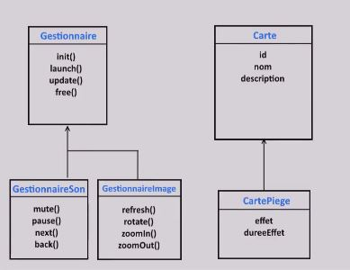

# [24. Héritage](https://www.youtube.com/watch?v=BqO7U0ed-pA)
08-12-20

Bonjour et bienvenue sur cette séance 24 en PHP. 

Comme je vous l'avais dit dans la vidéo précédente, on va parler d'une notion très très importante qui s'appelle l'héritage. 

C'est une notion que vous allez retrouver dans tous les langages de programmation parce que le lié au paradigme de programmation orientée objet plutôt que langage lui-même.

Pour vous expliquer rapidement le fonctionnement, je vais vous montrer un petit schéma très très simple pour que vous comprenez le principe et ensuite nous ferons Web pour voir comment implémenter ça avec quelques exemples très simples. 

Alors la première chose à voir jusqu à présent comme je vous avais montré au niveau des classes. 

Je vous avais expliqué qu'on avait cette espèce de fonctionnement d'entités c'est-à-dire une sorte de boîte pour chacune des classes qui les définissent comme ici lorsqu'on avait fait une classe Vehicule, une classe Habitation et une classe Guerrier avec leurs principes toujours de propriétés et de méthodes, c'est ça qui formait en fait votre application.
```txt
	+-------------------------------------------------------+
	|														|
	|	+-------------------+		+-------------------+	|
	|	| Vehicule			|		| Guerrier			|	|
	|	| 					|		| 					|	|
	|	| - tournerDroite()	|		| - seDeplacer()	|	|
	|	| - tournerGauche()	|		| - attaquer()		|	|
	|	| - freiner()		|		| 					|	|
	|	| 					|		| piecesOr			|	|
	|	| nombrePlaces		|		| pointsDeVie		|	|
	|	| typeCarurant		|		| 					|	|
	|	+-------------------+		+-------------------+	|
	|	                         							|
	|				+-------------------+					|
	|				| Habitation		|					|
	|				| 					|					|
	|				| - vendre()		|					|
	|				| - acheter()		|					|
	|				| - allerA()		|					|
	|				|					|					|
	|				| nombrePieces		|					|
	|				| prixVente			|					|
	|				+-------------------+	Application		|
	|                                                      	|
	+-------------------------------------------------------+
```
Je vous avais expliqué aussi que par la suite on pourrait avoir, et c'est là l'intérêt de la programmation objet, des liaisons c'est-à-dire des liens entre ces différentes entités. 

Et celle là que la programmation objet avec son principe d'héritage entre en jeu. 

Je vous ai fait du coup ce petit chemin pour expliquer un petit peu le concept simplement.

<!--
```txt
	+---------------+							+---------------+
	|Gestionnaire	|							|Carte			|
	+---------------+							+---------------+
	|init()			|							|id				|
	|launch()		|							|nom			|
	|update()		|							|description	|
	|free()			|							|				|
	+---------------+							+---------------+
			^											^
			|											|
			+-------------------+						|
			|					|						|
	+---------------+ +-----------------+		+---------------+
	|GestionnaireSon| |GestionnaireImage|		|CartePiege		|
	+---------------+ +-----------------+		+---------------+
	|mute()			| |refresh()		|		|effet			|
	|pause()		| |rotate()			|		|dureeEffet		|
	|next()			| |zoomIn()			|		|				|
	|back()			| |zoomOut()		|		|				|
	+---------------+ +-----------------+		+---------------+
```
-->
Comment ça fonctionne ? 

Ce qui est représenté par des boîtes, ce sont des classes. 

On a mélangé un petit peu des termes anglais et français pour que vous ayez différents exemples. 

Sur la gauche nous avons que des méthodes qui sont indiquées et sur la droite nous avons des propriétés, c'est pour vous montrer que ça fonctionne exactement pareil. 

Ce qu'il faut comprendre c'est que vous allez avoir une classe dites classe mère. 

La classe mère, c'est la clause dite originelle, c'est la classe de bas. 

Par exemple prenons cette classe de gestionnaire.
```txt
	+---------------+						
	|Gestionnaire	|						
	+---------------+						
	|init()			|						
	|launch()		|						
	|update()		|						
	|free()			|						
	+---------------+						
```
Pronom cette classe de gestionnaire, un manager en fait, qui posséderait des méthodes comme init(), on imagine que c'est pour initialiser le gestionnaire. launch() c'est pour le mettre en route. update() c'est pour le garder à jour et free() c'est peut être pour libérer de la mémoire ou bref faire les libérations ou le changement nécessaire. 

Donc ça c'était au niveau du gestionnaire.

On peut partir du principe que tous nos gestionnaires posséderont au minimum ces services là d'accord tous. 

Au niveau de notre application, nous avons besoin de gestionnaires bien spécifiques parce qu'un gestionnaire tout court ça ne veut rien dire et prenons l'exemple d'une application qui pourrait gérer des images, des sons, du réseau, des vidéos et ce genre de choses … et bien avoir un gestionnaire qui gère tout ça c'est un petit peu trop abstrait, on n'arrive pas bien à comprendre un petit peu où on veut en venir. 

Pour cela nous allons étendre, étendre l'utilisation de ce gestionnaire donc de cette classe Gestionnaire en créant des classes filles. 

Les classes filles vont donc tout simplement hériter de la classe mère. 
```txt
	+---------------+						
	|Gestionnaire	|						
	+---------------+						
	|init()			|						
	|launch()		|						
	|update()		|						
	|free()			|						
	+---------------+						
			^								
			|								
			+-------------------+			
			|					|			
	+---------------+ +-----------------+	
	|GestionnaireSon| |GestionnaireImage|	
	+---------------+ +-----------------+	
	|mute()			| |refresh()		|	
	|pause()		| |rotate()			|	
	|next()			| |zoomIn()			|	
	|back()			| |zoomOut()		|	
	+---------------+ +-----------------+	
```
Alors au niveau du schéma c'est représenté par la flèche c'est-à-dire que nous avons la classe mère Gestionnaire et nous allons créer 2 classes filles donc GestionnaireSon et GestionnaireImage même si on aurait pu en avoir plein d'autres mais c'est pour l'exemple qui vont hériter de la classe mère. 

Qu'est-ce qu'on entend par héritage ? c'est qu'on entend que toutes les classes filles possèderont toutes les méthodes de la classe mère. 

Ici je ne les ai pas renoté mais on aurait pu mettre dans GestionnaireSon launch(), update() et free() et c'est pareil pour GestionnaireImage et on aurait pu mettre également les propriétés même si j'en ai pas noté sur ce schéma mais on peut imaginer que les propriétés sont également hérité pour cette classe fille. 

Les classes filles sont donc tout simplement spécialisées par rapport à la classe mère, elles ont tout ce que possède la mère avec des choses éventuellement en plus. 

De toute façon s'il n'y avait pas des choses en plus, ou de changement, ou de surcharge dont on parlera un petit peu après, ça n'aurait aucun intérêt de faire de l'héritage. 

L'avantage c'est donc on va pouvoir ajouter des choses bien spécifiques. 

Par exemple on n'aurait pas d'intérêt à faire une rotation de son, d'accord ça ne voudrait absolument rien dire. 

C'est pour ça que cette petite méthode rotate() concerne GestionnaireImage, ce qui ne servait à rien de le mettre dans Gestionnaire ici de base puisque c'est un Gestionnaire abstrait et on ne sait pas du coup à quoi ça correspond, qu'est-ce que gère ce gestionnaire ? 

C'est pour ça qu'on crée ici des classes spécialisées et c'est beaucoup plus logique de dire qu'on a une méthode c'est-à-dire qu'on est capable de faire des rotations à une image dans cette classe de gestion des images. 

Pour le GestionnaireSon, on se rend compte qu'on peut mettre le son en mute() c'est-à-dire qu'on peut le couper. On peut mettre en pause un son, on peut passer au suivant ou passer au précédent et cetera. 

Ceux qui ne voudraient rien dire encore une fois pour les images, pour dire qu'on coupe le son d'une image ce qui ne veut pas dire grand-chose … ou bien mettre en pause une image, voilà on ne comprendrait pas trop. 

Mettre en pause une vidéo ? oui, un son ? oui, une image ? non. 

Voilà comment ça fonctionne. 

L'avantage aussi de l'héritage, ça c'est important aussi, ce qu'on peut réécrire c'est-à-dire surcharger des méthodes. Qu'est-ce que ça veut dire ? Par exemple je peux appliquer un comportement par défaut à mon gestionnaire pour la méthode init(). 

Voilà quand on utilise la méthode init() suivant un gestionnaire quelconque, ça va se passer d'une certaine manière. 

En revanche on est d'accord que l'initialisation d'un Gestionnaire de son ça peut être différent, l'initialisation d'un Gestionnaire d'image sera également différente. 

Si vous réécrivez les méthodes qui sont ici dans la classe mère dans la classe fille vous allez simplement les surcharger c'est-à-dire qu'on va les réécrire mais ça on va le voir un petit peu après. 

De toute façon tout ce que vous voyez là on va le revoir au niveau code donc ne vous en faites pas on reviendra sur le schéma par la suite.

On passe maintenant à l'exemple à droite qui était écrit en français avec les propriétés pour montrer que c'est la même chose.
```txt
	+---------------+
	|Carte			|
	+---------------+
	|id				|
	|nom			|
	|description	|
	|				|
	+---------------+
			^
			|
			|
			|
	+---------------+
	|CartePiege		|
	+---------------+
	|effet			|
	|dureeEffet		|
	|				|
	|				|
	+---------------+
```
Imaginez un jeu de cartes tel que Yu-gi-ho, Magic, et cetera peu importe mais si nous avons plutôt pris l'exemple d'un jeu quelconque plutôt que se baser sur un jeu existant. 

On peut penser à une entité Carte qui est une carte de jeu donc tu auras des informations très simple comme un identifiant, un non et une description. Une petite description par exemple qui explique l'histoire de la carte ou ce genre de chose. 

Ça on part du principe que toutes les cartes dans notre jeu, elles auront cette chose là.

Voilà ici je n'ai pas noté de méthode mais encore une fois elle pourrait en avoir. 

Ensuite je voudrais créer une carte particulière qui serait une carte piège. 

La carte piège on est d'accord elle va également avoir un identifiant, un nom et une description bien que je ne les ai pas renoté mais comme elle hérite de la classe Carte, elle possèdera encore une fois tous ses attributs donc ces propriétés, et toutes ces méthodes, et en plus de ça je peux lui ajouter des choses en plus. 

Je peux dire qu'une carte piège, ce qu'il y a de spécial par rapport à une carte simple, c'est qu'elle a un effet et en plus elle a une durée d'effet. 

Voyez qu'on rajoute des choses, on spécialise.

CartePiege est une sorte de Carte, c'est comme ça qu'on arrive à identifier un principe d'héritage. 

Si par exemple vous dites qu'un panda c'est une sorte d'animal, Eh bien panda c'est un peu comme si c'était une entité qui hérite d'un animal d'accord. 

Ça possède tout ce que à un animal mais avec des choses en plus, peut être sa manière de manger, le fait qu'il soit à 4 pattes et qu'il y ait des animaux à 2 pattes, le fait qu'il n'ait pas d'ailes, le fait qu'il n'ait pas de nageoire. 

Voyez on peut spécialiser et préciser les choses. 

Voilà comment ça fonctionne pour l'héritage. 

C'est très simple à comprendre d'abord comme notion mais des fois les gens ont vraiment du mal à le mettre en application pourtant il n'y a rien à savoir de plus que ça. 

L'héritage ça fonctionne un petit peu comme l'héritage familial c'est pareil. 

Vous avez par exemple les parents, le père et la mère qui serait la classe mère donc la classe originelle. 

Et les enfants qui seraient la classe fille et la classe fils qui héritent donc ils auraient tout ce que possèdent les parents même si dans la réalité ce n'est pas forcément ça avec peut-être des choses en plus, ou des choses qui ont été réécrites par exemple la couleur des yeux ou ce genre de chose. 

Voilà comment ça fonctionne. 

On va appliquer tout cela au niveau code parce que c'est bien d'avoir un petit exemple en pratique avec un petit côté programmation pour que vous voyez comment ça fonctionne. 

On va créer notre classe carte que l'on va mettre en anglais, on va prendre l'habitude de toujours tout mettre en anglais. 
```php
	class Card
	{
		
	}
```
On va avoir 2 propriétés private et ensuite on va avoir notre constructeur à qui on va passer un nom et une description et à l'intérieur l'objet `$this`.
```php
	class Card
	{
		private $_name;
		private $_description;
		
		public function __construct($name, $description)
		{
			$this->_name = $name;
			$this->_description = $description;
		}
	}
```
Voilà si vous ne comprenez pas ça depuis le temps, si ce n'est pas le cas revenez sur la vidéo précédente et vous en aurez besoin. 

Et ensuite on va faire une petite classe très simple hello() simplement on ne va pas chercher plus loin. On va mettre 'Je suis Card'.
```php
	class Card
	{
		private $_name;
		private $_description;
		
		public function __construct($name, $description)
		{
			$this->_name = $name;
			$this->_description = $description;
		}
		
		public function hello()
		{
			echo 'Je suis Card';
		}
	}
```
Et ça tout simple si je reprends l'exemple comme on a l'habitude de faire, on instancie notre classe.
```php
	class Card
	{
		private $_name;
		private $_description;
		
		public function __construct($name, $description)
		{
			$this->_name = $name;
			$this->_description = $description;
		}
		
		public function hello()
		{
			echo 'Je suis Card';
		}
	}
	
	$mycard = new card('Magicien sombre', 'Un magicien aux grands pouvoirs...');
```
Et ensuite, on va tout simplement faire ceci.
```php
	class Card
	{
		private $_name;
		private $_description;
		
		public function __construct($name, $description)
		{
			$this->_name = $name;
			$this->_description = $description;
		}
		
		public function hello()
		{
			echo 'Je suis Card';
		}
	}
	
	$mycard = new card('Magicien sombre', 'Un magicien aux grands pouvoirs...');
	$mycard->hello();
```
De toute façon avec les informations qu'on a on s'en fiche un petit peu parce qu'on ne donnait pas mais on peut changer pour avoir un petit truc à donner quand même `'je suis la carte '.$this->_name;`
```php
<?php

class Card
{
	private $_name;
	private $_description;
	
	public function __construct($name, $description)
	{
		$this->_name = $name;
		$this->_description = $description;
	}
	
	public function hello()
	{
		echo 'Je suis la carte '.$this->_name;
	}
}

$mycard = new card('Magicien sombre', 'Un magicien aux grands pouvoirs...');
$mycard->hello();
```
On y va et on actualise.

	http://localhost/PHP/cours/024_heritage/
	Je suis la carte Magicien sombre

Voilà je suis la carte magicien sombre donc ça fonctionne pas de problème à ce niveau-là. 

Ça c'est ce que vous saviez faire jusqu à présent. 

Nous on va donc créer notre classe fille donc on va créer une classe qui en hérite. 

On va faire une classe TrapCard qui va être étendue depuis la classe mère donc on va utiliser le mot clé extends, elle étend la classe Card. 

Ça c'est donc important.
```php
	class Card
	{
		private $_name;
		private $_description;
		
		public function __construct($name, $description)
		{
			$this->_name = $name;
			$this->_description = $description;
		}
		
		public function hello()
		{
			echo 'Je suis la carte '.$this->_name;
		}
	}
	
	class TrapCard extends Card
	{
		
	}

	$mycard = new card('Magicien sombre', 'Un magicien aux grands pouvoirs...');
	$mycard->hello();
```
À partir de là qu'est-ce qu'il va se passer lorsqu'on va construire notre élément TrapCard ? il va évidemment se construire sur __construct() de la classe mère c'est à dire que quand on va vouloir créer une carte piège, ça va appeler un constructeur éventuellement mis ici.
```php
	class TrapCard extends Card
	{
-->		
	}
```
Un constructeur éventuellement mis ici c'est-à-dire qu'on va toujours cherché à utiliser une méthode dans la classe la plus en bas donc la classe la plus héritée.

Et si cette méthode n'existe pas, on va remonter en haut donc si on n'avait pas par exemple ici créé le constructeur dans la classe TrapCard, qu'est-ce qu'il va se passer ? PHP va remonter à la classe mère voir s'il y a un constructeur et du coup l'appeler et pareil pour les autres méthodes. 

Alors je ne vais pas vous montrer pour le constructeur bien qu'on pourrait faire un constructeur dans la classe TrapCard sinon ça va rallonger la vidéo. 

Je ne vais rien mettre du tout et vous allez voir et pour ce faire je vais d'abord créer une carte piège TrapCard() avec son nom et sa description mais pas son effet. Et ensuite on fait `$mytrapcard->hello();` c'est histoire de voir ce qu'il se passe en terme de code.
```php
<?php

class Card
{
	private $_name;
	private $_description;
	
	public function __construct($name, $description)
	{
		$this->_name = $name;
		$this->_description = $description;
	}
	
	public function hello()
	{
		echo 'Je suis la carte '.$this->_name;
	}
}

class TrapCard extends Card
{
	
}

$mytrapcard = new TrapCard('Fosse', 'Une grande fosse qui piege les ennemis');
$mytrapcard->hello();
```
Alors là vous voyez que je n'ai rien fait de plus j'ai juste créer ma classe fille … TrapCard extends Card … Vous voyez que je n'ai pas écrit grand-chose et on va regarder à l'usage ce que ça nous donne. 

Voici ce qu'il se passe.
```txt
	http://localhost/PHP/cours/024_heritage/
	Je suis la carte Fosse
```
Alors qu'est-ce qui s'est passé par rapport à ce que je vous expliqué tout à l'heure ? si on revient au schéma.


<!--
```txt
	+---------------+							+---------------+
	|Gestionnaire	|							|Carte			|
	+---------------+							+---------------+
	|init()			|							|id				|
	|launch()		|							|nom			|
	|update()		|							|description	|
	|free()			|							|				|
	+---------------+							+---------------+
			^											^
			|											|
			+-------------------+						|
			|					|						|
	+---------------+ +-----------------+		+---------------+
	|GestionnaireSon| |GestionnaireImage|		|CartePiege		|
	+---------------+ +-----------------+		+---------------+
	|mute()			| |refresh()		|		|effet			|
	|pause()		| |rotate()			|		|dureeEffet		|
	|next()			| |zoomIn()			|		|				|
	|back()			| |zoomOut()		|		|				|
	+---------------+ +-----------------+		+---------------+
```
-->
Si on revient au schéma comme là on vient d'abord de créer une instance de notre carte piège, on appelle pour cette carte piège une méthode hello(). 

Qu'est-ce que va donc faire PHP ? il va chercher si ici nous avons redéfini, surchargé donc réécrit la méthode hello() dans la classe donc la classe TrapCard et comme il voit qu'il n'y en a pas il va revenir à la classe parente donc ici la classe mère qui est Card et là il trouve effectivement la méthode hello() donc il l'appelle. 

Si je veux redéfinir cette méthode, ça peut servir dans certains cas pour dire qu'une carte piège quand elle fait hello(), elle ne ferait pas la même chose qu'une simple carte et donc dans ce cas-là je vais redéfinir cette méthode. 

Pour définir vous réécrivez la définition de la méthode et à l'intérieur vous mettez ce qui diffère d'accord donc 'Je suis une TrapCard !'.
```php
	class Card
	{
		private $_name;
		private $_description;
		
		public function __construct($name, $description)
		{
			$this->_name = $name;
			$this->_description = $description;
		}
		
		public function hello()
		{
			echo 'Je suis la carte '.$this->_name;
		}
	}

	class TrapCard extends Card
	{
>		public function hello()
		{
			echo 'Je suis une TrapCard !';
		}
	}

	$mytrapcard = new TrapCard('Fosse', 'Une grande fosse qui piege les ennemis');
	$mytrapcard->hello();
```
Et à partir de là juste en faisant ça sans rien modifier d'autres, en actualisant on voit que ça appelle la méthode de la classe fille.

Alors il y a pas mal de choses à voir sur cette vidéo autant la vidéo précédente était très courte mais autant celle-ci il va y avoir pas mal de choses à prendre en note si vous voulez mais c'est très important de bien comprendre ce principe-là.

PHP va toujours chercher dans la classe où vous êtes, s'il ne trouve pas il va revenir à la classe parente et encore et ainsi de suite.

Ça n'aurait aucun intérêt ici d'avoir une SpecialTrapCard alors je ne sais pas pourquoi mais qui étendrait TrapCard ce genre de chose. 
```php
	class Card
	{
		private $_name;
		private $_description;
		
		public function __construct($name, $description)
		{
			$this->_name = $name;
			$this->_description = $description;
		}
		
		public function hello()
		{
			echo 'Je suis la carte '.$this->_name;
		}
	}

	class TrapCard extends Card
	{
		public function hello()
		{
			echo 'Je suis une TrapCard !';
		}
	}
	
>	class SpecialTrapCard extends TrapCard
	{
		
	}
	
	$mytrapcard = new TrapCard('Fosse', 'Une grande fosse qui piege les ennemis');
	$mytrapcard->hello();
```
SpecialTrapCard qui est la classe fille de TrapCard qui est également la classe fille de Card. 

Voyez qu'on peut avoir comme ça un héritage qui va très très loin. 

Là on aurait du coup la classe mère, la classe fille et la classe petite fille ou la classe sous-fille, enfin peu importe, vous appelez ça comme vous voulez mais vous pouvez comme ça étendre très très loin. 

Et on va toujours prendre ton niveau de PHP quand on appelle une méthode sur une instance, prendre ce qu'il y a dans la classe elle-même et si on ne trouve pas on reviendra à la classe parentes et ainsi de suite et ainsi de suite. 

Et si évidemment on ne trouve rien du tout vous aurez un message d'erreur pour dire que la méthode n'est pas définie et qu'elle n'existe pas évidemment. 

Rappelez vous sur la visibilité je vous avais dit qu'on allait parler lors de l'héritage du mot clé protected. Il faut comprendre que private, on avait dit que c'est l'information qui est privée partout d'accord c'est-à-dire que même si TrapCard essaie d'appeler … et qu'on fait `$this` de `$name`.
```php
<?php

class Card
{
	private $_name;
	private $_description;
	
	public function __construct($name, $description)
	{
		$this->_name = $name;
		$this->_description = $description;
	}
	
	public function hello()
	{
		echo 'Je suis la carte '.$this->_name;
	}
}

class TrapCard extends Card
{
	public function hello()
	{
		echo 'Je suis une TrapCard !<br>';
		echo $this->_name;
	}
}

$mytrapcard = new TrapCard('Fosse', 'Une grande fosse qui piege les ennemis');
$mytrapcard->hello();

?>
```
Voilà ce qu'on obtient.
```txt
	http://localhost/PHP/cours/024_heritage/
	Je suis une TrapCard !

	Notice: Undefined property: TrapCard::$_name in C:\...\index.php on line 552
```
`Undefined property`, il nous dit qu'il ne trouve pas de propriété `$_name`. 

Le problème aussi c'est que comme vous voyez `$_name` est un attribut privé c'est à dire que tout ce qui est privé appartient à la classe où c'est défini c'est-à-dire donc à la classe Card c'est à dire que même si c'est la classe mère, on ne veut pas que les classes filles y accèdent. 

Pour cela vous avez un mot qui est entre private et public qui est protected. 

Et en général quand on fait bien les choses, les attributs d'une classe mère on les met en protected pour donner l'accès aux classes filles.
```php
<?php

class Card
{
	protected $_name;
	protected $_description;
	
	public function __construct($name, $description)
	{
		$this->_name = $name;
		$this->_description = $description;
	}
	
	public function hello()
	{
		echo 'Je suis la carte '.$this->_name;
	}
}

class TrapCard extends Card
{
	public function hello()
	{
		echo 'Je suis une TrapCard !<br>';
		echo $this->_name;
	}
}

$mytrapcard = new TrapCard('Fosse', 'Une grande fosse qui piege les ennemis');
$mytrapcard->hello();

?>
```
Voilà ce qu'on obtient.
```txt
	http://localhost/PHP/cours/024_heritage/
	Je suis une TrapCard !
	Fosse
```
On met protected pour donner l'accès aux classes filles et là du coup on va avoir accès aux attributs c'est à dire que protected rend les attributs privés pour tout le monde sauf pour les classes filles, les classes qui en héritent. 

Si on avait un schéma par exemple.


<!--
```txt
	+---------------+							+---------------+
	|Gestionnaire	|							|Carte			|
	+---------------+							+---------------+
	|init()			|							|id				|
	|launch()		|							|nom			|
	|update()		|							|description	|
	|free()			|							|				|
	+---------------+							+---------------+
			^											^
			|											|
			+-------------------+						|
			|					|						|
	+---------------+ +-----------------+		+---------------+
	|GestionnaireSon| |GestionnaireImage|		|CartePiege		|
	+---------------+ +-----------------+		+---------------+
	|mute()			| |refresh()		|		|effet			|
	|pause()		| |rotate()			|		|dureeEffet		|
	|next()			| |zoomIn()			|		|				|
	|back()			| |zoomOut()		|		|				|
	+---------------+ +-----------------+		+---------------+
```
-->
Si dans Gestionnaire, vous mettez protected pour toutes les propriétés, et bien GestionnaireSon I aura accès, GestionnaireImage y aura accès par contre les classes ici à côté Carte et CartePiege, elle n'y aurait pas accès du tout. 

D'accord c'est complètement étranger donc ça n'aurait rien à voir. 

Pour Carte, si nos propriétés sont protected donc protégé, CartePiege y aura accès et ce sera la seule classe à y avoir accès avec Carte puisque vous voyez qu'il y a une liaison d'héritage entre les 2. 

Voilà comment ça fonctionne. 

Ça c'est une petite astuce si vous ne savez pas comment y faire, Eh bien mettez toujours vos attributs privés mais si vous avez une classe mère qui va être utilisé pour l'héritage, passes les attributs en protected. D'accord ça gardera les choses privées pour le reste mais ça rendra les choses publiques pour les classes filles qui ont des fois besoin d'accéder aux éléments. 

Voilà comment ça fonctionne. 

Je vous ai tout expliqué concernant ça sur le principe ici. 

Alors ce qu'on peut faire aussi, chose que je ne vous ai pas montré parce que ici je n'ai pas pris mon effet en compte dans la classe TrapCard. 

Alors comment est-ce que je fais pour prendre mon effet en compte ?
```php
	class Card
	{
		protected $_name;
		protected $_description;
		
		public function __construct($name, $description)
		{
			$this->_name = $name;
			$this->_description = $description;
		}
		
		public function hello()
		{
			echo 'Je suis la carte '.$this->_name;
		}
	}
	
	class TrapCard extends Card
	{
>		
>		
>		
		public function hello()
		{
			echo 'Je suis une TrapCard !<br>';
			echo $this->_name;
		}
	}
	
	$mytrapcard = new TrapCard('Fosse', 'Une grande fosse qui piege les ennemis');
	$mytrapcard->hello();
```
Nous avons un nouvel élément donc ici comme on ne va pas faire une classe qui va hériter de TrapCard, je peux donc mettre un attribut privé et on va avoir par exemple `$_effect;`
```php
	class Card
	{
		protected $_name;
		protected $_description;
		
		public function __construct($name, $description)
		{
			$this->_name = $name;
			$this->_description = $description;
		}
		
		public function hello()
		{
			echo 'Je suis la carte '.$this->_name;
		}
	}
	
	class TrapCard extends Card
	{
>		private $_effect;

		public function hello()
		{
			echo 'Je suis une TrapCard !<br>';
			echo $this->_name;
		}
	}
	
	$mytrapcard = new TrapCard('Fosse', 'Une grande fosse qui piege les ennemis');
	$mytrapcard->hello();
```
On va ensuite créer notre constructeur pour `$_effect` c'est-à-dire qu'on va redéfinir le constructeur c'est-à-dire que la classe fille ne va pas utiliser le constructeur de la classe mère. Elle va avoir son propre constructeur et va reprendre en toute logique `$name` et `$description` et vous allez très vite comprendre pourquoi c'est-à-dire tout ce que la classe mère a dans son constructeur et son nouvel élément à elle `$effect`. Vous voyez elle est spécialisée alors TrapCard a un élément en plus par rapport à la classe mère.
```php
	class Card
	{
		protected $_name;
		protected $_description;
		
		public function __construct($name, $description)
		{
			$this->_name = $name;
			$this->_description = $description;
		}
		
		public function hello()
		{
			echo 'Je suis la carte '.$this->_name;
		}
	}
	
	class TrapCard extends Card
	{
>		private $_effect;
		
>		public function __construct($name, $description, $effect)
		{
			
		}

		public function hello()
		{
			echo 'Je suis une TrapCard !<br>';
			echo $this->_name;
		}
	}
	
	$mytrapcard = new TrapCard('Fosse', 'Une grande fosse qui piege les ennemis');
	$mytrapcard->hello();
```
Le constructeur a un élément en plus par rapport à la classe mère qui elle n'avait que le nom et la description. 

Alors comment est-ce qu'on va faire ? Déjà comme vous voyez ici au niveau de `$name`, `$description` nous n'y avons pas accès directement donc on peut faire soit ça.
```php
<?php

	class Card
	{
		protected $_name;
		protected $_description;
		
		public function __construct($name, $description)
		{
			$this->_name = $name;
			$this->_description = $description;
		}
		
		public function hello()
		{
			echo 'Je suis la carte '.$this->_name;
		}
	}
	
	class TrapCard extends Card
	{
		private $_effect;
		
		public function __construct($name, $description, $effect)
		{
>			$this->_name = $name;
>			$this->_description = $description;
>			$this->_effect = $effect;
		}

		public function hello()
		{
			echo 'Je suis une TrapCard !<br>';
			echo $this->_name;
		}
	}

//On ajoute l'effet.
	
	$mytrapcard = new TrapCard('Fosse', 'Une grande fosse...', 'Detruit tous les ennemis sur le terrain');
	$mytrapcard->hello();

?>
```
On a donc le nom 'Fosse', la description '…' et comme c'est une carte piège, on a un 3e argument au constructeur qui est l'effet '…'. 

Ça c'était donc la première possibilité et si j'essaye je ne vais pas afficher grand-chose, on va donc afficher ces éléments à elle pour présenter la carte.
```php
	public function hello()
	{
		echo 'Nom : '.$this->_name.'<br>';
		echo 'Description : '.$this->_description.'<br>';
		echo 'Effet : '.$this->_effect.'<br>';
	}
```
```php
<?php

class Card
{
	protected $_name;
	protected $_description;
	
	public function __construct($name, $description)
	{
		$this->_name = $name;
		$this->_description = $description;
	}
	
	public function hello()
	{
		echo 'Je suis la carte '.$this->_name;
	}
}

class TrapCard extends Card
{
	private $_effect;
	
	public function __construct($name, $description, $effect)
	{
		$this->_name = $name;
		$this->_description = $description;
		$this->_effect = $effect;
	}

	public function hello()
	{
		echo 'Nom : '.$this->_name.'<br>';
		echo 'Description : '.$this->_description.'<br>';
		echo 'Effet : '.$this->_effect.'<br>';
	}
}

$mytrapcard = new TrapCard('Fosse', 'Une grande fosse...', 'Detruit tous les ennemis sur le terrain');
$mytrapcard->hello();
```
```txt
	http://localhost/PHP/cours/024_heritage/
	Nom : Fosse
	Description : Une grande fosse...
	Effet : Detruit tous les ennemis sur le terrain
```
On voit qu'on a bien la Fosse, la description et on a bien l'effet. 

Tout y est. 

On peut aussi aller un peu plus vite parce que vous voyez qu à chaque fois on réécrit ça alors qu'on le fait déjà dans la classe mère.
```php
	public function __construct($name, $description, $effect)
	{
>		$this->_name = $name;
>		$this->_description = $description;
>		$this->_effect = $effect;
	}
```
Si on veut y aller un peu plus vite parce que vous voyez qu'on aurait écrit ça à chaque fois alors que on l'écrit déjà dans la crasse mère. 

Ça fait de la répétition de code et ce n'est pas forcément pratique alors qu'on a déjà un constructeur qui va appliquer des éléments ici.
```php
	class Card
	{
		protected $_name;
		protected $_description;
		
		public function __construct($name, $description)
		{
>			$this->_name = $name;
>			$this->_description = $description;
		}
	...
```
Alors ce qu'on peut faire c'est qu'on va appeler 2 constructeurs c'est-à-dire qu'ici la classe fille TrapCard, elle va appeler son constructeur à elle et dans son constructeur elle va déjà construire la partie qui est liée à la mère parce qu'elle a des éléments qui appartiennent aussi à la classe mère donc pour ça on utilise aussi un mot spécial qui est parent:: suivi du fameux opérateur de résolutions de portée et on fait simplement ça __construct() en passant les éléments.
```php
>			parent::__construct($name, $description);
```
```php
<?php

class Card
{
	protected $_name;
	protected $_description;
	
	public function __construct($name, $description)
	{
		$this->_name = $name;
		$this->_description = $description;
	}
	
	public function hello()
	{
		echo 'Je suis la carte '.$this->_name;
	}
}

class TrapCard extends Card
{
	private $_effect;
	
	public function __construct($name, $description, $effect)
	{
		parent::__construct($name, $description);
		$this->_effect = $effect;
	}

	public function hello()
	{
		echo 'Nom : '.$this->_name.'<br>';
		echo 'Description : '.$this->_description.'<br>';
		echo 'Effet : '.$this->_effect.'<br>';
	}
}

$mytrapcard = new TrapCard('Fosse', 'Une grande fosse...', 'Detruit tous les ennemis sur le terrain');
$mytrapcard->hello();

?>
```
`parent::__construct($name, $description);` ça vous voyez c'est comme si on appelle volontairement le constructeur de la classe mère donc en reprenant ce qu'elle passe en paramètre là.
```php
	class Card
	{
		protected $_name;
		protected $_description;
		
>		public function __construct($name, $description)
		{
			$this->_name = $name;
			$this->_description = $description;
		}
	...
```
Et ensuite la classe TrapCard comme elle a sa petite propriété `$_effect` à elle, on peut donc là rajouter à la suite.
```php
	class TrapCard extends Card
	{
		private $_effect;
		
		public function __construct($name, $description, $effect)
		{
			parent::__construct($name, $description);
>			$this->_effect = $effect;
		}
	...
```
Voilà ensuite on va réactualiser vous allez voir qu'il se passe exactement la même chose. 
```txt
	http://localhost/PHP/cours/024_heritage/
	Nom : Fosse
	Description : Une grande fosse...
	Effet : Detruit tous les ennemis sur le terrain
```
C'est juste que ce sera un peu plus propre et ça évite de répéter du code sans arrêt et pourquoi c'est important de faire comme ça parce que imaginez qu'un jour vous changer le constructeur de la classe mère c'est-à-dire ce qu'il se passe à l'intérieur de ce constructeur que vous faites des vérifications, des conditions ou je ne sais quoi vous n'aurez pas besoin de le changer dans le constructeur de la classe fille.

Parce que si vous faites le même code, le même constructeur dans la classe fille que dans la classe mère, Eh bien le jour où vous allez vouloir changer ce qu'il se passe dans la classe mère, vous allez devoir également éditer dans la classe fille ce qui est un peu embêtant. 

Alors que là si vous changer admettons les propriétés de la classe Card, de la classe mère, vous aurez juste à ajouter les éléments en plus ici.
```php
	parent::__construct($name, $description, ...);
```
Parce que ça c'est en fait un code générique, il n'aura pas besoin d'être modifié `parent::__construct()`

Ça restera toujours pareil. 

Privilégiez donc cette syntaxe là dans lequel on ajoutera des éléments. 

Ensuite c'est toujours pareil on va pouvoir continuer d'écrire d'autres cartes évidemment et ça marche aussi.
```php
<?php

class Card
{
	protected $_name;
	protected $_description;
	
	public function __construct($name, $description)
	{
		$this->_name = $name;
		$this->_description = $description;
	}
	
	public function hello()
	{
		echo 'Je suis la carte '.$this->_name;
	}
}

class TrapCard extends Card
{
	private $_effect;
	
	public function __construct($name, $description, $effect)
	{
		parent::__construct($name, $description);
		$this->_effect = $effect;
	}

	public function hello()
	{
		echo 'Nom : '.$this->_name.'<br>';
		echo 'Description : '.$this->_description.'<br>';
		echo 'Effet : '.$this->_effect.'<br>';
	}
}

$mytrapcard = new TrapCard('Fosse', 'Une grande fosse...', 'Detruit tous les ennemis sur le terrain');
$mytrapcard->hello();
echo '<br><br>';
$myotherCard = new Card('test', 'ma description');
$myotherCard->hello()
```
```txt
	http://localhost/PHP/cours/024_heritage/
	Nom : Fosse
	Description : Une grande fosse...
	Effet : Detruit tous les ennemis sur le terrain


	Je suis la carte test
```
Voilà vous voyez qu'on peut créer sans problème une carte mère.

Alors vous voyez que ce n'est pas la carte mère des ordinateurs mais une carte de la classe Card.  :)

Et on peut en même temps créer une carte de la classe TrapCard.

Voilà comment ça fonctionne. Voilà le principe. 

Ce n'est pas évident à comprendre au départ, à comprendre le principe et l'usage qu'on peut en avoir mais je pense que vous l'aurez compris. 

Après il faut bien l'appliquer parce que vous voyez qu'il y a des changements sur les mots clés, le fait que le constructeur fille peut appeler le constructeur mère, le fait qu'on peut surcharger réécrire des méthodes tout ça, ce n'est pas forcément facile à comprendre. 

Ensuite imaginait comprend par exemple aka simple comme l'héritage humain, vous avez par exemple votre père qui a les yeux bleus admettons c'est-à-dire que c'est une de ses propriétés où on aurait par exemple protected $_couleurDesYeux; 

Eh bien vous vous n'allez pas forcément avoir les yeux Bleus, vous allez redéfinir cette couleur, le génome va redéfinir selon le pourcentage des 2 parents, va définir quelle couleur de yeux vous aurez à la naissance. 

Ça ce serait une redéfinition. 

On aurait donc une redéfinition de la propriété qui s'est faîte et ce serait pareil du coup pour une méthode. 

Par exemple la classe mère va avoir un comportement peut-être différent de la classe fille mais elle va utiliser les mêmes méthodes. 

C'est pour ça qu'on fait cette espèce de redéfinition de méthode ici. 

Quand la classe Card fais une méthode hello() et qu'elle dit 'Je suis la carte …' mais par contre qu'on leur classe fille dit hello(), elle va faire ça.
```php
	//classe mère
	public function hello()
	{
		echo 'Je suis la carte '.$this->_name;
	}

	//classe fille
	public function hello()
	{
		echo 'Nom : '.$this->_name.'<br>';
		echo 'Description : '.$this->_description.'<br>';
		echo 'Effet : '.$this->_effect.'<br>';
	}
```
Voilà elles n'ont pas le même comportement pourtant elles utilisent la même méthode. 

Voilà comment ça fonctionne pour cette redéfinition. 

Il y a beaucoup de choses mais ça il n'y a pas de Secret encore une fois, il faudra vraiment mettre en pratique l'héritage et là en plus avec tout ce que vous avez vu jusqu à présent en PHP, vous avez moyen de faire de petites applications très simple. 

Vous avez déjà beaucoup d'éléments en main pour pouvoir faire des choses intéressantes et travailler là dessus. 

N'oubliez pas ce principe que j'avais montré avec ce schéma.


<!--
```txt
	+---------------+							+---------------+
	|Gestionnaire	|							|Carte			|
	+---------------+							+---------------+
	|init()			|							|id				|
	|launch()		|							|nom			|
	|update()		|							|description	|
	|free()			|							|				|
	+---------------+							+---------------+
			^											^
			|											|
			+-------------------+						|
			|					|						|
	+---------------+ +-----------------+		+---------------+
	|GestionnaireSon| |GestionnaireImage|		|CartePiege		|
	+---------------+ +-----------------+		+---------------+
	|mute()			| |refresh()		|		|effet			|
	|pause()		| |rotate()			|		|dureeEffet		|
	|next()			| |zoomIn()			|		|				|
	|back()			| |zoomOut()		|		|				|
	+---------------+ +-----------------+		+---------------+
```
-->
Ce schéma qui est assez explicite. 

N'hésitez pas par exemple si vous voulez faire un petit exercice, de faire par exemple une classe animale qui serait votre classe mère d'accord. 

Il y aurait différents éléments par exemple la nourriture parce que ça mange, le nom l'âge et ce genre de choses.

Et après vous ferez des classes filles. 

Par exemple une classe pour le chat, une classe pour un aigle, une classe pour un dauphin ou n'importe quoi il vous comprenez bien qu'un dauphin il y a des choses en plus qu'un simple animal n'a pas. 

C'est par exemple pour un animal on lui a dit qu'il a un nom et un âge. 

Et bien voilà le dauphin il aura un peu plus que ça. 

Dites-vous que la classe mère c'est souvent quelque chose d'un peu plus abstrait. 

C'est-à-dire qu'on définit de manière assez vague une entité, ici une Card qui a juste un nom et une description. 

Elle n'a pas grand chose mais pour nous une carte piège un nom et une description ce n'est pas suffisant, il faut qu'elle ait d'autres choses. 

À ce moment-là donc on a ajouté des propriétés et éventuellement redéfini des méthodes. 

C'est ça le principe de l'héritage en programmation orientée objet. 

Ni plus ni moins c'est ce principe de spécialisation, et de redéfinition éventuelle de propriété et de méthodes pour changer les comportements. 

Voilà comment ça marche. 

Si vous avez des questions il ne faudra pas hésiter à les poser et je sais qu'il n'y en aura pas mal dessus parce que ce n'est pas une vidéo facile à assimiler et n'hésite pas à la revoir plusieurs fois si nécessaire. 

Elle était un peu longue mais comme vous le savez c'était important de bien vous détailler tout ça et de ne pas aller trop vite parce que l'héritage si vous passez à côté, du coup vous vous mettez complètement en retard et complètement à défaut pour la suite des vidéos sur cette formation et pour tout le développement web de manière générale parce que c'est vraiment une notion très importante. 

Et si vous avez compris l'héritage en PHP, vous l'aurez également compris en c++, en Java et dans tous les autres langages de programmation qui utilise cette notion  dans le paradigme de programmation orientée objet. 

Je vous dis à bientôt pour la suite de PHP. 

Et encore une fois n'hésitez pas à laisser des commentaires, like et partage de cette vidéo parce que je pense que c'est des vidéos qui peuvent être utiles à beaucoup de gens. 

Et on se retrouve du coup pour la suite de ce cours en PHP.

Ciao