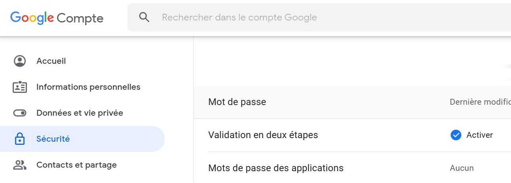
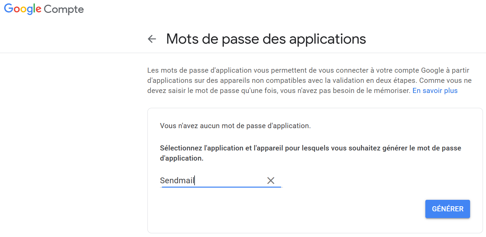
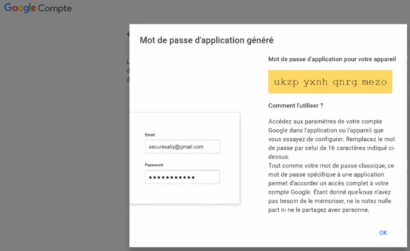
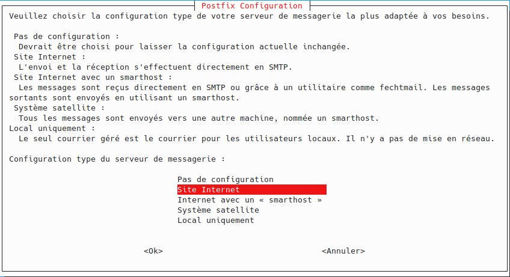
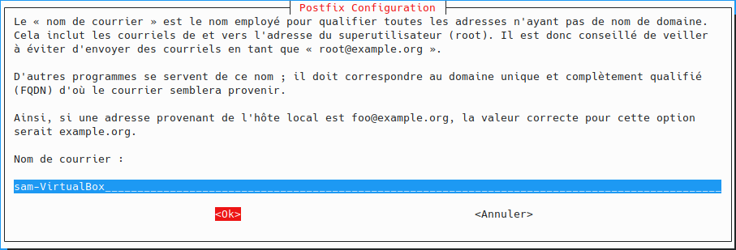

# [Tutoriel PHP - envoi mail() en local](https://www.youtube.com/watch?v=Fywr8gIVdLY)

Nous allons voir comment envoyer un message électronique depuis un serveur local, on utilisera PHP et sa fonction native mail() et on verra quelle configuration il faut faire pour rendre cette fonction opérationnelle parce que ce n'est pas le cas par défaut.

Pour commencer on va écrire un code en faisant un simple usage de la fonction mail(). On regardera ce qu'on obtient et comment obtenir la configuration aussi bien sur Windows que sur GNU Linux mais on utilisera un outil quelque peu différent parce que vous verrez que la configuration ne sera pas forcément la même.

mail() est un booléen qu'on peut tester directement pour vérifier qu'un mail a bien été envoyé.

```php
<?php

$to = "js201910271235@outlook.com";
$subject = "Utilisation de mail() avec PHP depuis Windows";
$message = "Salut, comment ça va ? 😀";

$headers = "Content-Type: text/plain; charset=utf-8\r\n";
$headers .= "From: js202002080712@gmail.com\r\n";

if(mail($to, $subject, $message, $headers))
    echo 'Envoye !';
else
    echo 'Erreur envoi';
```

Ici on aura également des paramètres optionnels `$headers` qui vont nous permettre envoyer des caractères spéciaux et des accents, même des emojis avec les en-têtes http donc voilà sous quel format on aura notre appel à la fonction mail().

On a `$to` qui est l'adresse du destinataire, ensuite on a le `$subject` et ensuite encore on a `$message` qui ne doit pas dépasser 72 caractères sinon il faudra passer par d'autres fonctions pour le découper et pour l'exemple on va essayer un message avec des caractères spéciaux et un petit emoji à la fin pour voir si c'est bien pris en compte.

On met un petit emoji à la fin pour savoir si c'est bien pris en compte et envoyer aussi, et ensuite au niveau des en-têtes avec quelques petites infos notamment une en-tête http pour avoir l’utf-8 et donc là attention à bien respecter le format sinon on aura tout simplement quelque chose qui ne fonctionne pas donc `Content-Type : text/plain; charset=utf-8\r\n` et on n'oublie pas le petit à retour à la ligne à la fin pour les en-têtes http ce qui est très important même si ce n'est pas obligatoire c'est pour prendre ton compte les caractères de toutes les langues.

Ensuite un indique la provenance donc l'expéditeur, c'est-à-dire la personne qui envoie le mail, en utilisant un format très spécifique `From: js201910271235@outlook.com\r\n`.

On pourrait également ajouter d'autres informations, d'autres champs pour dire à qui répondre `reply to` et d'autres informations et notamment un type mine si par exemple vous voulez faire un mail au format HTML donc ça c'est à vous de voir au niveau de l'usage de la fonction mail().

Dés lors, on actualise la page et on obtient une erreur.

```
Warning: mail(): Failed to connect to mailserver at "localhost" port 25, verify your "SMTP" and "smtp_port" setting in php.ini or use ini_set() in C:\Users\sam\OneDrive\MyWAMP\apache\htdocs\test\index.php on line 10
Erreur envoi
```

Voilà ça nous indique tout simplement un message d'erreur et ça ne fonctionne pas.

Pourquoi est ce que ça ne fonctionne pas ? tout simplement parce que beaucoup d'opérations passent par des protocoles qui est le protocole SMTP qui va servir à l'envoi de message électronique. Pour ça il va falloir qu'on a un serveur de messagerie qui puis-je justement faire l'envoi de ces mails parce que ce n'est pas PHP qui va le faire de lui-même.

Alors ce qu'on va voir justement dans ce tutoriel, c'est pour un usage comme ça en développement et quand on travaille sur des projets qu'on veut utiliser la fonction mail() native de PHP pour des envois de mail occasionnel et ça peut par exemple être pour des logs, pour signaler des choses donc ce n'est pas fait pour faire un système de newsletter mais pour ça on utilisera d'autres outils. Ainsi la fonction native de PHP n'est pas fait pour ce genre d'usage.

Pareil ce n'est pas fait pour ce genre d'usage mais il ne faut pas non plus se faire bannir par certains fournisseurs de messagerie si vous abusez d'envoi de mail en masse c'est à dire qu'il y a des quotas, par exemple Google c'est 500 par jour même si c'est un quota assez important donc attention à ce niveau-là.

Pour installer notre petit serveur on va utiliser un outil qui s'appelle **sendmail** sachant qu'il existe plein d'autres outils, comme souvent en informatique il n'y en a pas qu'un seul, mais moi pour la vidéo, je suis forcément obligé de vous en présenter qu'un seul et on verra comment sendmail au travers d'un autre outil pour ceux qui sont sur GNU Linux.

On passera dans tous les cas par sendmail pour ne pas trop se perdre puisque ça fonctionne très bien des 2 côtés donc pour cela on va rechercher `fake sendmail` dans un moteur de recherche.

https://www.glob.com.au/sendmail/  

Et on récupère une version plus à jour via le lien GitHub et télécharger la version zip la plus à jour :

https://github.com/sendmail-tls1-2/main  

  

Je met ce dossier dans le même environnement que ma base de données MySQL, Apache et cetera directement dans mon répertoire MyWAMP, un répertoire sendmail.

```
c.
|_ MyWAMP
    |_ httpd
    |_ mysql
    |_ php
    |_ phpmyadmin
    |_ sendmail
```

Et à partir de là nous avons un dossier qui va servir de serveur.

## Configuration

Nous allons commencer par configurer le serveur pour l'envoi des messages. Et ensuite on le rattachera au niveau de la configuration de PHP pour qu'il puisse être utilisé par notre fonction mail() tout simplement sinon ça ne fonctionnera pas.

+ MyWAMP/sendmail/sendmail.ini
```ini

```

On a besoin de quelques informations notamment smtp, l'adresse du serveur, son numéro de port `smtp_server`, et après des informations d'authentification notamment le nom d'utilisateur `auth_username` c'est-à-dire l'adresse mail de l'expéditeur et le mot de passe de votre compte `auth_password`.

Pour cela on peut passer par n'importe quel fournisseur de messagerie électronique, dans cette vidéo on ne pourra pas tous les présenter et les utiliser puis ça n'aurait pas tellement de sens mais idéalement on utilisera un compte Google qui est le minimum pour pouvoir s'abonner à une chaîne youtube, et à partir de là on peut facilement avoir une messagerie Gmail mais on peut utiliser un autre outil bien évidemment.

Sur le dépôt en formation vidéo, on va dans la partie ressources et aide, sur le fichier de configuration de messagerie et on peut retrouver comme ça les adresses dans la partie **ENVOI** qui est la partie qui nous intéresse pour quelques fournisseurs les plus populaires et pour la vidéo celui qu'on va retrouver le plus est `smtp.gmail.com` (587)

https://github.com/jasonchampagne/FormationVideo/blob/master/Ressources/Aide/configuration-messagerie.md  

C'est le serveur de Google qu'on va retrouver le plus avec son numéro de port associé (587) sachant que la partie réception ne nous intéresse pas parce que ça concerne l'envoi de mail donc ça on les met de côté parce qu'on en aura besoin.

On commence par renseigner les informations.

+ MyWAMP/sendmail/sendmail.ini
```ini
smtp_server=smtp.gmail.com
smtp_port=587
```

On renseigne également le numéro de port parce qu'on va passer sur un protocole avec un port sécurisé qui est le 587. Pour l'information `smtp_ssl=tls`, on peut laisser tls.

`error_logfile=error.log` est le fichier de log s'il y a des erreurs et voir ce qui a posé problème.

Ensuite on a les informations d'authentification, ce qui va différer d'un fournisseur de messagerie à l'autre Mais pour Google il y a tout un tas de protocoles de sécurité en plus c'est à dire qu'il ne se contente pas d'avoir juste votre mot de passe est votre adresse pour autoriser la connexion mais il faut aussi d'autres parties supplémentaires pour avoir accès donc pour cela il va faut falloir un mot de passe et non pas le mot de passe de votre compte Google mais ça va être un mot de passe d'application qu'il va falloir créer spécialement pour l'usage qu'on aura ici.

Ce qu'il va falloir faire c'est aller sur le compte Google qui sera notre expéditeur, dans l'onglet sécurité et on va commencer par aller vérifier qu'on a bien une validation en 2 étapes qui est activé ce qui est important sinon ça ne fonctionnera pas.

  

On commence par vérifier qu'on a bien une validation en 2 étapes qui a été activé.

Une fois que c'est le cas on va pouvoir passer par le mot de passe des applications donc une interface qui va d'abord vous demander de vous reconnecter par sécurité.

 

On commence par sélectionner une application à partir du menu déroulant on choisit *Autre (Nom personnalisé)* et on va l'appeler *Sendmail*, ensuite on fait générer et on obtient le mot de passe de connexion.

  

On génère et on obtient le mot de passe de connexion tel qu'il est présenté ici au moment de la vidéo il n'est plus utilisé et il n'est plus valide mais lorsqu'on le fait d'un autre côté il ne faut surtout pas communiquer ce mot de passe et si un pirate arrive à obtenir cette information il pourra se connecter à votre compte avec une application tierces donc bien sûr il ne faut pas le partager.

Quand on obtient cette info, il faut la garder précieusement.

+ MyWAMP/sendmail/sendmail.ini
```ini
smtp_server=smtp.gmail.com
smtp_port=587

auth_username=js202002080712@gmail.com
auth_password=oritzylybpdeekmu
```

Pour `auth_username`, on met l'adresse mail de l'expéditeur donc il faut que ça corresponde au `From` qu'on a mis dans le script PHP mais cette information va également la masquer pour la vidéo.

Voilà nous sommes bons, à partir de là on a le serveur smtp qui est configuré.

## Lier Sendmail à PHP

Voilà on a également le script qui est prêt donc on n'a plus qu'à lié Sendmail à la configuration PHP pour qu'elle puisse être exécutée et que PHP puisse lancer l'exécutable de Sendmail avec la configuration appliquée donc on va modifier la configuration de php.ini

On cherche la partie SMTP et là on va juste changer le chemin de `sendmail_path` qui est normalement par défaut commenter et qu'on va décommenter et là on va mettre le chemin complet avec le nom de l'exécutable de sendmail c'est à dire *C:\Users\sam\OneDrive\MyWAMP\sendmail\sendmail.exe* dont les anti-slash deviennent des slash.

+ MyWAMP/apache/php.ini
```ini
sendmail_path = "C:/Users/sam/OneDrive/MyWAMP/sendmail/sendmail.exe"
```

Voilà très important c'est le chemin absolu comme ça il sera bien trouvé mais il ne faut pas oublier de bien préciser également l'exécutable et pas seulement le répertoire.

À partir de là nous avons ce qu'il nous faut, nous avons bien configurer notre serveur ainsi PHP est capable de le trouver et de l'utiliser.

Pour rappel, nous avons également notre script pour faire l'envoi de mail.

Maintenant nous n'avons plus qu’à redémarrer notre serveur parce qu'évidemment on a changé la configuration de PHP donc il faudra redémarrer le serveur.

## Redémarrer le serveur et exécuter le script

On actualise.

+ http://localhost/test/
```
Envoye !
```

Voilà on aura pu également observer une petite fenêtre de Sendmail qui se sera ouverte très rapidement et très vite refermée.

Voilà le mail a été envoyé avec son emoji, si j'essaye de l'envoyer sur Outlook il me l'envoie dans la boîte des spams mais si j'essaye de l'envoyer de Gmail à Gmail, je le reçois naturellement dans la boîte de réception.

Voilà sur Windows on peut facilement utiliser la fonction mail() native avec ce type de configuration.

## Sur GNU Linux

Nous allons maintenant passer à Linux.

On a le même script.

+ /var/www/html/index.php
```php
<?php

$to = "js202002080712@gmail.com";
$subject = "Utilisation de mail() avec PHP depuis GNU/Linux";
$message = "Salut, comment ça va ? 😀";

$headers = "Content-Type: text/plain; charset=utf-8\r\n";
$headers .= "From: js202002080712@gmail.com\r\n";

if(mail($to, $subject, $message, $headers))
    echo 'Envoye !';
else
    echo 'Erreur envoi';
```

Ici on va utiliser un outil qui s'appelle **postfix** qui est un outil un peu plus pratique à utiliser et qui va se servir de Sendmail et c'est vrai que Sendmail est un peu plus complexe à paramétrer parce qu'il y a beaucoup beaucoup de choses. Si j'avais voulu le montrer en vidéo comment paramétrer Sendmail sur GNU/Linux, il y aurait eu énormément de choses à vous montrer donc en terme de paramétrage ça n'aurait pas été top malgré ça on aura quand même quelques petites configurations à faire qui peuvent être sujettes à erreurs donc il faudra être attentif sachant que bien sûr la moindre erreur rendra le tout non fonctionnel donc c'est très important.

On commence d'abord par mettre à jour les dépôts `sudo apt update` pour partir sur les dernières mises à jour toujours toujours. Il va falloir déjà commencer par désinstaller Sendmail pour éviter que ça rentre en conflit et pour éviter quelques problèmes de configuration, on va désinstaller si jamais il est présent par défaut sur notre système, ce qui est tout à fait possible.

Pour vérifier qu'il a été installé on va commencer par faire un `sudo apt autoremove sendmail` Pour que ça désinstalle tout correctement.

Ensuite on va pouvoir installer postfix `sudo apt install postfix`.

```bash
sudo apt update
sudo apt autoremove sendmail
sudo apt install postfix
```

Si on a un outil de configuration qui s'affiche, on laisse tout par défaut et on choisit Site Internet.

  
  

Pour la configuration on va pratiquement tout laissé par défaut à part pour le premier paramètre ou on laisse le site internet parce que c'est l'usage qu'on veut avoir.

De toute manière on peut tout laisser par défaut ça ira très bien donc là on va faire la même chose avec un outil qui est très différent, on va configurer l'envoi de message via notre compte Gmail puisque c'est ce qu'on utilise ici ensuite on rattachera cela à la configuration de PHP par le fichier php.ini, ensuite on redémarrera le serveur et on n'aura plus qu'à tester.

la première étape est de configurer le système d'authentification pour Gmail et pour ça on va créer un fichier */etc/postfix/sasl_passwd* voilà donc le fichier s'appellera sasl_passwd et cela va suivre un certain format comme ici.

```bash
sudo nano /etc/postfix/sasl_passwd
```

+ /etc/postfix/sasl_passwd
```
[smtp.gmail.com]:587 js202002080712@gmail.com:oritzylybpdeekmu
```
ctrl+O
ctrl+X

Voilà on enregistre notre fichier et on le ferme, On va utiliser ce fichier par la suite pour l'authentification via le paramétrage général de postfix qui se fait dans un fichier déjà existant `/etc/postfix/main.cf` où la terminaison .cf signifie config et on va avoir un gros fichier qu'on va compléter ici.

```bash
sudo nano /etc/postfix/main.cf
```

On va pratiquement tout en bas, on va compléter cette ligne `relayhoot = ` qui représente en fait notre serveur hôte sur lequel nous allons vouloir faire le relais pour l'envoi de mail et donc on va réécrire ce qu'on avait fait tout à l'heure.

+ /etc/postfix/main.cf
```cf
relayhoot = [smtp.gmail.com]:587
```

Maintenant on configure toute la partie `sasl` et c'est là qu'il va falloir faire attention parce qu'il y a beaucoup de mots pour chaque option, autant les valeurs c'est une chose mais il peut y avoir les options qui peuvent être assez compliqué et on peut du coup faire des erreurs très rapidement donc il faut faire attention à ce qu'on écrit et procéder de manière logique.

On va commencer par activer ce système qui est `smtp_sasl_auth_enable = yes` que l'on active. Ensuite on a une ligne pour le chiffrement `smtp_tls_security_level = encrypt` donc on va chiffrer la communication. Ensuite on va avoir cette fois-ci pour les 2 *sasl* et *tls* c’est-à-dire une ligne pour les options et puisqu'on ne veut pas de connexion de manière anonyme donc on va passer par notre système d'authentification et on va écrire *noanonymous* `smpt_sasl_tls_security_options = anonymous`.

+ /etc/postfix/main.cf
```cf
relayhoot = [smtp.gmail.com]:587
#...
smtp_sasl_auth_enable = yes
smtp_tls_security_level = encrypt
smpt_sasl_tls_security_options = anonymous
```

Ainsi on a l'activation, on a le niveau de sécurité, on a l'option pour la connexion et on va ensuite avoir une dernière ligne pour les mots de passe `smtp_sasl_password_naps = hash:/etc/postfix/sasl_passwd` qui prends tout simplement le fichier qu'on a créé tout à l'heure. Alors on verra comment faire tout à l'heure parce que pour le moment le fichier est en clair donc il va falloir qu'on fasse une petite transformation par la suite pour que ce soit sécurisé à ce niveau-là.

+ /etc/postfix/main.cf
```cf
relayhoot = [smtp.gmail.com]:587
#...
smtp_sasl_auth_enable = yes
smtp_tls_security_level = encrypt
smpt_sasl_tls_security_options = anonymous
smtp_sasl_password_naps = hash:/etc/postfix/sasl_passwd
```

Au niveau de `sasl`, on est bon et maintenant il nous reste plus que `tls`.

Alors puisqu'on veut utiliser le chiffrement on va écrire `smtp_use_tls = yes` et ensuite on va vouloir un certificat sur tls qu'on va utiliser par défaut `smtp_tls_CAfile = /etc/ssl/certs/ca-certificates.crt`.

+ /etc/postfix/main.cf
```cf
relayhoot = [smtp.gmail.com]:587
#...
smtp_sasl_auth_enable = yes
smtp_tls_security_level = encrypt
smtp_sasl_tls_security_options = noanonymous
smtp_sasl_password_maps = hash:/etc/postfix/sasl_passwd
smtp_use_tls = yes
smtp_tls_CAfile = /etc/ssl/certs/ca-certificates.crt
```

Voilà on est bon, on veut rassurant ne s'est pas trompé avec le certificat mais normalement on l'a par défaut sur votre système donc on ne créé pas un certificat spécialement pour le serveur ici mais on passe par ça directement.

Voilà c'est bon et c'est enregistré.

Alors le fameux mot de passe qu'on a fait tout à l'heure dans le fichier */etc/postfix/sasl_passwd*, On va en faire un fichier de données qui sera utilisé par l'application principale grâce à la commande postmap déjà une étape qu'on aurait déjà pu faire tout à l'heure.

```bash
sudo postmap /etc/postfix/sasl_passwd
ls /etc/postfix/
sudo chmod 0600 /etc/postfix/sasl_passwd
sudo chmod 0600 /etc/postfix/sasl_passwd.db
```

Avec la commande `ls`, on voit notre fichier écrit en clair `sasl_passwd` et le fichier de données `sasl_passwd.db`.

On change les droits sur ce fichier même si ce n'est pas obligatoire pour éviter que ce ne soit pas lisible et visible de n'importe où en mettant les droits à 600 sur nos 2 fichiers.

Voilà comme ça on évite que ce soit excessif n'importe où.

En résumé nous avons postfix, nous avons notre configuration pour Gmail, nous avons m'appelle fichier pour qu'il soit utilisé par la configuration principale et celle-ci est faite sauf si bien sûr il y a des erreurs mais ça on le verra très vite donc normalement c'est bon. On n'a plus qu'un relier donc permettre à PHP de trouver Sendmail donc on va changer le chemin, et ça c'est à vous de savoir vous avez votre fichier php.ini en fonction de la façon dont vous avez configuré votre environnement.

On commence par récupérer le chemin complet avec la commande `which sendmail` : */usr/sbin/sendmail* puis on édite php.ini avec les options par défaut `sendmail_path = "/usr/sbin/sendmail -t -i"`.

```bash
which sendmail
sudo nano /etc/php/7.4/apache2/php.ini
```
+ /etc/php/7.2/apache2/php.ini
```ini
sendmail_path = "/usr/sbin/sendmail -t -i"
```

Voilà on est bien tous avec les options formatées dans une chaîne, on enregistre ctrl+O et on quitte ctrl+X.

Normalement s'il n'y a pas d'erreur, on est bon.

On commence d'abord par relancer le service Postfix `sudo service postfix restart` et ensuite on relance Apache `sudo service apache2 start`.

```bash
sudo service postfix restart
sudo service apache2 start
# sudo systemctl restart apache2
```

À partir de de là normalement on actualise localhost et on peut envoyer le message.

+ http://localhost/
```
Envoye !
```

Et voilà ça fonctionne très bien.

## En resume

Donc bien attention à bien écrire dans ce fichier */etc/postfix/main.cf*.

+ /etc/postfix/main.cf
```cf
relayhoot = [smtp.gmail.com]:587
#...
smtp_sasl_auth_enable = yes
smtp_tls_security_level = encrypt
smtp_sasl_tls_security_options = noanonymous
smtp_sasl_password_maps = hash:/etc/postfix/sasl_passwd
smtp_use_tls = yes
smtp_tls_CAfile = /etc/ssl/certs/ca-certificates.crt
```

Avec la partie `relayhoot = [smtp.gmail.com]:587`

Qui va servir de relais pour dire que la messagerie du fournisseur Gmail fera office de relais pour faire l'envoi des mails tout simplement c'est à dire qu'il faudra adapter cette partie en fonction du fournisseur (la poste, free, Outlook et cetera). Ce sera probablement moins embêtant avec un autre fournisseur mais je voulais vous montrer Google parce qu'il y a de fortes chances que vous passiez par celui-ci.

:warning: au fichier */etc/postfix/sasl_passwd* où j'ai fait l'erreur de gmain au lieu de gmail...

+ /etc/postfix/sasl_passwd
```
[smtp.gmail.com]:587 js202002080712@gmail.com:oritzylybpdeekmu
```

Voilà on va pouvoir s'arrêter là.

Ciao tout le monde !