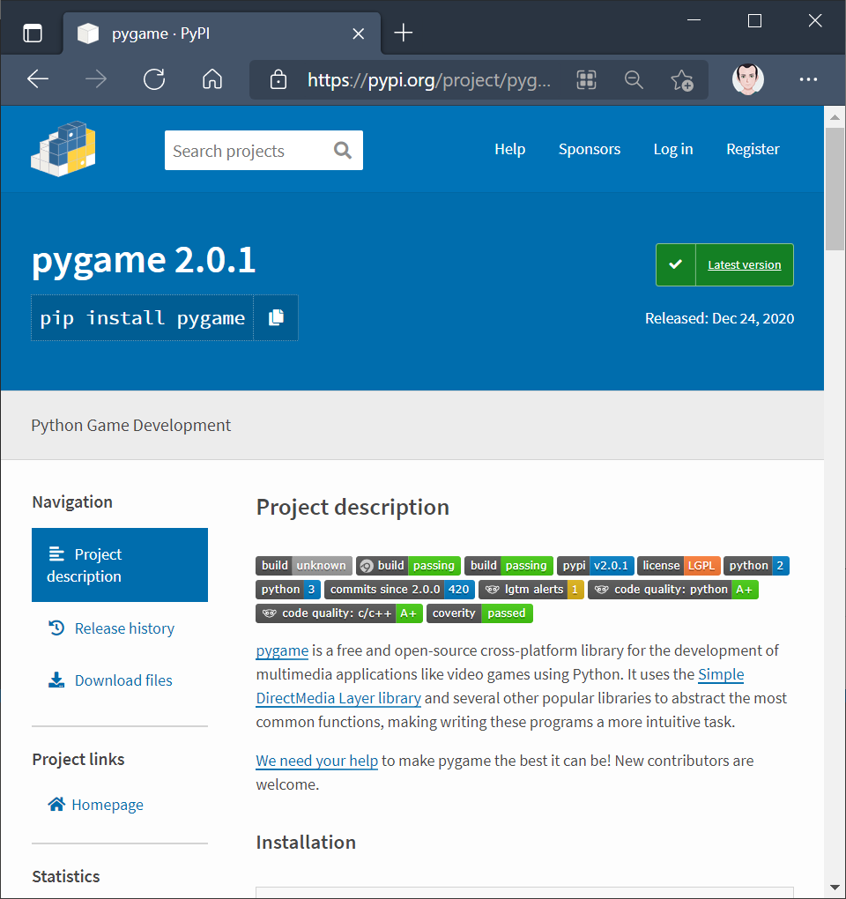
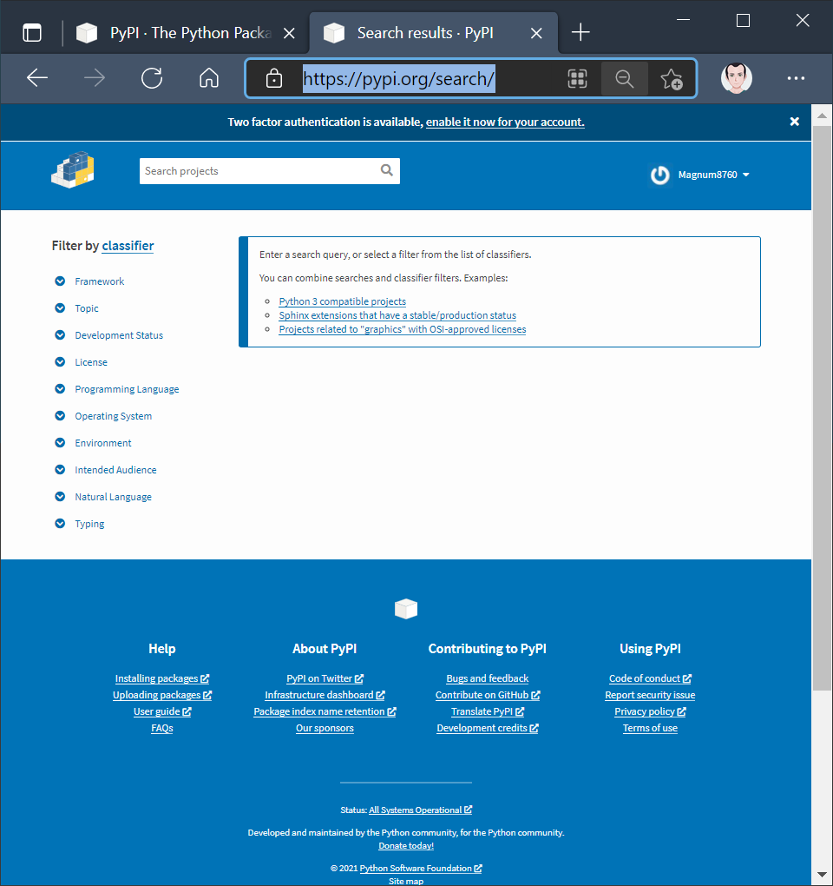
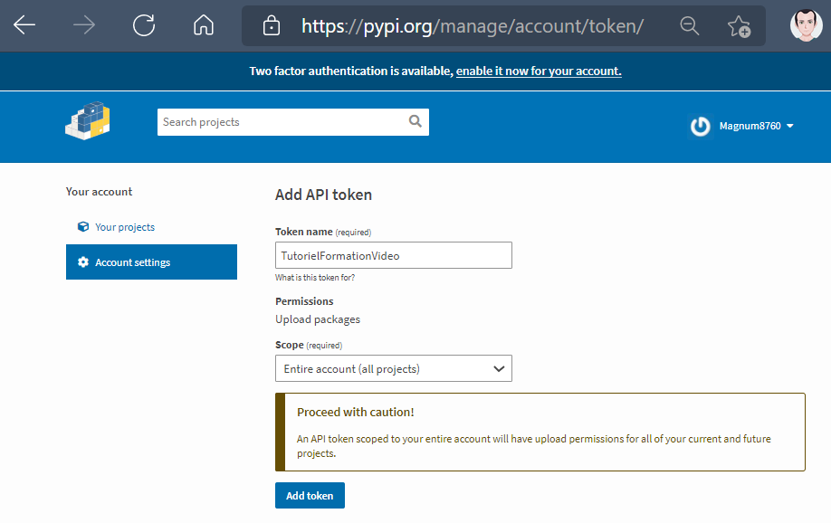
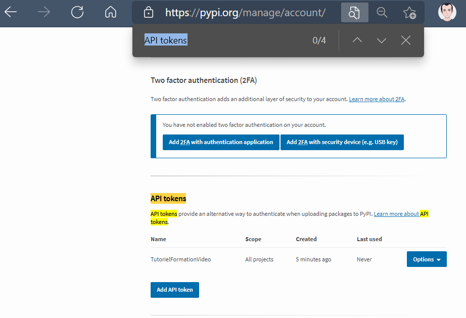
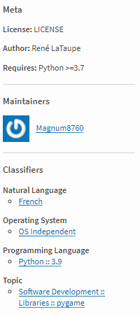

# [Distribuer un projet](https://www.youtube.com/watch?v=9Sy3AXavfJg)

Dans ce tutoriel en pâte nous allons voir ensemble comment distribuer un projet donc un projet que nous avons développé, et que l'on souhaite rendre disponible pour d'autres utilisateurs qui pourront s'en servir dans des projets de manière autonome, voire de pouvoir les intégrer dans un autre programme comme on peut avoir l'habitude de le faire.

On va regarder tout ça en détail et voir ça en 2 parties.

Il faut des prérequis c'est-à-dire qu au niveau du cours il faut avoir vu toute la partie modularité c'est à dire que on doit savoir ce qu'est un paquet voir ce qu'il y a un package c'est à dire un module, on doit être à l'aise avec tous ces concepts là qu'on a vu au niveau du cours et au niveau d'un tutoriel il faut avoir la vidéo sur l'installation des paquets via l'outil pip justement qui nous permet d'installer des paquets depuis un index, un ensemble de dépôt, qui va nous être nécessaire pour la suite de cette vidéo.

D'abord on va voir comment mettre en place notre projet et pour garder une certaine hiérarchie et ne pas trop se perdre, on va considérer que notre projet se trouve dans ce répertoire dans lequel on rassemble l'ensemble de nos paquets `main` et `other`.

```txt
c.
|_ src
    |_ main
    |   |_ launch.py
    |_ other
        |_ main.py
```

launch.py permet de créer une fenêtre avec pygame, cette bibliothèque une dépendance externe et dans other, un module test qui contient une simple fonction.

+ launch.py
```py
import pygame

pygame.init()
screen = pygame.display.set_mode((650, 300))
pygame.display.set_caption("Kali-T 1.0")

pygame.draw.rect(screen, (255, 128, 128), [25,500,10,5], 0)

launch = True
while launched:
    for event in pygame.event.get():
        if event.type == pygame.QUIT:
            launched = False
    
    screen.fill((0, 0, 0))
    pygame.draw.line(screen, (120, 100, 225), [25, 25], [480, 260], 5)
    pygame.draw.line(screen, (120, 100, 225), [73, 200], [425, 50], 3)
    pygame.draw.line(screen, (120, 100, 225), [15, 15], [500, 15], 1)
    pygame.display.update()
```
+ main.py
```py
def hello_world():
        print("Hello World !")
```

Voilà en arrivé ici au niveau de notre répertoire src et on va construire tout un tas d'outils, donc certains outils vont être installés avec l'outil pip si jamais ce n'est pas le cas. On a besoin de `build`, de `setuptools` qui normalement est installé durant la procédure de l'installation de build mais on peut toujours l'installer aussi et on a également `wheel` qui va être utilisé. Ensuite on a `twine` qui peut être également utilisé mais pourquoi ? Tout simplement parce que vous allez voir dans une certaine partie on va voir comment mettre en ligne le projet que l'on aura préparé, empacter pour pouvoir justement le rendre disponible au public parce que c'est l'intérêt encore une fois de pouvoir distribuer celui-ci.

On peut également le distribuer à titre personnel c'est à dire via une archive on peut l'envoyer à quelqu'un mais on peut également le mettre sur internet si on en a besoin pour pouvoir le distribuer à une plus large échelle.

Alors nous pouvons avoir besoin d'autres choses par exemple on a des tests unitaires dont on a fait un tutoriel précédemment généralement ces tests on peut les mettre à part parce qu'on le mélange pas avec le dossier src, le code du projet donc on fait un répertoire de tests.

```txt
c.
|_ src
|   |_ main
|   |   |_ launch.py
|   |_ other
|       |_ main.py
|_ tests
```

Voilà nous n'allons pas faire de test.

## Fichier de construction

Ensuite nous allons avoir besoin de documents qui vont nous permettre d'empacter tout simplement de construire l'ensemble, voilà ce que nous allons faire s'appelle également un paquet mais c'est un méta paquet donc un paquet qui peut contenir tout un tas d'autres paquets notamment au niveau de notre projet dans le dossier src donc pour cela on va créer un fichier de projet qu'est un fichier texte qui possède une extension particulière que l'on va nommer *pyproject.toml*

```txt
c.
|_ src
|   |_ main
|   |   |_ launch.py
|   |_ other
|       |_ main.py
|_ tests
|_ pyproject.toml
```

Dans ce fichier .tomel on va fournir toutes les informations utiles un autre paquet build qui va permettre la construction pour pouvoir obtenir ensuite l'empaquetage de tout notre projet. On a d'abord une directive [build-system] qui va prendre certaines informations et notamment certaines informations normalement quelques dépendances qu'il va prendre sous forme de liste qui vont nous servir c'est-à-dire "setuptools" et "wheel" qui vont nous servir pour la construction de notre paquet final.

+ pyproject.toml
```tomel
[build-system]
requires = ["setuptools", "wheel"]
```

Ensuite on rajoute une petite ligne qui va nous permettre d'utiliser les bons outils ce qui n'est pas forcément obligatoire mais c'est toujours mieux de le rajouter `build-backend = "setuptools.build_meta"`pour utiliser l'outil de construction (setuptools) Qui est un outil d'installation pour avoir notre paquet et à la fin on aura une archive dont on pourra faire quelque chose souhaite la distribuer à quelqu'un soit à la mettre en ligne et on va voir tout ça.

+ pyproject.toml
```tomel
[build-system]
requires = ["setuptools", "wheel"]
build-backend = "setuptools.build_meta"
```

Ce fichier est prêt pour la construction.

## Fichier de configuration

Maintenant il nous faut afficher pour la configuration c'est à dire que au moment de la construction de la création nous allons besoin d'avoir tout un tas d'informations donc là les informations que l'on va indiquer vont dépendre du projet en question et de ce qu'on compte en faire par la suite alors on ne va pas toutes les voir parce qu'il y en a énormément suivant nos cas spécifiques.

Alors on va créer un fichier avec une configuration dynamique c'est à dire que la configuration peut avoir un comportement différent selon la configuration de la personne qui va utiliser notre paquet alors qu'une configuration statique va rester telle quelle par exemple la version de python qu'il a, l'environnement virtuel qui a été configuré et cetera et cetera mais pour simplifier la vidéo nous allons décider d'aborder seulement la configuration statique.

La configuration statique ne va pas se faire sous le format .ini (la configuration de Microsoft) mais qui aura une autre extension et si on passe par un fichier python, ce sera du code en python donc tout ce que nous savons au niveau de la syntaxe de python.

Soit on fait un fichier dynamique qui sera *setup.py* soit on fait un fichier statique qui sera *setup.cfg* quand utilisera pour cette vidéo pour un fichier de config.

```txt
c.
|_ src
|   |_ main
|   |   |_ launch.py
|   |_ other
|       |_ main.py
|_ tests
|_ pyproject.toml
|_ setup.cfg
```

Voilà pour le fichier de configuration encore une fois c'est un c'est simple on n'a pas besoin de l'écrire en python avec des listes, des crochets, des dictionnaires et cetera et donc du coup ça va pas mal simplifier la syntaxe qu'on va avoir.

Alors ici on va utiliser la syntaxe d'un fichier .ini, ce qui n'a rien à voir avec du python ou autre c'est un format de données comme on a .json, le .xml, le .yaml, et cetera donc c'est propre à cela et si vous ne savez pas ce qu'est un fichier .ini, on a déjà abordé d'autres fichiers comme ça dans d'autres formations où je pense à MySQL, PHP où on a croisé ce genre de fichier de configuration donc on peut toujours aller voir soit sur ces vidéos, soit sur internet, regardez ce qu'est un fichier .ini et comment c'est écrit.

### Les métadonnées [metadata]

On a d'abord une première partie pour `[metadata]` qui sont simplement les métadonnées donc toutes les données qui vont nous servir à alimenter notre projet ici en information qui vont servir et la première qui va être cruciale c'est tout simplement d'abord le nom de notre projet `name = …` et ce nom par la suite va être très important aussi parce que si après on décide de le distribuer en ligne sur un site qui va regrouper tout un tas de paquets d'accord issu de tout un tas de développeurs dans le monde il faudra bien sûr posséder a un nom unique `name = MonNouveauProjetTest` donc on ne peut pas avoir un nom qui rentre en conflit avec un autre donc ici ce sera à nous de voir par la suite.

+ setup.cfg
```ini
[metadata]
name = MonNouveauProjetTest
```

Ensuite la version mais il faut choisir un certain formalisme, on ne peut pas choisir n'importe quel format donc il faut utiliser un format que python utilise donc généralement 3 parties *Majeur*, *Mineur* et le *numéro de maintenance* donc ça se décompose en 3 parties par exemple pour la version 1.0.0 on a :

+ setup.cfg
```ini
[metadata]
name = MonNouveauProjetTest
version = 1.0.0
```

On peut des fois utiliser certains suffixes `1.0.0dev` ou bien `1.0.0post` ou encore `1.0.0rc` pour Release Candidate ou bien `1.0.0a1` pour dire Alpha 1 ou `1.0.0b1` pour Beta 1 et cetera donc il y a un certain formalisme à suivre donc là pour le coup c'est lié à python.

Nous ici nous allons considérer que c'est une version majeure c'est à dire la *1.0.0* donc je vais garder ce système là.

Éventuellement on pourra préciser un fichier c'est à dire que si par exemple on veut préciser un fichier de version comme des fois on le fait dans beaucoup de projets d'autres langages de programmation, on peut le préciser en faisant comme ceci `version = attr:` et préciser ensuite le chemin vers notre fichier depuis notre répertoire initial.

+ setup.cfg
```ini
[metadata]
name = MonNouveauProjetTest
version = attr:...
```
```txt
c.
|_ src
|   |_ main
|   |   |_ launch.py
|   |_ other
|       |_ main.py
|_ VERSION.txt
```

Voilà généralement on retrouve ce type de fichier-là *VERSION.txt* tout écrit en majuscule avec une extension voir des fois pas d'extension du tout du coup on aurait quelque chose comme ça (par peur que le fichier ne soit pas considéré avec l'extension .txt, on va le mettre sans).

+ setup.cfg
```ini
[metadata]
name = MonNouveauProjetTest
version = attr: src.VERSION
```
```txt
c.
|_ src
|   |_ main
|   |   |_ launch.py
|   |_ other
|       |_ main.py
|_ VERSION
```

Voilà elle considère que le `.` est le séparateur et on ne garde pas l'extension à notre fichier de version *VERSION* si on ne veut pas l'indiquer donc ça c'est pour une configuration possible mais nous on va garder notre configuration de base avec la version *1.0.0* mais on peut le mettre aussi comme ça *0.0.1*.

+ setup.cfg
```ini
[metadata]
name = MonNouveauProjetTest
version = 1.0.0
```

Peu importe ça c'est vraiment le strict minimum, on met le nom du paquet, sa version. On peut également rajouter l'auteur, un e-mail, une description

+ setup.cfg
```ini
[metadata]
name = MonNouveauProjetTest
version = 1.0.0
author = René LaTaupe
author_email = MonEmail@mail.com
description = Un projet inutile
```
En cas de longue description on va plutôt le faire dans le fichier README (lisez-moi!) et lorsque vous passez par une plateforme de dépôt par exemple github où on gère les versions de notre projet avec git donc on travaille généralement avec du Markdown .md et dans ce cas-là on va plutôt faire `long_description = file: README.md` dans lequel on utilise la directive file et comme ce n'est pas pris en charge par défaut va préciser le type de fichier `long_description_content_type = text/markdown`

+ setup.cfg
```ini
[metadata]
name = MonNouveauProjetTest
version = 1.0.0
author = René LaTaupe
author_email = MonEmail@mail.com
description = Un projet inutile
long_description = file: README.md
long_description_content_type = text/markdown
```
```txt
c.
|_ src
|   |_ main
|   |   |_ launch.py
|   |_ other
|       |_ main.py
|_ README.md
```

Voilà `text/markdown` et le type mine du format markdown si bien sûr votre fichier README est en Markdown sinon s'il est en simple texte .txt nous n'aurons pas besoin de préciser cette ligne là `long_description_content_type = text/markdown`.

+ README.md
```md
# Lisez-moi

Le ichier d'aide...
```

Voilà ça peut être un fichier d'aide qui explique les procédures d'installation, d'utilisation mais ça vous connaissez si vous savez à quoi ça fait référence ce type de fichier là.

Si on doit préciser la licence de notre projet ça se fait également dans ce fichier et soit on a des directement sous forme de chaîne, soit on passe par un fichier de licence donc généralement on va écrire ceci `license = LICENSE`.

+ setup.cfg
```ini
[metadata]
name = MonNouveauProjetTest
version = 1.0.0
author = René LaTaupe
author_email = MonEmail@mail.com
description = Un projet inutile
long_description = file: README.md
long_description_content_type = text/markdown
license = LICENSE
```
```txt
c.
|_ src
|   |_ main
|   |   |_ launch.py
|   |_ other
|       |_ main.py
|_ tests
|_ pyproject.toml
|_ setup.cfg
|_ README.md
|_ LICENSE
```

Voilà on a un fichier LICENSE et dedans on a un fichier texte tout simplement dans lequel on aura la description de la licence sous laquelle vous appliquez à votre projet par exemple la licence GPL, MIT, pas de license, dans le domaine public et cetera.

On peut avoir également une directive `project_urls` Et après en fonction va pouvoir préciser par exemple les rapports de bug qui vont se faire à un certain endroit en précisant l'url. On peut préciser une page de donation, une page pour la documentation si on a un wiki et ça se met toujours par ligne.

+ setup.cfg
```ini
[metadata]
name = MonNouveauProjetTest
version = 1.0.0
author = René LaTaupe
author_email = MonEmail@mail.com
description = Un projet inutile
long_description = file: README.md
long_description_content_type = text/markdown
license = LICENSE
project_urls =
    Rapport de bugs
```

C'est toujours pareil vous allez avoir une information `info` puis ensuite vous allez avoir une url `https://…` puis vous en aurez d'autres et cetera. Puis ensuite si vous avez un système pour le suivi de bug vous aurez un bug tracker auquel vous allez également préciser l'url

```ini
project_urls =
    info https://
    info2 https://
    Bug Tracker https://
```

Par contre au niveau de l'url on peut également ajouter le url du projet à cet endroit `url = …`

+ setup.cfg
```ini
[metadata]
name = MonNouveauProjetTest
version = 1.0.0
author = René LaTaupe
author_email = MonEmail@mail.com
description = Un projet inutile
long_description = file: README.md
long_description_content_type = text/markdown
license = LICENSE
url = 
```

On peut ensuite ajouter le url du paquet en utilisant `download_url = `.

+ setup.cfg
```ini
[metadata]
name = MonNouveauProjetTest
version = 1.0.0
author = René LaTaupe
author_email = MonEmail@mail.com
description = Un projet inutile
long_description = file: README.md
long_description_content_type = text/markdown
license = LICENSE
dowload_url = 
```

Voilà il y a plein de directives et elles ne sont pas forcément toutes utiles mais encore une fois si vous avez besoin de savoir tout le détail des directives pour les métadonnées, vous pourrez aller voir encore une fois dans les documentations officielles et là ce sera notamment pour `setuptools`, cet outil là qui permet d'utiliser tout ça et dans la documentation vous retrouvera descriptif de tout ça avec des choses qui vont vous servir et d'autres qui vont servir absolument pas du tout.

On a également pour les plateformes si on veut restreindre l'utilisation à certains systèmes d'exploitations éventuellement précisant la version par exemple de python minimal à utiliser et cetera par exemple.

Alors on a également les classifications et pour ça on va utiliser des classifieurs `classifiers = ` alors on peut en avoir un `One` et puis un autre `Two` et cetera.

+ setup.cfg
```ini
[metadata]
name = MonNouveauProjetTest
version = 1.0.0
author = René LaTaupe
author_email = MonEmail@mail.com
description = Un projet inutile
long_description = file: README.md
long_description_content_type = text/markdown
license = LICENSE
classifiers =
    One
    Two
    Etc.
```

Alors on appelle ça l'index c'est à dire la liste qui propose et qui permet de distribuer des paquets python et on va regarder un petit peu parce que ça concerne directement le site en question des différents classificateurs et on va aller voir un petit peu en détails pour savoir vous les trouvez parce que ça on ne peut pas les deviner donc ça dépend pas de nous ou de la doc mais ça dépend du site sur lequel seront hébergés tous les paquets donc ça c'est intéressant de le voir.

On vera ça après.

## Les options [options]

Voilà nous passons à une autre catégorie qui sont les options donc là il y a des choses qui vont servir et d'autres pas forcément par exemple si vous avez besoin du répertoire d'un package vous pouvez le préciser et vous pouvez même en avoir plusieurs. Si vous regardez notre projet, nous avons tout mis dans `src` tout dépend de notre configuration ainsi vous pourriez indiquer d'autres choses donc comme nous on a que `src` on a donc ceci puis un autre répertoire `other` et cetera.

+ setup.cfg
```ini
[metadata]
name = MonNouveauProjetTest
version = 1.0.0
author = René LaTaupe
author_email = MonEmail@mail.com
description = Un projet inutile
long_description = file: README.md
long_description_content_type = text/markdown
license = LICENSE
classifiers =
    One
    Two
    Etc.

[options]
package_dir =
    = src
    = orther
```

Ensuite on peut mettre la version python qui est utilisée `python_requires = …` je peux indiquer que mon projet doit fonctionner avec la 3.7 (comment on est en mars 2021) donc 3.7 ou supérieur.

+ setup.cfg
```ini
[metadata]
name = MonNouveauProjetTest
version = 1.0.0
author = René LaTaupe
author_email = MonEmail@mail.com
description = Un projet inutile
long_description = file: README.md
long_description_content_type = text/markdown
license = LICENSE
classifiers =
    One
    Two
    Etc.

[options]
package_dir =
    = src
python_requires= >= 3.7
```

Par exemple si dans votre code vous avez de la syntaxe qui n'est pas disponible sous une certaine version, utiliser cette directive-là qui va servir. Par exemple si vous utilisez `fstring` sachant qu'ils sont arrivés à partir d'une certaine version c'est-à-dire de python 3.6 et bien indiquez la version 3. 6 minimum.

Après on a des options pour la recherche de différents paquets c'est à dire comme on a déjà précisé le répertoire avec `package_dir` alors on peut également exclure des paquets mais c'est pour des configurations assez particulières donc ici ça ne risque pas de nous concerner et comme il y a énormément de choses on ne peut pas toutes les énumérer.

Alors ceux qui ont vu la vidéo sur l'outil pip, vous savez que c'est un outil qui permet de télécharger des paquets depuis ce site.

https://test.pypi.org/
https://pypi.org/

D'ailleurs contournât aborder le chapitre sur Pygame au niveau du cours, on a installé l'outil Pygame parce que ça ne fait pas partie de python de manière native donc le récupère depuis le site donc on a dû faire une commande de ce style `pip install pygame` mais on peut également passer par la commande pour exécuter pip `python -m pip install pygame`. Alors ce paquet pygame et récupérer depuis le Python Package Index qui a justement cette plateforme de dépôt de paquets python donc si je cherche Pygame je vais le retrouver.

https://pypi.org/project/pygame/
https://pypi.org/project/pygame/#description
https://pypi.org/project/pygame/#history
https://pypi.org/project/pygame/#files


Voilà on peut voir la version actuelle de pygame et y trouver plusieurs informations comme la page principale du projet, les auteurs, les mainteneurs bref toutes les informations qui ont été renseignés dans un fichier de configuration du paquet.

Ainsi c'est grâce à toutes ces informations dans notre fichier setup.cfg qu'on peut alimenter toutes ces informations qu'on pourra ensuite héberger donc ça dépend finalement de l'utilité de vos besoins parce qu'en fonction des informations que vous allez renseigner, on en aurait pas toujours besoin alors que peut être vous voulez peut être juste distribuer le paquet pour quelques proches ou pour vous-même doigts par exemple vous n'aurez pas besoin d'un README.md à renseigner et vous n'aurez pas besoin de le mettre donc ça je ne peux pas vous dire ce qu'il faut mettre et permettre ça dépend vraiment de votre configuration et du contexte.

Alors ce projet pypi.org se distingue par 2 sites, donc 2 serveurs, 2 parties différentes donc vous allez à la voir la partie principale dans lequel on retrouve les vrais projets https://pypi.org/ d'accord ce sont les projets qui ont été distribués ainsi on peut installer des paquets depuis ce site là et à la fin de cette vidéo vous serez comment mettre en ligne c'est-à-dire que vous allez avoir votre compte et vous pourrez virer vos différents projets.

On a ensuite https://test.pypi.org/ qui comme son nom l'indique est simplement la plateforme pour des tests c'est à dire qu'ici vous allez pouvoir aussi mettre des paquets en ligne et ce sont des paquets qui sont prévus pour des tests c'est à dire qu'ils ne vont pas rester continuellement c'est-à-dire qu'ils seront à certains intervalles supprimés donc c'est vraiment fait pour que vous puissiez tester vos projets. Ainsi vous le mettez en ligne sur cette version, sur cette instance-là et une fois que vous voyez que tout marche bien et que vous arrivez à le télécharger, que ça fonctionne, vous pouvez le faire de manière définitive sur cette branche https://pypi.org/ qui est la branche définitive, la branche qui a utilisé tout le temps et donc une fois que c'est sur cette branche là ça y reste.

C'est important de bien distinguer les deux et vous voyez que la seule différence qu'il y a au niveau de l'adresse c'est qu'on a un test. avant.

https://test.pypi.org/
https://pypi.org/

Voilà on a un sous-domaine généralement le site nous l'indique pour qu'on puisse faire la différence entre les 2.

## Créer un compte

Alors à ce niveau-là nous allons créer un compte classique avec un nom d'utilisateur et une adresse mail, mot de passe et cetera une fois que vous avez un compte vous allez pouvoir héberger sur ce site-là vos différents projets.

## Les Classificateurs

Alors les informations dans `classifiers` ça va permettre de classifier, de répertorier notre projet au bon endroit par exemple moi je sais que là le projet tel que je l'ai fait au niveau du code et bien j'utilise pygame d'accord et j'utilisais aussi une certaine version de python bref pas mal d'informations et du coup il faut savoir que c'est un index *pypi* qui a quand même son intérêt forcément ces paquets ne sont pas rangés n'importe comment où tous ensemble au même endroit, on retrouve ainsi ici sur la gauche des classificateurs.

https://pypi.org/search/



Voilà pour le classificateur *Framework, Topic, Development Statut, License, Programmating Language, …* voilà le langage de programmation parce qu'évidemment il n'y a pas que du python il peut y avoir ainsi des Wrapper c'est à dire des sur couche d'abstraction écrit en python qui en fait travaille avec des bibliothèques, des outils qui ont été écrits dans d'autres langages. Puis on a encore d'autres classificateurs comme le système d'exploitation *Operating System*, l'environnement *Environment* et cetera.

Toutes ces informations là sont les classificateurs et via ce lien peut tous les retrouver.

https://pypi.org/classifiers/


Par exemple si j'ai pygame (ctrl+F et pygame), voilà je vois que ` Topic :: Software Development :: Libraries :: pygame` est un classificateur que je peux copier et l'indiquer directement dans mon fichier de configuration.

+ setup.cfg
```ini
[metadata]
name = MonNouveauProjetTest
version = 1.0.0
author = René LaTaupe
author_email = MonEmail@mail.com
description = Un projet inutile
long_description = file: README.md
long_description_content_type = text/markdown
license = LICENSE
classifiers =
    Topic :: Software Development :: Libraries :: pygame

[options]
package_dir =
    = src
python_requires= >= 3.7
```

Même chose si par exemple on fait un projet avec Django.

+ setup.cfg
```ini
[metadata]
name = MonNouveauProjetTest
version = 1.0.0
author = René LaTaupe
author_email = MonEmail@mail.com
description = Un projet inutile
long_description = file: README.md
long_description_content_type = text/markdown
license = LICENSE
classifiers =
    Topic :: Software Development :: Libraries :: pygame
    Framework :: Django

[options]
package_dir =
    = src
python_requires= >= 3.7
```

Voilà ça va permettre aux gens de le trouver au bon endroit par exemple si un jour quelqu'un cherche un projet qui a été créé avec le Framework Django, en cherchant dans la catégorie ils trouveront le paquet puisque ça concerne cela.

C'est un système de mots-clés, qui va permettre de bien classer, bien rangé, bien organiser notre projet au bon endroit en suivant un certain format qui appartient à l'index via ce lien.

https://pypi.org/classifiers/

Voilà ainsi les classificateurs peuvent changer par exemple pour John Go on peut même jusqu à préciser la version :
```ini
Framework :: Django   Copy
Framework :: Django :: 1.4
Framework :: Django :: 1.5
Framework :: Django :: 1.6
Framework :: Django :: 1.7
...
```
Voilà il y a plein de notations différentes on peut également mettre en avant que notre programme est un freeware en mettant cette version là `License::Freeware` voilà on peut retrouver tout un tas d'informations donc c'est vraiment assez précis.
```ini
License :: Freeware
```
Pareil pour la langue de notre projet :
```ini
Natural Language :: Dutch
Natural Language :: English
Natural Language :: Esperanto
Natural Language :: Finnish
Natural Language :: French
Natural Language :: Galician
Natural Language :: German
...
```

Voilà comme nous on a un projet en français pouvant faire ça `Natural Language :: French`.

+ setup.cfg
```ini
[metadata]
name = MonNouveauProjetTest
version = 1.0.0
author = René LaTaupe
author_email = MonEmail@mail.com
description = Un projet inutile
long_description = file: README.md
long_description_content_type = text/markdown
license = LICENSE
classifiers =
    Topic :: Software Development :: Libraries :: pygame
    Natural Language :: French

[options]
package_dir =
    = src
python_requires= >= 3.7
```

Vraiment toutes les informations qu'on juge utile, si par exemple on est sur tous les systèmes d'exploitation on mettra celui-là `Operating System :: OS Independent`.

+ setup.cfg
```ini
[metadata]
name = MonNouveauProjetTest
version = 1.0.0
author = René LaTaupe
author_email = MonEmail@mail.com
description = Un projet inutile
long_description = file: README.md
long_description_content_type = text/markdown
license = LICENSE
classifiers =
    Topic :: Software Development :: Libraries :: pygame
    Natural Language :: French
    Operating System :: OS Independent

[options]
package_dir =
    = src
python_requires= >= 3.7
```

Par exemple il a été créé avec Python 3.9 `Programming Language :: Python :: 3.9`.

+ setup.cfg
```ini
[metadata]
name = MonNouveauProjetTest
version = 1.0.0
author = René LaTaupe
author_email = MonEmail@mail.com
description = Un projet inutile
long_description = file: README.md
long_description_content_type = text/markdown
license = LICENSE
classifiers =
    Topic :: Software Development :: Libraries :: pygame
    Natural Language :: French
    Operating System :: OS Independent
    Programming Language :: Python :: 3.9

[options]
package_dir =
    = src
python_requires= >= 3.7
```

Voilà on est prêt.

## Enfin prêt

```txt
c.
|_ src
|   |_ main
|   |   |_ launch.py
|   |_ other
|       |_ main.py
|_ tests
|_ pyproject.toml
|_ setup.cfg
|_ README.md
|_ LICENSE
```
Nous avons tout un tas de fichiers avec notamment le fichier très important *pyproject.toml* qui va servir pour la construction ainsi que le fichier de configuration *setup.cfg* comme vous le savez va servir pour toutes les informations lié au projet.

+ pyproject.toml
```tomel
[build-system]
requires = ["setuptools", "wheel"]
build-backend = "setuptools.build_meta"
```
+ setup.cfg
```ini
[metadata]
name = MonNouveauProjetTest
version = 1.0.0
author = René LaTaupe
author_email = MonEmail@mail.com
description = Un projet inutile
long_description = file: README.md
long_description_content_type = text/markdown
license = LICENSE
classifiers =
    Topic :: Software Development :: Libraries :: pygame
    Natural Language :: French
    Operating System :: OS Independent
    Programming Language :: Python :: 3.9

[options]
package_dir =
    = src
python_requires= >= 3.7
```

Alors on aurait pu développer un peu plus des information liées à la licence mais bref.

Alors maintenant à ce niveau là on va pouvoir le mettre en ligne mais évidemment on ne met pas un fichier en ligne sur une plateforme n'importe comment, il faut avoir un niveau d'accès c'est-à-dire les autorisations pour ça.


Alors nous allons devoir créer un token ici `Add API token`



Alors on va devoir ajouter le nom du token et c'est suffisamment explicite ce que l'on nous demande, la permission qui va vous être accordée c'est de pouvoir mettre en ligne des paquets `uplaud packages` et le Scope c'est la portée pour dire qu'il va concerner le compte entier, tous les projets (All projects) mais de toute façon on n'a pas trop le choix ici donc on fait ça.

Et on va ensuite ajouter token `Add token`.

:warning: Attention le token n'est pas partagé publiquement sinon n'importe qui va pouvoir publier sur votre compte des paquets c'est pour ça que c'est une information confidentielle.

On obtient ici un jeton qui va commencer ici avec un préfixe `pypi-…` avec un tiret et ensuite un très long code qui est tout simplement le token qu'il faut avoir alors une fois que vous l'avez, vous le copier quelque part.
```txt
pypi-aTghYjukLop...
```
On quitte et on reviens sur le compte.



Voilà notre token est prêt et ça il faut regarder parce que ça va nous servir, alors on va depuis un outil de python qui est notre outil `twine` qui va nous permettre la mise en ligne de notre paquet et bien sûr le mettre en ligne sur la version test de PyPI d'accord comme ça je ne vais pas le faire sur ma vraie version mais je vais le mettre sur la version test et le paquet sera supprimé de la version test parce qu'il est fait pour ça mais ça n'empêchera pas de tout tester voir ça fonctionne et je vous dirais éventuellement les petits changements qu'il y a à faire pour le mettre en ligne sur votre vrai compte c'est-à-dire l'instance principale, la vraie instance de l'index pour que ce soit distribué et disponible pour tout le monde mais on va d'abord vérifier que l'outil est bien installé et ensuite on vérifie l'installation de `build`

```powershell
>pip install twine
```
```powershell
>pip install build
```
Bien sûr à un moment donné si vous voyez qu'il manque un paquet vous l'installer tout simplement mais on va faire un `pip list` pour voir.

```powershell
C:\Users\test>pip list
Package                   Version
------------------------- ---------
build                     0.5.1
setuptools                56.0.0
twine                     3.4.2
...
```

Alors il a installé pas mal d'autres choses mais voilà c'est bien installé.

Alors il y avait aussi `wheel` ne sera pas forcément utilisé ici pour la configuration que l'on fait mais voir peut être après avec la configuration que nous allons faire il en aura besoin et à ce moment-là il faudra l'installer comme on l'a indiqué dans *pyproject.toml* mais on devrait pas en avoir besoin et s'il le demande il y aura l'installation qui sera faite.

Alors si on regarde à nouveau notre fichier *setup.cfg*, on doit avoir tout mis même si si on met pas de mail parce que c'est vraiment pour le test alors au niveau du *README.md* c'est okay on a mis un petit texte vite fait on a bien précisé le type mine en `text/markdown` alors pour la licence nous avons rien mis c'est juste un fichier vide *LICENSE* même si on peut mettre un texte vite fait !

+ LICENSE
```txt
C'est GRA-TUIT !
```

Alors ne vous en faites pas voir ce qu'il faut noter, en fonction de la licence que vous avez vous avez des sites qui vous permettent de copier coller tout le texte des licences GPL et cetera et vous n'aurez plus qu'a copier coller tout le texte. Tout le reste est bon, on a également le répertoire pour le package (src) et finalement la version python donc tout est ok.

## La directive install_requires

Voilà pour la petite vérification il y a plein d'autres informations notamment si nous avons des dépendances alors pour les dépendances ça va être une direcive `install_requires`. Et on lui indique les différents paquets tels que pygame et cetera.

+ setup.cfg
```ini
[metadata]
name = MonNouveauProjetTest
version = 1.0.0
author = René LaTaupe
author_email = MonEmail@mail.com
description = Un projet inutile
long_description = file: README.md
long_description_content_type = text/markdown
license = LICENSE
classifiers =
    Topic :: Software Development :: Libraries :: pygame
    Natural Language :: French
    Operating System :: OS Independent
    Programming Language :: Python :: 3.9

[options]
package_dir =
    = src
python_requires= >= 3.7
install_requires =
    pygame
```

On peut facilement aller voir sur Google et recherché avec le mot-clé setuptools ainsi que la directive install_requires néanmoins il faut noter que quand on fait un fichier setup.py, on devra forcément écrire du code python donc là quand on fait une liste d'installation ce sera avec des crochets, par exemple :

https://packaging.python.org/discussions/install-requires-vs-requirements/
```py
install_requires=[
   'A',
   'B'
]
```

En .ini (ici .cfg), on n'a pas besoin d'écrire des crochets, ça fonctionne simplement avec des tabulations.

https://setuptools.readthedocs.io/en/latest/userguide/declarative_config.html

Par exemple,
```ini
[metadata]
name = my_package
version = attr: src.VERSION
description = My package description
long_description = file: README.rst, CHANGELOG.rst, LICENSE.rst
keywords = one, two
license = BSD 3-Clause License
classifiers =
    Framework :: Django
    License :: OSI Approved :: BSD License
    Programming Language :: Python :: 3
    Programming Language :: Python :: 3.5

[options]
zip_safe = False
include_package_data = True
packages = find:
scripts =
    bin/first.py
    bin/second.py
install_requires =
    requests
    importlib; python_version == "2.6"
```

Voilà on peut éventuellement vérifier directement dans Google si on a bien positionné les directives dans les bonnes parties `[options]` ou `[metadata]`.

Voilà ainsi on peut trouver plein d'options notamment si par exemple on veut pouvoir exclure certains paquets `exclure = …`.

```ini
[options.packages.find]
exclude =
    src.subpackage1
    src.subpackage2
```

Voilà pareil plein de directives et d'options dont on n'a pas vraiment parlé tel que pour la licence `license = BSD 3-Clause License`.

Voilà on n'avait pas dit mais sa suis en forme en particulier que python doit pouvoir reconnaître donc on peut faire tel que et si mais en général on va passer par un fichier de licence on a également d'autres types de fichiers tels que le `CHANGELOG.rst` et cetera.

## Construirele projet

Voilà nous allons pouvoir construire le projet à l'endroit où se trouve notre projet où il y a les fichiers .toml et le fichier .cfg

```txt
c.
|_ src
|   |_ main
|   |   |_ launch.py
|   |   |_ __init__.py
|   |_ other
|       |_ main.py
|       |_ __init__.py
|_ tests
|_ pyproject.toml
|_ setup.cfg
|_ README.md
|_ LICENSE
```
+ pyproject.toml
```tomel
[build-system]
requires = ["setuptools", "wheel"]
build-backend = "setuptools.build_meta"
```
+ setup.cfg
```ini
[metadata]
name = MonNouveauProjetTest
version = 1.0.0
author = René LaTaupe
description = Un projet inutile
long_description = file: README.md
long_description_content_type = text/markdown
license = LICENSE
classifiers =
    Topic :: Software Development :: Libraries :: pygame
    Natural Language :: French
    Operating System :: OS Independent
    Programming Language :: Python :: 3.9

[options]
package_dir =
    = src
python_requires= >= 3.7
install_requires =
    pygame
```
+ README.md
```md
# Lisez-moi

Le ichier d'aide...
```
+ LICENSE
```

```

On y va pour la construction.

```powershell
python -m build
```

```powershell
.\demo_distribution> python -m build
Found existing installation: setuptools 56.0.0
Uninstalling setuptools-56.0.0:
  Successfully uninstalled setuptools-56.0.0
Collecting setuptools
  Using cached setuptools-57.4.0-py3-none-any.whl (819 kB)
Collecting wheel
  Using cached wheel-0.36.2-py2.py3-none-any.whl (35 kB)
Installing collected packages: wheel, setuptools
Successfully installed setuptools-57.4.0 wheel-0.36.2
WARNING: You are using pip version 21.1.3; however, version 21.2.1 is available.
You should consider upgrading via the 'C:\Users\test\AppData\Local\Temp\build-env-5mq92th5\Scripts\python.exe -m pip install --upgrade pip' command.
running egg_info
creating src\MonNouveauProjetTest.egg-info
writing src\MonNouveauProjetTest.egg-info\PKG-INFO
writing dependency_links to src\MonNouveauProjetTest.egg-info\dependency_links.txt
writing requirements to src\MonNouveauProjetTest.egg-info\requires.txt
writing top-level names to src\MonNouveauProjetTest.egg-info\top_level.txt
writing manifest file 'src\MonNouveauProjetTest.egg-info\SOURCES.txt'
reading manifest file 'src\MonNouveauProjetTest.egg-info\SOURCES.txt'
adding license file 'LICENSE'
writing manifest file 'src\MonNouveauProjetTest.egg-info\SOURCES.txt'
running sdist
running egg_info
writing src\MonNouveauProjetTest.egg-info\PKG-INFO
writing dependency_links to src\MonNouveauProjetTest.egg-info\dependency_links.txt
writing requirements to src\MonNouveauProjetTest.egg-info\requires.txt
writing top-level names to src\MonNouveauProjetTest.egg-info\top_level.txt
reading manifest file 'src\MonNouveauProjetTest.egg-info\SOURCES.txt'
adding license file 'LICENSE'
writing manifest file 'src\MonNouveauProjetTest.egg-info\SOURCES.txt'
running check
warning: check: missing required meta-data: url

warning: check: missing meta-data: if 'author' supplied, 'author_email' should be supplied too

creating MonNouveauProjetTest-1.0.0
creating MonNouveauProjetTest-1.0.0\src
creating MonNouveauProjetTest-1.0.0\src\MonNouveauProjetTest.egg-info
copying files to MonNouveauProjetTest-1.0.0...
copying LICENSE -> MonNouveauProjetTest-1.0.0
copying README.md -> MonNouveauProjetTest-1.0.0
copying pyproject.toml -> MonNouveauProjetTest-1.0.0
copying setup.cfg -> MonNouveauProjetTest-1.0.0
copying src\MonNouveauProjetTest.egg-info\PKG-INFO -> MonNouveauProjetTest-1.0.0\src\MonNouveauProjetTest.egg-info
copying src\MonNouveauProjetTest.egg-info\SOURCES.txt -> MonNouveauProjetTest-1.0.0\src\MonNouveauProjetTest.egg-info
copying src\MonNouveauProjetTest.egg-info\dependency_links.txt -> MonNouveauProjetTest-1.0.0\src\MonNouveauProjetTest.egg-info
copying src\MonNouveauProjetTest.egg-info\requires.txt -> MonNouveauProjetTest-1.0.0\src\MonNouveauProjetTest.egg-info
copying src\MonNouveauProjetTest.egg-info\top_level.txt -> MonNouveauProjetTest-1.0.0\src\MonNouveauProjetTest.egg-info
Writing MonNouveauProjetTest-1.0.0\setup.cfg
Creating tar archive
removing 'MonNouveauProjetTest-1.0.0' (and everything under it)
Found existing installation: setuptools 56.0.0
Uninstalling setuptools-56.0.0:
  Successfully uninstalled setuptools-56.0.0
Collecting setuptools
  Using cached setuptools-57.4.0-py3-none-any.whl (819 kB)
Collecting wheel
  Using cached wheel-0.36.2-py2.py3-none-any.whl (35 kB)
Installing collected packages: wheel, setuptools
Successfully installed setuptools-57.4.0 wheel-0.36.2
WARNING: You are using pip version 21.1.3; however, version 21.2.1 is available.
You should consider upgrading via the 'C:\Users\test\AppData\Local\Temp\build-env-5ioc1g1v\Scripts\python.exe -m pip install --upgrade pip' command.
running egg_info
writing src\MonNouveauProjetTest.egg-info\PKG-INFO
writing dependency_links to src\MonNouveauProjetTest.egg-info\dependency_links.txt
writing requirements to src\MonNouveauProjetTest.egg-info\requires.txt
writing top-level names to src\MonNouveauProjetTest.egg-info\top_level.txt
reading manifest file 'src\MonNouveauProjetTest.egg-info\SOURCES.txt'
adding license file 'LICENSE'
writing manifest file 'src\MonNouveauProjetTest.egg-info\SOURCES.txt'
Requirement already satisfied: wheel in c:\users\test\appdata\local\temp\build-env-5ioc1g1v\lib\site-packages (from -r C:\Users\test\AppData\Local\Temp\build-reqs-ycnd508z.txt (line 1)) (0.36.2)
WARNING: You are using pip version 21.1.3; however, version 21.2.1 is available.
You should consider upgrading via the 'C:\Users\test\AppData\Local\Temp\build-env-5ioc1g1v\Scripts\python.exe -m pip install --upgrade pip' command.
running bdist_wheel
running build
installing to build\bdist.win-amd64\wheel
_links.txt
_links.txt
writing requirements to src\MonNouveauProjetTest.egg-info\requires.txt
writing top-level names to src\MonNouveauProjetTest.egg-info\top_level.txt
reading manifest file 'src\MonNouveauProjetTest.egg-info\SOURCES.txt'
adding license file 'LICENSE'
writing manifest file 'src\MonNouveauProjetTest.egg-info\SOURCES.txt'
Copying src\MonNouveauProjetTest.egg-info to build\bdist.win-amd64\wheel\.\MonNouveauProjetTest-1.0.0-py3.9.egg-info      
running install_scripts
adding license file "LICENSE" (matched pattern "LICEN[CS]E*")
creating build\bdist.win-amd64\wheel\MonNouveauProjetTest-1.0.0.dist-info\WHEEL
creating 'C:\Users\test\OneDrive\Aide-mémoires\Python\tutos\demo_distribution\dist\tmp2r04tfv8\MonNouveauProjetTest-1.0.0-py3-none-any.whl' and adding 'build\bdist.win-amd64\wheel' to it
adding 'MonNouveauProjetTest-1.0.0.dist-info/LICENSE'
adding 'MonNouveauProjetTest-1.0.0.dist-info/METADATA'
adding 'MonNouveauProjetTest-1.0.0.dist-info/WHEEL'
adding 'MonNouveauProjetTest-1.0.0.dist-info/top_level.txt'
adding 'MonNouveauProjetTest-1.0.0.dist-info/RECORD'
removing build\bdist.win-amd64\wheel
```

*Nb. alors il faudrait l'auteur et l'e-mail mais ça n'empêche pas la construction du projet d'où l'avertissemen : `warning: check: missing meta-data: if 'author' supplied, 'author_email' should be supplied too`

Voilà les fichiers qui concernent le projet : dist > MonNouveauProjetTest-1.0.0.tar.gz

```txt
c.
|_ dist
|   |_ MonNouveauProjetTest-1.0.0.tar.gz
|   |_ MonNouveauProjetTest-1.0.0-py3-none-any.whl
|
|_ src
|   |_ main
|   |   |_ launch.py
|   |   |_ __init__.py
|   |_ other
|       |_ main.py
|       |_ __init__.py
|
|_ tests
|
|_ pyproject.toml
|_ setup.cfg
|_ README.md
|_ LICENSE
```

Voilà nous avons un fichier d'archive .tar.gz donc gzip et un fichier .whl alors pourquoi ces deux-là ? Tout simplement parce que l'outil d'installation des paquets va utiliser ce fichier *MonNouveauProjetTest-1.0.0-py3-none-any.whl* qui est utilisé sur les versions les plus récentes par contre comme vous savez comment fonctionne l'informatique, il peut y avoir la possibilité de ne pas utiliser ce format là pour des raisons de compatibilité donc dans le cas où ce fichier ne marcherait pas, il se rabattra directement sur l'archive gzip.

Ainsi pour que tout soit fonctionnel pour des raisons de compatibilité pour tout le monde généralement on va mettre en ligne les 2 versions c'est-à-dire l'archive et le fichier .whl

## Mise en ligne

Voilà nous allons pouvoir mettre les fichiers en ligne et nous allons utiliser `twine` qui va nous servir ici.

Alors je rappelle que si nous sommes sur la configuration de test et je veux que le projet arrive ici et non pas sur la version définitive :

https://test.pypi.org/manage/projects/

On verra comment modifier les commandes pour la version définitive mais on ne va pas le tester pour éviter de uploader n'importe quoi sur la version principale alors qu'il y a une instance d'un test.

On y va, le nom d'utilisateur `__token__` puis le mot de passe c'est le fameux jeton que l'on va récupérer del'API.

```powershell
python -m twine upload --repository testpypi dist/*
```
```powershell
> python -m twine upload --repository testpypi dist/*
Uploading distributions to https://test.pypi.org/legacy/
Enter your username: __token__
Enter your password: 
Uploading MonNouveauProjetTest-1.0.0-py3-none-any.whl
100%|█████████████████████████████████████████████████████████████████| 4.86k/4.86k [00:01<00:00, 3.40kB/s]
Uploading MonNouveauProjetTest-1.0.0.tar.gz
100%|█████████████████████████████████████████████████████████████████| 4.43k/4.43k [00:01<00:00, 3.70kB/s] 

View at:
https://test.pypi.org/project/MonNouveauProjetTest/1.0.0/
```

Voilà le projet ici [https://test.pypi.org/manage/projects/](https://test.pypi.org/manage/projects/) et je rappelle qu'on est sur la partie test c'est-à-dire que ce paquet ne sera pas resté et il sera supprimé dans quelques temps. Ensuite en cliquant sur *view*, on obtient la page du projet [https://test.pypi.org/project/MonNouveauProjetTest/](https://test.pypi.org/project/MonNouveauProjetTest/) et on retourne exactement sur le type de page qu'on avait tout à l'heure pour pygame.


Donc là on a que 2 fichiers : *MonNouveauProjetTest123487-1.0.0.tar.gz* et *MonNouveauProjetTest-1.0.0-py3-none-any.whl* qui sont de la version qui sont de la version temps parce qu'on n'a pas donné plus de précisions que ça.


Alors pour la licence nous n'avons pas précisé de lien nous avons juste mis un texte LICENSE mais nous aurions pu préciser un lien ou le nom de la licence. Idem pour l'auteur, la version qui est requis et cetera.



Alors on peut aussi avoir un auteur et un mainteneur c'est à dire qu'on peut dissocier les 2 et bien sûr on retrouve tous les classificateurs donc c'est vraiment très pratique.

## Récupération

pour la récupération il faut voir le tutoriel sur pip c'est à dire qu'on peut directement faire `pip install` et comme on passe par l'url il faudra récupérer tout le lien https.

```powershell
pip install -i https://test.pypi.org/simple/ MonNouveauProjetTest123487
```

On passe par l'url car on est obligé de passer par une instance de test.

Alors si jamais on veut récupérer notre projet mais seulement en local sans forcément être passé par test.pypi.org Eh bien nous avons ce fameux fichier .whl il suffit d'aller dans le répertoire et de l'installer.

```powershell
cd dist
pip install .\MonNouveauProjetTest123487-1.0.0-py3-none-any.whl
    Processing ...
    Successfully installed MonNouveauProjetTest123487-1.0.0
pip list
    Package                    Version
    -------------------------- ---------
    MonNouveauProjetTest123487 1.0.0
pip uninstall MonNouveauProjetTest123487
    Proceed (Y/n)? y
    Successfully uninstalled MonNouveauProjetTest123487-1.0.0
```

Voilà on l'a installé et on l'a désinstallé et si je veux l'installer/désinstaller depuis le dépôt je peux faire comme ceci.

```powershell
pip install -i https://test.pypi.org/simple/ MonNouveauProjetTest123487
pip uninstall MonNouveauProjetTest123487
```

Voilà c'est la même chose.

Maintenant vous savez comment empacter tout un projet, vous savez comment le mettre en ligne, vous savez bien sûr comment le réutiliser parce que c'est le but et du coup vous allez pouvoir le distribuer.

## Mise en ligne de la version définitive

Maintenant s'il y en a qui passent par la version définitive c'est à dire qu'une fois que vous avez fait vos tests et que vous voulez le proposer pour qu'il reste, sur internet et sur l'index principal, le vrai index c'est à dire celui qui est gardé avec les vrais projets et cetera vous allez devoir avoir un compte pour le vrai site *pipy.org* et le site de test *test.pipy.org*.

Voilà donc il faut un compte sur le site final pour les versions valides, il suffit de créer un jeton sur cette version là et à ce moment-là quand vous allez utiliser la commande pour comme était le projet vous n'aurez plus besoin de l'option `--repository` et donc vous allez avoir juste cette commande.

```powershell
python -m twine upload dist/*
```

Et à partir de ce moment-là il va vous demander le pseudo et le mot de passe qui sont tout simplement vos informations de connexion sur le site principal. Ce serra dans nos projets :

https://pypi.org/manage/project/

Voilà ce sera donc notre projet et les gens pourront distribuer depuis l'outil pip, installer en fait votre paquet en passant par ce site et le retrouver en fonction de la classification soit pour l'utiliser dans un autre projet soit pour l'utiliser tel quel si c'est un projet qui est autonome.

Voilà ça c'est la manière la plus courante parce que généralement on ne va pas empackter un projet python sous forme d'exécutable parce qu'on a ici avec un langage interprété où généralement il n'y a pas le problème de devoir cacher, protéger le code source donc si on veut faire ça on passe par un autre langage que python.

Ah c'est quand on va distribuer un programme en python, on passera par cet index.

Tout est dit.

A bientôt tout le monde