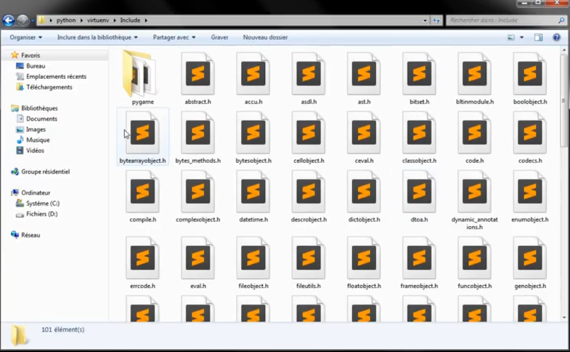

# [Environnements virtuels](https://www.youtube.com/watch?v=zW0yI3m7Ydg)

Enfin regarder des environnements spécifiques de travail avec installation d'environnement dit virtuel.

Ainsi il est possible que selon l'usage que vous avez de votre langage python selon les versions que vous voulez utiliser et les bibliothèques que vous voulez intégrer par la suite parce que vous pouvez installer des bibliothèques tierces en plus des modules natifs de python pour les utiliser dans vos programmes et il est possible que selon vos projets qu'on ait besoin de plusieurs versions différentes.

Le problème c'est qu'on ne peut pas installer en prenant l'exemple de pygame pour faire du jeu vidéo, qui est un peu l'équivalent de la SDL pour faire de la doter ainsi vous ne pourriez pas installer la version toute récente et une version antérieure parce qu'il y aurait évidemment des conflits entre les différentes versions du package et ça amènerait à pas mal d'erreurs.

Dans certains projets très spécifiques Oh par choix parce qu'on veut travailler sur des anciennes versions pour des raisons de compatibilité ou de fonctionnalités, on va avoir besoin des fois sur un même système d'avoir plusieurs versions différentes donc soit plusieurs versions différentes de python ainsi ça peut être au niveau de l'interpréteur par exemple pour certains personnes voudrais avoir la version 3 pour travailler sur différentes syntaxes mais aussi avoir la version 2.7 admettons pour avoir l'ancienne syntaxe pour certains logiciels parce que y a que celle-ci qui est prise en compte ou alors différentes versions des paquets, des modules comme des bibliothèques que vous installez par la suite c'est-à-dire des bibliothèques scientifiques, pour le web et cetera.

Du coup vous vous doutez bien que vous allez pas vous amuser à installer un système d'exploitation pour avoir à chaque fois une version de python que vous voulez pensez vous allez pouvoir faire la même chose sur un seul système d'exploitation en simulant ce qu'on appelle encore une fois des environnements virtuels donc chaque environnement virtuel disposera de la version de python que vous voulez la version de bibliothèque et de logiciel que vous voudrez intégrer à l'intérieur.

Voilà il y a 2 manières de faire, il y a la manière native d'accord qui est géré par python de base et on verra ensuite une manière supplémentaire par laquelle il faudra installer un certain nombre de petites choses mais qui fonctionnera pareil voilà le fonctionnement est identique.

La première solution c'est l'utilisation de *venv*, *venv* qui va directement être supportée en python.

On va créer un dossier et on va se placer avec un terminal dans ce dossier ainsi l'environnement virtuel sera un dossier c'est-à-dire que le moyen de le supprimer le plus rapidement c'est de supprimer le dossier et ça supprimera l'environnement virtuel donc c'est vraiment très pratique.

Imaginez quand pour créer une image virtualisé dans système talk dans VirtualBox, VMware et cetera c'est pareil que ça constitue un espèce de fichier qui constitue un espace disque ainsi il suffit de supprimer ce fichier pour supprimer l'OS virtualisé. Là c'est le même principe donc c'est très très simple après à la maintenance et à l'utilisation et vous pouvez le supprimer rapidement sans devoir taper plein de commande donc sans arriver dans les paramétrages très compliqué.

Alors on va aller dans un répertoire ici.

```txt
c.
|_ demo_env_virtuel
```
```powershell
cd .\Aide-mémoires\Python\tutos\demo_env_virtuel
```

Alors on va utiliser *venv* qui est installé par défaut dans python depuis python 3.3 et les versions supérieures.

Logiquement la formation commence sur la version 3.4 ou 3.5 et au moment de cette vidéo la version actuelle c'est la 3.6

Voilà ainsi à partir de la version 3.3 et supérieur, nous allons pouvoir utiliser un environnement virtuel avec l'outil *venv* et il va installer certains autres paquets à partir de python 3.4 et plus tel que *pip*, *setuptools* et cetera. Alors il y a un autre outil qui est fait pour les versions anciennes 2.6, 2.7 et cetera.

C'est important *venv* ne prends pas de version python inférieur à 3.3.

On va passer à la création de l'environnement. On fait ceci `python -m venv` suivi du chemin vers le dossier où on va placer l'environnement à cet endroit là on met juste le nom du dossier. On va regarder ce qu'il s'est passé. On peut en créer un deuxième.

```powershell
python -m venv envtest
python -m venv envtest2
```

On a créé 2 environnements isolés et distincts donc ce qui va se passer dans envtest ne va pas se répercuter dans envtest2.

Ici dans ce dossier en fait j'ai 3 environnements dont un par défaut et 2 environnements virtuels que je viens de générer.

On supprime un environnement virtuel tout simplement en cliquant à droite et en supprimant le dossier.

Ensuite on peut se rendre l'environnement de test et voir l'ensemble des fichiers.

```txt
c.
|_ demo_env_virtuel
    |_ Include
    |_ Lib
    |_ Scripts
    |_ pyvenv.cfg
```

Alors on a un fichier d'extension .cfg (pyvenv.cfg) c'est-à-dire un fichier de configuration.

```ini
home = C:\Users\test\AppData\Local\Programs\Python\Python39
include-system-site-packages = false
version = 3.9.6
```

Alors comme vous voyez là directement récupérer le chemin vers ma version de python et comme je vous avais dit qu'on était sur la version 3.6 (3.9) donc il a directement été la chercher plus d'autres options comme le numéro de version qu'on ne va pas toucher parce que c'est à gérer par défaut.

Si admettons vous voulez remplacer votre version de python ou bien qu'elle est installée dans d'autres endroits il suffit d'aller récupérer le lien dans l'explorateur de fichiers de l'autre version python et de changer le numéro de version.

Voilà vous pourriez changer la version utilisée de python dans cet environnement virtuel exclusivement.

Il faudra éviter de changer la version python sur la déjà des package existant pour avoir des problèmes d'incompatibilités.

Ensuite nous avons 3 dossiers,

```txt
c.
|_ demo_env_virtuel
    |_ Include
    |_ Lib
    |_ Scripts
    |_ pyvenv.cfg
```

Alors d'abord on a le dossier *Include* qui peut contenir les en-têtes de mon environnement et comme ici je n'en ai pas par défaut il n'y a rien dedans pour le moment.

On a le dossier *lib* pour librairy en anglais qui signifie bibliothèque en français, j'insiste bien parce qu'il y a des gens qui disent que c'est une librairie en français c'est un abus de langage. Ici par contre on a quelques petites choses par des faux c'est à dire nos bibliothèques et si j'installe des bibliothèques en particulier elles seront mises ici.

```txt
c.
|_ demo_env_virtuel
    |_ Include
    |_ Lib
    |   |_ site-packages
    |       |_ pip
    |       |_ pip-21.1.3.dist-info
    |       |_ pkg_resources
    |       |_ setuptools
    |       |_ setuptools-56.0.0.dist-info
    |       |_ _distutils_hack
    |       |_ distutils-precedence.pth
    |_ Scripts
    |_ pyvenv.cfg
```

Alors là nous avons des paquets par défaut par exemple on a l'outil *pip* et l'outil *setuptools* qui sont déjà disponibles par défaut, lancer plus tard on verra qu'on peut également installer des choses en plus sans problème sans venir modifier ce qu'il y a sur l'environnement du système par défaut.

Ensuite on a le dossier *Scripts* mais si vous êtes sur Linux vous aurez un dossier *bin*, c'est juste que le nom du dossier n'est pas le même mais c'est de là que tout va se jouer et si j'ouvre à l'intérieur vous verrez qu'on a plusieurs fichiers.

```txt
c.
|_ demo_env_virtuel
    |_ Include
    |_ Lib
    |   |_ site-packages
    |       |_ pip
    |       |_ pip-21.1.3.dist-info
    |       |_ pkg_resources
    |       |_ setuptools
    |       |_ setuptools-56.0.0.dist-info
    |       |_ _distutils_hack
    |       |_ distutils-precedence.pth
    |_ Scripts
    |   |_ activate
    |   |_ activate.bat
    |   |_ Activate.ps1
    |   |_ deactivate.bat
    |   |_ pip.exe
    |   |_ pip3.9.exe
    |   |_ pip3.exe
    |   |_ python.exe
    |   |_ pythonw.exe
    |_ pyvenv.cfg
```

Ce fichier contient l'interpréteur python tout simplement, il est bien présent ici donc pas besoin d'aller les récupérer depuis le chemin système donc il a été isolé dans cet environnement-là. Ainsi si je mets ce dossier dans une clé USB, j'aurai l'environnement système de disponible avec l'environnement 3.6.

Maintenant nous allons pouvoir activer l'environnement, sur un terminal Linux nous allons taper `source <path>` suivi du chemin de l'environnement. Ainsi pour l'activer nous devons écrire la commande sur Linux :

```bash
source envtest/bin/activate
```

Voilà sur Linux, il y a un exécutable qui s'appelle activate, on fait cette commande, entrée et ça va démarrer directement l'environnement de test.

Alors c en a sur d'autres types de terminale tels que *csh* la commande peut changer, il faudra utiliser la commande avec l'extension .csh

```bash
source envtest/bin/activate.csh
```

Voilà il y a un fichier .csh expressément pour ce type de terminal.

Ensuite il y a un autre type de Shell, le *fish* qui s'active avec la commande suivante commençant par un point pour le répertoire courant.

```bash
. envtest/bin/activate.fish
```

Voilà ici on utilise pas le mot source, on met juste un point à la place, et cetera et cetera.

Ainsi il y a plusieurs commandes disponibles pour Linux.

Pour Windows, c'est différent car vous avez vu qu'on avait plusieurs choses disponibles dans ce Script. Pour ceux qui utilisent le cmd, on va utiliser le fichier activate.bat et si on est sur Power Shell on va utiliser le fichier Activate.ps1 tout simplement ici avec un A majuscule donc la commande `envtest\Scripts\activate.bat` exacte en respectant bien les antislash sur Windows.

```powershell
C:\Users\test\Aide-mémoires\Python\tutos\demo_env_virtuel>envtest\Scripts\activate.bat

(envtest) C:\Users\test\Aide-mémoires\Python\tutos\demo_env_virtuel>

(envtest) C:\Users\test\Aide-mémoires\Python\tutos\demo_env_virtuel>python --version
Python 3.9.6
```

Là vous voyez qu'il m'a ouvert un prompte avec le nom de l'environnement entre parenthèses donc c'est toujours le compte de mon terminal, ainsi maintenant tout ce que je vais faire dans ce terminal va se passer dans mon environnement virtuel qui est isolé.

C'est un peu comme une espèce de sandbox ou tout ce que vous allez faire ici va tout simplement affluer à cet endroit-là et ne va pas faire sur le reste.

Bref si vous voyez bien qu'on adore l'environnement 3.9.6 de Python.

Ensuite pour quitter l'environnement c'est tout simplement `deactivate` sur Linux et sur Windows c'est tout simplement la commande `deactivate.bat` sur cmd ou `Deactivate.ps1` sur PowerShell. On y va `envtest\Scripts\deactivate.bat`

```powershell
(envtest) C:\Users\test\Aide-mémoires\Python\tutos\demo_env_virtuel>envtest\Scripts\deactivate.bat
C:\Users\test\Aide-mémoires\Python\tutos\demo_env_virtuel>
```

Voilà retenez que si c'est sur Power Shell c'est avec un D majuscule et l'extension .ps1

Dans une entreprise on vous dira toujours que il faut utiliser telle version de python pour travailler avec tel logiciel et du coup vous aurez besoin pas de crise heures environ dans le cas où vous ne voulez pas casser votre environnement par défaut de votre système.

Sur Linux, c'est particulièrement conseillé parce que le système utilise déjà python, pareil pour Mac OS. Ainsi python est déjà installé par défaut parce que l'OS lui-même utilise python donc il en a besoin et on peut donc pas l'enlever du système donc on est obligé d'utiliser un environnement isolé pour ne pas modifier la version python installé par défaut.

Voilà c'est intéressant de pouvoir avoir un simple dossier que l'on supprime quand on veut lorsqu'on n'a plus besoin de cet environnement.

## Créer un environnement pour une version antérieur à la 3.3

Alors évidemment lorsque vous allez installer des paquets de joueurs ça ne se passera que dans cet environnement, ce sera à l'intérieur de ce dossier et pas ailleurs ce qui est vraiment très pratique.

Maintenant pour ceux qui vont avoir besoin d'avoir une version python qui supporte une version antérieure à la 3.3 on admettons que vous ayez déjà quelque chose qui supporte la version 3.6 et pour ça vous allez avoir besoin d'installer quelques petites choses.

Alors on va lancer le terminal en administrateur et il va falloir installer un autre outil d'environnement virtuel et pour ça on va utiliser l'outil pip pour l'installation de packages. Depuis python 3.3, pip est installé par défaut. Alors je vais utiliser la commande `pip install virtualenv` pour installer l'outil virtualenv.

```powershell
pip install virtualenv
```
```powershell
pip install virtualenv
Collecting virtualenv
  Downloading virtualenv-20.6.0-py2.py3-none-any.whl (5.3 MB)
     |████████████████████████████████| 5.3 MB 2.2 MB/s
Collecting distlib<1,>=0.3.1
  Downloading distlib-0.3.2-py2.py3-none-any.whl (338 kB)
     |████████████████████████████████| 338 kB 2.2 MB/s
Requirement already satisfied: six<2,>=1.9.0 in c:\users\test\appdata\local\programs\python\python39\lib\site-packages (from virtualenv) (1.16.0)
Collecting platformdirs<3,>=2
  Downloading platformdirs-2.1.0-py3-none-any.whl (13 kB)
Collecting filelock<4,>=3.0.0
  Downloading filelock-3.0.12-py3-none-any.whl (7.6 kB)
Collecting backports.entry-points-selectable>=1.0.4
  Downloading backports.entry_points_selectable-1.1.0-py2.py3-none-any.whl (6.2 kB)
Installing collected packages: platformdirs, filelock, distlib, backports.entry-points-selectable, virtualenv
Successfully installed backports.entry-points-selectable-1.1.0 distlib-0.3.2 filelock-3.0.12 platformdirs-2.1.0 virtualenv-20.6.0
```

Il s'utilise exactement comme l'outil natif donc depuis notre dossier on va utiliser la commande un peu plus simplifiée `virtualenv virtuenv`.

```powershell
virtualenv virtuenv
```
```powershell
>cd .\Aide-mémoires\Python\tutos\demo_env_virtuel
>virtualenv virtuenv
created virtual environment CPython3.9.6.final.0-64 in 9299ms
  creator CPython3Windows(dest=C:\Users\test\OneDrive\Aide-mémoires\Python\tutos\demo_env_virtuel\virtuenv, clear=False, no_vcs_ignore=False, global=False)
  seeder FromAppData(download=False, pip=bundle, setuptools=bundle, wheel=bundle, via=copy, app_data_dir=C:\Users\test\AppData\Local\pypa\virtualenv)
    added seed packages: pip==21.1.3, setuptools==57.1.0, wheel==0.36.2
  activators BashActivator,BatchActivator,FishActivator,PowerShellActivator,PythonActivator,XonshActivator
```

```txt
C.
|_ virtuenv
    |_ Lib
    |_ Scripts
    |_ .gitignore
    |_ pyvenv.cfg
```

Voilà il a bien pris en compte la version 3.6 dans ce tutoriel mais comme on n'a pas d'autres version sur notre os.

On retrouve à peu le même genre de contenu avec notamment le *include* sauf que là on retrouve des en-têtes d'environnement.



Voilà on va que si j'avais pris pygame pour faire de la 2D, il a bien pris en compte.

Ensuite on a *lib*, c'est pareil ce sont des bibliothèques.

```txt
C.
|_ virtuenv
    |_ Lib
        |_ pip
        |_ pip-21.1.3.dist-info
        |_ pkg_resources
        |_ setuptools
        |_ setuptools-57.1.0.dist-info
        |_ wheel
        |_ wheel-0.36.2.dist-info
        |_ _distutils_hack
        |_ distutils-precedence.pth
        |_ pip-21.1.3.virtualenv
        |_ setuptools-57.1.0.virtualenv
        |_ wheel-0.36.2.virtualenv
        |_ _virtualenv.pth
        |_ _virtualenv.py
    |_ Scripts
    |_ .gitignore
    |_ pyvenv.cfg
```

Puis *Script*.

```txt
C.
|_ virtuenv
    |_ Lib
    |_ Scripts
        |_ activate
        |_ activate.bat
        |_ activate.fish
        |_ activate.ps1
        |_ activate.xsh
        |_ activate_this.py
        |_ deactivate.bat
        |_ pip-3.9.exe
        |_ pip.exe
        |_ pip3.9.exe
        |_ pip3.exe
        |_ pydoc.bat
        |_ python.exe
        |_ pythonw.exe
        |_ wheel-3.9.exe
        |_ wheel.exe
        |_ wheel3.9.exe
        |_ wheel3.exe
    |_ .gitignore
    |_ pyvenv.cfg
```

Voilà on retrouve comme ça`activate.ps1` et `activate.bat` puis `activate` pour Linux et MacOS le fameux activate sans extension qui est un exécutable évidemment.

Et cetera.

Alors on va pouvoir créer non pas un environnement mais un dossier de configuration si je fais `virtualenv data/app` dans le dossier *virtuenv*.

```powershell
cd virtuenv
virtualenv data/app
```
```powershell
>cd virtuenv
>virtualenv data/app
created virtual environment CPython3.9.6.final.0-64 in 1147ms
  creator CPython3Windows(dest=C:\Users\test\OneDrive\Aide-mémoires\Python\tutos\demo_env_virtuel\virtuenv\data\app, clear=False, no_vcs_ignore=False, global=False)
  seeder FromAppData(download=False, pip=bundle, setuptools=bundle, wheel=bundle, via=copy, app_data_dir=C:\Users\test\AppData\Local\pypa\virtualenv)
    added seed packages: pip==21.1.3, setuptools==57.1.0, wheel==0.36.2
  activators BashActivator,BatchActivator,FishActivator,PowerShellActivator,PythonActivator,XonshActivator
```

```txt
C.
|_ virtuenv
    |_ data
    |   |_ app
    |       |_ Lib
    |       |_ Script
    |       |_ .gitignore
    |       |_ pyvenv.cfg
    |_ Lib
    |_ Scripts
    |_ .gitignore
    |_ pyvenv.cfg
```

Voyez cette fois-ci je les appelé *app* et cette fois il fait exactement la même chose donc vous pouvez vraiment le créer où vous voulez et l'appeler comme vous voulez donc la commande c'est `virtual <path><name>`  suivi du chemin et ensuite du nombre donc du coup vous pouvez mettre plusieurs sous-dossiers pour mettre l'environnement virtuel sans problème.

`virtenv` est pareil à `venv`.

Voilà on passe exactement de la même manière pour activer tout ça, tout fonctionne exactement pareil avec `activate.bat`, `activate.ps1`, `activate` sur Linux et MacOS.

## Environnement sous une autre version

C'est exactement la même chose mais maintenant ce qui peut être intéressant c'est de voir comment installer l'environnement avec une autre version python donc je ne devais pas activer la commande parce que je n'ai pas d'autre version python. Il suffit en fait de faire `virtualenv -p C:\Program Files\Python36 test` avec l'option p pour dire qu'on va changer la version python et ensuite on précise le chemin vers la version python qu'on voulait du coup que j'aurais été copié collé `C:\Program Files\Python36` suivi du nom du dossier par exemple *test*. 

```powershell
virtualenv -p "C:\Program Files\Python36\python.exe" test
```

Ainsi si vous avez la version 3.4, 3.2 dans un autre dossier, vous n'aurez qu'a prendre le chemin de l'autre dossier et remplacer le chemin dans la commande.

Voilà on met le chemin vers l'exécutable `python.exe` et on englobe le chemin dans des doubles quotes il y a des espaces entre.

Voilà il nous faut l'exécutable de l'interpréteur et ensuite le nom de notre environnement (test), voyez il fait exactement la même installation que tout à l'heure mais vous aurez la version que vous voulez.

```txt
C.
|_ test
|   |_ Lib
|   |_ Scripts
|   |_ .gitignore
|   |_ pyvenv.cfg
|_ virtuenv
    |_ data
    |   |_ app
    |       |_ Lib
    |       |_ Script
    |       |_ .gitignore
    |       |_ pyvenv.cfg
    |_ Lib
    |_ Scripts
    |_ .gitignore
    |_ pyvenv.cfg
```

Ici nos dossiers *test* et *virtuenv* sont en 3.6 parce qu'on a par d'autres versions.

Voilà ce sont les mêmes installations que tout à l'heure mais on peut choisir la version précise de Python que l'on veut et comme on a que python 3.6, il nous a refait exactement le même environnement.

voilà pour ce tutoriel.

A bientôt tout le monde